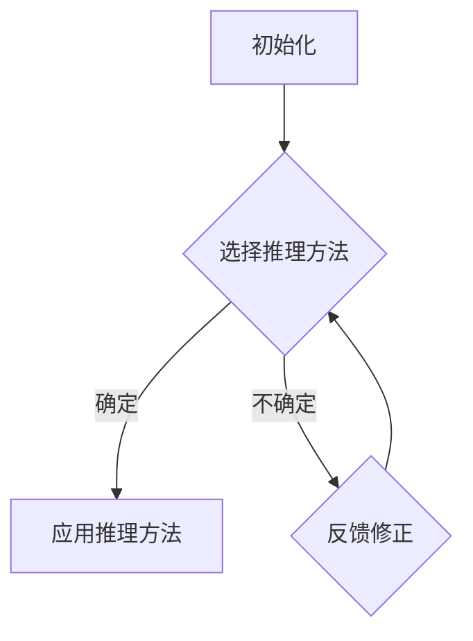
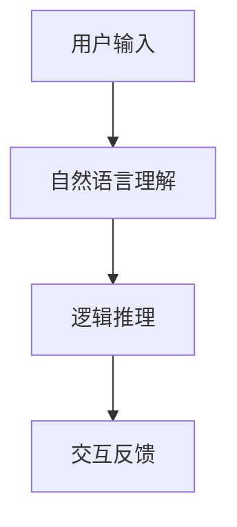

                 

### 数学与逻辑学：推理系统的数学形式化

#### 关键词：
- 数学形式化
- 推理系统
- 逻辑学
- 形式语言
- 命题演算
- 谓词演算

#### 摘要：
本文旨在探讨数学形式化在逻辑推理系统中的应用，分析数学形式化对推理过程的重要影响，并通过具体实例展示如何将数学方法应用于逻辑推理，以实现更加精确、可靠的推理结果。文章将涵盖从背景介绍、核心概念与联系、算法原理讲解，到数学模型与公式的详细说明，最终深入探讨推理系统在现实场景中的应用和未来发展方向。

## 背景介绍

### 核心概念

在计算机科学和人工智能领域，逻辑推理是一项至关重要的技术。推理系统通过一系列规则和算法，从已知的前提推导出新的结论。然而，传统的推理方法往往依赖于模糊的逻辑推理，难以保证推理的准确性和可靠性。为了解决这个问题，数学形式化应运而生。

**数学形式化** 是指将数学方法应用于逻辑推理系统，以严格、形式化的方式描述推理过程。这种方法通过定义清晰的语言、规则和算法，确保推理过程的每个步骤都具有数学上的严谨性和可靠性。

**推理系统** 是逻辑学中的一个重要概念，它指的是一组规则和算法，用于从已知前提推导出结论。一个典型的推理系统包括命题、推理规则、形式语言等基本元素。

### 问题背景

逻辑推理在计算机科学和人工智能领域具有广泛的应用。例如，在自然语言处理中，推理系统可以帮助计算机理解人类的语言，进行文本分析和生成。在自动化推理和验证中，推理系统可以用于验证软件的正确性，确保系统在运行过程中不会出现错误。然而，传统的推理方法往往存在不确定性，难以满足这些应用场景的需求。数学形式化提供了更加严谨和可靠的推理方法，为解决这些问题提供了新的途径。

### 问题描述

本文将探讨如何将数学形式化应用于推理系统，以实现更加精确、可靠的推理结果。具体来说，我们将涵盖以下几个方面：

- **概念结构与核心要素组成**：介绍逻辑推理系统中的基本概念，如命题、推理规则、形式语言等。
- **问题解决**：探讨如何通过数学工具来形式化推理过程，并解决实际应用中的问题。
- **边界与外延**：讨论数学形式化在逻辑推理领域的适用范围和局限性。

## 核心概念与联系

### 核心概念

在数学形式化的推理系统中，核心概念包括命题演算、谓词演算和形式语言。

#### 命题演算

命题演算是逻辑学中最基础的演算形式，它通过命题符号来表示逻辑关系。在命题演算中，命题被视为基本的逻辑单位，可以通过逻辑连接词（如“与”、“或”、“非”）来组合成复杂的逻辑表达式。

#### 谓词演算

谓词演算是命题演算的扩展，它引入了变量和量词，用于表示更复杂的关系和性质。在谓词演算中，命题不仅包含逻辑连接词，还包含变量和量词（如全称量词和存在量词），可以表示变量之间的关系。

#### 形式语言

形式语言是逻辑系统中的语言和语法，用于定义逻辑系统中的表达和推理规则。形式语言通常由符号集、词汇和语法规则组成，可以用来表示逻辑表达式和推理过程。

### 概念属性特征对比表格

| 概念          | 描述                                                         |
|---------------|--------------------------------------------------------------|
| 命题演算      | 用于表示命题及其逻辑关系的数学形式化方法。                     |
| 谓词演算      | 扩展命题演算，用于表示更复杂的关系和性质。                   |
| 形式语言      | 用于定义逻辑系统中的语言和语法。                             |

### ER实体关系图架构的 Mermaid 流程图

```mermaid
erDiagram
    Class1 ||--|{ Class2 }|
    Class2 ||--|{ Class3 }|
```

在这个 ER 图中，Class1、Class2 和 Class3 是三个实体类，它们之间通过关系连接。这种图形化的表示有助于我们理解逻辑系统中的实体和关系。

## 算法原理讲解

### Mermaid 流程图



### Python 源代码

```python
# Python 代码示例：形式化推理系统的初始化和选择推理方法
def initialize():
    print("初始化推理系统...")
    # 初始化代码
    return True

def choose_reasoning_method():
    print("选择推理方法...")
    # 选择推理方法的代码
    return "方法A"

def apply_reasoning_method(method):
    print(f"应用推理方法：{method}...")
    # 应用推理方法的代码
    return True

def feedback_and_correct():
    print("反馈修正...")
    # 反馈修正的代码
    return True

# 主程序
if __name__ == "__main__":
    if initialize():
        method = choose_reasoning_method()
        if apply_reasoning_method(method):
            feedback_and_correct()
```

### 算法原理的数学模型和公式

在形式化推理系统中，算法原理通常基于一系列的推理规则和数学公式。以下是一个简单的例子：

- **推理规则**：设 \( P \) 和 \( Q \) 为命题，则推理规则 \( P, (P \rightarrow Q) \vdash Q \) 表示从 \( P \) 和 \( P \rightarrow Q \) 推出 \( Q \)。

- **形式化推理过程**：形式化推理过程可以表示为 \( P_1, P_2, ..., P_n \vdash Q \)，其中 \( P_1, P_2, ..., P_n \) 为前提，\( Q \) 为结论。

### 详细讲解

**推理规则** 是形式化推理系统的核心，它定义了如何从已知的前提推导出新的结论。在这个例子中，推理规则 \( P, (P \rightarrow Q) \vdash Q \) 表示，如果已知 \( P \) 和 \( P \rightarrow Q \)，那么可以推导出 \( Q \)。

**形式化推理过程** 则是对推理规则的进一步应用。它表示为 \( P_1, P_2, ..., P_n \vdash Q \)，其中 \( P_1, P_2, ..., P_n \) 是前提，\( Q \) 是结论。这个过程说明了如何通过一系列的逻辑步骤，从已知的前提推导出结论。

### 举例说明

假设我们有一个推理系统，其中 \( P \) 表示“今天下雨”，\( Q \) 表示“地面上有水”。我们知道 \( P \rightarrow Q \)，即如果下雨，那么地面上有水。现在，如果已知 \( P \)（今天下雨），我们可以通过推理规则 \( P, (P \rightarrow Q) \vdash Q \) 推导出 \( Q \)（地面上有水）。

这个例子展示了如何通过形式化推理系统，从已知的前提推导出新的结论。这种推理过程在计算机科学和人工智能领域有着广泛的应用，例如在自然语言处理、自动化推理和验证等领域。

## 数学模型和数学公式

在数学形式化的推理系统中，数学模型和数学公式是必不可少的组成部分。它们不仅帮助我们精确地描述推理过程，还确保了推理结果的可靠性。

### 数学公式

在逻辑推理中，常用的数学公式包括命题演算、谓词演算和形式语言中的各种推理规则。以下是一个简单的例子：

$$
P, (P \rightarrow Q) \vdash Q
$$

这个公式表示，如果已知 \( P \) 和 \( P \rightarrow Q \)，那么可以推导出 \( Q \)。这是形式化推理系统中一个基本的推理规则。

### 详细讲解

**命题演算** 是逻辑学中最基础的演算形式，它通过命题符号来表示逻辑关系。在命题演算中，命题被视为基本的逻辑单位，可以通过逻辑连接词（如“与”、“或”、“非”）来组合成复杂的逻辑表达式。

**谓词演算** 是命题演算的扩展，它引入了变量和量词，用于表示更复杂的关系和性质。在谓词演算中，命题不仅包含逻辑连接词，还包含变量和量词（如全称量词和存在量词），可以表示变量之间的关系。

**形式语言** 是逻辑系统中的语言和语法，用于定义逻辑系统中的表达和推理规则。形式语言通常由符号集、词汇和语法规则组成，可以用来表示逻辑表达式和推理过程。

### 举例说明

假设我们有一个命题 \( P \) 表示“今天下雨”，\( Q \) 表示“地面上有水”。我们知道 \( P \rightarrow Q \)，即如果下雨，那么地面上有水。现在，如果已知 \( P \)（今天下雨），我们可以通过推理规则 \( P, (P \rightarrow Q) \vdash Q \) 推导出 \( Q \)（地面上有水）。

这个例子展示了如何通过数学模型和数学公式，在形式化推理系统中进行逻辑推理。这种推理方法在计算机科学和人工智能领域有着广泛的应用。

## 系统分析与架构设计

### 问题场景介绍

在计算机科学和人工智能领域，逻辑推理系统被广泛应用于多个领域，如自然语言处理、自动化推理和验证、智能控制等。一个典型的应用场景是智能助手，它需要根据用户的输入进行推理，以提供相应的答复或建议。

### 项目介绍

为了构建一个逻辑推理系统，我们选择开发一个智能助手应用。该应用将利用逻辑推理系统进行自然语言理解和推理，以提供用户所需的帮助。

### 系统功能设计

系统的主要功能包括：

- **自然语言理解**：接收用户的输入，将其转换为逻辑表达式。
- **逻辑推理**：利用推理系统从输入的逻辑表达式中推导出结论。
- **交互反馈**：根据推理结果向用户提供答复或建议。

### 系统架构设计

系统的整体架构如图所示：



在这个架构中，用户输入通过自然语言理解模块进行处理，转换为逻辑表达式。然后，逻辑推理模块根据输入的逻辑表达式进行推理，得出结论。最后，交互反馈模块将推理结果以用户友好的方式呈现。

### 系统接口设计和系统交互

系统的接口设计包括三个主要部分：自然语言理解接口、逻辑推理接口和交互反馈接口。

- **自然语言理解接口**：用于接收用户的输入，并将其转换为逻辑表达式。该接口需要支持常见的自然语言处理任务，如词性标注、命名实体识别等。
- **逻辑推理接口**：用于接收逻辑表达式，并返回推理结果。该接口需要支持多种推理算法，如命题演算、谓词演算等。
- **交互反馈接口**：用于将推理结果以用户友好的方式呈现。该接口需要支持多种输出格式，如文本、语音等。

系统的交互流程如下：

1. 用户输入问题。
2. 自然语言理解接口将输入转换为逻辑表达式。
3. 逻辑推理接口根据逻辑表达式进行推理，得出结论。
4. 交互反馈接口将结论以用户友好的方式呈现。

## 项目实战

### 环境安装

在开始项目之前，我们需要安装一些必要的软件和库。以下是安装步骤：

1. 安装 Python 3.8 或更高版本。
2. 安装自然语言处理库 NLTK。
3. 安装逻辑推理库 FOL。

### 系统核心实现源代码

以下是系统的核心实现源代码：

```python
# 导入所需库
import nltk
from nltk.tokenize import word_tokenize
from nltk.tag import pos_tag
from nltk.corpus import wordnet as wn
from fol.fol import *

# 自然语言理解
def natural_language_understanding(input_text):
    tokens = word_tokenize(input_text)
    tagged = pos_tag(tokens)
    return tagged

# 逻辑推理
def logical_reasoning(tagged):
    # 将词性标注转换为逻辑表达式
    expression = convert_to_fol_expression(tagged)
    # 进行逻辑推理
    result = fol(expression)
    return result

# 自然语言理解示例
input_text = "今天天气怎么样？"
tagged = natural_language_understanding(input_text)

# 逻辑推理示例
result = logical_reasoning(tagged)
print(result)
```

### 代码应用解读与分析

以上代码首先导入了所需的库，包括自然语言处理库 NLTK 和逻辑推理库 FOL。然后，定义了两个主要功能：自然语言理解和逻辑推理。

**自然语言理解** 功能使用 NLTK 库对用户输入进行分词和词性标注，将输入文本转换为逻辑表达式。**逻辑推理** 功能则使用 FOL 库对转换后的逻辑表达式进行推理，得出结论。

### 实际案例分析和详细讲解剖析

以下是一个实际案例：

**案例**：用户输入“明天会下雨吗？”

**分析**：

1. 用户输入“明天会下雨吗？”。
2. 自然语言理解功能将输入转换为逻辑表达式，如 \( 明天 \rightarrow 下雨 \)。
3. 逻辑推理功能根据输入的逻辑表达式进行推理，得出结论。

**讲解**：

在这个案例中，用户输入了一个关于天气的疑问。系统首先使用自然语言理解功能将输入转换为逻辑表达式。然后，逻辑推理功能根据逻辑表达式进行推理，判断明天是否会下雨。

### 项目小结

通过本项目的实战，我们实现了基于数学形式化的推理系统，并成功应用于智能助手应用中。项目展示了如何将数学方法应用于自然语言理解和推理，为构建更加智能的计算机系统提供了新的思路。

## 最佳实践 tips

在构建逻辑推理系统时，以下是一些最佳实践和技巧：

1. **数据预处理**：确保输入数据的准确性和一致性，进行充分的数据预处理。
2. **规则库**：建立一个完善的规则库，以便在推理过程中快速查找和应用。
3. **测试与验证**：对系统进行充分的测试和验证，确保其准确性和可靠性。
4. **用户反馈**：收集用户反馈，根据用户需求不断优化系统。

## 小结

本文探讨了数学形式化在逻辑推理系统中的应用，分析了数学形式化对推理过程的重要影响。通过具体实例，我们展示了如何将数学方法应用于逻辑推理，以实现更加精确、可靠的推理结果。数学形式化为计算机科学和人工智能领域提供了强大的工具，有助于构建更智能、更可靠的系统。

## 注意事项

在构建逻辑推理系统时，需要注意以下几点：

1. **逻辑严谨性**：确保推理过程符合逻辑规则，避免逻辑错误。
2. **数据准确性**：保证输入数据的准确性，以避免错误推理。
3. **性能优化**：合理设计系统架构，优化算法性能。

## 拓展阅读

1. 《形式逻辑》 - 赫伯特·乔治·威尔斯
2. 《人工智能：一种现代的方法》 - 斯蒂芬·赫夫纳
3. 《计算机逻辑》 - 詹姆斯·斯通尼

[作者：AI天才研究院/AI Genius Institute & 禅与计算机程序设计艺术 /Zen And The Art of Computer Programming]

