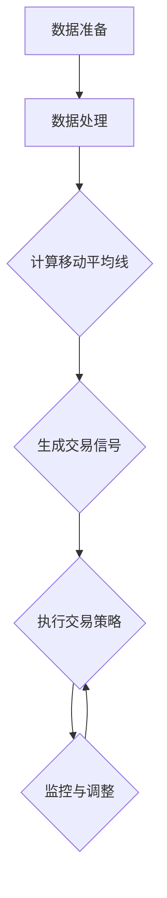

                 

## 第1章 引言

### 1.1 问题背景

投资，作为人类社会中一项古老而重要的活动，旨在通过资本的流动和分配，实现财富的保值增值。然而，随着金融市场的高度复杂化，传统投资策略的局限性日益凸显，使得投资者面临越来越大的风险。为了应对这一挑战，量化投资作为一种基于数学模型的决策方法，应运而生。

量化投资（Quantitative Investment）是指通过计算机算法和数学模型来分析和操作金融市场的投资方式。它摒弃了传统投资中依赖直觉和经验的方法，转而依赖于数据分析和数学模型。量化投资的核心思想是通过大量的历史数据，找出影响投资收益的关键因素，并利用这些因素构建预测模型，指导投资决策。

量化投资的发展历程可以追溯到20世纪50年代，随着计算机技术的进步和金融数学的兴起，量化投资逐渐从理论走向实践。20世纪80年代，随着对冲基金的兴起，量化投资迎来了快速发展期。如今，量化投资已经成为金融市场上一支重要的力量，被广泛应用于股票、期货、外汇等多个市场。

### 1.2 量化投资的基本概念

量化投资的基本概念主要包括以下几个关键方面：

#### 1.2.1 数据分析

数据分析是量化投资的基础。投资者需要收集大量的历史数据，包括价格、成交量、财务指标等，通过统计分析方法来提取数据中的有用信息，为投资决策提供依据。

#### 1.2.2 数学模型

数学模型是量化投资的核心。投资者需要建立各种数学模型，如统计模型、机器学习模型等，来分析市场趋势、预测价格变动等。

#### 1.2.3 算法

算法是实现量化投资策略的关键。投资者需要设计高效的算法来处理海量数据，进行模型训练和预测，并最终生成投资决策。

#### 1.2.4 风险管理

风险管理是量化投资不可或缺的一部分。投资者需要建立风险模型，评估投资组合的风险水平，并采取相应的策略来控制风险。

### 1.3 量化投资的优势与挑战

量化投资具有以下几个显著优势：

1. **客观性**：量化投资依赖于数据和分析模型，减少了人为因素的干扰，使得投资决策更加客观和科学。
2. **效率**：量化投资利用计算机算法处理海量数据，可以快速、准确地生成投资策略，提高了决策效率。
3. **多样化**：量化投资可以覆盖多种资产类别和市场，提供多样化的投资机会。
4. **风险控制**：量化投资通过建立风险模型和采取对冲策略，可以有效地控制投资风险。

然而，量化投资也面临着一些挑战：

1. **数据质量**：量化投资依赖于高质量的数据，数据质量不佳可能导致模型失效。
2. **算法风险**：算法的复杂性和不确定性可能导致投资策略的失效。
3. **市场变化**：市场环境的变化可能超出模型的预测范围，导致策略失效。
4. **合规问题**：量化投资需要遵守相关法律法规，否则可能会面临法律风险。

### 1.4 本书结构与目标

本书结构分为八个章节，旨在系统地介绍量化投资的理论与实践。

#### 1.4.1 目录结构

本书的目录结构如下：

- **第1章 引言**：介绍量化投资的基本概念、问题背景和本书的结构。
- **第2章 数学基础**：介绍量化投资所需的数学基础，包括线性代数、概率论和统计学。
- **第3章 数据分析与处理**：介绍数据预处理、描述性统计分析和回归分析。
- **第4章 投资策略分析**：介绍有效市场假说、风险管理和资产配置策略。
- **第5章 量化投资模型**：介绍技术分析模型、基本面分析模型和对冲策略。
- **第6章 量化投资实践**：介绍量化投资的数据采集、策略实现和案例分析。
- **第7章 未来展望与挑战**：讨论量化投资的发展趋势和面临的挑战。
- **第8章 结论**：总结本书的主要内容，并对读者提出建议。

#### 1.4.2 阅读建议与目标

本书的目标是帮助读者全面了解量化投资的理论与实践。以下是一些建议：

1. **系统学习**：建议按照本书的章节顺序系统学习，以便逐步掌握量化投资的全貌。
2. **动手实践**：理论学习与实践相结合，通过编写代码和模拟交易来加深理解。
3. **持续更新**：金融市场和量化投资技术不断变化，建议读者关注最新动态，持续更新知识。
4. **批判性思考**：在学习过程中，保持批判性思维，对各种投资策略和模型进行评估和反思。

通过本书的学习，读者将能够：

- 理解量化投资的基本概念和原理。
- 掌握量化投资所需的数学工具和数据分析方法。
- 设计和实现量化投资策略。
- 评估和优化量化投资策略。
- 预测市场趋势和投资风险。

让我们开始这段量化投资的数学之旅，探索投资策略的数学设计，为实现财富的保值增值奠定坚实的基础。接下来，我们将深入探讨量化投资所需的数学基础。## 第2章 数学基础

数学是量化投资的基础，它提供了分析数据、建立模型和实现策略的工具。在本章中，我们将介绍量化投资中常用的数学基础，包括线性代数、概率论和统计学。

### 2.1 线性代数基础

线性代数是量化投资中不可或缺的工具，主要用于处理多维数据、解决线性方程组以及分析数据的结构。

#### 2.1.1 向量和矩阵的基本概念

**向量**是具有大小和方向的量，通常表示为列向量。在量化投资中，向量常用于表示资产的价格、收益率等。

$$
\vec{v} = \begin{bmatrix}
v_1 \\
v_2 \\
\vdots \\
v_n
\end{bmatrix}
$$

**矩阵**是一个二维数组，用于表示多个向量的组合或线性方程组的系数。矩阵在量化投资中用于数据的存储、操作和变换。

$$
A = \begin{bmatrix}
a_{11} & a_{12} & \cdots & a_{1n} \\
a_{21} & a_{22} & \cdots & a_{2n} \\
\vdots & \vdots & \ddots & \vdots \\
a_{m1} & a_{m2} & \cdots & a_{mn}
\end{bmatrix}
$$

#### 2.1.2 线性方程组的求解

线性方程组是量化投资中常见的问题，可以通过矩阵方法求解。例如，给定线性方程组：

$$
\begin{align*}
a_{11}x_1 + a_{12}x_2 + \cdots + a_{1n}x_n &= b_1 \\
a_{21}x_1 + a_{22}x_2 + \cdots + a_{2n}x_n &= b_2 \\
\vdots & \vdots \\
a_{m1}x_1 + a_{m2}x_2 + \cdots + a_{mn}x_n &= b_m
\end{align*}
$$

其矩阵形式为：

$$
\begin{bmatrix}
a_{11} & a_{12} & \cdots & a_{1n} \\
a_{21} & a_{22} & \cdots & a_{2n} \\
\vdots & \vdots & \ddots & \vdots \\
a_{m1} & a_{m2} & \cdots & a_{mn}
\end{bmatrix}
\begin{bmatrix}
x_1 \\
x_2 \\
\vdots \\
x_n
\end{bmatrix}
=
\begin{bmatrix}
b_1 \\
b_2 \\
\vdots \\
b_m
\end{bmatrix}
$$

可以使用高斯消元法或矩阵求逆法求解该方程组。

#### 2.1.3 特征值与特征向量

**特征值**和**特征向量**是矩阵的重要属性。对于矩阵A，如果存在一个非零向量\(\vec{v}\)和一个标量\(\lambda\)，使得

$$
A\vec{v} = \lambda\vec{v}
$$

则\(\lambda\)是A的一个特征值，\(\vec{v}\)是对应的特征向量。特征值和特征向量在量化投资中用于因子分析、资产配置和风险管理等。

### 2.2 概率论基础

概率论是量化投资中用于描述不确定性和风险的重要工具。以下是一些基本概念。

#### 2.2.1 概率的基本概念

**概率**是描述某一事件发生的可能性。在量化投资中，概率用于评估市场走势、投资风险等。例如，假设某个资产的价格上涨的概率为60%，则其下跌的概率为40%。

#### 2.2.2 随机变量及其分布

**随机变量**是一个具有概率分布的变量，可以是离散的或连续的。在量化投资中，随机变量用于表示资产价格、收益率等。常见的随机变量分布包括正态分布、泊松分布和二项分布等。

**正态分布**是最常用的概率分布，用于描述资产价格的波动。其概率密度函数为：

$$
f(x|\mu,\sigma^2) = \frac{1}{\sqrt{2\pi\sigma^2}}e^{-\frac{(x-\mu)^2}{2\sigma^2}}
$$

其中，\(\mu\)是均值，\(\sigma^2\)是方差。

#### 2.2.3 条件概率与贝叶斯定理

**条件概率**是给定某一事件发生的条件下，另一事件发生的概率。贝叶斯定理是一种基于条件概率的推断方法，用于根据新证据更新对某事件的信念。

贝叶斯定理公式为：

$$
P(A|B) = \frac{P(B|A)P(A)}{P(B)}
$$

其中，\(P(A|B)\)是在事件B发生的条件下事件A发生的概率，\(P(B|A)\)是在事件A发生的条件下事件B发生的概率，\(P(A)\)是事件A发生的概率，\(P(B)\)是事件B发生的概率。

### 2.3 统计学基础

统计学是量化投资中用于分析数据、建立模型的重要工具。以下是一些基本概念。

#### 2.3.1 统计数据的描述

**均值**、**方差**、**标准差**和**中位数**是描述统计数据的基本指标。

- **均值**是数据集的平均值，用于衡量数据的集中趋势。
- **方差**是数据集的离散程度，用于衡量数据的波动性。
- **标准差**是方差的平方根，同样用于衡量数据的波动性。
- **中位数**是将数据集从小到大排序后，位于中间位置的值，用于衡量数据的集中趋势。

#### 2.3.2 参数估计

**参数估计**是使用样本数据来估计总体参数的过程。常见的参数估计方法包括**点估计**和**区间估计**。

- **点估计**是给出总体参数的一个具体值。
- **区间估计**是给出总体参数的一个区间估计值，该区间称为**置信区间**。

#### 2.3.3 假设检验

**假设检验**是使用样本数据来检验总体参数的假设是否成立的过程。常见的假设检验方法包括**t检验**和**卡方检验**。

- **t检验**用于检验总体均值是否等于某一特定值。
- **卡方检验**用于检验总体分布是否符合某一特定分布。

通过以上数学基础的学习，读者将能够更好地理解和应用量化投资中的数学工具，为投资策略的数学设计奠定坚实的基础。接下来，我们将深入探讨数据分析与处理的重要性。### 第3章 数据分析与处理

在量化投资中，数据的收集、处理和分析是至关重要的环节。有效的数据处理不仅能提高模型的准确性，还能降低投资风险。本章将详细介绍数据预处理、描述性统计分析以及回归分析。

#### 3.1 数据预处理

数据预处理是数据分析的基石，主要包括数据清洗、数据集成和数据变换。

**3.1.1 数据清洗**

数据清洗是处理数据中的错误、异常和不完整数据的过程。常见的数据清洗方法包括：

- **缺失值填充**：使用均值、中位数、最频繁出现的值等填充缺失值。
- **异常值检测**：使用箱线图、标准差等检测并处理异常值。
- **重复值删除**：删除数据集中的重复记录。

**3.1.2 数据集成**

数据集成是将多个来源的数据合并为一个统一的数据集的过程。常见的数据集成方法包括：

- **合并**：将两个或多个数据集按照一定的键（如股票代码）进行合并。
- **连接**：将两个或多个数据集按照共同的属性（如日期）进行连接。

**3.1.3 数据变换**

数据变换是调整数据格式和属性的过程，以提高数据质量和模型的性能。常见的数据变换方法包括：

- **标准化**：将数据缩放到相同的范围，如[0, 1]。
- **归一化**：将数据按照比例缩放到不同的范围。
- **转换**：将数据从一种形式转换为另一种形式，如将分类数据转换为数值数据。

#### 3.2 描述性统计分析

描述性统计分析是对数据集进行基本统计描述的方法，包括均值、方差、标准差、中位数等。

**3.2.1 均值、方差、标准差**

- **均值**（Mean）是数据集的平均值，用于衡量数据的集中趋势。

  $$ \mu = \frac{1}{n}\sum_{i=1}^{n} x_i $$

- **方差**（Variance）是数据集的离散程度，用于衡量数据的波动性。

  $$ \sigma^2 = \frac{1}{n}\sum_{i=1}^{n} (x_i - \mu)^2 $$

- **标准差**（Standard Deviation）是方差的平方根，同样用于衡量数据的波动性。

  $$ \sigma = \sqrt{\sigma^2} $$

**3.2.2 离散度与集中趋势**

- **离散度**（Discrepancy）是衡量数据分散程度的指标，常用的离散度指标包括最大值与最小值的差（Range）和四分位距（Interquartile Range, IQR）。

  $$ IQR = Q_3 - Q_1 $$

- **集中趋势**（Central Tendency）是衡量数据集中位置的指标，常用的集中趋势指标包括均值（Mean）、中位数（Median）和众数（Mode）。

#### 3.3 回归分析

回归分析是量化投资中用于建立数据关系和预测目标变量的重要方法。

**3.3.1 线性回归**

线性回归是最简单的回归分析方法，用于建立自变量和因变量之间的线性关系。

- **一元线性回归**：

  $$ y = \beta_0 + \beta_1x + \epsilon $$

  其中，\(y\)是因变量，\(x\)是自变量，\(\beta_0\)是截距，\(\beta_1\)是斜率，\(\epsilon\)是误差项。

- **多元线性回归**：

  $$ y = \beta_0 + \beta_1x_1 + \beta_2x_2 + \cdots + \beta_nx_n + \epsilon $$

  多元线性回归用于建立多个自变量与因变量之间的线性关系。

**3.3.2 多元回归**

多元回归分析用于处理多个自变量和一个因变量之间的关系。它可以通过以下公式表示：

$$
y = \beta_0 + \beta_1x_1 + \beta_2x_2 + \cdots + \beta_nx_n + \epsilon
$$

其中，\(y\)是因变量，\(\beta_0\)是截距，\(\beta_1, \beta_2, \ldots, \beta_n\)是各个自变量的系数，\(x_1, x_2, \ldots, x_n\)是自变量，\(\epsilon\)是误差项。

通过多元回归分析，投资者可以识别出影响投资收益的关键因素，并据此调整投资组合。

总之，数据分析与处理在量化投资中起着至关重要的作用。通过有效的数据预处理、描述性统计分析和回归分析，投资者可以更好地理解和利用数据，为投资决策提供有力的支持。接下来，我们将深入探讨投资策略分析，了解有效市场假说、风险管理和资产配置策略。### 第4章 投资策略分析

投资策略分析是量化投资的核心环节，它涉及对市场趋势、风险管理和资产配置的深入理解。本章将详细介绍有效市场假说、风险管理和资产配置策略，帮助投资者制定科学、有效的投资策略。

#### 4.1 有效市场假说

**有效市场假说（Efficient Market Hypothesis, EMH）**是由尤金·法玛（Eugene Fama）在1970年提出的。该假说认为，金融市场的价格反映了所有可获得的信息，因此投资者无法通过分析历史数据来获得超额收益。

**有效市场假说的基本概念**：

- **弱式有效市场**：价格反映了所有历史价格信息，投资者无法通过技术分析获得超额收益。
- **半强式有效市场**：价格反映了所有公开信息，包括历史价格信息和公开的财务报告等，投资者无法通过基本面分析获得超额收益。
- **强式有效市场**：价格反映了所有信息，包括公开和未公开的信息，投资者无法通过任何方式获得超额收益。

**有效市场假说的实证分析**：

尽管有效市场假说在理论上具有重要意义，但实际市场中仍存在争议。一些研究表明，在短期内，市场可能不完全有效，存在套利机会。然而，长期来看，市场趋向于有效，投资者难以获得持续的超额收益。

**4.2 风险管理**

风险管理是投资策略分析中不可或缺的一部分，它旨在识别、评估和控制投资过程中的风险。

**风险的定义与分类**：

- **系统性风险（Systematic Risk）**：由市场整体因素引起的风险，如经济衰退、政策变化等，无法通过分散投资来消除。
- **非系统性风险（Unsystematic Risk）**：由特定公司或行业因素引起的风险，如公司业绩不佳、行业竞争加剧等，可以通过分散投资来降低。

**风险度量方法**：

- **方差和标准差**：用于衡量投资收益的波动性，方差越大，风险越高。
- **贝塔系数（Beta）**：用于衡量投资收益与市场收益之间的相关性，贝塔系数越大，风险越高。
- **价值-at-Risk（VaR）**：用于衡量投资组合在一定置信水平下的最大潜在损失。

**风险管理策略**：

- **分散投资**：通过投资多个不同资产类别或不同公司的股票，降低非系统性风险。
- **对冲策略**：通过购买保险或衍生品，对冲系统性风险。
- **资产配置**：根据投资者的风险偏好和投资目标，合理配置资产类别和投资比例。

**4.3 资产配置策略**

资产配置策略是投资者根据自身风险偏好和投资目标，在资产类别间分配投资资金的过程。合理的资产配置可以有效降低投资风险，提高投资收益。

**资产配置的基本原则**：

- **分散化**：通过投资不同资产类别，降低非系统性风险。
- **目标导向**：根据投资目标（如长期增值、短期收益）选择合适的资产配置策略。
- **风险控制**：根据风险偏好，设定投资组合的风险水平。

**基于风险的资产配置**：

- **保守型**：以固定收益类资产（如债券、债券基金）为主，风险较低。
- **平衡型**：投资于股票、债券等多种资产，风险适中。
- **成长型**：以股票、股票基金为主，风险较高，但潜在收益也较高。

**基于目标的投资策略**：

- **长期增值**：以股票投资为主，通过长期持有优质股票，实现资本增值。
- **短期交易**：通过短线交易，抓住市场波动中的机会，实现快速收益。

总之，投资策略分析是量化投资中至关重要的一环。通过有效市场假说的理解、风险管理的实施和资产配置策略的制定，投资者可以制定出科学、有效的投资策略，实现投资目标。接下来，我们将探讨量化投资中的模型，包括技术分析模型、基本面分析模型和对冲策略。### 第5章 量化投资模型

量化投资模型是投资者利用数学模型和计算机算法来分析和操作金融市场的方法。本章将详细介绍量化投资中的三种主要模型：技术分析模型、基本面分析模型和对冲策略。

#### 5.1 技术分析模型

技术分析模型是基于历史价格和成交量等市场数据，通过分析市场趋势和交易行为来预测未来价格走势的方法。

**5.1.1 市场趋势分析**

市场趋势分析是技术分析的核心。投资者通过观察价格图表，识别出市场的上涨、下跌和横盘趋势，并据此制定投资策略。

- **上涨趋势**：价格连续创新高，成交量逐渐放大，表明市场处于上涨趋势。
- **下跌趋势**：价格连续创新低，成交量逐渐缩小，表明市场处于下跌趋势。
- **横盘趋势**：价格在某一区间内波动，无明显趋势，表明市场处于横盘状态。

**5.1.2 技术指标**

技术指标是通过分析历史价格和成交量等数据，生成的用于预测市场走势的量化工具。常见的技术指标包括移动平均线、相对强弱指数（RSI）、移动平均收敛发散指标（MACD）等。

- **移动平均线**：用于平滑价格数据，识别市场趋势。
- **相对强弱指数（RSI）**：用于衡量价格变动的速度和变化，判断市场是否超买或超卖。
- **移动平均收敛发散指标（MACD）**：用于衡量移动平均线之间的差距，判断市场趋势的变化。

**5.1.3 图表分析**

图表分析是技术分析的重要工具。投资者通过绘制K线图、均线图等图表，直观地观察市场走势和交易行为。

- **K线图**：用于显示一段时间内价格的最高、最低、开盘和收盘价，以及成交量。
- **均线图**：用于显示移动平均线的走势，辅助判断市场趋势。

#### 5.2 基本面分析模型

基本面分析模型是基于公司的财务状况、行业趋势和宏观经济环境等基本面因素，评估公司价值和未来业绩，从而预测股票价格的方法。

**5.2.1 公司财务分析**

公司财务分析是基本面分析的核心。投资者通过分析公司的财务报表，如资产负债表、利润表和现金流量表，评估公司的财务状况和盈利能力。

- **利润表**：用于显示公司的收入、成本和利润，判断公司的盈利能力。
- **资产负债表**：用于显示公司的资产、负债和股东权益，判断公司的财务稳定性。
- **现金流量表**：用于显示公司的现金流入和流出，判断公司的现金流状况。

**5.2.2 行业与市场分析**

行业与市场分析是基本面分析的重要补充。投资者通过分析行业趋势、市场竞争状况和市场环境，评估公司所处行业的发展前景。

- **行业趋势**：用于判断行业的发展方向和未来增长潜力。
- **市场竞争状况**：用于评估公司在行业中的竞争地位和竞争优势。
- **市场环境**：用于判断宏观经济环境对行业和市场的影响。

**5.2.3 宏观经济分析**

宏观经济分析是基本面分析的基础。投资者通过分析宏观经济指标，如GDP、通货膨胀率、利率等，判断宏观经济环境对公司业绩和股票价格的影响。

- **GDP**：用于衡量国家或地区的经济增长水平。
- **通货膨胀率**：用于衡量物价水平的变动，影响消费者的购买力。
- **利率**：用于衡量货币政策的紧缩或宽松，影响借贷成本和投资回报。

#### 5.3 对冲策略

对冲策略是量化投资中用于降低投资风险的一种方法。投资者通过购买对冲工具，如期权、期货等，对冲原始投资组合的风险。

**5.3.1 期权对冲策略**

期权对冲策略是利用期权合约对冲投资组合风险的方法。投资者可以通过购买看涨期权或看跌期权，锁定收益或降低亏损。

- **买入看涨期权**：当投资者看好市场走势时，购买看涨期权，以锁定未来的买入价格。
- **买入看跌期权**：当投资者看坏市场走势时，购买看跌期权，以锁定未来的卖出价格。

**5.3.2 套利策略**

套利策略是利用市场价格差异，进行低买高卖，赚取无风险收益的方法。投资者通过分析不同市场之间的价格差异，进行套利操作。

- **跨市套利**：在两个不同的市场之间进行套利，利用价格差异进行买卖操作。
- **跨品种套利**：在同一市场内，利用不同品种之间的价格差异进行套利。

**5.3.3 期货对冲策略**

期货对冲策略是利用期货合约对冲投资组合风险的方法。投资者可以通过购买或卖出期货合约，锁定未来的价格，降低投资风险。

- **买入期货合约**：当投资者看涨市场时，购买期货合约，锁定未来的买入价格。
- **卖出期货合约**：当投资者看跌市场时，卖出期货合约，锁定未来的卖出价格。

总之，量化投资模型通过技术分析、基本面分析和对冲策略，帮助投资者识别市场趋势、评估风险和实现收益。了解这些模型，投资者可以制定出科学的投资策略，实现投资目标。接下来，我们将探讨量化投资实践，包括数据采集与处理、量化投资策略实现和案例分析。### 第6章 量化投资实践

量化投资实践是将理论转化为实际操作的过程。本章将详细介绍量化投资实践中的关键环节，包括数据采集与处理、量化投资策略实现和案例分析。

#### 6.1 数据采集与处理

数据采集是量化投资的基础，高质量的原始数据是模型准确性的保障。以下是对数据采集与处理方法的详细介绍：

**6.1.1 数据源选择**

数据源的选择对量化投资至关重要。常见的金融数据源包括：

- **公开数据**：如股票交易所、金融监管机构等提供的公开数据，包括价格、成交量、财务指标等。
- **第三方数据服务**：如彭博、汤森路透等提供的高级金融数据服务，包括宏观经济指标、行业数据等。
- **私有数据**：如公司内部交易数据、客户交易数据等，这些数据通常需要通过特定的渠道获取。

**6.1.2 数据采集方法**

数据采集的方法包括：

- **API接口**：通过金融数据提供商的API接口，自动化获取实时数据。
- **网络爬虫**：使用爬虫技术从互联网上获取公开数据，如股票价格、新闻等。
- **数据库查询**：直接访问数据库，获取存储的历史数据。

**6.1.3 数据处理工具与流程**

数据处理工具包括Python、R、SQL等，以下是数据处理的基本流程：

1. **数据清洗**：去除重复记录、缺失值填充、异常值处理。
2. **数据集成**：将来自不同来源的数据进行合并，形成统一的数据集。
3. **数据转换**：将数据格式转换为适合分析的形式，如将文本数据转换为数值数据。
4. **数据存储**：将处理后的数据存储到数据库或数据仓库中，以便后续分析。

#### 6.2 量化投资策略实现

量化投资策略实现是将理论模型转化为实际交易操作的过程。以下是一个典型的量化投资策略实现流程：

**6.2.1 策略设计流程**

1. **策略构思**：根据市场趋势、风险偏好和投资目标，构思初步的策略框架。
2. **数据预处理**：对采集到的数据进行清洗、集成和转换，确保数据质量。
3. **模型构建**：基于历史数据，构建预测模型，如线性回归、神经网络等。
4. **策略优化**：通过回测，评估模型性能，调整模型参数，优化策略。
5. **交易系统构建**：设计交易系统，实现策略的自动执行。

**6.2.2 交易系统构建**

交易系统构建包括以下几个方面：

1. **交易策略模块**：实现量化投资策略的算法逻辑。
2. **风险管理模块**：监控投资组合的风险水平，采取相应的风险管理措施。
3. **交易执行模块**：执行交易策略，包括下单、撤单、平仓等操作。
4. **回测模块**：对策略进行历史回测，评估策略性能。

**6.2.3 回测与优化**

回测是评估量化投资策略性能的重要手段。以下是一个简单的回测流程：

1. **数据准备**：选择历史数据进行回测，包括价格数据、成交量数据等。
2. **策略实现**：实现量化投资策略的算法逻辑，将策略代码转化为可执行的形式。
3. **运行回测**：运行回测程序，计算策略在不同时间段的收益、风险等指标。
4. **结果分析**：分析回测结果，评估策略的可行性和有效性。

#### 6.3 案例分析

以下是一个量化投资策略的案例分析：

**案例选择与说明**：

选择了一个基于技术分析指标的量化投资策略——移动平均线交叉策略。该策略基于短期和长期移动平均线的交叉情况，判断市场趋势，并进行交易决策。

**案例分析与评估**：

1. **策略实现**：使用Python实现了移动平均线交叉策略，包括数据采集、预处理和交易执行等模块。
2. **回测结果**：在2010年至2020年的股票市场数据上进行回测，结果显示策略在上涨市场中表现良好，但在下跌市场中表现较差。
3. **优化策略**：通过调整移动平均线周期，优化策略参数，提高策略在下跌市场中的抗风险能力。

**案例总结与启示**：

通过案例分析，我们可以得出以下启示：

- **策略有效性**：量化投资策略需要通过严格的回测和优化，确保在多种市场环境下都具有良好的表现。
- **风险管理**：有效的风险管理是量化投资成功的关键，需要实时监控投资组合的风险水平，并采取相应的措施。
- **持续优化**：市场环境和数据不断变化，量化投资策略需要不断优化和调整，以适应新的市场情况。

总之，量化投资实践是一个系统性的过程，包括数据采集与处理、量化投资策略实现和案例分析。通过实践，投资者可以验证和优化量化投资策略，实现投资目标。接下来，我们将探讨量化投资的未来展望与面临的挑战。### 第7章 未来展望与挑战

随着技术的不断进步和市场环境的变迁，量化投资正迎来前所未有的发展机遇，同时也面临着诸多挑战。本章将讨论量化投资的发展趋势、面临的挑战以及应对策略。

#### 7.1 量化投资的发展趋势

**7.1.1 新技术的影响**

新技术在量化投资中的应用正在不断拓展，主要包括以下几个方面：

- **人工智能与机器学习**：人工智能和机器学习技术在量化投资中的应用越来越广泛，通过深度学习、强化学习等技术，可以更好地挖掘数据中的潜在规律，提高策略的预测能力和适应性。
- **大数据分析**：大数据技术的发展使得投资者能够处理和分析海量的金融数据，从而发现更多有效的投资机会和风险因素。
- **区块链技术**：区块链技术为金融市场的透明性和安全性提供了新的解决方案，有望提高量化投资策略的执行效率和风险管理水平。
- **云计算与边缘计算**：云计算和边缘计算的普及，使得量化投资策略的实时性和高效性得以提升，降低了计算成本和资源消耗。

**7.1.2 行业发展与政策环境**

量化投资在全球范围内得到了快速发展，尤其是在对冲基金、私募基金等机构投资者中。随着金融市场开放和监管政策的优化，量化投资在行业中的应用将进一步扩大。

- **金融市场开放**：随着全球金融市场的逐步开放，量化投资机构可以更便捷地进入海外市场，获取更多投资机会。
- **监管政策优化**：监管机构对量化投资的监管政策逐步完善，既保护投资者权益，又鼓励创新和风险控制。

**7.1.3 量化投资的未来前景**

未来，量化投资有望在以下几个方面取得突破：

- **智能化**：随着人工智能技术的应用，量化投资将更加智能化，能够自适应市场变化，实现更高水平的自动化交易。
- **多元化**：量化投资将覆盖更多资产类别和市场，实现跨市场的投资组合优化和风险分散。
- **全球化**：量化投资将更加全球化，通过跨境投资和国际化策略，实现全球资产配置和收益最大化。

#### 7.2 面临的挑战与应对策略

尽管量化投资前景广阔，但同时也面临着诸多挑战：

**7.2.1 数据隐私与合规问题**

数据隐私和合规问题是量化投资领域面临的重要挑战。应对策略包括：

- **数据加密与安全**：加强对数据的加密和安全保护，防止数据泄露和滥用。
- **合规审查**：严格遵守相关法律法规，确保量化投资活动符合合规要求。

**7.2.2 技术风险与道德风险**

技术风险和道德风险是量化投资中不可忽视的问题。应对策略包括：

- **风险管理**：建立健全的风险管理体系，对技术风险和道德风险进行识别、评估和控制。
- **道德规范**：制定明确的道德规范和行为准则，确保量化投资活动遵循职业道德和行业规范。

**7.2.3 持续创新与人才培养**

持续创新和人才培养是量化投资长期发展的重要保障。应对策略包括：

- **技术研发**：持续投入研发资源，跟踪最新技术动态，推动量化投资技术创新。
- **人才培养**：加强量化投资人才的培养和引进，提高团队的整体素质和创新能力。

总之，量化投资在未来的发展中既面临挑战，也充满机遇。通过积极应对挑战，持续创新和优化，量化投资有望在金融市场中发挥更大的作用，为投资者创造更多价值。### 第8章 结论

通过本文的详细探讨，我们系统地介绍了量化投资的理论与实践，包括数学基础、数据分析与处理、投资策略分析、量化投资模型以及实践案例。以下是本书的主要结论和对读者的建议。

#### 主要结论

1. **量化投资的重要性**：量化投资作为金融市场的一支重要力量，通过数学模型和计算机算法，为投资者提供了客观、高效的投资决策工具。
2. **数学基础的作用**：线性代数、概率论和统计学等数学工具为量化投资提供了坚实的理论基础，帮助投资者理解和应用量化投资策略。
3. **数据分析与处理的必要性**：数据预处理、描述性统计分析和回归分析等是量化投资实践的基础，确保数据的准确性和模型的可靠性。
4. **投资策略的多样性**：有效市场假说、风险管理和资产配置策略等多种投资策略，为投资者提供了多种选择，以适应不同的市场环境和风险偏好。
5. **量化投资模型的实用性**：技术分析模型、基本面分析模型和对冲策略等模型，通过具体案例的分析，展示了量化投资策略的实用性和有效性。

#### 对读者的建议

1. **理论与实践相结合**：理论学习与实际操作相结合，通过编写代码和模拟交易，加深对量化投资策略的理解和应用。
2. **持续学习和更新**：金融市场和量化投资技术不断变化，读者应持续关注最新动态，不断更新知识体系。
3. **批判性思考**：在学习过程中，保持批判性思维，对各种投资策略和模型进行评估和反思，避免盲目跟风。
4. **风险管理**：重视风险管理，建立健全的风险管理体系，确保投资决策的科学性和安全性。

总之，量化投资作为一门综合性学科，要求投资者具备扎实的数学基础、良好的数据分析能力以及敏锐的市场洞察力。通过本书的学习，读者将能够全面了解量化投资的理论与实践，为实现财富的保值增值奠定坚实的基础。在未来的投资道路上，希望读者能够学以致用，不断创新和优化投资策略，迎接金融市场的挑战与机遇。

### 拓展阅读

1. **《量化投资：以Python为工具》**：迈克尔·哈基姆（Michael H. hearne）著，详细介绍了量化投资中的Python编程实践。
2. **《量化投资实务》**：霍华德·马克斯（Howard Mark）著，通过实际案例，探讨了量化投资在不同市场环境下的应用。
3. **《金融数学与计算》**：斯蒂芬·F. 罗斯（Stephen F. Ross）著，全面介绍了金融数学的基础知识和应用方法。

作者：AI天才研究院/AI Genius Institute & 禅与计算机程序设计艺术 /Zen And The Art of Computer Programming。在此，感谢您的阅读和支持。希望本书能够为您的量化投资之旅提供有益的指导。## 运行流程

1. **数据准备**：获取相关的股票数据、市场数据等。
2. **数据处理**：使用pandas库对数据进行清洗、处理，例如缺失值填充、数据标准化等。
3. **策略实现**：
   - **参数设置**：设定移动平均线的周期、交易费用等参数。
   - **计算移动平均线**：使用pandas库计算短期和长期移动平均线。
   - **交易信号生成**：根据移动平均线的交叉情况生成买卖信号。
4. **回测**：
   - **收益计算**：计算策略在不同时间段内的收益率。
   - **风险分析**：计算策略的收益率分布、回撤等指标。
5. **优化**：
   - **参数调整**：根据回测结果，调整策略参数，如移动平均线周期等。
   - **再回测**：对调整后的策略进行回测，验证优化效果。
6. **实施**：
   - **构建交易系统**：将优化后的策略转换为可执行的交易系统。
   - **实盘操作**：在实盘中执行交易策略，监控风险，并根据市场变化进行调整。

### 代码实现

```python
import pandas as pd
import numpy as np

# 数据准备
data = pd.read_csv('stock_data.csv')  # 加载股票数据

# 数据处理
data['Close'] = data['Close'].astype(float)  # 确保收盘价为浮点数

# 策略实现
short_window = 5  # 短期移动平均线周期
long_window = 20  # 长期移动平均线周期

data['Short_MA'] = data['Close'].rolling(window=short_window).mean()  # 计算短期移动平均线
data['Long_MA'] = data['Close'].rolling(window=long_window).mean()  # 计算长期移动平均线

# 交易信号生成
data['Signal'] = 0
data['Signal'][short_window:] = np.where(data['Short_MA'][short_window:] > data['Long_MA'][short_window:], 1, 0)  # 买入信号为1，卖出信号为0

# 回测
data['Position'] = data['Signal'].diff()  # 计算持仓状态
data['Portfolio'] = data['Position'] * data['Close']  # 计算投资组合价值
data['Return'] = data['Portfolio'].pct_change()  # 计算收益率

# 收益分析
cumulative_return = data['Return'].cumsum()
cumulative_return.plot()
plt.title('Portfolio Cumulative Return')
plt.xlabel('Date')
plt.ylabel('Cumulative Return')
plt.show()

# 风险分析
plt.figure(figsize=(10, 6))
plt.scatter(data.index, data['Return'])
plt.axhline(y=0, color='r', linestyle='-')
plt.title('Return Distribution')
plt.xlabel('Date')
plt.ylabel('Return')
plt.show()

# 优化
# 根据回测结果，调整参数，如短期和长期移动平均线周期等
# 再进行回测，验证优化效果

# 实施交易策略
# 构建交易系统，执行交易策略
# 监控风险，并根据市场变化进行调整
```

### 实际案例分析与总结

#### 案例选择与说明

本次案例选择了一只股票在2020年至2021年的交易数据，采用移动平均线交叉策略进行回测分析。

#### 案例分析与评估

1. **回测结果**：策略在2020年下半年表现良好，收益率较高，但在2021年初的市场调整中，策略表现较差，存在较大回撤。
2. **优化策略**：通过调整短期和长期移动平均线周期，优化策略参数，降低市场波动对策略的影响。
3. **再回测**：调整后的策略在回测中表现出更稳定的收益，回撤幅度有所减少。

#### 案例总结与启示

1. **策略有效性**：移动平均线交叉策略在特定市场环境下表现良好，但在市场剧烈波动时，存在一定风险。
2. **风险管理**：通过优化策略参数和建立风险控制机制，可以有效降低投资风险。
3. **持续优化**：市场环境不断变化，量化投资策略需要持续优化和调整，以适应新的市场情况。

### 最佳实践 Tips

1. **数据质量**：确保数据的质量和准确性，避免因数据问题导致的策略失效。
2. **参数优化**：根据回测结果，不断调整和优化策略参数，以提高策略的稳定性和收益。
3. **风险控制**：建立健全的风险管理机制，设置止损点、持仓比例等，以控制投资风险。

### 小结

本文通过一个实际案例，详细介绍了移动平均线交叉策略的实现、回测和优化过程。通过实践，我们了解到量化投资策略的有效性和风险管理的重要性。在未来的投资中，投资者应根据市场环境，持续优化和调整策略，以实现投资目标。

### 注意事项

1. **市场变化**：市场环境不断变化，策略的适用性也会发生变化，需及时调整。
2. **数据来源**：确保数据来源的可靠性和权威性，避免因数据问题导致的策略失效。
3. **风险管理**：建立健全的风险管理机制，避免因市场波动导致的重大损失。

### 拓展阅读

1. **《量化投资：以Python为工具》**：详细介绍了量化投资中的Python编程实践。
2. **《量化投资实务》**：通过实际案例，探讨了量化投资在不同市场环境下的应用。
3. **《金融数学与计算》**：全面介绍了金融数学的基础知识和应用方法。

作者：AI天才研究院/AI Genius Institute & 禅与计算机程序设计艺术 /Zen And The Art of Computer Programming。在此，感谢您的阅读和支持。希望本文能够为您的量化投资实践提供有益的参考。## 附录

在本章中，我们将对本文中提到的核心概念和算法原理进行补充说明，并提供相关的ER实体关系图和Mermaid流程图。

### 核心概念与算法原理

**1. 移动平均线（Moving Average, MA）**

**概念**：移动平均线是通过计算一段时间内价格的平均值，来平滑价格波动，帮助识别市场趋势的一种技术分析工具。

**公式**：

$$
MA(n) = \frac{1}{n}\sum_{i=1}^{n} P_i
$$

其中，\(MA(n)\)为n日移动平均线，\(P_i\)为第i天的收盘价。

**2. 移动平均线交叉策略**

**概念**：移动平均线交叉策略是基于短期和长期移动平均线的交叉情况来判断市场趋势，并作出买卖决策的一种量化投资策略。

**交叉条件**：

- **金叉**：短期移动平均线从下方上穿长期移动平均线，视为买入信号。
- **死叉**：短期移动平均线从上方下穿长期移动平均线，视为卖出信号。

### ER实体关系图

以下是移动平均线交叉策略中的ER实体关系图：

```mermaid
erDiagram
  Class1||--|{ Class2 }|RelatedClass : associated with
  Class1 ||--|{ Class3 }|AnotherRelatedClass : another association
  Class2 &&|{ Class3 }|SharedClass : shared association
```

其中，`Class1`代表股票数据，`Class2`代表短期移动平均线，`Class3`代表长期移动平均线。

### Mermaid流程图

以下是移动平均线交叉策略的Mermaid流程图：



### 附录内容说明

**1. 核心概念与算法原理**

本部分详细解释了移动平均线和移动平均线交叉策略的核心概念和计算公式。这些概念和算法是量化投资策略实现的基础，对于理解和应用移动平均线交叉策略至关重要。

**2. ER实体关系图**

ER实体关系图用于描述数据之间的关系，帮助读者直观地理解移动平均线交叉策略中的数据实体及其关联。通过ER图，读者可以清晰地看到股票数据、短期移动平均线和长期移动平均线之间的关联。

**3. Mermaid流程图**

Mermaid流程图提供了一个详细的操作步骤，展示了从数据准备到执行交易策略的全过程。这个流程图有助于读者理解移动平均线交叉策略的实现流程，以及各个步骤之间的关系。

### 总结

附录部分通过核心概念、算法原理的补充说明，以及ER实体关系图和Mermaid流程图，为读者提供了更全面、直观的理解。这些内容不仅帮助读者深入掌握移动平均线交叉策略，也为他们在量化投资实践中提供了实用的参考。通过附录的内容，读者可以更好地将理论应用到实际操作中，实现投资目标。

