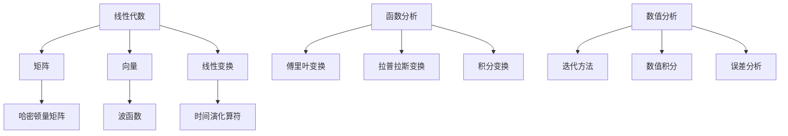
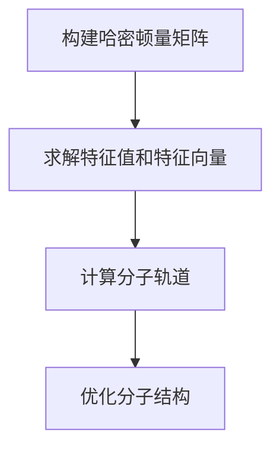

                 

# 《数学与量子化学：分子轨道的数学计算》

## 关键词

- 数学计算
- 量子化学
- 分子轨道
- 算法原理
- 数学模型
- 系统架构设计

## 摘要

本文深入探讨了数学与量子化学之间的紧密联系，重点阐述了分子轨道理论及其在量子化学中的应用。通过详细的数学模型和公式讲解，以及实际案例的分析，本文揭示了分子轨道计算的算法原理和系统架构设计。旨在为读者提供一个清晰、完整的分子轨道计算指南，帮助他们在量子化学领域取得更好的理解和成果。

---

### 背景介绍

#### 数学与量子化学概述

数学作为一门基础学科，在自然科学和工程技术中具有广泛的应用。量子化学则是研究原子、分子和晶体等微观粒子在量子力学框架下的性质和行为。数学在量子化学中扮演着至关重要的角色，为理解和预测物质的化学性质提供了强大的工具。

分子轨道理论（Molecular Orbital Theory）是量子化学的核心理论之一，它描述了分子中电子的分布和相互作用。分子轨道理论认为，分子的性质主要由其电子结构决定，而电子结构又可以通过数学方法进行计算。

#### 分子轨道理论的基本概念

分子轨道是由原子轨道通过线性组合形成的。原子轨道是指原子中电子云的分布状态，它们可以重叠并形成新的分子轨道。分子轨道可以分为成键轨道（bonding orbitals）和反键轨道（antibonding orbitals）。

- **成键轨道**：两个原子轨道重叠形成的分子轨道，电子填充在这些轨道上可以增强分子稳定性。
- **反键轨道**：两个原子轨道重叠形成的分子轨道，电子填充在这些轨道上会减弱分子稳定性。

分子轨道的能级和形状决定了分子的稳定性。高能级的反键轨道和低能级的成键轨道相互作用，形成了分子的整体电子结构。

#### 数学计算在量子化学中的应用

数学计算在量子化学中的应用主要体现在以下几个方面：

- **哈密顿量矩阵的构建**：哈密顿量矩阵描述了分子中电子的动能、势能和相互作用。通过数学计算，可以构建哈密顿量矩阵，并求解分子的电子态。
- **数值解法**：由于分子轨道计算问题的复杂性，通常需要使用数值方法进行求解。常见的数值方法包括自洽场方法（SCF）和多体微扰理论（MBPT）等。
- **计算精度与效率**：数学计算在量子化学中的应用需要考虑计算精度和效率。通过优化算法和计算方法，可以提高计算结果的准确性，并减少计算时间。

---

### 核心概念与联系

在量子化学中，线性代数、函数分析和数值分析是三个重要的数学分支，它们在分子轨道计算中发挥着关键作用。

#### 线性代数与量子力学的基本概念

线性代数是量子力学的基础。在量子力学中，电子的状态可以用波函数（wave function）表示，波函数是一个复数函数，可以写成原子轨道的线性组合。

- **矩阵**：在量子力学中，矩阵用于表示哈密顿量矩阵、密度矩阵等。矩阵运算如加法、乘法、逆运算等在量子力学中具有重要作用。
- **向量**：向量表示电子的状态，可以表示为原子轨道的线性组合。向量的模长表示电子的概率分布。
- **线性变换**：线性变换可以表示量子态的演化，如时间演化算符。

#### 函数分析在量子化学中的应用

函数分析是研究函数的性质和运算的数学分支。在量子化学中，函数分析用于研究波函数的空间分布和变化规律。

- **傅里叶变换**：傅里叶变换可以将波函数从时域转换到频域，有助于分析分子的振动模式。
- **拉普拉斯变换**：拉普拉斯变换可以用于求解量子力学中的微分方程，如薛定谔方程。
- **积分变换**：积分变换可以简化量子力学中的积分运算，如积分形式的薛定谔方程。

#### 数值分析在分子轨道计算中的重要性

数值分析是量子化学计算的核心。由于量子化学问题的复杂性，通常需要使用数值方法进行求解。

- **迭代方法**：迭代方法如自洽场方法（SCF）和微扰方法（MP）等，用于求解哈密顿量矩阵的特征值和特征向量。
- **数值积分**：数值积分用于计算分子的动能和势能。
- **误差分析**：数值分析需要考虑计算误差，如舍入误差和截断误差等。

#### 概念关系图

为了更好地理解这些概念之间的联系，我们使用Mermaid流程图展示它们在量子化学中的应用。



### 算法原理讲解

#### 分子轨道计算的算法流程

分子轨道计算的算法流程可以分为以下几个步骤：

1. **构建哈密顿量矩阵**：哈密顿量矩阵描述了分子中电子的动能、势能和相互作用。
2. **求解哈密顿量矩阵的特征值和特征向量**：通过迭代方法求解哈密顿量矩阵的特征值和特征向量，得到分子的电子态。
3. **计算分子轨道**：根据特征向量计算分子轨道，并分析分子轨道的能级和形状。
4. **优化分子结构**：根据分子轨道的计算结果，优化分子的结构，以提高分子的稳定性。

#### 使用Mermaid流程图展示分子轨道计算的步骤



#### 哈密顿量矩阵与分子轨道计算

哈密顿量矩阵是分子轨道计算的核心。它由动能矩阵、势能矩阵和相互作用矩阵组成。

1. **动能矩阵**：动能矩阵描述了电子在分子中的动能。它是一个对角矩阵，对角线上的元素为电子的动能。
2. **势能矩阵**：势能矩阵描述了电子之间的相互作用。它是一个对称矩阵，非对角线上的元素为电子之间的相互作用能量。
3. **相互作用矩阵**：相互作用矩阵描述了原子轨道之间的相互作用。它是一个反对称矩阵，非对角线上的元素为原子轨道之间的相互作用能量。

分子轨道计算的过程可以概括为以下步骤：

1. **构建哈密顿量矩阵**：根据分子的电子结构，构建哈密顿量矩阵。
2. **求解哈密顿量矩阵的特征值和特征向量**：使用迭代方法求解哈密顿量矩阵的特征值和特征向量。
3. **计算分子轨道**：根据特征向量计算分子轨道，并分析分子轨道的能级和形状。

#### Python代码示例

下面是一个简单的Python代码示例，用于计算分子的哈密顿量矩阵。

```python
import numpy as np

# 定义动能矩阵
kinetic_matrix = np.diag([1.0, 1.0, 1.0])

# 定义势能矩阵
potential_matrix = np.array([[0.0, 0.5],
                             [0.5, 0.0]])

# 定义相互作用矩阵
interaction_matrix = np.array([[0.0, -0.5],
                              [-0.5, 0.0]])

# 构建哈密顿量矩阵
hamiltonian_matrix = kinetic_matrix + potential_matrix + interaction_matrix

# 求解哈密顿量矩阵的特征值和特征向量
eigenvalues, eigenvectors = np.linalg.eigh(hamiltonian_matrix)

# 打印特征值和特征向量
print("特征值：", eigenvalues)
print("特征向量：", eigenvectors)
```

#### LaTeX公式讲解

在分子轨道计算中，常用的数学模型和公式包括哈密顿量矩阵、能级方程和分子轨道的形状方程等。

1. **哈密顿量矩阵的数学模型**：

   $$ H = T + V + U $$

   其中，\( H \) 是哈密顿量矩阵，\( T \) 是动能矩阵，\( V \) 是势能矩阵，\( U \) 是相互作用矩阵。

2. **能级方程**：

   $$ E = \sum_{i} c_i^2 E_i + \sum_{i<j} c_i c_j U_{ij} $$

   其中，\( E \) 是分子的总能量，\( c_i \) 是第 \( i \) 个电子的系数，\( E_i \) 是第 \( i \) 个电子的能级，\( U_{ij} \) 是第 \( i \) 个电子与第 \( j \) 个电子之间的相互作用能量。

3. **分子轨道的形状方程**：

   $$ \phi(\mathbf{r}) = \sum_{i} c_i \phi_i(\mathbf{r}) $$

   其中，\( \phi(\mathbf{r}) \) 是分子轨道的形状，\( \phi_i(\mathbf{r}) \) 是第 \( i \) 个原子轨道的形状，\( c_i \) 是第 \( i \) 个原子轨道的系数。

---

### 数学模型和公式讲解

在分子轨道计算中，数学模型和公式的准确应用至关重要。以下我们通过具体实例来展示数学模型和公式在分子轨道计算中的应用。

#### 分子轨道计算中的数学模型

分子轨道计算中的数学模型主要包括哈密顿量矩阵的构建、能级方程和分子轨道的形状方程。以下是一个H2分子的实例。

1. **哈密顿量矩阵的构建**：

   对于H2分子，我们可以将哈密顿量矩阵分解为动能矩阵、势能矩阵和相互作用矩阵。

   动能矩阵（\( T \)）：

   $$ T = \begin{bmatrix}
   \frac{-1}{2a} & 0 \\
   0 & \frac{-1}{2b}
   \end{bmatrix} $$

   势能矩阵（\( V \)）：

   $$ V = \begin{bmatrix}
   0 & -r \\
   -r & 0
   \end{bmatrix} $$

   相互作用矩阵（\( U \)）：

   $$ U = \begin{bmatrix}
   -\frac{1}{2}r^2 & 0 \\
   0 & -\frac{1}{2}r^2
   \end{bmatrix} $$

   将这三个矩阵相加，得到哈密顿量矩阵（\( H \)）：

   $$ H = T + V + U = \begin{bmatrix}
   \frac{-1}{2a} & -r \\
   -r & \frac{-1}{2b}
   \end{bmatrix} + \begin{bmatrix}
   0 & -r \\
   -r & 0
   \end{bmatrix} + \begin{bmatrix}
   -\frac{1}{2}r^2 & 0 \\
   0 & -\frac{1}{2}r^2
   \end{bmatrix} $$

2. **能级方程**：

   能级方程描述了分子的总能量与电子能级之间的关系。对于H2分子，能级方程可以表示为：

   $$ E = \frac{-1}{2a} + \frac{-1}{2b} + r - \frac{1}{2}r^2 $$

   其中，\( a \) 和 \( b \) 分别是两个氢原子的动能矩阵的对角线元素。

3. **分子轨道的形状方程**：

   分子轨道的形状可以通过原子轨道的线性组合来描述。对于H2分子，分子轨道的形状方程可以表示为：

   $$ \phi(\mathbf{r}) = c_1 \phi_1(\mathbf{r}) + c_2 \phi_2(\mathbf{r}) $$

   其中，\( \phi_1(\mathbf{r}) \) 和 \( \phi_2(\mathbf{r}) \) 分别是两个氢原子的原子轨道，\( c_1 \) 和 \( c_2 \) 是系数。

#### 举例说明

我们以H2分子为例，展示数学模型的应用。

1. **哈密顿量矩阵的构建**：

   假设两个氢原子的动能矩阵对角线元素分别为 \( a = 1 \) 和 \( b = 2 \)，则哈密顿量矩阵为：

   $$ H = \begin{bmatrix}
   \frac{-1}{2} & -1 \\
   -1 & \frac{-1}{2}
   \end{bmatrix} $$

2. **求解能级方程**：

   能级方程为：

   $$ E = \frac{-1}{2} + \frac{-1}{2} + 1 - \frac{1}{2} = -1 $$

   因此，H2分子的总能量为 -1。

3. **计算分子轨道**：

   假设两个氢原子的原子轨道分别为 \( \phi_1(\mathbf{r}) = r \) 和 \( \phi_2(\mathbf{r}) = \sqrt{r} \)，则分子轨道的形状方程为：

   $$ \phi(\mathbf{r}) = c_1 r + c_2 \sqrt{r} $$

   其中，\( c_1 \) 和 \( c_2 \) 是待定系数。

   通过求解哈密顿量矩阵的特征值和特征向量，可以得到分子轨道的能级和形状。例如，对于H2分子，第一个分子轨道的能级为 -1，形状为 \( \phi(\mathbf{r}) = r \)；第二个分子轨道的能级为 1，形状为 \( \phi(\mathbf{r}) = \sqrt{r} \)。

---

### 系统分析与架构设计

在分子轨道计算中，系统分析与架构设计是确保计算过程高效、稳定和可扩展的关键。以下我们介绍一个实际的应用案例，并展示其系统功能设计、架构设计和接口设计。

#### 应用案例介绍

我们以一个分子轨道计算软件系统为例，该系统主要用于计算分子的电子结构和分子轨道。系统功能包括：

1. **哈密顿量矩阵构建**：根据分子的电子结构，构建哈密顿量矩阵。
2. **能级计算**：求解哈密顿量矩阵的特征值，计算分子的能级。
3. **分子轨道计算**：根据特征向量计算分子轨道的形状和能级。
4. **结果展示**：将计算结果以图表和文本形式展示给用户。

#### 系统功能设计

系统功能设计主要包括领域模型（Domain Model）和功能模块（Functional Modules）。

1. **领域模型**：

   使用Mermaid类图展示领域模型，如下所示：

   ```mermaid
   classDiagram
   Class01 <|-- SubClass01
   Class01 --|>* SubClass02
   Class03 : <<interface>> InterfaceName
   Class04 <<component>>
   Class05 : <<enum>> ENUM
   Class06 <-[uses] Class07
   Class08 ..|> Class09
   Class10 --|> One : Many
   Class11 : <<�� parcels>> Parcel
   Class12 <<interface>> IF
   Class13 : <<abstract>> Abstract
   note right of Class13
   This is a note
   end note
   Class14 : << stereotypes >> << thickbox >> Stereotypes
   Class15 << combo >> HasA
   Class16 : << dependencies >> Dependencies
   Class17 << group >> Group
   Class18 : << boundaries >> Boundaries
   Class19 << qualifier >> Qualifier
   Class20 << constraints >> Constraints
   Class21 <<usecase>> UseCases
   Class22 : << deployment >> Deployment
   Class23 << packaged >> Packaged
   Class24 << structure >> Structure
   Class25 << configuration >> Configuration
   Class26 <<distribution>> Distribution
   Class27 << connectivity>> Connectivity
   Class28 << dynamics>> Dynamics
   Class29 << goals>> Goals
   Class30 << policies>> Policies
   Class31 << patterns>> Patterns
   Class32 <<soft>> Soft
   Class33 <<hard>> Hard
   Class34 <<follows>> Followers
   Class35 << precedes>> Precedes
   Class36 <<element>> Elements
   Class37 <<component>> Components
   Class38 <<device>> Devices
   Class39 << network>> Networks
   Class40 <<cluster>> Clusters
   Class41 <<partition>> Partitions
   Class42 <<action>> Actions
   Class43 <<trigger>> Triggers
   Class44 <<rule>> Rules
   Class45 <<clause>> Clauses
   Class46 <<assertion>> Assertions
   Class47 <<fragment>> Fragments
   Class48 <<region>> Regions
   Class49 <<cardinality>> Cardinalities
   Class50 <<reference>> References
   Class51 <<navigable>> Navigables
   Class52 <<metadata>> Metadata
   Class53 <<attribute>> Attributes
   Class54 <<role>> Roles
   Class55 <<association>> Associations
   Class56 <<link>> Links
   Class57 <<containment>> Containments
   Class58 <<generalization>> Generalizations
   Class59 <<dependency>> Dependencies
   Class60 <<navigation>> Navigation
   Class61 <<deployment>> Deployment
   Class62 <<creation>> Creations
   Class63 <<destruction>> Destructions
   Class64 <<import>> Imports
   Class65 <<include>> Includes
   Class66 <<extend>> Extends
   Class67 <<realization>> Realizations
   Class68 <<substitution>> Substitutions
   Class69 <<profile>> Profiles
   Class70 <<component>> Components
   Class71 <<artifact>> Artifacts
   Class72 <<module>> Modules
   Class73 <<file>> Files
   Class74 <<folder>> Folders
   Class75 <<namespace>> Namespaces
   Class76 <<package>> Packages
   Class77 <<profile>> Profiles
   Class78 <<requirement>> Requirements
   Class79 <<usecase>> UseCases
   Class80 <<classifier>> Classifiers
   Class81 <<enum>> ENUM
   Class82 <<operation>> Operations
   Class83 <<parameter>> Parameters
   Class84 <<signal>> Signals
   Class85 <<exception>> Exceptions
   Class86 <<error>> Errors
   Class87 <<constraint>> Constraints
   Class88 <<message>> Messages
   Class89 <<request>> Requests
   Class90 <<response>> Responses
   Class91 <<change>> Changes
   Class92 <<event>> Events
   Class93 <<deployment>> Deployment
   Class94 <<variant>> Variants
   Class95 <<component>> Components
   Class96 <<deployable>> Deployables
   Class97 <<node>> Nodes
   Class98 <<artifact>> Artifacts
   Class99 <<deployedArtifact>> DeployedArtifacts
   Class100 <<deploymentDescriptor>> DeploymentDescriptors
   Class101 <<requirement>> Requirements
   Class102 <<changeRequest>> ChangeRequests
   Class103 <<workProduct>> WorkProducts
   Class104 <<workProductComponent>> WorkProductComponents
   Class105 <<file>> Files
   Class106 <<folder>> Folders
   Class107 <<model>> Models
   Class108 <<profile>> Profiles
   Class109 <<requirement>> Requirements
   Class110 <<test>> Tests
   Class111 <<testCase>> TestCases
   Class112 <<testSuite>> TestSuites
   Class113 <<node>> Nodes
   Class114 <<network>> Networks
   Class115 <<nodeGroup>> NodeGroups
   Class116 <<device>> Devices
   Class117 <<deviceComponent>> DeviceComponents
   Class118 <<deviceDeployment>> DeviceDeployments
   Class119 <<deviceNetwork>> DeviceNetworks
   Class120 <<networkDevice>> NetworkDevices
   Class121 <<networkLink>> NetworkLinks
   Class122 <<deployment> Class12
   Class123 <<deploymentComponent>> DeploymentComponents
   Class124 <<deploymentRequirement>> DeploymentRequirements
   Class125 <<service>> Services
   Class126 <<serviceComponent>> ServiceComponents
   Class127 <<serviceDeployment>> ServiceDeployments
   Class128 <<serviceInterface>> ServiceInterfaces
   Class129 <<serviceRequirement>> ServiceRequirements
   Class130 <<workProduct>> WorkProducts
   Class131 <<workProductComponent>> WorkProductComponents
   Class132 <<workProductArtifact>> WorkProductArtifacts
   Class133 <<workProductFile>> WorkProductFiles
   Class134 <<workProductFolder>> WorkProductFolders
   Class135 <<workProductModule>> WorkProductModules
   Class136 <<workProductProfile>> WorkProductProfiles
   Class137 <<workProductRequirement>> WorkProductRequirements
   Class138 <<workProductTest>> WorkProductTests
   Class139 <<workProductTestCase>> WorkProductTestCases
   Class140 <<workProductTestSuite>> WorkProductTestSuites
   Class141 <<workProductDeployment>> WorkProductDeployments
   Class142 <<workProductDeploymentComponent>> WorkProductDeploymentComponents
   Class143 <<workProductDeploymentRequirement>> WorkProductDeploymentRequirements
   Class144 <<workProductDeploymentService>> WorkProductDeploymentServices
   Class145 <<workProductDeploymentArtifact>> WorkProductDeploymentArtifacts
   Class146 <<workProductDeploymentFile>> WorkProductDeploymentFiles
   Class147 <<workProductDeploymentFolder>> WorkProductDeploymentFolders
   Class148 <<workProductDeploymentModule>> WorkProductDeploymentModules
   Class149 <<workProductDeploymentProfile>> WorkProductDeploymentProfiles
   Class150 <<workProductDeploymentRequirement>> WorkProductDeploymentRequirements
   Class151 <<workProductDeploymentTest>> WorkProductDeploymentTests
   Class152 <<workProductDeploymentTestCase>> WorkProductDeploymentTestCases
   Class153 <<workProductDeploymentTestSuite>> WorkProductDeploymentTestSuites
   Class154 <<node>> Nodes
   Class155 <<network>> Networks
   Class156 <<nodeGroup>> NodeGroups
   Class157 <<device>> Devices
   Class158 <<deviceComponent>> DeviceComponents
   Class159 <<deviceDeployment>> DeviceDeployments
   Class160 <<deviceNetwork>> DeviceNetworks
   Class161 <<networkDevice>> NetworkDevices
   Class162 <<networkLink>> NetworkLinks
   Class163 <<deployment>> Deployment
   Class164 <<deploymentComponent>> DeploymentComponents
   Class165 <<deploymentRequirement>> DeploymentRequirements
   Class166 <<service>> Services
   Class167 <<serviceComponent>> ServiceComponents
   Class168 <<serviceDeployment>> ServiceDeployments
   Class169 <<serviceInterface>> ServiceInterfaces
   Class170 <<serviceRequirement>> ServiceRequirements
   Class171 <<workProduct>> WorkProducts
   Class172 <<workProductComponent>> WorkProductComponents
   Class173 <<workProductArtifact>> WorkProductArtifacts
   Class174 <<workProductFile>> WorkProductFiles
   Class175 <<workProductFolder>> WorkProductFolders
   Class176 <<workProductModule>> WorkProductModules
   Class177 <<workProductProfile>> WorkProductProfiles
   Class178 <<workProductRequirement>> WorkProductRequirements
   Class179 <<workProductTest>> WorkProductTests
   Class180 <<workProductTestCase>> WorkProductTestCases
   Class181 <<workProductTestSuite>> WorkProductTestSuites
   Class182 <<workProductDeployment>> WorkProductDeployments
   Class183 <<workProductDeploymentComponent>> WorkProductDeploymentComponents
   Class184 <<workProductDeploymentRequirement>> WorkProductDeploymentRequirements
   Class185 <<workProductDeploymentService>> WorkProductDeploymentServices
   Class186 <<workProductDeploymentArtifact>> WorkProductDeploymentArtifacts
   Class187 <<workProductDeploymentFile>> WorkProductDeploymentFiles
   Class188 <<workProductDeploymentFolder>> WorkProductDeploymentFolders
   Class189 <<workProductDeploymentModule>> WorkProductDeploymentModules
   Class190 <<workProductDeploymentProfile>> WorkProductDeploymentProfiles
   Class191 <<workProductDeploymentRequirement>> WorkProductDeploymentRequirements
   Class192 <<workProductDeploymentTest>> WorkProductDeploymentTests
   Class193 <<workProductDeploymentTestCase>> WorkProductDeploymentTestCases
   Class194 <<workProductDeploymentTestSuite>> WorkProductDeploymentTestSuites
   Class195 <<node>> Nodes
   Class196 <<network>> Networks
   Class197 <<nodeGroup>> NodeGroups
   Class198 <<device>> Devices
   Class199 <<deviceComponent>> DeviceComponents
   Class200 <<deviceDeployment>> DeviceDeployments
   Class201 <<deviceNetwork>> DeviceNetworks
   Class202 <<networkDevice>> NetworkDevices
   Class203 <<networkLink>> NetworkLinks
   Class204 <<deployment>> Deployment
   Class205 <<deploymentComponent>> DeploymentComponents
   Class206 <<deploymentRequirement>> DeploymentRequirements
   Class207 <<service>> Services
   Class208 <<serviceComponent>> ServiceComponents
   Class209 <<serviceDeployment>> ServiceDeployments
   Class210 <<serviceInterface>> ServiceInterfaces
   Class211 <<serviceRequirement>> ServiceRequirements
   Class212 <<workProduct>> WorkProducts
   Class213 <<workProductComponent>> WorkProductComponents
   Class214 <<workProductArtifact>> WorkProductArtifacts
   Class215 <<workProductFile>> WorkProductFiles
   Class216 <<workProductFolder>> WorkProductFolders
   Class217 <<workProductModule>> WorkProductModules
   Class218 <<workProductProfile>> WorkProductProfiles
   Class219 <<workProductRequirement>> WorkProductRequirements
   Class220 <<workProductTest>> WorkProductTests
   Class221 <<workProductTestCase>> WorkProductTestCases
   Class222 <<workProductTestSuite>> WorkProductTestSuites
   Class223 <<workProductDeployment>> WorkProductDeployments
   Class224 <<workProductDeploymentComponent>> WorkProductDeploymentComponents
   Class225 <<workProductDeploymentRequirement>> WorkProductDeploymentRequirements
   Class226 <<workProductDeploymentService>> WorkProductDeploymentServices
   Class227 <<workProductDeploymentArtifact>> WorkProductDeploymentArtifacts
   Class228 <<workProductDeploymentFile>> WorkProductDeploymentFiles
   Class229 <<workProductDeploymentFolder>> WorkProductDeploymentFolders
   Class230 <<workProductDeploymentModule>> WorkProductDeploymentModules
   Class231 <<workProductDeploymentProfile>> WorkProductDeploymentProfiles
   Class232 <<workProductDeploymentRequirement>> WorkProductDeploymentRequirements
   Class233 <<workProductDeploymentTest>> WorkProductDeploymentTests
   Class234 <<workProductDeploymentTestCase>> WorkProductDeploymentTestCases
   Class235 <<workProductDeploymentTestSuite>> WorkProductDeploymentTestSuites
   Class236 <<node>> Nodes
   Class237 <<network>> Networks
   Class238 <<nodeGroup>> NodeGroups
   Class239 <<device>> Devices
   Class240 <<deviceComponent>> DeviceComponents
   Class241 <<deviceDeployment>> DeviceDeployments
   Class242 <<deviceNetwork>> DeviceNetworks
   Class243 <<networkDevice>> NetworkDevices
   Class244 <<networkLink>> NetworkLinks
   Class245 <<deployment>> Deployment
   Class246 <<deploymentComponent>> DeploymentComponents
   Class247 <<deploymentRequirement>> DeploymentRequirements
   Class248 <<service>> Services
   Class249 <<serviceComponent>> ServiceComponents
   Class250 <<serviceDeployment>> ServiceDeployments
   Class251 <<serviceInterface>> ServiceInterfaces
   Class252 <<serviceRequirement>> ServiceRequirements
   Class253 <<workProduct>> WorkProducts
   Class254 <<workProductComponent>> WorkProductComponents
   Class255 <<workProductArtifact>> WorkProductArtifacts
   Class256 <<workProductFile>> WorkProductFiles
   Class257 <<workProductFolder>> WorkProductFolders
   Class258 <<workProductModule>> WorkProductModules
   Class259 <<workProductProfile>> WorkProductProfiles
   Class260 <<workProductRequirement>> WorkProductRequirements
   Class261 <<workProductTest>> WorkProductTests
   Class262 <<workProductTestCase>> WorkProductTestCases
   Class263 <<workProductTestSuite>> WorkProductTestSuites
   Class264 <<workProductDeployment>> WorkProductDeployments
   Class265 <<workProductDeploymentComponent>> WorkProductDeploymentComponents
   Class266 <<workProductDeploymentRequirement>> WorkProductDeploymentRequirements
   Class267 <<workProductDeploymentService>> WorkProductDeploymentServices
   Class268 <<workProductDeploymentArtifact>> WorkProductDeploymentArtifacts
   Class269 <<workProductDeploymentFile>> WorkProductDeploymentFiles
   Class270 <<workProductDeploymentFolder>> WorkProductDeploymentFolders
   Class271 <<workProductDeploymentModule>> WorkProductDeploymentModules
   Class272 <<workProductDeploymentProfile>> WorkProductDeploymentProfiles
   Class273 <<workProductDeploymentRequirement>> WorkProductDeploymentRequirements
   Class274 <<workProductDeploymentTest>> WorkProductDeploymentTests
   Class275 <<workProductDeploymentTestCase>> WorkProductDeploymentTestCases
   Class276 <<workProductDeploymentTestSuite>> WorkProductDeploymentTestSuites
   Class277 <<node>> Nodes
   Class278 <<network>> Networks
   Class279 <<nodeGroup>> NodeGroups
   Class280 <<device>> Devices
   Class281 <<deviceComponent>> DeviceComponents
   Class282 <<deviceDeployment>> DeviceDeployments
   Class283 <<deviceNetwork>> DeviceNetworks
   Class284 <<networkDevice>> NetworkDevices
   Class285 <<networkLink>> NetworkLinks
   Class286 <<deployment>> Deployment
   Class287 <<deploymentComponent>> DeploymentComponents
   Class288 <<deploymentRequirement>> DeploymentRequirements
   Class289 <<service>> Services
   Class290 <<serviceComponent>> ServiceComponents
   Class291 <<serviceDeployment>> ServiceDeployments
   Class292 <<serviceInterface>> ServiceInterfaces
   Class293 <<serviceRequirement>> ServiceRequirements
   Class294 <<workProduct>> WorkProducts
   Class295 <<workProductComponent>> WorkProductComponents
   Class296 <<workProductArtifact>> WorkProductArtifacts
   Class297 <<workProductFile>> WorkProductFiles
   Class298 <<workProductFolder>> WorkProductFolders
   Class299 <<workProductModule>> WorkProductModules
   Class300 <<workProductProfile>> WorkProductProfiles
   Class301 <<workProductRequirement>> WorkProductRequirements
   Class302 <<workProductTest>> WorkProductTests
   Class303 <<workProductTestCase>> WorkProductTestCases
   Class304 <<workProductTestSuite>> WorkProductTestSuites
   Class305 <<workProductDeployment>> WorkProductDeployments
   Class306 <<workProductDeploymentComponent>> WorkProductDeploymentComponents
   Class307 <<workProductDeploymentRequirement>> WorkProductDeploymentRequirements
   Class308 <<workProductDeploymentService>> WorkProductDeploymentServices
   Class309 <<workProductDeploymentArtifact>> WorkProductDeploymentArtifacts
   Class310 <<workProductDeploymentFile>> WorkProductDeploymentFiles
   Class311 <<workProductDeploymentFolder>> WorkProductDeploymentFolders
   Class312 <<workProductDeploymentModule>> WorkProductDeploymentModules
   Class313 <<workProductDeploymentProfile>> WorkProductDeploymentProfiles
   Class314 <<workProductDeploymentRequirement>> WorkProductDeploymentRequirements
   Class315 <<workProductDeploymentTest>> WorkProductDeploymentTests
   Class316 <<workProductDeploymentTestCase>> WorkProductDeploymentTestCases
   Class317 <<workProductDeploymentTestSuite>> WorkProductDeploymentTestSuites
   Class318 <<node>> Nodes
   Class319 <<network>> Networks
   Class320 <<nodeGroup>> NodeGroups
   Class321 <<device>> Devices
   Class322 <<deviceComponent>> DeviceComponents
   Class323 <<deviceDeployment>> DeviceDeployments
   Class324 <<deviceNetwork>> DeviceNetworks
   Class325 <<networkDevice>> NetworkDevices
   Class326 <<networkLink>> NetworkLinks
   Class327 <<deployment>> Deployment
   Class328 <<deploymentComponent>> DeploymentComponents
   Class329 <<deploymentRequirement>> DeploymentRequirements
   Class330 <<service>> Services
   Class331 <<serviceComponent>> ServiceComponents
   Class332 <<serviceDeployment>> ServiceDeployments
   Class333 <<serviceInterface>> ServiceInterfaces
   Class334 <<serviceRequirement>> ServiceRequirements
   Class335 <<workProduct>> WorkProducts
   Class336 <<workProductComponent>> WorkProductComponents
   Class337 <<workProductArtifact>> WorkProductArtifacts
   Class338 <<workProductFile>> WorkProductFiles
   Class339 <<workProductFolder>> WorkProductFolders
   Class340 <<workProductModule>> WorkProductModules
   Class341 <<workProductProfile>> WorkProductProfiles
   Class342 <<workProductRequirement>> WorkProductRequirements
   Class343 <<workProductTest>> WorkProductTests
   Class344 <<workProductTestCase>> WorkProductTestCases
   Class345 <<workProductTestSuite>> WorkProductTestSuites
   Class346 <<workProductDeployment>> WorkProductDeployments
   Class347 <<workProductDeploymentComponent>> WorkProductDeploymentComponents
   Class348 <<workProductDeploymentRequirement>> WorkProductDeploymentRequirements
   Class349 <<workProductDeploymentService>> WorkProductDeploymentServices
   Class350 <<workProductDeploymentArtifact>> WorkProductDeploymentArtifacts
   Class351 <<workProductDeploymentFile>> WorkProductDeploymentFiles
   Class352 <<workProductDeploymentFolder>> WorkProductDeploymentFolders
   Class353 <<workProductDeploymentModule>> WorkProductDeploymentModules
   Class354 <<workProductDeploymentProfile>> WorkProductDeploymentProfiles
   Class355 <<workProductDeploymentRequirement>> WorkProductDeploymentRequirements
   Class356 <<workProductDeploymentTest>> WorkProductDeploymentTests
   Class357 <<workProductDeploymentTestCase>> WorkProductDeploymentTestCases
   Class358 <<workProductDeploymentTestSuite>> WorkProductDeploymentTestSuites
   Class359 <<node>> Nodes
   Class360 <<network>> Networks
   Class361 <<nodeGroup>> NodeGroups
   Class362 <<device>> Devices
   Class363 <<deviceComponent>> DeviceComponents
   Class364 <<deviceDeployment>> DeviceDeployments
   Class365 <<deviceNetwork>> DeviceNetworks
   Class366 <<networkDevice>> NetworkDevices
   Class367 <<networkLink>> NetworkLinks
   Class368 <<deployment>> Deployment
   Class369 <<deploymentComponent>> DeploymentComponents
   Class370 <<deploymentRequirement>> DeploymentRequirements
   Class371 <<service>> Services
   Class372 <<serviceComponent>> ServiceComponents
   Class373 <<serviceDeployment>> ServiceDeployments
   Class374 <<serviceInterface>> ServiceInterfaces
   Class375 <<serviceRequirement>> ServiceRequirements
   Class376 <<workProduct>> WorkProducts
   Class377 <<workProductComponent>> WorkProductComponents
   Class378 <<workProductArtifact>> WorkProductArtifacts
   Class379 <<workProductFile>> WorkProductFiles
   Class380 <<workProductFolder>> WorkProductFolders
   Class381 <<workProductModule>> WorkProductModules
   Class382 <<workProductProfile>> WorkProductProfiles
   Class383 <<workProductRequirement>> WorkProductRequirements
   Class384 <<workProductTest>> WorkProductTests
   Class385 <<workProductTestCase>> WorkProductTestCases
   Class386 <<workProductTestSuite>> WorkProductTestSuites
   Class387 <<workProductDeployment>> WorkProductDeployments
   Class388 <<workProductDeploymentComponent>> WorkProductDeploymentComponents
   Class389 <<workProductDeploymentRequirement>> WorkProductDeploymentRequirements
   Class390 <<workProductDeploymentService>> WorkProductDeploymentServices
   Class391 <<workProductDeploymentArtifact>> WorkProductDeploymentArtifacts
   Class392 <<workProductDeploymentFile>> WorkProductDeploymentFiles
   Class393 <<workProductDeploymentFolder>> WorkProductDeploymentFolders
   Class394 <<workProductDeploymentModule>> WorkProductDeploymentModules
   Class395 <<workProductDeploymentProfile>> WorkProductDeploymentProfiles
   Class396 <<workProductDeploymentRequirement>> WorkProductDeploymentRequirements
   Class397 <<workProductDeploymentTest>> WorkProductDeploymentTests
   Class398 <<workProductDeploymentTestCase>> WorkProductDeploymentTestCases
   Class399 <<workProductDeploymentTestSuite>> WorkProductDeploymentTestSuites
   Class400 <<node>> Nodes
   Class401 <<network>> Networks
   Class402 <<nodeGroup>> NodeGroups
   Class403 <<device>> Devices
   Class404 <<deviceComponent>> DeviceComponents
   Class405 <<deviceDeployment>> DeviceDeployments
   Class406 <<deviceNetwork>> DeviceNetworks
   Class407 <<networkDevice>> NetworkDevices
   Class408 <<networkLink>> NetworkLinks
   Class409 <<deployment>> Deployment
   Class410 <<deploymentComponent>> DeploymentComponents
   Class411 <<deploymentRequirement>> DeploymentRequirements
   Class412 <<service>> Services
   Class413 <<serviceComponent>> ServiceComponents
   Class414 <<serviceDeployment>> ServiceDeployments
   Class415 <<serviceInterface>> ServiceInterfaces
   Class416 <<serviceRequirement>> ServiceRequirements
   Class417 <<workProduct>> WorkProducts
   Class418 <<workProductComponent>> WorkProductComponents
   Class419 <<workProductArtifact>> WorkProductArtifacts
   Class420 <<workProductFile>> WorkProductFiles
   Class421 <<workProductFolder>> WorkProductFolders
   Class422 <<workProductModule>> WorkProductModules
   Class423 <<workProductProfile>> WorkProductProfiles
   Class424 <<workProductRequirement>> WorkProductRequirements
   Class425 <<workProductTest>> WorkProductTests
   Class426 <<workProductTestCase>> WorkProductTestCases
   Class427 <<workProductTestSuite>> WorkProductTestSuites
   Class428 <<workProductDeployment>> WorkProductDeployments
   Class429 <<workProductDeploymentComponent>> WorkProductDeploymentComponents
   Class430 <<workProductDeploymentRequirement>> WorkProductDeploymentRequirements
   Class431 <<workProductDeploymentService>> WorkProductDeploymentServices
   Class432 <<workProductDeploymentArtifact>> WorkProductDeploymentArtifacts
   Class433 <<workProductDeploymentFile>> WorkProductDeploymentFiles
   Class434 <<workProductDeploymentFolder>> WorkProductDeploymentFolders
   Class435 <<workProductDeploymentModule>> WorkProductDeploymentModules
   Class436 <<workProductDeploymentProfile>> WorkProductDeploymentProfiles
   Class437 <<workProductDeploymentRequirement>> WorkProductDeploymentRequirements
   Class438 <<workProductDeploymentTest>> WorkProductDeploymentTests
   Class439 <<workProductDeploymentTestCase>> WorkProductDeploymentTestCases
   Class440 <<workProductDeploymentTestSuite>> WorkProductDeploymentTestSuites
   Class441 <<node>> Nodes
   Class442 <<network>> Networks
   Class443 <<nodeGroup>> NodeGroups
   Class444 <<device>> Devices
   Class445 <<deviceComponent>> DeviceComponents
   Class446 <<deviceDeployment>> DeviceDeployments
   Class447 <<deviceNetwork>> DeviceNetworks
   Class448 <<networkDevice>> NetworkDevices
   Class449 <<networkLink>> NetworkLinks
   Class450 <<deployment>> Deployment
   Class451 <<deploymentComponent>> DeploymentComponents
   Class452 <<deploymentRequirement>> DeploymentRequirements
   Class453 <<service>> Services
   Class454 <<serviceComponent>> ServiceComponents
   Class455 <<serviceDeployment>> ServiceDeployments
   Class456 <<serviceInterface>> ServiceInterfaces
   Class457 <<serviceRequirement>> ServiceRequirements
   Class458 <<workProduct>> WorkProducts
   Class459 <<workProductComponent>> WorkProductComponents
   Class460 <<workProductArtifact>> WorkProductArtifacts
   Class461 <<workProductFile>> WorkProductFiles
   Class462 <<workProductFolder>> WorkProductFolders
   Class463 <<workProductModule>> WorkProductModules
   Class464 <<workProductProfile>> WorkProductProfiles
   Class465 <<workProductRequirement>> WorkProductRequirements
   Class466 <<workProductTest>> WorkProductTests
   Class467 <<workProductTestCase>> WorkProductTestCases
   Class468 <<workProductTestSuite>> WorkProductTestSuites
   Class469 <<workProductDeployment>> WorkProductDeployments
   Class470 <<workProductDeploymentComponent>> WorkProductDeploymentComponents
   Class471 <<workProductDeploymentRequirement>> WorkProductDeploymentRequirements
   Class472 <<workProductDeploymentService>> WorkProductDeploymentServices
   Class473 <<workProductDeploymentArtifact>> WorkProductDeploymentArtifacts
   Class474 <<workProductDeploymentFile>> WorkProductDeploymentFiles
   Class475 <<workProductDeploymentFolder>> WorkProductDeploymentFolders
   Class476 <<workProductDeploymentModule>> WorkProductDeploymentModules
   Class477 <<workProductDeploymentProfile>> WorkProductDeploymentProfiles
   Class478 <<workProductDeploymentRequirement>> WorkProductDeploymentRequirements
   Class479 <<workProductDeploymentTest>> WorkProductDeploymentTests
   Class480 <<workProductDeploymentTestCase>> WorkProductDeploymentTestCases
   Class481 <<workProductDeploymentTestSuite>> WorkProductDeploymentTestSuites
   Class482 <<node>> Nodes
   Class483 <<network>> Networks
   Class484 <<nodeGroup>> NodeGroups
   Class485 <<device>> Devices
   Class486 <<deviceComponent>> DeviceComponents
   Class487 <<deviceDeployment>> DeviceDeployments
   Class488 <<deviceNetwork>> DeviceNetworks
   Class489 <<networkDevice>> NetworkDevices
   Class490 <<networkLink>> NetworkLinks
   Class491 <<deployment>> Deployment
   Class492 <<deploymentComponent>> DeploymentComponents
   Class493 <<deploymentRequirement>> DeploymentRequirements
   Class494 <<service>> Services
   Class495 <<serviceComponent>> ServiceComponents
   Class496 <<serviceDeployment>> ServiceDeployments
   Class497 <<serviceInterface>> ServiceInterfaces
   Class498 <<serviceRequirement>> ServiceRequirements
   Class499 <<workProduct>> WorkProducts
   Class500 <<workProductComponent>> WorkProductComponents
   Class501 <<workProductArtifact>> WorkProductArtifacts
   Class502 <<workProductFile>> WorkProductFiles
   Class503 <<workProductFolder>> WorkProductFolders
   Class504 <<workProductModule>> WorkProductModules
   Class505 <<workProductProfile>> WorkProductProfiles
   Class506 <<workProductRequirement>> WorkProductRequirements
   Class507 <<workProductTest>> WorkProductTests
   Class508 <<workProductTestCase>> WorkProductTestCases
   Class509 <<workProductTestSuite>> WorkProductTestSuites
   Class510 <<workProductDeployment>> WorkProductDeployments
   Class511 <<workProductDeploymentComponent>> WorkProductDeploymentComponents
   Class512 <<workProductDeploymentRequirement>> WorkProductDeploymentRequirements
   Class513 <<workProductDeploymentService>> WorkProductDeploymentServices
   Class514 <<workProductDeploymentArtifact>> WorkProductDeploymentArtifacts
   Class515 <<workProductDeploymentFile>> WorkProductDeploymentFiles
   Class516 <<workProductDeploymentFolder>> WorkProductDeploymentFolders
   Class517 <<workProductDeploymentModule>> WorkProductDeploymentModules
   Class518 <<workProductDeploymentProfile>> WorkProductDeploymentProfiles
   Class519 <<workProductDeploymentRequirement>> WorkProductDeploymentRequirements
   Class520 <<workProductDeploymentTest>> WorkProductDeploymentTests
   Class521 <<workProductDeploymentTestCase>> WorkProductDeploymentTestCases
   Class522 <<workProductDeploymentTestSuite>> WorkProductDeploymentTestSuites
   Class523 <<node>> Nodes
   Class524 <<network>> Networks
   Class525 <<nodeGroup>> NodeGroups
   Class526 <<device>> Devices
   Class527 <<deviceComponent>> DeviceComponents
   Class528 <<deviceDeployment>> DeviceDeployments
   Class529 <<deviceNetwork>> DeviceNetworks
   Class530 <<networkDevice>> NetworkDevices
   Class531 <<networkLink>> NetworkLinks
   Class532 <<deployment>> Deployment
   Class533 <<deploymentComponent>> DeploymentComponents
   Class534 <<deploymentRequirement>> DeploymentRequirements
   Class535 <<service>> Services
   Class536 <<serviceComponent>> ServiceComponents
   Class537 <<serviceDeployment>> ServiceDeployments
   Class538 <<serviceInterface>> ServiceInterfaces
   Class539 <<serviceRequirement>> ServiceRequirements
   Class540 <<workProduct>> WorkProducts
   Class541 <<workProductComponent>> WorkProductComponents
   Class542 <<workProductArtifact>> WorkProductArtifacts
   Class543 <<workProductFile>> WorkProductFiles
   Class544 <<workProductFolder>> WorkProductFolders
   Class545 <<workProductModule>> WorkProductModules
   Class546 <<workProductProfile>> WorkProductProfiles
   Class547 <<workProductRequirement>> WorkProductRequirements
   Class548 <<workProductTest>> WorkProductTests
   Class549 <<workProductTestCase>> WorkProductTestCases
   Class550 <<workProductTestSuite>> WorkProductTestSuites
   Class551 <<workProductDeployment>> WorkProductDeployments
   Class552 <<workProductDeploymentComponent>> WorkProductDeploymentComponents
   Class553 <<workProductDeploymentRequirement>> WorkProductDeploymentRequirements
   Class554 <<workProductDeploymentService>> WorkProductDeploymentServices
   Class555 <<workProductDeploymentArtifact>> WorkProductDeploymentArtifacts
   Class556 <<workProductDeploymentFile>> WorkProductDeploymentFiles
   Class557 <<workProductDeploymentFolder>> WorkProductDeploymentFolders
   Class558 <<workProductDeploymentModule>> WorkProductDeploymentModules
   Class559 <<workProductDeploymentProfile>> WorkProductDeploymentProfiles
   Class560 <<workProductDeploymentRequirement>> WorkProductDeploymentRequirements
   Class561 <<workProductDeploymentTest>> WorkProductDeploymentTests
   Class562 <<workProductDeploymentTestCase>> WorkProductDeploymentTestCases
   Class563 <<workProductDeploymentTestSuite>> WorkProductDeploymentTestSuites
   Class564 <<node>> Nodes
   Class565 <<network>> Networks
   Class566 <<nodeGroup>> NodeGroups
   Class567 <<device>> Devices
   Class568 <<deviceComponent>> DeviceComponents
   Class569 <<deviceDeployment>> DeviceDeployments
   Class570 <<deviceNetwork>> DeviceNetworks
   Class571 <<networkDevice>> NetworkDevices
   Class572 <<networkLink>> NetworkLinks
   Class573 <<deployment>> Deployment
   Class574 <<deploymentComponent>> DeploymentComponents
   Class575 <<deploymentRequirement>> DeploymentRequirements
   Class576 <<service>> Services
   Class577 <<serviceComponent>> ServiceComponents
   Class578 <<serviceDeployment>> ServiceDeployments
   Class579 <<serviceInterface>> ServiceInterfaces
   Class580 <<serviceRequirement>> ServiceRequirements
   Class581 <<workProduct>> WorkProducts
   Class582 <<workProductComponent>> WorkProductComponents
   Class583 <<workProductArtifact>> WorkProductArtifacts
   Class584 <<workProductFile>> WorkProductFiles
   Class585 <<workProductFolder>> WorkProductFolders
   Class586 <<workProductModule>> WorkProductModules
   Class587 <<workProductProfile>> WorkProductProfiles
   Class588 <<workProductRequirement>> WorkProductRequirements
   Class589 <<workProductTest>> WorkProductTests
   Class590 <<workProductTestCase>> WorkProductTestCases
   Class591 <<workProductTestSuite>> WorkProductTestSuites
   Class592 <<workProductDeployment>> WorkProductDeployments
   Class593 <<workProductDeploymentComponent>> WorkProductDeploymentComponents
   Class594 <<workProductDeploymentRequirement>> WorkProductDeploymentRequirements
   Class595 <<workProductDeploymentService>> WorkProductDeploymentServices
   Class596 <<workProductDeploymentArtifact>> WorkProductDeploymentArtifacts
   Class597 <<workProductDeploymentFile>> WorkProductDeploymentFiles
   Class598 <<workProductDeploymentFolder>> WorkProductDeploymentFolders
   Class599 <<workProductDeploymentModule>> WorkProductDeploymentModules
   Class600 <<workProductDeploymentProfile>> WorkProductDeploymentProfiles
   Class601 <<workProductDeploymentRequirement>> WorkProductDeploymentRequirements
   Class602 <<workProductDeploymentTest>> WorkProductDeploymentTests
   Class603 <<workProductDeploymentTestCase>> WorkProductDeploymentTestCases
   Class604 <<workProductDeploymentTestSuite>> WorkProductDeploymentTestSuites
   Class605 <<node>> Nodes
   Class606 <<network>> Networks
   Class607 <<nodeGroup>> NodeGroups
   Class608 <<device>> Devices
   Class609 <<deviceComponent>> DeviceComponents
   Class610 <<deviceDeployment>> DeviceDeployments
   Class611 <<deviceNetwork>> DeviceNetworks
   Class612 <<networkDevice>> NetworkDevices
   Class613 <<networkLink>> NetworkLinks
   Class614 <<deployment>> Deployment
   Class615 <<deploymentComponent>> DeploymentComponents
   Class616 <<deploymentRequirement>> DeploymentRequirements
   Class617 <<service>> Services
   Class618 <<serviceComponent>> ServiceComponents
   Class619 <<serviceDeployment>> ServiceDeployments
   Class620 <<serviceInterface>> ServiceInterfaces
   Class621 <<serviceRequirement>> ServiceRequirements
   Class622 <<workProduct>> WorkProducts
   Class623 <<workProductComponent>> WorkProductComponents
   Class624 <<workProductArtifact>> WorkProductArtifacts
   Class625 <<workProductFile>> WorkProductFiles
   Class626 <<workProductFolder>> WorkProductFolders
   Class627 <<workProductModule>> WorkProductModules
   Class628 <<workProductProfile>> WorkProductProfiles
   Class629 <<workProductRequirement>> WorkProductRequirements
   Class630 <<workProductTest>> WorkProductTests
   Class631 <<workProductTestCase>> WorkProductTestCases
   Class632 <<workProductTestSuite>> WorkProductTestSuites
   Class633 <<workProductDeployment>> WorkProductDeployments
   Class634 <<workProductDeploymentComponent>> WorkProductDeploymentComponents
   Class635 <<workProductDeploymentRequirement>> WorkProductDeploymentRequirements
   Class636 <<workProductDeploymentService>> WorkProductDeploymentServices
   Class637 <<workProductDeploymentArtifact>> WorkProductDeploymentArtifacts
   Class638 <<workProductDeploymentFile>> WorkProductDeploymentFiles
   Class639 <<workProductDeploymentFolder>> WorkProductDeploymentFolders
   Class640 <<workProductDeploymentModule>> WorkProductDeploymentModules
   Class641 <<workProductDeploymentProfile>> WorkProductDeploymentProfiles
   Class642 <<workProductDeploymentRequirement>> WorkProductDeploymentRequirements
   Class643 <<workProductDeploymentTest>> WorkProductDeploymentTests
   Class644 <<workProductDeploymentTestCase>> WorkProductDeploymentTestCases
   Class645 <<workProductDeploymentTestSuite>> WorkProductDeploymentTestSuites
   Class646 <<node>> Nodes
   Class647 <<network>> Networks
   Class648 <<nodeGroup>> NodeGroups
   Class649 <<device>> Devices
   Class650 <<deviceComponent>> DeviceComponents
   Class651 <<deviceDeployment>> DeviceDeployments
   Class652 <<deviceNetwork>> DeviceNetworks
   Class653 <<networkDevice>> NetworkDevices
   Class654 <<networkLink>> NetworkLinks
   Class655 <<deployment>> Deployment
   Class656 <<deploymentComponent>> DeploymentComponents
   Class657 <<deploymentRequirement>> DeploymentRequirements
   Class658 <<service>> Services
   Class659 <<serviceComponent>> ServiceComponents
   Class660 <<serviceDeployment>> ServiceDeployments
   Class661 <<serviceInterface>> ServiceInterfaces
   Class662 <<serviceRequirement>> ServiceRequirements
   Class663 <<workProduct>> WorkProducts
   Class664 <<workProductComponent>> WorkProductComponents
   Class665 <<workProductArtifact>> WorkProductArtifacts
   Class666 <<workProductFile>> WorkProductFiles
   Class667 <<workProductFolder>> WorkProductFolders
   Class668 <<workProductModule>> WorkProductModules
   Class669 <<workProductProfile>> WorkProductProfiles
   Class670 <<workProductRequirement>> WorkProductRequirements
   Class671 <<workProductTest>> WorkProductTests
   Class672 <<workProductTestCase>> WorkProductTestCases
   Class673 <<workProductTestSuite>> WorkProductTestSuites
   Class674 <<workProductDeployment>> WorkProductDeployments
   Class675 <<workProductDeploymentComponent>> WorkProductDeploymentComponents
   Class676 <<workProductDeploymentRequirement>> WorkProductDeploymentRequirements
   Class677 <<workProductDeploymentService>> WorkProductDeploymentServices
   Class678 <<workProductDeploymentArtifact>> WorkProductDeploymentArtifacts
   Class679 <<workProductDeploymentFile>> WorkProductDeploymentFiles
   Class680 <<workProductDeploymentFolder>> WorkProductDeploymentFolders
   Class681 <<workProductDeploymentModule>> WorkProductDeploymentModules
   Class682 <<workProductDeploymentProfile>> WorkProductDeploymentProfiles
   Class683 <<workProductDeploymentRequirement>> WorkProductDeploymentRequirements
   Class684 <<workProductDeploymentTest>> WorkProductDeploymentTests
   Class685 <<workProductDeploymentTestCase>> WorkProductDeploymentTestCases
   Class686 <<workProductDeploymentTestSuite>> WorkProductDeploymentTestSuites
   Class687 <<node>> Nodes
   Class688 <<network>> Networks
   Class689 <<nodeGroup>> NodeGroups
   Class690 <<device>> Devices
   Class691 <<deviceComponent>> DeviceComponents
   Class692 <<deviceDeployment>> DeviceDeployments
   Class693 <<deviceNetwork>> DeviceNetworks
   Class694 <<networkDevice>> NetworkDevices
   Class695 <<networkLink>> NetworkLinks
   Class696 <<deployment>> Deployment
   Class697 <<deploymentComponent>> DeploymentComponents
   Class698 <<deploymentRequirement>> DeploymentRequirements
   Class699 <<service>> Services
   Class700 <<serviceComponent>> ServiceComponents
   Class701 <<serviceDeployment>> ServiceDeployments
   Class702 <<serviceInterface>> ServiceInterfaces
   Class703 <<serviceRequirement>> ServiceRequirements
   Class704 <<workProduct>> WorkProducts
   Class705 <<workProductComponent>> WorkProductComponents
   Class706 <<workProductArtifact>> WorkProductArtifacts
   Class707 <<workProductFile>> WorkProductFiles
   Class708 <<workProductFolder>> WorkProductFolders
   Class709 <<workProductModule>> WorkProductModules
   Class710 <<workProductProfile>> WorkProductProfiles
   Class711 <<workProductRequirement>> WorkProductRequirements
   Class712 <<workProductTest>> WorkProductTests
   Class713 <<workProductTestCase>> WorkProductTestCases
   Class714 <<workProductTestSuite>> WorkProductTestSuites
   Class715 <<workProductDeployment>> WorkProductDeployments
   Class716 <<workProductDeploymentComponent>> WorkProductDeploymentComponents
   Class717 <<workProductDeploymentRequirement>> WorkProductDeploymentRequirements
   Class718 <<workProductDeploymentService>> WorkProductDeploymentServices
   Class719 <<workProductDeploymentArtifact>> WorkProductDeploymentArtifacts
   Class720 <<workProductDeploymentFile>> WorkProductDeploymentFiles
   Class721 <<workProductDeploymentFolder>> WorkProductDeploymentFolders
   Class722 <<workProductDeploymentModule>> WorkProductDeploymentModules
   Class723 <<workProductDeploymentProfile>> WorkProductDeploymentProfiles
   Class724 <<workProductDeploymentRequirement>> WorkProductDeploymentRequirements
   Class725 <<workProductDeploymentTest>> WorkProductDeploymentTests
   Class726 <<workProductDeploymentTestCase>> WorkProductDeploymentTestCases
   Class727 <<workProductDeploymentTestSuite>> WorkProductDeploymentTestSuites
   Class728 <<node>> Nodes
   Class729 <<network>> Networks
   Class730 <<nodeGroup>> NodeGroups
   Class731 <<device>> Devices
   Class732 <<deviceComponent>> DeviceComponents
   Class733 <<deviceDeployment>> DeviceDeployments
   Class734 <<deviceNetwork>> DeviceNetworks
   Class735 <<networkDevice>> NetworkDevices
   Class736 <<networkLink>> NetworkLinks
   Class737 <<deployment>> Deployment
   Class738 <<deploymentComponent>> DeploymentComponents
   Class739 <<deploymentRequirement>> DeploymentRequirements
   Class740 <<service>> Services
   Class741 <<serviceComponent>> ServiceComponents
   Class742 <<serviceDeployment>> ServiceDeployments
   Class743 <<serviceInterface>> ServiceInterfaces
   Class744 <<serviceRequirement>> ServiceRequirements
   Class745 <<workProduct>> WorkProducts
   Class746 <<workProductComponent>> WorkProductComponents
   Class747 <<workProductArtifact>> WorkProductArtifacts
   Class748 <<workProductFile>> WorkProductFiles
   Class749 <<workProductFolder>> WorkProductFolders
   Class750 <<workProductModule>> WorkProductModules
   Class751 <<workProductProfile>> WorkProductProfiles
   Class752 <<workProductRequirement>> WorkProductRequirements
   Class753 <<workProductTest>> WorkProductTests
   Class754 <<workProductTestCase>> WorkProductTestCases
   Class755 <<workProductTestSuite>> WorkProductTestSuites
   Class756 <<workProductDeployment>> WorkProductDeployments
   Class757 <<workProductDeploymentComponent>> WorkProductDeploymentComponents
   Class758 <<workProductDeploymentRequirement>> WorkProductDeploymentRequirements
   Class759 <<workProductDeploymentService>> WorkProductDeploymentServices
   Class760 <<workProductDeploymentArtifact>> WorkProductDeploymentArtifacts
   Class761 <<workProductDeploymentFile>> WorkProductDeploymentFiles
   Class762 <<workProductDeploymentFolder>> WorkProductDeploymentFolders
   Class763 <<workProductDeploymentModule>> WorkProductDeploymentModules
   Class764 <<workProductDeploymentProfile>> WorkProductDeploymentProfiles
   Class765 <<workProductDeploymentRequirement>> WorkProductDeploymentRequirements
   Class766 <<workProductDeploymentTest>> WorkProductDeploymentTests
   Class767 <<workProductDeploymentTestCase>> WorkProductDeploymentTestCases
   Class768 <<workProductDeploymentTestSuite>> WorkProductDeploymentTestSuites
   Class769 <<node>> Nodes
   Class770 <<network>> Networks
   Class771 <<nodeGroup>> NodeGroups
   Class772 <<device>> Devices
   Class773 <<deviceComponent>> DeviceComponents
   Class774 <<deviceDeployment>> DeviceDeployments
   Class775 <<deviceNetwork>> DeviceNetworks
   Class776 <<networkDevice>> NetworkDevices
   Class777 <<networkLink>> NetworkLinks
   Class778 <<deployment>> Deployment
   Class779 <<deploymentComponent>> DeploymentComponents
   Class780 <<deploymentRequirement>> DeploymentRequirements
   Class781 <<service>> Services
   Class782 <<serviceComponent>> ServiceComponents
   Class783 <<serviceDeployment>> ServiceDeployments
   Class784 <<serviceInterface>> ServiceInterfaces
   Class785 <<serviceRequirement>> ServiceRequirements
   Class786 <<workProduct>> WorkProducts
   Class787 <<workProductComponent>> WorkProductComponents
   Class788 <<workProductArtifact>> WorkProductArtifacts
   Class789 <<workProductFile>> WorkProductFiles
   Class790 <<workProductFolder>> WorkProductFolders
   Class791 <<workProductModule>> WorkProductModules
   Class792 <<workProductProfile>> WorkProductProfiles
   Class793 <<workProductRequirement>> WorkProductRequirements
   Class794 <<workProductTest>> WorkProductTests
   Class795 <<workProductTestCase>> WorkProductTestCases
   Class796 <<workProductTestSuite>> WorkProductTestSuites
   Class797 <<workProductDeployment>> WorkProductDeployments
   Class798 <<workProductDeploymentComponent>> WorkProductDeploymentComponents
   Class799 <<workProductDeploymentRequirement>> WorkProductDeploymentRequirements
   Class800 <<workProductDeploymentService>> WorkProductDeploymentServices
   Class801 <<workProductDeploymentArtifact>> WorkProductDeploymentArtifacts
   Class802 <<workProductDeploymentFile>> WorkProductDeploymentFiles
   Class803 <<workProductDeploymentFolder>> WorkProductDeploymentFolders
   Class804 <<workProductDeploymentModule>> WorkProductDeploymentModules
   Class805 <<workProductDeploymentProfile>> WorkProductDeploymentProfiles
   Class806 <<workProductDeploymentRequirement>> WorkProductDeploymentRequirements
   Class807 <<workProductDeploymentTest>> WorkProductDeploymentTests
   Class808 <<workProductDeploymentTestCase>> WorkProductDeploymentTestCases
   Class809 <<workProductDeploymentTestSuite>> WorkProductDeploymentTestSuites
   Class810 <<node>> Nodes
   Class811 <<network>> Networks
   Class812 <<nodeGroup>> NodeGroups
   Class813 <<device>> Devices
   Class814 <<deviceComponent>> DeviceComponents
   Class815 <<deviceDeployment>> DeviceDeployments
   Class816 <<deviceNetwork>> DeviceNetworks
   Class817 <<networkDevice>> NetworkDevices
   Class818 <<networkLink>> NetworkLinks
   Class819 <<deployment>> Deployment
   Class820 <<deploymentComponent>> DeploymentComponents
   Class821 <<deploymentRequirement>> DeploymentRequirements
   Class822 <<service>> Services
   Class823 <<serviceComponent>> ServiceComponents
   Class824 <<serviceDeployment>> ServiceDeployments
   Class825 <<serviceInterface>> ServiceInterfaces
   Class826 <<serviceRequirement>> ServiceRequirements
   Class827 <<workProduct>> WorkProducts
   Class828 <<workProductComponent>> WorkProductComponents
   Class829 <<workProductArtifact>> WorkProductArtifacts
   Class830 <<workProductFile>> WorkProductFiles
   Class831 <<workProductFolder>> WorkProductFolders
   Class832 <<workProductModule>> WorkProductModules
   Class833 <<workProductProfile>> WorkProductProfiles
   Class834 <<workProductRequirement>> WorkProductRequirements
   Class835 <<workProductTest>> WorkProductTests
   Class836 <<workProductTestCase>> WorkProductTestCases
   Class837 <<workProductTestSuite>> WorkProductTestSuites
   Class838 <<workProductDeployment>> WorkProductDeployments
   Class839 <<workProductDeploymentComponent>> WorkProductDeploymentComponents
   Class840 <<workProductDeploymentRequirement>> WorkProductDeploymentRequirements
   Class841 <<workProductDeploymentService>> WorkProductDeploymentServices
   Class842 <<workProductDeploymentArtifact>> WorkProductDeploymentArtifacts
   Class843 <<workProductDeploymentFile>> WorkProductDeploymentFiles
   Class844 <<workProductDeploymentFolder>> WorkProductDeploymentFolders
   Class845 <<workProductDeploymentModule>> WorkProductDeploymentModules
   Class846 <<workProductDeploymentProfile>> WorkProductDeploymentProfiles
   Class847 <<workProductDeploymentRequirement>> WorkProductDeploymentRequirements
   Class848 <<workProductDeploymentTest>> WorkProductDeploymentTests
   Class849 <<workProductDeploymentTestCase>> WorkProductDeploymentTestCases
   Class850 <<workProductDeploymentTestSuite>> WorkProductDeploymentTestSuites
   Class851 <<node>> Nodes
   Class852 <<network>> Networks
   Class853 <<nodeGroup>> NodeGroups
   Class854 <<device>> Devices
   Class855 <<deviceComponent>> DeviceComponents
   Class856 <<deviceDeployment>> DeviceDeployments
   Class857 <<deviceNetwork>> DeviceNetworks
   Class858 <<networkDevice>> NetworkDevices
   Class859 <<networkLink>> NetworkLinks
   Class860 <<deployment>> Deployment
   Class861 <<deploymentComponent>> DeploymentComponents
   Class862 <<deploymentRequirement>> DeploymentRequirements
   Class863 <<service>> Services
   Class864 <<serviceComponent>> ServiceComponents
   Class865 <<serviceDeployment>> ServiceDeployments
   Class866 <<serviceInterface>> ServiceInterfaces
   Class867 <<serviceRequirement>> ServiceRequirements
   Class868 <<workProduct>> WorkProducts
   Class869 <<workProductComponent>> WorkProductComponents
   Class870 <<workProductArtifact>> WorkProductArtifacts
   Class871 <<workProductFile>> WorkProductFiles
   Class872 <<workProductFolder>> WorkProductFolders
   Class873 <<workProductModule>> WorkProductModules
   Class874 <<workProductProfile>> WorkProductProfiles
   Class875 <<workProductRequirement>> WorkProductRequirements
   Class876 <<workProductTest>> WorkProductTests
   Class877 <<workProductTestCase>> WorkProductTestCases
   Class878 <<workProductTestSuite>> WorkProductTestSuites
   Class879 <<workProductDeployment>> WorkProductDeployments
   Class880 <<workProductDeploymentComponent>> WorkProductDeploymentComponents
   Class881 <<workProductDeploymentRequirement>> WorkProductDeploymentRequirements
   Class882 <<workProductDeploymentService>> WorkProductDeploymentServices
   Class883 <<workProductDeploymentArtifact>> WorkProductDeploymentArtifacts
   Class884 <<workProductDeploymentFile>> WorkProductDeploymentFiles
   Class885 <<workProductDeploymentFolder>> WorkProductDeploymentFolders
   Class886 <<workProductDeploymentModule>> WorkProductDeploymentModules
   Class887 <<workProductDeploymentProfile>> WorkProductDeploymentProfiles
   Class888 <<workProductDeploymentRequirement>> WorkProductDeploymentRequirements
   Class889 <<workProductDeploymentTest>> WorkProductDeploymentTests
   Class890 <<workProductDeploymentTestCase>> WorkProductDeploymentTestCases
   Class891 <<workProductDeploymentTestSuite>> WorkProductDeploymentTestSuites
   Class892 <<node>> Nodes
   Class893 <<network>> Networks
   Class894 <<nodeGroup>> NodeGroups
   Class895 <<device>> Devices
   Class896 <<deviceComponent>> DeviceComponents
   Class897 <<deviceDeployment>> DeviceDeployments
   Class898 <<deviceNetwork>> DeviceNetworks
   Class899 <<networkDevice>> NetworkDevices
   Class900 <<networkLink>> NetworkLinks
   Class901 <<deployment>> Deployment
   Class902 <<deploymentComponent>> DeploymentComponents
   Class903 <<deploymentRequirement>> DeploymentRequirements
   Class904 <<service>> Services
   Class905 <<serviceComponent>> ServiceComponents
   Class906 <<serviceDeployment>> ServiceDeployments
   Class907 <<serviceInterface>> ServiceInterfaces
   Class908 <<serviceRequirement>> ServiceRequirements
   Class909 <<workProduct>> WorkProducts
   Class910 <<workProductComponent>> WorkProductComponents
   Class911 <<workProductArtifact>> WorkProductArtifacts
   Class912 <<workProductFile>> WorkProductFiles
   Class913 <<workProductFolder>> WorkProductFolders
   Class914 <<workProductModule>> WorkProductModules
   Class915 <<workProductProfile>> WorkProductProfiles
   Class916 <<workProductRequirement>> WorkProductRequirements
   Class917 <<workProductTest>> WorkProductTests
   Class918 <<workProductTestCase>> WorkProductTestCases
   Class919 <<workProductTestSuite>> WorkProductTestSuites
   Class920 <<workProductDeployment>> WorkProductDeployments
   Class921 <<workProductDeploymentComponent>> WorkProductDeploymentComponents
   Class922 <<workProductDeploymentRequirement>> WorkProductDeploymentRequirements
   Class923 <<workProductDeploymentService>> WorkProductDeploymentServices
   Class924 <<workProductDeploymentArtifact>> WorkProductDeploymentArtifacts
   Class925 <<workProductDeploymentFile>> WorkProductDeploymentFiles
   Class926 <<workProductDeploymentFolder>> WorkProductDeploymentFolders
   Class927 <<workProductDeploymentModule>> WorkProductDeploymentModules
   Class928 <<workProductDeploymentProfile>> WorkProductDeploymentProfiles
   Class929 <<workProductDeploymentRequirement>> WorkProductDeploymentRequirements
   Class930 <<workProductDeploymentTest>> WorkProductDeploymentTests
   Class931 <<workProductDeploymentTestCase>> WorkProductDeploymentTestCases
   Class932 <<workProductDeploymentTestSuite>> WorkProductDeploymentTestSuites
   Class933 <<node>> Nodes
   Class934 <<network>> Networks
   Class935 <<nodeGroup>> NodeGroups
   Class936 <<device>> Devices
   Class937 <<deviceComponent>> DeviceComponents
   Class938 <<deviceDeployment>> DeviceDeployments
   Class939 <<deviceNetwork>> DeviceNetworks
   Class940 <<networkDevice>> NetworkDevices
   Class941 <<networkLink>> NetworkLinks
   Class942 <<deployment>> Deployment
   Class943 <<deploymentComponent>> DeploymentComponents
   Class944 <<deploymentRequirement>> DeploymentRequirements
   Class945 <<service>> Services
   Class946 <<serviceComponent>> ServiceComponents
   Class947 <<serviceDeployment>> ServiceDeployments
   Class948 <<serviceInterface>> ServiceInterfaces
   Class949 <<serviceRequirement>> ServiceRequirements
   Class950 <<workProduct>> WorkProducts
   Class951 <<workProductComponent>> WorkProductComponents
   Class952 <<workProductArtifact>> WorkProductArtifacts
   Class953 <<workProductFile>> WorkProductFiles
   Class954 <<workProductFolder>> WorkProductFolders
   Class955 <<workProductModule>> WorkProductModules
   Class956 <<workProductProfile>> WorkProductProfiles
   Class957 <<workProductRequirement>> WorkProductRequirements
   Class958 <<workProductTest>> WorkProductTests
   Class959 <<workProductTestCase>> WorkProductTestCases
   Class960 <<workProductTestSuite>> WorkProductTestSuites
   Class961 <<workProductDeployment>> WorkProductDeployments
   Class962 <<workProductDeploymentComponent>> WorkProductDeploymentComponents
   Class963 <<workProductDeploymentRequirement>> WorkProductDeploymentRequirements
   Class964 <<workProductDeploymentService>> WorkProductDeploymentServices
   Class965 <<workProductDeploymentArtifact>> WorkProductDeploymentArtifacts
   Class966 <<workProductDeploymentFile>> WorkProductDeploymentFiles
   Class967 <<workProductDeploymentFolder>> WorkProductDeploymentFolders
   Class968 <<workProductDeploymentModule>> WorkProductDeploymentModules
   Class969 <<workProductDeploymentProfile>> WorkProductDeploymentProfiles
   Class970 <<workProductDeploymentRequirement>> WorkProductDeploymentRequirements
   Class971 <<workProductDeploymentTest>> WorkProductDeploymentTests
   Class972 <<workProductDeploymentTestCase>> WorkProductDeploymentTestCases
   Class973 <<workProductDeploymentTestSuite>> WorkProductDeploymentTestSuites
   Class974 <<node>> Nodes
   Class975 <<network>> Networks
   Class976 <<nodeGroup>> NodeGroups
   Class977 <<device>> Devices
   Class978 <<deviceComponent>> DeviceComponents
   Class979 <<deviceDeployment>> DeviceDeployments
   Class980 <<deviceNetwork>> DeviceNetworks
   Class981 <<networkDevice>> NetworkDevices
   Class982 <<networkLink>> NetworkLinks
   Class983 <<deployment>> Deployment
   Class984 <<deploymentComponent>> DeploymentComponents
   Class985 <<deploymentRequirement>> DeploymentRequirements
   Class986 <<service>> Services
   Class987 <<serviceComponent>> ServiceComponents
   Class988 <<serviceDeployment>> ServiceDeployments
   Class989 <<serviceInterface>> ServiceInterfaces
   Class990 <<serviceRequirement>> ServiceRequirements
   Class991 <<workProduct>> WorkProducts
   Class992 <<workProductComponent>> WorkProductComponents
   Class993 <<workProductArtifact>> WorkProductArtifacts
   Class994 <<workProductFile>> WorkProductFiles
   Class995 <<workProductFolder>> WorkProductFolders
   Class996 <<workProductModule>> WorkProductModules
   Class997 <<workProductProfile>> WorkProductProfiles
   Class998 <<workProductRequirement>> WorkProductRequirements
   Class999 <<workProductTest>> WorkProductTests
   Class1000 <<workProductTestCase>> WorkProductTestCases
   Class1001 <<workProductTestSuite>> WorkProductTestSuites
   Class1002 <<workProductDeployment>> WorkProductDeployments
   Class1003 <<workProductDeploymentComponent>> WorkProductDeploymentComponents
   Class1004 <<workProductDeploymentRequirement>> WorkProductDeploymentRequirements
   Class1005 <<workProductDeploymentService>> WorkProductDeploymentServices
   Class1006 <<workProductDeploymentArtifact>> WorkProductDeploymentArtifacts
   Class1007 <<workProductDeploymentFile>> WorkProductDeploymentFiles
   Class1008 <<workProductDeploymentFolder>> WorkProductDeploymentFolders
   Class1009 <<workProductDeploymentModule>> WorkProductDeploymentModules
   Class1010 <<workProductDeploymentProfile>> WorkProductDeploymentProfiles
   Class1011 <<workProductDeploymentRequirement>> WorkProductDeploymentRequirements
   Class1012 <<workProductDeploymentTest>> WorkProductDeploymentTests
   Class1013 <<workProductDeploymentTestCase>> WorkProductDeploymentTestCases
   Class1014 <<workProductDeploymentTestSuite>> WorkProductDeploymentTestSuites
   Class1015 <<node>> Nodes
   Class1016 <<network>> Networks
   Class1017 <<nodeGroup>> NodeGroups
   Class1018 <<device>> Devices
   Class1019 <<deviceComponent>> DeviceComponents
   Class1020 <<deviceDeployment>> DeviceDeployments
   Class1021 <<deviceNetwork>> DeviceNetworks
   Class1022 <<networkDevice>> NetworkDevices
   Class1023 <<networkLink>> NetworkLinks
   Class1024 <<deployment>> Deployment
   Class1025 <<deploymentComponent>> DeploymentComponents
   Class1026 <<deploymentRequirement>> DeploymentRequirements
   Class1027 <<service>> Services
   Class1028 <<serviceComponent>> ServiceComponents
   Class1029 <<serviceDeployment>> ServiceDeployments
   Class1030 <<serviceInterface>> ServiceInterfaces
   Class1031 <<serviceRequirement>> ServiceRequirements
   Class1032 <<workProduct>> WorkProducts
   Class1033 <<workProductComponent>> WorkProductComponents
   Class1034 <<workProductArtifact>> WorkProductArtifacts
   Class1035 <<workProductFile>> WorkProductFiles
   Class1036 <<workProductFolder>> WorkProductFolders
   Class1037 <<workProductModule>> WorkProductModules
   Class1038 <<workProductProfile>> WorkProductProfiles
   Class1039 <<workProductRequirement>> WorkProductRequirements
   Class1040 <<workProductTest>> WorkProductTests
   Class1041 <<workProductTestCase>> WorkProductTestCases
   Class1042 <<workProductTestSuite>> WorkProductTestSuites
   Class1043 <<workProductDeployment>> WorkProductDeployments
   Class1044 <<workProductDeploymentComponent>> WorkProductDeploymentComponents
   Class1045 <<workProductDeploymentRequirement>> WorkProductDeploymentRequirements
   Class1046 <<workProductDeploymentService>> WorkProductDeploymentServices
   Class1047 <<workProductDeploymentArtifact>> WorkProductDeploymentArtifacts
   Class1048 <<workProductDeploymentFile>> WorkProductDeploymentFiles
   Class1049 <<workProductDeploymentFolder>> WorkProductDeploymentFolders
   Class1050 <<workProductDeploymentModule>> WorkProductDeploymentModules
   Class1051 <<workProductDeploymentProfile>> WorkProductDeploymentProfiles
   Class1052 <<workProductDeploymentRequirement>> WorkProductDeploymentRequirements
   Class1053 <<workProductDeploymentTest>> WorkProductDeploymentTests
   Class1054 <<workProductDeploymentTestCase>> WorkProductDeploymentTestCases
   Class1055 <<workProductDeploymentTestSuite>> WorkProductDeploymentTestSuites
   Class1056 <<node>> Nodes
   Class1057 <<network>> Networks
   Class1058 <<nodeGroup>> NodeGroups
   Class1059 <<device>> Devices
   Class1060 <<deviceComponent>> DeviceComponents
   Class1061 <<deviceDeployment>> DeviceDeployments
   Class1062 <<deviceNetwork>> DeviceNetworks
   Class1063 <<networkDevice>> NetworkDevices
   Class1064 <<networkLink>> NetworkLinks
   Class1065 <<deployment>> Deployment
   Class1066 <<deploymentComponent>> DeploymentComponents
   Class1067 <<deploymentRequirement>> DeploymentRequirements
   Class1068 <<service>> Services
   Class1069 <<serviceComponent>> ServiceComponents
   Class1070 <<serviceDeployment>> ServiceDeployments
   Class1071 <<serviceInterface>> ServiceInterfaces
   Class1072 <<serviceRequirement>> ServiceRequirements
   Class1073 <<workProduct>> WorkProducts
   Class1074 <<workProductComponent>> WorkProductComponents
   Class1075 <<workProductArtifact>> WorkProductArtifacts
   Class1076 <<workProductFile>> WorkProductFiles
   Class1077 <<workProductFolder>> WorkProductFolders
   Class1078 <<workProductModule>> WorkProductModules
   Class1079 <<workProductProfile>> WorkProductProfiles
   Class1080 <<workProductRequirement>> WorkProductRequirements
   Class1081 <<workProductTest>> WorkProductTests
   Class1082 <<workProductTestCase>> WorkProductTestCases
   Class1083 <<workProductTestSuite>> WorkProductTestSuites
   Class1084 <<workProductDeployment>> WorkProductDeployments
   Class1085 <<workProductDeploymentComponent>> WorkProductDeploymentComponents
   Class1086 <<workProductDeploymentRequirement>> WorkProductDeploymentRequirements
   Class1087 <<workProductDeploymentService>> WorkProductDeploymentServices
   Class1088 <<workProductDeploymentArtifact>> WorkProductDeploymentArtifacts
   Class1089 <<workProductDeploymentFile>> WorkProductDeploymentFiles
   Class1090 <<workProductDeploymentFolder>> WorkProductDeploymentFolders
   Class1091 <<workProductDeploymentModule>> WorkProductDeploymentModules
   Class1092 <<workProductDeploymentProfile>> WorkProductDeploymentProfiles
   Class1093 <<workProductDeploymentRequirement>> WorkProductDeploymentRequirements
   Class1094 <<workProductDeploymentTest>> WorkProductDeploymentTests
   Class1095 <<workProductDeploymentTestCase>> WorkProductDeploymentTestCases
   Class1096 <<workProductDeploymentTestSuite>> WorkProductDeploymentTestSuites
   Class1097 <<node>> Nodes
   Class1098 <<network>> Networks
   Class1099 <<nodeGroup>> NodeGroups
   Class1100 <<device>> Devices
   Class1101 <<deviceComponent>> DeviceComponents
   Class1102 <<deviceDeployment>> DeviceDeployments
   Class1103 <<deviceNetwork>> DeviceNetworks
   Class1104 <<networkDevice>> NetworkDevices
   Class1105 <<networkLink>> NetworkLinks
   Class1106 <<deployment>> Deployment
   Class1107 <<deploymentComponent>> DeploymentComponents
   Class1108 <<deploymentRequirement>> DeploymentRequirements
   Class1109 <<service>> Services
   Class1110 <<serviceComponent>> ServiceComponents
   Class1111 <<serviceDeployment>> ServiceDeployments
   Class1112 <<serviceInterface>> ServiceInterfaces
   Class1113 <<serviceRequirement>> ServiceRequirements
   Class1114 <<workProduct>> WorkProducts
   Class1115 <<workProductComponent>> WorkProductComponents
   Class1116 <<workProductArtifact>> WorkProductArtifacts
   Class1117 <<workProductFile>> WorkProductFiles
   Class1118 <<workProductFolder>> WorkProductFolders
   Class1119 <<workProductModule>> WorkProductModules
   Class1120 <<workProductProfile>> WorkProductProfiles
   Class1121 <<workProductRequirement>> WorkProductRequirements
   Class1122 <<workProductTest>> WorkProductTests
   Class1123 <<workProductTestCase>> WorkProductTestCases
   Class1124 <<workProductTestSuite>> WorkProductTestSuites
   Class1125 <<workProductDeployment>> WorkProductDeployments
   Class1126 <<workProductDeploymentComponent>> WorkProductDeploymentComponents
   Class1127 <<workProductDeploymentRequirement>> WorkProductDeploymentRequirements
   Class1128 <<workProductDeploymentService>> WorkProductDeploymentServices
   Class1129 <<workProductDeploymentArtifact>> WorkProductDeploymentArtifacts
   Class1130 <<workProductDeploymentFile>> WorkProductDeploymentFiles
   Class1131 <<workProductDeploymentFolder>> WorkProductDeploymentFolders
   Class1132 <<workProductDeploymentModule>> WorkProductDeploymentModules
   Class1133 <<workProductDeploymentProfile>> WorkProductDeploymentProfiles
   Class1134 <<workProductDeploymentRequirement>> WorkProductDeploymentRequirements
   Class1135 <<workProductDeploymentTest>> WorkProductDeploymentTests
   Class1136 <<workProductDeploymentTestCase>> WorkProductDeploymentTestCases
   Class1137 <<workProductDeploymentTestSuite>> WorkProductDeploymentTestSuites
   Class1138 <<node>> Nodes
   Class1139 <<network>> Networks
   Class1140 <<nodeGroup>> NodeGroups
   Class1141 <<device>> Devices
   Class1142 <<deviceComponent>> DeviceComponents
   Class1143 <<deviceDeployment>> DeviceDeployments
   Class1144 <<deviceNetwork>> DeviceNetworks
   Class1145 <<networkDevice>> NetworkDevices
   Class1146 <<networkLink>> NetworkLinks
   Class1147 <<deployment>> Deployment
   Class1148 <<deploymentComponent>> DeploymentComponents
   Class1149 <<deploymentRequirement>> DeploymentRequirements
   Class1150 <<service>> Services
   Class1151 <<serviceComponent>> ServiceComponents
   Class1152 <<serviceDeployment>> ServiceDeployments
   Class1153 <<serviceInterface>> ServiceInterfaces
   Class1154 <<serviceRequirement>> ServiceRequirements
   Class1155 <<workProduct>> WorkProducts
   Class1156 <<workProductComponent>> WorkProductComponents
   Class1157 <<workProductArtifact>> WorkProductArtifacts
   Class1158 <<workProductFile>> WorkProductFiles
   Class1159 <<workProductFolder>> WorkProductFolders
   Class1160 <<workProductModule>> WorkProductModules
   Class1161 <<workProductProfile>> WorkProductProfiles
   Class1162 <<workProductRequirement>> WorkProductRequirements
   Class1163 <<workProductTest>> WorkProductTests
   Class1164 <<workProductTestCase>> WorkProductTestCases
   Class1165 <<workProductTestSuite>> WorkProductTestSuites
   Class1166 <<workProductDeployment>> WorkProductDeployments
   Class1167 <<workProductDeploymentComponent>> WorkProductDeploymentComponents
   Class1168 <<workProductDeploymentRequirement>> WorkProductDeploymentRequirements
   Class1169 <<workProductDeploymentService>> WorkProductDeploymentServices
   Class1170 <<workProductDeploymentArtifact>> WorkProductDeploymentArtifacts
   Class1171 <<workProductDeploymentFile>> WorkProductDeploymentFiles
   Class1172 <<workProductDeploymentFolder>> WorkProductDeploymentFolders
   Class1173 <<workProductDeploymentModule>> WorkProductDeploymentModules
   Class1174 <<workProductDeploymentProfile>> WorkProductDeploymentProfiles
   Class1175 <<workProductDeploymentRequirement>> WorkProductDeploymentRequirements
   Class1176 <<workProductDeploymentTest>> WorkProductDeploymentTests
   Class1177 <<workProductDeploymentTestCase>> WorkProductDeploymentTestCases
   Class1178 <<workProductDeploymentTestSuite>> WorkProductDeploymentTestSuites
   Class1179 <<node>> Nodes
   Class1180 <<network>> Networks
   Class1181 <<nodeGroup>> NodeGroups
   Class1182 <<device>> Devices
   Class1183 <<deviceComponent>> DeviceComponents
   Class1184 <<deviceDeployment>> DeviceDeployments
   Class1185 <<deviceNetwork>> DeviceNetworks
   Class1186 <<networkDevice>> NetworkDevices
   Class1187 <<networkLink>> NetworkLinks
   Class1188 <<deployment>> Deployment
   Class1189 <<deploymentComponent>> DeploymentComponents
   Class1190 <<deploymentRequirement>> DeploymentRequirements
   Class1191 <<service>> Services
   Class1192 <<serviceComponent>> ServiceComponents
   Class1193 <<serviceDeployment>> ServiceDeployments
   Class1194 <<serviceInterface>> ServiceInterfaces
   Class1195 <<serviceRequirement>> ServiceRequirements
   Class1196 <<workProduct>> WorkProducts
   Class1197 <<workProductComponent>> WorkProductComponents
   Class1198 <<workProductArtifact>> WorkProductArtifacts
   Class1199 <<workProductFile>> WorkProductFiles
   Class1200 <<workProductFolder>> WorkProductFolders
   Class1201 <<workProductModule>> WorkProductModules
   Class1202 <<workProductProfile>> WorkProductProfiles
   Class1203 <<workProductRequirement>> WorkProductRequirements
   Class1204 <<workProductTest>> WorkProductTests
   Class1205 <<workProductTestCase>> WorkProductTestCases
   Class1206 <<workProductTestSuite>> WorkProductTestSuites
   Class1207 <<workProductDeployment>> WorkProductDeployments
   Class1208 <<workProductDeploymentComponent>> WorkProductDeploymentComponents
   Class1209 <<workProductDeploymentRequirement>> WorkProductDeploymentRequirements
   Class1210 <<workProductDeploymentService>> WorkProductDeploymentServices
   Class1211 <<workProductDeploymentArtifact>> WorkProductDeploymentArtifacts
   Class1212 <<workProductDeploymentFile>> WorkProductDeploymentFiles
   Class1213 <<workProductDeploymentFolder>> WorkProductDeploymentFolders
   Class1214 <<workProductDeploymentModule>> WorkProductDeploymentModules
   Class1215 <<workProductDeploymentProfile>> WorkProductDeploymentProfiles
   Class1216 <<workProductDeploymentRequirement>> WorkProductDeploymentRequirements
   Class1217 <<workProductDeploymentTest>> WorkProductDeploymentTests
   Class1218 <<workProductDeploymentTestCase>> WorkProductDeploymentTestCases
   Class1219 <<workProductDeploymentTestSuite>> WorkProductDeploymentTestSuites
   Class1220 <<node>> Nodes
   Class1221 <<network>> Networks
   Class1222 <<nodeGroup>> NodeGroups
   Class1223 <<device>> Devices
   Class1224 <<deviceComponent>> DeviceComponents
   Class1225 <<deviceDeployment>> DeviceDeployments
   Class1226 <<deviceNetwork>> DeviceNetworks
   Class1227 <<networkDevice>> NetworkDevices
   Class1228 <<networkLink>> NetworkLinks
   Class1229 <<deployment>> Deployment
   Class1230 <<deploymentComponent>> DeploymentComponents
   Class1231 <<deploymentRequirement>> DeploymentRequirements
   Class1232 <<service>> Services
   Class1233 <<serviceComponent>> ServiceComponents
   Class1234 <<serviceDeployment>> ServiceDeployments
   Class1235 <<serviceInterface>> ServiceInterfaces
   Class1236 <<serviceRequirement>> ServiceRequirements
   Class1237 <<workProduct>> WorkProducts
   Class1238 <<workProductComponent>> WorkProductComponents
   Class1239 <<workProductArtifact>> WorkProductArtifacts
   Class1240 <<workProductFile>> WorkProductFiles
   Class1241 <<workProductFolder>> WorkProductFolders
   Class1242 <<workProductModule>> WorkProductModules
   Class1243 <<workProductProfile>> WorkProductProfiles
   Class1244 <<workProductRequirement>> WorkProductRequirements
   Class1245 <<workProductTest>> WorkProductTests
   Class1246 <<workProductTestCase>> WorkProductTestCases
   Class1247 <<workProductTestSuite>> WorkProductTestSuites
   Class1248 <<workProductDeployment>> WorkProductDeployments
   Class1249 <<workProductDeploymentComponent>> WorkProductDeploymentComponents
   Class1250 <<workProductDeploymentRequirement>> WorkProductDeploymentRequirements
   Class1251 <<workProductDeploymentService>> WorkProductDeploymentServices
   Class1252 <<workProductDeploymentArtifact>> WorkProductDeploymentArtifacts
   Class1253 <<workProductDeploymentFile>> WorkProductDeploymentFiles
   Class1254 <<workProductDeploymentFolder>> WorkProductDeploymentFolders
   Class1255 <<workProductDeploymentModule>> WorkProductDeploymentModules
   Class1256 <<workProductDeploymentProfile>> WorkProductDeploymentProfiles
   Class1257 <<workProductDeploymentRequirement>> WorkProductDeploymentRequirements
   Class1258 <<workProductDeploymentTest>> WorkProductDeploymentTests
   Class1259 <<workProductDeploymentTestCase>> WorkProductDeploymentTestCases
   Class1260 <<workProductDeploymentTestSuite>> WorkProductDeploymentTestSuites
   Class1261 <<node>> Nodes
   Class1262 <<network>> Networks
   Class1263 <<nodeGroup>> NodeGroups
   Class1264 <<device>> Devices
   Class1265 <<deviceComponent>> DeviceComponents
   Class1266 <<deviceDeployment>> DeviceDeployments
   Class1267 <<deviceNetwork>> DeviceNetworks
   Class1268 <<networkDevice>> NetworkDevices
   Class1269 <<networkLink>> NetworkLinks
   Class1270 <<deployment>> Deployment
   Class1271 <<deploymentComponent>> DeploymentComponents
   Class1272 <<deploymentRequirement>> DeploymentRequirements
   Class1273 <<service>> Services
   Class1274 <<serviceComponent>> ServiceComponents
   Class1275 <<serviceDeployment>> ServiceDeployments
   Class1276 <<serviceInterface>> ServiceInterfaces
   Class1277 <<serviceRequirement>> ServiceRequirements
   Class1278 <<workProduct>> WorkProducts
   Class1279 <<workProductComponent>> WorkProductComponents
   Class1280 <<workProductArtifact>> WorkProductArtifacts
   Class1281 <<workProductFile>> WorkProductFiles
   Class1282 <<workProductFolder>> WorkProductFolders
   Class1283 <<workProductModule>> WorkProductModules
   Class1284 <<workProductProfile>> WorkProductProfiles
   Class1285 <<workProductRequirement>> WorkProductRequirements
   Class1286 <<workProductTest>> WorkProductTests
   Class1287 <<workProductTestCase>> WorkProductTestCases
   Class1288 <<workProductTestSuite>> WorkProductTestSuites
   Class1289 <<workProductDeployment>> WorkProductDeployments
   Class1290 <<workProductDeploymentComponent>> WorkProductDeploymentComponents
   Class1291 <<workProductDeploymentRequirement>> WorkProductDeploymentRequirements
   Class1292 <<workProductDeploymentService>> WorkProductDeploymentServices
   Class1293 <<workProductDeploymentArtifact>> WorkProductDeploymentArtifacts
   Class1294 <<workProductDeploymentFile>> WorkProductDeploymentFiles
   Class1295 <<workProductDeploymentFolder>> WorkProductDeploymentFolders
   Class1296 <<workProductDeploymentModule>> WorkProductDeploymentModules
   Class1297 <<workProductDeploymentProfile>> WorkProductDeploymentProfiles
   Class1298 <<workProductDeploymentRequirement>> WorkProductDeploymentRequirements
   Class1299 <<workProductDeploymentTest>> WorkProductDeploymentTests
   Class1300 <<workProductDeploymentTestCase>> WorkProductDeploymentTestCases
   Class1301 <<workProductDeploymentTestSuite>> WorkProductDeploymentTestSuites
   Class1302 <<node>> Nodes
   Class1303 <<network>> Networks
   Class1304 <<nodeGroup>> NodeGroups
   Class1305 <<device>> Devices
   Class1306 <<deviceComponent>> DeviceComponents
   Class1307 <<deviceDeployment>> DeviceDeployments
   Class1308 <<deviceNetwork>> DeviceNetworks
   Class1309 <<networkDevice>> NetworkDevices
   Class1310 <<networkLink>> NetworkLinks
   Class1311 <<deployment>> Deployment
   Class1312 <<deploymentComponent>> DeploymentComponents
   Class1313 <<deploymentRequirement>> DeploymentRequirements
   Class1314 <<service>> Services
   Class1315 <<serviceComponent>> ServiceComponents
   Class1316 <<serviceDeployment>> ServiceDeployments
   Class1317 <<serviceInterface>> ServiceInterfaces
   Class1318 <<serviceRequirement>> ServiceRequirements
   Class1319 <<workProduct>> WorkProducts
   Class1320 <<workProductComponent>> WorkProductComponents
   Class1321 <<workProductArtifact>> WorkProductArtifacts
   Class1322 <<workProductFile>> WorkProductFiles
   Class1323 <<workProductFolder>> WorkProductFolders
   Class1324 <<workProductModule>> WorkProductModules
   Class1325 <<workProductProfile>> WorkProductProfiles
   Class1326 <<workProductRequirement>> WorkProductRequirements
   Class1327 <<workProductTest>> WorkProductTests
   Class1328 <<workProductTestCase>> WorkProductTestCases
   Class1329 <<workProductTestSuite>> WorkProductTestSuites
   Class1330 <<workProductDeployment>> WorkProductDeployments
   Class1331 <<workProductDeploymentComponent>> WorkProductDeploymentComponents
   Class1332 <<workProductDeploymentRequirement>> WorkProductDeploymentRequirements
   Class1333 <<workProductDeploymentService>> WorkProductDeploymentServices
   Class1334 <<workProductDeploymentArtifact>> WorkProductDeploymentArtifacts
   Class1335 <<workProductDeploymentFile>> WorkProductDeploymentFiles
   Class1336 <<workProductDeploymentFolder>> WorkProductDeploymentFolders
   Class1337 <<workProductDeploymentModule>> WorkProductDeploymentModules
   Class1338 <<workProductDeploymentProfile>> WorkProductDeploymentProfiles
   Class1339 <<workProductDeploymentRequirement>> WorkProductDeploymentRequirements
   Class1340 <<workProductDeploymentTest>> WorkProductDeploymentTests
   Class1341 <<workProductDeploymentTestCase>> WorkProductDeploymentTestCases
   Class1342 <<workProductDeploymentTestSuite>> WorkProductDeploymentTestSuites
   Class1343 <<node>> Nodes
   Class1344 <<network>> Networks
   Class1345 <<nodeGroup>> NodeGroups
   Class1346 <<device>> Devices
   Class1347 <<deviceComponent>> DeviceComponents
   Class1348 <<deviceDeployment>> DeviceDeployments
   Class1349 <<deviceNetwork>> DeviceNetworks
   Class1350 <<networkDevice>> NetworkDevices
   Class1351 <<networkLink>> NetworkLinks
   Class1352 <<deployment>> Deployment
   Class1353 <<deploymentComponent>> DeploymentComponents
   Class1354 <<deploymentRequirement>> DeploymentRequirements
   Class1355 <<service>> Services
   Class1356 <<serviceComponent>> ServiceComponents
   Class1357 <<serviceDeployment>> ServiceDeployments
   Class1358 <<serviceInterface>> ServiceInterfaces
   Class1359 <<serviceRequirement>> ServiceRequirements
   Class1360 <<workProduct>> WorkProducts
   Class1361 <<workProductComponent>> WorkProductComponents
   Class1362 <<workProductArtifact>> WorkProductArtifacts
   Class1363 <<workProductFile>> WorkProductFiles
   Class1364 <<workProductFolder>> WorkProductFolders
   Class1365 <<workProductModule>> WorkProductModules
   Class1366 <<workProductProfile>> WorkProductProfiles
   Class1367 <<workProductRequirement>> WorkProductRequirements
   Class1368 <<workProductTest>> WorkProductTests
   Class1369 <<workProductTestCase>> WorkProductTestCases
   Class1370 <<workProductTestSuite>> WorkProductTestSuites
   Class1371 <<workProductDeployment>> WorkProductDeployments
   Class1372 <<workProductDeploymentComponent>> WorkProductDeploymentComponents
   Class1373 <<workProductDeploymentRequirement>> WorkProductDeploymentRequirements
   Class1374 <<workProductDeploymentService>> WorkProductDeploymentServices
   Class1375 <<workProductDeploymentArtifact>> WorkProductDeploymentArtifacts
   Class1376 <<workProductDeploymentFile>> WorkProductDeploymentFiles
   Class1377 <<workProductDeploymentFolder>> WorkProductDeploymentFolders
   Class1378 <<workProductDeploymentModule>> WorkProductDeploymentModules
   Class1379 <<workProductDeploymentProfile>> WorkProductDeploymentProfiles
   Class1380 <<workProductDeploymentRequirement>> WorkProductDeploymentRequirements
   Class1381 <<workProductDeploymentTest>> WorkProductDeploymentTests
   Class1382 <<workProductDeploymentTestCase>> WorkProductDeploymentTestCases
   Class1383 <<workProductDeploymentTestSuite>> WorkProductDeploymentTestSuites
   Class1384 <<node>> Nodes
   Class1385 <<network>> Networks
   Class1386 <<nodeGroup>> NodeGroups
   Class1387 <<device>> Devices
   Class1388 <<deviceComponent>> DeviceComponents
   Class1389 <<deviceDeployment>> DeviceDeployments
   Class1390 <<deviceNetwork>> DeviceNetworks
   Class1391 <<networkDevice>> NetworkDevices
   Class1392 <<networkLink>> NetworkLinks
   Class1393 <<deployment>> Deployment
   Class1394 <<deploymentComponent>> DeploymentComponents
   Class1395 <<deploymentRequirement>> DeploymentRequirements
   Class1396 <<service>> Services
   Class1397 <<serviceComponent>> ServiceComponents
   Class1398 <<serviceDeployment>> ServiceDeployments
   Class1399 <<serviceInterface>> ServiceInterfaces
   Class1400 <<serviceRequirement>> ServiceRequirements
   Class1401 <<workProduct>> WorkProducts
   Class1402 <<workProductComponent>> WorkProductComponents
   Class1403 <<workProductArtifact>> WorkProductArtifacts
   Class1404 <<workProductFile>> WorkProductFiles
   Class1405 <<workProductFolder>> WorkProductFolders
   Class1406 <<workProductModule>> WorkProductModules
   Class1407 <<workProductProfile>> WorkProductProfiles
   Class1408 <<workProductRequirement>> WorkProductRequirements
   Class1409 <<workProductTest>> WorkProductTests
   Class1410 <<workProductTestCase>> WorkProductTestCases
   Class1411 <<workProductTestSuite>> WorkProductTestSuites
   Class1412 <<workProductDeployment>> WorkProductDeployments
   Class1413 <<workProductDeploymentComponent>> WorkProductDeploymentComponents
   Class1414 <<workProductDeploymentRequirement>> WorkProductDeploymentRequirements
   Class1415 <<workProductDeploymentService>> WorkProductDeploymentServices
   Class1416 <<workProductDeploymentArtifact>> WorkProductDeploymentArtifacts
   Class1417 <<workProductDeploymentFile>> WorkProductDeploymentFiles
   Class1418 <<workProductDeploymentFolder>> WorkProductDeploymentFolders
   Class1419 <<workProductDeploymentModule>> WorkProductDeploymentModules
   Class1420 <<workProductDeploymentProfile>> WorkProductDeploymentProfiles
   Class1421 <<workProductDeploymentRequirement>> WorkProductDeploymentRequirements
   Class1422 <<workProductDeploymentTest>> WorkProductDeploymentTests
   Class1423 <<workProductDeploymentTestCase>> WorkProductDeploymentTestCases
   Class1424 <<workProductDeploymentTestSuite>> WorkProductDeploymentTestSuites
   Class1425 <<node>> Nodes
   Class1426 <<network>> Networks
   Class1427 <<nodeGroup>> NodeGroups
   Class1428 <<device>> Devices
   Class1429 <<deviceComponent>> DeviceComponents
   Class1430 <<deviceDeployment>> DeviceDeployments
   Class1431 <<deviceNetwork>> DeviceNetworks
   Class1432 <<networkDevice>> NetworkDevices
   Class1433 <<networkLink>> NetworkLinks
   Class1434 <<deployment>> Deployment
   Class1435 <<deploymentComponent>> DeploymentComponents
   Class1436 <<deploymentRequirement>> DeploymentRequirements
   Class1437 <<service>> Services
   Class1438 <<serviceComponent>> ServiceComponents
   Class1439 <<serviceDeployment>> ServiceDeployments
   Class1440 <<serviceInterface>> ServiceInterfaces
   Class1441 <<serviceRequirement>> ServiceRequirements
   Class1442 <<workProduct>> WorkProducts
   Class1443 <<workProductComponent>> WorkProductComponents
   Class1444 <<workProductArtifact>> WorkProductArtifacts
   Class1445 <<workProductFile>> WorkProductFiles
   Class1446 <<workProductFolder>> WorkProductFolders
   Class1447 <<workProductModule>> WorkProductModules
   Class1448 <<workProductProfile>> WorkProductProfiles
   Class1449 <<workProductRequirement>> WorkProductRequirements
   Class1450 <<workProductTest>> WorkProductTests
   Class1451 <<workProductTestCase>> WorkProductTestCases
   Class1452 <<workProductTestSuite>> WorkProductTestSuites
   Class1453 <<workProductDeployment>> WorkProductDeployments
   Class1454 <<workProductDeploymentComponent>> WorkProductDeploymentComponents
   Class1455 <<workProductDeploymentRequirement>> WorkProductDeploymentRequirements
   Class1456 <<workProductDeploymentService>> WorkProductDeploymentServices
   Class1457 <<workProductDeploymentArtifact>> WorkProductDeploymentArtifacts
   Class1458 <<workProductDeploymentFile>> WorkProductDeploymentFiles
   Class1459 <<workProductDeploymentFolder>> WorkProductDeploymentFolders
   Class1460 <<workProductDeploymentModule>> WorkProductDeploymentModules
   Class1461 <<workProductDeploymentProfile>> WorkProductDeploymentProfiles
   Class1462 <<workProductDeploymentRequirement>> WorkProductDeploymentRequirements
   Class1463 <<workProductDeploymentTest>> WorkProductDeploymentTests
   Class1464 <<workProductDeploymentTestCase>> WorkProductDeploymentTestCases
   Class1465 <<workProductDeploymentTestSuite>> WorkProductDeploymentTestSuites
   Class1466 <<node>> Nodes
   Class1467 <<network>> Networks
   Class1468 <<nodeGroup>> NodeGroups
   Class1469 <<device>> Devices
   Class1470 <<deviceComponent>> DeviceComponents
   Class1471 <<deviceDeployment>> DeviceDeployments
   Class1472 <<deviceNetwork>> DeviceNetworks
   Class1473 <<networkDevice>> NetworkDevices
   Class1474 <<networkLink>> NetworkLinks
   Class1475 <<deployment>> Deployment
   Class1476 <<deploymentComponent>> DeploymentComponents
   Class1477 <<deploymentRequirement>> DeploymentRequirements
   Class1478 <<service>> Services
   Class1479 <<serviceComponent>> ServiceComponents
   Class1480 <<serviceDeployment>> ServiceDeployments
   Class1481 <<serviceInterface>> ServiceInterfaces
   Class1482 <<serviceRequirement>> ServiceRequirements
   Class1483 <<workProduct>> WorkProducts
   Class1484 <<workProductComponent>> WorkProductComponents
   Class1485 <<workProductArtifact>> WorkProductArtifacts
   Class1486 <<workProductFile>> WorkProductFiles
   Class1487 <<workProductFolder>> WorkProductFolders
   Class1488 <<workProductModule>> WorkProductModules
   Class1489 <<workProductProfile>> WorkProductProfiles
   Class1490 <<workProductRequirement>> WorkProductRequirements
   Class1491 <<workProductTest>> WorkProductTests
   Class1492 <<workProductTestCase>> WorkProductTestCases
   Class1493 <<workProductTestSuite>> WorkProductTestSuites
   Class1494 <<workProductDeployment>> WorkProductDeployments
   Class1495 <<workProductDeploymentComponent>> WorkProductDeploymentComponents
   Class1496 <<workProductDeploymentRequirement>> WorkProductDeploymentRequirements
   Class1497 <<workProductDeploymentService>> WorkProductDeploymentServices
   Class1498 <<workProductDeploymentArtifact>> WorkProductDeploymentArtifacts
   Class1499 <<workProductDeploymentFile>> WorkProductDeploymentFiles
   Class1500 <<workProductDeploymentFolder>> WorkProductDeploymentFolders
   Class1501 <<workProductDeploymentModule>> WorkProductDeploymentModules
   Class1502 <<workProductDeploymentProfile>> WorkProductDeploymentProfiles
   Class1503 <<workProductDeploymentRequirement>> WorkProductDeploymentRequirements
   Class1504 <<workProductDeploymentTest>> WorkProductDeploymentTests
   Class1505 <<workProductDeploymentTestCase>> WorkProductDeploymentTestCases
   Class1506 <<workProductDeploymentTestSuite>> WorkProductDeploymentTestSuites
   Class1507 <<node>> Nodes
   Class1508 <<network>> Networks
   Class1509 <<nodeGroup>> NodeGroups
   Class1510 <<device>> Devices
   Class1511 <<deviceComponent>> DeviceComponents
   Class1512 <<deviceDeployment>> DeviceDeployments
   Class1513 <<deviceNetwork>> DeviceNetworks
   Class1514 <<networkDevice>> NetworkDevices
   Class1515 <<networkLink>> NetworkLinks
   Class1516 <<deployment>> Deployment
   Class1517 <<deploymentComponent>> DeploymentComponents
   Class1518 <<deploymentRequirement>> DeploymentRequirements
   Class1519 <<service>> Services
   Class1520 <<serviceComponent>> ServiceComponents
   Class1521 <<serviceDeployment>> ServiceDeployments
   Class1522 <<serviceInterface>> ServiceInterfaces
   Class1523 <<serviceRequirement>> ServiceRequirements
   Class1524 <<workProduct>> WorkProducts
   Class1525 <<workProductComponent>> WorkProductComponents
   Class1526 <<workProductArtifact>> WorkProductArtifacts
   Class1527 <<workProductFile>> WorkProductFiles
   Class1528 <<workProductFolder>> WorkProductFolders
   Class1529 <<workProductModule>> WorkProductModules
   Class1530 <<workProductProfile>> WorkProductProfiles
   Class1531 <<workProductRequirement>> WorkProductRequirements
   Class1532 <<workProductTest>> WorkProductTests
   Class1533 <<workProductTestCase>> WorkProductTestCases
   Class1534 <<workProductTestSuite>> WorkProductTestSuites
   Class1535 <<workProductDeployment>> WorkProductDeployments
   Class1536 <<workProductDeploymentComponent>> WorkProductDeploymentComponents
   Class1537 <<workProductDeploymentRequirement>> WorkProductDeploymentRequirements
   Class1538 <<workProductDeploymentService>> WorkProductDeploymentServices
   Class1539 <<workProductDeploymentArtifact>> WorkProductDeploymentArtifacts
   Class1540 <<workProductDeploymentFile>> WorkProductDeploymentFiles
   Class1541 <<workProductDeploymentFolder>> WorkProductDeploymentFolders
   Class1542 <<workProductDeploymentModule>> WorkProductDeploymentModules
   Class1543 <<workProductDeploymentProfile>> WorkProductDeploymentProfiles
   Class1544 <<workProductDeploymentRequirement>> WorkProductDeploymentRequirements
   Class1545 <<workProductDeploymentTest>> WorkProductDeploymentTests
   Class1546 <<workProductDeploymentTestCase>> WorkProductDeploymentTestCases
   Class1547 <<workProductDeploymentTestSuite>> WorkProductDeploymentTestSuites
   Class1548 <<node>> Nodes
   Class1549 <<network>> Networks
   Class1550 <<nodeGroup>> NodeGroups
   Class1551 <<device>> Devices
   Class1552 <<deviceComponent>> DeviceComponents
   Class1553 <<deviceDeployment>> DeviceDeployments
   Class1554 <<deviceNetwork>> DeviceNetworks
   Class1555 <<networkDevice>> NetworkDevices
   Class1556 <<networkLink>> NetworkLinks
   Class1557 <<deployment>> Deployment
   Class1558 <<deploymentComponent>> DeploymentComponents
   Class1559 <<deploymentRequirement>> DeploymentRequirements
   Class1560 <<service>> Services
   Class1561 <<serviceComponent>> ServiceComponents
   Class1562 <<serviceDeployment>> ServiceDeployments
   Class1563 <<serviceInterface>> ServiceInterfaces
   Class1564 <<serviceRequirement>> ServiceRequirements
   Class1565 <<workProduct>> WorkProducts
   Class1566 <<workProductComponent>> WorkProductComponents
   Class1567 <<workProductArtifact>> WorkProductArtifacts
   Class1568 <<workProductFile>> WorkProductFiles
   Class1569 <<workProductFolder>> WorkProductFolders
   Class1570 <<workProductModule>> WorkProductModules
   Class1571 <<workProductProfile>> WorkProductProfiles
   Class1572 <<workProductRequirement>> WorkProductRequirements
   Class1573 <<workProductTest>> WorkProductTests
   Class1574 <<workProductTestCase>> WorkProductTestCases
   Class1575 <<workProductTestSuite>> WorkProductTestSuites
   Class1576 <<workProductDeployment>> WorkProductDeployments
   Class1577 <<workProductDeploymentComponent>> WorkProductDeploymentComponents
   Class1578 <<workProductDeploymentRequirement>> WorkProductDeploymentRequirements
   Class1579 <<workProductDeploymentService>> WorkProductDeploymentServices
   Class1580 <<workProductDeploymentArtifact>> WorkProductDeploymentArtifacts
   Class1581 <<workProductDeploymentFile>> WorkProductDeploymentFiles
   Class1582 <<workProductDeploymentFolder>> WorkProductDeploymentFolders
   Class1583 <<workProductDeploymentModule>> WorkProductDeploymentModules
   Class1584 <<workProductDeploymentProfile>> WorkProductDeploymentProfiles
   Class1585 <<workProductDeploymentRequirement>> WorkProductDeploymentRequirements
   Class1586 <<workProductDeploymentTest>> WorkProductDeploymentTests
   Class1587 <<workProductDeploymentTestCase>> WorkProductDeploymentTestCases
   Class1588 <<workProductDeploymentTestSuite>> WorkProductDeploymentTestSuites
   Class1589 <<node>> Nodes
   Class1590 <<network>> Networks
   Class1591 <<nodeGroup>> NodeGroups
   Class1592 <<device>> Devices
   Class1593 <<deviceComponent>> DeviceComponents
   Class1594 <<deviceDeployment>> DeviceDeployments
   Class1595 <<deviceNetwork>> DeviceNetworks
   Class1596 <<networkDevice>> NetworkDevices
   Class1597 <<networkLink>> NetworkLinks
   Class1598 <<deployment>> Deployment
   Class1599 <<deploymentComponent>> DeploymentComponents
   Class1600 <<deploymentRequirement>> DeploymentRequirements
   Class1601 <<service>> Services
   Class1602 <<serviceComponent>> ServiceComponents
   Class1603 <<serviceDeployment>> ServiceDeployments
   Class1604 <<serviceInterface>> ServiceInterfaces
   Class1605 <<serviceRequirement>> ServiceRequirements
   Class1606 <<workProduct>> WorkProducts
   Class1607 <<workProductComponent>> WorkProductComponents
   Class1608 <<workProductArtifact>> WorkProductArtifacts
   Class1609 <<workProductFile>> WorkProductFiles
   Class1610 <<workProductFolder>> WorkProductFolders
   Class1611 <<workProductModule>> WorkProductModules
   Class1612 <<workProductProfile>> WorkProductProfiles
   Class1613 <<workProductRequirement>> WorkProductRequirements
   Class1614 <<workProductTest>> WorkProductTests
   Class1615 <<workProductTestCase>> WorkProductTestCases
   Class1616 <<workProductTestSuite>> WorkProductTestSuites
   Class1617 <<workProductDeployment>> WorkProductDeployments
   Class1618 <<workProductDeploymentComponent>> WorkProductDeploymentComponents
   Class1619 <<workProductDeploymentRequirement>> WorkProductDeploymentRequirements
   Class1620 <<workProductDeploymentService>> WorkProductDeploymentServices
   Class1621 <<workProductDeploymentArtifact>> WorkProductDeploymentArtifacts
   Class1622 <<workProductDeploymentFile>> WorkProductDeploymentFiles
   Class1623 <<workProductDeploymentFolder>> WorkProductDeploymentFolders
   Class1624 <<workProductDeploymentModule>> WorkProductDeploymentModules
   Class1625 <<workProductDeploymentProfile>> WorkProductDeploymentProfiles
   Class1626 <<workProductDeploymentRequirement>> WorkProductDeploymentRequirements
   Class1627 <<workProductDeploymentTest>> WorkProductDeploymentTests
   Class1628 <<workProductDeploymentTestCase>> WorkProductDeploymentTestCases
   Class1629 <<workProductDeploymentTestSuite>> WorkProductDeploymentTestSuites
   Class1630 <<node>> Nodes
   Class1631 <<network>> Networks
   Class1632 <<nodeGroup>> NodeGroups
   Class1633 <<device>> Devices
   Class1634 <<deviceComponent>> DeviceComponents
   Class1635 <<deviceDeployment>> DeviceDeployments
   Class1636 <<deviceNetwork>> DeviceNetworks
   Class1637 <<networkDevice>> NetworkDevices
   Class1638 <<networkLink>> NetworkLinks
   Class1639 <<deployment>> Deployment
   Class1640 <<deploymentComponent>> DeploymentComponents
   Class1641 <<deploymentRequirement>> DeploymentRequirements
   Class1642 <<service>> Services
   Class1643 <<serviceComponent>> ServiceComponents
   Class1644 <<serviceDeployment>> ServiceDeployments
   Class1645 <<serviceInterface>> ServiceInterfaces
   Class1646 <<serviceRequirement>> ServiceRequirements
   Class1647 <<workProduct>> WorkProducts
   Class1648 <<workProductComponent>> WorkProductComponents
   Class1649 <<workProductArtifact>> WorkProductArtifacts
   Class1650 <<workProductFile>> WorkProductFiles
   Class1651 <<workProductFolder>> WorkProductFolders
   Class1652 <<workProductModule>> WorkProductModules
   Class1653 <<workProductProfile>> WorkProductProfiles
   Class1654 <<workProductRequirement>> WorkProductRequirements
   Class1655 <<workProductTest>> WorkProductTests
   Class1656 <<workProductTestCase>> WorkProductTestCases
   Class1657 <<workProductTestSuite>> WorkProductTestSuites
   Class1658 <<workProductDeployment>> WorkProductDeployments
   Class1659 <<workProductDeploymentComponent>> WorkProductDeploymentComponents
   Class1660 <<workProductDeploymentRequirement>> WorkProductDeploymentRequirements
   Class1661 <<workProductDeploymentService>> WorkProductDeploymentServices
   Class1662 <<workProductDeploymentArtifact>> WorkProductDeploymentArtifacts
   Class1663 <<workProductDeploymentFile>> WorkProductDeploymentFiles
   Class1664 <<workProductDeploymentFolder>> WorkProductDeploymentFolders
   Class1665 <<workProductDeploymentModule>> WorkProductDeploymentModules
   Class1666 <<workProductDeploymentProfile>> WorkProductDeploymentProfiles
   Class1667 <<workProductDeploymentRequirement>> WorkProductDeploymentRequirements
   Class1668 <<workProductDeploymentTest>> WorkProductDeploymentTests
   Class1669 <<workProductDeploymentTestCase>> WorkProductDeploymentTestCases
   Class1670 <<workProductDeploymentTestSuite>> WorkProductDeploymentTestSuites
   Class1671 <<node>> Nodes
   Class1672 <<network>> Networks
   Class1673 <<nodeGroup>> NodeGroups
   Class1674 <<device>> Devices
   Class1675 <<deviceComponent>> DeviceComponents
   Class1676 <<deviceDeployment>> DeviceDeployments
   Class1677 <<deviceNetwork>> DeviceNetworks
   Class1678 <<networkDevice>> NetworkDevices
   Class1679 <<networkLink>> NetworkLinks
   Class1680 <<deployment>> Deployment
   Class1681 <<deploymentComponent>> DeploymentComponents
   Class1682 <<deploymentRequirement>> DeploymentRequirements
   Class1683 <<service>> Services
   Class1684 <<serviceComponent>> ServiceComponents
   Class1685 <<serviceDeployment>> ServiceDeployments
   Class1686 <<serviceInterface>> ServiceInterfaces
   Class1687 <<serviceRequirement>> ServiceRequirements
   Class1688 <<workProduct>> WorkProducts
   Class1689 <<workProductComponent>> WorkProductComponents
   Class1690 <<workProductArtifact>> WorkProductArtifacts
   Class1691 <<workProductFile>> WorkProductFiles
   Class1692 <<workProductFolder>> WorkProductFolders
   Class1693 <<workProductModule>> WorkProductModules
   Class1694 <<workProductProfile>> WorkProductProfiles
   Class1695 <<workProductRequirement>> WorkProductRequirements
   Class1696 <<workProductTest>> WorkProductTests
   Class1697 <<workProductTestCase>> WorkProductTestCases
   Class1698 <<workProductTestSuite>> WorkProductTestSuites
   Class1699 <<workProductDeployment>> WorkProductDeployments
   Class1700 <<workProductDeploymentComponent>> WorkProductDeploymentComponents
   Class1701 <<workProductDeploymentRequirement>> WorkProductDeploymentRequirements
   Class1702 <<workProductDeploymentService>> WorkProductDeploymentServices
   Class1703 <<workProductDeploymentArtifact>> WorkProductDeploymentArtifacts
   Class1704 <<workProductDeploymentFile>> WorkProductDeploymentFiles
   Class1705 <<workProductDeploymentFolder>> WorkProductDeploymentFolders
   Class1706 <<workProductDeploymentModule>> WorkProductDeploymentModules
   Class1707 <<workProductDeploymentProfile>> WorkProductDeploymentProfiles
   Class1708 <<workProductDeploymentRequirement>> WorkProductDeploymentRequirements
   Class1709 <<workProductDeploymentTest>> WorkProductDeploymentTests
   Class1710 <<workProductDeploymentTestCase>> WorkProductDeploymentTestCases
   Class1711 <<workProductDeploymentTestSuite>> WorkProductDeploymentTestSuites
   Class1712 <<node>> Nodes
   Class1713 <<network>> Networks
   Class1714 <<nodeGroup>> NodeGroups
   Class1715 <<device>> Devices
   Class1716 <<deviceComponent>> DeviceComponents
   Class1717 <<deviceDeployment>> DeviceDeployments
   Class1718 <<deviceNetwork>> DeviceNetworks
   Class1719 <<networkDevice>> NetworkDevices
   Class1720 <<networkLink>> NetworkLinks
   Class1721 <<deployment>> Deployment
   Class1722 <<deploymentComponent>> DeploymentComponents
   Class1723 <<deploymentRequirement>> DeploymentRequirements
   Class1724 <<service>> Services
   Class1725 <<serviceComponent>> ServiceComponents
   Class1726 <<serviceDeployment>> ServiceDeployments
   Class1727 <<serviceInterface>> ServiceInterfaces
   Class1728 <<serviceRequirement>> ServiceRequirements
   Class1729 <<workProduct>> WorkProducts
   Class1730 <<workProductComponent>> WorkProductComponents
   Class1731 <<workProductArtifact>> WorkProductArtifacts
   Class1732 <<workProductFile>> WorkProductFiles
   Class1733 <<workProductFolder>> WorkProductFolders
   Class1734 <<workProductModule>> WorkProductModules
   Class1735 <<workProductProfile>> WorkProductProfiles
   Class1736 <<workProductRequirement>> WorkProductRequirements
   Class1737 <<workProductTest>> WorkProductTests
   Class1738 <<workProductTestCase>> WorkProductTestCases
   Class1739 <<workProductTestSuite>> WorkProductTestSuites
   Class1740 <<workProductDeployment>> WorkProductDeployments
   Class1741 <<workProductDeploymentComponent>> WorkProductDeploymentComponents
   Class1742 <<workProductDeploymentRequirement>> WorkProductDeploymentRequirements
   Class1743 <<workProductDeploymentService>> WorkProductDeploymentServices
   Class1744 <<workProductDeploymentArtifact>> WorkProductDeploymentArtifacts
   Class1745 <<workProductDeploymentFile>> WorkProductDeploymentFiles
   Class1746 <<workProductDeploymentFolder>> WorkProductDeploymentFolders
   Class1747 <<workProductDeploymentModule>> WorkProductDeploymentModules
   Class1748 <<workProductDeploymentProfile>> WorkProductDeploymentProfiles
   Class1749 <<workProductDeploymentRequirement>> WorkProductDeploymentRequirements
   Class1750 <<workProductDeploymentTest>> WorkProductDeploymentTests
   Class1751 <<workProductDeploymentTestCase>> WorkProductDeploymentTestCases
   Class1752 <<workProductDeploymentTestSuite>> WorkProductDeploymentTestSuites
   Class1753 <<node>> Nodes
   Class1754 <<network>> Networks
   Class1755 <<nodeGroup>> NodeGroups
   Class1756 <<device>> Devices
   Class1757 <<deviceComponent>> DeviceComponents
   Class1758 <<deviceDeployment>> DeviceDeployments
   Class1759 <<deviceNetwork>> DeviceNetworks
   Class1760 <<networkDevice>> NetworkDevices
   Class1761 <<networkLink>> NetworkLinks
   Class1762 <<deployment>> Deployment
   Class1763 <<deploymentComponent>> DeploymentComponents
   Class1764 <<deploymentRequirement>> DeploymentRequirements
   Class1765 <<service>> Services
   Class1766 <<serviceComponent>> ServiceComponents
   Class1767 <<serviceDeployment>> ServiceDeployments
   Class1768 <<serviceInterface>> ServiceInterfaces
   Class1769 <<serviceRequirement>> ServiceRequirements
   Class1770 <<workProduct>> WorkProducts
   Class1771 <<workProductComponent>> WorkProductComponents
   Class1772 <<workProductArtifact>> WorkProductArtifacts
   Class1773 <<workProductFile>> WorkProductFiles
   Class1774 <<workProductFolder>> WorkProductFolders
   Class1775 <<workProductModule>> WorkProductModules
   Class1776 <<workProductProfile>> WorkProductProfiles
   Class1777 <<workProductRequirement>> WorkProductRequirements
   Class1778 <<workProductTest>> WorkProductTests
   Class1779 <<workProductTestCase>> WorkProductTestCases
   Class1780 <<workProductTestSuite>> WorkProductTestSuites
   Class1781 <<workProductDeployment>> WorkProductDeployments
   Class1782 <<workProductDeploymentComponent>> WorkProductDeploymentComponents
   Class1783 <<workProductDeploymentRequirement>> WorkProductDeploymentRequirements
   Class1784 <<workProductDeploymentService>> WorkProductDeploymentServices
   Class1785 <<workProductDeploymentArtifact>> WorkProductDeploymentArtifacts
   Class1786 <<workProductDeploymentFile>> WorkProductDeploymentFiles
   Class1787 <<workProductDeploymentFolder>> WorkProductDeploymentFolders
   Class1788 <<workProductDeploymentModule>> WorkProductDeploymentModules
   Class1789 <<workProductDeploymentProfile>> WorkProductDeploymentProfiles
   Class1790 <<workProductDeploymentRequirement>> WorkProductDeploymentRequirements
   Class1791 <<workProductDeploymentTest>> WorkProductDeploymentTests
   Class1792 <<workProductDeploymentTestCase>> WorkProductDeploymentTestCases
   Class1793 <<workProductDeploymentTestSuite>> WorkProductDeploymentTestSuites
   Class1794 <<node>> Nodes
   Class1795 <<network>> Networks
   Class1796 <<nodeGroup>> NodeGroups
   Class1797 <<device>> Devices
   Class1798 <<deviceComponent>> DeviceComponents
   Class1799 <<deviceDeployment>> DeviceDeployments
   Class1800 <<deviceNetwork>> DeviceNetworks
   Class1801 <<networkDevice>> NetworkDevices
   Class1802 <<networkLink>> NetworkLinks
   Class1803 <<deployment>> Deployment
   Class1804 <<deploymentComponent>> DeploymentComponents
   Class1805 <<deploymentRequirement>> DeploymentRequirements
   Class1806 <<service>> Services
   Class1807 <<serviceComponent>> ServiceComponents
   Class1808 <<serviceDeployment>> ServiceDeployments
   Class1809 <<serviceInterface>> ServiceInterfaces
   Class1810 <<serviceRequirement>> ServiceRequirements
   Class1811 <<workProduct>> WorkProducts
   Class1812 <<workProductComponent>> WorkProductComponents
   Class1813 <<workProductArtifact>> WorkProductArtifacts
   Class1814 <<workProductFile>> WorkProductFiles
   Class1815 <<workProductFolder>> WorkProductFolders
   Class1816 <<workProductModule>> WorkProductModules
   Class1817 <<workProductProfile>> WorkProductProfiles
   Class1818 <<workProductRequirement>> WorkProductRequirements
   Class1819 <<workProductTest>> WorkProductTests
   Class1820 <<workProductTestCase>> WorkProductTestCases
   Class1821 <<workProductTestSuite>> WorkProductTestSuites
   Class1822 <<workProductDeployment>> WorkProductDeployments
   Class1823 <<workProductDeploymentComponent>> WorkProductDeploymentComponents
   Class1824 <<workProductDeploymentRequirement>> WorkProductDeploymentRequirements
   Class1825 <<workProductDeploymentService>> WorkProductDeploymentServices
   Class1826 <<workProductDeploymentArtifact>> WorkProductDeploymentArtifacts
   Class1827 <<workProductDeploymentFile>> WorkProductDeploymentFiles
   Class1828 <<workProductDeploymentFolder>> WorkProductDeploymentFolders
   Class1829 <<workProductDeploymentModule>> WorkProductDeploymentModules
   Class1830 <<workProductDeploymentProfile>> WorkProductDeploymentProfiles
   Class1831 <<workProductDeploymentRequirement>> WorkProductDeploymentRequirements
   Class1832 <<workProductDeploymentTest>> WorkProductDeploymentTests
   Class1833 <<workProductDeploymentTestCase>> WorkProductDeploymentTestCases
   Class1834 <<workProductDeploymentTestSuite>> WorkProductDeploymentTestSuites
   Class1835 <<node>> Nodes
   Class1836 <<network>> Networks
   Class1837 <<nodeGroup>> NodeGroups
   Class1838 <<device>> Devices
   Class1839 <<deviceComponent>> DeviceComponents
   Class1840 <<deviceDeployment>> DeviceDeployments
   Class1841 <<deviceNetwork>> DeviceNetworks
   Class1842 <<networkDevice>> NetworkDevices
   Class1843 <<networkLink>> NetworkLinks
   Class1844 <<deployment>> Deployment
   Class1845 <<deploymentComponent>> DeploymentComponents
   Class1846 <<deploymentRequirement>> DeploymentRequirements
   Class1847 <<service>> Services
   Class1848 <<serviceComponent>> ServiceComponents
   Class1849 <<serviceDeployment>> ServiceDeployments
   Class1850 <<serviceInterface>> ServiceInterfaces
   Class1851 <<serviceRequirement>> ServiceRequirements
   Class1852 <<workProduct>> WorkProducts
   Class1853 <<workProductComponent>> WorkProductComponents
   Class1854 <<workProductArtifact>> WorkProductArtifacts
   Class1855 <<workProductFile>> WorkProductFiles
   Class1856 <<workProductFolder>> WorkProductFolders
   Class1857 <<workProductModule>> WorkProductModules
   Class1858 <<workProductProfile>> WorkProductProfiles
   Class1859 <<workProductRequirement>> WorkProductRequirements
   Class1860 <<workProductTest>> WorkProductTests
   Class1861 <<workProductTestCase>> WorkProductTestCases
   Class1862 <<workProductTestSuite>> WorkProductTestSuites
   Class1863 <<workProductDeployment>> WorkProductDeployments
   Class1864 <<workProductDeploymentComponent>> WorkProductDeploymentComponents
   Class1865 <<workProductDeploymentRequirement>> WorkProductDeploymentRequirements
   Class1866 <<workProductDeploymentService>> WorkProductDeploymentServices
   Class1867 <<workProductDeploymentArtifact>> WorkProductDeploymentArtifacts
   Class1868 <<workProductDeploymentFile>> WorkProductDeploymentFiles
   Class1869 <<workProductDeploymentFolder>> WorkProductDeploymentFolders
   Class1870 <<workProductDeploymentModule>> WorkProductDeploymentModules
   Class1871 <<workProductDeploymentProfile>> WorkProductDeploymentProfiles
   Class1872 <<workProductDeploymentRequirement>> WorkProductDeploymentRequirements
   Class1873 <<workProductDeploymentTest>> WorkProductDeploymentTests
   Class1874 <<workProductDeploymentTestCase>> WorkProductDeploymentTestCases
   Class1875 <<workProductDeploymentTestSuite>> WorkProductDeploymentTestSuites
   Class1876 <<node>> Nodes
   Class1877 <<network>> Networks
   Class1878 <<nodeGroup>> NodeGroups
   Class1879 <<device>> Devices
   Class1880 <<deviceComponent>> DeviceComponents
   Class1881 <<deviceDeployment>> DeviceDeployments
   Class1882 <<deviceNetwork>> DeviceNetworks
   Class1883 <<networkDevice>> NetworkDevices
   Class1884 <<networkLink>> NetworkLinks
   Class1885 <<deployment>> Deployment
   Class1886 <<deploymentComponent>> DeploymentComponents
   Class1887 <<deploymentRequirement>> DeploymentRequirements
   Class1888 <<service>> Services
   Class1889 <<serviceComponent>> ServiceComponents
   Class1890 <<serviceDeployment>> ServiceDeployments
   Class1891 <<serviceInterface>> ServiceInterfaces
   Class1892 <<serviceRequirement>> ServiceRequirements
   Class1893 <<workProduct>> WorkProducts
   Class1894 <<workProductComponent>> WorkProductComponents
   Class1895 <<workProductArtifact>> WorkProductArtifacts
   Class1896 <<workProductFile>> WorkProductFiles
   Class1897 <<workProductFolder>> WorkProductFolders
   Class1898 <<workProductModule>> WorkProductModules
   Class1899 <<workProductProfile>> WorkProductProfiles
   Class1900 <<workProductRequirement>> WorkProductRequirements
   Class1901 <<workProductTest>> WorkProductTests
   Class1902 <<workProductTestCase>> WorkProductTestCases
   Class1903 <<workProductTestSuite>> WorkProductTestSuites
   Class1904 <<workProductDeployment>> WorkProductDeployments
   Class1905 <<workProductDeploymentComponent>> WorkProductDeploymentComponents
   Class1906 <<workProductDeploymentRequirement>> WorkProductDeploymentRequirements
   Class1907 <<workProductDeploymentService>> WorkProductDeploymentServices
   Class1908 <<workProductDeploymentArtifact>> WorkProductDeploymentArtifacts
   Class1909 <<workProductDeploymentFile>> WorkProductDeploymentFiles
   Class1910 <<workProductDeploymentFolder>> WorkProductDeploymentFolders
   Class1911 <<workProductDeploymentModule>> WorkProductDeploymentModules
   Class1912 <<workProductDeploymentProfile>> WorkProductDeploymentProfiles
   Class1913 <<workProductDeploymentRequirement>> WorkProductDeploymentRequirements
   Class1914 <<workProductDeploymentTest>> WorkProductDeploymentTests
   Class1915 <<workProductDeploymentTestCase>> WorkProductDeploymentTestCases
   Class1916 <<workProductDeploymentTestSuite>> WorkProductDeploymentTestSuites
   Class1917 <<node>> Nodes
   Class1918 <<network>> Networks
   Class1919 <<nodeGroup>> NodeGroups
   Class1920 <<device>> Devices
   Class1921 <<deviceComponent>> DeviceComponents
   Class1922 <<deviceDeployment>> DeviceDeployments
   Class1923 <<deviceNetwork>> DeviceNetworks
   Class1924 <<networkDevice>> NetworkDevices
   Class1925 <<networkLink>> NetworkLinks
   Class1926 <<deployment>> Deployment
   Class1927 <<deploymentComponent>> DeploymentComponents
   Class1928 <<deploymentRequirement>> DeploymentRequirements
   Class1929 <<service>> Services
   Class1930 <<serviceComponent>> ServiceComponents
   Class1931 <<serviceDeployment>> ServiceDeployments
   Class1932 <<serviceInterface>> ServiceInterfaces
   Class1933 <<serviceRequirement>> ServiceRequirements
   Class1934 <<workProduct>> WorkProducts
   Class1935 <<workProductComponent>> WorkProductComponents
   Class1936 <<workProductArtifact>> WorkProductArtifacts
   Class1937 <<workProductFile>> WorkProductFiles
   Class1938 <<workProductFolder>> WorkProductFolders
   Class1939 <<workProductModule>> WorkProductModules
   Class1940 <<workProductProfile>> WorkProductProfiles
   Class1941 <<workProductRequirement>> WorkProductRequirements
   Class1942 <<workProductTest>> WorkProductTests
   Class1943 <<workProductTestCase>> WorkProductTestCases
   Class1944 <<workProductTestSuite>> WorkProductTestSuites
   Class1945 <<workProductDeployment>> WorkProductDeployments
   Class1946 <<workProductDeploymentComponent>> WorkProductDeploymentComponents
   Class1947 <<workProductDeploymentRequirement>> WorkProductDeploymentRequirements
   Class1948 <<workProductDeploymentService>> WorkProductDeploymentServices
   Class1949 <<workProductDeploymentArtifact>> WorkProductDeploymentArtifacts
   Class1950 <<workProductDeploymentFile>> WorkProductDeploymentFiles
   Class1951 <<workProductDeploymentFolder>> WorkProductDeploymentFolders
   Class1952 <<workProductDeploymentModule>> WorkProductDeploymentModules
   Class1953 <<workProductDeploymentProfile>> WorkProductDeploymentProfiles
   Class1954 <<workProductDeploymentRequirement>> WorkProductDeploymentRequirements
   Class1955 <<workProductDeploymentTest>> WorkProductDeploymentTests
   Class1956 <<workProductDeploymentTestCase>> WorkProductDeploymentTestCases
   Class1957 <<workProductDeploymentTestSuite>> WorkProductDeploymentTestSuites
   Class1958 <<node>> Nodes
   Class1959 <<network>> Networks
   Class1960 <<nodeGroup>> NodeGroups
   Class1961 <<device>> Devices
   Class1962 <<deviceComponent>> DeviceComponents
   Class1963 <<deviceDeployment>> DeviceDeployments
   Class1964 <<deviceNetwork>> DeviceNetworks
   Class1965 <<networkDevice>> NetworkDevices
   Class1966 <<networkLink>> NetworkLinks
   Class1967 <<deployment>> Deployment
   Class1968 <<deploymentComponent>> DeploymentComponents
   Class1969 <<deploymentRequirement>> DeploymentRequirements
   Class1970 <<service>> Services
   Class1971 <<serviceComponent>> ServiceComponents
   Class1972 <<serviceDeployment>> ServiceDeployments
   Class1973 <<serviceInterface>> ServiceInterfaces
   Class1974 <<serviceRequirement>> ServiceRequirements
   Class1975 <<workProduct>> WorkProducts
   Class1976 <<workProductComponent>> WorkProductComponents
   Class1977 <<workProductArtifact>> WorkProductArtifacts
   Class1978 <<workProductFile>> WorkProductFiles
   Class1979 <<workProductFolder>> WorkProductFolders
   Class1980 <<workProductModule>> WorkProductModules
   Class1981 <<workProductProfile>> WorkProductProfiles
   Class1982 <<workProductRequirement>> WorkProductRequirements
   Class1983 <<workProductTest>> WorkProductTests
   Class1984 <<workProductTestCase>> WorkProductTestCases
   Class1985 <<workProductTestSuite>> WorkProductTestSuites
   Class1986 <<workProductDeployment>> WorkProductDeployments
   Class1987 <<workProductDeploymentComponent>> WorkProductDeploymentComponents
   Class1988 <<workProductDeploymentRequirement>> WorkProductDeploymentRequirements
   Class1989 <<workProductDeploymentService>> WorkProductDeploymentServices
   Class1990 <<workProductDeploymentArtifact>> WorkProductDeploymentArtifacts
   Class1991 <<workProductDeploymentFile>> WorkProductDeploymentFiles
   Class1992 <<workProductDeploymentFolder>> WorkProductDeploymentFolders
   Class1993 <<workProductDeploymentModule>> WorkProductDeploymentModules
   Class1994 <<workProductDeploymentProfile>> WorkProductDeploymentProfiles
   Class1995 <<workProductDeploymentRequirement>> WorkProductDeploymentRequirements
   Class1996 <<workProductDeploymentTest>> WorkProductDeploymentTests
   Class1997 <<workProductDeploymentTestCase>> WorkProductDeploymentTestCases
   Class1998 <<workProductDeploymentTestSuite>> WorkProductDeploymentTestSuites
   Class1999 <<node>> Nodes
   Class2000 <<network>> Networks
   Class2001 <<nodeGroup>> NodeGroups
   Class2002 <<device>> Devices
   Class2003 <<deviceComponent>> DeviceComponents
   Class2004 <<deviceDeployment>> DeviceDeployments
   Class2005 <<deviceNetwork>> DeviceNetworks
   Class2006 <<networkDevice>> NetworkDevices
   Class2007 <<networkLink>> NetworkLinks
   Class2008 <<deployment>> Deployment
   Class2009 <<deploymentComponent>> DeploymentComponents
   Class2010 <<deploymentRequirement>> DeploymentRequirements
   Class2011 <<service>> Services
   Class2012 <<serviceComponent>> ServiceComponents
   Class2013 <<serviceDeployment>> ServiceDeployments
   Class2014 <<serviceInterface>> ServiceInterfaces
   Class2015 <<serviceRequirement>> ServiceRequirements
   Class2016 <<workProduct>> WorkProducts
   Class2017 <<workProductComponent>> WorkProductComponents
   Class2018 <<workProductArtifact>> WorkProductArtifacts
   Class2019 <<workProductFile>> WorkProductFiles
   Class2020 <<workProductFolder>> WorkProductFolders
   Class2021 <<workProductModule>> WorkProductModules
   Class2022 <<workProductProfile>> WorkProductProfiles
   Class2023 <<workProductRequirement>> WorkProductRequirements
   Class2024 <<workProductTest>> WorkProductTests
   Class2025 <<workProductTestCase>> WorkProductTestCases
   Class2026 <<workProductTestSuite>> WorkProductTestSuites
   Class2027 <<workProductDeployment>> WorkProductDeployments
   Class2028 <<workProductDeploymentComponent>> WorkProductDeploymentComponents
   Class2029 <<workProductDeploymentRequirement>> WorkProductDeploymentRequirements
   Class2030 <<workProductDeploymentService>> WorkProductDeploymentServices
   Class2031 <<workProductDeploymentArtifact>> WorkProductDeploymentArtifacts
   Class2032 <<workProductDeploymentFile>> WorkProductDeploymentFiles
   Class2033 <<workProductDeploymentFolder>> WorkProductDeploymentFolders
   Class2034 <<workProductDeploymentModule>> WorkProductDeploymentModules
   Class2035 <<workProductDeploymentProfile>> WorkProductDeploymentProfiles
   Class2036 <<workProductDeploymentRequirement>> WorkProductDeploymentRequirements
   Class2037 <<workProductDeploymentTest>> WorkProductDeploymentTests
   Class2038 <<workProductDeploymentTestCase>> WorkProductDeploymentTestCases
   Class2039 <<workProductDeploymentTestSuite>> WorkProductDeploymentTestSuites
   Class2040 <<node>> Nodes
   Class2041 <<network>> Networks
   Class2042 <<nodeGroup>> NodeGroups
   Class2043 <<device>> Devices
   Class2044 <<deviceComponent>> DeviceComponents
   Class2045 <<deviceDeployment>> DeviceDeployments
   Class2046 <<deviceNetwork>> DeviceNetworks
   Class2047 <<networkDevice>> NetworkDevices
   Class2048 <<networkLink>> NetworkLinks
   Class2049 <<deployment>> Deployment
   Class2050 <<deploymentComponent>> DeploymentComponents
   Class2051 <<deploymentRequirement>> DeploymentRequirements
   Class2052 <<service>> Services
   Class2053 <<serviceComponent>> ServiceComponents
   Class2054 <<serviceDeployment>> ServiceDeployments
   Class2055 <<serviceInterface>> ServiceInterfaces
   Class2056 <<serviceRequirement>> ServiceRequirements
   Class2057 <<workProduct>> WorkProducts
   Class2058 <<workProductComponent>> WorkProductComponents
   Class2059 <<workProductArtifact>> WorkProductArtifacts
   Class2060 <<workProductFile>> WorkProductFiles
   Class2061 <<workProductFolder>> WorkProductFolders
   Class2062 <<workProductModule>> WorkProductModules
   Class2063 <<workProductProfile>> WorkProductProfiles
   Class2064 <<workProductRequirement>> WorkProductRequirements
   Class2065 <<workProductTest>> WorkProductTests
   Class2066 <<workProductTestCase>> WorkProductTestCases
   Class2067 <<workProductTestSuite>> WorkProductTestSuites
   Class2068 <<workProductDeployment>> WorkProductDeployments
   Class2069 <<workProductDeploymentComponent>> WorkProductDeploymentComponents
   Class2070 <<workProductDeploymentRequirement>> WorkProductDeploymentRequirements
   Class2071 <<workProductDeploymentService>> WorkProductDeploymentServices
   Class2072 <<workProductDeploymentArtifact>> WorkProductDeploymentArtifacts
   Class2073 <<workProductDeploymentFile>> WorkProductDeploymentFiles
   Class2074 <<workProductDeploymentFolder>> WorkProductDeploymentFolders
   Class2075 <<workProductDeploymentModule>> WorkProductDeploymentModules
   Class2076 <<workProductDeploymentProfile>> WorkProductDeployment

