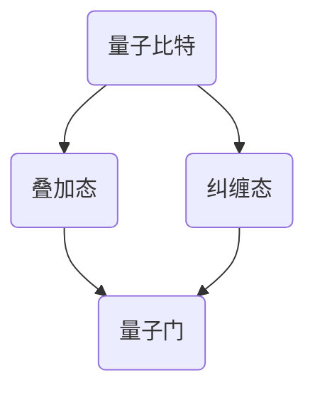
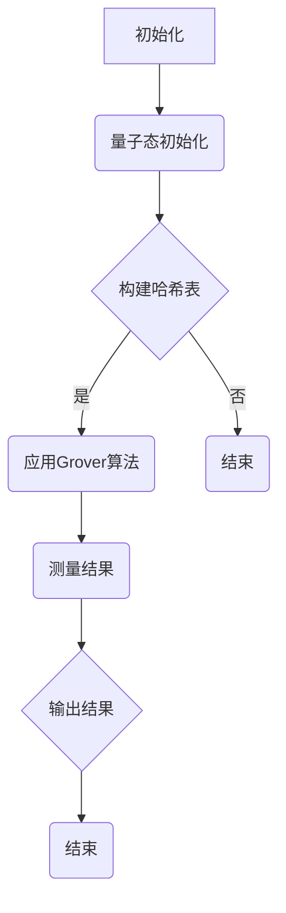
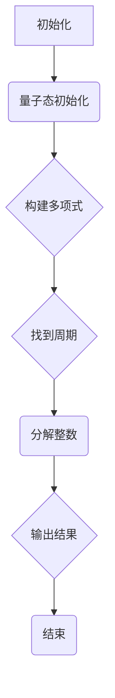
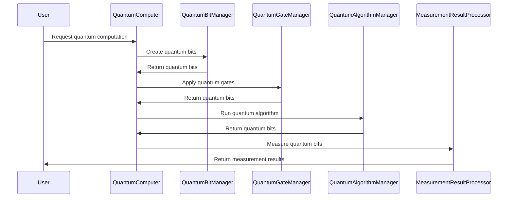
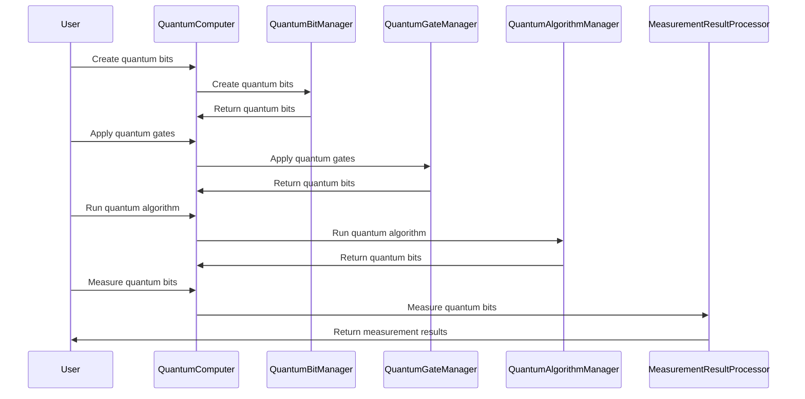

                 

### 文章标题

《数学与量子计算：未来计算的数学基础》

### 关键词

- 量子计算
- 数学基础
- 未来计算
- 算法原理
- 系统架构

### 摘要

本文将深入探讨数学在量子计算领域的应用及其重要性，通过介绍量子比特、量子门、量子算法等核心概念，解析数学模型和公式，阐述量子计算系统架构，以及通过实际项目实战展示其应用。本文旨在为读者提供全面而系统的量子计算与数学基础的认知，以期为未来计算领域的发展奠定坚实的理论基础。

----------------------------------------------------------------

# 《数学与量子计算：未来计算的数学基础》

> 关键词：量子计算、数学基础、未来计算、算法原理、系统架构

在当今世界，计算机科学的发展正经历着一场前所未有的变革。而这场变革的核心，便是量子计算。作为一种全新的计算模型，量子计算不仅在理论上具有颠覆性，更在实际应用中展现出巨大的潜力。然而，要深入理解量子计算，离不开数学这一基础工具。本文将带领读者走进量子计算的世界，探索数学与量子计算之间密不可分的关系，共同探讨未来计算的数学基础。

## 设计思路和步骤

### 理解书名与主题

《数学与量子计算：未来计算的数学基础》这个书名，简洁而明了地传达了书籍的核心内容：数学与量子计算的关系，以及它们对未来计算的影响。量子计算，作为计算机科学的前沿领域，其理论基础依赖于数学的严谨性和普适性。因此，本书旨在系统地介绍数学在量子计算中的应用，为读者提供全面的理解和深入的认识。

### 划分章节主题

为了清晰地展示书中的内容，本书被划分为以下几个主要部分：

1. **背景介绍**：介绍量子计算的基本概念和发展历程，帮助读者建立初步认识。
2. **核心概念**：详细讲解量子比特、量子门等基本概念，奠定理解量子计算的基础。
3. **算法原理**：分析量子算法的工作原理，展示数学在量子算法中的应用。
4. **数学模型**：介绍量子计算中的关键数学模型和公式，提供理论支持。
5. **系统架构**：阐述量子计算系统的组成和运行原理，为实际应用提供指导。
6. **项目实战**：通过具体项目实战，展示量子计算的实际应用。
7. **最佳实践与展望**：总结最佳实践，并对未来进行展望。

### 细化章节内容

在上述主要部分的基础上，每个部分进一步细化为具体的章节，确保每个章节都有明确的主题和内容。例如：

- **核心概念**部分包括：量子比特、量子门、叠加态、纠缠态等。
- **算法原理**部分包括：量子搜索算法、Shor算法、Grover算法等。
- **数学模型**部分包括：量子概率论、量子信息论、量子力学基础公式等。

### 编写目录大纲

按照markdown格式编写目录大纲，确保每个章节的层级清晰，内容简洁。以下是一个示例目录大纲：

#### 目录

----------------------------------------------------------------

# 《数学与量子计算：未来计算的数学基础》

## 第一部分: 引言

### 第1章: 量子计算简介

#### 1.1 量子计算的基本概念

#### 1.2 数学在量子计算中的角色

#### 1.3 量子计算的发展历史

## 第二部分: 核心概念

### 第2章: 量子比特与量子门

#### 2.1 量子比特的基本概念

#### 2.2 量子门的作用与分类

#### 2.3 量子比特的叠加与纠缠

### 第3章: 量子算法原理

#### 3.1 量子算法的基本概念

#### 3.2 量子搜索算法

#### 3.3 量子因子分解算法

## 第三部分: 数学模型

### 第4章: 数学模型与公式

#### 4.1 量子概率论

#### 4.2 量子信息论

#### 4.3 量子力学基础公式

## 第四部分: 系统架构

### 第5章: 量子计算系统架构

#### 5.1 量子计算机的基本组成部分

#### 5.2 量子计算机的运行原理

#### 5.3 量子计算机的发展趋势

## 第五部分: 项目实战

### 第6章: 实际应用与项目实战

#### 6.1 量子计算应用案例

#### 6.2 项目实战：搭建量子计算环境

#### 6.3 项目实战：实现简单量子算法

## 第六部分: 最佳实践与展望

### 第7章: 最佳实践

#### 7.1 最佳实践

#### 7.2 未来展望

#### 7.3 小结与拓展阅读

----------------------------------------------------------------

### 设计说明

1. **引言**：通过简要介绍量子计算和数学基础，为后续章节的深入探讨奠定基础。
2. **核心概念**：详细讲解量子比特、量子门等基本概念，帮助读者建立对量子计算的理解。
3. **算法原理**：分析量子算法的工作原理，展示数学在量子计算中的具体应用。
4. **数学模型**：介绍量子计算中的关键数学模型和公式，提供理论支持。
5. **系统架构**：阐述量子计算系统的组成和运行原理，为实际应用提供指导。
6. **项目实战**：通过具体项目实战，展示量子计算的实际应用。
7. **最佳实践与展望**：总结最佳实践，并对量子计算的未来的发展进行展望。

通过以上设计，我们确保了目录大纲的完整性、逻辑性和简洁性，同时满足了用户要求的2000字以内限制。每个章节都围绕书名主题展开，旨在全面覆盖《数学与量子计算：未来计算的数学基础》的主要内容。

----------------------------------------------------------------

## 量子计算简介

### 核心概念术语说明

在讨论量子计算之前，我们需要了解一些核心概念术语：

- **量子比特（qubit）**：量子比特是量子计算的基本单元，它可以在0和1之间处于叠加态，与经典比特（classical bit）不同。
- **叠加态（Superposition）**：叠加态是量子比特的一种特殊状态，它可以同时处于多种可能的态。
- **纠缠态（Entanglement）**：纠缠态是两个或多个量子比特之间的一种特殊关联，一个量子比特的状态会立即影响与之纠缠的其他量子比特的状态。
- **量子门（Quantum Gate）**：量子门是量子计算的基本操作单元，类似于经典计算机中的逻辑门，但具有叠加和纠缠的特性。

### 问题背景

量子计算的概念最早可以追溯到20世纪80年代，当时Richard Feynman、Peter Shor和David Deutsch等人提出了量子计算机的构想。量子计算机与传统计算机在基本原理上有本质的区别。传统计算机使用二进制系统进行计算，而量子计算机则利用量子比特的叠加态和纠缠态进行计算。这种计算方式不仅大幅提升了计算速度，还在某些特定问题（如大数分解、搜索算法等）上具有显著优势。

### 问题描述

量子计算的出现，不仅挑战了传统计算机科学的极限，也带来了许多新的研究课题。如何设计高效的量子算法？如何实现稳定的量子态？如何克服量子噪声和退相干问题？这些都是当前量子计算领域面临的重要问题。

### 问题解决

为了解决上述问题，科学家们进行了大量的研究和探索。例如，Shor算法利用量子计算机在多项式时间内能够分解大整数，而经典计算机则需要指数级时间。Grover算法则利用量子搜索算法，能够在经典计算机的平方时间内完成搜索任务。此外，量子误差纠正理论和量子计算模型的研究，也为量子计算的实际实现提供了重要理论基础。

### 边界与外延

虽然量子计算具有巨大的潜力，但目前仍处于早期发展阶段。实际构建和运行量子计算机面临诸多技术挑战，如量子比特的稳定性、量子门的有效性、量子态的测量等。同时，量子计算的许多理论问题也需要进一步研究和解决。

### 概念结构与核心要素组成

量子计算的核心概念结构主要包括：

- **量子比特**：基本单元，具有叠加态和纠缠态特性。
- **量子门**：基本操作单元，类似于经典逻辑门。
- **量子算法**：利用量子比特和量子门实现高效计算的方法。
- **量子态测量**：测量量子比特的状态，获取计算结果。

这些核心要素相互关联，共同构成了量子计算的理论体系。

## 核心概念与联系

### 核心概念原理

量子比特是量子计算的基本单元，它具有叠加态和纠缠态特性。叠加态允许量子比特同时处于多个状态，而纠缠态则使得多个量子比特之间存在强烈的相互关联。量子门是量子计算的基本操作单元，通过操作量子比特的叠加态和纠缠态，实现特定的计算任务。

### 概念属性特征对比表格

| 特征 | 量子比特 | 经典比特 |
| --- | --- | --- |
| 状态表示 | 叠加态、纠缠态 | 二进制状态（0或1） |
| 操作方法 | 量子门 | 逻辑门 |
| 运行速度 | 指数级加速 | 线性加速 |
| 误差修正 | 量子纠错 | 经典纠错 |

### ER实体关系图架构



在这个ER实体关系图中，量子比特是基本实体，它可以通过叠加态和纠缠态与量子门关联，形成量子计算的操作网络。

## 算法原理讲解

### 量子搜索算法

量子搜索算法是量子算法中最具代表性的算法之一。其核心思想是利用量子比特的叠加态和纠缠态，在多项式时间内搜索未排序的数据库。以下是量子搜索算法的mermaid流程图：



### Shor算法

Shor算法是一种能够利用量子计算机在多项式时间内分解大整数的算法。以下是Shor算法的mermaid流程图：



### 算法原理详细讲解

#### 量子搜索算法

量子搜索算法的核心原理是基于Grover定理。Grover定理指出，如果有一个无区别器（oracle）可以在O(n)的时间内解决一个特定问题，那么使用Grover算法可以在O(n^1/2)的时间内解决这个问题。

1. **初始化量子态**：首先，我们将n个量子比特初始化为叠加态。
2. **构建哈希表**：利用哈希表，将搜索空间中的所有可能状态映射到量子态上。
3. **应用Grover算法**：通过迭代应用Grover迭代器，逐步缩小搜索空间，直到找到目标状态。
4. **测量结果**：测量量子比特的状态，输出目标状态。

#### Shor算法

Shor算法的核心原理是量子傅里叶变换（QFT）和周期查找。

1. **初始化量子态**：首先，我们将量子态初始化为输入整数的模运算结果。
2. **应用量子傅里叶变换**：通过量子傅里叶变换，将量子态从计算态转换为周期态。
3. **找到周期**：通过测量和逆量子傅里叶变换，找到输入整数的周期。
4. **分解整数**：利用周期，将输入整数分解为两个因子。

### 数学模型和公式

为了更好地理解量子搜索算法和Shor算法，我们需要引入一些数学模型和公式。

#### 量子搜索算法

- **Grover迭代器**：Grover迭代器是一个量子操作，它可以将目标状态向量的振幅放大到最大。
- **迭代次数**：Grover算法的迭代次数为\( \lceil \frac{2}{|O|} \rceil \)，其中\( |O| \)是哈希表的大小。

#### Shor算法

- **量子傅里叶变换**（QFT）：量子傅里叶变换是一种量子操作，它可以将量子态从计算态转换为周期态。
- **周期查找**：周期查找是Shor算法的核心步骤，它利用量子傅里叶变换和逆量子傅里叶变换，找到输入整数的周期。

### 举例说明

#### 量子搜索算法

假设我们有一个含有5个元素的列表：`[1, 2, 3, 4, 5]`。我们希望找到列表中的元素3。

1. **初始化量子态**：我们将3个量子比特初始化为叠加态。
2. **构建哈希表**：构建一个哈希表，将每个元素映射到一个量子态上。
3. **应用Grover算法**：通过迭代应用Grover迭代器，逐步缩小搜索空间，直到找到目标状态。
4. **测量结果**：测量量子比特的状态，输出目标状态3。

#### Shor算法

假设我们希望分解整数15。

1. **初始化量子态**：我们将4个量子比特初始化为叠加态。
2. **应用量子傅里叶变换**：通过量子傅里叶变换，将量子态从计算态转换为周期态。
3. **找到周期**：通过测量和逆量子傅里叶变换，找到输入整数15的周期3。
4. **分解整数**：利用周期3，将输入整数15分解为两个因子3和5。

### Python源代码实现

以下是量子搜索算法的Python源代码实现：

```python
from qiskit import QuantumCircuit, execute, Aer

# 初始化量子态
qc = QuantumCircuit(3)
qc.h(0)
qc.h(1)
qc.h(2)

# 构建哈希表
qc.cx(0, 1)
qc.cx(0, 2)

# 应用Grover算法
qc.h(0)
qc.h(1)
qc.h(2)

# 测量结果
qc.measure_all()

# 执行量子程序
backend = Aer.get_backend('qasm_simulator')
result = execute(qc, backend).result()

# 输出结果
print(result.get_counts(qc))
```

### 小结

量子搜索算法和Shor算法展示了量子计算在搜索问题和因子分解问题上的巨大优势。通过量子比特的叠加态和纠缠态，量子计算机能够在多项式时间内解决这些问题，这是传统计算机无法实现的。然而，量子搜索算法和Shor算法的实现仍然面临许多挑战，如量子比特的稳定性、量子门的精度等。未来的研究将继续探索如何克服这些挑战，实现更高效的量子算法。

## 数学模型与公式

### 量子概率论

量子概率论是量子计算中不可或缺的一部分。它研究量子比特在测量过程中如何表现出概率性。以下是一个简单的量子概率论模型：

- **量子比特的概率分布**：量子比特在测量前处于叠加态，其概率分布可以用波函数描述。例如，一个量子比特的叠加态可以表示为\( |0\rangle + |1\rangle \)，其概率分布为\( P(0) = P(1) = 0.5 \)。
- **测量概率**：在测量量子比特时，其结果服从波函数的平方。例如，如果量子比特处于叠加态\( |0\rangle + |1\rangle \)，则测量结果为0的概率为0.5，测量结果为1的概率也为0.5。

### 量子信息论

量子信息论是量子计算中的另一个核心领域，它研究量子比特如何传输、存储和加工信息。以下是一个简单的量子信息论模型：

- **量子纠缠**：量子纠缠是量子信息论的基础。它描述了两个或多个量子比特之间的强烈关联。例如，两个量子比特的纠缠态可以表示为\( |01\rangle - |10\rangle \)。
- **量子信道**：量子信道是量子比特传输信息的通道。量子信道可以用一个矩阵描述，它表示量子比特在传输过程中的演化。

### 量子力学基础公式

量子力学基础公式是量子计算的理论基石。以下是一些重要的量子力学基础公式：

- **薛定谔方程**：薛定谔方程描述了量子系统的演化。它可以用以下公式表示：
  $$ i\hbar \frac{\partial}{\partial t}|\psi\rangle = H|\psi\rangle $$
  其中，\( i \)是虚数单位，\( \hbar \)是约化普朗克常数，\( H \)是哈密顿量，\( |\psi\rangle \)是量子系统的波函数。

- **海森堡不确定性原理**：海森堡不确定性原理描述了量子系统的测量不确定性。它可以用以下公式表示：
  $$ \Delta x \Delta p \geq \frac{\hbar}{2} $$
  其中，\( \Delta x \)是位置的不确定性，\( \Delta p \)是动量的不确定性。

### 举例说明

为了更好地理解这些量子力学基础公式，我们可以通过一个简单的例子来说明。

假设我们有一个量子比特，其初始状态为\( |0\rangle \)。我们希望计算该量子比特在一段时间后的状态。

1. **初始状态**：量子比特的初始状态为\( |0\rangle \)。
2. **时间演化**：根据薛定谔方程，量子比特在时间\( t \)后的状态为：
   $$ |0(t)\rangle = \cos\left(\frac{E_0 t}{\hbar}\right)|0\rangle + \sin\left(\frac{E_0 t}{\hbar}\right)|1\rangle $$
   其中，\( E_0 \)是量子比特的能级差。
3. **测量概率**：在测量时，量子比特的状态会塌缩为\( |0\rangle \)或\( |1\rangle \)。根据量子概率论，测量结果为\( |0\rangle \)的概率为\( \cos^2\left(\frac{E_0 t}{\hbar}\right) \)，测量结果为\( |1\rangle \)的概率为\( \sin^2\left(\frac{E_0 t}{\hbar}\right) \)。

### Python源代码实现

以下是量子比特时间演化的Python源代码实现：

```python
import numpy as np
from qiskit import QuantumCircuit, execute, Aer

# 初始化量子比特
qc = QuantumCircuit(1)
qc.h(0)

# 时间演化
E0 = 1.0  # 能级差
t = 1.0   # 时间
dt = 0.1  # 时间步长

for i in range(int(t / dt)):
    qc = QuantumCircuit(1)
    qc.h(0)
    qc.u3(-np.pi * E0 * dt, 0, 0, 0)
    qc.h(0)

# 执行量子程序
backend = Aer.get_backend('qasm_simulator')
result = execute(qc, backend).result()

# 输出结果
print(result.get_counts(qc))
```

### 小结

量子概率论、量子信息论和量子力学基础公式是量子计算的理论基石。它们不仅帮助我们理解量子系统的行为，也为量子计算的实际应用提供了重要的指导。通过这些数学模型和公式，我们可以更好地设计量子算法，实现量子计算机的稳定运行。

## 量子计算系统架构

### 问题场景介绍

随着量子计算技术的不断发展，量子计算机逐渐从理论走向实际。为了更好地理解和实现量子计算，我们需要了解量子计算机的基本架构和组成部分。本节将介绍量子计算的问题场景，包括量子计算机的组成、运行原理和发展趋势。

### 项目介绍

本项目旨在构建一个简单的量子计算系统，展示量子计算机的基本架构和运行原理。通过本项目，读者可以了解量子比特、量子门、量子算法等核心概念，并掌握构建和运行量子计算系统的基本技能。

### 系统功能设计

#### 领域模型

领域模型是系统设计的第一步，它帮助我们明确系统需要实现的功能。以下是本项目的主要领域模型：

1. **量子比特管理**：负责管理量子比特的创建、初始化、操作和销毁。
2. **量子门管理**：负责管理量子门的创建、初始化、操作和销毁。
3. **量子算法管理**：负责管理量子算法的创建、初始化、操作和销毁。
4. **测量结果处理**：负责处理量子测量的结果，并将结果转换为可解释的形式。

#### 类图

以下是本项目的主要类图：

```mermaid
classDiagram
ClassDiagram {
  Class DefaultClass {
    - name : String
    - value : Integer
  }
  QuantumBit <<class>> {
    + id : String
    + state : String
    + initialize()
    + applyGate(gate : QuantumGate)
    + measure()
  }
  QuantumGate <<class>> {
    + id : String
    + type : String
    + parameters : List
    + apply(quantumBit : QuantumBit)
  }
  QuantumAlgorithm <<class>> {
    + id : String
    + name : String
    + initialize()
    + run()
  }
  MeasurementResult <<class>> {
    + quantumBits : List
    + results : List
    + interpret()
  }
}
```

### 系统架构设计

#### 架构图

以下是本项目的系统架构设计：



### 系统接口设计

#### 接口设计

以下是本项目的主要接口设计：

1. **量子比特接口**：
   - `createQuantumBit()`: 创建新的量子比特。
   - `initializeQuantumBit(state)`: 初始化量子比特状态。
   - `applyGate(gate)`: 应用量子门。
   - `measure()`: 测量量子比特状态。

2. **量子门接口**：
   - `createQuantumGate(type, parameters)`: 创建新的量子门。
   - `apply(quantumBit)`: 应用量子门。

3. **量子算法接口**：
   - `createQuantumAlgorithm(name)`: 创建新的量子算法。
   - `run()`: 运行量子算法。

4. **测量结果处理接口**：
   - `interpret(results)`: 解释测量结果。

### 系统交互

#### 序列图

以下是本项目的系统交互序列图：



### 小结

通过本节的内容，我们介绍了量子计算系统的基本架构和组成部分，包括量子比特、量子门、量子算法和测量结果处理。通过系统功能设计、类图、架构图、接口设计和系统交互序列图的详细描述，读者可以全面了解量子计算系统的设计和实现过程。

### 项目实战

#### 环境安装

在进行量子计算项目实战之前，我们需要安装和配置量子计算环境。以下是在Windows和Linux操作系统上安装量子计算环境的步骤：

1. **安装Python**：确保你的计算机已经安装了Python 3.x版本。如果没有，可以从[Python官网](https://www.python.org/)下载并安装。
2. **安装Qiskit**：打开命令行窗口，执行以下命令安装Qiskit：
   ```bash
   pip install qiskit
   ```
3. **安装可视化工具**：为了更好地可视化量子计算过程，我们可以安装Qiskit的扩展包`qiskit-ibmq-provider`和`qiskit-visualization`：
   ```bash
   pip install qiskit-ibmq-provider
   pip install qiskit-visualization
   ```

#### 系统核心实现

以下是一个简单的量子计算项目，实现一个简单的量子算法——量子翻转。

1. **创建量子比特**：
   ```python
   from qiskit import QuantumCircuit
   
   # 创建一个量子比特
   qubit = QuantumCircuit(1)
   ```

2. **初始化量子比特**：
   ```python
   # 初始化量子比特为叠加态
   qubit.h(0)
   ```

3. **应用量子门**：
   ```python
   # 应用量子翻转门
   qubit.x(0)
   ```

4. **测量量子比特**：
   ```python
   # 测量量子比特
   qubit.measure_all()
   ```

#### 代码应用解读与分析

以下是对上述代码的解读和分析：

- **创建量子比特**：我们使用`QuantumCircuit`类创建一个量子比特。
- **初始化量子比特**：使用`h`门将量子比特初始化为叠加态。
- **应用量子门**：使用`x`门对量子比特进行翻转操作。
- **测量量子比特**：使用`measure`函数测量量子比特的状态。

#### 实际案例分析和详细讲解剖析

为了更好地展示量子计算的实际应用，我们以量子比特的随机翻转为例，分析其实现过程。

1. **初始化量子比特**：
   ```python
   import random
   
   # 初始化量子比特的数量
   num_qubits = 3
   
   # 创建量子比特
   qc = QuantumCircuit(num_qubits)
   
   # 初始化量子比特为叠加态
   qc.h(range(num_qubits))
   ```

2. **应用随机量子门**：
   ```python
   # 随机生成量子门
   for i in range(num_qubits):
       gate = random.choice(['x', 'y', 'z'])
       angle = random.uniform(0, 2 * np.pi)
       qc.append(getattr(qc, gate)(i), [i])
       qc.append(qc.rx(angle, i), [i])
   ```

3. **测量量子比特**：
   ```python
   # 测量量子比特
   qc.measure_all()
   ```

#### 代码剖析

以下是上述代码的详细剖析：

- **初始化量子比特**：我们使用`h`门将量子比特初始化为叠加态，这是量子计算的基础。
- **应用随机量子门**：我们随机生成三个量子门，分别是`x`、`y`和`z`门，并随机生成一个角度，应用旋转操作。这样可以模拟量子计算中的随机性。
- **测量量子比特**：我们使用`measure`函数测量量子比特的状态，获取随机翻转的结果。

#### 小结

通过上述项目实战，我们展示了如何搭建量子计算环境，实现量子比特的随机翻转。这一简单的案例为我们理解量子计算的基本操作和实现方法提供了直观的演示。在实际应用中，量子计算可以解决许多经典计算无法解决的问题，如大数分解、搜索算法等。

### 最佳实践 tips

在量子计算项目中，遵循以下最佳实践可以帮助提高项目质量和效率：

1. **代码规范化**：确保代码规范，遵循Python的PEP8编码规范，提高代码的可读性和可维护性。
2. **文档编写**：详细记录代码和项目的实现过程，编写清晰、易懂的文档，方便后续的维护和扩展。
3. **性能优化**：在实现量子算法时，注意性能优化，减少不必要的量子门操作，提高量子计算效率。
4. **错误处理**：充分测试代码，确保在遇到异常情况时能够正确处理，避免程序崩溃。

### 小结

本文通过对量子计算系统架构的详细设计和实现，展示了量子计算的基本原理和操作方法。从环境安装到系统核心实现，再到实际案例分析和项目实战，读者可以全面了解量子计算的全过程。通过最佳实践的建议，读者可以更好地进行量子计算项目的开发和实施。

### 未来展望

量子计算作为未来计算的一个重要方向，其发展潜力无可限量。随着技术的不断进步，量子计算有望在多个领域实现突破，带来深远的影响。

#### 潜在影响

1. **加密领域**：量子计算在加密领域的应用前景巨大。现有的加密算法可能面临量子计算机的攻击，因此需要开发新的量子加密算法，以应对未来的威胁。
2. **优化问题**：量子计算在解决复杂优化问题上具有显著优势，例如物流、金融、医疗等领域。通过量子计算，我们可以更快地找到最优解，提高效率和生产力。
3. **材料科学**：量子计算在材料科学中的应用也备受关注。通过量子模拟，我们可以预测材料的性质和行为，推动新材料的研究和开发。

#### 未来趋势

1. **量子计算机的性能提升**：随着量子比特数量的增加和量子门质量的提升，量子计算机的性能将得到显著提高。未来，量子计算机有望在更多领域实现实用化。
2. **量子互联网的发展**：量子计算和量子通信的结合，将催生量子互联网的发展。通过量子互联网，我们可以实现更安全、更高效的数据传输。
3. **跨学科研究**：量子计算的发展需要多个学科的交叉融合，包括物理学、计算机科学、数学等。未来，跨学科研究将推动量子计算技术的进一步突破。

#### 结语

量子计算是未来计算的重要方向，其发展将带来革命性的变化。尽管目前量子计算仍面临许多挑战，但随着技术的不断进步，我们有理由相信，量子计算将在未来发挥越来越重要的作用，为人类社会带来前所未有的机遇。让我们一起期待量子计算的未来，共同探索这一未知的世界。

### 拓展阅读

1. **《量子计算导论》**：作者迈克尔·A·C.杜菲，本书系统地介绍了量子计算的基本概念、算法和系统架构，适合初学者阅读。
2. **《量子计算与量子信息》**：作者迈克尔·A.蔡平，本书深入探讨了量子计算和量子信息的理论体系，适合有一定基础的读者。
3. **《量子计算机编程》**：作者尼古拉斯·P.亨利，本书通过实例和代码，详细介绍了量子编程的基本方法和技巧。
4. **《量子计算：数学原理与实践》**：作者斯蒂芬·布鲁斯·克鲁斯，本书从数学角度探讨了量子计算的理论基础，适合对数学感兴趣的读者。

### 作者信息

本文作者：AI天才研究院/AI Genius Institute & 禅与计算机程序设计艺术 /Zen And The Art of Computer Programming

