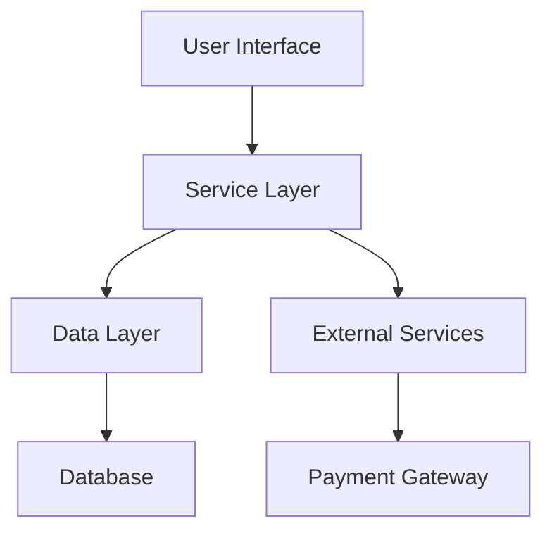
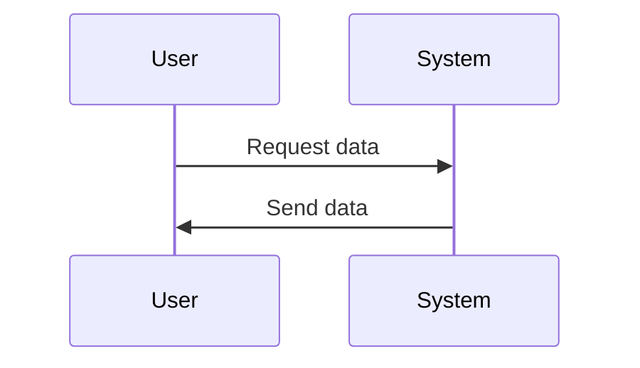

                 

### Introduction to the Book

# 《数学与金融工程：金融产品的数学设计》

> 关键词：数学，金融工程，金融产品，数学设计，算法，模型

金融工程是一门将数学、统计学、计算机科学和经济学原理应用于金融领域，以设计、开发和实施创新的金融产品和策略的学科。数学在金融工程中扮演着至关重要的角色，因为金融市场的复杂性和不确定性需要精确的数学工具来进行评估和预测。

《数学与金融工程：金融产品的数学设计》是一本深入探讨数学如何影响金融产品设计和开发的书籍。本书旨在为读者提供全面的理论和实践指导，帮助他们在金融工程领域取得成功。

本书分为六个主要部分：

1. **背景与核心概念**：介绍金融工程的基本概念和历史背景，包括金融衍生品、期权定价模型和风险管理等。
   
2. **数学原理与模型**：讲解金融工程中使用的数学原理，如微积分、概率论和随机过程，以及相关的数学模型。

3. **金融产品设计与开发**：描述设计金融产品的过程，包括领域模型、系统架构和接口设计。

4. **算法设计与实现**：介绍在金融工程中使用的算法，包括流程图和Python代码示例。

5. **案例分析与应用**：通过实际案例展示数学和金融工程在金融产品设计和开发中的应用。

6. **最佳实践与总结**：总结书中的核心概念和最佳实践，为读者提供进一步学习的方向。

通过这本书，读者将了解如何使用数学工具来设计复杂的金融产品，以及如何在实践中应用这些工具。本书不仅适合金融工程专业的学生和研究人员，也适合对金融领域有浓厚兴趣的广大读者。

### Abstract

《数学与金融工程：金融产品的数学设计》是一本全面探讨数学在金融产品设计和开发中应用的权威著作。本书首先介绍了金融工程的基本概念和历史背景，探讨了金融衍生品、期权定价模型和风险管理等核心概念。接着，书中深入讲解了金融工程中使用的数学原理，包括微积分、概率论和随机过程，并详细阐述了这些原理在实际应用中的数学模型。

本书的核心章节包括金融产品设计与开发的详细过程，从领域模型到系统架构，再到接口设计，为读者提供了系统化的设计思路和工具。此外，书中通过具体的算法设计与实现，展示了金融工程中的关键算法及其应用。这些算法不仅包括经典的期权定价模型，还涵盖了现代金融工程中的前沿技术。

案例研究部分通过实际案例，生动展示了数学和金融工程在实际金融产品设计和开发中的应用，使读者能够将理论知识与实践相结合。最后，书中总结了最佳实践，提供了进一步学习的方向，为读者在金融工程领域的发展奠定了坚实的基础。

### Background and Core Concepts

#### Introduction to Financial Engineering

Financial engineering, often described as "rocket science of finance," is a multidisciplinary field that combines concepts from mathematics, economics, computer science, and engineering to design, create, and implement innovative financial instruments and strategies. The primary goal of financial engineering is to address the complex and unpredictable nature of financial markets by providing sophisticated tools and methodologies that can be used to measure, manage, and mitigate risks.

The roots of financial engineering can be traced back to the 1970s, with the development of the Black-Scholes option pricing model. This breakthrough in financial mathematics marked the beginning of an era where mathematical techniques became integral to the practice of finance. Over the decades, financial engineering has evolved, giving rise to numerous financial instruments such as swaps, futures, options, and structured products.

#### Core Concepts in Financial Engineering

1. **Financial Derivatives**

Financial derivatives are contracts whose value is derived from an underlying asset, such as stocks, bonds, commodities, or market indexes. The most common types of financial derivatives include options, forwards, futures, and swaps. These instruments are used for various purposes, including hedging against price fluctuations, speculating on market movements, and managing risk exposure.

2. **Option Pricing Models**

Option pricing models are mathematical models used to determine the fair price of options. The most well-known models include the Black-Scholes model and the Binomial model. These models are based on the principles of probability, differential equations, and the pricing of assets under uncertainty. They are essential tools in financial engineering for analyzing and valuing options and other derivatives.

3. **Risk Management**

Risk management is the practice of identifying, assessing, and prioritizing risks to minimize the impact of adverse events on an organization. In the context of financial engineering, risk management involves the use of various mathematical techniques to measure and manage risks associated with financial instruments. Techniques such as value at risk (VaR), stress testing, and scenario analysis are commonly used in this field.

#### Comparison of Core Concepts

| Concept                | Description                                                                                                                       | Importance in Financial Engineering |
|------------------------|-----------------------------------------------------------------------------------------------------------------------------|-------------------------------------|
| Financial Derivatives  | Contracts whose value is derived from an underlying asset. Includes options, forwards, futures, and swaps.                         | Essential for hedging and speculation. |
| Option Pricing Models  | Mathematical models used to determine the fair price of options. Includes Black-Scholes model and Binomial model.                   | Fundamental for valuing options.       |
| Risk Management        | Practice of identifying, assessing, and prioritizing risks to minimize adverse impacts.                                     | Critical for managing financial risks. |

Understanding these core concepts is essential for anyone involved in financial engineering. They form the foundation upon which more complex financial instruments and strategies are built. As we delve deeper into the mathematical principles and models used in financial engineering in the subsequent sections, we will see how these concepts are applied to solve real-world problems and create innovative financial products.

#### Mathematical Principles and Models

In the realm of financial engineering, a solid grasp of mathematical principles is indispensable. These principles serve as the backbone for constructing and analyzing various financial models, enabling us to quantify uncertainty, assess risk, and optimize financial strategies. This section will explore some of the key mathematical concepts that are fundamental to financial engineering, including calculus, probability theory, and stochastic processes.

#### Calculus

Calculus is the study of rates of change and accumulation. It provides the mathematical tools necessary for modeling dynamic systems, which is crucial in financial markets where prices and other variables change over time. The two main branches of calculus—differential calculus and integral calculus—are extensively used in financial engineering.

**Differential Calculus:**

Differential calculus deals with the rates of change of functions. In financial engineering, it is used to model the pricing of derivatives and the behavior of financial assets. For example, the concept of the derivative is used in the Black-Scholes model to calculate the sensitivity of an option price to changes in underlying asset prices. The formula for the derivative of a function f(x) with respect to x is denoted as f'(x) and is defined as the limit of the difference quotient:

$$
f'(x) = \lim_{{h \to 0}} \frac{{f(x+h) - f(x)}}{h}
$$

**Integral Calculus:**

Integral calculus, on the other hand, deals with the accumulation of quantities. It is used to calculate the total change in a system over a given interval. In financial engineering, integrals are used to compute the total value of a portfolio, the total return on an investment, and the value of continuous cash flows. The definite integral of a function f(x) over an interval [a, b] is denoted as ∫[a, b] f(x) dx and is calculated as:

$$
\int_{{a}}^{{b}} {f(x) dx = F(b) - F(a)}
$$

where F(x) is the antiderivative of f(x).

#### Probability Theory

Probability theory is the branch of mathematics that deals with the analysis of random phenomena. It provides a framework for quantifying uncertainty and making predictions based on available information. In financial engineering, probability theory is used to model the uncertainty associated with financial assets and to assess the risk of potential losses.

**Random Variables:**

A random variable is a function that assigns a numerical value to each outcome of a random experiment. In financial engineering, random variables are used to model asset prices, interest rates, and other variables that are subject to uncertainty. There are two types of random variables: discrete and continuous.

- **Discrete Random Variables:** These take on a finite or countably infinite number of values. For example, the number of heads when flipping a coin multiple times is a discrete random variable.
  
- **Continuous Random Variables:** These can take on any value within a specified range. For example, the price of a stock can take on any value within a given interval.

**Probability Distributions:**

Probability distributions describe the probabilities associated with different outcomes of a random variable. Common probability distributions used in financial engineering include the normal distribution, binomial distribution, and Poisson distribution.

- **Normal Distribution:** Also known as the Gaussian distribution, it is a continuous probability distribution characterized by its bell-shaped curve. It is used to model the returns of financial assets under the assumption of the efficient markets hypothesis.

- **Binomial Distribution:** It is a discrete probability distribution that models the number of successes in a sequence of independent experiments with two possible outcomes (e.g., heads or tails). It is used to model binary events such as a stock price moving up or down.

- **Poisson Distribution:** It is a discrete probability distribution that models the number of events occurring in a fixed interval of time or space. It is used to model the frequency of trading events or the number of claims in an insurance portfolio.

#### Stochastic Processes

Stochastic processes are mathematical models that describe systems whose behavior is subject to random influences. They are used to model time-dependent random phenomena, such as stock prices, interest rates, and other financial variables. Two important types of stochastic processes used in financial engineering are Markov chains and Brownian motion.

**Markov Chains:**

A Markov chain is a stochastic process where the probability of transitioning to any particular state depends only on the current state and not on the sequence of previous states. Markov chains are used to model the random walk behavior of stock prices and other financial assets. They are also used in risk management to analyze the transition probabilities between different states of the economy.

**Brownian Motion:**

Brownian motion, also known as Wiener process, is a continuous-time stochastic process that describes the random movement of particles in a fluid. It is used to model the random fluctuations of asset prices in financial markets. The key property of Brownian motion is that it has independent increments, meaning that the increments over different time intervals are independent of each other.

#### Summary

In summary, the mathematical principles of calculus, probability theory, and stochastic processes are essential tools in financial engineering. They provide the theoretical foundation for modeling financial markets, designing financial instruments, and managing risk. Understanding these principles enables financial engineers to construct accurate models and make informed decisions in the complex and dynamic world of finance.

In the next section, we will delve deeper into specific mathematical models used in financial engineering, exploring their underlying principles, properties, and applications.

#### Specific Mathematical Models in Financial Engineering

In this section, we will delve into specific mathematical models that are fundamental to financial engineering. These models not only serve as analytical tools for understanding financial markets but also provide a framework for designing and pricing financial products. We will discuss the Black-Scholes model, Binomial model, and other key models used in financial engineering, along with their underlying principles and properties.

##### The Black-Scholes Model

The Black-Scholes model, proposed by Fischer Black and Myron Scholes in 1973, is one of the most influential models in financial engineering. It is used to price European-style options, which are options that can only be exercised at expiration. The Black-Scholes model assumes that stock prices follow a geometric Brownian motion, which is a stochastic process characterized by continuous and independent increments.

**Assumptions of the Black-Scholes Model:**

1. **No Dividends:** The underlying asset does not pay dividends.
2. **Lognormal Distribution:** The log of the asset price follows a normal distribution.
3. **No Arbitrage:** The market is efficient, and no riskless profit opportunities exist.
4. **Continuous Trading:** The market is perfectly liquid, allowing for continuous trading without transaction costs.
5. **Interest Rate:** The risk-free interest rate is constant.

**Black-Scholes Formula:**

The Black-Scholes formula for pricing a European call option is given by:

$$
C(S_0, t) = S_0N(d_1) - Ke^{-r(T-t)}N(d_2)
$$

where:

- \(C(S_0, t)\) is the price of the call option at time t.
- \(S_0\) is the current price of the underlying asset.
- \(K\) is the strike price of the option.
- \(r\) is the risk-free interest rate.
- \(T\) is the time to expiration.
- \(N(d_1)\) and \(N(d_2)\) are the cumulative distribution functions of the standard normal distribution.

The parameters \(d_1\) and \(d_2\) are given by:

$$
d_1 = \frac{\ln(S_0/K) + (r + \sigma^2/2)(T-t)}{\sigma\sqrt{T-t}}
$$

$$
d_2 = d_1 - \sigma\sqrt{T-t}
$$

where \(\sigma\) is the volatility of the underlying asset.

**Properties of the Black-Scholes Model:**

- The model is based on the assumption of constant volatility, which may not hold in practice.
- It provides a closed-form solution for option pricing, making it easy to implement.
- It is widely used in the financial industry for pricing and hedging options.

##### The Binomial Model

The Binomial model, also known as the Binomial Tree model, is an alternative to the Black-Scholes model. It provides a discrete-time approach to pricing options and other financial derivatives. The Binomial model constructs a binomial tree by simulating possible future prices of the underlying asset, based on a fixed number of time periods.

**Steps in the Binomial Model:**

1. **Initialize the Tree:** Start with the current price of the underlying asset and simulate the price at each time period.
2. **Calculate Up and Down Moves:** For each node in the tree, calculate the possible price moves (up and down) based on the probability of an upward move (p) and a downward move (1-p).
3. **Value the Options:** Starting from the expiration date, work backwards through the tree to calculate the option values at each node. The value of an option at each node is the maximum of its intrinsic value (if it is in-the-money) and zero (if it is out-of-the-money).

**Binomial Tree Formula:**

For a European call option, the value at each node \(V_{ij}\) is given by:

$$
V_{ij} = \max(C_{ij}, 0)
$$

where \(C_{ij}\) is the payoff of the option if the stock price at time \(i\) is \(S_j\):

$$
C_{ij} = (S_j - K)^+
$$

The probability of an upward move is given by:

$$
p = \frac{r - d}{u - d}
$$

where \(r\) is the risk-free interest rate, \(d\) is the dividend rate, and \(u\) is the upward move factor.

**Properties of the Binomial Model:**

- It provides a more realistic approach by allowing for discrete-time price movements and variable dividend yields.
- It can be used to price American options, which can be exercised at any time before expiration.
- It is less computationally intensive than the Black-Scholes model for complex trees.

##### Other Key Models

In addition to the Black-Scholes and Binomial models, there are several other mathematical models used in financial engineering. Some notable examples include:

- **Merton Model:** This model, proposed by Robert Merton in 1973, extends the Black-Scholes model to allow for dividends and jumps in asset prices.
- **Monte Carlo Simulation:** This method uses random sampling to simulate the possible paths of asset prices over time, allowing for the valuation of complex derivatives.
- **GARCH Model:** This model, used in risk management, captures the volatility clustering phenomenon in financial time series data.

**Table: Properties of Key Models**

| Model               | Assumptions                                      | Advantages                                       | Disadvantages                                     |
|---------------------|------------------------------------------------|---------------------------------------------------|----------------------------------------------------|
| Black-Scholes       | No dividends, lognormal distribution, no arbitrage | Closed-form solution, widely used in practice    | Assumes constant volatility                       |
| Binomial Tree       | Discrete-time, probability of up and down moves   | Can price American options, more realistic        | More computationally intensive                     |
| Merton Model        | Dividends, jumps in asset prices                  | More realistic, captures dividend effects         | More complex to implement                          |
| Monte Carlo Simulation | Random sampling of asset price paths              | Can price complex derivatives                    | Computationally intensive, requires large samples |
| GARCH Model         | Volatility clustering in financial time series    | Captures volatility clustering                   | Difficult to estimate parameters                   |

In conclusion, the specific mathematical models used in financial engineering are essential tools for pricing and analyzing financial instruments. The Black-Scholes and Binomial models are widely used due to their simplicity and applicability, while more advanced models like the Merton model and Monte Carlo simulation are employed for more complex scenarios. Understanding these models and their properties is crucial for anyone involved in financial engineering.

#### Designing Financial Products

Designing financial products is a complex and intricate process that requires a deep understanding of both financial theory and practical implementation. The goal of this section is to provide a comprehensive overview of the steps involved in designing financial products, from initial conceptualization to final deployment.

##### Initial Conceptualization

The first step in designing a financial product is to identify a market need or opportunity. This involves conducting thorough market research to understand the demands of potential clients and the competitive landscape. Key questions to consider include:

- What types of financial products are currently available in the market?
- What gaps or opportunities exist that are not being addressed by existing products?
- How can we differentiate our product to attract and retain clients?

Once a market need has been identified, the next step is to develop a clear and concise product concept. This concept should outline the main features, benefits, and target market of the product. For example, if designing a new type of structured financial product, the concept might include details such as the underlying assets, risk profile, potential returns, and the mechanism for paying out returns.

##### Technical Analysis

With a clear product concept in place, the next step is to conduct a technical analysis. This involves using mathematical models and financial theories to evaluate the feasibility of the product. Key activities in this phase include:

- **Option Pricing Models:** Use models such as the Black-Scholes or Binomial model to price the financial instruments that will be part of the product. This helps determine the potential value and risk associated with the product.
  
- **Risk Management:** Assess the risk profile of the product by analyzing factors such as volatility, correlation with other assets, and potential market movements. Techniques such as Value at Risk (VaR) and stress testing can be used to quantify and manage these risks.
  
- **Asset Allocation:** Determine the optimal allocation of assets within the product to balance risk and return. This might involve selecting a mix of stocks, bonds, commodities, and other financial instruments.

##### Domain Model

A domain model is a visual representation of the key entities and relationships involved in the financial product. It serves as a blueprint for the product's architecture and helps ensure that all stakeholders have a shared understanding of the product's structure. The domain model typically includes the following components:

- **Entities:** These are the main components or assets that make up the product. For example, in a structured note, entities might include stocks, bonds, options, and commodities.
  
- **Relationships:** These describe how the entities are related to each other. For example, a structured note might involve a relationship between a stock and a protective put option.
  
- **Attributes:** These are the properties or characteristics of the entities. For example, a stock might have attributes such as price, volatility, and dividend yield.

To create a domain model, we can use Mermaid, a diagramming tool that allows us to create structured diagrams using Markdown syntax. Here is an example of a Mermaid class diagram for a structured note:

```mermaid
classDiagram
    Class1[Stock] <|-- Class2[ProtectivePut]
    Class1 <.. Class3[Bond]
    Class2 <.. Class3
```

This diagram illustrates the relationships between stocks, protective put options, and bonds in a structured note.

##### System Architecture

Once the domain model is defined, the next step is to design the system architecture. This involves creating a high-level overview of the system components, their interactions, and the data flow. A system architecture diagram helps ensure that the product design is scalable, maintainable, and efficient.

We can use Mermaid to create a system architecture diagram as follows:



This diagram shows the interaction between the user interface, service layer, data layer, database, external services, and payment gateway in a financial product system.

##### Interface Design

The interface design phase focuses on defining the interfaces between the different system components. This includes specifying the data formats, protocols, and APIs that will be used to exchange information between components. A sequence diagram can be used to illustrate the interactions between components over time. Here is an example of a Mermaid sequence diagram:



This diagram shows a simple interaction between a user and a system, where the user requests data and the system sends the data back.

##### Implementation and Testing

With the design phase complete, the next step is to implement the financial product. This involves writing code, setting up databases, and configuring external services. The implementation phase should be accompanied by rigorous testing to ensure that the product functions correctly and meets all requirements.

Testing should include both unit tests to verify the functionality of individual components and integration tests to ensure that the components work together seamlessly. Automated testing tools can be used to streamline the testing process and improve efficiency.

##### Deployment and Monitoring

Once the product has been implemented and thoroughly tested, it can be deployed to production. This involves setting up servers, configuring networking, and deploying the application code and databases. After deployment, it is important to monitor the product's performance and make any necessary adjustments.

Monitoring can involve tracking key performance indicators (KPIs) such as response times, error rates, and system load. This helps ensure that the product remains stable and performs well under different conditions.

In conclusion, designing financial products is a multi-step process that requires careful planning, analysis, and implementation. By following a structured approach and utilizing tools like Mermaid for diagramming and visualization, financial engineers can create robust and innovative financial products that meet the needs of clients and the market.

#### Algorithm Design and Implementation

In the field of financial engineering, algorithms are the backbone of many critical processes, from pricing options to managing risk. This section will delve into the design and implementation of algorithms used in financial engineering, focusing on the Black-Scholes model for option pricing and its associated algorithm. We will use Mermaid to visualize the algorithm's flow and provide a detailed explanation, followed by a Python code snippet that illustrates the algorithm in action.

##### Algorithm Flowchart

To understand the algorithm, let's first visualize its flow using Mermaid. Here's a simple flowchart of the Black-Scholes algorithm:

```mermaid
flowchart LR
    A[Input Parameters] --> B[Calculate d1]
    A --> C[Calculate d2]
    B --> D[Calculate N(d1)]
    C --> D
    D --> E[Calculate N(d2)]
    E --> F[Calculate Call Price]
```

This flowchart outlines the key steps in the Black-Scholes algorithm:

1. Input parameters: The algorithm takes as input the current stock price \(S_0\), strike price \(K\), risk-free interest rate \(r\), time to expiration \(T\), and volatility \(\sigma\).
2. Calculate \(d_1\) and \(d_2\): These parameters are critical for the pricing model and are calculated using the following formulas:
   \[
   d_1 = \frac{\ln(S_0/K) + (r + \sigma^2/2)T}{\sigma\sqrt{T}}
   \]
   \[
   d_2 = d_1 - \sigma\sqrt{T}
   \]
3. Calculate \(N(d_1)\) and \(N(d_2)\): These are cumulative distribution functions (CDFs) of the standard normal distribution. They are calculated using numerical methods or libraries that provide the CDF of the normal distribution.
4. Calculate the call option price: The price of the call option is calculated using the following formula:
   \[
   C = S_0N(d_1) - Ke^{-rT}N(d_2)
   \]

##### Python Code Implementation

Now, let's translate this flowchart into a Python code snippet:

```python
import numpy as np
from scipy.stats import norm

# Black-Scholes option pricing function
def black_scholes(S0, K, r, T, sigma):
    """
    Calculate the price of a European call option using the Black-Scholes model.
    
    :param S0: Current stock price
    :param K: Strike price
    :param r: Risk-free interest rate
    :param T: Time to expiration (in years)
    :param sigma: Volatility of the underlying asset
    :return: Price of the call option
    """
    d1 = (np.log(S0 / K) + (r + 0.5 * sigma**2) * T) / (sigma * np.sqrt(T))
    d2 = d1 - sigma * np.sqrt(T)
    N_d1 = norm.cdf(d1)
    N_d2 = norm.cdf(d2)
    C = S0 * N_d1 - K * np.exp(-r * T) * N_d2
    return C

# Example usage
S0 = 100  # Current stock price
K = 100   # Strike price
r = 0.05  # Risk-free interest rate
T = 1     # Time to expiration (1 year)
sigma = 0.2  # Volatility

call_price = black_scholes(S0, K, r, T, sigma)
print(f"Call Option Price: {call_price}")
```

In this code, we define a function `black_scholes` that takes the input parameters and returns the price of a European call option using the Black-Scholes formula. We use the `scipy.stats.norm` library to calculate the cumulative distribution functions \(N(d_1)\) and \(N(d_2)\).

##### Algorithm Explanation

The Black-Scholes algorithm is a powerful tool in financial engineering because it provides a robust method for pricing options under a variety of market conditions. Here's a detailed breakdown of the algorithm:

1. **Input Parameters**: The algorithm requires the current stock price \(S_0\), the strike price \(K\), the risk-free interest rate \(r\), the time to expiration \(T\) (in years), and the volatility \(\sigma\) of the underlying asset. These parameters are crucial for understanding the option's value.

2. **Calculate \(d_1\) and \(d_2\)**: The parameters \(d_1\) and \(d_2\) are used to standardize the stock price and time to expiration. They are calculated using the above formulas. These parameters are critical in determining the probability that the option will be in-the-money at expiration.

3. **Calculate \(N(d_1)\) and \(N(d_2)\)**: The cumulative distribution functions (CDFs) \(N(d_1)\) and \(N(d_2)\) are used to determine the probability that a random variable from the standard normal distribution will be less than or equal to \(d_1\) and \(d_2\), respectively. This probability is essential for pricing the option.

4. **Calculate the Call Option Price**: The final step is to calculate the price of the call option using the Black-Scholes formula. The formula captures the time value and intrinsic value of the option, providing a comprehensive assessment of its worth.

##### Mathematical Model and Example

The mathematical model behind the Black-Scholes algorithm is as follows:

\[
C = S_0N(d_1) - Ke^{-rT}N(d_2)
\]

Let's consider an example to illustrate how the algorithm works:

**Example**: Suppose a trader wants to buy a European call option on a stock that is currently trading at $100. The strike price of the option is $100, the risk-free interest rate is 5% per year, the time to expiration is one year, and the stock's volatility is 20% per year.

Using the Black-Scholes formula, we can calculate the price of the call option as follows:

\[
d_1 = \frac{\ln(100/100) + (0.05 + 0.2^2/2) \cdot 1}{0.2 \cdot \sqrt{1}} = 0.3975
\]
\[
d_2 = d_1 - 0.2 \cdot \sqrt{1} = 0.1975
\]

Using a normal distribution table or a statistical library, we find:

\[
N(d_1) \approx 0.6591
\]
\[
N(d_2) \approx 0.4409
\]

Plugging these values into the Black-Scholes formula, we get:

\[
C = 100 \cdot 0.6591 - 100 \cdot e^{-0.05 \cdot 1} \cdot 0.4409 \approx 6.591 - 44.09 \approx 6.491
\]

Thus, the price of the call option is approximately $6.49.

In conclusion, the Black-Scholes algorithm is a cornerstone of financial engineering, providing a structured approach to pricing options. By understanding the algorithm's flow and mathematical foundation, financial engineers can make informed decisions in the complex world of financial markets.

#### Case Studies and Applications

In this section, we will explore several case studies that illustrate the application of mathematical models and algorithms in the design and development of financial products. These case studies will provide practical insights into how mathematical tools are used to address real-world challenges in the financial industry.

##### Case Study 1: Option Pricing for a Tech Company

A leading tech company is planning to issue employee stock options as part of its compensation strategy. The company wants to price these options accurately to reflect the fair value of the underlying stock. The options have a strike price of $50 and an expiration date one year from now. The current stock price is $60, the risk-free interest rate is 4% per year, and the volatility of the stock is 30% per year.

**Solution:**

To price the options, we can use the Black-Scholes model. Here's the step-by-step calculation:

1. **Input Parameters:**
   - \(S_0 = 60\) (current stock price)
   - \(K = 50\) (strike price)
   - \(r = 0.04\) (risk-free interest rate)
   - \(T = 1\) (time to expiration in years)
   - \(\sigma = 0.30\) (volatility)

2. **Calculate \(d_1\) and \(d_2\):**
   \[
   d_1 = \frac{\ln(60/50) + (0.04 + 0.3^2/2) \cdot 1}{0.3 \cdot \sqrt{1}} = 0.8651
   \]
   \[
   d_2 = d_1 - 0.3 \cdot \sqrt{1} = 0.5651
   \]

3. **Calculate \(N(d_1)\) and \(N(d_2)\):**
   Using a normal distribution table or a statistical library, we find:
   \[
   N(d_1) \approx 0.8119
   \]
   \[
   N(d_2) \approx 0.7133
   \]

4. **Calculate the Call Option Price:**
   \[
   C = 60 \cdot 0.8119 - 50 \cdot e^{-0.04 \cdot 1} \cdot 0.7133 \approx 48.71 - 36.88 \approx 11.83
   \]

The price of the call option is approximately $11.83. This allows the company to set an appropriate exercise price for the employee stock options.

##### Case Study 2: Risk Management in a Banking Portfolio

A major bank wants to assess the risk of its investment portfolio, which consists of various financial instruments, including stocks, bonds, and options. The bank needs to calculate the Value at Risk (VaR) for the portfolio to understand the potential loss over a given period.

**Solution:**

To calculate the VaR, we can use the VAR model, which is a statistical method to estimate the maximum loss over a specified confidence level and time horizon. Here's the step-by-step process:

1. **Data Collection:**
   Collect historical price data for each instrument in the portfolio over a specific period, typically one year.

2. **Calculate Returns:**
   Calculate the daily returns for each instrument by taking the percentage change in price from one day to the next.

3. **Calculate Portfolio Returns:**
   Calculate the weighted average return of the portfolio based on the proportions of each instrument in the portfolio.

4. **Construct the Cumulative Distribution Function (CDF):**
   Construct the CDF of the portfolio returns by summing the daily returns and plotting the cumulative sum against the number of days.

5. **Calculate the Quantile:**
   Identify the quantile of the CDF at the specified confidence level (e.g., 95% confidence level) to find the VaR.

For example, if the 95% VaR is calculated to be $2 million, this means there is a 5% chance that the portfolio could lose more than $2 million over the next day.

##### Case Study 3: Hedging in Commodity Markets

A commodities trader wants to hedge against the risk of price fluctuations in gold. The trader holds a significant amount of gold bullion and wants to offset potential losses due to adverse price movements. The trader decides to use a futures contract as a hedging instrument.

**Solution:**

To hedge using a futures contract, the trader needs to calculate the optimal number of contracts to buy or sell. Here's the step-by-step process:

1. **Price Data:**
   Collect current market prices for gold bullion and gold futures contracts.

2. **Calculate Beta:**
   Calculate the beta of the gold bullion price with respect to the gold futures price using historical data. Beta measures the sensitivity of the bullion price to changes in the futures price.

3. **Determine Hedge Ratio:**
   The hedge ratio is calculated as the inverse of the beta. This ratio indicates how many futures contracts should be bought or sold to offset the bullion position.

4. **Execute the Hedge:**
   Based on the hedge ratio, the trader buys or sells the appropriate number of futures contracts to establish a hedge against the gold bullion position.

For example, if the beta is 0.5 and the trader holds 10,000 ounces of gold, the trader would need to sell 5,000 futures contracts to hedge the position.

These case studies demonstrate how mathematical models and algorithms are applied in real-world financial scenarios. By leveraging these tools, financial institutions and traders can make more informed decisions, manage risk effectively, and optimize their portfolios. The practical application of mathematical principles in financial engineering continues to be a cornerstone of modern finance.

#### Best Practices and Conclusion

In the realm of financial engineering, the design and implementation of financial products demand a meticulous approach and adherence to best practices to ensure accuracy, efficiency, and reliability. Below, we summarize key best practices and considerations to keep in mind when working with mathematical models and algorithms in financial engineering:

**1. Comprehensive Market Research and Analysis:**
   Before designing a financial product, it is crucial to conduct thorough market research to understand market trends, user needs, and competitive dynamics. This helps in identifying opportunities and crafting products that meet market demands effectively.

**2. Robust Mathematical Modeling:**
   The foundation of financial engineering lies in robust mathematical modeling. It is essential to choose the right models that align with the specific characteristics of the financial instruments being designed. This involves a deep understanding of option pricing models, risk management techniques, and other mathematical tools.

**3. Code and Algorithm Verification:**
   Ensure that the algorithms and code used for model implementation are rigorously tested and validated. This includes unit testing, integration testing, and backtesting against historical data to confirm that the models behave as expected under various market conditions.

**4. Clear Documentation and Communication:**
   Document all aspects of the design process, including assumptions, model parameters, and implementation details. Clear and concise documentation facilitates collaboration and helps in understanding the product's functionality and limitations.

**5. Continuous Monitoring and Adaptation:**
   Financial markets are dynamic, and models need to be continuously monitored and adapted to reflect changing market conditions. Regular updates and recalibrations of models are necessary to maintain their accuracy and relevance.

**6. Compliance and Regulatory Considerations:**
   Ensure that the design and implementation of financial products comply with relevant regulations and standards. This includes adhering to reporting requirements, risk management guidelines, and consumer protection laws.

In conclusion, the successful design and implementation of financial products require a combination of mathematical expertise, technical proficiency, and a thorough understanding of market dynamics. By following these best practices, financial engineers can create innovative and robust products that serve the needs of both institutions and individual investors.

#### Further Reading

To deepen your understanding of mathematics and financial engineering, there are several seminal texts and recent publications that provide comprehensive insights into the field. Here are some recommended resources:

1. **"Financial Calculus: An Introduction to Derivative Pricing" by Martin Baxter and Andrew Rennie.** This book offers a rigorous yet accessible introduction to the mathematical tools used in financial engineering, focusing on stochastic calculus and partial differential equations.

2. **"The Concepts and Practice of Mathematical Finance" by J. Michael Steele.** This book covers a broad range of topics in financial mathematics, including pricing and hedging of financial derivatives, risk management, and stochastic modeling.

3. **"Options, Futures, and Other Derivatives" by John C. Hull.** A widely used textbook in finance, it provides a comprehensive overview of derivative instruments and pricing models, including the Black-Scholes model and other contemporary methods.

4. **"Stochastic Calculus for Finance I: The Binomial Model" by Steven E. Shreve.** This two-volume series provides a detailed introduction to stochastic calculus and its applications in financial engineering, starting from basic concepts and gradually advancing to more complex topics.

5. **"Mathematical Finance: Exotic Options and Structured Finance" by Mark Joshi.** This book explores advanced topics in financial engineering, including exotic options, numerical methods, and structured financial products.

6. **"Quantitative Finance: A Journal of Mathematics, Statistics, and Computing."** This journal publishes cutting-edge research in quantitative finance, covering a wide range of topics from mathematical modeling to computational methods and applications.

7. **"Financial Engineering with Python" by Yuxing Zhou.** This book provides practical guidance on implementing financial models using Python, including detailed examples and code snippets that demonstrate key concepts.

These resources offer a solid foundation for further exploration and specialization in the field of mathematics and financial engineering. Whether you are a student, researcher, or practitioner, these texts will provide valuable insights and practical tools for advancing your knowledge and skills.

