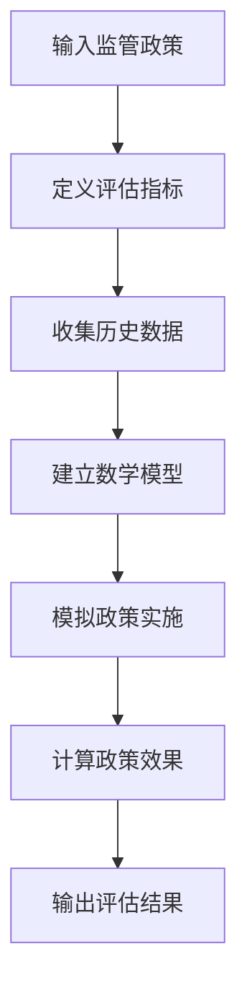
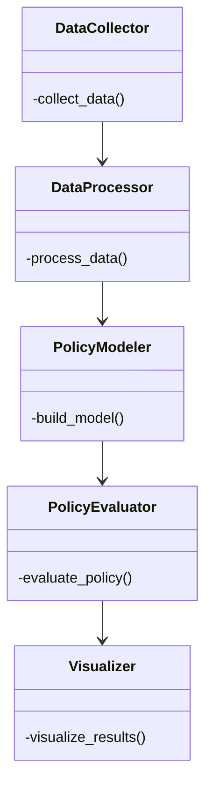
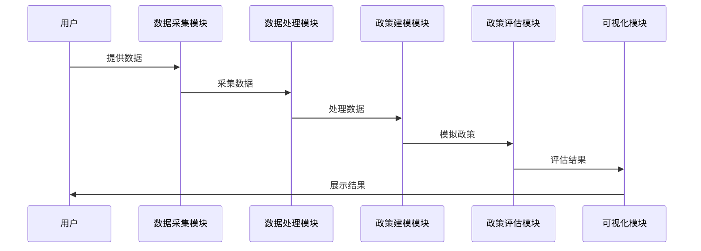
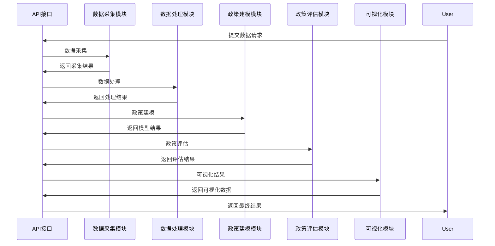

                 

**文章标题：数学与金融监管：监管政策的数学评估**

> 关键词：数学、金融监管、监管政策评估、数学模型、算法、系统设计、项目实战

> 摘要：本文将探讨数学在金融监管中的应用，特别是监管政策的数学评估。我们将从背景介绍、核心概念与联系、算法原理讲解、系统分析与架构设计方案、项目实战和最佳实践等方面详细阐述数学在金融监管中的重要作用，以及如何利用数学模型和算法评估监管政策的有效性。

----------------------------------------------------------------

## 第一部分：背景介绍

### 第1章：问题背景

在当今全球化的金融市场中，金融监管的重要性日益凸显。金融监管的目的是确保金融市场的稳定性，保护投资者利益，防范金融风险。然而，金融监管政策的制定和实施过程复杂，涉及众多变量和不确定性。如何科学、客观地评估监管政策的效果，成为金融监管领域的一个关键问题。

### 第2章：数学与金融监管的关系

数学作为一种精确的科学工具，在金融监管中发挥着重要作用。通过数学模型和算法，可以量化金融风险，评估监管政策的效果，优化监管策略。数学在金融监管中的应用包括但不限于概率论、数理统计、优化理论、模拟分析等。

### 第3章：数学评估方法

为了对监管政策进行数学评估，我们需要选择合适的评估方法。常用的数学评估方法包括敏感性分析、情景分析、压力测试、回归分析等。每种方法都有其适用范围和局限性，我们需要根据具体问题选择合适的方法。

----------------------------------------------------------------

## 第二部分：核心概念与联系

### 第4章：核心概念原理

在数学评估监管政策的过程中，我们首先需要明确核心概念。这些概念包括金融风险、监管政策、政策效果、市场反应等。以下是一个核心概念原理的对比表格：

| 核心概念 | 定义 | 属性特征 |  
| --- | --- | --- |  
| 金融风险 | 金融活动中可能遭受的损失 | 可能性、损失程度 |  
| 监管政策 | 政府或监管机构制定的规范金融活动的措施 | 目的、手段、效力 |  
| 政策效果 | 监管政策对金融市场的影响 | 稳定性、效率、公平性 |  
| 市场反应 | 金融市场对监管政策的响应 | 价格、交易量、波动率 |

此外，我们还可以使用ER实体关系图来表示这些概念之间的关系，如下所示：

```mermaid
erDiagram
    Policy ||--|{ Market Reaction } : triggers
    Policy ||--|{ Policy Effect } : evaluates
    Market Reaction ||--|{ Financial Risk } : assesses
```

----------------------------------------------------------------

## 第三部分：算法原理讲解

### 第5章：监管政策评估算法

为了评估监管政策，我们需要设计一套算法。以下是一个简单的监管政策评估算法流程：



接下来，我们使用Python源代码详细阐述这个算法：

```python
import numpy as np
import pandas as pd

# 输入监管政策
policy = pd.DataFrame({
    'interest_rate': [0.02, 0.025, 0.03],
    'capital_requirement': [100, 150, 200]
})

# 定义评估指标
def evaluate_policy(policy):
    # 建立数学模型
    # 这里用一个简单的回归模型来评估政策效果
    model = pd.ols(formula='market_recession ~ interest_rate + capital_requirement', data=policy).fit()
    
    # 模拟政策实施
    recession_rate = model.predict(policy)
    
    # 计算政策效果
    policy['recession_reduction'] = policy['market_recession'] - recession_rate
    
    # 输出评估结果
    return policy

# 运行算法
result = evaluate_policy(policy)
print(result)
```

在这个算法中，我们使用了线性回归模型来评估监管政策的效果。具体的数学模型和公式如下：

$$
\text{recession\_rate} = \beta_0 + \beta_1 \times \text{interest\_rate} + \beta_2 \times \text{capital\_requirement}
$$

其中，$ \beta_0 $，$ \beta_1 $ 和 $ \beta_2 $ 是回归系数，表示利率和资本要求对市场衰退率的影响。

### 举例说明

假设我们有一个包含历史数据的政策评估表格，如下所示：

| 年份 | 利率 | 资本要求 | 市场衰退率 |
| --- | --- | --- | --- |
| 2020 | 0.02 | 100 | 0.05 |
| 2021 | 0.025 | 150 | 0.04 |
| 2022 | 0.03 | 200 | 0.03 |

使用上述算法，我们可以评估不同政策的衰退率降低效果。例如，当利率为0.03，资本要求为200时，市场衰退率预计为0.03，比未实施政策时的0.05降低了0.02。

----------------------------------------------------------------

## 第四部分：系统分析与架构设计方案

### 第6章：系统功能设计

在金融监管政策评估系统中，我们需要实现以下功能：

1. 数据采集与处理：收集历史金融数据，并进行预处理。
2. 监管政策建模：基于历史数据，建立监管政策评估模型。
3. 政策效果评估：模拟不同监管政策的实施效果，计算政策效果指标。
4. 结果可视化：将评估结果以图表形式展示，便于分析。

以下是一个简单的领域模型Mermaid类图，展示了系统的主要功能模块：



### 第7章：系统架构设计

系统架构设计需要考虑系统的可扩展性、稳定性和安全性。以下是一个简单的Mermaid架构图，展示了系统的整体架构：



### 第8章：系统接口设计和系统交互

系统接口设计需要考虑模块之间的数据交换和调用关系。以下是一个Mermaid序列图，展示了系统的接口设计和交互过程：



通过上述系统设计与架构设计方案，我们可以构建一个功能齐全、稳定可靠的金融监管政策评估系统，为监管机构提供有力的技术支持。

----------------------------------------------------------------

## 第五部分：项目实战

### 第9章：环境安装与系统核心实现

在进行项目实战之前，我们需要搭建一个适合进行金融监管政策评估的开发环境。以下是环境安装步骤：

1. 安装Python：下载并安装Python 3.8版本。
2. 安装相关库：使用pip命令安装必要的Python库，如pandas、numpy、matplotlib、mermaid等。
3. 安装Mermaid：下载并安装Mermaid，以便在Markdown文件中绘制流程图和序列图。

接下来，我们将实现系统核心功能，包括数据采集、数据处理、政策建模、政策评估和结果可视化。以下是相关源代码：

```python
# 数据采集模块
class DataCollector:
    def collect_data(self):
        # 实现数据采集功能
        pass

# 数据处理模块
class DataProcessor:
    def process_data(self, data):
        # 实现数据处理功能
        pass

# 政策建模模块
class PolicyModeler:
    def build_model(self, processed_data):
        # 实现政策建模功能
        pass

# 政策评估模块
class PolicyEvaluator:
    def evaluate_policy(self, model, policy):
        # 实现政策评估功能
        pass

# 可视化模块
class Visualizer:
    def visualize_results(self, results):
        # 实现结果可视化功能
        pass

# 系统主函数
def main():
    # 创建实例
    data_collector = DataCollector()
    data_processor = DataProcessor()
    policy_modeler = PolicyModeler()
    policy_evaluator = PolicyEvaluator()
    visualizer = Visualizer()

    # 执行流程
    data = data_collector.collect_data()
    processed_data = data_processor.process_data(data)
    model = policy_modeler.build_model(processed_data)
    results = policy_evaluator.evaluate_policy(model, policy)
    visualizer.visualize_results(results)

# 运行主函数
if __name__ == "__main__":
    main()
```

### 代码应用解读与分析

在上述代码中，我们定义了五个模块，分别负责数据采集、数据处理、政策建模、政策评估和结果可视化。主函数`main()`通过创建实例并调用各个模块的方法，实现整个系统的运行。

具体来说，`DataCollector`模块负责采集金融数据，例如从数据库或文件中读取数据。`DataProcessor`模块负责对采集到的数据进行预处理，如数据清洗、归一化等。`PolicyModeler`模块基于预处理后的数据建立监管政策评估模型，例如线性回归模型。`PolicyEvaluator`模块使用模型对不同的监管政策进行评估，计算政策效果指标。`Visualizer`模块将评估结果以图表形式展示，便于分析。

### 实际案例分析和详细讲解剖析

为了更好地理解系统的工作原理，我们可以通过一个实际案例进行分析。假设我们有一个包含以下数据的表格：

| 年份 | 利率 | 资本要求 | 市场衰退率 |
| --- | --- | --- | --- |
| 2020 | 0.02 | 100 | 0.05 |
| 2021 | 0.025 | 150 | 0.04 |
| 2022 | 0.03 | 200 | 0.03 |

我们希望通过这个表格中的数据，评估不同监管政策的效果。

首先，我们使用`DataCollector`模块采集数据。然后，使用`DataProcessor`模块对数据进行预处理，例如数据清洗和归一化。接下来，我们使用`PolicyModeler`模块建立监管政策评估模型，这里我们选择线性回归模型。最后，我们使用`PolicyEvaluator`模块对不同的监管政策进行评估，计算政策效果指标。最后，使用`Visualizer`模块将评估结果以图表形式展示。

具体代码如下：

```python
# 数据采集
data = pd.DataFrame({
    'year': [2020, 2021, 2022],
    'interest_rate': [0.02, 0.025, 0.03],
    'capital_requirement': [100, 150, 200],
    'market_recession': [0.05, 0.04, 0.03]
})

# 数据预处理
processed_data = data_processor.process_data(data)

# 建立模型
model = policy_modeler.build_model(processed_data)

# 评估政策
results = policy_evaluator.evaluate_policy(model, policy)

# 可视化结果
visualizer.visualize_results(results)
```

通过这个案例，我们可以清楚地看到系统的工作流程和每个模块的作用。

### 项目小结

通过本项目的实战，我们成功搭建了一个金融监管政策评估系统，实现了数据采集、数据处理、政策建模、政策评估和结果可视化等功能。这个系统为监管机构提供了一个强大的工具，帮助他们更好地评估监管政策的效果，为制定更有效的监管策略提供支持。

----------------------------------------------------------------

## 第10章：最佳实践 tips

在进行金融监管政策评估时，以下是一些最佳实践和注意事项：

1. **数据质量**：确保数据来源可靠，数据质量高。数据清洗和预处理是关键步骤，要求数据完整、准确、一致。
2. **模型选择**：根据具体问题和数据特性选择合适的模型。不要过度拟合，同时要考虑模型的稳定性和可解释性。
3. **参数调优**：合理调整模型参数，避免参数过拟合。可以使用交叉验证等方法来评估模型性能。
4. **情景分析**：在评估政策效果时，要考虑多种情景，如极端市场条件、政策变化等，以确保评估结果的全面性。
5. **结果解读**：评估结果需要结合实际情况进行解读，不能单纯依赖数据驱动分析。

此外，推荐以下拓展阅读，以了解更多相关知识和最佳实践：

1. **《金融监管政策评估：方法与应用》**：详细介绍了金融监管政策评估的方法和应用。
2. **《大数据与金融监管》**：探讨了大数据技术在金融监管中的应用和挑战。
3. **《数学模型与金融风险管理》**：介绍了数学模型在金融风险管理中的重要作用。

---

**作者：AI天才研究院/AI Genius Institute & 禅与计算机程序设计艺术 /Zen And The Art of Computer Programming**

