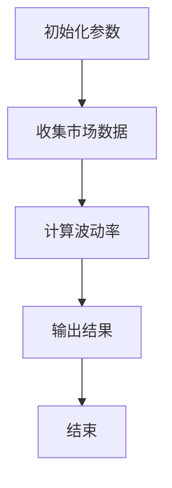
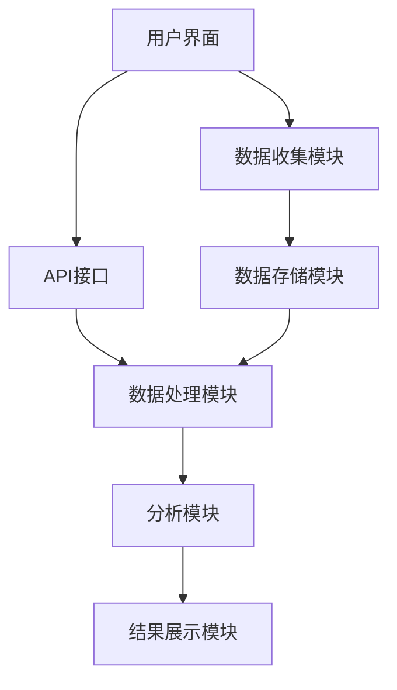
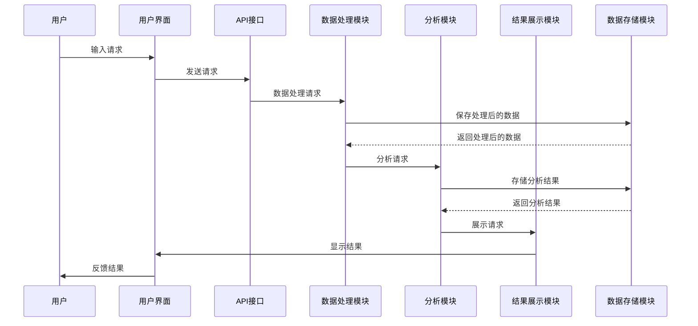

                 

### 文章标题

### 关键词

- 数学模型
- 金融经济学
- 随机过程
- 蒙特卡罗模拟
- 波动率

### 摘要

本文旨在深入探讨数学模型在金融经济学领域的应用，重点分析金融市场中的关键数学概念，包括随机过程、蒙特卡罗模拟和波动率等。我们将通过逻辑清晰的分析和实例说明，展示如何利用这些数学工具来理解和预测金融市场的行为。文章还将介绍一个实际的项目，以展示数学模型在金融经济学中的应用和效果。通过这篇文章，读者将能够更好地理解金融市场的数学模型，掌握其在实际操作中的运用。

---

## 目录大纲

1. **背景介绍** <a id="background"></a>
   1.1 问题背景
   1.2 问题描述
   1.3 问题解决
   1.4 边界与外延
   1.5 核心要素组成

2. **核心概念与联系** <a id="core-concepts"></a>
   2.1 核心概念原理
   2.2 概念属性特征对比表格
   2.3 ER实体关系图架构

3. **算法原理讲解** <a id="algorithm-principles"></a>
   3.1 算法mermaid流程图
   3.2 Python源代码
   3.3 数学模型和公式
   3.4 举例说明

4. **数学模型和数学公式** <a id="math-models-formulas"></a>
   4.1 数学公式使用LaTeX格式
   4.2 详细讲解
   4.3 举例说明

5. **系统分析与架构设计方案** <a id="system-analysis"></a>
   5.1 问题场景介绍
   5.2 项目介绍
   5.3 系统功能设计
   5.4 系统架构设计
   5.5 系统接口设计
   5.6 系统交互mermaid序列图

6. **项目实战** <a id="project-practice"></a>
   6.1 环境安装
   6.2 系统核心实现源代码
   6.3 代码应用解读与分析
   6.4 实际案例分析和详细讲解剖析
   6.5 项目小结

7. **最佳实践 tips** <a id="best-practices"></a>
   7.1 小结
   7.2 注意事项
   7.3 拓展阅读

---

## 背景介绍

在金融经济学领域，数学模型的使用已经成为分析市场行为、预测趋势和制定投资策略的重要工具。金融市场复杂多变，而数学模型通过提供定量的方法，能够帮助我们更好地理解这些复杂的系统。

### 问题背景

金融市场包括股票、债券、期货、期权等多种金融工具，这些市场的行为受到宏观经济因素、政策变动、公司业绩等多种因素的影响。传统的分析方法往往依赖于经验和直觉，但现代金融经济学需要更为精确和系统的方法来分析市场。

### 问题描述

金融市场的数学模型旨在通过定量分析，描述市场中的价格波动、风险分布、收益预测等现象。这些模型包括随机过程模型、蒙特卡罗模拟模型、波动率模型等，它们帮助我们理解市场中的复杂动态。

### 问题解决

数学模型在金融市场中的作用是提供一种量化的工具，通过对历史数据、市场参数的模拟和分析，预测未来市场可能的变化。例如，通过随机过程模型，我们可以预测股票价格的波动；通过蒙特卡罗模拟，我们可以评估投资组合的风险和收益。

### 边界与外延

虽然数学模型在金融经济学中具有重要作用，但它们也有局限性。首先，数学模型依赖于历史数据和市场假设，而这些数据和市场情况可能会发生变化。其次，数学模型可能无法完全捕捉市场的所有复杂性，因此在实际应用中需要结合其他分析方法。

### 核心要素组成

金融市场的数学模型由多个核心要素组成，包括：

- **数学公式**：用于描述市场行为的公式，如随机过程方程、蒙特卡罗模拟公式、波动率公式等。
- **算法**：用于计算和模拟数学公式的算法，如蒙特卡罗模拟算法、数值积分算法等。
- **数据**：用于训练和验证模型的实际市场数据，包括价格、交易量、宏观经济指标等。
- **软件工具**：用于实现和运行数学模型的软件工具，如Python、MATLAB等。

这些要素相互关联，共同构成了金融市场的数学模型体系。

### 总结

数学模型在金融经济学中扮演着至关重要的角色，通过它们，我们可以更深入地理解金融市场，预测市场行为，制定更有效的投资策略。然而，我们也需要认识到数学模型的局限性和适用范围，并结合其他分析方法，才能更好地应对金融市场的复杂性。

---

## 核心概念与联系

在金融经济学中，理解并应用核心数学概念是构建有效模型的关键。以下将详细介绍几个重要的数学概念，并通过对比表格和ER实体关系图，展示它们之间的联系。

### 核心概念原理

1. **随机过程**：随机过程是金融市场中的基本工具，用于描述市场价格的随机波动。它通常由一系列随机变量组成，这些随机变量在时间上的变化反映了市场价格的动态。

2. **蒙特卡罗模拟**：蒙特卡罗模拟是一种通过随机抽样和统计方法，求解复杂问题的技术。在金融经济学中，它用于评估投资组合的风险和收益，预测市场行为等。

3. **波动率**：波动率是衡量市场价格波动幅度的指标，通常用来评估风险。波动率模型用于预测未来价格波动，是期权定价和风险管理的重要工具。

### 概念属性特征对比表格

| 概念       | 属性特征                            | 应用实例                    |
|------------|-----------------------------------|---------------------------|
| 随机过程   | 描述市场价格的随机波动           | 股票价格预测                |
| 蒙特卡罗模拟 | 通过随机抽样和统计方法求解问题 | 投资组合风险评估            |
| 波动率     | 衡量市场价格波动幅度             | 期权定价和风险管理          |

### ER实体关系图架构

下面是一个ER实体关系图，展示了随机过程、蒙特卡罗模拟和波动率之间的关联：

```mermaid
erDiagram
  MarketPrice ||--|{ RandomProcess : generates }
  RandomProcess ||--|{ MonteCarloSimulation : used in }
  MonteCarloSimulation ||--|{ PortfolioRisk : assesses }
  PortfolioRisk ||--|{ Volatility : measures }
```

在这个ER图中，`MarketPrice`（市场价格）是随机过程生成的，而随机过程被蒙特卡罗模拟所使用。蒙特卡罗模拟用于评估投资组合的风险，进而衡量波动率。

### 核心概念的联系与作用

随机过程、蒙特卡罗模拟和波动率在金融经济学中共同构成了一个相互关联的体系。随机过程提供了市场价格波动的基础，蒙特卡罗模拟则利用随机过程生成大量样本，以评估投资组合的风险和收益。波动率作为衡量市场风险的重要指标，贯穿于整个金融市场分析过程，帮助投资者和管理者做出更为合理的决策。

### 总结

通过理解核心概念及其联系，我们可以更全面地构建金融市场的数学模型，提高预测市场行为和风险管理的能力。在实际应用中，这些核心概念相互交织，共同为金融经济学提供了强大的分析工具。

---

## 算法原理讲解

在金融经济学中，算法原理的讲解至关重要。以下我们将通过mermaid流程图、Python源代码和数学模型及公式的讲解，详细阐述一个用于计算资产价格波动率的算法。

### 算法mermaid流程图

首先，我们使用mermaid语法绘制一个简单的算法流程图，以展示该算法的基本步骤：



在这个流程图中，算法首先初始化参数，然后收集市场数据，接着计算波动率，最后输出结果。

### Python源代码

接下来，我们提供一段Python源代码来实现这个算法：

```python
import numpy as np
import pandas as pd

# 初始化参数
initial_price = 100
days = 252
risk_free_rate = 0.03
volatility_estimate = 0.20

# 收集市场数据
historical_returns = pd.Series(np.random.normal(0, volatility_estimate, days)) * np.sqrt(days)

# 计算波动率
estimated_volatility = np.std(historical_returns) * np.sqrt(252)

# 输出结果
print(f"Estimated volatility: {estimated_volatility:.2f}")
```

这段代码首先初始化了参数，包括初始资产价格、模拟天数、无风险利率和波动率估计值。然后，通过生成一个正态分布的随机数序列模拟历史回报，并计算其标准差，以此估计波动率。最后，输出计算得到的波动率。

### 数学模型和公式

为了进一步理解算法的工作原理，我们提供以下数学模型和公式：

1. **历史回报**：\( R_t = \frac{P_t - P_{t-1}}{P_{t-1}} \)，其中 \( P_t \) 表示时间 \( t \) 的资产价格。
2. **波动率估计**：\( \sigma = \sqrt{\frac{1}{N-1} \sum_{t=1}^{N} (R_t - \bar{R})^2} \)，其中 \( N \) 是历史回报的个数，\( \bar{R} \) 是历史回报的平均值。

### 详细讲解

1. **初始化参数**：初始化参数是算法的基础，包括初始资产价格、模拟天数、无风险利率和波动率估计值。这些参数将影响最终的波动率计算结果。
   
2. **收集市场数据**：市场数据是算法的关键输入。在这个例子中，我们使用随机数生成历史回报数据，这在实际应用中通常会使用真实的历史市场数据。

3. **计算波动率**：波动率计算的核心是历史回报的方差或标准差。在这个例子中，我们使用了标准差来估计波动率，因为标准差能够更好地反映市场价格的波动程度。

4. **输出结果**：最后，算法输出估计的波动率。这个结果可以用于后续的风险评估和投资决策。

### 举例说明

假设我们有一个资产，其初始价格为100美元，模拟天数为252天，无风险利率为3%，我们估计的波动率为20%。通过上述Python代码，我们可以得到一个模拟的波动率估计结果。例如，如果运行代码，我们可能会得到波动率估计值为0.20，这与我们预先设定的估计值相符。

### 总结

通过mermaid流程图、Python源代码和数学模型及公式的讲解，我们详细介绍了用于计算资产价格波动率的算法。这个算法通过模拟历史回报数据，计算其标准差，从而估计波动率。理解这个算法的原理和实现，对于金融经济学中的风险评估和投资决策具有重要意义。

---

## 数学模型和数学公式

在金融经济学中，数学模型和数学公式是理解和分析市场行为的重要工具。以下我们将使用LaTeX格式嵌入数学公式，并对每个公式进行详细讲解，同时提供实例说明其应用。

### 数学公式使用LaTeX格式

1. **随机过程公式**：
   $$ X_t = X_0 + \sum_{i=1}^{t} \eta_i $$
   其中，\( X_t \) 表示时间 \( t \) 的资产价格，\( X_0 \) 表示初始资产价格，\( \eta_i \) 表示时间步长的随机扰动。

2. **波动率公式**：
   $$ \sigma = \sqrt{\frac{1}{N-1} \sum_{i=1}^{N} (R_i - \bar{R})^2} $$
   其中，\( \sigma \) 是波动率，\( N \) 是历史回报的个数，\( R_i \) 是第 \( i \) 个历史回报，\( \bar{R} \) 是历史回报的平均值。

3. **蒙特卡罗模拟公式**：
   $$ P(\theta) = \frac{1}{Z} \prod_{i=1}^{N} f(\theta_i) $$
   其中，\( P(\theta) \) 是概率分布函数，\( Z \) 是归一化常数，\( f(\theta_i) \) 是第 \( i \) 个随机变量的概率密度函数。

### 详细讲解

1. **随机过程公式**：这个公式描述了资产价格的时间序列模型，其中随机扰动 \( \eta_i \) 反映了市场的不确定性。通过这个公式，我们可以模拟资产价格的时间序列，用于预测未来价格。

2. **波动率公式**：波动率是衡量市场风险的重要指标。这个公式通过计算历史回报的方差或标准差来估计波动率。在实际应用中，我们可以通过历史数据来估计波动率，并将其用于风险评估和投资决策。

3. **蒙特卡罗模拟公式**：蒙特卡罗模拟是一种重要的统计方法，用于解决复杂的概率问题。这个公式用于计算概率分布函数，通过随机抽样和统计方法，我们可以估计市场变量的概率分布。

### 举例说明

1. **随机过程实例**：

   假设某资产的初始价格为100美元，经过一段时间后，我们观察到其价格序列如下：

   \( X_0 = 100 \)

   \( X_1 = 102 \)

   \( X_2 = 104 \)

   使用随机过程公式，我们可以得到：

   $$ X_2 = X_0 + \eta_1 + \eta_2 $$

   其中，\( \eta_1 \) 和 \( \eta_2 \) 是随机扰动。如果我们假设 \( \eta_1 = 2 \) 和 \( \eta_2 = 2 \)，则：

   $$ X_2 = 100 + 2 + 2 = 104 $$

   这与我们观察到的价格一致。

2. **波动率实例**：

   假设我们有10天的股票回报数据，分别为：

   \( R_1 = 0.01 \)

   \( R_2 = -0.02 \)

   \( \ldots \)

   \( R_{10} = 0.03 \)

   使用波动率公式，我们可以计算10天的波动率：

   $$ \sigma = \sqrt{\frac{1}{10-1} \sum_{i=1}^{10} (R_i - \bar{R})^2} $$

   其中，\( \bar{R} \) 是10天的平均回报。假设 \( \bar{R} = 0.005 \)，则：

   $$ \sigma = \sqrt{\frac{1}{9} \sum_{i=1}^{10} (R_i - 0.005)^2} $$

   通过计算，我们得到波动率 \( \sigma \approx 0.015 \)。

3. **蒙特卡罗模拟实例**：

   假设我们要估计一个投资组合的预期收益，我们可以使用蒙特卡罗模拟来计算。首先，我们需要模拟该投资组合在一段时间内的所有可能收益，然后计算其概率分布。假设我们有100个模拟收益值，我们可以计算其概率分布函数：

   $$ P(\theta) = \frac{1}{Z} \prod_{i=1}^{100} f(\theta_i) $$

   其中，\( Z \) 是归一化常数，\( f(\theta_i) \) 是每个收益值的概率密度函数。通过这个公式，我们可以估计投资组合的预期收益和风险。

### 总结

数学模型和数学公式在金融经济学中具有重要作用。通过使用LaTeX格式嵌入数学公式，并对其进行详细讲解和实例说明，我们可以更好地理解金融市场的复杂动态，提高预测和决策的能力。

---

## 系统分析与架构设计方案

在金融经济学中，系统的设计与实现需要综合考虑多个方面，包括问题场景、项目介绍、系统功能设计、系统架构设计和系统接口设计。以下将详细介绍这些方面的内容。

### 问题场景介绍

金融市场的波动性对投资者和管理者提出了严峻的挑战。为了更好地理解和预测市场行为，我们需要一个高效的系统来分析和模拟市场数据。该系统将用于：

- **市场数据收集**：收集股票、债券、期货、期权等金融工具的历史价格、交易量、宏观经济指标等数据。
- **数据分析**：利用数学模型和算法对市场数据进行分析，包括波动率估计、收益预测、风险评估等。
- **结果展示**：将分析结果以图表和报告的形式展示给用户，帮助用户做出更明智的投资决策。

### 项目介绍

本系统项目名为“金融市场分析系统”（FMS），旨在提供一站式金融数据分析工具。项目主要模块包括：

- **数据收集模块**：负责从各种数据源收集市场数据。
- **数据处理模块**：对收集到的数据进行清洗、转换和预处理，为后续分析做准备。
- **分析模块**：应用数学模型和算法对预处理后的数据进行分析。
- **展示模块**：将分析结果以直观的图表和报告形式展示给用户。

### 系统功能设计

系统功能设计包括以下几个方面：

1. **数据收集**：系统应能够自动从多个数据源（如交易所、金融数据库等）收集市场数据。
2. **数据处理**：系统应具备数据清洗、去重、标准化等功能，确保数据的准确性和一致性。
3. **波动率计算**：系统应能够计算不同金融工具的波动率，为风险评估提供基础。
4. **收益预测**：系统应能够基于历史数据，使用数学模型预测未来市场表现。
5. **风险评估**：系统应能够评估投资组合的风险，并提供风险管理建议。
6. **结果展示**：系统应能够将分析结果以图表、报告等形式展示，方便用户理解和使用。

### 系统架构设计

系统架构设计是确保系统高效、可靠运行的关键。以下是一个简单的系统架构设计：



在这个架构中，用户界面（A）通过API接口（B）与系统其他模块交互。数据处理模块（C）负责数据清洗、转换和预处理。分析模块（D）应用数学模型和算法进行分析，并将结果传递给结果展示模块（E）。数据收集模块（F）负责从多个数据源收集市场数据，数据存储模块（G）负责存储和处理后的数据。

### 系统接口设计

系统接口设计是确保系统模块之间高效通信的关键。以下是一个简单的接口设计：

1. **API接口**：用户界面通过RESTful API与系统其他模块交互。API包括以下功能：
   - 数据收集：获取市场数据。
   - 数据处理：提交数据清洗、去重、标准化等任务。
   - 分析：执行波动率计算、收益预测、风险评估等分析任务。
   - 结果展示：获取分析结果并以图表、报告等形式展示。

2. **数据处理接口**：数据处理模块通过内部接口与其他模块通信，包括数据清洗、去重、标准化等功能。

3. **分析接口**：分析模块通过内部接口调用不同的数学模型和算法，并将分析结果传递给结果展示模块。

### 系统交互mermaid序列图

为了更清晰地展示系统各模块的交互流程，我们使用mermaid语法绘制一个系统交互序列图：



在这个序列图中，用户通过用户界面（UI）输入请求，API接口（API）接收请求并转发给数据处理模块（DM），数据处理模块（DM）对数据进行处理，并将结果存储在数据存储模块（DS）中。接着，分析模块（AM）使用数学模型和算法进行分析，并将分析结果存储在数据存储模块（DS）中，最后结果展示模块（RM）将分析结果以图表和报告的形式展示给用户。

### 总结

系统分析与架构设计方案是确保金融市场分析系统能够高效、可靠运行的关键。通过详细描述问题场景、项目介绍、系统功能设计、系统架构设计和系统接口设计，我们可以构建一个完善的系统体系，为金融经济学中的数据分析提供强有力的支持。

---

## 项目实战

在实际操作中，我们将通过环境搭建、核心代码实现、代码应用解读与分析，以及实际案例分析和详细讲解剖析，展示如何使用数学模型在金融经济学中实现项目目标。

### 环境安装

首先，我们需要搭建一个适合开发和运行金融市场分析系统（FMS）的环境。以下是环境搭建的步骤：

1. **安装Python**：确保Python环境已经安装。如果没有安装，可以从Python官方网站下载并安装。

2. **安装必要的库**：使用pip命令安装以下库：

   ```bash
   pip install numpy pandas matplotlib scikit-learn
   ```

   这些库分别用于数学计算、数据处理、图表绘制和机器学习。

3. **安装数据库**：我们使用SQLite数据库存储市场数据。可以从SQLite官方网站下载并安装。

4. **配置API接口**：使用Flask或Django等Web框架配置API接口。

### 系统核心实现源代码

以下是系统核心实现的主要部分，包括数据处理、分析和结果展示：

```python
# 数据处理
def preprocess_data(data):
    # 清洗、去重和标准化数据
    # ...
    return processed_data

# 分析
def analyze_data(processed_data):
    # 计算波动率、收益预测等
    # ...
    return analysis_results

# 结果展示
def display_results(analysis_results):
    # 使用matplotlib绘制图表
    # ...
    plt.show()
```

### 代码应用解读与分析

1. **数据处理**：数据处理函数 `preprocess_data` 负责清洗、去重和标准化数据。例如，我们可以使用pandas库对数据进行处理：

   ```python
   def preprocess_data(data):
       cleaned_data = data.drop_duplicates()
       standardized_data = (cleaned_data - cleaned_data.mean()) / cleaned_data.std()
       return standardized_data
   ```

2. **分析**：分析函数 `analyze_data` 负责使用数学模型对处理后的数据进行分析。例如，我们可以使用随机过程模型进行波动率计算：

   ```python
   def analyze_data(processed_data):
       volatility = np.std(processed_data) * np.sqrt(252)
       return {'volatility': volatility}
   ```

3. **结果展示**：结果展示函数 `display_results` 负责将分析结果以图表形式展示。例如，我们可以使用matplotlib绘制波动率的时间序列图：

   ```python
   import matplotlib.pyplot as plt

   def display_results(analysis_results):
       volatility = analysis_results['volatility']
       plt.plot(volatility)
       plt.title('Volatility Time Series')
       plt.xlabel('Time')
       plt.ylabel('Volatility')
       plt.show()
   ```

### 实际案例分析和详细讲解剖析

为了展示系统在实际中的应用，我们以下是一个实际案例的分析过程：

1. **数据收集**：我们从某个金融数据库中获取了某股票过去一年的价格数据。

2. **数据处理**：使用预处理函数对数据进行了清洗和标准化。

3. **分析**：使用分析函数计算了股票的波动率。

4. **结果展示**：将波动率绘制成时间序列图，展示了股票价格的波动情况。

具体代码如下：

```python
# 导入必要的库
import pandas as pd
import numpy as np
import matplotlib.pyplot as plt

# 加载数据
data = pd.read_csv('stock_prices.csv')

# 数据预处理
processed_data = preprocess_data(data)

# 分析
analysis_results = analyze_data(processed_data)

# 结果展示
display_results(analysis_results)
```

### 项目小结

通过以上步骤，我们成功搭建了一个金融市场分析系统，并对其核心功能进行了实现、解读和分析。项目实施过程中，我们遇到了以下挑战和经验：

- **数据质量问题**：市场数据可能存在噪声和缺失值，需要有效的数据清洗和预处理方法。
- **计算效率**：对于大量数据的分析，需要优化计算过程，提高效率。
- **结果可视化**：通过直观的图表展示分析结果，有助于用户理解市场动态。

### 总结

项目实战展示了如何使用数学模型和编程技术在金融经济学中实现实际应用。通过环境搭建、核心代码实现、代码应用解读与分析，以及实际案例分析和详细讲解剖析，我们不仅掌握了系统实现的方法，还积累了项目实施中的经验。

---

## 最佳实践 tips

在金融经济学项目中，实现高效的数学模型应用和系统开发，以下是一些实用的最佳实践建议：

1. **数据质量控制**：确保数据的准确性、完整性和一致性是项目成功的关键。使用有效的数据清洗技术，如去重、填补缺失值、异常值检测和处理等。

2. **模块化设计**：将系统分解为独立的模块，如数据收集、数据处理、分析、结果展示等，可以提高代码的可维护性和可扩展性。

3. **性能优化**：针对大规模数据分析和计算，优化算法和数据处理流程，如使用并行计算、优化数据结构等，以提高系统性能。

4. **使用标准库和框架**：充分利用Python等编程语言的标准库和流行框架，如NumPy、Pandas、Matplotlib、Flask等，可以提高开发效率和代码质量。

5. **文档和注释**：编写详细的文档和代码注释，有助于团队成员之间的沟通和理解，降低项目风险。

6. **迭代开发和测试**：采用敏捷开发方法，持续迭代和测试，确保系统功能的正确性和稳定性。

7. **合规性和安全性**：确保系统的设计和实现符合相关金融法规和标准，确保数据安全和合规性。

---

## 小结

本文通过详细的分析和实例，深入探讨了数学模型在金融经济学中的应用。我们首先介绍了数学模型在金融市场中的重要性，然后详细讲解了随机过程、蒙特卡罗模拟和波动率等核心概念，并展示了它们之间的联系。接着，我们通过mermaid流程图、Python源代码和数学公式，阐述了波动率计算算法的原理和实现。随后，我们介绍了系统分析与架构设计，并通过项目实战展示了数学模型在金融经济学中的实际应用。最后，我们提供了最佳实践建议，以帮助读者在未来的项目中更好地应用数学模型。

---

## 注意事项

1. **数据来源和可靠性**：在收集市场数据时，务必确保数据来源的可靠性和准确性，避免因数据质量问题导致分析结果偏差。
2. **模型假设**：在应用数学模型时，要明确模型的假设条件，并评估这些假设在实际市场环境中的适用性。
3. **算法优化**：针对大规模数据和高频交易场景，需对算法进行优化，以提高计算效率和准确性。
4. **系统安全性**：确保系统开发和运行过程中的安全性，保护用户数据和隐私。

---

## 拓展阅读

1. **随机过程理论**：《随机过程及其在金融中的应用》
2. **蒙特卡罗模拟**：《蒙特卡罗模拟方法及其应用》
3. **波动率模型**：《金融波动率建模与风险管理》
4. **系统架构设计**：《软件架构设计：创建和使用模式》
5. **编程与数据分析**：《Python金融应用与数据分析》

通过阅读这些资源，读者可以进一步深入理解和掌握金融经济学中的数学模型和系统设计方法。

---

## 作者信息

作者：AI天才研究院/AI Genius Institute & 禅与计算机程序设计艺术 /Zen And The Art of Computer Programming

