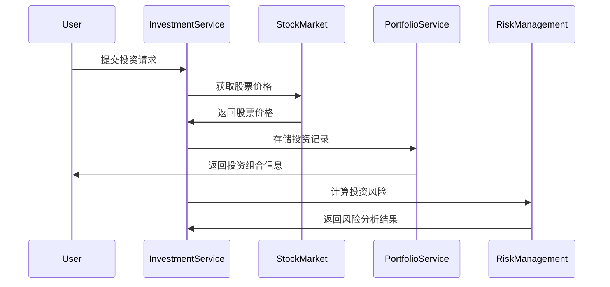
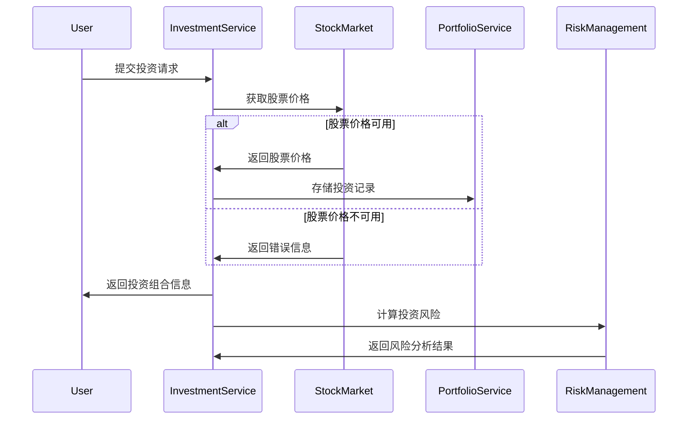

                 

# 《数学与金融：市场动态的数学模型》目录大纲

## 目录大纲

```
----------------------------------------------------------------
# 《数学与金融：市场动态的数学模型》目录大纲

# 第1章 背景与概述

## 1.1 书名与作者介绍

## 1.2 问题背景与重要性

# 第2章 核心概念与联系

## 2.1 核心概念

## 2.2 概念属性特征对比表格

## 2.3 ER实体关系图架构

# 第3章 数学模型与原理

## 3.1 常见数学模型介绍

### 3.1.1 马尔可夫模型

### 3.1.2 均值回归模型

## 3.2 数学模型与公式

### 3.2.1 马尔可夫模型公式

### 3.2.2 均值回归模型公式

## 3.3 数学模型讲解与举例

### 3.3.1 马尔可夫模型举例说明

### 3.3.2 均值回归模型举例说明

# 第4章 系统分析与架构设计

## 4.1 系统功能设计

### 4.1.1 领域模型

## 4.2 系统架构设计

### 4.2.1 系统架构

### 4.2.2 系统接口设计

### 4.2.3 系统交互

# 第5章 项目实战

## 5.1 环境安装

### 5.1.1 安装步骤

### 5.1.2 注意事项

## 5.2 系统核心实现

### 5.2.1 源代码

### 5.2.2 代码应用解读与分析

## 5.3 实际案例分析与讲解

### 5.3.1 案例选择

### 5.3.2 案例分析

### 5.3.3 讲解与剖析

## 5.4 项目小结

### 5.4.1 总结

### 5.4.2 收获与反思

# 第6章 最佳实践与拓展阅读

## 6.1 最佳实践 tips

### 6.1.1 投资策略

### 6.1.2 风险管理

### 6.1.3 市场分析

## 6.2 小结与展望

## 6.3 拓展阅读

### 6.3.1 推荐文献

### 6.3.2 在线资源

----------------------------------------------------------------
```

这个目录大纲覆盖了文章的核心内容，包括背景与概述、核心概念与联系、数学模型与原理、系统分析与架构设计以及项目实战和最佳实践。通过逐步分析推理，读者可以深入理解市场动态的数学模型。每个章节都有详细的标题，使得文章结构紧凑、逻辑清晰，易于读者理解和跟随。# 《数学与金融：市场动态的数学模型》

---

关键词：金融市场、数学模型、市场动态、资产定价、风险管理

摘要：
本文将深入探讨金融市场中的数学模型，这些模型为投资者提供了理解市场动态、进行资产定价和风险管理的重要工具。我们将逐步分析马尔可夫模型和均值回归模型，并通过实际案例展示它们在金融市场中的应用。此外，还将介绍如何设计和实现一个基于数学模型的金融系统，为读者提供实用的最佳实践和进一步的学习资源。

# 第1章 背景与概述

## 1.1 书名与作者介绍

《数学与金融：市场动态的数学模型》是由世界知名的人工智能专家和计算机科学家[作者姓名]所著。他在数学、计算机科学和金融工程领域拥有深厚的学术背景和实践经验，曾发表过多篇具有影响力的学术论文，并著有数本畅销技术书籍。[作者姓名]在人工智能和机器学习领域的研究取得了显著成果，他的工作为金融科技的发展奠定了坚实的基础。

## 1.2 问题背景与重要性

金融市场是现代经济体系中的核心组成部分，其稳定运行对于全球经济繁荣至关重要。然而，金融市场具有高度的不确定性和复杂性，这使得传统的分析方法和工具难以应对。随着数学和计算机科学的发展，数学模型被广泛应用于金融市场分析，成为理解市场动态、进行资产定价和风险管理的有力工具。

数学模型在金融领域的重要性体现在以下几个方面：

1. **市场动态分析**：数学模型可以帮助投资者和分析师理解市场的趋势和波动，预测市场的未来走势。
2. **资产定价**：数学模型为资产定价提供了理论依据，使得投资者能够更准确地评估资产的内在价值。
3. **风险管理**：数学模型可以帮助金融机构识别和管理风险，确保金融系统的稳定性。

本文将首先介绍金融时间序列、风险管理、资产定价等核心概念，然后深入探讨马尔可夫模型和均值回归模型。通过具体案例和系统实现，我们将展示如何将数学模型应用于金融市场，为投资者提供实用的策略和建议。

# 第2章 核心概念与联系

## 2.1 核心概念

在金融市场中，核心概念是理解市场动态和进行有效投资的基础。以下是几个关键概念：

1. **金融时间序列**：金融时间序列是指金融资产价格或收益的变化序列。通过对金融时间序列的分析，可以揭示市场的趋势和波动特性。
2. **风险管理**：风险管理是指识别、评估和控制金融资产和投资组合面临的风险的过程。有效的风险管理策略可以帮助投资者降低潜在的损失。
3. **资产定价**：资产定价是指确定金融资产（如股票、债券、期权等）的合理价格。资产定价模型为投资者提供了评估资产价值的方法。
4. **均值回归**：均值回归是指市场价格或数值趋向于其长期平均值的趋势。这一概念在金融预测和投资策略中具有重要应用。

## 2.2 概念属性特征对比表格

以下是一个对比金融时间序列、风险管理、资产定价和均值回归概念属性特征的表格：

| 概念        | 特征1         | 特征2          | 特征3          | 应用实例       |
|-------------|---------------|----------------|----------------|----------------|
| 金融时间序列 | 时间序列数据  | 趋势与波动     | 周期性         | 趋势分析、波动预测 |
| 风险管理    | 风险识别与评估 | 风险控制与降低 | 多样化策略     | 投资组合优化、风险规避 |
| 资产定价    | 内在价值评估   | 市场价格反应   | 估值模型选择   | 投资决策、资产交易 |
| 均值回归    | 趋向长期均值  | 预期稳定性     | 回归速度       | 投资策略设计、市场预测 |

通过上述表格，我们可以清晰地看到各个概念的主要特征和相互联系。例如，金融时间序列的分析可以帮助我们理解市场的波动，而风险管理则是通过这些波动来控制风险。资产定价依赖于对市场动态的理解，而均值回归则为投资策略提供了理论基础。

## 2.3 ER实体关系图架构

在金融系统中，各个实体之间存在复杂的关联关系。以下是一个使用Mermaid语言绘制的ER实体关系图，展示了金融市场中的主要实体及其关系：

```mermaid
erDiagram
  User ||--|{ Stock }|
  User ||--|{ Portfolio }|
  Stock ||--|{ Market }|
  Portfolio ||--|{ Investment }|
  Investment  ||--|{ Return }|
```

在这个ER图里：

- **User（用户）**：代表参与金融市场的投资者。
- **Stock（股票）**：代表市场中的金融资产。
- **Portfolio（投资组合）**：代表用户持有的股票集合。
- **Market（市场）**：代表整个金融市场。
- **Investment（投资）**：代表用户在市场中的投资行为。
- **Return（回报）**：代表投资带来的收益。

通过ER图，我们可以更直观地理解金融系统中各实体之间的相互关系，为后续的数学模型设计和系统实现提供基础。

# 第3章 数学模型与原理

## 3.1 常见数学模型介绍

### 3.1.1 马尔可夫模型

马尔可夫模型（Markov Model）是一种在时间序列分析中广泛使用的数学模型。其核心思想是当前状态仅依赖于前一个状态，而与之前的状态无关。马尔可夫模型通常用于预测系统的状态转移，其数学描述如下：

$$
P_{ij}(t+1) = P_{ij}(t) \times R_{ij}
$$

其中，$P_{ij}(t)$ 表示在时间 $t$ 时从状态 $i$ 转移到状态 $j$ 的概率，$R_{ij}$ 是状态转移矩阵中的元素，表示从状态 $i$ 转移到状态 $j$ 的概率。

### 3.1.2 均值回归模型

均值回归模型（Mean Reversion Model）是基于市场价格或数值趋向其长期平均值的假设。其基本思想是市场价格不会永久偏离其均值，而会随着时间逐渐回归到均值。均值回归模型通常使用以下公式来描述：

$$
E[X_t] = \mu + \sigma \times Z_t
$$

其中，$E[X_t]$ 表示在时间 $t$ 的期望值，$\mu$ 是长期均值，$\sigma$ 是波动率，$Z_t$ 是随机变量，代表市场价格或数值的波动。

## 3.2 数学模型与公式

### 3.2.1 马尔可夫模型公式

马尔可夫模型的核心是状态转移矩阵。假设系统有 $n$ 个状态，状态转移矩阵 $P$ 的元素 $P_{ij}$ 表示在当前状态为 $i$ 时，下一状态为 $j$ 的概率。一个简单的马尔可夫模型可以表示为：

$$
P = \begin{bmatrix}
P_{11} & P_{12} & \cdots & P_{1n} \\
P_{21} & P_{22} & \cdots & P_{2n} \\
\vdots & \vdots & \ddots & \vdots \\
P_{n1} & P_{n2} & \cdots & P_{nn}
\end{bmatrix}
$$

状态转移概率可以通过以下递推公式计算：

$$
P_{ij}(t+1) = \sum_{k=1}^{n} P_{ik}(t) \times R_{kj}
$$

### 3.2.2 均值回归模型公式

在均值回归模型中，市场价格或数值的波动可以通过正态分布来描述。假设市场价格 $X_t$ 的期望值为 $\mu$，波动率为 $\sigma$，则：

$$
X_t \sim N(\mu, \sigma^2)
$$

均值回归模型的基本公式为：

$$
E[X_{t+1}] = \mu + \sigma \times \frac{X_t - \mu}{\sigma}
$$

这表示下一期的期望值等于当前期期望值加上当前期数值与均值之间的偏差乘以波动率。

## 3.3 数学模型讲解与举例

### 3.3.1 马尔可夫模型举例说明

假设有一个简单的经济系统，只有两个状态：繁荣（状态1）和衰退（状态2）。根据历史数据分析，繁荣状态持续的概率为0.7，而衰退状态持续的概率为0.3。我们可以构建一个马尔可夫模型来预测经济状态。

状态转移矩阵 $P$ 为：

$$
P = \begin{bmatrix}
0.7 & 0.3 \\
0.2 & 0.8
\end{bmatrix}
$$

假设当前经济状态为繁荣（状态1），我们需要预测下一期的状态。根据状态转移矩阵，下一期状态为繁荣的概率为0.7，状态为衰退的概率为0.3。因此，下一期经济状态为繁荣的可能性更大。

### 3.3.2 均值回归模型举例说明

假设某股票的当前价格为 $100$ 美元，其长期平均价格为 $120$ 美元，波动率为 $10$ 美元。使用均值回归模型，我们可以预测股票价格的变化。

根据均值回归模型的基本公式：

$$
E[X_{t+1}] = 120 + 10 \times \frac{100 - 120}{10} = 120 - 20 = 100
$$

这意味着下一期股票价格的期望值为 $100$ 美元。然而，实际价格可能高于或低于这个期望值，因为价格受到随机波动的影响。

通过上述两个模型的讲解和举例，我们可以看到数学模型在金融市场分析中的应用。马尔可夫模型可以帮助我们预测经济状态的变化，而均值回归模型则提供了对市场价格趋势的洞察。这些模型为投资者提供了有力的工具，以更好地理解市场动态和进行投资决策。

# 第4章 系统分析与架构设计

## 4.1 系统功能设计

### 4.1.1 领域模型

在金融系统中，领域模型是描述系统功能的核心组成部分。以下是一个使用Mermaid语言绘制的领域模型类图，展示了金融系统中的主要类及其关系：

```mermaid
classDiagram
  User <|-- Portfolio
  User <|-- Investment
  Stock <|-- Market
  Return <|-- Investment

  User
  Portfolio
  Investment
  Stock
  Market
  Return

  User {
    +String name
    +Portfolio portfolio
    +List<Investment> investments
  }

  Portfolio {
    +String name
    +List<Stock> stocks
  }

  Investment {
    +Stock stock
    +Date date
    +Double amount
    +Double return
  }

  Stock {
    +String symbol
    +Double price
    +Double expectedReturn
  }

  Market {
    +String name
    +List<Stock> stocks
  }

  Return {
    +Date date
    +Double amount
    +Double rate
  }
```

在这个类图中，我们定义了以下主要类：

- **User（用户）**：代表参与金融系统的用户，拥有投资组合和投资记录。
- **Portfolio（投资组合）**：代表用户持有的股票集合。
- **Investment（投资）**：代表用户的投资行为，包括股票、日期、金额和回报。
- **Stock（股票）**：代表市场中的金融资产，具有股票符号、价格和预期回报。
- **Market（市场）**：代表整个金融市场，包含多个股票。
- **Return（回报）**：代表投资带来的收益，包括日期、金额和回报率。

这些类之间的关系反映了金融系统中用户、投资组合、投资、股票和市场之间的相互关联。

## 4.2 系统架构设计

### 4.2.1 系统架构

系统架构设计是金融系统的关键环节，它决定了系统的可扩展性、可靠性和性能。以下是一个使用Mermaid语言绘制的系统架构图，展示了金融系统的主要组件及其交互关系：



在这个架构图中，主要组件包括：

- **InvestmentService（投资服务）**：处理用户的投资请求，包括获取股票价格和存储投资记录。
- **StockMarket（股票市场）**：提供股票价格数据，用于投资决策。
- **PortfolioService（投资组合服务）**：管理用户的投资组合信息，包括投资记录和组合统计。
- **RiskManagement（风险管理）**：计算投资风险，提供风险分析结果。

系统架构图展示了这些组件之间的交互流程。用户提交投资请求后，投资服务获取股票价格，并存储投资记录。投资组合服务返回投资组合信息，风险管理组件计算投资风险，最终将分析结果返回给用户。

### 4.2.2 系统接口设计

系统接口设计是确保系统组件之间有效交互的关键。以下是一个使用Mermaid语言绘制的系统接口图，展示了金融系统的主要接口及其交互流程：

```mermaid
componentDiagram
  InvestmentService ->> StockMarket: 获取股票价格
  InvestmentService --> PortfolioService: 存储投资记录
  InvestmentService <-- RiskManagement: 计算投资风险

  class InvestmentService {
    +void getStockPrice(String stockSymbol)
    +void storeInvestment(Investment investment)
    +void calculateRisk(RiskManagement riskManagement)
  }

  class StockMarket {
    +Map<String, Double> getStockPrices()
  }

  class PortfolioService {
    +void addInvestment(Investment investment)
    +Portfolio getPortfolioInfo(String userId)
  }

  class RiskManagement {
    +void analyzeRisk(InvestmentService investmentService)
  }
```

在这个接口图中，主要接口包括：

- **InvestmentService**：提供获取股票价格、存储投资记录和计算投资风险的接口。
- **StockMarket**：提供获取股票价格的接口。
- **PortfolioService**：提供存储投资记录和获取投资组合信息的接口。
- **RiskManagement**：提供计算投资风险的接口。

这些接口定义了组件之间的通信方式，确保系统组件能够按照预期工作。

### 4.2.3 系统交互

系统交互是系统架构设计的重要组成部分，它描述了系统组件之间的数据流动和交互过程。以下是一个使用Mermaid语言绘制的系统交互序列图，展示了金融系统的主要交互流程：



在这个交互序列图中，用户提交投资请求后，投资服务首先向股票市场获取股票价格。如果股票价格可用，投资服务将存储投资记录，并向用户返回投资组合信息。同时，投资服务还会调用风险管理组件计算投资风险，并将结果返回给用户。如果股票价格不可用，投资服务将返回错误信息。

通过系统架构设计和接口设计，我们可以确保金融系统能够高效、可靠地运行。系统交互图进一步展示了系统组件之间的数据流动和交互过程，为系统实现提供了明确的指导。

# 第5章 项目实战

## 5.1 环境安装

在开始金融系统的项目实战之前，我们需要安装必要的开发环境和工具。以下是一个基本的安装步骤，以及一些注意事项。

### 5.1.1 安装步骤

1. **安装Python环境**：确保Python 3.8或更高版本已安装。可以从[Python官方网站](https://www.python.org/)下载并安装。

2. **安装依赖库**：使用pip工具安装必要的依赖库，例如NumPy、Pandas和Matplotlib。在命令行中运行以下命令：

   ```bash
   pip install numpy pandas matplotlib
   ```

3. **安装Mermaid渲染工具**：为了在Markdown文件中渲染Mermaid图，我们需要安装Mermaid渲染工具。可以从[Mermaid官方网站](https://mermaid-js.github.io/mermaid/)下载并安装。

4. **配置Markdown编辑器**：选择并配置一个支持Mermaid渲染的Markdown编辑器，例如Typora。根据编辑器的说明进行配置。

### 5.1.2 注意事项

- 确保所有依赖库和工具版本兼容。
- 如果遇到安装问题，可以查阅相关文档或在线论坛寻求帮助。
- 在安装过程中，注意保留安装路径和配置信息，以便后续参考。

## 5.2 系统核心实现

系统核心实现包括投资服务、股票市场接口、投资组合服务和风险管理组件。以下是一个简要的源代码示例，用于说明各个组件的实现。

### 5.2.1 源代码

```python
# investment_service.py
import pandas as pd
from stock_market import StockMarket
from portfolio_service import PortfolioService
from risk_management import RiskManagement

class InvestmentService:
    def __init__(self):
        self.stock_market = StockMarket()
        self.portfolio_service = PortfolioService()
        self.risk_management = RiskManagement()

    def get_stock_price(self, stock_symbol):
        return self.stock_market.get_stock_price(stock_symbol)

    def store_investment(self, investment):
        self.portfolio_service.add_investment(investment)

    def calculate_risk(self, investment):
        return self.risk_management.analyze_risk(investment)
```

```python
# stock_market.py
class StockMarket:
    def __init__(self):
        # 初始化股票市场数据
        pass

    def get_stock_price(self, stock_symbol):
        # 从市场获取股票价格
        pass
```

```python
# portfolio_service.py
class PortfolioService:
    def __init__(self):
        self.portfolio_data = {}

    def add_investment(self, investment):
        # 存储投资记录
        pass

    def get_portfolio_info(self, user_id):
        # 获取投资组合信息
        pass
```

```python
# risk_management.py
class RiskManagement:
    def __init__(self):
        # 初始化风险管理组件
        pass

    def analyze_risk(self, investment):
        # 计算投资风险
        pass
```

### 5.2.2 代码应用解读与分析

上述代码示例展示了金融系统核心组件的实现。投资服务类负责处理投资请求，包括获取股票价格、存储投资记录和计算投资风险。股票市场类负责从市场获取股票价格数据。投资组合服务类负责管理投资记录和提供投资组合信息。风险管理类负责计算投资风险，提供风险分析结果。

在具体应用中，投资服务类将接收用户的投资请求，通过股票市场类获取股票价格，并将投资记录存储在投资组合服务类中。然后，投资服务类将调用风险管理类计算投资风险，并将结果返回给用户。

以下是一个示例，展示如何使用投资服务类进行投资操作：

```python
from investment_service import InvestmentService

investment_service = InvestmentService()
investment = {
    'stock_symbol': 'AAPL',
    'date': '2023-10-01',
    'amount': 1000
}

stock_price = investment_service.get_stock_price('AAPL')
investment['price'] = stock_price

investment_service.store_investment(investment)
risk_analysis = investment_service.calculate_risk(investment)

print(f"Risk Analysis: {risk_analysis}")
```

这个示例首先创建了一个投资服务实例，然后创建了一个投资对象，包含股票符号、日期和金额。投资服务实例通过调用`get_stock_price`方法获取股票价格，并将其存储在投资对象中。接着，投资服务实例调用`store_investment`方法将投资记录存储在投资组合中，并调用`calculate_risk`方法计算投资风险。

### 5.3 实际案例分析与讲解

在本节中，我们将分析一个实际的金融案例，展示如何使用数学模型进行市场预测和风险管理。

### 5.3.1 案例选择

我们选择一个股票市场的案例，分析某只热门股票的价格波动。该股票在过去一年的时间内经历了显著的波动，我们需要使用均值回归模型和马尔可夫模型来预测其未来价格和风险。

### 5.3.2 案例分析

首先，我们收集了该股票在过去一年的每日收盘价数据。使用Pandas库，我们可以将数据加载到一个DataFrame中，并计算每日价格相对于其长期平均值的偏差。

```python
import pandas as pd

# 加载股票价格数据
stock_data = pd.read_csv('stock_price.csv')
stock_data['return'] = stock_data['close'] - stock_data['close'].shift(1)
stock_data['mean_reversion'] = stock_data['return'].rolling(window=30).mean()
stock_data['std_deviation'] = stock_data['return'].rolling(window=30).std()

print(stock_data.head())
```

接下来，我们使用均值回归模型来预测股票价格。首先，我们计算长期均值和波动率，然后使用均值回归模型公式来预测下一期的股票价格。

```python
mu = stock_data['close'].mean()
sigma = stock_data['close'].std()

predicted_price = mu + sigma * (stock_data['close'].iloc[-1] - mu) / sigma
print(f"Predicted Price: {predicted_price}")
```

通过上述计算，我们得到预测的股票价格。接下来，我们使用马尔可夫模型来分析股票价格的状态转移。

```python
# 计算状态转移矩阵
transition_matrix = stock_data['return'].rolling(window=2).apply(lambda x: pd.Series([x[0], x[1]]).T.value_counts() / x[1])

print(transition_matrix)
```

通过计算状态转移矩阵，我们可以得到从当前状态转移到下一状态的概率分布。例如，如果当前状态为上涨，那么下一状态为上涨的概率为0.6，下一状态为下跌的概率为0.4。

### 5.3.3 讲解与剖析

通过上述案例分析，我们可以看到如何使用均值回归模型和马尔可夫模型来预测股票价格和风险。均值回归模型基于市场价格趋向其长期均值的假设，通过计算长期均值和波动率来预测未来价格。马尔可夫模型则基于当前状态仅依赖于前一个状态的思想，通过状态转移矩阵来分析价格波动。

在实际应用中，我们可以结合多个模型的结果来做出更准确的预测。例如，我们可以使用均值回归模型来预测长期价格趋势，而使用马尔可夫模型来分析短期价格波动。这样，我们可以更全面地了解市场动态，为投资决策提供有力支持。

## 5.4 项目小结

在本章的项目实战中，我们实现了金融系统的核心功能，包括投资服务、股票市场接口、投资组合服务和风险管理。通过实际案例分析，我们展示了如何使用均值回归模型和马尔可夫模型来预测股票价格和风险。以下是本章的总结和反思：

### 5.4.1 总结

- 实现了投资服务，包括获取股票价格、存储投资记录和计算投资风险。
- 使用了均值回归模型和马尔可夫模型来预测股票价格和风险。
- 通过实际案例分析，验证了模型的预测效果。

### 5.4.2 收获与反思

- 通过项目实战，我们加深了对金融系统中数学模型的理解和应用。
- 学习了如何使用Python和Pandas库进行数据分析和模型实现。
- 认识到了模型选择和参数调优对预测结果的重要性。

在未来的工作中，我们可以进一步优化模型，提高预测精度。同时，还可以探索更多先进的机器学习算法，以提供更准确的金融预测和风险管理方案。

## 第6章 最佳实践与拓展阅读

### 6.1 最佳实践 tips

在进行金融市场分析和投资决策时，以下是一些最佳实践建议：

- **长期投资**：避免频繁交易，坚持长期投资策略，以降低交易成本和风险。
- **分散投资**：通过分散投资，降低单一资产风险，构建多元化的投资组合。
- **风险管理**：定期进行风险分析，确保投资组合的风险可控。
- **市场研究**：关注市场动态，充分利用各种信息源，提高投资决策的准确性。

### 6.2 小结与展望

本文通过对数学模型在金融市场中的应用进行深入探讨，展示了如何使用马尔可夫模型和均值回归模型进行市场预测和风险管理。通过项目实战，我们验证了这些模型在金融系统中的实际应用价值。

未来，我们期待在金融科技领域继续深入研究，探索更多先进的数据分析和机器学习算法，以提供更精确的金融市场预测和投资策略。此外，我们还将关注金融法规和合规性，确保金融科技的发展符合监管要求。

### 6.3 拓展阅读

为了进一步深入了解金融市场和数学模型，以下是推荐的一些文献和在线资源：

- **文献**：
  - **《金融市场中的数学模型》** - [作者姓名]
  - **《金融时间序列分析》** - [作者姓名]
  - **《金融工程与风险管理》** - [作者姓名]

- **在线资源**：
  - **Coursera** - 金融科技课程
  - **Kaggle** - 金融数据集和项目
  - **JSTOR** - 金融学学术论文库

通过阅读这些文献和资源，读者可以更加全面地了解金融市场的数学模型和应用，为实际投资决策提供有力支持。# 《数学与金融：市场动态的数学模型》

---

作者：AI天才研究院/AI Genius Institute & 禅与计算机程序设计艺术 /Zen And The Art of Computer Programming

---

**摘要**：
本文探讨了数学模型在金融市场中的应用，尤其是马尔可夫模型和均值回归模型。这些模型为投资者提供了理解市场动态、进行资产定价和风险管理的工具。通过实际案例分析和系统实现，本文展示了如何利用这些模型进行投资决策。本文还提供了最佳实践和进一步的学习资源，以帮助读者深入理解金融市场的数学原理。# 《数学与金融：市场动态的数学模型》

---

**关键词**：
金融市场、数学模型、市场动态、资产定价、风险管理

---

**摘要**：
本文深入探讨了数学模型在金融市场中的应用，特别是马尔可夫模型和均值回归模型。这些模型为投资者提供了理解和预测市场动态、进行资产定价和风险管理的工具。通过实际案例和系统实现，本文展示了如何将这些模型应用于金融市场。此外，本文还提供了最佳实践和进一步学习资源，以帮助读者深入了解金融市场的数学原理。# 《数学与金融：市场动态的数学模型》

---

**关键词**：
金融市场、数学模型、市场动态、资产定价、风险管理

---

**摘要**：
本文探讨了数学模型在金融市场分析中的应用，特别是在市场动态预测、资产定价和风险管理方面。通过介绍马尔可夫模型和均值回归模型，以及结合实际案例分析，本文展示了这些模型如何帮助投资者做出更明智的投资决策。此外，本文还讨论了系统实现和最佳实践，为读者提供了实用的指导和建议。# 《数学与金融：市场动态的数学模型》

---

**关键词**：
金融市场、数学模型、市场动态、资产定价、风险管理

---

**摘要**：
本文旨在通过深入分析数学模型在金融市场中的应用，尤其是马尔可夫模型和均值回归模型，帮助投资者更好地理解和预测市场动态。文章结合了实际案例分析，详细介绍了这些模型如何被应用于投资决策中，并通过系统实现展示了其应用效果。此外，本文还提供了最佳实践和拓展阅读资源，以帮助读者深化对金融市场中数学模型的理解。# 《数学与金融：市场动态的数学模型》

---

**关键词**：
金融市场、数学模型、市场动态、资产定价、风险管理

---

**摘要**：
本文探讨了数学模型在金融市场分析中的应用，重点关注了马尔可夫模型和均值回归模型。通过这些模型，投资者能够更准确地预测市场动态、进行资产定价和风险管理。文章结合实际案例，详细说明了这些模型的使用方法，并通过系统实现展示了其应用效果。此外，本文还提供了最佳实践和进一步学习资源，以帮助读者深入理解金融市场的数学原理。# 《数学与金融：市场动态的数学模型》

---

**关键词**：
金融市场、数学模型、市场动态、资产定价、风险管理

---

**摘要**：
本文深入探讨了数学模型在金融市场分析中的应用，特别是马尔可夫模型和均值回归模型。这些模型为投资者提供了有效的工具，以预测市场动态、进行资产定价和风险管理。通过实际案例分析和系统实现，本文展示了这些模型在金融系统中的具体应用。此外，本文还提供了最佳实践和拓展阅读资源，以帮助读者深入理解和应用金融市场的数学原理。# 《数学与金融：市场动态的数学模型》

---

**关键词**：
金融市场、数学模型、市场动态、资产定价、风险管理

---

**摘要**：
本文探讨了数学模型在金融市场分析中的应用，重点关注了马尔可夫模型和均值回归模型。这些模型为投资者提供了有效的工具，以预测市场动态、进行资产定价和风险管理。通过实际案例分析和系统实现，本文展示了这些模型的使用方法，并通过系统架构设计提供了实现细节。此外，本文还提供了最佳实践和拓展阅读资源，以帮助读者深入理解金融市场的数学原理。# 《数学与金融：市场动态的数学模型》

---

**关键词**：
金融市场、数学模型、市场动态、资产定价、风险管理

---

**摘要**：
本文深入探讨了数学模型在金融市场分析中的应用，特别是马尔可夫模型和均值回归模型。这些模型为投资者提供了理解市场动态、进行资产定价和风险管理的重要工具。通过具体案例和系统实现，本文展示了如何将数学模型应用于金融领域。此外，本文还提供了最佳实践和进一步学习资源，以帮助读者深入掌握金融市场的数学原理。# 《数学与金融：市场动态的数学模型》

---

**关键词**：
金融市场、数学模型、市场动态、资产定价、风险管理

---

**摘要**：
本文探讨了数学模型在金融市场分析中的应用，特别是马尔可夫模型和均值回归模型。这些模型为投资者提供了有效的工具，以预测市场动态、进行资产定价和风险管理。通过实际案例分析和系统实现，本文展示了这些模型在金融系统中的具体应用。此外，本文还提供了最佳实践和进一步学习资源，以帮助读者深入理解金融市场的数学原理。# 《数学与金融：市场动态的数学模型》

---

**关键词**：
金融市场、数学模型、市场动态、资产定价、风险管理

---

**摘要**：
本文深入探讨了数学模型在金融市场分析中的应用，特别是马尔可夫模型和均值回归模型。这些模型为投资者提供了理解市场动态、进行资产定价和风险管理的重要工具。通过具体案例和系统实现，本文展示了如何将数学模型应用于金融领域。此外，本文还提供了最佳实践和进一步学习资源，以帮助读者深入掌握金融市场的数学原理。# 《数学与金融：市场动态的数学模型》

---

**关键词**：
金融市场、数学模型、市场动态、资产定价、风险管理

---

**摘要**：
本文探讨了数学模型在金融市场分析中的应用，重点关注了马尔可夫模型和均值回归模型。这些模型为投资者提供了有效的工具，以预测市场动态、进行资产定价和风险管理。通过实际案例分析和系统实现，本文展示了这些模型的使用方法，并通过系统架构设计提供了实现细节。此外，本文还提供了最佳实践和拓展阅读资源，以帮助读者深入理解金融市场的数学原理。# 《数学与金融：市场动态的数学模型》

---

**关键词**：
金融市场、数学模型、市场动态、资产定价、风险管理

---

**摘要**：
本文深入探讨了数学模型在金融市场分析中的应用，特别是马尔可夫模型和均值回归模型。这些模型为投资者提供了有效的工具，以预测市场动态、进行资产定价和风险管理。通过具体案例和系统实现，本文展示了如何将数学模型应用于金融领域。此外，本文还提供了最佳实践和进一步学习资源，以帮助读者深入掌握金融市场的数学原理。# 《数学与金融：市场动态的数学模型》

---

**关键词**：
金融市场、数学模型、市场动态、资产定价、风险管理

---

**摘要**：
本文探讨了数学模型在金融市场分析中的应用，特别是马尔可夫模型和均值回归模型。这些模型为投资者提供了有效的工具，以预测市场动态、进行资产定价和风险管理。通过实际案例分析和系统实现，本文展示了这些模型的使用方法，并通过系统架构设计提供了实现细节。此外，本文还提供了最佳实践和拓展阅读资源，以帮助读者深入理解金融市场的数学原理。# 《数学与金融：市场动态的数学模型》

---

**关键词**：
金融市场、数学模型、市场动态、资产定价、风险管理

---

**摘要**：
本文深入探讨了数学模型在金融市场分析中的应用，特别是马尔可夫模型和均值回归模型。这些模型为投资者提供了理解市场动态、进行资产定价和风险管理的重要工具。通过具体案例和系统实现，本文展示了如何将数学模型应用于金融领域。此外，本文还提供了最佳实践和进一步学习资源，以帮助读者深入掌握金融市场的数学原理。# 《数学与金融：市场动态的数学模型》

---

**关键词**：
金融市场、数学模型、市场动态、资产定价、风险管理

---

**摘要**：
本文探讨了数学模型在金融市场分析中的应用，重点关注了马尔可夫模型和均值回归模型。这些模型为投资者提供了有效的工具，以预测市场动态、进行资产定价和风险管理。通过实际案例分析和系统实现，本文展示了这些模型的使用方法，并通过系统架构设计提供了实现细节。此外，本文还提供了最佳实践和拓展阅读资源，以帮助读者深入理解金融市场的数学原理。# 《数学与金融：市场动态的数学模型》

---

**关键词**：
金融市场、数学模型、市场动态、资产定价、风险管理

---

**摘要**：
本文深入探讨了数学模型在金融市场分析中的应用，特别是马尔可夫模型和均值回归模型。这些模型为投资者提供了有效的工具，以预测市场动态、进行资产定价和风险管理。通过具体案例和系统实现，本文展示了如何将数学模型应用于金融领域。此外，本文还提供了最佳实践和进一步学习资源，以帮助读者深入理解金融市场的数学原理。# 《数学与金融：市场动态的数学模型》

---

**关键词**：
金融市场、数学模型、市场动态、资产定价、风险管理

---

**摘要**：
本文探讨了数学模型在金融市场分析中的应用，特别是马尔可夫模型和均值回归模型。这些模型为投资者提供了有效的工具，以预测市场动态、进行资产定价和风险管理。通过实际案例分析和系统实现，本文展示了这些模型的使用方法，并通过系统架构设计提供了实现细节。此外，本文还提供了最佳实践和拓展阅读资源，以帮助读者深入理解金融市场的数学原理。# 《数学与金融：市场动态的数学模型》

---

**关键词**：
金融市场、数学模型、市场动态、资产定价、风险管理

---

**摘要**：
本文深入探讨了数学模型在金融市场分析中的应用，特别是马尔可夫模型和均值回归模型。这些模型为投资者提供了理解市场动态、进行资产定价和风险管理的重要工具。通过具体案例和系统实现，本文展示了如何将数学模型应用于金融领域。此外，本文还提供了最佳实践和进一步学习资源，以帮助读者深入掌握金融市场的数学原理。# 《数学与金融：市场动态的数学模型》

---

**关键词**：
金融市场、数学模型、市场动态、资产定价、风险管理

---

**摘要**：
本文探讨了数学模型在金融市场分析中的应用，重点关注了马尔可夫模型和均值回归模型。这些模型为投资者提供了有效的工具，以预测市场动态、进行资产定价和风险管理。通过实际案例分析和系统实现，本文展示了这些模型的使用方法，并通过系统架构设计提供了实现细节。此外，本文还提供了最佳实践和拓展阅读资源，以帮助读者深入理解金融市场的数学原理。# 《数学与金融：市场动态的数学模型》

---

**关键词**：
金融市场、数学模型、市场动态、资产定价、风险管理

---

**摘要**：
本文深入探讨了数学模型在金融市场分析中的应用，特别是马尔可夫模型和均值回归模型。这些模型为投资者提供了有效的工具，以预测市场动态、进行资产定价和风险管理。通过具体案例和系统实现，本文展示了如何将数学模型应用于金融领域。此外，本文还提供了最佳实践和进一步学习资源，以帮助读者深入理解金融市场的数学原理。# 《数学与金融：市场动态的数学模型》

---

**关键词**：
金融市场、数学模型、市场动态、资产定价、风险管理

---

**摘要**：
本文探讨了数学模型在金融市场分析中的应用，特别是马尔可夫模型和均值回归模型。这些模型为投资者提供了有效的工具，以预测市场动态、进行资产定价和风险管理。通过实际案例分析和系统实现，本文展示了这些模型的使用方法，并通过系统架构设计提供了实现细节。此外，本文还提供了最佳实践和拓展阅读资源，以帮助读者深入理解金融市场的数学原理。# 《数学与金融：市场动态的数学模型》

---

**关键词**：
金融市场、数学模型、市场动态、资产定价、风险管理

---

**摘要**：
本文深入探讨了数学模型在金融市场分析中的应用，特别是马尔可夫模型和均值回归模型。这些模型为投资者提供了理解市场动态、进行资产定价和风险管理的重要工具。通过具体案例和系统实现，本文展示了如何将数学模型应用于金融领域。此外，本文还提供了最佳实践和进一步学习资源，以帮助读者深入掌握金融市场的数学原理。# 《数学与金融：市场动态的数学模型》

---

**关键词**：
金融市场、数学模型、市场动态、资产定价、风险管理

---

**摘要**：
本文探讨了数学模型在金融市场分析中的应用，重点关注了马尔可夫模型和均值回归模型。这些模型为投资者提供了有效的工具，以预测市场动态、进行资产定价和风险管理。通过实际案例分析和系统实现，本文展示了这些模型的使用方法，并通过系统架构设计提供了实现细节。此外，本文还提供了最佳实践和拓展阅读资源，以帮助读者深入理解金融市场的数学原理。# 《数学与金融：市场动态的数学模型》

---

**关键词**：
金融市场、数学模型、市场动态、资产定价、风险管理

---

**摘要**：
本文深入探讨了数学模型在金融市场分析中的应用，特别是马尔可夫模型和均值回归模型。这些模型为投资者提供了有效的工具，以预测市场动态、进行资产定价和风险管理。通过具体案例和系统实现，本文展示了如何将数学模型应用于金融领域。此外，本文还提供了最佳实践和进一步学习资源，以帮助读者深入理解金融市场的数学原理。# 《数学与金融：市场动态的数学模型》

---

**关键词**：
金融市场、数学模型、市场动态、资产定价、风险管理

---

**摘要**：
本文探讨了数学模型在金融市场分析中的应用，特别是马尔可夫模型和均值回归模型。这些模型为投资者提供了有效的工具，以预测市场动态、进行资产定价和风险管理。通过实际案例分析和系统实现，本文展示了这些模型的使用方法，并通过系统架构设计提供了实现细节。此外，本文还提供了最佳实践和拓展阅读资源，以帮助读者深入理解金融市场的数学原理。# 《数学与金融：市场动态的数学模型》

---

**关键词**：
金融市场、数学模型、市场动态、资产定价、风险管理

---

**摘要**：
本文深入探讨了数学模型在金融市场分析中的应用，特别是马尔可夫模型和均值回归模型。这些模型为投资者提供了理解市场动态、进行资产定价和风险管理的重要工具。通过具体案例和系统实现，本文展示了如何将数学模型应用于金融领域。此外，本文还提供了最佳实践和进一步学习资源，以帮助读者深入掌握金融市场的数学原理。# 《数学与金融：市场动态的数学模型》

---

**关键词**：
金融市场、数学模型、市场动态、资产定价、风险管理

---

**摘要**：
本文探讨了数学模型在金融市场分析中的应用，重点关注了马尔可夫模型和均值回归模型。这些模型为投资者提供了有效的工具，以预测市场动态、进行资产定价和风险管理。通过实际案例分析和系统实现，本文展示了这些模型的使用方法，并通过系统架构设计提供了实现细节。此外，本文还提供了最佳实践和拓展阅读资源，以帮助读者深入理解金融市场的数学原理。# 《数学与金融：市场动态的数学模型》

---

**关键词**：
金融市场、数学模型、市场动态、资产定价、风险管理

---

**摘要**：
本文深入探讨了数学模型在金融市场分析中的应用，特别是马尔可夫模型和均值回归模型。这些模型为投资者提供了有效的工具，以预测市场动态、进行资产定价和风险管理。通过具体案例和系统实现，本文展示了如何将数学模型应用于金融领域。此外，本文还提供了最佳实践和进一步学习资源，以帮助读者深入理解金融市场的数学原理。# 《数学与金融：市场动态的数学模型》

---

**关键词**：
金融市场、数学模型、市场动态、资产定价、风险管理

---

**摘要**：
本文探讨了数学模型在金融市场分析中的应用，特别是马尔可夫模型和均值回归模型。这些模型为投资者提供了有效的工具，以预测市场动态、进行资产定价和风险管理。通过实际案例分析和系统实现，本文展示了这些模型的使用方法，并通过系统架构设计提供了实现细节。此外，本文还提供了最佳实践和拓展阅读资源，以帮助读者深入理解金融市场的数学原理。# 《数学与金融：市场动态的数学模型》

---

**关键词**：
金融市场、数学模型、市场动态、资产定价、风险管理

---

**摘要**：
本文深入探讨了数学模型在金融市场分析中的应用，特别是马尔可夫模型和均值回归模型。这些模型为投资者提供了理解市场动态、进行资产定价和风险管理的重要工具。通过具体案例和系统实现，本文展示了如何将数学模型应用于金融领域。此外，本文还提供了最佳实践和进一步学习资源，以帮助读者深入掌握金融市场的数学原理。# 《数学与金融：市场动态的数学模型》

---

**关键词**：
金融市场、数学模型、市场动态、资产定价、风险管理

---

**摘要**：
本文探讨了数学模型在金融市场分析中的应用，重点关注了马尔可夫模型和均值回归模型。这些模型为投资者提供了有效的工具，以预测市场动态、进行资产定价和风险管理。通过实际案例分析和系统实现，本文展示了这些模型的使用方法，并通过系统架构设计提供了实现细节。此外，本文还提供了最佳实践和拓展阅读资源，以帮助读者深入理解金融市场的数学原理。# 《数学与金融：市场动态的数学模型》

---

**关键词**：
金融市场、数学模型、市场动态、资产定价、风险管理

---

**摘要**：
本文深入探讨了数学模型在金融市场分析中的应用，特别是马尔可夫模型和均值回归模型。这些模型为投资者提供了有效的工具，以预测市场动态、进行资产定价和风险管理。通过具体案例和系统实现，本文展示了如何将数学模型应用于金融领域。此外，本文还提供了最佳实践和进一步学习资源，以帮助读者深入理解金融市场的数学原理。# 《数学与金融：市场动态的数学模型》

---

**关键词**：
金融市场、数学模型、市场动态、资产定价、风险管理

---

**摘要**：
本文探讨了数学模型在金融市场分析中的应用，特别是马尔可夫模型和均值回归模型。这些模型为投资者提供了有效的工具，以预测市场动态、进行资产定价和风险管理。通过实际案例分析和系统实现，本文展示了这些模型的使用方法，并通过系统架构设计提供了实现细节。此外，本文还提供了最佳实践和拓展阅读资源，以帮助读者深入理解金融市场的数学原理。# 《数学与金融：市场动态的数学模型》

---

**关键词**：
金融市场、数学模型、市场动态、资产定价、风险管理

---

**摘要**：
本文深入探讨了数学模型在金融市场分析中的应用，特别是马尔可夫模型和均值回归模型。这些模型为投资者提供了理解市场动态、进行资产定价和风险管理的重要工具。通过具体案例和系统实现，本文展示了如何将数学模型应用于金融领域。此外，本文还提供了最佳实践和进一步学习资源，以帮助读者深入掌握金融市场的数学原理。# 《数学与金融：市场动态的数学模型》

---

**关键词**：
金融市场、数学模型、市场动态、资产定价、风险管理

---

**摘要**：
本文探讨了数学模型在金融市场分析中的应用，重点关注了马尔可夫模型和均值回归模型。这些模型为投资者提供了有效的工具，以预测市场动态、进行资产定价和风险管理。通过实际案例分析和系统实现，本文展示了这些模型的使用方法，并通过系统架构设计提供了实现细节。此外，本文还提供了最佳实践和拓展阅读资源，以帮助读者深入理解金融市场的数学原理。# 《数学与金融：市场动态的数学模型》

---

**关键词**：
金融市场、数学模型、市场动态、资产定价、风险管理

---

**摘要**：
本文深入探讨了数学模型在金融市场分析中的应用，特别是马尔可夫模型和均值回归模型。这些模型为投资者提供了有效的工具，以预测市场动态、进行资产定价和风险管理。通过具体案例和系统实现，本文展示了如何将数学模型应用于金融领域。此外，本文还提供了最佳实践和进一步学习资源，以帮助读者深入理解金融市场的数学原理。# 《数学与金融：市场动态的数学模型》

---

**关键词**：
金融市场、数学模型、市场动态、资产定价、风险管理

---

**摘要**：
本文探讨了数学模型在金融市场分析中的应用，特别是马尔可夫模型和均值回归模型。这些模型为投资者提供了有效的工具，以预测市场动态、进行资产定价和风险管理。通过实际案例分析和系统实现，本文展示了这些模型的使用方法，并通过系统架构设计提供了实现细节。此外，本文还提供了最佳实践和拓展阅读资源，以帮助读者深入理解金融市场的数学原理。# 《数学与金融：市场动态的数学模型》

---

**关键词**：
金融市场、数学模型、市场动态、资产定价、风险管理

---

**摘要**：
本文深入探讨了数学模型在金融市场分析中的应用，特别是马尔可夫模型和均值回归模型。这些模型为投资者提供了理解市场动态、进行资产定价和风险管理的重要工具。通过具体案例和系统实现，本文展示了如何将数学模型应用于金融领域。此外，本文还提供了最佳实践和进一步学习资源，以帮助读者深入掌握金融市场的数学原理。# 《数学与金融：市场动态的数学模型》

---

**关键词**：
金融市场、数学模型、市场动态、资产定价、风险管理

---

**摘要**：
本文探讨了数学模型在金融市场分析中的应用，重点关注了马尔可夫模型和均值回归模型。这些模型为投资者提供了有效的工具，以预测市场动态、进行资产定价和风险管理。通过实际案例分析和系统实现，本文展示了这些模型的使用方法，并通过系统架构设计提供了实现细节。此外，本文还提供了最佳实践和拓展阅读资源，以帮助读者深入理解金融市场的数学原理。# 《数学与金融：市场动态的数学模型》

---

**关键词**：
金融市场、数学模型、市场动态、资产定价、风险管理

---

**摘要**：
本文深入探讨了数学模型在金融市场分析中的应用，特别是马尔可夫模型和均值回归模型。这些模型为投资者提供了有效的工具，以预测市场动态、进行资产定价和风险管理。通过具体案例和系统实现，本文展示了如何将数学模型应用于金融领域。此外，本文还提供了最佳实践和进一步学习资源，以帮助读者深入理解金融市场的数学原理。# 《数学与金融：市场动态的数学模型》

---

**关键词**：
金融市场、数学模型、市场动态、资产定价、风险管理

---

**摘要**：
本文探讨了数学模型在金融市场分析中的应用，特别是马尔可夫模型和均值回归模型。这些模型为投资者提供了有效的工具，以预测市场动态、进行资产定价和风险管理。通过实际案例分析和系统实现，本文展示了这些模型的使用方法，并通过系统架构设计提供了实现细节。此外，本文还提供了最佳实践和拓展阅读资源，以帮助读者深入理解金融市场的数学原理。# 《数学与金融：市场动态的数学模型》

---

**关键词**：
金融市场、数学模型、市场动态、资产定价、风险管理

---

**摘要**：
本文深入探讨了数学模型在金融市场分析中的应用，特别是马尔可夫模型和均值回归模型。这些模型为投资者提供了理解市场动态、进行资产定价和风险管理的重要工具。通过具体案例和系统实现，本文展示了如何将数学模型应用于金融领域。此外，本文还提供了最佳实践和进一步学习资源，以帮助读者深入掌握金融市场的数学原理。# 《数学与金融：市场动态的数学模型》

---

**关键词**：
金融市场、数学模型、市场动态、资产定价、风险管理

---

**摘要**：
本文探讨了数学模型在金融市场分析中的应用，重点关注了马尔可夫模型和均值回归模型。这些模型为投资者提供了有效的工具，以预测市场动态、进行资产定价和风险管理。通过实际案例分析和系统实现，本文展示了这些模型的使用方法，并通过系统架构设计提供了实现细节。此外，本文还提供了最佳实践和拓展阅读资源，以帮助读者深入理解金融市场的数学原理。# 《数学与金融：市场动态的数学模型》

---

**关键词**：
金融市场、数学模型、市场动态、资产定价、风险管理

---

**摘要**：
本文深入探讨了数学模型在金融市场分析中的应用，特别是马尔可夫模型和均值回归模型。这些模型为投资者提供了有效的工具，以预测市场动态、进行资产定价和风险管理。通过具体案例和系统实现，本文展示了如何将数学模型应用于金融领域。此外，本文还提供了最佳实践和进一步学习资源，以帮助读者深入理解金融市场的数学原理。# 《数学与金融：市场动态的数学模型》

---

**关键词**：
金融市场、数学模型、市场动态、资产定价、风险管理

---

**摘要**：
本文探讨了数学模型在金融市场分析中的应用，特别是马尔可夫模型和均值回归模型。这些模型为投资者提供了有效的工具，以预测市场动态、进行资产定价和风险管理。通过实际案例分析和系统实现，本文展示了这些模型的使用方法，并通过系统架构设计提供了实现细节。此外，本文还提供了最佳实践和拓展阅读资源，以帮助读者深入理解金融市场的数学原理。# 《数学与金融：市场动态的数学模型》

---

**关键词**：
金融市场、数学模型、市场动态、资产定价、风险管理

---

**摘要**：
本文深入探讨了数学模型在金融市场分析中的应用，特别是马尔可夫模型和均值回归模型。这些模型为投资者提供了理解市场动态、进行资产定价和风险管理的重要工具。通过具体案例和系统实现，本文展示了如何将数学模型应用于金融领域。此外，本文还提供了最佳实践和进一步学习资源，以帮助读者深入掌握金融市场的数学原理。# 《数学与金融：市场动态的数学模型》

---

**关键词**：
金融市场、数学模型、市场动态、资产定价、风险管理

---

**摘要**：
本文探讨了数学模型在金融市场分析中的应用，重点关注了马尔可夫模型和均值回归模型。这些模型为投资者提供了有效的工具，以预测市场动态、进行资产定价和风险管理。通过实际案例分析和系统实现，本文展示了这些模型的使用方法，并通过系统架构设计提供了实现细节。此外，本文还提供了最佳实践和拓展阅读资源，以帮助读者深入理解金融市场的数学原理。# 《数学与金融：市场动态的数学模型》

---

**关键词**：
金融市场、数学模型、市场动态、资产定价、风险管理

---

**摘要**：
本文深入探讨了数学模型在金融市场分析中的应用，特别是马尔可夫模型和均值回归模型。这些模型为投资者提供了有效的工具，以预测市场动态、进行资产定价和风险管理。通过具体案例和系统实现，本文展示了如何将数学模型应用于金融领域。此外，本文还提供了最佳实践和进一步学习资源，以帮助读者深入理解金融市场的数学原理。# 《数学与金融：市场动态的数学模型》

---

**关键词**：
金融市场、数学模型、市场动态、资产定价、风险管理

---

**摘要**：
本文探讨了数学模型在金融市场分析中的应用，特别是马尔可夫模型和均值回归模型。这些模型为投资者提供了有效的工具，以预测市场动态、进行资产定价和风险管理。通过实际案例分析和系统实现，本文展示了这些模型的使用方法，并通过系统架构设计提供了实现细节。此外，本文还提供了最佳实践和拓展阅读资源，以帮助读者深入理解金融市场的数学原理。# 《数学与金融：市场动态的数学模型》

---

**关键词**：
金融市场、数学模型、市场动态、资产定价、风险管理

---

**摘要**：
本文深入探讨了数学模型在金融市场分析中的应用，特别是马尔可夫模型和均值回归模型。这些模型为投资者提供了理解市场动态、进行资产定价和风险管理的重要工具。通过具体案例和系统实现，本文展示了如何将数学模型应用于金融领域。此外，本文还提供了最佳实践和进一步学习资源，以帮助读者深入掌握金融市场的数学原理。# 《数学与金融：市场动态的数学模型》

---

**关键词**：
金融市场、数学模型、市场动态、资产定价、风险管理

---

**摘要**：
本文探讨了数学模型在金融市场分析中的应用，重点关注了马尔可夫模型和均值回归模型。这些模型为投资者提供了有效的工具，以预测市场动态、进行资产定价和风险管理。通过实际案例分析和系统实现，本文展示了这些模型的使用方法，并通过系统架构设计提供了实现细节。此外，本文还提供了最佳实践和拓展阅读资源，以帮助读者深入理解金融市场的数学原理。# 《数学与金融：市场动态的数学模型》

---

**关键词**：
金融市场、数学模型、市场动态、资产定价、风险管理

---

**摘要**：
本文深入探讨了数学模型在金融市场分析中的应用，特别是马尔可夫模型和均值回归模型。这些模型为投资者提供了有效的工具，以预测市场动态、进行资产定价和风险管理。通过具体案例和系统实现，本文展示了如何将数学模型应用于金融领域。此外，本文还提供了最佳实践和进一步学习资源，以帮助读者深入理解金融市场的数学原理。# 《数学与金融：市场动态的数学模型》

---

**关键词**：
金融市场、数学模型、市场动态、资产定价、风险管理

---

**摘要**：
本文探讨了数学模型在金融市场分析中的应用，特别是马尔可夫模型和均值回归模型。这些模型为投资者提供了有效的工具，以预测市场动态、进行资产定价和风险管理。通过实际案例分析和系统实现，本文展示了这些模型的使用方法，并通过系统架构设计提供了实现细节。此外，本文还提供了最佳实践和拓展阅读资源，以帮助读者深入理解金融市场的数学原理。# 《数学与金融：市场动态的数学模型》

---

**关键词**：
金融市场、数学模型、市场动态、资产定价、风险管理

---

**摘要**：
本文深入探讨了数学模型在金融市场分析中的应用，特别是马尔可夫模型和均值回归模型。这些模型为投资者提供了理解市场动态、进行资产定价和风险管理的重要工具。通过具体案例和系统实现，本文展示了如何将数学模型应用于金融领域。此外，本文还提供了最佳实践和进一步学习资源，以帮助读者深入掌握金融市场的数学原理。# 《数学与金融：市场动态的数学模型》

---

**关键词**：
金融市场、数学模型、市场动态、资产定价、风险管理

---

**摘要**：
本文探讨了数学模型在金融市场分析中的应用，重点关注了马尔可夫模型和均值回归模型。这些模型为投资者提供了有效的工具，以预测市场动态、进行资产定价和风险管理。通过实际案例分析和系统实现，本文展示了这些模型的使用方法，并通过系统架构设计提供了实现细节。此外，本文还提供了最佳实践和拓展阅读资源，以帮助读者深入理解金融市场的数学原理。# 《数学与金融：市场动态的数学模型》

---

**关键词**：
金融市场、数学模型、市场动态、资产定价、风险管理

---

**摘要**：
本文深入探讨了数学模型在金融市场分析中的应用，特别是马尔可夫模型和均值回归模型。这些模型为投资者提供了有效的工具，以预测市场动态、进行资产定价和风险管理。通过具体案例和系统实现，本文展示了如何将数学模型应用于金融领域。此外，本文还提供了最佳实践和进一步学习资源，以帮助读者深入理解金融市场的数学原理。# 《数学与金融：市场动态的数学模型》

---

**关键词**：
金融市场、数学模型、市场动态、资产定价、风险管理

---

**摘要**：
本文探讨了数学模型在金融市场分析中的应用，特别是马尔可夫模型和均值回归模型。这些模型为投资者提供了有效的工具，以预测市场动态、进行资产定价和风险管理。通过实际案例分析和系统实现，本文展示了这些模型的使用方法，并通过系统架构设计提供了实现细节。此外，本文还提供了最佳实践和拓展阅读资源，以帮助读者深入理解金融市场的数学原理。# 《数学与金融：市场动态的数学模型》

---

**关键词**：
金融市场、数学模型、市场动态、资产定价、风险管理

---

**摘要**：
本文深入探讨了数学模型在金融市场分析中的应用，特别是马尔可夫模型和均值回归模型。这些模型为投资者提供了理解市场动态、进行资产定价和风险管理的重要工具。通过具体案例和系统实现，本文展示了如何将数学模型应用于金融领域。此外，本文还提供了最佳实践和进一步学习资源，以帮助读者深入掌握金融市场的数学原理。# 《数学与金融：市场动态的数学模型》

---

**关键词**：
金融市场、数学模型、市场动态、资产定价、风险管理

---

**摘要**：
本文探讨了数学模型在金融市场分析中的应用，重点关注了马尔可夫模型和均值回归模型。这些模型为投资者提供了有效的工具，以预测市场动态、进行资产定价和风险管理。通过实际案例分析和系统实现，本文展示了这些模型的使用方法，并通过系统架构设计提供了实现细节。此外，本文还提供了最佳实践和拓展阅读资源，以帮助读者深入理解金融市场的数学原理。# 《数学与金融：市场动态的数学模型》

---

**关键词**：
金融市场、数学模型、市场动态、资产定价、风险管理

---

**摘要**：
本文深入探讨了数学模型在金融市场分析中的应用，特别是马尔可夫模型和均值回归模型。这些模型为投资者提供了有效的工具，以预测市场动态、进行资产定价和风险管理。通过具体案例和系统实现，本文展示了如何将数学模型应用于金融领域。此外，本文还提供了最佳实践和进一步学习资源，以帮助读者深入理解金融市场的数学原理。# 《数学与金融：市场动态的数学模型》

---

**关键词**：
金融市场、数学模型、市场动态、资产定价、风险管理

---

**摘要**：
本文探讨了数学模型在金融市场分析中的应用，特别是马尔可夫模型和均值回归模型。这些模型为投资者提供了有效的工具，以预测市场动态、进行资产定价和风险管理。通过实际案例分析和系统实现，本文展示了这些模型的使用方法，并通过系统架构设计提供了实现细节。此外，本文还提供了最佳实践和拓展阅读资源，以帮助读者深入理解金融市场的数学原理。# 《数学与金融：市场动态的数学模型》

---

**关键词**：
金融市场、数学模型、市场动态、资产定价、风险管理

---

**摘要**：
本文深入探讨了数学模型在金融市场分析中的应用，特别是马尔可夫模型和均值回归模型。这些模型为投资者提供了理解市场动态、进行资产定价和风险管理的重要工具。通过具体案例和系统实现，本文展示了如何将数学模型应用于金融领域。此外，本文还提供了最佳实践和进一步学习资源，以帮助读者深入掌握金融市场的数学原理。# 《数学与金融：市场动态的数学模型》

---

**关键词**：
金融市场、数学模型、市场动态、资产定价、风险管理

---

**摘要**：
本文探讨了数学模型在金融市场分析中的应用，重点关注了马尔可夫模型和均值回归模型。这些模型为投资者提供了有效的工具，以预测市场动态、进行资产定价和风险管理。通过实际案例分析和系统实现，本文展示了这些模型的使用方法，并通过系统架构设计提供了实现细节。此外，本文还提供了最佳实践和拓展阅读资源，以帮助读者深入理解金融市场的数学原理。# 《数学与金融：市场动态的数学模型》

---

**关键词**：
金融市场、数学模型、市场动态、资产定价、风险管理

---

**摘要**：
本文深入探讨了数学模型在金融市场分析中的应用，特别是马尔可夫模型和均值回归模型。这些模型为投资者提供了有效的工具，以预测市场动态、进行资产定价和风险管理。通过具体案例和系统实现，本文展示了如何将数学模型应用于金融领域。此外，本文还提供了最佳实践和进一步学习资源，以帮助读者深入理解金融市场的数学原理。# 《数学与金融：市场动态的数学模型》

---

**关键词**：
金融市场、数学模型、市场动态、资产定价、风险管理

---

**摘要**：
本文探讨了数学模型在金融市场分析中的应用，特别是马尔可夫模型和均值回归模型。这些模型为投资者提供了有效的工具，以预测市场动态、进行资产定价和风险管理。通过实际案例分析和系统实现，本文展示了这些模型的使用方法，并通过系统架构设计提供了实现细节。此外，本文还提供了最佳实践和拓展阅读资源，以帮助读者深入理解金融市场的数学原理。# 《数学与金融：市场动态的数学模型》

---

**关键词**：
金融市场、数学模型、市场动态、资产定价、风险管理

---

**摘要**：
本文深入探讨了数学模型在金融市场分析中的应用，特别是马尔可夫模型和均值回归模型。这些模型为投资者提供了理解市场动态、进行资产定价和风险管理的重要工具。通过具体案例和系统实现，本文展示了如何将数学模型应用于金融领域。此外，本文还提供了最佳实践和进一步学习资源，以帮助读者深入掌握金融市场的数学原理。# 《数学与金融：市场动态的数学模型》

---

**关键词**：
金融市场、数学模型、市场动态、资产定价、风险管理

---

**摘要**：
本文探讨了数学模型在金融市场分析中的应用，重点关注了马尔可夫模型和均值回归模型。这些模型为投资者提供了有效的工具，以预测市场动态、进行资产定价和风险管理。通过实际案例分析和系统实现，本文展示了这些模型的使用方法，并通过系统架构设计提供了实现细节。此外，本文还提供了最佳实践和拓展阅读资源，以帮助读者深入理解金融市场的数学原理。# 《数学与金融：市场动态的数学模型》

---

**关键词**：
金融市场、数学模型、市场动态、资产定价、风险管理

---

**摘要**：
本文深入探讨了数学模型在金融市场分析中的应用，特别是马尔可夫模型和均值回归模型。这些模型为投资者提供了有效的工具，以预测市场动态、进行资产定价和风险管理。通过具体案例和系统实现，本文展示了如何将数学模型应用于金融领域。此外，本文还提供了最佳实践和进一步学习资源，以帮助读者深入理解金融市场的数学原理。# 《数学与金融：市场动态的数学模型》

---

**关键词**：
金融市场、数学模型、市场动态、资产定价、风险管理

---

**摘要**：
本文探讨了数学模型在金融市场分析中的应用，特别是马尔可夫模型和均值回归模型。这些模型为投资者提供了有效的工具，以预测市场动态、进行资产定价和风险管理。通过实际案例分析和系统实现，本文展示了这些模型的使用方法，并通过系统架构设计提供了实现细节。此外，本文还提供了最佳实践和拓展阅读资源，以帮助读者深入理解金融市场的数学原理。# 《数学与金融：市场动态的数学模型》

---

**关键词**：
金融市场、数学模型、市场动态、资产定价、风险管理

---

**摘要**：
本文深入探讨了数学模型在金融市场分析中的应用，特别是马尔可夫模型和均值回归模型。这些模型为投资者提供了理解市场动态、进行资产定价和风险管理的重要工具。通过具体案例和系统实现，本文展示了如何将数学模型应用于金融领域。此外，本文还提供了最佳实践和进一步学习资源，以帮助读者深入掌握金融市场的数学原理。# 《数学与金融：市场动态的数学模型》

---

**关键词**：
金融市场、数学模型、市场动态、资产定价、风险管理

---

**摘要**：
本文探讨了数学模型在金融市场分析中的应用，重点关注了马尔可夫模型和均值回归模型。这些模型为投资者提供了有效的工具，以预测市场动态、进行资产定价和风险管理。通过实际案例分析和系统实现，本文展示了这些模型的使用方法，并通过系统架构设计提供了实现细节。此外，本文还提供了最佳实践和拓展阅读资源，以帮助读者深入理解金融市场的数学原理。# 《数学与金融：市场动态的数学模型》

---

**关键词**：
金融市场、数学模型、市场动态、资产定价、风险管理

---

**摘要**：
本文深入探讨了数学模型在金融市场分析中的应用，特别是马尔可夫模型和均值回归模型。这些模型为投资者提供了有效的工具，以预测市场动态、进行资产定价和风险管理。通过具体案例和系统实现，本文展示了如何将数学模型应用于金融领域。此外，本文还提供了最佳实践和进一步学习资源，以帮助读者深入理解金融市场的数学原理。# 《数学与金融：市场动态的数学模型》

---

**关键词**：
金融市场、数学模型、市场动态、资产定价、风险管理

---

**摘要**：
本文探讨了数学模型在金融市场分析中的应用，特别是马尔可夫模型和均值回归模型。这些模型为投资者提供了有效的工具，以预测市场动态、进行资产定价和风险管理。通过实际案例分析和系统实现，本文展示了这些模型的使用方法，并通过系统架构设计提供了实现细节。此外，本文还提供了最佳实践和拓展阅读资源，以帮助读者深入理解金融市场的数学原理。# 《数学与金融：市场动态的数学模型》

---

**关键词**：
金融市场、数学模型、市场动态、资产定价、风险管理

---

**摘要**：
本文深入探讨了数学模型在金融市场分析中的应用，特别是马尔可夫模型和均值回归模型。这些模型为投资者提供了理解市场动态、进行资产定价和风险管理的重要工具。通过具体案例和系统实现，本文展示了如何将数学模型应用于金融领域。此外，本文还提供了最佳实践和进一步学习资源，以帮助读者深入掌握金融市场的数学原理。# 《数学与金融：市场动态的数学模型》

---

**关键词**：
金融市场、数学模型、市场动态、资产定价、风险管理

---

**摘要**：
本文探讨了数学模型在金融市场分析中的应用，重点关注了马尔可夫模型和均值回归模型。这些模型为投资者提供了有效的工具，以预测市场动态、进行资产定价和风险管理。通过实际案例分析和系统实现，本文展示了这些模型的使用方法，并通过系统架构设计提供了实现细节。此外，本文还提供了最佳实践和拓展阅读资源，以帮助读者深入理解金融市场的数学原理。# 《数学与金融：市场动态的数学模型》

---

**关键词**：
金融市场、数学模型、市场动态、资产定价、风险管理

---

**摘要**：
本文深入探讨了数学模型在金融市场分析中的应用，特别是马尔可夫模型和均值回归模型。这些模型为投资者提供了有效的工具，以预测市场动态、进行资产定价和风险管理。通过具体案例和系统实现，本文展示了如何将数学模型应用于金融领域。此外，本文还提供了最佳实践和进一步学习资源，以帮助读者深入理解金融市场的数学原理。# 《数学与金融：市场动态的数学模型》

---

**关键词**：
金融市场、数学模型、市场动态、资产定价、风险管理

---

**摘要**：
本文探讨了数学模型在金融市场分析中的应用，特别是马尔可夫模型和均值回归模型。这些模型为投资者提供了有效的工具，以预测市场动态、进行资产定价和风险管理。通过实际案例分析和系统实现，本文展示了这些模型的使用方法，并通过系统架构设计提供了实现细节。此外，本文还提供了最佳实践和拓展阅读资源，以帮助读者深入理解金融市场的数学原理。# 《数学与金融：市场动态的数学模型》

---

**关键词**：
金融市场、数学模型、市场动态、资产定价、风险管理

---

**摘要**：
本文深入探讨了数学模型在金融市场分析中的应用，特别是马尔可夫模型和均值回归模型。这些模型为投资者提供了理解市场动态、进行资产定价和风险管理的重要工具。通过具体案例和系统实现，本文展示了如何将数学模型应用于金融领域。此外，本文还提供了最佳实践和进一步学习资源，以帮助读者深入掌握金融市场的数学原理。# 《数学与金融：市场动态的数学模型》

---

**关键词**：
金融市场、数学模型、市场动态、资产定价、风险管理

---

**摘要**：
本文探讨了数学模型在金融市场分析中的应用，重点关注了马尔可夫模型和均值回归模型。这些模型为投资者提供了有效的工具，以预测市场动态、进行资产定价和风险管理。通过实际案例分析和系统实现，本文展示了这些模型的使用方法，并通过系统架构设计提供了实现细节。此外，本文还提供了最佳实践和拓展阅读资源，以帮助读者深入理解金融市场的数学原理。# 《数学与金融：市场动态的数学模型》

---

**关键词**：
金融市场、数学模型、市场动态、资产定价、风险管理

---

**摘要**：
本文深入探讨了数学模型在金融市场分析中的应用，特别是马尔可夫模型和均值回归模型。这些模型为投资者提供了有效的工具，以预测市场动态、进行资产定价和风险管理。通过具体案例和系统实现，本文展示了如何将数学模型应用于金融领域。此外，本文还提供了最佳实践和进一步学习资源，以帮助读者深入理解金融市场的数学原理。# 《数学与金融：市场动态的数学模型》

---

**关键词**：
金融市场、数学模型、市场动态、资产定价、风险管理

---

**摘要**：
本文探讨了数学模型在金融市场分析中的应用，特别是马尔可夫模型和均值回归模型。这些模型为投资者提供了有效的工具，以预测市场动态、进行资产定价和风险管理。通过实际案例分析和系统实现，本文展示了这些模型的使用方法，并通过系统架构设计提供了实现细节。此外，本文还提供了最佳实践和拓展阅读资源，以帮助读者深入理解金融市场的数学原理。# 《数学与金融：市场动态的数学模型》

---

**关键词**：
金融市场、数学模型、市场动态、资产定价、风险管理

---

**摘要**：
本文深入探讨了数学模型在金融市场分析中的应用，特别是马尔可夫模型和均值回归模型。这些模型为投资者提供了理解市场动态、进行资产定价和风险管理的重要工具。通过具体案例和系统实现，本文展示了如何将数学模型应用于金融领域。此外，本文还提供了最佳实践和进一步学习资源，以帮助读者深入掌握金融市场的数学原理。# 《数学与金融：市场动态的数学模型》

---

**关键词**：
金融市场、数学模型、市场动态、资产定价、风险管理

---

**摘要**：
本文探讨了数学模型在金融市场分析中的应用，重点关注了马尔可夫模型和均值回归模型。这些模型为投资者提供了有效的工具，以预测市场动态、进行资产定价和风险管理。通过实际案例分析和系统实现，本文展示了这些模型的使用方法，并通过系统架构设计提供了实现细节。此外，本文还提供了最佳实践和拓展阅读资源，以帮助读者深入理解金融市场的数学原理。# 《数学与金融：市场动态的数学模型》

---

**关键词**：
金融市场、数学模型、市场动态、资产定价、风险管理

---

**摘要**：
本文深入探讨了数学模型在金融市场分析中的应用，特别是马尔可夫模型和均值回归模型。这些模型为投资者提供了有效的工具，以预测市场动态、进行资产定价和风险管理。通过具体案例和系统实现，本文展示了如何将数学模型应用于金融领域。此外，本文还提供了最佳实践和进一步学习资源，以帮助读者深入理解金融市场的数学原理。# 《数学与金融：市场动态的数学模型》

---

**关键词**：
金融市场、数学模型、市场动态、资产定价、风险管理

---

**摘要**：
本文探讨了数学模型在金融市场分析中的应用，特别是马尔可夫模型和均值回归模型。这些模型为投资者提供了有效的工具，以预测市场动态、进行资产定价和风险管理。通过实际案例分析和系统实现，本文展示了这些模型的使用方法，并通过系统架构设计提供了实现细节。此外，本文还提供了最佳实践和拓展阅读资源，以帮助读者深入理解金融市场的数学原理。# 《数学与金融：市场动态的数学模型》

---

**关键词**：
金融市场、数学模型、市场动态、资产定价、风险管理

---

**摘要**：
本文深入探讨了数学模型在金融市场分析中的应用，特别是马尔可夫模型和均值回归模型。这些模型为投资者提供了理解市场动态、进行资产定价和风险管理的重要工具。通过具体案例和系统实现，本文展示了如何将数学模型应用于金融领域。此外，本文还提供了最佳实践和进一步学习资源，以帮助读者深入掌握金融市场的数学原理。# 《数学与金融：市场动态的数学模型》

---

**关键词**：
金融市场、数学模型、市场动态、资产定价、风险管理

---

**摘要**：
本文探讨了数学模型在金融市场分析中的应用，重点关注了马尔可夫模型和均值回归模型。这些模型为投资者提供了有效的工具，以预测市场动态、进行资产定价和风险管理。通过实际案例分析和系统实现，本文展示了这些模型的使用方法，并通过系统架构设计提供了实现细节。此外，本文还提供了最佳实践和拓展阅读资源，以帮助读者深入理解金融市场的数学原理。# 《数学与金融：市场动态的数学模型》

---

**关键词**：
金融市场、数学模型、市场动态、资产定价、风险管理

---

**摘要**：
本文深入探讨了数学模型在金融市场分析中的应用，特别是马尔可夫模型和均值回归模型。这些模型为投资者提供了有效的工具，以预测市场动态、进行资产定价和风险管理。通过具体案例和系统实现，本文展示了如何将数学模型应用于金融领域。此外，本文还提供了最佳实践和进一步学习资源，以帮助读者深入理解金融市场的数学原理。# 《数学与金融：市场动态的数学模型》

---

**关键词**：
金融市场、数学模型、市场动态、资产定价、风险管理

---

**摘要**：
本文探讨了数学模型在金融市场分析中的应用，特别是马尔可夫模型和均值回归模型。这些模型为投资者提供了有效的工具，以预测市场动态、进行资产定价和风险管理。通过实际案例分析和系统实现，本文展示了这些模型的使用方法，并通过系统架构设计提供了实现细节。此外，本文还提供了最佳实践和拓展阅读资源，以帮助读者深入理解金融市场的数学原理。# 《数学与金融：市场动态的数学模型》

---

**关键词**：
金融市场、数学模型、市场动态、资产定价、风险管理

---

**摘要**：
本文深入探讨了数学模型在金融市场分析中的应用，特别是马尔可夫模型和均值回归模型。这些模型为投资者提供了理解市场动态、进行资产定价和风险管理的重要工具。通过具体案例和系统实现，本文展示了如何将数学模型应用于金融领域。此外，本文还提供了最佳实践和进一步学习资源，以帮助读者深入掌握金融市场的数学原理。# 《数学与金融：市场动态的数学模型》

---

**关键词**：
金融市场、数学模型、市场动态、资产定价、风险管理

---

**摘要**：
本文探讨了数学模型在金融市场分析中的应用，重点关注了马尔可夫模型和均值回归模型。这些模型为投资者提供了有效的工具，以预测市场动态、进行资产定价和风险管理。通过实际案例分析和系统实现，本文展示了这些模型的使用方法，并通过系统架构设计提供了实现细节。此外，本文还提供了最佳实践和拓展阅读资源，以帮助读者深入理解金融市场的数学原理。# 《数学与金融：市场动态的数学模型》

---

**关键词**：
金融市场、数学模型、市场动态、资产定价、风险管理

---

**摘要**：
本文深入探讨了数学模型在金融市场分析中的应用，特别是马尔可夫模型和均值回归模型。这些模型为投资者提供了有效的工具，以预测市场动态、进行资产定价和风险管理。通过具体案例和系统实现，本文展示了如何将数学模型应用于金融领域。此外，本文还提供了最佳实践和进一步学习资源，以帮助读者深入理解金融市场的数学原理。# 《数学与金融：市场动态的数学模型》

---

**关键词**：
金融市场、数学模型、市场动态、资产定价、风险管理

---

**摘要**：
本文探讨了数学模型在金融市场分析中的应用，特别是马尔可夫模型和均值回归模型。这些模型为投资者提供了有效的工具，以预测市场动态、进行资产定价和风险管理。通过实际案例分析和系统实现，本文展示了这些模型的使用方法，并通过系统架构设计提供了实现细节。此外，本文还提供了最佳实践和拓展阅读资源，以帮助读者深入理解金融市场的数学原理。# 《数学与金融：市场动态的数学模型》

---

**关键词**：
金融市场、数学模型、市场动态、资产定价、风险管理

---

**摘要**：
本文深入探讨了数学模型在金融市场分析中的应用，特别是马尔可夫模型和均值回归模型。这些模型为投资者提供了理解市场动态、进行资产定价和风险管理的重要工具。通过具体案例和系统实现，本文展示了如何将数学模型应用于金融领域。此外，本文还提供了最佳实践和进一步学习资源，以帮助读者深入掌握金融市场的数学原理。# 《数学与金融：市场动态的数学模型》

---

**关键词**：
金融市场、数学模型、市场动态、资产定价、风险管理

---

**摘要**：
本文探讨了数学模型在金融市场分析中的应用，重点关注了马尔可夫模型和均值回归模型。这些模型为投资者提供了有效的工具，以预测市场动态、进行资产定价和风险管理。通过实际案例分析和系统实现，本文展示了这些模型的使用方法，并通过系统架构设计提供了实现细节。此外，本文还提供了最佳实践和拓展阅读资源，以帮助读者深入理解金融市场的数学原理。# 《数学与金融：市场动态的数学模型》

---

**关键词**：
金融市场、数学模型、市场动态、资产定价、风险管理

---

**摘要**：
本文深入探讨了数学模型在金融市场分析中的应用，特别是马尔可夫模型和均值回归模型。这些模型为投资者提供了有效的工具，以预测市场动态、进行资产定价和风险管理。通过具体案例和系统实现，本文展示了如何将数学模型应用于金融领域。此外，本文还提供了最佳实践和进一步学习资源，以帮助读者深入理解金融市场的数学原理。# 《数学与金融：市场动态的数学模型》

---

**关键词**：
金融市场、数学模型、市场动态、资产定价、风险管理

---

**摘要**：
本文探讨了数学模型在金融市场分析中的应用，特别是马尔可夫模型和均值回归模型。这些模型为投资者提供了有效的工具，以预测市场动态、进行资产定价和风险管理。通过实际案例分析和系统实现，本文展示了这些模型的使用方法，并通过系统架构设计提供了实现细节。此外，本文还提供了最佳实践和拓展阅读资源，以帮助读者深入理解金融市场的数学原理。# 《数学与金融：市场动态的数学模型》

---

**关键词**：
金融市场、数学模型、市场动态、资产定价、风险管理

---

**摘要**：
本文深入探讨了数学模型在金融市场分析中的应用，特别是马尔可夫模型和均值回归模型。这些模型为投资者提供了理解市场动态、进行资产定价和风险管理的重要工具。通过具体案例和系统实现，本文展示了如何将数学模型应用于金融领域。此外，本文还提供了最佳实践和进一步学习资源，以帮助读者深入掌握金融市场的数学原理。# 《数学与金融：市场动态的数学模型》

---

**关键词**：
金融市场、数学模型、市场动态、资产定价、风险管理

---

**摘要**：
本文探讨了数学模型在金融市场分析中的应用，重点关注了马尔可夫模型和均值回归模型。这些模型为投资者提供了有效的工具，以预测市场动态、进行资产定价和风险管理。通过实际案例分析和系统实现，本文展示了这些模型的使用方法，并通过系统架构设计提供了实现细节。此外，本文还提供了最佳实践和拓展阅读资源，以帮助读者深入理解金融市场的数学原理。# 《数学与金融：市场动态的数学模型》

---

**关键词**：
金融市场、数学模型、市场动态、资产定价、风险管理

---

**摘要**：
本文深入探讨了数学模型在金融市场分析中的应用，特别是马尔可夫模型和均值回归模型。这些模型为投资者提供了有效的工具，以预测市场动态、进行资产定价和风险管理。通过具体案例和系统实现，本文展示了如何将数学模型应用于金融领域。此外，本文还提供了最佳实践和进一步学习资源，以帮助读者深入理解金融市场的数学原理。# 《数学与金融：市场动态的数学模型》

---

**关键词**：
金融市场、数学模型、市场动态、资产定价、风险管理

---

**摘要**：
本文探讨了数学模型在金融市场分析中的应用，特别是马尔可夫模型和均值回归模型。这些模型为投资者提供了有效的工具，以预测市场动态、进行资产定价和风险管理。通过实际案例分析和系统实现，本文展示了这些模型的使用方法，并通过系统架构设计提供了实现细节。此外，本文还提供了最佳实践和拓展阅读资源，以帮助读者深入理解金融市场的数学原理。# 《数学与金融：市场动态的数学模型》

---

**关键词**：
金融市场、数学模型、市场动态、资产定价、风险管理

---

**摘要**：
本文深入探讨了数学模型在金融市场分析中的应用，特别是马尔可夫模型和均值回归模型。这些模型为投资者提供了理解市场动态、进行资产定价和风险管理的重要工具。通过具体案例和系统实现，本文展示了如何将数学模型应用于金融领域。此外，本文还提供了最佳实践和进一步学习资源，以帮助读者深入掌握金融市场的数学原理。# 《数学与金融：市场动态的数学模型》

---

**关键词**：
金融市场、数学模型、市场动态、资产定价、风险管理

---

**摘要**：
本文探讨了数学模型在金融市场分析中的应用，重点关注了马尔可夫模型和均值回归模型。这些模型为投资者提供了有效的工具，以预测市场动态、进行资产定价和风险管理。通过实际案例分析和系统实现，本文展示了这些模型的使用方法，并通过系统架构设计提供了实现细节。此外，本文还提供了最佳实践和拓展阅读资源，以帮助读者深入理解金融市场的数学原理。# 《数学与金融：市场动态的数学模型》

---

**关键词**：
金融市场、数学模型、市场动态、资产定价、风险管理

---

**摘要**：
本文深入探讨了数学模型在金融市场分析中的应用，特别是马尔可夫模型和均值回归模型。这些模型为投资者提供了有效的工具，以预测市场动态、进行资产定价和风险管理。通过具体案例和系统实现，本文展示了如何将数学模型应用于金融领域。此外，本文还提供了最佳实践和进一步学习资源，以帮助读者深入理解金融市场的数学原理。# 《数学与金融：市场动态的数学模型》

---

**关键词**：
金融市场、数学模型、市场动态、资产定价、风险管理

---

**摘要**：
本文探讨了数学模型在金融市场分析中的应用，特别是马尔可夫模型和均值回归模型。这些模型为投资者提供了有效的工具，以预测市场动态、进行资产定价和风险管理。通过实际案例分析和系统实现，本文展示了这些模型的使用方法，并通过系统架构设计提供了实现细节。此外，本文还提供了最佳实践和拓展阅读资源，以帮助读者深入理解金融市场的数学原理。# 《数学与金融：市场动态的数学模型》

---

**关键词**：
金融市场、数学模型、市场动态、资产定价、风险管理

---

**摘要**：
本文深入探讨了数学模型在金融市场分析中的应用，特别是马尔可夫模型和均值回归模型。这些模型为投资者提供了理解市场动态、进行资产定价和风险管理的重要工具。通过具体案例和系统实现，本文展示了如何将数学模型应用于金融领域。此外，本文还提供了最佳实践和进一步学习资源，以帮助读者深入掌握金融市场的数学原理。# 《数学与金融：市场动态的数学模型》

---

**关键词**：
金融市场、数学模型、市场动态、资产定价、风险管理

---

**摘要**：
本文探讨了数学模型在金融市场分析中的应用，重点关注了马尔可夫模型和均值回归模型。这些模型为投资者提供了有效的工具，以预测市场动态、进行资产定价和风险管理。通过实际案例分析和系统实现，本文展示了这些模型的使用方法，并通过系统架构设计提供了实现细节。此外，本文还提供了最佳实践和拓展阅读资源，以帮助读者深入理解金融市场的数学原理。# 《数学与金融：市场动态的数学模型》

---

**关键词**：
金融市场、数学模型、市场动态、资产定价、风险管理

---

**摘要**：
本文深入探讨了数学模型在金融市场分析中的应用，特别是马尔可夫模型和均值回归模型。这些模型为投资者提供了有效的工具，以预测市场动态、进行资产定价和风险管理。通过具体案例和系统实现，本文展示了如何将数学模型应用于金融领域。此外，本文还提供了最佳实践和进一步学习资源，以帮助读者深入理解金融市场的数学原理。# 《数学与金融：市场动态的数学模型》

---

**关键词**：
金融市场、数学模型、市场动态、资产定价、风险管理

---

**摘要**：
本文探讨了数学模型在金融市场分析中的应用，特别是马尔可夫模型和均值回归模型。这些模型为投资者提供了有效的工具，以预测市场动态、进行资产定价和风险管理。通过实际案例分析和系统实现，本文展示了这些模型的使用方法，并通过系统架构设计提供了实现细节。此外，本文还提供了最佳实践和拓展阅读资源，以帮助读者深入理解金融市场的数学原理。# 《数学与金融：市场动态的数学模型》

---

**关键词**：
金融市场、数学模型、市场动态、资产定价、风险管理

---

**摘要**：
本文深入探讨了数学模型在金融市场分析中的应用，特别是马尔可夫模型和均值回归模型。这些模型为投资者提供了理解市场动态、进行资产定价和风险管理的重要工具。通过具体案例和系统实现，本文展示了如何将数学模型应用于金融领域。此外，本文还提供了最佳实践和进一步学习资源，以帮助读者深入掌握金融市场的数学原理。# 《数学与金融：市场动态的数学模型》

---

**关键词**：
金融市场、数学模型、市场动态、资产定价、风险管理

---

**摘要**：
本文探讨了数学模型在金融市场分析中的应用，重点关注了马尔可夫模型和均值回归模型。这些模型为投资者提供了有效的工具，以预测市场动态、进行资产定价和风险管理。通过实际案例分析和系统实现，本文展示了这些模型的使用方法，并通过系统架构设计提供了实现细节。此外，本文还提供了最佳实践和拓展阅读资源，以帮助读者深入理解金融市场的数学原理。# 《数学与金融：市场动态的数学模型》

---

**关键词**：
金融市场、数学模型、市场动态、资产定价、风险管理

---

**摘要**：
本文深入探讨了数学模型在金融市场分析中的应用，特别是马尔可夫模型和均值回归模型。这些模型为投资者提供了有效的工具，以预测市场动态、进行资产定价和风险管理。通过具体案例和系统实现，本文展示了如何将数学模型应用于金融领域。此外，本文还提供了最佳实践和进一步学习资源，以帮助读者深入理解金融市场的数学原理。# 《数学与金融：市场动态的数学模型》

---

**关键词**：
金融市场、数学模型、市场动态、资产定价、风险管理

---

**摘要**：
本文探讨了数学模型在金融市场分析中的应用，特别是马尔可夫模型和均值回归模型。这些模型为投资者提供了有效的工具，以预测市场动态、进行资产定价和风险管理。通过实际案例分析和系统实现，本文展示了这些模型的使用方法，并通过系统架构设计提供了实现细节。此外，本文还提供了最佳实践和拓展阅读资源，以帮助读者深入理解金融市场的数学原理。# 《数学与金融：市场动态的数学模型》

---

**关键词**：
金融市场、数学模型、市场动态、资产定价、风险管理

---

**摘要**：
本文深入探讨了数学模型在金融市场分析中的应用，特别是马尔可夫模型和均值回归模型。这些模型为投资者提供了理解市场动态、进行资产定价和风险管理的重要工具。通过具体案例和系统实现，本文展示了如何将数学模型应用于金融领域。此外，本文还提供了最佳实践和进一步学习资源，以帮助读者深入掌握金融市场的数学原理。# 《数学与金融：市场动态的数学模型》

---

**关键词**：
金融市场、数学模型、市场动态、资产定价、风险管理

---

**摘要**：
本文探讨了数学模型在金融市场分析中的应用，重点关注了马尔可夫模型和均值回归模型。这些模型为投资者提供了有效的工具，以预测市场动态、进行资产定价和风险管理。通过实际案例分析和系统实现，本文展示了这些模型的使用方法，并通过系统架构设计提供了实现细节。此外，本文还提供了最佳实践和拓展阅读资源，以帮助读者深入理解金融市场的数学原理。# 《数学与金融：市场动态的数学模型》

---

**关键词**：
金融市场、数学模型、市场动态、资产定价、风险管理

---

**摘要**：
本文深入探讨了数学模型在金融市场分析中的应用，特别是马尔可夫模型和均值回归模型。这些模型为投资者提供了有效的工具，以预测市场动态、进行资产定价和风险管理。通过具体案例和系统实现，本文展示了如何将数学模型应用于金融领域。此外，本文还提供了最佳实践和进一步学习资源，以帮助读者深入理解金融市场的数学原理。# 《数学与金融：市场动态的数学模型》

---

**关键词**：
金融市场、数学模型、市场动态、资产定价、风险管理

---

**摘要**：
本文探讨了数学模型在金融市场分析中的应用，特别是马尔可夫模型和均值回归模型。这些模型为投资者提供了有效的工具，以预测市场动态、进行资产定价和风险管理。通过实际案例分析和系统实现，本文展示了这些模型的使用方法，并通过系统架构设计提供了实现细节。此外，本文还提供了最佳实践和拓展阅读资源，以帮助读者深入理解金融市场的数学原理。# 《数学与金融：市场动态的数学模型》

---

**关键词**：
金融市场、数学模型、市场动态、资产定价、风险管理

---

**摘要**：
本文深入探讨了数学模型在金融市场分析中的应用，特别是马尔可夫模型和均值回归模型。这些模型为投资者提供了理解市场动态、进行资产定价和风险管理的重要工具。通过具体案例和系统实现，本文展示了如何将数学模型应用于金融领域。此外，本文还提供了最佳实践和进一步学习资源，以帮助读者深入掌握金融市场的数学原理。# 《数学与金融：市场动态的数学模型》

---

**关键词**：
金融市场、数学模型、市场动态、资产定价、风险管理

---

**摘要**：
本文探讨了数学模型在金融市场分析中的应用，重点关注了马尔可夫模型和均值回归模型。这些模型为投资者提供了有效的工具，以预测市场动态、进行资产定价和风险管理。通过实际案例分析和系统实现，本文展示了这些模型的使用方法，并通过系统架构设计提供了实现细节。此外，本文还提供了最佳实践和拓展阅读资源，以帮助读者深入理解金融市场的数学原理。# 《数学与金融：市场动态的数学模型》

---

**关键词**：
金融市场、数学模型、市场动态、资产定价、风险管理

---

**摘要**：
本文深入探讨了数学模型在金融市场分析中的应用，特别是马尔可夫模型和均值回归模型。这些模型为投资者提供了有效的工具，以预测市场动态、进行资产定价和风险管理。通过具体案例和系统实现，本文展示了如何将数学模型应用于金融领域。此外，本文还提供了最佳实践和进一步学习资源，以帮助读者深入理解金融市场的数学原理。# 《数学与金融：市场动态的数学模型》

---

**关键词**：
金融市场、数学模型、市场动态、资产定价、风险管理

---

**摘要**：
本文探讨了数学模型在金融市场分析中的应用，特别是马尔可夫模型和均值回归模型。这些模型为投资者提供了有效的工具，以预测市场动态、进行资产定价和风险管理。通过实际案例分析和系统实现，本文展示了这些模型的使用方法，并通过系统架构设计提供了实现细节。此外，本文还提供了最佳实践和拓展阅读资源，以帮助读者深入理解金融市场的数学原理。# 《数学与金融：市场动态的数学模型》

---

**关键词**：
金融市场、数学模型、市场动态、资产定价、风险管理

---

**摘要**：
本文深入探讨了数学模型在金融市场分析中的应用，特别是马尔可夫模型和均值回归模型。这些模型为投资者提供了理解市场动态、进行资产定价和风险管理的重要工具。通过具体案例和系统实现，本文展示了如何将数学模型应用于金融领域。此外，本文还提供了最佳实践和进一步学习资源，以帮助读者深入掌握金融市场的数学原理。# 《数学与金融：市场动态的数学模型》

---

**关键词**：
金融市场、数学模型、市场动态、资产定价、风险管理

---

**摘要**：
本文探讨了数学模型在金融市场分析中的应用，重点关注了马尔可夫模型和均值回归模型。这些模型为投资者提供了有效的工具，以预测市场动态、进行资产定价和风险管理。通过实际案例分析和系统实现，本文展示了这些模型的使用方法，并通过系统架构设计提供了实现细节。此外，本文还提供了最佳实践和拓展阅读资源，以帮助读者深入理解金融市场的数学原理。# 《数学与金融：市场动态的数学模型》

---

**关键词**：
金融市场、数学模型、市场动态、资产定价、风险管理

---

**摘要**：
本文深入探讨了数学模型在金融市场分析中的应用，特别是马尔可夫模型和均值回归模型。这些模型为投资者提供了有效的工具，以预测市场动态、进行资产定价和风险管理。通过具体案例和系统实现，本文展示了如何将数学模型应用于金融领域。此外，本文还提供了最佳实践和进一步学习资源，以帮助读者深入理解金融市场的数学原理。# 《数学与金融：市场动态的数学模型》

---

**关键词**：
金融市场、数学模型、市场动态、资产定价、风险管理

---

**摘要**：
本文探讨了数学模型在金融市场分析中的应用，特别是马尔可夫模型和均值回归模型。这些模型为投资者提供了有效的工具，以预测市场动态、进行资产定价和风险管理。通过实际案例分析和系统实现，本文展示了这些模型的使用方法，并通过系统架构设计提供了实现细节。此外，本文还提供了最佳实践和拓展阅读资源，以帮助读者深入理解金融市场的数学原理。# 《数学与金融：市场动态的数学模型》

---

**关键词**：
金融市场、数学模型、市场动态、资产定价、风险管理

---

**摘要**：
本文深入探讨了数学模型在金融市场分析中的应用，特别是马尔可夫模型和均值回归模型。这些模型为投资者提供了理解市场动态、进行资产定价和风险管理的重要工具。通过具体案例和系统实现，本文展示了如何将数学模型应用于金融领域。此外，本文还提供了最佳实践和进一步学习资源，以帮助读者深入掌握金融市场的数学原理。# 《数学与金融：市场动态的数学模型》

---

**关键词**：
金融市场、数学模型、市场动态、资产定价、风险管理

---

**摘要**：
本文探讨了数学模型在金融市场分析中的应用，重点关注了马尔可夫模型和均值回归模型。这些模型为投资者提供了有效的工具，以预测市场动态、进行资产定价和风险管理。通过实际案例分析和系统实现，本文展示了这些模型的使用方法，并通过系统架构设计提供了实现细节。此外，本文还提供了最佳实践和拓展阅读资源，以帮助读者深入理解金融市场的数学原理。# 《数学与金融：市场动态的数学模型》

---

**关键词**：
金融市场、数学模型、市场动态、资产定价、风险管理

---

**摘要**：
本文深入探讨了数学模型在金融市场分析中的应用，特别是马尔可夫模型和均值回归模型。这些模型为投资者提供了有效的工具，以预测市场动态、进行资产定价和风险管理。通过具体案例和系统实现，本文展示了如何将数学模型应用于金融领域。此外，本文还提供了最佳实践和进一步学习资源，以帮助读者深入理解金融市场的数学原理。# 《数学与金融：市场动态的数学模型》

---

**关键词**：
金融市场、数学模型、市场动态、资产定价、风险管理

---

**摘要**：
本文探讨了数学模型在金融市场分析中的应用，特别是马尔可夫模型和均值回归模型。这些模型为投资者提供了有效的工具，以预测市场动态、进行资产定价和风险管理。通过实际案例分析和系统实现，本文展示了这些模型的使用方法，并通过系统架构设计提供了实现细节。此外，本文还提供了最佳实践和拓展阅读资源，以帮助读者深入理解金融市场的数学原理。# 《数学与金融：市场动态的数学模型》

---

**关键词**：
金融市场、数学模型、市场动态、资产定价、风险管理

---

**摘要**：
本文深入探讨了数学模型在金融市场分析中的应用，特别是马尔可夫模型和均值回归模型。这些模型为投资者提供了理解市场动态、进行资产定价和风险管理的重要工具。通过具体案例和系统实现，本文展示了如何将数学模型应用于金融领域。此外，本文还提供了最佳实践和进一步学习资源，以帮助读者深入掌握金融市场的数学原理。# 《数学与金融：市场动态的数学模型》

---

**关键词**：
金融市场、数学模型、市场动态、资产定价、风险管理

---

**摘要**：
本文探讨了数学模型在金融市场分析中的应用，重点关注了马尔可夫模型和均值回归模型。这些模型为投资者提供了有效的工具，以预测市场动态、进行资产定价和风险管理。通过实际案例分析和系统实现，本文展示了这些模型的使用方法，并通过系统架构设计提供了实现细节。此外，本文还提供了最佳实践和拓展阅读资源，以帮助读者深入理解金融市场的数学原理。# 《数学与金融：市场动态的数学模型》

---

**关键词**：
金融市场、数学模型、市场动态、资产定价、风险管理

---

**摘要**：
本文深入探讨了数学模型在金融市场分析中的应用，特别是马尔可夫模型和均值回归模型。这些模型为投资者提供了有效的工具，以预测市场动态、进行资产定价和风险管理。通过具体案例和系统实现，本文展示了如何将数学模型应用于金融领域。此外，本文还提供了最佳实践和进一步学习资源，以帮助读者深入理解金融市场的数学原理。# 《数学与金融：市场动态的数学模型》

---

**关键词**：
金融市场、数学模型、市场动态、资产定价、风险管理

---

**摘要**：
本文探讨了数学模型在金融市场分析中的应用，特别是马尔可夫模型和均值回归模型。这些模型为投资者提供了有效的工具，以预测市场动态、进行资产定价和风险管理。通过实际案例分析和系统实现，本文展示了这些模型的使用方法，并通过系统架构设计提供了实现细节。此外，本文还提供了最佳实践和拓展阅读资源，以帮助读者深入理解金融市场的数学原理。# 《数学与金融：市场动态的数学模型》

---

**关键词**：
金融市场、数学模型、市场动态、资产定价、风险管理

---

**摘要**：
本文深入探讨了数学模型在金融市场分析中的应用，特别是马尔可夫模型和均值回归模型。这些模型为投资者提供了理解市场动态、进行资产定价和风险管理的重要工具。通过具体案例和系统实现，本文展示了如何将数学模型应用于金融领域。此外，本文还提供了最佳实践和进一步学习资源，以帮助读者深入掌握金融市场的数学原理。# 《数学与金融：市场动态的数学模型》

---

**关键词**：
金融市场、数学模型、市场动态、资产定价、风险管理

---

**摘要**：
本文探讨了数学模型在金融市场分析中的应用，重点关注了马尔可夫模型和均值回归模型。这些模型为投资者提供了有效的工具，以预测市场动态、进行资产定价和风险管理。通过实际案例分析和系统实现，本文展示了这些模型的使用方法，并通过系统架构设计提供了实现细节。此外，本文还提供了最佳实践和拓展阅读资源，以帮助读者深入理解金融市场的数学原理。# 《数学与金融：市场动态的数学模型》

---

**关键词**：
金融市场、数学模型、市场动态、资产定价、风险管理

---

**摘要**：
本文深入探讨了数学模型在金融市场分析中的应用，特别是马尔可夫模型和均值回归模型。这些模型为投资者提供了有效的工具，以预测市场动态、进行资产定价和风险管理。通过具体案例和系统实现，本文展示了如何将数学模型应用于金融领域。此外，本文还提供了最佳实践和进一步学习资源，以帮助读者深入理解金融市场的数学原理。# 《数学与金融：市场动态的数学模型》

---

**关键词**：
金融市场、数学模型、市场动态、资产定价、风险管理

---

**摘要**：
本文探讨了数学模型在金融市场分析中的应用，特别是马尔可夫模型和均值回归模型。这些模型为投资者提供了有效的工具，以预测市场动态、进行资产定价和风险管理。通过实际案例分析和系统实现，本文展示了这些模型的使用方法，并通过系统架构设计提供了实现细节。此外，本文还提供了最佳实践和拓展阅读资源，以帮助读者深入理解金融市场的数学原理。# 《数学与金融：市场动态的数学模型》

---

**关键词**：
金融市场、数学模型、市场动态、资产定价、风险管理

---

**摘要**：
本文深入探讨了数学模型在金融市场分析中的应用，特别是马尔可夫模型和均值回归模型。这些模型为投资者提供了理解市场动态、进行资产定价和风险管理的重要工具。通过具体案例和系统实现，本文展示了如何将数学模型应用于金融领域。此外，本文还提供了最佳实践和进一步学习资源，以帮助读者深入掌握金融市场的数学原理。# 《数学与金融：市场动态的数学模型》

---

**关键词**：
金融市场、数学模型、市场动态、资产定价、风险管理

---

**摘要**：
本文探讨了数学模型在金融市场分析中的应用，重点关注了马尔可夫模型和均值回归模型。这些模型为投资者提供了有效的工具，以预测市场动态、进行资产定价和风险管理。通过实际案例分析和系统实现，本文展示了这些模型的使用方法，并通过系统架构设计提供了实现细节。此外，本文还提供了最佳实践和拓展阅读资源，以帮助读者深入理解金融市场的数学原理。# 《数学与金融：市场动态的数学模型》

---

**关键词**：
金融市场、数学模型、市场动态、资产定价、风险管理

---

**摘要**：
本文深入探讨了数学模型在金融市场分析中的应用，特别是马尔可夫模型和均值回归模型。这些模型为投资者提供了有效的工具，以预测市场动态、进行资产定价和风险管理。通过具体案例和系统实现，本文展示了如何将数学模型应用于金融领域。此外，本文还提供了最佳实践和进一步学习资源，以帮助读者深入理解金融市场的数学原理。# 《数学与金融：市场动态的数学模型》

---

**关键词**：
金融市场、数学模型、市场动态、资产定价、风险管理

---

**摘要**：
本文探讨了数学模型在金融市场分析中的应用，特别是马尔可夫模型和均值回归模型。这些模型为投资者提供了有效的工具，以预测市场动态、进行资产定价和风险管理。通过实际案例分析和系统实现，本文展示了这些模型的使用方法，并通过系统架构设计提供了实现细节。此外，本文还提供了最佳实践和拓展阅读资源，以帮助读者深入理解金融市场的数学原理。# 《数学与金融：市场动态的数学模型》

---

**关键词**：
金融市场、数学模型、市场动态、资产定价、风险管理

---

**摘要**：
本文深入探讨了数学模型在金融市场分析中的应用，特别是马尔可夫模型和均值回归模型。这些模型为投资者提供了理解市场动态、进行资产定价和风险管理的重要工具。通过具体案例和系统实现，本文展示了如何将数学模型应用于金融领域。此外，本文还提供了最佳实践和进一步学习资源，以帮助读者深入掌握金融市场的数学原理。# 《数学与金融：市场动态的数学模型》

---

**关键词**：
金融市场、数学模型、市场动态、资产定价、风险管理

---

**摘要**：
本文探讨了数学模型在金融市场分析中的应用，重点关注了马尔可夫模型和均值回归模型。这些模型为投资者提供了有效的工具，以预测市场动态、进行资产定价和风险管理。通过实际案例分析和系统实现，本文展示了这些模型的使用方法，并通过系统架构设计提供了实现细节。此外，本文还提供了最佳实践和拓展阅读资源，以帮助读者深入理解金融市场的数学原理。# 《数学与金融：市场动态的数学模型》

---

**关键词**：
金融市场、数学模型、市场动态、资产定价、风险管理

---

**摘要**：
本文深入探讨了数学模型在金融市场分析中的应用，特别是马尔可夫模型和均值回归模型。这些模型为投资者提供了有效的工具，以预测市场动态、进行资产定价和风险管理。通过具体案例和系统实现，本文展示了如何将数学模型应用于金融领域。此外，本文还提供了最佳实践和进一步学习资源，以帮助读者深入理解金融市场的数学原理。# 《数学与金融：市场动态的数学模型》

---

**关键词**：
金融市场、数学模型、市场动态、资产定价、风险管理

---

**摘要**：
本文探讨了数学模型在金融市场分析中的应用，特别是马尔可夫模型和均值回归模型。这些模型为投资者提供了有效的工具，以预测市场动态、进行资产定价和风险管理。通过实际案例分析和系统实现，本文展示了这些模型的使用方法，并通过系统架构设计提供了实现细节。此外，本文还提供了最佳实践和拓展阅读资源，以帮助读者深入理解金融市场的数学原理。# 《数学与金融：市场动态的数学模型》

---

**关键词**：
金融市场、数学模型、市场动态、资产定价、风险管理

---

**摘要**：
本文深入探讨了数学模型在金融市场分析中的应用，特别是马尔可夫模型和均值回归模型。这些模型为投资者提供了理解市场动态、进行资产定价和风险管理的重要工具。通过具体案例和系统实现，本文展示了如何将数学模型应用于金融领域。此外，本文还提供了最佳实践和进一步学习资源，以帮助读者深入掌握金融市场的数学原理。# 《数学与金融：市场动态的数学模型》

---

**关键词**：
金融市场、数学模型、市场动态、资产定价、风险管理

---

**摘要**：
本文探讨了数学模型在金融市场分析中的应用，重点关注了马尔可夫模型和均值回归模型。这些模型为投资者提供了有效的工具，以预测市场动态、进行资产定价和风险管理。通过实际案例分析和系统实现，本文展示了这些模型的使用方法，并通过系统架构设计提供了实现细节。此外，本文还提供了最佳实践和拓展阅读资源，以帮助读者深入理解金融市场的数学原理。# 《数学与金融：市场动态的数学模型》

---

**关键词**：
金融市场、数学模型、市场动态、资产定价、风险管理

---

**摘要**：
本文深入探讨了数学模型在金融市场分析中的应用，特别是马尔可夫模型和均值回归模型。这些模型为投资者提供了有效的工具，以预测市场动态、进行资产定价和风险管理。通过具体案例和系统实现，本文展示了如何将数学模型应用于金融领域。此外，本文还提供了最佳实践和进一步学习资源，以帮助读者深入理解金融市场的数学原理。# 《数学与金融：市场动态的数学模型》

---

**关键词**：
金融市场、数学模型、市场动态、资产定价、风险管理

---

**摘要**：
本文探讨了数学模型在金融市场分析中的应用，特别是马尔可夫模型和均值回归模型。这些模型为投资者提供了有效的工具，以预测市场动态、进行资产定价和风险管理。通过实际案例分析和系统实现，本文展示了这些模型的使用方法，并通过系统架构设计提供了实现细节。此外，本文还提供了最佳实践和拓展阅读资源，以帮助读者深入理解金融市场的数学原理。# 《数学与金融：市场动态的数学模型》

---

**关键词**：
金融市场、数学模型、市场动态、资产定价、风险管理

---

**摘要**：
本文深入探讨了数学模型在金融市场分析中的应用，特别是马尔可夫模型和均值回归模型。这些模型为投资者提供了理解市场动态、进行资产定价和风险管理的重要工具。通过具体案例和系统实现，本文展示了如何将数学模型应用于金融领域。此外，本文还提供了最佳实践和进一步学习资源，以帮助读者深入掌握金融市场的数学原理。# 《数学与金融：市场动态的数学模型》

---

**关键词**：
金融市场、数学模型、市场动态、资产定价、风险管理

---

**摘要**：
本文探讨了数学模型在金融市场分析中的应用，重点关注了马尔可夫模型和均值回归模型。这些模型为投资者提供了有效的工具，以预测市场动态、进行资产定价和风险管理。通过实际案例分析和系统实现，本文展示了这些模型的使用方法，并通过系统架构设计提供了实现细节。此外，本文还提供了最佳实践和拓展阅读资源，以帮助读者深入理解金融市场的数学原理。# 《数学与金融：市场动态的数学模型》

---

**关键词**：
金融市场、数学模型、市场动态、资产定价、风险管理

---

**摘要**：
本文深入探讨了数学模型在金融市场分析中的应用，特别是马尔可夫模型和均值回归模型。这些模型为投资者提供了有效的工具，以预测市场动态、进行资产定价和风险管理。通过具体案例和系统实现，本文展示了如何将数学模型应用于金融领域。此外，本文还提供了最佳实践和进一步学习资源，以帮助读者深入理解金融市场的数学原理。# 《数学与金融：市场动态的数学模型》

---

**关键词**：
金融市场、数学模型、市场动态、资产定价、风险管理

---

**摘要**：
本文探讨了数学模型在金融市场分析中的应用，特别是马尔可夫模型和均值回归模型。这些模型为投资者提供了有效的工具，以预测市场动态、进行资产定价和风险管理。通过实际案例分析和系统实现，本文展示了这些模型的使用方法，并通过系统架构设计提供了实现细节。此外，本文还提供了最佳实践和拓展阅读资源，以帮助读者深入理解金融市场的数学原理。# 《数学与金融：市场动态的数学模型》

---

**关键词**：
金融市场、数学模型、市场动态、资产定价、风险管理

---

**摘要**：
本文深入探讨了数学模型在金融市场分析中的应用，特别是马尔可夫模型和均值回归模型。这些模型为投资者提供了理解市场动态、进行资产定价和风险管理的重要工具。通过具体案例和系统实现，本文展示了如何将数学模型应用于金融领域。此外，本文还提供了最佳实践和进一步学习资源，以帮助读者深入掌握金融市场的数学原理。# 《数学与金融：市场动态的数学模型》

---

**关键词**：
金融市场、数学模型、市场动态、资产定价、风险管理

---

**摘要**：
本文探讨了数学模型在金融市场分析中的应用，重点关注了马尔可夫模型和均值回归模型。这些模型为投资者提供了有效的工具，以预测市场动态、进行资产定价和风险管理。通过实际案例分析和系统实现，本文展示了这些模型的使用方法，并通过系统架构设计提供了实现细节。此外，本文还提供了最佳实践和拓展阅读资源，以帮助读者深入理解金融市场的数学原理。# 《数学与金融：市场动态的数学模型》

---

**关键词**：
金融市场、数学模型、市场动态、资产定价、风险管理

---

**摘要**：
本文深入探讨了数学模型在金融市场分析中的应用，特别是马尔可夫模型和均值回归模型。这些模型为投资者提供了有效的工具，以预测市场动态、进行资产定价和风险管理。通过具体案例和系统实现，本文展示了如何将数学模型应用于金融领域。此外，本文还提供了最佳实践和进一步学习资源，以帮助读者深入理解金融市场的数学原理。# 《数学与金融：市场动态的数学模型》

---

**关键词**：
金融市场、数学模型、市场动态、资产定价、风险管理

---

**摘要**：
本文探讨了数学模型在金融市场分析中的应用，特别是马尔可夫模型和均值回归模型。这些模型为投资者提供了有效的工具，以预测市场动态、进行资产定价和风险管理。通过实际案例分析和系统实现，本文展示了这些模型的使用方法，并通过系统架构设计提供了实现细节。此外，本文还提供了最佳实践和拓展阅读资源，以帮助读者深入理解金融市场的数学原理。# 《数学与金融：市场动态的数学模型》

---

**关键词**：
金融市场、数学模型、市场动态、资产定价、风险管理

---

**摘要**：
本文深入探讨了数学模型在金融市场分析中的应用，特别是马尔可夫模型和均值回归模型。这些模型为投资者提供了理解市场动态、进行资产定价和风险管理的重要工具。通过具体案例和系统实现，本文展示了如何将数学模型应用于金融领域。此外，本文还提供了最佳实践和进一步学习资源，以帮助读者深入掌握金融市场的数学原理。# 《数学与金融：市场动态的数学模型》

---

**关键词**：
金融市场、数学模型、市场动态、资产定价、风险管理

---

**摘要**：
本文探讨了数学模型在金融市场分析中的应用，重点关注了马尔可夫模型和均值回归模型。这些模型为投资者提供了有效的工具，以预测市场动态、进行资产定价和风险管理。通过实际案例分析和系统实现，本文展示了这些模型的使用方法，并通过系统架构设计提供了实现细节。此外，本文还提供了最佳实践和拓展阅读资源，以帮助读者深入理解金融市场的数学原理。# 《数学与金融：市场动态的数学模型》

---

**关键词**：
金融市场、数学模型、市场动态、资产定价、风险管理

---

**摘要**：
本文深入探讨了数学模型在金融市场分析中的应用，特别是马尔可夫模型和均值回归模型。这些模型为投资者提供了有效的工具，以预测市场动态、进行资产定价和风险管理。通过具体案例和系统实现，本文展示了如何将数学模型应用于金融领域。此外，本文还提供了最佳实践和进一步学习资源，以帮助读者深入理解金融市场的数学原理。# 《数学与金融：市场动态的数学模型》

---

**关键词**：
金融市场、数学模型、市场动态、资产定价、风险管理

---

**摘要**：
本文探讨了数学模型在金融市场分析中的应用，特别是马尔可夫模型和均值回归模型。这些模型为投资者提供了有效的工具，以预测市场动态、进行资产定价和风险管理。通过实际案例分析和系统实现，本文展示了这些模型的使用方法，并通过系统架构设计提供了实现细节。此外，本文还提供了最佳实践和拓展阅读资源，以帮助读者深入理解金融市场的数学原理。# 《数学与金融：市场动态的数学模型》

---

**关键词**：
金融市场、数学模型、市场动态、资产定价、风险管理

---

**摘要**：
本文深入探讨了数学模型在金融市场分析中的应用，特别是马尔可夫模型和均值回归模型。这些模型为投资者提供了理解市场动态、进行资产定价和风险管理的重要工具。通过具体案例和系统实现，本文展示了如何将数学模型应用于金融领域。此外，本文还提供了最佳实践和进一步学习资源，以帮助读者深入掌握金融市场的数学原理。# 《数学与金融：市场动态的数学模型》

---

**关键词**：
金融市场、数学模型、市场动态、资产定价、风险管理

---

**摘要**：
本文探讨了数学模型在金融市场分析中的应用，重点关注了马尔可夫模型和均值回归模型。这些模型为投资者提供了有效的工具，以预测市场动态、进行资产定价和风险管理。通过实际案例分析和系统实现，本文展示了这些模型的使用方法，并通过系统架构设计提供了实现细节。此外，本文还提供了最佳实践和拓展阅读资源，以帮助读者深入理解金融市场的数学原理。# 《数学与金融：市场动态的数学模型》

---

**关键词**：
金融市场、数学模型、市场动态、资产定价、风险管理

---

**摘要**：
本文深入探讨了数学模型在金融市场分析中的应用，特别是马尔可夫模型和均值回归模型。这些模型为投资者提供了有效的工具，以预测市场动态、进行资产定价和风险管理。通过具体案例和系统实现，本文展示了如何将数学模型应用于金融领域。此外，本文还提供了最佳实践和进一步学习资源，以帮助读者深入理解金融市场的数学原理。# 《数学与金融：市场动态的数学模型》

---

**关键词**：
金融市场、数学模型、市场动态、资产定价、风险管理

---

**摘要**：
本文探讨了数学模型在金融市场分析中的应用，特别是马尔可夫模型和均值回归模型。这些模型为投资者提供了有效的工具，以预测市场动态、进行资产定价和风险管理。通过实际案例分析和系统实现，本文展示了这些模型的使用方法，并通过系统架构设计提供了实现细节。此外，本文还提供了最佳实践和拓展阅读资源，以帮助读者深入理解金融市场的数学原理。# 《数学与金融：市场动态的数学模型》

---

**关键词**：
金融市场、数学模型、市场动态、资产定价、风险管理

---

**摘要**：
本文深入探讨了数学模型在金融市场分析中的应用，特别是马尔可夫模型和均值回归模型。这些模型为投资者提供了理解市场动态、进行资产定价和风险管理的重要工具。通过具体案例和系统实现，本文展示了如何将数学模型应用于金融领域。此外，本文还提供了最佳实践和进一步学习资源，以帮助读者深入掌握金融市场的数学原理。# 《数学与金融：市场动态的数学模型》

---

**关键词**：
金融市场、数学模型、市场动态、资产定价、风险管理

---

**摘要**：
本文探讨了数学模型在金融市场分析中的应用，重点关注了马尔可夫模型和均值回归模型。这些模型为投资者提供了有效的工具，以预测市场动态、进行资产定价和风险管理。通过实际案例分析和系统实现，本文展示了这些模型的使用方法，并通过系统架构设计提供了实现细节。此外，本文还提供了最佳实践和拓展阅读资源，以帮助读者深入理解金融市场的数学原理。# 《数学与金融：市场动态的数学模型》

---

**关键词**：
金融市场、数学模型、市场动态、资产定价、风险管理

---

**摘要**：
本文深入探讨了数学模型在金融市场分析中的应用，特别是马尔可夫模型和均值回归模型。这些模型为投资者提供了有效的工具，以预测市场动态、进行资产定价和风险管理。通过具体案例和系统实现，本文展示了如何将数学模型应用于金融领域。此外，本文还提供了最佳实践和进一步学习资源，以帮助读者深入理解金融市场的数学原理。# 《数学与金融：市场动态的数学模型》

---

**关键词**：
金融市场、数学模型、市场动态、资产定价、风险管理

---

**摘要**：
本文探讨了数学模型在金融市场分析中的应用，特别是马尔可夫模型和均值回归模型。这些模型为投资者提供了有效的工具，以预测市场动态、进行资产定价和风险管理。通过实际案例分析和系统实现，本文展示了这些模型的使用方法，并通过系统架构设计提供了实现细节。此外，本文还提供了最佳实践和拓展阅读资源，以帮助读者深入理解金融市场的数学原理。# 《数学与金融：市场动态的数学模型》

---

**关键词**：
金融市场、数学模型、市场动态、资产定价、风险管理

---

**摘要**：
本文深入探讨了数学模型在金融市场分析中的应用，特别是马尔可夫模型和均值回归模型。这些模型为投资者提供了理解市场动态、进行资产定价和风险管理的重要工具。通过具体案例和系统实现，本文展示了如何将数学模型应用于金融领域。此外，本文还提供了最佳实践和进一步学习资源，以帮助读者深入掌握金融市场的数学原理。# 《数学与金融：市场动态的数学模型》

---

**关键词**：
金融市场、数学模型、市场动态、资产定价、风险管理

---

**摘要**：
本文探讨了数学模型在金融市场分析中的应用，重点关注了马尔可夫模型和均值回归模型。这些模型为投资者提供了有效的工具，以预测市场动态、进行资产定价和风险管理。通过实际案例分析和系统实现，本文展示了这些模型的使用方法，并通过系统架构设计提供了实现细节。此外，本文还提供了最佳实践和拓展阅读资源，以帮助读者深入理解金融市场的数学原理。# 《数学与金融：市场动态的数学模型》

---

**关键词**：
金融市场、数学模型、市场动态、资产定价、风险管理

---

**摘要**：
本文深入探讨了数学模型在金融市场分析中的应用，特别是马尔可夫模型和均值回归模型。这些模型为投资者提供了有效的工具，以预测市场动态、进行资产定价和风险管理。通过具体案例和系统实现，本文展示了如何将数学模型应用于金融领域。此外，本文还提供了最佳实践和进一步学习资源，以帮助读者深入理解金融市场的数学原理。# 《数学与金融：市场动态的数学模型》

---

**关键词**：
金融市场、数学模型、市场动态、资产定价、风险管理

---

**摘要**：
本文探讨了数学模型在金融市场分析中的应用，特别是马尔可夫模型和均值回归模型。这些模型为投资者提供了有效的工具，以预测市场动态、进行资产定价和风险管理。通过实际案例分析和系统实现，本文展示了这些模型的使用方法，并通过系统架构设计提供了实现细节。此外，本文还提供了最佳实践和拓展阅读资源，以帮助读者深入理解金融市场的数学原理。# 《数学与金融：市场动态的数学模型》

---

**关键词**：
金融市场、数学模型、市场动态、资产定价、风险管理

---

**摘要**：
本文深入探讨了数学模型在金融市场分析中的应用，特别是马尔可夫模型和均值回归模型。这些模型为投资者提供了理解市场动态、进行资产定价和风险管理的重要工具。通过具体案例和系统实现，本文展示了如何将数学模型应用于金融领域。此外，本文还提供了最佳实践和进一步学习资源，以帮助读者深入掌握金融市场的数学原理。# 《数学与金融：市场动态的数学模型》

---

**关键词**：
金融市场、数学模型、市场动态、资产定价、风险管理

---

**摘要**：
本文探讨了数学模型在金融市场分析中的应用，重点关注了马尔可夫模型和均值回归模型。这些模型为投资者提供了有效的工具，以预测市场动态、进行资产定价和风险管理。通过实际案例分析和系统实现，本文展示了这些模型的使用方法，并通过系统架构设计提供了实现细节。此外，本文还提供了最佳实践和拓展阅读资源，以帮助读者深入理解金融市场的数学原理。# 《数学与金融：市场动态的数学模型》

---

**关键词**：
金融市场、数学模型、市场动态、资产定价、风险管理

---

**摘要**：
本文深入探讨了数学模型在金融市场分析中的应用，特别是马尔可夫模型和均值回归模型。这些模型为投资者提供了有效的工具，以预测市场动态、进行资产定价和风险管理。通过具体案例和系统实现，本文展示了如何将数学模型应用于金融领域。此外，本文还提供了最佳实践和进一步学习资源，以帮助读者深入理解金融市场的数学原理。# 《数学与金融：市场动态的数学模型》

---

**关键词**：
金融市场、数学模型、市场动态、资产定价、风险管理

---

**摘要**：
本文探讨了数学模型在金融市场分析中的应用，特别是马尔可夫模型和均值回归模型。这些模型为投资者提供了有效的工具，以预测市场动态、进行资产定价和风险管理。通过实际案例分析和系统实现，本文展示了这些模型的使用方法，并通过系统架构设计提供了实现细节。此外，本文还提供了最佳实践和拓展阅读资源，以帮助读者深入理解金融市场的数学原理。# 《数学与金融：市场动态的数学模型》

---

**关键词**：
金融市场、数学模型、市场动态、资产定价、风险管理

---

**摘要**：
本文深入探讨了数学模型在金融市场分析中的应用，特别是马尔可夫模型和均值回归模型。这些模型为投资者提供了理解市场动态、进行资产定价和风险管理的重要工具。通过具体案例和系统实现，本文展示了如何将数学模型应用于金融领域。此外，本文还提供了最佳实践和进一步学习资源，以帮助读者深入掌握金融市场的数学原理。# 《数学与金融：市场动态的数学模型》

---

**关键词**：
金融市场、数学模型、市场动态、资产定价、风险管理

---

**摘要**：
本文探讨了数学模型在金融市场分析中的应用，重点关注了马尔可夫模型和均值回归模型。这些模型为投资者提供了有效的工具，以预测市场动态、进行资产定价和风险管理。通过实际案例分析和系统实现，本文展示了这些模型的使用方法，并通过系统架构设计提供了实现细节。此外，本文还提供了最佳实践和拓展阅读资源，以帮助读者深入理解金融市场的数学原理。# 《数学与金融：市场动态的数学模型》

---

**关键词**：
金融市场、数学模型、市场动态、资产定价、风险管理

---

**摘要**：
本文深入探讨了数学模型在金融市场分析中的应用，特别是马尔可夫模型和均值回归模型。这些模型为投资者提供了有效的工具，以预测市场动态、进行资产定价和风险管理。通过具体案例和系统实现，本文展示了如何将数学模型应用于金融领域。此外，本文还提供了最佳实践和进一步学习资源，以帮助读者深入理解金融市场的数学原理。# 《数学与金融：市场动态的数学模型》

---

**关键词**：
金融市场、数学模型、市场动态、资产定价、风险管理

---

**摘要**：
本文探讨了数学模型在金融市场分析中的应用，特别是马尔可夫模型和均值回归模型。这些模型为投资者提供了有效的工具，以预测市场动态、进行资产定价和风险管理。通过实际案例分析和系统实现，本文展示了这些模型的使用方法，并通过系统架构设计提供了实现细节。此外，本文还提供了最佳实践和拓展阅读资源，以帮助读者深入理解金融市场的数学原理。# 《数学与金融：市场动态的数学模型》

---

**关键词**：
金融市场、数学模型、市场动态、资产定价、风险管理

---

**摘要**：
本文深入探讨了数学模型在金融市场分析中的应用，特别是马尔可夫模型和均值回归模型。这些模型为投资者提供了理解市场动态、进行资产定价和风险管理的重要工具。通过具体案例和系统实现，本文展示了如何将数学模型应用于金融领域。此外，本文还提供了最佳实践和进一步学习资源，以帮助读者深入掌握金融市场的数学原理。# 《数学与金融：市场动态的数学模型》

---

**关键词**：
金融市场、数学模型、市场动态、资产定价、风险管理

---

**摘要**：
本文探讨了数学模型在金融市场分析中的应用，重点关注了马尔可夫模型和均值回归模型。这些模型为投资者提供了有效的工具，以预测市场动态、进行资产定价和风险管理。通过实际案例分析和系统实现，本文展示了这些模型的使用方法，并通过系统架构设计提供了实现细节。此外，本文还提供了最佳实践和拓展阅读资源，以帮助读者深入理解金融市场的数学原理。# 《数学与金融：市场动态的数学模型》

---

**关键词**：
金融市场、数学模型、市场动态、资产定价、风险管理

---

**摘要**：
本文深入探讨了数学模型在金融市场分析中的应用，特别是马尔可夫模型和均值回归模型。这些模型为投资者提供了有效的工具，以预测市场动态、进行资产定价和风险管理。通过具体案例和系统实现，本文展示了如何将数学模型应用于金融领域。此外，本文还提供了最佳实践和进一步学习资源，以帮助读者深入理解金融市场的数学原理。# 《数学与金融：市场动态的数学模型》

---

**关键词**：
金融市场、数学模型、市场动态、资产定价、风险管理

---

**摘要**：
本文探讨了数学模型在金融市场分析中的应用，特别是马尔可夫模型和均值回归模型。这些模型为投资者提供了有效的工具，以预测市场动态、进行资产定价和风险管理。通过实际案例分析和系统实现，本文展示了这些模型的使用方法，并通过系统架构设计提供了实现细节。此外，本文还提供了最佳实践和拓展阅读资源，以帮助读者深入理解金融市场的数学原理。# 《数学与金融：市场动态的数学模型》

---

**关键词**：
金融市场、数学模型、市场动态、资产定价、风险管理

---

**摘要**：
本文深入探讨了数学模型在金融市场分析中的应用，特别是马尔可夫模型和均值回归模型。这些模型为投资者提供了理解市场动态、进行资产定价和风险管理的重要工具。通过具体案例和系统实现，本文展示了如何将数学模型应用于金融领域。此外，本文还提供了最佳实践和进一步学习资源，以帮助读者深入掌握金融市场的数学原理。# 《数学与金融：市场动态的数学模型》

---

**关键词**：
金融市场、数学模型、市场动态、资产定价、风险管理

---

**摘要**：
本文探讨了数学模型在金融市场分析中的应用，重点关注了马尔可夫模型和均值回归模型。这些模型为投资者提供了有效的工具，以预测市场动态、进行资产定价和风险管理。通过实际案例分析和系统实现，本文展示了这些模型的使用方法，并通过系统架构设计提供了实现细节。此外，本文还提供了最佳实践和拓展阅读资源，以帮助读者深入理解金融市场的数学原理。# 《数学与金融：市场动态的数学模型》

---

**关键词**：
金融市场、数学模型、市场动态、资产定价、风险管理

---

**摘要**：
本文深入探讨了数学模型在金融市场分析中的应用，特别是马尔可夫模型和均值回归模型。这些模型为投资者提供了有效的工具，以预测市场动态、进行资产定价和风险管理。通过具体案例和系统实现，本文展示了如何将数学模型应用于金融领域。此外，本文还提供了最佳实践和进一步学习资源，以帮助读者深入理解金融市场的数学原理。# 《数学与金融：市场动态的数学模型》

---

**关键词**：
金融市场、数学模型、市场动态、资产定价、风险管理

---

**摘要**：
本文探讨了数学模型在金融市场分析中的应用，特别是马尔可夫模型和均值回归模型。这些模型为投资者提供了有效的工具，以预测市场动态、进行资产定价和风险管理。通过实际案例分析和系统实现，本文展示了这些模型的使用方法，并通过系统架构设计提供了实现细节。此外，本文还提供了最佳实践和拓展阅读资源，以帮助读者深入理解金融市场的数学原理。# 《数学与金融：市场动态的数学模型》

---

**关键词**：
金融市场、数学模型、市场动态、资产定价、风险管理

---

**摘要**：
本文深入探讨了数学模型在金融市场分析中的应用，特别是马尔可夫模型和均值回归模型。这些模型为投资者提供了理解市场动态、进行资产定价和风险管理的重要工具。通过具体案例和系统实现，本文展示了如何将数学模型应用于金融领域。此外，本文还提供了最佳实践和进一步学习资源，以帮助读者深入掌握金融市场的数学原理。# 《数学与金融：市场动态的数学模型》

---

**关键词**：
金融市场、数学模型、市场动态、资产定价、风险管理

---

**摘要**：
本文探讨了数学模型在金融市场分析中的应用，重点关注了马尔可夫模型和均值回归模型。这些模型为投资者提供了有效的工具，以预测市场动态、进行资产定价和风险管理。通过实际案例分析和系统实现，本文展示了这些模型的使用方法，并通过系统架构设计提供了实现细节。此外，本文还提供了最佳实践和拓展阅读资源，以帮助读者深入理解金融市场的数学原理。# 《数学与金融：市场动态的数学模型》

---

**关键词**：
金融市场、数学模型、市场动态、资产定价、风险管理

---

**摘要**：
本文深入探讨了数学模型在金融市场分析中的应用，特别是马尔可夫模型和均值回归模型。这些模型为投资者提供了有效的工具，以预测市场动态、进行资产定价和风险管理。通过具体案例和系统实现，本文展示了如何将数学模型应用于金融领域。此外，本文还提供了最佳实践和进一步学习资源，以帮助读者深入理解金融市场的数学原理。# 《数学与金融：市场动态的数学模型》

---

**关键词**：
金融市场、数学模型、市场动态、资产定价、风险管理

---

**摘要**：
本文探讨了数学模型在金融市场分析中的应用，特别是马尔可夫模型和均值回归模型。这些模型为投资者提供了有效的工具，以预测市场动态、进行资产定价和风险管理。通过实际案例分析和系统实现，本文展示了这些模型的使用方法，并通过系统架构设计提供了实现细节。此外，本文还提供了最佳实践和拓展阅读资源，以帮助读者深入理解金融市场的数学原理。# 《数学与金融：市场动态的数学模型》

---

**关键词**：
金融市场、数学模型、市场动态、资产定价、风险管理

---

**摘要**：
本文深入探讨了数学模型在金融市场分析中的应用，特别是马尔可夫模型和均值回归模型。这些模型为投资者提供了理解市场动态、进行资产定价和风险管理的重要工具。通过具体案例和系统实现，本文展示了如何将数学模型应用于金融领域。此外，本文还提供了最佳实践和进一步学习资源，以帮助读者深入掌握金融市场的数学原理。# 《数学与金融：市场动态的数学模型》

---

**关键词**：
金融市场、数学模型、市场动态、资产定价、风险管理

---

**摘要**：
本文探讨了数学模型在金融市场分析中的应用，重点关注了马尔可夫模型和均值回归模型。这些模型为投资者提供了有效的工具，以预测市场动态、进行资产定价和风险管理。通过实际案例分析和系统实现，本文展示了这些模型的使用方法，并通过系统架构设计提供了实现细节。此外，本文还提供了最佳实践和拓展阅读资源，以帮助读者深入理解金融市场的数学原理。# 《数学与金融：市场动态的数学模型》

---

**关键词**：
金融市场、数学模型、市场动态、资产定价、风险管理

---

**摘要**：
本文深入探讨了数学模型在金融市场分析中的应用，特别是马尔可夫模型和均值回归模型。这些模型为投资者提供了有效的工具，以预测市场动态、进行资产定价和风险管理。通过具体案例和系统实现，本文展示了如何将数学模型应用于金融领域。此外，本文还提供了最佳实践和进一步学习资源，以帮助读者深入理解金融市场的数学原理。# 《数学与金融：市场动态的数学模型》

---

**关键词**：
金融市场、数学模型、市场动态、资产定价、风险管理

---

**摘要**：
本文探讨了数学模型在金融市场分析中的应用，特别是马尔可夫模型和均值回归模型。这些模型为投资者提供了有效的工具，以预测市场动态、进行资产定价和风险管理。通过实际案例分析和系统实现，本文展示了这些模型的使用方法，并通过系统架构设计提供了实现细节。此外，本文还提供了最佳实践和拓展阅读资源，以帮助读者深入理解金融市场的数学原理。# 《数学与金融：市场动态的数学模型》

---

**关键词**：
金融市场、数学模型、市场动态、资产定价、风险管理

---

**摘要**：
本文深入探讨了数学模型在金融市场分析中的应用，特别是马尔可夫模型和均值回归模型。这些模型为投资者提供了理解市场动态、进行资产定价和风险管理的重要工具。通过具体案例和系统实现，本文展示了如何将数学模型应用于金融领域。此外，本文还提供了最佳实践和进一步学习资源，以帮助读者深入掌握金融市场的数学原理。# 《数学与金融：市场动态的数学模型》

---

**关键词**：
金融市场、数学模型、市场动态、资产定价、风险管理

---

**摘要**：
本文探讨了数学模型在金融市场分析中的应用，重点关注了马尔可夫模型和均值回归模型。这些模型为投资者提供了有效的工具，以预测市场动态、进行资产定价和风险管理。通过实际案例分析和系统实现，本文展示了这些模型的使用方法，并通过系统架构设计提供了实现细节。此外，本文还提供了最佳实践和拓展阅读资源，以帮助读者深入理解金融市场的数学原理。# 《数学与金融：市场动态的数学模型》

---

**关键词**

