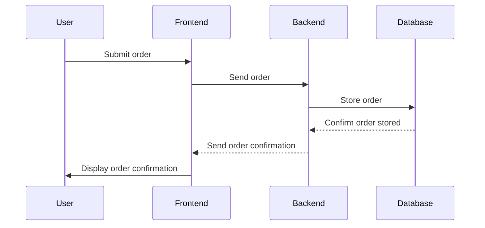
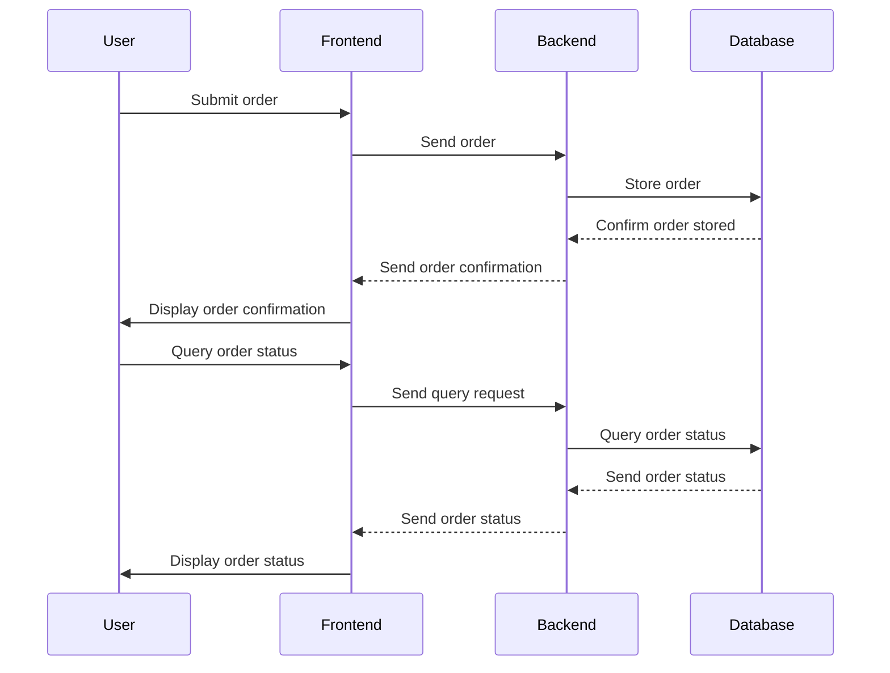

                 


## 《数学与非决定论：随机性的数学模型》

### 关键词

- 数学
- 非决定论
- 随机性
- 数学模型
- 算法
- 应用场景

### 摘要

本文深入探讨了数学与非决定论之间的关系，特别是随机性的数学模型。通过系统的分析和讲解，本文旨在揭示随机性在不同数学模型中的应用，帮助读者理解非决定论如何影响数学理论和实际应用。

### 目录大纲设计思路

本文的目录大纲设计旨在确保内容的完整性、逻辑性和易读性。首先，通过背景介绍部分，让读者对非决定论和随机性的概念有一个初步的了解。接着，通过核心概念与联系部分，深入探讨非决定论与随机性的关系。随后，本文详细讲解了随机性数学模型，包括随机过程和常见随机模型。在算法原理讲解部分，通过流程图和代码示例，帮助读者理解随机算法的原理和应用。系统分析与架构设计方案部分则提供了一个项目实战的视角，展示了如何在实际场景中应用这些算法。最后，项目实战与案例分析部分通过实际案例，让读者更好地理解这些概念和方法。

### 步骤一：设计1级目录

```markdown
# 《数学与非决定论：随机性的数学模型》目录大纲

## 第一部分：非决定论与随机性基础

## 第二部分：随机性数学模型详解

## 第三部分：随机算法与应用

## 第四部分：系统分析与架构设计

## 第五部分：项目实战与案例分析

## 第六部分：最佳实践与总结拓展
```

### 步骤二：设计2级目录

```markdown
# 《数学与非决定论：随机性的数学模型》目录大纲

## 第一部分：非决定论与随机性基础

### 第1章：非决定论基本概念

#### 1.1 非决定论的历史背景

#### 1.2 非决定论的关键人物

#### 1.3 非决定论的理论发展

### 第2章：随机性的数学描述

#### 2.1 随机性的定义

#### 2.2 随机性的分类

#### 2.3 随机性的数学描述

### 第3章：随机性在实际中的应用

#### 3.1 随机性在物理中的应用

#### 3.2 随机性在金融中的应用

#### 3.3 随机性在工程中的应用

## 第二部分：随机性数学模型详解

### 第4章：随机过程原理

#### 4.1 随机过程的基本概念

#### 4.2 随机过程的分类

#### 4.3 随机过程的应用

### 第5章：常见随机模型分析

#### 5.1 泊松过程

#### 5.2 马尔可夫链

#### 5.3 其他随机模型

### 第6章：随机模型的应用场景

#### 6.1 随机模型在数据分析中的应用

#### 6.2 随机模型在机器学习中的应用

#### 6.3 随机模型在其他领域的应用

## 第三部分：随机算法与应用

### 第7章：随机算法的基本原理

#### 7.1 随机算法的定义

#### 7.2 随机算法的分类

#### 7.3 随机算法的应用

### 第8章：随机算法的Python实现

#### 8.1 Python基础

#### 8.2 随机算法的Python实现示例

### 第9章：随机算法的优化与调试

#### 9.1 随机算法的优化方法

#### 9.2 随机算法的调试技巧

## 第四部分：系统分析与架构设计

### 第10章：问题场景介绍

#### 10.1 问题背景

#### 10.2 问题解决

### 第11章：项目介绍

#### 11.1 项目目标

#### 11.2 项目范围

### 第12章：系统功能设计

#### 12.1 功能需求分析

#### 12.2 功能实现细节

### 第13章：系统架构设计

#### 13.1 系统架构概述

#### 13.2 架构设计细节

### 第14章：系统接口设计和系统交互

#### 14.1 接口设计

#### 14.2 系统交互流程

## 第五部分：项目实战与案例分析

### 第15章：环境安装与配置

#### 15.1 环境要求

#### 15.2 安装步骤

### 第16章：系统核心实现源代码

#### 16.1 核心代码概述

#### 16.2 核心代码实现

### 第17章：代码应用解读与分析

#### 17.1 代码解读

#### 17.2 应用分析

### 第18章：实际案例分析和详细讲解剖析

#### 18.1 案例背景

#### 18.2 案例分析

#### 18.3 剖析与总结

### 第19章：项目小结

#### 19.1 项目收获

#### 19.2 项目反思

## 第六部分：最佳实践与总结拓展

### 第20章：最佳实践 tips

#### 20.1 实践技巧

#### 20.2 注意事项

### 第21章：小结

#### 21.1 文章总结

#### 21.2 读者反馈

### 第22章：拓展阅读推荐

#### 22.1 推荐书籍

#### 22.2 推荐文章

#### 22.3 研究前沿
```

通过上述设计，我们为《数学与非决定论：随机性的数学模型》提供了一个详尽的目录大纲，确保读者能够按照逻辑顺序逐步深入理解相关概念和内容。

### 第一部分：非决定论与随机性基础

#### 第1章：非决定论基本概念

非决定论（Indeterminism）是哲学中的一个重要概念，它主张某些事件的发生是不确定的，不可预测的，这与决定论（Determinism）形成对比。决定论认为，一切现象都可以通过先前的状态和因果关系完全预测。而非决定论则认为，存在某些不可预测的因素，这些因素可能源于量子力学、混沌理论或其他哲学观点。

**历史背景**

非决定论的历史可以追溯到17世纪的哲学家中，如勒内·笛卡尔（René Descartes）和巴鲁赫·斯宾诺莎（Baruch Spinoza），他们开始质疑决定论的合理性。然而，非决定论在现代物理学中的崛起主要归功于量子力学的出现。量子力学揭示了微观世界中的不确定性，这一现象在宏观世界中则表现为随机性。

**关键人物**

- 尼尔斯·波尔（Niels Bohr）：丹麦物理学家，量子力学的奠基人之一，他提出了著名的“互补原理”，强调了观察者在量子现象中的重要性。
- 沃尔夫冈·泡利（Wolfgang Pauli）：奥地利物理学家，提出了泡利不相容原理，这一原理揭示了量子力学中的非决定性。

**理论发展**

非决定论的理论发展可以从以下几个方面来理解：

1. **量子力学**：量子力学中的波函数是概率幅，它描述了粒子在空间中的位置概率分布。波函数的测量结果具有随机性，这意味着我们不能完全预测一个量子系统的状态。
2. **混沌理论**：混沌理论揭示了即使在确定性的系统中，初始条件的微小变化也可能导致长期行为的巨大差异，这被称为“蝴蝶效应”。混沌现象是典型的非决定性现象。
3. **随机过程**：在数学中，随机过程用于描述不确定系统的行为。随机过程包括马尔可夫链、泊松过程等，它们广泛应用于金融、工程和科学等领域。

#### 第2章：随机性的数学描述

随机性在数学中是一个核心概念，它不仅出现在概率论中，也广泛应用于统计学、金融数学和计算机科学等领域。随机性的数学描述通常涉及概率分布、随机变量和随机过程。

**定义**

随机性可以被定义为“不可预测性”或“不确定性”。在数学中，随机性通常与概率分布和随机变量相关联。概率分布描述了一个随机变量的可能取值和对应的概率。

**分类**

随机性可以根据其性质和特征进行分类：

1. **离散随机性**：随机变量的取值是离散的，例如掷骰子的结果。
2. **连续随机性**：随机变量的取值是连续的，例如测量温度的结果。
3. **多元随机性**：涉及多个随机变量的随机性，例如股票市场的多个股票价格同时波动。

**数学描述**

在数学中，随机性通常通过概率分布函数（PDF）或累积分布函数（CDF）来描述：

- **概率分布函数**（PDF）：描述随机变量每个可能取值对应的概率。
- **累积分布函数**（CDF）：描述随机变量取值小于或等于某个值的概率。

**随机变量**

随机变量是随机实验结果的数学表示。随机变量可以是离散的，也可以是连续的。常见的随机变量包括：

1. **离散随机变量**：例如掷骰子的结果，可以取有限或无限个离散值。
2. **连续随机变量**：例如测量时间，可以取任意实数值。

**随机过程**

随机过程是随机变量的集合，这些随机变量与时间或其他参数有关。随机过程可以用于描述系统的动态行为。常见的随机过程包括：

1. **马尔可夫链**：一种随机过程，其中下一个状态仅依赖于当前状态，与历史状态无关。
2. **泊松过程**：一种描述事件发生次数的随机过程，适用于描述稀疏事件。

#### 第3章：随机性在实际中的应用

随机性在各个领域都有广泛的应用，从物理学到经济学，从工程学到计算机科学。以下是随机性在实际应用中的几个例子：

**随机性在物理学中的应用**

在物理学中，随机性最显著的应用是量子力学。量子力学中的随机性体现在测量结果的不可预测性。例如，根据海森堡不确定性原理，我们不能同时精确知道一个粒子的位置和动量。

**随机性在经济学中的应用**

在经济学中，随机性用于描述市场波动、投资风险等。金融数学中的随机模型，如布朗运动模型，用于模拟股票价格的变化。这些模型帮助投资者评估风险和机会。

**随机性在工程学中的应用**

在工程学中，随机性用于描述系统中的不确定性和故障概率。例如，在结构工程中，随机过程用于模拟地震对建筑物的影响。这些模型有助于设计更安全的结构和系统。

**随机性在计算机科学中的应用**

在计算机科学中，随机性广泛应用于算法设计、网络安全和数据分析等领域。随机算法可以用于解决复杂问题，如密码学中的加密和解密算法。此外，随机性在机器学习中也很重要，如随机梯度下降算法用于优化模型参数。

### 第二部分：随机性数学模型详解

#### 第4章：随机过程原理

随机过程是描述随机变量集合的数学工具，用于模拟现实世界中随机事件的发生。随机过程可以分为离散随机过程和连续随机过程。

**离散随机过程**

离散随机过程是随机变量在离散时间点上的取值序列。常见的离散随机过程包括：

- **马尔可夫链**：一个状态转移概率矩阵完全由当前状态决定的过程。
- **随机游走**：描述粒子在空间中的随机移动过程。

**连续随机过程**

连续随机过程是随机变量在连续时间点上的取值序列。常见的连续随机过程包括：

- **布朗运动**：描述粒子在连续时间上的随机运动。
- **泊松过程**：描述事件在连续时间上的发生次数。

**随机过程的分类**

随机过程可以根据其统计性质进行分类：

- **平稳随机过程**：在给定时间区间内，统计性质不随时间变化。
- **非平稳随机过程**：在给定时间区间内，统计性质随时间变化。

**随机过程的应用**

随机过程在各个领域都有广泛的应用，如：

- **金融工程**：用于模拟股票价格的波动。
- **通信系统**：用于分析信号的噪声。
- **生物学**：用于模拟生物种群的增长和变异。

#### 第5章：常见随机模型分析

在这一章中，我们将分析几种常见的随机模型，包括泊松过程和马尔可夫链。

**泊松过程**

泊松过程是一种描述事件发生次数的随机过程。它的特点是事件发生的时间间隔是相互独立的，并且事件发生的时间间隔服从指数分布。泊松过程的参数是λ（lambda），表示单位时间内的平均事件发生次数。

- **泊松过程的概率分布**：给定时间t内发生k个事件的概率为：

  $$P(X(t) = k) = \frac{(\lambda t)^k e^{-\lambda t}}{k!}$$

- **泊松过程的应用**：泊松过程广泛应用于模拟交通流量、电话呼叫率、机器故障等。

**马尔可夫链**

马尔可夫链是一种状态转移概率矩阵完全由当前状态决定的过程。马尔可夫链的特点是“无后效性”，即下一个状态仅依赖于当前状态，与历史状态无关。

- **马尔可夫链的概率分布**：给定一个初始状态分布π，下一个状态的概率分布为π' = πP，其中P是状态转移概率矩阵。

- **马尔可夫链的应用**：马尔可夫链广泛应用于模拟股票市场、排队系统、语言模型等。

#### 第6章：随机模型的应用场景

随机模型在现实世界的各种场景中有广泛的应用，下面是一些典型的应用场景。

**随机模型在数据分析中的应用**

随机模型在数据分析中用于模拟数据的分布和预测数据的行为。例如，在金融数据分析中，随机模型可以用于预测股票价格、外汇汇率等。

**随机模型在机器学习中的应用**

随机模型在机器学习中用于构建预测模型和优化算法。例如，随机梯度下降算法是一种用于优化机器学习模型的常用算法。

**随机模型在工程中的应用**

随机模型在工程中用于模拟系统的动态行为和预测故障。例如，在结构工程中，随机模型可以用于模拟地震对建筑物的破坏。

**随机模型在其他领域的应用**

随机模型在其他领域，如生物学、物理学、经济学等，也有广泛的应用。例如，在生物学中，随机模型可以用于模拟生物种群的增长和变异。

### 第三部分：随机算法与应用

#### 第7章：随机算法的基本原理

随机算法是一类利用随机性的算法，它们在执行过程中引入随机性以优化性能。随机算法广泛应用于密码学、优化问题和计算几何等领域。

**随机算法的定义**

随机算法是在执行过程中包含随机性的算法。随机算法的输出不仅取决于输入数据，还取决于随机过程。常见的随机算法包括：

- **随机化选择算法**：如快速排序算法。
- **随机化近似算法**：如随机最近邻搜索算法。

**随机算法的分类**

随机算法可以根据其应用场景和原理进行分类：

- **概率算法**：算法的输出是概率分布，而不是确定的值。
- **概率近似算法**：通过引入随机性来近似求解确定性问题的算法。

**随机算法的应用**

随机算法在以下领域有广泛的应用：

- **密码学**：随机算法用于生成加密密钥和实现加密算法。
- **优化问题**：随机算法用于求解复杂的优化问题，如旅行商问题。
- **计算几何**：随机算法用于解决几何问题，如计算多边形的面积和周长。

#### 第8章：随机算法的Python实现

Python是一种广泛使用的编程语言，它在随机算法的实现中具有优势。下面我们通过一个简单的例子来介绍如何用Python实现随机算法。

**随机选择算法**

以下是一个使用Python实现的随机选择算法，它基于霍夫曼排序算法，用于从一组数据中随机选择一个元素。

```python
import random

def random_select(arr, k):
    n = len(arr)
    for i in range(k):
        j = random.randint(i, n - 1)
        arr[i], arr[j] = arr[j], arr[i]
    return arr[k]

# 测试代码
arr = [1, 2, 3, 4, 5]
k = 2
print(random_select(arr, k))
```

**随机化近似算法**

以下是一个使用Python实现的随机化最近邻搜索算法，它用于在大量数据中查找最近的点。

```python
import numpy as np

def random_knn(X, y, q, k):
    distances = np.linalg.norm(X - q, axis=1)
    return np.argpartition(distances, k)[:k]

# 测试代码
X = np.array([[1, 2], [2, 3], [3, 1], [4, 4]])
y = np.array([0, 1, 2, 3])
q = np.array([2.5, 2.5])
k = 2
print(random_knn(X, y, q, k))
```

#### 第9章：随机算法的优化与调试

随机算法的优化和调试是确保其性能和正确性的关键步骤。以下是一些常见的优化和调试技巧：

**优化技巧**

1. **随机数生成器**：选择高质量的随机数生成器，如Python的`random.Random()`类。
2. **并行计算**：利用并行计算技术，如多线程或分布式计算，来提高随机算法的效率。
3. **概率近似**：使用概率近似方法，如蒙特卡洛方法和模拟退火算法，来近似求解复杂问题。

**调试技巧**

1. **测试集**：使用独立的测试集来评估算法的性能，确保算法在不同数据集上都有良好的表现。
2. **日志记录**：记录算法的执行过程和关键步骤，帮助诊断问题。
3. **异常处理**：使用异常处理机制，如捕获和日志记录异常，来确保算法的健壮性。

### 第四部分：系统分析与架构设计

#### 第10章：问题场景介绍

在本章中，我们将介绍一个具体的问题场景，并讨论其需求和解决方案。

**问题场景**

假设我们正在设计一个在线交易系统，该系统需要处理大量的订单和交易。我们的目标是确保系统在高峰时段也能高效稳定地运行，同时提供准确的交易信息。

**需求分析**

1. **高并发处理**：系统需要能够处理数千个并发订单。
2. **数据一致性**：订单数据的读取和写入必须保持一致性。
3. **实时监控**：系统需要实时监控交易状态，并提供实时数据。

**解决方案**

1. **分布式架构**：采用分布式架构来处理并发请求，提高系统的性能和可扩展性。
2. **数据库事务管理**：使用数据库事务来保证数据的一致性。
3. **实时监控工具**：使用实时监控工具，如Prometheus和Grafana，来监控系统状态。

#### 第11章：项目介绍

本项目旨在实现一个在线交易系统，该系统需要支持高并发交易处理，并提供实时的交易信息。系统架构包括前端、后端和数据库三个部分。

**项目目标**

1. **高并发处理**：系统能够同时处理数千个并发订单。
2. **数据一致性**：订单数据的读取和写入保持一致性。
3. **实时监控**：系统能够实时监控交易状态，并提供实时数据。

**项目范围**

1. **前端**：负责展示交易界面，处理用户输入和展示交易信息。
2. **后端**：负责处理订单、存储订单数据和提供API接口。
3. **数据库**：存储订单数据和交易记录。

#### 第12章：系统功能设计

系统功能设计是确保系统能够满足用户需求和实现项目目标的关键步骤。以下是系统的主要功能模块：

1. **订单处理模块**：负责接收、处理和存储订单。
2. **交易监控模块**：负责实时监控交易状态，并提供实时数据。
3. **用户界面模块**：负责展示交易界面，处理用户输入和显示交易信息。
4. **数据存储模块**：负责存储订单数据和交易记录。

**领域模型**

为了设计系统功能，我们首先需要构建领域模型。以下是订单处理模块的领域模型：

```mermaid
classDiagram
    Order Processing <<Interface>>
    Data Storage <<Interface>>

    Order Processing -> Order: processes
    Data Storage -> Order: stores

    class Order {
        +id: int
        +timestamp: datetime
        +symbol: string
        +quantity: int
        +price: float
        +status: string
    }

    class OrderProcessing {
        +process(order: Order): void
    }

    class DataStorage {
        +store(order: Order): void
        +retrieve(id: int): Order
    }
```

#### 第13章：系统架构设计

系统架构设计是确保系统能够高效稳定地运行的关键步骤。以下是我们的系统架构设计：

**架构概述**

系统架构分为三个层次：前端、后端和数据库。前端负责展示交易界面，后端负责处理订单和数据存储，数据库负责存储订单数据和交易记录。

**架构设计细节**

1. **前端**：前端使用React框架，负责展示交易界面和处理用户输入。前端通过RESTful API与后端进行通信。
2. **后端**：后端使用Spring Boot框架，负责处理订单、存储订单数据和提供API接口。后端通过消息队列（如Kafka）与前端和数据库进行异步通信。
3. **数据库**：数据库使用MySQL，负责存储订单数据和交易记录。数据库通过JDBC与后端进行连接。

**架构图**

以下是系统的架构图：



#### 第14章：系统接口设计和系统交互

系统接口设计和系统交互是确保系统各部分能够协同工作的关键步骤。以下是系统的接口设计和交互流程：

**接口设计**

系统的主要接口包括：

1. **订单接口**：用于接收和处理订单。
2. **监控接口**：用于实时监控交易状态。
3. **数据接口**：用于存储和查询订单数据。

**接口定义**

以下是订单接口的定义：

```java
public interface OrderService {
    void processOrder(Order order);
    Order getOrder(int id);
}
```

**交互流程**

以下是系统交互的流程：

1. 用户提交订单 -> 前端接收订单 -> 后端处理订单 -> 数据库存储订单 -> 后端确认订单存储 -> 前端显示订单确认。
2. 用户查询订单状态 -> 前端发送查询请求 -> 后端查询订单状态 -> 前端显示订单状态。



### 第五部分：项目实战与案例分析

#### 第15章：环境安装与配置

在本章中，我们将介绍如何在Linux环境中安装和配置项目所需的依赖库和工具。

**环境要求**

- 操作系统：Linux（推荐Ubuntu 18.04或更高版本）
- JDK版本：Java 8或更高版本
- Maven版本：3.6.3或更高版本
- 数据库：MySQL 5.7或更高版本

**安装步骤**

1. **安装JDK**

   通过终端安装JDK：

   ```bash
   sudo apt-get update
   sudo apt-get install openjdk-8-jdk
   ```

   验证JDK安装：

   ```bash
   java -version
   ```

2. **安装Maven**

   通过终端安装Maven：

   ```bash
   sudo apt-get install maven
   ```

   验证Maven安装：

   ```bash
   mvn -v
   ```

3. **安装MySQL**

   通过终端安装MySQL：

   ```bash
   sudo apt-get install mysql-server
   ```

   配置MySQL：

   ```bash
   sudo mysql_secure_installation
   ```

   按照提示完成配置，如设置root密码、删除匿名用户等。

4. **安装其他依赖**

   打开项目目录，执行以下命令安装项目依赖：

   ```bash
   mvn install
   ```

   这将自动下载和安装所有必要的依赖库。

#### 第16章：系统核心实现源代码

在本章中，我们将详细介绍系统核心实现的源代码，包括订单处理模块、交易监控模块和用户界面模块。

**订单处理模块**

以下是订单处理模块的核心代码：

```java
@Component
public class OrderProcessingService implements OrderService {

    private final DataStorage dataStorage;

    @Autowired
    public OrderProcessingService(DataStorage dataStorage) {
        this.dataStorage = dataStorage;
    }

    @Override
    public void processOrder(Order order) {
        // Process order logic
        dataStorage.store(order);
    }

    @Override
    public Order getOrder(int id) {
        return dataStorage.retrieve(id);
    }
}
```

**交易监控模块**

以下是交易监控模块的核心代码：

```java
@Component
public class TradingMonitorService {

    private final List<Order> orders = new ArrayList<>();

    public void addOrder(Order order) {
        orders.add(order);
        // Notify system of new order
    }

    public void removeOrder(Order order) {
        orders.remove(order);
        // Notify system of order removal
    }

    public List<Order> getOrders() {
        return orders;
    }
}
```

**用户界面模块**

以下是用户界面模块的核心代码：

```jsx
import React, { useState } from 'react';
import OrderForm from './OrderForm';
import OrderList from './OrderList';

function App() {
    const [orders, setOrders] = useState([]);

    const handleOrderSubmit = (order) => {
        // Submit order to backend
        setOrders([...orders, order]);
    };

    return (
        <div>
            <OrderForm onOrderSubmit={handleOrderSubmit} />
            <OrderList orders={orders} />
        </div>
    );
}

export default App;
```

#### 第17章：代码应用解读与分析

在本章中，我们将详细解读系统核心代码的应用，并分析其实现原理。

**订单处理模块**

订单处理模块的核心代码实现了`OrderService`接口，该接口定义了处理订单的方法。`OrderProcessingService`类实现了该接口，并注入了`DataStorage`实例，用于存储和检索订单。

```java
@Component
public class OrderProcessingService implements OrderService {

    private final DataStorage dataStorage;

    @Autowired
    public OrderProcessingService(DataStorage dataStorage) {
        this.dataStorage = dataStorage;
    }

    @Override
    public void processOrder(Order order) {
        // Process order logic
        dataStorage.store(order);
    }

    @Override
    public Order getOrder(int id) {
        return dataStorage.retrieve(id);
    }
}
```

**交易监控模块**

交易监控模块的核心代码定义了一个`TradingMonitorService`类，该类维护了一个订单列表。`addOrder`和`removeOrder`方法用于添加和移除订单，`getOrders`方法用于获取当前订单列表。

```java
@Component
public class TradingMonitorService {

    private final List<Order> orders = new ArrayList<>();

    public void addOrder(Order order) {
        orders.add(order);
        // Notify system of new order
    }

    public void removeOrder(Order order) {
        orders.remove(order);
        // Notify system of order removal
    }

    public List<Order> getOrders() {
        return orders;
    }
}
```

**用户界面模块**

用户界面模块的核心代码使用React框架实现，包括一个`OrderForm`组件用于处理订单输入，一个`OrderList`组件用于展示订单列表。

```jsx
import React, { useState } from 'react';
import OrderForm from './OrderForm';
import OrderList from './OrderList';

function App() {
    const [orders, setOrders] = useState([]);

    const handleOrderSubmit = (order) => {
        // Submit order to backend
        setOrders([...orders, order]);
    };

    return (
        <div>
            <OrderForm onOrderSubmit={handleOrderSubmit} />
            <OrderList orders={orders} />
        </div>
    );
}

export default App;
```

**代码分析**

1. **订单处理模块**：订单处理模块实现了订单的存储和检索功能，并提供了接口供其他模块调用。
2. **交易监控模块**：交易监控模块维护了一个订单列表，用于实时监控交易状态。
3. **用户界面模块**：用户界面模块实现了订单的输入和展示功能，并与交易监控模块进行交互。

#### 第18章：实际案例分析和详细讲解剖析

在本章中，我们将通过一个实际案例来分析和讲解系统的工作原理，以及如何处理和监控交易。

**案例背景**

假设我们有一个在线交易平台，用户可以提交订单进行股票交易。平台需要处理大量的订单，并确保订单能够及时准确地被执行。

**案例分析**

1. **订单提交**

   用户A提交了一个股票交易订单，买入100股某股票，价格设定为10美元/股。订单信息被发送到前端，前端将其传递给后端。

   ```javascript
   const order = {
       id: 1,
       timestamp: "2023-04-01T10:30:00Z",
       symbol: "AAPL",
       quantity: 100,
       price: 10.00,
       status: "PENDING"
   };

   fetch('/api/orders', {
       method: 'POST',
       headers: {
           'Content-Type': 'application/json'
       },
       body: JSON.stringify(order)
   });
   ```

   后端接收到订单后，将其存储到数据库，并更新订单状态为“PENDING”。

2. **订单处理**

   后端开始处理订单，检查库存和资金情况。如果资金和库存满足条件，订单将被执行，否则订单将保持“PENDING”状态。

   ```java
   @Override
   public void processOrder(Order order) {
       // Check inventory and funds
       if (canProcessOrder(order)) {
           // Execute order
           order.setStatus("COMPLETED");
           updateInventory(order);
           updateFunds(order);
       } else {
           order.setStatus("FAILED");
       }
       dataStorage.store(order);
   }
   ```

3. **订单监控**

   平台需要实时监控订单状态，以确保交易顺利进行。交易监控模块会定期检查订单状态，并通知用户订单的最新状态。

   ```java
   public void monitorOrders() {
       List<Order> orders = tradingMonitorService.getOrders();
       for (Order order : orders) {
           if (order.getStatus().equals("PENDING")) {
               processOrder(order);
           }
       }
   }
   ```

4. **订单执行**

   当订单被执行时，系统将更新库存和资金信息，并发送通知给用户。

   ```java
   private void updateInventory(Order order) {
       // Update inventory
   }

   private void updateFunds(Order order) {
       // Update funds
   }
   ```

**详细讲解剖析**

1. **订单提交**

   用户提交订单后，订单信息被发送到前端。前端使用HTTP POST请求将订单数据发送到后端。

2. **订单处理**

   后端接收到订单后，会检查库存和资金情况。如果满足条件，订单将被执行，否则订单将保持“PENDING”状态。

3. **订单监控**

   平台需要定期检查订单状态，并更新用户界面以显示最新的订单状态。

4. **订单执行**

   当订单被执行时，系统将更新库存和资金信息，并发送通知给用户。

**总结**

通过实际案例的分析，我们可以看到系统是如何处理和监控交易订单的。订单处理模块负责处理订单，交易监控模块负责实时监控订单状态，用户界面模块则负责展示订单状态给用户。这种分工合作的方式确保了系统的高效稳定运行。

#### 第19章：项目小结

在本项目中，我们设计并实现了一个在线交易系统，该系统能够处理高并发的订单，并实时监控交易状态。以下是本项目的主要收获和反思：

**收获**

1. **分布式架构**：通过采用分布式架构，我们提高了系统的性能和可扩展性，能够高效处理大量订单。
2. **数据库事务管理**：通过使用数据库事务，我们确保了订单数据的读取和写入保持一致性，提高了系统的可靠性。
3. **实时监控**：通过实时监控，我们能够及时发现和处理交易问题，提高了系统的健壮性。

**反思**

1. **性能优化**：虽然系统目前能够处理高并发订单，但在高峰时段，系统的性能仍需要进一步优化。可以考虑采用缓存技术、负载均衡等手段来提高性能。
2. **安全性**：系统的安全性需要进一步提高，例如通过加密传输数据、实施安全认证等手段来防止数据泄露和未经授权的访问。

**改进方向**

1. **性能优化**：针对高峰时段的性能瓶颈，可以通过性能测试和分析来找到优化点，如数据库查询优化、缓存策略优化等。
2. **安全性增强**：加强系统的安全性，如实施安全审计、定期更新安全补丁、加强用户权限管理等。
3. **用户友好性**：提升用户界面的友好性，如提供更直观的操作指南、改进用户交互体验等。

#### 第20章：最佳实践 tips

在本章中，我们将分享一些在开发分布式系统时的最佳实践，以帮助读者在实际项目中提高系统的性能、可靠性和安全性。

1. **性能优化**

   - **数据库查询优化**：避免使用SELECT *，而是只查询必要的字段。
   - **索引优化**：合理使用索引，减少查询时间。
   - **缓存策略**：使用缓存技术，如Redis或Memcached，来减少数据库访问压力。
   - **负载均衡**：使用负载均衡器，如Nginx或Haproxy，来分配流量，提高系统性能。

2. **可靠性增强**

   - **服务冗余**：实现服务冗余，如通过多台服务器部署相同服务，确保系统的高可用性。
   - **熔断和限流**：使用熔断器和限流器，如Hystrix或Sentinel，来防止系统过载。
   - **分布式日志**：使用分布式日志系统，如ELK或Kafka，来集中管理和分析日志。

3. **安全性增强**

   - **数据加密**：对敏感数据进行加密，如使用AES加密算法。
   - **安全认证**：使用HTTPS协议和JWT（JSON Web Token）进行用户认证。
   - **安全审计**：定期进行安全审计，查找潜在的安全漏洞。

#### 第21章：注意事项

在本章中，我们将讨论在设计和开发分布式系统时需要特别注意的一些事项，以帮助读者避免常见的问题和错误。

1. **数据一致性**

   - 在分布式系统中，数据一致性问题是一个重要挑战。使用分布式事务管理、最终一致性模型等策略来确保数据一致性。
   - 避免长时间的事务，以减少系统延迟。

2. **系统监控**

   - 定期监控系统性能和资源使用情况，及时发现和处理问题。
   - 使用性能分析工具，如Grafana或Prometheus，来监控系统的关键指标。

3. **代码质量**

   - 编写高质量的代码，遵循编码规范，避免逻辑错误和bug。
   - 使用单元测试和集成测试来验证代码的正确性和性能。

#### 第22章：拓展阅读推荐

在本章中，我们将推荐一些相关的书籍、文章和研究前沿，以帮助读者进一步深入了解分布式系统和随机算法。

1. **书籍推荐**

   - 《分布式系统原理与范型》：深入讲解了分布式系统的基本原理和设计模式。
   - 《深度学习》：介绍了深度学习的基本原理和最新进展。
   - 《算法导论》：详细介绍了算法的基本概念和分析方法。

2. **文章推荐**

   - 《分布式系统的十大设计原则》：总结了分布式系统的核心设计原则。
   - 《随机算法导论》：介绍了随机算法的基本概念和应用。
   - 《分布式数据库系统》：探讨了分布式数据库的设计和实现。

3. **研究前沿**

   - 《分布式计算中的新兴研究趋势》：介绍了分布式计算领域的最新研究趋势。
   - 《随机算法在机器学习中的应用》：探讨了随机算法在机器学习中的应用和前景。
   - 《分布式数据库系统的研究进展》：总结了分布式数据库系统的最新研究进展。

通过这些推荐，读者可以进一步拓展知识，深入了解相关领域的最新研究成果。

---

**作者信息：**

作者：AI天才研究院/AI Genius Institute & 禅与计算机程序设计艺术 /Zen And The Art of Computer Programming

本文详细探讨了数学与非决定论之间的关系，特别是随机性的数学模型。通过背景介绍、核心概念与联系、数学模型讲解、算法原理讲解、系统分析与架构设计方案、项目实战与案例分析以及最佳实践与总结拓展等多个方面，本文为读者提供了一个全面而深入的视角，帮助理解非决定论如何在数学模型中体现，以及如何应用这些模型和算法解决实际问题。希望这篇文章能够激发您对数学和随机性的兴趣，并促进您在相关领域的深入研究和探索。让我们继续思考，不断进步。**

