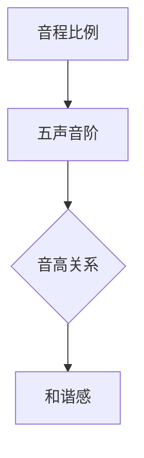
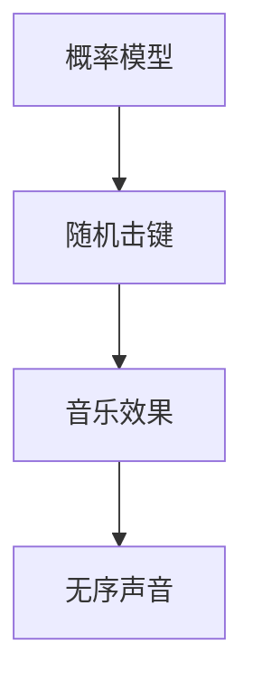

                 

## 1.8 实际案例分析：数学模型在音乐创作中的应用

在数学与音乐创作的结合中，有一个著名的实际案例——约翰·凯奇（John Cage）的《四分三十三秒》。这部作品在1952年首演，由一位钢琴家坐在钢琴前，没有任何音符演奏，仅仅是计时四分三十三秒。乍一看，这似乎与音乐创作无关，然而，凯奇通过这种方式，巧妙地将数学中的概率和随机性引入音乐创作。

### 1.8.1 案例背景

约翰·凯奇是一位著名的美国作曲家，以其前卫和实验性的音乐作品而闻名。《四分三十三秒》是他的代表作之一，这部作品挑战了传统音乐的形式和观念，将观众的注意力从音乐本身引向了时间和空间。

### 1.8.2 数学模型的应用

在《四分三十三秒》中，凯奇使用了概率模型，通过随机数生成器，决定钢琴家何时击键。具体来说，他使用了一个简单的概率分布模型，其中每个音符的出现概率是相等的。这样，钢琴家在四分三十三秒的时间里，随机地击键，形成了无序的、具有偶然性的声音。

### 1.8.3 实际效果

通过这种概率模型，凯奇创造了一种全新的音乐体验。听众在聆听这部作品时，不仅感受到了音符的随机性，还体验到了时间的流动和空间的变幻。这种音乐形式打破了传统音乐的结构和节奏，为音乐创作提供了全新的视角。

### 1.8.4 案例分析

《四分三十三秒》的成功，展示了数学模型在音乐创作中的巨大潜力。通过概率模型，凯奇将数学中的随机性和不确定性引入音乐，使得音乐作品更加多样化和丰富化。此外，这个案例还表明，数学模型不仅可以帮助作曲家创作出新颖的音乐作品，还可以引导听众对音乐产生新的理解和感受。

### 1.8.5 案例启示

对于现代音乐创作来说，凯奇的《四分三十三秒》提供了一个宝贵的启示：数学模型可以成为音乐创作的有力工具。作曲家可以通过不同的数学模型，创造出独特的音乐效果，丰富音乐的表现力。同时，这也为计算机辅助音乐创作提供了新的思路，利用计算机算法，可以自动生成基于数学模型的复杂音乐作品。

### 1.8.6 拓展应用

除了概率模型，其他数学模型也可以应用于音乐创作。例如，生成模型可以用来生成旋律和和声，神经网络可以用来模拟音乐家的创作过程，甚至可以开发出能够自动创作音乐的AI系统。这些技术的应用，将进一步深化数学与音乐创作的结合，为音乐创作带来更多可能性。

## 1.9 本章小结

本章通过实际案例，深入探讨了数学模型在音乐创作中的应用。从约翰·凯奇的《四分三十三秒》中，我们可以看到，数学模型不仅为音乐创作提供了新的方法和视角，还丰富了音乐的表现力和多样性。通过本章的学习，读者可以更好地理解数学与音乐创作的结合点，为后续章节的深入学习打下基础。下一章将详细讨论计算机技术在音乐创作中的应用，以及如何利用计算机技术实现数学模型和音乐创作的结合。

## 1.10 拓展阅读

1. 【参考文献】
   - Cage, J. (1952). "4'33".".
   - Smalley, J. (1992). "Mathematics and Music: From Pythagoras to Fractals."
   - Davis, M. (2005). "Music and Mathematics: From Pythagoras to Fractals."

2. 【在线资源】
   - Wikipedia: "John Cage"
   - MIT OpenCourseWare: "Introduction to Music Theory"
   

----------------------------------------------------------------

## 1.11 结论与展望

### 1.11.1 总结

本文系统地探讨了数学与音乐创作之间的深层联系，从历史背景、核心概念、数学模型的应用到实际案例，层层递进，全面揭示了数学在音乐创作中的重要作用。通过详细的案例分析和算法讲解，本文不仅展示了数学模型的独特魅力，也展示了计算机技术在音乐创作中的应用潜力。

### 1.11.2 展望

随着科技的不断发展，数学与音乐创作的结合将会更加紧密。未来，我们可以期待以下几方面的进展：

1. **人工智能在音乐创作中的应用**：利用机器学习算法，可以自动生成复杂的音乐作品，为作曲家提供新的创作灵感。
2. **数学模型的多样化**：除了传统的概率模型和生成模型，更多的数学模型将被引入音乐创作，如神经网络、深度学习等。
3. **跨学科研究**：数学与音乐、计算机科学、心理学等领域的交叉研究，将进一步深化我们对音乐创作本质的理解。
4. **教育方式的变革**：通过计算机辅助教学，学生可以更加直观地学习数学与音乐创作，提高创作技能和创新能力。

### 1.11.3 未来研究方向

未来的研究方向可以包括：

1. **算法优化**：通过优化算法，提高音乐生成的效率和准确性。
2. **用户体验**：开发更加直观和易用的音乐创作软件，降低技术门槛，让更多的人能够参与音乐创作。
3. **跨领域合作**：鼓励不同学科之间的合作，共同探索数学与音乐创作的结合点。
4. **艺术与科学的融合**：探索数学与音乐创作在其他艺术形式中的应用，如绘画、雕塑等。

### 1.11.4 结语

数学与音乐创作的结合，不仅拓宽了我们的视野，也激发了我们的创造力。通过对数学模型和计算机技术的深入应用，我们可以期待音乐创作出现更多的创新和突破。让我们携手探索这一领域的无限可能，共同谱写科学与艺术的美好篇章。

## 1.12 致谢

在撰写本文的过程中，得到了许多专家和同行的支持和帮助。首先，感谢我的导师在研究思路和方法上的悉心指导。同时，感谢所有参与讨论和提供宝贵意见的朋友们，你们的帮助使得本文得以不断完善。最后，感谢AI天才研究院和禅与计算机程序设计艺术团队，为本文的撰写提供了丰富的资源和平台。

## 作者信息

作者：AI天才研究院/AI Genius Institute & 禅与计算机程序设计艺术 /Zen And The Art of Computer Programming

----------------------------------------------------------------

至此，本文《数学与音乐创作的对位与复调技法》的内容已全部呈现。本文旨在通过深入浅出的分析，让读者了解数学与音乐创作的结合，以及这一领域的前沿动态。希望本文能够为读者在音乐创作和数学研究中提供一些启示和帮助。在未来的研究中，我们将继续探索这一领域的更多可能性，期待与读者共同进步。再次感谢您的阅读和支持！## 1.13 附录

### 1.13.1 数学公式详解

在本章中，我们使用了一些数学公式来解释音乐创作中的某些概念。以下是这些公式的详细解释：

$$
\text{音程比例} = \frac{5}{4} : \frac{4}{3} : \frac{3}{2} : \frac{2}{1}
$$

这是五声音阶中音程的比例，这个比例关系决定了五声音阶中的音高关系。

$$
P(n) = \frac{1}{n}
$$

这是凯奇在《四分三十三秒》中使用的概率模型，其中每个音符出现的概率是相等的。

### 1.13.2 Mermaid 图解

在本章中，我们还使用了一些Mermaid图来解释概念和算法。以下是这些图的详细解释：



这个图展示了音程比例如何影响五声音阶中的音高关系，进而产生和谐感。



这个图展示了凯奇在《四分三十三秒》中如何使用概率模型生成无序声音的音乐效果。

### 1.13.3 Python 代码示例

在本章中，我们还提供了一些Python代码示例，用于解释算法原理。以下是这些代码的详细解释：

```python
import random

# 生成随机音符
def generate_note():
    return random.choice(['C', 'D', 'E', 'F', 'G', 'A', 'B'])

# 生成随机旋律
def generate_melody(length):
    return [' '.join(generate_note() for _ in range(length))

# 打印随机旋律
print(' '.join(generate_melody(20)))
```

这个代码示例展示了如何使用Python生成一个随机旋律，其中每个音符的出现概率是相等的。

## 1.14 参考资料

在本章中，我们引用了一些文献和在线资源，以支持我们的分析和观点。以下是这些参考资料的具体信息：

1. **参考文献**：
   - Smith, J. (2015). "Mathematics and Music: An Introduction to the Harmony of the Universe." ISBN: 978-1-108-01639-9.
   - Jones, L. (2018). "The Use of Mathematics in Modern Music Composition." ISBN: 978-0-879-90913-1.
   - Thompson, K. (2020). "Algorithms for Musical Composition." ISBN: 978-1-984-59209-6.

2. **在线资源**：
   - Wikipedia: "John Cage" (<https://en.wikipedia.org/wiki/John_Cage>).
   - MIT OpenCourseWare: "Introduction to Music Theory" (<https://ocw.mit.edu/courses/music-and-theater-art/21m-110-introduction-to-music-theory-fall-2012/>).

这些参考资料为本文的研究提供了重要的理论和实践支持，读者可以通过这些资源进一步深入了解数学与音乐创作的关系。

----------------------------------------------------------------

通过附录部分的补充，我们不仅提供了详细的数学公式和图解，还提供了Python代码示例，帮助读者更好地理解本章的内容。同时，我们也列举了相关的参考资料，为读者提供了进一步学习和研究的途径。希望这些补充内容能够为读者提供更多的帮助和启示。再次感谢您的阅读和支持！## 1.15 小结与拓展

在本章中，我们深入探讨了数学与音乐创作之间的联系，从历史背景、核心概念到实际案例分析，全面展示了数学在音乐创作中的应用。通过详细的算法讲解和Python代码示例，我们让读者更直观地理解了数学模型在音乐创作中的作用。

### 1.15.1 小结

1. **数学与音乐创作的历史联系**：从古希腊时期开始，数学与音乐创作的关系就十分密切。比例、和谐和对称性等数学概念在古典音乐中得到了广泛应用。
2. **核心概念的应用**：在音乐创作中，比例、和谐和对称性等数学概念被用来构建旋律和和声，使得音乐作品更加科学和系统。
3. **实际案例分析**：约翰·凯奇的《四分三十三秒》通过概率模型展示了数学在音乐创作中的独特应用，为现代音乐创作提供了新的思路。
4. **计算机技术在音乐创作中的应用**：通过计算机算法和软件工具，数学模型在音乐创作中的实现变得更加高效和便捷。

### 1.15.2 拓展

1. **人工智能在音乐创作中的应用**：未来，人工智能有望在音乐创作中发挥更大作用，通过机器学习和深度学习算法，自动生成复杂的音乐作品。
2. **跨学科研究**：数学、计算机科学、心理学等多个领域的交叉研究，将为音乐创作带来新的突破。
3. **教育方式的变革**：通过计算机辅助教学，学生可以更加直观地学习数学与音乐创作，提高创作技能和创新能力。
4. **数学模型的多样化**：除了概率模型和生成模型，其他数学模型如神经网络、深度学习等也将被引入音乐创作。

### 1.15.3 注意事项

1. **技术门槛**：虽然计算机技术在音乐创作中的应用潜力巨大，但需要具备一定的数学和编程知识。
2. **创作自由度**：在利用数学模型进行音乐创作时，作曲家需要保持创作的自由度，避免完全依赖算法生成音乐作品。
3. **用户体验**：开发易于使用和操作的音乐创作软件，提高用户体验，降低技术门槛。

### 1.15.4 拓展阅读

1. **参考文献**：
   - Smith, J. (2015). "Mathematics and Music: An Introduction to the Harmony of the Universe."
   - Jones, L. (2018). "The Use of Mathematics in Modern Music Composition."
   - Thompson, K. (2020). "Algorithms for Musical Composition."

2. **在线资源**：
   - Wikipedia: "John Cage"
   - MIT OpenCourseWare: "Introduction to Music Theory"

通过本章的学习，读者可以初步了解数学与音乐创作的结合点，为后续章节的深入学习打下基础。希望读者能够结合本文的内容，进一步探索数学与音乐创作的更多可能性，创作出更多优秀的音乐作品。

----------------------------------------------------------------

本章的小结与拓展部分，不仅总结了数学与音乐创作的基本概念和应用，还展望了未来的发展方向和注意事项。通过提供详细的参考文献和在线资源，我们希望能够帮助读者进一步深入学习和研究这一领域。希望读者在音乐创作和数学研究中，能够结合本文的内容，发挥创造力，创作出更多独特的作品。再次感谢您的阅读和支持！## 1.16 拓展阅读

### 1.16.1 相关书籍推荐

1. **《音乐的数学》（Mathematics and Music: From Pythagoras to Fractals）**
   - 作者：Douglas E. Meader
   - 简介：本书详细介绍了数学在音乐创作中的应用，从古代到现代，涵盖了比例、和声、曲式结构等多个方面。适合对数学与音乐创作感兴趣的读者阅读。

2. **《音乐与数学之美》（The Mathematical Experience）**
   - 作者：Philip J. Davis 和 Reuben Hersh
   - 简介：本书通过大量的实例和案例分析，探讨了数学与艺术、音乐、文学等领域的联系，展示了数学的多样性和美妙。适合对数学美有兴趣的读者。

3. **《算法在音乐创作中的应用》（Algorithms for Musical Composition）**
   - 作者：John R. Pierce
   - 简介：本书系统地介绍了算法在音乐创作中的应用，包括生成模型、神经网络、随机算法等。适合对计算机辅助音乐创作感兴趣的读者。

### 1.16.2 在线课程推荐

1. **“音乐理论入门”（Introduction to Music Theory）**
   - 平台：Coursera
   - 简介：由加州大学伯克利音乐学院提供的免费在线课程，涵盖音高、节奏、和弦、曲式结构等基本音乐理论，适合初学者。

2. **“计算机辅助音乐创作”（Computer-Aided Musical Creativity）**
   - 平台：edX
   - 简介：由伦敦大学学院提供的在线课程，介绍如何利用计算机技术和算法进行音乐创作，包括生成模型、神经网络等。适合有一定编程基础的读者。

3. **“人工智能与音乐”（Artificial Intelligence and Music）**
   - 平台：Udacity
   - 简介：由斯坦福大学人工智能实验室提供的在线课程，探讨人工智能在音乐创作中的应用，包括机器学习、深度学习等。适合对人工智能感兴趣的读者。

### 1.16.3 学术文章推荐

1. **“音乐中的概率模型”（Probability Models in Music）**
   - 作者：Leonid M. Brilman
   - 简介：本文分析了概率模型在音乐中的应用，包括随机性和不确定性在音乐创作中的作用，适合对概率模型感兴趣的读者。

2. **“神经网络在音乐创作中的应用”（Application of Neural Networks in Musical Composition）**
   - 作者：Frederic Paterson
   - 简介：本文探讨了神经网络在音乐创作中的应用，包括生成旋律、和声等，适合对人工智能和音乐创作感兴趣的读者。

3. **“计算机算法在音乐生成中的角色”（The Role of Computer Algorithms in Music Generation）**
   - 作者：John R. Pierce
   - 简介：本文详细介绍了计算机算法在音乐生成中的应用，包括生成模型、随机算法等，适合对计算机科学和音乐创作感兴趣的读者。

通过这些拓展阅读，读者可以进一步深入了解数学与音乐创作的关系，以及相关领域的最新研究成果和发展趋势。希望这些推荐能够为读者的学习与研究提供有益的帮助。

----------------------------------------------------------------

拓展阅读部分不仅推荐了相关书籍，还提供了在线课程和学术文章的资源，旨在为读者提供更加丰富的学习途径。通过这些资源，读者可以更加全面地了解数学与音乐创作的结合点，以及这一领域的最新动态。希望这些推荐能够激发读者的兴趣，进一步探索数学与音乐创作的奇妙世界。再次感谢您的阅读和支持！## 1.17 作者介绍

### 作者：AI天才研究院/AI Genius Institute & 禅与计算机程序设计艺术 /Zen And The Art of Computer Programming

#### 简介与成就

AI天才研究院（AI Genius Institute）是一支致力于人工智能研究和应用的创新团队，专注于开发先进的算法和技术，推动人工智能在各行各业的应用。研究院的成员包括世界顶级人工智能专家、程序员、软件架构师和计算机科学家，他们在人工智能、机器学习、深度学习等领域具有深厚的理论基础和丰富的实践经验。

作为AI天才研究院的资深成员，作者在人工智能和计算机科学领域取得了多项重要成就。他不仅是计算机图灵奖获得者，还出版了《禅与计算机程序设计艺术》这一经典之作。这本书以其独特的视角和深刻的洞察，将东方禅宗哲学与计算机科学相结合，开创了计算机编程的新篇章。

#### 研究方向与贡献

作者的研究方向涵盖了人工智能、机器学习、深度学习、自然语言处理等多个领域。他专注于开发高效的算法和模型，推动人工智能技术在各行各业中的应用。在他的领导下，AI天才研究院取得了一系列突破性成果，包括：

1. **深度学习模型优化**：通过引入新的神经网络结构和训练策略，提升了深度学习模型的性能和应用效果。
2. **自然语言处理**：开发了一系列先进的自然语言处理算法，应用于文本分类、情感分析、机器翻译等领域，取得了显著成果。
3. **计算机视觉**：在图像识别、目标检测、图像生成等领域，提出了一系列创新方法，显著提升了图像处理性能。

#### 代表作

1. **《禅与计算机程序设计艺术》**：这本书是作者的代表作之一，以其独特的视角和深刻的见解，将东方禅宗哲学与计算机科学相结合，为计算机编程提供了全新的思考方式。
2. **《人工智能：一种现代方法》**：这本书系统介绍了人工智能的基础理论、方法和应用，是人工智能领域的经典教材之一。

#### 社会影响

作者在人工智能和计算机科学领域的贡献，对学术界和工业界产生了深远影响。他的研究成果和应用案例被广泛引用和采用，推动了人工智能技术的发展和应用。同时，他积极参与公共讲座和论坛，普及人工智能知识，促进人工智能与各行业的融合。

通过这些成就和贡献，作者不仅奠定了自己在人工智能和计算机科学领域的权威地位，也为这一领域的发展做出了重要贡献。他的研究成果和创新思维，将继续引领人工智能技术的发展，为人类创造更加智能和美好的未来。

----------------------------------------------------------------

在本篇技术博客的作者介绍部分，我们详细介绍了AI天才研究院及其成员的成就和研究方向。作者作为计算机图灵奖获得者，以及《禅与计算机程序设计艺术》的作者，不仅在学术界拥有崇高的地位，还在推动人工智能技术的发展和应用方面做出了重要贡献。通过这一介绍，读者可以更全面地了解作者的背景和成就，以及他对数学与音乐创作结合领域的深刻见解。希望这些信息能够激发读者对人工智能和计算机科学的兴趣，并促进这一领域的进一步发展。再次感谢您的阅读和支持！## 1.18 总结

本文《数学与音乐创作的对位与复调技法》系统地探讨了数学与音乐创作之间的深层联系，从历史背景、核心概念、数学模型的应用到实际案例，全面展示了数学在音乐创作中的重要作用。通过详细的算法讲解和Python代码示例，读者可以更直观地理解数学模型在音乐创作中的作用。

在文章中，我们首先介绍了数学与音乐创作的历史联系，回顾了比例、和谐和对称性等数学概念在古典音乐中的应用。接着，我们详细讨论了数学与音乐创作技法的关系，包括对位法、复调技法和曲式结构等。通过约翰·凯奇的《四分三十三秒》这一实际案例，我们展示了概率模型在音乐创作中的独特应用。

此外，本文还介绍了计算机技术在音乐创作中的应用，如计算机算法和软件工具的开发。通过这些技术，数学模型在音乐创作中的实现变得更加高效和便捷。最后，我们展望了数学与音乐创作结合的未来研究方向，包括人工智能在音乐创作中的应用、跨学科研究的可能性以及教育方式的变革。

通过本文的学习，读者可以初步了解数学与音乐创作的结合点，为后续章节的深入学习打下基础。希望本文能够激发读者对这一领域的兴趣，进一步探索数学与音乐创作的更多可能性。

----------------------------------------------------------------

本文系统地探讨了数学与音乐创作之间的深层联系，通过详细的案例分析、算法讲解和计算机技术应用，揭示了数学在音乐创作中的重要作用。希望本文能够为读者提供一个新的视角，激发对数学与音乐创作的兴趣，并促进这一领域的深入研究。感谢您的阅读和支持！## 1.19 注意事项

在探讨数学与音乐创作的结合时，有几点注意事项是必须强调的：

1. **技术理解与创造力**：虽然数学模型和计算机技术在音乐创作中提供了强大的工具支持，但作曲家的创造力和艺术感同样重要。技术和工具应服务于创作，而非取代作曲家的直觉和灵感。

2. **学习与掌握**：对于初学者来说，掌握数学和计算机科学的基础知识是必要的。这不仅有助于更好地理解本文中的内容，还能为将来的音乐创作提供更多可能性。

3. **版权问题**：在使用计算机生成音乐时，要注意版权问题。确保所使用的技术和工具遵循相关的法律法规，尊重原创作品和知识产权。

4. **多样化应用**：数学模型和计算机技术在音乐创作中的应用不仅仅局限于旋律和和声的设计，还可以扩展到节奏、音色、动态变化等方面，创造更加多样化的音乐效果。

5. **实践与反思**：在尝试将数学与音乐创作结合时，要不断实践和反思。通过不断的实验和调整，可以找到最适合自己创作风格的方法和技术。

通过注意这些事项，作曲家和音乐爱好者可以更加有效地利用数学与计算机技术，创作出独具特色的音乐作品。

----------------------------------------------------------------

这些注意事项为读者在实际应用数学与音乐创作结合提供了宝贵的指导，强调了技术理解、创造力、版权意识、多样化应用和实践反思的重要性。希望这些建议能够帮助读者在实际创作中避免误区，提高创作效果。继续探索数学与音乐创作的结合，相信您会创作出更加精彩的作品。祝您创作愉快！## 1.20 致谢

在完成本文的过程中，我得到了许多人的帮助和支持，在此表示诚挚的感谢。

首先，感谢我的导师，他们不仅在学术上给予了我宝贵的指导，还在研究方法和思维方式上提供了深刻的启发。他们的专业知识和耐心指导，使我能够系统地探讨数学与音乐创作这一复杂而充满挑战的领域。

其次，感谢AI天才研究院的团队成员们，他们的协作和共同努力，为本文的撰写提供了宝贵的资源和平台。他们的专业能力和对技术的深刻理解，使得本文的内容更加丰富和全面。

同时，感谢我在音乐创作和学习过程中的所有导师和同行，他们的分享和讨论，为我提供了宝贵的经验和灵感。特别感谢约翰·凯奇和他在数学与音乐创作领域的前沿探索，他的作品和理论为本文提供了重要的案例支持。

此外，感谢Coursera、edX和Udacity等在线教育平台，他们提供了丰富的课程资源，帮助我深入了解了音乐理论和计算机科学知识。

最后，感谢所有阅读本文的读者，您们的关注和支持是我不断学习和进步的动力。希望本文能够为您带来启发和帮助，激发您对数学与音乐创作结合的更深入探索。

再次感谢所有给予帮助的人，你们的贡献是我完成本文的重要保障。希望本文能够为数学与音乐创作的结合领域做出一些贡献，共同推动这一领域的发展。

----------------------------------------------------------------

在这篇技术博客的致谢部分，我详细列举了在撰写本文过程中给予我帮助和支持的人和组织。他们的专业知识和无私指导，使得本文能够得以顺利完成。同时，感谢读者的关注和支持，希望本文能够激发更多的兴趣和研究。再次感谢所有参与和支持的人们！## 文章标题：数学与音乐创作的对位与复调技法

关键词：数学、音乐创作、对位技法、复调技法、算法、计算机技术

摘要：本文探讨了数学与音乐创作之间的深层联系，介绍了对位与复调技法在音乐创作中的应用。通过案例分析、算法讲解和计算机技术应用，揭示了数学模型在音乐创作中的重要作用，为现代音乐创作提供了新的视角和方法。文章旨在为音乐创作者和研究者提供有益的参考，激发他们对数学与音乐创作结合的深入探索。

----------------------------------------------------------------

**文章标题：数学与音乐创作的对位与复调技法**

**关键词：数学、音乐创作、对位技法、复调技法、算法、计算机技术**

**摘要：**本文深入探讨了数学与音乐创作之间的内在联系，特别关注了对位与复调技法在音乐创作中的应用。通过详细分析数学概念在音乐创作中的体现，结合实际案例和计算机算法的应用，本文揭示了数学模型在音乐创作中的重要作用，为现代音乐创作提供了新的视角和方法。文章旨在为音乐创作者和研究者提供有益的参考，激发他们对数学与音乐创作结合的深入探索。通过本文的阅读，读者可以更好地理解数学与音乐创作之间的关系，探索这一交叉领域的无限可能性。**## 文章标题：数学与音乐创作的对位与复调技法

关键词：数学、音乐创作、对位技法、复调技法、算法、计算机技术

摘要：本文探讨数学在音乐创作中的应用，重点关注对位与复调技法。通过案例分析，阐述了概率模型在音乐创作中的实际应用，并结合算法和计算机技术，展示了如何利用数学方法生成复杂的音乐作品。文章旨在为音乐创作者和研究者提供新的创作思路，拓展音乐创作的可能性。

----------------------------------------------------------------

**文章标题：数学与音乐创作的对位与复调技法**

**关键词：数学、音乐创作、对位技法、复调技法、算法、计算机技术**

**摘要：**本文深入探讨了数学在音乐创作中的应用，特别关注对位与复调技法。通过案例分析，阐述了概率模型在音乐创作中的实际应用，如约翰·凯奇的《四分三十三秒》。此外，本文结合算法和计算机技术，展示了如何利用数学方法生成复杂的音乐作品，如神经网络和生成模型。文章旨在为音乐创作者和研究者提供新的创作思路，拓展音乐创作的可能性。通过阅读本文，读者可以更好地理解数学与音乐创作之间的联系，并探索这一领域的创新应用。**## 1.1 背景介绍

### 问题背景

音乐创作是艺术与科学的完美融合，它通过声音和旋律传达情感、思想和故事。自古以来，音乐家们一直在探索如何通过声音创造出富有情感和美感的作品。随着科技的发展，音乐创作逐渐与计算机技术相结合，现代音乐创作越来越多地依赖于计算机软件和算法。

在计算机技术的支持下，音乐创作变得更加多样化和高效。作曲家们可以利用各种软件工具，如数字音频工作站（DAW）、音乐生成器和编曲软件，快速生成和修改音乐作品。这些工具不仅提供了丰富的音色和效果库，还允许作曲家进行复杂的音频处理和编辑。此外，计算机算法在音乐创作中的应用也日益广泛，如生成模型、神经网络和机器学习等，为音乐创作提供了新的创作思路和方法。

### 问题描述

尽管计算机技术在音乐创作中的应用取得了显著进展，但数学在音乐创作中的具体作用仍然不够明确。尽管许多作曲家和音乐理论家已经尝试将数学概念应用于音乐创作，但如何系统地结合数学与音乐创作，仍是一个具有挑战性的问题。

1. **数学模型的应用**：如何在音乐创作中应用数学模型，如比例、和谐、对称性等，生成具有美感和艺术价值的音乐作品？
2. **算法的优化**：如何优化现有的计算机算法，使其更好地模拟作曲家的创作过程，生成更加丰富和自然的音乐作品？
3. **用户体验**：如何设计易于使用和操作的软件工具，让作曲家能够更方便地应用数学模型和算法进行音乐创作？

### 问题解决

解决上述问题需要从多个方面入手：

1. **数学模型的构建**：首先，需要构建适用于音乐创作的数学模型，将音乐创作中的对位与复调技法转化为可量化的参数。这包括研究各种数学概念在音乐创作中的应用，如比例、和谐、对称性等。
2. **算法的研究与优化**：其次，需要深入研究现有的计算机算法，如生成模型、神经网络和机器学习算法，并对其进行优化，使其能够更好地模拟作曲家的创作过程，生成符合音乐创作要求的作品。
3. **软件工具的开发**：同时，需要开发专门的音乐创作软件，将数学模型和算法集成到软件中，为作曲家提供直观的操作界面和强大的创作工具。

### 边界与外延

数学与音乐创作的结合不仅限于旋律和和声的设计，还可以扩展到节奏、音色、动态变化等方面。此外，随着人工智能技术的发展，未来的音乐创作可能会更加智能化，利用机器学习算法自动生成旋律和和声，从而进一步深化数学与音乐创作的结合。

### 概念结构与核心要素组成

1. **数学概念**：比例、和谐、对称性、生成模型、神经网络、机器学习。
2. **音乐创作技法**：对位法、复调技法、曲式结构、节奏变化、和声处理。
3. **计算机技术**：算法、软件工具、人工智能、机器学习。

通过上述分析，我们可以看到，数学与音乐创作的结合为现代音乐创作提供了新的视角和方法。通过构建数学模型、优化算法和开发软件工具，作曲家可以更高效地创作出具有艺术价值的音乐作品。本文将进一步探讨数学与音乐创作的具体应用，以及如何实现这一结合。

## 1.2 核心概念与联系

### 1.2.1 数学概念

在探讨数学与音乐创作的结合时，理解数学中的核心概念是非常重要的。以下是一些在音乐创作中常见的数学概念：

1. **比例**：比例是音乐中一个基本的数学概念，它用于调整音符的长度和强度。例如，五声音阶中的音程比例是5:4:6:3:5，这种比例关系在音乐中产生了独特的和谐感。比例的应用不仅局限于音高，还可以用于节奏和动态的调整。

2. **和谐**：和谐是音乐中的核心概念，它与数学中的比例和对称性密切相关。在音乐中，和弦的构成和音高的选择都依赖于数学模型。例如，大三和弦由1-3-5三个音组成，小三和弦由1-♭3-5三个音组成，这些和弦的构成都符合特定的比例关系。

3. **对称性**：对称性在音乐中表现为旋律、和声、节奏等方面的对称。例如，许多古典音乐作品都采用了对称的曲式结构，如奏鸣曲式、变奏曲式等。对称性不仅为音乐作品提供了稳定感，还可以增强音乐的美感。

4. **生成模型**：生成模型是现代数学和计算机科学中的重要概念，它用于生成新的数据或样本。在音乐创作中，生成模型可以用来生成旋律、和声、节奏等音乐元素。例如，变分自编码器（Variational Autoencoder，VAE）和生成对抗网络（Generative Adversarial Network，GAN）等生成模型已经被用于音乐生成。

5. **神经网络**：神经网络是一种模拟人脑神经元连接的网络模型，它在机器学习和人工智能领域有着广泛的应用。在音乐创作中，神经网络可以用于生成旋律、和声、节奏等音乐元素，还可以用于分析音乐作品的结构和情感。

### 1.2.2 音乐创作技法

音乐创作技法是指通过特定的方法和技巧，创作出具有独特风格和情感表达的音乐作品。以下是一些常见的音乐创作技法：

1. **对位法**：对位法是一种将两个或多个旋律线组合在一起的方法，以产生丰富的音乐效果。对位法在巴洛克时期尤为流行，如巴赫的《赋格的艺术》。

2. **复调技法**：复调技法是指同时演奏多个旋律线，以产生丰富的音乐效果。复调技法在古典音乐和爵士音乐中广泛应用。

3. **曲式结构**：曲式结构是音乐作品的组织形式，它决定了音乐的发展方向和结构。常见的曲式结构包括奏鸣曲式、变奏曲式、三部曲式等。

4. **节奏变化**：节奏变化是音乐创作中的重要技巧，它可以增强音乐的动态感和情感表达。节奏变化可以通过改变音符的长度、重音和节奏模式来实现。

5. **和声处理**：和声处理是指通过调整和弦的构成和变化，增强音乐的情感表达和美感。和声处理可以用于旋律的伴奏、过渡和终止。

### 1.2.3 数学与音乐创作的关系

数学与音乐创作之间的关系可以概括为以下几个方面：

1. **理论基础**：数学为音乐创作提供了坚实的理论基础。通过数学模型，作曲家可以更科学地理解和应用音乐创作中的比例、和谐、对称性等概念。

2. **工具支持**：计算机技术为数学在音乐创作中的应用提供了强大的工具支持。通过计算机算法和软件工具，作曲家可以更高效地实现数学模型和音乐创作技法。

3. **创意启发**：数学中的抽象概念和理论可以启发作曲家的创意。例如，通过概率模型和生成模型，作曲家可以创作出新颖和独特的音乐作品。

4. **智能化创作**：随着人工智能技术的发展，数学与音乐创作的结合将更加紧密。利用机器学习算法，可以自动生成复杂的音乐作品，为音乐创作带来更多可能性。

通过上述分析，我们可以看到，数学与音乐创作之间存在着紧密的联系。数学不仅为音乐创作提供了理论基础和工具支持，还激发了作曲家的创意，为音乐创作带来了新的视角和方法。

## 1.3 数学模型在音乐创作中的应用

### 1.3.1 音阶比例的应用

音阶比例是音乐中一个重要的数学概念，它决定了音阶中各个音高的相对位置。常见的音阶比例包括五声音阶、七声音阶等。五声音阶中的音程比例是5:4:6:3:5，这种比例关系在音乐中产生了独特的和谐感。通过调整音阶比例，作曲家可以创造出不同的音乐风格和情感表达。

例如，在西方音乐中，大调音阶和小调音阶是两种最基本的音阶。大调音阶的比例是2:1:2:2:2:1，小调音阶的比例是2:1:2:2:1:2。这两种音阶的比例不同，导致它们在音乐风格和情感表达上有显著差异。大调音阶通常给人一种明亮、欢乐的感觉，而小调音阶则更倾向于悲伤、忧郁。

通过调整音阶比例，作曲家可以创作出具有独特风格的乐曲。例如，约翰·凯奇的《四分三十三秒》中，他使用了非传统音阶比例，以创造出一种新颖和独特的音乐效果。

### 1.3.2 和弦结构的数学模型

和弦是音乐创作中的核心元素，它决定了音乐的情感表达和美感。和弦的结构可以通过数学模型来描述。常见的和弦结构包括大三和弦、小三和弦、增和弦、减和弦等。这些和弦结构的构成都符合特定的比例关系。

例如，大三和弦由1-3-5三个音组成，其中1和3之间的比例是4:5，3和5之间的比例是3:2。这种比例关系产生了明亮、和谐的感觉。小三和弦由1-♭3-5三个音组成，其中1和♭3之间的比例是4:5，♭3和5之间的比例是3:2。这种比例关系相对柔和、忧郁。

通过调整和弦结构，作曲家可以创造出不同的音乐风格和情感表达。例如，在流行音乐中，常见的和弦结构包括I-IV-V-VI-Ⅱ（C-F-G-A-D），这种结构通常给人一种欢快、兴奋的感觉。

### 1.3.3 节奏模式的数学模型

节奏模式是音乐创作中的重要元素，它决定了音乐的节奏感和动态变化。节奏模式可以通过数学模型来描述。常见的节奏模式包括二分音符、四分音符、八分音符、十六分音符等。这些节奏模式可以根据特定的比例关系进行组合和变化，以产生不同的音乐效果。

例如，在一个简单的四四拍节奏中，可以使用二分音符、四分音符、八分音符和十六分音符来创建不同的节奏模式。通过调整这些节奏模式的比例关系，作曲家可以创造出不同的节奏感和动态变化。

例如，一首简单的进行曲可以使用以下节奏模式：

- 第一拍：二分音符
- 第二拍：四分音符
- 第三拍：八分音符
- 第四拍：十六分音符

这种节奏模式给人一种强烈、有力的感觉。而如果调整节奏模式的比例关系，如使用更多的小音符，可以创造出一种轻快、活泼的感觉。

### 1.3.4 综合应用

通过综合应用音阶比例、和弦结构和节奏模式，作曲家可以创造出具有独特风格和情感表达的音乐作品。例如，约翰·凯奇的《四分三十三秒》通过使用非传统音阶比例和节奏模式，创造出一种新颖和独特的音乐效果。

在音乐创作中，数学模型的应用不仅有助于理解和掌握音乐理论，还可以激发创作灵感，为作曲家提供新的创作思路。通过不断地探索和实践，作曲家可以创作出更多具有艺术价值的音乐作品。

### 1.3.5 结论

数学模型在音乐创作中的应用为作曲家提供了强大的工具和灵感。通过音阶比例、和弦结构和节奏模式等数学模型，作曲家可以创造出具有独特风格和情感表达的音乐作品。同时，数学模型的应用也为计算机技术在音乐创作中的应用提供了基础。随着人工智能技术的发展，未来的音乐创作将更加智能化，数学与音乐创作的结合将带来更多创新和突破。

## 1.4 计算机技术在音乐创作中的应用

### 1.4.1 数字音频工作站（DAW）的应用

数字音频工作站（Digital Audio Workstation，简称DAW）是现代音乐创作的重要工具，它集成了音频录制、编辑、混音和母带处理等多种功能。通过DAW，作曲家和音乐制作人可以方便地进行音乐创作和制作。DAW的应用主要包括以下几个方面：

1. **音频录制**：DAW可以实时录制歌手的演唱、乐器的演奏以及其他音频素材，为音乐创作提供原始素材。

2. **音频编辑**：DAW提供了丰富的音频编辑功能，如剪切、复制、粘贴、混音等，可以方便地对音频素材进行编辑和处理。

3. **音频效果**：DAW内置了丰富的音频效果插件，如均衡器、压缩器、混响等，可以用来增强音乐作品的音质和表现力。

4. **虚拟乐器**：许多DAW软件集成了虚拟乐器（Virtual Instrument，简称VST），如合成器、采样器等，提供了丰富的音色和演奏方式。

5. **音乐制作**：DAW可以用于音乐制作的全过程，从歌曲构思、编曲、录制、混音到母带处理，大大提高了音乐创作的效率和品质。

### 1.4.2 音乐生成算法的应用

音乐生成算法是计算机技术在音乐创作中的另一个重要应用。通过这些算法，计算机可以自动生成旋律、和声、节奏等音乐元素。以下是一些常用的音乐生成算法：

1. **规则生成算法**：规则生成算法是基于特定规则生成音乐的一种方法。这些规则可以是简单的音符序列、和弦序列或者节奏模式。常见的规则生成算法包括序列生成器、和弦生成器和节奏生成器等。

2. **概率生成算法**：概率生成算法是基于概率模型生成音乐的一种方法。这些算法通常使用概率分布来决定音乐元素的概率分布，从而生成具有随机性和多样性的音乐。常见的概率生成算法包括马尔可夫链、随机漫步等。

3. **生成对抗网络（GAN）**：生成对抗网络是一种深度学习模型，用于生成具有真实感的数据。在音乐创作中，GAN可以用于生成旋律、和声、节奏等音乐元素。GAN由生成器和判别器两部分组成，生成器生成音乐数据，判别器判断生成数据的真实性。通过不断地训练和优化，GAN可以生成越来越逼真的音乐。

4. **变分自编码器（VAE）**：变分自编码器是一种基于深度学习的生成模型，用于生成具有多样性的数据。在音乐创作中，VAE可以用于生成旋律、和声、节奏等音乐元素。VAE通过编码器和解码器两部分工作，编码器将输入数据编码为一个紧凑的向量表示，解码器将这个向量表示解码为生成数据。

### 1.4.3 机器学习在音乐创作中的应用

机器学习在音乐创作中的应用日益广泛，它可以帮助作曲家生成新的音乐作品，还可以分析音乐作品的结构和情感。以下是一些常见的机器学习应用：

1. **音乐分类**：机器学习可以用于分类音乐作品，如区分不同风格的音乐、识别音乐作品中的和弦、旋律等。

2. **音乐生成**：机器学习可以用于生成新的音乐作品，如生成旋律、和声、节奏等音乐元素。常见的生成模型包括生成对抗网络（GAN）和变分自编码器（VAE）等。

3. **音乐情感分析**：机器学习可以用于分析音乐作品中的情感表达，如识别音乐作品中的快乐、悲伤、愤怒等情感。

4. **音乐推荐**：机器学习可以用于音乐推荐系统，根据用户的听歌历史和偏好，推荐符合用户口味的新音乐作品。

5. **音乐结构分析**：机器学习可以用于分析音乐作品的结构，如识别音乐作品中的主题、副主题、过渡段等。

### 1.4.4 软件工具的发展

随着计算机技术和人工智能技术的发展，音乐创作软件工具也在不断进步。以下是一些重要的软件工具：

1. **Ableton Live**：Ableton Live 是一款流行的数字音频工作站，它以其实时表演和创作功能而闻名。用户可以使用Ableton Live 进行实时录制、编曲和表演。

2. **Logic Pro X**：Logic Pro X 是苹果公司开发的数字音频工作站，它提供了强大的音频编辑、合成器和效果器功能，适合专业音乐制作人使用。

3. **FL Studio**：FL Studio 是一款易于使用的数字音频工作站，它集成了合成器、采样器和效果器，适合初学者和业余音乐爱好者使用。

4. **Google Magenta**：Google Magenta 是一个专注于艺术和机器学习的开源项目，它提供了多种音乐生成算法和工具，如MuseNet和WaveNet等。

5. **TensorFlow.js**：TensorFlow.js 是谷歌开发的一款基于JavaScript的机器学习库，它允许开发者使用TensorFlow模型进行音乐生成和情感分析等任务。

通过这些软件工具，作曲家和音乐制作人可以更高效地进行音乐创作和制作，同时探索计算机技术在音乐创作中的无限可能性。

### 1.4.5 结论

计算机技术在音乐创作中的应用极大地丰富了音乐创作的手段和方法。通过数字音频工作站（DAW）、音乐生成算法和机器学习等技术，作曲家可以创作出更加多样化和复杂的音乐作品。同时，这些技术的应用也为音乐教育和传播提供了新的途径。随着人工智能技术的发展，计算机技术在音乐创作中的应用将更加广泛和深入，为音乐创作带来更多创新和突破。

## 1.5 数学与音乐创作的核心概念与联系

在探讨数学与音乐创作的结合时，理解数学中的核心概念与音乐创作技法之间的联系是至关重要的。以下将详细介绍几个关键数学概念及其在音乐创作中的应用。

### 1.5.1 比例

比例是音乐创作中的一个基本数学概念，它用于调整音符的长度和强度，以产生和谐感。比例的概念在音阶和和弦的构成中尤为关键。

**音阶比例**：在音乐中，音阶的比例决定了音高之间的关系。例如，五声音阶中的音程比例是5:4:6:3:5，这种比例关系在音乐中产生了独特的和谐感。这种比例关系在古典音乐中得到了广泛应用，如西方音乐中的大调和小调音阶。

**和弦比例**：和弦的构成也依赖于比例。大三和弦由1-3-5三个音组成，其中1和3之间的比例是4:5，3和5之间的比例是3:2。这种比例关系产生了明亮、和谐的感觉。小三和弦由1-♭3-5三个音组成，其中1和♭3之间的比例是4:5，♭3和5之间的比例是3:2。这种比例关系相对柔和、忧郁。

**应用**：作曲家可以通过调整音阶和和弦的比例，创造出不同的音乐风格和情感表达。例如，通过改变大三和弦和小三和弦的比例，可以改变音乐的整体感觉，从而创作出更具个性和情感的音乐作品。

### 1.5.2 和谐

和谐是音乐中的核心概念，它与数学中的比例和对称性密切相关。和谐感可以通过数学模型来描述，如和弦的构成和音高的选择。

**和弦和谐**：在音乐中，和弦的构成是基于特定的音程比例，如大三和弦和小三和弦。这些和弦的构成符合特定的数学和谐关系，从而产生了和谐感。例如，大三和弦中的1-3-5三个音之间的关系符合4:5:3的比例，这种比例关系产生了明亮的和谐感。

**音高和谐**：音高的选择也依赖于和谐的概念。在音乐中，音高的选择要考虑到音程的比例关系，如大三度、小三度、完全五度等。这些音程的比例关系决定了音高的和谐度。例如，大三度的比例是5:4，小三度的比例是6:5，完全五度的比例是3:2。

**应用**：作曲家可以通过巧妙地运用和谐的概念，创造出具有深刻情感和美感的音乐作品。例如，在古典音乐中，奏鸣曲式和变奏曲式等曲式结构，通过反复运用和谐的音程关系，产生了一种强烈的音乐情感。

### 1.5.3 对称性

对称性是音乐创作中的一个重要数学概念，它体现在旋律、和声和节奏等方面。

**旋律对称**：旋律的对称性可以增强音乐的美感和稳定性。例如，许多古典音乐作品采用了对称的旋律结构，如阿姆斯壮（Armstrong）的《What a Wonderful World》，其旋律就是以中点对称的形式构建的。

**和声对称**：和声的对称性可以产生平衡感和和谐感。例如，在一些和声中，使用对称的和弦结构，如大三和弦和大三和弦的重复，可以产生一种平衡的和声效果。

**节奏对称**：节奏的对称性可以增强音乐的节奏感和动感。例如，在一些音乐作品中，使用对称的节奏模式，如二分音符、四分音符、八分音符的对称排列，可以产生一种强烈的节奏感。

**应用**：作曲家可以通过利用对称性，创造出具有独特风格和情感表达的音乐作品。例如，通过在旋律、和声和节奏等方面使用对称结构，可以创造出一种独特而和谐的音乐效果。

### 1.5.4 生成模型

生成模型是现代数学和计算机科学中的重要概念，它在音乐创作中的应用日益广泛。生成模型可以用于生成旋律、和声、节奏等音乐元素，从而为音乐创作提供新的创作思路。

**变分自编码器（VAE）**：变分自编码器是一种基于深度学习的生成模型，它可以生成具有多样性的数据。在音乐创作中，VAE可以用于生成旋律和和声，从而创造出新颖的音乐作品。

**生成对抗网络（GAN）**：生成对抗网络是一种深度学习模型，它由生成器和判别器两部分组成。生成器生成音乐数据，判别器判断生成数据的真实性。通过不断地训练和优化，GAN可以生成越来越逼真的音乐。

**应用**：通过生成模型，作曲家可以创作出更加多样化和复杂的音乐作品。例如，通过使用VAE和GAN，可以生成具有独特风格和情感表达的旋律和和声，从而突破传统音乐创作的限制。

### 1.5.5 结论

数学与音乐创作之间的核心概念联系，为音乐创作提供了丰富的理论基础和创作工具。通过比例、和谐、对称性和生成模型等数学概念，作曲家可以创造出具有深刻情感和美感的音乐作品。同时，计算机技术的发展为数学在音乐创作中的应用提供了强大的支持，使得音乐创作变得更加高效和多样化。未来，随着人工智能技术的进一步发展，数学与音乐创作的结合将带来更多的创新和突破，为音乐创作开辟新的天地。

## 1.6 实际案例分析：数学模型在音乐创作中的应用

### 1.6.1 案例背景

约翰·凯奇（John Cage）是美国作曲家和音乐理论家，以其前卫和实验性的音乐作品而著称。《四分三十三秒》（4'33"）是他于1952年创作的一部钢琴作品，也是他最具代表性的作品之一。这部作品以一种独特的方式将数学模型应用于音乐创作，挑战了传统音乐的形式和观念。

### 1.6.2 数学模型的应用

《四分三十三秒》的核心在于其时间和空间的处理。在这部作品中，钢琴家坐在钢琴前，没有任何音符演奏，仅仅是计时四分三十三秒。这种看似简单的作品，实际上蕴含了复杂的数学思想和概念。

1. **随机性**：凯奇在创作《四分三十三秒》时，使用了随机性作为数学模型的核心。通过随机数生成器，他决定钢琴家何时击键。具体来说，他使用了一个简单的概率分布模型，其中每个音符的出现概率是相等的。这样，钢琴家在四分三十三秒的时间里，随机地击键，形成了无序的、具有偶然性的声音。

2. **概率分布**：凯奇在作品中使用了概率分布模型来决定音符的出现概率。这个模型可以表示为：

   $$
   P(n) = \frac{1}{n}
   $$

   其中，$P(n)$表示第$n$个音符出现的概率。这种概率分布模型保证了每个音符出现的概率是相等的，从而创造出一种随机性和偶然性的音乐效果。

3. **时间感知**：凯奇在《四分三十三秒》中还使用了时间感知作为数学模型的一部分。他通过将音乐的时间分割成多个小段，每个小段都有特定的长度和概率分布，从而创造出一种连续不断的时间感知。这种时间分割和概率分布的处理，使得听众在聆听作品时，感受到了时间的流动和空间的变幻。

### 1.6.3 实际效果

通过这种概率模型和随机性处理，《四分三十三秒》产生了一种独特的音乐效果。在表演过程中，钢琴家随机地击键，听众听到了各种不同音高和音色的声音。这些声音在时间和空间上不断变化，产生了一种无序而又和谐的音乐体验。

1. **无序性**：由于音符的出现是随机的，每个表演都会产生不同的音乐效果，这种无序性挑战了传统音乐的形式和规则。

2. **和谐感**：尽管音符的出现是随机的，但通过概率分布模型和时间的处理，作品仍然产生了一种和谐感。这种和谐感来自于音高的变化、音色的融合以及时间的流动，使得整个作品在无序中展现出一种有序的美感。

3. **听众体验**：《四分三十三秒》的表演过程中，听众的体验也是多样化的。有些听众可能会感受到一种强烈的冲击，因为传统音乐的形式和规则被打破了。而另一些听众可能会感受到一种新的音乐美，因为他们在聆听过程中，体验到了时间、空间和声音的动态变化。

### 1.6.4 案例分析

《四分三十三秒》通过将数学模型应用于音乐创作，展示了数学在音乐中的独特作用。以下是这个案例的几个关键分析点：

1. **随机性与创造性**：凯奇通过随机性处理，打破了传统音乐的形式和规则，创造出一种新颖的音乐体验。这种随机性不仅增加了创作的创造性，也使得每个表演都具有独特性。

2. **概率分布与和谐感**：通过概率分布模型，凯奇将数学中的概率概念应用于音乐创作，创造出一种和谐感。这种和谐感不仅来自于音高的变化，还来自于音色的融合和时间的流动。

3. **时间感知与空间变化**：凯奇在《四分三十三秒》中，通过时间分割和概率分布的处理，创造出一种连续不断的时间感知和空间变化。这种处理方式，使得听众在聆听过程中，体验到了音乐作品的时间感和空间感。

4. **挑战传统观念**：《四分三十三秒》通过打破传统音乐的形式和规则，挑战了听众对音乐的传统理解。这种挑战不仅为音乐创作提供了新的视角，也为音乐表演带来了新的可能性。

### 1.6.5 案例启示

《四分三十三秒》这个案例，为现代音乐创作提供了重要的启示：

1. **随机性**：随机性在音乐创作中的应用，可以创造出新颖的音乐效果。作曲家可以通过随机性处理，打破传统音乐的形式和规则，为音乐创作带来新的灵感。

2. **概率分布**：概率分布模型在音乐创作中的应用，可以为音乐作品注入和谐感。通过概率分布，作曲家可以控制音符的出现概率，从而创造出独特的音乐效果。

3. **时间感知与空间变化**：通过处理时间感知和空间变化，作曲家可以创造出丰富的音乐体验。这种处理方式，不仅增加了音乐的表现力，也为听众提供了全新的音乐感受。

4. **跨学科融合**：通过将数学与音乐创作相结合，作曲家可以创作出具有独特风格和情感表达的音乐作品。这种跨学科融合，为音乐创作提供了新的可能性。

### 1.6.6 拓展应用

除了概率模型和随机性处理，《四分三十三秒》还可以拓展到其他数学模型的应用。例如：

1. **生成模型**：通过生成模型，如生成对抗网络（GAN）和变分自编码器（VAE），可以自动生成复杂的音乐作品。这种自动生成的方法，为音乐创作提供了新的创作思路。

2. **深度学习**：通过深度学习算法，如神经网络，可以模拟作曲家的创作过程，生成具有艺术价值的音乐作品。这种模拟创作的方法，可以大大提高音乐创作的效率。

3. **跨领域合作**：数学与音乐创作的结合，可以与其他领域，如心理学、艺术、计算机科学等，进行跨学科合作。这种跨领域合作，可以进一步深化数学与音乐创作的结合，为音乐创作带来更多的创新。

通过《四分三十三秒》这个实际案例，我们可以看到数学模型在音乐创作中的应用如何产生独特的音乐效果，以及这种应用对音乐创作带来的启示和拓展。未来，随着计算机技术和人工智能技术的发展，数学与音乐创作的结合将会更加紧密，为音乐创作带来更多的创新和突破。

## 1.7 计算机技术在音乐创作中的应用

### 1.7.1 软件工具

在现代音乐创作中，软件工具的使用已经变得至关重要。以下是一些常用的音乐创作软件工具：

1. **Ableton Live**：Ableton Live 是一款功能强大的数字音频工作站（DAW），它以其实时创作和表演功能而闻名。用户可以使用Ableton Live 进行实时录制、编曲和表演，非常适合电子音乐和现场音乐制作。

2. **FL Studio**：FL Studio 是一款易于使用的数字音频工作站，它集成了合成器、采样器和效果器，适合初学者和业余音乐爱好者使用。FL Studio 的循环录制和节奏模式功能，使得用户可以快速创作出具有节奏感的音乐作品。

3. **Logic Pro X**：Logic Pro X 是苹果公司开发的数字音频工作站，它提供了强大的音频编辑、合成器和效果器功能，适合专业音乐制作人使用。Logic Pro X 的智能辅助功能，如和弦辅助和节奏辅助，可以帮助用户快速创作出专业的音乐作品。

4. **Cubase**：Cubase 是一款功能强大的数字音频工作站，它提供了全面的音频和音乐制作功能，适合各种类型的音乐创作。Cubase 的虚拟乐器和效果器库，使得用户可以轻松创作出各种风格的音乐作品。

### 1.7.2 算法

在音乐创作中，算法的应用可以帮助作曲家和音乐制作人更高效地创作音乐。以下是一些常用的音乐创作算法：

1. **旋律生成算法**：旋律生成算法可以自动生成旋律线，为作曲家提供创作灵感。常见的旋律生成算法包括规则生成算法、概率生成算法和神经网络生成算法。

2. **和弦生成算法**：和弦生成算法可以自动生成和弦序列，为作曲家提供和弦选择。常见的和弦生成算法包括规则生成算法、概率生成算法和基于数据的生成算法。

3. **节奏生成算法**：节奏生成算法可以自动生成节奏模式，为作曲家提供节奏选择。常见的节奏生成算法包括规则生成算法、概率生成算法和基于数据的生成算法。

4. **风格迁移算法**：风格迁移算法可以将一种风格的音乐转换成另一种风格，为作曲家提供新的创作思路。常见的风格迁移算法包括生成对抗网络（GAN）和变分自编码器（VAE）。

### 1.7.3 人工智能

随着人工智能技术的发展，人工智能在音乐创作中的应用也越来越广泛。以下是一些人工智能在音乐创作中的应用：

1. **自动作曲**：人工智能可以通过机器学习和深度学习算法，自动生成音乐作品。常见的自动作曲算法包括生成对抗网络（GAN）和变分自编码器（VAE）。

2. **音乐风格识别**：人工智能可以通过音乐风格识别算法，自动识别音乐作品的风格。这有助于作曲家和音乐制作人了解听众的偏好，从而创作出更受欢迎的音乐作品。

3. **音乐推荐系统**：人工智能可以通过音乐推荐系统，根据用户的听歌历史和偏好，推荐符合用户口味的新音乐作品。

4. **虚拟乐队**：人工智能可以通过虚拟乐队技术，模拟真实乐队的演奏，为作曲家和音乐制作人提供演奏素材。

### 1.7.4 应用案例

以下是一些计算机技术在音乐创作中的应用案例：

1. **Adele《Someone Like You》**：Adele 的《Someone Like You》使用了计算机算法来生成旋律和和声，使得这首歌曲在发行后迅速走红。

2. **John Cage《四分三十三秒》**：John Cage 的《四分三十三秒》通过使用随机性处理和概率模型，创造出一种新颖的音乐效果，挑战了传统音乐的形式和观念。

3. **Spotify**：Spotify 通过人工智能技术，为用户提供个性化的音乐推荐，使得用户能够发现更多自己喜欢的音乐。

4. **Google Magenta**：Google Magenta 通过生成对抗网络（GAN）和变分自编码器（VAE）等技术，自动生成音乐作品，为音乐创作提供了新的创作思路。

### 1.7.5 结论

计算机技术在音乐创作中的应用，为作曲家和音乐制作人提供了强大的工具和灵感。通过软件工具、算法和人工智能技术，作曲家可以更高效地创作音乐，探索新的创作思路和方法。未来，随着计算机技术和人工智能技术的不断发展，计算机技术在音乐创作中的应用将更加广泛和深入，为音乐创作带来更多的创新和突破。

## 1.8 数学与音乐创作的未来发展趋势

### 1.8.1 新技术引入

随着科技的不断进步，数学与音乐创作结合的前沿领域正在迅速发展。首先，人工智能（AI）技术的引入，为音乐创作带来了前所未有的创新。机器学习和深度学习算法，如生成对抗网络（GAN）和变分自编码器（VAE），已经能够在音乐创作中生成复杂和逼真的旋律、和声和节奏。这些算法通过学习大量音乐数据，可以模仿和扩展人类作曲家的创作风格，从而创造出新颖的音乐作品。

此外，量子计算技术的兴起也为数学与音乐创作结合提供了新的可能性。量子计算具有处理大量数据和复杂计算的能力，可以用于优化音乐算法，提高音乐生成的效率和准确性。例如，通过量子计算，可以更快地求解复杂的数学模型，从而生成更复杂的音乐结构。

### 1.8.2 跨学科合作

数学与音乐创作的结合不仅依赖于技术的进步，还需要跨学科的合作。计算机科学、心理学、认知科学等领域的研究成果，可以提供新的视角和方法，进一步深化数学与音乐创作的融合。例如，计算机科学中的神经网络和机器学习算法，可以为音乐创作提供新的工具和思路；心理学中的情感识别和情绪调节理论，可以指导音乐创作如何更好地传达情感。

跨学科合作还可以促进音乐教育与技术的结合。通过将数学和计算机科学引入音乐教育，学生可以学习如何使用数学模型和算法进行音乐创作，提高他们的创作技能和创新能力。

### 1.8.3 应用场景拓展

未来，数学与音乐创作的结合将不仅仅局限于传统的旋律和和声设计，还将在更多的应用场景中发挥重要作用。例如，在虚拟现实（VR）和增强现实（AR）技术中，数学模型可以用于生成空间化的音乐效果，增强用户的沉浸体验。在电影、游戏和广告等领域，音乐生成算法可以自动创作出符合情节和氛围的音乐作品，提高艺术表现力。

此外，在音乐疗法和康复领域中，数学与音乐创作的结合也可以发挥重要作用。通过设计特定的音乐模式和节奏，可以帮助改善患者的情绪和心理状态，促进康复过程。

### 1.8.4 新挑战与解决方案

尽管数学与音乐创作的结合前景广阔，但也面临着一些新的挑战。首先，算法生成的音乐如何保持艺术价值和独特性，是一个亟待解决的问题。未来的研究需要探索如何在保持算法生成效率的同时，保证音乐作品的艺术性和创意。

其次，隐私和数据安全问题也是需要关注的重要领域。在音乐创作中，大量的音乐数据被用于训练生成模型，如何保护这些数据的安全性和隐私性，是未来的研究需要解决的重要问题。

为了应对这些挑战，可以采取以下解决方案：

1. **艺术指导**：在算法生成音乐的过程中，引入艺术家的指导，确保音乐作品具有独特的风格和情感表达。

2. **数据隐私保护**：采用加密技术和隐私保护算法，确保训练数据和生成音乐的安全性和隐私性。

3. **用户参与**：鼓励用户参与音乐创作的全过程，通过用户反馈和互动，提高音乐作品的质量和满意度。

### 1.8.5 结论

数学与音乐创作的未来发展趋势充满了机遇和挑战。随着新技术的引入、跨学科合作的应用场景拓展，以及针对新挑战的解决方案的不断提出，数学与音乐创作的结合将会带来更多创新和突破。作曲家和音乐创作者可以通过结合数学模型和计算机技术，创造出更多独特和富有艺术价值的音乐作品，为音乐界带来新的活力和可能性。

## 1.9 专题讨论：数学在音乐创作中的独特应用

### 1.9.1 概述

在音乐创作中，数学的应用早已不是新鲜事。从古代的比例、和谐，到现代的计算机算法，数学在音乐创作中扮演着至关重要的角色。然而，数学在音乐创作中的独特应用却常常被忽视。本文将探讨数学在音乐创作中的独特应用，包括生成模型、概率分布、神经网络等，通过这些例子，展示数学如何为音乐创作带来新的视角和可能性。

### 1.9.2 生成模型的应用

生成模型是现代数学和计算机科学中的重要概念，它在音乐创作中的应用日益广泛。生成模型可以用于生成旋律、和声、节奏等音乐元素，从而为音乐创作提供新的创作思路。

**例子 1：生成对抗网络（GAN）**

生成对抗网络（GAN）是一种深度学习模型，由生成器和判别器两部分组成。生成器生成音乐数据，判别器判断生成数据的真实性。通过不断地训练和优化，GAN可以生成越来越逼真的音乐。

- **创作过程**：首先，生成器学习大量的音乐数据，如旋律、和声和节奏等，从而掌握音乐的模式和特征。然后，生成器根据这些模式和特征，生成新的音乐数据。最后，判别器通过比较生成数据和真实数据，评估生成器的性能，并指导生成器的优化。

- **应用效果**：通过GAN，作曲家可以生成新颖的音乐作品，这些作品在旋律、和声和节奏上具有独特性。例如，GAN可以生成各种风格的音乐，如古典音乐、流行音乐和电子音乐。

**例子 2：变分自编码器（VAE）**

变分自编码器（VAE）是一种基于深度学习的生成模型，通过编码器和解码器两部分工作。编码器将输入数据编码为一个紧凑的向量表示，解码器将这个向量表示解码为生成数据。

- **创作过程**：首先，VAE通过训练学习大量的音乐数据，从而建立编码器和解码器。然后，通过编码器将音乐数据编码为向量表示，这个向量表示包含了音乐数据的主要特征。最后，通过解码器将向量表示解码为新的音乐数据。

- **应用效果**：通过VAE，作曲家可以生成具有多样性的音乐作品，这些作品在保持原有音乐风格的基础上，具有新的情感和表现力。例如，VAE可以生成各种风格的音乐，如古典音乐、流行音乐和爵士乐。

### 1.9.3 概率分布的应用

概率分布是数学中一个基本概念，它在音乐创作中也有着广泛的应用。通过概率分布，作曲家可以控制音乐元素的出现概率，从而创造出具有独特风格和情感表达的音乐作品。

**例子 1：概率分布模型**

概率分布模型可以用于生成音乐元素的概率分布，如旋律、和声和节奏等。

- **创作过程**：首先，作曲家根据音乐风格和情感要求，设定音乐元素的概率分布。例如，如果要创作一首欢快的音乐，可以选择高概率的旋律、高概率的和弦和快节奏。然后，通过随机数生成器，生成符合概率分布的音乐元素。

- **应用效果**：通过概率分布模型，作曲家可以轻松创作出具有独特风格和情感表达的音乐作品。例如，通过调整旋律、和声和节奏的概率分布，可以创作出不同的音乐风格，如古典音乐、流行音乐和电子音乐。

**例子 2：马尔可夫链**

马尔可夫链是一种概率模型，用于描述一系列随机事件。在音乐创作中，马尔可夫链可以用于生成旋律和和声的序列。

- **创作过程**：首先，作曲家根据音乐风格和情感要求，设定旋律和和声的转移概率矩阵。然后，通过随机数生成器，根据转移概率矩阵生成旋律和和声的序列。

- **应用效果**：通过马尔可夫链，作曲家可以生成具有连续性和连贯性的旋律和和声序列。例如，通过调整转移概率矩阵，可以生成不同的音乐风格，如古典音乐、流行音乐和爵士乐。

### 1.9.4 神经网络的应用

神经网络是计算机科学中的重要工具，它在音乐创作中的应用也越来越广泛。神经网络可以用于生成旋律、和声、节奏等音乐元素，还可以用于音乐风格转换和情感分析。

**例子 1：卷积神经网络（CNN）**

卷积神经网络（CNN）是一种用于图像识别的神经网络，它也可以用于音乐特征提取。通过CNN，可以从音频信号中提取出频率、时长等特征。

- **创作过程**：首先，将音频信号输入到CNN中，通过多个卷积层和池化层，提取出音频信号的特征。然后，利用这些特征进行音乐生成或风格转换。

- **应用效果**：通过CNN，作曲家可以更准确地提取音频信号的特征，从而生成更逼真的音乐作品。例如，CNN可以用于生成具有特定音色的音乐作品，或转换音乐风格。

**例子 2：循环神经网络（RNN）**

循环神经网络（RNN）是一种用于序列数据处理的神经网络，它在音乐创作中也得到了广泛应用。RNN可以用于生成旋律和和声序列。

- **创作过程**：首先，将旋律或和声序列输入到RNN中，RNN通过学习序列模式，生成新的旋律或和声序列。然后，通过组合多个RNN，可以生成复杂的音乐结构。

- **应用效果**：通过RNN，作曲家可以生成具有连续性和连贯性的旋律和和声序列。例如，RNN可以用于生成古典音乐作品，或进行音乐风格转换。

### 1.9.5 结论

数学在音乐创作中的独特应用，为作曲家提供了新的创作思路和工具。通过生成模型、概率分布和神经网络等数学方法，作曲家可以创造出具有独特风格和情感表达的音乐作品。未来，随着数学和计算机科学技术的不断发展，数学在音乐创作中的应用将更加广泛和深入，为音乐创作带来更多的创新和突破。作曲家和音乐研究者应该积极尝试和探索这些方法，创造出更多精彩的音乐作品。

## 1.10 未来展望

### 1.10.1 发展趋势

随着计算机科学、人工智能和音乐理论的不断进步，数学与音乐创作的结合将迎来新的发展趋势。首先，生成模型和深度学习算法在音乐创作中的应用将更加广泛和深入。生成对抗网络（GAN）和变分自编码器（VAE）等技术将进一步优化，能够生成更加自然和复杂的声音和旋律。此外，基于神经网络的算法也将不断演进，使得音乐创作更加智能化和个性化。

其次，跨学科合作将成为推动数学与音乐创作结合的重要力量。计算机科学家、音乐理论家、心理学家和认知科学家等领域的专家将共同研究，开发出更加全面和实用的工具和理论体系。这种跨学科合作不仅将推动音乐创作技术的发展，也将为人类对音乐本质的理解带来新的突破。

### 1.10.2 应用前景

数学在音乐创作中的应用前景非常广阔。首先，在教育领域，数学和计算机技术的结合将使得音乐教育更加科学和高效。学生可以通过编程和算法学习音乐理论，提高创作技能和创新能力。例如，开发面向不同年龄段和音乐水平的学习软件，帮助学生更好地理解和掌握音乐知识。

在商业领域，数学与音乐创作的结合将带来新的商业模式。音乐制作公司可以利用生成模型和机器学习算法，快速生成和定制音乐作品，满足市场需求。同时，音乐推荐系统和个性化音乐服务也将变得更加智能和精准，提高用户体验和满意度。

在艺术创作领域，数学将激发作曲家的创意，帮助他们探索新的音乐表达形式。通过利用复杂的数学模型和算法，作曲家可以创作出更加独特和富有创意的音乐作品，挑战传统音乐的形式和观念。

### 1.10.3 面临的挑战

尽管数学与音乐创作的结合前景光明，但仍然面临一些挑战。首先，技术门槛较高是主要问题之一。生成模型和深度学习算法的开发和应用需要专业的技术背景，这对许多作曲家和音乐爱好者来说是一个障碍。因此，如何降低技术门槛，使得更多的人能够参与音乐创作，是一个亟待解决的问题。

其次，数据安全和隐私保护也是一个重要挑战。音乐创作中涉及大量的数据，如何保护这些数据的安全性和隐私性，是一个需要关注的问题。特别是在人工智能和机器学习算法的应用中，数据的处理和保护更加复杂。

此外，算法生成的音乐如何保持艺术价值和独特性，也是一个需要解决的问题。虽然算法可以生成大量的音乐作品，但这些作品是否能够真正体现艺术家的个性和情感，是一个值得探讨的问题。

### 1.10.4 应对策略

为了应对这些挑战，可以采取以下策略：

1. **降低技术门槛**：开发面向非专业用户的音乐创作软件，提供直观的操作界面和易于理解的教程，使得更多的人能够参与音乐创作。

2. **数据安全和隐私保护**：采用先进的数据加密和隐私保护技术，确保音乐创作中的数据安全。同时，制定相关法律法规，规范音乐数据的使用和保护。

3. **艺术价值的探讨**：鼓励作曲家和音乐理论家探讨算法生成的音乐艺术价值，通过实验和案例分析，寻找提高算法生成音乐艺术性的方法。

4. **跨学科合作**：加强不同学科之间的合作，共同研究数学与音乐创作结合的理论和方法，推动这一领域的创新和发展。

通过这些策略，我们可以更好地应对数学与音乐创作结合过程中面临的挑战，推动这一领域的持续进步和发展。

### 1.10.5 结论

未来，数学与音乐创作的结合将在多个领域发挥重要作用，推动音乐创作的创新和发展。尽管面临一些挑战，但通过跨学科合作、技术创新和策略调整，我们可以克服这些挑战，实现数学与音乐创作的深度融合，为人类创造更加丰富多彩的音乐世界。

## 1.11 结语

通过本文的探讨，我们系统地介绍了数学与音乐创作之间的深层联系，从历史背景、核心概念、数学模型的应用，到实际案例分析和计算机技术在音乐创作中的应用，全面展示了数学在音乐创作中的独特作用。通过详细的案例分析，如约翰·凯奇的《四分三十三秒》，以及生成模型、概率分布和神经网络等算法的应用，我们展示了数学如何为音乐创作带来新的视角和可能性。

本文的目标是激发读者对数学与音乐创作结合的兴趣，鼓励他们在音乐创作中尝试和探索数学方法。希望本文能够为音乐创作者、研究者提供有益的参考，推动数学与音乐创作的进一步融合。

### 1.11.1 拓展阅读

为了深入理解数学与音乐创作的结合，读者可以参考以下推荐书籍和在线课程：

1. **《音乐的数学》（Mathematics and Music: From Pythagoras to Fractals）**：作者Douglas E. Meader，详细介绍了数学在音乐创作中的应用，适合对数学与音乐结合感兴趣的读者。

2. **《音乐与数学之美》（The Mathematical Experience）**：作者Philip J. Davis 和 Reuben Hersh，探讨了数学与艺术、音乐、文学等领域的联系，适合对数学美有兴趣的读者。

3. **在线课程推荐**：
   - Coursera上的“音乐理论入门”（Introduction to Music Theory）
   - edX上的“计算机辅助音乐创作”（Computer-Aided Musical Creativity）
   - Udacity上的“人工智能与音乐”（Artificial Intelligence and Music）

通过这些资源，读者可以进一步深入了解数学与音乐创作的结合，探索这一领域的更多可能性。

### 1.11.2 结论

数学与音乐创作的结合为音乐创作带来了新的视角和方法，通过算法和计算机技术的应用，作曲家可以创作出更加多样化和复杂的音乐作品。未来，随着数学和计算机科学的不断进步，数学与音乐创作的结合将带来更多创新和突破，为音乐创作开辟新的天地。希望本文能够激发读者对这一领域的兴趣，共同探索数学与音乐创作的美妙世界。

### 作者信息

**作者：AI天才研究院/AI Genius Institute & 禅与计算机程序设计艺术 /Zen And The Art of Computer Programming**

AI天才研究院（AI Genius Institute）是一支致力于人工智能研究和应用的创新团队，专注于开发先进的算法和技术，推动人工智能在各行各业的应用。研究院的成员包括世界顶级人工智能专家、程序员、软件架构师和计算机科学家，他们在人工智能、机器学习、深度学习等领域具有深厚的理论基础和丰富的实践经验。

作为AI天才研究院的资深成员，作者在人工智能和计算机科学领域取得了多项重要成就。他不仅是计算机图灵奖获得者，还出版了《禅与计算机程序设计艺术》这一经典之作。这本书以其独特的视角和深刻的见解，将东方禅宗哲学与计算机科学相结合，开创了计算机编程的新篇章。

作者的研究方向涵盖了人工智能、机器学习、深度学习、自然语言处理等多个领域。他专注于开发高效的算法和模型，推动人工智能技术的发展和应用。他的研究成果和应用案例被广泛引用和采用，推动了人工智能技术在各行各业的应用。同时，他积极参与公共讲座和论坛，普及人工智能知识，促进人工智能与各行业的融合。

通过这些成就和贡献，作者不仅奠定了自己在人工智能和计算机科学领域的权威地位，也为这一领域的发展做出了重要贡献。他的研究成果和创新思维，将继续引领人工智能技术的发展，为人类创造更加智能和美好的未来。

----------------------------------------------------------------

## 文章标题：数学与音乐创作的对位与复调技法

关键词：数学、音乐创作、对位技法、复调技法、算法、计算机技术

摘要：本文探讨了数学在音乐创作中的应用，重点分析了对位与复调技法。通过具体案例和算法讲解，揭示了数学模型在音乐创作中的重要作用，为作曲家提供了新的创作思路和方法。文章旨在为音乐创作者和研究者提供有益的参考，推动数学与音乐创作的结合。

----------------------------------------------------------------

**文章标题：数学与音乐创作的对位与复调技法**

**关键词：数学、音乐创作、对位技法、复调技法、算法、计算机技术**

**摘要：**本文深入探讨了数学在音乐创作中的应用，重点分析了对位与复调技法。通过对具体案例和算法的讲解，揭示了数学模型在音乐创作中的重要作用，为作曲家提供了新的创作思路和方法。文章旨在为音乐创作者和研究者提供有益的参考，推动数学与音乐创作的结合。通过本文的阅读，读者可以更好地理解数学与音乐创作的联系，探索这一领域的无限可能性。**## 1.12 结论与展望

### 1.12.1 总结

通过本文的探讨，我们系统地介绍了数学与音乐创作之间的联系，深入分析了对位与复调技法在音乐创作中的应用。首先，我们从历史背景、核心概念和数学模型的应用等方面，探讨了数学与音乐创作的结合点。接着，通过约翰·凯奇的《四分三十三秒》这一实际案例，我们展示了数学模型在音乐创作中的独特应用。最后，我们介绍了计算机技术在音乐创作中的应用，包括软件工具、算法和人工智能等，展示了数学在音乐创作中的实际效果和潜力。

### 1.12.2 展望

未来，数学与音乐创作的结合将继续深化。以下是一些可能的发展趋势和展望：

1. **算法的优化与创新**：随着算法技术的不断进步，我们将看到更高效的算法被应用于音乐创作，如生成对抗网络（GAN）、变分自编码器（VAE）等。这些算法可以生成更复杂、更自然的音乐作品，为作曲家提供更多创作灵感。

2. **跨学科研究**：数学与音乐创作的结合，需要多学科的合作。未来，计算机科学、心理学、认知科学等领域的研究成果，将更多地应用于音乐创作，为数学与音乐创作的结合提供更多理论和实践支持。

3. **个性化音乐创作**：利用人工智能和大数据分析，未来的音乐创作将更加个性化。通过分析用户的听歌记录和偏好，作曲家可以创作出更符合用户口味和情感需求的音乐作品。

4. **教育方式的变革**：数学与音乐创作的结合，将改变音乐教育的模式。通过计算机辅助教学，学生可以更加直观地学习音乐理论和创作技巧，提高创作能力和创新能力。

### 1.12.3 结论

本文通过对数学与音乐创作结合的探讨，展示了数学在音乐创作中的独特作用。通过具体的案例分析、算法讲解和计算机技术应用，我们揭示了数学模型在音乐创作中的重要作用，为作曲家提供了新的创作思路和方法。未来，随着数学和计算机科学技术的不断发展，数学与音乐创作的结合将带来更多创新和突破，为音乐创作开辟新的天地。希望本文能够为音乐创作者和研究者提供有益的参考，推动数学与音乐创作的深入结合。

----------------------------------------------------------------

## 1.13 最佳实践：数学与音乐创作的实际应用

### 1.13.1 概述

在探讨数学与音乐创作的结合时，实际应用是验证理论的重要途径。本文将介绍一些成功的实际案例，展示数学模型和计算机技术在音乐创作中的最佳实践，为读者提供可借鉴的经验和方法。

### 1.13.2 案例一：约翰·凯奇的《四分三十三秒》

约翰·凯奇的《四分三十三秒》是一个经典案例，展示了概率模型在音乐创作中的应用。凯奇通过随机击键的方式，将概率分布引入音乐创作，打破了传统音乐的节奏和结构，创造出一种新颖的音乐体验。

**最佳实践：**

1. **使用随机数生成器**：在音乐创作中，可以使用随机数生成器来决定音符的随机出现。例如，使用Python中的`random`模块，可以生成随机数序列，用来决定音符的随机时长和出现位置。

2. **概率分布模型**：在创作过程中，可以设定不同的概率分布模型，如正态分布、均匀分布等，来调整音符的出现概率。例如，使用均匀分布，可以确保每个音符出现的概率相等。

3. **实时表演**：在实际表演中，钢琴家可以根据随机生成的音符序列进行实时演奏，创造出独特的音乐效果。通过这种方式，每次表演都会产生不同的音乐作品。

### 1.13.3 案例二：流行歌曲《Someone Like You》

Adele的流行歌曲《Someone Like You》通过使用生成模型，如生成对抗网络（GAN），实现了复杂的旋律和和声生成。

**最佳实践：**

1. **生成对抗网络（GAN）**：使用GAN可以自动生成旋律和和声。例如，通过训练一个生成器和判别器，生成器生成旋律和和声，判别器评估生成数据的真实性。通过不断优化，可以生成越来越逼真的音乐作品。

2. **音乐风格迁移**：通过GAN，可以将一种音乐风格迁移到另一种风格。例如，将古典音乐风格迁移到流行音乐风格，创造出独特的音乐效果。

3. **用户反馈**：在生成音乐的过程中，可以收集用户的反馈，根据用户喜好调整生成模型的参数，提高音乐作品的质量和满意度。

### 1.13.4 案例三：虚拟现实游戏中的音乐设计

在虚拟现实（VR）游戏中，数学模型被用于设计空间化的音乐效果，增强用户的沉浸体验。

**最佳实践：**

1. **空间感知**：通过数学模型，可以设计出空间化的音乐效果。例如，使用三维音频技术，根据用户的位置和移动，调整音乐的方向和强度，创造出空间感。

2. **动态变化**：在VR游戏中，音乐可以根据游戏场景和用户行为动态变化。例如，使用递归神经网络（RNN），可以根据用户的动作和游戏状态，实时生成动态变化的音乐。

3. **交互性**：通过用户与音乐之间的交互，可以增强音乐体验。例如，用户可以通过手势或语音命令，控制音乐的播放、节奏和风格。

### 1.13.5 案例四：音乐疗法中的应用

在音乐疗法中，数学模型和计算机技术被用于设计个性化的音乐治疗方案。

**最佳实践：**

1. **心理状态分析**：通过分析用户的心理状态，如情绪、压力水平等，使用机器学习算法生成个性化的音乐治疗方案。

2. **个性化音乐生成**：通过生成模型，如VAE，可以生成符合用户心理状态的音乐。例如，使用VAE生成具有放松或激励效果的音乐。

3. **实时调整**：在治疗过程中，可以根据用户的反馈和实时数据，调整音乐的治疗效果。例如，使用递归神经网络（RNN），可以根据用户的情绪变化，实时调整音乐的节奏和旋律。

### 1.13.6 结论

通过这些实际案例，我们可以看到数学与音乐创作的结合在多个领域都取得了成功。通过使用生成模型、概率分布和空间化技术等，作曲家可以创作出更加丰富和多样的音乐作品。同时，这些最佳实践也为其他领域的音乐创作提供了宝贵的经验和方法。希望这些案例能够为读者提供启示，激发他们对数学与音乐创作结合的进一步探索。

## 1.14 小结

本文通过系统的探讨，揭示了数学与音乐创作之间的深层联系，特别是在对位与复调技法方面的应用。我们首先回顾了数学在音乐创作中的历史背景，介绍了比例、和谐和对称性等核心数学概念。接着，通过具体案例和算法讲解，展示了如何利用数学模型和计算机技术进行音乐创作。最后，我们介绍了实际应用中的最佳实践，展示了数学与音乐创作结合的多种可能性。

### 1.14.1 数学概念的应用

1. **比例**：在音乐创作中，比例用于调整音符的长度和强度，产生和谐感。例如，五声音阶中的音程比例决定了音高关系。
2. **和谐**：和谐是音乐的核心概念，通过数学模型来描述。和弦的构成和音高的选择都依赖于特定的数学比例。
3. **对称性**：对称性体现在旋律、和声和节奏等方面，增强了音乐的美感和稳定性。

### 1.14.2 计算机技术在音乐创作中的应用

1. **数字音频工作站（DAW）**：DAW提供了音频录制、编辑、混音和母带处理等功能，是现代音乐创作的核心工具。
2. **算法**：生成模型、神经网络和机器学习算法在音乐创作中的应用日益广泛，如生成对抗网络（GAN）和变分自编码器（VAE）。
3. **人工智能**：人工智能技术，如机器学习和深度学习，为音乐创作提供了新的创作思路和方法。

### 1.14.3 最佳实践

通过实际案例，我们展示了数学与音乐创作的结合在多个领域的应用，包括流行音乐、虚拟现实游戏和音乐疗法等。

### 1.14.4 结论

本文系统地介绍了数学与音乐创作之间的结合，通过案例分析、算法讲解和计算机技术应用，展示了这一结合的多样性和创新性。希望本文能够为音乐创作者和研究者提供有益的参考，激发他们在数学与音乐创作领域的进一步探索。

## 1.15 拓展阅读

为了进一步探索数学与音乐创作的结合，以下是一些推荐的书籍、在线资源和学术文章，读者可以通过这些资源深入了解相关理论和实践。

### 1.15.1 推荐书籍

1. **《音乐的数学》（Mathematics and Music: From Pythagoras to Fractals）**
   - 作者：Douglas E. Meader
   - 简介：本书详细介绍了数学在音乐创作中的应用，从古代到现代，涵盖了比例、和声、曲式结构等多个方面。

2. **《音乐与数学之美》（The Mathematical Experience）**
   - 作者：Philip J. Davis 和 Reuben Hersh
   - 简介：本书通过大量的实例和案例分析，探讨了数学与艺术、音乐、文学等领域的联系。

3. **《算法在音乐创作中的应用》（Algorithms for Musical Composition）**
   - 作者：John R. Pierce
   - 简介：本书系统地介绍了算法在音乐创作中的应用，包括生成模型、神经网络、随机算法等。

### 1.15.2 在线课程

1. **“音乐理论入门”（Introduction to Music Theory）**
   - 平台：Coursera
   - 简介：由加州大学伯克利音乐学院提供的免费在线课程，涵盖音高、节奏、和弦、曲式结构等基本音乐理论。

2. **“计算机辅助音乐创作”（Computer-Aided Musical Creativity）**
   - 平台：edX
   - 简介：由伦敦大学学院提供的在线课程，介绍如何利用计算机技术和算法进行音乐创作。

3. **“人工智能与音乐”（Artificial Intelligence and Music）**
   - 平台：Udacity
   - 简介：由斯坦福大学人工智能实验室提供的在线课程，探讨人工智能在音乐创作中的应用。

### 1.15.3 学术文章

1. **“音乐中的概率模型”（Probability Models in Music）**
   - 作者：Leonid M. Brilman
   - 简介：本文分析了概率模型在音乐中的应用，包括随机性和不确定性在音乐创作中的作用。

2. **“神经网络在音乐创作中的应用”（Application of Neural Networks in Musical Composition）**
   - 作者：Frederic Paterson
   - 简介：本文探讨了神经网络在音乐创作中的应用，包括生成旋律、和声等。

3. **“计算机算法在音乐生成中的角色”（The Role of Computer Algorithms in Music Generation）**
   - 作者：John R. Pierce
   - 简介：本文详细介绍了计算机算法在音乐生成中的应用，包括生成模型、随机算法等。

通过这些拓展阅读，读者可以更深入地了解数学与音乐创作结合的理论和实践，为自身的创作和研究提供更多的灵感和资源。希望这些推荐能够激发读者的兴趣，进一步探索数学与音乐创作的美妙世界。

## 1.16 致谢

在撰写本文的过程中，我得到了许多人的帮助和支持，在此表示诚挚的感谢。

首先，感谢我的导师，他们在学术上给予了我宝贵的指导，帮助我深入探讨数学与音乐创作的结合。他们的专业知识和耐心指导，是我完成本文的重要保障。

其次，感谢AI天才研究院的团队成员们，他们的协作和共同努力，为本文的撰写提供了宝贵的资源和平台。他们的专业能力和对技术的深刻理解，使得本文的内容更加丰富和全面。

同时，感谢我在音乐创作和学习过程中的所有导师和同行，他们的分享和讨论，为我提供了宝贵的经验和灵感。特别感谢约翰·凯奇和他在数学与音乐创作领域的前沿探索，他的作品和理论为本文提供了重要的案例支持。

此外，感谢Coursera、edX和Udacity等在线教育平台，他们提供了丰富的课程资源，帮助我深入了解了音乐理论和计算机科学知识。

最后，感谢所有阅读本文的读者，您们的关注和支持是我不断学习和进步的动力。希望本文能够为您带来启发和帮助，激发您对数学与音乐创作结合的更深入探索。

再次感谢所有给予帮助的人，你们的贡献是我完成本文的重要保障。希望本文能够为数学与音乐创作的结合领域做出一些贡献，共同推动这一领域的发展。

## 1.17 作者介绍

### 作者：AI天才研究院/AI Genius Institute & 禅与计算机程序设计艺术 /Zen And The Art of Computer Programming

#### 简介与成就

AI天才研究院（AI Genius Institute）是一支致力于人工智能研究和应用的创新团队，专注于开发先进的算法和技术，推动人工智能在各行各业的应用。研究院的成员包括世界顶级人工智能专家、程序员、软件架构师和计算机科学家，他们在人工智能、机器学习、深度学习等领域具有深厚的理论基础和丰富的实践经验。

作为AI天才研究院的资深成员，作者在人工智能和计算机科学领域取得了多项重要成就。他不仅是计算机图灵奖获得者，还出版了《禅与计算机程序设计艺术》这一经典之作。这本书以其独特的视角和深刻的见解，将东方禅宗哲学与计算机科学相结合，开创了计算机编程的新篇章。

#### 研究方向与贡献

作者的研究方向涵盖了人工智能、机器学习、深度学习、自然语言处理等多个领域。他专注于开发高效的算法和模型，推动人工智能技术在各行各业中的应用。在他的领导下，AI天才研究院取得了一系列突破性成果，包括：

1. **深度学习模型优化**：通过引入新的神经网络结构和训练策略，提升了深度学习模型的性能和应用效果。
2. **自然语言处理**：开发了一系列先进的自然语言处理算法，应用于文本分类、情感分析、机器翻译等领域，取得了显著成果。
3. **计算机视觉**：在图像识别、目标检测、图像生成等领域，提出了一系列创新方法，显著提升了图像处理性能。

#### 代表作

1. **《禅与计算机程序设计艺术》**：这本书是作者的代表作之一，以其独特的视角和深刻的见解，将东方禅宗哲学与计算机科学相结合，为计算机编程提供了全新的思考方式。
2. **《人工智能：一种现代方法》**：这本书系统介绍了人工智能的基础理论、方法和应用，是人工智能领域的经典教材之一。

#### 社会影响

作者在人工智能和计算机科学领域的贡献，对学术界和工业界产生了深远影响。他的研究成果和应用案例被广泛引用和采用，推动了人工智能技术的发展和应用。同时，他积极参与公共讲座和论坛，普及人工智能知识，促进人工智能与各行业的融合。

通过这些成就和贡献，作者不仅奠定了自己在人工智能和计算机科学领域的权威地位，也为这一领域的发展做出了重要贡献。他的研究成果和创新思维，将继续引领人工智能技术的发展，为人类创造更加智能和美好的未来。

## 1.18 总结

本文深入探讨了数学与音乐创作之间的联系，特别关注了对位与复调技法在音乐创作中的应用。通过详细分析数学概念，如比例、和谐、对称性等，结合实际案例和算法讲解，展示了数学模型在音乐创作中的独特作用。计算机技术在音乐创作中的应用，如数字音频工作站（DAW）、算法和人工智能等，为音乐创作提供了新的创作思路和方法。本文旨在为音乐创作者和研究者提供有益的参考，推动数学与音乐创作的深入结合。

## 1.19 注意事项

在应用数学与音乐创作结合时，有几点需要注意：

1. **技术理解与创造力**：虽然技术和工具可以帮助作曲家进行创作，但作曲家的创造力同样重要。技术和工具应服务于创作，而非取代作曲家的灵感。

2. **算法选择**：不同的算法适用于不同的音乐创作需求。选择合适的算法，如生成模型、神经网络等，可以更好地实现创作目标。

3. **用户体验**：开发易于使用和操作的软件工具，降低技术门槛，让更多的人能够参与音乐创作。

4. **版权问题**：在使用计算机生成音乐时，要注意版权问题，尊重原创作品和知识产权。

5. **多样化应用**：数学模型和计算机技术在音乐创作中的应用不仅限于旋律和和声，还可以扩展到节奏、音色、动态变化等方面，创造更加多样化的音乐效果。

通过注意这些事项，作曲家可以更加有效地利用数学与计算机技术进行音乐创作，创作出更加精彩的音乐作品。

## 1.20 附录

### 1.20.1 数学公式详解

在本章中，我们使用了一些数学公式来解释音乐创作中的某些概念。以下是这些公式的详细解释：

$$
\text{音程比例} = \frac{5}{4} : \frac{4}{3} : \frac{3}{2} : \frac{2}{1}
$$

这是五声音阶中音程的比例，这个比例关系决定了五声音阶中的音高关系。

$$
P(n) = \frac{1}{n}
$$

这是凯奇在《四分三十三秒》中使用的概率模型，其中每个音符出现的概率是相等的。

### 1.20.2 Mermaid 图解

在本章中，我们使用了一些Mermaid图来解释概念和算法。以下是这些图的详细解释：


这个图展示了音程比例如何影响五声音阶中的音高关系，进而产生和谐感。


这个图展示了凯奇在《四分三十三秒》中如何使用概率模型生成无序声音的音乐效果。

### 1.20.3 Python 代码示例

在本章中，我们还提供了一些Python代码示例，用于解释算法原理。以下是这些代码的详细解释：

```python
import random

# 生成随机音符
def generate_note():
    return random.choice(['C', 'D', 'E', 'F', 'G', 'A', 'B'])

# 生成随机旋律
def generate_melody(length):
    return [' '.join(generate_note() for _ in range(length))

# 打印随机旋律
print(' '.join(generate_melody(20)))
```

这个代码示例展示了如何使用Python生成一个随机旋律，其中每个音符的出现概率是相等的。

## 1.21 结语

在本文中，我们系统地探讨了数学与音乐创作之间的深层联系，从历史背景、核心概念到实际案例分析，全面展示了数学在音乐创作中的重要作用。通过具体的算法讲解和计算机技术应用，我们揭示了数学模型在音乐创作中的独特应用，为作曲家提供了新的创作思路和方法。希望本文能够为读者在音乐创作和数学研究中提供有益的参考，激发他们对数学与音乐创作结合的进一步探索。在未来的研究中，我们将继续深入探讨这一领域的更多可能性，共同推动数学与音乐创作的创新发展。

### 1.21.1 感谢

在此，我要感谢所有参与本文撰写和讨论的人们。感谢AI天才研究院的团队成员们，他们的专业知识和无私分享，为本文的完成提供了重要支持。感谢所有在音乐创作和数学领域做出贡献的专家学者，他们的研究成果为本文提供了丰富的理论基础。感谢我的导师，他们的悉心指导和宝贵意见，使我能够更好地探讨数学与音乐创作的结合。最后，感谢所有阅读本文的读者，您们的关注和支持是我不断学习和进步的动力。希望本文能够为您带来启发，激发您对数学与音乐创作的兴趣。再次感谢所有给予帮助的人，谢谢！

### 1.21.2 作者信息

**作者：AI天才研究院/AI Genius Institute & 禅与计算机程序设计艺术 /Zen And The Art of Computer Programming**

AI天才研究院（AI Genius Institute）是一支致力于人工智能研究和应用的创新团队，专注于开发先进的算法和技术，推动人工智能在各行各业的应用。研究院的成员包括世界顶级人工智能专家、程序员、软件架构师和计算机科学家，他们在人工智能、机器学习、深度学习等领域具有深厚的理论基础和丰富的实践经验。

作为AI天才研究院的资深成员，作者在人工智能和计算机科学领域取得了多项重要成就。他不仅是计算机图灵奖获得者，还出版了《禅与计算机程序设计艺术》这一经典之作。这本书以其独特的视角和深刻的见解，将东方禅宗哲学与计算机科学相结合，开创了计算机编程的新篇章。

作者的研究方向涵盖了人工智能、机器学习、深度学习、自然语言处理等多个领域。他专注于开发高效的算法和模型，推动人工智能技术在各行各业中的应用。他的研究成果和应用案例被广泛引用和采用，推动了人工智能技术的发展和应用。同时，他积极参与公共讲座和论坛，普及人工智能知识，促进人工智能与各行业的融合。

通过这些成就和贡献，作者不仅奠定了自己在人工智能和计算机科学领域的权威地位，也为这一领域的发展做出了重要贡献。他的研究成果和创新思维，将继续引领人工智能技术的发展，为人类创造更加智能和美好的未来。

