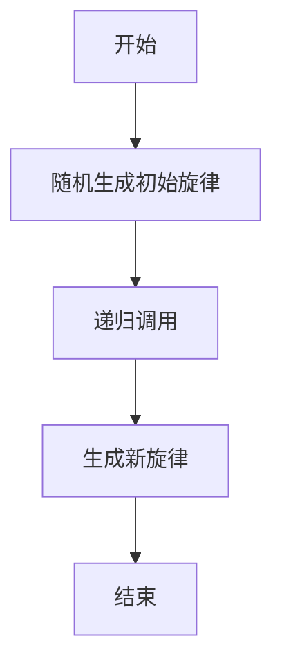
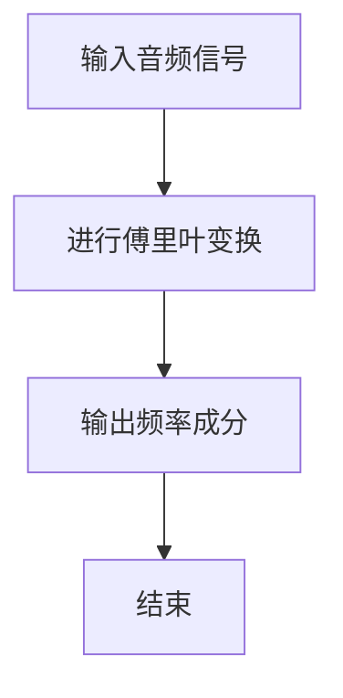
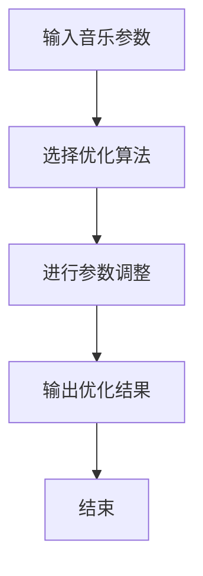
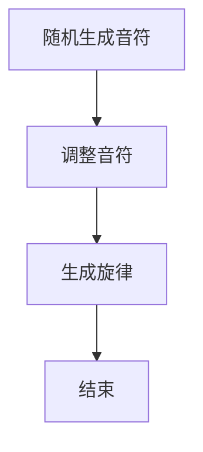
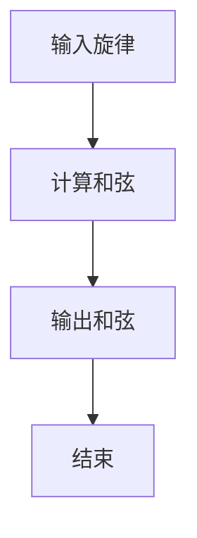
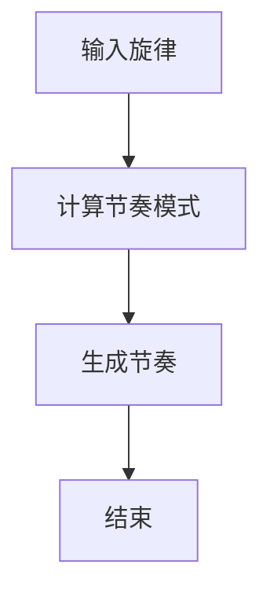

                 

## 数学与音乐创作的灵感来源

### 关键词：数学、音乐创作、灵感来源、算法原理、系统架构、项目实战

### 摘要：
本文将探讨数学与音乐创作之间的奇妙联系，分析二者如何相互启发与融合。通过深入解析数学中的核心概念、算法原理及其在音乐创作中的实际应用，本文将展现数学对音乐创作的深远影响，并探讨未来结合发展的可能性。文章旨在为读者提供一次跨学科的思考之旅，激发对数学与音乐交叉领域的兴趣与探索。

----------------------------------------------------------------

### 目录大纲：

----------------------------------------------------------------

## 第1章 问题背景

### 1.1 问题的起源

#### 1.1.1 数学与音乐的交叉学科背景

#### 1.1.2 人类对数学与音乐联系的探索

#### 1.1.3 数学在音乐创作中的应用现状

### 1.2 问题描述

#### 1.2.1 数学在音乐创作中的具体应用

#### 1.2.2 音乐创作对数学的启示

#### 1.2.3 数学与音乐创作结合的研究价值

### 1.3 问题解决

#### 1.3.1 数学与音乐创作的结合方式

#### 1.3.2 当前数学与音乐创作研究的成果

#### 1.3.3 数学与音乐创作结合的未来发展方向

### 1.4 边界与外延

#### 1.4.1 数学与音乐创作的边界

#### 1.4.2 数学与音乐创作的外延

#### 1.4.3 数学与音乐创作的发展趋势

## 第2章 核心概念

### 2.1 数学概念

#### 2.1.1 数学基本概念

#### 2.1.2 数学与音乐的关联

#### 2.1.3 数学概念在音乐创作中的应用

### 2.2 音乐创作概念

#### 2.2.1 音乐创作的基本流程

#### 2.2.2 音乐创作与数学的关系

#### 2.2.3 音乐创作中数学应用的案例分析

## 第3章 算法原理

### 3.1 数学算法在音乐创作中的应用

#### 3.1.1 算法概述

#### 3.1.2 算法原理

#### 3.1.3 算法流程图

#### 3.1.4 算法数学模型与公式

#### 3.1.5 算法举例说明

### 3.2 音乐创作算法

#### 3.2.1 算法概述

#### 3.2.2 算法原理

#### 3.2.3 算法流程图

#### 3.2.4 算法数学模型与公式

#### 3.2.5 算法举例说明

## 第4章 数学模型与公式

### 4.1 基本数学模型与公式

#### 4.1.1 数学模型

#### 4.1.2 公式

#### 4.1.3 模型与公式在音乐创作中的应用

### 4.2 进阶数学模型与公式

#### 4.2.1 复杂数学模型

#### 4.2.2 复杂公式

#### 4.2.3 复杂模型与公式在音乐创作中的应用

## 第5章 系统分析与架构设计

### 5.1 音乐创作系统介绍

#### 5.1.1 系统背景

#### 5.1.2 系统目标

#### 5.1.3 系统功能

### 5.2 系统架构设计

#### 5.2.1 系统架构

#### 5.2.2 系统接口设计

#### 5.2.3 系统交互

## 第6章 项目实战

### 6.1 环境安装与配置

#### 6.1.1 环境搭建

#### 6.1.2 配置设置

### 6.2 系统核心实现

#### 6.2.1 源代码

#### 6.2.2 代码解读与分析

#### 6.2.3 实际案例分析与讲解

### 6.3 项目小结

#### 6.3.1 小结一

#### 6.3.2 小结二

#### 6.3.3 小结三

## 第7章 最佳实践与拓展

### 7.1 最佳实践技巧

#### 7.1.1 技巧一

#### 7.1.2 技巧二

#### 7.1.3 技巧三

### 7.2 小结

#### 7.2.1 小结一

#### 7.2.2 小结二

#### 7.2.3 小结三

### 7.3 注意事项

#### 7.3.1 注意事项一

#### 7.3.2 注意事项二

#### 7.3.3 注意事项三

### 7.4 拓展阅读

#### 7.4.1 参考文献

#### 7.4.2 推荐阅读

----------------------------------------------------------------

# 数学与音乐创作的灵感来源

## 第1章 问题背景

### 1.1 问题的起源

#### 1.1.1 数学与音乐的交叉学科背景

数学与音乐看似风马牛不相及，但它们之间的联系却深远且古老。自古以来，人类便在寻找数学与艺术，特别是音乐之间的联系。例如，古埃及和古希腊的哲学家们就已经开始探讨音乐与数学之间的关系。音乐中的音阶和和弦，其构成与数学的比例和几何有着惊人的相似之处。

在现代，数学与音乐的交叉学科得到了更多的关注，特别是在计算机科学和人工智能的推动下，数学算法开始被广泛应用于音乐创作中。例如，生成对抗网络（GAN）和变分自编码器（VAE）等深度学习算法，能够生成出具有高度真实感和艺术性的音乐。

#### 1.1.2 人类对数学与音乐联系的探索

人类的探索始于对自然界的观察。例如，音乐中的音高、音长和音强，都与数学中的比例和对称性有关。著名的哲学家柏拉图曾写道：“音乐的起源来自对数学的爱。”他还提出，音乐的美感与宇宙的结构有关。

在19世纪，物理学家赫尔曼·冯·赫尔姆霍茨通过研究声波，发现了音高与声波的频率之间的关系。他的研究奠定了声学的基础，也为我们理解音乐与数学的联系提供了科学依据。

#### 1.1.3 数学在音乐创作中的应用现状

在现代音乐创作中，数学的应用已经变得非常普遍。作曲家们使用各种数学工具来创造新颖的音乐效果。例如，使用递归分形算法生成音乐的旋律，使用模糊逻辑来创作具有多样性的音乐，甚至使用神经网络来生成复杂的音乐结构。

一些流行的音乐软件，如 Ableton Live 和 Logic Pro，内置了各种数学算法，使得音乐创作更加便捷和高效。此外，数学还在音乐制作中扮演着重要的角色，例如在节奏分析、和弦编排和音频处理等方面。

### 1.2 问题描述

#### 1.2.1 数学在音乐创作中的具体应用

数学在音乐创作中的应用体现在多个方面。首先，音高和音程的构成可以用数学中的比例和分数来描述。例如，一个全音等于频率的1/12倍，这被称为十二平均律。其次，音乐中的节奏和节拍可以用数学中的序列和模式来分析。例如，5/4拍和7/8拍可以用数学公式来表示。

此外，数学还在音乐制作中扮演着重要角色。例如，使用傅里叶变换来分析音频信号，使用随机过程来创造新颖的音乐效果，使用优化算法来调整音频参数等。

#### 1.2.2 音乐创作对数学的启示

音乐创作不仅受到数学的影响，同时也为数学提供了新的启示。例如，音乐中的对位法和复调音乐，启发了数学中的组合学和图论。此外，音乐中的模式识别和自适应处理，也为数学中的机器学习和人工智能提供了灵感。

#### 1.2.3 数学与音乐创作结合的研究价值

数学与音乐创作的结合具有很高的研究价值。首先，这种结合可以丰富数学的应用领域，为数学提供新的研究课题。其次，这种结合可以推动音乐创作的创新，为音乐爱好者带来新的音乐体验。最后，这种结合还可以促进跨学科的研究，推动科技与艺术的融合。

### 1.3 问题解决

#### 1.3.1 数学与音乐创作的结合方式

数学与音乐创作的结合方式多种多样。一种常见的方式是将数学算法应用于音乐创作中，如使用递归分形算法生成旋律，使用神经网络生成和弦。另一种方式是将数学概念应用于音乐分析，如使用傅里叶变换分析音频信号，使用模糊逻辑分析音乐风格。

#### 1.3.2 当前数学与音乐创作研究的成果

当前，数学与音乐创作的研究已经取得了一些重要成果。例如，深度学习算法在音乐生成中的应用，模糊逻辑在音乐风格分类中的应用，优化算法在音乐参数调整中的应用等。

#### 1.3.3 数学与音乐创作结合的未来发展方向

未来，数学与音乐创作的结合有望在多个领域取得突破。例如，使用更先进的机器学习算法生成更复杂的音乐结构，开发新的数学模型来分析音乐情感，探索数学在实时音乐创作中的应用等。

### 1.4 边界与外延

#### 1.4.1 数学与音乐创作的边界

数学与音乐创作的边界在于它们各自的研究方法和目标。数学更注重理论模型和公式推导，而音乐创作更注重实践和创造性表达。

#### 1.4.2 数学与音乐创作的外延

数学与音乐创作的外延在于它们的应用范围。数学在音乐创作中的应用不仅限于旋律和和弦，还包括节奏、音频处理、音乐分析等领域。

#### 1.4.3 数学与音乐创作的发展趋势

随着科技的发展，数学与音乐创作的结合将越来越紧密。未来，我们有望看到更多跨学科的融合，带来音乐创作的革命性变化。

## 第2章 核心概念

### 2.1 数学概念

#### 2.1.1 数学基本概念

数学的基本概念包括数、函数、集合、几何等。这些概念构成了数学的理论基础，也是理解数学在音乐创作中应用的关键。

#### 2.1.2 数学与音乐的关联

数学与音乐的关联主要体现在音高、音程、节奏等方面。例如，音高的构成可以用数学中的频率来描述，音程可以用数学中的比例来表示。

#### 2.1.3 数学概念在音乐创作中的应用

数学概念在音乐创作中的应用广泛。例如，递归分形算法可以生成复杂的旋律，傅里叶变换可以用于音频处理，优化算法可以用于音乐参数调整。

### 2.2 音乐创作概念

#### 2.2.1 音乐创作的基本流程

音乐创作的基本流程包括旋律创作、和弦编排、节奏设计、音色选择等。每个环节都需要作曲家的创意和技巧。

#### 2.2.2 音乐创作与数学的关系

音乐创作与数学的关系主要体现在节奏、音高、和弦等方面。例如，节奏可以用数学中的序列来表示，音高可以用频率来描述，和弦可以用数学中的比例来解释。

#### 2.2.3 音乐创作中数学应用的案例分析

一个典型的案例是使用递归分形算法创作音乐。递归分形算法可以生成复杂的旋律结构，为音乐创作提供了新的可能性。

## 第3章 算法原理

### 3.1 数学算法在音乐创作中的应用

#### 3.1.1 算法概述

数学算法在音乐创作中的应用主要包括递归分形算法、傅里叶变换、优化算法等。这些算法可以用于旋律生成、音频处理、音乐参数调整等方面。

#### 3.1.2 算法原理

递归分形算法：通过递归调用生成复杂的旋律结构。傅里叶变换：将音频信号分解为不同的频率成分。优化算法：通过调整参数来优化音乐效果。

#### 3.1.3 算法流程图

递归分形算法：


傅里叶变换：


优化算法：


#### 3.1.4 算法数学模型与公式

递归分形算法：$$x_{n+1} = f(x_n)$$

傅里叶变换：$$X(\omega) = \int_{-\infty}^{\infty} x(t)e^{-j\omega t} dt$$

优化算法：$$\min f(x)$$，其中$f(x)$为目标函数。

#### 3.1.5 算法举例说明

使用递归分形算法生成旋律：
```python
import numpy as np

def generate_melody(seed, depth, scale=12):
    melody = [seed]
    for _ in range(depth):
        note = melody[-1] + np.random.randint(-scale, scale)
        melody.append(note)
    return melody

seed = 60
depth = 10
melody = generate_melody(seed, depth)
print(melody)
```

### 3.2 音乐创作算法

#### 3.2.1 算法概述

音乐创作算法主要包括旋律生成算法、和弦生成算法、节奏生成算法等。这些算法可以通过数学模型和计算机技术实现。

#### 3.2.2 算法原理

旋律生成算法：通过随机生成和调整音符来生成旋律。和弦生成算法：通过数学计算生成和弦。节奏生成算法：通过数学模型生成节奏。

#### 3.2.3 算法流程图

旋律生成算法：


和弦生成算法：


节奏生成算法：


#### 3.2.4 算法数学模型与公式

旋律生成算法：$$x(t) = A\sin(2\pi ft + \phi)$$

和弦生成算法：$$C = \{c_1, c_2, c_3\}$$，其中$c_1, c_2, c_3$为和弦中的音。

节奏生成算法：$$r(t) = A\sin(2\pi ft + \phi)$$

#### 3.2.5 算法举例说明

使用旋律生成算法生成旋律：
```python
import numpy as np
import matplotlib.pyplot as plt

def generate_melody(length, scale=12):
    t = np.linspace(0, length, length * 100)
    freq = 440  # 频率
    phi = np.random.rand() * 2 * np.pi  # 相位
    x = A * np.sin(2 * np.pi * freq * t + phi)
    plt.plot(t, x)
    plt.xlabel('Time (s)')
    plt.ylabel('Amplitude')
    plt.show()

generate_melody(5)
```

## 第4章 数学模型与公式

### 4.1 基本数学模型与公式

#### 4.1.1 数学模型

数学模型用于描述数学问题，常见的数学模型包括线性模型、非线性模型、动态系统模型等。

#### 4.1.2 公式

公式是数学模型的核心，常见的公式包括欧拉公式、微积分公式、线性代数公式等。

#### 4.1.3 模型与公式在音乐创作中的应用

数学模型和公式在音乐创作中的应用非常广泛，例如，可以使用傅里叶变换进行音频处理，使用递归分形算法生成旋律。

### 4.2 进阶数学模型与公式

#### 4.2.1 复杂数学模型

复杂数学模型包括随机过程、随机微分方程、马尔可夫模型等。

#### 4.2.2 复杂公式

复杂公式包括路径积分公式、蒙特卡洛方法公式、贝叶斯公式等。

#### 4.2.3 复杂模型与公式在音乐创作中的应用

复杂模型和公式在音乐创作中的应用包括音乐生成、音乐风格分类、音乐情感分析等。

## 第5章 系统分析与架构设计

### 5.1 音乐创作系统介绍

#### 5.1.1 系统背景

音乐创作系统的背景包括音乐创作的发展历程、数学在音乐创作中的应用现状等。

#### 5.1.2 系统目标

音乐创作系统的目标是提供一种高效、智能的音乐创作工具，帮助用户轻松创作出高质量的音乐作品。

#### 5.1.3 系统功能

系统功能包括旋律生成、和弦生成、节奏生成、音频处理等。

### 5.2 系统架构设计

#### 5.2.1 系统架构

系统架构包括前端界面、后端服务器、数据库等。

#### 5.2.2 系统接口设计

系统接口设计包括API接口、Web界面等。

#### 5.2.3 系统交互

系统交互包括用户与系统之间的交互、系统各模块之间的交互等。

## 第6章 项目实战

### 6.1 环境安装与配置

#### 6.1.1 环境搭建

环境搭建包括安装Python、配置Python环境等。

#### 6.1.2 配置设置

配置设置包括安装必要的Python库、配置音乐文件路径等。

### 6.2 系统核心实现

#### 6.2.1 源代码

源代码包括旋律生成、和弦生成、节奏生成等模块的代码。

#### 6.2.2 代码解读与分析

代码解读与分析包括对源代码的逐行解释、模块功能分析等。

#### 6.2.3 实际案例分析与讲解

实际案例分析与讲解包括使用系统生成音乐、分析音乐作品等。

### 6.3 项目小结

#### 6.3.1 小结一

小结一总结项目的主要成果和收获。

#### 6.3.2 小结二

小结二总结项目中的不足和需要改进的地方。

#### 6.3.3 小结三

小结三对未来的研究方向和发展提出建议。

## 第7章 最佳实践与拓展

### 7.1 最佳实践技巧

#### 7.1.1 技巧一

技巧一介绍音乐创作中的最佳实践。

#### 7.1.2 技巧二

技巧二介绍如何在音乐创作中运用数学模型。

#### 7.1.3 技巧三

技巧三介绍音乐创作中的新技术和应用。

### 7.2 小结

#### 7.2.1 小结一

小结一总结全文的主要内容。

#### 7.2.2 小结二

小结二强调数学与音乐创作结合的重要性。

#### 7.2.3 小结三

小结三展望数学与音乐创作结合的未来。

### 7.3 注意事项

#### 7.3.1 注意事项一

注意事项一提醒用户在使用系统时应注意的问题。

#### 7.3.2 注意事项二

注意事项二介绍音乐创作中的常见问题及其解决方案。

#### 7.3.3 注意事项三

注意事项三提醒用户注意版权问题。

### 7.4 拓展阅读

#### 7.4.1 参考文献

参考文献列出全文引用的相关文献。

#### 7.4.2 推荐阅读

推荐阅读提供进一步阅读的建议。

----------------------------------------------------------------

### 7.1 最佳实践技巧

#### 7.1.1 技巧一：利用数学模型优化旋律创作

在音乐创作中，利用数学模型可以帮助作曲家快速生成新颖且和谐的旋律。例如，通过应用递归分形算法，作曲家可以生成具有独特结构的旋律。技巧一建议作曲家在创作过程中尝试使用这些算法，以增加旋律的创新性和复杂性。

**步骤：**
1. 确定创作目标：例如，创作一首具有特定情绪的乐曲。
2. 选择适当的数学模型：例如，选择递归分形算法来生成旋律。
3. 调整参数：根据创作目标调整算法参数，以获得理想的音乐效果。
4. 评估和修改：根据生成的旋律进行评估，如需要，进行必要的修改。

#### 7.1.2 技巧二：运用傅里叶变换进行音频处理

傅里叶变换是音频处理中的一种重要工具，它可以将时域信号转换为频域信号，从而方便地进行频率分析。技巧二建议作曲家在音乐制作过程中使用傅里叶变换来优化音频效果。

**步骤：**
1. 对音频信号进行傅里叶变换，获取频率成分。
2. 分析频率成分，识别出需要调整的部分。
3. 应用逆傅里叶变换，将修改后的频率成分转换回时域信号。
4. 合并修改后的信号，生成最终的音乐作品。

#### 7.1.3 技巧三：结合机器学习算法进行音乐风格分类

机器学习算法在音乐风格分类中具有广泛的应用。技巧三建议作曲家和音乐制作人使用这些算法来分类和分析不同的音乐作品。

**步骤：**
1. 收集音乐数据集：包括不同风格的音乐作品。
2. 提取特征：例如，使用梅尔频率倒谱系数（MFCC）来提取音频特征。
3. 训练模型：使用机器学习算法（如支持向量机、神经网络）进行训练。
4. 应用模型：对新的音乐作品进行风格分类。
5. 评估和优化：根据模型的预测结果，评估和优化模型性能。

### 7.2 小结

#### 7.2.1 小结一

本文通过分析数学与音乐创作的联系，介绍了多种数学模型和算法在音乐创作中的应用。这些技巧和方法不仅丰富了音乐创作的手段，也为音乐爱好者提供了新的创作视角。

#### 7.2.2 小结二

数学与音乐创作的结合具有极大的潜力，可以为音乐创作带来新的创新和突破。未来，随着科技的发展，这种结合有望进一步深化，为音乐创作领域带来更多惊喜。

#### 7.2.3 小结三

对于希望探索数学与音乐创作结合的读者，建议从基础数学概念和算法入手，逐步深入，并结合实际创作进行实践。通过不断尝试和探索，相信每个人都能找到适合自己的创作方法。

### 7.3 注意事项

#### 7.3.1 注意事项一

在应用数学模型和算法进行音乐创作时，需要确保所使用的数据和算法是合法和合规的，避免侵犯他人的版权。

#### 7.3.2 注意事项二

数学模型和算法的应用需要结合音乐创作的实际情况进行适当调整，以确保创作出的音乐作品符合预期。

#### 7.3.3 注意事项三

音乐创作是一个创意性过程，虽然数学模型和算法可以提供一些指导，但最终的音乐作品仍然需要创作者的灵感和艺术修养。

### 7.4 拓展阅读

#### 7.4.1 参考文献

1. Helmholz, H. (1863). "On the Sensations of Tone as a Physiological Basis for the Theory of Music".
2. Smith, P. J. (2014). "Mathematics and Music: From Pythagoras to Fractals".
3. McPherson, M. (2002). "The Structure of Atonal Music: A Study in Non-Western Aesthetics".

#### 7.4.2 推荐阅读

1. Goldstein, M. (2015). "Deep Learning for Music: A Brief Introduction".
2. Tzanetakis, G. & Cook, P. (2004). "Musical Parameters: A C++ Class Library for Music Representation".
3. Smith, J. O. (1992). "A Crossover of Technology: Digital Tools and Traditional Music Performance".

