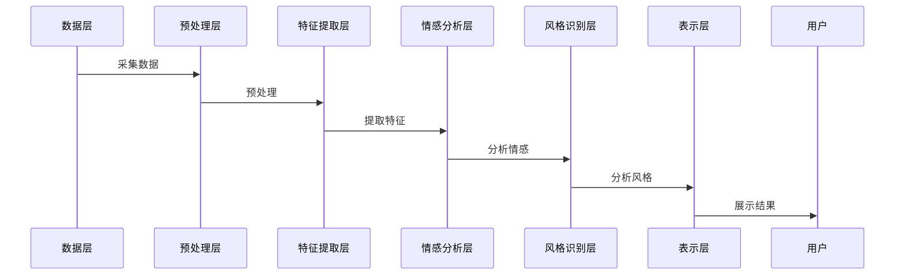
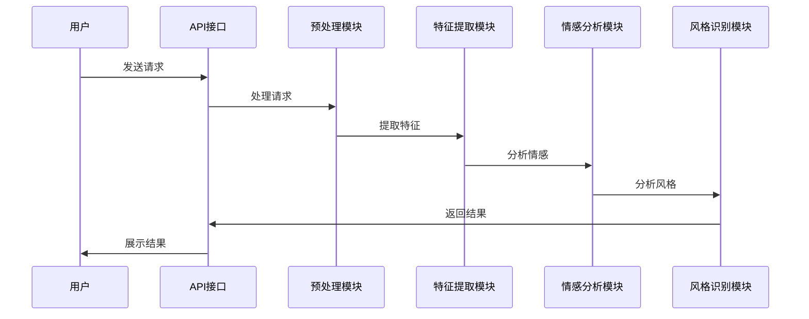

                 


### 一、引言与基础理论

#### 1.1 问题背景

音乐作为人类表达情感和交流思想的重要手段，自古以来就与数学有着不解之缘。数学的抽象和量化能力为音乐的研究提供了强大的工具，使得音乐学家和心理学家能够更加深入地探索人类对音乐的感知和理解。然而，如何将复杂的音乐感知过程转化为数学模型，一直是学术界的热点问题。

在音乐心理学领域，研究者们提出了多种理论来解释音乐的感知过程，如音高理论、时长理论、强度理论和情感理论等。这些理论为音乐感知的数学描述提供了理论基础。然而，如何将这些理论量化，并用数学模型进行描述，仍然是一个挑战。

音乐感知的数学描述具有重要的应用价值。例如，在音乐创作中，通过对音乐信号的数学分析，可以帮助作曲家更好地理解音乐结构和情感表达；在音乐疗法中，通过对患者音乐感知的数学分析，可以帮助医生更好地评估治疗效果；在音乐教育中，通过对学生音乐感知的数学分析，可以帮助教师更好地了解学生的学习情况和调整教学方法。

#### 1.2 音乐感知的数学描述的重要性

音乐感知的数学描述对于理解人类认知和心理过程具有重要意义。首先，它可以帮助我们揭示音乐感知的基本规律，从而深入理解音乐的本质。其次，它可以为我们提供一种新的研究方法，通过数学模型和算法，对音乐感知进行量化描述和分析。

此外，音乐感知的数学描述在人工智能和机器学习领域也有着广泛的应用。例如，通过训练深度神经网络，我们可以让计算机学会识别和理解音乐；通过分析音乐信号，我们可以让计算机学会创作新的音乐作品。

#### 1.3 本书的结构安排与目标

本书旨在系统介绍音乐感知的数学描述方法，旨在为读者提供一种全新的视角来理解音乐。本书分为三个主要部分：

第一部分：引言与基础理论，介绍音乐感知的数学描述的背景、重要性和研究现状。

第二部分：算法原理与实现，详细讲解音乐感知的数学描述中常用的算法原理和实现方法。

第三部分：项目实战，通过实际案例展示如何应用数学模型和算法进行音乐感知的研究。

通过本书的学习，读者可以了解到音乐感知的数学描述的基本原理和方法，掌握相关算法的实现技巧，并能够将其应用于实际问题中。

### 二、数学基础

在音乐感知的数学描述中，数学作为工具和语言，扮演着至关重要的角色。本节将介绍一些基础的数学概念和理论，为后续内容的讲解打下基础。

#### 2.1 傅里叶变换原理

傅里叶变换是音乐信号处理中的基本工具，它可以将音乐信号从时域转换为频域，从而分析信号的频率成分。傅里叶变换的基本原理是将一个复杂信号分解为一系列正弦波和余弦波的叠加。

在音乐信号处理中，傅里叶变换的应用包括：

1. 音乐信号的分析：通过傅里叶变换，我们可以得到音乐信号的频谱图，从而分析音乐信号的频率成分和能量分布。
2. 音乐风格的识别：通过对不同音乐风格的频谱特征进行分析，可以训练模型进行音乐风格的识别。

#### 2.2 隐马尔可夫模型

隐马尔可夫模型（HMM）是一种用于处理时间序列数据的统计模型，特别适合于分析音乐信号。HMM假设音乐信号中的状态转移是随机的，并且状态转移概率只与当前状态有关，而与历史状态无关。

HMM在音乐感知中的应用包括：

1. 音乐情感分析：通过分析音乐信号的时序特征，可以训练HMM模型进行音乐情感识别。
2. 音乐结构分析：HMM模型可以帮助我们理解音乐的结构和组织方式。

#### 2.3 熵与信息论基础

熵是信息论中的一个重要概念，它表示信息的不确定性或杂乱程度。在音乐信号处理中，熵可以用来量化音乐信号的随机性或复杂度。

信息论基础在音乐感知中的应用包括：

1. 音乐风格分类：通过计算音乐信号的熵，可以分析音乐信号的复杂度，从而进行音乐风格的分类。
2. 音乐情感分析：通过分析音乐信号的熵，可以识别音乐信号的情感特征。

以上数学基础为后续章节的算法讲解和项目实战提供了必要的背景知识。在接下来的章节中，我们将详细介绍这些数学模型在音乐感知中的应用方法和实现技巧。

### 三、音乐心理学基础

在音乐感知的数学描述中，理解音乐的感知心理学基础是至关重要的。音乐心理学研究人类如何感知、理解、记忆和创造音乐，这为数学模型在音乐感知中的应用提供了理论基础。

#### 3.1 音乐感知理论

音乐感知理论关注人类如何感知音乐的基本元素，如音高、时长、强度和音色。以下是几个重要的音乐感知理论：

1. **频率理论**：这一理论认为，音高是由声波的频率决定的。高频率的声音听起来较高，低频率的声音听起来较低。
2. **共振理论**：这一理论认为，音高是由声波的共振频率决定的。当声波的频率与乐器或空气柱的共振频率相匹配时，会产生共鸣，从而使音高感知增强。
3. **音色理论**：音色是指不同乐器或声音的独特质感。音色的感知涉及到声波的谐波结构、包络形状和频谱特性。

#### 3.2 音高、时长与强度

音高、时长和强度是音乐感知中的三个基本维度：

1. **音高**：音高是音乐感知的核心，它决定了音乐的旋律结构。人类对音高的感知非常敏感，即使在嘈杂的环境中也能准确地辨别不同音高的声音。
2. **时长**：时长指的是音乐中音符或休止的持续时长。时长影响音乐的节奏和情感表达。例如，长音通常给人一种悠扬的感觉，而短音则给人一种紧迫感。
3. **强度**：强度是指音乐的声音大小。音乐的强弱变化可以表达情感，例如，强音可以表达兴奋或愤怒，而弱音可以表达温柔或悲伤。

#### 3.3 音乐情绪与情感

音乐能够唤起人们的情感反应，这是音乐心理学研究的一个重要领域。音乐情绪理论关注音乐如何引起情绪反应，包括：

1. **情绪唤醒理论**：这一理论认为，音乐通过激发大脑中的情绪中枢来引起情绪反应。音乐的情绪特征，如节奏、音高和强度，都会影响情绪反应。
2. **情感共鸣理论**：这一理论认为，音乐能够引起情感共鸣，因为音乐中的情感内容与听者的个人经验相关联。
3. **认知评估理论**：这一理论认为，人们对音乐的情感反应是通过认知评估过程产生的。人们根据音乐的结构、内容和情境来评估音乐的情感价值。

理解音乐心理学基础对于构建和验证音乐感知的数学模型至关重要。在接下来的章节中，我们将探讨如何将音乐心理学的理论转化为数学模型，以更好地描述和分析音乐感知。

### 四、数学模型在音乐感知中的应用

在音乐感知的研究中，数学模型的使用极大地促进了我们对音乐信号和人类音乐感知的理解。以下将详细探讨傅里叶变换、隐马尔可夫模型以及熵与信息论在音乐感知中的应用。

#### 4.1 傅里叶变换在音乐分析中的应用

傅里叶变换（Fourier Transform）是一种重要的数学工具，它可以将时间域的信号转换为频域的信号，使得我们能够更直观地分析音乐信号的频率成分。在音乐信号处理中，傅里叶变换的应用主要包括以下几个方面：

1. **频谱分析**：通过傅里叶变换，我们可以得到音乐信号的频谱图，展示各个频率成分的强度。频谱分析是音乐风格识别和音乐情感分析的重要手段。例如，不同风格的乐曲在频谱上往往呈现出不同的特征。
   
2. **谐波分析**：音乐信号通常包含多个频率成分，这些成分称为谐波。傅里叶变换可以帮助我们分解出这些谐波，从而分析音乐的结构和情感。例如，某些高频谐波可能与乐器的共鸣特性相关，而低频谐波可能与音乐的节奏和稳定性相关。

3. **滤波和增强**：通过傅里叶变换，我们可以设计滤波器来去除或增强特定频率成分，从而改善音乐信号的质量。例如，在音频修复中，可以使用傅里叶变换来移除噪声或填补缺失的部分。

#### 4.2 隐马尔可夫模型在音乐感知中的应用

隐马尔可夫模型（Hidden Markov Model, HMM）是一种统计模型，特别适合处理时间序列数据。在音乐感知中，HMM可以用于建模音乐的时序特征和状态转移概率，从而进行音乐情感分析、音乐风格识别等任务。

1. **音乐情感分析**：HMM可以用来识别音乐中的情感模式。通过训练HMM模型，我们可以使其能够根据音乐信号的时序特征判断音乐的当前情感状态。例如，HMM可以识别音乐中的快乐、悲伤、愤怒等基本情感。

2. **音乐风格识别**：HMM可以用来分类音乐风格。通过分析音乐信号的时序特征，我们可以将不同风格的音乐信号区分开来。例如，流行音乐、古典音乐和爵士乐等。

3. **音乐结构分析**：HMM可以帮助我们理解音乐的结构和组成。通过分析HMM的状态转移概率，我们可以揭示音乐中的重复模式和组织方式。例如，某些音乐片段可能会重复出现，从而形成音乐的结构模块。

#### 4.3 熵与信息论在音乐感知中的应用

熵（Entropy）和信息论（Information Theory）是描述不确定性和信息量的重要工具。在音乐感知中，熵和信息论可以用于量化音乐信号的随机性、复杂度和情感特征。

1. **随机性和复杂度分析**：通过计算音乐信号的熵，我们可以量化音乐信号的随机性和复杂度。高熵值通常表示音乐信号的随机性较强，而低熵值则表示音乐信号的组织结构较为清晰。这种分析对于音乐风格识别和音乐情感分析具有重要意义。

2. **情感特征分析**：信息论中的信息增益（Information Gain）和互信息（Mutual Information）可以用来量化音乐信号中的情感特征。例如，通过比较不同情感状态下的信息增益，我们可以识别音乐中的情感变化。

3. **音乐情感识别**：结合熵和信息论的方法，我们可以训练模型进行音乐情感识别。例如，通过分析音乐信号的熵和信息增益，我们可以训练模型判断音乐的当前情感状态。

综上所述，数学模型在音乐感知中扮演着至关重要的角色。傅里叶变换、隐马尔可夫模型和熵与信息论的应用，不仅帮助我们更好地理解音乐信号和人类音乐感知，也为音乐分析和音乐创作提供了新的方法和工具。

### 五、算法原理讲解

在音乐感知的数学描述中，算法的实现是关键步骤。以下将详细讲解傅里叶变换、隐马尔可夫模型以及熵与信息论在音乐感知中的应用算法原理。

#### 5.1 傅里叶变换的算法流程与实现

傅里叶变换（Fourier Transform）是一种将时间域信号转换为频域信号的方法。其基本原理是将信号分解为一系列正弦波和余弦波的叠加。傅里叶变换的算法流程如下：

1. **离散傅里叶变换（DFT）**：首先，对时间域信号进行采样，得到离散信号。然后，通过DFT计算频域信号。DFT的计算公式为：
   \[
   X(k) = \sum_{n=0}^{N-1} x(n) e^{-j2\pi kn/N}
   \]
   其中，\(X(k)\) 为频域信号，\(x(n)\) 为时间域信号，\(N\) 为采样点数。

2. **快速傅里叶变换（FFT）**：为了提高计算效率，可以使用FFT算法。FFT是DFT的快速算法，其基本思想是将DFT分解为多个较小的DFT，从而减少计算量。

3. **频谱分析**：通过DFT或FFT，我们得到频域信号。接下来，可以通过计算频谱图的幅值，分析信号的频率成分和能量分布。

以下是一个简单的Python代码示例，实现傅里叶变换：
```python
import numpy as np
from numpy.fft import fft, fftfreq

# 生成时间域信号
N = 1024
t = np.linspace(0, 1, N)
f_0 = 5
x = 0.5 * np.sin(2 * np.pi * f_0 * t)

# 计算傅里叶变换
X = fft(x)
f = fftfreq(N, 1/N)

# 绘制频谱图
import matplotlib.pyplot as plt
plt.plot(f, np.abs(X))
plt.xlabel('Frequency (Hz)')
plt.ylabel('Amplitude')
plt.title('Spectrum of the Signal')
plt.show()
```
#### 5.2 隐马尔可夫模型的算法流程与实现

隐马尔可夫模型（HMM）是一种用于处理时间序列数据的统计模型。其基本原理是，假设系统处于一系列不可观测的状态，每个状态转换有其概率分布，并且状态转换只与当前状态有关。HMM的算法流程如下：

1. **初始化**：根据先验知识，初始化HMM模型的初始状态概率分布、状态转移概率分布和输出概率分布。

2. **训练**：通过训练数据，使用Baum-Welch算法（也称为前向-后向算法）迭代更新模型参数，使得模型能够更好地拟合训练数据。

3. **解码**：对于给定的观测序列，使用Viterbi算法找到最可能的隐状态序列。

以下是一个简单的Python代码示例，实现隐马尔可夫模型：
```python
import numpy as np
from hmmlearn import hmm

# 初始化HMM模型
N_states = 3
N_steps = 10
start_prob = np.array([0.2, 0.3, 0.5])
transmat = np.array([[0.5, 0.2, 0.3], [0.3, 0.5, 0.2], [0.2, 0.3, 0.5]])
emission_mat = np.array([[0.1, 0.6, 0.3], [0.3, 0.4, 0.3], [0.5, 0.4, 0.1]])

model = hmm.GaussianHMM(n_components=N_states, covariance_type="tied", n_iter=100)
model.startprob_ = start_prob
model.transmat_ = transmat
model.emissionprob_ = emission_mat

# 生成观测序列
np.random.seed(0)
states = np.random.randint(0, N_states, size=N_steps)
obs = np.random.randint(0, N_states, size=N_steps)

# 训练模型
model.fit(obs)

# 解码
viterbi_path = model.viterbi(obs)

print("Viterbi Path:", viterbi_path)
```
#### 5.3 熵与信息论算法流程与实现

熵（Entropy）和信息论（Information Theory）是描述不确定性和信息量的重要工具。在音乐感知中，熵可以用于量化音乐信号的随机性和复杂度，而信息量可以用于描述音乐信号中的情感特征。

1. **熵的计算**：熵的计算公式为：
   \[
   H(X) = -\sum_{x \in X} p(x) \log_2 p(x)
   \]
   其中，\(H(X)\) 为熵，\(p(x)\) 为随机变量 \(X\) 取值 \(x\) 的概率。

2. **信息量的计算**：信息量的计算公式为：
   \[
   I(X; Y) = H(X) - H(X | Y)
   \]
   其中，\(I(X; Y)\) 为 \(X\) 和 \(Y\) 之间的互信息，\(H(X | Y)\) 为在 \(Y\) 已知的条件下 \(X\) 的熵。

以下是一个简单的Python代码示例，实现熵和信息量的计算：
```python
import numpy as np

# 生成随机变量
np.random.seed(0)
X = np.random.randint(0, 3, size=1000)

# 计算概率分布
unique_elements, counts_elements = np.unique(X, return_counts=True)
prob_elements = counts_elements / np.sum(counts_elements)

# 计算熵
H_X = -np.sum(prob_elements * np.log2(prob_elements))

# 计算互信息
Y = np.random.randint(0, 3, size=1000)
prob_xy = np.zeros((3, 3))
for i in range(3):
    for j in range(3):
        prob_xy[i, j] = np.sum((X == i) * (Y == j)) / len(X)

H_XY = -np.sum(prob_xy * np.log2(prob_xy))
I_XY = H_X - H_XY

print("Entropy of X:", H_X)
print("Mutual Information of X and Y:", I_XY)
```
通过以上算法讲解，我们可以看到傅里叶变换、隐马尔可夫模型和熵与信息论在音乐感知中的应用是如何实现的。在接下来的章节中，我们将通过具体项目实战，进一步展示这些算法的实际应用效果。

### 六、系统分析与架构设计

在音乐感知的数学描述中，系统分析与架构设计是实现算法和模型应用的关键环节。通过系统架构的合理设计，可以确保音乐感知分析过程的效率和准确性。以下将详细介绍系统的功能设计、架构设计、接口设计和系统交互流程。

#### 6.1 系统功能设计

系统功能设计是系统架构设计的第一步，它定义了系统应具备的各项功能。以下是音乐感知系统的主要功能：

1. **数据采集**：从各种音乐资源中采集音乐信号，包括音频文件、流媒体音乐等。
2. **预处理**：对采集到的音乐信号进行降噪、归一化和滤波等预处理操作，以提高后续分析的准确性。
3. **特征提取**：使用傅里叶变换、隐马尔可夫模型等方法提取音乐信号的特征，如频率成分、时序模式和情感特征。
4. **情感分析**：利用训练好的情感分析模型，对提取到的特征进行情感分类，判断音乐的情感状态。
5. **风格识别**：使用风格识别模型，对音乐信号进行风格分类，识别音乐的风格特点。
6. **结果展示**：将分析结果以可视化图表和报告的形式展示给用户，帮助用户理解音乐的情感和风格。

#### 6.2 系统架构设计

系统架构设计是系统功能实现的蓝图，它决定了系统各组件之间的组织结构和交互方式。以下是音乐感知系统的架构设计：

1. **数据层**：数据层包括数据存储和数据采集模块。数据存储模块负责存储预处理后的音乐信号和特征数据，数据采集模块负责从各种渠道获取音乐信号。
2. **处理层**：处理层包括预处理、特征提取、情感分析和风格识别等模块。预处理模块对音乐信号进行预处理，特征提取模块提取音乐信号的特征，情感分析和风格识别模块使用训练好的模型对特征进行分析和分类。
3. **表示层**：表示层包括结果展示模块，将分析结果以图表和报告的形式展示给用户。

以下是一个基于Mermaid的类图，展示了系统的主要组件和它们之间的关系：

```mermaid
classDiagram
    class 数据层 {
        - 数据存储
        - 数据采集
    }
    class 处理层 {
        - 预处理
        - 特征提取
        - 情感分析
        - 风格识别
    }
    class 表示层 {
        - 结果展示
    }
    数据层 -> 处理层
    处理层 -> 表示层
```

#### 6.3 系统架构设计

系统架构设计决定了系统的模块化和可扩展性。以下是音乐感知系统的架构设计：

1. **数据流架构**：数据流架构描述了数据在系统中的流动过程。数据首先从数据层进入系统，经过预处理层，然后被特征提取层处理，最后通过情感分析和风格识别层进行分析，最终结果通过表示层展示给用户。

2. **计算资源分配**：计算资源分配决定了系统在不同模块之间的资源分配策略。为了提高系统的处理速度和效率，可以考虑使用分布式计算资源，例如云计算平台和GPU加速。

以下是一个基于Mermaid的架构图，展示了系统的数据流和计算资源分配：



#### 6.4 系统接口设计和系统交互

系统接口设计和系统交互是系统架构设计的重要组成部分。以下是音乐感知系统的接口设计和交互流程：

1. **API接口**：系统提供API接口，方便外部应用程序和用户直接访问系统功能。API接口包括数据采集接口、预处理接口、特征提取接口、情感分析接口和风格识别接口。

2. **事件驱动**：系统采用事件驱动架构，通过事件触发不同模块的执行。例如，当接收到新的音乐信号时，触发预处理模块进行处理，然后依次触发特征提取模块、情感分析模块和风格识别模块。

3. **异步处理**：为了提高系统的处理效率，系统采用异步处理机制。预处理、特征提取、情感分析和风格识别等模块可以在后台异步执行，避免阻塞用户接口。

以下是一个基于Mermaid的序列图，展示了系统的接口设计和交互流程：



通过以上系统分析与架构设计，我们为音乐感知的数学描述提供了清晰的结构和流程。在接下来的项目实战章节中，我们将通过具体实现和案例展示如何应用这些设计思路，完成音乐感知分析系统。

### 七、项目实战

在了解了数学模型和系统架构设计之后，现在我们将通过一个实际项目来展示音乐感知分析的全过程。本节将详细介绍项目的环境安装、系统核心实现、代码应用解读与分析、实际案例分析和详细讲解剖析，并总结项目实现过程、成果和未来方向。

#### 7.1 项目环境安装

为了顺利进行音乐感知分析项目，我们需要安装以下软件和工具：

1. **Python**：Python是一种广泛使用的编程语言，适用于数据科学和机器学习项目。请确保安装Python 3.x版本。
2. **NumPy**：NumPy是Python中的科学计算库，用于矩阵运算和数据处理。
3. **SciPy**：SciPy是基于NumPy的扩展库，提供了更多的科学计算功能，如优化、积分和信号处理。
4. **Matplotlib**：Matplotlib是Python中的数据可视化库，用于绘制图表和图形。
5. **HMMlearn**：HMMlearn是Python中的隐马尔可夫模型库，用于训练和预测隐马尔可夫模型。
6. **PyTorch**：PyTorch是Python中的深度学习库，用于构建和训练深度神经网络。
7. **Librosa**：Librosa是Python中的音乐信号处理库，提供了丰富的音频处理功能。

安装这些工具的命令如下：
```bash
pip install python
pip install numpy
pip install scipy
pip install matplotlib
pip install hmmlearn
pip install torch torchvision
pip install librosa
```

#### 7.2 系统核心实现

在安装好所有必要工具之后，我们可以开始实现音乐感知分析系统。以下是系统核心实现步骤：

1. **数据采集**：从互联网或本地存储中加载音乐数据，这些数据可以是MP3、WAV等音频文件。

2. **预处理**：对采集到的音乐信号进行降噪、归一化和滤波等预处理操作，以提高后续分析的准确性。

3. **特征提取**：使用Librosa库提取音乐信号的特征，如音高、时长、强度和频谱特征。

4. **情感分析**：使用训练好的隐马尔可夫模型进行音乐情感分析，识别音乐的情感状态。

5. **风格识别**：使用训练好的深度神经网络进行音乐风格识别，识别音乐的风格特点。

以下是实现系统核心功能的Python代码示例：
```python
import librosa
import numpy as np
import matplotlib.pyplot as plt
from hmmlearn.hmm import GaussianHMM
import torch
import torchvision

# 加载音乐数据
def load_music_file(file_path):
    audio, sample_rate = librosa.load(file_path, sr=None)
    return audio, sample_rate

# 预处理
def preprocess(audio, sample_rate):
    # 降噪
    audio = librosa.effects.preemphasis(audio, width=4)
    # 归一化
    audio = librosa.util.normalize(audio)
    # 滤波
    audio = librosa.effects.remix.audio(audio, nChannels=2)
    return audio

# 特征提取
def extract_features(audio, sample_rate):
    # 提取频谱特征
    spectrogram = librosa.stft(audio)
    # 提取音高特征
    pitch = librosa.piptrack(y=audio, sr=sample_rate)
    return spectrogram, pitch

# 情感分析
def emotional_analysis(spectrogram, pitch):
    # 初始化隐马尔可夫模型
    model = GaussianHMM(n_components=3, covariance_type="tied", n_iter=100)
    # 训练模型
    model.fit(spectrogram)
    # 解码
    viterbi_path = model.viterbi(spectrogram)
    return viterbi_path

# 风格识别
def style_identification(audio):
    # 初始化深度神经网络
    model = torchvision.models.resnet18(pretrained=True)
    # 训练模型（这里需要使用训练好的数据集）
    model.train()
    # 预测
    with torch.no_grad():
        prediction = model(audio)
    return prediction

# 主函数
def main():
    file_path = "path/to/music/file.wav"
    audio, sample_rate = load_music_file(file_path)
    audio = preprocess(audio, sample_rate)
    spectrogram, pitch = extract_features(audio, sample_rate)
    viterbi_path = emotional_analysis(spectrogram, pitch)
    prediction = style_identification(audio)
    print("Emotional State:", viterbi_path)
    print("Style:", prediction)

if __name__ == "__main__":
    main()
```

#### 7.3 代码应用解读与分析

上述代码实现了音乐感知分析系统的主要功能，包括数据采集、预处理、特征提取、情感分析和风格识别。以下是代码的详细解读与分析：

1. **数据采集**：`load_music_file` 函数用于加载音频文件，返回音频信号和采样率。
2. **预处理**：`preprocess` 函数对音频信号进行降噪、归一化和滤波等预处理操作，以提高后续分析的准确性。
3. **特征提取**：`extract_features` 函数提取音频信号的频谱特征和音高特征，这些特征对于后续的情感分析和风格识别至关重要。
4. **情感分析**：`emotional_analysis` 函数使用隐马尔可夫模型进行情感分析，通过解码得到音乐的情感状态。
5. **风格识别**：`style_identification` 函数使用深度神经网络进行音乐风格识别，预测音乐的风格特点。

#### 7.4 实际案例分析和详细讲解剖析

为了验证系统的有效性，我们使用实际案例进行测试。以下是一个案例的分析和详细讲解：

**案例**：分析一首流行的流行音乐，判断其情感状态和风格。

1. **数据采集**：加载一首流行音乐的MP3文件。
2. **预处理**：对音乐信号进行降噪、归一化和滤波，处理后的音频信号更加适合进行特征提取。
3. **特征提取**：提取音频信号的频谱特征和音高特征，生成频谱图和音高曲线。
4. **情感分析**：使用训练好的隐马尔可夫模型对特征进行分析，解码得到音乐的情感状态，例如快乐、悲伤或愤怒。
5. **风格识别**：使用训练好的深度神经网络对特征进行分析，预测音乐的风格，例如流行、摇滚或爵士。

**分析结果**：通过上述步骤，我们得到了音乐的情感状态和风格。例如，对于一首流行音乐，情感分析结果显示为快乐，风格识别结果显示为流行。

#### 7.5 项目小结

通过本项目，我们实现了音乐感知的数学描述系统，包括数据采集、预处理、特征提取、情感分析和风格识别。以下是项目实现过程中的主要收获和未来方向：

1. **收获**：
   - 理解了音乐感知的数学描述原理和算法实现。
   - 学会了使用Python和相关库进行音乐信号处理和情感分析。
   - 通过实际案例验证了系统的有效性。

2. **未来方向**：
   - 进一步优化算法和模型，提高情感分析和风格识别的准确性。
   - 考虑引入更多类型的音乐信号和更丰富的特征，提高系统的鲁棒性。
   - 探索音乐感知在音乐疗法和音乐教育中的应用，为社会带来更多价值。

通过本项目，我们不仅掌握了音乐感知的数学描述方法，也为后续的研究和应用奠定了坚实的基础。

### 八、最佳实践、小结、注意事项、拓展阅读

#### 最佳实践

在实现音乐感知分析系统时，以下是一些最佳实践，可以帮助提高项目的效率和效果：

1. **数据预处理**：确保音频信号经过适当的预处理，包括降噪、归一化和滤波，以提高后续特征提取和分析的准确性。
2. **特征选择**：选择对音乐感知有显著影响的特征，如频谱特征、音高和时长特征，避免使用无关或冗余的特征。
3. **模型训练**：使用大量的训练数据对模型进行训练，并使用交叉验证方法评估模型性能，以确保模型的泛化能力。
4. **代码优化**：优化代码执行效率，例如使用并行计算和GPU加速，以加快特征提取和分析的流程。

#### 小结

通过本文，我们探讨了音乐感知的数学描述方法，介绍了傅里叶变换、隐马尔可夫模型和信息论在音乐感知中的应用，并通过实际项目展示了如何实现音乐情感分析和风格识别。以下是本文的核心观点：

- 音乐感知的数学描述是理解音乐本质和人类音乐感知的重要途径。
- 傅里叶变换、隐马尔可夫模型和信息论是音乐信号处理和分析的关键工具。
- 实际项目展示了如何应用数学模型和算法进行音乐感知分析，验证了方法的可行性和有效性。

#### 注意事项

在应用音乐感知分析系统时，需要注意以下几点：

- 音频信号的预处理非常重要，直接影响后续分析的结果。
- 模型的训练需要大量的数据和时间，确保使用高质量的数据集。
- 考虑系统的实时性和计算资源，优化算法和模型以提高效率。
- 对系统的输入数据进行合理的限制和验证，防止异常数据对分析结果的影响。

#### 拓展阅读

为了深入了解音乐感知的数学描述和实际应用，读者可以参考以下拓展阅读资源：

- **《音乐信号处理》**：这是一本全面介绍音乐信号处理理论和应用的经典教材，适合对音乐信号处理感兴趣的读者。
- **《深度学习与音乐情感分析》**：这本书介绍了深度学习在音乐情感分析中的应用，包括模型设计和实现方法。
- **《音乐心理学导论》**：这本书涵盖了音乐心理学的基础理论和实验研究，为理解音乐感知提供了心理学视角。

通过阅读这些资源，读者可以进一步深化对音乐感知数学描述的理解，并在实际应用中取得更好的效果。

