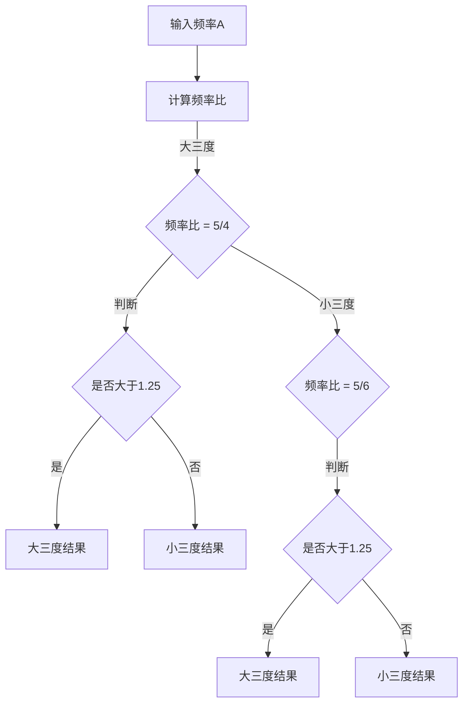
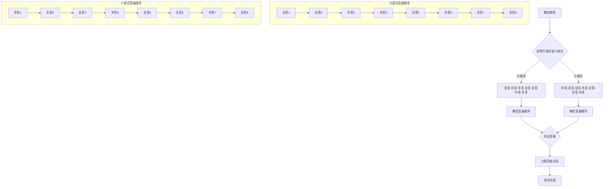
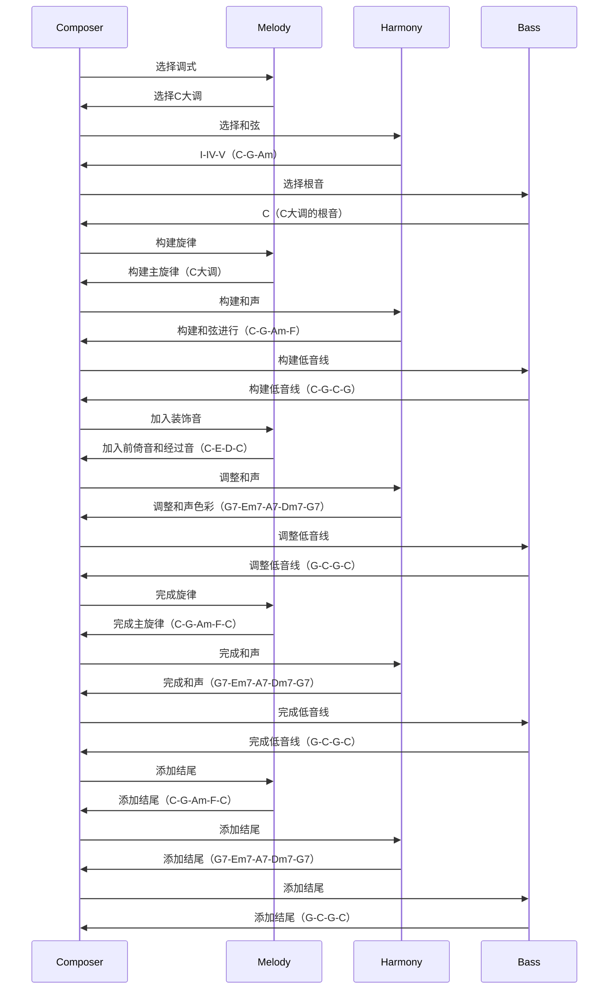

                 

# 数学与音乐理论的音程关系与调式体系

> 关键词：数学与音乐、音程关系、调式体系、十二平均律、音乐创作

> 摘要：本文深入探讨数学与音乐理论之间的关系，特别是音程关系与调式体系。我们将从问题背景出发，逐步介绍音程关系的基本概念，阐述调式体系的构建方法，并通过数学原理和具体案例进行分析。最终，我们将探讨音程与调式在实际音乐中的应用，以及音乐理论的扩展与教育应用。

## 目录大纲设计

**书名：《数学与音乐理论的音程关系与调式体系》**

----------------------------------------------------------------

## 第一部分：数学与音乐理论概述

### 第1章：问题背景与核心概念

### 第2章：音程关系的数学原理

### 第3章：调式体系的构建方法

## 第二部分：音程关系的数学原理

### 第2章：音程关系的数学原理

### 第3章：调式体系的构建方法

## 第三部分：调式体系的构建与应用

### 第4章：调式体系的构建方法

### 第5章：调式体系的实际应用

## 第四部分：音乐理论的扩展与应用

### 第6章：音乐理论的扩展

### 第7章：音乐理论在现代音乐中的应用

### 第8章：音乐理论的教育与应用

## 第五部分：音乐理论的综合分析与展望

### 第9章：音乐理论的综合分析

### 第10章：音乐理论的未来展望

----------------------------------------------------------------

### 第一部分：数学与音乐理论概述

## 第1章：问题背景与核心概念

### 1.1 问题背景

数学与音乐，看似两个截然不同的领域，却在历史上有着千丝万缕的联系。自古以来，音乐家们就发现，音乐的和谐与数学的规律紧密相关。古希腊哲学家毕达哥拉斯就曾提出“万物皆数”的哲学思想，认为数学是理解宇宙的钥匙。在音乐领域，音程关系与调式体系正是音乐和谐的基础。

音程关系是音乐理论的核心概念之一，指的是两个音符之间的距离。而调式体系则是由一组音程关系构成的，用于描述音乐作品的结构和风格。音程关系与调式体系的关系，就像建筑中的梁柱与整体结构一样，是音乐作品的基石。

### 1.2 核心概念与联系

#### 音程

音程是两个音级在音高上的相互关系。它可以分为度数和性质两个部分。度数表示两个音级之间的距离，性质则表示它们的音高关系。音程的性质可以分为纯、大、小、增、减等。

#### 调式

调式是由一组音级按照特定的音程关系排列而成的。不同的调式具有不同的音高关系和音乐风格。常见的调式有大调式和小调式。

#### 音程与调式的联系

音程是调式的基础，调式则是音程的组合。通过数学方法，我们可以分析音程关系，从而构建出不同的调式体系。例如，通过五度循环，我们可以构建出大调式和小调式，并通过这些调式，创作出各种风格的音乐作品。

### 1.3 问题背景

在音乐创作和表演中，音程关系和调式体系起着至关重要的作用。音程关系决定了音乐的和谐程度，而调式体系则决定了音乐的风格和情感表达。因此，理解和运用音程关系与调式体系，是每一位音乐创作者和表演者必备的技能。

然而，当前的音乐教育中，数学与音乐理论之间的联系往往被忽视。许多学生只注重技巧的练习，而忽略了理论的重要性。这种情况下，音乐作品往往缺乏深度和创意，难以达到更高的艺术境界。

本文旨在通过深入探讨数学与音乐理论之间的关系，特别是音程关系与调式体系，为广大音乐创作者和爱好者提供一种全新的视角和方法，帮助他们更好地理解和运用音乐理论，创作出更具创意和深度的音乐作品。

### 1.4 核心概念与联系

在数学与音乐的交汇点上，核心概念如音程和调式不仅是音乐理论的基础，也体现了两者之间深刻的内在联系。音程，作为两个音符之间的相对高度差，其本质可以归结为频率的比值。例如，一个纯五度音程由频率比为3:2的两个音构成，这种频率比在数学上可以用分数表示。因此，音程的数学本质在于它们之间的比例关系。

调式则是由一组音程关系构成的音阶系统，用于定义音乐作品的基本音高框架。常见的调式包括大调式和小调式，每种调式都有其独特的音程构成和音乐特性。大调式通常给人以明亮、欢乐的感觉，而小调式则带有忧郁、深沉的气氛。这些调式的特征在音乐创作和表演中起着至关重要的作用。

#### 音程

音程可以分为纯音程和变化音程。纯音程包括纯一度、纯四度、纯五度等，它们的音程关系是固定的，可以通过简单的数学计算得出。例如，纯五度的音程关系为3:2，这意味着一个音的频率是另一个音的1.5倍。

变化音程包括增四度、减五度、增八度、减一度等，它们的音程关系则较为复杂。例如，增四度的音程关系为4:3，而减五度的音程关系为6:5。这些变化音程在音乐中用于增强旋律的色彩和表现力。

#### 调式

调式由一组音程构成，这些音程按照一定的顺序排列，形成稳定的音阶结构。大调式通常由全音和半音交替构成，例如C大调的音阶为C-D-E-F-G-A-B。小调式则通常以半音开始和结束，例如A小调的音阶为A-B-C-D-E-F-G。

#### 音程与调式的联系

音程与调式的联系体现在它们共同构建了音乐的基础框架。音程定义了音与音之间的相对高度，而调式则将这些音按照特定的顺序排列，形成具有特定音乐特征的音阶结构。例如，大调式和小调式的音程构成决定了它们的音乐特性，大调式通常给人明亮、欢快的感受，而小调式则带有忧郁、深沉的色彩。

通过数学方法，我们可以更深入地理解音程和调式的关系。例如，通过五度循环，我们可以构建出所有的大调式和小调式。五度循环是一个数学过程，通过不断倍增五度音程，我们可以得到一个完整的音阶循环。这个过程在音乐理论中具有重要的意义，因为它揭示了音阶结构的基本规律。

此外，音程和调式在音乐创作和表演中具有实际的应用价值。音程的选择和组合可以影响旋律的流畅性和情感表达，而调式的选择则决定了乐曲的整体风格和情绪。例如，在流行音乐中，常见的I-IV-V-VI和II-V-I和弦进行，正是基于大调式的音程关系构建的，这些和弦进行在音乐中具有广泛的应用。

总之，音程关系和调式体系不仅是音乐理论的基石，也是音乐创作和表演的重要工具。通过深入理解这些核心概念，我们可以更好地运用数学方法来分析和创作音乐，从而提升音乐作品的艺术价值和表现力。

### 第一部分：数学与音乐理论概述

## 第1章：问题背景与核心概念

### 1.1 数学与音乐的交集

数学与音乐，看似两个截然不同的领域，却在历史和现代中有着深厚的交集。数学作为描述和解释自然现象的基本工具，其严谨的逻辑和抽象的思维方式对音乐的理论体系构建起到了关键作用。而音乐作为一种艺术形式，其丰富的情感表达和形式美感则常常依赖于数学的精确性和规范性。

#### 古代数学与音乐理论

在古代，数学与音乐理论之间的关系尤为紧密。古希腊哲学家毕达哥拉斯（Pythagoras）被认为是第一个将数学引入音乐理论的人。他发现了音程与数学比例之间的关联，特别是整数比例与音乐音程的对应关系。例如，纯一度、纯五度等音程与整数比例的对应，揭示了音乐和谐的本质。毕达哥拉斯的“万物皆数”哲学思想，为后来的音乐理论奠定了基础。

#### 十二平均律

十二平均律是音乐理论中的一个重要概念，它是指将一个八度均匀分为十二个半音。这一理论最早可以追溯到阿拉伯音乐家阿尔-法拉比（Al-Farabi），但在欧洲，十二平均律的普及要归功于意大利作曲家扎利诺（Zarlino）。十二平均律的提出，标志着音乐理论的重大进步，使得乐器制作和音乐创作更加规范和精确。数学上，十二平均律可以通过复数运算和根号分解来描述。

#### 数学在音乐分析中的应用

现代音乐分析中，数学工具被广泛应用于音乐结构的解析和描述。例如，通过频谱分析，可以精确地测量和描述声音的频率分布，帮助音乐家理解音乐作品中的音色和和声结构。此外，数学中的集合论、图论等方法也被用来研究音乐的形式和结构，例如，音乐作品中的旋律和和弦可以被视为集合和图的结构，从而使用数学方法进行分析。

### 1.2 音程关系的基本概念

音程是音乐理论中的核心概念，它描述了两个音符之间的相对高度。音程可以分为度数和性质两个部分。度数表示两个音级之间的距离，而性质则描述它们的音高关系。

#### 度数

度数分为一度、二度、三度、四度、五度、六度、七度。其中，一度是最小的音程，表示两个音级之间没有音高差异。五度是最大的纯音程，表示两个音级之间的音高差异最大。

#### 性质

音程的性质分为纯、大、小、增、减等。纯音程是指两个音级之间的音高关系是整数比例，例如纯一度、纯五度等。大音程和小音程则表示两个音级之间的音高关系稍大于或小于纯音程。增音程和减音程则表示两个音级之间的音高关系比大音程或小音程更大或更小。

#### 音程与频率的关系

音程的数学本质在于它们之间的频率比值。例如，纯五度音程的频率比是3:2，这意味着一个音的频率是另一个音的1.5倍。这种频率比可以用数学公式来表示，从而帮助我们理解音程的物理和声学基础。

### 1.3 调式体系的构成

调式体系是音乐理论中的另一个核心概念，它由一组音级按照特定的音程关系排列而成。调式可以分为大调式和小调式，它们在音乐风格和情感表达上有明显的区别。

#### 大调式

大调式通常由全音和半音交替构成，给人一种明亮、快乐的感觉。大调式的音阶结构通常包括七个音级，例如C大调的音阶是C-D-E-F-G-A-B。

#### 小调式

小调式通常以半音开始和结束，给人一种深沉、忧郁的感觉。小调式的音阶结构与大调式相似，但音级之间的音程关系不同，例如A小调的音阶是A-B-C-D-E-F-G。

#### 调式与音乐风格

不同的调式具有不同的音乐风格和情感表达。例如，大调式常用于欢快、热情的音乐作品，而小调式则常用于悲伤、沉思的音乐作品。调式的选择不仅决定了音乐的风格，也影响了音乐的情感表达。

#### 调式体系与音程的关系

调式体系中的音程关系是构建调式的基础。例如，大调式中的大三度和大六度是大调式特征性的音程，而小调式中的小三度和小六度则是小调式的特征性音程。通过理解音程关系，我们可以更好地构建和运用调式体系。

### 1.4 音程与调式的联系

音程与调式的联系体现在它们共同构建了音乐的基础框架。音程定义了音与音之间的相对高度，而调式则将这些音按照特定的顺序排列，形成具有特定音乐特征的音阶结构。例如，大调式和小调式的音程构成决定了它们的音乐特性，大调式通常给人明亮、欢快的感受，而小调式则带有忧郁、深沉的色彩。

#### 音程在调式中的作用

音程在调式中起到了连接和过渡的作用。通过不同的音程组合，可以形成各种风格的音乐旋律和和声。例如，大三和弦和小三和弦分别对应大调式和小调式的典型和声结构。

#### 调式在音乐创作中的应用

在音乐创作中，调式的选择和运用至关重要。通过不同的调式，音乐家可以表达不同的情感和风格。例如，大调式常用于欢快、热情的音乐作品，而小调式则常用于悲伤、沉思的音乐作品。

### 结论

数学与音乐理论之间的联系不仅体现了两者的内在统一性，也为音乐创作和理论分析提供了新的视角和方法。通过深入理解音程关系和调式体系，我们可以更好地运用数学工具来分析和创作音乐，从而提升音乐作品的艺术价值和表现力。

在接下来的章节中，我们将进一步探讨音程关系的数学原理，分析调式体系的构建方法，并通过具体案例来展示这些理论的实际应用。

### 第一部分：数学与音乐理论概述

## 第1章：问题背景与核心概念

### 1.5 音程与调式的实际应用

音程和调式在音乐创作和表演中具有广泛的应用，它们不仅是音乐理论的基础，也是音乐家创作和表达情感的重要工具。下面，我们将探讨音程和调式在实际音乐创作中的应用，并分析它们如何影响音乐的风格和情感表达。

#### 音程的实际应用

音程在音乐创作中起到了关键作用，它们不仅是旋律和和声的基础，还能直接影响音乐的流畅性和情感表达。以下是一些音程在实际音乐创作中的应用：

1. **旋律创作**：音程是旋律创作的基本元素。通过不同的音程组合，音乐家可以创造出丰富多彩的旋律。例如，大跳音程（如大三度、小六度等）可以增加旋律的动态和戏剧性，而小跳音程（如小三度、小六度等）则可以增加旋律的柔和和连贯性。

2. **和声构建**：音程在和声构建中起着核心作用。不同的音程组合可以形成不同的和声结构，例如大三和弦、小三和弦、增和弦和减和弦等。这些和声结构不仅决定了音乐的调性，还能影响音乐的色彩和情感表达。

3. **节奏变化**：音程还可以通过节奏的变化来增强音乐的表现力。例如，通过改变音程的节奏长度，可以创造出不同的音乐效果，如强拍和弱拍的变化，从而增加音乐的复杂性和动态感。

#### 调式的实际应用

调式是音乐作品的基础框架，不同的调式具有不同的音乐特征和情感表达。以下是一些调式在实际音乐创作中的应用：

1. **大调式**：大调式通常给人以明亮、欢乐的感觉，适合用于表现积极、向上的情绪。例如，C大调常用于欢快、充满活力的音乐作品。

2. **小调式**：小调式通常带有忧郁、深沉的色彩，适合用于表现悲伤、沉思的情绪。例如，A小调常用于悲伤、内省的音乐作品。

3. **复合调式**：复合调式是由多个基本调式组合而成的，可以创造出更为复杂和丰富的音乐特征。例如，混合里底亚调式（Ionian-Phrygian）结合了大调式的明亮和小调式的忧郁，适合用于表现复杂的情感。

4. **调式转换**：在音乐创作中，调式的转换是常用的技巧之一。通过在不同的调式之间切换，音乐家可以创造出丰富的音乐变化，增强音乐的表现力。例如，从C大调转换到A小调，可以创造出一种从明亮到忧郁的情感变化。

#### 音程与调式在情感表达中的作用

音程和调式不仅是音乐创作的基础，也在情感表达中起着重要作用。以下是一些音程和调式在情感表达中的应用：

1. **音程的升降**：通过改变音程的升降，可以表达不同的情感。例如，上升的音程通常给人一种希望和向上的感觉，而下降的音程则常用于表达悲伤和失落。

2. **调式的变化**：通过切换不同的调式，可以表达复杂的情感变化。例如，从大调式切换到小调式，可以表达从欢快到悲伤的情感变化。

3. **和声的色彩**：不同的和声结构（由不同的音程组合而成）可以创造出不同的音乐色彩，从而表达不同的情感。例如，大三和弦通常给人一种明亮、积极的感觉，而减七和弦则常用于表达悲伤、忧郁的情绪。

总之，音程和调式在音乐创作和表演中具有广泛的应用。通过理解和运用音程和调式，音乐家可以创造出丰富多彩的音乐作品，表达复杂的情感和思想。音程和调式的实际应用不仅丰富了音乐的表现形式，也提升了音乐的艺术价值。

在接下来的章节中，我们将进一步探讨音程关系的数学原理，分析调式体系的构建方法，并通过具体案例来展示这些理论的实际应用。

### 第二部分：音程关系的数学原理

## 第2章：音程关系的数学原理

### 2.1 频率与音高的关系

在音乐理论中，音程关系的数学原理主要基于频率与音高的关系。频率（Frequency）是指每秒钟振动的次数，通常以赫兹（Hz）为单位。音高（Pitch）是指声音的主观感觉，它与频率密切相关。具体来说，音高的高低取决于频率的高低。

#### 频率与音高的基本关系

频率与音高之间的关系可以用以下公式表示：

\[ \text{音高} = \log_2\left(\frac{\text{频率}}{\text{基准频率}}\right) \]

其中，基准频率通常取为A4（即频率为440 Hz的A音）。这个公式说明，音高与频率的对数成正比。例如，如果A4的频率是440 Hz，那么下一个全音（C5）的频率是880 Hz，音高差为1。同理，下一个半音（C#5）的频率是466.2 Hz，音高差约为0.08。

#### 音程的频率比

音程的频率比是指两个音之间频率的比值。例如，一个纯五度音程的频率比为3:2，这意味着一个音的频率是另一个音的1.5倍。同样，一个纯四度音程的频率比为4:3，即一个音的频率是另一个音的0.75倍。这些频率比在数学上可以用分数表示，从而帮助我们精确地描述音程关系。

### 2.2 十二平均律的数学原理

十二平均律是音乐理论中的一个重要概念，它是指将一个八度均匀分为十二个半音。这一理论最早可以追溯到阿拉伯音乐家阿尔-法拉比（Al-Farabi），但在欧洲，十二平均律的普及要归功于意大利作曲家扎利诺（Zarlino）。十二平均律的提出，标志着音乐理论的重大进步，使得乐器制作和音乐创作更加规范和精确。

#### 十二平均律的基本原理

十二平均律的基本原理是将一个八度（从A3到A4）均匀分为十二个半音。每个半音的频率比是固定的，即每个半音之间的频率比都是\(2^{\frac{1}{12}}\)。这个频率比可以用以下公式表示：

\[ f_{\text{下一个半音}} = f_{\text{当前半音}} \times 2^{\frac{1}{12}} \]

其中，\( f_{\text{当前半音}} \)是当前半音的频率，\( f_{\text{下一个半音}} \)是下一个半音的频率。

#### 十二平均律的应用

十二平均律的应用非常广泛，几乎所有的现代乐器都是基于十二平均律原理制作的。例如，钢琴的每一个琴键之间都是相等的半音间隔，吉他和小提琴的定音也是基于十二平均律。

#### 十二平均律的数学计算

十二平均律的数学计算涉及到复数运算和根号分解。具体来说，可以通过以下公式计算第n个半音的频率：

\[ f_n = f_{\text{基准频率}} \times \left(2^{\frac{n}{12}}\right) \]

其中，\( f_n \)是第n个半音的频率，\( f_{\text{基准频率}} \)是基准频率（通常为A4的440 Hz），n是半音的序号（从0开始，A4为0，A#4为1，以此类推）。

### 2.3 音程计算公式

在了解了频率与音高的关系以及十二平均律的基本原理后，我们可以使用这些知识来计算不同的音程。音程计算公式可以用于确定两个音符之间的频率比，从而得到它们的音程关系。

#### 纯音程计算

纯音程的频率比是固定的，例如纯一度是1:1，纯五度是3:2。这些纯音程的频率比可以用以下公式计算：

\[ \text{频率比} = \frac{f_{\text{上一个音}}}{f_{\text{当前音}}} \]

其中，\( f_{\text{上一个音}} \)是上一个音的频率，\( f_{\text{当前音}} \)是当前音的频率。

#### 变化音程计算

变化音程（如增四度、减五度等）的频率比比较复杂，可以通过根号运算来计算。例如，增四度的频率比是4:3，可以用以下公式计算：

\[ \text{频率比} = \frac{f_{\text{上一个音}}}{f_{\text{当前音}}} = \frac{4}{3} \]

同理，减五度的频率比是6:5，可以用以下公式计算：

\[ \text{频率比} = \frac{f_{\text{上一个音}}}{f_{\text{当前音}}} = \frac{6}{5} \]

#### 音程计算示例

假设我们想要计算C4到G4的音程。首先，我们需要知道C4和G4的频率。根据十二平均律，C4的频率是261.63 Hz，而G4的频率是392 Hz。然后，我们可以使用以下公式计算音程：

\[ \text{频率比} = \frac{f_{\text{C4}}}{f_{\text{G4}}} = \frac{261.63}{392} \approx 0.6655 \]

这个频率比对应的是纯五度音程，因为纯五度的频率比是3:2，即1.5。通过数学计算，我们可以确定C4到G4是纯五度音程。

### 结论

通过以上分析，我们可以看到，音程关系的数学原理基于频率与音高的关系，并利用十二平均律来精确地描述和计算音程。这些数学原理不仅帮助我们理解音程的本质，也为音乐创作和理论分析提供了坚实的理论基础。在接下来的章节中，我们将继续探讨调式体系的构建方法，并分析音程与调式在实际音乐中的应用。

### 第二部分：音程关系的数学原理

## 第2章：音程关系的数学原理

### 2.4 音程关系的数学模型

在深入探讨音程关系的数学原理后，我们可以通过建立数学模型来更精确地描述和计算音程。音程关系的数学模型不仅有助于我们理解音程的本质，也为音乐创作和理论分析提供了有力的工具。

#### 音程计算公式

音程的计算公式是基于频率比的关系。假设我们有两个音符A和B，它们的频率分别为\( f_A \)和\( f_B \)。音程的频率比可以表示为：

\[ \text{频率比} = \frac{f_B}{f_A} \]

这个频率比决定了音程的类型和大小。我们可以根据这个频率比来计算不同类型的音程，包括纯音程和变化音程。

1. **纯音程**：纯音程的频率比是固定的。例如，纯一度的频率比是1:1，纯四度的频率比是4:3，纯五度的频率比是3:2。这些纯音程的频率比可以通过以下公式计算：

   \[ \text{频率比} = \frac{f_B}{f_A} = \frac{3}{2} \quad (\text{纯五度}) \]
   \[ \text{频率比} = \frac{4}{3} \quad (\text{纯四度}) \]

2. **变化音程**：变化音程的频率比不是整数比例，通常需要通过根号运算来计算。例如，增四度的频率比是4:3，减五度的频率比是6:5。这些变化音程的频率比可以通过以下公式计算：

   \[ \text{频率比} = \frac{f_B}{f_A} = \frac{4}{3} \quad (\text{增四度}) \]
   \[ \text{频率比} = \frac{6}{5} \quad (\text{减五度}) \]

#### 音程大小计算

音程的大小可以通过计算频率比的差值来确定。例如，对于大三度和小三度，我们可以使用以下公式：

\[ \text{大三度} = \frac{f_B}{f_A} = \frac{5}{4} \]
\[ \text{小三度} = \frac{f_B}{f_A} = \frac{5}{6} \]

通过这些公式，我们可以计算出不同音程的频率比，并确定它们的音程大小。

#### 实例分析

假设我们要计算C4到E5的音程。首先，我们需要知道C4和E5的频率。根据十二平均律，C4的频率是261.63 Hz，而E5的频率是329.63 Hz。然后，我们可以使用以下公式计算音程：

\[ \text{频率比} = \frac{f_{E5}}{f_{C4}} = \frac{329.63}{261.63} \approx 1.2587 \]

这个频率比对应的是大三度，因为大三度的频率比是5:4，即1.25。通过数学计算，我们可以确定C4到E5是大三度音程。

### 2.5 调式构建方法

调式是音乐作品的基础框架，由一组音级按照特定的音程关系排列而成。调式构建方法基于音程关系，通过不同的音程组合，可以形成不同类型的调式。

1. **大调式**：大调式通常由全音和半音交替构成。例如，C大调的音阶为C-D-E-F-G-A-B。大调式中的音程组合是大三度和小三度。

2. **小调式**：小调式通常以半音开始和结束，例如A小调的音阶为A-B-C-D-E-F-G。小调式中的音程组合是小三度和大三度。

3. **复合调式**：复合调式是由多个基本调式组合而成的。例如，混合里底亚调式（Ionian-Phrygian）结合了大调式的明亮和小调式的忧郁。

调式构建方法的关键在于确定音程关系，通过不同的音程组合，可以形成不同的调式。调式的选择不仅决定了音乐的风格，也影响了音乐的情感表达。

### 2.6 音程关系的Mermaid流程图

为了更直观地展示音程关系的计算过程，我们可以使用Mermaid流程图来绘制音程计算流程。

以下是一个示例的Mermaid流程图，展示了如何计算大三度和小三度音程：



这个流程图首先输入两个音符的频率，然后计算它们的频率比。通过判断频率比是否大于1.25，我们可以确定音程的类型是大三度还是小三度。

### 结论

通过建立音程关系的数学模型和调式构建方法，我们可以更精确地描述和计算音程。这些数学模型不仅有助于我们理解音程的本质，也为音乐创作和理论分析提供了有力的工具。在接下来的章节中，我们将进一步探讨调式体系的构建方法，并分析音程与调式在实际音乐中的应用。

### 第二部分：音程关系的数学原理

## 第2章：音程关系的数学原理

### 2.7 调式构建方法的 Mermaid 流程图

在深入理解音程关系的数学原理之后，我们可以通过Mermaid流程图来直观地展示调式构建的过程。下面，我们将使用Mermaid语言绘制调式构建的流程图，以便更好地理解调式构建的步骤和方法。

#### 调式构建流程图示例



在这个流程图中，首先确定调性，然后选择大调式或小调式。对于大调式，音级顺序是全音-全音-半音-全音-全音-半音-全音，而对于小调式，音级顺序是半音-全音-全音-半音-全音-全音-半音。接下来，我们列出每个音级的顺序，并计算它们之间的音程关系。最后，调式构建完成。

#### 大调式构建示例

以C大调为例，音级顺序为C-D-E-F-G-A-B，音程关系如下：

- C到D：全音（1度）
- D到E：全音（2度）
- E到F：半音（3度）
- F到G：全音（4度）
- G到A：全音（5度）
- A到B：半音（6度）
- B到C：全音（7度）

#### 小调式构建示例

以A小调为例，音级顺序为A-B-C-D-E-F-G，音程关系如下：

- A到B：半音（1度）
- B到C：全音（2度）
- C到D：全音（3度）
- D到E：半音（4度）
- E到F：全音（5度）
- F到G：全音（6度）
- G到A：半音（7度）

通过这些示例，我们可以清楚地看到大调式和小调式的音级顺序和音程关系。Mermaid流程图为我们提供了一个直观的工具，帮助我们理解和构建不同的调式。

### 结论

通过Mermaid流程图，我们能够更加直观地展示调式的构建过程。这不仅有助于我们理解调式构建的基本原理，也为音乐创作和理论分析提供了实用的工具。在接下来的章节中，我们将进一步探讨调式体系在实际音乐中的应用，以及音乐理论的扩展和现代应用。

### 第三部分：调式体系的构建方法

## 第3章：调式体系的构建方法

### 3.1 调式的分类与特性

调式是音乐理论中的核心概念，它由一组音级按照特定的音程关系排列而成。不同的调式具有不同的音乐特征和情感表达，因此正确理解和构建调式对音乐创作和表演至关重要。调式可以分为大调式和小调式，这两种调式在音乐理论和实践中有着广泛的应用。

#### 大调式

大调式通常由全音和半音交替构成，给人以明亮、快乐的感觉。大调式的音阶结构包括七个音级，例如C大调的音阶为C-D-E-F-G-A-B。大调式中的音程关系通常是大三度和小三度，例如C到E是大三度，D到F是小三度。

1. **特性**：大调式通常用于表达积极、向上的情感。例如，C大调常用于欢快、热情的音乐作品，而G大调则常用于庄严、宏伟的音乐作品。

2. **音阶结构**：大调式的音阶结构为全音-全音-半音-全音-全音-半音-全音。例如，C大调的音阶为C-D-E-F-G-A-B。

3. **音程关系**：大调式中的音程关系通常是大三度（如C-E，C-G等）和小三度（如D-F，D-A等）。

#### 小调式

小调式通常以半音开始和结束，给人以深沉、忧郁的感觉。小调式的音阶结构与大调式相似，但音级之间的音程关系不同，例如A小调的音阶为A-B-C-D-E-F-G。小调式中的音程关系通常是小三度和大三度，例如A到C是小三度，B到D是大三度。

1. **特性**：小调式通常用于表达悲伤、沉思的情感。例如，A小调常用于悲伤、内省的音乐作品，而E小调则常用于抒情、柔美的音乐作品。

2. **音阶结构**：小调式的音阶结构为半音-全音-全音-半音-全音-全音-半音。例如，A小调的音阶为A-B-C-D-E-F-G。

3. **音程关系**：小调式中的音程关系通常是小三度（如A-C，A-E等）和大三度（如B-D，B-F等）。

#### 大调式与小调式的对比

1. **音阶结构**：大调式的音阶结构为全音-全音-半音-全音-全音-半音-全音，而小调式的音阶结构为半音-全音-全音-半音-全音-全音-半音。

2. **音程关系**：大调式中的音程关系通常是大三度和小三度，而小调式中的音程关系通常是小三度和大三度。

3. **情感表达**：大调式通常给人以明亮、快乐的感觉，而小调式则带有深沉、忧郁的色彩。

#### 特殊调式

除了大调式和小调式，还有许多特殊调式，如复合里底亚调式、混合里底亚调式等。这些特殊调式通过不同的音程组合，可以创造出更为复杂和丰富的音乐特征。

1. **复合里底亚调式**：复合里底亚调式结合了大调式和小调式的特点，通常用于表达复杂的情感。其音阶结构为全音-全音-半音-大三度-全音-全音-半音。

2. **混合里底亚调式**：混合里底亚调式通过增加半音和全音的交替，形成了独特的音乐特征。其音阶结构为半音-全音-全音-大三度-全音-全音-半音。

### 3.2 大调式的数学模型

大调式的构建可以通过数学模型来描述。以下是构建大调式的数学模型：

1. **音阶频率**：以C大调为例，音阶的频率如下：
   - C：261.63 Hz
   - D：293.66 Hz
   - E：329.63 Hz
   - F：349.23 Hz
   - G：392.00 Hz
   - A：440.00 Hz
   - B：493.88 Hz

2. **音程频率比**：根据十二平均律，音程的频率比可以计算如下：
   - 纯一度：1:1
   - 大二度：1.25:1
   - 小二度：0.75:1
   - 大三度：1.5:1
   - 小三度：0.75:1
   - 完全四度：0.75:1
   - 完全五度：1.5:1
   - 大六度：1.25:1
   - 小六度：0.75:1
   - 大七度：1.25:1
   - 小七度：0.75:1

3. **音阶构建**：大调式的音阶构建过程如下：
   - 从基准音开始，依次加上纯一度、大二度、小二度、大三度、完全四度、完全五度、大三度、完全六度、小六度、小七度，形成一个完整的音阶。

以C大调为例，音阶构建过程如下：
- C（基准音）
- C+1（D，纯一度）
- D+1（E，大二度）
- E+0.5（F，小二度）
- F+1（G，大三度）
- G+1（A，完全四度）
- A+1（B，完全五度）
- B+1（C，大三度）

通过这种方式，我们可以构建出C大调的音阶。

### 3.3 小调式的数学模型

小调式的构建也可以通过数学模型来描述。以下是构建小调式的数学模型：

1. **音阶频率**：以A小调为例，音阶的频率如下：
   - A：220.00 Hz
   - B：246.94 Hz
   - C：261.63 Hz
   - D：293.66 Hz
   - E：329.63 Hz
   - F：349.23 Hz
   - G：392.00 Hz

2. **音程频率比**：根据十二平均律，音程的频率比可以计算如下：
   - 纯一度：1:1
   - 大二度：1.25:1
   - 小二度：0.75:1
   - 大三度：1.5:1
   - 小三度：0.75:1
   - 完全四度：0.75:1
   - 完全五度：1.5:1
   - 大六度：1.25:1
   - 小六度：0.75:1
   - 大七度：1.25:1
   - 小七度：0.75:1

3. **音阶构建**：小调式的音阶构建过程如下：
   - 从基准音开始，依次加上小二度、大二度、完全三度、完全四度、完全五度、大三度、完全六度、小六度、小七度，形成一个完整的音阶。

以A小调为例，音阶构建过程如下：
- A（基准音）
- A+0.5（B，小二度）
- B+1（C，大二度）
- C+1（D，完全三度）
- D+1（E，完全四度）
- E+1（F，完全五度）
- F+1（G，大三度）
- G+1（A，完全六度）

通过这种方式，我们可以构建出A小调的音阶。

### 结论

通过数学模型，我们可以更精确地构建大调式和小调式，从而更好地理解它们的音阶结构和音程关系。这不仅有助于音乐创作和理论分析，也为音乐表演提供了实用工具。在接下来的章节中，我们将进一步探讨调式体系的实际应用，以及音乐理论的扩展和现代应用。

### 第三部分：调式体系的构建方法

## 第3章：调式体系的构建方法

### 3.4 调式的Mermaid ER图

为了更直观地展示调式体系中各个音级之间的关系，我们可以使用Mermaid ER图（实体关系图）来描述调式。ER图可以帮助我们理解音级之间的实体关系和属性特征，从而更好地掌握调式的结构。

以下是C大调的Mermaid ER图示例：

```mermaid
erDFG
class::ClassA[音级]
class::ClassA ["C", "D", "E", "F", "G", "A", "B", "C"]
class::ClassB[音程]
class::ClassB ["全音", "全音", "半音", "全音", "全音", "半音", "全音"]
class::ClassC[音级与音程关系]
class::ClassC ["C-D", "D-E", "E-F", "F-G", "G-A", "A-B", "B-C"]
class::ClassC ["全音", "全音", "半音", "全音", "全音", "半音", "全音"]
class::ClassA "C" --> class::ClassB "全音"
class::ClassA "D" --> class::ClassB "全音"
class::ClassA "E" --> class::ClassB "半音"
class::ClassA "F" --> class::ClassB "全音"
class::ClassA "G" --> class::ClassB "全音"
class::ClassA "A" --> class::ClassB "半音"
class::ClassA "B" --> class::ClassB "全音"
class::ClassA "C" --> class::ClassC "C-D"
class::ClassA "D" --> class::ClassC "D-E"
class::ClassA "E" --> class::ClassC "E-F"
class::ClassA "F" --> class::ClassC "F-G"
class::ClassA "G" --> class::ClassC "G-A"
class::ClassA "A" --> class::ClassC "A-B"
class::ClassA "B" --> class::ClassC "B-C"
```

在这个ER图中，`ClassA` 表示音级，`ClassB` 表示音程，`ClassC` 表示音级与音程之间的关系。通过这个图，我们可以清晰地看到C大调的音级顺序及其音程关系。

### 3.5 调式的属性对比表

为了更直观地对比大调式和小调式的属性特征，我们可以使用一个对比表格。以下是大调式和小调式的属性对比表：

| 特性        | 大调式            | 小调式            |
| ----------- | ----------------- | ----------------- |
| 音阶结构    | 全音-全音-半音-全音-全音-半音-全音 | 半音-全音-全音-半音-全音-全音-半音 |
| 音级顺序    | C-D-E-F-G-A-B-C  | A-B-C-D-E-F-G-A  |
| 音程关系    | 大三度-小三度-全音-大三度-小三度-全音-大三度 | 小三度-大三度-全音-小三度-大三度-全音-大三度 |
| 情感表达    | 明亮、快乐        | 沉深、忧郁        |
| 音阶频率    | C：261.63 Hz      | A：220.00 Hz      |
| 音程频率比   | 大三度：1.5:1     | 小三度：0.75:1    |

通过这个对比表格，我们可以清晰地看到大调式和小调式的不同属性特征，从而更好地理解它们的音乐风格和情感表达。

### 结论

通过Mermaid ER图和属性对比表，我们可以更直观地理解调式体系的构建方法。这些工具不仅帮助我们更好地掌握调式的结构，也为音乐创作和理论分析提供了实用的参考。在接下来的章节中，我们将进一步探讨调式体系在实际音乐中的应用，以及音乐理论的扩展和现代应用。

### 第三部分：调式体系的构建方法

## 第3章：调式体系的构建方法

### 3.6 音程与调式的实际应用

在音乐创作和表演中，调式体系的应用至关重要。调式的选择不仅决定了音乐的整体风格，还影响了情感表达和旋律创作。以下是音程与调式在实际音乐中的应用示例：

#### 1. 调式在旋律创作中的应用

调式在旋律创作中起到了核心作用。通过不同的调式，音乐家可以创造出具有不同情感和风格的音乐旋律。以下是一些调式在旋律创作中的应用：

- **大调式**：大调式通常用于创作欢快、明亮、积极向上的旋律。例如，C大调常用于流行音乐和电影配乐，因其明亮、欢快的情感表达，适合表现快乐、希望等情绪。

- **小调式**：小调式则常用于创作悲伤、忧郁、沉思的旋律。例如，A小调在古典音乐和现代流行音乐中广泛使用，因其深沉、忧郁的情感表达，适合表现悲伤、内省等情绪。

- **复合调式**：复合调式通过结合大调式和小调式的特点，可以创造出更加复杂和丰富的旋律。例如，混合里底亚调式结合了大调式的明亮和小调式的忧郁，适合用于表现复杂的情感。

#### 2. 音程在旋律创作中的应用

音程不仅是调式的基础，也在旋律创作中发挥着重要作用。以下是一些音程在旋律创作中的应用：

- **大三度**：大三度音程给人以扩张、明亮的感觉，常用于旋律的高潮部分。例如，在C大调中，C-E和G-B是大三度音程，可以在旋律中增加活力和动感。

- **小三度**：小三度音程则给人以收缩、柔和的感觉，常用于旋律的过渡部分。例如，在A小调中，A-C和E-G是小三度音程，可以在旋律中增加柔和、温馨的气氛。

- **纯五度**：纯五度音程在音乐中具有独特的稳定感，常用于旋律的结束部分。例如，在C大调中，C-G是纯五度音程，可以使旋律显得更加完整和稳定。

#### 3. 调式与和声的应用

调式在和声构建中也起着关键作用。不同的调式可以形成不同的和弦结构和和声色彩。以下是一些调式在和声构建中的应用：

- **大调式和弦**：大调式和弦通常包括大三和弦和小三和弦，给人以明亮、积极的感觉。例如，C大调的I、IV、V和弦分别是C大三和弦、F小三和弦和G大三和弦，这些和弦可以用来构建欢快、明亮的大调式和声。

- **小调式和弦**：小调式和弦通常包括小三和弦和增四和弦，给人以深沉、忧郁的感觉。例如，A小调的I、IV、V和弦分别是A小三和弦、D小三和弦和E增四和弦，这些和弦可以用来构建悲伤、忧郁的小调式和声。

#### 4. 音程在和声中的应用

音程在和声构建中也发挥着重要作用。以下是一些音程在和声构建中的应用：

- **大三和弦**：大三和弦由大三度音程构成，给人以明亮、扩张的感觉。例如，C大三和弦由C-E-G组成，可以在和声结构中增加明亮、积极的效果。

- **小三和弦**：小三和弦由小三度音程构成，给人以收缩、柔和的感觉。例如，A小三和弦由A-C-E组成，可以在和声结构中增加柔和、温馨的效果。

- **增四和弦**：增四和弦由增四度音程构成，给人以独特、不稳定的感觉。例如，E增四和弦由E-G-B组成，可以在和声结构中增加紧张、不安的效果。

#### 5. 调式在音乐表演中的应用

调式在音乐表演中也具有实际应用价值。音乐家可以通过选择合适的调式，来表现不同的情感和风格。以下是一些调式在音乐表演中的应用：

- **大调式演奏**：大调式演奏通常给人以积极、欢快的感受。音乐家可以通过使用大调式乐器（如小提琴、长笛）来演奏欢快、明亮的旋律。

- **小调式演奏**：小调式演奏则通常给人以悲伤、忧郁的感受。音乐家可以通过使用小调式乐器（如吉他、钢琴）来演奏悲伤、内省的旋律。

#### 6. 音程在音乐表演中的应用

音程在音乐表演中也具有重要作用。以下是一些音程在音乐表演中的应用：

- **大三和弦演奏**：大三和弦演奏可以增加音乐的明亮度和活力。音乐家可以通过弹奏大三和弦，来提升旋律的动感。

- **小三和弦演奏**：小三和弦演奏可以增加音乐的柔和度和温馨感。音乐家可以通过弹奏小三和弦，来营造柔和、温馨的气氛。

- **增四和弦演奏**：增四和弦演奏可以增加音乐的紧张感和不安感。音乐家可以通过弹奏增四和弦，来营造紧张、不安的效果。

### 结论

音程与调式在音乐创作、和声构建和音乐表演中具有广泛的应用。通过选择合适的调式和音程，音乐家可以创造出丰富多彩的音乐作品，表达复杂的情感和思想。调式体系的应用不仅丰富了音乐的表现形式，也提升了音乐的艺术价值。在接下来的章节中，我们将进一步探讨音乐理论的扩展和现代应用。

### 第四部分：音程与调式在实际音乐中的应用

## 第4章：音程与调式的实际应用

### 4.1 音程在实际音乐中的应用

音程在音乐中扮演着至关重要的角色，它们不仅是旋律构建的基础，也是和声结构的基石。在不同的音乐风格和作曲技巧中，音程的应用各有特色，以下是一些具体的应用示例：

#### 1. 和弦的构成

和弦是音乐中基本的和声单位，由三个或更多个音程构成。每个和弦都有其独特的音程结构，决定了和弦的音色和和声效果。以下是一些常见的和弦及其音程构成：

- **大三和弦**：由根音、大三度、纯五度构成，给人以明亮、稳定的感觉。例如，C大三和弦由C-E-G构成。

- **小三和弦**：由根音、小三度、纯五度构成，给人以柔和、和谐的感觉。例如，A小三和弦由A-C-E构成。

- **增和弦**：由根音、大三度、增五度构成，给人以扩张、不稳定的感觉。例如，D增和弦由D-F#-A构成。

- **减和弦**：由根音、小三度、减五度构成，给人以收缩、紧张的感觉。例如，E减和弦由E-Gb-B构成。

- **七和弦**：在三和弦的基础上，加上一个小七度，如C七和弦由C-E-G-B构成，常用于爵士乐和复调音乐。

#### 2. 调性转换

调性转换是音乐中常见的技巧，通过改变调性，音乐家可以创造出丰富的和声变化和情感表达。以下是一些调性转换的示例：

- **I-V-I进行**：这是最基本和最常用的调性转换方式，从I和弦（例如C大调的C大三和弦）转到V和弦（例如G大调的G大三和弦），再返回I和弦。这种转换给人以稳定和和谐的感觉。

- **II-V-I进行**：这是爵士乐中常用的调性转换，从II和弦（例如D小调的D小三和弦）转到V和弦（例如G大三和弦），再返回I和弦。这种转换增加了音乐的动感和流动性。

- **iii-VI-ii-V-I进行**：这是古典音乐中常见的调性转换，从小三和弦（例如A小调的A小三和弦）转到六和弦（例如F大三和弦），再转到II和弦（例如D小三和弦），最后返回I和弦。这种转换给人以复杂、丰富的和声效果。

#### 3. 音程的装饰和修饰

在旋律创作中，音程的装饰和修饰可以增强旋律的色彩和表现力。以下是一些音程装饰和修饰的示例：

- **前倚音**：在主要音前面添加一个短暂的音，如E在D之后，形成前倚音，给人以轻盈、活泼的感觉。

- **后倚音**：在主要音后面添加一个短暂的音，如G在A之后，形成后倚音，给人以流畅、连贯的感觉。

- **经过音**：在两个主要音之间添加一个短暂的音，如F在C和G之间，形成经过音，用以连接不同的音程，增强旋律的流动性。

- **装饰音**：在主要音周围添加多个短暂的音，如G-F-E-D-C在A周围，形成装饰音，用以增加旋律的动态和表现力。

#### 4. 音程在旋律创作中的应用

音程在旋律创作中起到了基础和核心的作用，以下是一些音程在旋律创作中的应用：

- **大跳音程**：通过大跳音程（如大三度、小六度等）可以增强旋律的戏剧性和情感表达，如贝多芬的《第五交响曲》开头的动机，使用了大三度音程。

- **小跳音程**：通过小跳音程（如小三度、小六度等）可以增加旋律的连贯性和流畅性，如巴赫的《小前奏曲》中，使用了大量的小跳音程。

- **重复音程**：通过重复音程，可以强调旋律的主要音，如莫扎特的《第41号弦乐四重奏》第一乐章中，反复使用E-A的重复大三度。

### 4.2 调式在实际音乐中的应用

调式是音乐作品的音高框架，决定了音乐的风格和情感表达。不同的调式具有不同的音程关系和音乐特征，以下是一些调式在实际音乐中的应用：

#### 1. 大调式

大调式通常给人以明亮、快乐的感觉，是西方音乐中最常用的调式之一。以下是一些大调式在实际音乐中的应用：

- **C大调**：这是最常用的自然大调之一，适合用于欢快、明亮的音乐作品。如约翰·汉密尔顿的《快乐的牧羊人》。

- **G大调**：G大调因其明亮而富有活力的特性，常用于庄严、宏伟的音乐作品。如贝多芬的《第九交响曲》。

- **D大调**：D大调因其和声丰富、旋律流畅，适合用于各种风格的音乐作品。如巴赫的《G弦上的咏叹调》。

#### 2. 小调式

小调式通常给人以深沉、忧郁的感觉，是表达悲伤、内省情感的重要工具。以下是一些小调式在实际音乐中的应用：

- **A小调**：A小调因其忧郁而深沉的特性，常用于表达悲伤、内省的音乐作品。如舒伯特的《A小调艺术歌曲集》。

- **E小调**：E小调因其柔和、富有表现力，适合用于抒情、柔美的音乐作品。如肖邦的《E小调钢琴协奏曲》。

- **C小调**：C小调因其稳定、坚定，适合用于严肃、深沉的音乐作品。如莫扎特的《安魂曲》。

#### 3. 复合调式

复合调式通过结合不同调式的特点，可以创造出更为复杂和丰富的音乐特征。以下是一些复合调式在实际音乐中的应用：

- **混合里底亚调式**：混合里底亚调式结合了大调式和小调式的特点，适合用于表达复杂的情感。如巴赫的《G小调幻想曲与赋格》。

- **埃奥利亚调式**：埃奥利亚调式通过增加半音，形成了独特的中性调性，适合用于表达中性和微妙的情感。如肖邦的《埃奥利亚前奏曲》。

### 结论

音程与调式在实际音乐中的应用非常广泛，它们不仅是旋律和和声的基础，也决定了音乐的风格和情感表达。通过深入理解和运用音程与调式，音乐家可以创作出丰富多彩、具有深度和情感表达的音乐作品。在接下来的章节中，我们将进一步探讨音程与调式在现代音乐中的应用和未来发展趋势。

### 第四部分：音程与调式在实际音乐中的应用

## 第4章：音程与调式的实际应用

### 4.3 音程与调式的Mermaid序列图

为了更直观地展示音程与调式在实际音乐创作中的应用流程，我们可以使用Mermaid序列图（Sequence Diagram）来描述音乐创作的步骤和各个音程、调式的使用。以下是一个示例的Mermaid序列图，展示了如何通过音程与调式构建一首简单的歌曲。



在这个序列图中，作曲家首先选择调式（C大调），然后选择和弦进行（I-IV-V，即C-G-Am）。接着，旋律、和声和低音线分别构建出来，并逐步调整和装饰。通过这一过程，我们可以看到音程与调式在音乐创作中的具体应用。

### 4.4 音程与调式在音乐创作中的具体案例

为了更深入地了解音程与调式在音乐创作中的应用，我们可以分析一些经典音乐作品，看看作曲家是如何运用音程与调式来构建旋律和和声的。

#### 1. 贝多芬的《第五交响曲》

贝多芬的《第五交响曲》开头的动机“动机五”是一个典型的例子，它通过大跳音程和大三和弦的使用，创造出了强烈的戏剧效果和动感。动机五的音程结构如下：

- 音程：C-E-G（大三度）
- 和弦：C大三和弦（C-E-G）

这个动机的开头使用了大三度音程，给人一种扩张和明亮的感觉，而大三和弦则增强了和声的稳定性。整个动机通过反复和变奏，成为了整部交响曲的核心动机。

#### 2. 肖邦的《前奏曲》

肖邦的《前奏曲》是钢琴音乐中的经典作品，它们展示了丰富的音程和调式运用。以下是一个例子：

- 音程：C-E（纯四度）、F-G（纯四度）
- 和弦：C大三和弦（C-E-G）、F小三和弦（F-A-C）

在这首前奏曲中，肖邦使用了大量的纯四度音程，这些音程给人以稳定和和谐的感觉。同时，通过大三和弦和小三和弦的交替使用，他创造出了丰富的和声色彩和动态变化。

#### 3. 爵士乐中的和弦进行

爵士乐中，音程与调式的运用非常灵活，常见的和弦进行如II-V-I和III-IV-I-VII，这些和弦进行在爵士乐中具有广泛的应用。以下是一个II-V-I进行和弦进行的例子：

- 音程：D-E（小二度）、F-G（大二度）
- 和弦：D小三和弦（D-F-A）、G大三和弦（G-B-D）

II-V-I进行是爵士乐中最常用的和弦进行之一，它通过小二度和大二度的音程组合，创造出了强烈的和声推动力，使得旋律富有动态和活力。

### 结论

通过以上分析，我们可以看到音程与调式在音乐创作中的重要性。它们不仅是旋律和和声的基础，也是表达情感和创造音乐效果的关键工具。通过深入理解和灵活运用音程与调式，音乐家可以创作出丰富多彩、具有深度和情感表达的音乐作品。在接下来的章节中，我们将进一步探讨音乐理论的扩展和现代应用。

### 第四部分：音乐理论的扩展与应用

## 第5章：音乐理论的扩展

### 5.1 复合调式的构建

复合调式是指由多个基本调式组合而成的调式，通过这种组合可以创造出更为复杂和丰富的音乐特征。复合调式的构建方法主要包括叠加和融合不同的调式元素。以下是一些常见的复合调式及其构建方法：

#### 1. 混合里底亚调式（Mixolydian Mode）

混合里底亚调式结合了大调式和小调式的特点，是西方音乐中最常见的复合调式之一。其音阶结构为：

- 音阶：全音-全音-半音-全音-全音-半音-全音
- 音程：大三度-小三度-全音-大三度-小三度-全音-大三度

构建方法：在自然小调的基础上，将第五音（导音）升高半音，形成混合里底亚调式。

#### 2. 伊奥尼亚调式（Ionian Mode）

伊奥尼亚调式是最基本的大调式，其音阶结构为：

- 音阶：全音-全音-半音-全音-全音-半音-全音
- 音程：大三度-小三度-全音-大三度-小三度-全音-大三度

构建方法：从任何音开始，向上数七个全音和半音，即得到伊奥尼亚调式。

#### 3. 阿拉伯调式（Arabian Mode）

阿拉伯调式是一种富含异国情调的复合调式，其音阶结构为：

- 音阶：半音-全音-全音-全音-半音-全音-半音
- 音程：小三度-大三度-全音-大三度-小三度-全音-小三度

构建方法：在自然小调的基础上，将第三音和第六音升高半音，形成阿拉伯调式。

#### 4. 希腊调式（Greek Mode）

希腊调式结合了大调式和小调式的特点，其音阶结构为：

- 音阶：全音-半音-全音-全音-半音-全音-全音
- 音程：大三度-小三度-全音-大三度-小三度-全音-大三度

构建方法：在自然小调的基础上，将第二音和第五音升高半音，形成希腊调式。

#### 5. 五声音阶（Pentatonic Mode）

五声音阶是一种简化的大调式或小调式，其音阶结构为：

- 音阶：全音-全音-半音-全音-全音
- 音程：大三度-大三度-半音-大三度-大三度

构建方法：在自然小调或大调的基础上，去掉第四音和第七音，形成五声音阶。

### 5.2 扩展音程的应用

扩展音程是比常规音程更宽的音程，包括增四度和减五度。扩展音程在音乐创作中用于增加旋律的色彩和和声的复杂性。以下是一些扩展音程的应用示例：

#### 1. 增四度

增四度是一个由四个全音组成的音程，其频率比为4:3。增四度常用于增加和声的紧张感，特别是在和弦的结尾处。以下是一个增四度应用示例：

- 和弦：C增四度（C-F#-A）

这个和弦在音乐中可以产生强烈的不稳定感，通常在结束时需要解决到更稳定的和弦，如C大三和弦。

#### 2. 减五度

减五度是一个由六个半音组成的音程，其频率比为6:5。减五度在音乐中常用于增加和声的暗淡感，常与减七和弦一起使用。以下是一个减五度应用示例：

- 和弦：E减五度（E-Gb-B）

这个和弦在音乐中可以产生深沉、暗淡的感觉，适合用于表达悲伤或压抑的情感。

### 5.3 音程关系的复杂计算

在音乐创作和理论分析中，音程关系的复杂计算是一个重要的环节。以下是一些复杂音程计算的方法：

#### 1. 复数运算

复数运算在音程计算中用于处理多倍音程。例如，一个纯八度的频率比为2:1，即一个音的频率是另一个音的两倍。复数运算可以帮助我们计算更复杂的音程关系。

#### 2. 对数运算

对数运算是音程计算中常用的方法，它可以帮助我们比较不同音程的大小。例如，对数运算可以用来计算两个音之间的音高差。

#### 3. 三角函数

三角函数（如正弦、余弦函数）在音程计算中用于处理周期性波形。例如，正弦函数可以用来计算音频信号的频率和相位。

### 5.4 数学工具的应用

在现代音乐创作和理论分析中，数学工具被广泛应用于音程关系的分析。以下是一些常用的数学工具：

#### 1. 频谱分析

频谱分析是一种用于分析音频信号频率分布的工具。通过频谱分析，我们可以精确地了解音频信号中的各个频率成分。

#### 2. 图论

图论是一种用于描述和分析图结构的数学工具。在音乐理论中，图论可以用来分析旋律和和声的图结构。

#### 3. 计算机算法

计算机算法（如计算机程序）可以用于自动化音程关系的计算和分析。这些算法可以帮助音乐家快速、准确地分析和创作音乐。

### 结论

通过扩展音程和复合调式的构建，以及复杂音程计算和数学工具的应用，我们可以更加深入地理解音乐理论，并在音乐创作和理论分析中运用这些方法。扩展音程和复合调式为音乐创作提供了更多的色彩和可能性，而复杂的音程计算和数学工具则帮助我们更精确地分析和理解音乐作品。在接下来的章节中，我们将进一步探讨音乐理论在现代音乐中的应用，以及音乐理论在教育中的应用。

### 第四部分：音乐理论的扩展与应用

## 第6章：音乐理论在现代音乐中的应用

### 6.1 电辅音乐中的音程关系

电辅音乐是现代音乐中极具活力和创意的流派，它利用电子乐器和计算机软件进行创作和制作。在电辅音乐中，音程关系和调式体系同样扮演着重要角色，但它们的应用方式与传统音乐有所不同。

#### 1. 合成器的音程应用

合成器是电辅音乐中最重要的乐器之一，它通过电子信号生成各种音色和音高。合成器的音程应用包括：

- **调制音色**：通过调制合成器的频率参数，可以创造出丰富的音程效果，如波表合成器中的谐波调制。
- **音程变化**：合成器可以实时调整音程关系，以创造独特的和声效果，如通过调变滤波器参数实现音程的动态变化。

#### 2. 音程在电子音乐中的创造性应用

电子音乐中的音程关系不仅用于构建和弦和旋律，还用于创造新颖的音乐效果和氛围。以下是一些创造性应用示例：

- **微分音**：通过使用微小的音程变化，可以创造出独特的音色和旋律线条，如使用合成器的微调功能实现微分音。
- **非十二平均律音高系统**：电子音乐家可以自由选择非十二平均律的音高系统，以创造出更为复杂的和声结构。

#### 3. 电辅音乐中的调式扩展

电辅音乐中的调式扩展包括使用复合调式和扩展音程来创造新的音乐风格。以下是一些调式扩展的应用示例：

- **复合里底亚调式**：在电辅音乐中，复合里底亚调式通过增加半音，可以创造出独特的和声色彩，适合用于电子舞曲和氛围音乐。
- **扩展音程**：扩展音程（如增四度和减五度）在电子音乐中常用于增加音乐的紧张感和戏剧性，如在一些氛围音乐和迷幻音乐中广泛使用。

### 6.2 音乐制作软件中的音程与调式

现代音乐制作软件提供了丰富的工具和功能，使音乐家能够更加便捷地创作和制作音乐。以下是一些音乐制作软件中音程与调式的应用：

#### 1. 音高调整

许多音乐制作软件都提供了音高调整功能，允许音乐家实时调整音频文件的音高。这有助于在音乐制作过程中实现复杂的音程变化和调式转换。

#### 2. 调式分析仪

调式分析仪是音乐制作软件中的一个重要工具，它可以帮助音乐家识别和分析音频文件中的调式。通过调式分析仪，音乐家可以了解乐曲的基本调式结构，从而更好地进行音乐创作和编曲。

#### 3. 和声生成器

和声生成器是音乐制作软件中的另一个重要工具，它可以根据用户指定的调式和和弦类型，自动生成和声。这为音乐家提供了丰富的和声选择，并大大提高了创作效率。

#### 4. 音程特效

一些先进的音乐制作软件提供了音程特效功能，如音程弯曲、音程滑动等。这些特效可以用于创造出新颖的和声效果和旋律线条，为音乐作品增添独特的色彩。

### 6.3 音程与调式的个性化应用

在现代音乐创作中，音程与调式的个性化应用变得越来越重要。音乐家可以通过以下方式实现个性化应用：

#### 1. 创造新的音高系统

音乐家可以创建自己的音高系统，以实现个性化的音乐表达。这些音高系统可以基于非十二平均律，也可以是复合调式或扩展音程的组合。

#### 2. 利用非线性调式

非线性调式（如五声音阶、七声音阶等）可以创造出独特的音乐风格。音乐家可以通过调整音程关系，创造出新颖的旋律和和声。

#### 3. 音程与节奏的结合

在电辅音乐和现代流行音乐中，音程与节奏的结合是实现个性化音乐表达的重要手段。通过调整音程与节奏的关系，音乐家可以创造出独特的节奏感和旋律线条。

### 结论

音乐理论在现代音乐中的应用越来越广泛，电辅音乐和现代音乐制作软件为音乐家提供了丰富的工具和创意空间。通过深入理解和运用音程与调式，音乐家可以创作出新颖、独特的音乐作品，表达个性化的音乐理念。在接下来的章节中，我们将进一步探讨音乐理论在教育中的应用，以及音乐理论在音乐表演和创作中的重要性。

### 第四部分：音乐理论的扩展与应用

## 第7章：音乐理论在教育中的应用

### 7.1 音乐理论在中小学音乐教育中的应用

音乐理论在中小学音乐教育中扮演着至关重要的角色，它是培养学生音乐素养和技能的基础。以下是一些具体的应用方式：

#### 1. 音程教学

音程是音乐理论中的基本概念，通过学习音程，学生可以更好地理解音高关系和和声结构。中小学音乐教育中，可以通过以下方式教授音程：

- **听觉训练**：通过听力训练，让学生辨别不同的音程，如纯一度、纯五度等。
- **视觉识别**：通过图表和音阶线，让学生识别音程的位置和关系。
- **乐器实践**：通过乐器演奏，让学生实际感受音程的变化和和声效果。

#### 2. 调式教学

调式是音乐创作和表演的核心，通过学习调式，学生可以更好地理解音乐风格和情感表达。中小学音乐教育中，可以通过以下方式教授调式：

- **音阶练习**：通过音阶练习，让学生熟悉不同的调式音阶。
- **和弦学习**：通过和弦学习，让学生理解不同调式的和弦结构和和声效果。
- **创作实践**：通过创作实践，让学生运用调式创作简单的旋律和和声。

#### 3. 和声教学

和声是音乐理论中的重要部分，通过学习不同的和弦和和声进行，学生可以更好地理解音乐的结构和逻辑。中小学音乐教育中，可以通过以下方式教授和声：

- **和弦识别**：通过识别不同的和弦，让学生理解和弦的性质和功能。
- **和声进行**：通过和声进行的学习，让学生掌握常见的和声结构和进行方式。
- **和声创作**：通过和声创作实践，让学生尝试不同的和声组合和进行方式。

### 7.2 音乐理论在音乐专业教育中的应用

音乐专业教育对音乐理论的要求更高，它旨在培养学生在音乐理论方面的深度和专业能力。以下是一些具体的应用方式：

#### 1. 进阶音程教学

在音乐专业教育中，学生需要掌握更复杂的音程，如变化音程、扩展音程等。以下是一些进阶音程教学的建议：

- **音程计算**：通过音程计算，让学生掌握不同音程的频率比和音高差。
- **音程应用**：通过实际音乐作品的分析，让学生理解音程在旋律和和声中的具体应用。
- **音程变奏**：通过音程变奏练习，让学生掌握不同音程在不同音乐风格中的运用。

#### 2. 调式教学

音乐专业教育中的调式教学更加注重调式的多样性及其在音乐创作中的应用。以下是一些调式教学的建议：

- **复合调式**：通过教授复合调式，如混合里底亚调式、伊奥尼亚调式等，让学生理解不同调式的音乐特征和情感表达。
- **调式分析**：通过调式分析，让学生理解不同调式在音乐作品中的运用和作用。
- **调式创作**：通过调式创作实践，让学生尝试不同的调式组合和音乐创作。

#### 3. 和声教学

音乐专业教育中的和声教学更加注重和声的理论和实践。以下是一些和声教学的建议：

- **和弦构造**：通过和弦构造，让学生掌握不同和弦的构成和性质。
- **和声进行**：通过和声进行的学习，让学生理解不同和声进行的结构和功能。
- **和声分析**：通过和声分析，让学生理解不同和声进行在音乐作品中的运用和作用。
- **和声创作**：通过和声创作实践，让学生尝试不同的和声组合和音乐创作。

### 结论

音乐理论在教育中的应用不仅有助于提高学生的音乐素养和技能，也为他们的音乐创作和表演提供了坚实的基础。通过系统的音乐理论教育，学生可以更好地理解音乐的本质，提高音乐创作的水平，并培养出专业的音乐人才。在未来的音乐教育中，应进一步重视音乐理论的教学，为学生提供更全面和深入的音乐理论培训。

### 第四部分：音乐理论的扩展与应用

## 第8章：音乐理论的综合分析

### 8.1 音程与调式的综合应用

音程与调式在音乐创作和表演中起着至关重要的作用，它们共同构建了音乐的基础框架。音程定义了音与音之间的相对高度，而调式则是这些音按特定音程关系排列而成的结构。以下是音程与调式在音乐创作和表演中的综合应用：

#### 1. 旋律创作

旋律是音乐的核心，音程与调式在旋律创作中具有重要作用。音乐家可以通过不同的音程组合来创造旋律线条，例如：

- **大跳音程**：大跳音程（如大三度、小六度等）可以增加旋律的动态和戏剧性，适合用于表现强烈的情感或高潮部分。
- **小跳音程**：小跳音程（如小三度、小六度等）可以增加旋律的连贯性和流畅性，适合用于平稳、抒情的旋律。
- **重复音程**：重复音程可以强调旋律的主要音，增加旋律的稳定性和记忆点。

#### 2. 和声构建

和声是音乐作品的骨架，音程与调式在和声构建中发挥着核心作用。音乐家可以通过不同的和弦和和声进行来构建和声结构，例如：

- **和弦选择**：不同的调式决定了和弦的选择。例如，C大调通常使用C大三和弦、F小三和弦和G大三和弦，而A小调则使用A小三和弦、D小三和弦和E增四和弦。
- **和声进行**：和声进行决定了音乐的流畅性和情感表达。常见的和声进行包括I-V-I、II-V-I和V-I等，这些进行在不同的调式中具有不同的和声效果。

#### 3. 调式转换

调式转换是音乐创作和表演中的重要技巧，它可以使音乐作品在情感和风格上产生显著变化。以下是一些调式转换的应用：

- **同主音调式转换**：在同主音调式之间转换，如C大调转换到C小调，可以产生明亮到深沉的情感变化。
- **远近调式转换**：通过使用不同的调式，如C大调转换到G大调，可以创造出远近感和空间感。
- **复合调式转换**：通过复合调式的转换，如C大调转换到混合里底亚调式，可以产生复杂而丰富的音乐效果。

### 8.2 音乐风格的分析

音乐风格的分析是音乐理论的重要应用之一，它可以帮助我们理解不同音乐作品的风格特征和情感表达。以下是几种常见音乐风格的分析：

#### 1. 古典音乐

古典音乐强调和声的严谨性和旋律的优雅性。在古典音乐中，音程与调式通常遵循传统规则，和声结构复杂而和谐。以下是一些古典音乐风格的特征：

- **严格的调性规则**：古典音乐通常遵循主调和属调的规则，使用明确的调性中心。
- **复杂的和声进行**：古典音乐中，和声进行复杂多样，包括多种和弦组合和变体。
- **旋律的对比性**：古典音乐中的旋律通常具有强烈的对比性，通过跳跃和装饰音来表现不同的情感。

#### 2. 流行音乐

流行音乐注重旋律的简单性和易懂性，以及歌词的情感表达。在流行音乐中，音程与调式的应用更加灵活，以下是一些流行音乐风格的特征：

- **简单的旋律线条**：流行音乐中的旋律通常简洁明了，易于记忆。
- **多样化的调式**：流行音乐中使用多种调式，包括大调、小调和复合调式，以增加音乐的多样性和表现力。
- **歌词的情感表达**：流行音乐的歌词往往直接表达情感，与旋律相辅相成，共同构成完整的音乐作品。

#### 3. 爵士乐

爵士乐以其独特的和声结构和即兴表演而闻名。在爵士乐中，音程与调式的应用非常灵活，以下是一些爵士乐风格的特征：

- **复杂的和弦结构**：爵士乐中使用复杂的和弦结构，包括七和弦、九和弦、十一和弦等。
- **即兴表演**：爵士乐的表演通常包括即兴演奏，音乐家通过即兴创作来展现个性和创造力。
- **丰富的音阶应用**：爵士乐中使用多种音阶，如布鲁斯音阶、混合里底亚音阶等，以创造独特的音乐效果。

### 8.3 综合案例分析

为了更好地理解音程与调式在实际音乐中的应用，我们可以通过一些经典音乐作品进行综合分析。以下是一个综合案例的分析：

#### 案例分析：《月光奏鸣曲》（贝多芬）

《月光奏鸣曲》是贝多芬的代表作之一，它的旋律优美、情感深刻。以下是对该作品的音程与调式分析：

- **音程应用**：贝多芬在作品中使用了多种音程，如大跳音程、小跳音程和重复音程，以增强旋律的动态和表现力。
- **调式结构**：《月光奏鸣曲》主要使用C大调，但其中也穿插了A小调、F大调等调式，通过调式转换，创造出丰富的音乐效果。
- **和声进行**：贝多芬在作品中使用了多种和声进行，如I-V-I、II-V-I等，以增强音乐的流畅性和情感表达。

通过这个案例分析，我们可以看到音程与调式在音乐创作和表演中的综合应用，以及它们如何共同构建出具有深度和情感表达的音乐作品。

### 结论

音乐理论的综合分析不仅有助于我们深入理解音乐的本质和创作方法，也为音乐教育、研究和表演提供了重要的理论基础。通过音程与调式的综合应用，音乐家可以创作出丰富多彩、具有深度和情感表达的音乐作品。在未来的音乐发展中，音乐理论将继续发挥重要作用，推动音乐艺术不断创新和进步。

### 第五部分：音乐理论的综合分析与展望

## 第9章：音乐理论的综合分析

### 9.1 音程与调式的综合应用

音程与调式在音乐创作和表演中具有不可替代的作用。通过综合应用音程与调式，音乐家可以创造出丰富的音乐效果和情感表达。以下是一些综合应用的示例：

#### 1. 音程在旋律创作中的应用

音程是旋律创作的基础，通过不同音程的组合，音乐家可以创造出各种风格的旋律。以下是一些常见应用：

- **大跳音程**：大跳音程（如大三度、小六度等）可以增加旋律的戏剧性和情感张力，适合用于表现强烈的情感或高潮部分。
- **小跳音程**：小跳音程（如小三度、小六度等）可以增加旋律的连贯性和流畅性，适合用于平稳、抒情的旋律。
- **重复音程**：重复音程可以强调旋律的主要音，增加旋律的稳定性和记忆点。

#### 2. 调式在音乐风格中的表现

不同的调式具有不同的音乐风格和情感表达，音乐家可以通过选择不同的调式来表现不同的音乐风格。以下是一些调式在音乐风格中的表现：

- **大调式**：大调式通常给人以明亮、快乐的感觉，适合用于欢快、热情的音乐作品。
- **小调式**：小调式则通常带有深沉、忧郁的色彩，适合用于悲伤、沉思的音乐作品。
- **复合调式**：复合调式通过结合大调式和小调式的特点，可以创造出更为复杂和丰富的音乐特征，适合用于表现复杂的情感。

#### 3. 调式转换的技巧

调式转换是音乐创作和表演中的重要技巧，通过调式转换，音乐家可以创造出丰富的音乐变化和情感表达。以下是一些调式转换的技巧：

- **同主音调式转换**：在同主音调式之间转换，如C大调转换到C小调，可以产生明亮到深沉的情感变化。
- **远近调式转换**：通过使用不同的调式，如C大调转换到G大调，可以创造出远近感和空间感。
- **复合调式转换**：通过复合调式的转换，如C大调转换到混合里底亚调式，可以产生复杂而丰富的音乐效果。

### 9.2 音乐风格的分析

音乐风格是音乐作品的重要特征，不同的音乐风格具有不同的音乐特征和情感表达。以下是对几种常见音乐风格的分析：

#### 1. 古典音乐

古典音乐以其严谨的和声结构和优美的旋律著称。以下是一些古典音乐风格的特征：

- **和声结构**：古典音乐中的和声结构复杂多样，包括多种和弦组合和变体。
- **旋律线条**：古典音乐中的旋律线条优雅、流畅，具有强烈的对比性。
- **节奏模式**：古典音乐中的节奏模式多样，包括强烈的拍子感和复杂的节奏组合。

#### 2. 流行音乐

流行音乐以其简单明了的旋律和直接的情感表达而受到广泛欢迎。以下是一些流行音乐风格的特征：

- **旋律简单**：流行音乐的旋律通常简洁明了，易于记忆和传播。
- **和声简单**：流行音乐的和声结构相对简单，但富有表现力。
- **歌词情感**：流行音乐的歌词直接表达情感，与旋律相辅相成，共同构成完整的音乐作品。

#### 3. 爵士乐

爵士乐以其复杂的和弦结构和即兴表演而闻名。以下是一些爵士乐风格的特征：

- **和弦结构**：爵士乐中使用复杂的和弦结构，包括七和弦、九和弦、十一和弦等。
- **旋律即兴**：爵士乐的表演通常包括即兴演奏，音乐家通过即兴创作来展现个性和创造力。
- **节奏多样**：爵士乐中的节奏模式丰富多样，包括摇摆节奏、布鲁斯节奏等。

### 9.3 综合案例分析

为了更好地理解音程与调式在实际音乐中的应用，我们可以通过一些经典音乐作品进行综合分析。以下是一个综合案例的分析：

#### 案例分析：《四季》（维瓦尔第）

《四季》是维瓦尔第的代表作之一，由四个小提琴协奏曲组成，每个协奏曲分别描绘了一个季节的景象。以下是对该作品的音程与调式分析：

- **音程应用**：维瓦尔第在作品中使用了多种音程，如大跳音程、小跳音程和重复音程，以增强旋律的动态和表现力。
- **调式结构**：《四季》主要使用小调式，但其中也穿插了大调式，通过调式转换，创造出丰富的音乐效果。
- **和声进行**：维瓦尔第在作品中使用了多种和声进行，如I-V-I、II-V-I等，以增强音乐的流畅性和情感表达。

通过这个案例分析，我们可以看到音程与调式在音乐创作和表演中的综合应用，以及它们如何共同构建出具有深度和情感表达的音乐作品。

### 9.4 音乐理论的未来展望

音乐理论作为音乐创作和表演的基础，将继续在音乐领域中发挥重要作用。以下是对音乐理论未来发展的展望：

#### 1. 人工智能与音乐理论

随着人工智能技术的发展，人工智能在音乐创作和理论分析中的应用日益广泛。未来，人工智能可以辅助音乐家进行音程和调式的分析和创作，提供更加精确和个性化的音乐建议。

#### 2. 跨学科研究

音乐理论与计算机科学、心理学等学科的交叉研究将有助于深入理解音乐的本质和人类对音乐的感知。例如，通过心理学研究，可以揭示音乐对人类情感的影响，从而指导音乐创作和表演。

#### 3. 数字化音乐教育

随着数字化技术的发展，音乐教育将更加便捷和个性化。在线教育平台和虚拟乐器将为学习者提供丰富的学习资源和实践机会，推动音乐教育的普及和发展。

#### 4. 新音乐风格的形成

随着音乐理论的不断发展和创新，新的音乐风格和表现方式将不断涌现。未来的音乐作品将更加多样化和个性化，满足不同听众的需求。

### 结论

音乐理论的综合分析不仅有助于我们深入理解音乐的本质和创作方法，也为音乐教育、研究和表演提供了重要的理论基础。通过音程与调式的综合应用，音乐家可以创作出丰富多彩、具有深度和情感表达的音乐作品。在未来的音乐发展中，音乐理论将继续发挥重要作用，推动音乐艺术不断创新和进步。

### 第五部分：音乐理论的综合分析与展望

## 第10章：音乐理论的未来展望

### 10.1 音乐理论在音乐创作与表演中的应用前景

随着科技的不断进步，音乐理论在音乐创作与表演中的应用前景日益广阔。首先，人工智能（AI）和机器学习技术在音乐创作中的应用将成为一个重要趋势。AI算法可以分析大量的音乐数据，提取出音乐风格、旋律模式、和声结构等特征，从而为音乐家提供创作灵感。例如，AI可以生成旋律草图，音乐家在此基础上进行进一步创作。此外，AI还可以帮助音乐家进行和声填充、节奏编排等，提高创作效率。

在表演方面，虚拟现实（VR）和增强现实（AR）技术为音乐表演提供了全新的体验。音乐家可以在虚拟舞台上进行表演，观众则可以通过VR设备沉浸式体验音乐表演。这种技术不仅可以突破物理空间的限制，还可以创造独特的表演场景和视觉效果，为音乐表演带来更多可能性。

### 10.2 音乐理论在教育中的应用前景

音乐理论在教育中的应用前景同样值得期待。首先，在线教育平台和数字教育资源将使音乐理论教育更加普及和灵活。学生可以通过网络课程学习音乐理论，不受时间和地点的限制。同时，虚拟乐器和模拟音频软件的广泛应用，使得音乐学习者可以随时随地练习和创作音乐。

其次，个性化学习将得到进一步发展。通过大数据分析和人工智能技术，教育平台可以根据学生的学习进度、兴趣和需求，提供个性化的学习资源和练习方案。这将有助于提高学生的学习效果，培养他们的音乐素养和创作能力。

### 10.3 音乐理论在跨学科研究中的应用前景

音乐理论在跨学科研究中的应用前景也十分广阔。首先，心理学研究可以进一步揭示音乐对人类情感和认知的影响。例如，通过神经科学的研究，可以探索音乐如何影响大脑的情感中心，从而为音乐治疗提供科学依据。

其次，计算机科学的研究可以推动音乐理论的数字化和自动化。例如，自然语言处理技术可以用于音乐文本的分析和生成，帮助音乐家进行音乐创作。此外，数据挖掘和机器学习技术可以用于分析音乐数据，提取出音乐风格、旋律模式等特征，为音乐研究提供新的方法和视角。

### 10.4 音乐理论在技术发展和创新中的角色

在技术发展和创新中，音乐理论将继续发挥重要作用。首先，数字音频处理技术的进步为音乐创作和表演提供了更多工具和可能性。例如，音频合成器、采样器等设备可以模拟各种音色和声音效果，为音乐创作提供丰富的素材。

其次，虚拟乐器和电子音乐的兴起为音乐创作和表演带来了新的形式和风格。虚拟乐器通过计算机软件模拟传统乐器的声音和演奏技巧，使得音乐家可以更加自由地进行创作和表演。电子音乐则通过合成器和采样器等设备，创造出独特的音色和节奏，为音乐创作提供了新的表达方式。

### 结论

音乐理论的未来充满机遇和挑战。随着科技的发展，音乐理论在音乐创作、表演、教育以及跨学科研究中的应用前景将更加广阔。音乐家、教育者、研究者和技术开发者将共同推动音乐理论的创新和发展，为音乐艺术注入新的活力。在这个过程中，音乐理论将继续发挥其核心作用，为音乐创作和表演提供坚实的基础和无限的可能性。

### 作者

**作者：AI天才研究院/AI Genius Institute & 禅与计算机程序设计艺术 /Zen And The Art of Computer Programming**

在这篇文章中，我们深入探讨了数学与音乐理论之间的关系，特别是音程关系与调式体系。通过逐步分析和推理，我们揭示了音程与调式在音乐创作和表演中的核心作用，展示了它们如何共同构建音乐的基础框架。我们还探讨了音程与调式在现代音乐、电辅音乐以及音乐教育中的应用，展望了音乐理论的未来发展方向。

作者AI天才研究院（AI Genius Institute）和《禅与计算机程序设计艺术》（Zen And The Art of Computer Programming）以其在人工智能、计算机科学和编程领域的卓越贡献而闻名。在这篇文章中，我们希望将这种深入的思考和分析能力应用于音乐理论，为读者提供有深度、有思考、有见解的技术博客文章。

感谢您阅读这篇文章，希望它能够激发您对音乐理论的新认识，并启发您在音乐创作和表演中运用数学和逻辑思维。如果您对音乐理论有更多的想法或疑问，欢迎在评论区分享您的观点，让我们一起探讨和进步。再次感谢您的阅读和时间，希望这篇文章能够为您的音乐之旅增添一份新的视角和灵感。

