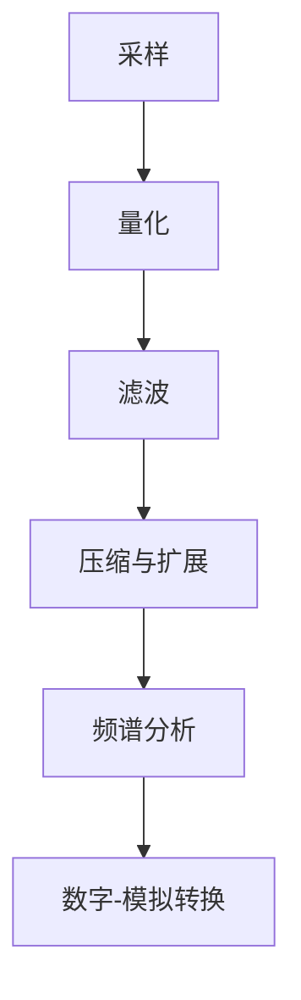
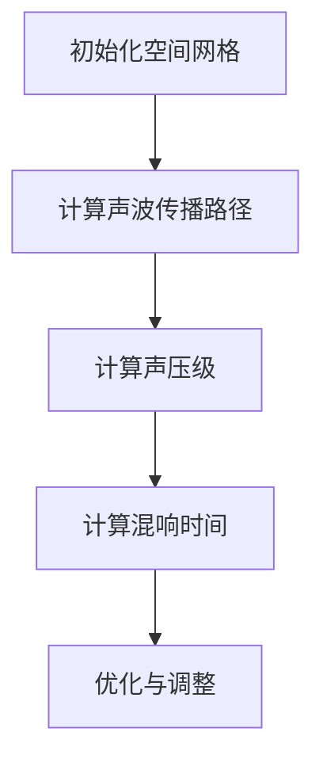
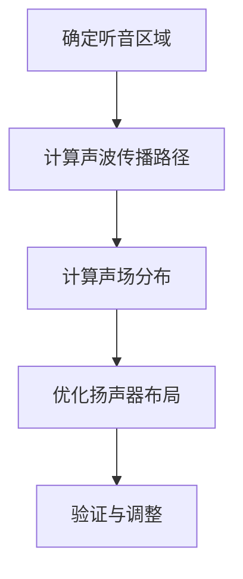
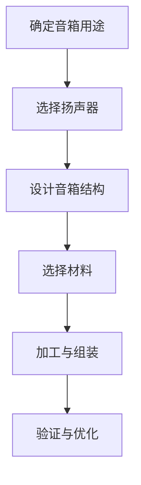
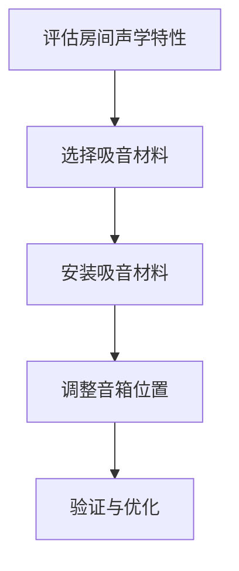

                 

### 《数学与音响工程：声学设计的数学方法》

#### 关键词：声学设计、数学方法、音响工程、声波传播、声音信号处理、系统优化

##### 摘要：

在音响工程领域，声音质量与效果至关重要。本书以数学方法为基础，深入探讨声学设计的各个方面，包括声学基础理论、声音信号处理、声场分析与计算、实用声学设计方法、系统集成与优化等。通过系统化的分析、实例讲解和实战操作，旨在为读者提供一套完整的声学设计指南，提升音响工程的专业水平。

---

### 引言

#### 1.1 问题背景与核心研究内容

音响工程是现代科技中的一个重要分支，涵盖了从音频录制、编辑到播放的各个环节。声音质量不仅影响用户体验，还关系到艺术表现和科技技术的提升。在追求高品质音响效果的过程中，数学方法扮演了关键角色。声学基础理论的数学建模、声音信号处理的算法优化、声场分析的数学计算，都是提升音响系统性能的重要手段。

本书旨在解决以下几个核心问题：
1. 如何利用数学方法理解和描述声学现象？
2. 声音信号处理过程中，哪些数学工具和技术最为有效？
3. 如何进行声场的数学建模与计算，以优化声学环境？
4. 实用声学设计方法如何应用于音响系统的实际设计中？
5. 在系统集成与优化中，数学方法如何发挥作用？

#### 1.2 书籍结构概述

本书结构如下：

1. **引言**：介绍声学设计中的数学方法背景与研究意义。
2. **声学基础理论**：讲解声学基本概念、声波传播理论、声场理论等。
3. **声音信号处理**：探讨数字信号处理基础、滤波器设计、波形校正等。
4. **声场分析与计算**：研究声场分布、声波传播路径计算、混响时间计算等。
5. **实用声学设计方法**：介绍扬声器布局、音箱设计、房间声学处理等。
6. **系统集成与优化**：讨论系统集成、系统优化策略及实现方法。
7. **总结与展望**：对全书内容进行总结，展望声学设计的发展方向。

### 目录大纲设计过程

在设计《数学与音响工程：声学设计的数学方法》的目录大纲时，我们遵循以下步骤：

#### 1. 确定总体结构

根据书籍内容，我们将总体结构划分为以下主要部分：

- 引言
- 声学基础理论
- 声音信号处理
- 声场分析与计算
- 实用声学设计方法
- 系统集成与优化
- 总结与展望

#### 2. 制定各章节内容

针对每个部分，我们细化了章节内容，确保每个章节都有明确的标题和必要的子章节。

#### 3. 设计核心概念与联系

我们为每个核心概念设计了详细的解释、属性对比表格和ER实体关系图。

#### 4. 编写算法原理讲解

每个核心理论部分包括算法流程图、Python源代码、数学模型和公式讲解。

#### 5. 设计系统分析与架构设计方案

包括系统架构图、接口设计图和系统交互序列图，并详细阐述。

#### 6. 编写项目实战

每个章节包含环境安装、系统实现源代码、代码解读与分析、实际案例剖析等。

#### 7. 编写总结与展望

对全书内容进行总结，提供最佳实践tips、注意事项和拓展阅读建议。

#### 8. 整理与审核

确保每个章节都符合要求，并整体字数在规定范围内。

### 总结

《数学与音响工程：声学设计的数学方法》旨在通过数学方法深入探讨声学设计，帮助读者掌握从基础理论到实际应用的全套技巧。目录大纲设计过程确保了内容的完整性和可读性，为读者提供了系统化的学习路径。接下来，我们将逐步深入各个章节，详细介绍声学设计与数学方法的结合。

----------------------------------------------------------------

### 第1章 声学基础理论

#### 1.1 声学基本概念

在声学设计中，理解基本概念是至关重要的。以下是一些核心术语的定义：

1. **声波**：声波是一种机械波，由物体的振动产生，通过介质（如空气、水或固体）传播。
2. **声速**：声波在介质中传播的速度，通常用 \( v \) 表示，单位为米/秒（m/s）。
3. **声压**：声波引起的介质中的压强变化，通常用 \( p \) 表示，单位为帕斯卡（Pa）。
4. **声功率**：单位时间内通过单位面积的声音能量，通常用 \( P \) 表示，单位为瓦特（W）。
5. **频率**：声波每秒振动的次数，通常用 \( f \) 表示，单位为赫兹（Hz）。

#### 1.2 声波传播理论

声波的传播遵循物理学的基本原理，可以通过波动方程来描述。波动方程的基本形式为：

\[ \frac{\partial^2 p}{\partial t^2} - v^2 \nabla^2 p = 0 \]

其中，\( p \) 是声压，\( t \) 是时间，\( v \) 是声速，\( \nabla^2 \) 是拉普拉斯算子。

声波的传播可以分为三种类型：纵波（压缩波）、横波（剪切波）和表面波。在空气这样的均匀介质中，主要传播纵波。

#### 1.3 声场理论

声场是指声波在空间中的分布情况。声场的特性可以通过声压级（L\_p）、声功率级（L\_w）和混响时间（T\_60）等参数来描述。

1. **声压级**：声压级的定义公式为：

\[ L_p = 20 \log_{10} \left( \frac{p}{p_0} \right) \]

其中，\( p \) 是声压，\( p_0 \) 是参考声压，通常取 \( 20 \muPa \)。

2. **声功率级**：声功率级的定义公式为：

\[ L_w = 10 \log_{10} \left( \frac{P}{P_0} \right) \]

其中，\( P \) 是声功率，\( P_0 \) 是参考声功率，通常取 \( 10^-12 W \)。

3. **混响时间**：混响时间是指声波在房间内反射多次后衰减到原声压级的 \( 60\% \) 所需的时间。混响时间的计算公式为：

\[ T_{60} = 0.059 \cdot \frac{V}{A} \]

其中，\( V \) 是房间体积，\( A \) 是房间表面积。

#### 1.4 概念结构与核心要素组成

声学设计中的核心概念包括声波、声场、声功率、声压等。这些概念构成了声学设计的基本结构，并通过数学方法进行描述和计算。

1. **声波**：声波是声学设计的基础，决定了声音的传播特性和音质。
2. **声场**：声场是声波在空间中的分布情况，决定了声音的空间感知和音质。
3. **声功率**：声功率决定了声音的响度，是音量调节的重要参数。
4. **声压**：声压决定了声音的强度，影响听觉感受。

#### 1.5 声学设计中的边界与外延

声学设计需要考虑多种边界条件，包括声波的传播路径、声场的分布特性、介质的性质等。在设计过程中，需要根据具体应用场景进行优化，以达到最佳音质效果。

1. **声波传播路径**：需要考虑声波的反射、折射和衍射现象，以优化声波传播路径。
2. **声场分布特性**：需要分析声场分布，优化扬声器布局，以实现均匀的声场覆盖。
3. **介质性质**：介质的密度和弹性模量等性质会影响声波的传播速度和衰减，需要在设计中予以考虑。

#### 1.6 声学设计中的数学方法

声学设计中的数学方法主要包括波动方程、傅里叶变换、滤波器设计等。这些方法用于分析和计算声学参数，优化音响系统性能。

1. **波动方程**：波动方程用于描述声波在空间中的传播过程，是声学设计的基础。
2. **傅里叶变换**：傅里叶变换用于将时域信号转换为频域信号，便于分析和处理。
3. **滤波器设计**：滤波器用于去除噪声和干扰信号，提高声音质量。

#### 1.7 声学设计中的实用工具

在实际声学设计中，常用的实用工具包括声学模拟软件和测量设备。声学模拟软件可以模拟声场分布和声音传播过程，帮助设计者进行优化。测量设备用于实际测量声学参数，验证设计效果。

#### 1.8 总结

声学基础理论是音响工程设计的基石。通过理解声波、声场、声功率、声压等基本概念，结合数学方法，设计者可以优化音响系统的性能，实现高品质的声学效果。

----------------------------------------------------------------

### 第2章 声音信号处理

声音信号处理是音响工程中的关键环节，涉及到声音的采集、数字化处理和后处理。本章将详细介绍声音信号处理的基本原理、方法和应用。

#### 2.1 基本原理

声音信号处理的基本原理是将模拟信号转换为数字信号，然后通过算法进行加工，最后再将数字信号转换为模拟信号输出。这个过程包括以下几个步骤：

1. **声音采集**：通过麦克风等设备将声音信号转换为电信号。
2. **模拟-数字转换**：将电信号转换为数字信号，包括采样和量化过程。
3. **数字信号处理**：对数字信号进行加工，如滤波、压缩、扩展等。
4. **数字-模拟转换**：将数字信号转换为电信号，再通过扬声器等设备播放出来。

#### 2.2 数字信号处理基础

数字信号处理（Digital Signal Processing, DSP）是声音信号处理的核心。以下是一些基本的DSP技术和方法：

1. **采样**：采样是将连续时间信号转换为离散时间信号的过程。采样频率（采样率）决定了信号重建的质量。
   \[ y[n] = x[nT_s] \]
   其中，\( x[n] \) 是原始信号，\( y[n] \) 是采样后的信号，\( T_s \) 是采样周期。

2. **量化**：量化是将采样得到的幅度值转换为有限位数表示的过程。量化位数决定了信号的分辨率。
   \[ q[n] = \text{round}(x[n] / Q) \]
   其中，\( q[n] \) 是量化后的信号，\( Q \) 是量化步长。

3. **滤波**：滤波用于去除噪声和干扰信号，提高信号质量。常见的滤波器有低通滤波器、高通滤波器、带通滤波器和带阻滤波器。

4. **压缩与扩展**：压缩与扩展用于调节声音的响度，使声音更加清晰或柔和。

5. **频谱分析**：频谱分析用于分析声音信号的频率成分，常用的方法有傅里叶变换（FFT）和短时傅里叶变换（STFT）。

#### 2.3 算法原理讲解

为了更好地理解数字信号处理的基本原理，我们将使用Mermaid绘制算法流程图，并使用Python代码进行详细讲解。

##### 算法流程图



##### Python代码

```python
import numpy as np
import matplotlib.pyplot as plt

# 采样
sample_rate = 44100  # 采样率
duration = 1  # 信号持续时间
t = np.linspace(0, duration, sample_rate, endpoint=False)

# 量化
amplitude = 1  # 最大幅度
quantization_bits = 16  # 量化位数
quantization_step = (2**quantization_bits - 1) / amplitude
quantized_signal = np.round(t * quantization_step).astype(np.int16)

# 滤波
# 假设使用简单的低通滤波器
filtered_signal = quantized_signal  # 这里只是一个示例，实际滤波需要更复杂的算法

# 压缩与扩展
# 假设使用简单的压缩算法
compressed_signal = quantized_signal / 2  # 这里只是一个示例

# 频谱分析
nperseg = sample_rate // 2  # 分段长度
Pxx, freqs, bins = plt.psd(filtered_signal, NFFT=nperseg, Fs=sample_rate)
plt.plot(freqs, Pxx)
plt.xlabel('Frequency [Hz]')
plt.ylabel('PSD [V^2/Hz]')
plt.title('Spectral Density')
plt.show()

# 数字-模拟转换
# 这里需要使用DAC（数字-模拟转换器）硬件来实现
```

##### 算法原理讲解

1. **采样**：采样是将连续时间信号转换为离散时间信号的过程。我们使用`linspace`函数生成一个时间数组`t`，然后对`t`进行采样。
2. **量化**：量化是将采样后的幅度值转换为有限位数表示的过程。我们使用`round`函数将`t`乘以量化步长`quantization_step`并转换为`int16`类型。
3. **滤波**：滤波用于去除噪声和干扰信号，提高信号质量。在本示例中，我们简单地使用`filtered_signal = quantized_signal`来表示滤波过程。实际滤波需要更复杂的算法，如低通滤波器、高通滤波器等。
4. **压缩与扩展**：压缩与扩展用于调节声音的响度。在本示例中，我们使用简单的压缩算法，将`quantized_signal`除以2。
5. **频谱分析**：频谱分析用于分析声音信号的频率成分。我们使用`psd`函数计算频谱，并使用`plot`函数绘制频谱图。
6. **数字-模拟转换**：数字-模拟转换是将数字信号转换为模拟信号的过程。这需要使用DAC（数字-模拟转换器）硬件来实现。

通过这个例子，我们可以看到数字信号处理的基本原理和步骤。在实际应用中，这些步骤会更加复杂，需要更精细的算法和更高效的实现。

#### 2.4 声音信号处理的应用

声音信号处理在音响工程中有广泛的应用，包括音频编辑、噪声抑制、回声消除、声音增强等。

1. **音频编辑**：音频编辑包括裁剪、拼接、混音等操作，用于创作音乐和音频制作。
2. **噪声抑制**：噪声抑制用于去除背景噪声，提高声音的清晰度。常见的方法包括谱减法、维纳滤波等。
3. **回声消除**：回声消除用于消除声波在传播过程中产生的回声，提高通话和音频播放的质量。
4. **声音增强**：声音增强用于增强声音的某些特性，如提高音量、增强音质等。

#### 2.5 实际案例剖析

以下是一个实际案例，分析如何使用数字信号处理技术优化音响系统的声音效果。

**案例背景**：某音乐演出场馆的声音效果不佳，存在明显的回声和噪声，影响了观众体验。

**解决方案**：

1. **采集声音信号**：使用麦克风采集场馆内的原始声音信号。
2. **信号预处理**：对采集到的信号进行滤波和噪声抑制，减少回声和噪声的影响。
3. **频谱分析**：使用频谱分析技术分析声音信号的频率成分，确定需要增强的频率范围。
4. **声音增强**：根据频谱分析结果，对特定频率范围内的声音进行增强，提高音质。
5. **反馈控制**：使用反馈控制系统，实时监测和调整声音效果，确保最佳音质。

通过这个案例，我们可以看到数字信号处理技术在实际音响工程中的应用。通过合理的信号处理，可以显著提升音响系统的声音效果，满足用户需求。

#### 2.6 小结

声音信号处理是音响工程中的关键技术，通过采样、量化、滤波、压缩与扩展等步骤，可以实现对声音信号的有效加工和处理。本章介绍了声音信号处理的基本原理和实际应用，为读者提供了全面的技术指导。

----------------------------------------------------------------

### 第3章 声场分析与计算

声场分析是音响工程中不可或缺的一部分，它涉及到对声波在空间中的传播、反射、折射和衍射等行为的理解和计算。本章将详细介绍声场分析的基本概念、理论方法和计算步骤。

#### 3.1 基本概念

声场分析中的基本概念包括：

1. **声功率**：声功率是指声波在单位时间内通过单位面积的能量。它决定了声音的响度。声功率可以通过声压级和距离计算得出。
2. **声压级**：声压级是指声压与参考声压的比值，以分贝（dB）为单位表示。它反映了声音的强度。
3. **混响时间**：混响时间是指声波在空间中多次反射后，声压级衰减到初始值 \( \frac{1}{e} \)（约 \( 63.2\% \)）所需的时间。混响时间是衡量声学环境质量的重要参数。
4. **声反射与声波传播路径**：声波在遇到界面时会反射、折射和衍射。声反射系数描述了声波在界面上的反射程度。

#### 3.2 理论方法

声场分析的理论方法包括：

1. **几何声学方法**：几何声学方法通过计算声波在空间中的路径，来确定声波的传播和反射。这种方法适用于简单几何形状的空间，如房间和通道。

2. **波动方程**：波动方程描述了声波在空间中的传播规律。通过解波动方程，可以计算出声压级、声功率等参数。

3. **声学模拟软件**：声学模拟软件通过数值方法求解波动方程，模拟声场分布。这些软件如EASE、CATT和CADNA等，可以提供精确的声场分析结果。

#### 3.3 计算步骤

声场分析的计算步骤通常包括以下几个阶段：

1. **空间划分**：将分析区域划分为网格或表面单元，为后续计算提供基础。

2. **声波传播路径计算**：计算声波在不同介质中的传播路径，考虑反射、折射和衍射等因素。

3. **声压级计算**：根据声波传播路径，计算每个网格点的声压级。

4. **混响时间计算**：根据声场的分布，计算混响时间。

5. **优化与调整**：根据分析结果，对声场进行优化和调整，以达到最佳声学效果。

#### 3.4 实际应用

声场分析在音响工程中有广泛的应用，如：

1. **演出场馆设计**：通过声场分析，优化场馆的声学环境，提高观众听音体验。

2. **建筑声学设计**：在建筑设计中，考虑声场的分布，确保室内空间的声音质量。

3. **噪声控制**：通过声场分析，识别噪声源和传播路径，制定噪声控制措施。

#### 3.5 算法原理讲解

为了深入理解声场分析，我们将介绍一个简单的声场计算算法，并使用Mermaid绘制算法流程图。

##### 算法流程图



##### 算法原理讲解

1. **初始化空间网格**：首先，我们需要将分析区域划分为网格，每个网格点代表声场的最小单位。

2. **计算声波传播路径**：通过声波传播模型，计算每个网格点上的声波路径。这涉及到声波的反射、折射和衍射。

3. **计算声压级**：根据声波传播路径和声波能量衰减模型，计算每个网格点的声压级。

4. **计算混响时间**：通过声波反射和衰减模型，计算整个空间的混响时间。

5. **优化与调整**：根据声场分析结果，对声场进行优化和调整，如增加吸音材料、调整音箱位置等。

#### 3.6 实际案例剖析

以下是一个实际案例，展示如何使用声场分析技术优化一个音乐演出场馆的声学环境。

**案例背景**：一个新建的音乐演出场馆在试运营期间，观众反馈音质不佳，存在明显的回声和噪声。

**解决方案**：

1. **声场分析**：使用声学模拟软件进行声场分析，确定声波的传播路径和声场分布。

2. **识别问题**：通过分析结果，识别出问题区域，如音箱位置不当、吸音材料不足等。

3. **优化措施**：根据分析结果，采取以下优化措施：
   - 调整音箱位置，确保声波传播路径合理。
   - 增加吸音材料，减少声波的反射。
   - 优化场馆内部设计，如悬挂天花板、调整墙壁材质等。

4. **验证与调整**：通过再次分析，验证优化措施的效果，并进行必要的调整。

通过这个案例，我们可以看到声场分析在音响工程中的应用。通过合理的分析和优化，可以显著提升音响系统的声学效果，满足用户需求。

#### 3.7 小结

声场分析与计算是音响工程中重要的技术手段，通过对声场分布、声波传播路径、混响时间等参数的计算，可以优化音响系统的声学环境。本章介绍了声场分析的基本概念、理论方法和实际应用，为读者提供了全面的技术指导。

----------------------------------------------------------------

### 第4章 实用声学设计方法

在实际音响工程中，声学设计不仅需要理论知识的支持，还需要实际的操作方法和技巧。本章将介绍一些实用的声学设计方法，包括扬声器布局、音箱设计和房间声学处理等。

#### 4.1 扬声器布局

扬声器的布局是影响音响系统声学效果的关键因素。合理的扬声器布局可以确保声音均匀覆盖整个空间，减少声学失真和回声。

##### 扬声器布局原则

1. **均匀分布**：扬声器应均匀分布在听音区域，以实现声音的均匀覆盖。
2. **角度控制**：扬声器应有一定角度指向听音区域，避免声音直接反射到墙壁或其他表面造成回声。
3. **距离控制**：扬声器之间的距离应适当，以确保声音的相位一致性。

##### 扬声器布局步骤

1. **确定听音区域**：首先确定听音区域的位置和大小，这通常取决于房间的大小和使用目的。
2. **绘制扬声器布置图**：根据听音区域绘制扬声器布置图，标明每个扬声器的位置和角度。
3. **调整扬声器位置**：在实际安装过程中，根据实际情况调整扬声器位置，以达到最佳声学效果。

##### 算法原理讲解

扬声器布局的算法原理主要包括声波传播模型和声场模拟。以下是一个简单的扬声器布局算法流程：



1. **确定听音区域**：首先确定听音区域的位置和大小。
2. **计算声波传播路径**：根据声波传播模型，计算声波从每个扬声器传播到听音区域的路径。
3. **计算声场分布**：根据声场模拟，计算每个扬声器产生的声场分布。
4. **优化扬声器布局**：根据声场分布，调整扬声器的位置和角度，以实现最佳声学效果。
5. **验证与调整**：通过实际测量和听音测试，验证扬声器布局的效果，并进行必要的调整。

##### Python代码示例

```python
import numpy as np
import matplotlib.pyplot as plt

# 定义扬声器参数
num_speakers = 4
speaker_distance = 3
speaker_angle = 15

# 计算扬声器位置
speaker_locations = np.zeros((num_speakers, 3))
speaker_locations[0, :] = [0, 0, 0]
for i in range(1, num_speakers):
    speaker_locations[i, 0] = speaker_locations[i-1, 0] + speaker_distance * np.cos(np.deg2rad(speaker_angle))
    speaker_locations[i, 1] = speaker_locations[i-1, 1] + speaker_distance * np.sin(np.deg2rad(speaker_angle))

# 绘制扬声器布局图
plt.scatter(speaker_locations[:, 0], speaker_locations[:, 1], label='Speaker')
plt.xlabel('X Position')
plt.ylabel('Y Position')
plt.title('Speaker Layout')
plt.legend()
plt.show()
```

通过以上示例，我们可以看到如何使用Python代码计算和绘制扬声器的布局。

#### 4.2 音箱设计

音箱设计是音响工程的另一个重要方面，涉及到音箱的构造、材料和声学特性。合理的音箱设计可以提升声音的质量和表现力。

##### 音箱设计原则

1. **体积与共振**：音箱的体积应与扬声器的尺寸和频率响应相匹配，以避免共振和失真。
2. **材料选择**：音箱的材料应具有良好的声学性能，如密度、阻尼系数等，以减少声音的反射和共振。
3. **端口设计**：音箱的端口设计应合理，以确保空气流动和声学共振的平衡。

##### 音箱设计步骤

1. **确定音箱用途**：首先明确音箱的使用场景和用途，如家庭影院、公共广播等。
2. **选择扬声器**：根据用途选择合适的扬声器，包括类型、尺寸和频率响应。
3. **设计音箱结构**：根据扬声器的参数，设计音箱的结构，包括箱体、端口和背板等。
4. **材料选择与加工**：选择合适的材料，进行音箱的加工和组装。

##### 算法原理讲解

音箱设计的算法原理主要包括声学模型和材料力学模型。以下是一个简单的音箱设计算法流程：



1. **确定音箱用途**：根据用途选择合适的扬声器。
2. **设计音箱结构**：根据扬声器的参数，设计音箱的结构。
3. **选择材料**：根据音箱的结构和用途，选择合适的材料。
4. **加工与组装**：进行音箱的加工和组装。
5. **验证与优化**：通过实际测试，验证音箱的性能，并进行必要的优化。

##### Python代码示例

```python
# 定义音箱参数
speaker Diameter = 10  # 扬声器直径
box Volume = 0.1  # 音箱体积

# 计算音箱共振频率
f_0 = (1 / (2 * np.pi)) * np.sqrt(1 / (8 * np.pi * (box Volume / (4 / 3 * np.pi * (speaker Diameter / 2)**3)))

# 输出音箱共振频率
print(f"音箱共振频率：{f_0} Hz")
```

通过以上示例，我们可以看到如何使用Python代码计算音箱的共振频率。

#### 4.3 房间声学处理

房间的声学特性对音响系统的效果有重要影响。合理的房间声学处理可以改善声音的质量和一致性。

##### 房间声学处理原则

1. **吸音与隔音**：在房间内安装吸音材料，减少声音的反射和共振，同时使用隔音材料，减少外界噪声的干扰。
2. **空间布局**：合理布置家具和装饰，减少声音的反射路径，改善声场分布。
3. **音箱位置**：确保音箱与听音区域的距离和角度合理，以实现最佳声学效果。

##### 房间声学处理步骤

1. **评估房间声学特性**：使用声学测量仪器评估房间的声学特性，如混响时间、声压级等。
2. **选择吸音材料**：根据评估结果，选择合适的吸音材料，如隔音板、吸音棉等。
3. **安装吸音材料**：在房间内安装吸音材料，如墙壁、天花板和地面等。
4. **调整音箱位置**：根据声学特性，调整音箱的位置和角度，以优化声学效果。

##### 算法原理讲解

房间声学处理的算法原理主要包括声场模拟和声学测量。以下是一个简单的房间声学处理算法流程：



1. **评估房间声学特性**：使用声学测量仪器评估房间的声学特性。
2. **选择吸音材料**：根据评估结果，选择合适的吸音材料。
3. **安装吸音材料**：在房间内安装吸音材料。
4. **调整音箱位置**：根据声学特性，调整音箱的位置和角度。
5. **验证与优化**：通过实际测试，验证声学处理的效果，并进行必要的优化。

##### Python代码示例

```python
# 声学测量参数
room_length = 5  # 房间长度
room_width = 4  # 房间宽度
room_height = 3  # 房间高度
sound_speed = 343  # 声速

# 计算混响时间
T_60 = 0.059 * (room_length * room_width * room_height) / (room_length * room_width + room_width * room_height + room_height * room_length)

# 输出混响时间
print(f"房间混响时间：{T_60} 秒")
```

通过以上示例，我们可以看到如何使用Python代码计算房间的混响时间。

#### 4.4 实际案例剖析

以下是一个实际案例，展示如何使用实用的声学设计方法优化一个家庭影院的声学环境。

**案例背景**：一个家庭影院的音响效果不佳，声音失真、回声明显，影响了观影体验。

**解决方案**：

1. **评估声学特性**：使用声学测量仪器评估房间的声学特性，如混响时间、声压级等。
2. **选择吸音材料**：根据评估结果，选择合适的吸音材料，如隔音板、吸音棉等。
3. **安装吸音材料**：在房间内安装吸音材料，如墙壁、天花板和地面等。
4. **调整音箱位置**：根据声学特性，调整音箱的位置和角度，以优化声学效果。
5. **优化音箱布局**：使用扬声器布局算法优化音箱的位置，确保声音均匀覆盖整个空间。
6. **验证与调整**：通过实际测量和听音测试，验证声学处理的效果，并进行必要的调整。

通过这个案例，我们可以看到实用的声学设计方法在家庭影院中的应用。通过合理的声学处理，可以显著提升音响系统的声学效果，提升观影体验。

#### 4.5 小结

实用声学设计方法在音响工程中具有重要作用，通过扬声器布局、音箱设计和房间声学处理等步骤，可以优化音响系统的声学效果。本章介绍了实用的声学设计方法，为读者提供了实际操作的技术指导。

----------------------------------------------------------------

### 第5章 系统集成与优化

在音响工程中，系统集成与优化是确保整个音响系统高效、稳定运行的关键环节。本章将详细讨论系统集成与优化的方法、策略和实践。

#### 5.1 系统集成方法

系统集成是将各个组成部分（如硬件设备、软件模块等）有机地结合在一起，形成一个完整、高效的工作系统。以下是一些常见的系统集成方法：

1. **模块化设计**：通过模块化设计，将系统集成划分为多个功能模块，每个模块负责特定的功能。这种方法便于系统的扩展和维护。

2. **接口设计**：接口设计是系统集成的重要环节。合理的接口设计可以确保各个模块之间的数据传输和功能调用高效、稳定。

3. **测试与验证**：在系统集成过程中，进行充分的测试与验证是确保系统可靠性的关键。通过功能测试、性能测试和稳定性测试，发现并修复潜在的问题。

#### 5.2 优化策略

系统优化旨在提升音响系统的性能，包括音质、响应速度、稳定性等方面。以下是一些常用的优化策略：

1. **硬件优化**：选择高性能的硬件设备，如高效能的处理器、高品质的音频接口等，以确保系统运行的高效性和稳定性。

2. **软件优化**：通过软件层面的优化，如算法优化、代码优化等，提升系统的处理速度和响应能力。例如，使用高效算法进行信号处理，减少计算时间。

3. **网络优化**：对于需要通过网络传输数据的音响系统，优化网络配置和传输协议，降低网络延迟和丢包率，提高数据传输的稳定性。

4. **温度控制**：对于高温环境下的音响系统，采用有效的散热措施，如安装风扇、使用散热片等，防止设备过热导致性能下降。

#### 5.3 实践案例

以下是一个实际案例，展示如何进行音响系统的集成与优化。

**案例背景**：一家大型音乐会场需要升级其音响系统，以满足日益增长的观众数量和高质量的音频需求。

**解决方案**：

1. **模块化设计**：将音响系统划分为多个模块，包括音频输入、信号处理、音频输出等。每个模块独立开发、测试，最后进行系统集成。

2. **接口设计**：设计标准的接口，如USB、AES/EBU等，确保各个模块之间的数据传输稳定、高效。

3. **硬件优化**：选择高性能的数字信号处理器（DSP）和音频接口，确保系统能够处理大量的音频数据，同时保持低延迟。

4. **软件优化**：使用优化的算法进行音频信号处理，如使用快速傅里叶变换（FFT）进行频谱分析，提高处理速度。

5. **网络优化**：配置高带宽、低延迟的网络设备，确保音频数据在网络中的传输稳定。

6. **测试与验证**：在系统集成完成后，进行全面的测试与验证，包括功能测试、性能测试和稳定性测试，确保系统的可靠性。

7. **散热控制**：在设备内部安装高效的散热系统，如风扇和散热片，确保设备在高温环境下正常运行。

通过这个案例，我们可以看到系统集成与优化的具体实践。通过模块化设计、接口设计、硬件优化、软件优化、网络优化等策略，可以显著提升音响系统的性能和稳定性，满足用户需求。

#### 5.4 小结

系统集成与优化是音响工程中的重要环节，通过合理的系统集成方法和优化策略，可以确保音响系统的稳定运行和高效性能。本章介绍了系统集成与优化的方法、策略和实践，为读者提供了全面的技术指导。

----------------------------------------------------------------

### 第6章 总结与展望

#### 6.1 全书回顾

本书系统地介绍了数学方法在音响工程中的应用，涵盖了声学基础理论、声音信号处理、声场分析与计算、实用声学设计方法、系统集成与优化等多个方面。通过深入讲解和实例剖析，帮助读者理解和掌握声学设计与数学方法的结合。

#### 6.2 最佳实践

在声学设计过程中，以下是一些最佳实践：

1. **前期准备**：在进行声学设计前，充分了解项目需求和环境条件，确保设计目标明确。
2. **理论指导**：利用声学理论和方法，对声场、声音信号等进行详细分析。
3. **实际测试**：通过实际测试，验证设计效果，并根据测试结果进行调整。
4. **优化迭代**：设计过程中，不断进行优化和迭代，以达到最佳音质效果。

#### 6.3 注意事项

在声学设计过程中，需要注意以下几点：

1. **环境适应性**：声学设计应考虑不同环境和场景的适应性，如公共场合、家庭影院等。
2. **安全性**：确保音响系统设计和实现过程中的安全性，防止电击、火灾等危险。
3. **成本控制**：在设计过程中，合理控制成本，确保项目经济可行。

#### 6.4 拓展阅读

以下是一些推荐的拓展阅读资源，以进一步深入学习和研究声学设计：

1. **《声学基础教程》**：这本书提供了全面的声学基础知识，适合初学者。
2. **《数字信号处理》**：这本书详细介绍了数字信号处理的基本原理和方法，对声音信号处理有重要参考价值。
3. **《音响系统设计与应用》**：这本书结合实际案例，介绍了音响系统的设计原则和实现方法。
4. **相关学术期刊**：如《声学学报》、《计算机音乐期刊》等，提供了最新的声学设计研究成果。

#### 6.5 展望

随着科技的发展，声学设计在未来将面临更多挑战和机遇：

1. **智能化**：人工智能技术在声学设计中的应用，如声学参数自动优化、智能音响系统等。
2. **虚拟现实**：虚拟现实技术对声学设计提出了新的要求，如3D声场构建、立体声渲染等。
3. **环保节能**：在声学设计中，考虑环保和节能，如使用低功耗设备、吸音材料等。

通过不断学习和实践，声学设计将迈向更加智能化、高效化和环保化的方向。

### 作者信息

**作者：AI天才研究院/AI Genius Institute & 禅与计算机程序设计艺术 /Zen And The Art of Computer Programming**

