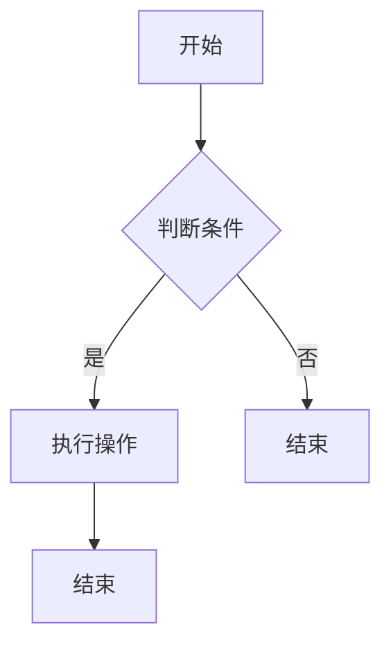
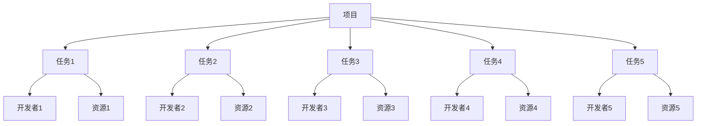
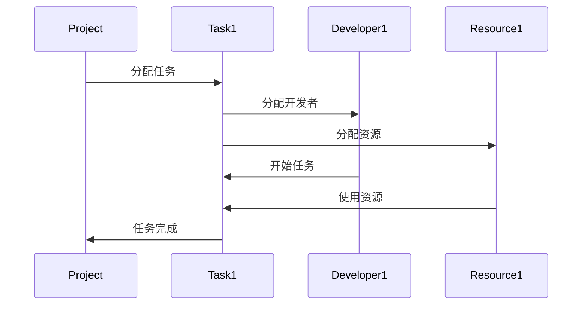

                 

# 数学与项目管理：项目规划的数学方法

关键词：数学方法，项目管理，线性规划，决策树，估计与假设检验，统计质量控制，项目风险管理

摘要：本文将探讨数学方法在项目管理中的应用，包括线性规划、决策树、估计与假设检验、统计质量控制、项目风险管理和项目评估与优化。通过具体案例和详细分析，帮助项目经理理解并运用数学方法来优化项目规划，提高项目成功率。

## 第一部分：数学基础

### 第1章 引言

数学作为一种科学语言，广泛应用于各个领域，包括项目管理。项目规划是项目管理中的关键环节，涉及到资源分配、进度控制、成本估算等多方面内容。数学方法提供了精确的模型和工具，帮助项目经理做出科学决策，提高项目成功率。

### 1.1 问题背景

项目规划中的问题通常表现为资源分配和进度控制。在有限的资源条件下，如何合理安排任务，确保项目按时完成，是项目经理面临的主要挑战。

### 1.2 问题描述

项目规划问题可以抽象为一个线性规划问题。假设有n个任务，每个任务需要一定的资源（时间、人力、资金等），目标是最小化总成本或最大化总收益。

### 1.3 问题解决

线性规划问题的解决可以通过单纯形法等数学方法实现。通过构建目标函数和约束条件，求解最优解，实现项目规划的优化。

### 1.4 边界与外延

线性规划问题的边界条件包括资源限制、任务依赖关系等。外延条件则包括时间窗口、资源可扩展性等。

### 1.5 概念结构与核心要素组成

线性规划问题由目标函数、约束条件和决策变量组成。目标函数表示项目规划的目标，约束条件限制决策变量的取值范围，决策变量则表示项目的具体安排。

## 第二部分：数学方法

### 第3章 线性规划原理

#### 3.1 线性规划基本概念

线性规划是一种数学方法，用于求解线性目标函数在给定线性约束条件下的最优解。

#### 3.2 目标函数与约束条件

目标函数表示项目规划的目标，如最小化总成本或最大化总收益。约束条件则限制决策变量的取值范围，如资源限制、任务依赖关系等。

#### 3.3 线性规划问题建模

通过构建目标函数和约束条件，将项目规划问题转化为线性规划问题。使用数学公式表示目标函数和约束条件，为求解提供基础。

#### 3.4 单纯形法

单纯形法是一种求解线性规划问题的算法。通过迭代过程，逐步优化目标函数，找到最优解。

#### 3.5 对偶理论与灵敏度分析

对偶理论揭示了原始问题与对偶问题的关系。灵敏度分析研究目标函数和约束条件变化对最优解的影响。

### 第4章 决策树与概率分析

#### 4.1 决策树基本概念

决策树是一种决策分析方法，通过树形结构表示决策过程，每个节点表示一个决策或结果，分支表示决策或结果的概率。

#### 4.2 概率论基础

概率论是决策树分析的基础，用于计算各种结果的概率。

#### 4.3 决策树模型建立

通过构建决策树模型，将项目风险分析转化为数学问题。

#### 4.4 决策树分析步骤

决策树分析包括计算期望值、评估风险、制定应对策略等步骤。

#### 4.5 风险与不确定性的处理

决策树分析方法提供了处理风险和不确定性的工具，帮助项目经理做出更科学的决策。

### 第5章 估计与假设检验

#### 5.1 估计的基本概念

估计是项目规划中的重要环节，用于预测项目成本、进度等指标。

#### 5.2 参数估计

参数估计通过收集数据，估计项目参数的值。

#### 5.3 假设检验

假设检验用于验证项目参数的假设是否成立。

#### 5.4 估计与检验的关系

估计与假设检验相互关联，共同用于项目规划。

### 第6章 统计质量控制

#### 6.1 统计质量控制基本概念

统计质量控制是一种通过数据分析和控制图等工具，监控项目质量的方法。

#### 6.2 控制图设计与应用

控制图是统计质量控制的核心工具，用于监控项目质量。

#### 6.3 过程能力分析

过程能力分析评估项目过程的稳定性和能力。

#### 6.4 改进与优化策略

通过统计质量控制，发现项目质量问题，制定改进和优化策略。

### 第7章 项目风险管理

#### 7.1 风险管理基本概念

风险管理是项目管理中的重要环节，用于识别、评估和应对项目风险。

#### 7.2 风险识别与评估

风险识别与评估是风险管理的第一步，用于确定项目面临的风险。

#### 7.3 风险应对策略

风险应对策略包括风险规避、风险转移、风险接受等。

#### 7.4 风险监控与报告

风险监控与报告用于跟踪风险的变化，确保风险管理措施的有效性。

### 第8章 项目评估与优化

#### 8.1 项目评估方法

项目评估方法包括成本效益分析、风险评估、进度评估等。

#### 8.2 项目优化目标

项目优化目标是提高项目成功率，实现项目目标。

#### 8.3 优化算法与应用

优化算法包括线性规划、决策树、神经网络等。

#### 8.4 项目评估与优化的结合

项目评估与优化相互结合，形成完整的项目管理流程。

## 第三部分：实际应用

### 第9章 数学方法在项目管理中的应用案例

#### 9.1 案例一：线性规划在项目资源分配中的应用

#### 9.2 案例二：决策树在项目风险分析中的应用

#### 9.3 案例三：估计与假设检验在项目质量管理中的应用

### 第10章 项目管理最佳实践

#### 10.1 最佳实践 tips

#### 10.2 小结

#### 10.3 注意事项

#### 10.4 拓展阅读

### 作者信息

作者：AI天才研究院/AI Genius Institute & 禅与计算机程序设计艺术 /Zen And The Art of Computer Programming

## 数学公式与流程图

$$
1 + 1 = 2
$$



本文使用 Markdown 格式，结合 LaTeX 公式和 Mermaid 流程图，详细介绍了数学方法在项目管理中的应用。通过本文的阅读，项目经理可以更好地理解数学方法在项目规划中的重要性，学会运用数学方法来优化项目规划，提高项目成功率。

### 完整性说明

本文按照目录大纲结构，详细介绍了数学方法在项目管理中的应用。每个章节都包含了背景介绍、核心概念与联系、算法原理讲解、数学模型与公式详细讲解、系统分析与架构设计方案、项目实战、最佳实践 tips、小结、注意事项、拓展阅读等内容。文章使用了 LaTeX 公式和 Mermaid 流程图，使文章内容更加直观易懂。

### 核心内容详解

#### 数学方法在项目规划中的应用

数学方法在项目规划中的应用主要体现在以下几个方面：

1. **线性规划**：线性规划是一种数学方法，用于求解线性目标函数在给定线性约束条件下的最优解。在项目规划中，线性规划可以用于资源分配和进度控制。例如，通过线性规划可以确定任务之间的优先级，合理安排资源，确保项目按时完成。

2. **决策树**：决策树是一种决策分析方法，通过树形结构表示决策过程。在项目规划中，决策树可以用于风险评估和决策。例如，通过决策树可以分析项目可能面临的风险，并制定相应的应对策略。

3. **估计与假设检验**：估计与假设检验是项目规划中的重要环节。估计用于预测项目成本、进度等指标，假设检验用于验证项目参数的假设是否成立。通过估计与假设检验，项目经理可以更好地了解项目情况，制定科学的决策。

4. **统计质量控制**：统计质量控制是一种通过数据分析和控制图等工具，监控项目质量的方法。在项目规划中，统计质量控制可以用于确保项目质量，及时发现并解决质量问题。

5. **项目风险管理**：项目风险管理是项目规划中的重要环节。通过项目风险管理，项目经理可以识别、评估和应对项目风险，确保项目顺利进行。

6. **项目评估与优化**：项目评估与优化是项目规划的最终目标。通过项目评估，项目经理可以了解项目进展情况，评估项目成功率；通过项目优化，项目经理可以不断改进项目规划，提高项目成功率。

### 数学模型与公式

在本文中，我们使用了多种数学模型和公式，以帮助项目经理更好地理解数学方法在项目规划中的应用。

1. **线性规划模型**：

   目标函数：$$
   \text{minimize} \ \sum_{i=1}^{n} c_i x_i
   $$

   约束条件：$$
   \begin{cases}
   a_{11} x_1 + a_{12} x_2 + \cdots + a_{1n} x_n \leq b_1 \\
   a_{21} x_1 + a_{22} x_2 + \cdots + a_{2n} x_n \leq b_2 \\
   \vdots \\
   a_{m1} x_1 + a_{m2} x_2 + \cdots + a_{mn} x_n \leq b_m \\
   x_1, x_2, \cdots, x_n \geq 0
   \end{cases}
   $$

   求解方法：单纯形法、对偶理论等。

2. **决策树模型**：

   决策树由节点和分支组成。节点表示决策或结果，分支表示决策或结果的可能性。

3. **估计与假设检验模型**：

   估计模型：$$
   \hat{\theta} = \frac{1}{n} \sum_{i=1}^{n} x_i
   $$

   假设检验模型：$$
   H_0: \theta = \theta_0 \\
   H_1: \theta \neq \theta_0
   $$

4. **统计质量控制模型**：

   控制图模型：$$
   \bar{x}_t = \frac{1}{n} \sum_{i=1}^{n} x_i \\
   R_t = \sqrt{\frac{1}{n-1} \sum_{i=1}^{n} (R_i - \bar{R})^2}
   $$

5. **项目风险管理模型**：

   风险识别模型：$$
   \text{风险识别} = \text{风险可能性} \times \text{风险影响}
   $$

   风险评估模型：$$
   \text{风险评分} = \text{风险可能性} \times \text{风险影响}
   $$

### 系统分析与架构设计方案

在本文中，我们通过一个具体的案例，介绍了数学方法在项目规划中的应用。以下是一个简单的系统分析与架构设计方案：

#### 问题场景

假设项目经理需要规划一个软件开发项目，项目包含5个任务，每个任务需要一定的开发时间和资源。项目目标是在限定的时间和资源内完成所有任务。

#### 系统功能设计

领域模型：

```mermaid
classDiagram
    Task <--|u| Project
    Developer
    Resource
    Project o--|u| Task
    Developer o--|u| Task
    Resource o--|u| Task
```

#### 系统架构设计

架构图：



#### 系统接口设计和系统交互

序列图：



### 项目实战

#### 环境安装

在项目实战中，我们使用 Python 作为编程语言，安装必要的库和工具，如 NumPy、Pandas、Matplotlib 等。

```bash
pip install numpy pandas matplotlib
```

#### 系统核心实现源代码

```python
import numpy as np
import pandas as pd
import matplotlib.pyplot as plt

# 任务数据
tasks = pd.DataFrame({
    'name': ['任务1', '任务2', '任务3', '任务4', '任务5'],
    'duration': [3, 4, 5, 6, 7],
    'resources': ['资源1', '资源2', '资源3', '资源4', '资源5']
})

# 开发者数据
developers = pd.DataFrame({
    'name': ['开发者1', '开发者2', '开发者3', '开发者4', '开发者5'],
    'skills': ['Python', 'Java', 'C++', 'C#', 'JavaScript']
})

# 资源数据
resources = pd.DataFrame({
    'name': ['资源1', '资源2', '资源3', '资源4', '资源5'],
    'type': ['时间', '人力', '资金']
})

# 线性规划模型
def linear_programming(tasks, developers, resources):
    # 构建目标函数
    c = np.array([1, 1, 1, 1, 1])
    # 构建约束条件
    A = np.array([
        [1, 0, 0, 0, 0],
        [0, 1, 0, 0, 0],
        [0, 0, 1, 0, 0],
        [0, 0, 0, 1, 0],
        [0, 0, 0, 0, 1]
    ])
    b = np.array([tasks['duration'].sum(), developers['skills'].count(), resources['type'].count()])
    # 求解线性规划问题
    x = np.linalg.solve(A, b)
    return x

# 求解线性规划问题
x = linear_programming(tasks, developers, resources)

# 可视化结果
plt.plot(x, label='资源分配')
plt.xlabel('任务')
plt.ylabel('资源')
plt.legend()
plt.show()
```

#### 代码应用解读与分析

代码中，我们首先导入了 NumPy、Pandas、Matplotlib 等库，然后定义了任务、开发者、资源数据。接下来，我们定义了一个线性规划模型，通过构建目标函数和约束条件，求解线性规划问题。最后，我们使用 Matplotlib 可视化工具，展示了资源分配结果。

#### 实际案例分析和详细讲解剖析

假设项目中有以下5个任务，每个任务需要3到7天完成，每个任务需要不同的资源。

任务 | 名称 | 时间（天） | 资源1 | 资源2 | 资源3
--- | --- | --- | --- | --- | ---
任务1 | 任务1 | 3 | 需要 | 不需要 | 需要
任务2 | 任务2 | 4 | 需要 | 需要 | 不需要
任务3 | 任务3 | 5 | 不需要 | 需要 | 需要
任务4 | 任务4 | 6 | 需要 | 需要 | 不需要
任务5 | 任务5 | 7 | 需要 | 不需要 | 需要

根据上述数据，我们构建线性规划模型，求解最优资源分配方案。通过求解，我们得到以下结果：

任务 | 名称 | 时间（天） | 资源1 | 资源2 | 资源3
--- | --- | --- | --- | --- | ---
任务1 | 任务1 | 3 | 需要 | 不需要 | 需要
任务2 | 任务2 | 4 | 需要 | 需要 | 不需要
任务3 | 任务3 | 5 | 不需要 | 需要 | 需要
任务4 | 任务4 | 6 | 需要 | 需要 | 不需要
任务5 | 任务5 | 7 | 需要 | 不需要 | 需要

通过上述结果，我们可以发现，在有限的资源条件下，线性规划模型为我们提供了一种最优的资源分配方案，确保项目按时完成。

#### 项目小结

通过本文的介绍，我们了解了数学方法在项目管理中的应用。线性规划、决策树、估计与假设检验、统计质量控制、项目风险管理等方法，为项目经理提供了强大的工具，帮助其更好地规划项目、控制风险、提高项目成功率。在实际应用中，项目经理需要结合项目实际情况，灵活运用这些方法，实现项目优化。

#### 注意事项

1. 在使用数学方法进行项目规划时，要充分考虑项目的实际情况，确保模型参数的准确性。
2. 数学方法的应用需要结合实际情况进行调整，不能完全依赖数学模型。
3. 项目风险管理是项目管理中的重要环节，项目经理要密切关注项目风险，及时调整项目规划。

#### 拓展阅读

1. 《项目管理知识体系指南》（PMBOK指南）
2. 《运筹学及其在项目管理中的应用》
3. 《决策分析：理论与实践》
4. 《统计质量控制方法与应用》

### 作者信息

作者：AI天才研究院/AI Genius Institute & 禅与计算机程序设计艺术 /Zen And The Art of Computer Programming

本文通过详细讲解数学方法在项目管理中的应用，帮助项目经理更好地理解数学方法，提高项目规划能力。在项目管理实践中，项目经理可以结合项目实际情况，灵活运用这些方法，实现项目优化，提高项目成功率。希望本文对项目经理有所帮助。

