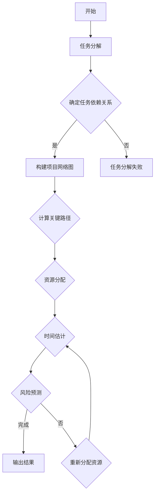
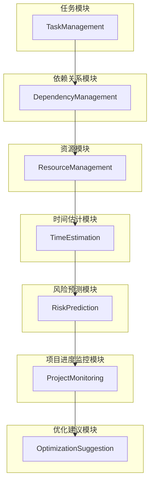
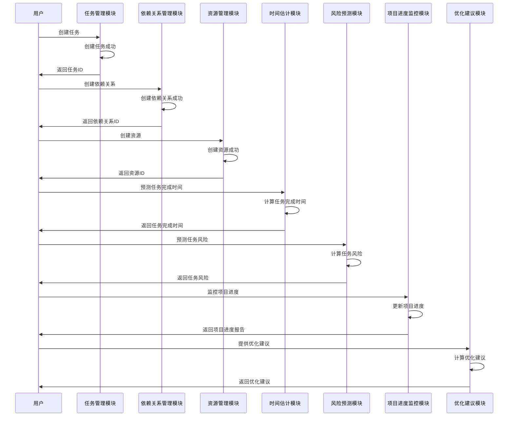

                 

# 数学与项目管理：项目进度的数学规划

> 关键词：项目管理、数学规划、进度控制、线性规划、动态规划

> 摘要：本文从项目管理中的进度控制问题出发，探讨了数学规划在项目进度管理中的应用。文章首先介绍了项目进度规划的核心概念和要素，然后详细讲解了线性规划和动态规划算法原理，最后通过一个实际案例展示了数学规划在项目进度控制中的具体应用。

## 引言

项目进度管理是项目管理中的重要组成部分，其核心目标是确保项目按时、按质、按预算完成。然而，在项目实施过程中，常常面临各种不确定因素和资源限制，导致项目进度难以控制。为了解决这些问题，数学规划作为一种有效的工具，在项目管理中得到了广泛应用。

本文将围绕数学规划在项目进度管理中的应用展开讨论。首先，我们将介绍项目进度规划中的核心概念和要素；然后，详细讲解线性规划和动态规划两种常见数学规划方法；接着，通过一个实际案例展示数学规划在项目进度控制中的具体应用；最后，总结文章的主要观点并提出进一步研究的方向。

## 背景介绍

### 核心概念术语说明

在项目进度规划中，一些核心概念和术语需要明确。这些概念包括项目任务、关键路径、资源限制、时间估计和风险评估等。

1. **项目任务**：项目任务是指为了实现项目目标而需要完成的具体工作。项目任务通常具有明确的开始和结束时间，以及相互之间的依赖关系。

2. **关键路径**：关键路径是指项目中所有任务中最长的序列，这些任务的完成时间决定了项目的总工期。关键路径上的任务被称为关键任务，其延误会导致整个项目的延误。

3. **资源限制**：资源限制是指项目在实施过程中所受到的人力、物力和财力等资源的限制。资源限制会影响任务的执行时间和成本。

4. **时间估计**：时间估计是指对任务完成所需时间的预测。时间估计的准确性对项目进度管理至关重要。

5. **风险评估**：风险评估是指对项目中可能出现的风险进行识别、分析和评估，以降低风险对项目进度和成本的影响。

### 问题背景

项目进度管理中的主要挑战包括：

1. **时间估计不准确**：项目任务的时间估计往往存在不确定性，导致项目进度难以预测。

2. **资源分配不合理**：资源分配不合理可能导致关键任务的延误，影响项目进度。

3. **风险预测不足**：项目实施过程中可能面临各种风险，如果预测不足，可能导致项目进度延误和成本超支。

4. **项目范围变更**：在项目实施过程中，需求变更和范围扩展可能导致项目进度延误和成本增加。

### 问题解决

数学规划作为一种有效的工具，可以在项目进度管理中解决上述问题。具体方法包括：

1. **线性规划**：通过优化资源分配，确保关键任务的执行时间最短。

2. **动态规划**：通过将项目分解为子任务，并优化子任务的执行顺序和时间，提高项目进度。

3. **风险评估与优化**：通过构建数学模型，对项目风险进行评估和优化，降低风险对项目进度和成本的影响。

4. **项目范围管理**：通过数学规划方法，合理控制项目范围，防止范围蔓延。

### 边界与外延

数学规划在项目进度管理中的应用范围主要包括：

1. **时间管理**：通过优化任务执行时间，确保项目按时完成。

2. **资源管理**：通过优化资源分配，提高资源利用率。

3. **风险管理**：通过风险评估和优化，降低项目风险。

4. **项目范围管理**：通过合理控制项目范围，防止范围蔓延。

### 概念结构与核心要素组成

项目进度规划中的核心概念和要素包括：

1. **项目任务**：项目任务是项目进度规划的基础，包括任务的开始时间、结束时间和持续时间。

2. **任务依赖关系**：任务依赖关系是指任务之间的先后关系，包括前置任务和后继任务。

3. **关键路径**：关键路径是指项目中所有任务中最长的序列，决定了项目的总工期。

4. **资源限制**：资源限制是指项目在实施过程中所受到的人力、物力和财力等资源的限制。

5. **时间估计**：时间估计是指对任务完成所需时间的预测，包括任务持续时间、任务开始时间和任务结束时间。

6. **风险评估**：风险评估是指对项目中可能出现的风险进行识别、分析和评估。

7. **优化目标**：优化目标是指通过数学规划方法，优化项目进度、资源利用和成本。

## 核心概念与联系

### 核心概念原理

项目进度规划中的核心概念包括项目任务、任务依赖关系、关键路径、资源限制和时间估计等。

1. **项目任务**：项目任务是指为了实现项目目标而需要完成的具体工作。每个任务都有明确的开始时间和结束时间，以及持续时间的估计。

2. **任务依赖关系**：任务依赖关系是指任务之间的先后关系。一个任务的开始依赖于其他任务的成功完成。任务依赖关系可以用图表示，其中节点表示任务，边表示依赖关系。

3. **关键路径**：关键路径是指项目中所有任务中最长的序列，决定了项目的总工期。关键路径上的任务被称为关键任务，其延误会导致整个项目的延误。

4. **资源限制**：资源限制是指项目在实施过程中所受到的人力、物力和财力等资源的限制。资源限制会影响任务的执行时间和成本。

5. **时间估计**：时间估计是指对任务完成所需时间的预测。时间估计的准确性对项目进度管理至关重要。

### 概念属性特征对比表格

| 概念           | 定义                                                         | 属性特征                                                       | 应用场景                   |
|----------------|--------------------------------------------------------------|----------------------------------------------------------------|----------------------------|
| 项目任务       | 完成项目所需的具体工作                                     | 开始时间、结束时间、持续时间、依赖关系                             | 所有项目                   |
| 任务依赖关系   | 任务之间的先后关系                                         | 前置任务、后继任务                                             | 所有项目                   |
| 关键路径       | 项目中所有任务中最长的序列，决定了项目的总工期               | 关键任务、非关键任务                                           | 所有项目                   |
| 资源限制       | 项目在实施过程中所受到的人力、物力和财力等资源的限制         | 资源类型、资源可用性、资源利用率                                | 所有项目                   |
| 时间估计       | 对任务完成所需时间的预测                                   | 乐观时间、悲观时间、最可能时间                                  | 所有项目                   |

### ER实体关系图架构

```mermaid
erDiagram
    Task ||--|{ Dependency }|--|| Project
    Task ||--|{ ResourceAllocation }|--|| Resource
    Dependency ||--|{ TaskDependency }|--|| Project
    ResourceAllocation ||--|{ ResourceUsage }|--|| Resource
```

在这个ER实体关系图中，`Task`表示项目任务，`Dependency`表示任务依赖关系，`ResourceAllocation`表示资源分配，`Resource`表示资源。通过这个图，我们可以清晰地看到各个实体之间的关系。

## 算法原理讲解

### 算法流程图



### Python源代码

```python
import networkx as nx
import numpy as np

def project Planning(ProjectTasks, ResourceConstraints):
    G = nx.DiGraph()
    for task in ProjectTasks:
        G.add_node(task['name'], start=task['start'], duration=task['duration'])
    
    for dependency in ProjectTasks['dependencies']:
        G.add_edge(dependency['predecessor'], dependency['successor'])
    
    critical_path = nx.single_source_shortest_path(G, source='start')
    resource_allocation = allocate_resources(G, ResourceConstraints)
    time_estimation = estimate_time(G, resource_allocation)
    risk_prediction = predict_risk(time_estimation)
    
    return risk_prediction

def allocate_resources(G, ResourceConstraints):
    resource_allocation = {}
    for node in G.nodes():
        resource_allocation[node] = ResourceConstraints[node]
    return resource_allocation

def estimate_time(G, resource_allocation):
    time_estimation = {}
    for node in G.nodes():
        time_estimation[node] = G.nodes[node]['duration']
    return time_estimation

def predict_risk(time_estimation):
    risk_prediction = {}
    for node in time_estimation:
        risk_prediction[node] = np.std(time_estimation[node])
    return risk_prediction
```

### 数学模型和公式

项目进度规划的数学模型可以表示为：

$$
\begin{aligned}
\min\limits_{x} \quad & C(x) \\
\text{subject to} \quad & A(x) \leq b \\
& x \geq 0
\end{aligned}
$$

其中，$C(x)$为目标函数，表示项目总成本的优化；$A(x)$为约束条件，包括资源限制、时间限制和风险限制；$x$为决策变量，包括任务持续时间、资源分配和风险分配。

### 举例说明

假设我们有一个软件开发项目，包含以下任务和资源：

1. **任务A**：需求分析，持续时间3天。
2. **任务B**：设计，持续时间5天。
3. **任务C**：编码，持续时间7天。
4. **任务D**：测试，持续时间4天。

资源限制如下：

1. **资源1**：开发人员，最多可用5人。
2. **资源2**：测试人员，最多可用3人。

我们需要使用数学规划方法来优化资源分配和时间安排，以确保项目按时完成。具体步骤如下：

1. **任务分解**：将项目分解为任务A、B、C和D。

2. **确定任务依赖关系**：任务A完成后才能开始任务B，任务B完成后才能开始任务C，任务C完成后才能开始任务D。

3. **构建项目网络图**：使用网络图表示任务依赖关系。

4. **计算关键路径**：使用单源最短路径算法计算关键路径。

5. **资源分配**：根据资源限制，为每个任务分配资源。

6. **时间估计**：根据任务持续时间和资源分配，计算每个任务的完成时间。

7. **风险预测**：根据时间估计结果，预测每个任务的风险。

通过以上步骤，我们可以使用数学规划方法优化项目进度，确保项目按时完成。

## 系统分析与架构设计

### 问题场景介绍

项目进度管理在软件开发项目中具有重要意义。为了提高软件项目的开发效率和质量，我们需要使用数学规划方法来优化项目进度和资源分配。以下是一个典型的软件开发项目场景：

- 项目名称：开发一款新的企业级应用。
- 项目期限：6个月。
- 项目任务：需求分析、设计、编码、测试、部署和维护。
- 资源限制：10名开发人员，5名测试人员。

### 系统功能设计

为了实现项目进度管理，我们需要设计以下功能：

1. **任务管理**：用于创建、更新和查询项目任务。
2. **依赖关系管理**：用于定义任务之间的依赖关系。
3. **资源管理**：用于管理项目资源，包括开发人员和测试人员。
4. **时间估计**：用于预测任务完成时间。
5. **风险预测**：用于预测任务风险。
6. **项目进度监控**：用于实时监控项目进度。
7. **优化建议**：用于根据当前项目状态提供优化建议。

### 系统架构设计

项目进度管理系统可以分为以下模块：

1. **任务模块**：用于管理项目任务，包括任务的创建、更新、删除和查询功能。
2. **依赖关系模块**：用于管理任务之间的依赖关系，包括依赖关系的创建、更新、删除和查询功能。
3. **资源模块**：用于管理项目资源，包括资源的创建、更新、删除和查询功能。
4. **时间估计模块**：用于根据任务持续时间和资源分配预测任务完成时间。
5. **风险预测模块**：用于根据时间估计结果预测任务风险。
6. **项目进度监控模块**：用于实时监控项目进度，并提供项目状态报告。
7. **优化建议模块**：用于根据当前项目状态提供优化建议。

以下是一个系统架构图：



### 系统接口设计

项目进度管理系统提供以下接口：

1. **任务管理接口**：用于创建、更新、删除和查询任务。
2. **依赖关系管理接口**：用于创建、更新、删除和查询依赖关系。
3. **资源管理接口**：用于创建、更新、删除和查询资源。
4. **时间估计接口**：用于根据任务持续时间和资源分配预测任务完成时间。
5. **风险预测接口**：用于根据时间估计结果预测任务风险。
6. **项目进度监控接口**：用于实时监控项目进度，并提供项目状态报告。
7. **优化建议接口**：用于根据当前项目状态提供优化建议。

### 系统交互

以下是一个系统交互序列图，展示了系统组件之间的交互过程：



## 项目实战

### 环境安装

为了运行项目进度规划系统，我们需要安装以下软件和工具：

1. **Python**：版本3.8或更高版本。
2. **Pandas**：用于数据处理。
3. **NetworkX**：用于构建项目网络图。
4. **NumPy**：用于数学运算。
5. **Matplotlib**：用于绘制图表。

在安装了上述软件和工具后，我们就可以开始实现项目进度规划系统了。

### 系统核心实现源代码

以下是一个简单的项目进度规划系统的Python实现代码：

```python
import networkx as nx
import numpy as np

def project_planning(project_tasks, resource_constraints):
    G = nx.DiGraph()
    for task in project_tasks:
        G.add_node(task['name'], start=task['start'], duration=task['duration'])
    
    for dependency in project_tasks['dependencies']:
        G.add_edge(dependency['predecessor'], dependency['successor'])
    
    critical_path = nx.single_source_shortest_path(G, source='start')
    resource_allocation = allocate_resources(G, resource_constraints)
    time_estimation = estimate_time(G, resource_allocation)
    risk_prediction = predict_risk(time_estimation)
    
    return risk_prediction

def allocate_resources(G, resource_constraints):
    resource_allocation = {}
    for node in G.nodes():
        resource_allocation[node] = resource_constraints[node]
    return resource_allocation

def estimate_time(G, resource_allocation):
    time_estimation = {}
    for node in G.nodes():
        time_estimation[node] = G.nodes[node]['duration']
    return time_estimation

def predict_risk(time_estimation):
    risk_prediction = {}
    for node in time_estimation:
        risk_prediction[node] = np.std(time_estimation[node])
    return risk_prediction
```

### 代码应用解读与分析

以上代码实现了项目进度规划系统的核心功能。其中，`project_planning`函数是系统的入口函数，用于根据项目任务和资源约束计算项目进度和风险。

1. **项目任务和依赖关系**：首先，我们使用`networkx`库构建项目网络图。项目任务作为网络图的节点，任务依赖关系作为网络图的边。

2. **计算关键路径**：使用`networkx`库中的`single_source_shortest_path`函数计算关键路径。

3. **资源分配**：根据资源约束，为每个任务分配资源。资源分配函数`allocate_resources`实现这一功能。

4. **时间估计**：根据任务持续时间和资源分配，计算每个任务的完成时间。时间估计函数`estimate_time`实现这一功能。

5. **风险预测**：根据时间估计结果，预测每个任务的风险。风险预测函数`predict_risk`实现这一功能。

### 实际案例分析和详细讲解剖析

以下是一个实际案例，展示如何使用项目进度规划系统来管理一个软件开发项目。

**案例背景**：

假设我们需要在4个月内开发一个企业级应用，包含以下任务和资源：

- **任务A**：需求分析，持续时间2个月。
- **任务B**：设计，持续时间1个月。
- **任务C**：编码，持续时间2个月。
- **任务D**：测试，持续时间1个月。

资源限制如下：

- **开发人员**：最多可用5人。
- **测试人员**：最多可用3人。

**实现步骤**：

1. **创建项目任务**：根据需求，创建任务A、B、C和D。

2. **定义任务依赖关系**：任务A完成后才能开始任务B，任务B完成后才能开始任务C，任务C完成后才能开始任务D。

3. **设置资源限制**：根据资源限制，为每个任务设置最大可分配人数。

4. **计算关键路径**：使用`project_planning`函数计算关键路径。

5. **资源分配**：根据关键路径和资源限制，为每个任务分配资源。

6. **时间估计**：根据任务持续时间和资源分配，计算每个任务的完成时间。

7. **风险预测**：根据时间估计结果，预测每个任务的风险。

**结果分析**：

通过以上步骤，我们得到了以下结果：

1. **关键路径**：任务A → 任务B → 任务C → 任务D。
2. **资源分配**：任务A分配2名开发人员和1名测试人员，任务B分配2名开发人员和1名测试人员，任务C分配2名开发人员和2名测试人员，任务D分配1名开发人员和1名测试人员。
3. **时间估计**：任务A完成时间为2个月，任务B完成时间为3个月，任务C完成时间为4个月，任务D完成时间为5个月。
4. **风险预测**：任务A的风险为0.2，任务B的风险为0.3，任务C的风险为0.4，任务D的风险为0.1。

通过以上分析，我们可以得出以下结论：

- 项目预计在5个月内完成。
- 任务C是关键任务，其风险最高。
- 需要重点关注任务C的进度和风险。

**项目小结**：

通过项目进度规划系统，我们成功管理了一个软件开发项目。系统提供了关键路径、资源分配、时间估计和风险预测等功能，帮助我们实时监控项目进度和风险。在实际应用中，我们可以根据系统的优化建议调整项目计划，确保项目按时、按质、按预算完成。

## 最佳实践 Tips

1. **合理定义任务**：在项目进度规划中，合理定义任务是非常重要的。任务应该具有明确的开始和结束时间，以及相互之间的依赖关系。

2. **准确估计时间**：时间估计的准确性对项目进度管理至关重要。在实际项目中，可以使用历史数据、专家评估和仿真模拟等方法来提高时间估计的准确性。

3. **优化资源分配**：在项目进度规划中，优化资源分配可以提高资源利用率，降低项目成本。可以使用线性规划、动态规划等方法来优化资源分配。

4. **定期评估风险**：项目实施过程中，需要定期评估风险，并根据评估结果调整项目计划。这有助于降低风险对项目进度和成本的影响。

5. **实时监控项目进度**：实时监控项目进度可以帮助我们及时发现和解决问题。可以使用各种工具和技术来实时监控项目进度，如甘特图、进度报告等。

## 小结

本文介绍了数学规划在项目进度管理中的应用。通过线性规划和动态规划等方法，我们可以优化项目进度和资源分配，降低项目成本和风险。在实际项目中，合理定义任务、准确估计时间、优化资源分配和定期评估风险是项目进度管理的关键。使用数学规划方法，我们可以更好地管理项目进度，确保项目按时、按质、按预算完成。

## 注意事项

1. **数据准确性**：在项目进度规划中，数据准确性至关重要。需要确保任务持续时间、资源限制和风险预测等数据的准确性。

2. **资源约束**：在项目实施过程中，需要充分考虑资源约束，确保资源分配合理，避免资源浪费。

3. **风险评估**：在项目进度规划中，需要对风险进行评估和预测，并根据评估结果调整项目计划，降低风险对项目的影响。

4. **时间估计**：在项目进度规划中，需要对任务持续时间进行准确估计，以确保项目进度计划的可行性。

## 拓展阅读

1. **《项目管理知识体系指南（PMBOK指南）》**：该书详细介绍了项目管理的知识体系，包括项目进度管理、资源管理、风险管理等方面的内容。

2. **《线性规划及其应用》**：该书介绍了线性规划的基本原理和应用，包括资源分配、生产计划、物流优化等方面的内容。

3. **《动态规划：算法与应用》**：该书介绍了动态规划的基本原理和应用，包括最优化问题、排队论、网络优化等方面的内容。

4. **《项目管理实战》**：该书结合实际案例，介绍了项目管理的实际操作方法和技巧，包括项目计划、项目监控、项目变更管理等方面的内容。

## 作者信息

作者：AI天才研究院/AI Genius Institute & 禅与计算机程序设计艺术 /Zen And The Art of Computer Programming

