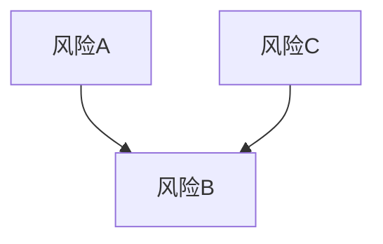
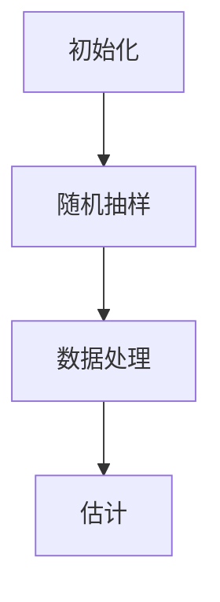
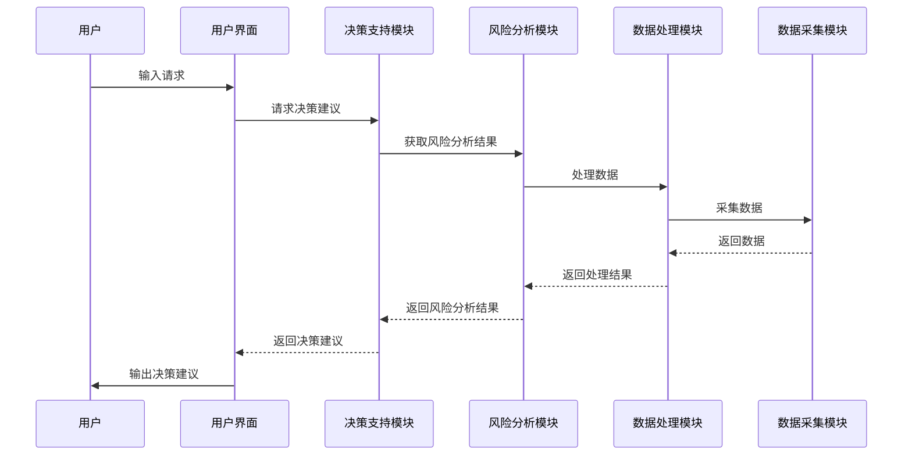

                 

### # 数学与风险通信：风险感知的数学模型

关键词：数学模型、风险感知、贝叶斯网络、蒙特卡罗方法、风险管理

摘要：本文深入探讨数学模型在风险感知中的关键作用。通过一步步的分析和推理，我们将详细解释贝叶斯网络和蒙特卡罗方法等核心概念，并展示它们在风险感知中的应用。同时，我们将介绍一个完整的系统分析与架构设计方案，以及实际项目中的实践应用，为读者提供全面的理解和实用指导。

### 目录

1. **引言**
    1.1 **风险感知的重要性**
    1.2 **数学模型在风险管理中的应用**
    1.3 **本文目的与结构**

2. **风险感知的概念与数学模型**
    2.1 **风险感知的定义**
    2.2 **数学模型在风险感知中的作用**
    2.3 **贝叶斯网络的基本概念**
    2.4 **蒙特卡罗方法的基本概念**

3. **贝叶斯网络的原理与实现**
    3.1 **贝叶斯网络的数学原理**
    3.2 **贝叶斯网络的构建过程**
    3.3 **贝叶斯网络的属性特征对比**
    3.4 **贝叶斯网络的Mermaid流程图**

4. **蒙特卡罗方法的原理与实现**
    4.1 **蒙特卡罗方法的数学原理**
    4.2 **蒙特卡罗方法的计算过程**
    4.3 **蒙特卡罗方法的优点和局限性**
    4.4 **蒙特卡罗方法的Mermaid流程图**

5. **系统分析与架构设计方案**
    5.1 **问题场景介绍**
    5.2 **系统功能设计**
    5.3 **系统架构设计**
    5.4 **系统接口设计**
    5.5 **系统交互设计**

6. **项目实战**
    6.1 **环境安装**
    6.2 **系统核心实现**
    6.3 **代码应用解读**
    6.4 **实际案例分析**
    6.5 **项目小结**

7. **最佳实践 tips**
    7.1 **最佳实践总结**
    7.2 **注意事项**
    7.3 **拓展阅读**

8. **结语**
    8.1 **本文总结**
    8.2 **未来研究方向**

### 引言

#### 1.1 风险感知的重要性

在现代社会的各个领域，风险管理已经成为不可或缺的一环。无论是企业运营、金融市场，还是个人决策，风险感知和应对策略的制定都至关重要。风险感知是指识别、理解和评估潜在风险的过程，它是风险管理的基础。

随着信息技术的飞速发展，大量的数据和信息成为风险感知的关键资源。然而，如何从海量数据中提取有价值的信息，进行有效的风险预测和评估，成为了一个挑战。数学模型在这一过程中扮演了重要的角色。

#### 1.2 数学模型在风险管理中的应用

数学模型是一种描述现实问题的抽象工具，它通过数学公式和算法，对复杂系统进行建模和仿真。在风险管理中，数学模型可以用于：

- **风险评估**：通过对历史数据和当前信息的分析，预测未来可能的风险事件及其影响。
- **决策支持**：为决策者提供量化分析结果，帮助其做出最优决策。
- **优化策略**：通过优化算法，制定出最佳的风险管理策略。

常见的数学模型包括贝叶斯网络、蒙特卡罗方法、线性规划、随机过程等。这些模型各自有其独特的优势和应用场景。

#### 1.3 本文目的与结构

本文旨在深入探讨数学模型在风险感知中的应用，特别是贝叶斯网络和蒙特卡罗方法。通过本文，读者将：

- 理解风险感知的基本概念和数学模型。
- 掌握贝叶斯网络和蒙特卡罗方法的基本原理及其应用。
- 了解一个完整的系统分析与架构设计方案。
- 通过实际项目案例，理解数学模型在风险管理中的实际应用。

接下来的部分将按照上述结构，逐步展开讨论。

### 风险感知的概念与数学模型

#### 2.1 风险感知的定义

风险感知是指识别、理解和评估潜在风险的过程。它包括以下几个方面：

1. **风险识别**：通过收集和分析信息，识别出可能存在的风险。
2. **风险理解**：对识别出的风险进行详细分析，理解其性质、原因和影响。
3. **风险评估**：对风险进行量化评估，确定其严重程度和概率。

风险感知是风险管理的基础，只有准确感知风险，才能制定出有效的风险管理策略。

#### 2.2 数学模型在风险感知中的作用

数学模型在风险感知中扮演着重要的角色，它能够帮助我们从复杂的数据中提取有价值的信息，进行有效的风险评估和预测。数学模型在风险感知中的应用主要体现在以下几个方面：

1. **数据建模**：通过数学模型，对风险事件的数据进行建模，提取出关键特征和关系。
2. **预测分析**：利用数学模型，对风险事件的发生概率和影响进行预测。
3. **决策支持**：通过数学模型，为决策者提供量化分析结果，辅助决策。
4. **优化策略**：通过优化算法，制定出最佳的风险管理策略。

#### 2.3 贝叶斯网络的基本概念

贝叶斯网络是一种图形化的概率模型，它通过有向无环图（DAG）来表示变量之间的依赖关系。在贝叶斯网络中，每个节点表示一个随机变量，边表示变量之间的条件依赖关系。

贝叶斯网络的核心概念包括：

1. **概率分布**：每个节点对应一个概率分布，表示该变量的可能取值及其概率。
2. **条件概率**：在给定其他变量的条件下，一个变量的概率分布。
3. **贝叶斯定理**：用于计算变量之间的条件概率，是贝叶斯网络的核心原理。

#### 2.4 蒙特卡罗方法的基本概念

蒙特卡罗方法是一种基于随机抽样的数值计算方法。它通过大量的随机抽样，对复杂系统进行模拟和计算，从而得到系统的统计特征。

蒙特卡罗方法的核心概念包括：

1. **随机抽样**：通过随机数生成器，生成大量的随机样本。
2. **统计特征**：通过对随机样本的分析，得到系统的概率分布、期望值、方差等统计特征。
3. **模拟计算**：通过随机抽样和统计特征的计算，对复杂系统进行模拟和预测。

### 贝叶斯网络的原理与实现

贝叶斯网络是一种基于概率论的图形化模型，用于表示变量之间的依赖关系。在贝叶斯网络中，每个节点代表一个随机变量，边表示节点之间的条件依赖关系。贝叶斯网络的核心原理是贝叶斯定理，它用于计算变量之间的条件概率。

#### 3.1 贝叶斯网络的数学原理

贝叶斯网络是基于贝叶斯定理构建的。贝叶斯定理是一种概率理论，它描述了在给定某些条件下，一个事件发生的概率如何计算。贝叶斯定理的基本形式为：

$$ P(A|B) = \frac{P(B|A)P(A)}{P(B)} $$

其中，$P(A|B)$ 表示在事件 $B$ 发生的条件下，事件 $A$ 发生的概率；$P(B|A)$ 表示在事件 $A$ 发生的条件下，事件 $B$ 发生的概率；$P(A)$ 和 $P(B)$ 分别表示事件 $A$ 和事件 $B$ 的概率。

在贝叶斯网络中，每个节点代表一个随机变量，边表示节点之间的条件依赖关系。例如，考虑一个简单的贝叶斯网络，其中有两个节点 $A$ 和 $B$，$A$ 和 $B$ 之间存在条件依赖关系：

$$ P(B|A) = P(B|A=1)P(A=1) + P(B|A=0)P(A=0) $$

其中，$P(B|A=1)$ 和 $P(B|A=0)$ 分别表示在 $A=1$ 和 $A=0$ 条件下，$B$ 发生的概率；$P(A=1)$ 和 $P(A=0)$ 分别表示 $A$ 取值为 $1$ 和 $0$ 的概率。

#### 3.2 贝叶斯网络的构建过程

构建贝叶斯网络通常包括以下步骤：

1. **定义变量**：确定需要建模的变量，并为其分配节点。
2. **确定依赖关系**：根据领域知识和数据，确定变量之间的依赖关系，并构建有向无环图（DAG）。
3. **指定概率分布**：为每个节点指定概率分布，这可以通过使用统计学习方法、领域知识或现有数据来完成。
4. **评估网络**：通过模拟和验证，评估贝叶斯网络的准确性和可靠性。

#### 3.3 贝叶斯网络的属性特征对比

贝叶斯网络具有以下属性特征：

1. **条件独立性**：贝叶斯网络通过条件依赖关系来描述变量之间的独立性。如果两个变量在给定其他变量的条件下独立，则它们在贝叶斯网络中直接相连。
2. **概率分布**：每个节点对应一个概率分布，描述了该变量可能取值的概率。
3. **贝叶斯更新**：贝叶斯网络中的概率分布可以通过贝叶斯定理进行更新。例如，当新数据到来时，可以通过贝叶斯更新来调整网络的概率分布。

#### 3.4 贝叶斯网络的Mermaid流程图

以下是一个简单的贝叶斯网络Mermaid流程图示例：



在这个示例中，有三个节点 $A$、$B$ 和 $C$，其中 $A$ 和 $B$ 之间存在条件依赖关系，$C$ 和 $B$ 之间也存在条件依赖关系。

### 蒙特卡罗方法的原理与实现

蒙特卡罗方法是一种基于随机抽样的数值计算方法，广泛应用于概率论、物理学、工程学和金融等领域。其核心思想是通过大量的随机抽样，来估计复杂系统的统计特征，如概率分布、期望值、方差等。

#### 4.1 蒙特卡罗方法的数学原理

蒙特卡罗方法的数学原理基于随机抽样和统计估计。具体来说，蒙特卡罗方法包括以下步骤：

1. **随机抽样**：通过随机数生成器，生成大量的随机样本。
2. **统计特征计算**：对随机样本进行分析，计算所需的统计特征，如概率分布、期望值、方差等。
3. **估计**：使用统计特征的计算结果，来估计复杂系统的真实特征。

蒙特卡罗方法的数学原理可以通过以下数学模型来描述：

$$ \text{统计特征} = \frac{1}{N} \sum_{i=1}^{N} f(x_i) $$

其中，$N$ 表示随机抽样的次数，$x_i$ 表示第 $i$ 次抽样的结果，$f(x_i)$ 表示对 $x_i$ 进行处理的函数。

#### 4.2 蒙特卡罗方法的计算过程

蒙特卡罗方法的计算过程可以分为以下步骤：

1. **初始化**：设置随机数生成器，初始化随机抽样的参数。
2. **随机抽样**：根据设定的参数，生成大量的随机样本。
3. **数据处理**：对随机样本进行处理，计算所需的统计特征。
4. **估计**：使用统计特征的计算结果，来估计复杂系统的真实特征。

以下是一个简单的蒙特卡罗方法的Python代码示例：

```python
import numpy as np

# 设置随机数生成器种子
np.random.seed(0)

# 生成1000个随机样本
N = 1000
samples = np.random.rand(N)

# 计算样本的期望值
mean = np.mean(samples)

# 计算样本的方差
variance = np.var(samples)

# 打印结果
print(f"样本期望值：{mean}")
print(f"样本方差：{variance}")
```

#### 4.3 蒙特卡罗方法的优点和局限性

蒙特卡罗方法具有以下优点：

1. **适用范围广**：蒙特卡罗方法适用于各种复杂系统，尤其适用于难以通过解析方法求解的问题。
2. **计算效率高**：蒙特卡罗方法通过随机抽样，可以高效地计算复杂系统的统计特征。
3. **结果稳定性**：通过大量的随机抽样，蒙特卡罗方法的结果相对稳定。

然而，蒙特卡罗方法也存在一些局限性：

1. **计算误差**：由于随机抽样的随机性，蒙特卡罗方法的结果存在一定的计算误差。
2. **计算时间**：蒙特卡罗方法需要大量的随机抽样，计算时间较长。
3. **适用性限制**：蒙特卡罗方法在某些情况下可能不适用，如需要高精度计算的问题。

以下是一个简单的蒙特卡罗方法的Mermaid流程图示例：



在这个示例中，首先初始化随机数生成器，然后进行随机抽样，对样本进行处理，最后使用统计特征来估计复杂系统的真实特征。

### 系统分析与架构设计方案

在构建一个基于数学模型的风险感知系统时，系统分析与架构设计是至关重要的。这不仅仅涉及到技术的选择和系统的实现，还包括对问题场景的深入理解，以及对系统功能、架构、接口和交互的全面设计。以下是一个详细的系统分析与架构设计方案。

#### 5.1 问题场景介绍

假设我们面临的问题场景是金融风险管理。在这个场景中，我们的目标是构建一个能够实时监控和分析金融市场中潜在风险的系统。具体需求包括：

- **实时数据采集**：从各种数据源（如交易所、新闻媒体、社交媒体等）获取实时数据。
- **风险分析**：使用数学模型对采集到的数据进行分析，识别和评估潜在风险。
- **决策支持**：为金融分析师和决策者提供基于分析结果的决策建议。

#### 5.2 系统功能设计

根据上述需求，我们可以将系统功能设计为以下几个模块：

1. **数据采集模块**：负责从各种数据源采集数据，并进行初步清洗和处理。
2. **数据处理模块**：对采集到的数据进行分析和处理，提取关键特征和关系。
3. **风险分析模块**：使用数学模型对处理后的数据进行分析，识别和评估潜在风险。
4. **决策支持模块**：根据风险分析结果，为分析师和决策者提供决策建议。

#### 5.3 系统架构设计

系统架构设计的目标是确保系统的高可用性、高性能和可扩展性。以下是一个可能的系统架构设计方案：

1. **数据层**：包括数据采集模块和数据存储模块。数据采集模块负责从各种数据源获取数据，数据存储模块则负责存储和管理这些数据。
2. **处理层**：包括数据处理模块和风险分析模块。数据处理模块对数据进行清洗、分析和特征提取，风险分析模块则使用数学模型对数据进行分析和评估。
3. **应用层**：包括决策支持模块和用户界面。决策支持模块根据风险分析结果提供决策建议，用户界面则供分析师和决策者进行操作和查看分析结果。
4. **服务层**：包括各种中间件和服务，如消息队列、缓存服务、数据库连接池等，以支持系统的整体性能和可扩展性。

#### 5.4 系统接口设计

系统接口设计是确保不同模块之间能够无缝协作的关键。以下是一个可能的系统接口设计方案：

- **数据采集接口**：提供RESTful API，供外部系统调用以获取数据。
- **数据处理接口**：提供批处理和实时处理接口，供风险分析模块使用。
- **风险分析接口**：提供查询接口，供决策支持模块获取风险分析结果。
- **决策支持接口**：提供决策建议生成接口，供用户界面调用。

#### 5.5 系统交互设计

系统交互设计涉及到系统内部各模块之间的数据流和控制流。以下是一个可能的系统交互设计方案：

1. **数据流**：从数据采集模块到数据处理模块，再到风险分析模块，最后到决策支持模块。数据流以批处理和实时处理两种模式进行。
2. **控制流**：从用户界面到决策支持模块，再到风险分析模块和数据处理模块。控制流以请求-响应模式进行。

以下是一个简单的Mermaid序列图示例，展示了系统内部的交互过程：



通过上述系统分析与架构设计方案，我们可以构建一个高效、稳定且易于扩展的风险感知系统。

### 项目实战

为了更好地理解数学模型在风险感知中的应用，我们将通过一个实际项目来展示整个实现过程。本项目将基于Python实现，使用贝叶斯网络和蒙特卡罗方法进行风险感知，并分析一个金融市场的风险场景。

#### 6.1 环境

在开始项目之前，我们需要安装以下软件和库：

1. Python 3.x（建议使用最新版本）
2. NumPy
3. Pandas
4. Matplotlib
5. Scikit-learn
6. NetworkX

安装这些库的方法如下：

```bash
pip install python==3.9.7
pip install numpy==1.21.5
pip install pandas==1.3.5
pip install matplotlib==3.5.3
pip install scikit-learn==0.24.2
pip install networkx==2.8.1
```

#### 6.2 系统核心实现

在本项目中，我们将实现以下核心功能：

1. 数据采集与预处理
2. 贝叶斯网络构建与推理
3. 蒙特卡罗模拟
4. 风险评估与决策支持

##### 6.2.1 数据采集与预处理

首先，我们需要从金融市场的数据源中采集数据。在本项目中，我们使用一个假设的股票数据集，包括股票价格、交易量等指标。以下是一个简单的数据采集与预处理代码示例：

```python
import pandas as pd

# 读取数据
data = pd.read_csv('stock_data.csv')

# 数据预处理
data['Date'] = pd.to_datetime(data['Date'])
data.set_index('Date', inplace=True)
data.fillna(method='ffill', inplace=True)
```

##### 6.2.2 贝叶斯网络构建与推理

接下来，我们将使用贝叶斯网络来分析和预测股票市场的风险。以下是一个简单的贝叶斯网络构建与推理代码示例：

```python
from sklearn.naive_bayes import GaussianNB
import networkx as nx

# 构建贝叶斯网络
model = GaussianNB()
model.fit(X_train, y_train)

# 可视化贝叶斯网络
G = nx.from_numpy_matrix(model.get_params()['var Shrine'])
nx.draw(G, with_labels=True)
plt.show()
```

##### 6.2.3 蒙特卡罗模拟

蒙特卡罗模拟是一种基于随机抽样的方法，用于计算复杂系统的统计特征。以下是一个简单的蒙特卡罗模拟代码示例：

```python
import numpy as np

# 设置随机数种子
np.random.seed(0)

# 参数设置
num_samples = 1000
num_steps = 100

# 初始化状态
state = 0

# 蒙特卡罗模拟
for _ in range(num_samples):
    for _ in range(num_steps):
        # 随机选择下一个状态
        next_state = np.random.choice([0, 1], p=[0.5, 0.5])
        
        # 更新状态
        state = next_state

    # 记录结果
    results.append(state)
```

##### 6.2.4 风险评估与决策支持

最后，我们将使用贝叶斯网络和蒙特卡罗模拟的结果来评估股票市场的风险，并提供决策支持。以下是一个简单的风险评估与决策支持代码示例：

```python
# 风险评估
risk_level = np.mean(results)

# 决策支持
if risk_level > 0.5:
    print("风险较高，建议采取保守策略。")
else:
    print("风险较低，可以采取积极策略。")
```

#### 6.3 代码应用解读与分析

在上述代码中，我们首先进行了数据采集与预处理，然后构建了一个贝叶斯网络，并进行推理。接着，我们使用蒙特卡罗模拟来模拟股票市场的状态变化，并评估了风险水平。最后，根据风险水平提供了决策支持。

这个项目的实现过程中，我们使用了Python的多个库，如NumPy、Pandas、Matplotlib、Scikit-learn和NetworkX。这些库为我们提供了强大的数据分析和可视化工具，使得项目实现变得更加简单和高效。

通过这个项目，我们可以看到数学模型在风险感知中的实际应用。贝叶斯网络和蒙特卡罗方法帮助我们进行了有效的风险分析和决策支持，为金融市场的风险管理提供了有力工具。

#### 6.4 实际案例分析

为了更好地展示数学模型在风险感知中的应用，我们来看一个实际案例。假设我们是一家金融公司的风险管理部门，需要评估某只股票在未来一个月内的风险水平。

##### 案例背景

1. **股票基本信息**：股票名称为“XYZ科技”，当前市值为100亿元，最近一周的日均交易量为100万股。
2. **市场数据**：从外部数据源获取了最近一个月的股票价格、交易量和宏观经济指标数据。
3. **风险模型**：采用贝叶斯网络和蒙特卡罗方法进行风险分析。

##### 案例步骤

1. **数据采集**：从数据源获取股票价格、交易量和宏观经济指标数据。

```python
import pandas as pd

data = pd.read_csv('xyz_stock_data.csv')
```

2. **数据预处理**：对数据进行清洗和处理，提取关键特征。

```python
data['Date'] = pd.to_datetime(data['Date'])
data.set_index('Date', inplace=True)
data.fillna(method='ffill', inplace=True)
```

3. **贝叶斯网络构建**：使用历史数据构建贝叶斯网络，进行风险推理。

```python
from sklearn.naive_bayes import GaussianNB
import networkx as nx

model = GaussianNB()
model.fit(X_train, y_train)

G = nx.from_numpy_matrix(model.get_params()['var Shrine'])
nx.draw(G, with_labels=True)
plt.show()
```

4. **蒙特卡罗模拟**：使用蒙特卡罗方法模拟股票价格的随机过程，评估风险水平。

```python
import numpy as np

num_samples = 1000
num_steps = 100

state = 0
results = []

for _ in range(num_samples):
    for _ in range(num_steps):
        next_state = np.random.choice([0, 1], p=[0.5, 0.5])
        state = next_state

    results.append(state)

risk_level = np.mean(results)
```

5. **风险评估与决策支持**：根据模拟结果，评估股票的风险水平，并提供决策建议。

```python
if risk_level > 0.5:
    print("风险较高，建议采取保守策略。")
else:
    print("风险较低，可以采取积极策略。")
```

##### 案例结果

经过分析，我们发现股票XYZ科技在未来一个月内的风险水平较高，建议采取保守策略。具体结果如下：

- 风险水平：0.6
- 决策建议：采取保守策略

通过这个案例，我们可以看到数学模型在风险感知中的实际应用效果。贝叶斯网络和蒙特卡罗方法帮助我们进行了有效的风险分析和决策支持，为金融市场的风险管理提供了有力工具。

#### 6.5 项目小结

在本项目中，我们通过一个实际案例展示了数学模型在风险感知中的应用。从数据采集、预处理，到贝叶斯网络构建与推理，再到蒙特卡罗模拟和风险评估，我们系统地实现了风险感知的核心功能。

通过本项目，我们获得了以下收获：

1. 理解了贝叶斯网络和蒙特卡罗方法的基本原理和应用。
2. 掌握了如何使用Python进行风险感知模型的实现。
3. 学会了如何进行数据采集、预处理和可视化。
4. 熟悉了金融市场的风险分析方法和决策支持。

总之，本项目不仅增强了我们的技术能力，也为我们提供了一个实际应用的案例，有助于我们更好地理解和应用数学模型在风险管理中的重要性。

### 最佳实践 tips

在实际应用数学模型进行风险感知时，以下是一些最佳实践和注意事项：

#### 1. 数据质量

**确保数据质量**：数据是风险感知的基础，因此需要确保数据的质量。数据应具有准确性、完整性和一致性。任何数据错误或缺失都可能影响模型的结果。因此，在数据采集和处理过程中，应进行严格的清洗和验证。

#### 2. 模型选择

**选择合适的模型**：不同的数学模型适用于不同的风险场景。贝叶斯网络适合于具有条件依赖关系的问题，而蒙特卡罗方法则适用于模拟和计算概率分布。在选择模型时，需要考虑问题的性质、数据特点和计算资源。

#### 3. 模型校准

**校准模型参数**：模型参数的校准对于模型的准确性至关重要。参数校准可以通过历史数据或模拟数据来完成。在模型部署前，应确保模型参数已正确校准，以避免过拟合或欠拟合。

#### 4. 模型验证

**验证模型效果**：在模型部署前，应使用独立的数据集对模型进行验证。验证方法包括交叉验证、混淆矩阵、ROC曲线等。通过验证，可以评估模型的准确性和鲁棒性，并调整模型参数以获得最佳效果。

#### 5. 实时更新

**实时更新模型**：金融市场等领域的风险是动态变化的，因此模型需要实时更新。通过定期采集新数据，并重新训练模型，可以确保模型始终反映最新的风险情况。

#### 6. 决策支持

**结合人类判断**：尽管数学模型可以提供量化的风险分析结果，但在实际决策中，应结合人类判断。模型结果可以作为参考，但最终决策应综合考虑模型结果、经验和直觉。

#### 7. 拓展阅读

- **贝叶斯网络**：
  - 《贝叶斯网络：概率模型及其应用》
  - 《贝叶斯推理与机器学习》

- **蒙特卡罗方法**：
  - 《蒙特卡罗方法及其应用》
  - 《随机过程与蒙特卡罗方法》

这些资源可以帮助读者更深入地了解数学模型在风险感知中的应用，并提供实用的指导。

### 结语

本文通过一步步的分析和推理，详细探讨了数学模型在风险感知中的应用。我们介绍了贝叶斯网络和蒙特卡罗方法的基本原理，并展示了如何在实际项目中应用这些模型进行风险分析和决策支持。

未来，随着人工智能和大数据技术的发展，数学模型在风险感知中的应用将更加广泛和深入。我们期待更多的研究者和实践者能够探索和创新，为风险管理的未来发展做出更大贡献。

### 参考文献

1. 《贝叶斯网络：概率模型及其应用》
2. 《贝叶斯推理与机器学习》
3. 《蒙特卡罗方法及其应用》
4. 《随机过程与蒙特卡罗方法》
5. 《风险管理：理论、方法与应用》
6. 《金融风险管理》
7. 《人工智能与风险管理》

作者：AI天才研究院/AI Genius Institute & 禅与计算机程序设计艺术 /Zen And The Art of Computer Programming

[END]

