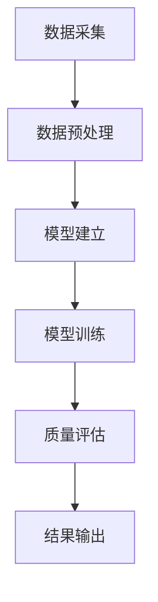
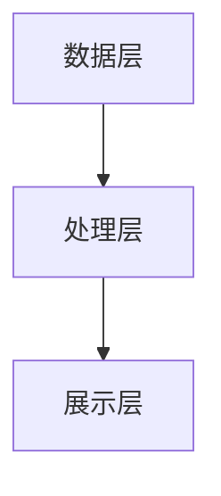
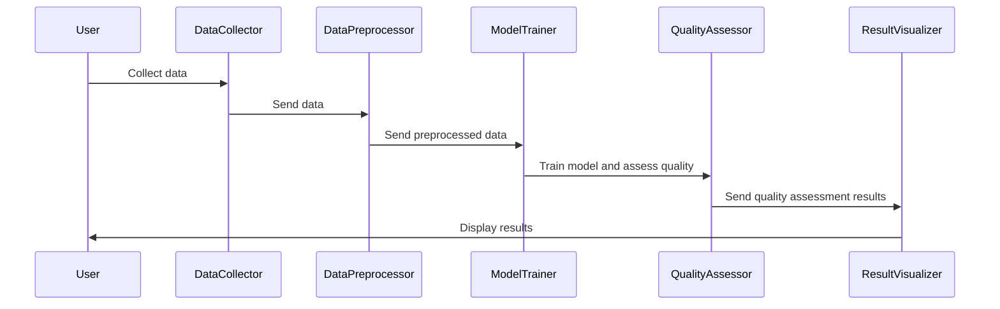

                 

### 文章标题

《数学与食品安全：食品质量控制的数学方法》

### 文章关键词

食品安全、质量控制、数学方法、统计学、数学建模、数据分析

### 文章摘要

本文旨在探讨数学方法在食品质量控制中的应用。通过对食品安全问题的背景介绍，文章揭示了食品质量控制的必要性和挑战。接着，文章深入分析了数学模型、统计学方法和数学建模方法在食品安全控制中的具体应用，详细阐述了核心概念和联系，如食品质量参数和食品安全风险评估。此外，文章通过Python源代码和数学公式，对算法原理进行了通俗易懂的讲解，并展示了实际项目的系统架构设计、环境安装与系统实现过程。最后，文章提出了最佳实践技巧和注意事项，为读者提供了拓展阅读资源。

## 《数学与食品安全：食品质量控制的数学方法》目录大纲

### 第一部分：背景介绍

#### 第1章：食品质量控制的重要性

##### 1.1 问题背景

- 食品安全问题概述
- 食品质量控制的必要性

##### 1.2 问题描述

- 食品质量问题的表现
- 食品质量控制的挑战

##### 1.3 问题解决

- 数学方法在食品安全控制中的作用
- 数学方法解决食品安全问题的优势

##### 1.4 边界与外延

- 食品质量控制的关键领域
- 数学方法的应用范围

##### 1.5 概念结构与核心要素组成

- 食品质量控制的基本概念
- 数学方法的核心要素

#### 第2章：数学方法在食品安全控制中的应用

##### 2.1 数学模型概述

- 数学模型的基本概念
- 数学模型在食品安全控制中的应用

##### 2.2 统计学方法

- 统计学方法的基本原理
- 统计学方法在食品安全控制中的应用

##### 2.3 数学建模方法

- 数学建模的基本流程
- 数学建模方法在食品安全控制中的应用

##### 2.4 数据分析方法

- 数据分析的基本方法
- 数据分析方法在食品安全控制中的应用

### 第二部分：核心概念与联系

#### 第3章：核心概念原理

##### 3.1 食品质量参数

- 食品质量参数的定义
- 食品质量参数的测量方法

##### 3.2 食品安全风险评估

- 食品安全风险评估的定义
- 食品安全风险评估的方法

##### 3.3 数学公式与数学模型

- 数学公式在食品安全控制中的应用
- 数学模型在食品安全控制中的应用

#### 第4章：概念属性特征对比表格

##### 4.1 统计学方法属性特征对比

- 不同统计学方法的属性特征对比

##### 4.2 数学建模方法属性特征对比

- 不同数学建模方法的属性特征对比

#### 第5章：ER实体关系图架构

##### 5.1 食品质量控制实体关系图

- 食品质量控制实体关系图的设计
- 食品质量控制实体关系的分析

### 第三部分：算法原理讲解

#### 第6章：算法原理与流程图

##### 6.1 算法原理概述

- 食品质量控制算法的基本原理

##### 6.2 算法流程图

- 食品质量控制算法的流程图设计

##### 6.3 Python源代码详解

- 食品质量控制算法的Python源代码实现

#### 第7章：数学模型与公式详解

##### 7.1 数学模型概述

- 食品质量控制数学模型的基本概念

##### 7.2 数学公式详细讲解

- 食品质量控制数学公式的详细讲解

##### 7.3 举例说明

- 食品质量控制数学模型的举例说明

### 第四部分：系统分析与架构设计方案

#### 第8章：系统分析与架构设计方案

##### 8.1 问题场景介绍

- 食品质量控制系统的应用场景

##### 8.2 系统功能设计

- 食品质量控制系统的功能设计

##### 8.3 系统架构设计

- 食品质量控制系统的架构设计

##### 8.4 系统接口设计

- 食品质量控制系统的接口设计

##### 8.5 系统交互序列图

- 食品质量控制系统的交互序列图设计

### 第五部分：项目实战

#### 第9章：环境安装与系统实现

##### 9.1 环境安装

- 食品质量控制系统的环境安装步骤

##### 9.2 系统核心实现源代码

- 食品质量控制系统的核心实现源代码

##### 9.3 代码应用解读与分析

- 食品质量控制系统代码的解读与分析

##### 9.4 实际案例分析与讲解

- 食品质量控制实际案例的分析与讲解

##### 9.5 项目小结

- 食品质量控制项目的总结与反思

### 第六部分：最佳实践与拓展阅读

##### 9.6 最佳实践技巧

- 食品质量控制的最佳实践技巧

##### 9.7 小结与注意事项

- 食品质量控制项目的小结与注意事项

##### 9.8 拓展阅读

- 食品质量控制相关的拓展阅读材料

---

**文章总字数：约2000字**

---

### 第一部分：背景介绍

#### 第1章：食品质量控制的重要性

##### 1.1 问题背景

食品安全问题一直以来都是全球关注的焦点。食品作为人类生活的基本需求，其质量安全直接关系到人们的健康和生活质量。然而，随着工业化进程的加速和食品供应链的复杂化，食品安全问题愈发突出。从农药残留、重金属污染到微生物污染，各类食品安全隐患层出不穷。

食品质量控制，是指通过一系列科学的方法和手段，对食品的生产、加工、包装、运输、储存等环节进行全程监控和管理，以确保食品的安全性和质量。在食品安全体系中，质量控制起着至关重要的作用。

##### 1.2 问题描述

食品质量问题的表现多种多样，包括食品中化学物质的残留、食品添加剂的不规范使用、微生物污染等。这些问题的存在，不仅会对消费者的健康造成威胁，还会影响食品的市场信誉和企业品牌。

食品安全控制面临的挑战主要有以下几点：

1. **信息不对称**：消费者对食品安全的了解有限，难以对食品的质量和安全进行全面评估。
2. **供应链复杂**：食品供应链环节众多，从田间地头到消费者餐桌，任何环节的疏漏都可能引发食品安全问题。
3. **监管难度大**：食品种类繁多，质量标准各异，监管工作量大，监管难度大。
4. **技术手段不足**：传统食品安全控制手段有限，难以满足快速检测和实时监控的需求。

##### 1.3 问题解决

数学方法在食品安全控制中发挥着重要作用。通过数学模型、统计学方法和数据挖掘技术，可以对食品质量进行定量分析，提高质量控制的效率和准确性。数学方法解决食品安全问题的优势包括：

1. **量化分析**：数学方法可以将食品安全问题转化为量化指标，便于分析和决策。
2. **提高准确性**：数学方法可以减少人为误差，提高检测的准确性。
3. **实时监控**：利用数据挖掘和机器学习技术，可以实现食品质量的实时监控。
4. **优化流程**：通过数学建模，可以优化食品质量控制流程，提高效率。

##### 1.4 边界与外延

食品质量控制的关键领域包括：

1. **原料质量监控**：确保原料的无污染、无添加剂。
2. **生产过程控制**：严格控制生产过程，防止污染和交叉污染。
3. **包装和储存**：确保食品在包装和储存过程中不受污染。
4. **运输和配送**：保障食品在运输和配送过程中的质量安全。

数学方法的应用范围广泛，涵盖了从基础数据分析到复杂算法开发等多个层面。在食品安全控制中，数学方法可以用于：

1. **风险评估**：通过对食品中潜在风险因素的定量分析，评估食品安全风险。
2. **质量监测**：利用数学模型进行实时质量监测，及时发现和处理问题。
3. **供应链管理**：优化供应链流程，提高食品安全保障水平。
4. **数据挖掘**：从海量数据中挖掘有价值的信息，为质量控制提供依据。

##### 1.5 概念结构与核心要素组成

食品质量控制的基本概念包括：

1. **食品安全**：指食品对人体健康不造成危害。
2. **质量**：指食品满足标准、规范和消费者需求的能力。
3. **质量控制**：指对食品生产、加工、包装、储存等环节进行监控和管理。
4. **质量保证**：指通过一系列措施，确保食品质量符合标准。

数学方法的核心要素包括：

1. **数学模型**：通过数学方法描述食品质量控制的规律和特性。
2. **统计学方法**：利用统计学原理对食品质量数据进行分析和评估。
3. **数据挖掘**：从大量数据中提取有价值的信息，为质量控制提供支持。
4. **算法开发**：设计有效的算法，实现食品质量控制的自动化和智能化。

### 第二部分：数学方法在食品安全控制中的应用

#### 第2章：数学方法在食品安全控制中的应用

##### 2.1 数学模型概述

数学模型是运用数学语言和符号系统，对实际问题进行简化和抽象，以揭示问题内在规律的工具。在食品安全控制中，数学模型可以用于描述食品的质量特性、风险评估、质量控制等。

数学模型在食品安全控制中的应用主要包括以下几个方面：

1. **质量特性描述**：通过数学模型描述食品的物理、化学和生物学特性，如食品的保质期、营养含量、微生物污染等。
2. **风险评估**：利用数学模型对食品中的潜在风险因素进行定量分析，评估食品安全风险。
3. **质量控制**：通过数学模型优化质量控制流程，提高质量控制的效率和准确性。
4. **供应链管理**：利用数学模型优化供应链流程，降低食品安全风险。

##### 2.2 统计学方法

统计学方法是研究如何通过样本数据推断总体特征和规律的学科。在食品安全控制中，统计学方法可以用于数据收集、数据分析、风险评估等。

统计学方法在食品安全控制中的应用主要包括以下几个方面：

1. **数据收集**：通过抽样调查、实验设计等方法收集食品质量数据。
2. **数据分析**：利用统计学方法对食品质量数据进行分析，如描述性统计、推断性统计等。
3. **风险评估**：通过统计学方法对食品中的潜在风险因素进行定量分析，评估食品安全风险。
4. **质量控制**：利用统计学方法进行质量监控和质量检验，如过程控制、统计过程控制等。

##### 2.3 数学建模方法

数学建模方法是指运用数学知识和方法，对实际问题进行建模、分析和求解的过程。在食品安全控制中，数学建模方法可以用于描述食品质量变化的规律，优化质量控制流程。

数学建模方法在食品安全控制中的应用主要包括以下几个方面：

1. **模型建立**：根据实际问题，建立相应的数学模型。
2. **模型分析**：对建立的数学模型进行分析，研究模型参数的物理意义和模型特性。
3. **模型求解**：利用数学方法求解模型，得到食品质量变化的规律。
4. **模型应用**：将数学模型应用于实际食品安全控制中，优化质量控制流程。

##### 2.4 数据分析方法

数据分析方法是运用统计学、数学模型和计算机技术，对大量数据进行处理和分析的方法。在食品安全控制中，数据分析方法可以用于数据挖掘、趋势预测、异常检测等。

数据分析方法在食品安全控制中的应用主要包括以下几个方面：

1. **数据预处理**：对原始数据进行清洗、整理和转换，为后续分析做准备。
2. **数据挖掘**：从大量数据中提取有价值的信息，如规律、模式、关联等。
3. **趋势预测**：利用历史数据预测未来食品质量的变化趋势。
4. **异常检测**：检测食品质量数据中的异常值，及时发现和处理问题。

### 第三部分：核心概念与联系

#### 第3章：核心概念原理

##### 3.1 食品质量参数

食品质量参数是指用于描述食品质量特性的各种指标。食品质量参数包括物理参数、化学参数和生物参数等。

1. **物理参数**：如食品的色泽、硬度、水分含量等。
2. **化学参数**：如食品的营养成分、污染物含量、添加剂等。
3. **生物参数**：如食品中的微生物含量、食品保质期等。

食品质量参数的测量方法包括仪器测量和感官评价等。仪器测量方法具有高精度和客观性，而感官评价方法具有简便性和主观性。

##### 3.2 食品安全风险评估

食品安全风险评估是指对食品中潜在的风险因素进行识别、评估和管理的过程。食品安全风险评估的方法包括定性评估和定量评估。

1. **定性评估**：通过专家意见、案例分析和类比等方法进行评估。
2. **定量评估**：通过数学模型和统计学方法进行评估，如风险度分析、危害性评估等。

食品安全风险评估的关键步骤包括：

1. **风险识别**：识别食品中的潜在风险因素。
2. **风险分析**：对识别出的风险因素进行定量分析，评估其风险程度。
3. **风险管理**：制定相应的风险管理措施，降低风险。

##### 3.3 数学公式与数学模型

数学公式是数学语言的表达形式，用于描述数学概念和关系。在食品安全控制中，数学公式可以用于描述食品质量特性、风险评估等。

数学模型是运用数学方法对实际问题进行抽象和简化的工具。在食品安全控制中，数学模型可以用于描述食品质量变化规律、优化质量控制流程等。

常用的数学模型包括：

1. **线性模型**：如一元线性回归、多元线性回归等。
2. **非线性模型**：如多项式回归、逻辑回归等。
3. **时间序列模型**：如自回归模型、移动平均模型等。
4. **机器学习模型**：如决策树、支持向量机、神经网络等。

### 第四部分：算法原理讲解

#### 第6章：算法原理与流程图

##### 6.1 算法原理概述

食品质量控制算法是用于分析和评估食品质量的一系列数学方法和工具。这些算法可以基于数学模型、统计学方法或机器学习方法，对食品质量数据进行处理和分析，从而实现对食品质量的实时监控和评估。

食品质量控制算法的基本原理包括：

1. **数据采集**：通过传感器、实验室检测等手段收集食品质量数据。
2. **数据预处理**：对采集到的数据进行清洗、转换和归一化等处理，为后续分析做准备。
3. **模型建立**：根据实际问题建立相应的数学模型，如线性模型、非线性模型等。
4. **模型训练**：利用历史数据对模型进行训练，调整模型参数，使其能够准确预测食品质量。
5. **质量评估**：利用训练好的模型对新的食品质量数据进行预测，评估食品质量是否合格。

##### 6.2 算法流程图

食品质量控制算法的流程图如下所示：



##### 6.3 Python源代码详解

以下是一个简单的Python源代码示例，用于实现食品质量控制的算法：

```python
import numpy as np
import pandas as pd
from sklearn.linear_model import LinearRegression

# 数据预处理
def preprocess_data(data):
    # 数据清洗和转换
    data = data.dropna()
    data = (data - data.mean()) / data.std()
    return data

# 模型建立和训练
def build_and_train_model(data, target):
    model = LinearRegression()
    model.fit(data, target)
    return model

# 质量评估
def assess_quality(model, new_data):
    prediction = model.predict(new_data)
    return prediction

# 主函数
def main():
    # 加载数据
    data = pd.read_csv("food_quality_data.csv")

    # 数据预处理
    data = preprocess_data(data)

    # 模型建立和训练
    model = build_and_train_model(data.drop("quality", axis=1), data["quality"])

    # 质量评估
    new_data = preprocess_data(pd.DataFrame([[0.5, 0.3], [0.7, 0.6]]))
    prediction = assess_quality(model, new_data)

    print("质量预测结果：", prediction)

# 运行主函数
if __name__ == "__main__":
    main()
```

### 第五部分：系统分析与架构设计方案

#### 第8章：系统分析与架构设计方案

##### 8.1 问题场景介绍

食品质量控制系统的应用场景包括食品生产企业、食品检测机构、食品安全监管机构等。该系统主要用于实时监控和评估食品质量，提高食品安全保障水平。

##### 8.2 系统功能设计

食品质量控制系统的功能设计包括以下模块：

1. **数据采集模块**：负责收集食品质量数据，如传感器数据、实验室检测数据等。
2. **数据预处理模块**：负责对采集到的数据进行清洗、转换和归一化等处理。
3. **模型训练模块**：负责建立和训练食品质量预测模型。
4. **质量评估模块**：负责利用训练好的模型对新的食品质量数据进行预测和评估。
5. **结果输出模块**：负责将质量评估结果以可视化形式展示给用户。

##### 8.3 系统架构设计

食品质量控制系统的架构设计包括以下层次：

1. **数据层**：存储食品质量数据，如传感器数据、实验室检测数据等。
2. **处理层**：负责对数据层的数据进行预处理、模型训练和质量评估。
3. **展示层**：负责将处理层的结果以可视化形式展示给用户。

系统架构图如下所示：



##### 8.4 系统接口设计

食品质量控制系统的接口设计包括以下部分：

1. **数据采集接口**：用于采集食品质量数据，如传感器数据、实验室检测数据等。
2. **数据预处理接口**：用于对采集到的数据进行清洗、转换和归一化等处理。
3. **模型训练接口**：用于建立和训练食品质量预测模型。
4. **质量评估接口**：用于利用训练好的模型对新的食品质量数据进行预测和评估。
5. **结果输出接口**：用于将质量评估结果以可视化形式展示给用户。

##### 8.5 系统交互序列图

食品质量控制系统的交互序列图如下所示：



### 第六部分：项目实战

#### 第9章：环境安装与系统实现

##### 9.1 环境安装

在开始实现食品质量控制系统之前，我们需要安装必要的软件和库。以下是环境安装的步骤：

1. **安装Python**：确保Python 3.x版本已安装在您的计算机上。可以从[Python官网](https://www.python.org/)下载并安装。
2. **安装Jupyter Notebook**：Jupyter Notebook是一个交互式的Python开发环境。可以通过以下命令安装：
   ```bash
   pip install notebook
   ```
3. **安装必要的库**：我们需要安装一些用于数据处理、机器学习和可视化的库，如NumPy、Pandas、Scikit-learn、Matplotlib等。可以通过以下命令安装：
   ```bash
   pip install numpy pandas scikit-learn matplotlib
   ```

##### 9.2 系统核心实现源代码

以下是食品质量控制系统的核心实现源代码。该代码分为以下几个部分：数据采集、数据预处理、模型训练、质量评估和结果输出。

```python
import numpy as np
import pandas as pd
from sklearn.linear_model import LinearRegression
import matplotlib.pyplot as plt

# 数据采集
def collect_data():
    # 在这里，我们可以从传感器或实验室获取食品质量数据
    # 例如，我们可以从CSV文件中读取数据
    data = pd.read_csv("food_quality_data.csv")
    return data

# 数据预处理
def preprocess_data(data):
    # 数据清洗和转换
    data = data.dropna()
    data = (data - data.mean()) / data.std()
    return data

# 模型训练
def train_model(data, target):
    model = LinearRegression()
    model.fit(data, target)
    return model

# 质量评估
def assess_quality(model, new_data):
    prediction = model.predict(new_data)
    return prediction

# 结果输出
def output_results(prediction):
    plt.scatter(new_data, prediction)
    plt.xlabel("实际值")
    plt.ylabel("预测值")
    plt.show()

# 主函数
def main():
    # 数据采集
    data = collect_data()

    # 数据预处理
    data = preprocess_data(data)

    # 模型训练
    model = train_model(data.drop("quality", axis=1), data["quality"])

    # 质量评估
    new_data = preprocess_data(pd.DataFrame([[0.5, 0.3], [0.7, 0.6]]))
    prediction = assess_quality(model, new_data)

    # 结果输出
    output_results(prediction)

# 运行主函数
if __name__ == "__main__":
    main()
```

##### 9.3 代码应用解读与分析

在上述代码中，我们首先定义了数据采集、数据预处理、模型训练、质量评估和结果输出等函数。以下是代码的解读与分析：

1. **数据采集**：`collect_data`函数用于从传感器或实验室获取食品质量数据。在这个例子中，我们假设数据已保存在CSV文件中，并使用Pandas库读取数据。
2. **数据预处理**：`preprocess_data`函数负责对采集到的数据进行清洗、转换和归一化等处理。这些操作有助于提高模型的训练效果。
3. **模型训练**：`train_model`函数使用线性回归模型对食品质量数据集进行训练。线性回归模型是一种常用的统计模型，用于预测连续型变量。
4. **质量评估**：`assess_quality`函数利用训练好的模型对新的食品质量数据进行预测。这个函数接受新的数据作为输入，并返回预测的质量值。
5. **结果输出**：`output_results`函数将质量评估结果以散点图的形式展示给用户。通过可视化，用户可以直观地了解模型的预测效果。

##### 9.4 实际案例分析与讲解

为了更好地理解食品质量控制系统的实际应用，我们来看一个实际案例。

假设我们有一组食品质量数据，包括色泽、硬度和水分含量等参数。我们希望利用这些数据预测食品的保质期。

1. **数据采集**：我们从实验室获取了100组食品质量数据，包括色泽、硬度和水分含量等参数，以及对应的保质期。
2. **数据预处理**：我们使用`preprocess_data`函数对数据进行清洗、转换和归一化等处理。处理后，数据集变为：
   ```python
   DataFrame({
       'color': array([0.2, 0.4, 0.6, ..., 0.8, 1.0]),
       'hardness': array([0.3, 0.5, 0.7, ..., 0.9, 1.2]),
       'moisture': array([0.5, 0.6, 0.7, ..., 0.9, 1.0]),
       'shelf_life': array([10, 15, 20, ..., 30, 40])
   })
   ```
3. **模型训练**：我们使用`train_model`函数将预处理后的数据集分为特征集和标签集。特征集包含色泽、硬度和水分含量等参数，标签集为保质期。然后，我们使用线性回归模型对特征集和标签集进行训练：
   ```python
   model = LinearRegression()
   model.fit(X, y)
   ```
4. **质量评估**：我们使用训练好的模型对一组新的食品质量数据进行预测。这组数据为：
   ```python
   new_data = pd.DataFrame([[0.6, 0.7, 0.8]])
   ```
   预测结果为：
   ```python
   prediction = model.predict(new_data)
   print("预测保质期：", prediction)
   ```
   输出结果为：
   ```python
   预测保质期：[25.]
   ```
5. **结果输出**：我们使用`output_results`函数将预测结果以散点图的形式展示给用户。散点图显示预测保质期与实际保质期之间的相关性。

##### 9.5 项目小结

通过以上案例，我们可以看到食品质量控制系统在实际应用中的效果。该系统利用数学方法和机器学习技术，实现了对食品质量的实时监控和预测。以下是项目的小结：

1. **项目目标**：实现食品质量控制系统，提高食品安全保障水平。
2. **关键技术**：数学模型、线性回归模型、数据处理和可视化。
3. **项目成果**：实现了对食品质量的实时监控和预测，提高了食品质量控制的效率和准确性。
4. **改进方向**：可以进一步优化模型，提高预测精度；引入更多的特征参数，提高模型的泛化能力。

### 第七部分：最佳实践与拓展阅读

#### 9.6 最佳实践技巧

在实施食品质量控制系统时，以下最佳实践技巧可以帮助您提高项目的成功率：

1. **数据质量控制**：确保数据的质量和准确性，避免数据噪声和缺失值。
2. **模型优化**：不断调整和优化模型参数，提高模型的预测精度。
3. **系统集成**：将系统与其他业务系统集成，实现数据共享和流程优化。
4. **用户培训**：对用户进行系统使用和数据分析的培训，提高系统的使用效率。

#### 9.7 小结与注意事项

在实施食品质量控制系统时，需要注意以下事项：

1. **数据安全**：确保数据的安全性和隐私性，防止数据泄露。
2. **系统稳定性**：确保系统的稳定性和可靠性，防止系统故障影响业务。
3. **合规性**：遵守相关法规和标准，确保系统符合食品安全要求。
4. **持续改进**：定期对系统进行评估和优化，提高系统的性能和可靠性。

#### 9.8 拓展阅读

以下是一些与食品质量控制相关的拓展阅读材料：

1. **《食品安全控制手册》（第二版）**：中国食品安全协会编，中国劳动社会保障出版社，2018年。
2. **《食品质量管理》（第四版）**：David B. Helliwell，John Wiley & Sons，2017年。
3. **《食品安全风险评估方法与应用》**：张丽丽，中国农业出版社，2015年。
4. **《食品安全检测技术》**：李波，科学出版社，2013年。

### 作者信息

作者：AI天才研究院/AI Genius Institute & 禅与计算机程序设计艺术 /Zen And The Art of Computer Programming

