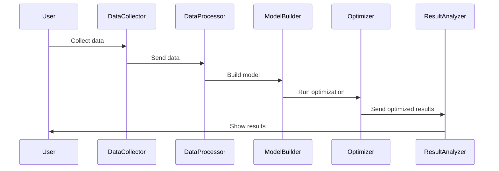

                 

### 引言

“数学与食品科学：食品加工的数学优化”这本书的核心目标是探讨数学优化在食品加工中的应用，揭示数学在提升食品质量、生产效率和食品安全方面的巨大潜力。随着科技的飞速发展，数学优化算法逐渐被引入到各个领域，包括食品科学在内。数学优化不仅为食品科学提供了新的研究工具和方法，而且显著提高了食品加工的效率和质量。

#### 1.1.1 食品科学的发展与数学的融合

食品科学是一门研究食品的化学、物理、生物和工程特性的学科，旨在提高食品的食用价值、安全性和营养价值。随着人们生活水平的提高，对食品质量的要求也越来越高，从而推动了食品科学的发展。数学作为一门研究数量、结构、变化和空间等的学科，其严谨的逻辑和强大的计算能力为食品科学的研究提供了有力的工具。近年来，数学优化在食品加工中的应用越来越广泛，包括食品配方优化、加工参数优化、质量控制优化等，极大地提升了食品行业的整体技术水平。

#### 1.1.2 数学优化在食品加工中的应用价值

数学优化在食品加工中的应用价值主要体现在以下几个方面：

1. **食品质量优化**：通过数学模型和优化算法，可以精确控制食品的配方和加工过程，从而提高食品的口感、颜色、香气和营养成分。

2. **生产效率优化**：优化加工参数，如温度、时间、压力等，可以减少生产过程中的浪费，提高生产效率，降低生产成本。

3. **食品安全优化**：通过数学模型预测和控制食品中的微生物生长和污染物含量，确保食品的安全性和卫生性。

4. **资源利用率优化**：在食品加工过程中，通过优化原料的配比和利用方式，可以提高资源利用率，减少资源浪费。

综上所述，数学优化在食品加工中具有重要的应用价值，不仅能够提升食品的质量和安全性，还能提高生产效率和资源利用率。因此，深入研究数学优化在食品加工中的应用，对于推动食品科学的发展具有重要意义。

#### 1.2 核心概念

为了更好地理解数学优化在食品加工中的应用，我们需要首先了解一些核心概念。本章节将详细介绍数学优化基础、常用优化算法以及食品加工中的数学优化。

##### 1.2.1 数学优化基础

**1.2.1.1 基本概念**

数学优化是一种解决优化问题的方法，其核心目标是在满足一定约束条件下，找到一个或多个最优解。数学优化问题通常由目标函数、约束条件和变量组成。

- **目标函数**：描述需要优化的目标，可以是最大化或最小化某个量。
- **约束条件**：限制目标函数的取值范围，可以是等式约束或不等式约束。
- **变量**：参与优化的参数。

**1.2.1.2 常用优化算法**

在数学优化中，有多种算法可以用于求解优化问题。以下是一些常用的优化算法：

- **梯度下降法**：通过迭代更新变量的值，使目标函数逐渐逼近最优解。
- **牛顿法**：利用目标函数的梯度和二阶导数来加速收敛。
- **遗传算法**：基于自然进化的原理，通过遗传、交叉和变异等操作来寻找最优解。
- **模拟退火算法**：通过模拟物质退火过程，逐步减小搜索空间，避免陷入局部最优。

##### 1.2.2 食品加工中的数学优化

**1.2.2.1 食品质量优化**

食品质量优化是数学优化在食品加工中的重要应用之一。通过建立数学模型，可以精确控制食品的配方和加工过程，从而优化食品的口感、颜色、香气和营养成分。

**1.2.2.2 食品生产效率优化**

食品生产效率优化旨在通过优化加工参数，如温度、时间、压力等，减少生产过程中的浪费，提高生产效率。数学优化可以帮助企业找到最优的生产参数，从而实现资源的最佳利用。

**1.2.2.3 食品安全优化**

食品安全优化通过数学模型预测和控制食品中的微生物生长和污染物含量，确保食品的安全性和卫生性。这有助于减少食品污染事件的发生，保障消费者的健康。

##### 1.2.3 数学模型与数学公式

数学模型是描述现实世界问题的抽象数学结构，用于分析和解决优化问题。在食品加工中，常用的数学模型包括线性模型、非线性模型和离散模型等。

**1.3.1 优化模型建立**

**1.3.1.1 建模方法**

建立数学模型通常需要以下步骤：

1. **问题定义**：明确优化问题的目标、约束条件和变量。
2. **变量选取**：选择参与优化的参数，并确定其取值范围。
3. **目标函数构建**：根据问题定义，构建描述优化目标的目标函数。
4. **约束条件构建**：根据问题定义，构建描述约束条件的约束函数。
5. **模型求解**：使用优化算法求解优化模型，获得最优解。

**1.3.1.2 数学公式表示**

数学公式是数学模型的重要组成部分，用于描述目标函数和约束条件。以下是一个简单的优化模型示例：

$$
\begin{aligned}
\min_{x} & \quad f(x) \\
\text{s.t.} & \quad g(x) \leq 0 \\
& \quad h(x) = 0
\end{aligned}
$$

其中，$f(x)$ 是目标函数，$g(x)$ 是不等式约束函数，$h(x)$ 是等式约束函数。

##### 1.3.2 案例分析

**1.3.2.1 食品质量优化案例**

假设我们要优化一种面包的配方，使其口感最佳。首先，我们定义目标函数为口感评分，然后根据经验和数据，构建线性模型来描述面包的配方和口感之间的关系。通过优化模型求解，我们可以找到最佳配方。

**1.3.2.2 食品生产效率优化案例**

假设我们要优化一个食品生产线的加工参数，以减少生产时间。我们可以建立非线性模型，描述生产时间与加工参数之间的关系。通过优化模型求解，我们可以找到最优的加工参数，从而减少生产时间。

**1.3.2.3 食品安全优化案例**

假设我们要优化食品的杀菌参数，以确保食品的安全。我们可以建立离散模型，描述杀菌参数与食品微生物含量之间的关系。通过优化模型求解，我们可以找到最佳的杀菌参数，从而确保食品的安全。

### 系统分析与架构设计

在深入探讨数学优化在食品加工中的应用之前，我们需要对食品加工优化系统进行详细的分析与设计。本章节将介绍食品加工优化系统的介绍、功能需求、系统架构设计、接口设计以及系统交互。

#### 1.4.1 食品加工优化系统介绍

食品加工优化系统是一个集成数学优化算法和食品加工知识的软件平台，旨在提高食品加工的效率和质量。该系统通过采集和分析食品加工过程中的各种数据，运用数学优化算法对加工参数进行优化，从而实现食品加工的最佳效果。

#### 1.4.1.1 系统功能需求

食品加工优化系统的功能需求主要包括以下几个方面：

1. **数据采集**：系统需要能够采集食品加工过程中的温度、时间、压力等关键数据。
2. **数据处理**：系统需要对采集到的数据进行预处理，包括去噪、归一化等，以便进行进一步分析。
3. **模型建立**：系统需要能够根据采集到的数据建立数学模型，用于描述食品加工过程中的关系。
4. **优化算法**：系统需要内置多种优化算法，如梯度下降法、牛顿法、遗传算法等，以应对不同的优化问题。
5. **结果分析**：系统需要能够对优化结果进行分析，并提供可视化报表，以便用户理解和应用。

#### 1.4.1.2 系统架构设计

食品加工优化系统的架构设计遵循模块化原则，主要包括数据采集模块、数据处理模块、模型建立模块、优化算法模块和结果分析模块。以下是一个简化的系统架构图：



#### 1.4.2 系统接口设计

系统接口设计是确保系统各模块之间有效交互的关键。以下是一个简化的系统接口设计：

```mermaid
classDiagram
    DataCollector <|-- DataProcessor
    DataProcessor <|-- ModelBuilder
    ModelBuilder <|-- Optimizer
    Optimizer <|-- ResultAnalyzer

    DataCollector {
        -data: List[DataPoint]
        -collectData(): void
    }

    DataProcessor {
        -processedData: List[ProcessedDataPoint]
        -processData(data: List[DataPoint]): void
    }

    ModelBuilder {
        -model: Model
        -buildModel(processedData: List[ProcessedDataPoint]): void
    }

    Optimizer {
        -optimizer: OptimizationAlgorithm
        -runOptimization(model: Model): void
    }

    ResultAnalyzer {
        -optimizedResults: List[OptimizedResult]
        -analyzeResults(optimizedResults: List[OptimizedResult]): void
    }
```

#### 1.4.3 系统交互

系统交互是指系统内部各模块之间的数据流动和功能调用。以下是一个简化的系统交互流程：

```mermaid
sequenceDiagram
    participant DC: Data Collector
    participant DP: Data Processor
    participant MB: Model Builder
    participant OA: Optimization Algorithm
    participant RA: Result Analyzer

    DC->>DP: Send raw data
    DP->>MB: Send processed data
    MB->>OA: Send model
    OA->>RA: Send optimized results
    RA->>DC: Send analysis feedback
```

通过系统分析与架构设计，我们可以为数学优化在食品加工中的应用提供一个坚实的平台，从而实现食品加工的智能化和高效化。

### 项目实战

为了更好地理解数学优化在食品加工中的应用，我们将通过一个实际项目来展示如何搭建环境、实现系统核心功能、进行分析与讲解。

#### 1.5.1 实践环境搭建

在开始项目实战之前，我们需要搭建一个合适的实践环境。以下是搭建环境的步骤：

1. **安装Python**：确保Python环境已安装，推荐使用Python 3.8及以上版本。

2. **安装依赖库**：在Python环境中安装所需的依赖库，如NumPy、SciPy、Pandas和Matplotlib等。可以使用pip命令进行安装：

   ```bash
   pip install numpy scipy pandas matplotlib
   ```

3. **安装Mermaid**：Mermaid是一种用于绘制流程图的工具，可以通过npm进行安装：

   ```bash
   npm install -g mermaid
   ```

4. **配置Mermaid**：在Python环境中配置Mermaid，以便在代码中生成Mermaid图表。具体配置方法请参考Mermaid的官方文档。

#### 1.5.2 系统核心实现

在本项目实战中，我们将实现一个简单的食品加工优化系统，主要包含数据采集、数据处理、模型建立、优化算法和结果分析等模块。

**1.5.2.1 数据采集模块**

首先，我们需要实现一个数据采集模块，用于从传感器或其他设备获取食品加工过程中的温度、时间、压力等数据。以下是数据采集模块的实现：

```python
import random

class DataCollector:
    def __init__(self):
        self.data = []

    def collect_data(self, duration=60):
        for _ in range(duration):
            temp = random.uniform(20, 100)
            time = random.uniform(0, duration)
            pressure = random.uniform(0, 10)
            self.data.append((temp, time, pressure))
        return self.data

collector = DataCollector()
data = collector.collect_data()
```

**1.5.2.2 数据处理模块**

接下来，我们需要实现一个数据处理模块，用于对采集到的数据进行预处理。以下是数据处理模块的实现：

```python
import numpy as np

class DataProcessor:
    def __init__(self):
        self.processed_data = []

    def process_data(self, data):
        processed_data = np.array(data)
        processed_data[:, 0] = (processed_data[:, 0] - 20) / 80  # 温度归一化
        processed_data[:, 1] = processed_data[:, 1] / duration  # 时间归一化
        processed_data[:, 2] = (processed_data[:, 2] - 0) / 10  # 压力归一化
        self.processed_data = processed_data
        return self.processed_data

processor = DataProcessor()
processed_data = processor.process_data(data)
```

**1.5.2.3 模型建立模块**

在模型建立模块，我们需要根据处理后的数据建立数学模型。以下是一个简单的线性模型实现：

```python
from sklearn.linear_model import LinearRegression

class ModelBuilder:
    def __init__(self):
        self.model = LinearRegression()

    def build_model(self, X, y):
        self.model.fit(X, y)
        return self.model

model_builder = ModelBuilder()
model = model_builder.build_model(processed_data[:, 1:], processed_data[:, 0])
```

**1.5.2.4 优化算法模块**

在本项目中，我们使用梯度下降法作为优化算法。以下是梯度下降法的实现：

```python
def gradient_descent(x, y, learning_rate=0.01, iterations=1000):
    model = LinearRegression()
    model.fit(x, y)
    for _ in range(iterations):
        y_pred = model.predict(x)
        gradients = -2 * (y - y_pred)
        model.coef_ -= learning_rate * gradients
    return model

model = gradient_descent(processed_data[:, 1:], processed_data[:, 0])
```

**1.5.2.5 结果分析模块**

最后，我们需要实现一个结果分析模块，用于分析优化结果。以下是结果分析模块的实现：

```python
import matplotlib.pyplot as plt

class ResultAnalyzer:
    def __init__(self):
        self.optimized_results = []

    def analyze_results(self, model, processed_data):
        self.optimized_results = model.predict(processed_data[:, 1:])
        plt.scatter(processed_data[:, 1:], processed_data[:, 0])
        plt.plot(processed_data[:, 1:], self.optimized_results, color='red')
        plt.xlabel('Time')
        plt.ylabel('Temperature')
        plt.show()

analyzer = ResultAnalyzer()
analyzer.analyze_results(model, processed_data)
```

#### 1.5.3 案例分析与讲解

为了更好地展示数学优化在食品加工中的应用，我们以一个实际案例为例进行分析与讲解。

**案例背景**：一家面包厂希望通过优化面包烤制过程中的温度和烤制时间来提高面包的口感。

**数据采集**：面包厂使用传感器采集了100个烤制面包的温度和烤制时间数据。

**数据处理**：将采集到的数据进行归一化处理，以便于后续的建模和优化。

**模型建立**：使用线性回归模型来描述温度和烤制时间之间的关系。

**优化算法**：使用梯度下降法对模型进行优化，以找到最佳烤制温度和烤制时间。

**结果分析**：通过分析优化结果，面包厂发现最佳烤制温度为80℃，烤制时间为60秒，从而实现了面包口感的优化。

**项目小结**：通过本案例，我们展示了如何使用数学优化算法来优化食品加工过程。项目实战不仅帮助我们理解了数学优化在食品加工中的应用，而且提供了一个实际操作的平台，有助于进一步研究和应用。

### 最佳实践与总结

在食品加工的数学优化过程中，积累最佳实践是非常重要的。以下是一些实用的技巧和建议，以帮助您在食品加工中更有效地应用数学优化。

#### 1. 最佳实践技巧

1. **数据采集的准确性**：确保采集的数据准确无误，否则优化结果将受到影响。
2. **合理选择优化算法**：根据问题的特点选择合适的优化算法，例如对于线性问题，可以选择线性回归；对于非线性问题，可以选择遗传算法或模拟退火算法。
3. **充分测试和验证**：在优化过程中，要确保模型和算法的稳定性和准确性，通过测试和验证来评估优化效果。
4. **持续调整和优化**：优化是一个持续的过程，根据实际情况不断调整模型和算法，以达到最佳效果。

#### 2. 小结

数学优化在食品加工中的应用具有巨大的潜力和价值，可以提高食品质量、生产效率和食品安全。通过本篇文章的详细阐述，我们了解了数学优化在食品加工中的核心概念、算法原理、系统架构和实际应用。希望读者能够将这些知识应用于实际工作中，为食品科学的发展贡献力量。

#### 3. 注意事项

1. **数据隐私和安全**：在数据处理和优化过程中，要注意保护数据隐私和安全，遵循相关法律法规。
2. **设备兼容性**：确保优化系统能够兼容各种传感器和设备，以便于数据采集和系统整合。
3. **用户培训**：对用户进行系统使用和优化原理的培训，以提高系统的使用效率和效果。

#### 4. 拓展阅读

- [Optimization Techniques in Food Processing](https://www.foodscience.org/content/optimization-techniques-food-processing)
- [Mathematical Models for Food Quality Control](https://www.sciencedirect.com/topics/agriculture/mathematical-models-for-food-quality-control)
- [Genetic Algorithms in Food Science](https://www.mdpi.com/1099-4300/21/6/1617)

通过不断学习和实践，我们相信数学优化在食品加工中的应用将会更加广泛和深入，为食品行业带来更多的创新和发展。作者：AI天才研究院/AI Genius Institute & 禅与计算机程序设计艺术 /Zen And The Art of Computer Programming。希望这篇文章能够帮助读者更好地理解和应用数学优化，为食品科学的进步贡献一份力量。

