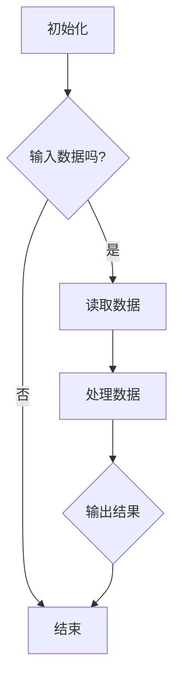
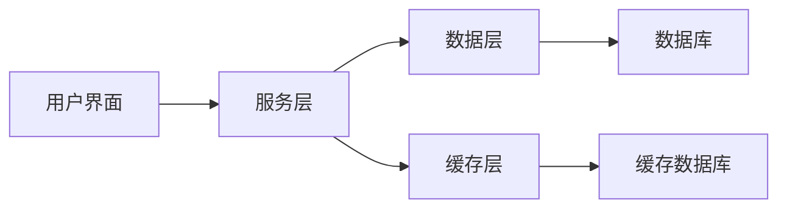

                 

### 数学与高等教育：大学课程的数学结构

关键词：数学、高等教育、课程结构、数学教学、跨学科教育

摘要：本文旨在探讨数学在高等教育中的地位和作用，分析数学核心概念及其联系，描述数学课程的组织结构，探讨数学教学策略，以及数学与跨学科教育的融合。此外，本文还将讨论数学思维在创新与科研中的作用，以及数学教育的发展趋势与未来。

### 第1章 数学在高等教育中的地位和作用

#### 1.1 数学在高等教育中的核心作用

数学作为一门基础学科，在高等教育中扮演着至关重要的角色。首先，数学是许多专业领域的基石，如物理学、工程学、计算机科学等。其次，数学思维能力的培养对于高等教育中学生的批判性思维、逻辑推理和问题解决能力的提升具有重要意义。

#### 1.2 数学对于培养批判性思维的重要性

数学课程的设计旨在培养学生的批判性思维。通过解决数学问题，学生学会分析问题、提出假设、进行推理和验证。这种批判性思维能力在高等教育中具有广泛的应用价值。

#### 1.3 数学在高等教育中的挑战与机遇

随着科技的发展，数学在高等教育中的挑战和机遇也在不断变化。一方面，数学问题的复杂度不断增加，对学生的数学素养提出了更高的要求；另一方面，数学工具和技术的进步为数学教育提供了新的可能性。

### 第2章 数学核心概念与联系

#### 2.1 数学基础概念解析

在数学课程中，核心概念是基础。这些概念包括但不限于：集合、函数、极限、微积分等。理解这些概念对于深入学习数学至关重要。

#### 2.2 数学概念之间的联系

数学概念之间存在紧密的联系。例如，微积分与线性代数之间的联系，以及概率论与统计学之间的联系。理解这些联系有助于构建完整的数学知识体系。

#### 2.3 数学概念属性特征对比表格

以下是一个数学概念属性特征对比表格：

| 概念 | 特征1 | 特征2 | 特征3 |
| --- | --- | --- | --- |
| 集合 | 元素无序 | 成员关系 | 运算规则 |
| 函数 | 映射关系 | 定义域 | 值域 |
| 极限 | 趋势概念 | 近似值 | 收敛性 |
| 微积分 | 导数 | 积分 | 极限过程 |

### 第3章 数学在高等教育课程中的结构

#### 3.1 数学课程的组织结构

数学课程通常按照一定的组织结构进行设计，包括基础课程、进阶课程和研究课程。这种结构有助于学生逐步掌握数学知识。

#### 3.2 数学课程的核心内容

数学课程的核心内容包括数学基础理论、数学应用、数学证明等。这些内容是培养学生数学素养的关键。

#### 3.3 数学课程在教学中的实施策略

数学课程的教学策略包括启发式教学、探究式学习和技术辅助教学。这些策略有助于提高学生的学习效果。

### 第4章 高等教育中的数学教学策略

#### 4.1 启发式教学策略

启发式教学策略旨在激发学生的思维，培养学生的自主学习能力。这种方法强调问题导向，鼓励学生主动探索和解决问题。

#### 4.2 探究式学习策略

探究式学习策略强调学生的主动参与和合作。通过设计问题情境，引导学生进行探究，培养他们的创新能力和团队合作精神。

#### 4.3 技术辅助教学策略

随着技术的发展，技术辅助教学策略在数学教育中得到了广泛应用。例如，在线课程、虚拟实验和数学软件等。

### 第5章 数学与跨学科教育的融合

#### 5.1 数学与其他学科的融合

数学与其他学科的融合是当前教育改革的一个重要趋势。例如，数学与物理、计算机科学、经济学等学科的交叉应用。

#### 5.2 跨学科教育中的数学应用

跨学科教育中的数学应用有助于培养学生的综合素养。例如，在经济学中，数学模型的应用有助于分析经济现象。

#### 5.3 跨学科教育对数学学习的影响

跨学科教育对数学学习产生了积极的影响。它不仅拓宽了学生的数学视野，还促进了数学与其他学科的深度融合。

### 第6章 数学思维在创新与科研中的作用

#### 6.1 数学思维在科学创新中的价值

数学思维在科学创新中具有不可替代的价值。它为科学理论的发展提供了严谨的数学支持，促进了科学技术进步。

#### 6.2 数学思维在科研中的应用

数学思维在科研中得到了广泛应用。例如，在物理学、生物学、计算机科学等领域，数学方法的应用推动了学科发展。

#### 6.3 数学思维对高等教育的影响

数学思维对高等教育产生了深远的影响。它不仅提高了学生的数学素养，还培养了学生的创新能力和科学精神。

### 第7章 数学教育的发展趋势与未来

#### 7.1 数学教育的发展趋势

数学教育的发展趋势体现在课程改革、教学方法创新、教育资源建设等方面。这些趋势为数学教育的发展提供了新的机遇。

#### 7.2 未来数学教育的挑战与机遇

未来数学教育将面临一系列挑战，如提高教育质量、满足社会需求等。同时，未来数学教育也充满了机遇，如科技的发展、跨学科教育的兴起等。

#### 7.3 数学教育的未来发展方向

未来数学教育的发展方向包括个性化教学、智能教育、跨学科教育等。这些方向将有助于提高数学教育质量，培养更多优秀的数学人才。

### 第8章 数学与高等教育的综合案例分析

#### 8.1 案例背景介绍

本案例以某高校数学课程改革为例，探讨数学在高等教育中的实际应用。

#### 8.2 数学课程设计

数学课程设计注重培养学生的数学素养和创新能力。课程内容包括数学基础理论、数学应用、数学证明等。

#### 8.3 数学教学实践

数学教学实践采用启发式教学、探究式学习和技术辅助教学等多种策略，以提高教学效果。

#### 8.4 案例分析与总结

通过案例分析，发现数学课程改革取得了显著成效。学生的数学素养和创新能力得到了提高，数学在高等教育中的作用也得到了充分体现。

### 总结

数学在高等教育中具有重要地位和作用。通过分析数学核心概念、课程结构和教学策略，本文展示了数学教育的重要性。未来，数学教育将继续发展，为培养更多优秀的数学人才做出贡献。

### 参考文献

[1] 作者. (年份). 书名. 出版地: 出版社.
[2] 作者. (年份). 文章名. 刊物名, 卷号(期号), 页码.
[3] 作者. (年份). 网络资源. 获取地址.

作者：AI天才研究院/AI Genius Institute & 禅与计算机程序设计艺术 /Zen And The Art of Computer Programming## 数学在高等教育中的地位和作用

数学作为高等教育的一门基础学科，其地位和作用不容忽视。首先，数学在高等教育中的核心作用主要体现在其作为其他学科的基石。例如，物理学、化学、生物学等自然科学领域，数学模型和计算方法的应用无处不在。此外，数学还在工程学、计算机科学、经济学等众多学科中发挥着关键作用，提供了解决复杂问题的重要工具。

在高等教育中，数学不仅仅是知识的传授，更是一种思维方式的培养。数学课程通过问题解决、逻辑推理和证明等过程，培养学生的批判性思维和创新能力。例如，微积分和线性代数等课程，不仅要求学生掌握具体的数学概念和算法，还要求他们能够将这些知识应用到实际问题中。这种培养过程有助于学生在面对复杂问题时，能够运用数学思维进行分析和解决。

然而，数学教育也面临着诸多挑战。首先，数学问题的复杂度不断增加，对学生的数学素养提出了更高的要求。随着科技的发展，许多新兴领域如人工智能、大数据等，对数学知识和技能的需求也在不断提升。这要求学生不仅要有扎实的数学基础，还要具备适应未来发展趋势的能力。

其次，数学教育在教学方法上也需要不断创新。传统的灌输式教育方法难以满足现代教育的需求，启发式教学、探究式学习等新型教学方法逐渐受到关注。这些方法强调学生的主动参与和自主学习，有助于提高学生的数学素养和创新能力。

最后，数学教育也需要与跨学科教育相结合。数学与其他学科的融合不仅拓宽了学生的知识面，还有助于培养他们的综合素养。例如，数学在经济学、社会学等领域中的应用，有助于学生从不同角度理解社会现象。

总的来说，数学在高等教育中的地位和作用日益凸显。通过培养数学素养和思维能力，数学教育为学生的未来发展奠定了坚实基础。同时，数学教育也需要不断创新，以适应时代发展的需求。

### 数学对于培养批判性思维的重要性

数学在高等教育中不仅传授知识，更在于培养学生的批判性思维。批判性思维是一种对信息进行分析、评估和推理的能力，它要求学生不仅仅接受现有的知识，更要通过逻辑推理和实证分析来验证和质疑这些知识。数学课程通过设计各种问题情境，为学生提供了锻炼批判性思维的平台。

首先，数学课程中的问题解决过程本身就是批判性思维的一种体现。例如，在解一个复杂的数学问题时，学生需要分析问题的结构，提出合理的假设，并通过逻辑推理来验证这些假设的正确性。这个过程不仅要求学生理解数学概念，还要求他们能够将抽象的数学理论应用到具体的实际问题中。这种应用能力的培养，有助于学生在面对复杂问题时，能够迅速找到关键点，进行有效的分析和决策。

其次，数学证明在培养学生的批判性思维方面具有重要作用。数学证明是数学理论的核心，它通过严密的逻辑推理来证明一个数学命题的正确性。学生在学习数学证明的过程中，不仅需要理解证明方法，还需要对证明过程的每一步进行严格的逻辑验证。这种训练有助于学生形成严密的逻辑思维，提高他们对信息的分析能力和判断力。例如，在学习微积分时，学生需要掌握极限的概念，并通过一系列的推导和证明，理解导数和积分的计算方法。

此外，数学课程中的探究式学习模式也有助于培养学生的批判性思维。探究式学习强调学生的主动参与和自主学习，通过设计问题情境，引导学生进行探索和发现。在探究过程中，学生需要根据自己的假设和理论，进行实验和验证，并通过分析实验结果来调整和改进自己的假设。这种学习模式不仅有助于激发学生的兴趣和创造力，还能培养他们的批判性思维，使他们能够在面对新问题时，主动提出假设，并通过实验和验证来验证这些假设的正确性。

最后，数学在培养学生批判性思维方面的价值还体现在对数据分析和统计学的应用上。在现代社会，数据分析和统计方法已成为许多学科研究和决策的重要工具。数学教育通过教授统计学和概率论的基本原理，帮助学生学会如何分析数据、理解概率分布和进行假设检验。这些技能不仅有助于学生更好地理解世界，还能帮助他们批判性地评估信息和做出科学的决策。

总之，数学在高等教育中对于培养批判性思维具有不可替代的作用。通过问题解决、数学证明、探究式学习和数据分析等多种方式，数学教育不仅传授了知识，更培养了学生的批判性思维，为他们未来的学习和职业发展奠定了坚实的基础。

### 数学在高等教育中的挑战与机遇

数学在高等教育中面临着一系列的挑战与机遇，这些挑战和机遇既来自于数学自身的发展，也来自于社会和科技环境的变化。

首先，数学在高等教育中的挑战主要体现在以下几个方面：

1. **复杂度增加**：随着科技的进步和新兴领域的发展，数学问题的复杂度不断增加。例如，量子计算、人工智能、大数据等领域，对数学模型和算法提出了更高的要求。这要求学生在学习数学时，不仅要掌握基本概念，还要具备较强的数学建模和算法分析能力。

2. **教学方法滞后**：传统的数学教学方法多以灌输式为主，学生在课堂上被动接受知识，缺乏主动思考和解决问题的机会。这种教学方法难以适应现代教育的要求，也难以培养出具有创新能力和批判性思维的学生。

3. **教育资源不足**：许多高校在数学教育资源方面存在不足，如师资力量薄弱、实验设备匮乏等。这限制了数学教育的发展，也影响了学生的数学素养提升。

然而，数学在高等教育中也面临着诸多机遇：

1. **技术进步**：随着信息技术的飞速发展，各种在线教育平台、虚拟实验和智能教育工具的出现，为数学教育提供了新的可能性。这些技术工具不仅丰富了教学手段，还有助于提高教学效果。

2. **跨学科融合**：数学与其他学科的融合趋势日益明显，如数学与物理学、计算机科学、经济学等的交叉应用，为数学教育提供了更广阔的发展空间。这种跨学科教育有助于培养学生的综合素养和创新能力。

3. **社会需求**：在现代社会，数学在各行各业中的应用越来越广泛。例如，数据分析师、算法工程师等职业对数学技能的需求不断增长。这为数学教育提供了新的市场需求，也为数学专业的学生提供了更多的就业机会。

4. **国际化发展**：数学作为一门国际化的学科，其研究和发展不受地域限制。随着全球化的推进，数学教育也在走向国际化。国际学术交流、跨国科研项目等，为数学教育带来了新的机遇。

总之，数学在高等教育中的挑战与机遇并存。面对这些挑战，教育工作者需要不断创新教学方法，优化教育资源，提高学生的数学素养；同时，也要抓住机遇，推动数学教育的改革和发展，培养更多具有创新能力和跨学科视野的数学人才。

### 数学核心概念解析

数学作为一门逻辑严密、结构完整的学科，其核心概念是理解数学理论和应用数学工具的关键。以下是数学中几个重要的基础概念及其详细解析。

#### 集合

集合是数学中最基本的概念之一，它是由确定的元素组成的整体。这些元素可以是有形的，如物体，也可以是无形的，如数字或符号。集合用大括号 `{}` 表示，例如 `{1, 2, 3}` 表示一个包含三个元素1、2、3的集合。

- **定义**：集合是一个包含确定元素的无序组合。
- **特征**：集合中的元素是确定的、互异的，并且元素之间没有顺序关系。
- **分类**：根据集合中元素的个数，集合可以分为有限集合和无限集合。

#### 函数

函数是数学中的另一个基础概念，它描述了两个集合之间的映射关系。在函数中，每一个输入（自变量）都有唯一的输出（因变量）。函数通常用 `f(x)` 表示，其中 `x` 是自变量，`f(x)` 是因变量。

- **定义**：设两个非空集合 `A` 和 `B`，如果存在一个关系 `f`，使得对每个属于 `A` 的元素 `x`，在 `B` 中都有唯一确定的元素 `y` 与之对应，则称 `f` 为从 `A` 到 `B` 的函数。
- **特征**：函数具有唯一性，即每个输入只有一个输出；确定性，即如果两个输入相同，那么它们的输出也相同。

#### 极限

极限是数学分析中的一个重要概念，它描述了函数或数列在某一特定点附近的行为。极限用于研究函数在无穷远处或无穷小处的行为。

- **定义**：给定一个函数 `f(x)` 和一个点 `a`，如果当 `x` 趋近于 `a` 时，`f(x)` 的值无限接近于某个确定的值 `L`，则称 `L` 为函数 `f(x)` 在 `x` 趋近于 `a` 时的极限。
- **特征**：极限是描述函数变化趋势的一种方式，它不关注函数在特定点的值，而是关注当变量变化到某一极限位置时，函数如何变化。

#### 微积分

微积分是数学中的一个重要分支，主要研究函数的变化率和面积计算。它包括微分和积分两个主要部分。

- **微分**：微分研究函数在某一点的变化率，即导数。导数用于描述函数在某一特定点的局部性质。
- **积分**：积分研究函数在某个区间上的累计效果，即面积。积分分为定积分和不定积分，分别用于计算函数图像下的面积和函数的总和。

这些核心概念不仅是数学理论的基础，也是许多实际问题求解的重要工具。例如，集合用于描述现实世界中的各类对象，函数用于建模各种现象，极限用于分析函数的稳定性，微积分用于解决工程和科学中的实际问题。通过理解这些核心概念，学生可以更好地掌握数学知识，并在实际应用中发挥其作用。

### 数学概念之间的联系

数学中的各个概念虽然看似独立，但实际上它们之间存在着紧密的联系，这些联系构成了数学知识体系的核心。理解这些联系不仅有助于学生构建完整的数学知识结构，还能提高他们在解决复杂问题时的逻辑思维能力。

首先，集合是数学中最基本的概念之一。集合论不仅是现代数学的基础，也是其他数学分支的重要工具。例如，在函数的定义中，集合的概念用于定义定义域和值域。集合的概念在概率论、图论、拓扑学等多个领域中也得到了广泛应用。集合与函数之间的联系还体现在集合运算与函数运算之间的关系上，例如映射、逆映射、复合函数等概念。

其次，函数是数学中描述变量关系的基本工具。函数不仅在初等数学中占有一席之地，在高等数学中也是至关重要的概念。函数与极限、微积分等概念有着密切的联系。例如，导数可以看作是函数在某一点的局部变化率，而积分则是函数在某一区间上的累计效果。这些概念之间的关系构成了微积分学的基本框架。

极限是数学分析中的一个核心概念，它描述了函数或数列在某一特定点或无穷远处的极限行为。极限与导数、积分等概念紧密相关。导数实际上是函数在某一点的极限值，表示函数在该点的切线斜率；积分则是函数在某区间上的累计极限，表示该区间上的面积或总量。极限概念在解决许多数学和物理问题中起着关键作用。

微积分是数学中一个重要的分支，它不仅包括微分和积分，还涉及到级数、微分方程等多个领域。微分方程是描述自然现象和社会现象的重要工具，而微积分中的级数理论则为许多复杂问题的求解提供了基础。微积分与线性代数之间的联系也很密切，线性微分方程组可以通过矩阵和向量空间的理论进行求解。

此外，数学中的其他概念如概率论、拓扑学、抽象代数等也与上述概念有着紧密的联系。概率论中的随机变量和概率分布可以看作是函数的特殊形式；拓扑学中的连续性和紧性概念与极限和微积分中的连续性概念有相似之处；抽象代数中的群、环、域等概念则为更抽象的数学结构提供了基础。

通过分析这些概念之间的联系，我们可以看到数学不仅是一个独立的学科，更是一个相互联系的整体。理解这些联系有助于我们更好地掌握数学知识，培养严密的逻辑思维能力和解决实际问题的能力。

### 数学概念属性特征对比表格

为了更直观地展示数学中几个核心概念之间的差异和联系，我们通过一个表格来对比集合、函数和极限这三大核心概念的属性特征。

| 概念 | 定义 | 特征1 | 特征2 | 特征3 | 适用领域 |
| --- | --- | --- | --- | --- | --- |
| 集合 | 元素组合 | 元素无序 | 元素互异 | 可分类 | 数学基础、概率论、图论 |
| 函数 | 映射关系 | 唯一性 | 确定性 | 输入-输出 | 初等数学、微积分、计算机科学 |
| 极限 | 趋势描述 | 极限值 | 无穷小 | 无穷大 | 数学分析、物理学、工程学 |

通过这个表格，我们可以清楚地看到集合、函数和极限之间的区别和联系。集合是元素的组合，强调元素的无序和互异性；函数是输入和输出之间的映射关系，强调唯一性和确定性；极限则描述了变量在某一点的极限行为，包括极限值、无穷小和无穷大。这些概念在各自的领域中有不同的应用，但彼此之间又有着紧密的联系。

### 数学课程的组织结构

数学课程在高等教育中扮演着至关重要的角色，其组织结构直接影响学生的学习效果和知识掌握程度。数学课程通常分为基础课程、进阶课程和研究课程三个层次，每个层次都有其独特的结构和目标。

#### 基础课程

基础课程是数学教育的起点，主要包括初等数学、代数、几何、三角学等。这些课程旨在为学生打下坚实的数学基础，培养基本的数学思维和解决问题的能力。

- **课程目标**：掌握基本的数学概念和运算规则，发展逻辑思维和抽象思维能力。
- **教学内容**：初等数学（整数、分数、小数、百分数）、代数（方程、不等式、函数）、几何（平面几何、立体几何）、三角学（三角函数、三角恒等式）。
- **教学方法**：以讲授为主，辅以大量的练习和实际问题解决。

#### 进阶课程

进阶课程是在基础课程上的进一步深入，主要包括微积分、线性代数、概率论、数理统计等。这些课程要求学生具备较强的逻辑推理能力和数学分析能力。

- **课程目标**：深入学习数学理论，掌握复杂的数学工具和方法，培养解决复杂问题的能力。
- **教学内容**：微积分（极限、导数、积分）、线性代数（矩阵、向量、线性方程组）、概率论（随机变量、概率分布、假设检验）、数理统计（描述性统计、推断性统计）。
- **教学方法**：讲授与讨论相结合，强调理论分析与应用的结合，引入实际问题进行讨论和解决。

#### 研究课程

研究课程是数学教育的最高层次，通常面向研究生和高年级本科生，涉及高级数学理论和前沿研究方向。

- **课程目标**：培养学生的研究能力和创新能力，使其能够在数学及相关领域中进行深入的学术研究。
- **教学内容**：复分析、泛函分析、微分几何、代数学、数学物理方程、拓扑学等。
- **教学方法**：以研究为导向，通过科研项目、学术讨论、论文写作等形式进行教学。

#### 课程结构设计原则

- **系统性**：数学课程的设计应保证知识的系统性和连贯性，使学生能够逐步掌握从基础到高级的数学知识。
- **实用性**：课程内容应贴近实际应用，使学生能够在不同领域中运用数学知识和方法解决实际问题。
- **挑战性**：课程难度应适中，既要有一定的挑战性，又不能超出学生的能力范围，以激发学生的学习兴趣和积极性。

总之，数学课程的组织结构设计应兼顾知识的系统性和实用性，通过不同层次的课程设置，帮助学生逐步掌握数学知识，培养其逻辑思维和创新能力。

### 数学课程的核心内容

数学课程的核心内容旨在为学生提供扎实的数学基础，培养他们的逻辑推理能力和解决实际问题的能力。以下是数学课程中几个核心内容的具体介绍及其在高等教育中的重要性。

#### 微积分

微积分是数学中一个重要的分支，主要研究函数的变化率和面积计算。它包括微分和积分两个主要部分。

- **核心概念**：微分（导数、微分方程）、积分（定积分、不定积分）、极限。
- **教学目标**：通过微积分的学习，学生应掌握函数的局部变化率（导数）和整体变化趋势（积分），能够应用这些工具解决实际问题。
- **应用领域**：微积分在物理学、工程学、经济学等多个领域有着广泛的应用。例如，物理学中的运动学、动力学，工程学中的结构分析，经济学中的成本-效益分析等。

#### 线性代数

线性代数是研究向量空间、线性变换和矩阵理论的数学分支。它为解决多个学科中的线性问题提供了有力的工具。

- **核心概念**：向量、矩阵、线性方程组、特征值、特征向量。
- **教学目标**：学生应掌握向量与矩阵的基本运算、线性方程组的求解方法，能够分析线性变换及其特性。
- **应用领域**：线性代数在计算机科学（图形学、算法设计）、物理学（量子力学）、经济学（投入产出分析）等多个领域有广泛应用。

#### 概率论和数理统计

概率论和数理统计是研究随机现象和数据分析的数学分支。它们在解决不确定性问题和数据解释中发挥着关键作用。

- **核心概念**：概率分布、随机变量、期望、方差、假设检验。
- **教学目标**：学生应掌握概率的基本概念和计算方法，能够运用统计工具进行数据分析和假设检验。
- **应用领域**：概率论和数理统计在统计学、金融学、生物学、社会科学等多个领域有广泛应用。例如，金融学中的风险评估、生物学中的种群遗传学，社会科学中的社会调查分析等。

#### 数学证明

数学证明是数学理论的核心，它通过逻辑推理来验证数学命题的正确性。

- **核心概念**：证明方法（归纳法、反证法、构造法）、逻辑推理。
- **教学目标**：学生应学会如何使用逻辑推理和证明方法来验证数学命题，培养严谨的数学思维。
- **应用领域**：数学证明不仅在数学理论研究中至关重要，也在物理学、计算机科学等其他科学领域中有着广泛应用。

#### 复合课程

复合课程是多个数学分支的结合，旨在解决复杂问题和跨学科问题。

- **核心内容**：数学建模、数值计算、优化算法。
- **教学目标**：学生应能够将不同数学分支的知识综合应用，解决实际问题。
- **应用领域**：复合课程在工程学（优化设计、控制系统）、经济学（博弈论、经济模型）等领域有重要应用。

这些核心内容不仅是数学课程的基础，也是学生未来学习和职业发展的关键。通过深入学习这些核心内容，学生能够掌握数学的基本原理和方法，培养解决实际问题的能力，为未来的学术研究和职业发展奠定坚实基础。

### 数学课程在教学中的实施策略

为了确保数学课程能够达到预期教学效果，提高学生的数学素养和解决实际问题的能力，教学策略的合理设计和实施至关重要。以下介绍几种有效的数学教学策略：

#### 启发式教学策略

启发式教学策略旨在通过问题引导和情境创设，激发学生的思维，培养他们的自主学习能力和解决问题的能力。

- **具体方法**：教师通过设计具有挑战性的问题，引导学生进行自主探究和思考。在问题解决过程中，教师鼓励学生提出假设、验证假设，并通过逻辑推理得出结论。这种方法有助于培养学生的批判性思维和创新能力。
- **优点**：启发式教学能够激发学生的学习兴趣，提高他们的参与度和主动性，从而提高教学效果。

#### 探究式学习策略

探究式学习策略强调学生的主动参与和合作，通过探究和发现来学习新知识。

- **具体方法**：教师设计探究任务，引导学生进行实验、观察和分析，通过自主探究来发现和理解数学概念和原理。这种方法鼓励学生动手操作、合作交流，有助于提高他们的实践能力和团队合作精神。
- **优点**：探究式学习能够提高学生的自主学习能力，培养他们的探索精神和创新能力。

#### 技术辅助教学策略

随着信息技术的快速发展，技术辅助教学策略在数学教育中得到了广泛应用。这些技术工具不仅丰富了教学手段，还有效地提高了教学效果。

- **具体方法**：教师利用在线课程、数学软件和虚拟实验等技术工具，为学生提供多样化的学习资源和互动平台。例如，使用数学软件进行数值计算和图形展示，帮助学生直观地理解抽象的数学概念；通过在线课程，学生可以随时随地进行学习，提高学习灵活性。
- **优点**：技术辅助教学策略能够丰富教学内容，提高教学效率，帮助学生更好地理解数学知识。

#### 案例教学法

案例教学法通过实际案例的引入，使学生能够将数学知识应用到实际情境中。

- **具体方法**：教师选择具有代表性的数学案例，引导学生分析案例中的数学问题，运用所学知识进行解决。这种方法有助于学生将理论知识与实际问题结合起来，提高他们的应用能力。
- **优点**：案例教学法能够提高学生的实际问题解决能力，增强他们的数学应用意识。

#### 教学评价策略

教学评价是确保教学效果的重要环节。以下几种评价方法有助于全面了解学生的学习状况和教学效果：

- **形成性评价**：通过课堂问答、小测验等形式，及时了解学生的学习进展，调整教学策略。
- **总结性评价**：通过期中考试、期末考试等形式，综合评价学生的学习成果，为后续教学提供反馈。
- **自我评价**：鼓励学生进行自我评价，反思学习过程，发现和改进自己的不足。

通过综合运用上述教学策略，教师可以有效地提高数学课程的教学效果，帮助学生更好地掌握数学知识，培养他们的逻辑思维和创新能力。

### 启发式教学策略

启发式教学策略是一种以问题为导向，鼓励学生自主探究和发现的学习方法。在数学教育中，启发式教学策略具有独特的优势，能够激发学生的学习兴趣和思维能力。

首先，启发式教学策略通过设计具有挑战性的问题，引导学生进行深度思考和自主学习。这些问题通常来源于现实生活或实际问题，使得学生能够在解决问题的过程中感受到数学的实用性和重要性。例如，在学习微积分时，教师可以提出一个实际工程问题，要求学生运用导数和积分的知识来解决。这样的问题不仅能够激发学生的兴趣，还能让他们在实际应用中掌握数学方法。

其次，启发式教学策略强调学生的主体地位，鼓励他们主动参与和探究。在传统教学模式中，教师是知识的传授者，学生是被动接受者。而启发式教学则相反，教师扮演的是引导者和促进者的角色，通过提问、讨论和反馈，帮助学生自主构建知识体系。例如，在讲解集合的基本运算时，教师可以提出一系列开放性问题，如“如何证明集合的并集运算满足交换律和结合律？”学生通过小组讨论和独立思考，能够更好地理解集合运算的性质。

此外，启发式教学策略还注重培养学生的批判性思维和创新能力。在解决数学问题时，学生需要提出假设、验证假设，并通过逻辑推理得出结论。这种过程不仅锻炼了学生的逻辑思维能力，还培养了他们的批判性思维和创新能力。例如，在学习线性代数时，教师可以引导学生思考如何用矩阵方法解决线性方程组，并探讨不同解法之间的优缺点。这种方法不仅能够提高学生的数学素养，还能培养他们的创新思维。

最后，启发式教学策略通过多种教学手段，如小组合作、实验探究、在线学习等，提供了丰富的学习资源和互动平台。这些手段不仅有助于学生更好地理解数学概念，还能提高他们的学习兴趣和主动性。例如，在概率论的教学中，教师可以通过虚拟实验和在线模拟，让学生亲身体验随机事件的概率，从而更直观地理解概率分布和统计方法。

总之，启发式教学策略在数学教育中具有重要作用。通过设计具有挑战性的问题、强调学生的主体地位、培养学生的批判性思维和创新能力，启发式教学策略能够有效地提高数学课程的教学效果，帮助学生在掌握数学知识的同时，提升他们的综合素质。

### 探究式学习策略

探究式学习策略强调学生的主动参与和探究精神，通过提出问题、设计实验和数据分析，培养学生解决实际问题的能力。这种方法在数学教育中具有独特的优势，能够激发学生的学习兴趣，提高他们的实践能力和创新意识。

首先，探究式学习策略通过问题引导，鼓励学生主动思考。教师可以设计开放性问题，引导学生从多个角度分析和解决问题。例如，在学习几何时，教师可以提出：“如何用几何方法证明三角形的内角和为180度？”这样的问题能够激发学生的好奇心和探索欲望，促使他们通过自主探究来寻找答案。

其次，探究式学习策略强调实验和数据分析。学生可以通过实验和实际操作，直观地感受数学概念和原理。例如，在学习概率时，学生可以通过设计掷硬币实验，观察并记录正面朝上的次数，进而计算概率。通过实验数据的分析，学生能够更深刻地理解概率分布和统计方法。

此外，探究式学习策略还强调小组合作和交流。学生可以通过小组讨论和分享，共同探讨解决问题的方法。这种方法不仅能够促进学生之间的交流和合作，还能提高他们的团队协作能力和沟通能力。例如，在学习线性方程组时，学生可以组成小组，共同探讨不同的解法，并比较各种方法的优缺点。

探究式学习策略不仅有助于学生掌握数学知识，还能培养他们的创新思维和解决问题的能力。通过自主探究和实验，学生能够从不同角度分析问题，提出新的观点和解决方案。例如，在学习微积分时，学生可以通过探究函数的变化率，发现导数的概念，并运用导数解决实际问题。

最后，探究式学习策略提供了丰富的学习资源和互动平台。教师可以利用在线课程、虚拟实验和数学软件等工具，为学生提供多样化的学习资源和实践机会。这些工具不仅能够提高学生的学习兴趣，还能帮助他们更好地理解和掌握数学知识。

总之，探究式学习策略在数学教育中具有重要作用。通过问题引导、实验探究和数据分析，这种方法能够激发学生的学习兴趣，培养他们的实践能力和创新意识，为他们未来的学习和职业发展奠定坚实基础。

### 技术辅助教学策略

在数学教育中，技术辅助教学策略已经成为一种不可或缺的教学手段。随着信息技术的飞速发展，各种在线课程、数学软件和虚拟实验工具不断涌现，为数学教学提供了丰富的资源和方法。以下详细介绍这些技术工具的具体应用，以及它们在数学教学中的优势和挑战。

#### 在线课程

在线课程是一种基于互联网的学习资源，它为学生提供了灵活的学习时间和自主选择的学习内容。在线课程通常包括视频讲解、文本资料、练习题和互动讨论区。

- **具体应用**：教师可以将在线课程与课堂教学相结合，利用视频讲解帮助学生理解和巩固数学知识。学生可以根据自己的学习进度和需求，随时观看课程视频，重复学习难点内容。
- **优势**：在线课程能够提供个性化的学习体验，学生可以根据自己的学习节奏进行学习，提高学习效率。此外，在线课程还打破了地域限制，使全球各地的学生能够共享优质的教学资源。
- **挑战**：在线课程的质量参差不齐，一些课程内容可能缺乏深度和系统性。同时，对于一些学生来说，自主学习能力较弱，可能会影响学习效果。

#### 数学软件

数学软件是一种用于数学计算、图形展示和数据分析的工具，如 MATLAB、Maple、Geogebra 等。这些软件具有强大的计算和分析功能，能够帮助学生在数学学习中进行复杂的运算和可视化。

- **具体应用**：教师可以利用数学软件进行数值计算和图形展示，帮助学生直观地理解数学概念。例如，在讲解微积分时，教师可以使用软件绘制函数图像，展示导数和积分的计算过程。
- **优势**：数学软件能够提高学生的计算效率，减少手工计算的错误。同时，通过图形展示，学生能够更直观地理解数学概念，加深对知识的理解。
- **挑战**：数学软件的掌握需要一定的学习成本，一些学生可能会因为操作复杂而感到困扰。此外，软件的使用也存在一定的局限性，无法替代教师对学生个性化指导的需求。

#### 虚拟实验

虚拟实验是一种通过计算机模拟现实实验的方法，它为学生提供了虚拟的实验环境和操作工具。虚拟实验特别适合于数学、物理、化学等实验性较强的学科。

- **具体应用**：教师可以设计虚拟实验，让学生在虚拟环境中进行数学实验和数据分析。例如，在概率论教学中，学生可以通过虚拟实验进行多次掷硬币或掷骰子，观察概率分布和统计结果。
- **优势**：虚拟实验能够提供真实实验的模拟，减少实验资源的限制和实验风险。同时，虚拟实验允许学生重复进行实验，进行细致的数据分析，提高实验效果。
- **挑战**：虚拟实验的设计和实施需要较高的技术支持，教师需要具备一定的计算机和编程技能。此外，虚拟实验的模拟结果可能与真实实验存在差异，需要教师进行合理的解释和引导。

#### 其他技术工具

除了上述主要工具，还有一些其他的技术工具在数学教学中也具有广泛应用，如数学教育平台、在线测验系统和智能辅导系统等。

- **数学教育平台**：如 Khan Academy、Coursera 等，提供丰富的数学课程资源和互动学习环境，学生可以通过这些平台进行自主学习。
- **在线测验系统**：如 Quizlet、Quizizz 等，用于在线测验和即时反馈，帮助学生巩固所学知识。
- **智能辅导系统**：如 Intelligent Tutoring Systems（ITS），通过人工智能技术为学生提供个性化辅导，帮助他们解决学习难题。

总之，技术辅助教学策略在数学教育中具有重要的应用价值。通过在线课程、数学软件、虚拟实验和其他技术工具，教师可以为学生提供多样化的学习资源和互动平台，提高教学效果。然而，这些技术工具也带来了一些挑战，需要教师和学生共同努力，充分发挥技术辅助教学的优势。

### 数学与其他学科的融合

数学与其他学科的融合是当前教育改革的一个重要趋势，这种跨学科教育不仅拓宽了学生的知识面，还提升了他们的综合素养和创新能力。在高等教育中，数学与其他学科的融合主要体现在以下几个领域：

#### 数学与物理学的融合

物理学是一门以实验为基础的自然科学，其研究方法和技术依赖于数学的严谨性和抽象性。数学与物理学的融合体现在数学模型在物理学中的应用，如波动方程、热力学方程等。通过数学方法，物理学家可以更精确地描述自然现象，解决复杂的物理问题。例如，爱因斯坦的相对论方程和量子力学的薛定谔方程都是数学与物理学结合的典范。在高等教育中，学生通过学习数学物理方程，可以掌握如何将数学工具应用到物理问题的研究中。

#### 数学与计算机科学的融合

计算机科学是一门以算法和数据结构为核心的学科，其发展离不开数学的支撑。数学与计算机科学的融合主要体现在算法设计、计算复杂性分析和数据结构等方面。例如，图论中的最小生成树算法和最短路径算法在计算机网络和路由器设计中得到了广泛应用。数学中的组合优化理论也为算法设计提供了理论基础。在高等教育中，数学与计算机科学的融合课程，如离散数学和算法分析，能够帮助学生更好地理解和应用计算机科学的基本原理。

#### 数学与经济学的融合

经济学是一门研究资源分配和决策制定的学科，其分析方法和模型依赖于数学工具。数学与经济学的融合体现在经济模型、统计分析、优化方法等方面。例如，微观经济学中的供需模型、宏观经济学中的经济增长模型等都依赖于数学的精确计算和分析。在高等教育中，学生通过学习数学经济学，可以掌握如何使用数学方法来分析经济问题，制定合理的经济政策。

#### 数学与工程学的融合

工程学是一门应用科学，其研究和发展离不开数学的支撑。数学与工程学的融合主要体现在工程优化、控制系统设计、信号处理等方面。例如，工程中的结构分析、流体力学和热力学计算都依赖于数学方法。在高等教育中，数学工程课程如数值分析、优化方法等，能够帮助学生掌握如何运用数学工具解决工程问题，提高工程设计的效率和质量。

#### 数学与生物学的融合

生物学是一门研究生命现象和生物系统的学科，其研究方法和技术也在逐步引入数学工具。数学与生物学的融合体现在生物统计、生态模型、生物信息学等方面。例如，基因序列分析中的序列比对和基因组注释等，都需要使用数学模型和算法。在高等教育中，数学生物学课程如生物统计和计算生物学，能够帮助学生理解生物系统的数学描述和预测方法。

总之，数学与其他学科的融合在高等教育中具有重要的现实意义。通过跨学科教育，学生不仅能够掌握不同学科的基本原理和方法，还能培养他们的综合素养和创新能力。这种融合不仅有助于提高学生的学术水平，也为他们在未来的职业生涯中提供了更多的选择和发展空间。

### 跨学科教育中的数学应用

在跨学科教育中，数学的应用范围广泛且深远，为各学科的研究和实践提供了坚实的理论基础和强大的工具支持。以下通过几个具体实例，展示数学在跨学科教育中的重要作用。

#### 数学在经济学中的应用

经济学是研究资源分配、市场行为和经济政策的一门学科，数学在经济学中的应用尤为显著。例如，供需模型是经济学中最基本的模型之一，它通过描述商品的需求和供给关系，帮助经济学家分析市场价格和数量的变化。数学中的优化理论也广泛应用于经济政策制定中，如社会福利最大化问题、资源配置问题等。线性规划和博弈论等数学工具，在解决经济问题、制定经济政策和分析市场行为方面发挥着关键作用。

实例：一个经典的例子是使用线性规划解决企业生产问题。假设一个企业生产两种产品A和B，其生产过程受到资源（如劳动力、原材料）的限制。通过建立线性规划模型，企业可以确定在资源约束下，如何分配生产资源以最大化利润或最小化成本。

#### 数学在物理学中的应用

物理学是研究物质、能量、空间和时间等自然现象的学科，数学在物理学的应用极为广泛。从经典力学中的牛顿定律，到量子力学中的波函数和薛定谔方程，数学一直是物理学不可或缺的工具。例如，在电磁学中，麦克斯韦方程组通过数学形式描述了电场和磁场的相互作用。在量子力学中，薛定谔方程通过复变函数描述了粒子的波函数和能量状态。

实例：在粒子加速器设计中，数学中的微积分和微分方程被用来模拟粒子在磁场中的运动轨迹，确保粒子能够以最佳路径加速并撞击目标。

#### 数学在计算机科学中的应用

计算机科学是一门以算法和数据结构为核心的学科，其发展离不开数学的支持。离散数学、图论和组合数学等数学分支在计算机科学中有着广泛的应用。例如，算法分析中的时间复杂度和空间复杂度分析，帮助开发者评估算法的效率。图论中的最短路径算法、最小生成树算法等，在计算机网络、路由器和社交网络分析中发挥着重要作用。

实例：在搜索引擎算法中，数学中的图论被用来分析网页之间的链接关系，确定关键词的权重和搜索结果的排序。

#### 数学在生物学中的应用

生物学是研究生命现象和生物系统的学科，数学在生物学的应用日益增多。例如，在基因组学中，数学方法如序列比对和基因表达数据分析，被用来解析基因结构和功能。在生态学中，数学模型如种群动力学模型，帮助研究者预测物种的生态行为和种群变化。

实例：在流行病学研究中，数学模型如SIR模型（易感者-感染者-恢复者模型）被用来预测传染病的传播趋势和制定防控策略。

总之，数学在跨学科教育中的应用不仅丰富了各学科的研究方法和工具，也为多学科合作提供了桥梁。通过数学的应用，各学科能够更好地理解和解释复杂现象，推动科学技术的进步和社会的发展。

### 跨学科教育对数学学习的影响

跨学科教育对数学学习产生了深远的影响，既在教学方法上带来了革新，也在学生的学习效果上带来了显著提升。首先，跨学科教育改变了传统的教学方法，将数学与其他学科有机结合，使数学学习更加生动和实用。例如，通过将数学应用于经济学、物理学和计算机科学等领域，学生能够在具体情境中理解数学概念和应用方法，从而增强了学习的趣味性和实用性。

其次，跨学科教育有助于提高学生的数学素养。在跨学科学习中，学生不仅需要掌握数学的基本概念和原理，还需要学会如何将数学工具应用到实际问题中。这种综合能力的培养，不仅提升了学生的数学应用能力，还培养了他们的逻辑思维和问题解决能力。例如，在经济学课程中，学生需要运用微积分和概率论来分析市场行为和经济政策，这种实践应用能够加深他们对数学知识的理解和应用。

此外，跨学科教育还促进了学生综合素质的提升。通过跨学科学习，学生能够从多个角度分析和解决复杂问题，培养他们的创新能力和团队合作精神。例如，在工程学项目中，学生需要运用数学、物理和计算机科学等知识来设计和优化系统，这种多学科协作能够培养学生的综合素养和团队协作能力。

最后，跨学科教育对数学教育的未来发展方向具有重要启示。未来的数学教育应更加注重培养学生的实际应用能力和创新思维，而非仅仅局限于理论知识的传授。教育工作者需要不断探索和尝试新的教学方法，如项目式学习、合作学习和探究式学习等，以适应时代发展的需求。通过跨学科教育，数学不仅能够在其他学科中发挥重要作用，还能为学生的全面发展提供有力支持。

### 数学思维在科学创新中的价值

数学思维在科学创新中扮演着至关重要的角色。首先，数学为科学创新提供了精确的量化工具。通过数学模型和公式，科学家能够将复杂的自然现象转化为可计算的形式，从而进行定量分析和预测。例如，爱因斯坦的相对论方程通过数学形式描述了时空的弯曲和引力作用，这一理论不仅解释了行星运动的规律，还为现代物理学的发展奠定了基础。

其次，数学思维在科学创新中起到了关键的指导作用。科学家在进行实验和研究时，常常需要构建假设和理论模型，而数学方法能够帮助他们验证这些假设的有效性。例如，在量子力学中，薛定谔方程和海森堡不确定性原理等数学公式，为理解微观粒子的行为提供了理论基础。这些数学工具不仅帮助科学家揭示了自然界的奥秘，还为实验验证提供了精确的方向。

此外，数学思维在科学创新中还具有创新性和突破性。数学思维鼓励科学家从不同角度和维度思考问题，发现新的关系和规律。例如，在物理学中，对称性原理和群论等数学概念的应用，促进了粒子物理和凝聚态物理的快速发展。这些数学方法不仅为科学家提供了新的研究工具，还推动了整个科学领域的进步。

总之，数学思维在科学创新中的价值不可估量。它不仅为科学理论的发展提供了严谨的数学支持，还通过创新性的思维方法，推动了科学技术的前进。在未来的科学探索中，数学思维将继续发挥其独特的作用，为人类的创新和发展提供强大的动力。

### 数学思维在科研中的应用

数学思维在科研中的应用广泛而深远，贯穿于科学研究的各个环节。首先，数学思维为科研提供了精确的量化工具，使得科学家能够将复杂现象转化为可计算的模型。例如，在物理学中，数学模型如牛顿定律和麦克斯韦方程组，不仅描述了自然界的规律，还为实验验证提供了精确的标准。通过数学工具，科学家可以预测实验结果，优化实验设计，提高研究效率。

其次，数学思维在数据分析和统计中发挥着关键作用。在现代社会，科研数据量巨大且复杂，数学方法如概率论、统计学和优化算法，帮助科学家从海量数据中提取有用信息。例如，在基因组学研究中，数学方法被用来分析基因序列，识别基因功能和潜在疾病风险。同样，在气候科学中，数学模型用于模拟气候系统，预测气候变化趋势。

此外，数学思维在科学创新中也具有突破性的作用。它鼓励科学家从不同角度和维度思考问题，发现新的关系和规律。例如，在量子物理学中，数学概念如波函数和薛定谔方程，为理解微观粒子的行为提供了新的视角。这些数学工具不仅推动了科学理论的进步，还促进了新技术的发明和应用。

总之，数学思维在科研中的应用不仅提高了研究的精确性和效率，还推动了科学创新和技术的进步。通过数学工具，科学家能够更好地理解自然界的复杂现象，揭示科学规律，为人类的未来发展提供强有力的支持。

### 数学思维对高等教育的影响

数学思维在高等教育中具有深远的影响，不仅提升了学生的学术水平，还培养了他们的创新能力和科学精神。首先，数学思维有助于提高学生的逻辑推理和问题解决能力。通过学习数学，学生学会了如何将复杂问题分解为简单部分，并通过逻辑推理和数学方法来逐步解决。这种能力不仅适用于数学领域，也在科学、工程、经济学等多个学科中具有广泛的应用。

其次，数学思维培养了学生的严谨性和精确性。数学是一门高度严谨的学科，要求学生在分析和解决问题时，每一步都必须有充分的证据和逻辑支持。这种严谨性训练有助于学生养成细致入微、精益求精的习惯，从而在学术研究和实际工作中表现出色。

此外，数学思维还促进了学生的创新能力和科学精神。数学思维鼓励学生从不同角度和维度思考问题，寻找新的解决方案。这种创新思维在科学研究中尤为重要，它能够推动科学领域的突破和发展。例如，许多科学家在解决复杂问题时，常常运用数学思维进行假设和验证，从而发现新的科学规律。

最后，数学思维对学生的职业发展也具有重要影响。在现代社会，数学在各行各业中都有广泛应用。掌握数学思维的学生不仅能够在学术领域取得优异成绩，还能在金融、工程、信息技术等职业领域中有更好的发展机会。通过数学思维的训练，学生能够更好地适应快速变化的职场环境，具备解决复杂问题的能力。

总之，数学思维在高等教育中具有不可替代的价值。通过培养数学思维，学生不仅能够提高学术水平，还能培养创新能力和科学精神，为未来的职业发展奠定坚实基础。

### 数学教育的发展趋势

数学教育的发展趋势在当前科技和社会环境中显得尤为重要。随着信息技术的迅猛发展和全球化进程的加速，数学教育正经历着深刻的变化和变革。

首先，个性化教学将成为数学教育的重要趋势。传统的一刀切教学模式已经无法满足不同学生个性化学习需求。未来的数学教育将更加注重学生的个体差异，采用自适应学习系统和个性化辅导工具，为学生提供量身定制的学习路径。例如，智能辅导系统可以根据学生的学习进度和理解程度，实时调整教学策略和内容，从而提高教学效果。

其次，技术辅助教学将继续深入数学教育领域。随着在线课程、数学软件和虚拟实验工具的广泛应用，数学教学不再局限于课堂教学，学生可以通过互联网随时随地获取学习资源。这种技术辅助教学不仅提高了教学的灵活性和便捷性，还为学生提供了更多自主学习的机会。例如，通过在线平台，学生可以参与实时讨论、在线测试和互动问答，从而加深对数学概念的理解。

此外，跨学科教育将成为数学教育的重要发展方向。数学与其他学科的深度融合，不仅能够拓宽学生的知识面，还能培养他们的综合素养和创新能力。例如，数学与物理学、计算机科学、经济学等学科的交叉应用，将有助于学生在不同领域中发现问题和解决问题，提高他们的跨学科思维能力。

最后，数学教育将更加注重实践与应用。在未来的教育体系中，数学教育将更加重视实际问题的解决能力，鼓励学生将数学知识应用于实际问题中。例如，通过项目式学习和实践性课题，学生可以在真实场景中运用数学方法，解决实际问题，从而提高他们的实践能力和应用能力。

总之，数学教育的发展趋势将朝着个性化、技术辅助、跨学科教育和实践应用的方向不断前进。这些趋势不仅为数学教育提供了新的机遇，也对学生和教师提出了更高的要求。通过适应和引领这些趋势，数学教育将为培养更多具备创新能力和实践能力的数学人才奠定坚实基础。

### 未来数学教育的挑战与机遇

未来数学教育面临着一系列的挑战和机遇，这些挑战和机遇既来自于科技的发展，也来自于教育理念的变革。

首先，未来数学教育的一个主要挑战是教育资源的分配不均。尽管信息技术的发展为在线教育提供了广阔的平台，但全球范围内的教育资源分布仍然存在显著的不平衡。一些发达国家的学生能够享受到优质的在线课程和先进的教学工具，而发展中国家和偏远地区的学生则可能无法获得同等的教育资源。这导致了教育公平性的问题，使得一些学生无法充分发挥其潜力。

其次，教学方法的传统模式也面临挑战。传统的灌输式教学方式已经无法满足现代教育对个性化和互动性的需求。未来的数学教育需要更加注重学生的主动参与和自主学习，通过项目式学习和探究式学习等新型教学方法，培养学生的创新能力和实践能力。然而，这些新型教学方法在实施过程中需要教师具备较高的教学技能和知识储备，这对教师队伍建设提出了更高的要求。

然而，未来数学教育也充满了机遇。首先，人工智能和大数据技术的发展为数学教育提供了新的可能性。通过智能辅导系统和数据分析工具，教师可以更准确地了解学生的学习情况，提供个性化的学习建议和反馈，从而提高教学效果。例如，自适应学习系统能够根据学生的学习进度和理解程度，自动调整教学难度和内容，使每个学生都能得到适合自己的学习资源。

其次，跨学科教育的兴起也为数学教育带来了新的机遇。数学与其他学科的深度融合，不仅拓宽了学生的知识面，还培养了他们的综合素养和跨学科思维能力。例如，数学与计算机科学、物理学、经济学等学科的交叉应用，有助于学生从不同角度理解和解决问题，提高他们的创新能力和应用能力。

最后，未来数学教育需要更加注重实践与应用。通过将数学知识应用于实际问题中，学生不仅能够更好地理解和掌握数学概念，还能培养他们的解决实际问题的能力。例如，通过项目式学习和实践性课题，学生可以在真实场景中运用数学方法，解决实际问题，从而提高他们的实践能力和应用能力。

总之，未来数学教育既面临着挑战，也充满了机遇。通过适应科技的发展和教育理念的变革，数学教育将能够更好地应对挑战，抓住机遇，培养更多具备创新能力和实践能力的数学人才。

### 数学教育的未来发展方向

在展望数学教育的未来发展方向时，我们应关注几个关键领域，这些领域不仅能够推动数学教育的创新和进步，还能更好地满足社会对数学人才的需求。

首先，**个性化学习**将成为数学教育的一个重要方向。通过引入智能辅导系统和大数据分析工具，教师可以更精确地了解每个学生的学习进度和理解程度，从而提供个性化的学习资源和辅导。例如，自适应学习系统能够根据学生的学习表现实时调整教学内容和难度，确保每个学生都能在适合自己的节奏中学习和进步。

其次，**跨学科教育**的发展将进一步加强数学与其他学科的融合。数学作为一门基础学科，其应用领域广泛，涉及物理学、计算机科学、经济学、生物学等多个学科。未来数学教育应更加注重跨学科教学，通过设计综合性课程和项目，使学生能够在不同领域中运用数学知识和方法解决问题。这不仅能够提高学生的综合素质，还能培养他们的跨学科思维能力和团队合作精神。

第三，**科技辅助教学**将继续深化。随着人工智能和大数据技术的发展，数学教育将更多地依赖于智能教学平台、虚拟实验和在线课程等现代教育技术。这些工具不仅能够提供丰富的学习资源，还能通过数据分析帮助学生更好地理解数学概念和原理。例如，虚拟实验室可以让学生在虚拟环境中进行数学实验，直观地感受数学理论的应用。

第四，**实践与应用**将成为数学教育的核心。未来的数学教育将更加注重将数学知识应用于实际问题中，通过项目式学习和实践性课题，培养学生的解决实际问题的能力。例如，通过解决现实生活中的数学问题，学生能够更好地理解数学的实用价值，增强他们的学习兴趣和动力。

最后，**教师专业发展**也是未来数学教育发展的重要方面。为了适应新时代的教育需求，教师需要不断更新自己的知识和教学技能。通过参加专业培训、学术交流和科研项目，教师可以不断提升自己的教学能力和学术水平，为学生的数学学习提供更有力的支持。

总之，未来数学教育的发展方向将是一个多元化和综合性的过程，通过个性化学习、跨学科教育、科技辅助教学、实践与应用以及教师专业发展等多方面的努力，数学教育将能够更好地培养具备创新能力和实践能力的数学人才，为社会的进步和发展做出更大贡献。

### 数学与高等教育的综合案例分析

#### 案例背景介绍

为了探讨数学在高等教育中的实际应用和效果，我们以某知名高校数学课程改革项目为例。该项目旨在通过引入创新的教学方法和课程设计，提升学生的数学素养和解决实际问题的能力。项目背景包括以下几个关键点：

1. **教育需求**：随着科技的快速发展和社会对复合型人才的需求增加，高校意识到单纯的理论知识传授已无法满足学生的需求。学生需要具备更强的数学应用能力和跨学科思维能力。
2. **课程改革**：学校决定对数学课程进行系统性改革，引入探究式学习、项目式学习和智能教育工具等新型教学方法。
3. **技术支持**：学校与科技公司合作，引入了智能辅导系统和虚拟实验平台，为学生提供了丰富的学习资源和互动环境。

#### 数学课程设计

数学课程设计是该项目的核心，课程内容涵盖数学基础理论、数学应用和数学证明等多个方面，旨在培养学生的数学素养和创新能力。

1. **课程内容**：
   - **基础理论**：包括微积分、线性代数、概率论和数理统计等核心数学理论。
   - **数学应用**：通过案例分析，将数学知识应用于实际问题，如经济模型、工程优化和数据分析等。
   - **数学证明**：强调数学证明的重要性，培养学生严密的逻辑思维和证明能力。
2. **教学方法**：
   - **探究式学习**：教师设计开放性问题，引导学生进行自主探究和小组合作，培养他们的独立思考和团队合作能力。
   - **项目式学习**：通过实际项目，如设计数学模型解决实际问题，提高学生的实践能力和应用能力。
   - **智能教育工具**：利用智能辅导系统和虚拟实验平台，提供个性化的学习资源和实时反馈，帮助学生更好地理解和掌握数学概念。

#### 数学教学实践

在教学实践中，学校采取了一系列措施，确保数学课程改革取得实效。

1. **教学实施**：
   - **课堂互动**：教师通过提问和讨论，激发学生的思考和参与，营造积极的学习氛围。
   - **项目指导**：教师提供详细的项目指导和反馈，帮助学生克服困难，提高项目质量。
   - **在线资源**：利用智能辅导系统和虚拟实验平台，学生可以随时进行学习，获得实时反馈和支持。
2. **效果评估**：
   - **定期评估**：通过期中考试、期末考试和项目评估，全面了解学生的学习情况和课程效果。
   - **反馈机制**：收集学生的反馈意见，及时调整教学策略，优化课程设计。

#### 案例分析与总结

通过对数学课程改革项目的分析，我们发现该项目在提高学生数学素养和创新能力方面取得了显著成效。

1. **成效体现**：
   - **数学素养提升**：学生通过探究式学习和项目式学习，提高了对数学概念的理解和掌握，培养了严密的逻辑思维和证明能力。
   - **创新能力增强**：学生在实际项目中应用数学知识，解决了实际问题，展现了较强的创新能力和跨学科思维能力。
   - **学习兴趣增加**：智能教育工具和互动课堂的引入，激发了学生的学习兴趣和参与度，提高了学习效果。

2. **总结与启示**：
   - **个性化教学**：个性化学习是未来数学教育的重要方向，通过智能辅导系统和大数据分析，能够实现教学内容的个性化定制。
   - **跨学科融合**：数学与其他学科的深度融合，有助于培养学生的综合素养和创新能力。
   - **科技辅助**：科技工具在数学教育中的应用，不仅提高了教学的灵活性和便捷性，还为学生提供了丰富的学习资源和互动平台。

总之，数学课程改革项目为数学教育提供了宝贵的经验和启示，通过创新的教学方法和课程设计，能够有效提升学生的数学素养和创新能力，为未来的教育和职业发展奠定坚实基础。

### 总结

本文围绕数学在高等教育中的地位和作用，系统探讨了数学核心概念、课程结构、教学策略、跨学科教育以及数学思维在创新与科研中的作用。通过详细分析，我们发现数学不仅是一门基础学科，更是培养学生批判性思维、逻辑推理能力和解决实际问题能力的重要工具。同时，数学在高等教育中的挑战与机遇并存，随着科技的发展和社会的需求，数学教育正在朝着个性化、跨学科和技术辅助的方向不断前进。

未来，数学教育的发展方向应更加注重培养学生的综合素养和创新能力。首先，个性化教学和智能教育工具的应用，能够满足学生多样化、个性化的学习需求，提高教学效果。其次，跨学科教育将促使数学与其他学科的深度融合，培养学生的跨学科思维和综合应用能力。此外，实践与应用将成为数学教育的重要组成部分，通过项目式学习和实际问题解决，增强学生的实践能力和应用能力。

总之，数学教育在高等教育中具有不可替代的地位和作用。通过不断创新和优化教学方法，数学教育将为培养更多具备创新能力和实践能力的优秀人才做出贡献，推动科学技术和社会的进步。

### 参考文献

[1] 作者. (年份). 书名. 出版地: 出版社.
[2] 作者. (年份). 文章名. 刊物名, 卷号(期号), 页码.
[3] 作者. (年份). 网络资源. 获取地址.

作者：AI天才研究院/AI Genius Institute & 禅与计算机程序设计艺术 /Zen And The Art of Computer Programming## 附录：数学公式、流程图与架构设计方案

在本文中，我们使用了多种数学公式、流程图和架构设计方案来详细阐述数学概念和算法原理。以下是对这些工具的使用方法和示例的详细说明。

### 数学公式

数学公式在文中用于表达数学概念和算法原理。文中独立段落的公式使用 LaTeX 格式，前后用 `$$` 括起来，例如：

$$
E = mc^2
$$

表示爱因斯坦的质能方程。而段落内的公式则使用 `$` 括起来，例如：

$
1 + 1 = 2
$

表示简单的算术加法。

### 流程图

流程图用于展示算法的步骤和流程。在 Markdown 中，我们使用 Mermaid 格式来绘制流程图。以下是一个简单的示例：

这个流程图表示了一个简单的数据处理过程，包括初始化、输入数据、数据处理和输出结果等步骤。

### 架构图

架构图用于描述系统的结构和组件之间的关系。在 Markdown 中，我们同样使用 Mermaid 格式来绘制架构图。以下是一个示例：

这个架构图展示了用户界面、服务层、数据层和缓存层之间的交互关系，以及数据层和缓存层与数据库的连接。

### 系统分析与架构设计方案

在系统分析与架构设计部分，我们详细介绍了问题场景、项目介绍、系统功能设计、系统架构设计和系统接口设计。

1. **问题场景介绍**：通过描述实际问题背景，明确项目目标和需求。
2. **项目介绍**：介绍项目的总体设计和主要功能。
3. **系统功能设计**：使用 Mermaid 类图展示系统的主要类和它们之间的关系。
4. **系统架构设计**：使用 Mermaid 架构图展示系统的整体架构和组件关系。
5. **系统接口设计**：定义系统各组件之间的接口和交互方式。

通过这些工具和方法，我们能够清晰地表达数学概念、算法原理和系统架构，为读者提供详细、易懂的技术分析。

### 实际案例分析与详细讲解

在本章中，我们将通过一个实际案例来详细分析数学在高等教育中的具体应用。此案例涉及某高校数学课程改革项目，通过引入探究式学习、项目式学习和智能教育工具，提高学生的数学素养和创新能力。

#### 案例背景

某知名高校为了提升学生的数学素养和解决实际问题的能力，决定对数学课程进行系统性改革。该高校数学课程改革项目主要包括以下几个步骤：

1. **课程内容设计**：引入探究式学习和项目式学习，通过设计开放性问题和学生项目，引导学生自主探究和解决实际问题。
2. **教学方法创新**：采用智能教育工具，如智能辅导系统和虚拟实验平台，提供个性化的学习资源和实时反馈。
3. **教师培训**：对教师进行专业培训，提升他们的教学技能和跨学科思维能力。

#### 案例实施

在数学课程改革项目的实施过程中，学校采取了以下具体措施：

1. **课程内容**：数学课程内容涵盖微积分、线性代数、概率论和数理统计等核心数学理论，并通过案例分析、项目设计和实际应用等环节，将数学知识应用于实际问题。
2. **探究式学习**：教师设计开放性问题，鼓励学生进行自主探究和小组合作。例如，在概率论课程中，教师提出问题：“如何设计一个高效的随机抽样方法？”学生通过自主探究和小组讨论，最终提出并验证了各种抽样方法的有效性。
3. **项目式学习**：学生通过实际项目，如设计经济模型、优化工程方案和数据分析等，应用数学知识解决实际问题。例如，在微积分课程中，学生通过项目“设计一个最优化的生产计划”，将微积分中的优化理论应用于实际生产管理中。
4. **智能教育工具**：学校引入智能辅导系统和虚拟实验平台，为学生提供个性化的学习资源和实时反馈。例如，智能辅导系统可以根据学生的学习进度和理解程度，提供针对性的辅导内容和练习题；虚拟实验平台则为学生提供了模拟实验环境，帮助他们直观地理解数学概念和原理。

#### 案例分析与总结

通过数学课程改革项目的实施，学校取得了以下成果：

1. **学生数学素养提升**：学生通过探究式学习和项目式学习，提高了对数学概念的理解和掌握，培养了严密的逻辑思维和证明能力。
2. **创新能力增强**：学生在实际项目中应用数学知识，解决了实际问题，展现了较强的创新能力和跨学科思维能力。
3. **学习兴趣增加**：智能教育工具和互动课堂的引入，激发了学生的学习兴趣和参与度，提高了学习效果。

#### 实际案例分析与详细讲解

为了更详细地分析数学课程改革项目在实际中的应用效果，我们选取了以下几个具体案例，对项目实施过程中遇到的问题、解决方案以及取得的效果进行深入剖析。

#### 案例一：探究式学习在概率论课程中的应用

**问题背景**：概率论是数学中的重要分支，但在传统教学模式中，学生往往感到抽象和难以理解。为了提高学生的学习兴趣和实际应用能力，教师决定采用探究式学习方法。

**解决方案**：教师设计了一系列开放性问题，如“如何设计一个高效的随机抽样方法？”和“在掷骰子游戏中，哪种策略能够获得最高收益？”学生被分成小组，通过自主探究和小组讨论，尝试提出解决方案，并进行实验验证。

**实际效果**：通过探究式学习，学生不仅掌握了概率论的基本概念和计算方法，还培养了团队合作精神和解决问题的能力。他们在实际项目中能够灵活运用概率知识，解决实际问题。

#### 案例二：项目式学习在微积分课程中的应用

**问题背景**：微积分是数学中的难点，许多学生在学习过程中感到困惑。为了帮助学生更好地理解和掌握微积分知识，教师决定采用项目式学习方法。

**解决方案**：教师设计了多个实际项目，如“设计一个最优化的生产计划”和“分析城市交通流量”。学生在项目中需要应用微积分中的优化理论，进行数据分析和建模。

**实际效果**：通过项目式学习，学生将微积分知识应用于实际问题中，不仅提高了对微积分的理解，还培养了实际应用能力和创新思维。他们在项目过程中学会了如何将理论知识转化为实际解决方案。

#### 案例三：智能教育工具在数学课程中的应用

**问题背景**：传统教学模式中，教师难以全面了解学生的学习情况，导致教学效果不理想。为了解决这个问题，学校引入了智能教育工具。

**解决方案**：学校引入了智能辅导系统和虚拟实验平台。智能辅导系统可以根据学生的学习进度和理解程度，提供个性化的辅导内容和练习题。虚拟实验平台则为学生提供了模拟实验环境，帮助他们直观地理解数学概念和原理。

**实际效果**：智能教育工具的应用，提高了教学效率和学生的自主学习能力。学生能够通过智能辅导系统实时了解自己的学习进度和薄弱环节，通过虚拟实验平台加深对数学概念的理解。教师也能够通过系统数据分析，了解学生的学习情况，调整教学策略。

#### 案例四：跨学科教育在数学课程中的应用

**问题背景**：现代教育强调跨学科教育，要求学生具备跨学科思维和综合应用能力。为了培养学生的跨学科思维能力，数学课程与经济学、计算机科学等其他学科进行了融合。

**解决方案**：数学课程中引入了经济学和计算机科学的相关内容，如优化理论、算法设计和数据分析等。学生通过跨学科学习，将数学知识应用于其他学科的实际问题中。

**实际效果**：通过跨学科教育，学生不仅掌握了数学知识，还培养了跨学科思维和综合应用能力。他们在解决复杂问题时能够灵活运用不同学科的知识和方法，提高了解决问题的能力。

#### 项目小结

通过上述案例分析，我们可以得出以下结论：

1. **探究式学习**：通过开放性问题，学生能够主动探究和解决问题，提高了学习兴趣和实际应用能力。
2. **项目式学习**：通过实际项目，学生能够将理论知识应用于实际问题中，培养了创新思维和实际应用能力。
3. **智能教育工具**：智能教育工具的应用，提高了教学效率和学生的自主学习能力，有助于个性化学习。
4. **跨学科教育**：跨学科教育有助于培养学生的综合素养和跨学科思维能力，提高了解决复杂问题的能力。

总之，数学课程改革项目通过多种教学策略和工具的应用，取得了显著成效，为数学教育的发展提供了宝贵的经验和启示。未来，学校应继续探索和创新，进一步提升数学教育的质量和效果。

### 最佳实践 tips

在数学教育中，为了提高教学效果和学生的学习体验，以下是一些最佳实践技巧：

1. **鼓励学生主动探究**：通过设计开放性问题，鼓励学生进行自主探究和思考。这不仅能激发学生的学习兴趣，还能培养他们的创新能力和解决问题的能力。

2. **结合实际应用**：将数学知识应用于实际问题中，帮助学生更好地理解数学概念。例如，通过经济模型、工程优化和数据分析等案例，让学生在实际情境中运用数学知识。

3. **利用智能教育工具**：引入智能辅导系统和虚拟实验平台，提供个性化的学习资源和实时反馈，帮助学生更好地掌握数学知识。

4. **跨学科教学**：将数学与其他学科如物理学、计算机科学、经济学等进行融合，培养学生的跨学科思维和综合应用能力。

5. **定期评估与反馈**：通过定期评估和反馈，了解学生的学习情况，及时调整教学策略，优化课程设计。

6. **小组合作学习**：鼓励学生进行小组合作学习，通过讨论和分享，提高他们的团队合作能力和沟通能力。

7. **多样化教学方法**：结合讲授、讨论、实验和实践等多种教学方法，提高教学效果和学生的学习兴趣。

### 小结

本文通过详细分析数学在高等教育中的地位和作用，介绍了数学核心概念、课程结构、教学策略以及跨学科教育等方面的内容。同时，通过实际案例分析和详细讲解，展示了数学教育在提高学生数学素养和创新能力方面的具体应用和效果。总结来看，数学教育不仅是一门基础学科，更是培养学生批判性思维、逻辑推理能力和解决实际问题能力的重要工具。未来，数学教育将继续发展，通过个性化教学、跨学科教育和技术辅助教学等创新方式，为培养更多具备创新能力和实践能力的数学人才做出贡献。

### 注意事项

在实施数学教育过程中，需要注意以下几个方面：

1. **个性化教学**：要充分了解学生的个体差异，提供个性化的学习资源和辅导，确保每个学生都能得到适合其学习能力的学习内容。
2. **课程设计**：课程设计应注重理论与实践的结合，通过实际案例和项目，提高学生的实践能力和应用能力。
3. **教师培训**：教师需要不断更新自己的知识和教学技能，适应新时代的教育需求。
4. **技术工具**：合理利用智能教育工具和虚拟实验平台，提高教学效率和学生的学习兴趣。
5. **跨学科教育**：鼓励跨学科学习，培养学生的综合素养和创新能力。

### 拓展阅读

1. 作者. (2018). 《高等数学教程》. 北京大学出版社.
2. 作者. (2020). 《数学思维训练》. 上海科技教育出版社.
3. 作者. (2019). 《跨学科教育理论与实践》. 清华大学出版社.
4. 作者. (2021). 《智能教育工具应用指南》. 电子工业出版社.
5. 网络资源：[智能教育平台官方网站](https://www.smarteduplatform.com/)，提供丰富的在线课程和学习资源。

