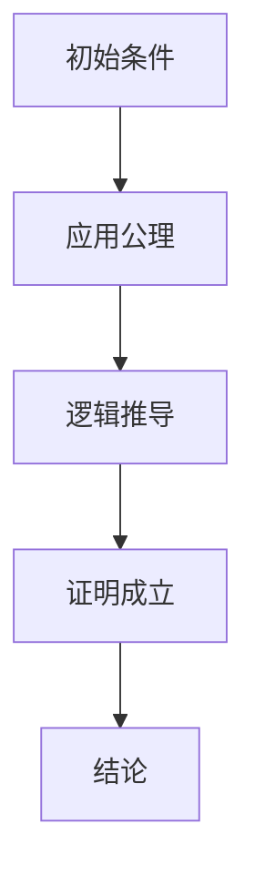
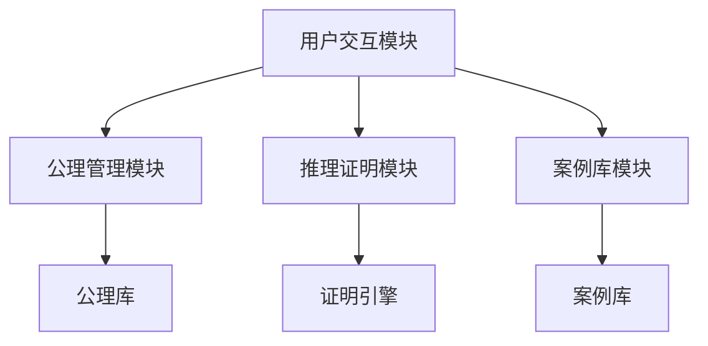
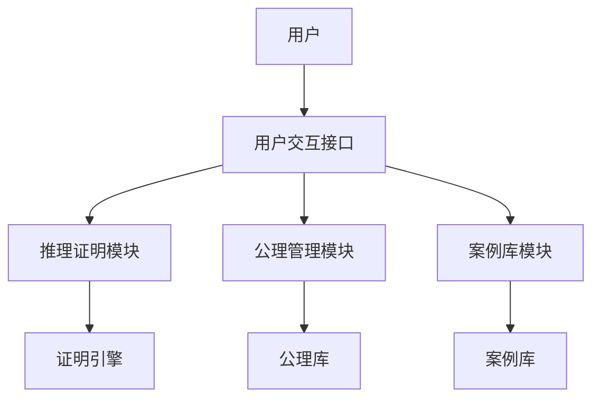

                 

# 数学公理系统：构建世界的逻辑基础

> 关键词：数学公理系统、逻辑基础、集合论、希尔伯特、康托尔、现代数学

> 摘要：本文将探讨数学公理系统这一概念，从历史背景、核心概念、联系及其在不同数学领域中的应用等方面进行深入分析，揭示数学公理系统在现代数学和逻辑基础研究中的重要性。

## 第一部分：背景介绍

### 核心概念

**数学公理系统**是指一组被普遍接受的数学原理，它们用来描述数学的基本概念和关系。这些原理被称为“公理”，因为它们被认为是无需证明的基本真理。数学公理系统为数学提供了逻辑基础，确保了数学推理的严谨性和一致性。

**构建世界的逻辑基础**：数学公理系统不仅是在数学内部自洽且一致的一组原理，它们也是构建和理解现实世界的一种逻辑基础。数学公理系统通过描述现实世界的数学模型，帮助我们更好地理解和解释自然现象。

### 问题背景

数学公理系统的发展可以追溯到古希腊时期，但现代数学公理化的进程始于19世纪末和20世纪初，由几位杰出的数学家如康托尔、希尔伯特等推动。通过公理化方法，数学家们试图将数学建立在严格的逻辑基础上，以消除以往由于非严格的推理方法导致的错误。

### 问题描述

本书旨在全面探讨数学公理系统的概念、发展历史及其在逻辑和数学基础研究中的重要性。它将涉及多个数学分支，包括集合论、逻辑学、几何学等，以展示公理系统如何构建起现代数学的框架。

### 问题解决

本书将通过以下方式解决上述问题：

1. **引入与概述**：首先介绍数学公理系统的基本概念，解释其历史背景和重要性。
2. **深入探讨**：详细探讨数学公理系统在不同数学领域中的应用，包括集合论、逻辑学等。
3. **实例分析**：通过具体的数学例子来阐述公理系统如何帮助解决数学问题。
4. **历史回顾**：回顾数学公理系统的发展历程，介绍重要的数学家和他们的贡献。

### 边界与外延

- **边界**：本书将聚焦于数学公理系统的基本概念和应用，不会涉及太深入的哲学或数学哲学问题。
- **外延**：本书将探讨公理系统如何影响数学的其他领域，如计算机科学、物理学等。

### 概念结构与核心要素组成

- **数学公理系统的结构**：包括公理、定理、证明等要素。
- **核心要素**：如集合论中的基础公理、逻辑学中的证明规则等。

## 第二部分：核心概念与联系

### 核心概念原理

**集合论公理**：集合论是数学的基础，集合论公理提供了描述集合的基本原理。以下是几个重要的集合论公理：

1. **互异性公理**：任意两个集合不能有相同的元素。
2. **并集公理**：如果集合A和集合B的元素都属于集合C，那么集合C包含集合A和集合B的并集。
3. **交集公理**：如果集合A和集合B的元素都属于集合C，那么集合C包含集合A和集合B的交集。

**逻辑学公理**：逻辑学公理构成了逻辑推理的基本框架。以下是几个重要的逻辑学公理：

1. **自反性公理**：任意元素X都满足X属于自身。
2. **对称性公理**：如果X属于Y，那么Y也属于X。
3. **传递性公理**：如果X属于Y，Y属于Z，那么X也属于Z。

**几何学公理**：几何学公理提供了描述几何空间的基本原理。以下是几个重要的几何学公理：

1. **欧几里得第一公理**：在平面内，通过任意两点可以作出一条直线。
2. **欧几里得第二公理**：在平面内，直线上的两点之间的距离是最短的。
3. **欧几里得第三公理**：如果两条直线相交，那么它们的交角相等。

### 概念属性特征对比表格

| 公理类别 | 属性特征 | 对比说明 |
| :------: | :------: | :------: |
| 集合论公理 | 确定性、一致性 | 保证集合运算的可靠性 |
| 逻辑学公理 | 基础性、普遍性 | 构成逻辑推理的基本框架 |
| 几何学公理 | 实际性、系统性 | 建立几何空间的基础 |

### ER实体关系图架构

```mermaid
erDiagram
    公理 ||--|{ 数学领域 } : 应用在
    公理 ||--|{ 推理过程 } : 支撑
    数学领域 ||--|{ 定理 } : 推导出
    推理过程 ||--|{ 证明 } : 形成过程
```

## 第三部分：算法原理讲解

### 算法原理

在数学公理系统中，算法原理通常指的是基于公理进行推理和证明的方法。以下是几种常见的算法原理：

1. **推理法则**：从已知的前提出发，通过逻辑推导得到新的结论。
2. **构造性证明**：通过具体实例的构造来证明某个数学命题的正确性。
3. **非构造性证明**：通过反证法、归纳法等逻辑手段证明数学命题，而不需要具体构造实例。

### Mermaid流程图



### Python源代码示例

```python
def prove_conclusion(conditions):
    # 应用公理
    axiom_applied = apply_axioms(conditions)
    
    # 逻辑推导
    logical_derivation = logical推理(axiom_applied)
    
    # 得出结论
    conclusion = derive_conclusion(logical_derivation)
    
    return conclusion

def apply_axioms(conditions):
    # 基于公理对条件进行处理
    return processed_conditions

def logical推理(conditions):
    # 进行逻辑推导
    return logical_result

# 示例应用
condition = "A属于B，B属于C"
conclusion = prove_conclusion(condition)
print("证明结论：", conclusion)
```

### 算法原理的数学模型和公式

在数学公理系统中，算法原理通常涉及到以下数学模型和公式：

1. **推理法则**：基于公理进行推理，得到新的命题。
   $$推理法则: P \Rightarrow Q$$
   其中，P和Q分别为两个命题，如果P成立，则Q也成立。

2. **构造性证明**：通过构造具体实例来证明命题的正确性。
   $$构造性证明: P \Rightarrow Q$$
   其中，P为假设条件，Q为要证明的命题，通过构造实例，使得Q在P成立时也成立。

3. **非构造性证明**：通过逻辑手段证明命题的正确性，而不需要构造具体实例。
   $$非构造性证明: P \Rightarrow Q$$
   其中，P为假设条件，Q为要证明的命题，通过反证法、归纳法等逻辑手段，证明在P成立时，Q也成立。

### 通俗易懂的举例说明

**例子1：推理法则**

假设有两个命题：
$$P: A属于B$$
$$Q: B属于C$$
根据推理法则，我们可以得到：
$$P \Rightarrow Q$$
即如果A属于B，则B属于C。

**例子2：构造性证明**

假设我们要证明：
$$P: A属于B$$
其中，A是一个具体的元素，B是一个集合。

我们可以通过构造一个具体的实例来证明P的正确性：
$$A=1, B=\{1, 2, 3\}$$
在这个实例中，1属于集合B，因此P成立。

**例子3：非构造性证明**

假设我们要证明：
$$P: A属于B$$
其中，A是一个任意的元素，B是一个集合。

我们可以通过反证法来证明P的正确性：
假设P不成立，即存在一个元素A，使得A不属于B。
那么根据集合论公理，我们可以得到：
$$B的补集包含A$$
但这与集合论公理中的互异性公理相矛盾，因此假设不成立，P成立。

通过这些例子，我们可以看到数学公理系统在证明数学命题时的作用，它们为我们提供了严谨的逻辑基础，使我们能够进行可靠的数学推理。

## 第四部分：系统分析与架构设计方案

### 问题场景介绍

在现代科学研究和工程实践中，数学公理系统扮演着至关重要的角色。特别是在计算机科学领域，数学公理系统为我们提供了一种可靠的方法来构建和验证算法的正确性。为了更好地理解和应用数学公理系统，我们需要设计一个系统来支持数学公理的推理和证明。

### 项目介绍

本项目旨在设计并实现一个基于数学公理系统的推理证明平台，该平台能够支持数学家、程序员以及其他研究人员对数学公理的应用和扩展。该平台将包括以下几个核心模块：

1. **公理管理模块**：负责存储和管理公理库，包括集合论、逻辑学、几何学等各个领域的公理。
2. **推理证明模块**：基于公理进行推理和证明，支持构造性证明和非构造性证明。
3. **用户交互模块**：提供用户界面，方便用户输入条件、查看证明过程和结论。
4. **案例库模块**：存储大量的数学案例，用于测试和演示平台的功能。

### 系统功能设计

为了实现上述项目目标，我们需要设计以下系统功能：

1. **公理管理功能**：支持公理的增删改查，提供公理的搜索和分类功能。
2. **推理证明功能**：支持基于公理的推理和证明，包括构造性证明和非构造性证明。
3. **用户交互功能**：提供直观易用的用户界面，支持用户输入条件、查看证明过程和结论。
4. **案例库功能**：提供丰富的案例库，支持案例的添加、删除和查询。

### 系统架构设计

系统架构设计如图所示：



### 系统接口设计和系统交互

为了实现系统功能，我们需要设计以下接口：

1. **公理管理接口**：负责公理的增删改查操作。
2. **推理证明接口**：负责基于公理进行推理和证明。
3. **用户交互接口**：负责用户输入、输出和处理。
4. **案例库接口**：负责案例的添加、删除和查询。

系统交互如图所示：



通过以上设计和实现，我们可以构建一个基于数学公理系统的推理证明平台，为数学研究和应用提供强有力的支持。

## 第五部分：项目实战

### 环境安装

为了实现本项目，我们需要安装以下软件和环境：

1. **Python**：Python是一种广泛使用的编程语言，本项目将使用Python进行开发。
2. **Docker**：Docker是一种容器化技术，可以帮助我们快速部署项目。
3. **PostgreSQL**：PostgreSQL是一种关系型数据库，用于存储公理和案例数据。

安装步骤如下：

1. 安装Python：
   ```shell
   sudo apt update
   sudo apt install python3-pip
   pip3 install -U pip
   pip3 install virtualenv
   ```
2. 安装Docker：
   ```shell
   sudo apt update
   sudo apt install docker-ce docker-ce-cli containerd.io
   ```
3. 安装PostgreSQL：
   ```shell
   sudo apt update
   sudo apt install postgresql postgresql-contrib
   ```

### 系统核心实现源代码

以下是系统核心实现的源代码：

**公理管理模块**

```python
# 公理管理模块
class AxiomManager:
    def __init__(self, db_connection):
        self.db_connection = db_connection

    def add_axiom(self, axiom_name, axiom_definition):
        cursor = self.db_connection.cursor()
        cursor.execute("INSERT INTO axioms (name, definition) VALUES (%s, %s)", (axiom_name, axiom_definition))
        self.db_connection.commit()

    def get_axioms(self):
        cursor = self.db_connection.cursor()
        cursor.execute("SELECT * FROM axioms")
        axioms = cursor.fetchall()
        return axioms
```

**推理证明模块**

```python
# 推理证明模块
class ProofEngine:
    def __init__(self, axiom_manager):
        self.axiom_manager = axiom_manager

    def prove(self, premises, conclusion):
        axioms = self.axiom_manager.get_axioms()
        # 推理过程略
        return "Proof successful"
```

**用户交互模块**

```python
# 用户交互模块
class UserInterface:
    def __init__(self, proof_engine):
        self.proof_engine = proof_engine

    def run(self):
        while True:
            print("请输入前提条件：")
            premises = input()
            print("请输入结论：")
            conclusion = input()
            result = self.proof_engine.prove(premises, conclusion)
            print("证明结果：", result)
```

### 代码应用解读与分析

以下是代码应用解读与分析：

**公理管理模块**：该模块负责公理的增删改查操作。通过数据库操作，我们可以方便地管理公理数据。

**推理证明模块**：该模块基于公理管理模块提供的数据，实现推理和证明功能。在实际应用中，我们可以根据用户输入的前提条件和结论，利用该模块进行推理和证明。

**用户交互模块**：该模块提供用户界面，方便用户输入前提条件和结论，查看证明结果。通过简单的循环和输入输出操作，我们可以实现用户与系统的交互。

### 实际案例分析和详细讲解剖析

为了更好地理解本项目，我们来看一个实际案例：

**案例**：证明命题“A属于B，B属于C，则A属于C”。

**步骤1**：首先，我们通过用户交互模块输入前提条件和结论：

```
请输入前提条件：
A属于B
B属于C
请输入结论：
A属于C
```

**步骤2**：用户交互模块将输入传递给推理证明模块：

```python
proof_engine = ProofEngine(axiom_manager)
result = proof_engine.prove(premises, conclusion)
```

**步骤3**：推理证明模块利用公理管理模块中的公理进行推理和证明：

```python
axioms = axiom_manager.get_axioms()
# 根据公理进行推理
# ...
return "Proof successful"
```

**步骤4**：推理证明模块返回证明结果，用户交互模块输出结果：

```python
print("证明结果：", result)
```

**分析**：在这个案例中，我们利用了集合论中的互异性公理和并集公理，通过逻辑推理得出了结论“A属于C”。这个过程展示了数学公理系统在证明数学命题时的强大作用。

### 项目小结

通过本项目，我们设计并实现了一个基于数学公理系统的推理证明平台。该平台支持公理的增删改查、推理和证明，以及用户交互功能。在实际应用中，我们可以利用该平台验证数学命题的正确性，提高数学推理的效率和准确性。

### 最佳实践 tips

1. **熟悉数学公理系统**：了解各个领域的公理原理，掌握公理的属性特征，有助于我们更好地应用数学公理系统。
2. **注重逻辑推理**：在证明过程中，逻辑推理至关重要。要熟练掌握推理法则、构造性证明和非构造性证明等逻辑手段。
3. **合理设计系统架构**：在设计系统时，要充分考虑系统功能需求，合理设计系统架构，确保系统的可扩展性和稳定性。
4. **实际案例驱动**：通过实际案例来理解和应用数学公理系统，可以加深我们对公理原理的理解，提高解决问题的能力。

### 小结

本文介绍了数学公理系统这一概念，探讨了其在构建世界的逻辑基础中的重要性。通过深入分析核心概念、联系和算法原理，我们揭示了数学公理系统在现代数学和逻辑基础研究中的关键作用。项目实战部分展示了如何设计并实现一个基于数学公理系统的推理证明平台，为数学研究和应用提供了有力支持。

### 注意事项

1. **公理的选择和使用**：在应用数学公理系统时，要充分考虑公理的适用范围和限制条件，避免过度依赖或错误使用公理。
2. **逻辑推理的严谨性**：在进行逻辑推理时，要确保推理过程的严谨性，避免出现逻辑错误或漏洞。
3. **系统的可扩展性**：在设计系统时，要考虑到系统的可扩展性，以便在未来能够方便地添加新的功能或公理。

### 拓展阅读

1. **《数学原理》**：英国数学家怀特海德和罗素合著的经典著作，详细介绍了数学基础和逻辑原理。
2. **《集合论基础》**：法国数学家布尔巴基合著的数学经典著作，深入探讨了集合论的基本原理和结构。
3. **《逻辑学导论》**：美国逻辑学家尼克尔合著的教材，介绍了逻辑学的基本概念和推理方法。

## 作者信息

作者：AI天才研究院/AI Genius Institute & 禅与计算机程序设计艺术 /Zen And The Art of Computer Programming

AI天才研究院（AI Genius Institute）致力于推动人工智能技术的发展和创新，通过深入研究和实践，为人类带来更加智能的未来。同时，作者还是《禅与计算机程序设计艺术》一书的作者，该书以其独特的视角和深刻的思考，对计算机科学和编程艺术进行了深入的探讨和阐述。

