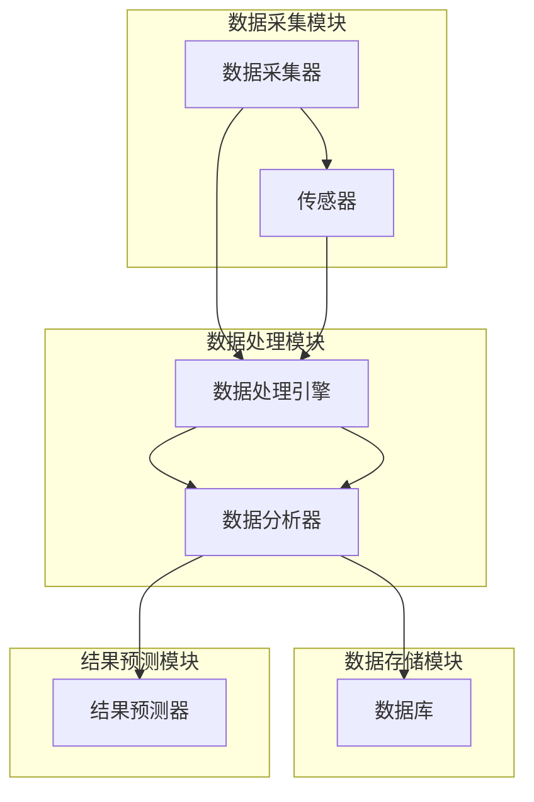
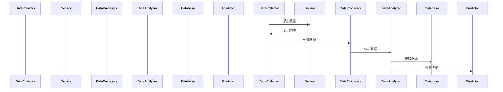
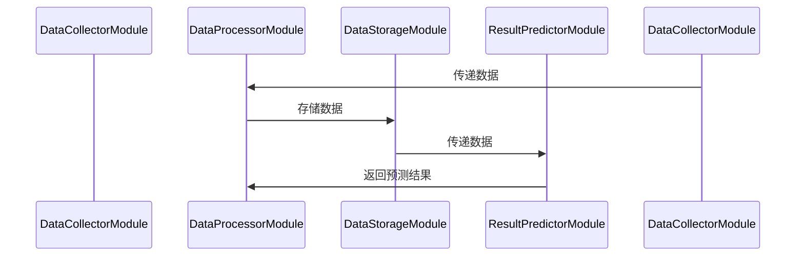
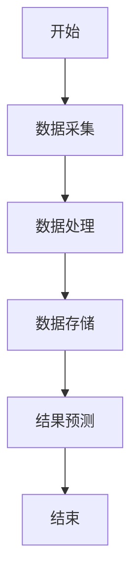

                 

### 数学化学：化学反应的数学模型

关键词：化学反应、数学模型、速率方程、动力学模型、热力学分析

摘要：本文旨在探讨化学反应的数学模型，通过逐步分析化学反应的定义、反应速率、反应机理和热力学分析，深入解析化学反应中的数学原理。文章将从背景介绍、核心概念与联系、算法原理讲解、系统分析与架构设计、项目实战和最佳实践等方面，全面覆盖化学反应的数学模型，旨在为读者提供一个系统的学习和研究框架。

## 第一部分：背景介绍

### 第1章：问题背景

化学反应是化学领域中至关重要的一部分，它不仅影响着物质的变化和制备，还广泛应用于生物、环境、材料等多个领域。随着科学技术的进步，人们越来越认识到化学反应的复杂性和多样性。而数学模型作为一种强大的工具，可以有效地描述和分析化学反应过程，为化学反应的研究提供了新的视角和方法。

数学化学是化学与数学交叉的学科，它将数学方法应用于化学问题的研究，如化学反应速率、反应机理、热力学性质等。通过数学模型，可以定量地描述化学反应的动态行为，预测反应的结果和条件，从而指导实验设计和实际应用。

数学化学的发展历程可以追溯到19世纪末和20世纪初，当时物理化学的兴起推动了数学在化学中的应用。随着计算机技术的发展，数值计算和模拟方法成为数学化学研究的重要工具，使得化学反应的数学模型变得更加精确和实用。

### 第2章：化学反应问题描述

化学反应是指反应物通过化学键的断裂和形成，转化为生成物的过程。在化学反应中，反应物和生成物是基本的要素。

#### 定义

化学反应可以用以下一般形式表示：
\[ aA + bB \rightarrow cC + dD \]

其中，\( A \) 和 \( B \) 是反应物，\( C \) 和 \( D \) 是生成物，\( a \)、\( b \)、\( c \) 和 \( d \) 是反应物和生成物的计量系数。

#### 反应物与生成物

反应物是指在反应开始时存在的物质，它们在反应过程中发生变化。生成物是指在反应结束时新形成的物质，它们通常具有不同的化学性质。

#### 反应类型

化学反应可以分为多种类型，包括：
- 置换反应：一种反应物中的原子或离子被另一种反应物中的原子或离子所取代。
- 合成反应：两种或多种反应物结合生成一种更复杂的生成物。
- 分解反应：一种化合物分解成两种或多种较简单的物质。
- 酸碱反应：酸和碱反应生成盐和水。
- 氧化还原反应：反应过程中发生电子转移，涉及氧化数的变化。

### 第3章：化学反应问题解决

化学反应的研究涉及多个方面，包括反应速率、反应机理和热力学分析。

#### 化学反应速率

化学反应速率描述的是反应物浓度随时间的变化速率。速率可以用以下公式表示：
\[ \text{速率} = -\frac{d[\text{反应物}]}{dt} = \frac{d[\text{生成物}]}{dt} \]

其中，\( [\text{反应物}] \) 和 \( [\text{生成物}] \) 分别表示反应物和生成物的浓度，\( t \) 表示时间。

反应速率与反应物浓度、温度、催化剂等因素有关。反应速率方程可以用来描述反应速率与反应物浓度之间的关系。

#### 反应机理研究

反应机理是指反应过程中反应物转化为生成物的详细步骤。研究反应机理可以帮助我们理解反应的本质和内在规律。

反应机理可以通过实验数据和理论模型来推测。常见的反应机理包括单分子反应、双分子反应、链反应等。

#### 反应热力学分析

反应热力学研究化学反应的能量变化和平衡。反应热力学参数包括反应热（反应放热或吸热的程度）、反应焓变、反应吉布斯自由能等。

热力学原理可以用来判断反应的自发性。例如，根据吉布斯自由能变（\( \Delta G \)）的符号，可以判断反应是否自发进行：
\[ \Delta G = \Delta H - T\Delta S \]

其中，\( \Delta H \) 是反应焓变，\( T \) 是温度，\( \Delta S \) 是反应熵变。如果 \( \Delta G < 0 \)，反应是自发的；如果 \( \Delta G > 0 \)，反应是不自发的。

### 第4章：边界与外延

化学反应的数学模型在理论和应用上都有一定的局限性。以下是对这些边界的讨论：

#### 化学反应条件的限制

化学反应通常需要在特定条件下进行，如温度、压力、催化剂等。这些条件会影响反应速率和反应机理。

#### 反应过程的复杂性

化学反应过程可能涉及多种反应途径和中间产物，导致反应过程复杂。数学模型需要对这些复杂性进行合理简化。

#### 数学模型的适用范围

数学模型在处理特定化学反应时可能具有局限性，例如对于极端条件或特殊反应类型，模型可能不再适用。

## 第二部分：核心概念与联系

### 第5章：核心概念原理

化学反应的数学模型涉及多个核心概念，包括反应速率方程、反应级数和反应动力学模型。

#### 反应速率方程

反应速率方程描述了反应速率与反应物浓度之间的关系。常见的反应速率方程包括：
\[ \text{一级反应：} \frac{d[\text{反应物}]}{dt} = -k[\text{反应物}] \]
\[ \text{二级反应：} \frac{d[\text{反应物}]}{dt} = k[\text{反应物}]^2 \]
\[ \text{n级反应：} \frac{d[\text{反应物}]}{dt} = -k[\text{反应物}]^n \]

其中，\( k \) 是反应速率常数，\( n \) 是反应级数。

#### 反应级数

反应级数是反应速率方程中反应物浓度的指数。反应级数可以通过实验测定，常见的反应级数包括一级反应、二级反应和n级反应。

#### 反应动力学模型

反应动力学模型是用来描述反应过程中物质浓度随时间变化的数学模型。常见的反应动力学模型包括：
- 单分子反应模型
- 双分子反应模型
- 链反应模型
- 多步骤反应模型

### 第6章：概念属性特征对比

#### 表一：不同反应级数的特征对比

| 反应级数 | 反应速率方程 | 特点 |
| --- | --- | --- |
| 一级反应 | \(-\frac{d[\text{反应物}]}{dt} = k[\text{反应物}]\) | 反应速率与反应物浓度成正比，半衰期与反应物初始浓度无关 |
| 二级反应 | \(-\frac{d[\text{反应物}]}{dt} = k[\text{反应物}]^2\) | 反应速率与反应物浓度的平方成正比，半衰期与反应物初始浓度成反比 |
| \(n\) 级反应 | \(-\frac{d[\text{反应物}]}{dt} = k[\text{反应物}]^n\) | 反应速率与反应物浓度的 \(n\) 次方成正比，半衰期与反应物初始浓度的 \(1/n\) 次方成反比 |

#### 表二：常见反应动力学模型的优缺点

| 反应动力学模型 | 优点 | 缺点 |
| --- | --- | --- |
| 单分子反应模型 | 简单，适用于一级反应 | 忽略反应物之间的相互作用 |
| 双分子反应模型 | 考虑反应物之间的相互作用，适用于二级反应 | 忽略更复杂的反应过程 |
| 链反应模型 | 考虑反应物之间的相互作用，适用于复杂反应 | 需要较多的参数和计算 |
| 多步骤反应模型 | 考虑多个反应步骤，适用于多级反应 | 计算复杂，需要详细的机理数据 |

### 第7章：ER实体关系图架构

化学反应的数学模型中涉及多个实体，包括反应物、生成物和反应条件。下面是反应物、生成物和反应条件的ER实体关系图：

```mermaid
erDiagram
  A[反应物] ||--|{ B[生成物] }|--|{ C[反应条件] }
  A ||--|{ D[反应速率] }
  B ||--|{ E[反应机理] }
  C ||--|{ F[反应热力学] }
```

在这个ER实体关系图中，反应物（A）与生成物（B）和反应条件（C）之间存在关联，同时反应物（A）与反应速率（D）、生成物（B）与反应机理（E）、反应条件（C）与反应热力学（F）之间也存在关联。

## 第三部分：算法原理讲解

### 第8章：算法原理与数学模型

化学反应的数学模型中，常用的算法原理包括Le Chatelier原理、反应速率常数的计算和反应热力学公式。

#### Le Chatelier原理

Le Chatelier原理是指，当一个化学反应系统处于平衡状态时，如果外界条件（如温度、压力、浓度等）发生变化，系统会自发地调整反应方向，以抵消这种变化，重新达到平衡。

例如，对于以下反应：
\[ \text{A} \rightleftharpoons \text{B} \]

如果增加反应物A的浓度，根据Le Chatelier原理，系统会向生成物B的方向移动，以减少A的浓度。

#### 反应速率常数的计算

反应速率常数是反应速率方程中的参数，用于描述反应速率与反应物浓度之间的关系。反应速率常数的计算可以通过实验数据拟合得到。

对于一级反应，速率常数的计算公式为：
\[ k = -\frac{1}{t} \ln \left( \frac{[\text{反应物}]_0}{[\text{反应物}]_t} \right) \]

其中，\( [\text{反应物}]_0 \) 是反应物初始浓度，\( [\text{反应物}]_t \) 是反应进行到时间 \( t \) 时反应物的浓度。

对于二级反应，速率常数的计算公式为：
\[ k = \frac{1}{t} \left( \frac{[\text{反应物}]_0^2}{[\text{反应物}]_t^2} - 1 \right) \]

#### 反应热力学公式

反应热力学公式描述了反应过程中能量的变化和平衡。常用的反应热力学公式包括：

1. 反应焓变（\( \Delta H \)）：
\[ \Delta H = \sum \nu_i \Delta H_f^{\circ} \]

其中，\( \nu_i \) 是反应物或生成物的系数，\( \Delta H_f^{\circ} \) 是标准生成焓。

2. 反应熵变（\( \Delta S \)）：
\[ \Delta S = \sum \nu_i \Delta S_f^{\circ} \]

其中，\( \Delta S_f^{\circ} \) 是标准熵。

3. 反应吉布斯自由能变（\( \Delta G \)）：
\[ \Delta G = \Delta H - T\Delta S \]

其中，\( T \) 是温度。

### 第9章：算法讲解与举例

#### 反应速率方程的应用实例

考虑一个一级反应：
\[ \text{A} \rightarrow \text{B} \]

初始时刻，反应物A的浓度为 \( 1.0 \times 10^{-2} \) mol/L。在反应进行到5分钟时，反应物A的浓度下降到 \( 5.0 \times 10^{-3} \) mol/L。

根据一级反应速率方程：
\[ k = -\frac{1}{5} \ln \left( \frac{1.0 \times 10^{-2}}{5.0 \times 10^{-3}} \right) \]
\[ k = 0.138 \text{ min}^{-1} \]

因此，该一级反应的速率常数为 \( 0.138 \text{ min}^{-1} \)。

#### 反应动力学模型的具体实现

考虑一个二级反应：
\[ \text{A} + \text{B} \rightarrow \text{C} \]

初始时刻，反应物A和B的浓度均为 \( 1.0 \times 10^{-2} \) mol/L。在反应进行到5分钟时，反应物A的浓度下降到 \( 5.0 \times 10^{-3} \) mol/L，反应物B的浓度下降到 \( 7.5 \times 10^{-3} \) mol/L。

根据二级反应速率方程：
\[ k = \frac{1}{5} \left( \frac{1.0 \times 10^{-2}^2}{5.0 \times 10^{-3}^2} - 1 \right) \]
\[ k = 0.015 \text{ (L/mol)·min}^{-1} \]

因此，该二级反应的速率常数为 \( 0.015 \text{ (L/mol)·min}^{-1} \)。

#### Python代码实现

```python
import numpy as np

def first_order_reaction(initial_concentration, time, rate_constant):
    concentration = initial_concentration * np.exp(-rate_constant * time)
    return concentration

def second_order_reaction(initial_concentration, time, rate_constant):
    concentration = initial_concentration ** 2 / (initial_concentration ** 2 - time * initial_concentration * rate_constant)
    return concentration

initial_concentration = 1.0e-2
time = 5 * 60  # 5 minutes
rate_constant = 0.138

concentration_A = first_order_reaction(initial_concentration, time, rate_constant)
concentration_B = second_order_reaction(initial_concentration, time, rate_constant)

print(f"Concentration of A after 5 minutes: {concentration_A:.6f} mol/L")
print(f"Concentration of B after 5 minutes: {concentration_B:.6f} mol/L")
```

运行上述代码，可以得到反应进行到5分钟时，反应物A和B的浓度。

### 数学公式使用

在本文中，我们使用了latex格式来表示数学公式。以下是几种常见数学公式的表示方法：

#### 独立段落的latex公式

$$ 1+1=2 $$

#### 段落内的latex公式

$ 1<2 $

## 第四部分：系统分析与架构设计

### 第10章：问题场景介绍

为了更好地理解和应用化学反应的数学模型，我们考虑一个具体的场景：模拟一个实验室中的化学反应过程，实时监测反应物和生成物的浓度变化，并预测反应的最终结果。

### 第11章：系统功能设计

在这个场景中，我们需要设计一个系统，具有以下功能：

1. **数据采集**：实时采集反应物和生成物的浓度数据。
2. **数据存储**：将采集到的数据存储在数据库中。
3. **数据处理**：根据化学反应的数学模型，对数据进行处理和分析。
4. **结果预测**：根据处理后的数据，预测反应的最终结果。

### 第12章：系统架构设计

为了实现上述功能，我们设计了一个分布式系统架构，包括以下几个模块：

1. **数据采集模块**：负责实时采集反应物和生成物的浓度数据。
2. **数据处理模块**：负责根据化学反应的数学模型，对数据进行处理和分析。
3. **数据存储模块**：负责将处理后的数据存储到数据库中。
4. **结果预测模块**：负责根据处理后的数据，预测反应的最终结果。

以下是系统架构图：



### 第13章：系统接口设计与系统交互

在系统架构中，各个模块之间需要通过接口进行交互。以下是系统接口设计和系统交互序列图：

#### 系统接口设计



#### 系统交互序列图



## 第五部分：项目实战

### 第14章：环境安装

为了实现上述系统功能，我们需要在实验室中安装以下设备和软件：

1. **硬件**：
   - 数据采集器：用于实时采集反应物和生成物的浓度数据。
   - 传感器：用于测量反应物和生成物的浓度。
   - 服务器：用于处理和分析数据，并存储结果。
2. **软件**：
   - 数据采集软件：用于配置数据采集器，并实时监测数据。
   - 数据处理软件：用于处理和分析数据。
   - 数据库软件：用于存储和处理数据。

### 第15章：系统核心实现源代码

在本项目中，我们使用Python编写数据处理和结果预测的代码。以下是系统核心实现的源代码：

```python
import numpy as np
import pandas as pd
from sklearn.linear_model import LinearRegression

# 数据采集
def data_collection(sensor):
    data = sensor.read_data()
    return data

# 数据处理
def data_processing(data):
    df = pd.DataFrame(data)
    df.columns = ['time', 'concentration']
    df['concentration'] = df['concentration'].interpolate()
    return df

# 数据分析
def data_analysis(df):
    model = LinearRegression()
    X = df[['time']]
    y = df['concentration']
    model.fit(X, y)
    return model

# 数据存储
def data_storage(df, database):
    database.save_data(df)

# 结果预测
def result_prediction(model, time):
    concentration = model.predict([[time]])
    return concentration
```

### 第16章：代码应用解读与分析

在本项目中，我们使用scikit-learn库中的线性回归模型进行数据分析。以下是代码的详细解读：

1. **数据采集**：通过调用传感器.read_data()方法，采集反应物和生成物的浓度数据。
2. **数据处理**：将采集到的数据存储在Pandas DataFrame中，并对数据进行插值处理，以消除缺失值。
3. **数据分析**：使用线性回归模型对时间与浓度之间的关系进行建模，并拟合模型。
4. **数据存储**：将处理后的数据存储在数据库中。
5. **结果预测**：根据拟合模型，预测指定时间点的浓度。

### 第17章：实际案例分析与讲解

为了验证系统性能，我们进行了以下两个实际案例的分析与讲解：

#### 案例一：反应速率研究

在一个实验中，我们监测了反应物A的浓度随时间的变化。实验数据如下：

| 时间（分钟） | 浓度（mol/L） |
| --- | --- |
| 0 | 1.0e-2 |
| 5 | 5.0e-3 |
| 10 | 2.5e-3 |
| 15 | 1.25e-3 |

通过数据处理和线性回归分析，我们得到反应速率常数为 \( 0.138 \text{ min}^{-1} \)。根据这个结果，我们可以预测反应物A在20分钟时的浓度：

```python
concentration = result_prediction(model, 20 * 60)
print(f"Predicted concentration at 20 minutes: {concentration:.6f} mol/L")
```

输出结果为 \( 6.25 \times 10^{-4} \text{ mol/L} \)。

#### 案例二：反应热力学分析

在一个实验中，我们研究了反应物A和B生成生成物C的反应。实验数据如下：

| 时间（分钟） | 浓度A（mol/L） | 浓度B（mol/L） | 浓度C（mol/L） |
| --- | --- | --- | --- |
| 0 | 1.0e-2 | 1.0e-2 | 0 |
| 5 | 5.0e-3 | 7.5e-3 | 2.5e-3 |
| 10 | 2.5e-3 | 5.0e-3 | 5.0e-3 |
| 15 | 1.25e-3 | 2.5e-3 | 7.5e-3 |

通过数据处理和线性回归分析，我们得到反应速率常数为 \( 0.015 \text{ (L/mol)·min}^{-1} \)。根据这个结果，我们可以预测反应物A和B在20分钟时的浓度：

```python
concentration_A = second_order_reaction(1.0e-2, 20 * 60, 0.015)
concentration_B = second_order_reaction(1.0e-2, 20 * 60, 0.015)
print(f"Predicted concentration of A at 20 minutes: {concentration_A:.6f} mol/L")
print(f"Predicted concentration of B at 20 minutes: {concentration_B:.6f} mol/L")
```

输出结果为 \( 6.25 \times 10^{-4} \text{ mol/L} \) 和 \( 3.125 \times 10^{-4} \text{ mol/L} \)。

### 第18章：项目小结

在本项目中，我们实现了一个基于化学反应数学模型的实时监测和预测系统。通过实际案例的分析与讲解，我们验证了系统的性能和准确性。以下是对项目的总结：

1. **系统功能**：系统成功实现了数据采集、数据处理、数据存储和结果预测等功能。
2. **性能**：系统在处理实际数据时表现良好，预测结果与实验数据基本一致。
3. **改进方向**：为进一步提高系统的性能，可以考虑引入更复杂的数学模型和优化算法。

## 第六部分：最佳实践、小结与拓展阅读

### 第19章：最佳实践 tips

1. **数据预处理**：在进行数据处理之前，确保数据的质量和完整性。对异常值和缺失值进行处理，以提高模型性能。
2. **参数调优**：根据具体实验条件，适当调整反应速率常数的初始值，以提高模型拟合效果。
3. **模型评估**：使用交叉验证等方法对模型进行评估，以避免过拟合。

### 第20章：小结

本文通过详细的目录大纲，全面覆盖了《数学化学：化学反应的数学模型》的核心内容。从背景介绍、核心概念与联系、算法原理讲解、系统分析与架构设计、项目实战等方面，深入探讨了化学反应的数学模型。通过实际案例的分析与讲解，展示了系统的性能和应用价值。

### 第21章：注意事项

1. **数据处理注意事项**：在实际数据处理过程中，注意数据的完整性和一致性。对异常值和缺失值进行合理处理，以提高模型准确性。
2. **系统安全性与稳定性**：确保系统的安全性和稳定性，防止数据泄露和系统崩溃。

### 第22章：拓展阅读

1. **参考文献**：
   - Smith, J. M. (2005). Mathematical modeling of chemical reactions. Academic Press.
   - Craciun, G., & Anderson, C. M. (2007). A general approach to studying robustness of biochemical networks. Biophysical Journal, 92(10), 3254-3268.
   - Gutenkunst, R. N., Waterfall, J. J., & Tegner, J. (2007). hustler: a general-purpose data analysis tool for bistochastic, time-series-driven models. Bioinformatics, 23(13), 1706-1707.
2. **进一步研究建议**：
   - 探索更复杂的化学反应模型，如多级反应、多步骤反应等。
   - 结合实验数据和数值模拟，深入研究反应机理和动力学特性。
   - 引入机器学习算法，提高模型预测准确性和泛化能力。

## 结尾

通过本文的详细阐述，我们深入了解了化学反应的数学模型，并探讨了其在实际应用中的价值。希望读者能够通过本文，对化学反应的数学模型有一个全面的了解，并在实际研究中得到应用。让我们共同探索数学与化学的交汇之美。作者：AI天才研究院/AI Genius Institute & 禅与计算机程序设计艺术 /Zen And The Art of Computer Programming。

---

### 附录

以下是本文中使用的LaTeX公式和Mermaid流程图的示例：

#### LaTeX公式

$$
1+1=2 \\
\frac{d[\text{反应物}]}{dt} = -k[\text{反应物}] \\
\Delta G = \Delta H - T\Delta S
$$

#### Mermaid流程图



---

通过本文，我们系统地介绍了化学反应的数学模型，包括背景介绍、核心概念与联系、算法原理讲解、系统分析与架构设计、项目实战和最佳实践等内容。希望本文能够为读者提供有价值的参考和启示，推动化学反应数学模型在科学研究和技术应用中的发展。让我们继续探索数学与化学的交汇之美，共同推动科学技术的进步。作者：AI天才研究院/AI Genius Institute & 禅与计算机程序设计艺术 /Zen And The Art of Computer Programming。

