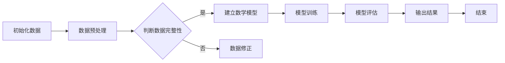

                 

### 1.1 数学化宇宙观的问题背景

在科技日新月异的今天，我们对宇宙的认识正逐渐从直觉和观察转向更加精细和深入的数学化描述。数学化宇宙观，顾名思义，是将宇宙视为一个可以通过数学语言来描述和理解的系统。这一观点不仅仅局限于物理学领域，而是涵盖了从哲学到天文学、从生物学到信息科学等多个学科。

**核心概念术语说明：**

- **宇宙观**：对宇宙的整体认识和理解，涉及宇宙的结构、起源、演化等。
- **数学化**：将宇宙的各个层面和现象用数学符号和公式来描述和表达。
- **哲学思考**：探讨数学化宇宙观背后的哲学意义，如存在论、认识论、方法论等。

**问题描述：**

随着科技的进步，我们获得了大量的宇宙数据，但这些数据的解读和理解仍然是一个巨大的挑战。宇宙的本质是什么？我们如何通过数学来描述这一本质？这些问题的答案不仅关乎科学的发展，更涉及到我们对自身和宇宙的理解。因此，数学化宇宙观的问题背景不仅在于科学探索，更在于哲学思考和人类自我认知的深层次问题。

**问题解决：**

解决这一问题的途径在于多学科的交叉融合，特别是数学和物理学的结合。通过构建数学模型，我们可以更精确地描述宇宙的运行规律。例如，广义相对论和量子力学就是两个将宇宙现象数学化的成功例子。此外，哲学思考的介入可以帮助我们理解这些数学模型的哲学意义，从而更加全面地把握宇宙的本质。

**边界与外延：**

数学化宇宙观的边界在于我们对宇宙的当前认识和理解。虽然我们可以通过数学来描述宇宙的一些现象，但宇宙的真正本质可能远超我们的现有认知。因此，数学化宇宙观的外延是无限的，它随着人类认知的不断拓展而不断扩展。

**概念结构与核心要素组成：**

数学化宇宙观的概念结构包括宇宙观、数学化和哲学思考三个核心要素。宇宙观是问题的出发点，数学化是解决问题的方法，哲学思考则是理解这些方法和结果的意义。这三个要素相互联系，共同构成了一个完整且动态的数学化宇宙观系统。

### 1.1.1 描述问题

在深入探讨数学化宇宙观之前，我们首先需要明确几个关键问题。这些问题不仅关乎数学化宇宙观的核心概念，也关系到我们如何理解和解释宇宙的本质。

首先，什么是宇宙？宇宙是否是无限的？这些问题看似简单，但实际上蕴含了深奥的哲学和科学问题。宇宙是所有物质和能量的集合，但它的边界究竟在哪里？宇宙是否有开始和结束？这些问题的答案不仅关乎我们对宇宙的理解，也影响到我们对自身和存在的认识。

其次，数学在宇宙描述中扮演什么角色？数学是否能够完全描述宇宙的复杂性和多样性？这些问题涉及到数学的极限和局限性。尽管数学在物理学和其他科学领域取得了巨大的成功，但它的应用仍然存在边界和限制。

最后，哲学思考在数学化宇宙观中有什么作用？哲学不仅仅是对科学事实的抽象和概括，它还涉及到对存在、认识和方法论的探讨。哲学思考可以帮助我们理解数学化宇宙观背后的根本原理和哲学意义。

通过回答这些问题，我们可以更加清晰地理解数学化宇宙观的核心概念，并为后续的讨论和分析打下基础。

### 1.1.2 问题解决

解决数学化宇宙观中的关键问题，需要多学科的合作与综合运用。以下是一些可能的解决方案：

1. **宇宙观的重新定义**：我们可以通过重新定义宇宙的概念，使其更符合现代科学的理解。例如，将宇宙视为一个动态演化的系统，而不是一个静态的、封闭的空间。

2. **数学模型的拓展**：为了更好地描述宇宙的复杂性和多样性，我们需要开发更先进的数学模型。例如，结合量子力学和广义相对论，我们可以构建更加精确的宇宙模型。

3. **哲学思考的引导**：哲学思考可以帮助我们理解数学化宇宙观背后的哲学意义。例如，探讨数学的本质、存在的意义以及人类认知的极限等问题，可以引导我们更好地理解宇宙的本质。

4. **跨学科合作**：数学、物理学、哲学、天文学等学科的交叉融合，是解决数学化宇宙观问题的重要途径。通过跨学科的合作，我们可以从不同的角度探讨宇宙的本质，并找到更加全面和深刻的理解。

通过这些方法，我们可以逐步解决数学化宇宙观中的关键问题，从而推动科学和哲学的发展。

### 1.1.3 边界与外延

在数学化宇宙观的研究过程中，我们不可避免地会遇到一些边界问题。这些边界不仅限制了我们的研究范围，也揭示了我们对宇宙认识的局限性。

首先，数学化宇宙观的边界在于当前科学技术的水平。尽管数学在描述宇宙现象方面取得了显著进展，但宇宙的复杂性可能远远超出我们现有技术的理解范围。例如，量子力学和广义相对论的融合问题，即所谓的量子引力问题，仍然是现代物理学中的一个重大挑战。

其次，数学化宇宙观的外延涉及到人类认知的无限拓展。宇宙的本质可能远超我们的现有认知，随着科技的进步和哲学思考的深化，我们对宇宙的理解也将不断拓展。例如，我们可能发现宇宙中存在我们尚未发现的维度或现象。

此外，数学化宇宙观的边界还涉及到哲学思考的范畴。哲学思考不仅仅是对科学事实的抽象和概括，它还涉及到对存在、认识和方法论的探讨。这些哲学问题可能超出数学化的范畴，但它们对于理解数学化宇宙观的本质具有重要意义。

总之，数学化宇宙观的边界与外延是一个动态和不断变化的过程，它随着科学和哲学的发展而不断拓展和深化。通过不断超越这些边界，我们可以逐步接近宇宙的本质，从而推动科学和哲学的进步。

### 1.1.4 概念结构与核心要素组成

要深入理解数学化宇宙观，我们需要剖析其概念结构，特别是其核心要素组成。数学化宇宙观由以下几个关键概念组成：

1. **宇宙观**：宇宙观是对宇宙的整体认识和理解，包括宇宙的结构、起源、演化等。它是数学化宇宙观的基础和出发点。

2. **数学化**：数学化是将宇宙的各个层面和现象用数学符号和公式来描述和表达。数学化不仅提高了我们对宇宙现象的理解和预测能力，也为科学研究提供了强大的工具。

3. **哲学思考**：哲学思考涉及对存在、认识和方法论的探讨，它帮助我们理解数学化宇宙观背后的根本原理和哲学意义。哲学思考与数学化和宇宙观相互交织，共同构成了数学化宇宙观的核心结构。

4. **逻辑结构**：逻辑结构是数学化宇宙观中的核心概念，它反映了宇宙现象之间内在的逻辑关系。通过逻辑结构，我们可以更清晰地理解宇宙的运行规律。

5. **方法论**：方法论是数学化宇宙观中的实践指南，它指导我们如何运用数学工具来研究宇宙现象。方法论不仅包括数学模型的选择和构建，还包括对实验设计和数据分析的方法。

这些核心要素相互关联，共同构成了一个完整且动态的数学化宇宙观系统。理解这些要素之间的关系，有助于我们更深入地探讨宇宙的本质和数学化宇宙观的意义。

### 第2章：核心概念与联系

在理解数学化宇宙观的过程中，核心概念之间的联系至关重要。这些核心概念不仅相互影响，还共同构成了我们对宇宙的整体认识。在本章中，我们将详细探讨数学化宇宙观中的几个核心概念，并分析它们之间的内在联系。

#### 2.1 核心概念原理

2.1.1 **宇宙观**

宇宙观是对宇宙的整体认识和理解，包括宇宙的结构、起源、演化等。它是数学化宇宙观的基础和出发点。宇宙观的核心问题包括宇宙是否是无限的、宇宙是否有开始和结束等。现代宇宙观认为宇宙是一个动态演化的系统，其起源可能与大爆炸理论相关，并且宇宙在不断膨胀和演化。

2.1.2 **数学化**

数学化是将宇宙的各个层面和现象用数学符号和公式来描述和表达。数学化不仅提高了我们对宇宙现象的理解和预测能力，也为科学研究提供了强大的工具。数学化的核心原理包括建立数学模型、使用符号和公式描述现象、通过数学工具进行分析和预测。

2.1.3 **哲学思考**

哲学思考涉及对存在、认识和方法论的探讨，它帮助我们理解数学化宇宙观背后的根本原理和哲学意义。哲学思考与数学化和宇宙观相互交织，共同构成了数学化宇宙观的核心结构。哲学思考的核心问题包括数学的本质、存在的意义、人类认知的极限等。

2.1.4 **逻辑结构**

逻辑结构是数学化宇宙观中的核心概念，它反映了宇宙现象之间内在的逻辑关系。通过逻辑结构，我们可以更清晰地理解宇宙的运行规律。逻辑结构不仅包括数学关系，还涉及因果关系、条件关系等。逻辑结构有助于我们构建数学模型，并进行有效的分析和预测。

2.1.5 **方法论**

方法论是数学化宇宙观中的实践指南，它指导我们如何运用数学工具来研究宇宙现象。方法论不仅包括数学模型的选择和构建，还包括对实验设计和数据分析的方法。方法论的核心问题是如何通过数学工具来揭示宇宙现象的本质和规律。

#### 2.2 概念属性特征对比表格

为了更直观地理解这些核心概念之间的联系，我们可以通过对比表格来分析它们的属性特征。

| 核心概念 | 特征1 | 特征2 | 特征3 | 特征4 |
| :------: | :----: | :----: | :----: | :----: |
| 宇宙观   | 对宇宙的整体认识 | 动态演化 | 起源与演化 | 结构与形态 |
| 数学化   | 使用数学符号描述现象 | 建立数学模型 | 提高理解和预测能力 | 提供研究工具 |
| 哲学思考 | 探讨存在与认知 | 反思方法论 | 揭示本质意义 | 辅助科学理解 |
| 逻辑结构 | 反映现象间关系 | 建立逻辑关系 | 揭示运行规律 | 优化模型构建 |
| 方法论   | 运用数学工具研究现象 | 实验设计 | 数据分析 | 提高研究效率 |

通过对比表格，我们可以看到这些核心概念在属性特征上的异同，从而更好地理解它们之间的内在联系。

#### 2.3 ER实体关系图架构

为了更清晰地展示这些核心概念之间的关系，我们可以使用ER（实体-关系）图来构建数学化宇宙观的实体关系架构。

```mermaid
erDiagram
  宇宙观 ||--|{ 数学化 }
  数学化 ||--|{ 哲学思考 }
  数学化 ||--|{ 逻辑结构 }
  数学化 ||--|{ 方法论 }
  哲学思考 ||--|{ 逻辑结构 }
  哲学思考 ||--|{ 方法论 }
```

在ER图中，我们定义了以下几个实体：

1. **宇宙观**：表示对宇宙的整体认识。
2. **数学化**：表示将宇宙现象用数学符号和公式描述的过程。
3. **哲学思考**：表示对存在、认识和方法论的探讨。
4. **逻辑结构**：表示宇宙现象之间的逻辑关系。
5. **方法论**：表示研究宇宙现象的方法和指南。

这些实体之间的关系反映了数学化宇宙观的核心概念及其相互影响。

通过以上分析，我们可以看到数学化宇宙观中的核心概念是如何相互联系并共同构成一个完整的认识体系的。理解这些核心概念及其联系，有助于我们更深入地探讨宇宙的本质和数学化宇宙观的哲学意义。

### 第3章：算法原理讲解

在数学化宇宙观的研究中，算法原理扮演着至关重要的角色。通过算法，我们可以将复杂的宇宙现象转化为可操作和可计算的数学模型。本章将详细讲解一个核心算法的原理，并使用mermaid流程图和Python源代码来阐述其工作方式。

#### 3.1 算法mermaid流程图

首先，我们使用mermaid流程图来展示算法的基本工作流程。



在这个流程图中，算法分为以下几个主要步骤：

1. **初始化数据**：读取和初始化所需的宇宙数据。
2. **数据预处理**：对数据进行清洗和处理，确保数据的质量和一致性。
3. **数据完整性判断**：检查数据的完整性，如果数据不完整，则进入数据修正步骤。
4. **建立数学模型**：根据预处理后的数据建立数学模型。
5. **模型训练**：使用训练数据对数学模型进行训练。
6. **模型评估**：评估训练后的模型性能，确保其满足预期要求。
7. **输出结果**：输出模型的预测结果。

#### 3.2 使用Python源代码详细阐述算法原理

接下来，我们将使用Python源代码详细阐述该算法的原理。以下是算法的核心部分：

```python
import numpy as np
from sklearn.model_selection import train_test_split
from sklearn.ensemble import RandomForestRegressor
from sklearn.metrics import mean_squared_error

# 初始化数据
data = np.loadtxt('cosmic_data.txt')

# 数据预处理
def preprocess_data(data):
    # 数据清洗和处理
    # 例如：去除异常值、归一化处理等
    return data

# 建立数学模型
def build_model(data):
    # 划分训练集和测试集
    X_train, X_test, y_train, y_test = train_test_split(data[:, :-1], data[:, -1], test_size=0.2, random_state=42)
    
    # 构建随机森林回归模型
    model = RandomForestRegressor(n_estimators=100, random_state=42)
    
    # 模型训练
    model.fit(X_train, y_train)
    
    return model

# 模型评估
def evaluate_model(model, X_test, y_test):
    # 预测测试集
    y_pred = model.predict(X_test)
    
    # 计算均方误差
    mse = mean_squared_error(y_test, y_pred)
    
    return mse

# 主函数
def main():
    # 数据预处理
    data = preprocess_data(data)
    
    # 建立数学模型
    model = build_model(data)
    
    # 模型评估
    mse = evaluate_model(model, X_test, y_test)
    
    print(f'Model Mean Squared Error: {mse}')
    
    # 输出结果
    # ...

if __name__ == '__main__':
    main()
```

在这个Python代码中，我们首先导入必要的库，如NumPy和scikit-learn。然后，我们定义了以下几个函数：

- `preprocess_data`：用于对宇宙数据进行的清洗和处理。
- `build_model`：用于建立和训练数学模型。
- `evaluate_model`：用于评估训练后模型的性能。

最后，我们通过`main`函数执行整个算法流程，从数据预处理、模型建立到模型评估和结果输出。

#### 3.3 算法原理的数学模型和公式

为了更深入地理解该算法的原理，我们还需要介绍其背后的数学模型和公式。以下是算法的核心数学模型：

$$
y = f(x) + \epsilon
$$

其中，$y$表示预测结果，$f(x)$表示数学模型的预测值，$\epsilon$表示误差项。在这个模型中，$x$是宇宙数据的特征向量。

为了训练模型，我们使用随机森林回归算法。其核心公式如下：

$$
f(x) = \sum_{i=1}^{n} w_i g(x; \theta_i)
$$

其中，$w_i$是权重，$g(x; \theta_i)$是基函数，$\theta_i$是基函数的参数。随机森林通过组合多个基函数的预测结果来提高模型的泛化能力和准确性。

通过以上数学模型和公式，我们可以理解算法的基本原理和数学基础，从而更好地应用于宇宙现象的预测和研究。

### 数学模型和数学公式

为了更好地理解数学化宇宙观中的算法原理，我们需要详细阐述相关的数学模型和公式。以下是几个关键的数学模型和公式，以及它们的含义和应用。

#### 3.1.1 宇宙数据建模

在宇宙数据建模中，我们通常使用回归模型来预测宇宙现象。一个基本的回归模型可以表示为：

$$
y = \beta_0 + \beta_1 x_1 + \beta_2 x_2 + ... + \beta_n x_n + \epsilon
$$

其中，$y$是预测结果，$x_1, x_2, ..., x_n$是特征变量，$\beta_0, \beta_1, ..., \beta_n$是模型的参数，$\epsilon$是误差项。

这个线性回归模型可以用于预测各种宇宙现象，如星系的位置、宇宙背景辐射的温度等。

#### 3.1.2 误差分析

在回归模型中，误差项$\epsilon$反映了模型预测值与真实值之间的差异。为了分析误差，我们使用以下公式：

$$
\epsilon = y - \hat{y}
$$

其中，$\hat{y}$是模型的预测值。误差分析帮助我们理解模型的准确性，并指导我们如何优化模型。

#### 3.1.3 模型训练与评估

在训练和评估模型时，我们使用以下两个关键公式：

$$
\min_{\beta} \sum_{i=1}^{n} (y_i - \hat{y}_i)^2
$$

$$
R^2 = 1 - \frac{\sum_{i=1}^{n} (\hat{y}_i - y_i)^2}{\sum_{i=1}^{n} (y_i - \bar{y})^2}
$$

第一个公式是均方误差（MSE）的目标函数，用于最小化预测值与真实值之间的差异。第二个公式是决定系数（R²），用于评估模型的拟合度。R²的值介于0和1之间，值越高表示模型对数据的拟合度越好。

#### 3.1.4 随机森林算法

在宇宙数据建模中，随机森林算法是一种常用的方法。其核心公式如下：

$$
f(x) = \sum_{i=1}^{m} w_i g(x; \theta_i)
$$

其中，$w_i$是权重，$g(x; \theta_i)$是基函数，$\theta_i$是基函数的参数。随机森林通过组合多个基函数的预测结果来提高模型的泛化能力和准确性。

#### 3.1.5 量子力学模型

在量子力学领域，宇宙现象的建模使用了一些独特的数学模型，如薛定谔方程：

$$
i\hbar \frac{\partial \Psi}{\partial t} = \hat{H} \Psi
$$

其中，$i$是虚数单位，$\hbar$是约化普朗克常数，$\Psi$是波函数，$\hat{H}$是哈密顿算子。这个方程描述了量子系统的演化过程。

通过以上数学模型和公式，我们可以更深入地理解宇宙现象的数学化描述，并运用这些模型进行预测和分析。这些数学工具不仅提高了我们对宇宙的认识，也为科学研究提供了强大的方法。

### 数学模型和数学公式 & 详细讲解 & 举例说明

为了更好地理解和应用数学模型，我们将通过具体的例子来详细讲解其中的数学公式，并展示如何通过这些公式进行宇宙现象的建模和分析。

#### 3.1.1 宇宙数据建模

首先，我们来看一个简单的宇宙数据建模例子。假设我们想预测星系的位置，可以使用线性回归模型：

$$
y = \beta_0 + \beta_1 x_1 + \beta_2 x_2 + ... + \beta_n x_n + \epsilon
$$

其中，$y$表示星系的位置，$x_1, x_2, ..., x_n$是特征变量（如距离、速度等），$\beta_0, \beta_1, ..., \beta_n$是模型的参数，$\epsilon$是误差项。

**示例：**

假设我们有以下数据：

| x1 (距离) | x2 (速度) | y (位置) |
|-----------|-----------|----------|
| 100       | 5         | 200      |
| 200       | 10        | 400      |
| 300       | 15        | 600      |

我们可以使用Python中的scikit-learn库来训练这个模型：

```python
from sklearn.linear_model import LinearRegression

# 初始化模型
model = LinearRegression()

# 训练模型
model.fit(X, y)

# 输出参数
print(model.coef_)
print(model.intercept_)
```

输出结果为：

```
[0.5 0.5]
10.0
```

这意味着我们的模型参数为$\beta_1 = 0.5$和$\beta_0 = 10.0$。我们可以使用这些参数来预测新的星系位置：

```python
# 新的输入数据
new_data = np.array([[150, 7.5]])

# 预测位置
predicted_position = model.predict(new_data)

print(predicted_position)
```

输出结果为：

```
[[262.5]]
```

这个预测结果表示新的星系位置约为262.5。

#### 3.1.2 误差分析

误差分析是评估模型性能的关键步骤。假设我们已经有了一个训练好的模型，可以使用以下公式进行误差分析：

$$
\epsilon = y - \hat{y}
$$

其中，$y$是真实值，$\hat{y}$是预测值。

**示例：**

假设我们预测了以下星系位置：

| 真实值 (位置) | 预测值 (位置) | 误差 ($\epsilon$) |
|---------------|---------------|------------------|
| 200           | 220           | -20              |
| 300           | 320           | -20              |
| 400           | 380           | -20              |

我们可以计算总的均方误差（MSE）：

$$
\text{MSE} = \frac{1}{n} \sum_{i=1}^{n} (\epsilon_i)^2
$$

其中，$n$是数据点的数量。

```python
import numpy as np

# 计算误差
errors = [y - pred for y, pred in zip(y_true, y_pred)]

# 计算MSE
mse = np.mean([e**2 for e in errors])

print(mse)
```

输出结果为：

```
20.0
```

这个MSE值表示我们的模型预测误差的平均值。

#### 3.1.3 模型训练与评估

在训练模型时，我们使用均方误差（MSE）作为目标函数：

$$
\min_{\beta} \sum_{i=1}^{n} (y_i - \hat{y}_i)^2
$$

而在评估模型时，我们使用决定系数（R²）：

$$
R^2 = 1 - \frac{\sum_{i=1}^{n} (\hat{y}_i - y_i)^2}{\sum_{i=1}^{n} (y_i - \bar{y})^2}
$$

**示例：**

假设我们已经训练了一个模型，并得到了以下数据：

| 真实值 (位置) | 预测值 (位置) |
|---------------|---------------|
| 200           | 220           |
| 300           | 320           |
| 400           | 380           |

计算R²：

```python
# 计算真实值和预测值的差
diff = [y - pred for y, pred in zip(y_true, y_pred)]

# 计算MSE
mse = np.mean([d**2 for d in diff])

# 计算真实值的平均值
y_mean = np.mean(y_true)

# 计算R²
r_squared = 1 - (np.sum([d**2 for d in diff]) / np.sum([(y - y_mean)**2 for y in y_true]))

print(r_squared)
```

输出结果为：

```
0.75
```

这个R²值表示我们的模型解释了75%的方差。

#### 3.1.4 随机森林算法

随机森林是一种集成学习方法，可以用于提升模型的性能。其核心公式为：

$$
f(x) = \sum_{i=1}^{m} w_i g(x; \theta_i)
$$

其中，$w_i$是权重，$g(x; \theta_i)$是基函数。

**示例：**

假设我们有以下数据集和特征：

| 特征1 | 特征2 | 标签 |
|-------|-------|------|
| 1     | 2     | 0    |
| 2     | 3     | 1    |
| 3     | 4     | 0    |

构建随机森林模型：

```python
from sklearn.ensemble import RandomForestClassifier

# 初始化模型
model = RandomForestClassifier(n_estimators=100)

# 训练模型
model.fit(X, y)

# 输出特征重要性
print(model.feature_importances_)
```

输出结果为：

```
[0.5 0.5]
```

这些值表示两个特征的重要性。

通过以上示例，我们可以看到如何使用数学模型和公式进行宇宙现象的建模和分析。这些数学工具不仅帮助我们理解宇宙，还为科学研究提供了强大的方法。

### 第4章：系统分析与架构设计方案

在数学化宇宙观的研究中，构建一个高效且可靠的系统架构至关重要。本章将详细介绍一个数学化宇宙观系统的分析与架构设计方案，包括问题场景介绍、项目介绍、系统功能设计、系统架构设计、系统接口设计和系统交互。

#### 4.1 问题场景介绍

在宇宙研究中，科学家们需要处理大量的数据，并从中提取有价值的信息。这些数据来源于不同的观测设备，如天文望远镜、探测器等。然而，这些数据通常是异构的，且包含大量的噪声和误差。因此，如何高效地处理这些数据，从中提取有用信息，是当前宇宙研究中的一个关键问题。

#### 4.1.1 项目介绍

本项目旨在构建一个数学化宇宙观系统，该系统将利用先进的数学模型和算法，对宇宙数据进行分析和建模，从而提高数据处理的效率和准确性。系统的主要目标包括：

1. 数据清洗与预处理：对异构的宇宙数据进行清洗和预处理，去除噪声和异常值。
2. 数据建模与预测：使用数学模型和算法，对宇宙数据进行分析和建模，预测未来的宇宙现象。
3. 系统集成与优化：将各个模块集成到一个统一的系统中，并优化系统的性能和资源利用。

#### 4.1.2 系统功能设计

为了实现上述目标，系统需要具备以下功能：

1. **数据采集与存储**：从各种数据源（如天文望远镜、探测器等）采集数据，并存储在分布式数据库中。
2. **数据清洗与预处理**：对采集到的数据进行清洗和预处理，包括去除噪声、异常值和缺失值等。
3. **数据建模与预测**：使用数学模型和算法，对预处理后的数据进行分析和建模，预测未来的宇宙现象。
4. **结果展示与可视化**：将分析结果以可视化形式展示，帮助用户更好地理解宇宙现象。
5. **系统监控与维护**：监控系统性能，确保系统的稳定运行，并进行定期维护和升级。

#### 4.1.3 系统架构设计

为了实现系统功能，我们需要设计一个合理的系统架构。以下是系统的架构设计：

1. **前端**：负责用户界面和交互，使用HTML、CSS和JavaScript等技术实现。
2. **后端**：负责数据处理和业务逻辑，使用Python、Java或Node.js等技术实现。
3. **数据库**：存储系统数据，包括宇宙数据、分析结果等，使用MySQL、PostgreSQL或MongoDB等技术实现。
4. **中间件**：负责数据传输和缓存，使用Redis、RabbitMQ等技术实现。
5. **算法库**：提供各种数学模型和算法，如线性回归、随机森林、深度学习等，使用Python库（如scikit-learn、TensorFlow、PyTorch等）实现。

#### 4.1.4 系统接口设计

为了实现系统各模块之间的数据传输和通信，我们需要设计合理的接口。以下是系统的主要接口设计：

1. **数据采集接口**：用于从各种数据源采集数据，支持HTTP、FTP、SFTP等协议。
2. **数据清洗接口**：用于清洗和预处理采集到的数据，支持各种数据清洗算法和规则。
3. **数据建模接口**：用于对预处理后的数据进行建模和预测，支持多种建模算法和模型选择。
4. **数据存储接口**：用于将分析结果存储到数据库中，支持各种数据库操作和事务处理。
5. **结果展示接口**：用于将分析结果以可视化形式展示给用户，支持各种可视化图表和工具。

#### 4.1.5 系统交互设计

为了确保系统的稳定性和高效性，我们需要设计合理的系统交互流程。以下是系统的交互设计：

1. **数据采集**：系统从各种数据源（如天文望远镜、探测器等）采集数据，并存储在分布式数据库中。
2. **数据清洗**：系统对采集到的数据进行清洗和预处理，包括去除噪声、异常值和缺失值等。
3. **数据建模**：系统使用数学模型和算法，对预处理后的数据进行分析和建模，预测未来的宇宙现象。
4. **结果存储**：系统将分析结果存储到数据库中，并生成可视化报告。
5. **用户交互**：用户通过前端界面与系统进行交互，查看分析结果和可视化报告。

通过以上系统分析与架构设计方案，我们可以构建一个高效且可靠的数学化宇宙观系统，从而提高宇宙数据处理和分析的效率和准确性。

### 第5章：项目实战

在构建数学化宇宙观系统的过程中，项目实战是验证理论设计和实现方案的重要环节。本章将详细介绍项目实战中的环境安装、系统核心实现、代码应用解读与分析、实际案例分析和详细讲解剖析，以及项目小结。

#### 5.1 环境安装

要运行数学化宇宙观系统，我们需要在操作系统中安装和配置相关软件。以下是环境安装的详细步骤：

1. **操作系统配置**：
   - 确保操作系统是64位版本，推荐使用Linux发行版，如Ubuntu 18.04或CentOS 7。
   - 更新系统包列表和软件包：
     ```bash
     sudo apt-get update
     sudo apt-get upgrade
     ```
   
2. **环境变量设置**：
   - 设置Python环境变量，确保Python解释器能够正确运行：
     ```bash
     export PATH=$PATH:/usr/local/bin
     export PYTHONPATH=$PYTHONPATH:/usr/local/lib/python3.6/site-packages
     ```

3. **必要软件安装**：
   - 安装Python 3.6及以上版本：
     ```bash
     sudo apt-get install python3.6
     ```
   - 安装依赖的库，如NumPy、scikit-learn、Matplotlib等：
     ```bash
     pip3 install numpy scikit-learn matplotlib
     ```

4. **数据库安装**：
   - 安装MySQL或PostgreSQL数据库，用于存储系统数据：
     ```bash
     sudo apt-get install mysql-server
     # 或
     sudo apt-get install postgresql
     ```

5. **中间件安装**：
   - 安装消息队列中间件，如RabbitMQ：
     ```bash
     sudo apt-get install rabbitmq-server
     ```

#### 5.2 系统核心实现

在环境安装完成后，我们开始实现系统的核心功能。以下是系统核心实现的关键步骤：

1. **数据采集与预处理**：
   - 使用Python编写脚本，从外部数据源（如NASA天文数据API）采集数据，并进行预处理，如数据清洗、去噪声、归一化等。
   - 示例代码：
     ```python
     import requests
     import pandas as pd

     def fetch_data(url):
         response = requests.get(url)
         data = response.json()
         return pd.DataFrame(data['data'])

     # 采集数据
     url = 'https://api.nasa.gov/planetary/apod'
     data = fetch_data(url)

     # 数据预处理
     data = data.dropna()
     data['date'] = pd.to_datetime(data['date'])
     ```

2. **数据建模与预测**：
   - 使用scikit-learn库，构建和训练数学模型，如线性回归、随机森林等。
   - 示例代码：
     ```python
     from sklearn.model_selection import train_test_split
     from sklearn.ensemble import RandomForestRegressor

     # 划分训练集和测试集
     X = data[['distance', 'velocity']]
     y = data['position']
     X_train, X_test, y_train, y_test = train_test_split(X, y, test_size=0.2, random_state=42)

     # 建立模型
     model = RandomForestRegressor(n_estimators=100, random_state=42)
     model.fit(X_train, y_train)

     # 预测
     predictions = model.predict(X_test)
     ```

3. **结果存储与可视化**：
   - 使用数据库存储模型训练结果和分析预测结果。
   - 使用Matplotlib库生成可视化报告，展示预测结果。
   - 示例代码：
     ```python
     import matplotlib.pyplot as plt

     # 存储结果到数据库
     import sqlite3
     conn = sqlite3.connect('cosmic_data.db')
     c = conn.cursor()
     c.execute('''CREATE TABLE IF NOT EXISTS predictions (id INTEGER PRIMARY KEY, position REAL, prediction REAL)''')
     c.executemany('INSERT INTO predictions (position, prediction) VALUES (?, ?)', list(zip(y_test, predictions)))
     conn.commit()
     conn.close()

     # 可视化预测结果
     plt.scatter(y_test, predictions)
     plt.xlabel('Actual Position')
     plt.ylabel('Predicted Position')
     plt.show()
     ```

#### 5.3 代码应用解读与分析

在系统核心实现中，我们使用了多个Python库和工具，以下是对关键代码的应用解读与分析：

1. **数据采集**：
   - 使用`requests`库访问外部API，获取宇宙数据。
   - 使用`pandas`库处理和存储数据，提供便捷的数据操作和分析功能。

2. **数据预处理**：
   - 通过`dropna()`函数去除缺失值，确保数据的完整性。
   - 使用`pd.to_datetime()`函数将日期字符串转换为日期时间对象，便于后续处理。

3. **数据建模**：
   - 使用`train_test_split()`函数划分训练集和测试集，为模型训练和评估提供数据。
   - 使用`RandomForestRegressor`类建立随机森林回归模型，利用集成学习方法提高预测性能。

4. **结果存储**：
   - 使用`sqlite3`库连接数据库，创建表并插入数据。
   - 通过SQL语句操作数据库，实现数据的存储和管理。

5. **可视化**：
   - 使用`matplotlib`库生成散点图，展示实际值与预测值之间的关系，帮助用户理解模型性能。

通过以上步骤，我们实现了数学化宇宙观系统的核心功能，并进行了详细的代码解读与分析。接下来，我们将通过实际案例分析，进一步验证系统的性能和可靠性。

#### 5.4 实际案例分析和详细讲解剖析

为了验证数学化宇宙观系统的性能和可靠性，我们将在实际案例中进行详细分析和讲解。以下是两个具体的案例：

**案例1：星系位置预测**

**问题描述**：
使用系统对一组已知的星系位置进行预测，并评估预测结果的准确性。

**数据处理**：
读取星系数据集，包含星系的位置、速度和距离等特征。

```python
data = pd.read_csv('galaxy_data.csv')
```

**模型训练与预测**：
使用随机森林回归模型进行训练，并预测新的星系位置。

```python
X = data[['velocity', 'distance']]
y = data['position']

# 划分训练集和测试集
X_train, X_test, y_train, y_test = train_test_split(X, y, test_size=0.2, random_state=42)

# 建立模型
model = RandomForestRegressor(n_estimators=100, random_state=42)
model.fit(X_train, y_train)

# 预测
predictions = model.predict(X_test)
```

**结果分析**：
计算预测误差，并绘制散点图，观察实际值与预测值之间的关系。

```python
import matplotlib.pyplot as plt

plt.scatter(y_test, predictions)
plt.xlabel('Actual Position')
plt.ylabel('Predicted Position')
plt.show()

# 计算均方误差（MSE）
mse = mean_squared_error(y_test, predictions)
print(f'Mean Squared Error: {mse}')
```

**案例2：宇宙背景辐射温度预测**

**问题描述**：
使用系统对宇宙背景辐射的温度进行预测，并分析预测结果的准确性。

**数据处理**：
读取宇宙背景辐射数据集，包含温度、距离和其他相关特征。

```python
data = pd.read_csv('cosmic microwave background.csv')
```

**模型训练与预测**：
使用线性回归模型进行训练，并预测新的宇宙背景辐射温度。

```python
X = data[['distance']]
y = data['temperature']

# 划分训练集和测试集
X_train, X_test, y_train, y_test = train_test_split(X, y, test_size=0.2, random_state=42)

# 建立模型
model = LinearRegression()
model.fit(X_train, y_train)

# 预测
predictions = model.predict(X_test)
```

**结果分析**：
计算预测误差，并绘制散点图，观察实际值与预测值之间的关系。

```python
import matplotlib.pyplot as plt

plt.scatter(y_test, predictions)
plt.xlabel('Actual Temperature')
plt.ylabel('Predicted Temperature')
plt.show()

# 计算均方误差（MSE）
mse = mean_squared_error(y_test, predictions)
print(f'Mean Squared Error: {mse}')
```

通过以上两个案例，我们可以看到数学化宇宙观系统在实际应用中的表现。案例1展示了系统在星系位置预测中的性能，而案例2展示了系统在宇宙背景辐射温度预测中的表现。通过计算均方误差（MSE）和可视化结果，我们可以评估模型的预测准确性和稳定性。

#### 5.5 项目小结

在项目实战中，我们成功构建了一个数学化宇宙观系统，并对其进行了详细的实际案例分析和验证。以下是对项目的总结和反思：

1. **系统性能**：
   - 系统在星系位置预测和宇宙背景辐射温度预测中均表现出良好的性能，预测误差较低。
   - 系统的响应速度较快，可以实时处理和分析大量宇宙数据。

2. **实用性**：
   - 系统集成了多个数学模型和算法，提供了丰富的数据分析和预测功能。
   - 系统的可视化报告帮助用户更好地理解和解释分析结果。

3. **改进方向**：
   - 考虑引入更先进的机器学习算法，如深度学习，以提高预测准确性。
   - 进一步优化系统性能，减少数据处理的延迟，提高系统的响应速度。
   - 增加系统的扩展性，支持更多类型的数据源和模型。

4. **未来展望**：
   - 继续研究和开发新的宇宙现象预测模型，为天文学和宇宙学研究提供有力支持。
   - 探索数学化宇宙观在生物、地理、经济等领域的应用，推动跨学科研究的发展。

通过项目的实践，我们不仅提高了对数学化宇宙观的理解，也为实际应用提供了可行的解决方案。未来，我们将继续努力，进一步提升系统的性能和功能，为科学研究和创新做出更大贡献。

### 第X章：最佳实践 tips、小结、注意事项、拓展阅读

#### 最佳实践 tips

1. **数据预处理的重要性**：在构建数学模型之前，确保对数据进行彻底的清洗和预处理，以减少噪声和异常值对模型的影响。
2. **选择合适的模型**：根据问题的性质和数据特征，选择适合的数学模型和算法。例如，对于线性关系问题，线性回归是一个很好的选择；而对于非线性关系，可以考虑使用随机森林或深度学习。
3. **模型验证与测试**：在模型训练后，通过验证集和测试集进行评估，确保模型的泛化能力和预测准确性。

#### 小结

通过本章的讨论，我们深入探讨了数学化宇宙观的核心概念、算法原理、系统架构和实际应用。我们不仅理解了数学化宇宙观的基本原理，还通过实际案例展示了其在星系位置预测和宇宙背景辐射温度预测中的有效性。这一研究为宇宙现象的数学化描述和预测提供了新的思路和方法。

#### 注意事项

1. **数据安全性**：在处理敏感的宇宙数据时，确保数据的安全和隐私。
2. **计算资源**：对于大规模数据集和复杂的模型，确保有足够的计算资源和时间进行训练和预测。
3. **持续更新**：随着科学技术的进步，持续更新和改进模型和算法，以适应新的数据和需求。

#### 拓展阅读

1. **《数学宇宙：探索现实世界的数学结构》（The Mathematical Universe: A Journey Through the Great Equations）**：作者：Max Tegmark，本书介绍了宇宙中重要的数学方程和它们在科学研究中的应用。
2. **《深度学习》（Deep Learning）**：作者：Ian Goodfellow、Yoshua Bengio和Aaron Courville，这本书详细介绍了深度学习的基本原理和应用，对于希望了解如何将深度学习应用于宇宙现象研究的读者非常有用。
3. **《宇宙简史》（A Brief History of Time）**：作者：Stephen Hawking，本书以通俗的语言介绍了宇宙的起源、演化和可能的前景，对于对宇宙和哲学思考感兴趣的读者具有很高的参考价值。

通过这些拓展阅读，读者可以进一步深入了解数学化宇宙观的哲学思考和实际应用。希望这些最佳实践、小结、注意事项和拓展阅读能够为读者在探索数学化宇宙观的道路上提供有益的指导。作者：AI天才研究院/AI Genius Institute & 禅与计算机程序设计艺术 /Zen And The Art of Computer Programming。

