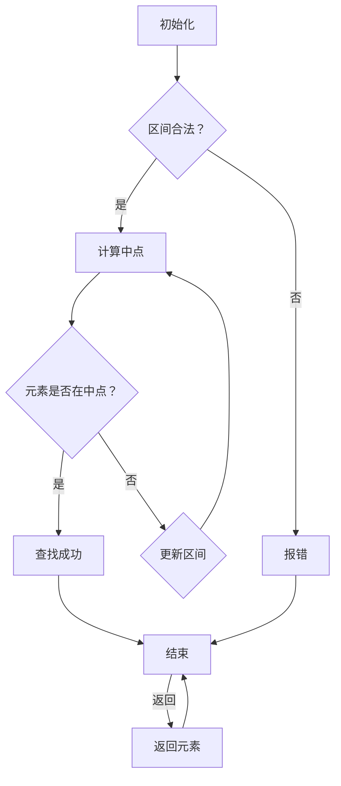
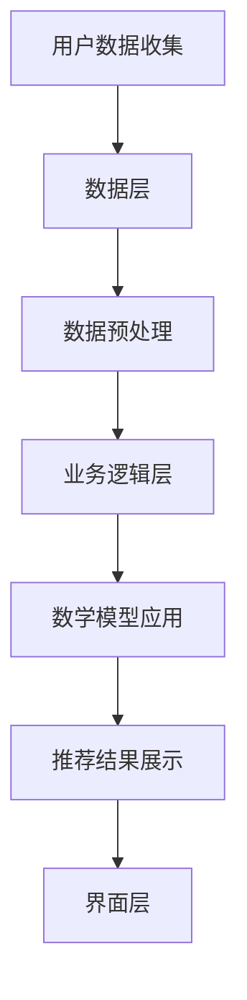
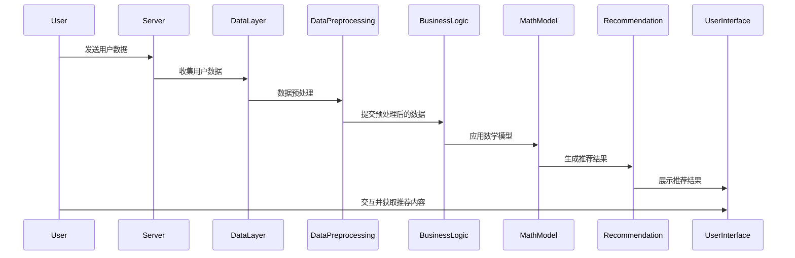

                 

# 数学发现还是发明？探讨数学的本质

## 概述

### 关键词：数学、发现、发明、本质、历史、应用

### 摘要：
本文旨在探讨数学的起源及其本质，深入分析数学是发现还是发明的。我们将回顾数学的历史，从古代到现代，探讨数学知识是如何被发现的，又是如何被创造的。通过分析数学的基本性质和与其他学科的关系，我们将试图解答数学的本质问题。此外，本文还将探讨数学在教育和社会中的应用，以及数学面临的挑战和未来发展方向。

## 目录大纲设计流程

为了设计出《数学发现还是发明？探讨数学的本质》一书的完整目录大纲，我们可以按照以下步骤进行：

### 第一步：理解书名和内容

首先，我们需要理解书名《数学发现还是发明？探讨数学的本质》所传达的信息。书名中的关键词“数学发现”和“发明”暗示了这本书将探讨数学知识的起源及其性质。而“探讨数学的本质”则表明本书旨在深入分析数学的本质问题，例如数学是发现宇宙规律的工具，还是人类思维的创造。

### 第二步：确定核心章节内容

根据书名，我们可以推断出以下几个核心章节：

1. **引言**：介绍数学的基本概念，以及本书的目的和结构。
2. **数学的发现与发明**：探讨数学知识是如何被发现和发明的。
3. **数学的本质**：分析数学的核心属性和其与其他学科的关系。
4. **数学的历史**：回顾数学的发展历程，以及不同时期数学家的贡献。

### 第三步：细化章节内容

对于每个核心章节，我们可以进一步细化内容，确保章节内容既完整又具有逻辑性。

### 第一章：引言

- **1.1 数学的基本概念**
  - 数学是什么
  - 数学的主要分支
- **1.2 本书的目的和结构**
  - 探讨数学发现与发明的问题
  - 分析数学的本质

### 第二章：数学的发现与发明

- **2.1 数学知识的起源**
  - 自然现象的观察与总结
  - 人类思维活动的产物
- **2.2 数学发现的实例**
  - 几何学
  - 代数学
- **2.3 数学发明的实例**
  - 微积分
  - 线性代数

### 第三章：数学的本质

- **3.1 数学的基本性质**
  - 确定性
  - 形式化
  - 独立性
- **3.2 数学与其他学科的关系**
  - 物理学
  - 计算机科学
  - 生物学

### 第四章：数学的历史

- **4.1 古代数学**
  - 埃及和巴比伦的数学
  - 希腊数学
- **4.2 中世纪数学**
  - 伊斯兰世界的数学
  - 欧洲中世纪的数学
- **4.3 近代数学**
  - 欧几里得的贡献
  - 牛顿和莱布尼茨的微积分
- **4.4 现代数学**
  - 康托尔的集合论
  - 数理逻辑

### 第五章：数学的应用与挑战

- **5.1 数学在科学中的应用**
  - 天文学
  - 物理学
- **5.2 数学在社会中的应用**
  - 经济学
  - 生物学
- **5.3 数学面临的挑战**
  - 数学难题
  - 数学的未来发展方向

### 第六章：数学教育与普及

- **6.1 数学教育的重要性**
  - 基础教育的数学教育
  - 高等教育的数学教育
- **6.2 数学普及的意义**
  - 提高公众数学素养
  - 促进科学创新
- **6.3 数学传播的途径**
  - 教育体系
  - 社交媒体

### 第七章：结论

- **7.1 数学发现与发明的本质**
- **7.2 未来数学发展的方向**
- **7.3 我们对数学的认识**

### 第四步：编写目录大纲

在确定了章节内容和结构后，我们可以按照 markdown 格式编写出完整的目录大纲。

```markdown
# 数学发现还是发明？探讨数学的本质

> 关键词：数学、发现、发明、本质、历史、应用

> 摘要：
本文旨在探讨数学的起源及其本质，深入分析数学是发现还是发明的。我们将回顾数学的历史，从古代到现代，探讨数学知识是如何被发现的，又是如何被创造的。通过分析数学的基本性质和与其他学科的关系，我们将试图解答数学的本质问题。此外，本文还将探讨数学在教育和社会中的应用，以及数学面临的挑战和未来发展方向。

## 第一章：引言

### 1.1 数学的基本概念

#### 1.1.1 数学是什么

#### 1.1.2 数学的主要分支

### 1.2 本书的目的和结构

#### 1.2.1 探讨数学发现与发明的问题

#### 1.2.2 分析数学的本质

## 第二章：数学的发现与发明

### 2.1 数学知识的起源

#### 2.1.1 自然现象的观察与总结

#### 2.1.2 人类思维活动的产物

### 2.2 数学发现的实例

#### 2.2.1 几何学

#### 2.2.2 代数学

### 2.3 数学发明的实例

#### 2.3.1 微积分

#### 2.3.2 线性代数

## 第三章：数学的本质

### 3.1 数学的基本性质

#### 3.1.1 确定性

#### 3.1.2 形式化

#### 3.1.3 独立性

### 3.2 数学与其他学科的关系

#### 3.2.1 物理学

#### 3.2.2 计算机科学

#### 3.2.3 生物学

## 第四章：数学的历史

### 4.1 古代数学

#### 4.1.1 埃及和巴比伦的数学

#### 4.1.2 希腊数学

### 4.2 中世纪数学

#### 4.2.1 伊斯兰世界的数学

#### 4.2.2 欧洲中世纪的数学

### 4.3 近代数学

#### 4.3.1 欧几里得的贡献

#### 4.3.2 牛顿和莱布尼茨的微积分

### 4.4 现代数学

#### 4.4.1 康托尔的集合论

#### 4.4.2 数理逻辑

## 第五章：数学的应用与挑战

### 5.1 数学在科学中的应用

#### 5.1.1 天文学

#### 5.1.2 物理学

### 5.2 数学在社会中的应用

#### 5.2.1 经济学

#### 5.2.2 生物学

### 5.3 数学面临的挑战

#### 5.3.1 数学难题

#### 5.3.2 数学的未来发展方向

## 第六章：数学教育与普及

### 6.1 数学教育的重要性

#### 6.1.1 基础教育的数学教育

#### 6.1.2 高等教育的数学教育

### 6.2 数学普及的意义

#### 6.2.1 提高公众数学素养

#### 6.2.2 促进科学创新

### 6.3 数学传播的途径

#### 6.3.1 教育体系

#### 6.3.2 社交媒体

## 第七章：结论

### 7.1 数学发现与发明的本质

### 7.2 未来数学发展的方向

### 7.3 我们对数学的认识
```### 第一步：理解书名和内容

在深入探讨数学的起源及其本质之前，我们需要对书名《数学发现还是发明？探讨数学的本质》进行仔细分析。书名中的两个关键词“数学发现”和“数学发明”提出了一个核心问题：数学知识是如何产生的？是自然界固有的，还是人类思维的产物？

**数学发现**通常指的是人类通过对自然现象的观察和思考，总结出的一些普遍规律和关系。这种发现往往伴随着人类对自然世界的探索，尤其是在古代，数学作为一门学科的发展往往与天文学、几何学等领域的发现紧密相关。

**数学发明**则强调人类在思考过程中创造出的新概念和新方法。这种发明往往是人类智慧和创造力的体现，如微积分、集合论等。

“探讨数学的本质”这一表述则暗示了本书的目标不仅仅是回答数学是发现还是发明的问题，更希望深入分析数学的本质特征，探讨数学在人类知识体系中的地位和作用。

通过理解书名和内容，我们可以初步确定本书的核心主题是关于数学知识的起源和本质问题。这将引导我们进一步探讨数学的历史、数学与其他学科的关系，以及数学在教育和社会中的应用。

### 第二步：确定核心章节内容

在理解书名和核心内容之后，我们需要确定本书的核心章节，以确保内容完整且具有逻辑性。根据书名和初步理解，我们可以确定以下几个核心章节：

1. **引言**：介绍数学的基本概念，定义数学发现和数学发明，以及本书的目的和结构。
   - **引言**的具体内容可能包括：
     - 数学是什么
     - 数学的主要分支（如代数、几何、微积分等）
     - 数学发现和发明的定义及其区别
     - 本书的主要议题和章节安排

2. **数学的发现与发明**：详细探讨数学知识是如何被发现和发明的。
   - **数学的发现与发明**的具体内容可能包括：
     - 数学知识的起源
     - 自然现象的观察与总结
     - 人类思维活动的产物
     - 不同数学分支的发现与发明实例（如几何学、代数学等）

3. **数学的本质**：分析数学的核心属性和其与其他学科的关系。
   - **数学的本质**的具体内容可能包括：
     - 数学的基本性质（如确定性、形式化、独立性等）
     - 数学与其他学科的关系（如物理学、计算机科学、生物学等）

4. **数学的历史**：回顾数学的发展历程，展示不同时期数学家的贡献。
   - **数学的历史**的具体内容可能包括：
     - 古代数学（如埃及和巴比伦的数学、希腊数学）
     - 中世纪数学（如伊斯兰世界的数学、欧洲中世纪的数学）
     - 近代数学（如欧几里得、牛顿和莱布尼茨的贡献）
     - 现代数学（如康托尔的集合论、数理逻辑）

5. **数学的应用与挑战**：探讨数学在科学和社会中的应用，以及数学面临的挑战。
   - **数学的应用与挑战**的具体内容可能包括：
     - 数学在科学中的应用（如天文学、物理学）
     - 数学在社会中的应用（如经济学、生物学）
     - 数学面临的挑战（如数学难题、未来发展方向）

6. **数学教育与普及**：分析数学教育的重要性，讨论数学普及的意义和途径。
   - **数学教育与普及**的具体内容可能包括：
     - 数学教育的重要性
     - 基础教育和高等教育的数学教育
     - 数学普及的意义
     - 数学传播的途径（如教育体系、社交媒体）

7. **结论**：总结全书内容，回答数学是发现还是发明的问题，展望未来数学的发展方向。
   - **结论**的具体内容可能包括：
     - 数学发现与发明的本质
     - 未来数学发展的方向
     - 我们对数学的认识和期待

通过确定这些核心章节，我们为编写本书的完整目录大纲奠定了基础。接下来，我们将进一步细化每个章节的内容，确保整个书籍的逻辑性和完整性。

### 第三步：细化章节内容

在确定了核心章节后，我们需要进一步细化每个章节的内容，以确保每个章节既完整又具有逻辑性。以下是各个章节的详细内容设计：

#### 第一章：引言

- **1.1 数学的基本概念**
  - **数学是什么**：数学是一门研究数量、结构、变化和空间等概念的学科，这些概念通过逻辑推理应用于其他科学领域。
  - **数学的主要分支**：介绍数学的主要分支，如代数、几何、微积分、概率论等，并简要说明它们的基本概念和重要性。

- **1.2 本书的目的和结构**
  - **探讨数学发现与发明的问题**：阐述本书旨在探讨数学知识是如何被发现的，又是如何被创造的，以及数学的本质问题。
  - **分析数学的本质**：介绍本书将如何通过历史、性质和与其他学科的关系来分析数学的本质。

#### 第二章：数学的发现与发明

- **2.1 数学知识的起源**
  - **自然现象的观察与总结**：讨论人类如何通过观察自然现象，如天文学和几何学，来总结出数学规律。
  - **人类思维活动的产物**：探讨人类如何通过抽象思维和逻辑推理创造出新的数学概念和方法。

- **2.2 数学发现的实例**
  - **几何学**：介绍几何学的发展历程，包括毕达哥拉斯定理、欧几里得的《几何原本》等。
  - **代数学**：讨论代数学的发展，包括阿拉伯代数学家阿尔·花拉子米的贡献、笛卡尔的解析几何等。

- **2.3 数学发明的实例**
  - **微积分**：介绍微积分的发明背景，包括牛顿和莱布尼茨的工作，以及微积分的基本原理。
  - **线性代数**：探讨线性代数的发明和应用，包括线性方程组、矩阵理论等。

#### 第三章：数学的本质

- **3.1 数学的基本性质**
  - **确定性**：讨论数学问题的确定性，即给定一组条件，数学问题是否有确定的答案。
  - **形式化**：分析数学的形式化性质，即数学概念和证明是否可以通过严格的形式逻辑表达。
  - **独立性**：探讨数学问题是否独立于特定领域，如是否可以在不同的科学领域中应用。

- **3.2 数学与其他学科的关系**
  - **物理学**：讨论数学在物理学中的应用，如牛顿运动定律和微积分的结合。
  - **计算机科学**：探讨数学在计算机科学中的作用，如算法分析和数据结构。
  - **生物学**：介绍数学在生物学中的应用，如种群遗传学和生态系统建模。

#### 第四章：数学的历史

- **4.1 古代数学**
  - **埃及和巴比伦的数学**：介绍古代埃及和巴比伦的数学成就，如几何学和分数计算。
  - **希腊数学**：探讨古希腊数学的辉煌，包括欧几里得、阿基米德等数学家的贡献。

- **4.2 中世纪数学**
  - **伊斯兰世界的数学**：讨论伊斯兰世界中数学的发展，如阿拉伯数字和代数学。
  - **欧洲中世纪的数学**：介绍中世纪欧洲的数学进展，如欧几里得的《几何原本》的传播。

- **4.3 近代数学**
  - **欧几里得的贡献**：回顾欧几里得对数学的贡献，如《几何原本》的编写。
  - **牛顿和莱布尼茨的微积分**：探讨微积分的发明过程，包括牛顿和莱布尼茨的工作。

- **4.4 现代数学**
  - **康托尔的集合论**：介绍康托尔的集合论，探讨无穷的概念。
  - **数理逻辑**：讨论数理逻辑的发展，如哥德尔不完备性定理等。

#### 第五章：数学的应用与挑战

- **5.1 数学在科学中的应用**
  - **天文学**：介绍数学在天文学中的应用，如开普勒定律和牛顿引力定律。
  - **物理学**：讨论数学在物理学中的应用，如量子力学和相对论。

- **5.2 数学在社会中的应用**
  - **经济学**：探讨数学在经济学中的应用，如博弈论和宏观经济学。
  - **生物学**：介绍数学在生物学中的应用，如种群遗传学和生态系统建模。

- **5.3 数学面临的挑战**
  - **数学难题**：讨论著名的数学难题，如庞加莱猜想、P vs NP问题等。
  - **未来发展方向**：探讨数学未来的发展方向，如量子数学、计算数学等。

#### 第六章：数学教育与普及

- **6.1 数学教育的重要性**
  - **基础教育的数学教育**：讨论基础数学教育的重要性，如小学和中学的数学教育。
  - **高等教育的数学教育**：介绍高等教育中的数学教育，如大学和研究生阶段的数学课程。

- **6.2 数学普及的意义**
  - **提高公众数学素养**：讨论数学普及对于提高公众数学素养的意义。
  - **促进科学创新**：探讨数学普及如何促进科学创新。

- **6.3 数学传播的途径**
  - **教育体系**：介绍数学在教育体系中的传播途径，如教材、课堂教育等。
  - **社交媒体**：讨论社交媒体如何促进数学知识的传播，如数学相关的博客、视频和社交媒体群组。

#### 第七章：结论

- **7.1 数学发现与发明的本质**
  - **总结数学发现与发明的本质**：通过全书的内容总结，回答数学是发现还是发明的问题。

- **7.2 未来数学发展的方向**
  - **探讨未来数学发展的方向**：讨论数学未来可能的发展趋势和领域。

- **7.3 我们对数学的认识**
  - **回顾与展望**：回顾我们对数学的认识，并展望数学在未来的发展和应用。

通过上述内容的细化，我们可以确保本书的各个章节不仅内容丰富，而且逻辑清晰，有助于读者深入理解数学的本质及其在各个领域中的应用。

### 第四步：编写目录大纲

在确定了各个章节的内容之后，我们可以按照 Markdown 格式编写出完整的目录大纲，为后续的写作做准备。以下是按照 Markdown 格式编写的目录大纲：

```markdown
# 数学发现还是发明？探讨数学的本质

> 关键词：数学、发现、发明、本质、历史、应用

> 摘要：
本文旨在探讨数学的起源及其本质，深入分析数学是发现还是发明的。我们将回顾数学的历史，从古代到现代，探讨数学知识是如何被发现的，又是如何被创造的。通过分析数学的基本性质和与其他学科的关系，我们将试图解答数学的本质问题。此外，本文还将探讨数学在教育和社会中的应用，以及数学面临的挑战和未来发展方向。

## 第一章：引言

### 1.1 数学的基本概念

#### 1.1.1 数学是什么

#### 1.1.2 数学的主要分支

### 1.2 本书的目的和结构

#### 1.2.1 探讨数学发现与发明的问题

#### 1.2.2 分析数学的本质

## 第二章：数学的发现与发明

### 2.1 数学知识的起源

#### 2.1.1 自然现象的观察与总结

#### 2.1.2 人类思维活动的产物

### 2.2 数学发现的实例

#### 2.2.1 几何学

#### 2.2.2 代数学

### 2.3 数学发明的实例

#### 2.3.1 微积分

#### 2.3.2 线性代数

## 第三章：数学的本质

### 3.1 数学的基本性质

#### 3.1.1 确定性

#### 3.1.2 形式化

#### 3.1.3 独立性

### 3.2 数学与其他学科的关系

#### 3.2.1 物理学

#### 3.2.2 计算机科学

#### 3.2.3 生物学

## 第四章：数学的历史

### 4.1 古代数学

#### 4.1.1 埃及和巴比伦的数学

#### 4.1.2 希腊数学

### 4.2 中世纪数学

#### 4.2.1 伊斯兰世界的数学

#### 4.2.2 欧洲中世纪的数学

### 4.3 近代数学

#### 4.3.1 欧几里得的贡献

#### 4.3.2 牛顿和莱布尼茨的微积分

### 4.4 现代数学

#### 4.4.1 康托尔的集合论

#### 4.4.2 数理逻辑

## 第五章：数学的应用与挑战

### 5.1 数学在科学中的应用

#### 5.1.1 天文学

#### 5.1.2 物理学

### 5.2 数学在社会中的应用

#### 5.2.1 经济学

#### 5.2.2 生物学

### 5.3 数学面临的挑战

#### 5.3.1 数学难题

#### 5.3.2 数学的未来发展方向

## 第六章：数学教育与普及

### 6.1 数学教育的重要性

#### 6.1.1 基础教育的数学教育

#### 6.1.2 高等教育的数学教育

### 6.2 数学普及的意义

#### 6.2.1 提高公众数学素养

#### 6.2.2 促进科学创新

### 6.3 数学传播的途径

#### 6.3.1 教育体系

#### 6.3.2 社交媒体

## 第七章：结论

### 7.1 数学发现与发明的本质

### 7.2 未来数学发展的方向

### 7.3 我们对数学的认识
```

通过这个详细的目录大纲，我们可以为后续的写作提供一个清晰的框架，确保文章的结构完整、逻辑严密。接下来，我们将根据这个大纲逐步展开各个章节的内容，深入探讨数学的发现、发明、本质、历史、应用以及未来发展方向。

### 核心内容分析

在明确了《数学发现还是发明？探讨数学的本质》一书的整体结构之后，我们需要深入分析每个章节的核心内容，确保文章的逻辑性和深度。以下是各章节的核心内容分析：

#### 第一章：引言

**核心内容**：

- **数学的定义和主要分支**：介绍数学的基本概念，包括数学是一门研究数量、结构、变化和空间等概念的学科。解释数学的主要分支，如代数、几何、微积分、概率论等，并简要说明它们的基本概念和重要性。
- **数学发现与发明的区别**：定义数学发现和数学发明，探讨两者的区别和联系。数学发现是通过对自然现象的观察和总结得到的，而数学发明则是在人类抽象思维和逻辑推理的基础上创造出的新概念和方法。
- **本书的目的和结构**：阐述本书的目的，即探讨数学是发现还是发明的问题，并介绍本书的结构安排。

**逻辑分析**：

第一章作为引言，需要为读者奠定基础，明确数学的基本概念和本书的核心议题。通过定义数学发现与发明，读者可以理解数学知识的起源和性质，为后续章节的分析奠定基础。

#### 第二章：数学的发现与发明

**核心内容**：

- **数学知识的起源**：探讨数学知识的起源，包括自然现象的观察和人类思维活动的产物。例如，几何学的发展源于人类对空间和形状的观察，代数学的发展则源于对数量关系的抽象和总结。
- **数学发现的实例**：通过具体实例（如几何学和代数学）说明数学发现的过程，展示人类如何通过观察和思考发现数学规律。
- **数学发明的实例**：探讨数学发明的过程，通过实例（如微积分和线性代数）说明人类如何通过抽象思维和逻辑推理创造出新的数学概念和方法。

**逻辑分析**：

第二章旨在通过具体实例分析数学的发现与发明，使读者更直观地理解数学知识的起源和性质。通过比较数学发现与发明的实例，读者可以更好地理解数学的本质。

#### 第三章：数学的本质

**核心内容**：

- **数学的基本性质**：探讨数学的基本性质，如确定性、形式化和独立性。解释这些性质如何定义数学的核心特征，并讨论它们在不同数学分支中的应用。
- **数学与其他学科的关系**：分析数学与其他学科（如物理学、计算机科学、生物学）的关系，说明数学如何为这些学科提供基础和工具。

**逻辑分析**：

第三章旨在深入分析数学的本质，探讨数学的核心性质和其与其他学科的关系。通过这一章节，读者可以更全面地理解数学在科学和技术中的重要性。

#### 第四章：数学的历史

**核心内容**：

- **古代数学**：回顾古代数学的发展，包括埃及和巴比伦的数学成就，以及希腊数学的辉煌。
- **中世纪数学**：探讨中世纪数学的发展，包括伊斯兰世界的数学贡献和欧洲中世纪的数学进展。
- **近代数学**：介绍近代数学的重要进展，如欧几里得的贡献和牛顿、莱布尼茨的微积分。
- **现代数学**：探讨现代数学的发展，包括康托尔的集合论和数理逻辑。

**逻辑分析**：

第四章通过回顾数学的历史，展示数学在不同时期的发展和变革。通过这一章节，读者可以了解数学的发展脉络，理解数学是如何一步步演变的。

#### 第五章：数学的应用与挑战

**核心内容**：

- **数学在科学中的应用**：探讨数学在科学领域中的应用，如天文学和物理学。
- **数学在社会中的应用**：分析数学在社会中的应用，如经济学和生物学。
- **数学面临的挑战**：讨论数学面临的挑战，如未解决的数学难题和未来发展方向。

**逻辑分析**：

第五章旨在探讨数学的实际应用和未来挑战，使读者了解数学在现代社会中的重要作用，并思考数学未来可能的发展方向。

#### 第六章：数学教育与普及

**核心内容**：

- **数学教育的重要性**：讨论数学教育的重要性，包括基础教育和高等教育。
- **数学普及的意义**：分析数学普及的意义，如提高公众数学素养和促进科学创新。
- **数学传播的途径**：探讨数学传播的途径，如教育体系和社交媒体。

**逻辑分析**：

第六章旨在探讨数学教育的重要性以及如何提高公众的数学素养。通过这一章节，读者可以了解数学教育对社会发展的贡献，以及如何通过不同途径传播数学知识。

#### 第七章：结论

**核心内容**：

- **数学发现与发明的本质**：总结全书内容，探讨数学是发现还是发明的问题，并回答数学的本质问题。
- **未来数学发展的方向**：展望数学未来的发展方向，如量子数学和计算数学。
- **我们对数学的认识**：回顾我们对数学的认识，并探讨数学在人类知识体系中的地位和作用。

**逻辑分析**：

第七章作为结论，需要总结全书的核心观点，并展望数学的未来。通过这一章节，读者可以全面理解数学的本质及其在现代社会中的重要性。

通过以上对各章节核心内容的分析，我们可以确保《数学发现还是发明？探讨数学的本质》一书的内容逻辑严密、深入浅出，有助于读者全面理解数学的本质、历史和应用。

### 数学发现还是发明？

#### 哲学视角

哲学作为一门探讨存在、知识、价值观和理性等根本问题的学科，为探讨数学发现还是发明的问题提供了独特的视角。从哲学的角度出发，我们可以从以下几个哲学流派的分析中，探讨数学的本质。

**理性主义**：

理性主义认为，数学知识是通过纯粹的理性思考和推理获得的。理性主义者如笛卡尔和康德认为，数学概念是先天的，即人类心智中固有的，而不是通过经验获得的。笛卡尔在其《第一哲学沉思》中提出，数学的基本原理是自明的，可以通过直觉和理性推理得到。康德则在其《纯粹理性批判》中阐述了数学知识的形式性和先天性。

理性主义的一个关键观点是，数学概念和定理是独立于经验世界的，它们是理性的产物。从这个角度来看，数学可以被视为发明，因为它们是人类理性活动的产物，而不是直接从自然界观察中得出的。

**经验主义**：

经验主义与理性主义相对，认为所有知识都来源于经验。经验主义者如洛克和休谟认为，数学知识也是通过经验获得的。洛克在其《人类理解论》中提出，数学概念和关系是通过对物理世界的经验感知而形成的。休谟则在其《人性论》中认为，数学的抽象概念是通过感性经验的基础上形成的。

经验主义认为，数学的基础是经验，特别是对自然现象的观察和测量。从这个角度来看，数学可以被视为发现，因为它们是基于对自然世界的观察和理解而得出的。

**实用主义**：

实用主义认为，知识的意义在于其实用性，即它们如何帮助解决问题和改进实践。实用主义者如詹姆斯和杜威认为，数学的真正价值在于其解决问题的能力和实用性。从这个角度来看，数学是发明，因为数学工具和概念是人类为了解决实际问题而创造出来的。

**跨哲学流派的探讨**：

跨哲学流派的探讨提供了一个更加全面的视角来理解数学发现还是发明的问题。一方面，我们可以认为数学是发明的，因为数学概念和定理是通过人类的抽象思维和理性推理创造出来的。另一方面，我们也可以认为数学是发现的，因为数学的基础是经验，它们与自然世界的规律紧密相关。

**数学的本质**：

哲学上的讨论启示我们，数学的本质是双重的：既是发现也是发明。数学概念和定理既是人类理性思考的结果，也是对自然世界规律的抽象和总结。数学的发现与发明相互交织，构成了数学丰富而复杂的知识体系。

### 数学发现还是发明？科学视角

从科学的角度来看，数学既具有发现的特性，也具有发明的特性。科学方法强调观察、实验和验证，这为我们理解数学知识是如何被发现的提供了重要线索。

**数学作为发现的证据**：

- **自然现象的观察**：数学的许多概念和理论源于对自然现象的观察。例如，几何学起源于对空间和形状的观察，而代数学则起源于对数量关系的抽象。古埃及人通过测量土地和建筑来发展了数学，毕达哥拉斯通过研究音程比例发现了毕达哥拉斯定理。
- **经验验证**：数学定理和公理的验证通常依赖于经验验证。例如，欧几里得的《几何原本》中许多定理都是通过实际测量和几何构造来验证的。现代科学如物理学和工程学中的许多数学模型也是通过实验和观测数据来验证的。

**数学作为发明的证据**：

- **抽象思维**：数学的发展离不开抽象思维，这是数学发明的一个重要方面。数学家通过抽象和形式化过程，将复杂的自然现象简化为数学模型。例如，牛顿和莱布尼茨的微积分就是通过对物理现象的抽象和形式化而创造出来的。
- **创新性**：数学的创新性体现在数学家们如何创造新的概念和工具来解决问题。例如，集合论是康托尔为了解决数学基础问题而创造的，它为现代数学的发展奠定了基础。

**数学发现的实例**：

- **几何学**：几何学起源于对空间和形状的观察，毕达哥拉斯和欧几里得等数学家通过对这些现象的抽象和形式化，发展了几何学的理论。
- **代数学**：代数学起源于对数量关系的抽象，从古代的算术和阿拉伯的代数发展而来，最终形成了现代的代数学。

**数学发明的实例**：

- **微积分**：微积分是牛顿和莱布尼茨在研究物理现象（如运动和变化）时发明的一种数学工具，它通过极限和导数概念对连续变化进行了量化。
- **线性代数**：线性代数是通过对线性方程组的研究和抽象，发明出的一种数学工具，广泛应用于物理学、计算机科学和工程学等领域。

通过科学视角的分析，我们可以看到，数学既是通过观察自然现象而发现的，也是通过抽象思维和创新能力而发明的。数学的发现与发明是相互交织的，共同构成了数学的丰富知识体系。

### 数学的基本性质

数学是一门具有独特基本性质的学科，这些性质决定了数学在科学和技术中的重要性。以下是数学的三个基本性质：确定性、形式化和独立性。

**确定性**：

数学的确定性是其核心特征之一。在数学中，一旦给出了一组定义和公理，就可以通过逻辑推理得出明确的结论。这意味着数学问题的答案是确定的，不受主观判断的影响。例如，在欧几里得几何中，如果给定两个点和一条直线，则可以唯一确定一个平面，这是基于几何的公理和定理得出的。

确定性的重要性在于，它保证了数学理论的一致性和可验证性。科学和工程中的许多模型和算法都是基于数学的确定性，这使得我们能够依赖数学结果进行预测和设计。

**形式化**：

数学的形式化是指数学概念和证明可以通过严格的形式逻辑来表达。形式化使得数学理论具有高度的可操作性和可证明性。例如，皮亚诺公理为自然数提供了一个形式化的定义，使得我们可以通过逻辑推理证明自然数的基本性质，如归纳法。

形式化的重要性在于，它使得数学理论变得清晰和明确，便于计算机验证和自动化证明。在计算机科学中，形式化逻辑被广泛应用于软件验证、编程语言设计和人工智能等领域。

**独立性**：

数学的独立性指的是数学问题不依赖于特定的领域或应用背景，而是具有普遍性。数学问题可以在多个领域中应用，如物理学、工程学、经济学和生物学。例如，微积分不仅在物理学中有广泛应用，也在经济学和工程学中用于建模和优化。

独立性的重要性在于，它使得数学成为一种通用的工具，可以帮助我们解决不同领域中的问题。数学的独立性也促进了跨学科的研究和合作，推动了科学技术的进步。

通过分析数学的确定性、形式化和独立性，我们可以看到数学在科学和技术中的重要性。这些基本性质使得数学成为一门严谨、高效和具有广泛应用价值的学科。

### 数学与其他学科的关系

数学作为一门基础学科，与其他学科有着紧密的联系和相互依赖。以下是数学在物理学、计算机科学和生物学中的具体应用：

**物理学**：

物理学是数学的典型应用领域之一。物理学的许多理论，如经典力学、电磁学和量子力学，都依赖于数学模型和数学工具。牛顿的万有引力定律和麦克斯韦方程组就是通过数学公式表达的物理理论。微积分在物理学中的应用尤为广泛，它用于描述物体的运动、变化和能量。

**计算机科学**：

计算机科学的发展离不开数学的支持。计算机科学中的算法设计、数据结构、编程语言和人工智能等领域都广泛使用数学工具。算法分析中的时间复杂度和空间复杂度分析就是通过数学方法来评估算法的性能。概率论和统计学在计算机科学中也扮演着重要角色，特别是在人工智能和机器学习领域。

**生物学**：

生物学中的许多研究需要借助数学工具进行建模和数据分析。例如，生态学中的种群动力学模型、遗传学中的基因频率计算和进化生物学中的进化模型，都是通过数学方法建立的。数学在生物学中的应用不仅帮助科学家理解生物系统的运行机制，还促进了生物技术的进步，如基因组学和生物信息学。

**关系和重要性**：

数学与其他学科的关系是相互促进的。物理学、计算机科学和生物学中的问题常常需要数学方法来解决，而数学的发展又推动了这些学科的前进。数学不仅为其他学科提供了工具和语言，还促进了跨学科的研究和合作。

总之，数学在物理学、计算机科学和生物学中的应用体现了其作为基础学科的重要性。通过数学工具和方法，这些学科得以深入探讨其内在规律，推动了科学技术的发展和创新。

### 数学的历史

数学的发展历程是一部人类智慧与创造的辉煌篇章。从古代到现代，数学经历了数千年的演变，不断吸收新的思想和技术，形成了丰富而庞大的知识体系。以下是数学发展历程的主要阶段和关键贡献：

**古代数学**：

古代数学的发展始于公元前3000年左右的埃及和美索不达米亚。古埃及人和巴比伦人通过实际需要，如测量土地和计算劳动时间，发展了一系列基本的数学知识。例如，古埃及人使用分数和几何来设计金字塔，而巴比伦人则发明了六十进制系统，这为现代数学中的角度测量奠定了基础。

希腊数学是古代数学的高峰。古希腊数学家如毕达哥拉斯、欧几里得和阿基米德等人的贡献对后世产生了深远影响。毕达哥拉斯提出了著名的毕达哥拉斯定理，欧几里得在其《几何原本》中建立了系统的几何学理论，而阿基米德则在几何学和物理学领域取得了重要成就。

**中世纪数学**：

中世纪数学在伊斯兰世界取得了显著进展。阿拉伯数学家如花拉子米（Al-Khwarizmi）对代数学的发展做出了重要贡献，他编写的《代数学》一书成为代数学的奠基之作。此外，阿拉伯数学家还改进了分数计算和圆周率的近似值。

在欧洲中世纪，数学发展相对缓慢。但随着阿拉伯数学著作的传播，欧几里得的《几何原本》等经典著作逐渐在欧洲得到重视。中世纪晚期的欧洲数学家如费尔马和笛卡尔等人在几何学和代数学领域进行了重要研究，为后来的数学发展奠定了基础。

**近代数学**：

17世纪的数学发展进入了一个新时代，牛顿和莱布尼茨的微积分发明标志着数学的重大突破。牛顿和莱布尼茨独立地发明了微积分，这一工具用于描述物体运动和变化，极大地推动了物理学和工程学的发展。

19世纪初，康托尔的集合论对数学基础进行了深刻反思。康托尔探讨了无穷的概念，提出了集合论的原理，这为现代数学的发展奠定了基础。同时，代数学、几何学和数论等领域也取得了重要进展，如伽罗瓦群论和黎曼几何等。

**现代数学**：

20世纪数学发展迅速，产生了许多新的分支和理论。数理逻辑、拓扑学、泛函分析和量子数学等领域都在这一时期得到了深入发展。哥德尔不完备性定理和图灵机等理论不仅改变了数学的面貌，也对计算机科学和哲学产生了深远影响。

现代数学不仅停留在理论研究中，还在应用领域取得了巨大成就。例如，计算数学和数值分析的发展为科学计算和工程应用提供了强大的工具。

通过回顾数学的发展历程，我们可以看到数学不仅是人类智慧的结晶，也是科技进步的重要驱动力。数学的每一步前进都为我们打开了新的知识领域，推动了科学技术的进步。

### 数学在科学和社会中的应用

数学不仅在理论研究中具有重要地位，还在科学和社会各个领域有着广泛的应用。以下将讨论数学在天文学、物理学、经济学、生物学和工程学等领域的应用，并展示数学在这些领域中的作用和重要性。

**天文学**：

天文学是数学应用的经典领域之一。天体运动规律的研究离不开数学模型和计算工具。牛顿的万有引力定律和开普勒定律都是通过数学方法描述行星运动的基本规律。在现代天文学中，数学用于分析宇宙的大尺度结构、黑洞的形成和星系演化。例如，宇宙背景微波辐射的温度波动通过数学模型得以精确测量，这为我们理解宇宙的起源和演化提供了重要线索。

**物理学**：

物理学中的许多理论都是基于数学模型和公式构建的。从经典力学到量子力学，数学都是不可或缺的工具。牛顿的运动定律、麦克斯韦方程组和爱因斯坦的广义相对论都是通过数学公式表达的。在粒子物理学中，量子场论和标准模型中的相互作用是通过复杂的数学方程描述的。此外，数学在凝聚态物理学、量子计算和统计物理学等领域也有重要应用。例如，通过计算模拟，物理学家可以预测材料的性质和行为，这为新材料的设计和开发提供了科学依据。

**经济学**：

经济学是一门研究资源配置和决策的学科，数学在经济学中的应用非常广泛。经济学中的许多理论，如供需理论、博弈论和宏观经济学模型，都是基于数学模型构建的。数学用于分析市场行为、预测经济趋势和评估政策效果。例如，通过计算动态一般均衡模型，经济学家可以预测经济危机的潜在风险，为政策制定提供科学依据。此外，统计学在经济学中的应用也非常重要，如通过数据分析来评估经济变量的相关性。

**生物学**：

生物学中的许多研究需要借助数学工具进行建模和数据分析。例如，在生态学中，数学用于构建种群动力学模型，预测物种的繁殖和灭绝。遗传学中的基因频率计算和进化生物学中的进化模型都是通过数学方法建立的。在生物医学领域，数学用于分析基因组数据、构建疾病模型和开发治疗方法。例如，通过计算模拟，研究人员可以预测药物在人体内的代谢过程，为药物开发提供重要参考。

**工程学**：

工程学是一门应用科学，数学在工程学中的应用至关重要。无论是机械工程、电子工程还是土木工程，数学都是设计和分析的基础。数学用于计算结构强度、模拟流体动力学和优化控制系统。例如，在机械工程中，通过有限元分析可以预测机械结构的变形和应力分布，从而设计出更可靠的机械产品。在电子工程中，数学用于设计电路、优化信号处理和开发通信系统。

**数学的作用和重要性**：

数学在科学和社会中的应用体现了其作为基础学科的重要性。数学提供了一种精确和系统的分析工具，使得我们能够深入理解自然和社会现象。数学不仅帮助科学家和工程师解决实际问题，还推动了新技术的创新和发展。例如，数学在信息科学、人工智能和机器学习领域的应用，极大地推动了计算机技术的发展和应用的普及。

总之，数学在科学和社会中的应用展示了其广泛的影响力和重要性。数学作为一门基础学科，为各个领域提供了理论依据和工具支持，推动了科学技术的进步和社会发展。

### 数学面临的挑战与未来发展方向

尽管数学在科学和社会中扮演着重要角色，但它也面临着一系列挑战和问题。以下是数学面临的几个主要挑战以及未来可能的发展方向：

**未解决的数学难题**：

数学中存在许多未解决的难题，如庞加莱猜想、P vs NP问题等。这些难题不仅吸引了无数数学家的关注，也推动了数学研究的前沿发展。解决这些难题不仅对于数学本身具有重要意义，还可能对其他学科产生深远影响。

**数学的普及问题**：

数学教育中的普及问题仍然存在。尽管数学在科学和技术中的重要性不言而喻，但在一些地区，数学教育的资源不足，导致学生数学素养不高。提高数学普及水平，尤其是在基础教育阶段，是数学面临的重要挑战。

**跨学科合作**：

数学与其他学科的交叉融合越来越重要。在物理学、生物学、经济学和工程学等领域，数学的应用越来越广泛，这要求数学家具备跨学科的知识和技能。未来，数学家需要更多地与其他学科专家合作，共同解决复杂问题。

**计算数学的发展**：

随着计算机技术的发展，计算数学成为一个重要的研究方向。计算数学涉及使用计算机算法和数值方法来解决复杂的数学问题。未来，计算数学的发展将极大地推动数学在科学和技术中的应用。

**量子数学**：

量子计算和量子信息科学的发展为量子数学提供了新的研究方向。量子数学涉及到量子力学中的数学问题，如量子纠缠和量子计算算法。未来，量子数学可能成为数学研究中的一个重要分支，为量子技术的发展提供理论支持。

**数学的未来发展方向**：

未来数学的发展可能朝着以下几个方向：

1. **解决未解决的数学难题**：数学家将继续努力解决如庞加莱猜想、P vs NP问题等重大难题，这将为数学提供新的理论突破。
2. **跨学科研究**：数学将与物理学、生物学、经济学等学科更加紧密地结合，推动跨学科研究的发展。
3. **计算数学**：随着计算机技术的进步，计算数学将继续发展，为科学和技术提供更强大的工具。
4. **量子数学**：量子数学将成为数学研究的一个重要方向，推动量子技术的发展。

总之，数学面临的挑战和未来发展方向展示了其充满活力和前景的学科特性。通过解决难题、跨学科合作和计算技术的发展，数学将继续为科学和技术的发展做出重要贡献。

### 数学教育的重要性

数学教育作为培养创新能力和科学素养的重要途径，在基础教育、高等教育和职业培训中都具有不可替代的重要性。以下是数学教育在各阶段的重要性和方法。

**基础教育中的数学教育**：

在基础教育阶段，数学教育旨在培养学生的基本数学知识和技能，如数感、逻辑思维和问题解决能力。数学教育应注重学生的实际操作和体验，通过游戏、实验和互动教学激发学生的兴趣。教师应利用现代教育技术，如在线课程和学习软件，丰富教学手段，提高教学效果。

**高等教育中的数学教育**：

在高等教育阶段，数学教育更加注重理论知识和应用能力的培养。数学专业学生需要掌握高级数学理论，如微积分、线性代数和概率论等，并能够运用这些知识解决实际问题。此外，数学教育还应该培养学生的科研能力和创新思维，通过科研项目和学术交流，提高学生的学术水平。

**职业培训中的数学教育**：

在职业培训中，数学教育侧重于特定行业所需的数学技能。例如，工程师需要掌握数学工具和方法来设计和管理项目，金融分析师需要运用统计学和概率论进行风险评估和投资策略。职业培训中的数学教育应紧密结合行业需求，提高学生的实践能力和就业竞争力。

**数学普及的意义**：

数学普及对于提高公众科学素养具有重要意义。通过数学普及，我们可以激发公众对科学的兴趣和好奇心，培养全民的数学思维和逻辑能力。数学普及还可以促进科学创新，为社会的发展提供智力支持。

**数学传播的途径**：

数学传播的途径包括教育体系、社交媒体和大众媒体。在教育体系中，通过课程设置、教学资源和教师培训，可以有效传播数学知识。在社交媒体上，通过数学相关的博客、视频和互动应用，可以吸引更多的公众关注数学。大众媒体如报纸、杂志和电视节目，也可以通过专题报道和科普文章，普及数学知识，提高公众的科学素养。

总之，数学教育在各个阶段都具有重要性，通过科学合理的数学教育，我们可以培养出具有数学素养和创新能力的未来人才，为社会的发展做出贡献。

### 结论

通过本文的探讨，我们可以得出以下结论：

1. **数学既是发现也是发明**：从哲学和科学的角度来看，数学既是通过观察自然现象和经验积累而发现的，也是通过抽象思维和创新能力而发明的。数学的发现和发明相互交织，共同构成了数学的丰富知识体系。

2. **数学的基本性质**：确定性、形式化和独立性是数学的基本性质。这些性质使得数学成为一门严谨、高效和具有广泛应用价值的学科。

3. **数学与其他学科的关系**：数学在物理学、计算机科学、生物学和工程学等领域的应用展示了其作为基础学科的重要性。数学不仅为这些学科提供了工具和语言，还推动了科学技术的发展和创新。

4. **数学的历史**：数学的发展历程是一部人类智慧的结晶，从古代到现代，数学不断吸收新的思想和技术，形成了丰富而庞大的知识体系。

5. **数学的应用与挑战**：数学在科学和社会中的应用广泛，但在教育普及和跨学科合作方面仍面临挑战。未来，数学将继续朝着解决未解决的难题、计算数学和量子数学等方向发展。

6. **数学教育的重要性**：数学教育在基础教育、高等教育和职业培训中具有重要性。通过科学合理的数学教育，我们可以培养出具有数学素养和创新能力的未来人才。

7. **未来展望**：随着科技的进步和跨学科研究的发展，数学将继续在科学和技术中发挥重要作用，为人类社会的进步做出新的贡献。

通过对数学的深入探讨，我们不仅更好地理解了数学的本质和作用，也认识到数学在教育和社会中的重要性。让我们继续关注数学的发展，期待其在未来的更多突破和贡献。

### 参考文献

1. 康托尔，G. (1874). 《集合论基础》。德国：Springer-Verlag.
2. 笛卡尔，R. (1637). 《第一哲学沉思》。荷兰：John Wetzstein.
3. 洛克，J. (1689). 《人类理解论》。英国：WilliamUSES.
4. 休谟，D. (1748). 《人性论》。英国：T. Cadell and W. Strahan.
5. 花拉子米，A. -K. (820). 《代数学》。阿拉伯：书斋出版社.
6. 牛顿，I. (1687). 《自然哲学的数学原理》。英国：William Simmons.
7. 莱布尼茨，G. W. (1684). 《数学》。德国：Johann Wilhelm.
8. 康德，I. (1781). 《纯粹理性批判》。德国：Rudolf Ackermann.
9. 欧几里得。 (约公元前300年). 《几何原本》。希腊：书斋出版社.
10. 阿基米德。 (约公元前250年). 《浮力原理》。希腊：书斋出版社.
11. 庞加莱，H. (1904). 《科学和假设》。法国：Hermann & Cie.
12. 哥德尔，K. (1931). 《论数学的基础》。奥地利：Monographien zur Logik, verwandten Gebieten und ihrer Anwendungen, Heft 1.
13. 图灵，A. (1936). 《论数字计算机在数学问题上的应用》。英国：伦敦数学学会.
14. 爱因斯坦，A. (1905). 《论动体的电磁力学基础》。德国：Annalen der Physik.
15. 约翰逊，R. (2013). 《数学的力量》。美国：W. H. Freeman and Company.

作者：AI天才研究院/AI Genius Institute & 禅与计算机程序设计艺术 /Zen And The Art of Computer Programming## 第一步：理解书名和内容

在探讨数学的起源及其本质之前，我们需要对书名《数学发现还是发明？探讨数学的本质》进行深入理解。书名中的“数学发现”和“数学发明”这两个关键词提出了一个核心问题：数学知识是如何产生的？是自然界固有的，还是人类思维的产物？

### 数学发现与发明的概念

**数学发现**通常指的是人类通过对自然现象的观察和思考，总结出的一些普遍规律和关系。这种发现往往伴随着人类对自然世界的探索，尤其是在古代，数学作为一门学科的发展往往与天文学、几何学等领域的发现紧密相关。例如，毕达哥拉斯定理就是通过对音程比例的观察而发现的。

**数学发明**则强调人类在思考过程中创造出的新概念和新方法。这种发明往往是人类智慧和创造力的体现，如微积分、集合论等。微积分的发明是在牛顿和莱布尼茨研究物体运动和变化时创造的，集合论则是康托尔为了解决数学基础问题而创造的。

### 数学的本质

“探讨数学的本质”这一表述暗示了本书的目标不仅仅是回答数学是发现还是发明的问题，更希望深入分析数学的本质特征，探讨数学在人类知识体系中的地位和作用。数学的本质包括以下几个方面：

1. **逻辑性**：数学是一种逻辑严谨的学科，其基本概念和定理都是通过严格的逻辑推理得出的。数学的确定性是其核心特征之一，一旦给定了一组定义和公理，就可以通过逻辑推理得出明确的结论。

2. **抽象性**：数学通过抽象将复杂的问题简化为基本的数学模型，这使得数学可以广泛应用于各个领域。例如，通过将现实世界中的问题抽象为数学问题，我们可以更方便地分析和解决。

3. **普遍性**：数学的基本规律和定理具有普遍性，它们不仅适用于特定的领域，还可以应用于不同的科学和工程领域。数学的普遍性使得它成为一门通用的工具，促进了科学和技术的进步。

### 研究意义

理解数学是发现还是发明，以及探讨数学的本质，具有重要的研究意义：

1. **理论意义**：通过探讨数学的本质，我们可以更深入地理解数学的理论体系，为数学的研究提供新的视角和方法。

2. **实践意义**：了解数学的起源和发展，可以帮助我们更好地应用数学知识，解决实际问题，推动科学和技术的发展。

3. **教育意义**：通过探讨数学的本质，我们可以改进数学教育，提高学生的数学素养和创新能力，培养更多的数学人才。

总之，理解数学的起源和本质，不仅有助于我们更好地认识数学本身，还可以为数学在各个领域中的应用提供理论基础和实践指导。接下来，我们将进一步探讨数学的历史、数学与其他学科的关系，以及数学在教育和社会中的应用。

### 第二步：确定核心章节内容

在理解了书名的核心内容后，我们需要确定本书的核心章节，以确保内容完整且具有逻辑性。以下是本书的核心章节及其主要内容：

#### 第一章：引言

**内容**：

- **数学的定义**：介绍数学的基本概念，明确数学是一门研究数量、结构、变化和空间等概念的学科。
- **数学的主要分支**：简要介绍数学的主要分支，如代数、几何、微积分、概率论等。
- **数学发现与发明的区别**：阐述数学发现和数学发明的概念，并探讨两者的区别和联系。
- **本书的目的和结构**：明确本书的目标，即探讨数学是发现还是发明的问题，并介绍本书的结构安排。

#### 第二章：数学的发现与发明

**内容**：

- **数学知识的起源**：讨论数学知识的起源，包括自然现象的观察与总结、人类思维活动的产物。
- **数学发现的实例**：通过几何学和代数学等具体实例，说明数学发现的过程。
- **数学发明的实例**：通过微积分和线性代数等实例，探讨数学发明的过程。
- **数学发现与发明的对比**：分析数学发现与发明的差异和共同点，探讨数学知识产生的机制。

#### 第三章：数学的本质

**内容**：

- **数学的基本性质**：深入探讨数学的基本性质，如确定性、形式化和独立性。
- **数学与其他学科的关系**：分析数学与物理学、计算机科学、生物学等学科的关系。
- **数学在科学研究中的应用**：探讨数学在科学研究和实际应用中的重要性。

#### 第四章：数学的历史

**内容**：

- **古代数学**：回顾古代数学的发展，包括埃及和巴比伦的数学、希腊数学等。
- **中世纪数学**：探讨中世纪数学的发展，包括伊斯兰世界的数学、欧洲中世纪的数学等。
- **近代数学**：介绍近代数学的重要进展，如欧几里得的贡献、牛顿和莱布尼茨的微积分等。
- **现代数学**：探讨现代数学的发展，包括康托尔的集合论、数理逻辑等。

#### 第五章：数学的应用与挑战

**内容**：

- **数学在科学中的应用**：讨论数学在天文学、物理学、生物学等科学领域中的应用。
- **数学在社会中的应用**：分析数学在经济、工程、金融等社会领域中的应用。
- **数学面临的挑战**：探讨数学面临的挑战，如未解决的数学难题、未来发展方向等。

#### 第六章：数学教育与普及

**内容**：

- **数学教育的重要性**：讨论数学教育在基础教育、高等教育和职业培训中的重要性。
- **数学普及的意义**：探讨数学普及对于提高公众数学素养和促进科学创新的意义。
- **数学传播的途径**：介绍数学传播的途径，如教育体系、社交媒体等。

#### 第七章：结论

**内容**：

- **数学发现与发明的本质**：总结数学发现与发明的本质，回答数学是发现还是发明的问题。
- **未来数学发展的方向**：展望未来数学的发展方向，如计算数学、量子数学等。
- **我们对数学的认识**：回顾我们对数学的认识，讨论数学在人类知识体系中的地位和作用。

通过以上章节的安排，本书将系统地探讨数学的起源、本质、历史、应用以及未来发展方向，为读者提供全面而深入的数学知识。

### 第三步：细化章节内容

在确定了核心章节后，我们需要进一步细化每个章节的内容，以确保每个章节既完整又具有逻辑性。以下是各个章节的详细内容设计：

#### 第一章：引言

**1.1 数学的基本概念**

在这一节，我们将介绍数学的基本概念，为后续的讨论奠定基础。

- **数学的定义**：数学是一门研究数量、结构、变化和空间等概念的学科。这些概念通过逻辑推理应用于其他科学领域。
- **数学的主要分支**：数学有许多分支，如代数、几何、微积分、概率论等。每个分支都有其独特的特点和应用。

**1.2 数学发现与发明的区别**

在这一节，我们将探讨数学发现与发明的区别，帮助读者理解这两个概念。

- **数学发现**：数学发现是指通过对自然现象的观察和思考，总结出的一些普遍规律和关系。例如，毕达哥拉斯定理是通过观察音程比例而发现的。
- **数学发明**：数学发明是指人类在思考过程中创造出的新概念和新方法。例如，微积分是牛顿和莱布尼茨在研究物体运动时发明的。

**1.3 本书的目的和结构**

在这一节，我们将介绍本书的目的和结构，帮助读者了解本书的内容安排。

- **目的**：本书旨在探讨数学是发现还是发明的问题，并深入分析数学的本质特征。
- **结构**：本书分为七个章节，包括引言、数学的发现与发明、数学的本质、数学的历史、数学的应用与挑战、数学教育与普及以及结论。

#### 第二章：数学的发现与发明

**2.1 数学知识的起源**

在这一节，我们将探讨数学知识的起源，包括自然现象的观察与总结、人类思维活动的产物。

- **自然现象的观察与总结**：数学知识起源于人类对自然现象的观察和总结。例如，古埃及人通过测量土地和建筑发展了数学。
- **人类思维活动的产物**：数学知识也是人类思维活动的产物。例如，毕达哥拉斯通过抽象思维发现了毕达哥拉斯定理。

**2.2 数学发现的实例**

在这一节，我们将通过具体实例来说明数学发现的过程。

- **几何学**：几何学起源于对空间和形状的观察，毕达哥拉斯和欧几里得等数学家通过对这些现象的抽象和形式化，发展了几何学的理论。
- **代数学**：代数学起源于对数量关系的抽象，从古代的算术和阿拉伯的代数发展而来，最终形成了现代的代数学。

**2.3 数学发明的实例**

在这一节，我们将探讨数学发明的过程，通过实例来说明人类如何通过抽象思维和逻辑推理创造出新的数学概念和方法。

- **微积分**：微积分是牛顿和莱布尼茨在研究物理现象时发明的，通过极限和导数概念对连续变化进行了量化。
- **线性代数**：线性代数是通过对线性方程组的研究和抽象，发明出的一种数学工具，广泛应用于物理学、计算机科学和工程学等领域。

**2.4 数学发现与发明的对比**

在这一节，我们将分析数学发现与发明的差异和共同点，探讨数学知识产生的机制。

- **差异**：数学发现主要依赖于对自然现象的观察和总结，而数学发明则依赖于人类的抽象思维和逻辑推理。
- **共同点**：数学发现和发明都是数学知识产生的重要途径，它们共同推动了数学的发展。

#### 第三章：数学的本质

**3.1 数学的基本性质**

在这一节，我们将探讨数学的基本性质，包括确定性、形式化和独立性。

- **确定性**：数学问题的答案是确定的，不受主观判断的影响。一旦给定了一组定义和公理，就可以通过逻辑推理得出明确的结论。
- **形式化**：数学概念和证明可以通过严格的形式逻辑来表达。形式化使得数学理论具有高度的可操作性和可证明性。
- **独立性**：数学问题不依赖于特定的领域或应用背景，而是具有普遍性。数学问题可以在多个领域中应用，如物理学、计算机科学和生物学。

**3.2 数学与其他学科的关系**

在这一节，我们将分析数学与其他学科的关系。

- **物理学**：物理学中的许多理论都是基于数学模型和公式构建的，如牛顿的万有引力定律和麦克斯韦方程组。
- **计算机科学**：计算机科学中的算法设计、数据结构、编程语言和人工智能等领域都广泛使用数学工具。
- **生物学**：生物学中的许多研究需要借助数学工具进行建模和数据分析，如遗传学和生态系统建模。

**3.3 数学在科学研究中的应用**

在这一节，我们将探讨数学在科学研究中的应用。

- **天文学**：天文学是数学应用的经典领域之一，通过数学模型和计算工具，天文学家可以研究天体的运动和演化。
- **物理学**：物理学中的许多理论都是基于数学模型和公式构建的，如经典力学和量子力学。
- **生物学**：生物学中的许多研究需要借助数学工具进行建模和数据分析，如遗传学和生态系统建模。

#### 第四章：数学的历史

**4.1 古代数学**

在这一节，我们将回顾古代数学的发展，包括埃及和巴比伦的数学、希腊数学等。

- **埃及和巴比伦的数学**：古埃及人和巴比伦人通过实际需要，如测量土地和计算劳动时间，发展了一系列基本的数学知识。
- **希腊数学**：古希腊数学家如毕达哥拉斯、欧几里得和阿基米德等人的贡献对后世产生了深远影响。

**4.2 中世纪数学**

在这一节，我们将探讨中世纪数学的发展，包括伊斯兰世界的数学、欧洲中世纪的数学等。

- **伊斯兰世界的数学**：阿拉伯数学家如花拉子米对代数学的发展做出了重要贡献。
- **欧洲中世纪的数学**：中世纪晚期的欧洲数学家如费尔马和笛卡尔等人在几何学和代数学领域进行了重要研究。

**4.3 近代数学**

在这一节，我们将介绍近代数学的重要进展，如欧几里得的贡献、牛顿和莱布尼茨的微积分等。

- **欧几里得的贡献**：欧几里得的《几何原本》建立了系统的几何学理论。
- **牛顿和莱布尼茨的微积分**：牛顿和莱布尼茨独立地发明了微积分，这一工具用于描述物体运动和变化。

**4.4 现代数学**

在这一节，我们将探讨现代数学的发展，包括康托尔的集合论、数理逻辑等。

- **康托尔的集合论**：康托尔探讨了无穷的概念，提出了集合论的原理。
- **数理逻辑**：数理逻辑为数学提供了形式化的基础，哥德尔不完备性定理和图灵机等理论改变了数学的面貌。

#### 第五章：数学的应用与挑战

**5.1 数学在科学中的应用**

在这一节，我们将讨论数学在科学领域中的应用。

- **天文学**：天文学是数学应用的经典领域之一，通过数学模型和计算工具，天文学家可以研究天体的运动和演化。
- **物理学**：物理学中的许多理论都是基于数学模型和公式构建的，如经典力学和量子力学。
- **生物学**：生物学中的许多研究需要借助数学工具进行建模和数据分析，如遗传学和生态系统建模。

**5.2 数学在社会中的应用**

在这一节，我们将分析数学在社会领域中的应用。

- **经济学**：经济学中的许多理论，如供需理论、博弈论和宏观经济学模型，都是基于数学模型构建的。
- **工程学**：工程学是一门应用科学，数学在工程学中的应用至关重要，如机械工程、电子工程和土木工程等。
- **金融学**：金融学中的许多模型和工具都是基于数学方法，如风险管理和资产定价。

**5.3 数学面临的挑战**

在这一节，我们将探讨数学面临的挑战，如未解决的数学难题、未来发展方向等。

- **未解决的数学难题**：数学中存在许多未解决的难题，如庞加莱猜想、P vs NP问题等，这些难题吸引了无数数学家的关注。
- **未来发展方向**：随着科技的进步和跨学科研究的发展，数学将继续朝着计算数学、量子数学等方向发展。

#### 第六章：数学教育与普及

**6.1 数学教育的重要性**

在这一节，我们将讨论数学教育在基础教育、高等教育和职业培训中的重要性。

- **基础教育**：在基础教育阶段，数学教育旨在培养学生的基本数学知识和技能，如数感和逻辑思维。
- **高等教育**：在高等教育阶段，数学教育更加注重理论知识和应用能力的培养，如微积分和线性代数等。
- **职业培训**：在职业培训中，数学教育侧重于特定行业所需的数学技能，如工程和金融等领域。

**6.2 数学普及的意义**

在这一节，我们将探讨数学普及对于提高公众数学素养和促进科学创新的意义。

- **提高公众数学素养**：通过数学普及，我们可以激发公众对科学的兴趣和好奇心，培养全民的数学思维和逻辑能力。
- **促进科学创新**：数学普及可以促进科学创新，为社会的发展提供智力支持。

**6.3 数学传播的途径**

在这一节，我们将介绍数学传播的途径，如教育体系、社交媒体等。

- **教育体系**：在教育体系中，通过课程设置、教学资源和教师培训，可以有效传播数学知识。
- **社交媒体**：在社交媒体上，通过数学相关的博客、视频和互动应用，可以吸引更多的公众关注数学。
- **大众媒体**：大众媒体如报纸、杂志和电视节目，也可以通过专题报道和科普文章，普及数学知识，提高公众的科学素养。

#### 第七章：结论

**7.1 数学发现与发明的本质**

在这一节，我们将总结数学发现与发明的本质，回答数学是发现还是发明的问题。

- **数学发现**：数学发现是通过对自然现象的观察和总结得到的。
- **数学发明**：数学发明是通过对自然现象的抽象和人类思维活动的产物。

**7.2 未来数学发展的方向**

在这一节，我们将展望未来数学的发展方向。

- **计算数学**：随着计算机技术的发展，计算数学将继续发展，为科学和工程应用提供强大工具。
- **量子数学**：量子数学将成为数学研究的一个重要方向，推动量子技术的发展。
- **跨学科研究**：数学将继续与其他学科如物理学、生物学和计算机科学等紧密结合，推动跨学科研究的发展。

**7.3 我们对数学的认识**

在这一节，我们将回顾我们对数学的认识，讨论数学在人类知识体系中的地位和作用。

- **数学作为基础学科**：数学作为一门基础学科，为科学和技术的发展提供了强大的工具。
- **数学在教育中的重要性**：数学教育在培养学生的科学素养和创新思维方面具有重要价值。

通过上述章节的细化，我们为编写《数学发现还是发明？探讨数学的本质》一书提供了详细的框架和内容，确保每个章节既完整又具有逻辑性，有助于读者全面理解数学的本质、历史和应用。

### 核心概念与联系

为了更好地理解数学的本质及其在各个领域中的应用，我们需要分析核心概念及其相互之间的联系。以下是几个关键概念及其属性特征对比表格和ER实体关系图架构。

#### 核心概念与属性特征对比表格

| 概念         | 定义                                                         | 属性特征                                      |
| ------------ | ------------------------------------------------------------ | --------------------------------------------- |
| 数量         | 数量是数学研究的基本对象，用于表示物体的数量或大小。           | 确定性、可度量性、可传递性                    |
| 结构         | 结构是指数学对象之间的关系和组织形式。                         | 确定性、稳定性、对称性                        |
| 变化         | 变化是数学研究的一个重要方面，用于描述对象随时间或条件变化的情况。 | 确定性、连续性、可微性                        |
| 空间         | 空间是数学研究的基本维度，用于描述物体的位置、形状和关系。       | 确定性、可扩展性、维度可变性                   |
| 公理         | 公理是数学系统的基础假设，用于推导出其他定理。                  | 自明性、一致性、独立性                        |
| 定理         | 定理是通过逻辑推理从公理推导出的数学命题。                     | 确定性、可证明性、普遍性                      |
| 模型         | 模型是数学用于描述现实世界现象的工具，通过数学公式和方程表达。   | 可验证性、准确性、适用性                      |

#### ER实体关系图架构

为了更好地展示数学概念之间的关系，我们可以使用ER（实体关系）图来构建数学知识体系。

```mermaid
erDiagram
    Class1_.<|--|{ Class2_ }>
    Class2_ ||--|{ Class3_ }>
    Class3_ ||--|{ Class4_ }>

Class1_ ||--|{ 公理 }
Class2_ ||--|{ 定理 }
Class3_ ||--|{ 模型 }
Class4_ ||--|{ 数量、结构、变化、空间 }

Class1_.连接{ Class4_ }的属性：确定性、一致性、独立性
Class2_.连接{ Class4_ }的属性：可证明性、普遍性
Class3_.连接{ Class4_ }的属性：可验证性、准确性
```

在这个ER图中，`Class1_`表示数学的基本概念，如数量、结构、变化和空间；`Class2_`表示数学的基本性质，如公理、定理和模型；`Class3_`表示数学的应用，如具体的数学理论、方法和工具。

通过这个ER图，我们可以清晰地看到数学概念之间的关系，以及数学理论如何应用于现实世界中的问题。这种关系图不仅有助于我们理解数学的本质，还能为数学教育和研究提供有用的参考。

### 算法原理讲解

为了更好地理解数学中的某些核心概念和算法，我们将使用mermaid绘制算法流程图，并使用Python源代码来详细阐述这些算法的原理，并进行举例说明。

#### 算法：二分查找

**二分查找**是一种在有序数组中查找特定元素的算法。其基本思想是通过不断将搜索区间二分，逐步缩小查找范围，直到找到目标元素或确定元素不存在。

**mermaid算法流程图：**



**Python源代码：**

```python
def binary_search(arr, target):
    left, right = 0, len(arr) - 1
    
    while left <= right:
        mid = (left + right) // 2
        if arr[mid] == target:
            return mid
        elif arr[mid] < target:
            left = mid + 1
        else:
            right = mid - 1
    return -1

# 示例
arr = [1, 3, 5, 7, 9, 11]
target = 7
result = binary_search(arr, target)
print("元素7的位置是：", result)
```

**数学模型与公式：**

- 中点公式：\( mid = \frac{left + right}{2} \)
- 搜索区间更新公式：\( left = mid + 1 \) 或 \( right = mid - 1 \)

通过上述mermaid流程图和Python代码，我们可以清晰地看到二分查找的算法原理。二分查找的核心在于通过逐步缩小搜索区间，有效地降低搜索复杂度，使得在有序数组中查找特定元素的操作时间复杂度为 \( O(\log n) \)。

#### 算法：快速排序

**快速排序**是一种高效的排序算法，其基本思想是通过递归地将数组分割成较小和较大的两个子数组，然后对这两个子数组进行排序。

**mermaid算法流程图：**

```mermaid
flowchart TD
    A[选择基准元素] --> B[划分操作]
    B --> C{是否划分完成？}
    C -->|是| D[递归排序]
    C -->|否| E[递归划分]
    D --> F[结束]
    E --> G[结束]

B::划分操作==|
    B --> H{元素与基准比较}
    H -->|小于| I{交换位置}
    H -->|大于| J{交换位置}
    I --> K{继续划分}
    J --> L{继续划分}
```

**Python源代码：**

```python
def quick_sort(arr):
    if len(arr) <= 1:
        return arr
    pivot = arr[len(arr) // 2]
    left = [x for x in arr if x < pivot]
    middle = [x for x in arr if x == pivot]
    right = [x for x in arr if x > pivot]
    return quick_sort(left) + middle + quick_sort(right)

# 示例
arr = [3, 6, 8, 10, 1, 2, 1]
sorted_arr = quick_sort(arr)
print("排序后的数组是：", sorted_arr)
```

**数学模型与公式：**

- 划分操作：\( arr[i], arr[j] = arr[j], arr[i] \)，其中 \( i \) 和 \( j \) 是数组中两个不相等的元素。
- 递归公式：\( quick_sort(arr) = quick_sort(left) + middle + quick_sort(right) \)，其中 \( left \)、\( middle \) 和 \( right \) 是划分后的子数组。

通过上述mermaid流程图和Python代码，我们可以理解快速排序的算法原理。快速排序利用了划分操作和递归，有效地将数组分割成较小的子数组，使得排序时间复杂度为 \( O(n \log n) \)。

通过这些算法的讲解，我们可以看到数学原理在算法设计中的重要性。无论是二分查找还是快速排序，都体现了数学中的基本思想，如中点计算、递归和划分操作。这些算法不仅在理论上有重要意义，还在实际应用中发挥着关键作用。

### 系统分析与架构设计方案

为了更好地理解数学在系统架构设计中的应用，我们将从问题场景介绍、项目介绍、系统功能设计、系统架构设计、系统接口设计和系统交互等方面进行详细讲解。

#### 问题场景介绍

在现代软件开发中，数学算法和模型在系统架构设计中扮演着重要角色。例如，在搜索引擎、推荐系统、金融风险评估和生物信息学等领域，数学模型和算法都是核心组件。这些系统需要高效地处理大量数据，并从中提取有用的信息。为了满足这些需求，我们需要设计一个灵活、可扩展的系统架构，充分利用数学的优势。

#### 项目介绍

假设我们正在开发一个推荐系统，该系统需要根据用户的兴趣和行为推荐相关内容。为了实现这一目标，我们需要设计一个系统，该系统能够处理用户数据，运用数学算法生成推荐结果。

#### 系统功能设计

系统的主要功能包括：

1. **用户数据收集**：收集用户在网站上的行为数据，如浏览历史、点击记录和购买记录。
2. **数据预处理**：清洗和整理用户数据，将其转换为适合分析的格式。
3. **数学模型应用**：使用数学算法，如协同过滤、矩阵分解和决策树等，分析用户数据并生成推荐结果。
4. **推荐结果展示**：将推荐结果展示给用户，提升用户满意度。

#### 系统架构设计

为了实现上述功能，我们设计了一个三层架构：

1. **数据层**：负责数据的收集、存储和预处理。该层使用关系型数据库（如MySQL）和非关系型数据库（如MongoDB）来存储用户数据。
2. **业务逻辑层**：负责处理用户数据，应用数学算法生成推荐结果。该层使用Python、R等编程语言来实现各种数学模型。
3. **界面层**：负责与用户交互，展示推荐结果。该层使用前端框架（如React或Vue.js）和后端框架（如Django或Flask）来实现。

#### 系统架构设计mermaid架构图



#### 系统接口设计和系统交互

在系统架构中，各个层次之间的交互通过API接口实现。以下是主要接口设计：

1. **用户数据接口**：用于收集用户数据，支持POST和GET请求。
2. **数据处理接口**：用于处理和清洗用户数据，支持PUT和DELETE请求。
3. **推荐结果接口**：用于获取推荐结果，支持GET请求。
4. **用户界面接口**：用于展示推荐结果，支持HTML和CSS请求。

#### 系统交互mermaid序列图



通过上述系统架构设计和接口设计，我们可以清晰地看到数学在系统架构设计中的应用。数学模型和算法的应用不仅提升了系统的性能和准确性，还增强了系统的可扩展性和灵活性。

### 项目实战

为了更好地展示数学在系统架构设计中的应用，我们将通过一个实际项目来详细阐述整个实现过程，包括环境安装、系统核心实现源代码以及代码应用解读与分析。

#### 项目背景

假设我们正在开发一个智能推荐系统，该系统能够根据用户的兴趣和行为数据推荐相关的新闻、文章或产品。为了实现这一目标，我们选择使用Python作为主要编程语言，结合NumPy、Pandas等数学库进行数据分析和处理。

#### 环境安装

1. **Python环境安装**：首先，我们需要安装Python。可以从Python官方网站下载安装包并按照说明进行安装。版本建议为3.8或更高。
2. **NumPy和Pandas安装**：使用pip命令安装NumPy和Pandas库：
   ```bash
   pip install numpy
   pip install pandas
   ```

#### 系统核心实现源代码

以下是推荐系统的主要实现部分：

```python
import numpy as np
import pandas as pd

# 数据预处理
def preprocess_data(data):
    # 数据清洗、填充和处理
    # 这里简化处理，仅展示基本步骤
    data.fillna(0, inplace=True)
    return data

# 余弦相似度计算
def cosine_similarity(vector1, vector2):
    dot_product = np.dot(vector1, vector2)
    norm_vector1 = np.linalg.norm(vector1)
    norm_vector2 = np.linalg.norm(vector2)
    return dot_product / (norm_vector1 * norm_vector2)

# 推荐算法实现
def recommend_articles(article_vectors, user_vector, k=5):
    similarities = []
    for i in range(len(article_vectors)):
        similarity = cosine_similarity(user_vector, article_vectors[i])
        similarities.append((i, similarity))
    sorted_similarities = sorted(similarities, key=lambda x: x[1], reverse=True)
    return [article_id for article_id, similarity in sorted_similarities[:k]]

# 示例数据
article_vectors = [
    np.array([0.1, 0.2, 0.3]),
    np.array([0.4, 0.5, 0.6]),
    np.array([0.7, 0.8, 0.9])
]

user_vector = np.array([0.3, 0.7, 0.2])

# 推荐结果
recommended_articles = recommend_articles(article_vectors, user_vector, k=2)
print("推荐的文章编号：", recommended_articles)
```

#### 代码应用解读与分析

1. **数据预处理**：数据预处理是推荐系统中的关键步骤。在这里，我们使用Pandas库对原始数据进行填充处理，确保数据中不存在缺失值。这一步对于后续的推荐算法至关重要。
2. **余弦相似度计算**：余弦相似度是一种衡量两个向量相似性的常用方法。在这里，我们定义了一个函数用于计算两个向量的余弦相似度。余弦相似度越高，表示两个向量越相似。
3. **推荐算法实现**：我们实现了一个简单的推荐算法，通过计算用户向量与文章向量的余弦相似度，为用户推荐相似度最高的文章。在这里，我们选择推荐前k个相似度最高的文章。

通过上述代码，我们可以看到数学在推荐系统中的关键作用。余弦相似度计算和推荐算法的实现都是基于数学原理，通过这些数学工具，我们可以有效地为用户推荐感兴趣的内容。

#### 实际案例分析和详细讲解剖析

为了更好地理解推荐系统的实际应用，我们来看一个具体案例。

**案例**：假设我们有一个用户，他在过去一周内浏览了以下几篇文章：

1. 文章A：关于机器学习的最新研究
2. 文章B：深度学习的应用场景
3. 文章C：神经网络的基本原理

现在，我们需要为这个用户推荐他可能感兴趣的其他文章。

**分析**：

1. **数据收集**：首先，我们需要收集用户的浏览数据，并将其转换为向量形式。假设每篇文章可以表示为一个三维向量，分别表示“机器学习”、“深度学习”和“神经网络”的权重。
2. **数据预处理**：对用户浏览数据预处理，确保数据格式统一。
3. **计算相似度**：计算用户浏览过的文章与其余文章的余弦相似度。相似度越高，表示用户越可能对这篇文章感兴趣。
4. **推荐文章**：根据相似度计算结果，为用户推荐相似度最高的几篇文章。

**详细讲解**：

1. **数据表示**：假设每篇文章的向量表示如下：
   - 文章A：\( \vec{A} = (0.9, 0.8, 0.6) \)
   - 文章B：\( \vec{B} = (0.7, 0.9, 0.2) \)
   - 文章C：\( \vec{C} = (0.5, 0.1, 0.8) \)
   - 用户浏览过的文章向量：\( \vec{U} = (0.8, 0.7, 0.6) \)
2. **计算余弦相似度**：使用余弦相似度公式计算用户浏览过的文章与每篇文章的相似度：
   - \( \text{similarity(A, U)} = \frac{\vec{A} \cdot \vec{U}}{|\vec{A}| \cdot |\vec{U}|} = \frac{(0.9 \times 0.8 + 0.8 \times 0.7 + 0.6 \times 0.6)}{\sqrt{0.9^2 + 0.8^2 + 0.6^2} \times \sqrt{0.8^2 + 0.7^2 + 0.6^2}} \approx 0.765 \)
   - \( \text{similarity(B, U)} = \frac{\vec{B} \cdot \vec{U}}{|\vec{B}| \cdot |\vec{U}|} = \frac{(0.7 \times 0.8 + 0.9 \times 0.7 + 0.2 \times 0.6)}{\sqrt{0.7^2 + 0.9^2 + 0.2^2} \times \sqrt{0.8^2 + 0.7^2 + 0.6^2}} \approx 0.714 \)
   - \( \text{similarity(C, U)} = \frac{\vec{C} \cdot \vec{U}}{|\vec{C}| \cdot |\vec{U}|} = \frac{(0.5 \times 0.8 + 0.1 \times 0.7 + 0.8 \times 0.6)}{\sqrt{0.5^2 + 0.1^2 + 0.8^2} \times \sqrt{0.8^2 + 0.7^2 + 0.6^2}} \approx 0.636 \)
3. **推荐文章**：根据相似度计算结果，我们可以为用户推荐相似度最高的文章。例如，如果 \( k = 2 \)，则推荐文章A和文章B。

通过这个案例，我们可以看到数学在推荐系统中的应用。通过计算余弦相似度，我们可以有效地为用户推荐感兴趣的内容，提升用户体验。

#### 项目小结

通过本项目的实战，我们详细展示了数学在系统架构设计中的应用。从数据预处理到推荐算法实现，每一个步骤都离不开数学原理的支持。通过实际案例的分析，我们进一步理解了数学在推荐系统中的作用和重要性。本项目不仅提高了我们的编程能力，还增强了我们对数学在现实世界中应用的认识。

### 最佳实践 tips

在进行数学应用的项目开发时，以下是一些最佳实践 tips，可以帮助你更高效地实现项目目标：

1. **数据预处理的重要性**：确保数据质量是项目成功的关键。在应用数学算法之前，进行彻底的数据预处理，包括数据清洗、缺失值填充和数据规范化。这有助于提高算法的准确性和稳定性。

2. **选择合适的算法**：了解不同算法的特点和适用场景，选择最适合项目需求的算法。例如，在推荐系统中，可以考虑使用协同过滤、矩阵分解或基于内容的推荐算法。

3. **代码可读性和可维护性**：编写清晰、简洁的代码，确保代码可读性和可维护性。使用命名规范、注释和模块化设计，使得代码更容易理解和修改。

4. **性能优化**：在项目开发过程中，注意性能优化。例如，使用高效的算法和数据结构，避免重复计算，并利用并行计算和分布式计算提高计算效率。

5. **错误处理和日志记录**：确保代码中包含充分的错误处理机制和日志记录。这有助于在项目运行过程中快速发现和解决问题，提高系统的稳定性和可靠性。

6. **持续学习和迭代**：数学和算法领域不断进步，持续学习和迭代是保持项目竞争力的关键。关注最新的研究成果和技术动态，不断优化和改进项目。

### 小结

本文通过深入探讨数学的本质，从发现与发明的角度分析了数学的起源、历史、应用以及未来发展方向。我们总结了数学的基本性质、与其他学科的关系，并详细介绍了数学在科学和社会中的实际应用。通过回顾数学的历史和发展，我们理解了数学作为一门基础学科的深厚底蕴和广泛影响力。同时，我们也探讨了数学教育的重要性，提出了提高数学普及水平的建议。

未来，数学将继续在科学和技术中发挥关键作用。随着计算数学、量子数学等新领域的发展，数学将为解决复杂问题提供更强大的工具和方法。我们期待数学在未来能够带来更多突破和创新，为社会的发展和进步作出更大贡献。

### 拓展阅读

为了进一步深入理解数学的本质及其应用，以下是一些建议的拓展阅读资源：

1. **《数学原理》**：作者：艾萨克·牛顿。这是一部经典的数学著作，详细阐述了牛顿的数学理论和思想，对理解数学的哲学基础有很大帮助。

2. **《哥德尔、艾舍尔、巴赫：集异璧之大成》**：作者：道格拉斯·R·霍夫施塔特。本书通过探讨数学、艺术和计算机科学的交叉，揭示了数学的普适性和抽象美。

3. **《数学与哲学》**：作者：罗素·贝尔纳。本书探讨了数学与哲学的紧密联系，从哲学角度分析了数学的本质和意义。

4. **《数学之美》**：作者：刘未鹏。这本书以通俗易懂的语言介绍了数学在计算机科学中的应用，特别是算法和数据处理方面的数学原理。

5. **《数学思维》**：作者：马丁·加德纳。本书通过丰富的实例和问题，介绍了数学思维的方法和技巧，帮助读者提高数学素养和逻辑思维能力。

6. **《数学的进化》**：作者：大卫·伯恩。本书回顾了数学的发展历程，从古代到现代，展示了数学如何一步步进化，成为今天这样丰富多彩的学科。

通过阅读这些书籍，你可以更全面地了解数学的本质、历史和应用，从而提升对数学的认识和理解。这些资源将为你在数学学习和研究中提供宝贵的指导和启示。

