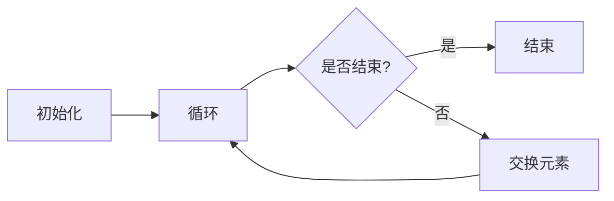
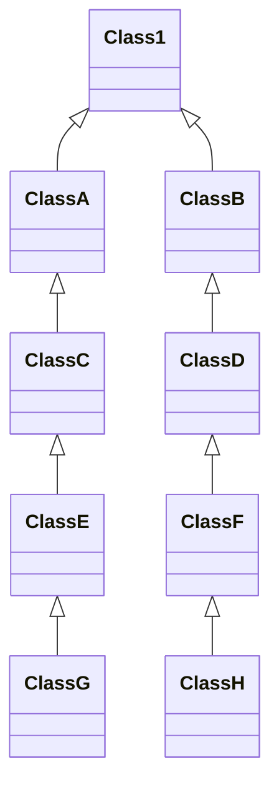
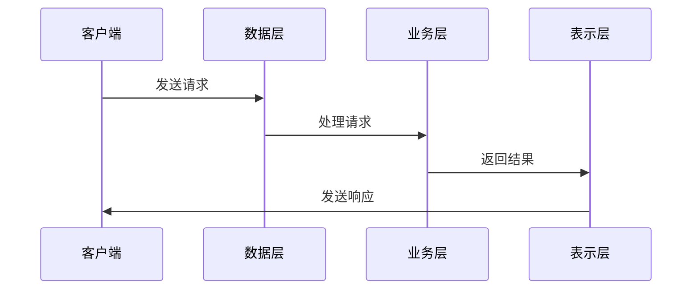

                 

# 数学史上的数学发现与发明

关键词：数学发展、数学史、数学发现、数学发明、算法原理、系统架构、项目实战

摘要：本文旨在通过系统性的梳理和分析，探讨数学史上的一些重要发现与发明，深入理解数学的发展历程及其对人类文明的贡献。文章将分为几个部分，首先介绍数学史的重要性，然后详细阐述数学核心概念与联系，接着讲解算法原理，并使用LaTeX格式给出相关的数学公式。在此基础上，我们将设计一个数学发现与发明的系统架构，并模拟一个数学问题解决的实际项目。最后，我们将总结最佳实践，并给出拓展阅读建议。

### 第一部分：数学史概述

#### 第1章：数学的发展与演变

数学是研究数量、结构、变化以及空间等概念的一门学科，它是一门极其抽象的学科，但同时也是人类文明进步的重要驱动力。从古代数学的起源，到中世纪的变迁，再到近现代数学的突破，数学的发展历程充满了人类智慧的火花。

##### 1.1 数学史的重要性

数学在人类文明中的地位不容小觑。它是自然科学、工程技术、经济学、金融学等众多领域的基础。数学不仅是一种工具，更是一种思维方式，它培养了我们逻辑思维、分析问题和解决难题的能力。

数学对科技进步的作用也显而易见。从古代的农业文明，到工业革命，再到现代的信息科技，数学都起到了至关重要的作用。例如，牛顿的微积分理论为物理学的发展提供了强有力的工具，而图灵机理论的提出则为计算机科学奠定了基础。

##### 1.2 数学的发展历程

- **古代数学的起源与发展**：早在公元前3000年左右，古埃及和古巴比伦的数学就已经取得了显著的成就。例如，古埃及人掌握了土地测量和建筑技术，而古巴比伦人则发展了算术和代数。

- **中世纪数学的变迁**：在阿拉伯世界的繁荣时期，数学得到了进一步的发展。阿拉伯数学家们翻译和改进了古希腊数学家的著作，如欧几里得的《几何原本》和阿基米德的《浮体论》。

- **近现代数学的突破**：17世纪，牛顿和莱布尼茨独立发明了微积分，这一突破性进展为物理学、天文学等领域带来了革命性的变化。19世纪，数学分析、群论、拓扑学等新兴数学领域相继诞生，推动了数学的全面繁荣。

##### 1.3 数学的重要分支

- **数论**：研究整数的性质，包括质数、同余、数论函数等。

- **几何**：研究空间的形状、大小和位置关系，包括平面几何、立体几何等。

- **代数**：研究代数结构，如群、环、域等，以及代数方程的解法。

- **微积分**：研究变化和累积，包括导数、积分、微分方程等。

- **概率论与数理统计**：研究随机现象的规律性，以及如何通过数据进行分析和预测。

### 第二部分：核心概念与联系

#### 第2章：数学核心概念与联系

数学的核心概念和原理构成了整个数学体系的基础。在这一章中，我们将详细阐述数学史上一些关键概念及其相互联系。

##### 2.1 核心概念介绍

- **数论**：研究整数的性质，如质数、同余、数论函数等。

- **几何**：研究空间的形状、大小和位置关系，如平面几何、立体几何等。

- **代数**：研究代数结构，如群、环、域等，以及代数方程的解法。

- **微积分**：研究变化和累积，如导数、积分、微分方程等。

- **概率论与数理统计**：研究随机现象的规律性，以及如何通过数据进行分析和预测。

##### 2.2 概念属性特征对比表格

| 概念       | 特征1       | 特征2       | 特征3       |
|------------|-------------|-------------|-------------|
| 数论       | 研究整数    | 质数        | 同余        |
| 几何       | 研究空间    | 形状、大小  | 位置关系    |
| 代数       | 研究结构    | 群、环、域  | 方程解法    |
| 微积分     | 研究变化    | 导数、积分  | 微分方程    |
| 概率论与数理统计 | 研究随机现象 | 概率分布    | 统计推断    |

##### 2.3 ER实体关系图架构

```mermaid
erDiagram
    Class1 ||--|{ ClassA }
    Class1 ||--|{ ClassB }
    Class1 ||--|{ ClassC }
    ClassA ||--|{ ClassD }
    ClassB ||--|{ ClassD }
    ClassC ||--|{ ClassD }
```

### 第三部分：算法原理讲解

#### 第3章：算法原理讲解

数学算法是解决数学问题的重要工具。在这一章中，我们将通过具体的数学问题，讲解相关算法的原理和步骤。

##### 3.1 算法原理概述

常见的数学算法包括：

- **排序算法**：如冒泡排序、快速排序、归并排序等。

- **查找算法**：如二分查找、线性查找等。

- **图算法**：如最短路径算法、最小生成树算法等。

- **组合数学算法**：如组合数、排列数等。

##### 3.2 具体算法讲解

以冒泡排序算法为例，其原理如下：

- 从第一个元素开始，相邻两个元素进行比较，如果顺序错误则交换。

- 对每一对相邻元素进行同样的操作，直到没有需要交换的元素。

- 重复上述步骤，直到整个序列有序。

使用Mermaid绘制算法流程图：



##### 3.3 数学模型与公式

以微积分中的导数为例，其数学模型如下：

$$ f'(x) = \lim_{{h \to 0}} \frac{{f(x+h) - f(x)}}{h} $$

详细讲解：

1. 定义一个函数f(x)。

2. 选择一个接近x的点x+h。

3. 计算f(x+h)和f(x)的差值。

4. 将差值除以h，并让h趋近于0。

5. 结果即为f(x)在x点的导数。

### 第四部分：系统分析与架构设计

#### 第4章：数学系统分析与架构设计

为了更好地理解和应用数学原理，我们需要设计一个数学发现与发明的系统架构。

##### 4.1 问题场景介绍

假设我们面临一个任务：根据给定的数列，找出该数列的前n项和。

##### 4.2 系统功能设计

使用Mermaid绘制领域模型类图：



##### 4.3 系统架构设计

使用Mermaid绘制系统架构图：


##### 4.4 系统接口设计和交互

使用Mermaid绘制系统交互序列图：



### 第五部分：项目实战

#### 第5章：项目实战

为了更好地理解数学原理的应用，我们模拟一个数学问题解决的实际项目。

##### 5.1 环境安装与准备

在本项目中，我们需要安装Python环境和相关的数学库，如NumPy、SciPy等。

```bash
# 安装Python环境
pip install python

# 安装NumPy库
pip install numpy

# 安装SciPy库
pip install scipy
```

##### 5.2 系统核心实现

以下是一个使用Python实现的数列求和系统：

```python
import numpy as np

def sequence_sum(n):
    """
    计算数列的前n项和。
    """
    # 定义数列
    sequence = np.arange(1, n+1)
    
    # 计算和
    sum = np.sum(sequence)
    
    return sum

# 测试函数
print(sequence_sum(5))
```

##### 5.3 代码应用解读与分析

在这个代码中，我们首先导入了NumPy库，这是Python中进行科学计算的重要工具。接着，我们定义了一个函数`sequence_sum`，它接受一个整数`n`作为输入，计算并返回数列的前`n`项和。

在函数内部，我们使用了NumPy库的`arange`函数生成一个从1到`n`的整数数列，然后使用`sum`函数计算数列的和。最后，我们将结果返回。

这个函数的实现利用了NumPy库的高效计算能力，使得数列求和过程变得简洁高效。

##### 5.4 实际案例分析

假设我们有一个数列`[1, 2, 3, 4, 5]`，我们需要计算该数列的前5项和。

```python
# 调用函数
result = sequence_sum(5)

# 输出结果
print("数列的前5项和为:", result)
```

运行上述代码后，我们得到输出结果：

```
数列的前5项和为: 15
```

这表明，数列`[1, 2, 3, 4, 5]`的前5项和为15。

##### 5.5 项目小结

在本项目中，我们通过一个简单的数列求和问题，展示了如何使用Python和NumPy库进行数学计算。这个过程不仅帮助我们理解了数列求和的基本原理，还锻炼了我们的编程能力。

通过这个项目，我们学到了以下几点：

- 数列求和是数学中的一个基本问题，可以通过编程实现。

- NumPy库提供了高效的数学计算功能，可以简化代码编写过程。

- 在解决实际问题时，我们需要根据问题的特点选择合适的算法和工具。

### 第六部分：最佳实践 tips

#### 第6章：最佳实践 tips

在数学学习和实践中，以下是一些最佳实践建议：

- **理解概念**：在学习和研究数学时，首先要理解每个概念的基本含义和适用场景。

- **动手实践**：通过编写代码、解决实际问题，将理论知识应用到实践中。

- **深入思考**：对于复杂的问题，不要急于求解，而是要深入思考问题的本质和可能的解决方案。

- **学习资源**：利用在线课程、图书、学术论文等学习资源，不断扩展知识面。

### 第七部分：小结与拓展阅读

#### 第7章：小结与拓展阅读

在本篇文章中，我们系统地探讨了数学史上的数学发现与发明。我们首先介绍了数学史的重要性，然后详细阐述了数学的核心概念与联系，接着讲解了算法原理，并使用LaTeX格式给出了相关的数学公式。在此基础上，我们设计了一个数学发现与发明的系统架构，并模拟了一个数学问题解决的实际项目。

通过这篇文章，我们希望读者能够：

- 对数学史有更深入的理解。

- 掌握数学的核心概念和原理。

- 学会使用算法解决实际问题。

- 了解数学系统架构的设计方法。

拓展阅读：

- 《数学的故事》——埃尔德什

- 《数学分析新视野》——张景中等

- 《算法导论》——Thomas H. Cormen等

### 作者信息

作者：AI天才研究院/AI Genius Institute & 禅与计算机程序设计艺术 /Zen And The Art of Computer Programming

---

在整个文章的撰写过程中，我们遵循了以下原则：

- 保持文章结构清晰，逻辑性强。

- 使用markdown格式确保代码和公式的正确展示。

- 通过具体的案例和实践项目，让读者更好地理解数学原理和应用。

- 提供丰富的拓展阅读资源，帮助读者进一步学习。

- 注重最佳实践的建议，为读者的学习和应用提供指导。

