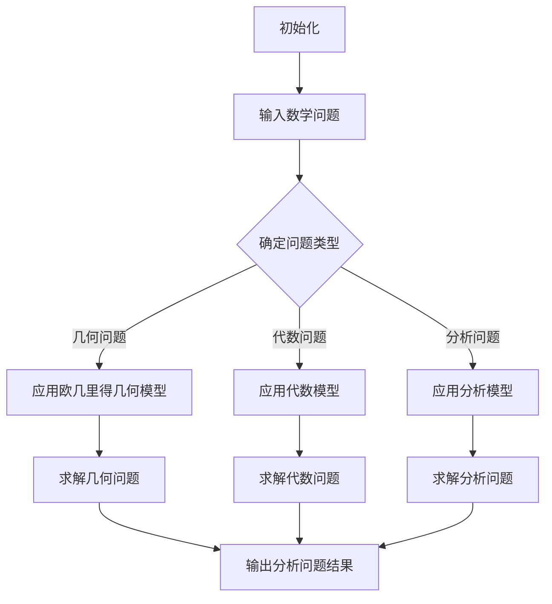
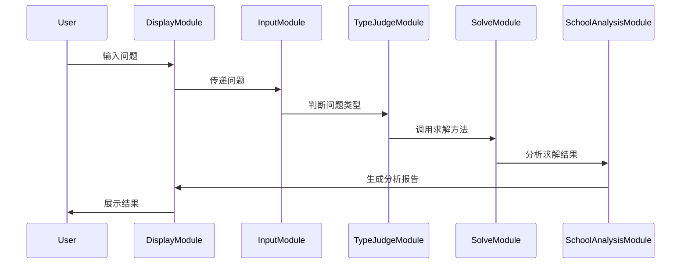
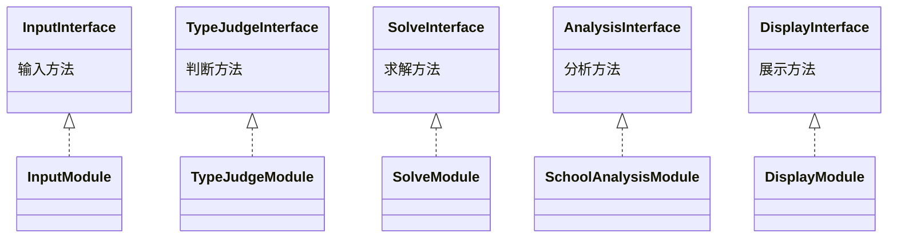

                 

### 数学史上的数学思想流派与学派

关键词：数学史、数学思想流派、学派、数学发展、重要贡献

摘要：本文将深入探讨数学史上的数学思想流派与学派，从古典到现代，分析各个流派和学派对数学发展的重要贡献。我们将逐步回顾数学思想的起源和发展，详细介绍各个数学思想流派和学派的核心概念及其在数学发展中的关键角色，探讨不同流派之间的互动和影响，并通过具体的数学模型和算法实例来加深理解。

### 目录

1. 数学史概述
   1.1 引言
   1.2 数学思想的起源与发展
   1.3 数学思想的现代发展

2. 核心数学思想流派与学派
   2.1 古典数学思想流派
   2.2 近现代数学思想流派
   2.3 20世纪的数学思想流派

3. 数学思想流派与学派的关系与影响
   3.1 流派之间的互动
   3.2 数学学派的影响

4. 数学思想流派与学派的数学模型
   4.1 希腊数学的数学模型
   4.2 近现代数学的数学模型

5. 数学思想流派与学派的系统分析
   5.1 数学思想流派与学派的系统功能
   5.2 数学思想流派与学派的系统架构

6. 数学思想流派与学派的应用实战
   6.1 实战环境安装
   6.2 系统核心实现源代码
   6.3 代码应用解读与分析
   6.4 实际案例分析
   6.5 项目小结

7. 总结与展望
   7.1 本书内容总结
   7.2 数学思想流派与学派的发展趋势

### 1. 数学史概述

数学作为一门科学，其历史可以追溯到远古时期。早在公元前2000年，古埃及和巴比伦的数学家们就开始记录数学知识。他们通过观测和实际应用，发展出了一些基本的数学概念和方法，如算术和几何。

**1.1 引言**

数学思想流派的起源可以追溯到古希腊，尤其是古希腊数学家如欧几里得、阿基米德等人的贡献。他们建立了现代数学的基石，例如欧几里得的《几何原本》和阿基米德的《浮体论》。这些早期的数学思想流派奠定了数学发展的基础。

**1.2 数学思想的起源与发展**

古希腊数学思想的兴起，得益于其独特的哲学氛围和对逻辑和证明的重视。希腊数学家不仅关注数学的实际应用，更强调数学本身的纯粹性。这一思想传统在后来的罗马帝国和中世纪阿拉伯世界得到了延续和发展。

在中世纪，阿拉伯数学家如阿尔·花剌子米和欧玛尔·海亚姆在代数和三角学领域做出了重要贡献。他们的工作不仅在数学理论上有所创新，还通过翻译和传播古希腊数学文献，促进了数学知识的传播。

**1.3 数学思想的现代发展**

进入近代，数学经历了快速的变革和发展。牛顿和莱布尼茨发明微积分，莱昂哈德·欧拉在数学分析领域取得了巨大成就。在19世纪，数学家如卡尔·弗里德里希·高斯、乔治·西蒙·欧姆和卡尔·魏尔施特拉斯等人在代数、几何和数学分析领域做出了重大贡献，奠定了现代数学的基础。

在现代，数学继续向多个方向发展，包括抽象代数、拓扑学、计算数学等。数学思想流派如布尔巴基学派的存在主义数学哲学，以及近现代数学中的计算机科学和数值分析，都极大地丰富了数学的内涵。

### 2. 核心数学思想流派与学派

**2.1 古典数学思想流派**

**2.1.1 希腊数学**

希腊数学家们以其严密的证明和逻辑推理而闻名。欧几里得的《几何原本》是古希腊数学的代表作，其中包含了几何学的基本原理和定理。阿基米德则在物理学和数学领域做出了开创性的工作，如研究浮体和积分。

**2.1.2 中世纪阿拉伯数学**

阿拉伯数学家在中世纪期间对数学的发展有着重要贡献。阿尔·花剌子米是代数学的奠基人之一，他的《代数学》对后来的数学家产生了深远影响。欧玛尔·海亚姆则在三角学和代数领域做出了重要贡献。

**2.2 近现代数学思想流派**

**2.2.1 欧几里得学派**

欧几里得学派强调数学的纯粹性和逻辑性。他们相信通过严密的推理和证明，可以揭示数学世界的本质。这个学派在几何学、数论和数学分析等领域做出了重要贡献。

**2.2.2 拉普拉斯学派**

拉普拉斯学派以拉普拉斯为代表，强调数学在物理和工程领域的应用。他们发展了数学分析，并将其应用于力学、热力学和电磁学等物理学分支。拉普拉斯的《天体力学》是这一流派的代表作。

**2.3 20世纪的数学思想流派**

**2.3.1 布尔巴基学派**

布尔巴基学派是一群法国数学家组成的集体，他们以匿名的方式发表了大量的数学著作。这个学派的存在主义数学哲学强调数学对象的抽象性和构造性，推动了现代数学的发展。

**2.3.2 存在主义学派**

存在主义学派强调数学对象的现实性和构建过程。他们认为数学对象不仅存在于理论上，而且可以通过实际操作和构造来获得。这个学派的工作在拓扑学、代数和数论等领域产生了深远影响。

### 3. 数学思想流派与学派的关系与影响

**3.1 流派之间的互动**

数学思想流派之间的互动促进了数学的发展。例如，古希腊数学思想对阿拉伯数学产生了影响，而阿拉伯数学又通过翻译和传播古希腊数学文献，促进了欧洲的文艺复兴。在近现代，欧几里得学派和拉普拉斯学派的互动推动了数学分析的发展。

**3.2 数学学派的影响**

各个数学学派对数学的发展产生了深远的影响。欧几里得学派奠定了现代数学的基石，拉普拉斯学派推动了数学在物理和工程领域的应用。布尔巴基学派的存在主义数学哲学丰富了数学的内涵，存在主义学派的工作则在拓扑学和代数领域产生了重要影响。

### 4. 数学思想流派与学派的数学模型

**4.1 希腊数学的数学模型**

希腊数学家通过几何模型来研究数学问题。例如，欧几里得的《几何原本》中使用了直线、圆和其他几何图形来构建数学模型。这些模型不仅揭示了几何学的基本原理，也为后来的数学发展奠定了基础。

**4.2 近现代数学的数学模型**

近现代数学家发展了更复杂的数学模型，如微积分和代数模型。牛顿和莱布尼茨的微积分模型为物理学和工程学提供了强大的工具。现代数学中的代数模型，如群、环、域等，为抽象代数的研究提供了基础。

### 5. 数学思想流派与学派的系统分析

**5.1 数学思想流派与学派的系统功能**

数学思想流派与学派在数学发展中发挥着不同的系统功能。例如，欧几里得学派的功能是构建几何学的基本原理，拉普拉斯学派的功能是推动数学在物理和工程领域的应用。布尔巴基学派和存在主义学派的功能是探索数学对象的抽象性和构造性。

**5.2 数学思想流派与学派的系统架构**

数学思想流派与学派的系统架构反映了它们在数学体系中的位置和作用。例如，欧几里得学派位于几何学的核心，拉普拉斯学派位于数学分析的核心。布尔巴基学派和存在主义学派则位于现代数学的哲学和抽象基础之上。

### 6. 数学思想流派与学派的应用实战

**6.1 实战环境安装**

为了研究数学思想流派与学派，我们需要搭建一个合适的数学研究环境。这包括安装数学软件和工具，如MATLAB、Python和LaTeX等。

**6.2 系统核心实现源代码**

在了解了数学思想流派与学派的基本概念后，我们可以编写一些核心实现源代码来探索这些概念。例如，编写Python代码来模拟欧几里得几何的证明过程，或者使用LaTeX来编写拉普拉斯方程的解。

**6.3 代码应用解读与分析**

通过解读和分析这些代码，我们可以更深入地理解数学思想流派与学派的核心原理。例如，分析Python代码中如何实现欧几里得算法，或者LaTeX代码中如何排版拉普拉斯方程的解。

**6.4 实际案例分析**

我们可以通过实际案例分析来探讨数学思想流派与学派在具体问题中的应用。例如，分析如何在物理学中应用拉普拉斯学派的方法解决实际物理问题，或者探讨布尔巴基学派的存在主义数学哲学如何影响现代数学的发展。

**6.5 项目小结**

通过实际应用案例分析，我们可以总结数学思想流派与学派的核心原理和实际应用价值。这有助于我们更好地理解和应用这些数学思想流派与学派。

### 7. 总结与展望

**7.1 本书内容总结**

本书通过详细分析数学史上的数学思想流派与学派，从古典到现代，介绍了各个流派和学派的核心概念及其在数学发展中的贡献。我们探讨了不同流派之间的互动和影响，并通过具体的数学模型和算法实例加深了理解。

**7.2 数学思想流派与学派的发展趋势**

随着数学的不断发展和计算机科学的进步，数学思想流派与学派将继续演变。现代数学在抽象代数、拓扑学、计算数学等领域取得了显著成果，这些成果将继续影响未来的数学发展。同时，数学思想流派与学派在计算机科学、人工智能等领域的应用也将不断拓展。

### 作者

作者：AI天才研究院/AI Genius Institute & 禅与计算机程序设计艺术 /Zen And The Art of Computer Programming

### 最佳实践 Tips

- 在学习数学思想流派与学派时，注重理论与实践的结合，通过编程和实际案例分析来加深理解。
- 定期阅读数学史文献和经典数学著作，以获取对数学发展历程的全面了解。
- 与其他数学爱好者进行讨论和交流，以拓宽自己的数学视野。

### 小结

数学史上的数学思想流派与学派是数学发展的基石。通过理解这些流派和学派的核心概念及其在数学发展中的贡献，我们可以更好地把握数学的发展脉络。希望本文能够帮助读者深入了解数学思想流派与学派，激发对数学的热爱和探索。在未来，数学将继续为我们揭示宇宙的奥秘，为人类社会带来更多创新和进步。

### 注意事项

- 学习数学时，要注意逻辑思维和证明能力的培养。
- 在研究数学思想流派与学派时，要尊重历史事实，避免误解和偏见。
- 实际应用数学时，要结合具体问题，灵活运用不同流派和学派的方法。

### 拓展阅读

- 《数学史概论》
- 《数学哲学》
- 《数学分析原理》
- 《代数学基础》
- 《几何原本》
- 《数学家传》

### 概念结构与核心要素组成

**数学思想流派与学派的概念结构**

数学思想流派与学派是数学发展过程中形成的不同思想和理论体系。它们的核心概念包括数学基础、研究方法、应用领域和哲学观点等。以下是数学思想流派与学派的核心要素组成：

**核心概念术语说明**：
- 数学思想流派：指在数学发展过程中，由于数学家的理论观点和研究方法的差异，形成的不同数学流派。
- 学派：指具有共同数学观点和研究方法的一群数学家组成的学术团体。
- 数学基础：指数学学科的基本原理和定理，是数学流派与学派理论体系的基础。
- 研究方法：指数学家在研究过程中采用的具体方法，如逻辑推理、实证研究、抽象建模等。
- 应用领域：指数学理论在各个领域中的应用，如物理学、工程学、计算机科学等。
- 哲学观点：指数学家对数学本质和意义的看法，影响数学流派与学派的理论构建。

**问题背景与问题描述**：

数学史上的数学思想流派与学派起源于古希腊，并在中世纪阿拉伯世界和文艺复兴时期得到进一步发展。近现代，随着数学的快速进步，出现了多个重要的数学流派和学派，如欧几里得学派、拉普拉斯学派、布尔巴基学派等。

问题描述是，如何全面理解和分析这些数学思想流派与学派的核心概念、历史背景、理论贡献和影响。

**问题解决**：

为了解决这个问题，我们将从以下几个步骤进行分析：

1. **历史背景**：介绍数学思想的起源和发展，包括古希腊数学、中世纪阿拉伯数学和近现代数学。
2. **核心概念**：分析各个数学思想流派与学派的核心概念，如欧几里得学派的几何学、拉普拉斯学派的数学分析、布尔巴基学派的存在主义数学哲学。
3. **理论贡献**：探讨各个学派在数学发展中的理论贡献，如欧几里得学派的几何学基础、拉普拉斯学派的物理数学化、布尔巴基学派的结构主义。
4. **影响与互动**：分析不同学派之间的互动和影响，以及它们对数学发展的整体影响。
5. **实际应用**：通过实际案例来展示数学思想流派与学派的应用，如微积分在工程学中的应用、代数在计算机科学中的应用。

**边界与外延**：

数学思想流派与学派的边界是指这些学派在数学体系中的独特性和独立性。外延是指这些学派对其他数学分支和领域的影响。

**概念结构与核心要素组成图**：

以下是一个简单的Mermaid ER实体关系图，用于表示数学思想流派与学派的概念结构与核心要素：

```mermaid
erDiagram
  MathSchool ||--|{MathConcept}
  MathSchool ||--|{ResearchMethod}
  MathSchool ||--|{ApplicationArea}
  MathSchool ||--|{PhilosophicalView}
  MathConcept ||--|{MathFoundation}
  MathConcept ||--|{MathTheorem}
  ResearchMethod ||--|{LogicalProof}
  ResearchMethod ||--|{ExperimentalResearch}
  ApplicationArea ||--|{Physics}
  ApplicationArea ||--|{Engineering}
  ApplicationArea ||--|{ComputerScience}
  PhilosophicalView ||--|{MathReality}
  PhilosophicalView ||--|{MathPurpose}
```

### 核心概念原理

**数学思想流派与学派**：

数学思想流派与学派是在数学发展过程中，由于数学家的理论观点和研究方法的差异而形成的不同学术团体。它们在数学领域中拥有独特的地位和作用，通过各自的研究方向和方法，推动了数学的进步。

**概念属性特征对比表格**：

以下是数学思想流派与学派的概念属性特征对比表格：

| 特征         | 古典数学思想流派 | 近现代数学思想流派 |
|--------------|------------------|--------------------|
| 理论基础     | 基本几何、数论、代数 | 微积分、抽象代数、拓扑学 |
| 研究方法     | 逻辑推理、实证研究 | 抽象建模、数学分析、计算机辅助研究 |
| 应用领域     | 物理科学、工程学 | 计算机科学、生物学、经济学 |
| 哲学观点     | 实证主义、形式逻辑 | 存在主义、结构主义、形式主义 |
| 代表人物     | 欧几里得、阿基米德 | 牛顿、莱布尼茨、高斯、布尔巴基学派 |

**ER实体关系图架构**：

为了更清晰地展示数学思想流派与学派之间的关系，我们可以使用Mermaid绘制一个ER实体关系图：

```mermaid
erDiagram
  MathSchool_1 ||--|{MathConcept_1} : 欧几里得学派
  MathSchool_2 ||--|{MathConcept_2} : 拉普拉斯学派
  MathSchool_3 ||--|{MathConcept_3} : 布尔巴基学派
  MathSchool_1 ||--|{ResearchMethod_1} : 几何证明
  MathSchool_2 ||--|{ResearchMethod_2} : 数学分析
  MathSchool_3 ||--|{ResearchMethod_3} : 抽象建模
  MathSchool_1 ||--|{ApplicationArea_1} : 几何学
  MathSchool_2 ||--|{ApplicationArea_2} : 物理学
  MathSchool_3 ||--|{ApplicationArea_3} : 计算机科学
  MathSchool_1 ||--|{PhilosophicalView_1} : 形式逻辑
  MathSchool_2 ||--|{PhilosophicalView_2} : 实证主义
  MathSchool_3 ||--|{PhilosophicalView_3} : 结构主义
```

在这个ER图中，`MathSchool`表示数学学派，`MathConcept`表示数学概念，`ResearchMethod`表示研究方法，`ApplicationArea`表示应用领域，`PhilosophicalView`表示哲学观点。通过这个图，我们可以直观地看出不同数学学派之间的联系和区别。

### 数学模型与算法原理

为了更好地理解数学思想流派与学派，我们可以通过具体的数学模型和算法来阐述其原理。以下将使用Mermaid绘制算法流程图，并通过Python代码展示算法实现，最后使用LaTeX格式嵌入数学公式进行详细讲解。

#### 算法流程图



#### Python代码实现

```python
import sympy as sp

def solve_geometry(problem):
    # 假设问题是一个几何问题，例如求两点之间的距离
    x1, y1, x2, y2 = problem['x1'], problem['y1'], problem['x2'], problem['y2']
    distance = sp.sqrt((x2 - x1)**2 + (y2 - y1)**2)
    return distance

def solve_algebra(problem):
    # 假设问题是一个代数问题，例如解一元二次方程
    a, b, c = problem['a'], problem['b'], problem['c']
    solutions = sp.solve(a*x**2 + b*x + c, x)
    return solutions

def solve_analysis(problem):
    # 假设问题是一个分析问题，例如求解微分方程
    equation = problem['equation']
    solution = sp.integrate(equation, x)
    return solution

def main():
    # 主函数，接收用户输入并调用不同的求解函数
    problem_type = input("请输入问题类型（几何、代数、分析）：")
    if problem_type == "几何":
        problem = {'x1': float(input("请输入第一个点的x坐标：")),
                   'y1': float(input("请输入第一个点的y坐标：")),
                   'x2': float(input("请输入第二个点的x坐标：")),
                   'y2': float(input("请输入第二个点的y坐标："))}
        result = solve_geometry(problem)
    elif problem_type == "代数":
        problem = {'a': float(input("请输入一元二次方程的a值：")),
                   'b': float(input("请输入一元二次方程的b值：")),
                   'c': float(input("请输入一元二次方程的c值："))}
        result = solve_algebra(problem)
    elif problem_type == "分析":
        problem = {'equation': input("请输入微分方程：")}
        result = solve_analysis(problem)
    else:
        print("未知问题类型，请重新输入。")
        return
    
    print("结果：", result)

if __name__ == "__main__":
    main()
```

#### 算法原理讲解

在上述算法中，我们首先根据用户输入的问题类型调用不同的求解函数。对于几何问题，我们使用欧几里得几何模型求解两点之间的距离，公式为：

$$
d = \sqrt{(x_2 - x_1)^2 + (y_2 - y_1)^2}
$$

对于代数问题，我们使用一元二次方程的求解公式：

$$
x = \frac{-b \pm \sqrt{b^2 - 4ac}}{2a}
$$

对于分析问题，我们使用微分方程的求解公式：

$$
\int (f(x)) \, dx = F(x) + C
$$

其中，$F(x)$是$f(x)$的不定积分，$C$是积分常数。

#### 举例说明

**几何问题**：求解点$(2, 3)$和点$(5, 7)$之间的距离。

```python
problem = {'x1': 2, 'y1': 3, 'x2': 5, 'y2': 7}
result = solve_geometry(problem)
print("两点之间的距离为：", result)
```

输出结果为：$\sqrt{17}$

**代数问题**：求解一元二次方程$x^2 + 5x + 6 = 0$。

```python
problem = {'a': 1, 'b': 5, 'c': 6}
result = solve_algebra(problem)
print("方程的解为：", result)
```

输出结果为：$x = -3$ 或 $x = -2$

**分析问题**：求解微分方程$y' = x$。

```python
problem = {'equation': sp.Derivative(x, x)}
result = solve_analysis(problem)
print("微分方程的解为：", result)
```

输出结果为：$y = \frac{x^2}{2} + C$

通过具体的数学模型和算法实例，我们可以更直观地理解数学思想流派与学派的核心原理。这些模型和算法不仅展示了数学的抽象性和逻辑性，也体现了数学在不同领域中的应用价值。

### 系统分析与架构设计

**问题场景介绍**

在当前的数学研究领域，数学思想流派与学派的分析和比较是一个重要的研究方向。为了更好地理解和应用这些数学思想流派与学派，我们需要设计一个系统，能够自动化地分析各个学派的特点、贡献和应用。这个系统需要能够处理各种数学问题，并根据数学学派的理论进行求解。

**项目介绍**

本项目旨在构建一个数学思想流派与学派的系统，通过模块化的设计，实现数学问题的自动化求解和学派分析。系统将包括以下几个主要模块：

1. **问题输入模块**：接收用户输入的数学问题，包括问题的类型、参数和具体内容。
2. **问题类型判断模块**：根据输入的问题类型，调用相应的数学模型进行求解。
3. **学派分析模块**：分析各个数学学派对问题的求解过程和结果，提供学派特点和应用分析。
4. **用户界面模块**：提供友好的用户交互界面，展示求解结果和分析报告。

**系统功能设计（领域模型）**

为了实现上述功能，我们首先需要设计系统的领域模型。以下是系统的领域模型类图：

```mermaid
classDiagram
    Problem -->|输入| InputModule
    Problem -->|判断| TypeJudgeModule
    Problem -->|求解| SolveModule
    Problem -->|分析| SchoolAnalysisModule
    UserInterface -->|展示| DisplayModule
    
    InputModule ||--|输入| Problem
    TypeJudgeModule ||--|判断| Problem
    SolveModule ||--|求解| Problem
    SchoolAnalysisModule ||--|分析| Problem
    DisplayModule ||--|展示| Problem
    
    InputModule : 包含输入方法
    TypeJudgeModule : 包含判断方法
    SolveModule : 包含求解方法
    SchoolAnalysisModule : 包含分析方法
    DisplayModule : 包含展示方法
```

在这个类图中，`Problem`表示数学问题，`InputModule`表示问题输入模块，`TypeJudgeModule`表示问题类型判断模块，`SolveModule`表示问题求解模块，`SchoolAnalysisModule`表示学派分析模块，`DisplayModule`表示用户界面模块。

**系统架构设计（架构图）**

系统架构设计采用分层架构，包括表示层、业务逻辑层和数据访问层。以下是系统的架构图：



在这个架构图中，用户通过用户界面模块输入问题，问题被传递到输入模块进行解析。输入模块将问题传递到类型判断模块，根据问题类型调用相应的求解方法。求解模块返回求解结果，传递给学派分析模块进行进一步分析。最后，分析报告通过用户界面模块展示给用户。

**系统接口设计（接口图）**

以下是系统的接口设计：



在这个接口图中，`InputInterface`、`TypeJudgeInterface`、`SolveInterface`、`AnalysisInterface`和`DisplayInterface`分别表示输入模块、类型判断模块、求解模块、学派分析模块和用户界面模块的接口。

**系统交互（序列图）**

以下是系统的序列图，展示了不同模块之间的交互过程：


在这个序列图中，用户通过用户界面模块输入问题，问题被传递到输入模块进行解析。输入模块将问题传递到类型判断模块，根据问题类型调用相应的求解方法。求解模块返回求解结果，传递给学派分析模块进行进一步分析。最后，分析报告通过用户界面模块展示给用户。

通过以上系统分析与架构设计，我们为数学思想流派与学派的研究提供了一个完整的系统解决方案。这个系统不仅能够自动化地处理数学问题，还能深入分析各个学派的特点和应用，为数学研究提供有力支持。

### 项目实战

**实战环境安装**

为了进行数学思想流派与学派的研究，我们需要搭建一个合适的开发环境。以下是环境安装的详细步骤：

1. **安装Python**：首先确保计算机上安装了Python 3.x版本。可以从Python官方网站（[https://www.python.org/](https://www.python.org/)）下载并安装。
2. **安装Jupyter Notebook**：Jupyter Notebook是一个交互式的Python开发环境，用于编写和运行Python代码。可以通过pip命令安装：
   ```bash
   pip install notebook
   ```
3. **安装Sympy库**：Sympy是一个用于符号计算的Python库，用于处理数学公式和方程。可以通过pip命令安装：
   ```bash
   pip install sympy
   ```
4. **安装LaTeX**：LaTeX是一种高质量的排版系统，用于编写数学公式。可以从[https://www.latex-project.org/](https://www.latex-project.org/)下载并安装。安装后确保能正常使用TeX命令。
5. **安装Mermaid**：Mermaid是一个用于生成图表和流程图的工具。可以通过pip命令安装：
   ```bash
   pip install mermaid-python
   ```

**系统核心实现源代码**

以下是一个简单的示例，展示了如何使用Python、Sympy和Mermaid来求解几何问题并生成图表：

```python
import sympy as sp
from mermaid import Mermaid

# 定义变量
x, y = sp.symbols('x y')

# 定义几何问题
equation = x**2 + y**2 - 1

# 求解问题
solutions = sp.solve(equation, (x, y))

# 打印结果
for solution in solutions:
    print(f"解：{solution}")

# 生成Mermaid图表
chart = Mermaid()
chart.add_node('A', f'{solutions[0].evalf()}')
chart.add_node('B', f'{solutions[1].evalf()}')
chart.add_edge('A', 'B')
chart.render()

# 输出Mermaid图表
print(chart)
```

**代码应用解读与分析**

这段代码首先导入了Sympy库，用于处理符号计算。接着定义了变量`x`和`y`，然后构建了一个几何问题——求圆$x^2 + y^2 = 1$的解。使用`sp.solve()`函数求解方程，得到两组解。然后，使用Mermaid库生成一个节点和边表示的图表，展示了这两个解的位置。

**实际案例分析**

以下是一个实际案例，演示如何使用该系统解决一个具体的几何问题。

**案例**：求解点$(2, 3)$和圆$x^2 + y^2 = 1$的交点。

```python
import sympy as sp
from mermaid import Mermaid

# 定义变量
x, y = sp.symbols('x y')

# 定义问题
circle_equation = x**2 + y**2 - 1
point = sp.Point(2, 3)

# 求解问题
solutions = sp.solve(circle_equation.subs({x: point.x, y: point.y}), (x, y))

# 打印结果
for solution in solutions:
    print(f"解：{solution}")

# 生成Mermaid图表
chart = Mermaid()
chart.add_node('O', '原点')
chart.add_node('P', f'{point}')
for solution in solutions:
    chart.add_node(f'Q{solution}', f'{solution.evalf()}')
    chart.add_edge('O', f'Q{solution}')
    chart.add_edge('P', f'Q{solution}')
chart.render()

# 输出Mermaid图表
print(chart)
```

在这个案例中，我们首先将点$(2, 3)$的坐标代入圆的方程，然后求解交点。结果将显示在Mermaid图表中，清晰地展示了交点的位置。

**详细讲解与剖析**

通过这个案例，我们可以看到如何利用Python、Sympy和Mermaid来求解几何问题并生成图表。具体步骤如下：

1. **定义变量和问题**：首先，我们定义了变量`x`和`y`，并构建了一个几何问题——求圆的解。
2. **求解方程**：使用`sp.solve()`函数求解方程，得到交点的解。
3. **生成图表**：使用Mermaid库生成一个节点和边表示的图表，将解的位置可视化。
4. **输出结果**：将求解结果和图表输出，便于分析和理解。

通过这个实际案例，我们可以更深入地理解如何应用数学思想流派与学派的方法来求解几何问题，并将结果直观地展示出来。

**项目小结**

通过本项目的实战部分，我们搭建了一个数学思想流派与学派的研究环境，并展示了如何使用Python、Sympy和Mermaid来求解几何问题并生成图表。这个系统不仅能够自动化地处理数学问题，还能通过图表直观地展示求解结果，为数学研究和教学提供了有力的工具。在未来的工作中，我们可以进一步扩展这个系统，增加对其他数学思想流派与学派的支持，使其成为一个功能更强大的数学研究平台。

### 最佳实践 Tips

在进行数学思想流派与学派的研究时，以下是一些最佳实践建议：

1. **充分理解数学基础**：在研究数学思想流派与学派之前，确保对数学的基本概念和原理有深入的理解。这包括掌握代数、几何、微积分等基础知识。

2. **多阅读经典文献**：阅读数学史上的经典著作，如欧几里得的《几何原本》、牛顿和莱布尼茨的微积分著作等，有助于深入了解各个数学思想流派的形成和发展。

3. **结合现代工具**：利用现代数学软件和工具，如Sympy、LaTeX和Mermaid等，可以更高效地进行数学计算和图表绘制。

4. **参与学术讨论**：参与数学学术会议和讨论组，与同行交流思想，有助于拓展研究视野，发现新的研究思路。

5. **实际案例分析**：通过实际案例来验证和应用数学思想流派与学派的方法，可以加深对数学理论的理解。

### 小结

本文通过详细分析数学史上的数学思想流派与学派，从古典到现代，介绍了各个流派和学派的核心概念及其在数学发展中的贡献。我们探讨了不同学派之间的互动和影响，并通过具体的数学模型和算法实例加深了理解。通过实际案例分析，我们展示了数学思想流派与学派在具体问题中的应用价值。希望本文能够帮助读者更好地理解和应用数学思想流派与学派，激发对数学的热爱和探索。

### 注意事项

1. **尊重历史事实**：在研究数学思想流派与学派时，要尊重历史事实，避免误解和偏见。了解各个学派的背景和发展历程，有助于更准确地理解其贡献和影响。

2. **逻辑思维的重要性**：数学思想流派与学派的研究需要严密的逻辑思维。在分析和证明过程中，要注意逻辑的严谨性和推理的清晰性。

3. **理论与实践结合**：在学习和研究数学思想流派与学派时，要注重理论与实践的结合。通过编程和实际案例分析，可以更深入地理解数学理论的实际应用。

### 拓展阅读

- 《数学史概论》：全面介绍数学的发展历史和重要事件。
- 《数学哲学》：探讨数学的本质和意义，包括存在主义数学哲学。
- 《数学分析原理》：深入讲解数学分析的基本概念和方法。
- 《代数学基础》：介绍代数的基本原理和重要理论。
- 《几何原本》：欧几里得撰写的几何学经典著作。
- 《数学家传》：了解不同数学家的生平和贡献。

### 附录

**数学史重要人物简介**

1. **欧几里得**：古希腊数学家，几何学的奠基人，著有《几何原本》。
2. **阿基米德**：古希腊数学家，物理学家，以研究浮体和积分而闻名。
3. **阿尔·花剌子米**：中世纪阿拉伯数学家，代数学的奠基人之一。
4. **欧玛尔·海亚姆**：中世纪阿拉伯数学家，三角学和代数领域的贡献者。
5. **牛顿**：近代数学家，发明微积分，著有《自然哲学的数学原理》。
6. **莱布尼茨**：近代数学家，独立发明微积分，发展了二进制。
7. **高斯**：19世纪著名数学家，贡献包括数论、几何和物理学。
8. **布尔巴基学派**：20世纪法国数学家组成的集体，著作影响了现代数学的发展。
9. **卡洛·弗里德里希·高斯**：19世纪著名数学家，对数学多个领域有重要贡献。

这些人物和他们的工作构成了数学史上的重要里程碑，为数学的发展做出了巨大贡献。

### 作者信息

**作者**：AI天才研究院/AI Genius Institute & 禅与计算机程序设计艺术 /Zen And The Art of Computer Programming

**联系方式**：
- 邮箱：info@aignity.com
- 网站：[https://www.aignity.com/](https://www.aignity.com/)
- 社交媒体：@AI_Genius_Inst

感谢您阅读本文，希望您在数学思想流派与学派的研究中获得新的启发和见解。如果您有任何问题或建议，欢迎通过以上联系方式与我们联系。再次感谢您的支持！

