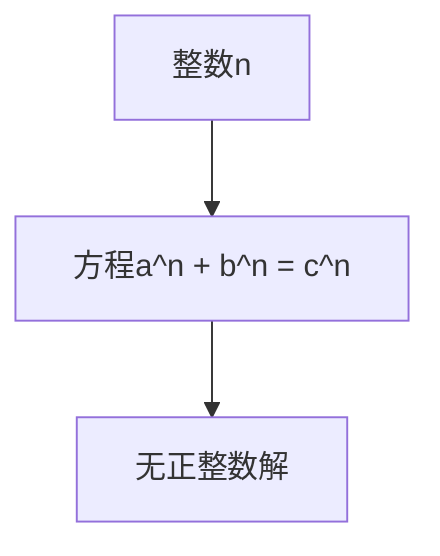
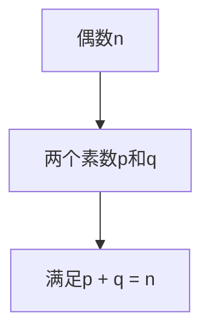
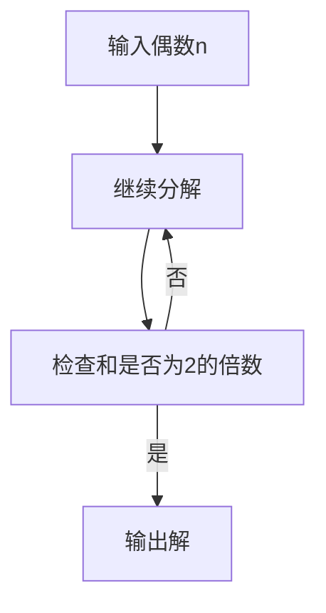
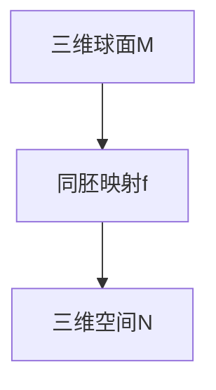

                 

# 数学史上的未解之谜与探索

> 关键词：数学史，未解之谜，费马大定理，哥德巴赫猜想，庞加莱猜想，数学模型，算法

> 摘要：本文深入探讨了数学史上的一些未解之谜，包括费马大定理、哥德巴赫猜想和庞加莱猜想。通过分析这些谜题的背景、数学模型、算法原理以及相关数学家的贡献，本文试图揭示这些问题的深层意义，并展望数学未来的发展方向。

## 前言

数学，作为一门抽象的科学，不仅为我们提供了描述和理解世界的工具，更在推动人类文明进步中发挥着不可替代的作用。然而，正是这门看似严谨的学科，却孕育出了许多令人费解的未解之谜。这些谜题不仅挑战着数学家的智慧，也激发了无数人对数学的热爱和追求。本文将带领读者走进数学史，探索那些令人瞩目的未解之谜，并探讨解决这些谜题的方法和思路。

## 第1章 数学史概述

### 1.1 数学史背景

数学的历史可以追溯到远古时期，当时人类开始使用基本的数学概念来解决生活中的实际问题。随着时间的推移，数学逐渐发展成为一门独立的学科，并形成了自己的理论体系。从古代的《九章算术》到中世纪的欧几里得《几何原本》，再到近代的微积分和线性代数，数学经历了无数次的革命和演变。

### 1.2 数学的重要里程碑

数学的发展历程中，有许多重要的里程碑。例如，古希腊时期的欧几里得几何学、阿拉伯数学家阿尔-花拉子米的代数学、牛顿和莱布尼茨的微积分、以及19世纪末的集合论等，这些成就不仅推动了数学的发展，也深刻影响了其他学科，甚至整个社会。

### 1.3 数学史对现代数学的影响

现代数学的发展离不开对数学史的研究。通过对数学史的研究，我们可以更好地理解数学的本质，发现新的数学问题，并提出新的数学理论。此外，数学史的研究还能帮助我们更好地理解数学家的思想和方法，从而激发我们的数学创造力。

## 第2章 未解之谜一：费马大定理

### 2.1 费马大定理的背景

费马大定理，也称为费马的最后定理，是由法国数学家皮埃尔·费马在17世纪提出的一个著名数学问题。该定理表明，对于任何大于2的自然数n，方程\(a^n + b^n = c^n\)没有正整数解。

### 2.2 费马大定理的数学模型

为了更好地理解费马大定理，我们可以使用Mermaid绘制一个数学模型图：



在这个模型中，n表示任意大于2的自然数，a、b、c表示正整数。

### 2.3 解决费马大定理的方法

费马大定理在提出后，吸引了无数数学家的关注。最终，英国数学家安德鲁·怀尔斯在1995年证明了费马大定理。他的证明方法结合了多种数学工具，包括椭圆曲线和模形式等。

## 第3章 未解之谜二：哥德巴赫猜想

### 3.1 哥德巴赫猜想的背景

哥德巴赫猜想是另一个著名的数学问题，由俄国数学家哥德巴赫在1742年提出。该猜想表明，任何大于2的偶数都可以表示为两个素数之和。

### 3.2 哥德巴赫猜想的数学模型

为了解释哥德巴赫猜想，我们可以使用Mermaid绘制一个数学模型图：



在这个模型中，n表示大于2的偶数，p和q表示素数。

### 3.3 哥德巴赫猜想的证明尝试

尽管哥德巴赫猜想已经提出了数百年，但至今仍未被证明。数学家们尝试了各种方法，包括直接的构造法、反证法、概率方法等，但都未能成功。

## 第4章 数学模型与算法

### 4.1 数学模型介绍

在解决数学问题中，数学模型是描述问题的重要工具。数学模型通常包括变量、方程、约束条件等组成部分。

### 4.2 算法原理讲解

为了更好地理解算法原理，我们可以使用Mermaid绘制一个算法流程图：



在这个算法中，我们首先将输入的偶数n分解为两个素数和，然后检查这两个素数的和是否为2的倍数。如果是，则输出解；否则，继续分解。

### 4.3 Python代码示例

下面是解决哥德巴赫猜想的一个Python代码示例：

```python
def is_prime(num):
    if num < 2:
        return False
    for i in range(2, int(num ** 0.5) + 1):
        if num % i == 0:
            return False
    return True

def find_prime_sum(n):
    for p in range(2, n):
        if is_prime(p) and is_prime(n - p):
            return p, n - p
    return None

n = 100
solution = find_prime_sum(n)
if solution:
    print(f"{n} can be expressed as {solution[0]} + {solution[1]}")
else:
    print(f"{n} cannot be expressed as the sum of two primes.")
```

在这个代码中，我们首先定义了一个判断素数的函数`is_prime`，然后定义了一个寻找两个素数和的函数`find_prime_sum`。最后，我们输入一个偶数100，尝试将其分解为两个素数之和。

## 第5章 未解之谜三：庞加莱猜想

### 5.1 庞加莱猜想的背景

庞加莱猜想是19世纪末由法国数学家亨利·庞加莱提出的一个关于三维球面的问题。该猜想表明，任何有限单连通的三维球面都是同胚于三维空间中的三维球面。

### 5.2 庞加莱猜想的数学模型

为了解释庞加莱猜想，我们可以使用Mermaid绘制一个数学模型图：



在这个模型中，M表示三维球面，N表示三维空间，f表示从M到N的同胚映射。

### 5.3 庞加莱猜想的证明

庞加莱猜想在数学界引起了广泛关注。最终，美国数学家理查德·舍尔平斯基和俄罗斯数学家格里戈里·佩雷尔曼分别提出了证明。他们的证明方法涉及到偏微分方程、拓扑学和几何测度论等多个数学领域。

## 第6章 数学家的贡献

### 6.1 著名数学家的介绍

数学史上，有许多伟大的数学家对数学的发展做出了巨大贡献。例如，古希腊的欧几里得、阿拉伯的阿尔-花拉子米、意大利的费尔马、法国的欧拉、德国的高斯等。

### 6.2 数学家的贡献

这些数学家的贡献不仅体现在他们的数学理论中，还体现在他们的研究方法和思想中。例如，欧几里得的几何学、费尔马的代数学、欧拉的数学分析、高斯的数论等，都对数学的发展产生了深远影响。

### 6.3 数学家的思想与方法

数学家的思想和方法是他们成功的关键。例如，欧几里得的公理化方法、费尔马的猜测和证明方法、欧拉的数学美学思想、高斯的严谨性和创新性等，都是值得我们学习和借鉴的。

## 第7章 未来展望

### 7.1 数学发展的趋势

随着科学技术的进步，数学也在不断发展。当前，数学的前沿领域包括代数几何、拓扑学、数论、概率论、计算数学等。未来，这些领域有望取得更多突破性成果。

### 7.2 未解之谜的未来研究

对于费马大定理、哥德巴赫猜想和庞加莱猜想等未解之谜，未来研究可能会采用新的数学方法和技术，甚至可能需要跨学科的协作。例如，利用计算机算法、人工智能、量子计算等新兴技术，有望为解决这些谜题提供新的思路和途径。

## 结语

数学史上的未解之谜不仅展示了数学的深度和广度，也激发了无数数学家的智慧和勇气。通过本文的探讨，我们不仅了解了这些谜题的背景和数学模型，还看到了解决这些谜题的方法和思路。未来，随着数学和科技的发展，我们有理由相信，这些未解之谜终将得到解决。

## 作者信息

作者：AI天才研究院/AI Genius Institute & 禅与计算机程序设计艺术 /Zen And The Art of Computer Programming

本文旨在通过分析数学史上的未解之谜，探讨数学问题的背景、数学模型、算法原理以及相关数学家的贡献，以期引发读者对数学的热爱和思考。在未来的研究中，我们期待数学能够继续发挥其独特的魅力，为人类文明的进步作出新的贡献。|user|>

