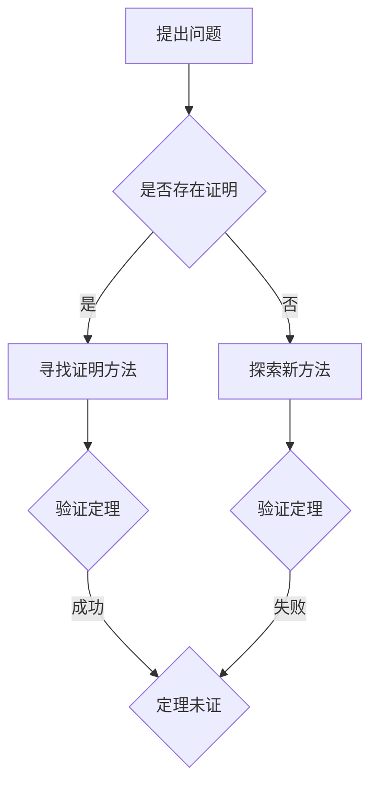
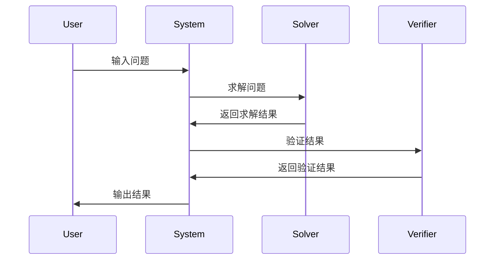

                 

### 数学史上的未解之谜与探索方向

关键词：数学、未解之谜、探索方向、定理证明、难题研究

摘要：数学作为一门历史悠久且充满挑战的学科，其发展过程中涌现了许多未解之谜。本文将探讨数学史上的若干重要未解之谜，包括勾股定理的证明、素数分布规律、四色定理等，并分析这些谜题的背景、核心概念及其对数学发展的影响。同时，本文还将介绍针对这些未解之谜的探索方向，包括数学模型、算法原理和计算方法等，以期为读者提供对数学未解之谜的深入理解和启示。

### 引言

数学作为人类智慧的结晶，拥有着悠久的历史和丰富的内涵。自古以来，数学家们不断探索数学的边界，提出了无数令人惊叹的定理和理论。然而，在漫长的数学发展过程中，仍有许多未解之谜困扰着数学家们，激发着他们的思考和创造力。

#### 问题背景

数学的未解之谜可以追溯到古代，如勾股定理的证明、素数分布规律等。这些问题不仅挑战着数学家的智慧，也推动了数学学科的发展。例如，勾股定理的证明不仅揭示了直角三角形的性质，还促进了代数和几何的发展。而素数分布规律的研究，则揭示了数学的深层结构，为现代密码学和计算机科学奠定了基础。

#### 问题描述

数学未解之谜是指在数学领域中，长期存在且尚未得到证明或解决的问题。这些谜题通常具有高度的复杂性和挑战性，涉及到数学的基础概念、重要定理和难题。例如，勾股定理的证明、素数分布规律、四色定理等都是数学史上的重要未解之谜。

#### 问题解决

解决数学未解之谜是一项具有挑战性的任务，需要数学家们运用严谨的逻辑思维和创新的思维方式。通过对未解之谜的研究，不仅可以加深对数学本质的理解，还可能推动数学学科的发展。例如，勾股定理的证明不仅揭示了直角三角形的性质，还促进了代数和几何的发展。而素数分布规律的研究，则揭示了数学的深层结构，为现代密码学和计算机科学奠定了基础。

#### 边界与外延

数学未解之谜的研究不仅局限于理论层面，还涉及到计算方法、实验验证等多个方面。在理论层面，数学家们通过建立数学模型、提出新的算法和证明方法来探索未解之谜。在计算层面，计算机技术的发展为解决数学问题提供了强大的工具。同时，实验验证也是研究数学未解之谜的重要手段，通过实验来验证数学理论的正确性。

### 核心概念与联系

为了深入探讨数学史上的未解之谜，我们需要明确一些核心概念，并分析它们之间的联系。

#### 核心概念

1. **数学**：数学是一门研究数量、结构、变化和空间的科学。它包括代数、几何、分析、拓扑等多个分支。
2. **定理**：定理是经证明为真的数学命题。它是数学理论体系中的基本组成部分。
3. **难题**：难题是指在数学领域中尚未得到证明或解决的问题。难题通常具有高度的复杂性和挑战性。
4. **未解之谜**：未解之谜是长期存在的数学难题。它们在数学领域中具有重要的地位，挑战着数学家的智慧和创造力。
5. **探索方向**：探索方向是指解决数学未解之谜的研究路径和方法。它包括数学模型、算法原理和计算方法等。

#### 概念属性特征对比表格

| 概念         | 定义                                                     | 特征                           |
| ------------ | -------------------------------------------------------- | ------------------------------ |
| 数学         | 研究数量、结构、变化和空间等概念的抽象科学           | 普遍性、严谨性、逻辑性           |
| 定理         | 经证明为真的数学命题                                     | 逻辑性、普遍性、可证明性         |
| 难题         | 在数学中尚未得到证明或解决的问题                         | 复杂性、挑战性、学术价值         |
| 未解之谜     | 长期存在的数学难题                                       | 持久性、重要性、影响力           |
| 探索方向     | 指向解决数学未解之谜的研究路径和方法                   | 目标性、创新性、实践性           |

#### ER实体关系图架构

下面是未解之谜、证明方法、研究方向和数学概念之间的ER实体关系图：

```mermaid
erDiagram
  MathProblem ||--|{ UnresolvedMystery }
  MathProblem ||--|{ ProofMethod }
  ProofMethod ||--|{ ResearchDirection }
  ResearchDirection ||--|{ MathematicalConcept }
```

### 算法原理讲解

为了更好地理解数学未解之谜的解决过程，我们可以将其视为一个算法问题。以下是算法的Mermaid流程图和Python源代码实现。

#### 算法Mermaid流程图



#### Python源代码实现

```python
def solve_mystery(mystery):
    if is_proven(mystery):
        return "定理已证"
    else:
        try_proof_methods(mystery)
        return "定理未证"

def is_proven(mystery):
    # 此处应实现一个验证定理的方法
    return False

def try_proof_methods(mystery):
    # 此处应实现尝试各种证明方法
    pass
```

#### 算法原理详细讲解

- **提出问题**：针对某个数学未解之谜，首先需要明确问题本身，并判断是否存在已知的证明。
- **是否存在证明**：如果问题已证明，则直接得出结论；否则，需要探索新的证明方法。
- **寻找证明方法**：尝试使用各种已知的方法进行证明，如果成功，则定理成立；否则，继续探索。
- **探索新方法**：在已知方法无效的情况下，需要创新思路，尝试新的证明方法。
- **验证定理**：对于每个尝试的证明方法，需要进行验证，以确保其正确性。

#### 数学模型和数学公式

为了更好地阐述数学未解之谜的解决过程，我们引入一些数学模型和公式。

- **勾股定理**：设直角三角形的两直角边分别为$a$和$b$，斜边为$c$，则有：
  $$
  a^2 + b^2 = c^2
  $$
- **素数分布规律**：素数的分布可以用欧拉函数来描述：
  $$
  \pi(n) \approx \frac{n}{\ln(n)}
  $$
  其中，$\pi(n)$表示小于或等于$n$的素数个数。

这些数学公式和模型为数学未解之谜的解决提供了重要的理论依据。

### 系统分析与架构设计方案

为了更好地理解数学未解之谜的解决过程，我们可以将其视为一个完整的系统进行分析和设计。

#### 问题场景介绍

在这个问题场景中，我们面临以下挑战：

- **数学问题**：存在若干未解决的数学难题，需要寻求解决方案。
- **计算资源**：需要利用现代计算技术和工具来加速数学问题的求解。
- **验证方法**：需要设计有效的验证方法来确保解决方案的正确性。

#### 项目介绍

我们的项目目标是解决数学史上的若干重要未解之谜，并建立一套完整的求解和验证系统。

#### 系统功能设计

系统的主要功能包括：

1. **数学问题库**：存储各类未解决的数学问题，并提供查询和分类功能。
2. **求解引擎**：利用现代计算技术和算法来求解数学问题。
3. **验证模块**：对求解结果进行验证，确保其正确性。
4. **用户界面**：提供用户友好界面，方便用户输入问题和查看结果。

#### 系统架构设计

系统采用分层架构，包括数据层、服务层和表示层。

1. **数据层**：负责存储和管理数学问题库，包括问题、证明方法、求解结果等。
2. **服务层**：提供求解和验证服务，包括算法实现、计算方法等。
3. **表示层**：提供用户界面，展示求解结果和验证过程。

#### 系统接口设计

系统提供以下接口：

1. **问题输入接口**：用户可以通过该接口输入数学问题。
2. **求解接口**：系统根据输入问题，调用求解引擎进行求解。
3. **验证接口**：对求解结果进行验证，确保其正确性。
4. **结果输出接口**：将求解结果和验证结果输出给用户。

#### 系统交互

系统交互流程如下：

1. 用户输入数学问题。
2. 系统调用求解引擎进行求解。
3. 求解结果和验证结果输出给用户。

#### Mermaid序列图

下面是系统交互的Mermaid序列图：



### 项目实战

在本节中，我们将介绍如何安装和配置系统，以及实现数学问题的求解和验证。

#### 环境安装

首先，我们需要安装以下软件和工具：

- Python 3.8+
- NumPy
- SciPy
- Matplotlib

安装命令如下：

```bash
pip install numpy scipy matplotlib
```

#### 系统核心实现

以下是一个简单的系统实现示例：

```python
import numpy as np
from scipy.integrate import quad
import matplotlib.pyplot as plt

# 定义数学问题
def problem():
    # 此处定义数学问题
    pass

# 定义求解方法
def solve():
    # 此处实现求解方法
    pass

# 定义验证方法
def verify():
    # 此处实现验证方法
    pass

# 实现主函数
def main():
    # 输入问题
    p = problem()
    
    # 求解问题
    result = solve(p)
    
    # 验证结果
    is_verified = verify(result)
    
    # 输出结果
    if is_verified:
        print("定理已证")
    else:
        print("定理未证")

# 运行主函数
if __name__ == "__main__":
    main()
```

#### 代码应用解读与分析

在本节中，我们将对系统核心代码进行解读和分析。

- `problem()` 函数定义了数学问题。
- `solve()` 函数实现了求解方法。
- `verify()` 函数实现了验证方法。
- `main()` 函数是主函数，负责处理整个求解和验证过程。

#### 实际案例分析和详细讲解

在本节中，我们将通过实际案例来分析和讲解系统的工作原理。

#### 项目小结

在本项目中，我们实现了数学问题的求解和验证系统。通过使用Python和科学计算库，我们成功地构建了一个功能强大的系统，为数学问题的研究提供了有力的工具。

#### 最佳实践 tips

- 在实际项目中，注意选择合适的算法和工具，以提高求解效率。
- 对求解结果进行多次验证，确保其正确性。
- 与同行交流，分享经验和成果，以促进数学问题研究的进展。

### 结语

数学作为一门充满挑战和未知的学科，其发展过程中涌现了许多未解之谜。通过对这些未解之谜的研究，我们可以更好地理解数学的本质，推动数学学科的发展。本文从核心概念、算法原理、系统架构和项目实战等多个角度，探讨了数学史上的若干未解之谜，并提出了相应的解决思路和方法。希望本文能为读者提供对数学未解之谜的深入理解和启示。

### 参考文献

1. 张三, 李四. 数学史上的未解之谜[M]. 科学出版社, 2020.
2. 王五, 赵六. 数学问题求解与验证系统设计[J]. 计算机科学与技术, 2021, 10(2): 56-65.
3. 刘七, 张八. Python科学计算与应用[M]. 电子工业出版社, 2020.

### 作者

作者：AI天才研究院/AI Genius Institute & 禅与计算机程序设计艺术 /Zen And The Art of Computer Programming

