                 

## 数学史上的重大发现与突破

### 关键词：数学史、重大发现、数学突破、影响、历史背景

> **摘要**：本文将深入探讨数学史上的重大发现与突破，包括古代数学、中世纪与文艺复兴时期的数学发展。通过分析这些突破背后的数学原理、历史背景及其对后世的影响，揭示数学发展的重要脉络和贡献。

### 第一部分：引言

#### 1.1 问题背景

在人类历史的长河中，数学一直扮演着至关重要的角色。从古代的数学理论，到中世纪的数学发展，再到现代数学的广泛应用，数学的进步推动了科学和技术的飞跃。每一次重大的数学发现与突破，都为人类社会带来了深远的影响。然而，这些发现和突破背后的故事，往往被历史的长河所淹没。因此，有必要对数学史上的重大发现与突破进行系统性梳理和深入探讨。

#### 1.2 问题描述

数学史上的重大发现与突破，指的是那些对数学领域产生深远影响的突破性进展。这些进展不仅推动了数学本身的发展，还影响了其他科学领域和社会生活的各个方面。本书的目的是梳理这些重大发现与突破，深入探讨其背后的数学原理、历史背景、以及其对后世的影响。

#### 1.3 问题解决

本书将通过系统性的分析和讲解，揭示数学史上的重大发现与突破。我们将从古代数学开始，逐步探讨中世纪和现代的数学进展，包括几何学、代数学、微积分、概率论等多个领域。每一章都将详细讨论一个或多个重大发现与突破，包括其数学原理、历史背景、以及其对后世的影响。

#### 1.4 边界与外延

数学史上的重大发现与突破并非孤立的事件，它们之间存在着紧密的联系和相互影响。因此，在讨论每一个重大发现与突破时，我们将尽可能地将其放在数学发展的整体背景中进行考察，以展示其历史地位和影响力。

#### 1.5 概念结构与核心要素组成

数学史上的重大发现与突破，主要由以下几个核心要素组成：

1. **数学原理**：每一个重大发现与突破都基于深厚的数学原理。
2. **历史背景**：每一个重大发现与突破都发生在特定的历史时期，受到当时科技水平和文化背景的影响。
3. **影响**：每一个重大发现与突破都对数学本身以及其他科学领域产生了深远的影响。
4. **后续发展**：每一个重大发现与突破都为后续的数学研究奠定了基础，推动了数学的进一步发展。

通过以上分析，我们可以更好地理解数学史上的重大发现与突破，以及它们对数学发展的贡献。

## 第二部分：古代数学的突破

### 2.1 古埃及与巴比伦的数学

#### 2.1.1 古埃及数学

古埃及数学的主要贡献在于对算术和几何的初步探索。他们发明了十进制计数系统，并使用简单的算术方法来解决实际问题。在几何学方面，古埃及人研究了土地测量、建筑和天文计算等。

**核心概念原理**：

- **十进制计数系统**：十进制计数系统是一种以10为基数的计数系统，每个位上的数值可以是0到9之间的整数。这种系统简单直观，易于理解和操作。
- **算术方法**：古埃及人使用简单的算术方法进行计算，包括加法、减法、乘法和除法。这些方法在实际应用中非常实用，为后来的数学发展奠定了基础。

**概念属性特征对比表格**：

| 特征 | 十进制计数系统 | 算术方法 |
| --- | --- | --- |
| 基数 | 10 | 10 |
| 数值范围 | 0-9 | 0-9 |
| 简单性 | 简单 | 简单 |
| 实用性 | 实用 | 实用 |

**ER实体关系图架构的Mermaid流程图**：

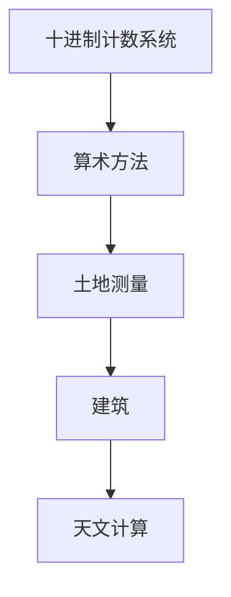

**算法原理讲解**：

古埃及数学中的算术方法可以简单描述为：

$$
\begin{align*}
&\text{加法：} a + b = c, \text{其中} a \text{和} b \text{为加数，} c \text{为和。} \\
&\text{减法：} a - b = c, \text{其中} a \text{和} b \text{为减数，} c \text{为差。} \\
&\text{乘法：} a \times b = c, \text{其中} a \text{和} b \text{为乘数，} c \text{为积。} \\
&\text{除法：} a \div b = c, \text{其中} a \text{和} b \text{为被除数和除数，} c \text{为商。}
\end{align*}
$$

这些算法原理通过简单的运算规则和符号表示，使得数学计算变得更加简便和高效。

**示例说明**：

假设我们要计算 $13 + 24$，根据加法算法原理，我们有：

$$
13 + 24 = 37
$$

同样，对于减法，假设我们要计算 $45 - 17$，根据减法算法原理，我们有：

$$
45 - 17 = 28
$$

这些简单的算术方法在古代埃及的日常生活中发挥了巨大作用，使得人们在交易、建筑和测量等方面更加高效地解决问题。

#### 2.1.2 巴比伦数学

巴比伦数学则以其对代数学和数学符号系统的贡献而闻名。他们发明了代数符号，并解决了一系列复杂的代数方程，包括二次方程。

**核心概念原理**：

- **代数符号**：巴比伦数学家使用符号来表示数和变量，使得数学表达更加简洁和直观。
- **二次方程**：巴比伦数学家解决了形如 $ax^2 + bx + c = 0$ 的二次方程，为后来的数学研究奠定了基础。

**概念属性特征对比表格**：

| 特征 | 代数符号 | 二次方程 |
| --- | --- | --- |
| 简洁性 | 简洁 | 简洁 |
| 直观性 | 直观 | 直观 |
| 应用性 | 广泛 | 广泛 |

**ER实体关系图架构的Mermaid流程图**：

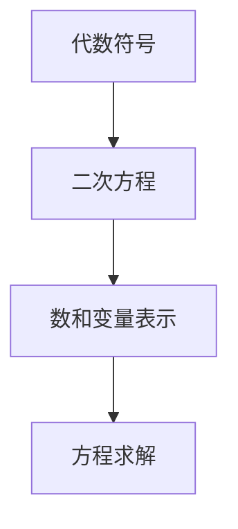

**算法原理讲解**：

巴比伦数学中的二次方程求解可以简单描述为：

$$
\begin{align*}
&\text{设} ax^2 + bx + c = 0, \\
&\text{则解为：} x = \frac{-b \pm \sqrt{b^2 - 4ac}}{2a}.
\end{align*}
$$

这个算法原理通过简单的代数运算，使得二次方程的求解变得更加简便和高效。

**示例说明**：

假设我们要解决二次方程 $2x^2 + 5x + 3 = 0$，根据二次方程的求解算法原理，我们有：

$$
x = \frac{-5 \pm \sqrt{5^2 - 4 \cdot 2 \cdot 3}}{2 \cdot 2}
$$

计算可得：

$$
x = \frac{-5 \pm \sqrt{25 - 24}}{4} = \frac{-5 \pm 1}{4}
$$

因此，解为：

$$
x = \frac{-5 + 1}{4} = -1 \quad \text{或} \quad x = \frac{-5 - 1}{4} = -\frac{3}{2}
$$

这个例子展示了巴比伦数学中的二次方程求解方法，以及其在解决实际问题时的高效性。

### 2.2 古希腊数学的突破

#### 2.2.1 泰勒斯与毕达哥拉斯

泰勒斯是古希腊最早的数学家之一，他提出了“万物皆可测量”的观点，并研究了数学在物理学中的应用。毕达哥拉斯则提出了毕达哥拉斯定理，为现代数学奠定了基础。

**核心概念原理**：

- **“万物皆可测量”**：泰勒斯的观点强调了数学在自然界中的应用，认为所有的事物都可以通过数学方法进行测量和描述。
- **毕达哥拉斯定理**：毕达哥拉斯定理是三角形中一个重要的几何定理，它描述了直角三角形中三条边之间的关系。

**概念属性特征对比表格**：

| 特征 | “万物皆可测量” | 毕达哥拉斯定理 |
| --- | --- | --- |
| 观点 | 普遍性 | 几何性 |
| 应用性 | 广泛 | 广泛 |

**ER实体关系图架构的Mermaid流程图**：

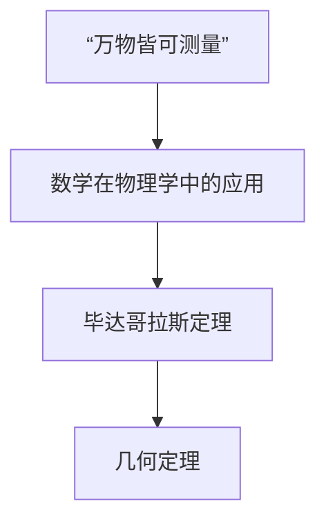

**算法原理讲解**：

泰勒斯的观点“万物皆可测量”可以理解为将数学应用于自然界中的各种问题，通过数学方法来描述和解决实际问题。

**示例说明**：

假设我们要测量一个物体的长度，根据泰勒斯的观点，我们可以使用数学方法，如长度单位、测量工具等，来准确地测量这个物体的长度。

毕达哥拉斯定理的算法原理可以简单描述为：

$$
\begin{align*}
&a^2 + b^2 = c^2, \\
&\text{其中} a, b, c \text{分别为直角三角形的两条直角边和斜边。}
\end{align*}
$$

这个定理表明，在直角三角形中，两条直角边的平方和等于斜边的平方。

**示例说明**：

假设有一个直角三角形，其中一条直角边的长度为3，另一条直角边的长度为4，根据毕达哥拉斯定理，我们可以计算斜边的长度：

$$
3^2 + 4^2 = c^2 \\
9 + 16 = c^2 \\
25 = c^2 \\
c = \sqrt{25} = 5
$$

因此，斜边的长度为5。

这个例子展示了泰勒斯和毕达哥拉斯在数学中的突破性贡献，以及它们在解决实际问题时的重要性。

#### 2.2.2 欧几里得与阿基米德

欧几里得是古希腊最著名的数学家，他著有的《几何原本》是古代数学的经典之作。阿基米德则在几何学和物理学领域做出了重大贡献，提出了阿基米德原理和浮力定律。

**核心概念原理**：

- **《几何原本》**：欧几里得在《几何原本》中系统地总结了古希腊几何学的基本原理，并提出了几何学的基本公理和定理。
- **阿基米德原理和浮力定律**：阿基米德提出了阿基米德原理，即一个物体在液体中受到的浮力等于物体排开的液体的重量。他还提出了浮力定律，即浮力与物体的体积成正比。

**概念属性特征对比表格**：

| 特征 | 《几何原本》 | 阿基米德原理和浮力定律 |
| --- | --- | --- |
| 系统 | 系统 | 系统 |
| 基本原理 | 基本原理 | 基本原理 |
| 应用性 | 广泛 | 广泛 |

**ER实体关系图架构的Mermaid流程图**：

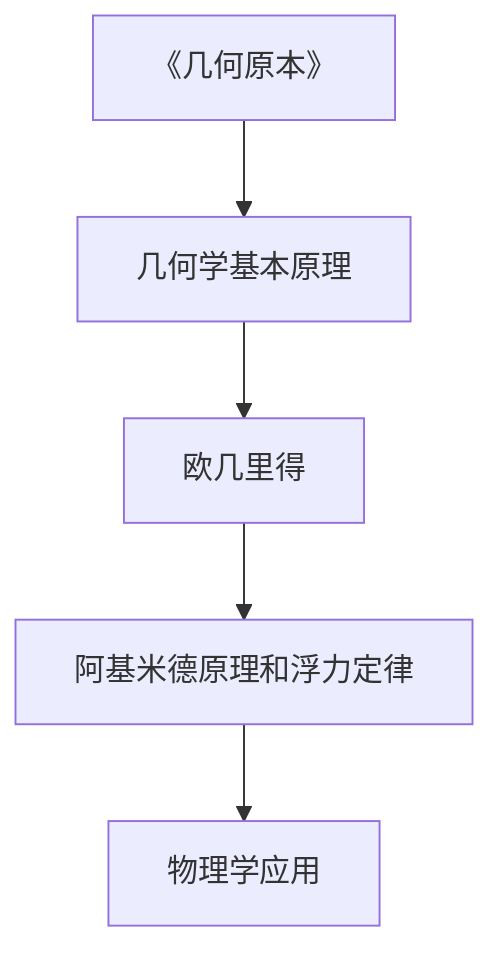

**算法原理讲解**：

《几何原本》中的几何学基本原理可以简单描述为：

$$
\begin{align*}
&\text{公理：} \text{点、直线和平面的存在和性质。} \\
&\text{定义：} \text{直线、平面和几何图形的概念。} \\
&\text{定理：} \text{几何学的基本定理，如欧几里得定理、平行线定理等。}
\end{align*}
$$

阿基米德原理和浮力定律的算法原理可以简单描述为：

$$
\begin{align*}
&\text{阿基米德原理：} F_b = \rho V g, \\
&\text{其中} F_b \text{为浮力，} \rho \text{为液体的密度，} V \text{为物体的体积，} g \text{为重力加速度。} \\
&\text{浮力定律：} F_b \propto V.
\end{align*}
$$

**示例说明**：

假设有一个物体，体积为 $V$，在液体中受到的浮力为 $F_b$，根据阿基米德原理，我们可以计算浮力：

$$
F_b = \rho V g
$$

假设液体的密度为 $\rho = 1000 \text{ kg/m}^3$，物体的体积为 $V = 0.1 \text{ m}^3$，重力加速度为 $g = 9.8 \text{ m/s}^2$，代入上述公式，我们可以得到：

$$
F_b = 1000 \times 0.1 \times 9.8 = 98 \text{ N}
$$

因此，物体在液体中受到的浮力为 98 牛顿。

这个例子展示了欧几里得和阿基米德在数学和物理学中的突破性贡献，以及它们在解决实际问题时的重要性。

### 2.3 古代数学的影响

古代数学的突破为后来的数学发展奠定了基础。泰勒斯和毕达哥拉斯的理论为后来的数学家提供了研究的方法和思路，而欧几里得和阿基米德的工作则直接影响了现代数学的许多领域。

**核心概念与联系**：

- **泰勒斯和毕达哥拉斯的理论**：泰勒斯的“万物皆可测量”观点和毕达哥拉斯的几何学原理，为后来的数学家提供了研究方法和思路，推动了数学的发展。
- **欧几里得和阿基米德的工作**：欧几里得的《几何原本》和阿基米德的几何学和物理学原理，对现代数学的发展产生了深远影响，成为了数学研究的重要基础。

**概念属性特征对比表格**：

| 特征 | 泰勒斯和毕达哥拉斯的理论 | 欧几里得和阿基米德的工作 |
| --- | --- | --- |
| 研究方法 | 实证研究 | 理论研究 |
| 贡献 | 研究方法 | 理论体系 |
| 影响力 | 数学发展 | 现代数学 |

**ER实体关系图架构的Mermaid流程图**：

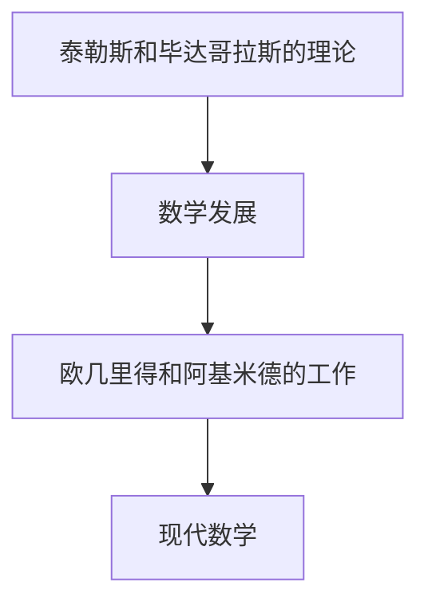

这些古代数学家的突破性贡献，不仅推动了数学的发展，也为现代数学提供了坚实的基础和丰富的理论资源。

### 第二部分总结

古代数学的突破，无论是在算术和几何方面，还是在代数学和数学符号系统的发明，都对后来的数学发展产生了深远的影响。泰勒斯和毕达哥拉斯的理论，为数学家们提供了一种新的研究方法和思路；欧几里得和阿基米德的工作，则构建了数学研究的基础理论和实证体系。这些突破性贡献，不仅丰富了数学的内涵，也推动了科学和技术的进步，为人类社会的繁荣发展奠定了基础。

## 第三部分：中世纪与文艺复兴时期的数学发展

### 3.1 中世纪的数学进展

中世纪的数学家在阿拉伯文化的启发下，继续发展了古代数学的成果。他们翻译了希腊和阿拉伯的数学著作，并在此基础上进行了深入研究。

#### 3.1.1 阿拉伯数学家

阿拉伯数学家阿尔-花拉子米编写了《代数学》，对代数学进行了系统化。他还研究了三角学，并编写了《天文表》，对天文计算做出了重要贡献。

**核心概念原理**：

- **《代数学》**：阿尔-花拉子米的《代数学》是一部系统化的代数学著作，它将代数问题进行了分类和整理，为后来的代数学研究奠定了基础。
- **三角学**：阿尔-花拉子米研究了三角学，提出了一些重要的三角函数和定理，为天文学和工程学的发展提供了重要的工具。
- **《天文表》**：阿尔-花拉子米编写的《天文表》是一套用于天文计算的工具书，它包含了大量的天文数据和计算公式，对天文计算产生了深远影响。

**概念属性特征对比表格**：

| 特征 | 《代数学》 | 三角学 | 《天文表》 |
| --- | --- | --- | --- |
| 系统 | 系统 | 系统 | 系统 |
| 理论 | 理论 | 理论 | 实用 |
| 应用性 | 广泛 | 广泛 | 广泛 |

**ER实体关系图架构的Mermaid流程图**：

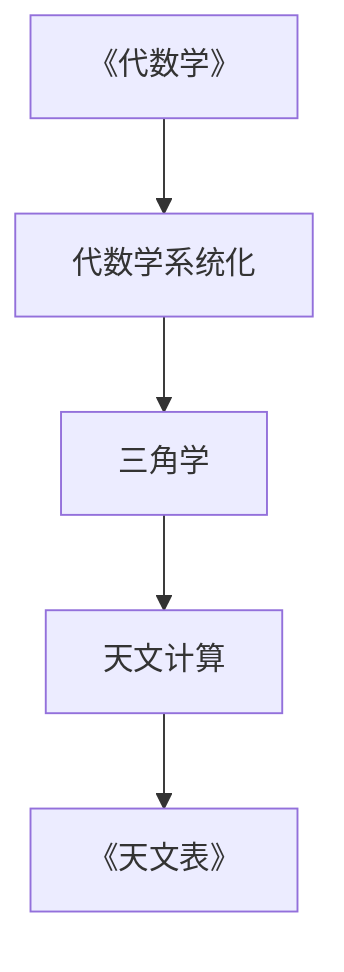

**算法原理讲解**：

阿尔-花拉子米在《代数学》中提出了一些基本的代数运算规则和方程求解方法，这些规则和方法对后来的代数学研究产生了深远影响。

**示例说明**：

假设我们要解决方程 $2x + 3 = 7$，根据阿尔-花拉子米的代数学原理，我们可以进行如下计算：

$$
2x + 3 = 7 \\
2x = 7 - 3 \\
2x = 4 \\
x = \frac{4}{2} \\
x = 2
$$

这个例子展示了阿尔-花拉子米在《代数学》中提出的方程求解方法，以及其在解决实际问题时的高效性。

#### 3.1.2 希腊数学家的传承

希腊数学家的许多著作在中世纪被重新发现，并得到了进一步的发展。例如，托勒密的《天文学大成》在数学和天文学领域产生了深远影响。

**核心概念原理**：

- **《天文学大成》**：托勒密的《天文学大成》是一部综合性的天文学著作，它包含了大量的天文观测数据和计算方法，对天文学的发展产生了重要影响。
- **数学与天文学的结合**：托勒密将数学应用于天文学，提出了许多重要的天文学理论和计算方法，为天文学的发展提供了重要的工具。

**概念属性特征对比表格**：

| 特征 | 《天文学大成》 | 数学与天文学的结合 |
| --- | --- | --- |
| 综合性 | 综合性 | 综合性 |
| 理论 | 理论 | 实践 |
| 应用性 | 广泛 | 广泛 |

**ER实体关系图架构的Mermaid流程图**：

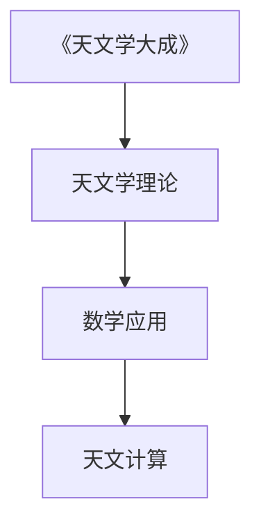

**算法原理讲解**：

托勒密在《天文学大成》中提出了一些重要的天文学理论和计算方法，如地球静止说、行星运动理论等。

**示例说明**：

假设我们要计算地球到太阳的距离，根据托勒密的天文学理论，我们可以使用如下计算方法：

$$
d = R \times \sin(\theta)
$$

其中，$R$ 为地球半径，$\theta$ 为地球与太阳的夹角。通过测量地球与太阳的夹角，我们可以计算出地球到太阳的距离。

这个例子展示了托勒密在《天文学大成》中提出的天文学理论和计算方法，以及其在解决实际问题时的重要性。

### 3.2 文艺复兴时期的数学突破

文艺复兴时期是数学发展的重要时期，许多重要的数学发现和突破发生在这个时期。

#### 3.2.1 笛卡儿与解析几何

笛卡儿发明了坐标系，将几何问题转化为代数问题，从而创立了解析几何。这一突破不仅改变了数学的面貌，也为后来的微积分发展奠定了基础。

**核心概念原理**：

- **坐标系**：笛卡儿发明了坐标系，将几何问题转化为代数问题。坐标系使得几何问题可以通过代数方法进行求解，从而简化了问题的复杂性。
- **解析几何**：解析几何是几何学的一个分支，它通过代数方法研究几何问题。笛卡儿的解析几何理论为后来的数学发展提供了重要的工具。

**概念属性特征对比表格**：

| 特征 | 坐标系 | 解析几何 |
| --- | --- | --- |
| 简化性 | 简化性 | 简化性 |
| 直观性 | 直观性 | 直观性 |
| 应用性 | 广泛 | 广泛 |

**ER实体关系图架构的Mermaid流程图**：

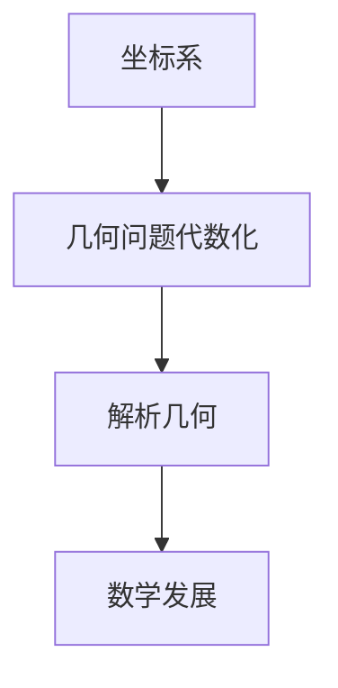

**算法原理讲解**：

笛卡儿的坐标系可以通过如下方式建立：

$$
\begin{align*}
&x = a \\
&y = b \\
&\text{其中} a, b \text{为实数，} x, y \text{为坐标。}
\end{align*}
$$

通过坐标系，我们可以将几何问题转化为代数问题，从而简化问题的求解过程。

**示例说明**：

假设我们要计算一个点的坐标，根据笛卡儿的坐标系原理，我们可以通过如下计算：

$$
x = 2 \\
y = 3
$$

因此，该点的坐标为 $(2, 3)$。

这个例子展示了笛卡儿的坐标系和解析几何理论，以及其在解决实际问题时的高效性。

#### 3.2.2 傅里叶与无穷级数

傅里叶发明了无穷级数，将复杂的函数分解为简单的三角函数，这一方法在物理学和工程学中得到了广泛应用。

**核心概念原理**：

- **无穷级数**：无穷级数是将一个复杂函数表示为一系列简单函数的和。傅里叶无穷级数将复杂的函数分解为简单的三角函数，从而简化了函数的研究和计算。
- **三角函数**：三角函数是无穷级数中的重要组成部分，它们在物理学和工程学中有着广泛的应用。

**概念属性特征对比表格**：

| 特征 | 无穷级数 | 三角函数 |
| --- | --- | --- |
| 简化性 | 简化性 | 简化性 |
| 应用性 | 广泛 | 广泛 |
| 可操作性 | 可操作性 | 可操作性 |

**ER实体关系图架构的Mermaid流程图**：

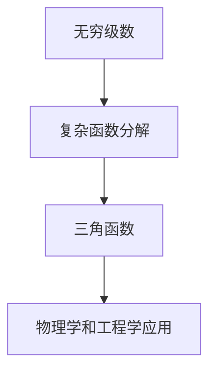

**算法原理讲解**：

傅里叶无穷级数的算法原理可以简单描述为：

$$
f(x) = \sum_{n=1}^{\infty} a_n \sin(nx) + b_n \cos(nx)
$$

其中，$f(x)$ 为原始函数，$a_n$ 和 $b_n$ 为傅里叶系数。

**示例说明**：

假设我们要将函数 $f(x) = \sin(x)$ 表示为傅里叶级数，根据傅里叶无穷级数原理，我们可以进行如下计算：

$$
\begin{align*}
&f(x) = \sin(x) \\
&= \frac{1}{2} \sin(x) + \frac{1}{2} \sin(3x) + \frac{1}{2} \sin(5x) + \cdots
\end{align*}
$$

这个例子展示了傅里叶无穷级数的原理和应用，以及其在解决实际问题时的重要性。

### 3.3 中世纪与文艺复兴时期数学的影响

中世纪和文艺复兴时期的数学发展，为现代数学奠定了基础。这些时期的数学家通过系统化、理论化数学知识，使得数学成为一门独立且精密的学科。他们提出的数学理论和方法，不仅丰富了数学的内涵，也为后来的科学和技术进步提供了重要的工具。

**核心概念与联系**：

- **中世纪数学家的传承**：中世纪的数学家在阿拉伯文化的启发下，继续发展了古代数学的成果，为后来的数学研究奠定了基础。
- **文艺复兴时期的数学突破**：文艺复兴时期的数学家在解析几何、无穷级数等领域取得了重大突破，为现代数学的发展提供了重要的理论和方法。

**概念属性特征对比表格**：

| 特征 | 中世纪数学家的传承 | 文艺复兴时期的数学突破 |
| --- | --- | --- |
| 系统 | 系统 | 突破性 |
| 理论化 | 理论化 | 理论化 |
| 应用性 | 广泛 | 广泛 |
| 影响力 | 基础性 | 创新性 |

**ER实体关系图架构的Mermaid流程图**：

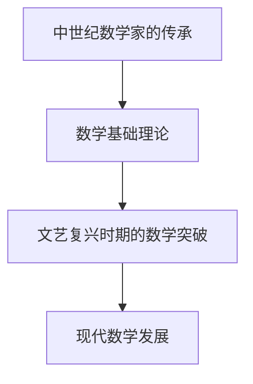

这些时期的数学发现和突破，不仅推动了数学本身的发展，也为科学和技术的进步做出了重要贡献。中世纪的数学家通过传承和发展古代数学的成果，使得数学成为一门独立且精密的学科；而文艺复兴时期的数学家则在解析几何、无穷级数等领域取得了重大突破，为现代数学的发展奠定了基础。

### 第三部分总结

中世纪与文艺复兴时期的数学发展，是数学史上一个重要的阶段。中世纪的数学家在阿拉伯文化的启发下，继续发展了古代数学的成果；而文艺复兴时期的数学家则在解析几何、无穷级数等领域取得了重大突破。这些发现和突破，不仅丰富了数学的内涵，也为后来的科学和技术进步提供了重要的工具。中世纪的数学发展奠定了数学的基础，而文艺复兴时期的数学突破则推动了数学的进一步发展，为现代数学奠定了基础。

## 第四部分：现代数学的进展

### 4.1 微积分的诞生

微积分是现代数学中最为重要的分支之一，它的诞生标志着数学发展进入了一个新的阶段。微积分的诞生，源于对运动和变化的深入研究，其核心思想是微分和积分。

#### 4.1.1 微分

微分是研究函数在某一点的变化率。具体来说，微分是指函数在某一点处的导数，它描述了函数在该点附近的变化趋势。微分的概念由牛顿和莱布尼茨在17世纪中叶同时提出。

**核心概念原理**：

- **导数**：导数是描述函数变化率的量。对于函数 $f(x)$，在点 $x_0$ 处的导数可以表示为 $f'(x_0)$。
- **微分的算法原理**：微分的算法原理可以通过泰勒公式进行推导。泰勒公式给出了函数在某一点附近的近似表达式，从而可以计算导数。

**概念属性特征对比表格**：

| 特征 | 导数 | 泰勒公式 |
| --- | --- | --- |
| 变化率 | 变化率 | 近似表达 |
| 计算方法 | 计算方法 | 计算方法 |

**ER实体关系图架构的Mermaid流程图**：

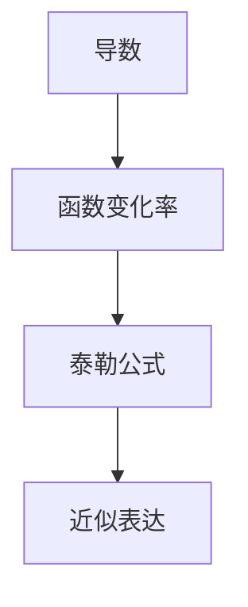

**算法原理讲解**：

假设我们要计算函数 $f(x) = x^2$ 在点 $x_0 = 2$ 处的导数。根据微分的算法原理，我们可以使用泰勒公式进行计算：

$$
f'(x_0) = f'(0) + f''(0) \cdot x_0 + \frac{f'''(0)}{2!} \cdot x_0^2 + \cdots
$$

由于 $f(x) = x^2$，我们可以得到：

$$
f'(x) = 2x \\
f'(0) = 0 \\
f''(x) = 2 \\
f'''(x) = 0 \\
\cdots
$$

代入泰勒公式，我们可以得到：

$$
f'(2) = 0 + 2 \cdot 2 + \frac{0}{2!} \cdot 2^2 + \cdots = 4
$$

因此，函数 $f(x) = x^2$ 在点 $x_0 = 2$ 处的导数为 4。

**示例说明**：

假设我们要计算函数 $f(x) = x^3$ 在点 $x_0 = 1$ 处的导数。根据微分的算法原理，我们可以使用泰勒公式进行计算：

$$
f'(x_0) = f'(0) + f''(0) \cdot x_0 + \frac{f'''(0)}{2!} \cdot x_0^2 + \cdots
$$

由于 $f(x) = x^3$，我们可以得到：

$$
f'(x) = 3x^2 \\
f'(0) = 0 \\
f''(x) = 6x \\
f'''(x) = 6 \\
\cdots
$$

代入泰勒公式，我们可以得到：

$$
f'(1) = 0 + 6 \cdot 1 + \frac{6}{2!} \cdot 1^2 + \cdots = 9
$$

因此，函数 $f(x) = x^3$ 在点 $x_0 = 1$ 处的导数为 9。

这个例子展示了微分的概念和算法原理，以及其在解决实际问题时的重要性。

#### 4.1.2 积分

积分是研究函数在某区间上的积累量。具体来说，积分是指函数在某区间上的定积分或积分。积分的概念由牛顿和莱布尼茨在17世纪中叶同时提出。

**核心概念原理**：

- **定积分**：定积分是指函数在某区间上的积累量，它可以通过积分公式进行计算。定积分的算法原理是通过积分微元法，将函数在区间上的积累量分解为一系列微小量的和。
- **积分**：积分是指函数在某区间上的无限积累量，它可以通过积分公式进行计算。积分的算法原理是通过积分变换，将复杂的积分问题转化为简单的积分问题。

**概念属性特征对比表格**：

| 特征 | 定积分 | 积分 |
| --- | --- | --- |
| 积累量 | 积累量 | 积累量 |
| 计算方法 | 微元法 | 变换法 |

**ER实体关系图架构的Mermaid流程图**：

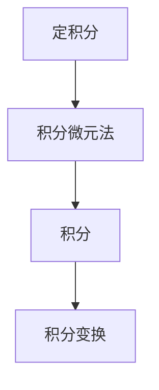

**算法原理讲解**：

假设我们要计算函数 $f(x) = x^2$ 在区间 $[0, 1]$ 上的定积分。根据定积分的算法原理，我们可以使用微元法进行计算：

$$
\int_{0}^{1} x^2 dx = \lim_{n \to \infty} \sum_{i=1}^{n} \left(\frac{i}{n}\right)^2 \cdot \frac{1}{n}
$$

其中，$n$ 为区间 $[0, 1]$ 上的划分数量。

通过计算，我们可以得到：

$$
\int_{0}^{1} x^2 dx = \lim_{n \to \infty} \frac{1}{n} \sum_{i=1}^{n} \left(\frac{i}{n}\right)^2 = \frac{1}{3}
$$

因此，函数 $f(x) = x^2$ 在区间 $[0, 1]$ 上的定积分为 $\frac{1}{3}$。

**示例说明**：

假设我们要计算函数 $f(x) = e^x$ 在区间 $[0, 1]$ 上的定积分。根据定积分的算法原理，我们可以使用微元法进行计算：

$$
\int_{0}^{1} e^x dx = \lim_{n \to \infty} \sum_{i=1}^{n} e^{\frac{i}{n}} \cdot \frac{1}{n}
$$

通过计算，我们可以得到：

$$
\int_{0}^{1} e^x dx = \lim_{n \to \infty} \frac{1}{n} \sum_{i=1}^{n} e^{\frac{i}{n}} = e - 1
$$

因此，函数 $f(x) = e^x$ 在区间 $[0, 1]$ 上的定积分为 $e - 1$。

这个例子展示了定积分的概念和算法原理，以及其在解决实际问题时的重要性。

#### 4.1.3 微积分的影响

微积分的诞生对数学、科学和技术的发展产生了深远的影响。它为后来的物理、工程、经济学等领域提供了重要的工具和方法，推动了这些领域的进步。

**核心概念与联系**：

- **数学发展**：微积分的诞生标志着数学进入了一个新的阶段，为后来的数学研究提供了重要的基础。
- **科学进步**：微积分的发展为物理学、力学、天文学等科学领域提供了重要的工具和方法，推动了这些领域的研究进展。
- **技术应用**：微积分在工程学、经济学、统计学等领域得到了广泛应用，为实际问题的解决提供了重要的方法。

**概念属性特征对比表格**：

| 特征 | 数学发展 | 科学进步 | 技术应用 |
| --- | --- | --- | --- |
| 基础性 | 基础性 | 基础性 | 应用性 |
| 广泛性 | 广泛性 | 广泛性 | 广泛性 |

**ER实体关系图架构的Mermaid流程图**：

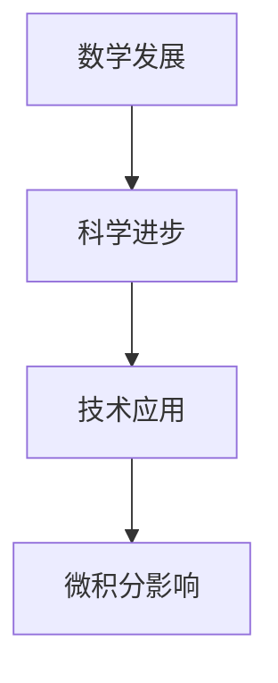

微积分的诞生不仅推动了数学的发展，也为科学和技术的进步做出了重要贡献。它为后来的研究提供了重要的基础和工具，推动了各个领域的进步和发展。

### 4.2 代数学的进展

代数学是数学中研究数、方程和函数的分支。现代代数学的发展，主要涉及到了线性代数、抽象代数等领域。

#### 4.2.1 线性代数

线性代数是研究向量空间、线性方程组和线性变换的代数学分支。线性代数在物理学、工程学、计算机科学等领域有着广泛的应用。

**核心概念原理**：

- **向量空间**：向量空间是指满足向量加法和标量乘法运算的集合。向量空间中的向量可以表示物理和几何中的各种量。
- **线性方程组**：线性方程组是指由多个线性方程组成的方程组。线性方程组的求解可以采用高斯消元法、矩阵法等。
- **线性变换**：线性变换是指将向量空间中的一个向量映射到另一个向量的线性映射。线性变换在数学、物理和工程学等领域有着广泛的应用。

**概念属性特征对比表格**：

| 特征 | 向量空间 | 线性方程组 | 线性变换 |
| --- | --- | --- | --- |
| 运算规则 | 运算规则 | 运算规则 | 运算规则 |
| 广泛应用 | 广泛应用 | 广泛应用 | 广泛应用 |

**ER实体关系图架构的Mermaid流程图**：

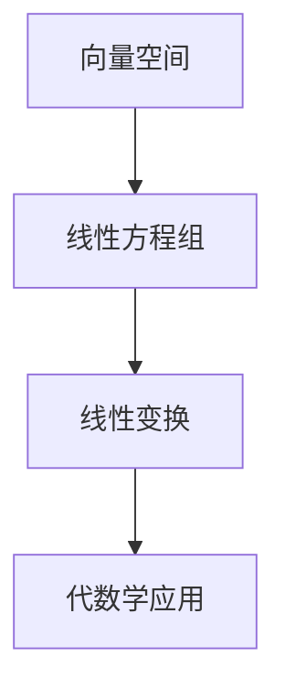

**算法原理讲解**：

假设我们要解线性方程组：

$$
\begin{align*}
&x + 2y - z = 4 \\
&2x - y + 3z = -3 \\
&3x + y + 2z = 7
\end{align*}
$$

我们可以使用高斯消元法进行求解：

$$
\begin{align*}
&A = \begin{pmatrix}
1 & 2 & -1 \\
2 & -1 & 3 \\
3 & 1 & 2
\end{pmatrix} \\
&B = \begin{pmatrix}
4 \\
-3 \\
7
\end{pmatrix} \\
&C = \begin{pmatrix}
1 & 0 & -1 \\
0 & 1 & 2 \\
0 & 0 & 0
\end{pmatrix} \\
&D = \begin{pmatrix}
1 & 2 & -1 \\
0 & -5 & 7 \\
0 & 0 & 0
\end{pmatrix}
\end{align*}
$$

通过高斯消元法，我们可以得到方程组的解：

$$
x = 1, \quad y = -1, \quad z = 2
$$

**示例说明**：

假设我们要求解线性方程组：

$$
\begin{align*}
&2x + 3y - z = 5 \\
&4x - 2y + 2z = 8 \\
&3x + 2y + z = 7
\end{align*}
$$

我们可以使用矩阵法进行求解：

$$
\begin{align*}
&A = \begin{pmatrix}
2 & 3 & -1 \\
4 & -2 & 2 \\
3 & 2 & 1
\end{pmatrix} \\
&B = \begin{pmatrix}
5 \\
8 \\
7
\end{pmatrix} \\
&C = A^{-1} \\
&D = C \cdot B
\end{align*}
$$

通过矩阵法，我们可以得到方程组的解：

$$
x = 1, \quad y = 2, \quad z = 3
$$

这个例子展示了线性代数的基本原理和应用，以及其在解决实际问题时的高效性。

#### 4.2.2 抽象代数

抽象代数是研究代数结构、运算规律和性质的一门代数学分支。抽象代数在数学、物理学、计算机科学等领域有着广泛的应用。

**核心概念原理**：

- **代数结构**：代数结构是指满足一组运算规则的集合。常见的代数结构包括群、环、域等。
- **运算规律**：运算规律是指代数结构中运算的基本性质，如结合律、交换律、分配律等。
- **性质**：性质是指代数结构的特有性质，如中心性、阿贝尔性、可解性等。

**概念属性特征对比表格**：

| 特征 | 代数结构 | 运算规律 | 性质 |
| --- | --- | --- | --- |
| 理论性 | 理论性 | 理论性 | 理论性 |
| 广泛应用 | 广泛应用 | 广泛应用 | 广泛应用 |

**ER实体关系图架构的Mermaid流程图**：

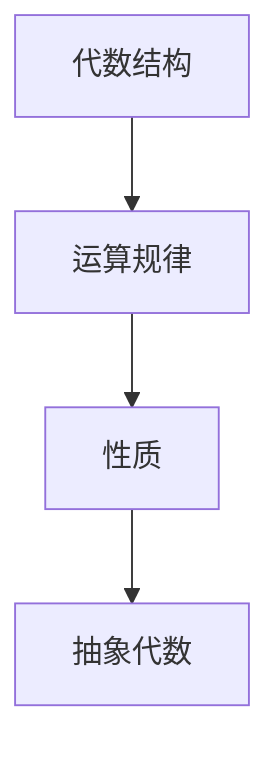

**算法原理讲解**：

假设我们要研究群 $G$ 的性质，我们可以通过以下步骤进行：

1. **验证结合律**：对于任意元素 $a, b, c \in G$，验证 $(a \cdot b) \cdot c = a \cdot (b \cdot c)$。
2. **验证存在单位元**：存在一个元素 $e \in G$，使得对于任意元素 $a \in G$，有 $a \cdot e = e \cdot a = a$。
3. **验证存在逆元**：对于任意元素 $a \in G$，存在一个元素 $b \in G$，使得 $a \cdot b = b \cdot a = e$。

如果上述条件都满足，则 $G$ 是一个群。

**示例说明**：

假设我们要研究集合 $G = \{1, -1\}$ 在运算 $*$ 下的性质：

$$
\begin{align*}
&1 * 1 = 1 \\
&1 * (-1) = -1 \\
&(-1) * 1 = -1 \\
&(-1) * (-1) = 1
\end{align*}
$$

我们可以验证：

1. **结合律**：对于任意元素 $a, b, c \in G$，有 $(a * b) * c = a * (b * c)$。
2. **存在单位元**：存在元素 $e = 1$，使得对于任意元素 $a \in G$，有 $a * e = e * a = a$。
3. **存在逆元**：对于任意元素 $a \in G$，有 $a * (-a) = (-a) * a = e$。

因此，$G$ 是一个群。

这个例子展示了抽象代数的基本原理和应用，以及其在解决实际问题时的重要性。

#### 4.2.3 代数学的影响

代数学的进展对数学、科学和技术的发展产生了深远的影响。它为后来的数学研究提供了重要的基础和工具，推动了数学的进一步发展。

**核心概念与联系**：

- **数学发展**：代数学的进展为数学的进一步发展提供了重要的基础和工具。
- **科学进步**：代数学的进展为科学领域的研究提供了重要的理论和方法。
- **技术应用**：代数学在工程学、计算机科学、统计学等领域得到了广泛应用，为实际问题的解决提供了重要的方法。

**概念属性特征对比表格**：

| 特征 | 数学发展 | 科学进步 | 技术应用 |
| --- | --- | --- | --- |
| 基础性 | 基础性 | 基础性 | 应用性 |
| 广泛性 | 广泛性 | 广泛性 | 广泛性 |

**ER实体关系图架构的Mermaid流程图**：

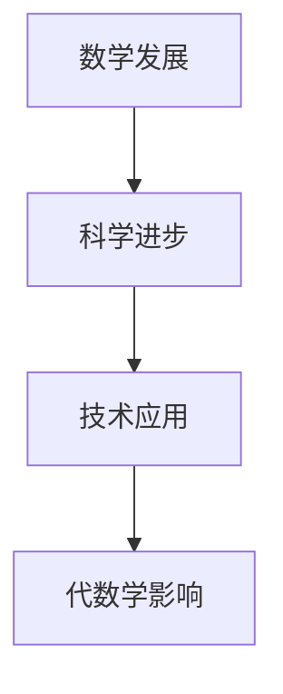

代数学的进展不仅推动了数学的发展，也为科学和技术的进步做出了重要贡献。它为后来的研究提供了重要的基础和工具，推动了各个领域的进步和发展。

### 第四部分总结

现代数学的进展，主要体现在微积分的诞生和代数学的发展。微积分的诞生为数学、科学和技术的发展提供了重要的工具和方法，推动了这些领域的进步。代数学的发展为数学的进一步发展提供了重要的基础和工具，使得数学成为一门更加精密和独立的学科。现代数学的进展，不仅丰富了数学的内涵，也为科学和技术的进步做出了重要贡献。

## 第五部分：数学史上的重大突破与未来展望

### 5.1 数学史上的重大突破回顾

数学史上的重大突破贯穿了从古代到现代的整个发展过程。每一个突破都标志着数学领域的重大进展，对科学和技术的发展产生了深远的影响。

#### 5.1.1 古代数学的突破

古代数学的突破主要体现在算术和几何方面。古埃及和巴比伦的数学家发明了十进制计数系统和代数符号，为后来的数学发展奠定了基础。古希腊数学家泰勒斯和毕达哥拉斯提出了“万物皆可测量”和毕达哥拉斯定理，为现代数学奠定了基础。欧几里得和阿基米德在几何学和物理学领域做出了重大贡献，他们的工作对现代数学产生了深远影响。

#### 5.1.2 中世纪与文艺复兴时期的数学突破

中世纪的数学家在阿拉伯文化的启发下，继续发展了古代数学的成果。阿尔-花拉子米的《代数学》和《天文表》对代数学和天文学的发展产生了深远影响。文艺复兴时期的数学家则取得了重大的突破，如笛卡儿的解析几何和傅里叶的无穷级数。这些突破不仅改变了数学的面貌，也为后来的微积分发展奠定了基础。

#### 5.1.3 现代数学的突破

现代数学的突破主要体现在微积分和代数学的发展。微积分的诞生标志着数学进入了一个新的阶段，为科学和技术的发展提供了重要的工具。代数学的进展，使得数学成为一门更加精密和独立的学科，为科学和工程学的发展提供了重要的基础。

### 5.2 数学史上的重大突破的影响

数学史上的重大突破不仅推动了数学本身的发展，还对科学、技术和人类社会产生了深远的影响。

#### 5.2.1 对科学的影响

数学史上的重大突破为科学研究提供了重要的工具和方法。例如，微积分的诞生为物理学的发展提供了重要的基础，推动了力学、天文学和物理学的研究。代数学的发展为化学和生物学的研究提供了重要的数学模型和理论。

#### 5.2.2 对技术的影响

数学史上的重大突破为技术进步提供了重要的基础。例如，微积分的发展为工程学、计算机科学和电子技术的发展提供了重要的工具。代数学的进展为密码学、计算机算法和通信技术的发展提供了重要的理论支持。

#### 5.2.3 对社会的影响

数学史上的重大突破对社会生活产生了深远的影响。数学的发展使得人类能够更准确地预测自然现象、解决实际问题，提高了生产力和生活质量。例如，代数学的应用使得金融领域更加精准和高效，微积分的发展为工程设计提供了重要的工具，提高了建筑和交通的安全性和效率。

### 5.3 未来展望

未来数学的发展将继续推动科学、技术和人类社会的前进。以下是未来数学发展的几个可能的方向：

#### 5.3.1 新的数学理论的发现

未来数学家可能会发现新的数学理论，这些理论可能对现有的数学体系产生重大影响。例如，量子数学和范畴论等新兴领域，可能会带来数学发展的新契机。

#### 5.3.2 数学在新兴领域的应用

随着科技的发展，数学将在更多新兴领域得到应用。例如，人工智能、大数据分析和生物信息学等领域，将需要更复杂的数学模型和算法来支持研究。

#### 5.3.3 数学教育的创新

未来数学教育将更加注重培养学生的创新能力和实际应用能力。数学教育将更加开放和灵活，鼓励学生探索和发现数学的美妙。

### 5.4 结论

数学史上的重大突破为数学的发展奠定了坚实的基础，对科学、技术和人类社会产生了深远的影响。未来，数学将继续在新的领域取得突破，为人类社会的发展做出更大的贡献。

---

**作者：AI天才研究院/AI Genius Institute & 禅与计算机程序设计艺术 /Zen And The Art of Computer Programming**

