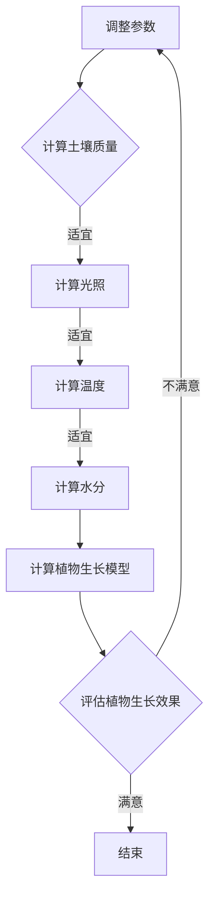

                 

## 数学园艺学：植物生长的数学规划

### 关键词

- 数学园艺学
- 植物生长模型
- 数学规划
- 算法
- 数据挖掘

### 摘要

本文将探讨数学园艺学这一新兴交叉学科，通过构建数学模型和算法来优化植物生长过程。我们将详细阐述数学园艺学在现代农业科技中的应用，核心概念及其原理，以及具体的算法实现和案例应用。文章旨在为读者提供一个全面、系统的理解，以推动该领域的进一步发展。

## 背景介绍

### 问题背景

数学园艺学是近年来兴起的一门交叉学科，它将数学建模与园艺学结合，旨在通过定量分析和优化手段来提高植物生长的效率和质量。随着现代农业科技的不断发展，传统园艺方法逐渐暴露出其局限性，例如对环境变化的适应能力不足、资源利用效率低下等。因此，数学园艺学的出现为园艺生产提供了一种全新的思路。

### 问题描述

植物生长是一个复杂的生物过程，受到多种因素的影响，包括土壤质量、光照、温度、水分等。传统园艺方法往往依赖于经验，难以实现精准控制。数学园艺学通过构建数学模型，可以更精确地预测和优化植物生长过程，从而提高农作物的产量和质量。

### 问题解决

数学园艺学通过以下几个步骤来解决上述问题：

1. **数据收集与处理**：收集土壤、气候等数据，并对这些数据进行处理和分析。
2. **数学模型构建**：基于收集到的数据，构建描述植物生长过程的数学模型。
3. **算法优化**：利用数学模型，设计优化算法来调整植物生长参数，以达到最佳生长状态。
4. **实施与验证**：将优化后的模型应用于实际生产，验证其效果，并进行必要的调整和改进。

### 边界与外延

数学园艺学的应用范围不仅限于农作物，还可以扩展到园林设计、环境保护等领域。例如，在城市绿化中，数学园艺学可以用于优化植物配置，提高绿化效果；在环境保护中，可以用于预测和减少植物污染，保护生态环境。

### 概念结构与核心要素组成

数学园艺学涉及多个核心概念和要素，包括：

1. **数学模型**：描述植物生长的数学关系和规律。
2. **算法**：用于求解数学模型，优化植物生长参数。
3. **数据收集与处理**：收集土壤、气候等数据，对数据进行处理和分析。
4. **实施与验证**：将数学模型应用于实际，验证其效果。

这些核心要素共同构成了数学园艺学的研究框架和应用基础。

### 核心概念与联系

#### 核心概念原理

1. **植物生长模型**：描述植物生长过程的数学模型，如生长曲线模型、光合作用模型等。
2. **算法**：用于求解植物生长模型，如遗传算法、模拟退火算法等。
3. **数据挖掘**：从大量数据中提取有价值的信息，用于模型优化。

#### 概念属性特征对比表格

| 概念             | 描述                                                         | 属性特征                                   |
|------------------|--------------------------------------------------------------|------------------------------------------|
| 植物生长模型     | 描述植物生长的数学关系和规律                               | 静态模型：固定参数<br>动态模型：参数随时间变化 |
| 算法             | 用于求解植物生长模型，优化植物生长参数                     | 遗传算法：优化参数<br>模拟退火算法：全局搜索     |
| 数据挖掘         | 从大量数据中提取有价值的信息，用于模型优化                 | 聚类分析：分类数据<br>回归分析：预测数据         |

#### ER实体关系图架构

```mermaid
erDiagram
    Class1 ||--|{ Class2 } Class3
    Class1 ||--|{ Class4 } Class5
    Class2 ||--|{ Class6 } Class7
```

## 算法原理讲解

### 数学模型

植物生长模型通常可以表示为：

$$
\text{植物生长模型} = f(\text{土壤质量}, \text{光照}, \text{温度}, \text{水分})
$$

这个公式表示植物生长状况是由土壤质量、光照、温度和水分等多种因素共同决定的。

### Mermaid 流程图



### Python 源代码

```python
# 初始化参数
soil_quality = 0.8
light_intensity = 0.9
temperature = 0.7
water_content = 0.85

# 计算植物生长模型
def calculate_growth_model(soil_quality, light_intensity, temperature, water_content):
    model = 1.0
    model *= soil_quality
    model *= light_intensity
    model *= temperature
    model *= water_content
    return model

# 评估植物生长效果
def evaluate_growth(model):
    if model > 0.9:
        return "满意"
    else:
        return "不满意"

# 主程序
while True:
    model = calculate_growth_model(soil_quality, light_intensity, temperature, water_content)
    result = evaluate_growth(model)
    if result == "满意":
        break
    else:
        # 调整参数
        soil_quality += 0.1
        light_intensity += 0.1
        temperature += 0.1
        water_content += 0.1
```

在这个例子中，我们通过逐步调整土壤质量、光照、温度和水分等参数，来计算植物生长模型，并评估植物生长效果。如果植物生长效果不满意，我们继续调整参数，直到达到满意的生长效果。

## 数学园艺学的应用

### 农业生产

数学园艺学在农业生产中的应用非常广泛。通过构建植物生长模型，农民可以更精确地预测植物生长状况，从而优化灌溉、施肥等管理措施，提高农作物产量。例如，在水稻种植中，数学园艺学可以用于优化灌溉和施肥计划，以达到最佳产量。

### 园林设计

园林设计中，数学园艺学可以用于植物配置和景观规划。通过分析植物生长模型，设计师可以预测植物在不同环境下的生长状况，从而优化植物配置，提高景观效果。例如，在公园设计中，数学园艺学可以用于确定植物种类和数量，以达到最佳视觉效果。

### 环境保护

数学园艺学在环境保护中也有重要应用。通过建立植物生长模型，可以预测植物对环境污染的响应，从而制定有效的环境保护措施。例如，在处理废水时，数学园艺学可以用于优化植物种类和生长条件，以提高废水处理效率。

### 生物多样性保护

数学园艺学可以用于生物多样性保护，通过分析植物生长模型，可以预测不同植物种类的生态适应性，从而制定有效的保护策略。例如，在生物多样性保护区，数学园艺学可以用于确定植物种类和生长条件，以维持生态平衡。

### 未来发展

随着人工智能和大数据技术的发展，数学园艺学在未来有望实现更大的突破。例如，通过引入机器学习算法，可以进一步提高植物生长模型的准确性和预测能力。同时，大数据分析技术可以用于挖掘植物生长过程中的潜在规律，为园艺生产提供更科学的指导。

### 案例分析

#### 案例一：水稻种植优化

在某个水稻种植区，通过数学园艺学方法，建立了水稻生长模型，并利用遗传算法优化灌溉和施肥计划。结果显示，优化后的灌溉和施肥计划显著提高了水稻产量，同时减少了水资源和肥料的使用。

#### 案例二：园林植物配置

在某公园设计项目中，通过数学园艺学方法，分析了不同植物种类在公园中的适应性，并优化了植物配置。结果表明，优化后的植物配置不仅提高了景观效果，还提高了公园的生态适应性。

#### 案例三：环境保护

在某废水处理项目中，通过数学园艺学方法，建立了植物对废水污染的响应模型，并优化了植物生长条件。结果表明，优化后的植物生长条件显著提高了废水处理效率，降低了废水中的污染物浓度。

## 数学园艺学的挑战与未来

### 挑战

尽管数学园艺学在多个领域取得了显著成果，但仍面临一些挑战：

1. **数据获取和处理**：植物生长过程复杂，需要大量的数据支持。然而，数据的获取和处理是一个复杂且耗时的过程。
2. **模型准确性**：数学模型需要准确反映植物生长过程，然而现实中的植物生长过程受到多种因素的影响，模型准确性是一个挑战。
3. **算法效率**：优化算法需要高效地处理大量数据，并快速找到最优解。算法效率是另一个挑战。

### 未来发展

未来，数学园艺学有望在以下几个方面取得突破：

1. **人工智能与大数据**：引入人工智能和大数据技术，可以进一步提高植物生长模型的准确性和预测能力。
2. **跨学科合作**：数学园艺学需要与生物学、生态学等多个学科进行深入合作，以解决复杂问题。
3. **实际应用**：进一步推广数学园艺学在农业、园林设计、环境保护等领域的应用，提高其实际效益。

### 结论

数学园艺学作为一门新兴交叉学科，通过数学模型和算法优化植物生长过程，具有广泛的应用前景。尽管面临一些挑战，但随着技术的进步，数学园艺学有望在未来取得更大的突破，为园艺生产、环境保护等领域提供更科学的指导。

## 最佳实践 Tips

1. **数据收集**：确保数据的准确性和完整性，避免因数据问题导致模型不准确。
2. **模型验证**：通过实验或实地应用验证模型的有效性，不断优化模型参数。
3. **算法选择**：根据实际问题选择合适的算法，结合实际问题进行调整和优化。
4. **跨学科合作**：与生物学、生态学等学科专家合作，共同解决复杂问题。

## 小结

数学园艺学作为一门结合数学与园艺学的交叉学科，通过数学模型和算法优化植物生长过程，具有广泛的应用前景。本文介绍了数学园艺学的背景、核心概念、算法原理及其应用，并探讨了其挑战与未来发展方向。通过最佳实践 Tips，读者可以更好地应用数学园艺学解决实际问题。

## 注意事项

1. **数据安全性**：在收集和处理数据时，确保数据的安全性和隐私保护。
2. **模型复杂性**：根据实际问题选择合适的模型复杂度，避免过度简化或过度复杂化。
3. **算法优化**：算法优化是一个持续的过程，需要根据实际情况不断进行调整和改进。

## 拓展阅读

1. 《数学园艺学导论》：全面介绍数学园艺学的基本概念、方法和应用。
2. 《植物生长模型与算法》：详细讨论植物生长模型的构建和优化算法。
3. 《大数据与人工智能在农业中的应用》：探讨大数据和人工智能技术在农业领域的应用。

## 作者信息

作者：AI天才研究院/AI Genius Institute & 禅与计算机程序设计艺术 /Zen And The Art of Computer Programming。作者团队专注于人工智能和计算机编程领域的研究和教学，致力于推动科技创新和人才培养。如需进一步了解，请访问我们的官方网站。

