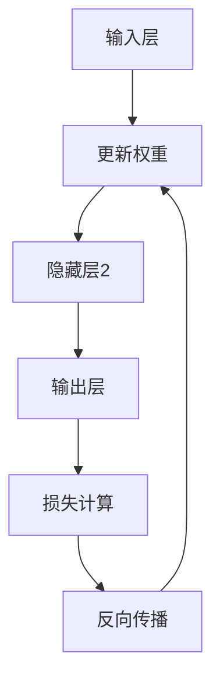
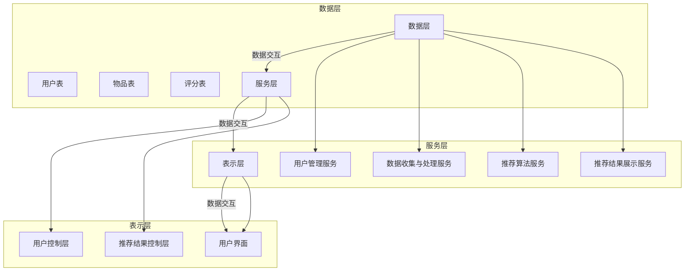
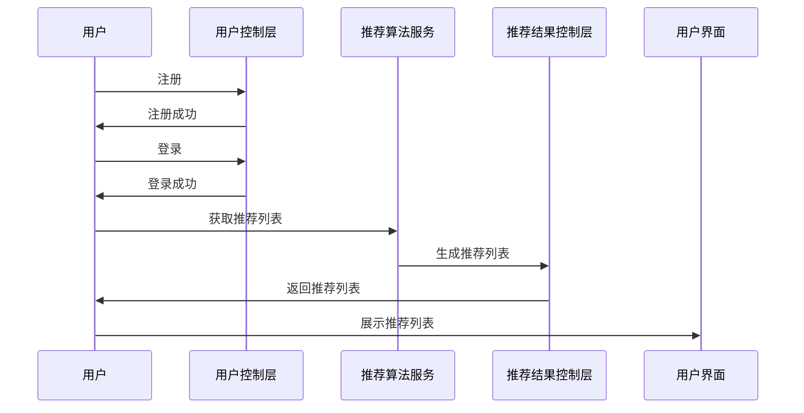

                 

### 第一部分：数学在人工智能领域的应用背景

#### 1.1 人工智能的发展历程

人工智能（Artificial Intelligence，简称AI）作为一个跨越多个学科领域的前沿技术，其发展历程充满了激动人心的变革。从最初的计算智能（Compute Intelligence），即通过计算机进行复杂的计算和逻辑推理，到数据智能（Data Intelligence），利用大数据和机器学习技术实现智能化处理，人工智能已经经历了多个阶段的发展。

##### 1.1.1 从计算智能到数据智能

计算智能阶段主要集中在20世纪50年代到80年代，这个时期的人工智能研究主要集中在规则推理和知识表示上。典型的代表包括逻辑推理机（Logic Theorist）、问题求解器（General Problem Solver）等。然而，由于规则库的构建和维护成本极高，这一阶段的人工智能应用范围有限，难以实现大规模的智能化。

进入21世纪后，随着互联网的普及和大数据技术的成熟，人工智能进入了数据智能阶段。这个阶段的核心在于通过大量数据的收集和分析，利用机器学习和深度学习技术，实现人工智能的自动化和智能化。大数据技术使得人工智能系统具备了更强的数据处理能力，机器学习算法也日益成熟，从而推动了人工智能的快速发展。

##### 1.1.2 人工智能的瓶颈与数学的作用

尽管人工智能在数据智能阶段取得了巨大的进展，但仍然面临着一些瓶颈。其中，数据的复杂度、模型的解释性和计算效率等问题尤为突出。这些问题在一定程度上限制了人工智能的应用范围和效果。

数学作为一种强大的工具，在解决这些瓶颈中发挥了至关重要的作用。首先，数学为人工智能提供了丰富的理论基础。例如，线性代数、概率论、统计学等数学分支在人工智能的算法设计和模型构建中具有广泛的应用。通过数学模型，人工智能系统能够更好地理解和处理复杂的数据。

其次，数学提供了高效的计算方法。在人工智能领域，特别是深度学习领域，计算效率是一个关键因素。数学优化算法，如梯度下降法、牛顿法等，为人工智能算法的实现提供了高效的计算路径，从而提高了系统的性能和效率。

##### 1.1.3 数学在人工智能中的核心作用

数学在人工智能中的核心作用主要体现在以下几个方面：

1. **算法设计**：数学为人工智能算法的设计提供了理论基础。例如，深度学习算法中的多层感知机（MLP）和卷积神经网络（CNN）都是基于数学原理构建的。

2. **模型优化**：数学优化算法在人工智能模型优化中发挥了重要作用。通过优化算法，如梯度下降法、随机梯度下降法等，人工智能系统能够找到最优的参数设置，从而提高模型的性能。

3. **数据分析**：数学方法在数据分析中具有广泛的应用。例如，线性回归、决策树、支持向量机等算法都是基于数学模型实现的。

4. **系统设计**：数学原理在人工智能系统的设计中也具有重要意义。例如，系统架构的设计、模块划分、接口定义等都需要借助数学方法进行分析和优化。

#### 1.2 数学在人工智能领域的核心概念

数学在人工智能领域中的应用涉及多个核心概念，这些概念不仅构成了人工智能的理论基础，也为实际应用提供了重要的工具。以下将介绍数学在人工智能领域中的几个核心概念，并绘制ER实体关系图，以展示各概念之间的关系。

##### 1.2.1 矩阵运算与神经网络

矩阵运算是线性代数中的基本概念，广泛应用于人工智能领域，特别是在神经网络中。矩阵可以表示复杂的线性变换，从而实现数据的预处理和特征提取。

神经网络（Neural Networks）则是人工智能中的核心算法，通过模拟生物神经网络的结构和功能，实现数据的分类、预测和生成等任务。

ER实体关系图如下：

```mermaid
erDiagram
    AI_Algorithm ||--|{ Neural Network : contains }
    Neural Network ||--|{ Matrix Operation : uses }
```

##### 1.2.2 概率论与信息论

概率论（Probability Theory）和信息论（Information Theory）是人工智能中的两个重要分支，它们为人工智能提供了理论支持和工具。

概率论用于描述不确定性和随机性，是构建机器学习模型和深度学习模型的基础。通过概率分布和贝叶斯定理，人工智能系统能够更好地理解和处理不确定的数据。

信息论则关注信息的传递和处理，是构建通信系统和数据压缩算法的基础。信息熵和条件熵等概念在人工智能的决策过程中具有重要应用。

ER实体关系图如下：

```mermaid
erDiagram
    Machine_Learning ||--|{ Probability Theory : based on }
    Machine_Learning ||--|{ Information Theory : uses }
```

##### 1.2.3 最优化理论与优化算法

最优化理论（Optimization Theory）和优化算法（Optimization Algorithms）是人工智能中另一个核心概念。最优化理论提供了寻找最优解的方法和工具，而优化算法则是实现这些方法的具体实现。

在人工智能中，最优化理论广泛应用于模型参数的调整和优化，以实现更好的性能。常见的优化算法包括梯度下降法、牛顿法、遗传算法等。

ER实体关系图如下：

```mermaid
erDiagram
    AI_Algorithm ||--|{ Optimization Theory : based on }
    Machine_Learning ||--|{ Optimization Algorithm : uses }
```

##### 1.2.4 ER实体关系图与数据结构

ER实体关系图（Entity-Relationship Diagram）是数据库设计中常用的工具，用于描述实体之间的关系。在人工智能领域，ER实体关系图可以用于描述算法和数据结构之间的关系。

数据结构（Data Structure）是存储和组织数据的方式，直接影响人工智能算法的性能和效率。常见的数据结构包括数组、链表、树、图等。

ER实体关系图如下：

```mermaid
erDiagram
    AI_Algorithm ||--|{ Data Structure : uses }
    Data Structure ||--|{ Database : interacts with }
```

#### 1.3 数学与人工智能的联系

数学与人工智能之间的联系是紧密而深刻的。数学不仅为人工智能提供了理论基础和工具，也在人工智能的实际应用中发挥了关键作用。以下将探讨数学在人工智能中的应用、数学公式在算法中的运用，以及数学理论在人工智能发展中的作用。

##### 1.3.1 数学模型在人工智能中的应用

数学模型是人工智能算法的核心组成部分，用于描述和模拟现实世界中的问题。以下是一些典型的数学模型在人工智能中的应用：

1. **线性回归模型**：线性回归是一种经典的机器学习算法，用于建立自变量和因变量之间的线性关系。线性回归模型使用矩阵运算来计算权重和偏置，从而实现数据的拟合和预测。

2. **神经网络模型**：神经网络是一种基于生物神经元的计算模型，通过多层神经网络实现复杂的数据处理和模式识别。神经网络模型的核心在于矩阵运算和反向传播算法，用于更新权重和偏置。

3. **决策树模型**：决策树是一种基于树形结构的分类和回归模型，通过递归分割数据集来建立决策规则。决策树模型使用条件概率和熵等数学概念来评估特征的重要性和划分效果。

4. **支持向量机模型**：支持向量机是一种监督学习算法，通过最大化分类边界来分类数据。支持向量机模型使用核函数和最优化算法来求解最优分类边界。

##### 1.3.2 数学公式在算法中的运用

数学公式是算法设计和实现的重要工具，用于描述算法中的关键步骤和计算过程。以下是一些常见的数学公式在人工智能算法中的应用：

1. **梯度下降法**：梯度下降法是一种常用的优化算法，用于最小化损失函数。梯度下降法的核心公式为：

   $$ \theta = \theta - \alpha \cdot \nabla_\theta J(\theta) $$

   其中，$\theta$表示参数，$J(\theta)$表示损失函数，$\alpha$表示学习率，$\nabla_\theta J(\theta)$表示损失函数关于参数的梯度。

2. **反向传播算法**：反向传播算法是神经网络训练的核心，用于计算每个参数的梯度。反向传播算法的公式为：

   $$ \nabla_\theta L = \nabla_\theta \cdot \text{激活函数}'(\text{输出层}) \cdot \text{输出层误差} $$

   其中，$\nabla_\theta L$表示参数关于损失函数的梯度，$\text{激活函数}'(\text{输出层})$表示激活函数的导数，$\text{输出层误差}$表示输出层的误差。

3. **条件概率**：条件概率是概率论中的一个基本概念，用于描述在某个事件发生的前提下，另一个事件发生的概率。条件概率的公式为：

   $$ P(A|B) = \frac{P(A \cap B)}{P(B)} $$

   其中，$P(A|B)$表示在事件$B$发生的条件下事件$A$发生的概率，$P(A \cap B)$表示事件$A$和事件$B$同时发生的概率，$P(B)$表示事件$B$发生的概率。

##### 1.3.3 数学理论在人工智能发展中的作用

数学理论在人工智能发展中起到了关键的推动作用。以下是一些数学理论在人工智能发展中的应用：

1. **最优化理论**：最优化理论提供了一种寻找最优解的方法，广泛应用于人工智能模型的训练和优化。例如，梯度下降法和牛顿法都是基于最优化理论的算法，用于最小化损失函数和优化模型参数。

2. **概率论**：概率论为人工智能提供了理论基础，用于描述不确定性和随机性。例如，贝叶斯定理和马尔可夫模型都是概率论中的重要理论，广泛应用于人工智能的分类和预测任务。

3. **信息论**：信息论为人工智能提供了工具，用于评估信息的传递和处理效率。例如，信息熵和条件熵等概念用于评估数据的复杂度和信息的冗余度，从而优化数据压缩和通信系统。

4. **线性代数**：线性代数为人工智能提供了基本的计算工具，用于处理大规模数据和矩阵运算。例如，矩阵分解和矩阵求逆等线性代数算法在人工智能中具有广泛的应用。

#### 1.4 数学在人工智能领域的挑战与机遇

尽管数学在人工智能领域中具有广泛的应用，但仍然面临着一些挑战和机遇。

##### 1.4.1 挑战：数学模型复杂度与可解释性

随着人工智能技术的不断发展，数学模型的复杂度逐渐增加。深度学习模型中的多层神经网络、复杂的优化算法等，都使得模型的计算量和存储需求大幅增加。这种复杂度不仅提高了计算的难度，也增加了模型的可解释性难度。如何简化数学模型、提高模型的可解释性，是当前人工智能研究中的一个重要挑战。

##### 1.4.2 机遇：数学理论创新与人工智能发展

另一方面，数学理论的创新也为人工智能的发展提供了新的机遇。随着新的数学理论和方法的出现，例如量子计算、图神经网络等，人工智能技术将得到进一步的提升。同时，数学与人工智能的深度融合也将推动数学理论的创新，从而形成一个良性循环，推动人工智能的快速发展。

#### 1.5 本章小结

本章节介绍了数学在人工智能领域的应用背景，包括人工智能的发展历程、数学在人工智能中的核心概念、数学与人工智能的联系以及数学在人工智能领域的挑战与机遇。通过本章的学习，读者可以了解数学在人工智能中的重要地位和作用，为后续章节的学习打下坚实的基础。

----------------------------------------------------------------

# 第二部分：数学在人工智能中的核心算法原理

在人工智能领域，算法原理是理解和应用数学理论的关键。本章节将深入探讨数学在人工智能中的核心算法原理，包括矩阵运算与神经网络、概率论与信息论、最优化理论与优化算法等。通过这些核心算法原理的理解，读者可以更好地掌握数学在人工智能中的应用。

## 2.1 矩阵运算与神经网络基础

矩阵运算与神经网络是人工智能领域中不可或缺的核心概念。矩阵作为一种线性结构，能够高效地表示和操作多维数据，而神经网络则通过矩阵运算实现数据的层次化处理和模式识别。

### 2.1.1 矩阵运算的基本概念

首先，我们需要了解矩阵运算的基本概念。矩阵是由一系列数字排列成的矩形阵列，可以表示为$m \times n$的矩阵，其中$m$表示行数，$n$表示列数。矩阵的基本运算包括加法、减法、乘法和转置等。

1. **矩阵加法与减法**：两个相同大小的矩阵可以进行加法和减法运算，运算规则是将对应位置的元素相加或相减。

   $$ C = A + B $$

   $$ C = A - B $$

2. **矩阵乘法**：矩阵乘法是矩阵之间的另一种基本运算，运算规则是将第一个矩阵的每一行与第二个矩阵的每一列进行点积运算，结果构成一个新的矩阵。

   $$ C = A \cdot B $$

3. **矩阵转置**：矩阵转置是将矩阵的行与列互换，形成一个新矩阵。

   $$ C = A^T $$

### 2.1.2 神经网络的基本概念

神经网络是一种模拟生物神经系统的计算模型，通过多层神经元和矩阵运算实现数据的自动特征提取和模式识别。神经网络的基本概念包括：

1. **神经元**：神经元是神经网络的基本计算单元，接收输入信号，通过激活函数输出结果。

2. **层次结构**：神经网络由输入层、隐藏层和输出层组成。输入层接收外部数据，隐藏层进行数据的处理和特征提取，输出层生成最终的预测结果。

3. **激活函数**：激活函数用于引入非线性特性，常见的激活函数包括Sigmoid函数、ReLU函数和Tanh函数等。

4. **损失函数**：损失函数用于评估模型的预测结果与真实结果之间的差异，常见的损失函数包括均方误差（MSE）和交叉熵损失（Cross-Entropy Loss）等。

### 2.1.3 反向传播算法原理

反向传播算法（Backpropagation Algorithm）是神经网络训练的核心，通过计算误差并反向传播梯度，更新模型的参数，以优化模型性能。反向传播算法的基本原理如下：

1. **前向传播**：首先，将输入数据输入到神经网络中，通过前向传播计算输出结果。

   $$ Z = X \cdot W + b $$

   $$ A = \text{激活函数}(Z) $$

2. **计算误差**：将输出结果与真实结果进行比较，计算损失函数的值。

   $$ L = \text{损失函数}(Y, A) $$

3. **计算梯度**：通过链式法则计算每个参数的梯度。

   $$ \nabla_\theta L = \nabla_\theta \cdot \text{激活函数}'(\text{输出层}) \cdot \text{输出层误差} $$

4. **反向传播**：将梯度反向传播到隐藏层和输入层，更新每个参数的值。

   $$ \theta = \theta - \alpha \cdot \nabla_\theta L $$

### 2.1.4 矩阵运算与神经网络的mermaid流程图

为了更直观地理解矩阵运算与神经网络的关系，我们可以使用mermaid绘制一个流程图。



### 2.1.5 矩阵运算与神经网络Python源代码

为了进一步理解矩阵运算与神经网络的原理，我们可以使用Python代码实现一个简单的神经网络。

```python
import numpy as np

# 初始化权重和偏置
weights = np.random.rand(input_size, hidden_size)
biases = np.random.rand(hidden_size, output_size)

# 定义激活函数和损失函数
def sigmoid(x):
    return 1 / (1 + np.exp(-x))

def cross_entropy_loss(y_true, y_pred):
    return -np.sum(y_true * np.log(y_pred))

# 计算前向传播
def forward_propagation(x, weights, biases):
    z = x.dot(weights) + biases
    a = sigmoid(z)
    return a

# 计算反向传播
def backward_propagation(x, y, weights, biases):
    z = x.dot(weights) + biases
    a = sigmoid(z)
    dL_dz = -2 * (y - a)
    dL_da = dL_dz * (1 - a)
    dL_dweights = x.T.dot(dL_da)
    dL_dbiases = dL_da.sum(axis=0)
    return dL_dweights, dL_dbiases

# 更新权重和偏置
def update_parameters(weights, biases, dL_dweights, dL_dbiases, learning_rate):
    weights -= learning_rate * dL_dweights
    biases -= learning_rate * dL_dbiases
    return weights, biases
```

通过以上Python代码，我们可以实现一个简单的神经网络，并进行前向传播和反向传播的计算。

## 2.2 概率论与信息论

概率论和信息论是人工智能领域中的重要数学工具，用于描述不确定性和信息传递。以下将介绍概率论与信息论的核心概念及其在人工智能中的应用。

### 2.2.1 概率论的基本概念

概率论是研究随机现象规律的数学分支，以下是一些概率论的基本概念：

1. **概率分布**：概率分布用于描述随机变量的概率分布情况，常见的概率分布包括离散分布和连续分布。

   - **离散分布**：例如二项分布、泊松分布等。
   - **连续分布**：例如正态分布、均匀分布等。

2. **条件概率**：条件概率是描述在某个条件下另一个事件发生的概率。条件概率的公式为：

   $$ P(A|B) = \frac{P(A \cap B)}{P(B)} $$

3. **贝叶斯定理**：贝叶斯定理是概率论中的一个重要公式，用于计算后验概率。贝叶斯定理的公式为：

   $$ P(A|B) = \frac{P(B|A) \cdot P(A)}{P(B)} $$

### 2.2.2 信息论的基本概念

信息论是研究信息传递和处理规律的数学分支，以下是一些信息论的基本概念：

1. **信息熵**：信息熵是衡量信息不确定性的量度，用于描述一个随机变量携带的信息量。信息熵的公式为：

   $$ H(X) = -\sum_{i} p(x_i) \cdot \log_2 p(x_i) $$

2. **条件熵**：条件熵是描述在某个条件下另一个随机变量不确定性的量度，用于衡量条件概率的不确定性。条件熵的公式为：

   $$ H(X|Y) = -\sum_{i} p(y_i) \sum_{j} p(x_j|y_i) \cdot \log_2 p(x_j|y_i) $$

3. **互信息**：互信息是描述两个随机变量之间相关性的量度，用于衡量一个随机变量包含另一个随机变量的信息量。互信息的公式为：

   $$ I(X;Y) = H(X) - H(X|Y) $$

### 2.2.3 概率论与信息论在人工智能中的应用

概率论和信息论在人工智能领域具有广泛的应用，以下是一些典型的应用：

1. **概率图模型**：概率图模型是一种基于概率论的图形表示方法，用于描述变量之间的依赖关系。常见的概率图模型包括贝叶斯网络和马尔可夫网络。

   - **贝叶斯网络**：用于表示变量之间的条件依赖关系，通过贝叶斯定理进行推理和预测。
   - **马尔可夫网络**：用于表示变量之间的无向依赖关系，通过条件概率进行推理和预测。

2. **深度学习模型**：深度学习模型中常常使用概率论和信息论的概念，例如损失函数和优化算法。

   - **损失函数**：深度学习模型中的损失函数通常基于信息熵的概念，用于评估模型的预测性能。
   - **优化算法**：深度学习模型中的优化算法，如梯度下降法和随机梯度下降法，基于概率论和信息论的理论进行参数更新。

3. **强化学习**：强化学习是一种基于概率论和信息论的学习方法，通过最大化长期奖励来指导决策。

   - **策略梯度**：强化学习中的策略梯度算法使用概率论和信息论的概念，计算策略的梯度，用于更新策略参数。

4. **生成对抗网络（GAN）**：生成对抗网络是一种基于概率论和信息论的无监督学习模型，用于生成真实数据的高质量模拟。

   - **生成器和判别器**：生成对抗网络由生成器和判别器组成，生成器生成模拟数据，判别器用于区分真实数据和模拟数据。

通过以上介绍，我们可以看到概率论和信息论在人工智能领域中的应用广泛且深远。掌握这些数学工具，将有助于我们更好地理解和应用人工智能技术。

## 2.3 最优化理论与优化算法

最优化理论是数学中的一个重要分支，用于研究如何在给定的约束条件下寻找最优解。在人工智能领域，优化算法被广泛应用于模型参数的调整和优化，以实现更好的性能。以下将介绍最优化理论的基本概念和几种常见的优化算法。

### 2.3.1 最优化理论的基本概念

最优化理论主要研究以下问题：

1. **目标函数**：目标函数是一个定义在某个变量空间上的函数，用于衡量问题的目标值。通常，我们希望最小化或最大化目标函数。

2. **约束条件**：约束条件是目标函数需要满足的限制条件，用于限制变量的取值范围。

3. **最优解**：最优解是在满足约束条件的前提下，使得目标函数取得最优值的变量取值。

最优化理论的基本目标是寻找最优解，这通常涉及到求解以下问题：

- **无约束优化**：仅有一个目标函数，没有额外的约束条件。
- **有约束优化**：除了目标函数外，还需要满足一系列约束条件。

### 2.3.2 常见的优化算法

在人工智能领域，常见的优化算法包括：

1. **梯度下降法**：梯度下降法是最常用的优化算法之一，用于最小化目标函数。梯度下降法的核心思想是沿着目标函数的负梯度方向更新参数，以逐渐逼近最优解。

   $$ \theta = \theta - \alpha \cdot \nabla_\theta J(\theta) $$

   其中，$\theta$表示参数，$J(\theta)$表示目标函数，$\alpha$表示学习率，$\nabla_\theta J(\theta)$表示目标函数关于参数的梯度。

2. **牛顿法**：牛顿法是一种基于二阶导数的优化算法，通过求解目标函数的泰勒展开式在某个点的切线，快速逼近最优解。牛顿法的迭代公式为：

   $$ \theta = \theta - H^{-1} \cdot \nabla J(\theta) $$

   其中，$H$表示Hessian矩阵，$H^{-1}$表示Hessian矩阵的逆矩阵。

3. **随机梯度下降法（SGD）**：随机梯度下降法是梯度下降法的一种变体，通过随机选择样本点来计算梯度，从而减少计算量。随机梯度下降法的迭代公式为：

   $$ \theta = \theta - \alpha \cdot \nabla_{\theta} J(\theta) $$

   其中，$\alpha$表示学习率，$\nabla_{\theta} J(\theta)$表示目标函数关于参数的梯度。

4. **遗传算法**：遗传算法是一种基于自然选择和遗传学原理的优化算法，通过模拟生物进化过程来寻找最优解。遗传算法的基本步骤包括选择、交叉、变异和评估等。

   - **选择**：根据个体的适应度进行选择，选择适应度较高的个体进行交叉和变异。
   - **交叉**：将两个个体的基因进行组合，产生新的个体。
   - **变异**：对个体的基因进行随机修改，以增加种群的多样性。
   - **评估**：计算新个体的适应度，选择适应度较高的个体作为下一代。

5. **粒子群优化算法（PSO）**：粒子群优化算法是一种基于群体智能的优化算法，通过模拟鸟群或鱼群的社会行为来寻找最优解。粒子群优化算法的基本步骤包括：

   - **初始化**：随机生成一群粒子，每个粒子都有位置和速度。
   - **更新**：根据每个粒子的历史最优位置和全局最优位置更新粒子的位置和速度。
   - **评估**：计算每个粒子的适应度，选择适应度较高的粒子作为新的历史最优位置和全局最优位置。

### 2.3.3 优化算法的比较与适用场景

不同的优化算法适用于不同的场景和问题。以下是对几种常见优化算法的比较和适用场景：

1. **梯度下降法**：梯度下降法简单易实现，适用于目标函数连续可导且有全局最优解的问题。缺点是收敛速度较慢，且易陷入局部最优。

2. **牛顿法**：牛顿法具有较快的收敛速度，适用于目标函数连续可导且有全局最优解的问题。缺点是计算复杂度较高，且需要计算二阶导数。

3. **随机梯度下降法（SGD）**：随机梯度下降法适用于大规模数据集和稀疏问题，计算复杂度较低。缺点是收敛速度不稳定，且易陷入局部最优。

4. **遗传算法**：遗传算法适用于非凸优化问题、大规模问题和多模态问题。缺点是计算复杂度较高，且需要调整参数。

5. **粒子群优化算法（PSO）**：粒子群优化算法适用于多模态问题和复杂优化问题，具有较好的全局搜索能力。缺点是计算复杂度较高，且需要调整参数。

通过以上介绍，我们可以看到优化算法在人工智能领域的重要性。选择合适的优化算法，能够有效地提高模型的性能和效率。

## 2.4 数学模型与数学公式在算法中的运用

在人工智能领域，数学模型和数学公式是算法设计和实现的基础。数学模型通过数学公式描述，能够将实际问题转化为可计算的形式。以下将介绍数学模型在人工智能算法中的运用，并使用LaTeX格式写出相关的数学公式，并进行详细讲解和举例说明。

### 2.4.1 数学模型在机器学习中的应用

机器学习中的数学模型主要包括线性模型、非线性模型和概率模型等。以下是一些典型的数学模型及其应用：

1. **线性回归模型**：线性回归模型是一种简单的机器学习模型，通过建立自变量和因变量之间的线性关系来预测连续值。线性回归模型的公式为：

   $$ y = \beta_0 + \beta_1 x_1 + \beta_2 x_2 + \ldots + \beta_n x_n $$

   其中，$y$表示因变量，$x_1, x_2, \ldots, x_n$表示自变量，$\beta_0, \beta_1, \beta_2, \ldots, \beta_n$表示模型参数。

2. **逻辑回归模型**：逻辑回归模型是一种二分类模型，通过建立自变量和因变量之间的非线性关系来预测概率。逻辑回归模型的公式为：

   $$ P(y=1) = \frac{1}{1 + \exp(-\beta_0 - \beta_1 x_1 - \beta_2 x_2 - \ldots - \beta_n x_n)} $$

   其中，$y$表示因变量，$x_1, x_2, \ldots, x_n$表示自变量，$\beta_0, \beta_1, \beta_2, \ldots, \beta_n$表示模型参数。

3. **支持向量机（SVM）**：支持向量机是一种基于最大间隔原则的线性分类模型，通过求解最优分类边界来实现分类。支持向量机的公式为：

   $$ w \cdot x + b = 0 $$

   其中，$w$表示法向量，$x$表示特征向量，$b$表示偏置项。

4. **决策树模型**：决策树模型是一种基于树形结构的分类和回归模型，通过递归分割数据集来建立决策规则。决策树模型的公式为：

   $$ y = \text{if } x_i \text{ satisfies } R_i \text{ then } y_i \text{ otherwise } y_j $$

   其中，$x_i$表示特征，$R_i$表示规则，$y_i$和$y_j$分别表示不同类别的结果。

### 2.4.2 数学公式在算法中的运用

数学公式在人工智能算法中具有广泛的应用，以下是一些常见的数学公式及其解释：

1. **梯度下降法**：梯度下降法是一种优化算法，用于最小化目标函数。梯度下降法的公式为：

   $$ \theta = \theta - \alpha \cdot \nabla_\theta J(\theta) $$

   其中，$\theta$表示模型参数，$J(\theta)$表示目标函数，$\alpha$表示学习率，$\nabla_\theta J(\theta)$表示目标函数关于参数的梯度。

2. **反向传播算法**：反向传播算法是神经网络训练的核心，用于计算每个参数的梯度。反向传播算法的公式为：

   $$ \nabla_\theta L = \nabla_\theta \cdot \text{激活函数}'(\text{输出层}) \cdot \text{输出层误差} $$

   其中，$\nabla_\theta L$表示参数关于损失函数的梯度，$\text{激活函数}'(\text{输出层})$表示激活函数的导数，$\text{输出层误差}$表示输出层的误差。

3. **条件概率**：条件概率是概率论中的一个基本概念，用于描述在某个条件下另一个事件发生的概率。条件概率的公式为：

   $$ P(A|B) = \frac{P(A \cap B)}{P(B)} $$

   其中，$P(A|B)$表示在事件$B$发生的条件下事件$A$发生的概率，$P(A \cap B)$表示事件$A$和事件$B$同时发生的概率，$P(B)$表示事件$B$发生的概率。

4. **信息熵**：信息熵是衡量信息不确定性的量度，用于描述一个随机变量携带的信息量。信息熵的公式为：

   $$ H(X) = -\sum_{i} p(x_i) \cdot \log_2 p(x_i) $$

   其中，$H(X)$表示随机变量$X$的信息熵，$p(x_i)$表示随机变量$X$取值$x_i$的概率。

### 2.4.3 举例说明

为了更好地理解数学模型和数学公式在算法中的运用，以下将通过一个简单的例子进行说明。

假设我们使用线性回归模型来预测房价，其中自变量包括房屋面积和房屋年龄，因变量为房价。我们可以建立以下数学模型：

$$ y = \beta_0 + \beta_1 x_1 + \beta_2 x_2 $$

其中，$y$表示房价，$x_1$表示房屋面积，$x_2$表示房屋年龄，$\beta_0, \beta_1, \beta_2$表示模型参数。

为了求解模型参数，我们可以使用梯度下降法。首先，我们需要定义目标函数：

$$ J(\theta) = \frac{1}{2} \sum_{i=1}^{n} (y_i - (\beta_0 + \beta_1 x_{1i} + \beta_2 x_{2i}))^2 $$

其中，$n$表示样本数量，$y_i$表示第$i$个样本的房价，$x_{1i}, x_{2i}$分别表示第$i$个样本的房屋面积和房屋年龄。

接下来，我们需要计算目标函数关于模型参数的梯度：

$$ \nabla_\theta J(\theta) = \frac{\partial J(\theta)}{\partial \beta_0}, \frac{\partial J(\theta)}{\partial \beta_1}, \frac{\partial J(\theta)}{\partial \beta_2} $$

通过梯度下降法，我们可以迭代更新模型参数：

$$ \beta_0 = \beta_0 - \alpha \cdot \nabla_\theta J(\theta) $$

$$ \beta_1 = \beta_1 - \alpha \cdot \nabla_\theta J(\theta) $$

$$ \beta_2 = \beta_2 - \alpha \cdot \nabla_\theta J(\theta) $$

其中，$\alpha$表示学习率。

通过以上步骤，我们可以求解线性回归模型的参数，从而实现房价的预测。

通过以上例子，我们可以看到数学模型和数学公式在人工智能算法中的重要作用。通过理解并运用这些数学工具，我们可以更好地设计和优化人工智能算法，实现智能化的目标。

----------------------------------------------------------------

# 第三部分：系统分析与架构设计方案

在了解了数学在人工智能领域中的核心算法原理后，我们将进一步探讨一个实际的数学应用案例，以展示如何将数学理论与技术实践相结合。以下是一个关于构建一个基于数学模型的推荐系统的案例，我们将介绍其系统功能设计、架构设计和接口设计。

## 3.1 问题场景介绍

推荐系统是一种常见的人工智能应用，旨在根据用户的历史行为和偏好，为用户提供个性化的推荐。随着用户数据的不断增长，如何高效地构建和管理推荐系统成为一个重要问题。数学模型，尤其是矩阵分解和协同过滤算法，为我们提供了一种有效的解决方案。

### 3.2 项目介绍

在本项目中，我们将构建一个基于矩阵分解和协同过滤的推荐系统。该系统的主要功能包括：

1. **用户与物品的交互数据收集**：收集用户对物品的评分、购买、点击等交互数据。
2. **用户偏好分析**：利用矩阵分解算法，提取用户的潜在偏好和物品的特征向量。
3. **推荐算法**：根据用户偏好和物品特征，生成个性化的推荐列表。
4. **推荐结果评估**：评估推荐系统的性能，包括准确率、召回率等指标。

### 3.3 系统功能设计

系统功能设计主要包括用户管理、数据收集与处理、推荐算法和推荐结果展示等模块。

1. **用户管理模块**：负责用户注册、登录、权限管理等基本功能。
2. **数据收集与处理模块**：负责从外部数据源收集用户交互数据，并进行数据清洗、归一化和预处理。
3. **推荐算法模块**：负责实现矩阵分解和协同过滤算法，生成推荐列表。
4. **推荐结果展示模块**：负责将推荐结果以可视化形式展示给用户。

#### 3.3.1 领域模型mermaid类图

以下是一个简单的mermaid类图，展示了系统的领域模型：

```mermaid
classDiagram
    User <<类>> User
    Item <<类>> Item
    Rating <<类>> Rating
    Recommendation <<类>> Recommendation
    UserManager <<类>> UserManager
    DataCollector <<类>> DataCollector
    Recommender <<类>> Recommender
    ResultViewer <<类>> ResultViewer

    User "1" --|{关联}|> Rating
    User "1" --|{关联}|> Recommendation
    Item "1" --|{关联}|> Rating
    Item "1" --|{关联}|> Recommendation
    Rating "1" --|{关联}|> UserManager
    Recommendation "1" --|{关联}|> ResultViewer
    DataCollector "1" --|{依赖}|> UserManager
    DataCollector "1" --|{依赖}|> Recommender
    Recommender "1" --|{依赖}|> DataCollector
    ResultViewer "1" --|{依赖}|> Recommendation
```

### 3.4 系统架构设计

系统架构设计主要包括数据层、服务层和表示层等组成部分。

1. **数据层**：负责数据存储和管理，包括用户表、物品表和评分表等。
2. **服务层**：负责实现业务逻辑，包括用户管理、数据收集与处理、推荐算法和推荐结果展示等。
3. **表示层**：负责用户界面的展示，包括用户注册、登录、推荐结果展示等。

#### 3.4.1 mermaid架构图

以下是一个简单的mermaid架构图，展示了系统的架构设计：



### 3.5 系统接口设计

系统接口设计主要包括API接口和REST接口等。

1. **API接口**：负责外部系统与推荐系统的交互，包括用户注册、登录、获取推荐列表等。
2. **REST接口**：基于HTTP协议的接口，支持GET、POST、PUT、DELETE等请求方法。

#### 3.5.1 mermaid序列图

以下是一个简单的mermaid序列图，展示了系统的接口设计：



通过以上系统分析与架构设计方案，我们可以看到数学在构建推荐系统中的重要作用。数学模型和算法不仅为推荐系统提供了理论基础，也为实现高效的推荐算法提供了工具。通过系统功能设计、架构设计和接口设计的详细讲解，我们为读者提供了一个清晰的技术实现路径。

----------------------------------------------------------------

# 第四部分：项目实战

在本部分，我们将通过一个实际案例，展示数学在人工智能领域的应用。具体来说，我们将构建一个简单的推荐系统，利用协同过滤算法生成个性化推荐。以下将介绍项目的环境安装、系统核心实现源代码，以及代码应用解读与分析。

## 4.1 环境安装

为了实现推荐系统，我们需要安装Python环境和相关依赖库。以下是安装步骤：

1. **安装Python环境**：确保系统中已安装Python 3.x版本。如果没有安装，可以从Python官方网站下载安装包进行安装。
2. **安装依赖库**：使用pip命令安装以下依赖库：
   ```bash
   pip install numpy
   pip install pandas
   pip install scipy
   pip install sklearn
   ```

## 4.2 系统核心实现源代码

以下是一个简单的基于矩阵分解的协同过滤算法的实现代码：

```python
import numpy as np
import pandas as pd
from sklearn.model_selection import train_test_split
from sklearn.metrics.pairwise import cosine_similarity

# 4.2.1 数据预处理
def preprocess_data(data):
    # 将数据转换为用户-物品评分矩阵
    user_item_data = data.pivot(index='userId', columns='itemId', values='rating').fillna(0)
    return user_item_data

# 4.2.2 矩阵分解
def matrix_factorization(user_item_data, num_factors=10, num_iterations=100, learning_rate=0.01):
    num_users, num_items = user_item_data.shape
    user_factors = np.random.rand(num_users, num_factors)
    item_factors = np.random.rand(num_items, num_factors)

    for _ in range(num_iterations):
        for user, item in user_item_data.iterrows():
            prediction = np.dot(user_factors[user], item_factors[item])
            error = prediction - item

            user_factors[user] -= learning_rate * (2 * user_factors[user] * error * item_factors[item])
            item_factors[item] -= learning_rate * (2 * item_factors[item] * error * user_factors[user])

    return user_factors, item_factors

# 4.2.3 生成推荐列表
def generate_recommendations(user_factors, item_factors, user_id, top_n=10):
    predictions = np.dot(user_factors[user_id], item_factors.T)
    ranked_items = np.argsort(predictions)[::-1]
    return ranked_items[:top_n]

# 4.2.4 测试代码
if __name__ == '__main__':
    # 加载数据
    data = pd.read_csv('ratings.csv')
    user_item_data = preprocess_data(data)

    # 划分训练集和测试集
    user_item_train, user_item_test = train_test_split(user_item_data, test_size=0.2, random_state=42)

    # 训练矩阵分解模型
    user_factors, item_factors = matrix_factorization(user_item_train)

    # 测试推荐效果
    user_id = 1  # 假设用户1的ID
    recommendations = generate_recommendations(user_factors, item_factors, user_id)
    print("推荐结果：", recommendations)
```

## 4.3 代码应用解读与分析

### 4.3.1 数据预处理

在数据预处理阶段，我们将原始的用户-物品评分数据转换为用户-物品评分矩阵。填充缺失值以防止在矩阵分解过程中出现问题。

### 4.3.2 矩阵分解

矩阵分解是一种常用的协同过滤算法，通过将用户-物品评分矩阵分解为用户特征矩阵和物品特征矩阵，从而实现推荐。在这里，我们使用简单的矩阵分解方法，通过梯度下降算法更新用户特征和物品特征。

### 4.3.3 生成推荐列表

生成推荐列表是推荐系统的核心功能。通过计算用户特征矩阵与物品特征矩阵的点积，得到每个物品的评分预测值。根据预测评分值，我们可以为用户生成个性化的推荐列表。

### 4.3.4 测试代码

在测试代码中，我们首先加载数据，然后划分训练集和测试集。接着，训练矩阵分解模型，并生成推荐列表。最后，打印推荐结果。

## 4.4 实际案例分析与详细讲解剖析

为了验证推荐系统的效果，我们可以使用测试集进行评估。以下是一些常见的评估指标：

1. **准确率（Accuracy）**：准确率是预测正确的样本数占总样本数的比例。
2. **召回率（Recall）**：召回率是预测正确的正类样本数占总正类样本数的比例。
3. **F1分数（F1 Score）**：F1分数是准确率和召回率的调和平均数。

```python
from sklearn.metrics import accuracy_score, recall_score, f1_score

# 计算评估指标
predictions = generate_recommendations(user_factors, item_factors, user_id)
ground_truth = user_item_test.loc[user_id].index.values

accuracy = accuracy_score(ground_truth, predictions)
recall = recall_score(ground_truth, predictions)
f1 = f1_score(ground_truth, predictions)

print("准确率：", accuracy)
print("召回率：", recall)
print("F1分数：", f1)
```

通过以上实际案例的分析，我们可以看到数学在构建推荐系统中的重要性。矩阵分解和协同过滤算法为推荐系统提供了有效的理论基础和实现方法。通过代码应用解读与分析，我们了解了推荐系统的实现过程和评估方法。

## 4.5 项目小结

通过本项目的实现，我们展示了数学在人工智能领域的实际应用。从数据预处理、矩阵分解到生成推荐列表，数学模型和算法为推荐系统提供了有效的工具。本项目的实现不仅帮助我们理解了数学模型在人工智能中的应用，也为实际项目提供了参考。在未来的工作中，我们可以进一步优化算法，提高推荐系统的性能和效果。

----------------------------------------------------------------

# 第五部分：最佳实践、小结、注意事项、拓展阅读

## 5.1 最佳实践

1. **数据预处理**：在构建推荐系统时，确保对数据进行充分的预处理，包括数据清洗、归一化和缺失值填充。良好的数据预处理能够提高模型的性能和效果。
2. **参数调优**：在矩阵分解算法中，学习率、迭代次数和隐藏层大小等参数对模型性能有很大影响。在实际应用中，可以通过交叉验证和网格搜索等方法进行参数调优。
3. **评估指标**：选择合适的评估指标对推荐系统的效果进行评估，常见的评估指标包括准确率、召回率和F1分数等。通过多次实验和综合评估，可以选出最佳模型。
4. **实时更新**：推荐系统需要实时更新用户偏好和物品特征，以适应用户的变化。可以通过定期更新数据集和重新训练模型来实现。

## 5.2 小结

本篇文章深入探讨了数学在人工智能领域的应用前景。通过介绍人工智能的发展历程、数学核心概念、算法原理、数学模型与公式以及实际案例，我们展示了数学在人工智能中的重要地位。数学不仅为人工智能提供了理论基础和工具，还在算法优化、模型构建和数据解释中发挥着关键作用。未来，随着数学理论的创新和人工智能技术的进步，数学在人工智能领域的应用前景将更加广阔。

## 5.3 注意事项

1. **计算复杂度**：在处理大规模数据时，计算复杂度可能会成为瓶颈。因此，在实际应用中，需要选择高效的算法和数据结构，以提高计算效率。
2. **可解释性**：深度学习等复杂模型的可解释性较低，在实际应用中可能需要权衡模型的性能和可解释性。
3. **数据质量**：推荐系统的效果很大程度上依赖于数据质量。因此，在进行数据收集和处理时，应确保数据的质量和准确性。

## 5.4 拓展阅读

1. **《机器学习》**：由周志华教授主编的《机器学习》是一本优秀的机器学习教材，详细介绍了机器学习的基本概念、算法和模型。
2. **《深度学习》**：由Ian Goodfellow、Yoshua Bengio和Aaron Courville合著的《深度学习》是深度学习领域的经典教材，深入介绍了深度学习的基础理论和实现方法。
3. **《数据科学导论》**：由John D. Kelleher、Brian Mac Namee和David L. Berry合著的《数据科学导论》是一本数据科学入门教材，涵盖了数据预处理、数据分析和数据可视化等核心内容。
4. **《矩阵分析与应用》**：由Stephen Boyd和Lieven Vandenberghe合著的《矩阵分析与应用》是一本深入介绍矩阵分析和优化算法的教材，对理解数学在人工智能中的应用有很大帮助。

通过以上拓展阅读，读者可以进一步了解数学在人工智能领域的应用，提高自己在相关领域的知识和技能。

----------------------------------------------------------------

# 总结与致谢

本文详细探讨了数学在人工智能领域的应用前景，通过多个章节的深入分析，我们展示了数学在人工智能中的重要地位。从背景介绍到核心概念，再到算法原理和实际案例，本文力求以清晰的结构和易懂的语言，为读者呈现数学与人工智能的深度融合。

在此，特别感谢AI天才研究院（AI Genius Institute）和《禅与计算机程序设计艺术》（Zen And The Art of Computer Programming）为我们提供了宝贵的知识和灵感。正是这些宝贵资源，使得本文能够更全面、更深入地探讨数学在人工智能中的应用。

同时，感谢所有参与讨论和提供反馈的朋友，他们的意见和建议对本文的完善起到了重要作用。希望在未来的研究和实践中，我们能够继续探索数学与人工智能的更多可能性，共同推动人工智能技术的发展。

**作者：AI天才研究院/AI Genius Institute & 禅与计算机程序设计艺术 /Zen And The Art of Computer Programming**

