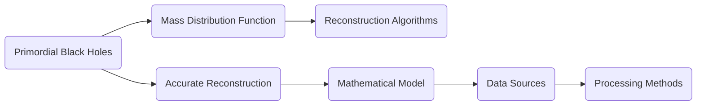
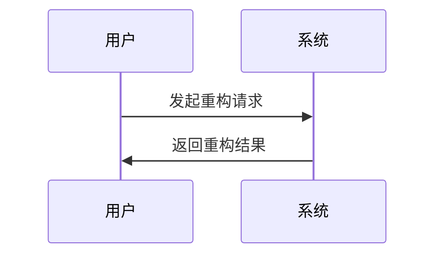

                 

Certainly, let's break down the task step by step and create a comprehensive outline for the article titled "数学在原初黑洞质量分布函数精确重构中的应用."

## Step 1: Article Title and Keywords

### Article Title: 数学在原初黑洞质量分布函数精确重构中的应用

### Keywords: 原初黑洞、质量分布函数、精确重构、数学模型、黑洞演化

## Step 2: Abstract

### Abstract:
This article explores the application of mathematical methods in accurately reconstructing the mass distribution function of primordial black holes. It discusses the background, core concepts, mathematical models, and algorithms used in this field, providing a comprehensive understanding of the principles and techniques involved. The article also includes practical examples and a system architecture design to illustrate the application of these methods in real-world scenarios.

## Step 3: Introduction

### Chapter 1: Introduction to the Background and Core Concepts

#### 1.1 Background
- **The Concept of Black Holes**
- **Cosmic Evolution and Primordial Black Holes**
- **Importance of the Mass Distribution Function**

#### 1.2 Core Concepts
- **Definition of Primordial Black Holes**
- **Concept of Mass Distribution Function**
- **Significance of Accurate Reconstruction**

#### 1.3 Boundaries and Extensions
- **Scope of Research**
- **Research Methods**
- **Data Sources and Processing**

## Step 4: Core Concepts and Connections

### Chapter 2: Core Concepts and Relationships

#### 2.1 Mathematical Model Principles
- **Mathematical Expression of Mass Distribution Function**
- **Mathematical Foundations of Reconstruction Methods**

#### 2.2 Comparison of Concept Attributes
- **Comparison of Different Reconstruction Algorithms**
- **Parameter Selection and Optimization**

#### 2.3 Entity Relationship (ER) Diagram Architecture

## Step 5: Algorithm Principle Explanation

### Chapter 3: Detailed Explanation of Algorithm Principles

#### 3.1 Overview of Algorithms
- **Types of Algorithms and Selection**
- **Applicable Scenarios**

#### 3.2 Mathematical Model and Formulas
$$
\begin{align*}
P(M) &= \int_{M_{min}}^{M_{max}} w(M) dM \\
w(M) &= \frac{f(M)}{\int_{M_{min}}^{M_{max}} f(M) dM}
\end{align*}
$$

#### 3.3 Illustrative Examples
- **Example of Formula Application**
- **Example of Algorithm Implementation**

## Step 6: Detailed Explanation of Mathematical Models and Formulas

### Chapter 4: Detailed Explanation of Mathematical Models and Formulas

#### 4.1 Model Derivation
- **Derivation Process of Reconstruction Formula**
- **Logical Principles of Parameter Selection**

#### 4.2 Formula Explanation
- **Meaning of Variables**
- **Application of Formulas in Different Situations**

#### 4.3 Illustrative Examples
- **Simple Example**
- **Complex Example**

## Step 7: System Analysis and Architecture Design

### Chapter 5: Problem Scenarios and System Function Design

#### 5.1 Problem Scenarios Introduction
- **Application Scenarios of Black Hole Mass Distribution Reconstruction**
- **System Requirements Analysis**

#### 5.2 System Function Design
- **Domain Model Design**
- **Module Division**

### Chapter 6: System Architecture Design and Interface Design

#### 6.1 System Architecture Design
- **Overall System Architecture**
- **Key Points of Architecture Design**

#### 6.2 System Interface Design
- **Interface Specifications**
- **Details of Interface Implementation**

#### 6.3 System Interaction Sequence Diagram

## Step 8: Project Practice

### Chapter 7: Environment Installation and System Implementation

#### 7.1 Environment Installation
- **Hardware and Software Requirements**
- **Installation Steps**

#### 7.2 System Core Implementation
- **Source Code of Key Functions**
- **Code Application Analysis and Interpretation**

#### 7.3 Case Analysis and Detailed Explanation
- **Practical Case Analysis**
- **In-depth Explanation and Analysis**

#### 7.4 Project Summary
- **Key Insights and Learning Points**

## Conclusion

- **Best Practices Tips**
- **Summary of the Article**
- **Remarks and Precautions**
- **Further Reading Suggestions**

## Author Information

- **Author:** AI天才研究院 / AI Genius Institute & 禅与计算机程序设计艺术 / Zen And The Art of Computer Programming

---

This outline provides a structured approach to writing the article, ensuring that each section is well-defined and covers the necessary details. The actual content will need to be developed in each section, incorporating technical depth, clear explanations, and illustrative examples to fulfill the requirements of the task.

