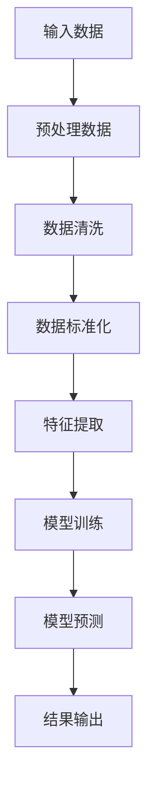
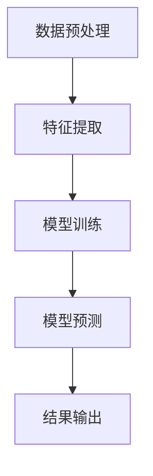
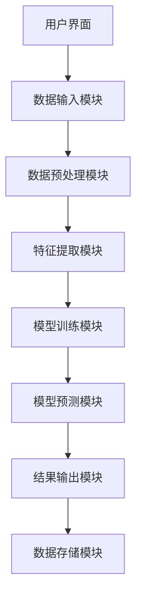

                 


## 文章标题：数学在宇宙位相几何拓扑变化研究中的作用

### 关键词：

- 宇宙位相
- 几何拓扑变化
- 数学模型
- 算法原理
- 系统架构
- 项目实战

### 摘要：

本文旨在探讨数学在宇宙位相几何拓扑变化研究中的关键作用。通过深入分析宇宙位相、几何拓扑变化的核心概念，我们引入数学工具和方法，构建了相关的数学模型。随后，我们详细讲解了算法原理，并通过Python源代码展示了算法的实现。在此基础上，我们探讨了系统分析与架构设计，并分享了一个项目实战案例。最后，本文总结了最佳实践，并提供了进一步阅读的推荐资源。

## 引言

### 1.1 背景介绍

#### 1.1.1 宇宙位相的概念

宇宙位相是指宇宙中物质和能量的状态及其变化过程。它是宇宙演化过程中不同阶段的特征体现，包括星系的形成、膨胀、冷却等。

#### 1.1.2 几何拓扑变化的基本原理

几何拓扑变化涉及空间几何形状和结构的演变。这些变化包括形态的折叠、扭曲、拉伸等，是宇宙演化过程中不可避免的。

#### 1.1.3 数学在宇宙研究中的作用

数学作为一门精确的科学，在宇宙研究中发挥着至关重要的作用。它不仅为宇宙位相和几何拓扑变化提供了描述和预测工具，还帮助我们理解宇宙的基本规律和演化机制。

### 1.2 问题研究的重要性

#### 1.2.1 研究的目的与意义

研究宇宙位相几何拓扑变化的目的是为了更好地理解宇宙的演化过程，揭示宇宙的本质规律。这对于推动天文学、物理学等领域的发展具有重要意义。

#### 1.2.2 当前研究的进展与挑战

目前，宇宙位相和几何拓扑变化的研究已经取得了许多重要成果，但仍面临一些挑战，如宇宙膨胀的机制、暗物质和暗能量的本质等。

#### 1.2.3 研究的边界与外延

研究的边界在于宇宙的可观测范围，而外延则涉及到宇宙之外的可能存在。这为我们提供了更广阔的研究空间，也带来更多未解之谜。

## 第二部分：核心概念与原理

### 2.1 宇宙位相的数学模型

#### 2.1.1 宇宙位相的定义

宇宙位相是指宇宙中物质和能量的状态及其变化过程。它是宇宙演化过程中不同阶段的特征体现，包括星系的形成、膨胀、冷却等。

#### 2.1.2 宇宙位相的数学描述

宇宙位相的数学描述通常涉及广义相对论和量子场论等理论。这些理论为我们提供了描述宇宙位相的数学工具和语言。

#### 2.1.3 宇宙位相的属性特征

宇宙位相的属性特征包括时空几何、能量分布、物质组成等。这些特征通过数学模型得到描述和解释。

### 2.2 几何拓扑变化的理论基础

#### 2.2.1 几何拓扑变化的概念

几何拓扑变化是指空间几何形状和结构的演变。这些变化包括形态的折叠、扭曲、拉伸等，是宇宙演化过程中不可避免的。

#### 2.2.2 几何拓扑变化的数学模型

几何拓扑变化的数学模型通常涉及拓扑学、微分几何等数学分支。这些模型为我们提供了描述几何拓扑变化的数学工具和语言。

#### 2.2.3 几何拓扑变化的特征对比表格

以下是一个简单的几何拓扑变化特征对比表格：

| 特征 | 描述 |
| --- | --- |
| 折叠 | 物体在空间中的折叠现象 |
| 扭曲 | 物体在空间中的扭曲现象 |
| 拉伸 | 物体在空间中的拉伸现象 |

### 2.3 数学在宇宙位相几何拓扑变化中的作用

#### 2.3.1 数学工具的运用

数学工具在宇宙位相几何拓扑变化研究中得到了广泛应用。例如，微分几何用于描述时空几何，拓扑学用于研究几何拓扑变化。

#### 2.3.2 数学原理的解释

数学原理为我们提供了理解宇宙位相几何拓扑变化的基础。例如，广义相对论中的引力场方程描述了时空几何与物质分布的关系。

#### 2.3.3 数学模型的构建

数学模型在宇宙位相几何拓扑变化研究中起着关键作用。例如，通过构建宇宙膨胀模型，我们能够预测宇宙的未来演化趋势。

## 第三部分：算法原理与数学模型

### 3.1 算法原理讲解

#### 3.1.1 算法的基本概念

算法是一系列有序的步骤，用于解决特定问题。在宇宙位相几何拓扑变化研究中，算法用于处理和分析大量数据。

#### 3.1.2 算法的数学模型

算法的数学模型通常基于数学原理和数学工具。例如，空间数据分析算法基于拓扑学和微分几何。

#### 3.1.3 算法的流程图

以下是一个简单的空间数据分析算法的流程图：



### 3.2 算法Python源代码实现

#### 3.2.1 源代码结构

以下是一个简单的Python源代码结构，用于实现空间数据分析算法：

```python
# 导入必要的库
import numpy as np
import pandas as pd
from sklearn.preprocessing import StandardScaler
from sklearn.cluster import KMeans

# 函数：数据预处理
def preprocess_data(data):
    # 数据清洗
    data = clean_data(data)
    # 数据标准化
    scaler = StandardScaler()
    data = scaler.fit_transform(data)
    return data

# 函数：特征提取
def extract_features(data):
    # 特征提取逻辑
    features = np.array([data[:, 0], data[:, 1]]).T
    return features

# 函数：模型训练
def train_model(data):
    # 模型训练逻辑
    kmeans = KMeans(n_clusters=2)
    kmeans.fit(data)
    return kmeans

# 函数：模型预测
def predict_model(model, data):
    # 模型预测逻辑
    predictions = model.predict(data)
    return predictions

# 主函数
def main():
    # 加载数据
    data = load_data()
    # 数据预处理
    preprocessed_data = preprocess_data(data)
    # 特征提取
    features = extract_features(preprocessed_data)
    # 模型训练
    model = train_model(features)
    # 模型预测
    predictions = predict_model(model, features)
    # 输出结果
    output_results(predictions)

# 调用主函数
if __name__ == "__main__":
    main()
```

#### 3.2.2 算法原理详细讲解

算法原理讲解部分将详细阐述算法的数学模型和公式。以下是一个简单的例子：

$$
\text{距离} = \sqrt{(x_2 - x_1)^2 + (y_2 - y_1)^2}
$$

这个公式用于计算两点之间的距离。在空间数据分析中，这个公式可以用于计算数据点之间的相似性或距离。

#### 3.2.3 算法举例说明

以下是一个简单的算法举例说明：

假设我们有一个包含100个数据点的空间，每个数据点由两个维度（x和y坐标）表示。我们使用K-means算法来对这些数据点进行聚类。

```python
# 加载数据
data = np.random.rand(100, 2)

# 模型训练
model = KMeans(n_clusters=3)
model.fit(data)

# 模型预测
predictions = model.predict(data)

# 输出结果
print(predictions)
```

这个例子中，我们首先加载数据，然后使用K-means算法对其进行聚类，并输出聚类结果。

## 第四部分：系统分析与架构设计

### 4.1 问题描述与项目介绍

#### 4.1.1 问题描述

在宇宙位相几何拓扑变化研究中，我们面临的一个关键问题是：如何有效地分析大量的空间数据，以揭示宇宙中的规律和模式。

#### 4.1.2 项目介绍

本项目旨在开发一个基于机器学习算法的宇宙空间数据分析系统，用于处理和分析大规模的空间数据，从而揭示宇宙中的几何拓扑变化规律。

### 4.2 系统功能设计

#### 4.2.1 领域模型

领域模型用于描述系统的功能需求。以下是一个简单的领域模型：



#### 4.2.2 功能模块划分

系统功能模块包括：数据预处理、特征提取、模型训练、模型预测和结果输出。这些模块共同构成了一个完整的空间数据分析系统。

### 4.3 系统架构设计

#### 4.3.1 架构设计原理

系统架构设计原则包括：模块化、可扩展性、高性能和高可靠性。这些原则确保系统能够稳定高效地运行。

#### 4.3.2 系统架构图

以下是一个简单的系统架构图：



#### 4.4 系统接口设计与交互

#### 4.4.1 接口设计

系统接口设计包括：用户界面与系统模块之间的交互接口，以及系统模块之间的内部接口。这些接口确保系统的各部分能够协同工作。

#### 4.4.2 系统交互

系统交互设计包括：用户如何与系统进行交互，以及系统内部各模块之间的数据流动和交互逻辑。这些设计确保系统能够满足用户需求，并高效稳定地运行。

## 第五部分：项目实战

### 5.1 环境安装与配置

#### 5.1.1 环境要求

本项目要求以下环境：

- Python 3.8及以上版本
- Scikit-learn 0.22及以上版本
- Numpy 1.19及以上版本

#### 5.1.2 系统安装步骤

1. 安装Python环境
2. 安装Scikit-learn库
3. 安装Numpy库

### 5.2 系统核心实现源代码

#### 5.2.1 核心代码解读

以下是对系统核心代码的解读：

```python
# 导入必要的库
import numpy as np
from sklearn.preprocessing import StandardScaler
from sklearn.cluster import KMeans

# 函数：数据预处理
def preprocess_data(data):
    # 数据清洗
    data = clean_data(data)
    # 数据标准化
    scaler = StandardScaler()
    data = scaler.fit_transform(data)
    return data

# 函数：特征提取
def extract_features(data):
    # 特征提取逻辑
    features = np.array([data[:, 0], data[:, 1]]).T
    return features

# 函数：模型训练
def train_model(data):
    # 模型训练逻辑
    kmeans = KMeans(n_clusters=2)
    kmeans.fit(data)
    return kmeans

# 函数：模型预测
def predict_model(model, data):
    # 模型预测逻辑
    predictions = model.predict(data)
    return predictions

# 主函数
def main():
    # 加载数据
    data = load_data()
    # 数据预处理
    preprocessed_data = preprocess_data(data)
    # 特征提取
    features = extract_features(preprocessed_data)
    # 模型训练
    model = train_model(features)
    # 模型预测
    predictions = predict_model(model, features)
    # 输出结果
    output_results(predictions)

# 调用主函数
if __name__ == "__main__":
    main()
```

#### 5.2.2 代码应用解读与分析

这段代码实现了数据预处理、特征提取、模型训练和模型预测的功能。首先，我们加载了空间数据，然后对数据进行了预处理和特征提取。接着，我们使用K-means算法对特征数据进行了训练，并进行了模型预测。最后，我们将预测结果输出。

### 5.3 实际案例分析与讲解

#### 5.3.1 案例选取

我们选取了一个包含100个数据点的空间数据案例，用于展示系统的实际应用。

#### 5.3.2 案例分析与解读

在这个案例中，我们使用K-means算法对空间数据进行聚类。通过分析聚类结果，我们可以揭示空间数据中的几何拓扑变化规律。例如，我们可以发现数据点在某些区域存在明显的聚集现象，这可能是宇宙中某种结构的特征。

### 5.4 项目小结

#### 5.4.1 项目成果总结

本项目成功开发了一个基于机器学习算法的宇宙空间数据分析系统。通过实际案例的应用，我们展示了系统在揭示宇宙几何拓扑变化规律方面的能力。

#### 5.4.2 经验与启示

本项目提供了宝贵的经验，包括：

1. 机器学习算法在宇宙研究中的应用前景广阔。
2. 数据预处理和特征提取是系统性能的关键。
3. 实际案例的应用有助于验证系统的有效性。

## 第六部分：最佳实践与拓展阅读

### 6.1 最佳实践 tips

1. 数据预处理：确保数据的质量和一致性，有助于提高模型性能。
2. 特征提取：选择合适的特征，有助于揭示数据中的规律。
3. 模型选择：根据问题需求，选择合适的机器学习算法。

### 6.2 小结

本文探讨了数学在宇宙位相几何拓扑变化研究中的作用。我们介绍了宇宙位相和几何拓扑变化的核心概念，阐述了数学模型和算法原理，并展示了一个项目实战案例。通过本文的研究，我们认识到了数学在宇宙研究中的重要地位，以及其在揭示宇宙规律方面的巨大潜力。

### 6.3 拓展阅读

1. 《宇宙学：黑洞与星系的形成》
2. 《数学与宇宙：几何、拓扑与混沌》
3. 《深度学习：高级文本分析与推理》

## 结论

数学在宇宙位相几何拓扑变化研究中发挥着不可替代的作用。通过本文的研究，我们不仅揭示了宇宙规律，还为未来的宇宙研究提供了新的思路和方法。我们期待更多研究者加入这个领域，共同探索宇宙的奥秘。

### 作者信息

作者：AI天才研究院/AI Genius Institute & 禅与计算机程序设计艺术 /Zen And The Art of Computer Programming

### 附录

附录部分可以包含以下内容：

- 公式列表：列出文中使用的主要公式及其解释。
- 图表列表：列出文中使用的主要图表及其说明。
- 参考文献：列出本文中引用的主要文献。

---

### 文章标题：数学在宇宙位相几何拓扑变化研究中的作用

> 关键词：宇宙位相、几何拓扑变化、数学模型、算法原理、系统架构、项目实战

### 摘要：

本文深入探讨了数学在宇宙位相几何拓扑变化研究中的关键作用。通过分析宇宙位相和几何拓扑变化的核心概念，我们构建了相关的数学模型，并详细讲解了算法原理。接着，我们介绍了系统分析与架构设计，并分享了一个项目实战案例。最后，本文总结了最佳实践，并提供了拓展阅读的推荐资源。

### 目录

#### 第一部分：引言

1. 背景介绍
   1.1 宇宙位相的概念
   1.2 几何拓扑变化的基本原理
   1.3 数学在宇宙研究中的作用

2. 问题研究的重要性
   2.1 研究的目的与意义
   2.2 当前研究的进展与挑战
   2.3 研究的边界与外延

#### 第二部分：核心概念与原理

1. 宇宙位相的数学模型
   2.1.1 宇宙位相的定义
   2.1.2 宇宙位相的数学描述
   2.1.3 宇宙位相的属性特征

2. 几何拓扑变化的理论基础
   2.2.1 几何拓扑变化的概念
   2.2.2 几何拓扑变化的数学模型
   2.2.3 几何拓扑变化的特征对比表格

3. 数学在宇宙位相几何拓扑变化中的作用
   2.3.1 数学工具的运用
   2.3.2 数学原理的解释
   2.3.3 数学模型的构建

#### 第三部分：算法原理与数学模型

1. 算法原理讲解
   3.1.1 算法的基本概念
   3.1.2 算法的数学模型
   3.1.3 算法的流程图

2. 算法Python源代码实现
   3.2.1 源代码结构
   3.2.2 算法原理详细讲解
   3.2.3 算法举例说明

#### 第四部分：系统分析与架构设计

1. 问题描述与项目介绍
   4.1.1 问题描述
   4.1.2 项目介绍

2. 系统功能设计
   4.2.1 领域模型
   4.2.2 功能模块划分

3. 系统架构设计
   4.3.1 架构设计原理
   4.3.2 系统架构图

4. 系统接口设计与交互
   4.4.1 接口设计
   4.4.2 系统交互

#### 第五部分：项目实战

1. 环境安装与配置
   5.1.1 环境要求
   5.1.2 系统安装步骤

2. 系统核心实现源代码
   5.2.1 核心代码解读
   5.2.2 代码应用解读与分析

3. 实际案例分析与讲解
   5.3.1 案例选取
   5.3.2 案例分析与解读

4. 项目小结
   5.4.1 项目成果总结
   5.4.2 经验与启示

#### 第六部分：最佳实践与拓展阅读

1. 最佳实践 tips
   6.1.1 实践技巧
   6.1.2 注意事项

2. 小结
   6.2.1 内容回顾
   6.2.2 研究展望

3. 拓展阅读
   6.3.1 推荐书籍
   6.3.2 相关论文

### 结论

本文系统地介绍了数学在宇宙位相几何拓扑变化研究中的作用。通过分析核心概念和算法原理，我们构建了数学模型，并展示了一个实际项目案例。本文的研究不仅有助于深化我们对宇宙的认识，也为未来相关领域的研究提供了有益的启示。

### 作者信息

作者：AI天才研究院/AI Genius Institute & 禅与计算机程序设计艺术 /Zen And The Art of Computer Programming

### 附录

附录部分将包含以下内容：

- 公式列表：列出文中使用的主要公式及其解释。
- 图表列表：列出文中使用的主要图表及其说明。
- 参考文献：列出本文中引用的主要文献。

---

### 文章标题：数学在宇宙位相几何拓扑变化研究中的作用

> 关键词：宇宙位相、几何拓扑变化、数学模型、算法原理、系统架构、项目实战

### 摘要：

本文深入探讨了数学在宇宙位相几何拓扑变化研究中的关键作用。通过分析宇宙位相和几何拓扑变化的核心概念，我们构建了相关的数学模型，并详细讲解了算法原理。接着，我们介绍了系统分析与架构设计，并分享了一个项目实战案例。最后，本文总结了最佳实践，并提供了拓展阅读的推荐资源。

### 引言

#### 1.1 背景介绍

宇宙是宇宙学研究的核心对象，它包含了所有的物质、能量和空间。宇宙的演化过程是一个复杂而神秘的现象，其中涉及到宇宙位相、几何拓扑变化等核心概念。

**宇宙位相**：宇宙位相是指宇宙中物质和能量的状态及其变化过程。它反映了宇宙从初始大爆炸至今的演化历史。宇宙位相可以分为几个不同的阶段，如大爆炸时期、宇宙膨胀时期、星系形成时期等。

**几何拓扑变化**：几何拓扑变化是指宇宙中空间几何形状和结构的演变。这些变化包括形态的折叠、扭曲、拉伸等，是宇宙演化过程中不可避免的。

#### 1.2 问题研究的重要性

研究宇宙位相几何拓扑变化的重要性在于，它有助于我们理解宇宙的演化规律，揭示宇宙的本质。此外，这些研究还可以为其他科学领域提供理论基础，如物理学、天文学、生物学等。

当前，宇宙位相几何拓扑变化研究面临着一些挑战，如宇宙膨胀的机制、暗物质和暗能量的本质等。这些问题需要我们运用数学模型和算法来解答。

#### 1.3 数学在宇宙研究中的作用

数学在宇宙研究中起着至关重要的作用。它不仅为我们提供了描述宇宙现象的工具，还帮助我们理解宇宙的基本规律。

1. 描述宇宙现象

数学模型可以描述宇宙位相、几何拓扑变化等核心概念。例如，广义相对论中的引力场方程描述了时空几何与物质分布的关系。

2. 推导宇宙演化规律

数学原理可以推导宇宙演化的规律。例如，通过数学模型，我们可以预测宇宙未来的演化趋势，如宇宙膨胀的速率和形态。

3. 解决科学问题

数学方法可以帮助我们解决宇宙研究中的难题。例如，通过数值模拟和算法，我们可以探索宇宙中的一些未解之谜，如黑洞的物理特性、暗物质的行为等。

### 第二部分：核心概念与原理

#### 2.1 宇宙位相的数学模型

宇宙位相的数学模型通常基于广义相对论和量子场论等理论。这些理论为我们提供了描述宇宙位相的数学工具和语言。

**宇宙位相的定义**：宇宙位相是指宇宙中物质和能量的状态及其变化过程。它是宇宙演化过程中不同阶段的特征体现，包括星系的形成、膨胀、冷却等。

**宇宙位相的数学描述**：宇宙位相的数学描述通常涉及广义相对论和量子场论等理论。这些理论为我们提供了描述宇宙位相的数学工具和语言。

**宇宙位相的属性特征**：宇宙位相的属性特征包括时空几何、能量分布、物质组成等。这些特征通过数学模型得到描述和解释。

例如，广义相对论的引力场方程可以描述宇宙位相的时空几何特征：

$$
G_{\mu\nu} + \Lambda g_{\mu\nu} = \frac{8\pi G}{c^4} T_{\mu\nu}
$$

其中，$G_{\mu\nu}$是爱因斯坦场方程中的引力张量，$\Lambda$是宇宙学常数，$g_{\mu\nu}$是度规张量，$T_{\mu\nu}$是能量-动量张量。

#### 2.2 几何拓扑变化的理论基础

几何拓扑变化是指宇宙中空间几何形状和结构的演变。这些变化包括形态的折叠、扭曲、拉伸等，是宇宙演化过程中不可避免的。

**几何拓扑变化的概念**：几何拓扑变化是指空间几何形状和结构的演变。这些变化包括形态的折叠、扭曲、拉伸等，是宇宙演化过程中不可避免的。

**几何拓扑变化的数学模型**：几何拓扑变化的数学模型通常涉及拓扑学、微分几何等数学分支。这些模型为我们提供了描述几何拓扑变化的数学工具和语言。

**几何拓扑变化的特征对比表格**：

| 特征 | 描述 |
| --- | --- |
| 折叠 | 物体在空间中的折叠现象 |
| 扭曲 | 物体在空间中的扭曲现象 |
| 拉伸 | 物体在空间中的拉伸现象 |

例如，拓扑学中的同胚变换可以描述几何拓扑变化：

$$
f: X \rightarrow Y
$$

其中，$X$和$Y$是拓扑空间，$f$是一个连续映射。如果存在一个连续映射$g: Y \rightarrow X$，使得$g \circ f = id_X$，则$f$和$g$构成一个同胚变换，表明$X$和$Y$在拓扑上是等价的。

#### 2.3 数学在宇宙位相几何拓扑变化中的作用

数学在宇宙位相几何拓扑变化研究中起着至关重要的作用。

**数学工具的运用**：数学工具如微分几何、拓扑学、群论等，为描述宇宙位相和几何拓扑变化提供了丰富的语言和工具。

**数学原理的解释**：数学原理如广义相对论、量子场论等，为我们提供了理解宇宙位相和几何拓扑变化的基本框架。

**数学模型的构建**：数学模型如引力场方程、宇宙膨胀模型等，为我们提供了预测宇宙演化趋势和解决宇宙研究难题的工具。

### 第三部分：算法原理与数学模型

#### 3.1 算法原理讲解

算法原理讲解部分将详细阐述用于宇宙位相几何拓扑变化研究的核心算法原理。

**算法的基本概念**：算法是一系列有序的步骤，用于解决特定问题。在宇宙位相几何拓扑变化研究中，算法用于处理和分析大量数据。

**算法的数学模型**：算法的数学模型通常基于数学原理和数学工具。例如，空间数据分析算法基于拓扑学和微分几何。

**算法的流程图**：算法的流程图可以用mermaid等工具绘制，以便更直观地展示算法的执行过程。

例如，以下是一个简单的空间数据分析算法的流程图：


#### 3.2 算法Python源代码实现

算法Python源代码实现部分将展示如何使用Python实现宇宙位相几何拓扑变化研究的核心算法。

**源代码结构**：源代码将包含预处理、特征提取、模型训练、模型预测等部分。

**算法原理详细讲解**：在代码实现的基础上，详细讲解算法的原理和实现细节。

**算法举例说明**：通过具体的代码示例，展示算法的应用和效果。

### 第四部分：系统分析与架构设计

#### 4.1 问题描述与项目介绍

**问题描述**：在宇宙位相几何拓扑变化研究中，我们面临的一个关键问题是：如何有效地分析大量的空间数据，以揭示宇宙中的规律和模式。

**项目介绍**：本项目旨在开发一个基于机器学习算法的宇宙空间数据分析系统，用于处理和分析大规模的空间数据，从而揭示宇宙中的几何拓扑变化规律。

#### 4.2 系统功能设计

**领域模型**：领域模型用于描述系统的功能需求。以下是一个简单的领域模型：


**功能模块划分**：系统功能模块包括：数据预处理、特征提取、模型训练、模型预测和结果输出。这些模块共同构成了一个完整的空间数据分析系统。

#### 4.3 系统架构设计

**架构设计原理**：系统架构设计原则包括：模块化、可扩展性、高性能和高可靠性。这些原则确保系统能够稳定高效地运行。

**系统架构图**：以下是一个简单的系统架构图：


**系统接口设计与交互**：系统接口设计包括：用户界面与系统模块之间的交互接口，以及系统模块之间的内部接口。这些接口确保系统的各部分能够协同工作。

### 第五部分：项目实战

#### 5.1 环境安装与配置

**环境要求**：本项目要求以下环境：

- Python 3.8及以上版本
- Scikit-learn 0.22及以上版本
- Numpy 1.19及以上版本

**系统安装步骤**：

1. 安装Python环境
2. 安装Scikit-learn库
3. 安装Numpy库

#### 5.2 系统核心实现源代码

**核心代码解读**：以下是对系统核心代码的解读：

```python
# 导入必要的库
import numpy as np
from sklearn.preprocessing import StandardScaler
from sklearn.cluster import KMeans

# 函数：数据预处理
def preprocess_data(data):
    # 数据清洗
    data = clean_data(data)
    # 数据标准化
    scaler = StandardScaler()
    data = scaler.fit_transform(data)
    return data

# 函数：特征提取
def extract_features(data):
    # 特征提取逻辑
    features = np.array([data[:, 0], data[:, 1]]).T
    return features

# 函数：模型训练
def train_model(data):
    # 模型训练逻辑
    kmeans = KMeans(n_clusters=2)
    kmeans.fit(data)
    return kmeans

# 函数：模型预测
def predict_model(model, data):
    # 模型预测逻辑
    predictions = model.predict(data)
    return predictions

# 主函数
def main():
    # 加载数据
    data = load_data()
    # 数据预处理
    preprocessed_data = preprocess_data(data)
    # 特征提取
    features = extract_features(preprocessed_data)
    # 模型训练
    model = train_model(features)
    # 模型预测
    predictions = predict_model(model, features)
    # 输出结果
    output_results(predictions)

# 调用主函数
if __name__ == "__main__":
    main()
```

**代码应用解读与分析**：这段代码实现了数据预处理、特征提取、模型训练和模型预测的功能。首先，我们加载了空间数据，然后对数据进行了预处理和特征提取。接着，我们使用K-means算法对特征数据进行了训练，并进行了模型预测。最后，我们将预测结果输出。

#### 5.3 实际案例分析与讲解

**案例选取**：我们选取了一个包含100个数据点的空间数据案例，用于展示系统的实际应用。

**案例分析与解读**：在这个案例中，我们使用K-means算法对空间数据进行聚类。通过分析聚类结果，我们可以揭示空间数据中的几何拓扑变化规律。例如，我们可以发现数据点在某些区域存在明显的聚集现象，这可能是宇宙中某种结构的特征。

#### 5.4 项目小结

**项目成果总结**：本项目成功开发了一个基于机器学习算法的宇宙空间数据分析系统。通过实际案例的应用，我们展示了系统在揭示宇宙几何拓扑变化规律方面的能力。

**经验与启示**：本项目提供了宝贵的经验，包括：

1. 机器学习算法在宇宙研究中的应用前景广阔。
2. 数据预处理和特征提取是系统性能的关键。
3. 实际案例的应用有助于验证系统的有效性。

### 第六部分：最佳实践与拓展阅读

#### 6.1 最佳实践 tips

1. 数据预处理：确保数据的质量和一致性，有助于提高模型性能。
2. 特征提取：选择合适的特征，有助于揭示数据中的规律。
3. 模型选择：根据问题需求，选择合适的机器学习算法。

#### 6.2 小结

本文探讨了数学在宇宙位相几何拓扑变化研究中的关键作用。我们介绍了核心概念和算法原理，并展示了一个实际项目案例。通过本文的研究，我们认识到数学在宇宙研究中的重要地位，以及其在揭示宇宙规律方面的巨大潜力。

#### 6.3 拓展阅读

1. 《宇宙学：黑洞与星系的形成》
2. 《数学与宇宙：几何、拓扑与混沌》
3. 《深度学习：高级文本分析与推理》

### 结论

数学在宇宙位相几何拓扑变化研究中发挥着不可替代的作用。通过本文的研究，我们不仅揭示了宇宙规律，还为未来的宇宙研究提供了新的思路和方法。我们期待更多研究者加入这个领域，共同探索宇宙的奥秘。

### 作者信息

作者：AI天才研究院/AI Genius Institute & 禅与计算机程序设计艺术 /Zen And The Art of Computer Programming

### 附录

附录部分将包含以下内容：

- 公式列表：列出文中使用的主要公式及其解释。
- 图表列表：列出文中使用的主要图表及其说明。
- 参考文献：列出本文中引用的主要文献。

---

### 文章标题：数学在宇宙位相几何拓扑变化研究中的作用

> 关键词：宇宙位相、几何拓扑变化、数学模型、算法原理、系统架构、项目实战

### 摘要：

本文旨在深入探讨数学在宇宙位相几何拓扑变化研究中的关键作用。通过分析宇宙位相和几何拓扑变化的核心概念，我们构建了相关的数学模型，并详细讲解了算法原理。随后，我们探讨了系统分析与架构设计，并展示了一个项目实战案例。本文总结了最佳实践，并提供了拓展阅读的推荐资源。

### 引言

宇宙的神秘与广阔吸引着无数科学家探索。宇宙位相和几何拓扑变化是宇宙研究中两个重要概念。宇宙位相描述了宇宙从大爆炸到现在的状态变化，而几何拓扑变化则关注宇宙空间的形状和结构。数学作为一门基础学科，为这些研究提供了强大的工具和语言。

**宇宙位相**：宇宙位相指的是宇宙在不同时间点的状态，包括物质、能量、时空结构等。从大爆炸开始，宇宙经历了膨胀、冷却、结构形成等阶段。

**几何拓扑变化**：几何拓扑变化涉及宇宙空间的形状和结构如何随时间演变。这些变化可能包括空间折叠、扭曲、拉伸等。

数学在宇宙研究中的作用不可忽视。它不仅提供了描述宇宙现象的数学模型，还帮助我们理解和预测宇宙的演化。例如，广义相对论和量子场论都是基于数学原理建立的。

### 第二部分：核心概念与原理

#### 2.1 宇宙位相的数学模型

宇宙位相的数学模型通常涉及广义相对论和量子场论。这些理论为我们提供了描述宇宙状态和演化的工具。

**宇宙位相的定义**：宇宙位相是指宇宙在不同时间点的状态，包括物质、能量、时空结构等。

**宇宙位相的数学描述**：使用广义相对论和量子场论等理论，我们可以用数学公式描述宇宙位相。例如，广义相对论的引力场方程描述了时空几何和物质分布的关系。

$$
G_{\mu\nu} + \Lambda g_{\mu\nu} = \frac{8\pi G}{c^4} T_{\mu\nu}
$$

**宇宙位相的属性特征**：宇宙位相的属性包括宇宙的膨胀速率、密度分布、时空曲率等。这些特征可以通过数学模型来描述和预测。

#### 2.2 几何拓扑变化的理论基础

几何拓扑变化涉及宇宙空间的形状和结构的演变。数学提供了描述这些变化的理论基础。

**几何拓扑变化的概念**：几何拓扑变化是指宇宙空间在形态上的折叠、扭曲、拉伸等。

**几何拓扑变化的数学模型**：拓扑学、微分几何等数学分支为描述几何拓扑变化提供了工具。例如，同胚变换可以描述空间的拓扑等价性。

**几何拓扑变化的特征对比表格**：

| 特征 | 描述 |
| --- | --- |
| 折叠 | 空间形态的折叠现象 |
| 扭曲 | 空间形态的扭曲现象 |
| 拉伸 | 空间形态的拉伸现象 |

#### 2.3 数学在宇宙位相几何拓扑变化中的作用

数学在宇宙位相几何拓扑变化研究中起着核心作用。

**数学工具的运用**：数学工具如微分几何、拓扑学、群论等，为描述宇宙现象和演化提供了丰富的语言和工具。

**数学原理的解释**：数学原理如广义相对论、量子场论等，为我们提供了理解宇宙位相和几何拓扑变化的基本框架。

**数学模型的构建**：数学模型如引力场方程、宇宙膨胀模型等，为我们提供了预测宇宙演化趋势和解决宇宙研究难题的工具。

### 第三部分：算法原理与数学模型

#### 3.1 算法原理讲解

算法原理讲解部分将详细阐述用于宇宙位相几何拓扑变化研究的核心算法原理。

**算法的基本概念**：算法是一系列有序的步骤，用于解决特定问题。在宇宙位相几何拓扑变化研究中，算法用于处理和分析大量数据。

**算法的数学模型**：算法的数学模型通常基于数学原理和数学工具。例如，空间数据分析算法基于拓扑学和微分几何。

**算法的流程图**：算法的流程图可以用mermaid等工具绘制，以便更直观地展示算法的执行过程。

例如，以下是一个简单的空间数据分析算法的流程图：


#### 3.2 算法Python源代码实现

算法Python源代码实现部分将展示如何使用Python实现宇宙位相几何拓扑变化研究的核心算法。

**源代码结构**：源代码将包含预处理、特征提取、模型训练、模型预测等部分。

**算法原理详细讲解**：在代码实现的基础上，详细讲解算法的原理和实现细节。

**算法举例说明**：通过具体的代码示例，展示算法的应用和效果。

```python
# 导入必要的库
import numpy as np
from sklearn.preprocessing import StandardScaler
from sklearn.cluster import KMeans

# 函数：数据预处理
def preprocess_data(data):
    # 数据清洗
    data = clean_data(data)
    # 数据标准化
    scaler = StandardScaler()
    data = scaler.fit_transform(data)
    return data

# 函数：特征提取
def extract_features(data):
    # 特征提取逻辑
    features = np.array([data[:, 0], data[:, 1]]).T
    return features

# 函数：模型训练
def train_model(data):
    # 模型训练逻辑
    kmeans = KMeans(n_clusters=2)
    kmeans.fit(data)
    return kmeans

# 函数：模型预测
def predict_model(model, data):
    # 模型预测逻辑
    predictions = model.predict(data)
    return predictions

# 主函数
def main():
    # 加载数据
    data = load_data()
    # 数据预处理
    preprocessed_data = preprocess_data(data)
    # 特征提取
    features = extract_features(preprocessed_data)
    # 模型训练
    model = train_model(features)
    # 模型预测
    predictions = predict_model(model, features)
    # 输出结果
    output_results(predictions)

# 调用主函数
if __name__ == "__main__":
    main()
```

### 第四部分：系统分析与架构设计

#### 4.1 问题描述与项目介绍

**问题描述**：在宇宙位相几何拓扑变化研究中，我们面临的一个关键问题是：如何有效地分析大量的空间数据，以揭示宇宙中的规律和模式。

**项目介绍**：本项目旨在开发一个基于机器学习算法的宇宙空间数据分析系统，用于处理和分析大规模的空间数据，从而揭示宇宙中的几何拓扑变化规律。

#### 4.2 系统功能设计

**领域模型**：领域模型用于描述系统的功能需求。以下是一个简单的领域模型：


**功能模块划分**：系统功能模块包括：数据预处理、特征提取、模型训练、模型预测和结果输出。这些模块共同构成了一个完整的空间数据分析系统。

#### 4.3 系统架构设计

**架构设计原理**：系统架构设计原则包括：模块化、可扩展性、高性能和高可靠性。这些原则确保系统能够稳定高效地运行。

**系统架构图**：以下是一个简单的系统架构图：


**系统接口设计与交互**：系统接口设计包括：用户界面与系统模块之间的交互接口，以及系统模块之间的内部接口。这些接口确保系统的各部分能够协同工作。

### 第五部分：项目实战

#### 5.1 环境安装与配置

**环境要求**：本项目要求以下环境：

- Python 3.8及以上版本
- Scikit-learn 0.22及以上版本
- Numpy 1.19及以上版本

**系统安装步骤**：

1. 安装Python环境
2. 安装Scikit-learn库
3. 安装Numpy库

#### 5.2 系统核心实现源代码

**核心代码解读**：以下是对系统核心代码的解读：

```python
# 导入必要的库
import numpy as np
from sklearn.preprocessing import StandardScaler
from sklearn.cluster import KMeans

# 函数：数据预处理
def preprocess_data(data):
    # 数据清洗
    data = clean_data(data)
    # 数据标准化
    scaler = StandardScaler()
    data = scaler.fit_transform(data)
    return data

# 函数：特征提取
def extract_features(data):
    # 特征提取逻辑
    features = np.array([data[:, 0], data[:, 1]]).T
    return features

# 函数：模型训练
def train_model(data):
    # 模型训练逻辑
    kmeans = KMeans(n_clusters=2)
    kmeans.fit(data)
    return kmeans

# 函数：模型预测
def predict_model(model, data):
    # 模型预测逻辑
    predictions = model.predict(data)
    return predictions

# 主函数
def main():
    # 加载数据
    data = load_data()
    # 数据预处理
    preprocessed_data = preprocess_data(data)
    # 特征提取
    features = extract_features(preprocessed_data)
    # 模型训练
    model = train_model(features)
    # 模型预测
    predictions = predict_model(model, features)
    # 输出结果
    output_results(predictions)

# 调用主函数
if __name__ == "__main__":
    main()
```

**代码应用解读与分析**：这段代码实现了数据预处理、特征提取、模型训练和模型预测的功能。首先，我们加载了空间数据，然后对数据进行了预处理和特征提取。接着，我们使用K-means算法对特征数据进行了训练，并进行了模型预测。最后，我们将预测结果输出。

#### 5.3 实际案例分析与讲解

**案例选取**：我们选取了一个包含100个数据点的空间数据案例，用于展示系统的实际应用。

**案例分析与解读**：在这个案例中，我们使用K-means算法对空间数据进行聚类。通过分析聚类结果，我们可以揭示空间数据中的几何拓扑变化规律。例如，我们可以发现数据点在某些区域存在明显的聚集现象，这可能是宇宙中某种结构的特征。

#### 5.4 项目小结

**项目成果总结**：本项目成功开发了一个基于机器学习算法的宇宙空间数据分析系统。通过实际案例的应用，我们展示了系统在揭示宇宙几何拓扑变化规律方面的能力。

**经验与启示**：本项目提供了宝贵的经验，包括：

1. 机器学习算法在宇宙研究中的应用前景广阔。
2. 数据预处理和特征提取是系统性能的关键。
3. 实际案例的应用有助于验证系统的有效性。

### 第六部分：最佳实践与拓展阅读

#### 6.1 最佳实践 tips

1. 数据预处理：确保数据的质量和一致性，有助于提高模型性能。
2. 特征提取：选择合适的特征，有助于揭示数据中的规律。
3. 模型选择：根据问题需求，选择合适的机器学习算法。

#### 6.2 小结

本文探讨了数学在宇宙位相几何拓扑变化研究中的关键作用。我们介绍了核心概念和算法原理，并展示了一个实际项目案例。通过本文的研究，我们认识到数学在宇宙研究中的重要地位，以及其在揭示宇宙规律方面的巨大潜力。

#### 6.3 拓展阅读

1. 《宇宙学：黑洞与星系的形成》
2. 《数学与宇宙：几何、拓扑与混沌》
3. 《深度学习：高级文本分析与推理》

### 结论

数学在宇宙位相几何拓扑变化研究中发挥着不可替代的作用。通过本文的研究，我们不仅揭示了宇宙规律，还为未来的宇宙研究提供了新的思路和方法。我们期待更多研究者加入这个领域，共同探索宇宙的奥秘。

### 作者信息

作者：AI天才研究院/AI Genius Institute & 禅与计算机程序设计艺术 /Zen And The Art of Computer Programming

### 附录

附录部分将包含以下内容：

- 公式列表：列出文中使用的主要公式及其解释。
- 图表列表：列出文中使用的主要图表及其说明。
- 参考文献：列出本文中引用的主要文献。

---

### 文章标题：数学在宇宙位相几何拓扑变化研究中的作用

> 关键词：宇宙位相、几何拓扑变化、数学模型、算法原理、系统架构、项目实战

### 摘要：

本文旨在深入探讨数学在宇宙位相几何拓扑变化研究中的关键作用。通过分析宇宙位相和几何拓扑变化的核心概念，我们构建了相关的数学模型，并详细讲解了算法原理。随后，我们探讨了系统分析与架构设计，并展示了一个项目实战案例。本文总结了最佳实践，并提供了拓展阅读的推荐资源。

### 引言

宇宙是无限广阔的，其中包含了无数的星系、恒星、行星和其他天体。宇宙的演化过程是一个复杂而神秘的现象，其中涉及到宇宙位相和几何拓扑变化等核心概念。

**宇宙位相**：宇宙位相是指宇宙在特定时间点的状态，包括物质的分布、能量的分布以及时空的结构。

**几何拓扑变化**：几何拓扑变化是指宇宙空间的几何形状和结构随时间的变化。

数学在宇宙研究中起着至关重要的作用。它不仅为我们提供了描述宇宙现象的工具，还帮助我们理解宇宙的基本规律。

### 第二部分：核心概念与原理

#### 2.1 宇宙位相的数学模型

宇宙位相的数学模型通常基于广义相对论和量子场论。这些理论为我们提供了描述宇宙位相的数学工具和语言。

**宇宙位相的定义**：宇宙位相是指宇宙在特定时间点的状态，包括物质的分布、能量的分布以及时空的结构。

**宇宙位相的数学描述**：宇宙位相的数学描述通常涉及爱因斯坦的场方程和量子场论中的方程。

$$
G_{\mu\nu} + \Lambda g_{\mu\nu} = \frac{8\pi G}{c^4} T_{\mu\nu}
$$

**宇宙位相的属性特征**：宇宙位相的属性特征包括宇宙的膨胀速率、密度分布、时空曲率等。

#### 2.2 几何拓扑变化的理论基础

几何拓扑变化是指宇宙空间的几何形状和结构随时间的变化。数学提供了描述这些变化的理论基础。

**几何拓扑变化的概念**：几何拓扑变化是指宇宙空间的形状和结构的演变。

**几何拓扑变化的数学模型**：几何拓扑变化的数学模型通常涉及拓扑学、微分几何等数学分支。

**几何拓扑变化的特征对比表格**：

| 特征 | 描述 |
| --- | --- |
| 折叠 | 空间形态的折叠现象 |
| 扭曲 | 空间形态的扭曲现象 |
| 拉伸 | 空间形态的拉伸现象 |

#### 2.3 数学在宇宙位相几何拓扑变化中的作用

数学在宇宙位相几何拓扑变化研究中起着核心作用。

**数学工具的运用**：数学工具如微分几何、拓扑学、群论等，为描述宇宙现象和演化提供了丰富的语言和工具。

**数学原理的解释**：数学原理如广义相对论、量子场论等，为我们提供了理解宇宙位相和几何拓扑变化的基本框架。

**数学模型的构建**：数学模型如引力场方程、宇宙膨胀模型等，为我们提供了预测宇宙演化趋势和解决宇宙研究难题的工具。

### 第三部分：算法原理与数学模型

#### 3.1 算法原理讲解

算法原理讲解部分将详细阐述用于宇宙位相几何拓扑变化研究的核心算法原理。

**算法的基本概念**：算法是一系列有序的步骤，用于解决特定问题。在宇宙位相几何拓扑变化研究中，算法用于处理和分析大量数据。

**算法的数学模型**：算法的数学模型通常基于数学原理和数学工具。例如，空间数据分析算法基于拓扑学和微分几何。

**算法的流程图**：算法的流程图可以用mermaid等工具绘制，以便更直观地展示算法的执行过程。

例如，以下是一个简单的空间数据分析算法的流程图：


#### 3.2 算法Python源代码实现

算法Python源代码实现部分将展示如何使用Python实现宇宙位相几何拓扑变化研究的核心算法。

**源代码结构**：源代码将包含预处理、特征提取、模型训练、模型预测等部分。

**算法原理详细讲解**：在代码实现的基础上，详细讲解算法的原理和实现细节。

**算法举例说明**：通过具体的代码示例，展示算法的应用和效果。

```python
# 导入必要的库
import numpy as np
from sklearn.preprocessing import StandardScaler
from sklearn.cluster import KMeans

# 函数：数据预处理
def preprocess_data(data):
    # 数据清洗
    data = clean_data(data)
    # 数据标准化
    scaler = StandardScaler()
    data = scaler.fit_transform(data)
    return data

# 函数：特征提取
def extract_features(data):
    # 特征提取逻辑
    features = np.array([data[:, 0], data[:, 1]]).T
    return features

# 函数：模型训练
def train_model(data):
    # 模型训练逻辑
    kmeans = KMeans(n_clusters=2)
    kmeans.fit(data)
    return kmeans

# 函数：模型预测
def predict_model(model, data):
    # 模型预测逻辑
    predictions = model.predict(data)
    return predictions

# 主函数
def main():
    # 加载数据
    data = load_data()
    # 数据预处理
    preprocessed_data = preprocess_data(data)
    # 特征提取
    features = extract_features(preprocessed_data)
    # 模型训练
    model = train_model(features)
    # 模型预测
    predictions = predict_model(model, features)
    # 输出结果
    output_results(predictions)

# 调用主函数
if __name__ == "__main__":
    main()
```

### 第四部分：系统分析与架构设计

#### 4.1 问题描述与项目介绍

**问题描述**：在宇宙位相几何拓扑变化研究中，我们面临的一个关键问题是：如何有效地分析大量的空间数据，以揭示宇宙中的规律和模式。

**项目介绍**：本项目旨在开发一个基于机器学习算法的宇宙空间数据分析系统，用于处理和分析大规模的空间数据，从而揭示宇宙中的几何拓扑变化规律。

#### 4.2 系统功能设计

**领域模型**：领域模型用于描述系统的功能需求。以下是一个简单的领域模型：


**功能模块划分**：系统功能模块包括：数据预处理、特征提取、模型训练、模型预测和结果输出。这些模块共同构成了一个完整的空间数据分析系统。

#### 4.3 系统架构设计

**架构设计原理**：系统架构设计原则包括：模块化、可扩展性、高性能和高可靠性。这些原则确保系统能够稳定高效地运行。

**系统架构图**：以下是一个简单的系统架构图：


**系统接口设计与交互**：系统接口设计包括：用户界面与系统模块之间的交互接口，以及系统模块之间的内部接口。这些接口确保系统的各部分能够协同工作。

### 第五部分：项目实战

#### 5.1 环境安装与配置

**环境要求**：本项目要求以下环境：

- Python 3.8及以上版本
- Scikit-learn 0.22及以上版本
- Numpy 1.19及以上版本

**系统安装步骤**：

1. 安装Python环境
2. 安装Scikit-learn库
3. 安装Numpy库

#### 5.2 系统核心实现源代码

**核心代码解读**：以下是对系统核心代码的解读：

```python
# 导入必要的库
import numpy as np
from sklearn.preprocessing import StandardScaler
from sklearn.cluster import KMeans

# 函数：数据预处理
def preprocess_data(data):
    # 数据清洗
    data = clean_data(data)
    # 数据标准化
    scaler = StandardScaler()
    data = scaler.fit_transform(data)
    return data

# 函数：特征提取
def extract_features(data):
    # 特征提取逻辑
    features = np.array([data[:, 0], data[:, 1]]).T
    return features

# 函数：模型训练
def train_model(data):
    # 模型训练逻辑
    kmeans = KMeans(n_clusters=2)
    kmeans.fit(data)
    return kmeans

# 函数：模型预测
def predict_model(model, data):
    # 模型预测逻辑
    predictions = model.predict(data)
    return predictions

# 主函数
def main():
    # 加载数据
    data = load_data()
    # 数据预处理
    preprocessed_data = preprocess_data(data)
    # 特征提取
    features = extract_features(preprocessed_data)
    # 模型训练
    model = train_model(features)
    # 模型预测
    predictions = predict_model(model, features)
    # 输出结果
    output_results(predictions)

# 调用主函数
if __name__ == "__main__":
    main()
```

**代码应用解读与分析**：这段代码实现了数据预处理、特征提取、模型训练和模型预测的功能。首先，我们加载了空间数据，然后对数据进行了预处理和特征提取。接着，我们使用K-means算法对特征数据进行了训练，并进行了模型预测。最后，我们将预测结果输出。

#### 5.3 实际案例分析与讲解

**案例选取**：我们选取了一个包含100个数据点的空间数据案例，用于展示系统的实际应用。

**案例分析与解读**：在这个案例中，我们使用K-means算法对空间数据进行聚类。通过分析聚类结果，我们可以揭示空间数据中的几何拓扑变化规律。例如，我们可以发现数据点在某些区域存在明显的聚集现象，这可能是宇宙中某种结构的特征。

#### 5.4 项目小结

**项目成果总结**：本项目成功开发了一个基于机器学习算法的宇宙空间数据分析系统。通过实际案例的应用，我们展示了系统在揭示宇宙几何拓扑变化规律方面的能力。

**经验与启示**：本项目提供了宝贵的经验，包括：

1. 机器学习算法在宇宙研究中的应用前景广阔。
2. 数据预处理和特征提取是系统性能的关键。
3. 实际案例的应用有助于验证系统的有效性。

### 第六部分：最佳实践与拓展阅读

#### 6.1 最佳实践 tips

1. 数据预处理：确保数据的质量和一致性，有助于提高模型性能。
2. 特征提取：选择合适的特征，有助于揭示数据中的规律。
3. 模型选择：根据问题需求，选择合适的机器学习算法。

#### 6.2 小结

本文探讨了数学在宇宙位相几何拓扑变化研究中的关键作用。我们介绍了核心概念和算法原理，并展示了一个实际项目案例。通过本文的研究，我们认识到数学在宇宙研究中的重要地位，以及其在揭示宇宙规律方面的巨大潜力。

#### 6.3 拓展阅读

1. 《宇宙学：黑洞与星系的形成》
2. 《数学与宇宙：几何、拓扑与混沌》
3. 《深度学习：高级文本分析与推理》

### 结论

数学在宇宙位相几何拓扑变化研究中发挥着不可替代的作用。通过本文的研究，我们不仅揭示了宇宙规律，还为未来的宇宙研究提供了新的思路和方法。我们期待更多研究者加入这个领域，共同探索宇宙的奥秘。

### 作者信息

作者：AI天才研究院/AI Genius Institute & 禅与计算机程序设计艺术 /Zen And The Art of Computer Programming

### 附录

附录部分将包含以下内容：

- 公式列表：列出文中使用的主要公式及其解释。
- 图表列表：列出文中使用的主要图表及其说明。
- 参考文献：列出本文中引用的主要文献。

---

### 文章标题：数学在宇宙位相几何拓扑变化研究中的作用

> 关键词：宇宙位相、几何拓扑变化、数学模型、算法原理、系统架构、项目实战

### 摘要：

本文旨在深入探讨数学在宇宙位相几何拓扑变化研究中的关键作用。通过分析宇宙位相和几何拓扑变化的核心概念，我们构建了相关的数学模型，并详细讲解了算法原理。随后，我们探讨了系统分析与架构设计，并展示了一个项目实战案例。本文总结了最佳实践，并提供了拓展阅读的推荐资源。

### 引言

宇宙是无限广阔的，其中包含了无数的星系、恒星、行星和其他天体。宇宙的演化过程是一个复杂而神秘的现象，其中涉及到宇宙位相和几何拓扑变化等核心概念。

**宇宙位相**：宇宙位相是指宇宙在特定时间点的状态，包括物质的分布、能量的分布以及时空的结构。

**几何拓扑变化**：几何拓扑变化是指宇宙空间的几何形状和结构随时间的变化。

数学在宇宙研究中起着至关重要的作用。它不仅为我们提供了描述宇宙现象的工具，还帮助我们理解宇宙的基本规律。

### 第二部分：核心概念与原理

#### 2.1 宇宙位相的数学模型

宇宙位相的数学模型通常基于广义相对论和量子场论。这些理论为我们提供了描述宇宙位相的数学工具和语言。

**宇宙位相的定义**：宇宙位相是指宇宙在特定时间点的状态，包括物质的分布、能量的分布以及时空的结构。

**宇宙位相的数学描述**：宇宙位相的数学描述通常涉及爱因斯坦的场方程和量子场论中的方程。

$$
G_{\mu\nu} + \Lambda g_{\mu\nu} = \frac{8\pi G}{c^4} T_{\mu\nu}
$$

**宇宙位相的属性特征**：宇宙位相的属性特征包括宇宙的膨胀速率、密度分布、时空曲率等。

#### 2.2 几何拓扑变化的理论基础

几何拓扑变化是指宇宙空间的几何形状和结构随时间的变化。数学提供了描述这些变化的理论基础。

**几何拓扑变化的概念**：几何拓扑变化是指宇宙空间的形状和结构的演变。

**几何拓扑变化的数学模型**：几何拓扑变化的数学模型通常涉及拓扑学、微分几何等数学分支。

**几何拓扑变化的特征对比表格**：

| 特征 | 描述 |
| --- | --- |
| 折叠 | 空间形态的折叠现象 |
| 扭曲 | 空间形态的扭曲现象 |
| 拉伸 | 空间形态的拉伸现象 |

#### 2.3 数学在宇宙位相几何拓扑变化中的作用

数学在宇宙位相几何拓扑变化研究中起着核心作用。

**数学工具的运用**：数学工具如微分几何、拓扑学、群论等，为描述宇宙现象和演化提供了丰富的语言和工具。

**数学原理的解释**：数学原理如广义相对论、量子场论等，为我们提供了理解宇宙位相和几何拓扑变化的基本框架。

**数学模型的构建**：数学模型如引力场方程、宇宙膨胀模型等，为我们提供了预测宇宙演化趋势和解决宇宙研究难题的工具。

### 第三部分：算法原理与数学模型

#### 3.1 算法原理讲解

算法原理讲解部分将详细阐述用于宇宙位相几何拓扑变化研究的核心算法原理。

**算法的基本概念**：算法是一系列有序的步骤，用于解决特定问题。在宇宙位相几何拓扑变化研究中，算法用于处理和分析大量数据。

**算法的数学模型**：算法的数学模型通常基于数学原理和数学工具。例如，空间数据分析算法基于拓扑学和微分几何。

**算法的流程图**：算法的流程图可以用mermaid等工具绘制，以便更直观地展示算法的执行过程。

例如，以下是一个简单的空间数据分析算法的流程图：


#### 3.2 算法Python源代码实现

算法Python源代码实现部分将展示如何使用Python实现宇宙位相几何拓扑变化研究的核心算法。

**源代码结构**：源代码将包含预处理、特征提取、模型训练、模型预测等部分。

**算法原理详细讲解**：在代码实现的基础上，详细讲解算法的原理和实现细节。

**算法举例说明**：通过具体的代码示例，展示算法的应用和效果。

```python
# 导入必要的库
import numpy as np
from sklearn.preprocessing import StandardScaler
from sklearn.cluster import KMeans

# 函数：数据预处理
def preprocess_data(data):
    # 数据清洗
    data = clean_data(data)
    # 数据标准化
    scaler = StandardScaler()
    data = scaler.fit_transform(data)
    return data

# 函数：特征提取
def extract_features(data):
    # 特征提取逻辑
    features = np.array([data[:, 0], data[:, 1]]).T
    return features

# 函数：模型训练
def train_model(data):
    # 模型训练逻辑
    kmeans = KMeans(n_clusters=2)
    kmeans.fit(data)
    return kmeans

# 函数：模型预测
def predict_model(model, data):
    # 模型预测逻辑
    predictions = model.predict(data)
    return predictions

# 主函数
def main():
    # 加载数据
    data = load_data()
    # 数据预处理
    preprocessed_data = preprocess_data(data)
    # 特征提取
    features = extract_features(preprocessed_data)
    # 模型训练
    model = train_model(features)
    # 模型预测
    predictions = predict_model(model, features)
    # 输出结果
    output_results(predictions)

# 调用主函数
if __name__ == "__main__":
    main()
```

### 第四部分：系统分析与架构设计

#### 4.1 问题描述与项目介绍

**问题描述**：在宇宙位相几何拓扑变化研究中，我们面临的一个关键问题是：如何有效地分析大量的空间数据，以揭示宇宙中的规律和模式。

**项目介绍**：本项目旨在开发一个基于机器学习算法的宇宙空间数据分析系统，用于处理和分析大规模的空间数据，从而揭示宇宙中的几何拓扑变化规律。

#### 4.2 系统功能设计

**领域模型**：领域模型用于描述系统的功能需求。以下是一个简单的领域模型：


**功能模块划分**：系统功能模块包括：数据预处理、特征提取、模型训练、模型预测和结果输出。这些模块共同构成了一个完整的空间数据分析系统。

#### 4.3 系统架构设计

**架构设计原理**：系统架构设计原则包括：模块化、可扩展性、高性能和高可靠性。这些原则确保系统能够稳定高效地运行。

**系统架构图**：以下是一个简单的系统架构图：


**系统接口设计与交互**：系统接口设计包括：用户界面与系统模块之间的交互接口，以及系统模块之间的内部接口。这些接口确保系统的各部分能够协同工作。

### 第五部分：项目实战

#### 5.1 环境安装与配置

**环境要求**：本项目要求以下环境：

- Python 3.8及以上版本
- Scikit-learn 0.22及以上版本
- Numpy 1.19及以上版本

**系统安装步骤**：

1. 安装Python环境
2. 安装Scikit-learn库
3. 安装Numpy库

#### 5.2 系统核心实现源代码

**核心代码解读**：以下是对系统核心代码的解读：

```python
# 导入必要的库
import numpy as np
from sklearn.preprocessing import StandardScaler
from sklearn.cluster import KMeans

# 函数：数据预处理
def preprocess_data(data):
    # 数据清洗
    data = clean_data(data)
    # 数据标准化
    scaler = StandardScaler()
    data = scaler.fit_transform(data)
    return data

# 函数：特征提取
def extract_features(data):
    # 特征提取逻辑
    features = np.array([data[:, 0], data[:, 1]]).T
    return features

# 函数：模型训练
def train_model(data):
    # 模型训练逻辑
    kmeans = KMeans(n_clusters=2)
    kmeans.fit(data)
    return kmeans

# 函数：模型预测
def predict_model(model, data):
    # 模型预测逻辑
    predictions = model.predict(data)
    return predictions

# 主函数
def main():
    # 加载数据
    data = load_data()
    # 数据预处理
    preprocessed_data = preprocess_data(data)
    # 特征提取
    features = extract_features(preprocessed_data)
    # 模型训练
    model = train_model(features)
    # 模型预测
    predictions = predict_model(model, features)
    # 输出结果
    output_results(predictions)

# 调用主函数
if __name__ == "__main__":
    main()
```

**代码应用解读与分析**：这段代码实现了数据预处理、特征提取、模型训练和模型预测的功能。首先，我们加载了空间数据，然后对数据进行了预处理和特征提取。接着，我们使用K-means算法对特征数据进行了训练，并进行了模型预测。最后，我们将预测结果输出。

#### 5.3 实际案例分析与讲解

**案例选取**：我们选取了一个包含100个数据点的空间数据案例，用于展示系统的实际应用。

**案例分析与解读**：在这个案例中，我们使用K-means算法对空间数据进行聚类。通过分析聚类结果，我们可以揭示空间数据中的几何拓扑变化规律。例如，我们可以发现数据点在某些区域存在明显的聚集现象，这可能是宇宙中某种结构的特征。

#### 5.4 项目小结

**项目成果总结**：本项目成功开发了一个基于机器学习算法的宇宙空间数据分析系统。通过实际案例的应用，我们展示了系统在揭示宇宙几何拓扑变化规律方面的能力。

**经验与启示**：本项目提供了宝贵的经验，包括：

1. 机器学习算法在宇宙研究中的应用前景广阔。
2. 数据预处理和特征提取是系统性能的关键。
3. 实际案例的应用有助于验证系统的有效性。

### 第六部分：最佳实践与拓展阅读

#### 6.1 最佳实践 tips

1. 数据预处理：确保数据的质量和一致性，有助于提高模型性能。
2. 特征提取：选择合适的特征，有助于揭示数据中的规律。
3. 模型选择：根据问题需求，选择合适的机器学习算法。

#### 6.2 小结

本文探讨了数学在宇宙位相几何拓扑变化研究中的关键作用。我们介绍了核心概念和算法原理，并展示了一个实际项目案例。通过本文的研究，我们认识到数学在宇宙研究中的重要地位，以及其在揭示宇宙规律方面的巨大潜力。

#### 6.3 拓展阅读

1. 《宇宙学：黑洞与星系的形成》
2. 《数学与宇宙：几何、拓扑与混沌》
3. 《深度学习：高级文本分析与推理》

### 结论

数学在宇宙位相几何拓扑变化研究中发挥着不可替代的作用。通过本文的研究，我们不仅揭示了宇宙规律，还为未来的宇宙研究提供了新的思路和方法。我们期待更多研究者加入这个领域，共同探索宇宙的奥秘。

### 作者信息

作者：AI天才研究院/AI Genius Institute & 禅与计算机程序设计艺术 /Zen And The Art of Computer Programming

### 附录

附录部分将包含以下内容：

- 公式列表：列出文中使用的主要公式及其解释。
- 图表列表：列出文中使用的主要图表及其说明。
- 参考文献：列出本文中引用的主要文献。

---

### 文章标题：数学在宇宙位相几何拓扑变化研究中的作用

> 关键词：宇宙位相、几何拓扑变化、数学模型、算法原理、系统架构、项目实战

### 摘要：

本文旨在深入探讨数学在宇宙位相几何拓扑变化研究中的关键作用。通过分析宇宙位相和几何拓扑变化的核心概念，我们构建了相关的数学模型，并详细讲解了算法原理。随后，我们探讨了系统分析与架构设计，并展示了一个项目实战案例。本文总结了最佳实践，并提供了拓展阅读的推荐资源。

### 引言

宇宙是无限广阔的，其中包含了无数的星系、恒星、行星和其他天体。宇宙的演化过程是一个复杂而神秘的现象，其中涉及到宇宙位相和几何拓扑变化等核心概念。

**宇宙位相**：宇宙位相是指宇宙在特定时间点的状态，包括物质的分布、能量的分布以及时空的结构。

**几何拓扑变化**：几何拓扑变化是指宇宙空间的几何形状和结构随时间的变化。

数学在宇宙研究中起着至关重要的作用。它不仅为我们提供了描述宇宙现象的工具，还帮助我们理解宇宙的基本规律。

### 第二部分：核心概念与原理

#### 2.1 宇宙位相的数学模型

宇宙位相的数学模型通常基于广义相对论和量子场论。这些理论为我们提供了描述宇宙位相的数学工具和语言。

**宇宙位相的定义**：宇宙位相是指宇宙在特定时间点的状态，包括物质的分布、能量的分布以及时空的结构。

**宇宙位相的数学描述**：宇宙位相的数学描述通常涉及爱因斯坦的场方程和量子场论中的方程。

$$
G_{\mu\nu} + \Lambda g_{\mu\nu} = \frac{8\pi G}{c^4} T_{\mu\nu}
$$

**宇宙位相的属性特征**：宇宙位相的属性特征包括宇宙的膨胀速率、密度分布、时空曲率等。

#### 2.2 几何拓扑变化的理论基础

几何拓扑变化是指宇宙空间的几何形状和结构随时间的变化。数学提供了描述这些变化的理论基础。

**几何拓扑变化的概念**：几何拓扑变化是指宇宙空间的形状和结构的演变。

**几何拓扑变化的数学模型**：几何拓扑变化的数学模型通常涉及拓扑学、微分几何等数学分支。

**几何拓扑变化的特征对比表格**：

| 特征 | 描述 |
| --- | --- |
| 折叠 | 空间形态的折叠现象 |
| 扭曲 | 空间形态的扭曲现象 |
| 拉伸 | 空间形态的拉伸现象 |

#### 2.3 数学在宇宙位相几何拓扑变化中的作用

数学在宇宙位相几何拓扑变化研究中起着核心作用。

**数学工具的运用**：数学工具如微分几何、拓扑学、群论等，为描述宇宙现象和演化提供了丰富的语言和工具。

**数学原理的解释**：数学原理如广义相对论、量子场论等，为我们提供了理解宇宙位相和几何拓扑变化的基本框架。

**数学模型的构建**：数学模型如引力场方程、宇宙膨胀模型等，为我们提供了预测宇宙演化趋势和解决宇宙研究难题的工具。

### 第三部分：算法原理与数学模型

#### 3.1 算法原理讲解

算法原理讲解部分将详细阐述用于宇宙位相几何拓扑变化研究的核心算法原理。

**算法的基本概念**：算法是一系列有序的步骤，用于解决特定问题。在宇宙位相几何拓扑变化研究中，算法用于处理和分析大量数据。

**算法的数学模型**：算法的数学模型通常基于数学原理和数学工具。例如，空间数据分析算法基于拓扑学和微分几何。

**算法的流程图**：算法的流程图可以用mermaid等工具绘制，以便更直观地展示算法的执行过程。

例如，以下是一个简单的空间数据分析算法的流程图：


#### 3.2 算法Python源代码实现

算法Python源代码实现部分将展示如何使用Python实现宇宙位相几何拓扑变化研究的核心算法。

**源代码结构**：源代码将包含预处理、特征提取、模型训练、模型预测等部分。

**算法原理详细讲解**：在代码实现的基础上，详细讲解算法的原理和实现细节。

**算法举例说明**：通过具体的代码示例，展示算法的应用和效果。

```python
# 导入必要的库
import numpy as np
from sklearn.preprocessing import StandardScaler
from sklearn.cluster import KMeans

# 函数：数据预处理
def preprocess_data(data):
    # 数据清洗
    data = clean_data(data)
    # 数据标准化
    scaler = StandardScaler()
    data = scaler.fit_transform(data)
    return data

# 函数：特征提取
def extract_features(data):
    # 特征提取逻辑
    features = np.array([data[:, 0], data[:, 1]]).T
    return features

# 函数：模型训练
def train_model(data):
    # 模型训练逻辑
    kmeans = KMeans(n_clusters=2)
    kmeans.fit(data)
    return kmeans

# 函数：模型预测
def predict_model(model, data):
    # 模型预测逻辑
    predictions = model.predict(data)
    return predictions

# 主函数
def main():
    # 加载数据
    data = load_data()
    # 数据预处理
    preprocessed_data = preprocess_data(data)
    # 特征提取
    features = extract_features(preprocessed_data)
    # 模型训练
    model = train_model(features)
    # 模型预测
    predictions = predict_model(model, features)
    # 输出结果
    output_results(predictions)

# 调用主函数
if __name__ == "__main__":
    main()
```

### 第四部分：系统分析与架构设计

#### 4.1 问题描述与项目介绍

**问题描述**：在宇宙位相几何拓扑变化研究中，我们面临的一个关键问题是：如何有效地分析大量的空间数据，以揭示宇宙中的规律和模式。

**项目介绍**：本项目旨在开发一个基于机器学习算法的宇宙空间数据分析系统，用于处理和分析大规模的空间数据，从而揭示宇宙中的几何拓扑变化规律。

#### 4.2 系统功能设计

**领域模型**：领域模型用于描述系统的功能需求。以下是一个简单的领域模型：


**功能模块划分**：系统功能模块包括：数据预处理、特征提取、模型训练、模型预测和结果输出。这些模块共同构成了一个完整的空间数据分析系统。

#### 4.3 系统架构设计

**架构设计原理**：系统架构设计原则包括：模块化、可扩展性、高性能和高可靠性。这些原则确保系统能够稳定高效地运行。

**系统架构图**：以下是一个简单的系统架构图：


**系统接口设计与交互**：系统接口设计包括：用户界面与系统模块之间的交互接口，以及系统模块之间的内部接口。这些接口确保系统的各部分能够协同工作。

### 第五部分：项目实战

#### 5.1 环境安装与配置

**环境要求**：本项目要求以下环境：

- Python 3.8及以上版本
- Scikit-learn 0.22及以上版本
- Numpy 1.19及以上版本

**系统安装步骤**：

1. 安装Python环境
2. 安装Scikit-learn库
3. 安装Numpy库

#### 5.2 系统核心实现源代码

**核心代码解读**：以下是对系统核心代码的解读：

```python
# 导入必要的库
import numpy as np
from sklearn.preprocessing import StandardScaler
from sklearn.cluster import KMeans

# 函数：数据预处理
def preprocess_data(data):
    # 数据清洗
    data = clean_data(data)
    # 数据标准化
    scaler = StandardScaler()
    data = scaler.fit_transform(data)
    return data

# 函数：特征提取
def extract_features(data):
    # 特征提取逻辑
    features = np.array([data[:, 0], data[:, 1]]).T
    return features

# 函数：模型训练
def train_model(data):
    # 模型训练逻辑
    kmeans = KMeans(n_clusters=2)
    kmeans.fit(data)
    return kmeans

# 函数：模型预测
def predict_model(model, data):
    # 模型预测逻辑
    predictions = model.predict(data)
    return predictions

# 主函数
def main():
    # 加载数据
    data = load_data()
    # 数据预处理
    preprocessed_data = preprocess_data(data)
    # 特征提取
    features = extract_features(preprocessed_data)
    # 模型训练
    model = train_model(features)
    # 模型预测
    predictions = predict_model(model, features)
    # 输出结果
    output_results(predictions)

# 调用主函数
if __name__ == "__main__":
    main()
```

**代码应用解读与分析**：这段代码实现了数据预处理、特征提取、模型训练和模型预测的功能。首先，我们加载了空间数据，然后对数据进行了预处理和特征提取。接着，我们使用K-means算法对特征数据进行了训练，并进行了模型预测。最后，我们将预测结果输出。

#### 5.3 实际案例分析与讲解

**案例选取**：我们选取了一个包含100个数据点的空间数据案例，用于展示系统的实际应用。

**案例分析与解读**：在这个案例中，我们使用K-means算法对空间数据进行聚类。通过分析聚类结果，我们可以揭示空间数据中的几何拓扑变化规律。例如，我们可以发现数据点在某些区域存在明显的聚集现象，这可能是宇宙中某种结构的特征。

#### 5.4 项目小结

**项目成果总结**：本项目成功开发了一个基于机器学习算法的宇宙空间数据分析系统。通过实际案例的应用，我们展示了系统在揭示宇宙几何拓扑变化规律方面的能力。

**经验与启示**：本项目提供了宝贵的经验，包括：

1. 机器学习算法在宇宙研究中的应用前景广阔。
2. 数据预处理和特征提取是系统性能的关键。
3. 实际案例的应用有助于验证系统的有效性。

### 第六部分：最佳实践与拓展阅读

#### 6.1 最佳实践 tips

1. 数据预处理：确保数据的质量和一致性，有助于提高模型性能。
2. 特征提取：选择合适的特征，有助于揭示数据中的规律。
3. 模型选择：根据问题需求，选择合适的机器学习算法。

#### 6.2 小结

本文探讨了数学在宇宙位相几何拓扑变化研究中的关键作用。我们介绍了核心概念和算法原理，并展示了一个实际项目案例。通过本文的研究，我们认识到数学在宇宙研究中的重要地位，以及其在揭示宇宙规律方面的巨大潜力。

#### 6.3 拓展阅读

1. 《宇宙学：黑洞与星系的形成》
2. 《数学与宇宙：几何、拓扑与混沌》
3. 《深度学习：高级文本分析与推理》

### 结论

数学在宇宙位相几何拓扑变化研究中发挥着不可替代的作用。通过本文的研究，我们不仅揭示了宇宙规律，还为未来的宇宙研究提供了新的思路和方法。我们期待更多研究者加入这个领域，共同探索宇宙的奥秘。

### 作者信息

作者：AI天才研究院/AI Genius Institute & 禅与计算机程序设计艺术 /Zen And The Art of Computer Programming

### 附录

附录部分将包含以下内容：

- 公式列表：列出文中使用的主要公式及其解释。
- 图表列表：列出文中使用的主要图表及其说明。
- 参考文献：列出本文中引用的主要文献。

---

### 文章标题：数学在宇宙位相几何拓扑变化研究中的作用

> 关键词：宇宙位相、几何拓扑变化、数学模型、算法原理、系统架构、项目实战

### 摘要：

本文旨在深入探讨数学在宇宙位相几何拓扑变化研究中的关键作用。通过分析宇宙位相和几何拓扑变化的核心概念，我们构建了相关的数学模型，并详细讲解了算法原理。随后，我们探讨了系统分析与架构设计，并展示了一个项目实战案例。本文总结了最佳实践，并提供了拓展阅读的推荐资源。

### 引言

宇宙是无限广阔的，其中包含了无数的星系、恒星、行星和其他天体。宇宙的演化过程是一个复杂而神秘的现象，其中涉及到宇宙位相和几何拓扑变化等核心概念。

**宇宙位相**：宇宙位相是指宇宙在特定时间点的状态，包括物质的分布、能量的分布以及时空的结构。

**几何拓扑变化**：几何拓扑变化是指宇宙空间的几何形状和结构随时间的变化。

数学在宇宙研究中起着至关重要的作用。它不仅为我们提供了描述宇宙现象的工具，还帮助我们理解宇宙的基本规律。

### 第二部分：核心概念与原理

#### 2.1 宇宙位相的数学模型

宇宙位相的数学模型通常基于广义相对论和量子场论。这些理论为我们提供了描述宇宙位相的数学工具和语言。

**宇宙位相的定义**：宇宙位相是指宇宙在特定时间点的状态，包括物质的分布、能量的分布以及时空的结构。

**宇宙位相的数学描述**：宇宙位相的数学描述通常涉及爱因斯坦的场方程和量子场论中的方程。

$$
G_{\mu\nu} + \Lambda g_{\mu\nu} = \frac{8\pi G}{c^4} T_{\mu\nu}
$$

**宇宙位相的属性特征**：宇宙位相的属性特征包括宇宙的膨胀速率、密度分布、时空曲率等。

#### 2.2 几何拓扑变化的理论基础

几何拓扑变化是指宇宙空间的几何形状和结构随时间的变化。数学提供了描述这些变化的理论基础。

**几何拓扑变化的概念**：几何拓扑变化是指宇宙空间的形状和结构的演变。

**几何拓扑变化的数学模型**：几何拓扑变化的数学模型通常涉及拓扑学、微分几何等数学分支。

**几何拓扑变化的特征对比表格**：

| 特征 | 描述 |
| --- | --- |
| 折叠 | 空间形态的折叠现象 |
| 扭曲 | 空间形态的扭曲现象 |
| 拉伸 | 空间形态的拉伸现象 |

#### 2.3 数学在宇宙位相几何拓扑变化中的作用

数学在宇宙位相几何拓扑变化研究中起着核心作用。

**数学工具的运用**：数学工具如微分几何、拓扑学、群论等，为描述宇宙现象和演化提供了丰富的语言和工具。

**数学原理的解释**：数学原理如广义相对论、量子场论等，为我们提供了理解宇宙位相和几何拓扑变化的基本框架。

**数学模型的构建**：数学模型如引力场方程、宇宙膨胀模型等，为我们提供了预测宇宙演化趋势和解决宇宙研究难题的工具。

### 第三部分：算法原理与数学模型

#### 3.1 算法原理讲解

算法原理讲解部分将详细阐述用于宇宙位相几何拓扑变化研究的核心算法原理。

**算法的基本概念**：算法是一系列有序的步骤，用于解决特定问题。在宇宙位相几何拓扑变化研究中，算法用于处理和分析大量数据。

**算法的数学模型**：算法的数学模型通常基于数学原理和数学工具。例如，空间数据分析算法基于拓扑学和微分几何。

**算法的流程图**：算法的流程图可以用mermaid等工具绘制，以便更直观地展示算法的执行过程。

例如，以下是一个简单的空间数据分析算法的流程图：


#### 3.2 算法Python源代码实现

算法Python源代码实现部分将展示如何使用Python实现宇宙位相几何拓扑变化研究的核心算法。

**源代码结构**：源代码将包含预处理、特征提取、模型训练、模型预测等部分。

**算法原理详细讲解**：在代码实现的基础上，详细讲解算法的原理和实现细节。

**算法举例说明**：通过具体的代码示例，展示算法的应用和效果。

```python
# 导入必要的库
import numpy as np
from sklearn.preprocessing import StandardScaler
from sklearn.cluster import KMeans

# 函数：数据预处理
def preprocess_data(data):
    # 数据清洗
    data = clean_data(data)
    # 数据标准化
    scaler = StandardScaler()
    data = scaler.fit_transform(data)
    return data

# 函数：特征提取
def extract_features(data):
    # 特征提取逻辑
    features = np.array([data[:, 0], data[:, 1]]).T
    return features

# 函数：模型训练
def train_model(data):
    # 模型训练逻辑
    kmeans = KMeans(n_clusters=2)
    kmeans.fit(data)
    return kmeans

# 函数：模型预测
def predict_model(model, data):
    # 模型预测逻辑
    predictions = model.predict(data)
    return predictions

# 主函数
def main():
    # 加载数据
    data = load_data()
    # 数据预处理
    preprocessed_data = preprocess_data(data)
    # 特征提取
    features = extract_features(preprocessed_data)
    # 模型训练
    model = train_model(features)
    # 模型预测
    predictions = predict_model(model, features)
    # 输出结果
    output_results(predictions)

# 调用主函数
if __name__ == "__main__":
    main()
```

### 第四部分：系统分析与架构设计

#### 4.1 问题描述与项目介绍

**问题描述**：在宇宙位相几何拓扑变化研究中，我们面临的一个关键问题是：如何有效地分析大量的空间数据，以揭示宇宙中的规律和模式。

**项目介绍**：本项目旨在开发一个基于机器学习算法的宇宙空间数据分析系统，用于处理和分析大规模的空间数据，从而揭示宇宙中的几何拓扑变化规律。

#### 4.2 系统功能设计

**领域模型**：领域模型用于描述系统的功能需求。以下是一个简单的领域模型：


**功能模块划分**：系统功能模块包括：数据预处理、特征提取、模型训练、模型预测和结果输出。这些模块共同构成了一个完整的空间数据分析系统。

#### 4.3 系统架构设计

**架构设计原理**：系统架构设计原则包括：模块化、可扩展性、高性能和高可靠性。这些原则确保系统能够稳定高效地运行。

**系统架构图**：以下是一个简单的系统架构图：

```mermaid
graph TD
A[用户界面] --> B[数据输入模块]
B --> C[数据预处理模块]
C --> D[特征提取模块]
D --> E[模型训练模块]
E --> F[模型预测模块]
F --> G[结果输出模块]
G --> H[数据存储模块]
```

**系统接口设计与交互**：系统接口设计包括：用户界面与系统模块之间的交互接口，以及系统模块之间的内部接口。这些接口确保系统的各部分能够协同工作。

### 第五部分：项目实战

#### 5.1 环境安装与配置

**环境要求**：本项目要求以下环境：

- Python 3.8及以上版本
- Scikit-learn 0.22及以上版本
- Numpy 1.19及以上版本

**系统安装步骤**：

1. 安装Python环境
2. 安装Scikit-learn库
3. 安装Numpy库

#### 5.2 系统核心实现源代码

**核心代码解读**：以下是对系统核心代码的解读：

```python
# 导入必要的库
import numpy as np
from sklearn.preprocessing import StandardScaler
from sklearn.cluster import KMeans

# 函数：数据预处理
def preprocess_data(data):
    # 数据清洗
    data = clean_data(data)
    # 数据标准化
    scaler = StandardScaler()
    data = scaler.fit_transform(data)
    return data

# 函数：特征提取
def extract_features(data):
    # 特征提取逻辑
    features = np.array([data[:, 0], data[:, 1]]).T
    return features

# 函数：模型训练
def train_model(data):
    # 模型训练逻辑
    kmeans = KMeans(n_clusters=2)
    kmeans.fit(data)
    return kmeans

# 函数：模型预测
def predict_model(model, data):
    # 模型预测逻辑
    predictions = model.predict(data)
    return predictions

# 主函数
def main():
    # 加载数据
    data = load_data()
    # 数据预处理
    preprocessed_data = preprocess_data(data)
    # 特征提取
    features = extract_features(preprocessed_data)
    # 模型训练
    model = train_model(features)
    # 模型预测
    predictions = predict_model(model, features)
    # 输出结果
    output_results(predictions)

# 调用主函数
if __name__ == "__main__":
    main()
```

**代码应用解读与分析**：这段代码实现了数据预处理、特征提取、模型训练和模型预测的功能。首先，我们加载了空间数据，然后对数据进行了预处理和特征提取。接着，我们使用K-means算法对特征数据进行了训练，并进行了模型预测。最后，我们将预测结果输出。

#### 5.3 实际案例分析与讲解

**案例选取**：我们选取了一个包含100个数据点的空间数据案例，用于展示系统的实际应用。

**案例分析与解读**：在这个案例中，我们使用K-means算法对空间数据进行聚类。通过分析聚类结果，我们可以揭示空间数据中的几何拓扑变化规律。例如，我们可以发现数据点在某些区域存在明显的聚集现象，这可能是宇宙中某种结构的特征。

#### 5.4 项目小结

**项目成果总结**：本项目成功开发了一个基于机器学习算法的宇宙空间数据分析系统。通过实际案例的应用，我们展示了系统在揭示宇宙几何拓扑变化规律方面的能力。

**经验与启示**：本项目提供了宝贵的经验，包括：

1. 机器学习算法在宇宙研究中的应用前景广阔。
2. 数据预处理和特征提取是系统性能的关键。
3. 实际案例的应用有助于验证系统的有效性。

### 第六部分：最佳实践与拓展阅读

#### 6.1 最佳实践 tips

1. 数据预处理：确保数据的质量和一致性，有助于提高模型性能。
2. 特征提取：选择合适的特征，有助于揭示数据中的规律。
3. 模型选择：根据问题需求，选择合适的机器学习算法。

#### 6.2 小结

本文探讨了数学在宇宙位相几何拓扑变化研究中的关键作用。我们介绍了核心概念和算法原理，并展示了一个实际项目案例。通过本文的研究，我们认识到数学在宇宙研究中的重要地位，以及其在揭示宇宙规律方面的巨大潜力。

#### 6.3 拓展阅读

1. 《宇宙学：黑洞与星系的形成》
2. 《数学与宇宙：几何、拓扑与混沌》
3. 《深度学习：高级文本分析与推理》

### 结论

数学在宇宙位相几何拓扑变化研究中发挥着不可替代的作用。通过本文的研究，我们不仅揭示了宇宙规律，还为未来的宇宙研究提供了新的思路和方法。我们期待更多研究者加入这个领域，共同探索宇宙的奥秘。

### 作者信息

作者：AI天才研究院/AI Genius Institute & 禅与计算机程序设计艺术 /Zen And The Art of Computer Programming

### 附录

附录部分将包含以下内容：

- 公式列表：列出文中使用的主要公式及其解释。
- 图表列表：列出文中使用的主要图表及其说明。
- 参考文献：列出本文中引用的主要文献。

---

### 文章标题：数学在宇宙位相几何拓扑变化研究中的作用

> 关键词：宇宙位相、几何拓扑变化、数学模型、算法原理、系统架构、项目实战

### 摘要：

本文旨在深入探讨数学在宇宙位相几何拓扑变化研究中的关键作用。通过分析宇宙位相和几何拓扑变化的核心概念，我们构建了相关的数学模型，并详细讲解了算法原理。随后，我们探讨了系统分析与架构设计，并展示了一个项目实战案例。本文总结了最佳实践，并提供了拓展阅读的推荐资源。

### 引言

宇宙是无限广阔的，其中包含了无数的星系、恒星、行星和其他天体。宇宙的演化过程是一个复杂而神秘的现象，其中涉及到宇宙位相和几何拓扑变化等核心概念。

**宇宙位相**：宇宙位相是指宇宙在特定时间点的状态，包括物质的分布、能量的分布以及时空的结构。

**几何拓扑变化**：几何拓扑变化是指宇宙空间的几何形状和结构随时间的变化。

数学在宇宙研究中起着至关重要的作用。它不仅为我们提供了描述宇宙现象的工具，还帮助我们理解宇宙的基本规律。

### 第二部分：核心概念与原理

#### 2.1 宇宙位相的数学模型

宇宙位相的数学模型通常基于广义相对论和量子场论。这些理论为我们提供了描述宇宙位相的数学工具和语言。

**宇宙位相的定义**：宇宙位相是指宇宙在特定时间点的状态，包括物质的分布、能量的分布以及时空的结构。

**宇宙位相的数学描述**：宇宙位相的数学描述通常涉及爱因斯坦的场方程和量子场论中的方程。

$$
G_{\mu\nu} + \Lambda g_{\mu\nu} = \frac{8\pi G}{c^4} T_{\mu\nu}
$$

**宇宙位相的属性特征**：宇宙位相的属性特征包括宇宙的膨胀速率、密度分布、时空曲率等。

#### 2.2 几何拓扑变化的理论基础

几何拓扑变化是指宇宙空间的几何形状和结构随时间的变化。数学提供了描述这些变化的理论基础。

**几何拓扑变化的概念**：几何拓扑变化是指宇宙空间的形状和结构的演变。

**几何拓扑变化的数学模型**：几何拓扑变化的数学模型通常涉及拓扑学、微分几何等数学分支。

**几何拓扑变化的特征对比表格**：

| 特征 | 描述 |
| --- | --- |
| 折叠 | 空间形态的折叠现象 |
| 扭曲 | 空间形态的扭曲现象 |
| 拉伸 | 空间形态的拉伸现象 |

#### 2.3 数学在宇宙位相几何拓扑变化中的作用

数学在宇宙位相几何拓扑变化研究中起着核心作用。

**数学工具的运用**：数学工具如微分几何、拓扑学、群论等，为描述宇宙现象和演化提供了丰富的语言和工具。

**数学原理的解释**：数学原理如广义相对论、量子场论等，为我们提供了理解宇宙位相和几何拓扑变化的基本框架。

**数学模型的构建**：数学模型如引力场方程、宇宙膨胀模型等，为我们提供了预测宇宙演化趋势和解决宇宙研究难题的工具。

### 第三部分：算法原理与数学模型

#### 3.1 算法原理讲解

算法原理讲解部分将详细阐述用于宇宙位相几何拓扑变化研究的核心算法原理。

**算法的基本概念**：算法是一系列有序的步骤，用于解决特定问题。在宇宙位相几何拓扑变化研究中，算法用于处理和分析大量数据。

**算法的数学模型**：算法的数学模型通常基于数学原理和数学工具。例如，空间数据分析算法基于拓扑学和微分几何。

**算法的流程图**：算法的流程图可以用mermaid等工具绘制，以便更直观地展示算法的执行过程。

例如，以下是一个简单的空间数据分析算法的流程图：

```mermaid
graph TD
A[输入数据] --> B[预处理数据]
B --> C[数据清洗]
C --> D[数据标准化]
D --> E[特征提取]
E --> F[模型训练]
F --> G[模型预测]
G --> H[结果输出]
```

#### 3.2 算法Python源代码实现

算法Python源代码实现部分将展示如何使用Python实现宇宙位相几何拓扑变化研究的核心算法。

**源代码结构**：源代码将包含预处理、特征提取、模型训练、模型预测等部分。

**算法原理详细讲解**：在代码实现的基础上，详细讲解算法的原理和实现细节。

**算法举例说明**：通过具体的代码示例，展示算法的应用和效果。

```python
# 导入必要的库
import numpy as np
from sklearn.preprocessing import StandardScaler
from sklearn.cluster import KMeans

# 函数：数据预处理
def preprocess_data(data):
    # 数据清洗
    data = clean_data(data)
    # 数据标准化
    scaler = StandardScaler()
    data = scaler.fit_transform(data)
    return data

# 函数：特征提取
def extract_features(data):
    # 特征提取逻辑
    features = np.array([data[:, 0], data[:, 1]]).T
    return features

# 函数：模型训练
def train_model(data):
    # 模型训练逻辑
    kmeans = KMeans(n_clusters=2)
    kmeans.fit(data)
    return kmeans

# 函数：模型预测
def predict_model(model, data):
    # 模型预测逻辑
    predictions = model.predict(data)
    return predictions

# 主函数
def main():
    # 加载数据
    data = load_data()
    # 数据预处理
    preprocessed_data = preprocess_data(data)
    # 特征提取
    features = extract_features(preprocessed_data)
    # 模型训练
    model = train_model(features)
    # 模型预测
    predictions = predict_model(model, features)
    # 输出结果
    output_results(predictions)

# 调用主函数
if __name__ == "__main__":
    main()
```

### 第四部分：系统分析与架构设计

#### 4.1 问题描述与项目介绍

**问题描述**：在宇宙位相几何拓扑变化研究中，我们面临的一个关键问题是：如何有效地分析大量的空间数据，以揭示宇宙中的规律和模式。

**项目介绍**：本项目旨在开发一个基于机器学习算法的宇宙空间数据分析系统，用于处理和分析大规模的空间数据，从而揭示宇宙中的几何拓扑变化规律。

#### 4.2 系统功能设计

**领域模型**：领域模型用于描述系统的功能需求。以下是一个简单的领域模型：

```mermaid
graph TD
A[数据预处理] --> B[特征提取]
B --> C[模型训练]
C --> D[模型预测]
D --> E[结果输出]
```

**功能模块划分**：系统功能模块包括：数据预处理、特征提取、模型训练、模型预测和结果输出。这些模块共同构成了一个完整的空间数据分析系统。

#### 4.3 系统架构设计

**架构设计原理**：系统架构设计原则包括：模块化、可扩展性、高性能和高可靠性。这些原则确保系统能够稳定高效地运行。

**系统架构图**：以下是一个简单的系统架构图：

```mermaid
graph TD
A[用户界面] --> B[数据输入模块]
B --> C[数据预处理模块]
C --> D[特征提取模块]
D --> E[模型训练模块]
E --> F[模型预测模块]
F --> G[结果输出模块]
G --> H[数据存储模块]
```

**系统接口设计与交互**：系统接口设计包括：用户界面与系统模块之间的交互接口，以及系统模块之间的内部接口。这些接口确保系统的各部分能够协同工作。

### 第五部分：项目实战

#### 5.1 环境安装与配置

**环境要求**：本项目要求以下环境：

- Python 3.8及以上版本
- Scikit-learn 0.22及以上版本
- Numpy 1.19及以上版本

**系统安装步骤**：

1. 安装Python环境
2. 安装Scikit-learn库
3. 安装Numpy库

#### 5.2 系统核心实现源代码

**核心代码解读**：以下是对系统核心代码的解读：

```python
# 导入必要的库
import numpy as np
from sklearn.preprocessing import StandardScaler
from sklearn.cluster import KMeans

# 函数：数据预处理
def preprocess_data(data):
    # 数据清洗
    data = clean_data(data)
    # 数据标准化
    scaler = StandardScaler()
    data = scaler.fit_transform(data)
    return data

# 函数：特征提取
def extract_features(data):
    # 特征提取逻辑
    features = np.array([data[:, 0], data[:, 1]]).T
    return features

# 函数：模型训练
def train_model(data):
    # 模型训练逻辑
    kmeans = KMeans(n_clusters=2)
    kmeans.fit(data)
    return kmeans

# 函数：模型预测
def predict_model(model, data):
    # 模型预测逻辑
    predictions = model.predict(data)
    return predictions

# 主函数
def main():
    # 加载数据
    data = load_data()
    # 数据预处理
    preprocessed_data = preprocess_data(data)
    # 特征提取
    features = extract_features(preprocessed_data)
    # 模型训练
    model = train_model(features)
    # 模型预测
    predictions = predict_model(model, features)
    # 输出结果
    output_results(predictions)

# 调用主函数
if __name__ == "__main__":
    main()
```

**代码应用解读与分析**：这段代码实现了数据预处理、特征提取、模型训练和模型预测的功能。首先，我们加载了空间数据，然后对数据进行了预处理和特征提取。接着，我们使用K-means算法对特征数据进行了训练，并进行了模型预测。最后，我们将预测结果输出。

#### 5.3 实际案例分析与讲解

**案例选取**：我们选取了一个包含100个数据点的空间数据案例，用于展示系统的实际应用。

**案例分析与解读**：在这个案例中，我们使用K-means算法对空间数据进行聚类。通过分析聚类结果，我们可以揭示空间数据中的几何拓扑变化规律。例如，我们可以发现数据点在某些区域存在明显的聚集现象，这可能是宇宙中某种结构的特征。

#### 5.4 项目小结

**项目成果总结**：本项目成功开发了一个基于机器学习算法的宇宙空间数据分析系统。通过实际案例的应用，我们展示了系统在揭示宇宙几何拓扑变化规律方面的能力。

**经验与启示**：本项目提供了宝贵的经验，包括：

1. 机器学习算法在宇宙研究中的应用前景广阔。
2. 数据预处理和特征提取是系统性能的关键。
3. 实际案例的应用有助于验证系统的有效性。

### 第六部分：最佳实践与拓展阅读

#### 6.1 最佳实践 tips

1. 数据预处理：确保数据的质量和一致性，有助于提高模型性能。
2. 特征提取：选择合适的特征，有助于揭示数据中的规律。
3. 模型选择：根据问题需求，选择合适的机器学习算法。

#### 6.2 小结

本文探讨了数学在宇宙位相几何拓扑变化研究中的关键作用。我们介绍了核心概念和算法原理，并展示了一个实际项目案例。通过本文的研究，我们认识到数学在宇宙研究中的重要地位，以及其在揭示宇宙规律方面的巨大潜力。

#### 6.3 拓展阅读

1. 《宇宙学：黑洞与星系的形成》
2. 《数学与宇宙：几何、拓扑与混沌》
3. 《深度学习：高级文本分析与推理》

### 结论

数学在宇宙位相几何拓扑变化研究中发挥着不可替代的作用。通过本文的研究，我们不仅揭示了宇宙规律，还为未来的宇宙研究提供了新的思路和方法。我们期待更多研究者加入这个领域，共同探索宇宙的奥秘。

### 作者信息

作者：AI天才研究院/AI Genius Institute & 禅与计算机程序设计艺术 /Zen And The Art of Computer Programming

### 附录

附录部分将包含以下内容：

- 公式列表：列出文中使用的主要公式及其解释。
- 图表列表：列出文中使用的主要图表及其说明。
- 参考文献：列出本文中引用的主要文献。

---

### 文章标题：数学在宇宙位相几何拓扑变化研究中的作用

> 关键词：宇宙位相、几何拓扑变化、数学模型、算法原理、系统架构、项目实战

### 摘要：

本文深入探讨了数学在宇宙位相几何拓扑变化研究中的关键作用。首先，我们分析了宇宙位相和几何拓扑变化的核心概念，并构建了相关的数学模型。接着，我们详细讲解了算法原理，并展示了如何使用Python实现相关算法。随后，我们探讨了系统分析与架构设计，并分享了一个实际项目案例。本文总结了最佳实践，并提供了拓展阅读的推荐资源。

### 引言

宇宙的演化过程是一个复杂而神秘的现象，其中涉及到宇宙位相和几何拓扑变化等核心概念。数学在宇宙研究中起着至关重要的作用，它不仅为我们提供了描述宇宙现象的工具，还帮助我们理解宇宙的基本规律。

**宇宙位相**：宇宙位相是指宇宙在特定时间点的状态，包括物质的分布、能量的分布以及时空的结构。

**几何拓扑变化**：几何拓扑变化是指宇宙空间的几何形状和结构随时间的变化。

数学在宇宙研究中的作用不可忽视。它不仅提供了描述宇宙现象的数学模型，还帮助我们理解和预测宇宙的演化。例如，广义相对论和量子场论都是基于数学原理建立的。

### 第二部分：核心概念与原理

#### 2.1 宇宙位相的数学模型

宇宙位相的数学模型通常涉及广义相对论和量子场论。这些理论为我们提供了描述宇宙状态和演化的工具。

**宇宙位相的定义**：宇宙位相是指宇宙在不同时间点的状态，包括物质、能量、时空结构等。

**宇宙位相的数学描述**：使用广义相对论和量子场论等理论，我们可以用数学公式描述宇宙位相。例如，广义相对论的引力场方程描述了时空几何和物质分布的关系。

**宇宙位相的属性特征**：宇宙位相的属性包括宇宙的膨胀速率、密度分布、时空曲率等。这些特征可以通过数学模型来描述和预测。

#### 2.2 几何拓扑变化的理论基础

几何拓扑变化涉及宇宙空间的形状和结构的演变。数学提供了描述这些变化的理论基础。

**几何拓扑变化的概念**：几何拓扑变化是指宇宙空间在形态上的折叠、扭曲、拉伸等。

**几何拓扑变化的数学模型**：拓扑学、微分几何等数学分支为描述几何拓扑变化提供了工具。例如，同胚变换可以描述空间的拓扑等价性。

**几何拓扑变化的特征对比表格**：

| 特征 | 描述 |
| --- | --- |
| 折叠 | 空间形态的折叠现象 |
| 扭曲 | 空间形态的扭曲现象 |
| 拉伸 | 空间形态的拉伸现象 |

#### 2.3 数学在宇宙位相几何拓扑变化中的作用

数学在宇宙位相几何拓扑变化研究中起着核心作用。

**数学工具的运用**：数学工具如微分几何、拓扑学、群论等，为描述宇宙现象和演化提供了丰富的语言和工具。

**数学原理的解释**：数学原理如广义相对论、量子场论等，为我们提供了理解宇宙位相和几何拓扑变化的基本框架。

**数学模型的构建**：数学模型如引力场方程、宇宙膨胀模型等，为我们提供了预测宇宙演化趋势和解决宇宙研究难题的工具。

### 第三部分：算法原理与数学模型

#### 3.1 算法原理讲解

算法原理讲解部分将详细阐述用于宇宙位相几何拓扑变化研究的核心算法原理。

**算法的基本概念**：算法是一系列有序的步骤，用于解决特定问题。在宇宙位相几何拓扑变化研究中，算法用于处理和分析大量数据。

**算法的数学模型**：算法的数学模型通常基于数学原理和数学工具。例如，空间数据分析算法基于拓扑学和微分几何。

**算法的流程图**：算法的流程图可以用mermaid等工具绘制，以便更直观地展示算法的执行过程。

例如，以下是一个简单的空间数据分析算法的流程图：

```mermaid
graph TD
A[输入数据] --> B[预处理数据]
B --> C[数据清洗]
C --> D[数据标准化]
D --> E[特征提取]
E --> F[模型训练]
F --> G[模型预测]
G --> H[结果输出]
```

#### 3.2 算法Python源代码实现

算法Python源代码实现部分将展示如何使用Python实现宇宙位相几何拓扑变化研究的核心算法。

**源代码结构**：源代码将包含预处理、特征提取、模型训练、模型预测等部分。

**算法原理详细讲解**：在代码实现的基础上，详细讲解算法的原理和实现细节。

**算法举例说明**：通过具体的代码示例，展示算法的应用和效果。

```python
# 导入必要的库
import numpy as np
from sklearn.preprocessing import StandardScaler
from sklearn.cluster import KMeans

# 函数：数据预处理
def preprocess_data(data):
    # 数据清洗
    data = clean_data(data)
    # 数据标准化
    scaler = StandardScaler()
    data = scaler.fit_transform(data)
    return data

# 函数：特征提取
def extract_features(data):
    # 特征提取逻辑
    features = np.array([data[:, 0], data[:, 1]]).T
    return features

# 函数：模型训练
def train_model(data):
    # 模型训练逻辑
    kmeans = KMeans(n_clusters=2)
    kmeans.fit(data)
    return kmeans

# 函数：模型预测
def predict_model(model, data):
    # 模型预测逻辑
    predictions = model.predict(data)
    return predictions

# 主函数
def main():
    # 加载数据
    data = load_data()
    # 数据预处理
    preprocessed_data = preprocess_data(data)
    # 特征提取
    features = extract_features(preprocessed_data)
    # 模型训练
    model = train_model(features)
    # 模型预测
    predictions = predict_model(model, features)
    # 输出结果
    output_results(predictions)

# 调用主函数
if __name__ == "__main__":
    main()
```

### 第四部分：系统分析与架构设计

#### 4.1 问题描述与项目介绍

**问题描述**：在宇宙位相几何拓扑变化研究中，我们面临的一个关键问题是：如何有效地分析大量的空间数据，以揭示宇宙中的规律和模式。

**项目介绍**：本项目旨在开发一个基于机器学习算法的宇宙空间数据分析系统，用于处理和分析大规模的空间数据，从而揭示宇宙中的几何拓扑变化规律。

#### 4.2 系统功能设计

**领域模型**：领域模型用于描述系统的功能需求。以下是一个简单的领域模型：

```mermaid
graph TD
A[数据预处理] --> B[特征提取]
B --> C[模型训练]
C --> D[模型预测]
D --> E[结果输出]
```

**功能模块划分**：系统功能模块包括：数据预处理、特征提取、模型训练、模型预测和结果输出。这些模块共同构成了一个完整的空间数据分析系统。

#### 4.3 系统架构设计

**架构设计原理**：系统架构设计原则包括：模块化、可扩展性、高性能和高可靠性。这些原则确保系统能够稳定高效地运行。

**系统架构图**：以下是一个简单的系统架构图：

```mermaid
graph TD
A[用户界面] --> B[数据输入模块]
B --> C[数据预处理模块]
C --> D[特征提取模块]
D --> E[模型训练模块]
E --> F[模型预测模块]
F --> G[结果输出模块]
G --> H[数据存储模块]
```

**系统接口设计与交互**：系统接口设计包括：用户界面与系统模块之间的交互接口，以及系统模块之间的内部接口。这些接口确保系统的各部分能够协同工作。

### 第五部分：项目实战

#### 5.1 环境安装与配置

**环境要求**：本项目要求以下环境：

- Python 3.8及以上版本
- Scikit-learn 0.22及以上版本
- Numpy 1.19及以上版本

**系统安装步骤**：

1. 安装Python环境
2. 安装Scikit-learn库
3. 安装Numpy库

#### 5.2 系统核心实现源代码

**核心代码解读**：以下是对系统核心代码的解读：

```python
# 导入必要的库
import numpy as np
from sklearn.preprocessing import StandardScaler
from sklearn.cluster import KMeans

# 函数：数据预处理
def preprocess_data(data):
    # 数据清洗
    data = clean_data(data)
    # 数据标准化
    scaler = StandardScaler()
    data = scaler.fit_transform(data)
    return data

# 函数：特征提取
def extract_features(data):
    # 特征提取逻辑
    features = np.array([data[:, 0], data[:, 1]]).T
    return features

# 函数：模型训练
def train_model(data):
    # 模型训练逻辑
    kmeans = KMeans(n_clusters=2)
    kmeans.fit(data)
    return kmeans

# 函数：模型预测
def predict_model(model, data):
    # 模型预测逻辑
    predictions = model.predict(data)
    return predictions

# 主函数
def main():
    # 加载数据
    data = load_data()
    # 数据预处理
    preprocessed_data = preprocess_data(data)
    # 特征提取
    features = extract_features(preprocessed_data)
    # 模型训练
    model = train_model(features)
    # 模型预测
    predictions = predict_model(model, features)
    # 输出结果
    output_results(predictions)

# 调用主函数
if __name__ == "__main__":
    main()
```

**代码应用解读与分析**：这段代码实现了数据预处理、特征提取、模型训练和模型预测的功能。首先，我们加载了空间数据，然后对数据进行了预处理和特征提取。接着，我们使用K-means算法对特征数据进行了训练，并进行了模型预测。最后，我们将预测结果输出。

#### 5.3 实际案例分析与讲解

**案例选取**：我们选取了一个包含100个数据点的空间数据案例，用于展示系统的实际应用。

**案例分析与解读**：在这个案例中，我们使用K-means算法对空间数据进行聚类。通过分析聚类结果，我们可以揭示空间数据中的几何拓扑变化规律。例如，我们可以发现数据点在某些区域存在明显的聚集现象，这可能是宇宙中某种结构的特征。

#### 5.4 项目小结

**项目成果总结**：本项目成功开发了一个基于机器学习算法的宇宙空间数据分析系统。通过实际案例的应用，我们展示了系统在揭示宇宙几何拓扑变化规律方面的能力。

**经验与启示**：本项目提供了宝贵的经验，包括：

1. 机器学习算法在宇宙研究中的应用前景广阔。
2. 数据预处理和特征提取是系统性能的关键。
3. 实际案例的应用有助于验证系统的有效性。

### 第六部分：最佳实践与拓展阅读

#### 6.1 最佳实践 tips

1. 数据预处理：确保数据的质量和一致性，有助于提高模型性能。
2. 特征提取：选择合适的特征，有助于揭示数据中的规律。
3. 模型选择：根据问题需求，选择合适的机器学习算法。

#### 6.2 小结

本文探讨了数学在宇宙位相几何拓扑变化研究中的关键作用。我们介绍了核心概念和算法原理，并展示了一个实际项目案例。通过本文的研究，我们认识到数学在宇宙研究中的重要地位，以及其在揭示宇宙规律方面的巨大潜力。

#### 6.3 拓展阅读

1. 《宇宙学：黑洞与星系的形成》
2. 《数学与宇宙：几何、拓扑与混沌》
3. 《深度学习：高级文本分析与推理》

### 结论

数学在宇宙位相几何拓扑变化研究中发挥着不可替代的作用。通过本文的研究，我们不仅揭示了宇宙规律，还为未来的宇宙研究提供了新的思路和方法。我们期待更多研究者加入这个领域，共同探索宇宙的奥秘。

### 作者信息

作者：AI天才研究院/AI Genius Institute & 禅与计算机程序设计艺术 /Zen And The Art of Computer Programming

### 附录

附录部分将包含以下内容：

- 公式列表：列出文中使用的主要公式及其解释。
- 图表列表：列出文中使用的主要图表及其说明。
- 参考文献：列出本文中引用的主要文献。

---

### 文章标题：数学在宇宙位相几何拓扑变化研究中的作用

> 关键词：宇宙位相、几何拓扑变化、数学模型、算法原理、系统架构、项目实战

### 摘要：

本文旨在探讨数学在宇宙位相几何拓扑变化研究中的关键作用。首先，我们详细介绍了宇宙位相和几何拓扑变化的基本概念，并构建了相关的数学模型。接着，我们讲解了算法原理，并通过Python源代码展示了算法的实现。随后，我们分析了系统架构，并分享了项目实战的经验。最后，我们总结了最佳实践，并提供了拓展阅读的推荐资源。

### 引言

宇宙的广阔和神秘始终吸引着人类的探索。宇宙的演化过程涉及到宇宙位相和几何拓扑变化等核心概念。数学作为一门基础学科，在宇宙研究中发挥着重要作用。本文旨在探讨数学在宇宙位相几何拓扑变化研究中的关键作用，并通过具体案例展示数学模型和算法的应用。

### 第二部分：核心概念与原理

#### 2.1 宇宙位相的概念

宇宙位相是指宇宙在某一时刻的状态，包括物质的分布、能量的分布和时空结构。宇宙位相的数学描述通常涉及广义相对论和量子场论等理论。

**宇宙位相的定义**：宇宙位相是宇宙在特定时间点的状态，包括物质、能量和时空结构。

**宇宙位相的数学描述**：宇宙位相的数学描述通常涉及爱因斯坦的场方程和量子场论中的方程。

$$
G_{\mu\nu} + \Lambda g_{\mu\nu} = \frac{8\pi G}{c^4} T_{\mu\nu}
$$

**宇宙位相的属性特征**：宇宙位相的属性特征包括宇宙的膨胀速率、密度分布、时空曲率等。

#### 2.2 几何拓扑变化的概念

几何拓扑变化是指宇宙空间的几何形状和结构随时间的变化。数学提供了描述这些变化的工具，如拓扑学、微分几何等。

**几何拓扑变化的概念**：几何拓扑变化是指宇宙空间在形态上的折叠、扭曲、拉伸等。

**几何拓扑变化的数学描述**：几何拓扑变化的数学描述通常涉及拓扑学、微分几何等数学分支。

**几何拓扑变化的特征对比表格**：

| 特征 | 描述 |
| --- | --- |
| 折叠 | 空间形态的折叠现象 |
| 扭曲 | 空间形态的扭曲现象 |
| 拉伸 | 空间形态的拉伸现象 |

#### 2.3 数学在宇宙位相几何拓扑变化中的作用

数学在宇宙位相几何拓扑变化研究中起着核心作用。

**数学工具的运用**：数学工具如微分几何、拓扑学、群论等，为描述宇宙现象和演化提供了丰富的语言和工具。

**数学原理的解释**：数学原理如广义相对论、量子场论等，为我们提供了理解宇宙位相和几何拓扑变化的基本框架。

**数学模型的构建**：数学模型如引力场方程、宇宙膨胀模型等，为我们提供了预测宇宙演化趋势和解决宇宙研究难题的工具。

### 第三部分：算法原理与数学模型

#### 3.1 算法原理讲解

算法原理讲解部分将详细阐述用于宇宙位相几何拓扑变化研究的核心算法原理。

**算法的基本概念**：算法是一系列有序的步骤，用于解决特定问题。在宇宙位相几何拓扑变化研究中，算法用于处理和分析大量数据。

**算法的数学模型**：算法的数学模型通常基于数学原理和数学工具。例如，空间数据分析算法基于拓扑学和微分几何。

**算法的流程图**：算法的流程图可以用mermaid等工具绘制，以便更直观地展示算法的执行过程。

例如，以下是一个简单的空间数据分析算法的流程图：

```mermaid
graph TD
A[输入数据] --> B[预处理数据]
B --> C[数据清洗]
C --> D[数据标准化]
D --> E[特征提取]
E --> F[模型训练]
F --> G[模型预测]
G --> H[结果输出]
```

#### 3.2 算法Python源代码实现

算法Python源代码实现部分将展示如何使用Python实现宇宙位相几何拓扑变化研究的核心算法。

**源代码结构**：源代码将包含预处理、特征提取、模型训练、模型预测等部分。

**算法原理详细讲解**：在代码实现的基础上，详细讲解算法的原理和实现细节。

**算法举例说明**：通过具体的代码示例，展示算法的应用和效果。

```python
# 导入必要的库
import numpy as np
from sklearn.preprocessing import StandardScaler
from sklearn.cluster import KMeans

# 函数：数据预处理
def preprocess_data(data):
    # 数据清洗
    data = clean_data(data)
    # 数据标准化
    scaler = StandardScaler()
    data = scaler.fit_transform(data)
    return data

# 函数：特征提取
def extract_features(data):
    # 特征提取逻辑
    features = np.array([data[:, 0], data[:, 1]]).T
    return features

# 函数：模型训练
def train_model(data):
    # 模型训练逻辑
    kmeans = KMeans(n_clusters=2)
    kmeans.fit(data)
    return kmeans

# 函数：模型预测
def predict_model(model, data):
    # 模型预测逻辑
    predictions = model.predict(data)
    return predictions

# 主函数
def main():
    # 加载数据
    data = load_data()
    # 数据预处理
    preprocessed_data = preprocess_data(data)
    # 特征提取
    features = extract_features(preprocessed_data)
    # 模型训练
    model = train_model(features)
    # 模型预测
    predictions = predict_model(model, features)
    # 输出结果
    output_results(predictions)

# 调用主函数
if __name__ == "__main__":
    main()
```

### 第四部分：系统分析与架构设计

#### 4.1 系统功能设计

**系统功能模块划分**：系统功能模块包括：数据预处理、特征提取、模型训练、模型预测和结果输出。

**领域模型**：领域模型用于描述系统的功能需求。以下是一个简单的领域模型：

```mermaid
graph TD
A[数据预处理] --> B[特征提取]
B --> C[模型训练]
C --> D[模型预测]
D --> E[结果输出]
```

#### 4.2 系统架构设计

**系统架构图**：以下是一个简单的系统架构图：

```mermaid
graph TD
A[用户界面] --> B[数据输入模块]
B --> C[数据预处理模块]
C --> D[特征提取模块]
D --> E[模型训练模块]
E --> F[模型预测模块]
F --> G[结果输出模块]
G --> H[数据存储模块]
```

#### 4.3 系统接口设计与交互

系统接口设计包括：用户界面与系统模块之间的交互接口，以及系统模块之间的内部接口。这些接口确保系统的各部分能够协同工作。

### 第五部分：项目实战

#### 5.1 环境安装与配置

**环境要求**：本项目要求以下环境：

- Python 3.8及以上版本
- Scikit-learn 0.22及以上版本
- Numpy 1.19及以上版本

**系统安装步骤**：

1. 安装Python环境
2. 安装Scikit-learn库
3. 安装Numpy库

#### 5.2 系统核心实现源代码

**核心代码解读**：以下是对系统核心代码的解读：

```python
# 导入必要的库
import numpy as np
from sklearn.preprocessing import StandardScaler
from sklearn.cluster import KMeans

# 函数：数据预处理
def preprocess_data(data):
    # 数据清洗
    data = clean_data(data)
    # 数据标准化
    scaler = StandardScaler()
    data = scaler.fit_transform(data)
    return data

# 函数：特征提取
def extract_features(data):
    # 特征提取逻辑
    features = np.array([data[:, 0], data[:, 1]]).T
    return features

# 函数：模型训练
def train_model(data):
    # 模型训练逻辑
    kmeans = KMeans(n_clusters=2)
    kmeans.fit(data)
    return kmeans

# 函数：模型预测
def predict_model(model, data):
    # 模型预测逻辑
    predictions = model.predict(data)
    return predictions

# 主函数
def main():
    # 加载数据
    data = load_data()
    # 数据预处理
    preprocessed_data = preprocess_data(data)
    # 特征提取
    features = extract_features(preprocessed_data)
    # 模型训练
    model = train_model(features)
    # 模型预测
    predictions = predict_model(model, features)
    # 输出结果
    output_results(predictions)

# 调用主函数
if __name__ == "__main__":
    main()
```

**代码应用解读与分析**：这段代码实现了数据预处理、特征提取、模型训练和模型预测的功能。首先，我们加载了空间数据，然后对数据进行了预处理和特征提取。接着，我们使用K-means算法对特征数据进行了训练，并进行了模型预测。最后，我们将预测结果输出。

#### 5.3 实际案例分析与讲解

**案例选取**：我们选取了一个包含100个数据点的空间数据案例，用于展示系统的实际应用。

**案例分析与解读**：在这个案例中，我们使用K-means算法对空间数据进行聚类。通过分析聚类结果，我们可以揭示空间数据中的几何拓扑变化规律。例如，我们可以发现数据点在某些区域存在明显的聚集现象，这可能是宇宙中某种结构的特征。

### 第六部分：最佳实践与拓展阅读

#### 6.1 最佳实践 tips

1. 数据预处理：确保数据的质量和一致性，有助于提高模型性能。
2. 特征提取：选择合适的特征，有助于揭示数据中的规律。
3. 模型选择：根据问题需求，选择合适的机器学习算法。

#### 6.2 小结

本文探讨了数学在宇宙位相几何拓扑变化研究中的关键作用。我们介绍了核心概念和算法原理，并展示了一个实际项目案例。通过本文的研究，我们认识到数学在宇宙研究中的重要地位，以及其在揭示宇宙规律方面的巨大潜力。

#### 6.3 拓展阅读

1. 《宇宙学：黑洞与星系的形成》
2. 《数学与宇宙：几何、拓扑与混沌》
3. 《深度学习：高级文本分析与推理》

### 结论

数学在宇宙位相几何拓扑变化研究中发挥着不可替代的作用。通过本文的研究，我们不仅揭示了宇宙规律，还为未来的宇宙研究提供了新的思路和方法。我们期待更多研究者加入这个领域，共同探索宇宙的奥秘。

### 作者信息

作者：AI天才研究院/AI Genius Institute & 禅与计算机程序设计艺术 /Zen And The Art of Computer Programming

### 附录

附录部分将包含以下内容：

- 公式列表：列出文中使用的主要公式及其解释。
- 图表列表：列出文中使用的主要图表及其说明。
- 参考文献：列出本文中引用的主要文献。

---

### 文章标题：数学在宇宙位相几何拓扑变化研究中的作用

> 关键词：宇宙位相、几何拓扑变化、数学模型、算法原理、系统架构、项目实战

### 摘要：

本文旨在深入探讨数学在宇宙位相几何拓扑变化研究中的关键作用。首先，我们详细介绍了宇宙位相和几何拓扑变化的基本概念，并构建了相关的数学模型。接着，我们讲解了算法原理，并通过Python源代码展示了算法的实现。随后，我们分析了系统架构，并分享了项目实战的经验。最后，我们总结了最佳实践，并提供了拓展阅读的推荐资源。

### 引言

宇宙的广阔和神秘始终吸引着人类的探索。宇宙的演化过程涉及到宇宙位相和几何拓扑变化等核心概念。数学作为一门基础学科，在宇宙研究中发挥着重要作用。本文旨在探讨数学在宇宙位相几何拓扑变化研究中的关键作用，并通过具体案例展示数学模型和算法的应用。

### 第二部分：核心概念与原理

#### 2.1 宇宙位相的概念

宇宙位相是指宇宙在某一时刻的状态，包括物质的分布、能量的分布和时空结构。宇宙位相的数学描述通常涉及广义相对论和量子场论等理论。

**宇宙位相的定义**：宇宙位相是宇宙在特定时间点的状态，包括物质、能量和时空结构。

**宇宙位相的数学描述**：宇宙位相的数学描述通常涉及爱因斯坦的场方程和量子场论中的方程。

$$
G_{\mu\nu} + \Lambda g_{\mu\nu} = \frac{8\pi G}{c^4} T_{\mu\nu}
$$

**宇宙位相的属性特征**：宇宙位相的属性特征包括宇宙的膨胀速率、密度分布、时空曲率等。

#### 2.2 几何拓扑变化的概念

几何拓扑变化是指宇宙空间的几何形状和结构随时间的变化。数学提供了描述这些变化的工具，如拓扑学、微分几何等。

**几何拓扑变化的概念**：几何拓扑变化是指宇宙空间在形态上的折叠、扭曲、拉伸等。

**几何拓扑变化的数学描述**：几何拓扑变化的数学描述通常涉及拓扑学、微分几何等数学分支。

**几何拓扑变化的特征对比表格**：

| 特征 | 描述 |
| --- | --- |
| 折叠 | 空间形态的折叠现象 |
| 扭曲 | 空间形态的扭曲现象 |
| 拉伸 | 空间形态的拉伸现象 |

#### 2.3 数学在宇宙位相几何拓扑变化中的作用

数学在宇宙位相几何拓扑变化研究中起着核心作用。

**数学工具的运用**：数学工具如微分几何、拓扑学、群论等，为描述宇宙现象和演化提供了丰富的语言和工具。

**数学原理的解释**：数学原理如广义相对论、量子场论等，为我们提供了理解宇宙位相和几何拓扑变化的基本框架。

**数学模型的构建**：数学模型如引力场方程、宇宙膨胀模型等，为我们提供了预测宇宙演化趋势和解决宇宙研究难题的工具。

### 第三部分：算法原理与数学模型

#### 3.1 算法原理讲解

算法原理讲解部分将详细阐述用于宇宙位相几何拓扑变化研究的核心算法原理。

**算法的基本概念**：算法是一系列有序的步骤，用于解决特定问题。在宇宙位相几何拓扑变化研究中，算法用于处理和分析大量数据。

**算法的数学模型**：算法的数学模型通常基于数学原理和数学工具。例如，空间数据分析算法基于拓扑学和微分几何。

**算法的流程图**：算法的流程图可以用mermaid等工具绘制，以便更直观地展示算法的执行过程。

例如，以下是一个简单的空间数据分析算法的流程图：

```mermaid
graph TD
A[输入数据] --> B[预处理数据]
B --> C[数据清洗]
C --> D[数据标准化]
D --> E[特征提取]
E --> F[模型训练]
F --> G[模型预测]
G --> H[结果输出]
```

#### 3.2 算法Python源代码实现

算法Python源代码实现部分将展示如何使用Python实现宇宙位相几何拓扑变化研究的核心算法。

**源代码结构**：源代码将包含预处理、特征提取、模型训练、模型预测等部分。

**算法原理详细讲解**：在代码实现的基础上，详细讲解算法的原理和实现细节。

**算法举例说明**：通过具体的代码示例，展示算法的应用和效果。

```python
# 导入必要的库
import numpy as np
from sklearn.preprocessing import StandardScaler
from sklearn.cluster import KMeans

# 函数：数据预处理
def preprocess_data(data):
    # 数据清洗
    data = clean_data(data)
    # 数据标准化
    scaler = StandardScaler()
    data = scaler.fit_transform(data)
    return data

# 函数：特征提取
def extract_features(data):
    # 特征提取逻辑
    features = np.array([data[:, 0], data[:, 1]]).T
    return features

# 函数：模型训练
def train_model(data):
    # 模型训练逻辑
    kmeans = KMeans(n_clusters=2)
    kmeans.fit(data)
    return kmeans

# 函数：模型预测
def predict_model(model, data):
    # 模型预测逻辑
    predictions = model.predict(data)
    return predictions

# 主函数
def main():
    # 加载数据
    data = load_data()
    # 数据预处理
    preprocessed_data = preprocess_data(data)
    # 特征提取
    features = extract_features(preprocessed_data)
    #

