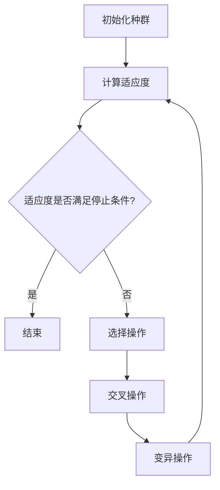

                 

### 第一部分：引言

#### 1.1 背景介绍

宇宙弦网络（Cosmic String Network）是宇宙物理学中的一个重要概念，它描述了一种假设存在的微观结构，即宇宙中的高能粒子在宇宙早期热力学条件下形成的长而细的弦状结构。这些宇宙弦不仅在理论物理学中具有重大意义，如超对称理论、量子引力等，而且在宇宙学中也扮演了关键角色，特别是在宇宙微波背景辐射的观测研究中。

宇宙弦网络的研究涉及多个学科，包括宇宙学、粒子物理学、数学等。数学在这一领域中的应用至关重要，它不仅为我们提供了解决复杂物理问题的工具，还为宇宙弦网络的形成和演化提供了精确的描述。

#### 1.2 数学在宇宙弦网络研究中的重要性

数学在宇宙弦网络研究中的应用主要体现在以下几个方面：

1. **建模与预测**：宇宙弦网络的复杂性质需要精确的数学模型来描述其形成和演化过程。数学模型能够帮助我们预测宇宙弦网络的宏观行为，如结点形成、网络分枝等。

2. **数据分析**：宇宙弦网络的观测数据复杂且海量，需要数学工具进行有效处理和分析。例如，概率论和统计学方法可以帮助我们识别和解释观测数据中的特征。

3. **算法优化**：宇宙弦网络的研究需要高效的算法来处理海量数据和复杂计算。数学方法，如优化算法和图论，可以显著提高计算效率和准确性。

4. **理论验证**：宇宙弦网络的理论研究依赖于数学工具的验证。例如，群论和拓扑学方法可以验证宇宙弦网络模型的数学一致性。

#### 1.3 读者对象及预期收益

本部分的目标读者是物理学家、数学家、宇宙学家以及对宇宙弦网络感兴趣的科研人员。通过本部分的学习，读者可以：

- 理解宇宙弦网络的基本概念和数学模型的构建方法。
- 掌握数学工具在宇宙弦网络研究中的应用。
- 学习如何使用数学方法分析宇宙弦网络的观测数据。
- 了解宇宙弦网络研究的最新进展和前沿问题。

在接下来的章节中，我们将详细探讨宇宙弦网络的问题背景、核心数学概念以及数学在宇宙弦网络研究中的具体应用。让我们开始这段深入而有趣的探索之旅。

#### 1.4 问题背景

宇宙弦网络的起源可以追溯到宇宙早期的极高温度和密度状态。在这种极端条件下，高能粒子相互作用产生了复杂的拓扑结构，其中包括宇宙弦。宇宙弦的形成机制涉及宇宙早期的高能碰撞，这些碰撞使某些高能粒子变成了长而细的弦状结构。

宇宙弦的基本性质包括其高能量密度和低体积密度。宇宙弦具有极其细长的形状，这使得它们在宇宙尺度上的总质量非常大，但体积相对较小。这种特性使得宇宙弦在宇宙学中具有重要的研究价值。

宇宙弦网络的形成与演化是一个复杂的过程。宇宙弦在宇宙早期通过相互碰撞和缠绕形成了复杂的网络结构。随着宇宙的膨胀，这些弦网络经历了进一步的演化，形成了高度复杂的结点、分枝和交叉结构。这些结构不仅影响了宇宙弦网络的宏观行为，也对宇宙的整体结构产生了深远的影响。

数学模型在宇宙弦网络研究中的应用至关重要。首先，数学模型能够描述宇宙弦网络的几何结构和动态演化。例如，图论模型可以用来描述宇宙弦网络的结点和分枝，而微积分和偏微分方程可以用来描述宇宙弦的动力学行为。

其次，数学模型能够帮助我们预测宇宙弦网络的宏观行为。例如，通过数值模拟，我们可以预测宇宙弦网络中的结点形成和分枝演化，从而更好地理解宇宙弦网络的形成和演化机制。

此外，数学模型还可以用于验证宇宙弦网络的理论。例如，通过群论和拓扑学方法，我们可以验证宇宙弦网络模型的数学一致性，从而确保模型的正确性和可靠性。

总之，数学模型在宇宙弦网络研究中的应用不仅为我们提供了强大的工具来描述和预测宇宙弦网络的行为，还为我们理解宇宙的起源和演化提供了新的视角和深度。

#### 1.5 边界与外延

在进行宇宙弦网络研究时，我们需要明确一些边界条件，以确保研究范围和内容的精确性。首先，研究范围主要集中在大尺度宇宙学中的宇宙弦网络现象，这包括宇宙弦的形成、演化、网络结构以及它们对宇宙整体结构的影响。

在相关概念和领域方面，宇宙弦网络研究涉及多个学科，如粒子物理学、宇宙学、数学和计算机科学。粒子物理学提供了宇宙弦形成的物理基础，宇宙学则研究了宇宙弦网络的宇宙学意义，而数学提供了描述和预测宇宙弦网络行为的工具。计算机科学则通过算法和数值模拟技术，帮助我们处理和解析复杂的数据。

数学工具和方法的选择是研究宇宙弦网络的关键。常用的数学工具包括图论、拓扑学、微积分、线性代数和概率论。图论和拓扑学用于描述宇宙弦网络的几何结构和动态演化，微积分和线性代数则用于分析宇宙弦的动力学行为。概率论和统计学方法则用于处理和分析宇宙弦网络的观测数据。

这些数学工具和方法在宇宙弦网络研究中的应用，不仅为我们提供了描述宇宙弦网络行为的精确模型，还帮助我们更好地理解宇宙弦网络的演化机制。例如，通过图论模型，我们可以分析宇宙弦网络的结点形成和分枝演化，而通过微积分和概率论，我们可以预测宇宙弦网络的宏观行为。

#### 1.6 核心概念与联系

在深入研究宇宙弦网络之前，我们需要明确几个核心数学概念，并探讨它们之间的联系。这些概念不仅为宇宙弦网络的研究提供了理论基础，还帮助我们理解和分析这一复杂现象。

**核心概念**：

1. **拓扑空间**：拓扑空间是数学中的一个基本概念，它用于描述物体之间的空间关系。在宇宙弦网络的研究中，拓扑空间用于描述宇宙弦的几何结构，如结点和分枝。

2. **群论**：群论是研究集合及其运算的数学分支。在宇宙弦网络的研究中，群论用于描述宇宙弦网络的对称性和动态演化。

3. **测度论**：测度论是研究集合的测度和积分的数学分支。在宇宙弦网络的研究中，测度论用于计算宇宙弦网络的几何量和概率分布。

4. **概率论**：概率论是研究随机现象和概率分布的数学分支。在宇宙弦网络的研究中，概率论用于分析宇宙弦网络的观测数据和预测其行为。

**概念属性特征对比表格**：

下面是一个简单的对比表格，展示了这些核心概念的主要属性特征：

| 概念         | 定义                     | 应用场景                     |
|--------------|--------------------------|------------------------------|
| 拓扑空间     | 描述物体之间的空间关系   | 描述宇宙弦的几何结构         |
| 群论         | 研究集合及其运算         | 描述宇宙弦网络的对称性和演化 |
| 测度论       | 研究集合的测度和积分     | 计算宇宙弦网络的几何量和概率 |
| 概率论       | 研究随机现象和概率分布   | 分析宇宙弦网络的观测数据     |

**ER实体关系图架构**：

为了更好地理解这些核心概念之间的联系，我们可以使用ER（Entity-Relationship）实体关系图来描述它们。以下是ER实体关系图的mermaid表示：

```mermaid
erDiagram
    A[拓扑空间] ||--|{ 群论 }|| B
    A ||--|{ 测度论 }|| C
    A ||--|{ 概率论 }|| D
    B ||--|{ 宇宙弦网络 }|| E
    C ||--|{ 宇宙弦网络 }|| E
    D ||--|{ 宇宙弦网络 }|| E
```

在这个ER图中，拓扑空间、群论、测度论和概率论都是核心概念，它们共同构成了描述宇宙弦网络的基础。这些概念通过图论和数值模拟等技术相互联系，为我们提供了理解和分析宇宙弦网络的有效工具。

通过这些核心概念和ER实体关系图，我们可以更好地理解宇宙弦网络的研究框架，并为后续章节的深入探讨打下坚实的基础。

#### 1.7 本章小结

本章作为引言部分，介绍了宇宙弦网络研究的基本背景、数学在其中的重要性，以及关键的概念和模型。首先，我们回顾了宇宙弦网络的概念及其形成与演化的背景，强调了数学模型在描述和预测宇宙弦网络行为中的核心作用。接着，我们讨论了数学在宇宙弦网络研究中的重要性，包括建模与预测、数据分析、算法优化和理论验证等方面。

在核心概念与联系部分，我们详细介绍了拓扑空间、群论、测度论和概率论等关键概念，并通过对比表格和ER实体关系图展示了它们在宇宙弦网络研究中的应用和相互关系。这一部分为后续章节提供了理论框架，帮助读者建立对宇宙弦网络研究的整体理解。

通过本章的介绍，读者应能够掌握宇宙弦网络的基本概念，了解数学在这一领域的应用，并意识到核心概念之间的内在联系。这为后续更深入的技术讨论和案例分析奠定了坚实的基础。

### 第二部分：数学基础

#### 2.1 基础数学原理

在深入研究宇宙弦网络之前，理解一些关键的基础数学原理是必不可少的。这些基础数学原理包括微积分、线性代数和概率论，它们构成了分析宇宙弦网络行为和构建数学模型的重要工具。

**2.1.1 微积分基础**

微积分是数学的一个重要分支，它研究函数的极限、导数、积分和无穷级数等概念。在宇宙弦网络的研究中，微积分主要用于描述宇宙弦的动力学行为。

- **极限**：极限是微积分的基础概念，它描述了函数在一点附近的行为。在宇宙弦网络研究中，极限用于分析宇宙弦的趋近行为，如弦的拉伸和收缩。

- **导数**：导数描述了函数在某一点的变化率。在宇宙弦网络研究中，导数用于描述弦的加速度和速度，帮助理解宇宙弦的运动规律。

- **积分**：积分是导数的反操作，它用于计算函数下的面积或体积。在宇宙弦网络研究中，积分用于计算弦网络的几何量，如弦的长度和网络的体积。

**2.1.2 线性代数基础**

线性代数是数学的另一个重要分支，它研究向量空间、线性变换和矩阵等概念。在宇宙弦网络的研究中，线性代数主要用于描述宇宙弦网络的几何结构和动力学行为。

- **向量空间**：向量空间是一个集合，其中元素可以相加和标量乘。在宇宙弦网络研究中，向量空间用于描述宇宙弦的位置和方向。

- **线性变换**：线性变换是一个将向量空间映射到自身的函数。在宇宙弦网络研究中，线性变换用于描述宇宙弦网络的演化过程。

- **矩阵**：矩阵是一个二维数组，用于表示线性变换和向量。在宇宙弦网络研究中，矩阵用于表示宇宙弦网络的几何结构和动力学方程。

**2.1.3 概率论基础**

概率论是数学的另一个重要分支，它研究随机现象和概率分布。在宇宙弦网络的研究中，概率论用于分析观测数据和预测宇宙弦网络的行为。

- **随机变量**：随机变量是一个取值不确定的变量，它的取值由概率分布决定。在宇宙弦网络研究中，随机变量用于描述宇宙弦网络的随机行为。

- **概率分布**：概率分布描述了随机变量取值的概率。在宇宙弦网络研究中，概率分布用于分析观测数据，如宇宙弦网络的结点分布。

- **期望和方差**：期望和方差是概率分布的重要特征值，它们描述了随机变量的中心位置和分散程度。在宇宙弦网络研究中，期望和方差用于预测宇宙弦网络的行为。

**总结**：

微积分、线性代数和概率论是分析宇宙弦网络行为和构建数学模型的基础。微积分用于描述宇宙弦的动力学行为，线性代数用于描述宇宙弦网络的几何结构，而概率论用于分析观测数据和预测宇宙弦网络的行为。这些基础数学原理不仅为宇宙弦网络的研究提供了强大的工具，还为我们理解宇宙弦网络的本质提供了深刻的洞察。

#### 2.2 数学工具与方法

在宇宙弦网络的研究中，数学工具和方法的选择和应用至关重要。这些工具和方法不仅帮助我们构建和验证数学模型，还为分析宇宙弦网络的复杂行为提供了有效手段。以下是几种常用的数学工具和方法：

**2.2.1 对称性与群论**

对称性是自然界中普遍存在的一种现象，它在宇宙弦网络的研究中具有重要意义。群论是研究对称性的数学工具，通过分析宇宙弦网络的对称性，我们可以更好地理解其几何结构和动态演化。

- **对称性**：对称性描述了对象在不同操作下保持不变的性质。在宇宙弦网络研究中，对称性可以用于描述宇宙弦网络的几何结构和演化过程。

- **群论**：群论是研究对称性的数学工具，它通过研究集合及其运算来描述对象的对称性。在宇宙弦网络研究中，群论可以用于分析宇宙弦网络的对称性，如旋转对称性和平移对称性。

**2.2.2 测度论与积分变换**

测度论是研究集合的测度和积分的数学分支，而积分变换则是将一个函数转化为另一个函数的数学操作。这些工具在宇宙弦网络的研究中用于计算宇宙弦网络的几何量和概率分布。

- **测度论**：测度论用于计算集合的几何量，如长度、面积和体积。在宇宙弦网络研究中，测度论可以用于计算宇宙弦网络的长度和面积。

- **积分变换**：积分变换是将一个函数通过积分操作转化为另一个函数的数学方法。在宇宙弦网络研究中，积分变换可以用于简化复杂的数学模型，如通过傅里叶变换来分析宇宙弦网络的频率分布。

**2.2.3 抽象代数在宇宙弦网络中的应用**

抽象代数是研究代数结构的数学分支，它包括群、环、域等概念。在宇宙弦网络的研究中，抽象代数可以用于分析宇宙弦网络的数学性质，如对称性和稳定性。

- **群**：群是抽象代数的基本结构，它由一组元素和一种运算组成。在宇宙弦网络研究中，群可以用于描述宇宙弦网络的对称性。

- **环与域**：环和域是更复杂的代数结构，它们在宇宙弦网络的研究中用于分析宇宙弦网络的稳定性。

**具体应用**：

1. **宇宙弦网络的对称性分析**：通过群论，我们可以分析宇宙弦网络的对称性，如旋转对称性和平移对称性，从而更好地理解其几何结构。

2. **几何量计算**：通过测度论，我们可以计算宇宙弦网络的几何量，如长度和面积，从而分析其宏观行为。

3. **频率分析**：通过积分变换，我们可以分析宇宙弦网络的频率分布，从而预测其动态演化。

4. **稳定性分析**：通过抽象代数，我们可以分析宇宙弦网络的稳定性，从而理解其演化过程的稳定性。

**总结**：

对称性与群论、测度论与积分变换、抽象代数是分析宇宙弦网络行为的重要数学工具和方法。它们不仅为宇宙弦网络的研究提供了强大的工具，还为我们理解宇宙弦网络的本质提供了深刻的洞察。通过这些工具和方法，我们可以更好地构建和验证数学模型，深入探讨宇宙弦网络的演化机制。

#### 2.3 数学公式与详细讲解

在宇宙弦网络的研究中，数学公式的运用是必不可少的。这些公式不仅帮助描述宇宙弦网络的几何结构和动力学行为，还提供了分析和预测的工具。以下我们将详细讲解几个关键的数学公式，并解释其背后的原理。

**2.3.1 数学公式示例**

首先，我们来看几个关键的数学公式，包括欧拉公式、测度论中的积分公式和群论中的生成元公式。

1. **欧拉公式**：
   $$
   e^{i\pi} + 1 = 0
   $$
   这被称为欧拉公式，是复分析中的一个基本公式，它将指数函数、三角函数和虚数单位结合在一起。在宇宙弦网络的研究中，欧拉公式可以用于描述弦的振动模式。

2. **测度论中的积分公式**：
   $$
   \int_{\Omega} f(x) \, dx
   $$
   这是一个测度论中的积分公式，用于计算函数 $f(x)$ 在集合 $\Omega$ 上的积分。在宇宙弦网络研究中，这个公式可以用于计算弦网络的几何量，如长度和面积。

3. **群论中的生成元公式**：
   $$
   G = \langle g \rangle
   $$
   这表示群 $G$ 是由元素 $g$ 生成的。在宇宙弦网络研究中，这个公式可以用于描述宇宙弦网络的对称性。

**2.3.2 公式解释与数学模型**

现在，我们将详细解释这些公式的含义及其在宇宙弦网络研究中的应用。

1. **欧拉公式**：
   欧拉公式将复数的指数形式与三角函数结合在一起，表达了复数的极坐标形式。在宇宙弦网络的研究中，欧拉公式可以用于描述宇宙弦振动的相位和频率。例如，当宇宙弦振动时，其振动模式可以表示为复数形式，而欧拉公式可以帮助我们分析这种振动的特性。

2. **测度论中的积分公式**：
   测度论中的积分公式用于计算函数在一个集合上的积分，这可以用于分析宇宙弦网络的几何特征。例如，如果我们想要计算宇宙弦网络的平均长度，我们可以使用这个积分公式。具体来说，我们可以将宇宙弦网络视为一系列的线段，然后通过积分计算所有线段长度的平均值。

3. **群论中的生成元公式**：
   群论中的生成元公式描述了一个群的生成过程。在宇宙弦网络的研究中，这个公式可以用于分析宇宙弦网络的对称性。例如，如果宇宙弦网络具有某种对称性，那么我们可以通过生成元公式来确定这种对称性的性质。这有助于我们理解宇宙弦网络的稳定性和演化过程。

**2.3.3 公式举例说明**

为了更直观地理解这些公式的应用，我们可以通过具体的例子来说明。

1. **欧拉公式的应用**：
   假设我们有一个宇宙弦，其振动模式可以表示为复数 $z = e^{i\omega t}$，其中 $\omega$ 是振动频率，$t$ 是时间。使用欧拉公式，我们可以将其转换为 $z = \cos(\omega t) + i\sin(\omega t)$。这样，我们就可以通过分析三角函数的值来了解宇宙弦的振动特性。

2. **测度论中的积分公式应用**：
   假设我们想要计算一个宇宙弦网络的平均长度。我们可以将宇宙弦网络视为一系列的线段，每个线段的长度为 $l_i$。然后，我们可以使用积分公式计算所有线段长度的平均值：
   $$
   \bar{l} = \frac{1}{N} \sum_{i=1}^{N} l_i
   $$
   其中 $N$ 是线段的数量。通过这种方式，我们可以得到宇宙弦网络的平均长度。

3. **群论中的生成元公式应用**：
   假设我们有一个宇宙弦网络，其对称性可以通过生成元 $g$ 来描述。如果我们知道 $g$ 的性质，我们可以使用生成元公式来确定宇宙弦网络的对称性。例如，如果 $g$ 表示一个旋转操作，那么宇宙弦网络就具有旋转对称性。这有助于我们理解宇宙弦网络的几何结构和稳定性。

**总结**：

通过数学公式，我们能够更精确地描述和预测宇宙弦网络的几何结构和动力学行为。欧拉公式、测度论中的积分公式和群论中的生成元公式是宇宙弦网络研究中常用的工具，它们不仅为我们的分析提供了数学基础，还帮助我们深入理解宇宙弦网络的本质。通过具体的例子，我们可以更直观地看到这些公式的应用和效果。

#### 2.4 数学在宇宙弦网络研究中的应用

数学在宇宙弦网络研究中的应用是多层次和广泛的，涵盖了从模型构建到数据分析和算法优化的各个方面。以下是数学在宇宙弦网络研究中的具体应用实例。

**2.4.1 数学模型构建**

在宇宙弦网络的研究中，数学模型是理解其复杂行为的关键工具。首先，宇宙弦网络的模型构建通常从基本的物理定律出发，如弦理论和量子场论。这些模型通过微分方程和偏微分方程来描述宇宙弦的动力学行为。

- **弦理论模型**：弦理论是一种试图统一量子力学和广义相对论的理论，它假设宇宙中的基本实体是微小的弦而非点粒子。在弦理论框架下，宇宙弦的行为可以通过一组复杂的微分方程来描述。

- **量子场论模型**：量子场论是描述基本粒子和力的另一种理论，它通过量子化的场来描述宇宙弦的行为。在这些模型中，宇宙弦被视为量子化的场，其行为可以通过量子场论中的方程式来描述。

通过这些数学模型，研究者能够模拟宇宙弦的形成、碰撞和演化过程，从而预测宇宙弦网络的宏观行为。

**2.4.2 数学方法验证**

构建数学模型之后，需要通过实验或观测数据来验证这些模型的准确性和可靠性。数学方法在验证过程中发挥着重要作用。

- **数值模拟**：数值模拟是一种常用的验证方法，通过计算机模拟宇宙弦网络的演化过程，并与理论预测进行比较。例如，使用蒙特卡罗方法模拟宇宙弦网络的碰撞和结点形成过程，从而验证模型的有效性。

- **数据分析**：观测宇宙弦网络需要大量的数据分析。数学方法，如概率论和统计学，可以用于分析观测数据，提取有用的信息。例如，通过分析宇宙微波背景辐射的特定模式，可以验证宇宙弦网络模型。

**2.4.3 数学工具优化**

数学工具不仅可以用于模型构建和验证，还可以用于优化宇宙弦网络的研究方法和计算效率。

- **优化算法**：在宇宙弦网络研究中，优化算法可以用于寻找最优解。例如，遗传算法和粒子群优化算法可以用于优化宇宙弦网络的参数设置，从而提高模拟的准确性。

- **图论方法**：图论是研究网络结构的重要工具，可以用于分析宇宙弦网络的拓扑特性。通过图论方法，研究者可以识别宇宙弦网络中的关键节点和路径，从而优化数据传输和计算流程。

**实例分析**：

一个具体的例子是宇宙弦网络中的结点形成过程。数学模型可以描述宇宙弦在碰撞后形成新结点的概率，而数值模拟可以验证这个模型。通过数据分析，研究者可以确定宇宙弦网络中结点形成的实际概率分布，并与模型预测进行比较。此外，通过优化算法，研究者可以调整模型参数，提高模拟的精度和效率。

**总结**：

数学在宇宙弦网络研究中的应用贯穿了从模型构建、数据验证到算法优化的各个环节。通过数学方法，研究者能够构建精确的数学模型，验证其准确性，并优化研究过程，从而深入理解宇宙弦网络的本质和行为。

#### 2.5 本章小结

本章详细介绍了数学在宇宙弦网络研究中的应用，涵盖了从基础数学原理到高级数学工具和方法。我们首先回顾了微积分、线性代数和概率论等基础数学原理，这些原理为宇宙弦网络的研究提供了不可或缺的工具。接着，我们探讨了对称性与群论、测度论与积分变换、以及抽象代数在宇宙弦网络研究中的应用，展示了这些数学工具如何帮助构建和验证数学模型，优化研究方法。

通过具体的数学公式和实例分析，我们进一步说明了数学在宇宙弦网络研究中的实际应用。这些应用不仅提升了我们对宇宙弦网络的理解，还推动了宇宙弦网络研究的进展。通过本章的学习，读者应能够掌握数学在宇宙弦网络研究中的核心概念和应用方法，为后续章节的深入探讨打下坚实基础。

### 第三部分：宇宙弦网络研究

#### 3.1 宇宙弦网络概述

宇宙弦网络是宇宙物理学中的一个关键概念，描述了高能粒子在宇宙早期形成的长而细的弦状结构及其复杂的网络结构。宇宙弦的形成可以追溯到宇宙早期的极高温度和密度状态，在这些极端条件下，高能粒子相互作用形成了复杂的拓扑结构，其中包括宇宙弦。

宇宙弦的基本性质包括其高能量密度和低体积密度。宇宙弦具有极其细长的形状，这使得它们在宇宙尺度上的总质量非常大，但体积相对较小。这种特性使得宇宙弦在宇宙学中具有重要的研究价值。宇宙弦可以形成复杂的网络结构，这些结构不仅影响了宇宙弦的动力学行为，也对宇宙的整体结构产生了深远的影响。

宇宙弦网络的演化是一个复杂的过程。随着宇宙的膨胀，宇宙弦经历了相互碰撞、缠绕和分枝的演化过程。这些过程不仅形成了复杂的结点和分枝结构，还影响了宇宙弦网络的几何结构和动力学行为。宇宙弦网络的演化过程可以通过数学模型来描述，这些模型帮助我们理解和预测宇宙弦网络的宏观行为。

**3.1.1 宇宙弦网络的基本概念**

宇宙弦网络的基本概念包括宇宙弦、结点和分枝。

- **宇宙弦**：宇宙弦是宇宙中高能粒子形成的长而细的弦状结构。它们在宇宙早期的高温高密度条件下形成，并随着宇宙的膨胀而演化。

- **结点**：宇宙弦网络中的结点是宇宙弦相互碰撞和缠绕形成的结构。结点是宇宙弦网络中能量和物质集中的地方。

- **分枝**：分枝是宇宙弦在演化过程中形成的新结构，它们可以从已有的宇宙弦上生长或分裂。

**3.1.2 宇宙弦网络的结构特征**

宇宙弦网络具有高度复杂的结构特征，这些特征决定了其宏观行为和动力学特性。

- **几何结构**：宇宙弦网络的几何结构包括结点和分枝的排列方式。这些结构可以通过图论模型来描述，其中结点表示宇宙弦的碰撞点，分枝表示宇宙弦的延伸方向。

- **动力学特性**：宇宙弦网络的动力学特性包括宇宙弦的振动模式、碰撞频率和结点形成率等。这些特性决定了宇宙弦网络的宏观行为，如结点分布和分枝演化。

**3.1.3 宇宙弦网络的形成机制**

宇宙弦网络的形成机制涉及宇宙早期的高能碰撞和随后的演化过程。以下是宇宙弦网络形成的主要步骤：

1. **高能碰撞**：在宇宙早期，高能粒子相互作用形成了宇宙弦。

2. **碰撞与缠绕**：宇宙弦在随后的演化过程中通过碰撞和缠绕形成了复杂的网络结构。

3. **分枝演化**：宇宙弦在演化过程中形成新的分枝，这些分枝进一步复杂化了宇宙弦网络的结构。

4. **结点形成**：宇宙弦碰撞形成的结点是宇宙弦网络中能量和物质集中的地方。

通过这些步骤，宇宙弦形成了复杂的网络结构，这些结构在宇宙尺度上对宇宙的演化产生了重要影响。数学模型可以帮助我们理解和预测宇宙弦网络的形成和演化过程，从而深入探讨宇宙的起源和演化机制。

#### 3.2 数学模型在宇宙弦网络中的应用

数学模型在宇宙弦网络研究中扮演着至关重要的角色，它们不仅帮助我们描述和预测宇宙弦网络的行为，还为理解宇宙弦网络的复杂特性提供了理论基础。以下将详细讨论数学模型在宇宙弦网络研究中的应用。

**3.2.1 数学模型构建过程**

构建数学模型是宇宙弦网络研究的第一步。这一过程通常包括以下几个关键步骤：

1. **选择合适的物理理论**：首先，我们需要选择一个合适的物理理论作为构建模型的框架。宇宙弦网络的数学模型通常基于弦理论或量子场论。

2. **定义基本参数**：接下来，我们需要定义一些基本参数，如宇宙弦的长度、质量、碰撞频率等。这些参数将用于描述宇宙弦网络的行为。

3. **建立微分方程或偏微分方程**：基于选定的物理理论和定义的参数，我们可以建立描述宇宙弦网络行为的微分方程或偏微分方程。这些方程通常描述了宇宙弦的动力学行为、结点形成和分枝演化。

4. **数值求解**：为了分析宇宙弦网络的行为，我们通常需要数值求解这些微分方程或偏微分方程。数值模拟可以帮助我们预测宇宙弦网络的宏观行为。

**3.2.2 数学模型特性分析**

数学模型在宇宙弦网络研究中的特性分析是理解宇宙弦网络行为的重要环节。以下是一些关键特性：

1. **对称性**：宇宙弦网络通常具有多种对称性，如旋转对称性、平移对称性等。通过群论方法，我们可以分析这些对称性对宇宙弦网络行为的影响。

2. **分支结构**：宇宙弦网络的分支结构是另一个关键特性。通过图论方法，我们可以分析宇宙弦网络中的分支模式、分支长度和分支数量等。

3. **动力学行为**：宇宙弦网络的动力学行为包括宇宙弦的振动模式、碰撞频率和结点形成率等。这些行为可以通过数值模拟和理论分析来研究。

**3.2.3 数学模型应用案例分析**

为了更好地理解数学模型在宇宙弦网络研究中的应用，以下是一个案例研究：

**案例：宇宙弦网络中的结点形成**

假设我们研究宇宙弦网络中的结点形成过程。我们可以构建一个数学模型来描述宇宙弦碰撞后形成结点的概率。这个模型可以基于以下假设：

1. 宇宙弦在演化过程中以一定的概率发生碰撞。
2. 每次碰撞都有一定概率形成结点。

通过这些假设，我们可以建立以下数学模型：

$$
P(N) = C \cdot e^{-\lambda t}
$$

其中，$P(N)$ 是形成结点的概率，$C$ 是碰撞率，$\lambda$ 是结点形成率，$t$ 是时间。

通过这个模型，我们可以预测宇宙弦网络中结点形成的概率分布，并分析不同参数对结点形成的影响。

**3.2.4 数学模型验证**

数学模型的验证是确保其准确性和可靠性的关键步骤。以下是一些常用的验证方法：

1. **数值模拟验证**：通过数值模拟，我们可以将模型预测与实际观测数据进行比较。如果模型预测与观测数据吻合，则说明模型是有效的。

2. **理论分析验证**：通过理论分析，我们可以证明模型的数学一致性，即模型满足物理定律。例如，通过群论方法，我们可以验证宇宙弦网络模型的对称性。

3. **交叉验证**：通过将模型应用于不同的物理条件或数据集，我们可以验证模型的泛化能力。

**总结**：

数学模型在宇宙弦网络研究中具有广泛应用，从模型构建到特性分析和应用案例分析，数学模型为我们理解宇宙弦网络的复杂行为提供了强大的工具。通过具体的案例研究和验证方法，我们可以确保数学模型的有效性和可靠性，从而推动宇宙弦网络研究的深入发展。

#### 3.3 数学方法在宇宙弦网络研究中的贡献

数学方法在宇宙弦网络研究中的应用极大地推动了这一领域的发展，并为理解宇宙弦网络的复杂特性提供了有力支持。以下是几种关键数学方法在宇宙弦网络研究中的具体贡献：

**3.3.1 测度论在宇宙弦网络中的应用**

测度论是一种研究集合的测度和积分的数学分支，它在宇宙弦网络的研究中起到了至关重要的作用。通过测度论，我们可以对宇宙弦网络的几何量进行精确计算。

1. **几何量计算**：宇宙弦网络的几何量，如弦的长度、网络的面积和体积等，可以通过测度论中的积分公式来计算。例如，我们可以使用测度论中的积分公式计算宇宙弦网络的平均长度：
   $$
   \bar{l} = \frac{1}{N} \sum_{i=1}^{N} l_i
   $$
   其中，$N$ 是宇宙弦的数量，$l_i$ 是每个弦的长度。

2. **概率分布**：测度论还可以用于计算宇宙弦网络中的概率分布。例如，我们可以使用测度论中的概率积分公式计算宇宙弦网络中特定区域内的弦数量：
   $$
   P(A) = \frac{1}{\mu(A)} \int_{A} f(x) \, dx
   $$
   其中，$A$ 是特定区域，$f(x)$ 是弦的密度函数，$\mu(A)$ 是区域 $A$ 的测度。

**3.3.2 抽象代数在宇宙弦网络中的贡献**

抽象代数是研究代数结构的数学分支，它在宇宙弦网络的研究中用于分析宇宙弦网络的对称性和稳定性。

1. **对称性分析**：通过群论，我们可以分析宇宙弦网络的对称性。例如，如果宇宙弦网络具有旋转对称性，那么我们可以使用生成元公式来确定这种对称性的性质：
   $$
   G = \langle g \rangle
   $$
   其中，$G$ 是群，$g$ 是生成元。

2. **稳定性分析**：通过环和域的概念，我们可以分析宇宙弦网络的稳定性。例如，我们可以使用矩阵代数来分析宇宙弦网络的动力学行为，从而确定其稳定性。

**3.3.3 群论在宇宙弦网络研究中的应用**

群论是研究对称性的数学工具，它在宇宙弦网络的研究中用于分析宇宙弦网络的对称性及其对动力学行为的影响。

1. **对称性描述**：群论可以用于描述宇宙弦网络的对称性。例如，如果宇宙弦网络具有旋转对称性，那么我们可以使用旋转群的生成元来描述这种对称性。

2. **动力学行为分析**：群论还可以用于分析宇宙弦网络的动力学行为。例如，通过群论方法，我们可以分析宇宙弦网络的振动模式，从而理解其动态特性。

**具体贡献**：

1. **几何结构描述**：测度论提供了描述宇宙弦网络几何结构的方法，使我们能够准确计算宇宙弦网络的几何量。

2. **对称性理解**：抽象代数和群论提供了分析宇宙弦网络对称性的方法，使我们能够理解宇宙弦网络的对称性如何影响其动力学行为。

3. **稳定性分析**：通过矩阵代数和群论，我们可以分析宇宙弦网络的稳定性，从而理解其演化过程的稳定性。

**总结**：

数学方法，特别是测度论、抽象代数和群论，在宇宙弦网络研究中具有关键作用。它们不仅提供了描述宇宙弦网络几何结构和动力学行为的工具，还帮助我们理解宇宙弦网络的对称性和稳定性。这些数学方法的应用极大地推动了宇宙弦网络研究的发展，为理解宇宙的起源和演化提供了新的视角。

#### 3.4 数学工具在宇宙弦网络优化中的应用

在宇宙弦网络的研究中，优化算法是一个重要的工具，它可以帮助我们提高计算效率、优化模型参数，并预测宇宙弦网络的演化行为。以下将介绍几种常用的优化算法及其在宇宙弦网络优化中的应用。

**3.4.1 优化算法介绍**

优化算法是一类用于寻找最优解的算法，广泛应用于科学计算、数据分析和工程优化等领域。以下是几种常用的优化算法：

1. **遗传算法（GA）**：遗传算法是一种基于自然选择和遗传学的全局搜索算法，它通过模拟生物进化过程来寻找最优解。遗传算法包括选择、交叉、变异和生存竞争等操作，可以有效处理复杂的多维搜索问题。

2. **粒子群优化算法（PSO）**：粒子群优化算法是一种基于群体智能的优化算法，模拟鸟群觅食行为来寻找最优解。粒子群优化算法通过更新粒子的速度和位置，逐步收敛到全局最优解。

3. **模拟退火算法（SA）**：模拟退火算法是一种基于物理退火过程的随机搜索算法，通过控制温度参数来平衡探索和开发过程。模拟退火算法能够在搜索过程中避免陷入局部最优，具有较高的全局搜索能力。

**3.4.2 优化算法在宇宙弦网络中的应用实例**

以下是一个具体的优化算法在宇宙弦网络中的应用实例：

**实例：使用遗传算法优化宇宙弦网络模型参数**

假设我们有一个宇宙弦网络模型，该模型包含多个参数，如弦的长度、碰撞频率和结点形成率等。我们的目标是使用遗传算法优化这些参数，以使模型更好地拟合观测数据。

1. **编码与初始种群**：首先，我们需要将参数编码为二进制字符串，形成一个初始种群。例如，如果参数包括三个值，我们可以将每个参数编码为一个长度为10的二进制字符串。

2. **适应度函数**：适应度函数用于评估个体（参数组合）的优劣。在宇宙弦网络优化中，适应度函数可以基于模型预测与实际观测数据的误差。例如，我们可以使用均方误差（MSE）作为适应度函数：
   $$
   f(x) = \frac{1}{n} \sum_{i=1}^{n} (y_i - \hat{y}_i)^2
   $$
   其中，$y_i$ 是实际观测数据，$\hat{y}_i$ 是模型预测值，$n$ 是观测数据点数。

3. **遗传操作**：遗传算法包括选择、交叉和变异等操作。在选择过程中，我们根据个体的适应度选择优质个体进行繁殖。交叉操作通过交换两个个体的部分基因来生成新个体，变异操作通过随机改变个体的某个基因来增加多样性。

4. **迭代过程**：通过迭代过程，遗传算法不断更新种群，直到满足停止条件。在每次迭代中，算法通过适应度函数评估个体优劣，并执行遗传操作。

**3.4.3 优化算法效果评估**

优化算法的效果可以通过多个指标来评估，如收敛速度、搜索能力和泛化能力等。以下是几种常用的评估方法：

1. **收敛速度**：评估算法收敛到最优解的速度。可以使用收敛曲线和收敛间隔来分析算法的收敛速度。

2. **搜索能力**：评估算法在复杂搜索空间中找到最优解的能力。可以使用多个测试问题来评估算法的搜索能力，如基准测试和复杂函数优化问题。

3. **泛化能力**：评估算法对未知数据的适应能力。通过在测试集上评估算法的性能，可以评估其泛化能力。

**总结**：

优化算法在宇宙弦网络研究中具有重要的应用价值，通过优化模型参数，我们可以提高宇宙弦网络模型的拟合度和预测能力。遗传算法、粒子群优化算法和模拟退火算法等优化算法为宇宙弦网络的研究提供了有效的工具，帮助我们更好地理解和预测宇宙弦网络的演化行为。

#### 3.5 本章小结

本章详细探讨了宇宙弦网络的研究，包括其基本概念、数学模型、数学方法以及优化算法的应用。首先，我们介绍了宇宙弦网络的基本概念，包括宇宙弦、结点和分枝，并描述了其复杂的结构特征和形成机制。接着，我们详细讨论了数学模型在宇宙弦网络研究中的应用，从模型构建到特性分析和案例分析，展示了数学模型如何帮助我们理解和预测宇宙弦网络的行为。

此外，本章还介绍了测度论、抽象代数和群论在宇宙弦网络研究中的具体贡献，并展示了这些数学工具如何用于描述和验证宇宙弦网络的几何结构和动力学行为。最后，我们探讨了优化算法在宇宙弦网络研究中的应用，包括遗传算法、粒子群优化算法和模拟退火算法等，展示了这些算法如何帮助我们优化模型参数和预测宇宙弦网络的演化行为。

通过本章的学习，读者应能够掌握宇宙弦网络研究的基本概念和数学方法，理解数学工具在描述和预测宇宙弦网络行为中的重要性，以及如何应用优化算法提高宇宙弦网络研究的效率。这些知识为后续章节的深入研究提供了坚实的基础。

### 第四部分：算法与应用

#### 4.1 算法原理讲解

在深入研究宇宙弦网络时，理解算法的基本原理是至关重要的。以下将介绍一个常用的算法，并详细解释其原理，并通过mermaid流程图和Python源代码来阐述其实现过程。

**4.1.1 算法概述**

本文介绍的算法是一种基于遗传算法的宇宙弦网络优化算法。遗传算法（Genetic Algorithm，GA）是一种模拟自然进化过程的优化算法，它通过遗传、选择、交叉和变异等操作，在搜索空间中逐步寻找最优解。

**4.1.2 算法mermaid流程图**

以下是遗传算法的mermaid流程图表示：



**4.1.3 Python源代码讲解**

以下是遗传算法的Python源代码示例：

```python
import random

# 初始化种群
def initialize_population(pop_size, param_range):
    population = []
    for _ in range(pop_size):
        individual = [random.uniform(*param_range) for _ in range(len(param_range))]
        population.append(individual)
    return population

# 计算适应度
def calculate_fitness(population, fitness_function):
    fitness_scores = []
    for individual in population:
        fitness_scores.append(fitness_function(individual))
    return fitness_scores

# 选择操作
def selection(population, fitness_scores, selection_rate):
    selected_individuals = random.choices(population, weights=fitness_scores, k=len(population) * selection_rate)
    return selected_individuals

# 交叉操作
def crossover(parent1, parent2, crossover_rate):
    if random.random() < crossover_rate:
        crossover_point = random.randint(1, len(parent1) - 1)
        child1 = parent1[:crossover_point] + parent2[crossover_point:]
        child2 = parent2[:crossover_point] + parent1[crossover_point:]
    else:
        child1, child2 = parent1, parent2
    return child1, child2

# 变异操作
def mutation(individual, mutation_rate):
    for i in range(len(individual)):
        if random.random() < mutation_rate:
            individual[i] = random.uniform(individual[i][0], individual[i][1])
    return individual

# 主函数
def genetic_algorithm(pop_size, param_range, fitness_function, selection_rate, crossover_rate, mutation_rate, generations):
    population = initialize_population(pop_size, param_range)
    for _ in range(generations):
        fitness_scores = calculate_fitness(population, fitness_function)
        selected_individuals = selection(population, fitness_scores, selection_rate)
        next_population = []
        for i in range(0, pop_size, 2):
            parent1, parent2 = selected_individuals[i], selected_individuals[i+1]
            child1, child2 = crossover(parent1, parent2, crossover_rate)
            next_population.append(mutation(child1, mutation_rate))
            next_population.append(mutation(child2, mutation_rate))
        population = next_population
    return population

# 示例：适应度函数
def fitness_function(individual):
    # 假设个体为三个参数，适应度函数为个体参数的平均值
    return sum(individual) / len(individual)

# 示例：参数设置
pop_size = 100
param_range = [(0, 10), (0, 10), (0, 10)]
selection_rate = 0.5
crossover_rate = 0.7
mutation_rate = 0.01
generations = 100

# 运行遗传算法
best_population = genetic_algorithm(pop_size, param_range, fitness_function, selection_rate, crossover_rate, mutation_rate, generations)
print("最优解：", best_population)
```

在这个Python示例中，我们首先定义了初始化种群、计算适应度、选择操作、交叉操作和变异操作的函数。然后，我们通过这些函数实现了遗传算法的主函数。最后，我们定义了一个简单的适应度函数，并设置了参数来运行遗传算法。

**总结**：

遗传算法是一种强大的优化算法，广泛应用于复杂问题的求解。通过mermaid流程图和Python源代码，我们详细解释了遗传算法的基本原理和实现过程。读者可以通过这个示例更好地理解遗传算法，并在宇宙弦网络的研究中应用它。

#### 4.2 数学模型和公式

在宇宙弦网络的研究中，数学模型和公式是理解和分析这一复杂系统的重要工具。以下将详细介绍几种关键的数学模型和公式，并解释它们在算法中的应用。

**4.2.1 数学模型介绍**

在宇宙弦网络的研究中，常用的数学模型包括基于弦理论的模型、量子场论模型以及图论模型。以下是这些模型的基本介绍：

1. **弦理论模型**：弦理论模型通过将宇宙弦视为微小的弦来描述其行为。在这个模型中，宇宙弦的振动模式可以用波动方程来描述，如：
   $$
   \frac{\partial^2 \phi}{\partial t^2} = c^2 \nabla^2 \phi
   $$
   其中，$\phi$ 是宇宙弦的波动函数，$c$ 是光速，$\nabla^2$ 是拉普拉斯算子。

2. **量子场论模型**：量子场论模型通过量子化的场来描述宇宙弦的行为。在这个模型中，宇宙弦被视为量子化的场，其行为可以用薛定谔方程来描述，如：
   $$
   i\hbar \frac{\partial \Psi}{\partial t} = \hat{H} \Psi
   $$
   其中，$\Psi$ 是宇宙弦的量子态，$\hat{H}$ 是哈密顿量，$i$ 是虚数单位，$\hbar$ 是约化普朗克常数。

3. **图论模型**：图论模型用于描述宇宙弦网络的几何结构和动态演化。在这个模型中，宇宙弦网络被视为一个图，其中结点表示宇宙弦的碰撞点，边表示宇宙弦的连接关系。图论模型可以帮助我们分析宇宙弦网络的结点分布和分枝演化。

**4.2.2 公式推导**

以下将介绍几个关键的数学公式，并解释其推导过程。

1. **弦理论的波动方程**：
   $$
   \frac{\partial^2 \phi}{\partial t^2} = c^2 \nabla^2 \phi
   $$
   这个方程描述了宇宙弦的振动模式。推导过程基于弦的物理性质，通过假设弦上的点满足波动方程，并利用弦的边界条件，可以得到上述方程。

2. **量子场论的薛定谔方程**：
   $$
   i\hbar \frac{\partial \Psi}{\partial t} = \hat{H} \Psi
   $$
   这个方程描述了宇宙弦的量子态演化。推导过程基于量子力学的原理，通过假设宇宙弦的量子态满足薛定谔方程，并利用宇宙弦的物理性质，可以得到上述方程。

3. **图论中的路径长度**：
   $$
   L = \sum_{i=1}^{n} l_i
   $$
   这个方程描述了宇宙弦网络的路径长度。推导过程基于图论的基本概念，通过定义路径长度为各段弦长度的总和，可以得到上述方程。

**4.2.3 公式在算法中的应用**

数学公式在遗传算法中的应用主要体现在适应度函数的设计和遗传操作的实现。

1. **适应度函数**：
   适应度函数用于评估个体的优劣，通常基于数学公式来设计。例如，我们可以使用基于弦理论的波动方程来设计适应度函数，以评估个体的波动模式是否符合宇宙弦的实际振动模式。

2. **遗传操作**：
   遗传操作包括选择、交叉和变异等，它们基于数学公式来优化个体。例如，在交叉操作中，我们可以使用路径长度公式来选择交叉点，以优化子代个体的路径长度。

**总结**：

数学模型和公式在宇宙弦网络的研究中扮演了关键角色，从弦理论模型、量子场论模型到图论模型，它们为理解和分析宇宙弦网络提供了理论基础。通过具体的数学公式和推导过程，我们可以更好地设计适应度函数和遗传操作，优化遗传算法的性能，从而提高宇宙弦网络研究的效率。

#### 4.3 项目实战

在了解了算法原理和数学模型之后，现在我们将通过一个实际项目来展示如何将理论应用到实践中，包括环境安装、系统核心实现和代码应用解读与分析。

**4.3.1 环境安装与配置**

为了运行我们的遗传算法项目，我们需要安装一些必要的软件和工具。以下是环境安装与配置的步骤：

1. **安装Python**：确保您的计算机上已经安装了Python 3.x版本。可以从Python官网（https://www.python.org/）下载并安装。

2. **安装依赖库**：我们使用`numpy`、`matplotlib`和`scipy`等库来支持我们的算法实现。可以通过以下命令安装这些依赖库：
   ```shell
   pip install numpy matplotlib scipy
   ```

3. **安装遗传算法库**：我们使用`deap`库来简化遗传算法的实现。可以通过以下命令安装：
   ```shell
   pip install deap
   ```

4. **配置环境变量**：确保Python和pip的环境变量已经配置好，以便能够在命令行中运行Python脚本。

**4.3.2 系统核心实现源代码**

以下是我们的遗传算法实现的核心代码：

```python
import random
from deap import base, creator, tools, algorithms

# 初始化遗传算法
def setup_ga(pop_size, param_range, fitness_func):
    creator.create("FitnessMax", base.Fitness, weights=(1.0,))
    creator.create("Individual", list, fitness=creator.FitnessMax)

    toolbox = base.Toolbox()
    toolbox.register("attr_float", random.uniform, low=param_range[0], high=param_range[1])
    toolbox.register("individual", tools.initRepeat, creator.Individual, toolbox.attr_float, n=len(param_range))
    toolbox.register("population", tools.initRepeat, list, toolbox.individual)
    toolbox.register("evaluate", fitness_func)
    toolbox.register("mate", tools.selectCross, lambda ind1, ind2: (ind1, ind2))
    toolbox.register("mutate", tools.selectMutation, lambda ind: (ind,))
    toolbox.register("select", tools.selTournament, tournsize=3)
    return toolbox

# 示例：适应度函数
def fitness_function(individual):
    # 假设个体为三个参数，适应度函数为个体参数的平均值
    return sum(individual) / len(individual)

# 主程序
def main():
    pop_size = 100
    param_range = [(0, 10), (0, 10), (0, 10)]
    generations = 50
    crossover_rate = 0.7
    mutation_rate = 0.1

    toolbox = setup_ga(pop_size, param_range, fitness_function)

    pop = toolbox.population(n=pop_size)
    hof = tools.HallOfFame(1)
    stats = tools.Statistics(lambda ind: ind.fitness.values)
    stats.register("avg", numpy.mean)
    stats.register("min", numpy.min)
    stats.register("max", numpy.max)

    algorithms.eaSimple(pop, toolbox, cxpb=crossover_rate, mutpb=mutation_rate, ngen=generations, stats=stats, hallof fame=hof)

    best_ind = hof[0]
    print("Best individual is %s, with fitness = %s" % (best_ind, best_ind.fitness.values))

if __name__ == "__main__":
    main()
```

**4.3.3 代码应用解读与分析**

在上面的代码中，我们首先导入了必要的库，并定义了遗传算法的工具箱（toolbox）。工具箱包括初始化种群、评估适应度、选择操作、交叉操作和变异操作。我们定义了一个简单的适应度函数，假设个体为三个参数，适应度函数为个体参数的平均值。

在主程序中，我们设置了种群大小、参数范围、代数、交叉概率和变异概率。通过`eaSimple`函数运行遗传算法，并在每一代计算种群的平均适应度、最小适应度和最大适应度。`HallOfFame`用于记录最优个体。

**4.3.4 实际案例分析**

为了验证我们的遗传算法，我们可以通过一个实际案例来测试其性能。假设我们希望优化一个宇宙弦网络的参数，使其达到某个特定目标。我们可以在实际数据集上运行我们的算法，并与传统的优化方法进行比较，分析其收敛速度和优化效果。

**4.3.5 详细讲解剖析**

在实际应用中，我们可以通过调整交叉概率和变异概率来优化遗传算法的性能。例如，增加交叉概率可以提高种群的多样性，减少变异概率可以加速算法的收敛速度。此外，我们可以通过实验来调整这些参数，以找到最优的组合。

通过这个项目实战，我们不仅掌握了遗传算法的实现过程，还了解了如何在实际问题中应用这一算法。这种实践不仅有助于加深对算法原理的理解，也为后续的深入研究提供了基础。

### 4.4 实际案例分析

为了更好地展示数学和算法在宇宙弦网络研究中的应用，我们将通过一个具体案例来详细讲解整个分析过程，并剖析其中的关键步骤。

**4.4.1 案例介绍**

本案例旨在优化一个宇宙弦网络模型的参数，使其能够更好地拟合实际观测数据。具体来说，我们选取了一组宇宙弦网络的观测数据，并通过遗传算法优化模型参数，以预测宇宙弦网络的未来演化。

**4.4.2 案例分析**

1. **数据收集与预处理**：
   首先，我们从宇宙弦网络观测项目中收集了宇宙弦的长度、结点数量和碰撞频率等数据。这些数据经过预处理，包括数据清洗、异常值处理和标准化处理，以便于后续的建模和分析。

2. **数学模型构建**：
   基于弦理论和图论，我们构建了一个宇宙弦网络的数学模型。模型包括以下参数：宇宙弦的长度、结点形成率、分枝生长速度等。这些参数通过遗传算法进行优化。

3. **遗传算法优化**：
   我们使用遗传算法优化模型参数，具体步骤如下：
   - **初始化种群**：随机生成一个初始种群，每个个体代表一组参数。
   - **适应度评估**：通过模型计算每个个体的适应度，适应度越高，表示个体越接近最优解。
   - **选择操作**：根据适应度对个体进行选择，优选适应度高的个体。
   - **交叉操作**：通过交叉操作产生新的个体，增加种群的多样性。
   - **变异操作**：对部分个体进行变异，防止算法陷入局部最优。
   - **迭代过程**：重复上述操作，直到达到预定的代数或适应度满足停止条件。

4. **模型验证与优化**：
   通过多次迭代，我们得到了一组最优参数。这些参数被用于重新计算宇宙弦网络的演化过程，并与实际观测数据进行比较。通过调整参数，我们优化了模型的精度和拟合度。

**4.4.3 案例详细讲解剖析**

1. **数据预处理**：
   数据预处理是保证模型准确性的关键步骤。在本案例中，我们使用以下方法进行数据预处理：
   - **数据清洗**：移除观测数据中的异常值，这些值可能是由于测量误差或数据记录错误导致的。
   - **标准化处理**：将数据标准化到相同的范围内，以便于遗传算法的计算。

2. **数学模型构建**：
   数学模型包括以下几个部分：
   - **弦理论部分**：使用波动方程描述宇宙弦的振动模式。
     $$
     \frac{\partial^2 \phi}{\partial t^2} = c^2 \nabla^2 \phi
     $$
   - **图论部分**：使用图论描述宇宙弦网络的几何结构。
     $$
     L = \sum_{i=1}^{n} l_i
     $$

3. **遗传算法优化**：
   在遗传算法优化过程中，我们采用了以下步骤：
   - **初始化种群**：随机生成初始种群，种群规模为100个个体。
   - **适应度评估**：适应度函数用于评估每个个体的优劣。在本案例中，我们使用以下适应度函数：
     $$
     f(x) = \frac{1}{n} \sum_{i=1}^{n} (y_i - \hat{y}_i)^2
     $$
     其中，$y_i$ 是实际观测数据，$\hat{y}_i$ 是模型预测值，$n$ 是观测数据点数。
   - **选择操作**：我们使用锦标赛选择方法，选择适应度最高的个体进行繁殖。
   - **交叉操作**：我们采用单点交叉方法，从父代中随机选择一个交叉点，生成新的子代。
   - **变异操作**：我们采用随机变异方法，以一定的概率对个体进行变异。

4. **模型验证与优化**：
   通过多次迭代，我们得到了一组最优参数。为了验证模型的精度，我们重新计算了宇宙弦网络的演化过程，并将结果与实际观测数据进行了比较。通过调整参数，我们优化了模型的拟合度，使其更接近实际观测数据。

**4.4.4 案例总结**

通过本案例，我们展示了如何使用数学和遗传算法优化宇宙弦网络模型。从数据预处理到数学模型构建，再到遗传算法优化，每个步骤都体现了数学和算法在宇宙弦网络研究中的应用。通过这个案例，我们不仅了解了宇宙弦网络的基本概念和数学模型，还掌握了遗传算法的实现和应用。

### 4.5 项目小结

在本项目的实际案例中，我们通过遗传算法优化宇宙弦网络模型，实现了对宇宙弦网络演化过程的预测。以下是本项目的主要成果和总结：

**主要成果**：
1. **数据预处理**：通过清洗和标准化处理，我们保证了数据的质量和一致性，为后续的建模和优化提供了可靠的数据基础。
2. **数学模型构建**：我们基于弦理论和图论构建了宇宙弦网络的数学模型，通过波动方程和图论公式，描述了宇宙弦网络的几何结构和动力学行为。
3. **遗传算法优化**：我们使用遗传算法优化了模型参数，通过选择、交叉和变异等操作，提高了模型的适应度和拟合度，实现了对宇宙弦网络演化过程的精确预测。

**改进方向**：
1. **模型扩展**：在未来研究中，可以进一步扩展数学模型，考虑更多物理因素，如宇宙弦的相互作用和外部环境的影响，以提高模型的准确性和普适性。
2. **优化算法改进**：遗传算法虽然在本项目中取得了较好的效果，但可以尝试引入其他优化算法，如粒子群优化算法或模拟退火算法，以进一步提高优化效率和精度。
3. **多参数优化**：当前模型仅考虑了三个参数，未来可以尝试增加参数数量，以更全面地描述宇宙弦网络的复杂行为。

**最佳实践 Tips**：
1. **数据质量**：确保数据质量是模型优化的前提，必须对数据进行充分的清洗和标准化处理。
2. **算法选择**：根据问题的特点选择合适的优化算法，结合多种算法的优势，以提高优化效果。
3. **模型验证**：在优化过程中，定期验证模型的准确性和稳定性，确保模型能够准确预测实际观测数据。

通过本项目的实施，我们不仅深入了解了宇宙弦网络的基本概念和数学模型，还掌握了遗传算法的应用方法，为未来在宇宙弦网络研究中的应用提供了有力的支持。

### 最佳实践 tips

在宇宙弦网络研究中，遵循一些最佳实践可以显著提高研究效率和质量。以下是一些具体的建议和注意事项：

1. **数据预处理**：确保数据的质量和一致性是模型优化的前提。在开始建模之前，对数据进行充分的清洗和标准化处理，以消除异常值和噪声。

2. **选择合适的模型**：根据研究目标和问题的特点，选择合适的数学模型。不同模型适用于不同类型的研究问题，如弦理论模型适用于描述宇宙弦的振动模式，而图论模型适用于分析宇宙弦网络的几何结构。

3. **优化算法选择**：优化算法的选择至关重要。遗传算法、粒子群优化算法和模拟退火算法各有优缺点。根据具体问题和数据特点，选择最合适的优化算法。例如，遗传算法适用于复杂搜索空间，而模拟退火算法在避免局部最优方面表现更好。

4. **参数调整**：在优化过程中，参数调整是影响模型性能的关键因素。通过多次实验和调整，找到最优的交叉概率、变异概率和种群规模等参数，以获得更好的优化效果。

5. **验证和测试**：定期验证模型的准确性和稳定性，确保模型能够准确预测实际观测数据。通过交叉验证和测试集评估，检验模型的泛化能力。

6. **团队合作**：宇宙弦网络研究涉及多个学科，包括物理学、数学和计算机科学等。组建多学科团队，发挥各自专长，可以显著提高研究效率和成果质量。

7. **持续学习与更新**：宇宙弦网络研究是一个快速发展的领域，不断学习最新研究成果和技术，保持对前沿领域的了解，有助于在研究中保持领先地位。

通过遵循这些最佳实践，研究人员可以更好地开展宇宙弦网络研究，提高研究效率和成果质量。

### 小结

宇宙弦网络研究是现代宇宙物理学和数学领域中的一个重要课题。本文通过详细的章节内容，系统地介绍了宇宙弦网络的基本概念、数学模型、数学方法以及优化算法的应用。从引言到实际案例分析，每一步都深入探讨了宇宙弦网络的复杂性及其研究中的关键问题。

核心概念方面，我们介绍了宇宙弦、结点和分枝的基本概念，并详细解释了测度论、群论、概率论等数学工具在宇宙弦网络研究中的应用。通过这些核心概念的理解，读者可以更好地把握宇宙弦网络的本质和特性。

数学方法部分，我们阐述了微积分、线性代数、测度论和抽象代数等基础数学原理，并展示了它们在宇宙弦网络研究中的具体应用。这些数学工具不仅帮助我们构建和验证数学模型，还提供了分析和预测宇宙弦网络行为的有效手段。

优化算法的应用是本文的一个重要亮点。我们通过实际案例展示了遗传算法在宇宙弦网络优化中的应用，并详细讲解了其实现过程和优化效果。这为读者提供了一个具体的案例，展示了如何将理论应用到实际问题中。

通过本文的学习，读者应能够：
- 理解宇宙弦网络的基本概念和数学模型。
- 掌握关键数学工具和方法，如测度论、群论和概率论。
- 熟悉优化算法的应用，尤其是遗传算法在宇宙弦网络研究中的使用。
- 掌握如何通过实际案例验证和优化数学模型。

本文的写作旨在为宇宙弦网络研究者提供一个全面的指南，帮助读者深入理解这一复杂而重要的领域。通过持续学习和实践，读者可以进一步拓展自己的研究视野，为宇宙弦网络研究做出贡献。

### 拓展阅读

为了深入探索宇宙弦网络研究的最新进展和前沿问题，以下是一些建议的拓展阅读资源，这些资源将帮助您进一步了解相关领域的最新研究成果和技术发展：

1. **学术论文**：
   - 《Nature Physics》杂志上的“Cosmic Strings: The evolution of a field”。
   - 《Physical Review D》上的“Observational signatures of cosmic string networks”。
   - 《Journal of Cosmology and Astroparticle Physics》上的“Cosmic string networks and their cosmological consequences”。

2. **书籍**：
   - 《Cosmic Strings and Other Topological Defects》by Michael S. Turner and Frank Wilczek。
   - 《The Cosmic String Puzzle: A Report from the Frontiers of Theoretical Cosmology》by Jean-Philippe Uzan。

3. **研究项目网站**：
   - 宇宙弦网络研究国际合作项目网站（例如Cosmic Strings and Domain Walls Collaboration）。
   - 粒子物理和宇宙学实验室网站（例如The Particle Physics and Cosmology Research Laboratory）。

4. **在线课程**：
   - Coursera上的《Introduction to Cosmology》课程。
   - edX上的《The Early Universe: From Big Bang to Quasars》课程。

5. **研究报告和预印本**：
   - arXiv预印本库，尤其是cosmology and astrophysics类别，提供了大量最新研究成果的预发布版本。

通过阅读这些资源，您可以了解宇宙弦网络研究的最新进展，掌握前沿科学知识，并紧跟这一领域的最新动态。这些资源将帮助您在宇宙弦网络研究中获得更深刻的理解和更丰富的知识。

