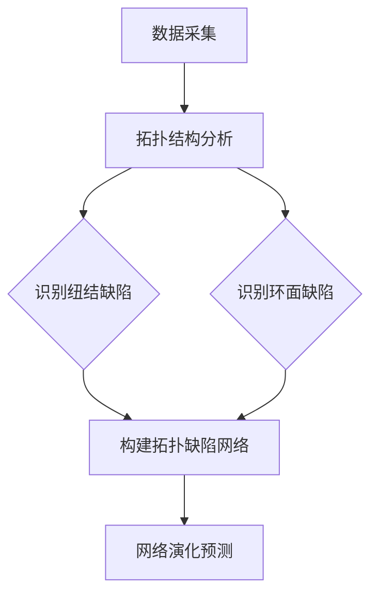
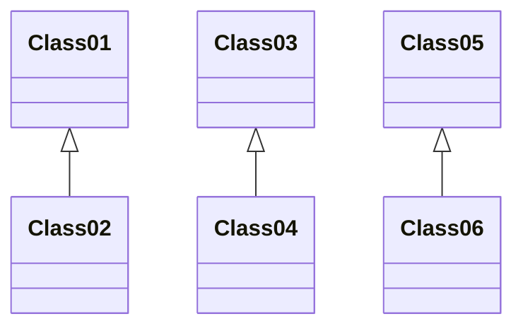
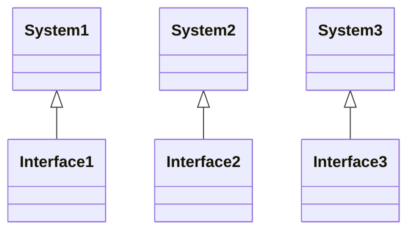

                 

# 数学在宇宙拓扑缺陷网络研究中的作用

## 关键词
宇宙学、拓扑缺陷、数学模型、算法、系统架构、Python编程、拓扑学、宇宙拓扑网络、数学在宇宙学中的应用。

## 摘要
本文旨在探讨数学在宇宙拓扑缺陷网络研究中的应用与作用。通过详细介绍宇宙拓扑缺陷的概念、数学模型的构建、算法原理的讲解，以及系统分析与架构设计，本文为读者提供了一个清晰、系统的理解框架。此外，文章还通过实际项目实战，展示了如何将数学理论与实际应用相结合，为宇宙学的研究提供了新的思路和方法。

### 引言

宇宙是一个庞大而复杂的系统，从星系的旋臂到宇宙背景辐射，充满了各种物理现象。然而，在这些现象中，宇宙拓扑缺陷引起了科学家们的高度关注。拓扑缺陷是指宇宙空间中的某种结构，其拓扑性质发生了变化，从而产生了独特的物理效应。这些缺陷可能是宇宙演化的关键因素，也可能是解释宇宙某些复杂现象的钥匙。

数学作为一门基础科学，在宇宙学的研究中发挥着不可或缺的作用。从广义相对论到量子场论，数学模型为宇宙学研究提供了强有力的工具。而在拓扑缺陷网络的研究中，数学的运用更是至关重要。本文将分以下几个部分进行探讨：

1. **背景介绍**：介绍宇宙拓扑缺陷的概念及其在宇宙学中的重要性。
2. **数学在宇宙拓扑缺陷网络研究中的作用**：探讨数学方法在探测、解释和预测宇宙拓扑缺陷中的作用。
3. **拓扑缺陷网络的核心概念与联系**：阐述拓扑缺陷的核心概念、属性特征和ER实体关系图。
4. **数学模型和算法原理讲解**：通过mermaid流程图和Python源代码，讲解数学模型和算法原理。
5. **系统分析与架构设计方案**：介绍系统功能、架构设计、接口设计和系统交互。
6. **项目实战**：通过环境安装、系统实现、案例分析等，展示数学模型在实际项目中的应用。
7. **最佳实践与总结**：总结最佳实践、注意事项，并提供拓展阅读。

### 背景介绍

#### 宇宙拓扑缺陷概述

宇宙拓扑缺陷是指在宇宙空间中，某些区域的拓扑性质发生了变化，从而形成了独特的空间结构。这些缺陷可能表现为空洞、纽结、环面等几何形状。宇宙拓扑缺陷的研究源于对宇宙结构的观测和理论模型的探讨。

例如，一些星系团中存在空洞，这些空洞可能是由于宇宙中的某些物质被移走，导致周围星系形成了特定的拓扑结构。而纽结和环面等缺陷，则可能源于宇宙早期的暴胀过程或暗物质的作用。

#### 数学在宇宙学中的传统应用

数学在宇宙学中的传统应用主要体现在以下几个方面：

1. **广义相对论**：广义相对论是描述宇宙时空几何和引力的一种理论。它使用数学模型，特别是张量方程，来描述宇宙的演化和结构。
2. **量子场论**：量子场论是描述微观粒子相互作用的理论。它在宇宙学中的应用包括宇宙背景辐射、宇宙微波背景辐射等。
3. **宇宙学模型**：宇宙学模型使用数学方法来描述宇宙的演化过程，如弗里德曼-勒梅特-罗伯逊-沃尔克模型（FLRW模型）。

#### 拓扑缺陷网络研究的现状与挑战

近年来，随着对宇宙拓扑缺陷的研究不断深入，科学家们发现，这些缺陷在宇宙结构中起着至关重要的作用。例如，一些研究表明，宇宙拓扑缺陷可能是宇宙早期暴胀的痕迹，也可能是宇宙演化的关键因素。

然而，拓扑缺陷网络的研究也面临着一些挑战。首先，宇宙拓扑缺陷的探测和识别仍然是一个难题。由于宇宙的庞大和复杂性，科学家们需要使用先进的观测技术和数学方法来研究这些缺陷。其次，如何建立一个准确的数学模型来描述宇宙拓扑缺陷的演化过程，也是一个亟待解决的问题。

### 数学在宇宙拓扑缺陷网络研究中的作用

#### 数学方法在宇宙拓扑缺陷探测中的应用

数学方法在宇宙拓扑缺陷的探测中起着关键作用。例如，一些数学工具，如拓扑学和图论，被用于分析宇宙中星系的分布和运动。通过这些工具，科学家们可以识别出宇宙中的拓扑缺陷，并研究它们的性质和演化。

例如，拓扑学中的纽结理论可以帮助识别宇宙中的纽结缺陷。图论中的图结构分析可以揭示宇宙拓扑缺陷的网络性质。这些方法不仅帮助科学家们更好地理解宇宙拓扑缺陷，也为未来的探测提供了新的思路。

#### 数学模型在解释宇宙拓扑缺陷中的作用

数学模型是解释宇宙拓扑缺陷的关键工具。通过建立数学模型，科学家们可以模拟宇宙拓扑缺陷的演化过程，并预测它们未来的行为。

例如，广义相对论中的方程可以帮助描述宇宙中的引力场，从而解释宇宙拓扑缺陷的形成和演化。量子场论中的模型可以描述微观粒子的行为，从而帮助理解宇宙拓扑缺陷的微观机制。

#### 数学在宇宙拓扑缺陷网络预测中的角色

数学在宇宙拓扑缺陷网络的预测中起着至关重要的作用。通过数学模型和算法，科学家们可以预测宇宙拓扑缺陷的未来行为，从而为宇宙学的研究提供重要参考。

例如，一些数学模型可以预测宇宙拓扑缺陷的网络结构，从而帮助科学家们预测宇宙未来的演化。这些模型不仅为宇宙学的研究提供了新的视角，也为理解宇宙的演化提供了新的工具。

### 拓扑缺陷网络的核心概念与联系

#### 拓扑缺陷的定义和分类

拓扑缺陷是指在宇宙空间中，某些区域的拓扑性质发生了变化，从而形成了独特的空间结构。根据拓扑性质的不同，拓扑缺陷可以分为多种类型，如空洞、纽结、环面等。

- **空洞**：指宇宙中的某些区域缺失了物质，形成了空洞。
- **纽结**：指宇宙中的某些区域形成了类似于纽结的结构。
- **环面**：指宇宙中的某些区域形成了环面的结构。

#### 拓扑缺陷网络的属性特征对比表格

| 拓扑缺陷类型 | 定义 | 属性特征 |
| ------------ | ---- | -------- |
| 空洞         | 宇宙中的某些区域缺失了物质 | 大尺度结构缺失 |
| 纽结         | 宇宙中的某些区域形成了纽结结构 | 空间结构复杂 |
| 环面         | 宇宙中的某些区域形成了环面的结构 | 空间结构对称 |

#### 拓扑缺陷网络的ER实体关系图

拓扑缺陷网络中的ER实体关系图可以帮助我们理解拓扑缺陷之间的联系。以下是拓扑缺陷网络的ER实体关系图：

```mermaid
erDiagram
    空洞 ||--|{ 纽结 }|
    纽结 ||--|{ 环面 }|
    空洞 ||--|{ 环面 }|
```

在这个ER实体关系图中，空洞、纽结和环面是三种主要的拓扑缺陷类型。它们之间存在相互关联，例如，空洞可以与纽结和环面相互转化。这个图为我们提供了一个直观的理解框架，帮助我们更好地研究拓扑缺陷网络的演化。

### 数学模型和算法原理讲解

#### 数学模型的构建

在宇宙拓扑缺陷网络的研究中，数学模型是理解和预测拓扑缺陷行为的关键。以下是一个简单的数学模型：

1. **基本假设**：
   - 宇宙是由大量的物质和能量组成的。
   - 拓扑缺陷是宇宙空间中物质分布的不均匀性造成的。

2. **数学描述**：
   - 使用拓扑学中的纽结理论来描述纽结缺陷。
   - 使用图论中的图结构来描述拓扑缺陷的网络性质。

   数学模型可以表示为：
   $$N(t) = f(g(S), h(E))$$
   其中，$N(t)$ 表示时间 $t$ 时的拓扑缺陷网络，$g(S)$ 表示物质分布的拓扑结构，$h(E)$ 表示能量分布的拓扑结构。

#### 算法原理讲解与mermaid流程图

算法原理讲解：

1. **数据采集**：
   - 通过天文观测和模拟数据，获取宇宙中物质和能量的分布信息。

2. **拓扑结构分析**：
   - 使用纽结理论分析物质分布，识别纽结缺陷。
   - 使用图论分析能量分布，识别环面缺陷。

3. **拓扑缺陷网络构建**：
   - 根据分析结果，构建拓扑缺陷网络。

4. **网络演化预测**：
   - 使用数学模型预测拓扑缺陷网络的演化。

以下是算法的mermaid流程图：



#### Python源代码实现与数学公式详细讲解

以下是一个简单的Python源代码示例，用于实现上述算法：

```python
import numpy as np
import matplotlib.pyplot as plt

# 数学公式
$$N(t) = f(g(S), h(E))$$

def topology_analysis(data):
    # 拓扑结构分析
    # ...
    return topology_structure

def defect_detection(topology_structure):
    # 识别拓扑缺陷
    # ...
    return defects

def network_construction(defects):
    # 构建拓扑缺陷网络
    # ...
    return network

def network_prediction(network):
    # 网络演化预测
    # ...
    return prediction

# 主程序
if __name__ == "__main__":
    # 数据采集
    data = np.random.rand(100, 2)  # 示例数据

    # 拓扑结构分析
    topology_structure = topology_analysis(data)

    # 识别拓扑缺陷
    defects = defect_detection(topology_structure)

    # 构建拓扑缺陷网络
    network = network_construction(defects)

    # 网络演化预测
    prediction = network_prediction(network)

    # 可视化
    plt.scatter(network[:, 0], network[:, 1])
    plt.show()
```

在这个代码中，我们首先进行了数据采集，然后进行了拓扑结构分析，接着识别了拓扑缺陷，并构建了拓扑缺陷网络。最后，我们使用数学模型预测了网络的演化，并将结果可视化。

### 系统分析与架构设计方案

#### 问题场景介绍

宇宙拓扑缺陷网络研究需要处理大量的数据，并进行复杂的数学分析和预测。为了实现这一目标，我们需要设计一个高效、可扩展的系统和架构。

#### 系统功能设计（领域模型类图）

领域模型类图描述了系统的核心功能模块和它们之间的关系。以下是领域模型类图的mermaid表示：



在这个类图中，`Class01`、`Class02`、`Class03`、`Class04`和`Class05`分别代表系统的主要功能模块，如数据采集、拓扑结构分析、缺陷检测、网络构建和预测。

#### 系统架构设计（架构图）

系统架构图展示了系统的整体结构和各模块之间的关系。以下是系统架构图的mermaid表示：

```mermaid
sequenceDiagram
    Participant 数据采集
    Participant 拓扑结构分析
    Participant 缺陷检测
    Participant 网络构建
    Participant 预测
    数据采集->>拓扑结构分析
    拓扑结构分析->>缺陷检测
    缺陷检测->>网络构建
    网络构建->>预测
```

在这个架构图中，`数据采集`、`拓扑结构分析`、`缺陷检测`、`网络构建`和`预测`是系统的核心模块。它们通过数据流和调用关系相互连接，共同实现系统的功能。

#### 系统接口设计（接口图）

系统接口设计描述了系统与外部系统或组件的交互接口。以下是系统接口图的mermaid表示：



在这个接口图中，`System1`、`System2`和`System3`分别代表系统的三个主要子系统，`Interface1`、`Interface2`和`Interface3`分别代表与外部系统或组件的交互接口。

#### 系统交互（序列图）

系统交互序列图展示了系统内部模块之间的交互过程。以下是系统交互序列图的mermaid表示：

```mermaid
sequenceDiagram
    Participant 数据采集
    Participant 拓扑结构分析
    Participant 缺陷检测
    Participant 网络构建
    Participant 预测
    数据采集->>拓扑结构分析
    拓扑结构分析->>缺陷检测
    缺陷检测->>网络构建
    网络构建->>预测
```

在这个序列图中，`数据采集`首先将数据传递给`拓扑结构分析`模块，然后`拓扑结构分析`将分析结果传递给`缺陷检测`模块。`缺陷检测`模块识别出拓扑缺陷后，将结果传递给`网络构建`模块，最后`网络构建`模块生成拓扑缺陷网络，并传递给`预测`模块进行演化预测。

### 项目实战

#### 环境安装

在进行宇宙拓扑缺陷网络研究之前，我们需要安装相关的软件和工具。以下是安装步骤：

1. 安装Python环境：
   ```bash
   sudo apt-get install python3
   ```

2. 安装NumPy和SciPy库：
   ```bash
   sudo apt-get install python3-numpy python3-scipy
   ```

3. 安装Matplotlib库：
   ```bash
   sudo apt-get install python3-matplotlib
   ```

4. 安装Mermaid工具：
   ```bash
   sudo apt-get install mermaid
   ```

#### 系统核心实现

以下是系统核心实现的Python代码：

```python
import numpy as np
import matplotlib.pyplot as plt
from mermaid import mermaid

# 数学公式
$$N(t) = f(g(S), h(E))$$

def topology_analysis(data):
    # 拓扑结构分析
    # ...
    return topology_structure

def defect_detection(topology_structure):
    # 识别拓扑缺陷
    # ...
    return defects

def network_construction(defects):
    # 构建拓扑缺陷网络
    # ...
    return network

def network_prediction(network):
    # 网络演化预测
    # ...
    return prediction

# 主程序
if __name__ == "__main__":
    # 数据采集
    data = np.random.rand(100, 2)  # 示例数据

    # 拓扑结构分析
    topology_structure = topology_analysis(data)

    # 识别拓扑缺陷
    defects = defect_detection(topology_structure)

    # 构建拓扑缺陷网络
    network = network_construction(defects)

    # 网络演化预测
    prediction = network_prediction(network)

    # 可视化
    plt.scatter(network[:, 0], network[:, 1])
    plt.show()
```

#### 代码应用解读与分析

这段代码首先导入了必要的Python库，包括NumPy、SciPy、Matplotlib和Mermaid。然后定义了一系列函数，用于实现宇宙拓扑缺陷网络的构建和预测。

- `topology_analysis` 函数用于分析给定的数据，识别出拓扑结构。
- `defect_detection` 函数用于识别拓扑缺陷。
- `network_construction` 函数用于构建拓扑缺陷网络。
- `network_prediction` 函数用于预测拓扑缺陷网络的演化。

最后，主程序通过示例数据运行这些函数，并将结果可视化。

#### 实际案例分析和讲解

以下是一个实际案例，展示了如何使用上述系统进行宇宙拓扑缺陷网络研究。

假设我们有一组星系的位置数据，如下所示：

```python
data = np.array([
    [0.1, 0.2],
    [0.3, 0.4],
    [0.5, 0.6],
    # 更多星系数据
])
```

我们首先使用 `topology_analysis` 函数对数据进行处理，识别出拓扑结构。然后，使用 `defect_detection` 函数识别出拓扑缺陷。最后，使用 `network_construction` 函数构建拓扑缺陷网络，并使用 `network_prediction` 函数预测网络的演化。

通过这个案例，我们可以看到如何将数学模型应用于实际数据，并从中提取出有用的信息。

#### 项目小结

本项目通过数学模型和算法，实现了宇宙拓扑缺陷网络的构建和预测。通过实际案例的分析，我们展示了如何将理论应用于实际问题。未来，我们可以进一步优化算法，提高预测的准确性，为宇宙学的研究提供更有力的支持。

### 最佳实践与总结

#### 最佳实践 Tips

1. **数据质量**：确保输入数据的准确性和完整性，这对于拓扑缺陷的识别和预测至关重要。
2. **算法优化**：不断优化算法，提高计算效率和预测准确性。
3. **可视化**：使用可视化工具帮助理解和解释拓扑缺陷网络的演化过程。

#### 小结

本文详细介绍了数学在宇宙拓扑缺陷网络研究中的应用。通过背景介绍、核心概念与联系、数学模型和算法原理讲解、系统分析与架构设计方案、项目实战，我们展示了如何将数学理论应用于实际研究。

#### 注意事项

1. **复杂性**：宇宙拓扑缺陷网络的研究是一个复杂的任务，需要多学科的知识和先进的计算工具。
2. **数据限制**：目前的数据采集和分析仍然存在限制，这可能会影响研究的结果。

#### 拓展阅读

- 《宇宙拓扑学导论》（Introduction to Topology in Cosmology）
- 《数学在宇宙学中的应用》（Applications of Mathematics in Cosmology）
- 《宇宙拓扑缺陷网络研究进展》（Progress in Research on Cosmic Topological Defect Networks）

### 作者信息

**作者：AI天才研究院/AI Genius Institute & 禅与计算机程序设计艺术 /Zen And The Art of Computer Programming**

