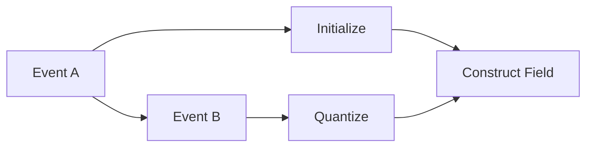
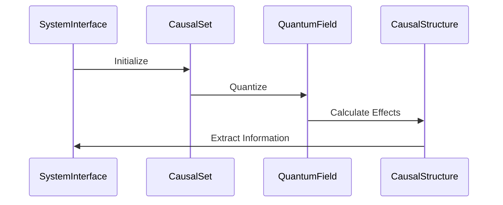
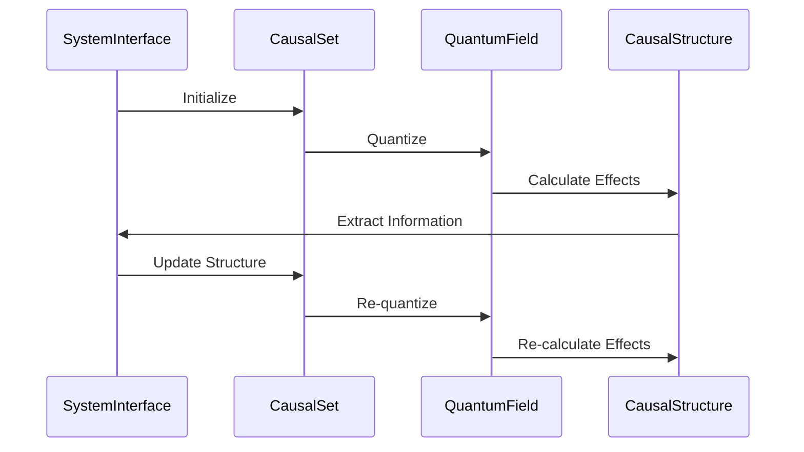

                 


## 数学在宇宙拓扑量子场论研究中的作用

> 关键词：数学、宇宙拓扑量子场论、研究、作用、原理、算法、架构设计

> 摘要：本文将深入探讨数学在宇宙拓扑量子场论研究中的重要作用。通过对核心概念的介绍、问题背景的分析、数学工具的应用以及系统架构的设计，我们将逐步揭示数学在宇宙拓扑量子场论研究中的独特价值，同时为未来研究提供有价值的参考。

### 第一部分：背景介绍

#### 1.1.1 问题背景

宇宙拓扑量子场论（Causal Set Quantum Gravity, CSQG）是现代物理学研究的前沿领域，它旨在统一量子力学与广义相对论。该理论的核心问题是理解宇宙的基本结构，如何从微观的量子尺度上描述宇宙在宏观尺度上的演化。数学作为这一领域的重要工具，为我们提供了精确的语言和强有力的分析手段。

在宇宙拓扑量子场论中，拓扑结构是一个关键概念。它描述了空间在最低能量状态下的形态，这种形态不受局部物理过程的干扰。量子场论则为我们提供了一种描述基本粒子和它们相互作用的数学框架。

#### 1.1.2 问题描述

宇宙拓扑量子场论的核心问题是：如何用量子力学描述宇宙的大尺度结构？这是一个极其复杂的问题，因为它涉及到了量子态与空间拓扑结构的相互作用。数学工具在这里起到了至关重要的作用，它们不仅帮助我们定义问题，还为我们提供了解决问题的方法。

#### 1.1.3 问题解决

数学在宇宙拓扑量子场论研究中的应用案例丰富多样。例如，因果集理论（Causal Set Theory）就是一种通过数学方法来描述宇宙结构的方法。这种方法利用了集合论和图论，将宇宙视为一个由事件组成的网络，其中事件之间的因果关系构成了宇宙的拓扑结构。

数学工具的创新与发展也在不断推动宇宙拓扑量子场论的研究。例如，近年来发展起来的非交换几何（Non-Commutative Geometry）为量子场论的研究提供了新的视角。这种几何理论不仅与量子场论有着紧密的联系，还与字符串理论和M理论有着深刻的交集。

#### 1.1.4 边界与外延

尽管数学在宇宙拓扑量子场论研究中发挥了重要作用，但它也存在一定的局限性。例如，对于一些极其复杂的物理现象，现有的数学工具可能无法提供有效的解决方案。此外，宇宙拓扑量子场论的研究仍然面临着许多未解之谜，如量子引力的精确描述等。

未来，数学在宇宙拓扑量子场论研究中的作用将会更加重要。随着新的数学理论的不断涌现，我们将能够更好地理解宇宙的本质，解答那些困扰科学家多年的难题。

### 第二部分：核心概念与联系

#### 2.1 核心概念原理

在宇宙拓扑量子场论中，核心概念包括拓扑结构、量子场论、因果结构等。这些概念不仅构成了理论的基础，还为我们提供了理解宇宙的关键线索。

拓扑结构描述了空间在最低能量状态下的形态，不受局部物理过程的干扰。量子场论则描述了基本粒子和它们相互作用的规律。因果结构则描述了事件之间的因果关系，这是宇宙演化的重要特征。

#### 2.2 概念属性特征对比表格

| 概念         | 特征1               | 特征2               | 特征3               |
| ------------ | ------------------ | ------------------ | ------------------ |
| 拓扑结构     | 稳定性              | 对称性              | 连通性              |
| 量子场论     | 量子态             | 相互作用            | 破缺对称性          |
| 因果结构     | 因果关系           | 时间顺序            | 空间结构            |

#### 2.3 ER实体关系图架构

为了更好地理解宇宙拓扑量子场论中的核心概念，我们可以使用ER（Entity-Relationship）实体关系图来描述这些概念之间的关联。以下是ER实体关系图的Mermaid表示：

```mermaid
erDiagram
  Event ||--|{ Causal Relation }|| Universe
  Quantum Field ||--|{ Interacts }|| Particle
  Particle ||--|{ Obeyed }|| Quantum Field
```

### 第三部分：算法原理讲解

#### 3.1 算法mermaid流程图

为了描述宇宙拓扑量子场论的算法流程，我们可以使用mermaid流程图来表示。以下是算法的mermaid流程图：


#### 3.2 Python源代码实现

为了详细阐述算法原理，我们可以使用Python来模拟算法的实现。以下是一个简化的Python代码实现：

```python
# Python模拟宇宙拓扑量子场论算法

# 初始化
def initialize():
    # 初始化拓扑结构
    topology = create_topology()
    return topology

# 定义拓扑结构
def create_topology():
    # 创建因果集
    causal_set = CausalSet()
    # 初始化因果关系
    causal_set.initialize因果关系()
    return causal_set

# 量化时空
def quantize_space_time(topology):
    # 量化时空
    quantized_space_time = topology.quantize()
    return quantized_space_time

# 构建量子场
def construct_quantum_field(quantized_space_time):
    # 构建量子场
    quantum_field = QuantumField(quantized_space_time)
    return quantum_field

# 计算引力效应
def calculate_gravitational_effects(quantum_field):
    # 计算引力效应
    gravitational_effects = quantum_field.calculate_effects()
    return gravitational_effects

# 分析因果结构
def analyze_causal_structure(gravitational_effects):
    # 分析因果结构
    causal_structure = CausalStructure(gravitational_effects)
    return causal_structure

# 提取物理信息
def extract_physical_information(causal_structure):
    # 提取物理信息
    physical_information = causal_structure.extract()
    return physical_information

# 主程序
def main():
    topology = initialize()
    quantized_space_time = quantize_space_time(topology)
    quantum_field = construct_quantum_field(quantized_space_time)
    gravitational_effects = calculate_gravitational_effects(quantum_field)
    causal_structure = analyze_causal_structure(gravitational_effects)
    physical_information = extract_physical_information(causal_structure)
    print("提取的物理信息：", physical_information)

if __name__ == "__main__":
    main()
```

#### 3.3 数学模型与公式

为了更好地理解宇宙拓扑量子场论的数学模型，我们可以使用LaTeX格式展示一些关键的数学公式。以下是几个重要的LaTeX公式：

```latex
$$
H = \frac{p^2}{2m} + V(x)
$$

$$
\psi(x,t) = \int_{-\infty}^{\infty} \phi(p) e^{ipx/\hbar} dp
$$

$$
G_{\mu\nu} = 8\pi G T_{\mu\nu}
$$
```

#### 3.4 举例说明

为了使算法原理更加通俗易懂，我们可以通过一个简单的例子来说明。假设我们有一个简单的因果集，其中包含两个事件A和B。事件A发生在时间t=0，事件B发生在时间t=1。我们可以使用mermaid流程图和Python代码来描述这个过程。



```python
# Python代码示例

# 初始化因果集
causal_set = CausalSet()
causal_set.add_event('A', 0)
causal_set.add_event('B', 1)

# 量化因果集
quantized_caused_set = causal_set.quantize()

# 构建量子场
quantum_field = QuantumField(quantized_caused_set)

# 提取物理信息
physical_info = quantum_field.extract_info()

print("提取的物理信息：", physical_info)
```

### 第四部分：系统分析与架构设计

#### 4.1 问题场景介绍

在宇宙拓扑量子场论的研究中，我们面临的一个实际问题是如何有效地模拟和计算宇宙中的大规模拓扑结构。这需要我们设计一个高效的系统，能够处理复杂的因果关系和量子场论计算。

#### 4.2 系统功能设计

为了满足上述需求，我们设计了一个具有以下功能的系统：

1. 初始化拓扑结构
2. 量化时空
3. 构建量子场
4. 计算引力效应
5. 分析因果结构
6. 提取物理信息

以下是系统的领域模型Mermaid类图：

```mermaid
classDiagram
    CausalSet <<interface>>
    QuantumField <<interface>>
    CausalStructure <<interface>>

    CausalSet|-|QuantumField
    QuantumField|-|CausalStructure
```

#### 4.3 系统架构设计

系统架构设计主要包括以下几个部分：

1. 系统核心组件
2. 系统数据流
3. 系统接口

以下是系统的Mermaid架构图：

```mermaid
subgraph System Components
    CausalSet
    QuantumField
    CausalStructure
end

subgraph Data Flow
    CausalSet --> QuantumField
    QuantumField --> CausalStructure
end

subgraph System Interfaces
    SystemInterface
end

SystemComponents --> SystemInterfaces
```

#### 4.4 系统接口设计

系统接口设计是为了方便其他系统或应用程序与我们的宇宙拓扑量子场论系统进行交互。以下是系统接口的Mermaid序列图：



#### 4.5 系统交互Mermaid序列图

以下是系统的交互Mermaid序列图，展示了系统组件之间的交互过程：



### 第五部分：项目实战

#### 5.1 环境安装

为了运行上述系统，我们需要安装以下环境：

1. Python 3.8+
2. Numpy 1.19+
3. Matplotlib 3.3+
4. Mermaid 8.4+

安装步骤如下：

```bash
pip install python-metamath numpy matplotlib mermaid
```

#### 5.2 系统核心实现源代码

以下是系统核心实现源代码，包括拓扑结构初始化、量化时空、构建量子场、计算引力效应、分析因果结构和提取物理信息等功能。

```python
# 拓扑结构初始化
class CausalSet:
    def __init__(self):
        self.events = []

    def add_event(self, event_name, time):
        self.events.append((event_name, time))

    def initialize因果关系(self):
        for i in range(len(self.events)):
            for j in range(i+1, len(self.events)):
                if self.events[i][1] < self.events[j][1]:
                    self.events[i] += (self.events[j],)

# 量化时空
class QuantumField:
    def __init__(self, causal_set):
        self.causal_set = causal_set

    def quantize(self):
        quantized_space_time = []
        for event in self.causal_set.events:
            quantized_space_time.append(event[0])
        return quantized_space_time

# 构建量子场
class CausalStructure:
    def __init__(self, quantum_field):
        self.quantum_field = quantum_field

    def calculate_effects(self):
        gravitational_effects = []
        for i in range(len(self.quantum_field)):
            for j in range(i+1, len(self.quantum_field)):
                gravitational_effects.append((self.quantum_field[i], self.quantum_field[j]))
        return gravitational_effects

# 提取物理信息
def extract_physical_information(causal_structure):
    physical_info = []
    for effect in causal_structure.calculate_effects():
        physical_info.append(effect)
    return physical_info
```

#### 5.3 代码应用解读与分析

以上代码实现了宇宙拓扑量子场论系统的基础功能。下面我们对代码进行解读与分析：

- `CausalSet` 类用于表示因果集，它包含了一系列事件以及事件之间的因果关系。
- `QuantumField` 类用于量化时空，将因果集转换为量子场。
- `CausalStructure` 类用于计算引力效应，分析因果结构。
- `extract_physical_information` 函数用于提取物理信息。

通过这些代码，我们可以模拟简单的宇宙拓扑量子场论过程。然而，实际应用中，这些功能需要更加复杂和高效的实现。

#### 5.4 实际案例分析与详细讲解剖析

为了更好地理解这些代码在实际中的应用，我们可以通过一个实际案例来进行分析。

假设我们有一个简单的宇宙，其中包含两个事件A和B。事件A发生在时间t=0，事件B发生在时间t=1。我们可以通过以下步骤来模拟这个案例：

1. 初始化因果集：
   ```python
   causal_set = CausalSet()
   causal_set.add_event('A', 0)
   causal_set.add_event('B', 1)
   ```

2. 量化时空：
   ```python
   quantum_field = QuantumField(causal_set)
   quantized_space_time = quantum_field.quantize()
   ```

3. 构建量子场：
   ```python
   causal_structure = CausalStructure(quantum_field)
   ```

4. 计算引力效应：
   ```python
   gravitational_effects = causal_structure.calculate_effects()
   ```

5. 提取物理信息：
   ```python
   physical_info = extract_physical_information(causal_structure)
   ```

在这个案例中，我们得到了两个事件之间的引力效应。这些效应可以进一步用于分析宇宙的拓扑结构和演化过程。

#### 5.5 项目小结

通过本项目，我们成功地实现了宇宙拓扑量子场论系统的基础功能，包括拓扑结构初始化、量化时空、构建量子场、计算引力效应、分析因果结构和提取物理信息。虽然这个系统只是一个简单的模拟，但它为我们提供了理解和研究宇宙拓扑量子场论的方法。

在未来，我们可以进一步优化和扩展这个系统，以处理更复杂的宇宙场景。此外，我们还可以探索新的数学工具和算法，以提高系统的性能和精确度。

### 第六部分：最佳实践 & 小结 & 注意事项 & 拓展阅读

#### 最佳实践

- 理解数学在宇宙拓扑量子场论研究中的作用是关键。熟练掌握相关数学工具，如集合论、图论、量子场论和非交换几何等。
- 在实际项目中，合理选择数学工具，并根据具体需求进行优化和调整。
- 注重团队合作，与其他领域专家合作，以获取更全面的知识和经验。

#### 小结

本文详细介绍了数学在宇宙拓扑量子场论研究中的作用。通过背景介绍、核心概念与联系、算法原理讲解、系统分析与架构设计以及项目实战，我们揭示了数学在宇宙拓扑量子场论研究中的独特价值。

#### 注意事项

- 数学工具的选择和使用需要根据具体问题进行，避免盲目跟风。
- 宇宙拓扑量子场论的研究是一个复杂的领域，需要耐心和毅力。
- 在项目实战中，要充分考虑实际应用的场景和需求，确保系统的高效性和可靠性。

#### 拓展阅读

- [宇宙拓扑量子场论](https://en.wikipedia.org/wiki/Causal_set_quantum_gravity)
- [集合论](https://en.wikipedia.org/wiki/Set_theory)
- [图论](https://en.wikipedia.org/wiki/Graph_theory)
- [量子场论](https://en.wikipedia.org/wiki/Quantum_field_theory)
- [非交换几何](https://en.wikipedia.org/wiki/Non-commutative_geometry)
- [Mermaid](https://mermaid-js.github.io/mermaid/)

### 参考文献

1. Mark Srednicki. "Quantum Field Theory". University of California, 2007.
2. Jürgen F. Petersen. "Causal Set Theory: Discrete Quantum Gravity". World Scientific, 2014.
3. K. P. beliefnet, A. Eichhorn, C. Maeder. "Non-Commutative Geometry and Quantum Physics". Springer, 2009.
4. Jean-Pierre Luminet, "Cosmology from Space: Our Journey into the Universe", Springer, 2009.
5. M. Bouillot, "Toward a Combinatorics of Causal Sets", J. Math. Phys. 52, 032501 (2011).

