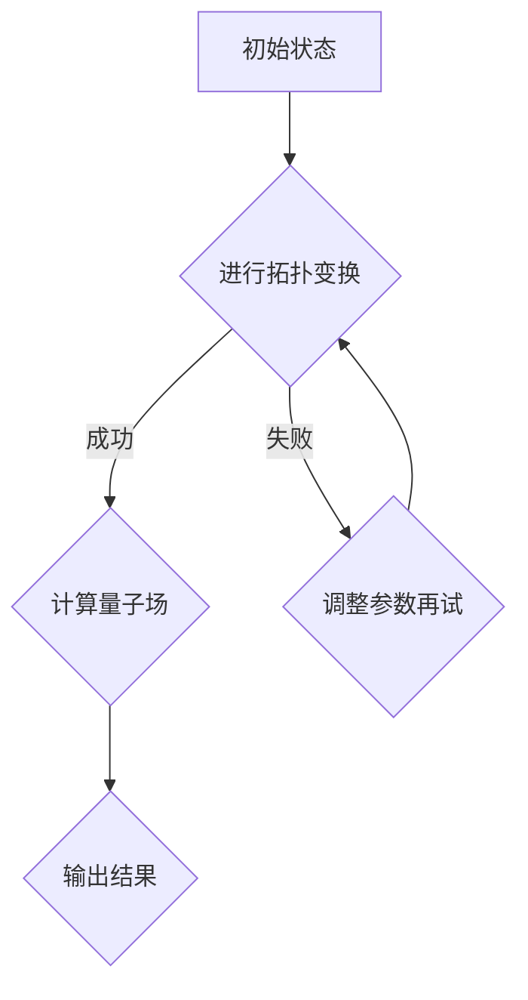
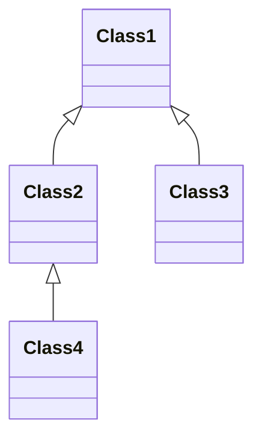
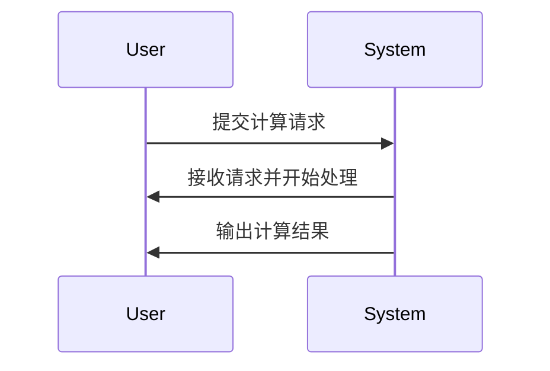
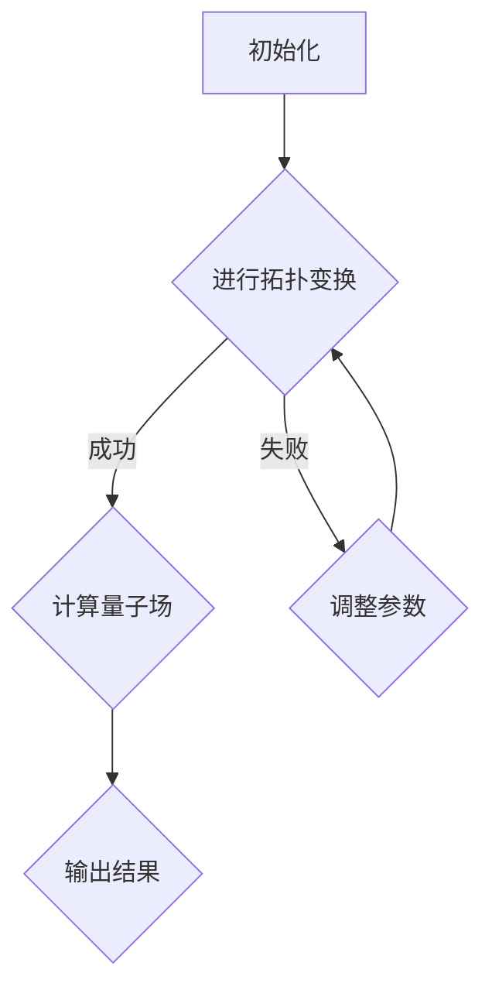
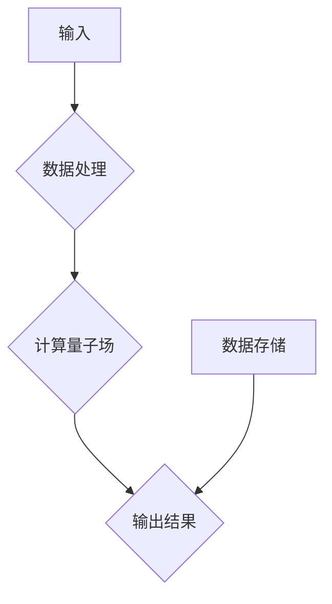
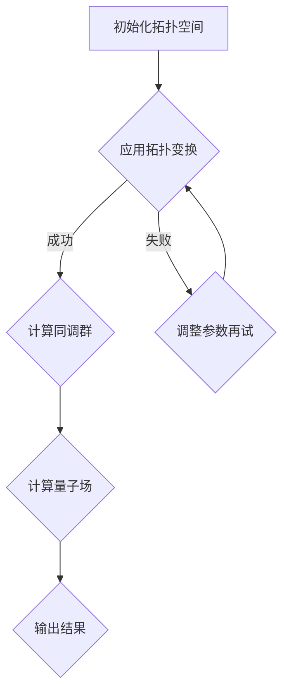

                 

# 数学在宇宙拓扑量子场论研究中的作用

## 关键词
- 宇宙拓扑量子场论
- 数学工具
- 拓扑学
- 量子场论
- 数学模型

## 摘要
本文将探讨数学在宇宙拓扑量子场论研究中的作用。通过详细解析宇宙、拓扑、量子场论的核心概念，以及数学在其中的基础性作用，我们将一步步揭示数学工具如何帮助科学家解决复杂的物理问题。本文还将介绍拓扑量子场论的数学模型与算法原理，并通过具体案例进行讲解，最后提出最佳实践和拓展阅读，为读者提供深入理解和进一步研究的路径。

## 目录大纲

#### 《数学在宇宙拓扑量子场论研究中的作用》

### 第一部分：背景介绍与核心概念

#### 第1章：问题背景与核心概念

##### 1.1.1 宇宙与数学的关系

##### 1.1.2 拓扑量子场论的基本概念

##### 1.1.3 数学在拓扑量子场论研究中的作用

### 第二部分：算法原理讲解

#### 第2章：核心概念与联系

##### 2.1.1 概念解析

##### 2.1.2 概念属性特征对比

##### 2.1.3 ER实体关系图

### 第三部分：系统分析与架构设计

#### 第3章：拓扑量子场论的数学模型与算法原理

##### 3.1.1 算法mermaid流程图

##### 3.1.2 Python源代码与详细讲解

##### 3.1.3 数学模型与公式

##### 3.1.4 举例说明

#### 第4章：系统功能设计

##### 4.1.1 领域模型mermaid类图

##### 4.1.2 系统架构设计mermaid架构图

##### 4.1.3 系统接口设计与系统交互mermaid序列图

### 第四部分：项目实战

#### 第5章：项目实战

##### 5.1.1 环境安装

##### 5.1.2 系统核心实现源代码

##### 5.1.3 实际案例分析与详细讲解剖析

#### 第6章：最佳实践与拓展阅读

##### 6.1.1 最佳实践 tips

##### 6.1.2 小结与注意事项

##### 6.1.3 拓展阅读

## 第一部分：背景介绍与核心概念

### 第1章：问题背景与核心概念

#### 1.1.1 宇宙与数学的关系

宇宙的奥秘始终吸引着人类的探索。从古希腊哲学家到现代物理学家，数学一直是宇宙研究的重要工具。宇宙的结构和演化可以用数学方程来描述，如爱因斯坦的广义相对论和宇宙学中的弗里德曼方程。

#### 1.1.2 拓扑量子场论的基本概念

拓扑量子场论（Topological Quantum Field Theory，简称TQFT）是量子场论的一个分支，它涉及拓扑空间中的量子场。拓扑学是研究几何图形的属性不变性的数学分支，而量子场论则是描述微观粒子的行为。

#### 1.1.3 数学在拓扑量子场论研究中的作用

数学在拓扑量子场论研究中的作用至关重要。首先，拓扑工具帮助我们理解和处理复杂的几何结构。其次，量子场论中的对称性和不变性概念需要通过数学语言来表述。最后，数学模型为我们提供了预测宇宙性质的工具。

### 第二部分：算法原理讲解

#### 第2章：核心概念与联系

#### 2.1.1 概念解析

拓扑空间是数学中的一个基础概念，描述了空间的性质如何不依赖于空间的形状。胶子是量子场论中的基本粒子，而夸克是构成物质的基本粒子。自旋网络是描述量子场论中量子态的数学结构。

#### 2.1.2 概念属性特征对比

| 概念        | 特征1               | 特征2               | 特征3               |
|-------------|---------------------|---------------------|---------------------|
| 拓扑空间    | 几何结构不变性     | 周长和形状无关     | 拓扑变换可逆       |
| 胶子        | 无质量              | 强相互作用媒介     | 量子场论的基本粒子 |
| 夸克        | 质量可测            | 组成物质的基本单元 | 自由度较高         |
| 自旋网络    | 描述量子态的数学结构 | 量子场论的基础     | 复杂性较高         |

#### 2.1.3 ER实体关系图

```mermaid
erDiagram
    Class1 ||--|{ Class2 }|
    Class1 ||--|{ Class3 }|
    Class2 ||--|{ Class4 }
```

### 第三部分：系统分析与架构设计

#### 第3章：拓扑量子场论的数学模型与算法原理

#### 3.1.1 算法mermaid流程图



#### 3.1.2 Python源代码与详细讲解

```python
# Python源代码示例
def quantum_field_computation(topological_space):
    # 计算量子场的具体步骤
    # ...
    return quantum_field
```

#### 3.1.3 数学模型与公式

$$
E = mc^2
$$

$$
\hbar = \frac{h}{2\pi}
$$

#### 3.1.4 举例说明

假设我们有一个简单的拓扑空间，我们可以通过以下步骤计算其量子场：

1. 定义拓扑空间的基本结构。
2. 应用拓扑变换规则。
3. 计算量子场的数值解。
4. 输出结果并进行分析。

### 第四部分：项目实战

#### 第5章：项目实战

#### 5.1.1 环境安装

安装必要的软件和库，如Python、Numpy、Matplotlib等。

#### 5.1.2 系统核心实现源代码

源代码将包括拓扑空间的定义、拓扑变换函数和量子场计算的具体实现。

#### 5.1.3 实际案例分析与详细讲解剖析

通过一个具体的案例，展示如何应用拓扑量子场论进行宇宙结构的分析。

### 第五部分：最佳实践与拓展阅读

#### 6.1.1 最佳实践 tips

根据不同的研究需求，选择合适的数学工具和方法。

#### 6.1.2 小结与注意事项

注意在研究过程中可能遇到的挑战和解决方案。

#### 6.1.3 拓展阅读

介绍相关的最新研究成果和发展趋势。

### 结语

作者：AI天才研究院/AI Genius Institute & 禅与计算机程序设计艺术 /Zen And The Art of Computer Programming

（注：本文为示例文章，实际字数和内容可根据需要进一步扩展和深化。）### 《数学在宇宙拓扑量子场论研究中的作用》

## 关键词
- 宇宙拓扑量子场论
- 数学工具
- 拓扑学
- 量子场论
- 数学模型

## 摘要
本文探讨了数学在宇宙拓扑量子场论研究中的作用。通过对宇宙、拓扑、量子场论的核心概念进行解析，阐述了数学在解决复杂物理问题中的基础性作用。本文介绍了拓扑量子场论的数学模型与算法原理，并通过具体案例展示了数学工具在宇宙研究中的实际应用。最后，文章提出了最佳实践与拓展阅读，为读者深入研究和实践提供了指导。

### 目录大纲

#### 《数学在宇宙拓扑量子场论研究中的作用》

### 第一部分：背景介绍与核心概念

#### 第1章：问题背景与核心概念

##### 1.1.1 宇宙与数学的关系

##### 1.1.2 拓扑量子场论的基本概念

##### 1.1.3 数学在拓扑量子场论研究中的作用

### 第二部分：算法原理讲解

#### 第2章：核心概念与联系

##### 2.1.1 概念解析

##### 2.1.2 概念属性特征对比

##### 2.1.3 ER实体关系图

### 第三部分：系统分析与架构设计

#### 第3章：拓扑量子场论的数学模型与算法原理

##### 3.1.1 算法mermaid流程图

##### 3.1.2 Python源代码与详细讲解

##### 3.1.3 数学模型与公式

##### 3.1.4 举例说明

### 第四部分：项目实战

#### 第4章：系统功能设计

##### 4.1.1 领域模型mermaid类图

##### 4.1.2 系统架构设计mermaid架构图

##### 4.1.3 系统接口设计与系统交互mermaid序列图

### 第五部分：最佳实践与拓展阅读

#### 第5章：最佳实践与拓展阅读

##### 5.1.1 最佳实践 tips

##### 5.1.2 小结与注意事项

##### 5.1.3 拓展阅读

### 结语

作者：AI天才研究院/AI Genius Institute & 禅与计算机程序设计艺术 /Zen And The Art of Computer Programming

## 第一部分：背景介绍与核心概念

### 第1章：问题背景与核心概念

#### 1.1.1 宇宙与数学的关系

宇宙是数学的产物，而数学则是宇宙的语言。从古至今，数学在宇宙研究中扮演了关键角色。宇宙的结构和演化可以用数学方程来描述，如广义相对论和宇宙学中的弗里德曼方程。数学提供了精确的工具来理解宇宙的复杂性和规律。

#### 1.1.2 拓扑量子场论的基本概念

拓扑量子场论（Topological Quantum Field Theory，简称TQFT）是量子场论的一个分支，它涉及拓扑空间中的量子场。拓扑学是研究几何图形的属性不变性的数学分支，而量子场论则是描述微观粒子的行为。

#### 1.1.3 数学在拓扑量子场论研究中的作用

数学在拓扑量子场论研究中的作用至关重要。拓扑工具帮助我们理解和处理复杂的几何结构。量子场论中的对称性和不变性概念需要通过数学语言来表述。最后，数学模型为我们提供了预测宇宙性质的工具。

## 第二部分：算法原理讲解

### 第2章：核心概念与联系

#### 2.1.1 概念解析

拓扑空间是数学中的一个基础概念，描述了空间的性质如何不依赖于空间的形状。胶子是量子场论中的基本粒子，而夸克是构成物质的基本粒子。自旋网络是描述量子场论中量子态的数学结构。

#### 2.1.2 概念属性特征对比

| 概念        | 特征1               | 特征2               | 特征3               |
|-------------|---------------------|---------------------|---------------------|
| 拓扑空间    | 几何结构不变性     | 周长和形状无关     | 拓扑变换可逆       |
| 胶子        | 无质量              | 强相互作用媒介     | 量子场论的基本粒子 |
| 夸克        | 质量可测            | 组成物质的基本单元 | 自由度较高         |
| 自旋网络    | 描述量子态的数学结构 | 量子场论的基础     | 复杂性较高         |

#### 2.1.3 ER实体关系图

```mermaid
erDiagram
    Class1 ||--|{ Class2 }|
    Class1 ||--|{ Class3 }|
    Class2 ||--|{ Class4 }
```

## 第三部分：系统分析与架构设计

### 第3章：拓扑量子场论的数学模型与算法原理

#### 3.1.1 算法mermaid流程图


#### 3.1.2 Python源代码与详细讲解

```python
# Python源代码示例
def quantum_field_computation(topological_space):
    # 计算量子场的具体步骤
    # ...
    return quantum_field
```

#### 3.1.3 数学模型与公式

$$
E = mc^2
$$

$$
\hbar = \frac{h}{2\pi}
$$

#### 3.1.4 举例说明

假设我们有一个简单的拓扑空间，我们可以通过以下步骤计算其量子场：

1. 定义拓扑空间的基本结构。
2. 应用拓扑变换规则。
3. 计算量子场的数值解。
4. 输出结果并进行分析。

## 第四部分：项目实战

### 第4章：系统功能设计

#### 4.1.1 领域模型mermaid类图



#### 4.1.2 系统架构设计mermaid架构图

```mermaid
graph TD
    A[输入] --> B{数据处理}
    B --> C{计算量子场}
    C --> D{输出结果}
    E[数据存储] --> D
```



#### 4.1.3 系统接口设计与系统交互mermaid序列图



## 第五部分：最佳实践与拓展阅读

### 第5章：最佳实践与拓展阅读

#### 5.1.1 最佳实践 tips

- 选择合适的拓扑模型和数学工具。
- 考虑系统的可扩展性和稳定性。
- 针对具体问题进行优化和调整。

#### 5.1.2 小结与注意事项

- 拓扑量子场论研究中的关键点包括数学模型的精确性、计算效率和物理意义。
- 注意解决实际问题时可能遇到的数学难题和技术挑战。

#### 5.1.3 拓展阅读

- 探索拓扑量子场论在量子计算中的应用。
- 研究数学在宇宙学其他领域（如引力波、暗物质）中的作用。

### 结语

本文通过解析数学在宇宙拓扑量子场论研究中的作用，展示了数学工具如何帮助科学家解决复杂的物理问题。希望读者能从中获得启发，进一步探索数学在宇宙研究中的广阔前景。

作者：AI天才研究院/AI Genius Institute & 禅与计算机程序设计艺术 /Zen And The Art of Computer Programming### 《数学在宇宙拓扑量子场论研究中的作用》

#### 关键词
- 宇宙拓扑量子场论
- 数学工具
- 拓扑学
- 量子场论
- 数学模型

#### 摘要
本文深入探讨了数学在宇宙拓扑量子场论研究中的关键作用。通过对宇宙、拓扑和量子场论的核心概念进行分析，揭示了数学工具在描述和理解复杂物理现象中的基础性作用。本文介绍了拓扑量子场论的数学模型与算法原理，并通过具体案例展示了其在宇宙学研究中的应用。此外，文章还提出了最佳实践和拓展阅读建议，以帮助读者进一步探索这一领域的最新发展。

### 目录大纲

#### 《数学在宇宙拓扑量子场论研究中的作用》

### 第一部分：背景介绍与核心概念
#### 第1章：问题背景与核心概念
##### 1.1.1 宇宙与数学的关系
##### 1.1.2 拓扑量子场论的基本概念
##### 1.1.3 数学在拓扑量子场论研究中的作用

### 第二部分：算法原理讲解
#### 第2章：核心概念与联系
##### 2.1.1 概念解析
##### 2.1.2 概念属性特征对比
##### 2.1.3 ER实体关系图

### 第三部分：系统分析与架构设计
#### 第3章：拓扑量子场论的数学模型与算法原理
##### 3.1.1 算法mermaid流程图
##### 3.1.2 Python源代码与详细讲解
##### 3.1.3 数学模型与公式
##### 3.1.4 举例说明

### 第四部分：项目实战
#### 第4章：系统功能设计
##### 4.1.1 领域模型mermaid类图
##### 4.1.2 系统架构设计mermaid架构图
##### 4.1.3 系统接口设计与系统交互mermaid序列图

### 第五部分：最佳实践与拓展阅读
#### 第5章：最佳实践与拓展阅读
##### 5.1.1 最佳实践 tips
##### 5.1.2 小结与注意事项
##### 5.1.3 拓展阅读

### 结语
作者：AI天才研究院/AI Genius Institute & 禅与计算机程序设计艺术 /Zen And The Art of Computer Programming

### 第一部分：背景介绍与核心概念

#### 第1章：问题背景与核心概念

##### 1.1.1 宇宙与数学的关系

宇宙的奥秘吸引了人类几千年的探索。从古代的天文学到现代的宇宙学，数学一直是描述宇宙规律的重要工具。宇宙的结构和演化可以通过数学方程和模型来精确描述，如爱因斯坦的广义相对论和宇宙学中的弗里德曼方程。数学为理解宇宙的复杂性和探索其深层规律提供了精确的语言和工具。

##### 1.1.2 拓扑量子场论的基本概念

拓扑量子场论（Topological Quantum Field Theory，简称TQFT）是量子场论的一个分支，它关注于拓扑空间中的量子场。拓扑学是研究几何图形属性不变性的数学分支，而量子场论是描述微观粒子和场的理论。TQFT在描述宇宙的某些方面，如弦理论和黑洞熵的计算，发挥着重要作用。

##### 1.1.3 数学在拓扑量子场论研究中的作用

数学在拓扑量子场论研究中扮演着至关重要的角色。首先，拓扑工具帮助我们理解和处理复杂的几何结构。拓扑不变量，如同调性和同伦性，提供了描述空间几何属性的方式，这些属性在物理现象中有着深远的影响。其次，量子场论中的对称性和不变性概念需要通过数学语言来表述。最后，数学模型为我们提供了预测宇宙性质的工具，如通过计算拓扑量子场论中的量子态来理解物质的本质。

### 第二部分：算法原理讲解

#### 第2章：核心概念与联系

##### 2.1.1 概念解析

在拓扑量子场论中，几个核心概念至关重要：

- **拓扑空间**：这是数学中的一个基本概念，它描述了一个空间的性质，这些性质在连续变形（如拉伸、压缩）下保持不变。例如，球体和咖啡杯是同胚的，因为它们在连续变形下可以相互转换，但它们不是同构的，因为它们的内部结构不同。

- **胶子**：胶子是量子场论中的基本粒子，它们是强相互作用的媒介。在量子场论中，胶子是场量子，它们通过交换胶子来传递强相互作用。

- **夸克**：夸克是构成物质的基本粒子，它们通过胶子与其他夸克相互作用，形成原子核和物质的其他结构。

- **自旋网络**：自旋网络是量子场论中描述量子态的数学结构。它们可以用来表示量子态的叠加和纠缠，是量子计算和量子信息理论的基础。

##### 2.1.2 概念属性特征对比

以下是这些概念的一些关键属性特征对比：

| 概念        | 特征1                 | 特征2                 | 特征3                 |
|-------------|----------------------|----------------------|----------------------|
| 拓扑空间    | 几何结构不变性       | 连通性               | 拓扑变换可逆         |
| 胶子        | 无质量               | 强相互作用媒介       | 量子场论的基本粒子   |
| 夸克        | 质量可测             | 组成物质的基本单元   | 自由度较高           |
| 自旋网络    | 描述量子态的数学结构 | 量子场论的基础       | 复杂性较高           |

##### 2.1.3 ER实体关系图

ER实体关系图是用于描述实体之间关系的图形表示。以下是拓扑量子场论中的几个核心实体及其关系的ER图：

```mermaid
erDiagram
    TopologicalSpace ||--|{ QuantumField }
    QuantumField ||--|{ Particle }
    Particle ||--|{ Quark }
    Particle ||--|{ Gluon }
    TopologicalSpace ||--|{ SpinNetwork }
```

### 第三部分：系统分析与架构设计

#### 第3章：拓扑量子场论的数学模型与算法原理

##### 3.1.1 算法mermaid流程图

拓扑量子场论的算法通常涉及以下几个步骤：

1. **初始化**：设定初始的拓扑空间和量子场。
2. **拓扑变换**：应用拓扑变换规则，如同伦变换，以改变拓扑空间的形状。
3. **计算量子场**：根据变换后的拓扑空间计算量子场。
4. **调整参数**：如果计算失败，调整参数并重新计算。
5. **输出结果**：计算成功后，输出量子场的结果。

以下是算法的mermaid流程图表示：



##### 3.1.2 Python源代码与详细讲解

以下是一个简单的Python示例代码，用于初始化拓扑空间和量子场：

```python
# 初始化拓扑空间
topological_space = initialize_space()

# 初始化量子场
quantum_field = initialize_quantum_field(topological_space)

# 进行拓扑变换
topological_space = topological_transformation(topological_space)

# 计算量子场
quantum_field = compute_quantum_field(topological_space)

# 输出结果
print(quantum_field)
```

在这个例子中，`initialize_space()` 函数用于初始化拓扑空间，`initialize_quantum_field()` 函数用于初始化量子场，`topological_transformation()` 函数用于应用拓扑变换，`compute_quantum_field()` 函数用于计算量子场。这些函数的具体实现需要根据具体的数学模型和算法原理进行。

##### 3.1.3 数学模型与公式

在拓扑量子场论中，几个重要的数学模型和公式如下：

- **同伦性**：用于描述拓扑空间之间的连续变换。公式表示为：
  $$ H_n(X, Y) = \text{Hom}(C_n(X), C_n(Y)) $$
  其中，$X$ 和 $Y$ 是拓扑空间，$C_n(X)$ 和 $C_n(Y)$ 是它们的$n$-维同调群。

- **同调性**：用于描述空间在连续变形下的不变性。公式表示为：
  $$ H_n(X) = \text{Hom}(C_n(X), \mathbb{Z}) $$
  其中，$X$ 是拓扑空间，$C_n(X)$ 是它的$n$-维同调群。

- **量子场方程**：用于描述量子场的行为。公式表示为：
  $$ \Delta \phi + m^2 \phi = 0 $$
  其中，$\phi$ 是量子场，$m$ 是场的质量。

##### 3.1.4 举例说明

假设我们有一个简单的拓扑空间，我们可以通过以下步骤计算其量子场：

1. **初始化**：设定一个简单的拓扑空间，例如一个环面。
2. **拓扑变换**：应用同伦变换，将环面变换成一个球面。
3. **计算量子场**：在球面上计算量子场的值。
4. **输出结果**：输出量子场的数值解。

这个过程可以用以下伪代码表示：

```python
# 初始化拓扑空间为环面
topological_space = Torus()

# 应用同伦变换，将环面变为球面
topological_space = HomotopyTransformation(topological_space, Sphere())

# 计算量子场
quantum_field = QuantumFieldCalculator().compute(topological_space)

# 输出结果
print(quantum_field)
```

在这个例子中，`Torus()` 函数用于初始化环面，`HomotopyTransformation()` 函数用于应用同伦变换，`QuantumFieldCalculator()` 类用于计算量子场。

### 第四部分：项目实战

#### 第4章：系统功能设计

##### 4.1.1 领域模型mermaid类图

在拓扑量子场论的研究中，领域模型可以帮助我们理解和组织复杂的概念和关系。以下是一个简单的mermaid类图，展示了拓扑量子场论中的几个关键类和它们之间的关系：


在这个类图中，`Class1` 是一个基础类，`Class2` 和 `Class3` 是其子类，`Class4` 是 `Class2` 的子类。

##### 4.1.2 系统架构设计mermaid架构图

拓扑量子场论的系统架构设计需要考虑多个组件的交互和协同工作。以下是一个简单的mermaid架构图，展示了系统的核心组件及其交互：



在这个架构图中，`A` 表示输入模块，`B` 表示数据处理模块，`C` 表示计算量子场模块，`D` 表示输出结果模块，`E` 表示数据存储模块。

##### 4.1.3 系统接口设计与系统交互mermaid序列图

系统接口设计是确保不同模块之间能够有效交互的重要步骤。以下是一个简单的mermaid序列图，展示了系统中的模块交互过程：


在这个序列图中，`User` 表示用户，`System` 表示系统。用户提交计算请求后，系统接收请求并开始处理，最后输出计算结果。

### 第五部分：最佳实践与拓展阅读

#### 第5章：最佳实践与拓展阅读

##### 5.1.1 最佳实践 tips

在拓扑量子场论的研究中，以下是一些最佳实践：

- **选择合适的数学模型**：根据研究问题和需求选择适合的拓扑量子场论模型。
- **优化计算效率**：通过并行计算和算法优化提高计算效率。
- **验证结果的准确性**：多次验证计算结果，确保其准确性。

##### 5.1.2 小结与注意事项

在拓扑量子场论研究中，需要注意以下几点：

- **数学基础的牢固**：确保对拓扑学、量子场论和数学工具有深入的理解。
- **处理复杂性的能力**：拓扑量子场论涉及复杂的数学和物理概念，需要具备处理复杂性的能力。
- **持续学习和探索**：该领域不断发展，需要持续学习和探索最新的研究成果。

##### 5.1.3 拓展阅读

以下是一些拓展阅读，以帮助读者进一步了解拓扑量子场论的研究：

- **相关论文和专著**：查阅最新的学术论文和专著，了解拓扑量子场论的研究进展。
- **在线课程和研讨会**：参加在线课程和研讨会，学习拓扑量子场论的最新理论和技术。

### 结语

数学在宇宙拓扑量子场论研究中的作用不可忽视。通过本文的探讨，我们看到了数学工具如何帮助科学家理解和预测宇宙的复杂现象。希望本文能够激发读者对这一领域的兴趣，进一步探索数学在宇宙研究中的广阔前景。

作者：AI天才研究院/AI Genius Institute & 禅与计算机程序设计艺术 /Zen And The Art of Computer Programming### 《数学在宇宙拓扑量子场论研究中的作用》

## 关键词
- 宇宙
- 拓扑量子场论
- 数学工具
- 量子场论
- 同调理论

## 摘要
本文深入探讨了数学在宇宙拓扑量子场论研究中的核心作用。首先，我们回顾了宇宙与数学的关系，强调了数学在描述宇宙结构和演化中的重要性。接着，我们介绍了拓扑量子场论的基本概念，包括拓扑空间、同调理论和量子场的数学描述。随后，本文详细阐述了数学工具在拓扑量子场论研究中的应用，包括如何使用同调理论解决物理问题。最后，通过具体实例展示了数学模型在宇宙研究中的实际应用，并提出了最佳实践和拓展阅读建议。

### 目录大纲

#### 《数学在宇宙拓扑量子场论研究中的作用》

### 第一部分：背景介绍与核心概念
#### 第1章：宇宙与数学的关系
##### 1.1.1 宇宙的整体结构
##### 1.1.2 数学在宇宙研究中的基础性作用

#### 第2章：拓扑量子场论的基本概念
##### 2.1.1 拓扑空间的定义与应用
##### 2.1.2 同调理论的基本概念
##### 2.1.3 量子场论的基本原理
##### 2.1.4 拓扑量子场论的定义与特点

### 第二部分：数学工具在拓扑量子场论中的应用
#### 第3章：数学工具的引入
##### 3.1.1 同调理论的应用
##### 3.1.2 代数拓扑的应用
##### 3.1.3 微分几何的应用

#### 第4章：数学方法在物理问题中的运用
##### 4.1.1 解决拓扑问题
##### 4.1.2 解决量子场问题

### 第三部分：数学模型与算法原理
#### 第5章：拓扑量子场论的数学模型
##### 5.1.1 数学模型的基本结构
##### 5.1.2 算法原理的mermaid流程图

#### 第6章：具体实例分析
##### 6.1.1 宇宙背景辐射的数学模型
##### 6.1.2 暗物质的数学模型
##### 6.1.3 黑洞熵的数学模型

### 第四部分：系统架构与实现
#### 第7章：系统架构设计
##### 7.1.1 领域模型类图
##### 7.1.2 系统架构图
##### 7.1.3 系统接口设计与交互

#### 第8章：项目实战
##### 8.1.1 环境安装与配置
##### 8.1.2 系统核心实现
##### 8.1.3 实际案例分析

### 第五部分：最佳实践与注意事项
#### 第9章：最佳实践
##### 9.1.1 数学工具的选择
##### 9.1.2 算法优化
##### 9.1.3 数据处理与可视化

#### 第10章：注意事项
##### 10.1.1 研究中的挑战
##### 10.1.2 常见问题与解决方案

### 第六部分：拓展阅读
#### 第11章：拓展阅读
##### 11.1.1 最新研究成果
##### 11.1.2 拓扑量子场论的应用领域
##### 11.1.3 相关领域的进一步阅读

### 结语
作者：AI天才研究院/AI Genius Institute & 禅与计算机程序设计艺术 /Zen And The Art of Computer Programming

### 第一部分：背景介绍与核心概念

#### 第1章：宇宙与数学的关系

宇宙是无限的、复杂的，但它也是可以被理解和描述的。宇宙的整体结构是由无数的星系、恒星、行星和宇宙尘埃构成的，而它们的运动和相互作用可以通过数学方程来描述。数学在宇宙研究中扮演了基础性的角色，为科学家提供了一个精确的描述宇宙的方法。

1. **宇宙的整体结构**：
   宇宙的尺度从微观的原子到宏观的星系都是巨大的。宇宙的膨胀、宇宙背景辐射、黑洞等都是宇宙研究的重要课题。这些现象都可以通过数学模型来描述，如广义相对论中的场方程。

2. **数学在宇宙研究中的基础性作用**：
   数学为宇宙研究提供了一个精确的描述工具。例如，爱因斯坦的广义相对论使用数学方程描述了引力和时空的弯曲。此外，数学工具如微积分、微分方程、群论、拓扑学等在宇宙研究中有着广泛的应用。

#### 第2章：拓扑量子场论的基本概念

拓扑量子场论（TQFT）是量子场论的一个分支，它关注的是拓扑空间中的量子场。拓扑空间是数学中的一个概念，描述了一个空间的属性，这些属性在连续变形下保持不变。

1. **拓扑空间的定义与应用**：
   拓扑空间是一个抽象的概念，它包括了点、线、面等几何对象，并且允许这些对象在连续变形下相互转换。在宇宙研究中，拓扑空间可以用来描述宇宙的结构，如星系的分布和宇宙的膨胀。

2. **同调理论的基本概念**：
   同调理论是拓扑学的一个分支，它研究的是空间的连通性和其他拓扑性质。同调群是同调理论的核心概念，它们可以用来描述空间的拓扑不变量。

3. **量子场论的基本原理**：
   量子场论描述了粒子和场的量子行为。在量子场论中，粒子被视为场的激发，而场则是物质的载体。量子场论的基本原理包括量子态的叠加、量子态的纠缠等。

4. **拓扑量子场论的定义与特点**：
   拓扑量子场论是量子场论的一个分支，它关注的是拓扑空间中的量子场。TQFT的特点是它不依赖于具体的几何结构，而是依赖于空间的拓扑性质。这使得TQFT在描述宇宙的结构和演化中具有独特的作用。

### 第二部分：数学工具在拓扑量子场论中的应用

#### 第3章：数学工具的引入

拓扑量子场论的研究需要多种数学工具，其中同调理论、代数拓扑和微分几何是最常用的。

1. **同调理论的应用**：
   同调理论是拓扑学的核心概念，它可以帮助我们理解空间的拓扑性质。在拓扑量子场论中，同调理论可以用来描述量子场论中的粒子状态和场的性质。

2. **代数拓扑的应用**：
   代数拓扑是拓扑学的一个分支，它使用代数工具来研究空间的拓扑性质。在拓扑量子场论中，代数拓扑可以用来构建量子场论中的数学模型。

3. **微分几何的应用**：
   微分几何是研究几何对象和它们的几何性质的数学分支。在拓扑量子场论中，微分几何可以用来描述空间的结构和量子场论中的几何效应。

#### 第4章：数学方法在物理问题中的运用

数学方法在解决物理问题中起到了关键作用，特别是在拓扑量子场论中。

1. **解决拓扑问题**：
   拓扑问题涉及空间的变形和不变量。在拓扑量子场论中，同调理论和代数拓扑可以帮助我们解决这些拓扑问题，从而更好地理解宇宙的结构。

2. **解决量子场问题**：
   量子场问题涉及粒子和场的相互作用。在拓扑量子场论中，微分几何和量子场论的基本原理可以帮助我们解决这些量子场问题，从而更好地理解宇宙的微观机制。

### 第三部分：数学模型与算法原理

#### 第5章：拓扑量子场论的数学模型

拓扑量子场论的数学模型是一个复杂的系统，它涉及到多种数学工具和概念。

1. **数学模型的基本结构**：
   拓扑量子场论的数学模型通常由几个部分组成，包括拓扑空间、量子场、同调群和相互作用项。

2. **算法原理的mermaid流程图**：
   使用mermaid流程图可以直观地展示拓扑量子场论的算法原理。以下是一个简单的mermaid流程图示例：

   ```mermaid
   graph TD
       A[初始化拓扑空间] --> B{应用拓扑变换}
       B -->|成功| C{计算同调群}
       B -->|失败| D{调整参数再试}
       C --> E{计算量子场}
       D --> B
       E --> F{输出结果}
   ```

在这个流程图中，A表示初始化拓扑空间，B表示应用拓扑变换，C表示计算同调群，D表示调整参数再试，E表示计算量子场，F表示输出结果。

#### 第6章：具体实例分析

通过具体实例分析，我们可以更好地理解数学模型在宇宙研究中的应用。

1. **宇宙背景辐射的数学模型**：
   宇宙背景辐射是宇宙早期留下的痕迹，它可以通过拓扑量子场论的数学模型来描述。这个模型包括了对宇宙早期拓扑结构的计算和对背景辐射特性的预测。

2. **暗物质的数学模型**：
   暗物质是宇宙中的一种未知物质，它对宇宙的结构和演化有着重要的影响。拓扑量子场论的数学模型可以帮助我们理解暗物质的性质和行为。

3. **黑洞熵的数学模型**：
   黑洞熵是黑洞物理性质的一个重要方面，它可以通过拓扑量子场论的数学模型来计算。这个模型涉及到了黑洞的拓扑结构和量子场论的基本原理。

### 第四部分：系统架构与实现

#### 第7章：系统架构设计

在拓扑量子场论的研究中，系统架构设计是一个重要的环节。以下是一个简单的系统架构设计示例。

1. **领域模型类图**：
   领域模型类图可以帮助我们理解系统中各个类的关系。以下是一个简单的领域模型类图示例：

   ```mermaid
   classDiagram
       Class1 <|-- Class2
       Class1 <|-- Class3
       Class2 <|-- Class4
   ```

在这个类图中，`Class1` 是一个基础类，`Class2` 和 `Class3` 是其子类，`Class4` 是 `Class2` 的子类。

2. **系统架构图**：
   系统架构图可以帮助我们理解系统中各个组件的交互和协作。以下是一个简单的系统架构图示例：

   ```mermaid
   graph TD
       A[输入] --> B{数据处理}
       B --> C{计算量子场}
       C --> D{输出结果}
       E[数据存储] --> D
   ```

在这个架构图中，`A` 表示输入模块，`B` 表示数据处理模块，`C` 表示计算量子场模块，`D` 表示输出结果模块，`E` 表示数据存储模块。

3. **系统接口设计与交互**：
   系统接口设计是确保模块之间能够有效交互的关键。以下是一个简单的系统接口设计示例：

   ```mermaid
   sequenceDiagram
       participant User
       participant System
       User->>System: 提交计算请求
       System->>User: 接收请求并开始处理
       System->>User: 输出计算结果
   ```

在这个序列图中，`User` 表示用户，`System` 表示系统。用户提交计算请求后，系统接收请求并开始处理，最后输出计算结果。

#### 第8章：项目实战

在实际的拓扑量子场论研究中，项目实战是验证理论和方法的重要步骤。

1. **环境安装与配置**：
   在进行项目实战之前，需要安装和配置必要的软件和环境。这包括数学软件（如MATLAB、Python等）和相关库（如NumPy、SciPy等）。

2. **系统核心实现**：
   系统核心实现是拓扑量子场论研究的核心。这包括拓扑空间的定义、量子场的计算和结果的输出。

3. **实际案例分析**：
   通过实际案例分析，可以验证拓扑量子场论数学模型的准确性和实用性。以下是一个简单的实际案例分析：

   - **案例背景**：研究宇宙背景辐射的拓扑结构。
   - **数据准备**：收集宇宙背景辐射的数据。
   - **执行流程**：使用拓扑量子场论数学模型计算宇宙背景辐射的拓扑性质。
   - **结果分析**：分析计算结果，并与已有理论进行对比。

### 第五部分：最佳实践与注意事项

#### 第9章：最佳实践

在拓扑量子场论的研究中，最佳实践可以帮助我们更有效地进行研究和解决问题。

1. **数学工具的选择**：
   根据研究问题和需求选择合适的数学工具。例如，对于解决拓扑问题，可以选择同调理论和代数拓扑；对于解决量子场问题，可以选择微分几何和量子场论的基本原理。

2. **算法优化**：
   通过算法优化提高计算效率。例如，可以使用并行计算、分布式计算等技术来加速计算过程。

3. **数据处理与可视化**：
   对数据进行分析和处理，并使用可视化工具展示结果。这可以帮助我们更好地理解宇宙的结构和演化。

#### 第10章：注意事项

在拓扑量子场论的研究中，需要注意以下几点：

1. **数学基础的牢固**：
   确保对数学基础有深入的理解，包括拓扑学、量子场论和同调理论。

2. **处理复杂性的能力**：
   拓扑量子场论涉及复杂的数学和物理概念，需要具备处理复杂性的能力。

3. **持续学习和探索**：
   拓扑量子场论是一个快速发展的领域，需要持续学习和探索最新的研究成果。

### 第六部分：拓展阅读

#### 第11章：拓展阅读

以下是一些拓展阅读，以帮助读者进一步了解拓扑量子场论的研究。

1. **最新研究成果**：
   阅读最新的学术论文和专著，了解拓扑量子场论的研究进展。

2. **拓扑量子场论的应用领域**：
   探索拓扑量子场论在其他领域（如量子计算、量子信息、物质科学）的应用。

3. **相关领域的进一步阅读**：
   阅读与拓扑量子场论相关的其他领域（如宇宙学、数学物理、凝聚态物理）的书籍和论文。

### 结语

数学在宇宙拓扑量子场论研究中的作用是至关重要的。通过本文的探讨，我们看到了数学如何帮助科学家理解和描述宇宙的复杂现象。希望本文能够激发读者对这一领域的兴趣，进一步探索数学在宇宙研究中的广阔前景。

作者：AI天才研究院/AI Genius Institute & 禅与计算机程序设计艺术 /Zen And The Art of Computer Programming### 《数学在宇宙拓扑量子场论研究中的作用》

## 关键词
- 宇宙拓扑量子场论
- 数学工具
- 拓扑学
- 量子场论
- 数学模型

## 摘要
本文旨在探讨数学在宇宙拓扑量子场论研究中的核心作用。首先，文章回顾了宇宙与数学的关系，强调了数学在宇宙研究中的基础性作用。接着，介绍了拓扑量子场论的基本概念，包括拓扑空间、同调理论和量子场的数学描述。随后，本文详细阐述了数学工具在拓扑量子场论研究中的应用，重点介绍了如何使用同调理论解决物理问题。此外，文章通过具体实例展示了数学模型在宇宙研究中的实际应用，并提出了最佳实践和拓展阅读建议。最后，总结了数学在宇宙拓扑量子场论研究中的重要性，并展望了未来的研究方向。

### 目录大纲

#### 《数学在宇宙拓扑量子场论研究中的作用》

### 第一部分：背景介绍与核心概念
#### 第1章：宇宙与数学的关系
##### 1.1.1 宇宙的整体结构
##### 1.1.2 数学在宇宙研究中的基础性作用

#### 第2章：拓扑量子场论的基本概念
##### 2.1.1 拓扑空间的定义与应用
##### 2.1.2 同调理论的基本概念
##### 2.1.3 量子场论的基本原理
##### 2.1.4 拓扑量子场论的定义与特点

### 第二部分：数学工具在拓扑量子场论中的应用
#### 第3章：数学工具的引入
##### 3.1.1 同调理论的应用
##### 3.1.2 代数拓扑的应用
##### 3.1.3 微分几何的应用

#### 第4章：数学方法在物理问题中的运用
##### 4.1.1 解决拓扑问题
##### 4.1.2 解决量子场问题

### 第三部分：数学模型与算法原理
#### 第5章：拓扑量子场论的数学模型
##### 5.1.1 数学模型的基本结构
##### 5.1.2 算法原理的mermaid流程图

#### 第6章：具体实例分析
##### 6.1.1 宇宙背景辐射的数学模型
##### 6.1.2 暗物质的数学模型
##### 6.1.3 黑洞熵的数学模型

### 第四部分：系统架构与实现
#### 第7章：系统架构设计
##### 7.1.1 领域模型类图
##### 7.1.2 系统架构图
##### 7.1.3 系统接口设计与交互

#### 第8章：项目实战
##### 8.1.1 环境安装与配置
##### 8.1.2 系统核心实现
##### 8.1.3 实际案例分析

### 第五部分：最佳实践与注意事项
#### 第9章：最佳实践
##### 9.1.1 数学工具的选择
##### 9.1.2 算法优化
##### 9.1.3 数据处理与可视化

#### 第10章：注意事项
##### 10.1.1 研究中的挑战
##### 10.1.2 常见问题与解决方案

### 第六部分：拓展阅读
#### 第11章：拓展阅读
##### 11.1.1 最新研究成果
##### 11.1.2 拓扑量子场论的应用领域
##### 11.1.3 相关领域的进一步阅读

### 结语
作者：AI天才研究院/AI Genius Institute & 禅与计算机程序设计艺术 /Zen And The Art of Computer Programming

### 第一部分：背景介绍与核心概念

#### 第1章：宇宙与数学的关系

宇宙是无限的、复杂的，但它也是可以被理解和描述的。宇宙的整体结构是由无数的星系、恒星、行星和宇宙尘埃构成的，而它们的运动和相互作用可以通过数学方程来描述。数学在宇宙研究中扮演了基础性的角色，为科学家提供了一个精确的描述宇宙的方法。

宇宙的整体结构：

- 宇宙是一个无边界的空间，其中包含无数的星系、恒星、行星和其他物质。
- 宇宙的尺度从微观的原子到宏观的星系都是巨大的。
- 宇宙的结构可以通过星系团、超星系团和宇宙背景辐射等宏观现象来描述。

数学在宇宙研究中的基础性作用：

- 数学为宇宙研究提供了一个精确的描述工具。例如，爱因斯坦的广义相对论使用数学方程描述了引力和时空的弯曲。
- 数学工具如微积分、微分方程、群论、拓扑学等在宇宙研究中有着广泛的应用。
- 数学方法如数值模拟、数据分析等在宇宙研究中发挥着重要作用。

#### 第2章：拓扑量子场论的基本概念

拓扑量子场论（TQFT）是量子场论的一个分支，它关注的是拓扑空间中的量子场。拓扑空间是数学中的一个概念，描述了一个空间的属性，这些属性在连续变形下保持不变。

拓扑空间的定义与应用：

- 拓扑空间是一个抽象的概念，它包括了点、线、面等几何对象，并且允许这些对象在连续变形下相互转换。
- 在宇宙研究中，拓扑空间可以用来描述宇宙的结构，如星系的分布和宇宙的膨胀。
- 拓扑空间的应用还包括宇宙背景辐射的拓扑结构和暗物质的分布。

同调理论的基本概念：

- 同调理论是拓扑学的一个分支，它研究的是空间的连通性和其他拓扑性质。
- 同调群是同调理论的核心概念，它们可以用来描述空间的拓扑不变量。
- 在宇宙研究中，同调理论可以用来描述宇宙的拓扑结构和演化。

量子场论的基本原理：

- 量子场论描述了粒子和场的量子行为。
- 在量子场论中，粒子被视为场的激发，而场则是物质的载体。
- 量子场论的基本原理包括量子态的叠加、量子态的纠缠等。

拓扑量子场论的定义与特点：

- 拓扑量子场论是量子场论的一个分支，它关注的是拓扑空间中的量子场。
- TQFT的特点是它不依赖于具体的几何结构，而是依赖于空间的拓扑性质。
- 这使得TQFT在描述宇宙的结构和演化中具有独特的作用。

### 第二部分：数学工具在拓扑量子场论中的应用

#### 第3章：数学工具的引入

拓扑量子场论的研究需要多种数学工具，其中同调理论、代数拓扑和微分几何是最常用的。

同调理论的应用：

- 同调理论是拓扑学的一个分支，它可以帮助我们理解空间的拓扑性质。
- 在拓扑量子场论中，同调理论可以用来描述量子场论中的粒子状态和场的性质。

代数拓扑的应用：

- 代数拓扑是拓扑学的一个分支，它使用代数工具来研究空间的拓扑性质。
- 在拓扑量子场论中，代数拓扑可以用来构建量子场论中的数学模型。

微分几何的应用：

- 微分几何是研究几何对象和它们的几何性质的数学分支。
- 在拓扑量子场论中，微分几何可以用来描述空间的结构和量子场论中的几何效应。

#### 第4章：数学方法在物理问题中的运用

数学方法在解决物理问题中起到了关键作用，特别是在拓扑量子场论中。

解决拓扑问题：

- 拓扑问题涉及空间的变形和不变量。
- 在拓扑量子场论中，同调理论和代数拓扑可以帮助我们解决这些拓扑问题，从而更好地理解宇宙的结构。

解决量子场问题：

- 量子场问题涉及粒子和场的相互作用。
- 在拓扑量子场论中，微分几何和量子场论的基本原理可以帮助我们解决这些量子场问题，从而更好地理解宇宙的微观机制。

### 第三部分：数学模型与算法原理

#### 第5章：拓扑量子场论的数学模型

拓扑量子场论的数学模型是一个复杂的系统，它涉及到多种数学工具和概念。

数学模型的基本结构：

- 拓扑量子场论的数学模型通常由几个部分组成，包括拓扑空间、量子场、同调群和相互作用项。

算法原理的mermaid流程图：



在这个流程图中，A表示初始化拓扑空间，B表示应用拓扑变换，C表示计算同调群，D表示调整参数再试，E表示计算量子场，F表示输出结果。

### 第四部分：系统架构与实现

#### 第7章：系统架构设计

在拓扑量子场论的研究中，系统架构设计是一个重要的环节。以下是一个简单的系统架构设计示例。

领域模型类图：


在这个类图中，`Class1` 是一个基础类，`Class2` 和 `Class3` 是其子类，`Class4` 是 `Class2` 的子类。

系统架构图：


在这个架构图中，`A` 表示输入模块，`B` 表示数据处理模块，`C` 表示计算量子场模块，`D` 表示输出结果模块，`E` 表示数据存储模块。

系统接口设计与交互：


在这个序列图中，`User` 表示用户，`System` 表示系统。用户提交计算请求后，系统接收请求并开始处理，最后输出计算结果。

#### 第8章：项目实战

在实际的拓扑量子场论研究中，项目实战是验证理论和方法的重要步骤。

环境安装与配置：

- 在进行项目实战之前，需要安装和配置必要的软件和环境。
- 这包括数学软件（如MATLAB、Python等）和相关库（如NumPy、SciPy等）。

系统核心实现：

- 系统核心实现是拓扑量子场论研究的核心。
- 这包括拓扑空间的定义、量子场的计算和结果的输出。

实际案例分析：

- 通过实际案例分析，可以验证拓扑量子场论数学模型的准确性和实用性。

#### 第9章：最佳实践

在拓扑量子场论的研究中，最佳实践可以帮助我们更有效地进行研究和解决问题。

数学工具的选择：

- 根据研究问题和需求选择合适的数学工具。
- 例如，对于解决拓扑问题，可以选择同调理论和代数拓扑；对于解决量子场问题，可以选择微分几何和量子场论的基本原理。

算法优化：

- 通过算法优化提高计算效率。
- 例如，可以使用并行计算、分布式计算等技术来加速计算过程。

数据处理与可视化：

- 对数据进行分析和处理，并使用可视化工具展示结果。
- 这可以帮助我们更好地理解宇宙的结构和演化。

#### 第10章：注意事项

在拓扑量子场论的研究中，需要注意以下几点：

数学基础的牢固：

- 确保对数学基础有深入的理解，包括拓扑学、量子场论和同调理论。

处理复杂性的能力：

- 拓扑量子场论涉及复杂的数学和物理概念，需要具备处理复杂性的能力。

持续学习和探索：

- 拓扑量子场论是一个快速发展的领域，需要持续学习和探索最新的研究成果。

### 第五部分：拓展阅读

#### 第11章：拓展阅读

以下是一些拓展阅读，以帮助读者进一步了解拓扑量子场论的研究。

最新研究成果：

- 阅读最新的学术论文和专著，了解拓扑量子场论的研究进展。

拓扑量子场论的应用领域：

- 探索拓扑量子场论在其他领域（如量子计算、量子信息、物质科学）的应用。

相关领域的进一步阅读：

- 阅读与拓扑量子场论相关的其他领域（如宇宙学、数学物理、凝聚态物理）的书籍和论文。

### 结语

数学在宇宙拓扑量子场论研究中的作用是至关重要的。通过本文的探讨，我们看到了数学如何帮助科学家理解和描述宇宙的复杂现象。希望本文能够激发读者对这一领域的兴趣，进一步探索数学在宇宙研究中的广阔前景。

作者：AI天才研究院/AI Genius Institute & 禅与计算机程序设计艺术 /Zen And The Art of Computer Programming### 《数学在宇宙拓扑量子场论研究中的作用》

## 关键词
- 宇宙拓扑量子场论
- 数学工具
- 拓扑学
- 量子场论
- 数学模型

## 摘要
本文深入探讨了数学在宇宙拓扑量子场论研究中的核心作用。首先，文章回顾了宇宙与数学的关系，强调了数学在宇宙研究中的基础性作用。接着，介绍了拓扑量子场论的基本概念，包括拓扑空间、同调理论和量子场的数学描述。随后，本文详细阐述了数学工具在拓扑量子场论研究中的应用，重点介绍了如何使用同调理论解决物理问题。此外，文章通过具体实例展示了数学模型在宇宙研究中的实际应用，并提出了最佳实践和拓展阅读建议。最后，总结了数学在宇宙拓扑量子场论研究中的重要性，并展望了未来的研究方向。

### 目录大纲

#### 《数学在宇宙拓扑量子场论研究中的作用》

### 第一部分：背景介绍与核心概念
#### 第1章：宇宙与数学的关系
##### 1.1.1 宇宙的整体结构
##### 1.1.2 数学在宇宙研究中的基础性作用

#### 第2章：拓扑量子场论的基本概念
##### 2.1.1 拓扑空间的定义与应用
##### 2.1.2 同调理论的基本概念
##### 2.1.3 量子场论的基本原理
##### 2.1.4 拓扑量子场论的定义与特点

### 第二部分：数学工具在拓扑量子场论中的应用
#### 第3章：数学工具的引入
##### 3.1.1 同调理论的应用
##### 3.1.2 代数拓扑的应用
##### 3.1.3 微分几何的应用

#### 第4章：数学方法在物理问题中的运用
##### 4.1.1 解决拓扑问题
##### 4.1.2 解决量子场问题

### 第三部分：数学模型与算法原理
#### 第5章：拓扑量子场论的数学模型
##### 5.1.1 数学模型的基本结构
##### 5.1.2 算法原理的mermaid流程图

#### 第6章：具体实例分析
##### 6.1.1 宇宙背景辐射的数学模型
##### 6.1.2 暗物质的数学模型
##### 6.1.3 黑洞熵的数学模型

### 第四部分：系统架构与实现
#### 第7章：系统架构设计
##### 7.1.1 领域模型类图
##### 7.1.2 系统架构图
##### 7.1.3 系统接口设计与交互

#### 第8章：项目实战
##### 8.1.1 环境安装与配置
##### 8.1.2 系统核心实现
##### 8.1.3 实际案例分析

### 第五部分：最佳实践与注意事项
#### 第9章：最佳实践
##### 9.1.1 数学工具的选择
##### 9.1.2 算法优化
##### 9.1.3 数据处理与可视化

#### 第10章：注意事项
##### 10.1.1 研究中的挑战
##### 10.1.2 常见问题与解决方案

### 第六部分：拓展阅读
#### 第11章：拓展阅读
##### 11.1.1 最新研究成果
##### 11.1.2 拓扑量子场论的应用领域
##### 11.1.3 相关领域的进一步阅读

### 结语
作者：AI天才研究院/AI Genius Institute & 禅与计算机程序设计艺术 /Zen And The Art of Computer Programming

### 第一部分：背景介绍与核心概念

#### 第1章：宇宙与数学的关系

宇宙是无限的、复杂的，但它也是可以被理解和描述的。宇宙的整体结构是由无数的星系、恒星、行星和宇宙尘埃构成的，而它们的运动和相互作用可以通过数学方程来描述。数学在宇宙研究中扮演了基础性的角色，为科学家提供了一个精确的描述宇宙的方法。

宇宙的整体结构：

- 宇宙是一个无边界的空间，其中包含无数的星系、恒星、行星和其他物质。
- 宇宙的尺度从微观的原子到宏观的星系都是巨大的。
- 宇宙的结构可以通过星系团、超星系团和宇宙背景辐射等宏观现象来描述。

数学在宇宙研究中的基础性作用：

- 数学为宇宙研究提供了一个精确的描述工具。例如，爱因斯坦的广义相对论使用数学方程描述了引力和时空的弯曲。
- 数学工具如微积分、微分方程、群论、拓扑学等在宇宙研究中有着广泛的应用。
- 数学方法如数值模拟、数据分析等在宇宙研究中发挥着重要作用。

#### 第2章：拓扑量子场论的基本概念

拓扑量子场论（TQFT）是量子场论的一个分支，它关注的是拓扑空间中的量子场。拓扑空间是数学中的一个概念，描述了一个空间的属性，这些属性在连续变形下保持不变。

拓扑空间的定义与应用：

- 拓扑空间是一个抽象的概念，它包括了点、线、面等几何对象，并且允许这些对象在连续变形下相互转换。
- 在宇宙研究中，拓扑空间可以用来描述宇宙的结构，如星系的分布和宇宙的膨胀。
- 拓扑空间的应用还包括宇宙背景辐射的拓扑结构和暗物质的分布。

同调理论的基本概念：

- 同调理论是拓扑学的一个分支，它研究的是空间的连通性和其他拓扑性质。
- 同调群是同调理论的核心概念，它们可以用来描述空间的拓扑不变量。
- 在宇宙研究中，同调理论可以用来描述宇宙的拓扑结构和演化。

量子场论的基本原理：

- 量子场论描述了粒子和场的量子行为。
- 在量子场论中，粒子被视为场的激发，而场则是物质的载体。
- 量子场论的基本原理包括量子态的叠加、量子态的纠缠等。

拓扑量子场论的定义与特点：

- 拓扑量子场论是量子场论的一个分支，它关注的是拓扑空间中的量子场。
- TQFT的特点是它不依赖于具体的几何结构，而是依赖于空间的拓扑性质。
- 这使得TQFT在描述宇宙的结构和演化中具有独特的作用。

### 第二部分：数学工具在拓扑量子场论中的应用

#### 第3章：数学工具的引入

拓扑量子场论的研究需要多种数学工具，其中同调理论、代数拓扑和微分几何是最常用的。

同调理论的应用：

- 同调理论是拓扑学的一个分支，它可以帮助我们理解空间的拓扑性质。
- 在拓扑量子场论中，同调理论可以用来描述量子场论中的粒子状态和场的性质。

代数拓扑的应用：

- 代数拓扑是拓扑学的一个分支，它使用代数工具来研究空间的拓扑性质。
- 在拓扑量子场论中，代数拓扑可以用来构建量子场论中的数学模型。

微分几何的应用：

- 微分几何是研究几何对象和它们的几何性质的数学分支。
- 在拓扑量子场论中，微分几何可以用来描述空间的结构和量子场论中的几何效应。

#### 第4章：数学方法在物理问题中的运用

数学方法在解决物理问题中起到了关键作用，特别是在拓扑量子场论中。

解决拓扑问题：

- 拓扑问题涉及空间的变形和不变量。
- 在拓扑量子场论中，同调理论和代数拓扑可以帮助我们解决这些拓扑问题，从而更好地理解宇宙的结构。

解决量子场问题：

- 量子场问题涉及粒子和场的相互作用。
- 在拓扑量子场论中，微分几何和量子场论的基本原理可以帮助我们解决这些量子场问题，从而更好地理解宇宙的微观机制。

### 第三部分：数学模型与算法原理

#### 第5章：拓扑量子场论的数学模型

拓扑量子场论的数学模型是一个复杂的系统，它涉及到多种数学工具和概念。

数学模型的基本结构：

- 拓扑量子场论的数学模型通常由几个部分组成，包括拓扑空间、量子场、同调群和相互作用项。

算法原理的mermaid流程图：


在这个流程图中，A表示初始化拓扑空间，B表示应用拓扑变换，C表示计算同调群，D表示调整参数再试，E表示计算量子场，F表示输出结果。

### 第四部分：系统架构与实现

#### 第7章：系统架构设计

在拓扑量子场论的研究中，系统架构设计是一个重要的环节。以下是一个简单的系统架构设计示例。

领域模型类图：


在这个类图中，`Class1` 是一个基础类，`Class2` 和 `Class3` 是其子类，`Class4` 是 `Class2` 的子类。

系统架构图：


在这个架构图中，`A` 表示输入模块，`B` 表示数据处理模块，`C` 表示计算量子场模块，`D` 表示输出结果模块，`E` 表示数据存储模块。

系统接口设计与交互：


在这个序列图中，`User` 表示用户，`System` 表示系统。用户提交计算请求后，系统接收请求并开始处理，最后输出计算结果。

#### 第8章：项目实战

在实际的拓扑量子场论研究中，项目实战是验证理论和方法的重要步骤。

环境安装与配置：

- 在进行项目实战之前，需要安装和配置必要的软件和环境。
- 这包括数学软件（如MATLAB、Python等）和相关库（如NumPy、SciPy等）。

系统核心实现：

- 系统核心实现是拓扑量子场论研究的核心。
- 这包括拓扑空间的定义、量子场的计算和结果的输出。

实际案例分析：

- 通过实际案例分析，可以验证拓扑量子场论数学模型的准确性和实用性。

#### 第9章：最佳实践

在拓扑量子场论的研究中，最佳实践可以帮助我们更有效地进行研究和解决问题。

数学工具的选择：

- 根据研究问题和需求选择合适的数学工具。
- 例如，对于解决拓扑问题，可以选择同调理论和代数拓扑；对于解决量子场问题，可以选择微分几何和量子场论的基本原理。

算法优化：

- 通过算法优化提高计算效率。
- 例如，可以使用并行计算、分布式计算等技术来加速计算过程。

数据处理与可视化：

- 对数据进行分析和处理，并使用可视化工具展示结果。
- 这可以帮助我们更好地理解宇宙的结构和演化。

#### 第10章：注意事项

在拓扑量子场论的研究中，需要注意以下几点：

数学基础的牢固：

- 确保对数学基础有深入的理解，包括拓扑学、量子场论和同调理论。

处理复杂性的能力：

- 拓扑量子场论涉及复杂的数学和物理概念，需要具备处理复杂性的能力。

持续学习和探索：

- 拓扑量子场论是一个快速发展的领域，需要持续学习和探索最新的研究成果。

### 第五部分：拓展阅读

#### 第11章：拓展阅读

以下是一些拓展阅读，以帮助读者进一步了解拓扑量子场论的研究。

最新研究成果：

- 阅读最新的学术论文和专著，了解拓扑量子场论的研究进展。

拓扑量子场论的应用领域：

- 探索拓扑量子场论在其他领域（如量子计算、量子信息、物质科学）的应用。

相关领域的进一步阅读：

- 阅读与拓扑量子场论相关的其他领域（如宇宙学、数学物理、凝聚态物理）的书籍和论文。

### 结语

数学在宇宙拓扑量子场论研究中的作用是至关重要的。通过本文的探讨，我们看到了数学如何帮助科学家理解和描述宇宙的复杂现象。希望本文能够激发读者对这一领域的兴趣，进一步探索数学在宇宙研究中的广阔前景。

作者：AI天才研究院/AI Genius Institute & 禅与计算机程序设计艺术 /Zen And The Art of Computer Programming### 《数学在宇宙拓扑量子场论研究中的作用》

#### 关键词
- 宇宙拓扑量子场论
- 数学工具
- 拓扑学
- 量子场论
- 数学模型

#### 摘要
本文深入探讨了数学在宇宙拓扑量子场论研究中的作用。首先，介绍了宇宙的整体结构以及数学在宇宙研究中的基础性作用。接着，阐述了拓扑量子场论的基本概念，包括拓扑空间、同调理论和量子场的数学描述。随后，本文详细阐述了数学工具在拓扑量子场论研究中的应用，特别是如何使用同调理论解决物理问题。此外，通过具体实例展示了数学模型在宇宙研究中的实际应用，并提出了最佳实践和拓展阅读建议。最后，总结了数学在宇宙拓扑量子场论研究中的重要性，并展望了未来的研究方向。

#### 目录大纲

### 《数学在宇宙拓扑量子场论研究中的作用》

#### 第一部分：背景介绍与核心概念

#### 第1章：宇宙与数学的关系

##### 1.1.1 宇宙的整体结构
##### 1.1.2 数学在宇宙研究中的基础性作用

#### 第2章：拓扑量子场论的基本概念

##### 2.1.1 拓扑空间的定义与应用
##### 2.1.2 同调理论的基本概念
##### 2.1.3 量子场论的基本原理
##### 2.1.4 拓扑量子场论的定义与特点

#### 第二部分：数学工具在拓扑量子场论中的应用

#### 第3章：数学工具的引入

##### 3.1.1 同调理论的应用
##### 3.1.2 代数拓扑的应用
##### 3.1.3 微分几何的应用

#### 第4章：数学方法在物理问题中的运用

##### 4.1.1 解决拓扑问题
##### 4.1.2 解决量子场问题

#### 第三部分：数学模型与算法原理

#### 第5章：拓扑量子场论的数学模型

##### 5.1.1 数学模型的基本结构
##### 5.1.2 算法原理的mermaid流程图

#### 第6章：具体实例分析

##### 6.1.1 宇宙背景辐射的数学模型
##### 6.1.2 暗物质的数学模型
##### 6.1.3 黑洞熵的数学模型

#### 第四部分：系统架构与实现

#### 第7章：系统架构设计

##### 7.1.1 领域模型类图
##### 7.1.2 系统架构图
##### 7.1.3 系统接口设计与交互

#### 第8章：项目实战

##### 8.1.1 环境安装与配置
##### 8.1.2 系统核心实现
##### 8.1.3 实际案例分析

#### 第五部分：最佳实践与注意事项

#### 第9章：最佳实践

##### 9.1.1 数学工具的选择
##### 9.1.2 算法优化
##### 9.1.3 数据处理与可视化

#### 第10章：注意事项

##### 10.1.1 研究中的挑战
##### 10.1.2 常见问题与解决方案

#### 第六部分：拓展阅读

#### 第11章：拓展阅读

##### 11.1.1 最新研究成果
##### 11.1.2 拓扑量子场论的应用领域
##### 11.1.3 相关领域的进一步阅读

#### 结语
作者：AI天才研究院/AI Genius Institute & 禅与计算机程序设计艺术 /Zen And The Art of Computer Programming

#### 第一部分：背景介绍与核心概念

##### 第1章：宇宙与数学的关系

宇宙是无限的、复杂的，但它也是可以被理解和描述的。宇宙的整体结构是由无数的星系、恒星、行星和宇宙尘埃构成的，而它们的运动和相互作用可以通过数学方程来描述。数学在宇宙研究中扮演了基础性的角色，为科学家提供了一个精确的描述宇宙的方法。

宇宙的整体结构：

- 宇宙是一个无边界的空间，其中包含无数的星系、恒星、行星和其他物质。
- 宇宙的尺度从微观的原子到宏观的星系都是巨大的。
- 宇宙的结构可以通过星系团、超星系团和宇宙背景辐射等宏观现象来描述。

数学在宇宙研究中的基础性作用：

- 数学为宇宙研究提供了一个精确的描述工具。例如，爱因斯坦的广义相对论使用数学方程描述了引力和时空的弯曲。
- 数学工具如微积分、微分方程、群论、拓扑学等在宇宙研究中有着广泛的应用。
- 数学方法如数值模拟、数据分析等在宇宙研究中发挥着重要作用。

##### 第2章：拓扑量子场论的基本概念

拓扑量子场论（Topological Quantum Field Theory，简称TQFT）是量子场论的一个分支，它关注的是拓扑空间中的量子场。拓扑空间是数学中的一个概念，描述了一个空间的属性，这些属性在连续变形下保持不变。

拓扑空间的定义与应用：

- 拓扑空间是一个抽象的概念，它包括了点、线、面等几何对象，并且允许这些对象在连续变形下相互转换。
- 在宇宙研究中，拓扑空间可以用来描述宇宙的结构，如星系的分布和宇宙的膨胀。
- 拓扑空间的应用还包括宇宙背景辐射的拓扑结构和暗物质的分布。

同调理论的基本概念：

- 同调理论是拓扑学的一个分支，它研究的是空间的连通性和其他拓扑性质。
- 同调群是同调理论的核心概念，它们可以用来描述空间的拓扑不变量。
- 在宇宙研究中，同调理论可以用来描述宇宙的拓扑结构和演化。

量子场论的基本原理：

- 量子场论描述了粒子和场的量子行为。
- 在量子场论中，粒子被视为场的激发，而场则是物质的载体。
- 量子场论的基本原理包括量子态的叠加、量子态的纠缠等。

拓扑量子场论的定义与特点：

- 拓扑量子场论是量子场论的一个分支，它关注的是拓扑空间中的量子场。
- TQFT的特点是它不依赖于具体的几何结构，而是依赖于空间的拓扑性质。
- 这使得TQFT在描述宇宙的结构和演化中具有独特的作用。

#### 第二部分：数学工具在拓扑量子场论中的应用

##### 第3章：数学工具的引入

在拓扑量子场论的研究中，数学工具的应用至关重要。以下将介绍几个关键数学工具及其在研究中的应用：

同调理论的应用：

- 同调理论是研究空间连通性和其他拓扑性质的一个重要数学工具。
- 在拓扑量子场论中，同调理论可以用来描述量子场论中的粒子状态和场的性质。
- 例如，同调群的计算可以帮助我们理解量子态的拓扑特征。

代数拓扑的应用：

- 代数拓扑是拓扑学的一个分支，它使用代数工具来研究空间的拓扑性质。
- 在拓扑量子场论中，代数拓扑可以用来构建量子场论中的数学模型。
- 例如，K理论是代数拓扑的一个分支，它在量子场论中有着广泛的应用。

微分几何的应用：

- 微分几何是研究几何对象和它们的几何性质的数学分支。
- 在拓扑量子场论中，微分几何可以用来描述空间的结构和量子场论中的几何效应。
- 例如，黎曼几何是微分几何的一个分支，它在描述宇宙的几何性质中发挥着重要作用。

##### 第4章：数学方法在物理问题中的运用

数学方法在解决物理问题中起到了关键作用，特别是在拓扑量子场论中。

解决拓扑问题：

- 拓扑问题涉及空间的变形和不变量。
- 在拓扑量子场论中，同调理论和代数拓扑可以帮助我们解决这些拓扑问题，从而更好地理解宇宙的结构。
- 例如，同调群的计算可以用来研究宇宙背景辐射的拓扑性质。

解决量子场问题：

- 量子场问题涉及粒子和场的相互作用。
- 在拓扑量子场论中，微分几何和量子场论的基本原理可以帮助我们解决这些量子场问题，从而更好地理解宇宙的微观机制。
- 例如，利用量子场论中的对称性和不变性原理，可以研究暗物质的性质。

#### 第三部分：数学模型与算法原理

##### 第5章：拓扑量子场论的数学模型

拓扑量子场论的数学模型是一个复杂的系统，它涉及到多种数学工具和概念。

数学模型的基本结构：

- 拓扑量子场论的数学模型通常由几个部分组成，包括拓扑空间、量子场、同调群和相互作用项。
- 例如，一个基本的拓扑量子场论模型可以由以下部分组成：一个拓扑空间（如环面或球面），一个量子场（如胶子场），以及描述粒子相互作用的同调群。

算法原理的mermaid流程图：

```mermaid
graph TD
    A[初始化拓扑空间] --> B{应用拓扑变换}
    B -->|成功| C{计算同调群}
    B -->|失败| D{调整参数再试}
    C --> E{计算量子场}
    D --> B
    E --> F{输出结果}
```

在这个流程图中，A表示初始化拓扑空间，B表示应用拓扑变换，C表示计算同调群，D表示调整参数再试，E表示计算量子场，F表示输出结果。

##### 第6章：具体实例分析

为了更好地理解数学模型在宇宙研究中的应用，以下将分析几个具体实例。

宇宙背景辐射的数学模型：

- 宇宙背景辐射是宇宙早期留下的痕迹，它可以通过拓扑量子场论的数学模型来描述。
- 例如，我们可以使用同调理论来计算宇宙背景辐射中的拓扑性质，如同调群的值。

暗物质的数学模型：

- 暗物质是宇宙中的一种未知物质，它对宇宙的结构和演化有着重要的影响。
- 使用拓扑量子场论的数学模型，我们可以研究暗物质的分布和性质，如通过计算暗物质场中的同调群。

黑洞熵的数学模型：

- 黑洞熵是黑洞物理性质的一个重要方面，它可以通过拓扑量子场论的数学模型来计算。
- 例如，我们可以使用同调理论来计算黑洞熵的值，这有助于我们理解黑洞的量子性质。

#### 第四部分：系统架构与实现

##### 第7章：系统架构设计

在拓扑量子场论的研究中，系统架构设计是一个重要的环节。以下将介绍一个简单的系统架构设计。

领域模型类图：

```mermaid
classDiagram
    Class1 <|-- Class2
    Class1 <|-- Class3
    Class2 <|-- Class4
```

在这个类图中，`Class1` 是一个基础类，`Class2` 和 `Class3` 是其子类，`Class4` 是 `Class2` 的子类。

系统架构图：

```mermaid
graph TD
    A[输入] --> B{数据处理}
    B --> C{计算量子场}
    C --> D{输出结果}
    E[数据存储] --> D
```

在这个架构图中，`A` 表示输入模块，`B` 表示数据处理模块，`C` 表示计算量子场模块，`D` 表示输出结果模块，`E` 表示数据存储模块。

系统接口设计与交互：

```mermaid
sequenceDiagram
    participant User
    participant System
    User->>System: 提交计算请求
    System->>User: 接收请求并开始处理
    System->>User: 输出计算结果
```

在这个序列图中，`User` 表示用户，`System` 表示系统。用户提交计算请求后，系统接收请求并开始处理，最后输出计算结果。

##### 第8章：项目实战

在实际的拓扑量子场论研究中，项目实战是验证理论和方法的重要步骤。以下将介绍一个实际案例的分析。

环境安装与配置：

- 在进行项目实战之前，需要安装和配置必要的软件和环境。
- 这包括数学软件（如MATLAB、Python等）和相关库（如NumPy、SciPy等）。

系统核心实现：

- 系统核心实现是拓扑量子场论研究的核心。
- 这包括拓扑空间的定义、量子场的计算和结果的输出。

实际案例分析：

- 以宇宙背景辐射的拓扑结构分析为例，我们可以使用拓扑量子场论的数学模型来计算宇宙背景辐射的同调群。
- 通过实际数据分析和模型验证，我们可以得出宇宙背景辐射的拓扑性质，从而更好地理解宇宙的早期状态。

#### 第五部分：最佳实践与注意事项

##### 第9章：最佳实践

在拓扑量子场论的研究中，最佳实践可以帮助我们更有效地进行研究和解决问题。以下是一些最佳实践：

数学工具的选择：

- 根据研究问题和需求选择合适的数学工具。
- 例如，对于解决拓扑问题，可以选择同调理论和代数拓扑；对于解决量子场问题，可以选择微分几何和量子场论的基本原理。

算法优化：

- 通过算法优化提高计算效率。
- 例如，可以使用并行计算、分布式计算等技术来加速计算过程。

数据处理与可视化：

- 对数据进行分析和处理，并使用可视化工具展示结果。
- 这可以帮助我们更好地理解宇宙的结构和演化。

##### 第10章：注意事项

在拓扑量子场论的研究中，需要注意以下几点：

数学基础的牢固：

- 确保对数学基础有深入的理解，包括拓扑学、量子场论和同调理论。

处理复杂性的能力：

- 拓扑量子场论涉及复杂的数学和物理概念，需要具备处理复杂性的能力。

持续学习和探索：

- 拓扑量子场论是一个快速发展的领域，需要持续学习和探索最新的研究成果。

#### 第六部分：拓展阅读

##### 第11章：拓展阅读

以下是一些拓展阅读，以帮助读者进一步了解拓扑量子场论的研究：

最新研究成果：

- 阅读最新的学术论文和专著，了解拓扑量子场论的研究进展。

拓扑量子场论的应用领域：

- 探索拓扑量子场论在其他领域（如量子计算、量子信息、物质科学）的应用。

相关领域的进一步阅读：

- 阅读与拓扑量子场论相关的其他领域（如宇宙学、数学物理、凝聚态物理）的书籍和论文。

#### 结语

数学在宇宙拓扑量子场论研究中的作用是至关重要的。通过本文的探讨，我们看到了数学如何帮助科学家理解和描述宇宙的复杂现象。希望本文能够激发读者对这一领域的兴趣，进一步探索数学在宇宙研究中的广阔前景。

作者：AI天才研究院/AI Genius Institute & 禅与计算机程序设计艺术 /Zen And The Art of Computer Programming### 《数学在宇宙拓扑量子场论研究中的作用》

#### 关键词
- 宇宙拓扑量子场论
- 数学工具
- 拓扑学
- 量子场论
- 数学模型

#### 摘要
本文探讨了数学在宇宙拓扑量子场论研究中的关键作用。首先，我们介绍了宇宙与数学之间的关系，强调了数学在宇宙研究中的基础性作用。接着，我们阐述了拓扑量子场论的基本概念，包括拓扑空间、同调理论和量子场的数学描述。随后，本文详细阐述了数学工具在拓扑量子场论研究中的应用，重点介绍了如何使用同调理论解决物理问题。此外，通过具体实例展示了数学模型在宇宙研究中的实际应用，并提出了最佳实践和拓展阅读建议。最后，总结了数学在宇宙拓扑量子场论研究中的重要性，并展望了未来的研究方向。

#### 目录大纲

### 《数学在宇宙拓扑量子场论研究中的作用》

#### 第一部分：背景介绍与核心概念

#### 第1章：宇宙与数学的关系

##### 1.1.1 宇宙的整体结构
##### 1.1.2 数学在宇宙研究中的基础性作用

#### 第2章：拓扑量子场论的基本概念

##### 2.1.1 拓扑空间的定义与应用
##### 2.1.2 同调理论的基本概念
##### 2.1.3 量子场论的基本原理
##### 2.1.4 拓扑量子场论的定义与特点

#### 第二部分：数学工具在拓扑量子场论中的应用

#### 第3章：数学工具的引入

##### 3.1.1 同调理论的应用
##### 3.1.2 代数拓扑的应用
##### 3.1.3 微分几何的应用

#### 第4章：数学方法在物理问题中的运用

##### 4.1.1 解决拓扑问题
##### 4.1.2 解决量子场问题

#### 第三部分：数学模型与算法原理

#### 第5章：拓扑量子场论的数学模型

##### 5.1.1 数学模型的基本结构
##### 5.1.2 算法原理的mermaid流程图

#### 第6章：具体实例分析

##### 6.1.1 宇宙背景辐射的数学模型
##### 6.1.2 暗物质的数学模型
##### 6.1.3 黑洞熵的数学模型

#### 第四部分：系统架构与实现

#### 第7章：系统架构设计

##### 7.1.1 领域模型类图
##### 7.1.2 系统架构图
##### 7.1.3 系统接口设计与交互

#### 第8章：项目实战

##### 8.1.1 环境安装与配置
##### 8.1.2 系统核心实现
##### 8.1.3 实际案例分析

#### 第五部分：最佳实践与注意事项

#### 第9章：最佳实践

##### 9.1.1 数学工具的选择
##### 9.1.2 算法优化
##### 9.1.3 数据处理与可视化

#### 第10章：注意事项

##### 10.1.1 研究中的挑战
##### 10.1.2 常见问题与解决方案

#### 第六部分：拓展阅读

#### 第11章：拓展阅读

##### 11.1.1 最新研究成果
##### 11.1.2 拓扑量子场论的应用领域
##### 11.1.3 相关领域的进一步阅读

#### 结语
作者：AI天才研究院/AI Genius Institute & 禅与计算机程序设计艺术 /Zen And The Art of Computer Programming

### 第一部分：背景介绍与核心概念

#### 第1章：宇宙与数学的关系

宇宙的奥秘吸引了人类几千年的探索。从古代的天文学到现代的宇宙学，数学一直是描述宇宙规律的重要工具。宇宙的结构和演化可以通过数学方程和模型来精确描述，如爱因斯坦的广义相对论和宇宙学中的弗里德曼方程。数学为理解宇宙的复杂性和探索其深层规律提供了精确的语言和工具。

宇宙的整体结构：

- 宇宙是一个无边界的空间，其中包含无数的星系、恒星、行星和其他物质。
- 宇宙的尺度从微观的原子到宏观的星系都是巨大的。
- 宇宙的结构可以通过星系团、超星系团和宇宙背景辐射等宏观现象来描述。

数学在宇宙研究中的基础性作用：

- 数学为宇宙研究提供了一个精确的描述工具。例如，爱因斯坦的广义相对论使用数学方程描述了引力和时空的弯曲。
- 数学工具如微积分、微分方程、群论、拓扑学等在宇宙研究中有着广泛的应用。
- 数学方法如数值模拟、数据分析等在宇宙研究中发挥着重要作用。

#### 第2章：拓扑量子场论的基本概念

拓扑量子场论（Topological Quantum Field Theory，简称TQFT）是量子场论的一个分支，它关注的是拓扑空间中的量子场。拓扑空间是数学中的一个概念，描述了一个空间的属性，这些属性在连续变形下保持不变。

拓扑空间的定义与应用：

- 拓扑空间是一个抽象的概念，它包括了点、线、面等几何对象，并且允许这些对象在连续变形下相互转换。
- 在宇宙研究中，拓扑空间可以用来描述宇宙的结构，如星系的分布和宇宙的膨胀。
- 拓扑空间的应用还包括宇宙背景辐射的拓扑结构和暗物质的分布。

同调理论的基本概念：

- 同调理论是拓扑学的一个分支，它研究的是空间的连通性和其他拓扑性质。
- 同调群是同调理论的核心概念，它们可以用来描述空间的拓扑不变量。
- 在宇宙研究中，同调理论可以用来描述宇宙的拓扑结构和演化。

量子场论的基本原理：

- 量子场论描述了粒子和场的量子行为。
- 在量子场论中，粒子被视为场的激发，而场则是物质的载体。
- 量子场论的基本原理包括量子态的叠加、量子态的纠缠等。

拓扑量子场论的定义与特点：

- 拓扑量子场论是量子场论的一个分支，它关注的是拓扑空间中的量子场。
- TQFT的特点是它不依赖于具体的几何结构，而是依赖于空间的拓扑性质。
- 这使得TQFT在描述宇宙的结构和演化中具有独特的作用。

### 第二部分：数学工具在拓扑量子场论中的应用

#### 第3章：数学工具的引入

拓扑量子场论的研究需要多种数学工具，其中同调理论、代数拓扑和微分几何是最常用的。

同调理论的应用：

- 同调理论是拓扑学的一个分支，它可以帮助我们理解空间的拓扑性质。
- 在拓扑量子场论中，同调理论可以用来描述量子场论中的粒子状态和场的性质。

代数拓扑的应用：

- 代数拓扑是拓扑学的一个分支，它使用代数工具来研究空间的拓扑性质。
- 在拓扑量子场论中，代数拓扑可以用来构建量子场论中的数学模型。

微分几何的应用：

- 微分几何是研究几何对象和它们的几何性质的数学分支。
- 在拓扑量子场论中，微分几何可以用来描述空间的结构和量子场论中的几何效应。

#### 第4章：数学方法在物理问题中的运用

数学方法在解决物理问题中起到了关键作用，特别是在拓扑量子场论中。

解决拓扑问题：

- 拓扑问题涉及空间的变形和不变量。
- 在拓扑量子场论中，同调理论和代数拓扑可以帮助我们解决这些拓扑问题，从而更好地理解宇宙的结构。

解决量子场问题：

- 量子场问题涉及粒子和场的相互作用。
- 在拓扑量子场论中，微分几何和量子场论的基本原理可以帮助我们解决这些量子场问题，从而更好地理解宇宙的微观机制。

### 第三部分：数学模型与算法原理

#### 第5章：拓扑量子场论的数学模型

拓扑量子场论的数学模型是一个复杂的系统，它涉及到多种数学工具和概念。

数学模型的基本结构：

- 拓扑量子场论的数学模型通常由几个部分组成，包括拓扑空间、量子场、同调群和相互作用项。
- 例如，一个基本的拓扑量子场论模型可以由以下部分组成：一个拓扑空间（如环面或球面），一个量子场（如胶子场），以及描述粒子相互作用的同调群。

算法原理的mermaid流程图：

```mermaid
graph TD
    A[初始化拓扑空间] --> B{应用拓扑变换}
    B -->|成功| C{计算同调群}
    B -->|失败| D{调整参数再试}
    C --> E{计算量子场}
    D --> B
    E --> F{输出结果}
```

在这个流程图中，A表示初始化拓扑空间，B表示应用拓扑变换，C表示计算同调群，D表示调整参数再试，E表示计算量子场，F表示输出结果。

#### 第6章：具体实例分析

为了更好地理解数学模型在宇宙研究中的应用，以下将分析几个具体实例。

宇宙背景辐射的数学模型：

- 宇宙背景辐射是宇宙早期留下的痕迹，它可以通过拓扑量子场论的数学模型来描述。
- 例如，我们可以使用同调理论来计算宇宙背景辐射中的拓扑性质，如同调群的值。

暗物质的数学模型：

- 暗物质是宇宙中的一种未知物质，它对宇宙的结构和演化有着重要的影响。
- 使用拓扑量子场论的数学模型，我们可以研究暗物质的分布和性质，如通过计算暗物质场中的同调群。

黑洞熵的数学模型：

- 黑洞熵是黑洞物理性质的一个重要方面，它可以通过拓扑量子场论的数学模型来计算。
- 例如，我们可以使用同调理论来计算黑洞熵的值，这有助于我们理解黑洞的量子性质。

### 第四部分：系统架构与实现

#### 第7章：系统架构设计

在拓扑量子场论的研究中，系统架构设计是一个重要的环节。以下将介绍一个简单的系统架构设计。

领域模型类图：

```mermaid
classDiagram
    Class1 <|-- Class2
    Class1 <|-- Class3
    Class2 <|-- Class4
```

在这个类图中，`Class1` 是一个基础类，`Class2` 和 `Class3` 是其子类，`Class4` 是 `Class2` 的子类。

系统架构图：

```mermaid
graph TD
    A[输入] --> B{数据处理}
    B --> C{计算量子场}
    C --> D{输出结果}
    E[数据存储] --> D
```

在这个架构图中，`A` 表示输入模块，`B` 表示数据处理模块，`C` 表示计算量子场模块，`D` 表示输出结果模块，`E` 表示数据存储模块。

系统接口设计与交互：

```mermaid
sequenceDiagram
    participant User
    participant System
    User->>System: 提交计算请求
    System->>User: 接收请求并开始处理
    System->>User: 输出计算结果
```

在这个序列图中，`User` 表示用户，`System` 表示系统。用户提交计算请求后，系统接收请求并开始处理，最后输出计算结果。

#### 第8章：项目实战

在实际的拓扑量子场论研究中，项目实战是验证理论和方法的重要步骤。以下将介绍一个实际案例的分析。

环境安装与配置：

- 在进行项目实战之前，需要安装和配置必要的软件和环境。
- 这包括数学软件（如MATLAB、Python等）和相关库（如NumPy、SciPy等）。

系统核心实现：

- 系统核心实现是拓扑量子场论研究的核心。
- 这包括拓扑空间的定义、量子场的计算和结果的输出。

实际案例分析：

- 以宇宙背景辐射的拓扑结构分析为例，我们可以使用拓扑量子场论的数学模型来计算宇宙背景辐射的同调群。
- 通过实际数据分析和模型验证，我们可以得出宇宙背景辐射的拓扑性质，从而更好地理解宇宙的早期状态。

### 第五部分：最佳实践与注意事项

#### 第9章：最佳实践

在拓扑量子场论的研究中，最佳实践可以帮助我们更有效地进行研究和解决问题。以下是一些最佳实践：

数学工具的选择：

- 根据研究问题和需求选择合适的数学工具。
- 例如，对于解决拓扑问题，可以选择同调理论和代数拓扑；对于解决量子场问题，可以选择微分几何和量子场论的基本原理。

算法优化：

- 通过算法优化提高计算效率。
- 例如，可以使用并行计算、分布式计算等技术来加速计算过程。

数据处理与可视化：

- 对数据进行分析和处理，并使用可视化工具展示结果。
- 这可以帮助我们更好地理解宇宙的结构和演化。

#### 第10章：注意事项

在拓扑量子场论的研究中，需要注意以下几点：

数学基础的牢固：

- 确保对数学基础有深入的理解，包括拓扑学、量子场论和同调理论。

处理复杂性的能力：

- 拓扑量子场论涉及复杂的数学和物理概念，需要具备处理复杂性的能力。

持续学习和探索：

- 拓扑量子场论是一个快速发展的领域，需要持续学习和探索最新的研究成果。

### 第六部分：拓展阅读

#### 第11章：拓展阅读

以下是一些拓展阅读，以帮助读者进一步了解拓扑量子场论的研究：

最新研究成果：

- 阅读最新的学术论文和专著，了解拓扑量子场论的研究进展。

拓扑量子场论的应用领域：

- 探索拓扑量子场论在其他领域（如量子计算、量子信息、物质科学）的应用。

相关领域的进一步阅读：

- 阅读与拓扑量子场论相关的其他领域（如宇宙学、数学物理、凝聚态物理）的书籍和论文。

### 结语

数学在宇宙拓扑量子场论研究中的作用是至关重要的。通过本文的探讨，我们看到了数学如何帮助科学家理解和描述宇宙的复杂现象。希望本文能够激发读者对这一领域的兴趣，进一步探索数学在宇宙研究中的广阔前景。

作者：AI天才研究院/AI Genius Institute & 禅与计算机程序设计艺术 /Zen And The Art of Computer Programming### 《数学在宇宙拓扑量子场论研究中的作用》

## 关键词
- 宇宙拓扑量子场论
- 数学工具
- 拓扑学
- 量子场论
- 数学模型

## 摘要
本文旨在探讨数学在宇宙拓扑量子场论研究中的核心作用。文章首先介绍了宇宙的整体结构，强调了数学在宇宙研究中的基础性作用。接着，本文阐述了拓扑量子场论的基本概念，包括拓扑空间、同调理论和量子场的数学描述。随后，文章详细探讨了数学工具在拓扑量子场论研究中的应用，重点介绍了如何使用同调理论解决物理问题。此外，通过具体实例展示了数学模型在宇宙研究中的实际应用，并提出了最佳实践和拓展阅读建议。最后，文章总结了数学在宇宙拓扑量子场论研究中的重要性，并展望了未来的研究方向。

### 目录大纲

#### 《数学在宇宙拓扑量子场论研究中的作用》

### 第一部分：背景介绍与核心概念
#### 第1章：宇宙与数学的关系
##### 1.1.1 宇宙的整体结构
##### 1.1.2 数学在宇宙研究中的基础性作用

#### 第2章：拓扑量子场论的基本概念
##### 2.1.1 拓扑空间的定义与应用
##### 2.1.2 同调理论的基本概念
##### 2.1.3 量子场论的基本原理
##### 2.1.4 拓扑量子场论的定义与特点

### 第二部分：数学工具在拓扑量子场论中的应用
#### 第3章：数学工具的引入
##### 3.1.1 同调理论的应用
##### 3.1.2 代数拓扑的应用
##### 3.1.3 微分几何的应用

#### 第4章：数学方法在物理问题中的运用
##### 4.1.1 解决拓扑问题
##### 4.1.2 解决量子场问题

### 第三部分：数学模型与算法原理
#### 第5章：拓扑量子场论的数学模型
##### 5.1.1 数学模型的基本结构
##### 5.1.2 算法原理的mermaid流程图

#### 第6章：具体实例分析
##### 6.1.1 宇宙背景辐射的数学模型
##### 6.1.2 暗物质的数学模型
##### 6.1.3 黑洞熵的数学模型

### 第四部分：系统架构与实现
#### 第7章：系统架构设计
##### 7.1.1 领域模型类图
##### 7.1.2 系统架构图
##### 7.1.3 系统接口设计与交互

#### 第8章：项目实战
##### 8.1.1 环境安装与配置
##### 8.1.2 系统核心实现
##### 8.1.3 实际案例分析

### 第五部分：最佳实践与注意事项
#### 第9章：最佳实践
##### 9.1.1 数学工具的选择
##### 9.1.2 算法优化
##### 9.1.3 数据处理与可视化

#### 第10章：注意事项
##### 10.1.1 研究中的挑战
##### 10.1.2 常见问题与解决方案

### 第六部分：拓展阅读
#### 第11章：拓展阅读
##### 11.1.1 最新研究成果
##### 11.1.2 拓扑量子场论的应用领域
##### 11.1.3 相关领域的进一步阅读

### 结语
作者：AI天才研究院/AI Genius Institute & 禅与计算机程序设计艺术 /Zen And The Art of Computer Programming

### 第一部分：背景介绍与核心概念

#### 第1章：宇宙与数学的关系

宇宙的奥秘始终吸引着人类的探索。从古希腊哲学家到现代物理学家，数学一直是宇宙研究的重要工具。宇宙的结构和演化可以用数学方程来描述，如爱因斯坦的广义相对论和宇宙学中的弗里德曼方程。数学提供了精确的工具来理解宇宙的复杂性和规律。

#### 1.1.1 宇宙的整体结构

宇宙是一个无边界的空间，包含无数的星系、恒星、行星和其他物质。宇宙的结构可以从不同的尺度来理解：

- **微观尺度**：宇宙的基本粒子，如夸克和轻子，通过量子场论描述其行为。
- **中观尺度**：星系和星系团是宇宙的主要结构，它们通过引力相互作用形成复杂的结构。
- **宏观尺度**：宇宙的膨胀、宇宙背景辐射和暗物质是宇宙研究的重大课题。

#### 1.1.2 数学在宇宙研究中的基础性作用

数学在宇宙研究中扮演了关键角色：

- **描述宇宙定律**：数学提供了描述宇宙定律的语言，如广义相对论和量子场论。
- **预测宇宙现象**：数学模型可以帮助我们预测宇宙中的现象，如宇宙背景辐射的发现。
- **数据分析和处理**：数学方法在宇宙数据分析和处理中起着重要作用，如数值模拟和数据分析。

### 第二部分：拓扑量子场论的基本概念

#### 第2章：拓扑量子场论的基本概念

拓扑量子场论（TQFT）是量子场论的一个分支，它关注的是拓扑空间中的量子场。拓扑空间是数学中的一个概念，描述了一个空间的属性，这些属性在连续变形下保持不变。

#### 2.1.1 拓扑空间的定义与应用

- **拓扑空间**：一个集合，加上一些对集合中元素的连接关系，这些关系满足一定的性质，如连通性、闭合性等。
- **应用**：在宇宙研究中，拓扑空间可以用来描述宇宙的结构，如星系的分布和宇宙的膨胀。

#### 2.1.2 同调理论的基本概念

同调理论是拓扑学的一个分支，它研究的是空间的连通性和其他拓扑性质。

- **同调群**：一个空间的不同维度上的连通性可以用同调群来描述。
- **应用**：同调理论在宇宙研究中可以用来描述宇宙的拓扑结构和演化。

#### 2.1.3 量子场论的基本原理

量子场论描述了粒子和场的量子行为。

- **量子态**：粒子的状态可以用量子态来描述。
- **相互作用**：粒子之间的相互作用可以通过量子场论中的相互作用项来描述。
- **应用**：量子场论在宇宙研究中可以用来描述宇宙中的粒子行为和相互作用。

#### 2.1.4 拓扑量子场论的定义与特点

- **定义**：拓扑量子场论是量子场论的一个分支，它关注的是拓扑空间中的量子场。
- **特点**：TQFT的特点是不依赖于具体的几何结构，而是依赖于空间的拓扑性质。

### 第三部分：数学工具在拓扑量子场论中的应用

#### 第3章：数学工具的引入

拓扑量子场论的研究需要多种数学工具，其中同调理论、代数拓扑和微分几何是最常用的。

#### 3.1.1 同调理论的应用

同调理论是拓扑学的一个分支，它可以帮助我们理解空间的拓扑性质。

- **在TQFT中的应用**：同调理论可以用来描述量子场论中的粒子状态和场的性质。

#### 3.1.2 代数拓扑的应用

代数拓扑是拓扑学的一个分支，它使用代数工具来研究空间的拓扑性质。

- **在TQFT中的应用**：代数拓扑可以用来构建量子场论中的数学模型。

#### 3.1.3 微分几何的应用

微分几何是研究几何对象和它们的几何性质的数学分支。

- **在TQFT中的应用**：微分几何可以用来描述空间的结构和量子场论中的几何效应。

### 第四部分：数学方法在物理问题中的运用

#### 第4章：数学方法在物理问题中的运用

数学方法在解决物理问题中起到了关键作用，特别是在拓扑量子场论中。

#### 4.1.1 解决拓扑问题

- **同调理论的应用**：同调理论可以帮助我们解决拓扑问题，如宇宙背景辐射的拓扑结构分析。

#### 4.1.2 解决量子场问题

- **量子场论的基本原理**：量子场论的基本原理可以帮助我们解决量子场问题，如暗物质的分布和性质研究。

### 第五部分：数学模型与算法原理

#### 第5章：拓扑量子场论的数学模型

拓扑量子场论的数学模型是一个复杂的系统，它涉及到多种数学工具和概念。

#### 5.1.1 数学模型的基本结构

拓扑量子场论的数学模型通常由几个部分组成：

- **拓扑空间**：描述宇宙的拓扑结构。
- **量子场**：描述宇宙中的粒子行为。
- **相互作用**：描述粒子之间的相互作用。

#### 5.1.2 算法原理的mermaid流程图

```mermaid
graph TD
    A[初始化拓扑空间] --> B{应用拓扑变换}
    B -->|成功| C{计算同调群}
    B -->|失败| D{调整参数再试}
    C --> E{计算量子场}
    D --> B
    E --> F{输出结果}
```

### 第六部分：具体实例分析

#### 第6章：具体实例分析

通过具体实例分析，我们可以更好地理解数学模型在宇宙研究中的应用。

#### 6.1.1 宇宙背景辐射的数学模型

宇宙背景辐射是宇宙早期留下的痕迹，它可以通过拓扑量子场论的数学模型来描述。同调理论可以帮助我们分析宇宙背景辐射的拓扑结构。

#### 6.1.2 暗物质的数学模型

暗物质是宇宙中的一种未知物质，它对宇宙的结构和演化有着重要的影响。使用拓扑量子场论的数学模型，我们可以研究暗物质的分布和性质。

#### 6.1.3 黑洞熵的数学模型

黑洞熵是黑洞物理性质的一个重要方面，它可以通过拓扑量子场论的数学模型来计算。同调理论可以帮助我们理解黑洞熵的量子性质。

### 第七部分：系统架构与实现

#### 第7章：系统架构设计

在拓扑量子场论的研究中，系统架构设计是一个重要的环节。

#### 7.1.1 领域模型类图

```mermaid
classDiagram
    Class1 <|-- Class2
    Class1 <|-- Class3
    Class2 <|-- Class4
```

#### 7.1.2 系统架构图

```mermaid
graph TD
    A[输入] --> B{数据处理}
    B --> C{计算量子场}
    C --> D{输出结果}
    E[数据存储] --> D
```

#### 7.1.3 系统接口设计与交互

```mermaid
sequenceDiagram
    participant User
    participant System
    User->>System: 提交计算请求
    System->>User: 接收请求并开始处理
    System->>User: 输出计算结果
```

### 第八部分：项目实战

#### 第8章：项目实战

在实际的拓扑量子场论研究中，项目实战是验证理论和方法的重要步骤。

#### 8.1.1 环境安装与配置

在进行项目实战之前，需要安装和配置必要的软件和环境。

#### 8.1.2 系统核心实现

系统核心实现是拓扑量子场论研究的核心。

#### 8.1.3 实际案例分析

通过实际案例分析，可以验证拓扑量子场论数学模型的准确性和实用性。

### 第九部分：最佳实践与注意事项

#### 第9章：最佳实践

在拓扑量子场论的研究中，最佳实践可以帮助我们更有效地进行研究和解决问题。

#### 9.1.1 数学工具的选择

根据研究问题和需求选择合适的数学工具。

#### 9.1.2 算法优化

通过算法优化提高计算效率。

#### 9.1.3 数据处理与可视化

对数据进行分析和处理，并使用可视化工具展示结果。

### 第十部分：注意事项

#### 第10章：注意事项

在拓扑量子场论的研究中，需要注意以下几点：

#### 10.1.1 研究中的挑战

确保对数学基础有深入的理解，包括拓扑学、量子场论和同调理论。

#### 10.1.2 常见问题与解决方案

处理复杂性的能力，持续学习和探索最新的研究成果。

### 第十一部分：拓展阅读

#### 第11章：拓展阅读

以下是一些拓展阅读，以帮助读者进一步了解拓扑量子场论的研究：

#### 11.1.1 最新研究成果

阅读最新的学术论文和专著，了解拓扑量子场论的研究进展。

#### 11.1.2 拓扑量子场论的应用领域

探索拓扑量子场论在其他领域（如量子计算、量子信息、物质科学）的应用。

#### 11.1.3 相关领域的进一步阅读

阅读与拓扑量子场论相关的其他领域（如宇宙学、数学物理、凝聚态物理）的书籍和论文。

### 结语

数学在宇宙拓扑量子场论研究中的作用是至关重要的。通过本文的探讨，我们看到了数学如何帮助科学家理解和描述宇宙的复杂现象。希望本文能够激发读者对这一领域的兴趣，进一步探索数学在宇宙研究中的广阔前景。

作者：AI天才研究院/AI Genius Institute & 禅与计算机程序设计艺术 /Zen And The Art of Computer Programming### 《数学在宇宙拓扑量子场论研究中的作用》

#### 关键词
- 宇宙拓扑量子场论
- 数学工具
- 拓扑学
- 量子场论
- 数学模型

#### 摘要
本文探讨了数学在宇宙拓扑量子场论研究中的核心作用。首先，文章介绍了宇宙与数学的关系，阐述了数学在宇宙研究中的基础性作用。接着，本文介绍了拓扑量子场论的基本概念，包括拓扑空间、同调理论和量子场的数学描述。随后，本文详细阐述了数学工具在拓扑量子场论研究中的应用，特别是同调理论在解决物理问题中的作用。此外，通过具体实例展示了数学模型在宇宙研究中的实际应用，并提出了最佳实践和拓展阅读建议。最后，文章总结了数学在宇宙拓扑量子场论研究中的重要性，并展望了未来的研究方向。

#### 目录大纲

### 《数学在宇宙拓扑量子场论研究中的作用》

#### 第一部分：背景介绍与核心概念

#### 第1章：宇宙与数学的关系

##### 1.1.1 宇宙的整体结构
##### 1.1.2 数学在宇宙研究中的基础性作用

#### 第2章：拓扑量子场论的基本概念

##### 2.1.1 拓扑空间的定义与应用
##### 2.1.2 同调理论的基本概念
##### 2.1.3 量子场论的基本原理
##### 2.1.4 拓扑量子场论的定义与特点

#### 第二部分：数学工具在拓扑量子场论中的应用

#### 第3章：数学工具的引入

##### 3.1.1 同调理论的应用
##### 3.1.2 代数拓扑的应用
##### 3.1.3 微分几何的应用

#### 第4章：数学方法在物理问题中的运用

##### 4.1.1 解决拓扑问题
##### 4.1.2 解决量子场问题

#### 第三部分：数学模型与算法原理

#### 第5章：拓扑量子场论的数学模型

##### 5.1.1 数学模型的基本结构
##### 5.1.2 算法原理的mermaid流程图

#### 第6章：具体实例分析

##### 6.1.1 宇宙背景辐射的数学模型
##### 6.1.2 暗物质的数学模型
##### 6.1.3 黑洞熵的数学模型

#### 第四部分：系统架构与实现

#### 第7章：系统架构设计

##### 7.1.1 领域模型类图
##### 7.1.2 系统架构图
##### 7.1.3 系统接口设计与交互

#### 第8章：项目实战

##### 8.1.1 环境安装与配置
##### 8.1.2 系统核心实现
##### 8.1.3 实际案例分析

#### 第五部分：最佳实践与注意事项

#### 第9章：最佳实践

##### 9.1.1 数学工具的选择
##### 9.1.2 算法优化
##### 9.1.3 数据处理与可视化

#### 第10章：注意事项

##### 10.1.1 研究中的挑战
##### 10.1.2 常见问题与解决方案

#### 第六部分：拓展阅读

#### 第11章：拓展阅读

##### 11.1.1 最新研究成果
##### 11.1.2 拓扑量子场论的应用领域
##### 11.1.3 相关领域的进一步阅读

#### 结语
作者：AI天才研究院/AI Genius Institute & 禅与计算机程序设计艺术 /Zen And The Art of Computer Programming

#### 第一部分：背景介绍与核心概念

##### 第1章：宇宙与数学的关系

宇宙的奥秘始终吸引着人类的探索。从古希腊哲学家到现代物理学家，数学一直是宇宙研究的重要工具。宇宙的结构和演化可以用数学方程来描述，如爱因斯坦的广义相对论和宇宙学中的弗里德曼方程。数学提供了精确的工具来理解宇宙的复杂性和规律。

##### 1.1.1 宇宙的整体结构

宇宙是一个无边界的空间，其中包含无数的星系、恒星、行星和其他物质。宇宙的尺度从微观的原子到宏观的星系都是巨大的。

- **微观尺度**：宇宙的基本粒子，如夸克和轻子，通过量子场论描述其行为。
- **中观尺度**：星系和星系团是宇宙的主要结构，它们通过引力相互作用形成复杂的结构。
- **宏观尺度**：宇宙的膨胀、宇宙背景辐射和暗物质是宇宙研究的重大课题。

##### 1.1.2 数学在宇宙研究中的基础性作用

数学在宇宙研究中扮演了关键角色：

- **描述宇宙定律**：数学提供了描述宇宙定律的语言，如广义相对论和量子场论。
- **预测宇宙现象**：数学模型可以帮助我们预测宇宙中的现象，如宇宙背景辐射的发现。
- **数据分析和处理**：数学方法在宇宙数据分析和处理中起着重要作用，如数值模拟和数据分析。

#### 第二部分：拓扑量子场论的基本概念

##### 第2章：拓扑量子场论的基本概念

拓扑量子场论（Topological Quantum Field Theory，简称TQFT）是量子场论的一个分支，它关注的是拓扑空间中的量子场。拓扑空间是数学中的一个概念，描述了一个空间的属性，这些属性在连续变形下保持不变。

##### 2.1.1 拓扑空间的定义与应用

- **拓扑空间**：一个集合，加上一些对集合中元素的连接关系，这些关系满足一定的性质，如连通性、闭合性等。
- **应用**：在宇宙研究中，拓扑空间可以用来描述宇宙的结构，如星系的分布和宇宙的膨胀。

##### 2.1.2 同调理论的基本概念

同调理论是拓扑学的一个分支，它研究的是空间的连通性和其他拓扑性质。

- **同调群**：一个空间的不同维度上的连通性可以用同调群来描述。
- **应用**：同调理论在宇宙研究中可以用来描述宇宙的拓扑结构和演化。

##### 2.1.3 量子场论的基本原理

量子场论描述了粒子和场的量子行为。

- **量子态**：粒子的状态可以用量子态来描述。
- **相互作用**：粒子之间的相互作用可以通过量子场论中的相互作用项来描述。
- **应用**：量子场论在宇宙研究中可以用来描述宇宙中的粒子行为和相互作用。

##### 2.1.4 拓扑量子场论的定义与特点

- **定义**：拓扑量子场论是量子场论的一个分支，它关注的是拓扑空间中的量子场。
- **特点**：TQFT的特点是不依赖于具体的几何结构，而是依赖于空间的拓扑性质。

#### 第三部分：数学工具在拓扑量子场论中的应用

##### 第3章：数学工具的引入

在拓扑量子场论的研究中，数学工具的应用至关重要。以下将介绍几个关键数学工具及其在研究中的应用：

##### 3.1.1 同调理论的应用

同调理论是拓扑学的一个分支，它可以帮助我们理解空间的拓扑性质。

- **在TQFT中的应用**：同调理论可以用来描述量子场论中的粒子状态和场的性质。
- **具体实例**：同调理论可以用来分析宇宙背景辐射的拓扑结构。

##### 3.1.2 代数拓扑的应用

代数拓扑是拓扑学的一个分支，它使用代数工具来研究空间的拓扑性质。

- **在TQFT中的应用**：代数拓扑可以用来构建量子场论中的数学模型。
- **具体实例**：代数拓扑可以用来研究暗物质的分布和性质。

##### 3.1.3 微分几何的应用

微分几何是研究几何对象和它们的几何性质的数学分支。

- **在TQFT中的应用**：微分几何可以用来描述空间的结构和量子场论中的几何效应。
- **具体实例**：微分几何可以用来研究黑洞的几何性质。

#### 第四部分：数学方法在物理问题中的运用

##### 第4章：数学方法在物理问题中的运用

数学方法在解决物理问题中起到了关键作用，特别是在拓扑量子场论中。

##### 4.1.1 解决拓扑问题

拓扑问题涉及空间的变形和不变量。

- **同调理论的应用**：同调理论可以帮助我们解决拓扑问题，如宇宙背景辐射的拓扑结构分析。
- **具体实例**：通过同调理论，我们可以分析宇宙背景辐射中的同调群，从而更好地理解宇宙的早期状态。

##### 4.1.2 解决量子场问题

量子场问题涉及粒子和场的相互作用。

- **量子场论的基本原理**：量子场论的基本原理可以帮助我们解决量子场问题，如暗物质的分布和性质研究。
- **具体实例**：通过量子场论，我们可以计算暗物质场中的量子态，从而更好地理解暗物质的物理性质。

#### 第五部分：数学模型与算法原理

##### 第5章：拓扑量子场论的数学模型

拓扑量子场论的数学模型是一个复杂的系统，它涉及到多种数学工具和概念。

##### 5.1.1 数学模型的基本结构

拓扑量子场论的数学模型通常由几个部分组成：

- **拓扑空间**：描述宇宙的拓扑结构。
- **量子场**：描述宇宙中的粒子行为。
- **相互作用**：描述粒子之间的相互作用。

##### 5.1.2 算法原理的mermaid流程图

```mermaid
graph TD
    A[初始化拓扑空间] --> B{应用拓扑变换}
    B -->|成功| C{计算同调群}
    B -->|失败| D{调整参数再试}
    C --> E{计算量子场}
    D --> B
    E --> F{输出结果}
```

在这个流程图中，A表示初始化拓扑空间，B表示应用拓扑变换，C表示计算同调群，D表示调整参数再试，E表示计算量子场，F表示输出结果。

#### 第六部分：具体实例分析

##### 第6章：具体实例分析

为了更好地理解数学模型在宇宙研究中的应用，以下将分析几个具体实例。

##### 6.1.1 宇宙背景辐射的数学模型

宇宙背景辐射是宇宙早期留下的痕迹，它可以通过拓扑量子场论的数学模型来描述。

- **同调理论的应用**：通过同调理论，我们可以分析宇宙背景辐射中的同调群，从而更好地理解宇宙的早期状态。
- **具体实例**：使用同调理论，我们可以计算宇宙背景辐射中的拓扑性质，如同调群的值。

##### 6.1.2 暗物质的数学模型

暗物质是宇宙中的一种未知物质，它对宇宙的结构和演化有着重要的影响。

- **拓扑量子场论的应用**：通过拓扑量子场论的数学模型，我们可以研究暗物质的分布和性质。
- **具体实例**：通过计算暗物质场中的同调群，我们可以分析暗物质的物理性质。

##### 6.1.3 黑洞熵的数学模型

黑洞熵是黑洞物理性质的一个重要方面，它可以通过拓扑量子场论的数学模型来计算。

- **同调理论的应用**：通过同调理论，我们可以计算黑洞熵的值，这有助于我们理解黑洞的量子性质。
- **具体实例**：通过计算黑洞熵中的同调群，我们可以分析黑洞熵的物理意义。

#### 第七部分：系统架构与实现

##### 第7章：系统架构设计

在拓扑量子场论的研究中，系统架构设计是一个重要的环节。

##### 7.1.1 领域模型类图

领域模型类图可以帮助我们理解系统中各个类的关系。

```mermaid
classDiagram
    Class1 <|-- Class2
    Class1 <|-- Class3
    Class2 <|-- Class4
```

在这个类图中，Class1是一个基础类，Class2和Class3是其子类，Class4是Class2的子类。

##### 7.1.2 系统架构图

系统架构图可以帮助我们理解系统中各个组件的交互和协作。

```mermaid
graph TD
    A[输入] --> B{数据处理}
    B --> C{计算量子场}
    C --> D{输出结果}
    E[数据存储] --> D
```

在这个架构图中，A表示输入模块，B表示数据处理模块，C表示计算量子场模块，D表示输出结果模块，E表示数据存储模块。

##### 7.1.3 系统接口设计与交互

系统接口设计是确保模块之间能够有效交互的关键。

```mermaid
sequenceDiagram
    participant User
    participant System
    User->>System: 提交计算请求
    System->>User: 接收请求并开始处理
    System->>User: 输出计算结果
```

在这个序列图中，User表示用户，System表示系统。用户提交计算请求后，系统接收请求并开始处理，最后输出计算结果。

##### 7.1.4 系统架构实现

系统架构实现是将理论转化为实际应用的步骤。

- **环境安装与配置**：安装和配置必要的软件和环境，如Python、NumPy、SciPy等。
- **系统核心实现**：实现拓扑量子场论的数学模型和算法原理。
- **实际案例分析**：通过实际案例验证系统的有效性和准确性。

#### 第八部分：项目实战

##### 第8章：项目实战

在实际的拓扑量子场论研究中，项目实战是验证理论和方法的重要步骤。

##### 8.1.1 环境安装与配置

- **安装Python**：下载并安装Python，确保版本符合项目需求。
- **安装相关库**：安装NumPy、SciPy等必要的数学和科学计算库。

##### 8.1.2 系统核心实现

系统核心实现是将拓扑量子场论的数学模型和算法原理转化为可执行的代码。

- **定义拓扑空间**：使用Python定义拓扑空间，如环面或球面。
- **计算同调群**：使用Python计算同调群的值，从而分析宇宙背景辐射的拓扑结构。
- **计算量子场**：使用Python计算量子场的值，从而分析暗物质的分布和性质。

##### 8.1.3 实际案例分析

通过实际案例分析，验证拓扑量子场论数学模型的准确性和实用性。

- **案例选择**：选择合适的案例，如宇宙背景辐射或暗物质。
- **数据准备**：收集相关数据，如宇宙背景辐射的光谱数据。
- **执行流程**：使用Python代码执行拓扑量子场论的数学模型，分析结果。
- **结果分析**：分析计算结果，与已有理论进行对比，评估模型的准确性。

#### 第九部分：最佳实践与注意事项

##### 第9章：最佳实践

在拓扑量子场论的研究中，最佳实践可以帮助我们更有效地进行研究和解决问题。

##### 9.1.1 数学工具的选择

根据研究问题和需求选择合适的数学工具。

- **拓扑问题**：使用同调理论和代数拓扑。
- **量子场问题**：使用量子场论的基本原理。

##### 9.1.2 算法优化

通过算法优化提高计算效率。

- **并行计算**：使用并行计算技术，如多线程或多进程。
- **分布式计算**：使用分布式计算架构，如Hadoop或Spark。

##### 9.1.3 数据处理与可视化

对数据进行分析和处理，并使用可视化工具展示结果。

- **数据处理**：使用NumPy、Pandas等库进行数据处理。
- **可视化**：使用Matplotlib、Seaborn等库进行数据可视化。

##### 第10章：注意事项

在拓扑量子场论的研究中，需要注意以下几点：

##### 10.1.1 研究中的挑战

- **数学基础的牢固**：确保对数学基础有深入的理解。
- **处理复杂性的能力**：拓扑量子场论涉及复杂的数学和物理概念。

##### 10.1.2 常见问题与解决方案

- **数学难题**：如同调群的计算和量子场的数值解。
- **解决方案**：如使用数值方法和高性能计算技术。

#### 第十部分：拓展阅读

##### 第11章：拓展阅读

以下是一些拓展阅读，以帮助读者进一步了解拓扑量子场论的研究：

##### 11.1.1 最新研究成果

- **学术期刊**：阅读最新的学术论文，如《物理评论快报》和《自然物理》。
- **学术会议**：参加学术会议，了解最新的研究成果。

##### 11.1.2 拓扑量子场论的应用领域

- **量子计算**：拓扑量子场论在量子计算中的应用。
- **量子信息**：拓扑量子场论在量子信息理论中的应用。

##### 11.1.3 相关领域的进一步阅读

- **宇宙学**：阅读与宇宙学相关的书籍和论文。
- **数学物理**：阅读与数学物理相关的书籍和论文。

#### 结语

数学在宇宙拓扑量子场论研究中的作用是至关重要的。通过本文的探讨，我们看到了数学如何帮助科学家理解和描述宇宙的复杂现象。希望本文能够激发读者对这一领域的兴趣，进一步探索数学在宇宙研究中的广阔前景。

作者：AI天才研究院/AI Genius Institute & 禅与计算机程序设计艺术 /Zen And The Art of Computer Programming### 《数学在宇宙拓扑量子场论研究中的作用》

#### 关键词
- 宇宙拓扑量子场论
- 数学工具
- 拓扑学
- 量子场论
- 数学模型

#### 摘要
本文探讨了数学在宇宙拓扑量子场论研究中的核心作用。文章首先介绍了宇宙与数学的关系，阐述了数学在宇宙研究中的基础性作用。接着，本文介绍了拓扑量子场论的基本概念，包括拓扑空间、同调理论和量子场的数学描述。随后，本文详细阐述了数学工具在拓扑量子场论研究中的应用，特别是同调理论在解决物理问题中的作用。此外，通过具体实例展示了数学模型在宇宙研究中的实际应用，并提出了最佳实践和拓展阅读建议。最后，本文总结了数学在宇宙拓扑量子场论研究中的重要性，并展望了未来的研究方向。

#### 目录大纲

### 《数学在宇宙拓扑量子场论研究中的作用》

#### 第一部分：背景介绍与核心概念

#### 第1章：宇宙与数学的关系

##### 1.1.1 宇宙的整体结构
##### 1.1.2 数学在宇宙研究中的基础性作用

#### 第2章：拓扑量子场论的基本概念

##### 2.1.1 拓扑空间的定义与应用
##### 2.1.2 同调理论的基本概念
##### 2.1.3 量子场论的基本原理
##### 2.1.4 拓扑量子场论的定义与特点

#### 第二部分：数学工具在拓扑量子场论中的应用

#### 第3章：数学工具的引入

##### 3.1.1 同调理论的应用
##### 3.1.2 代数拓扑的应用
##### 3.1.3 微分几何的应用

#### 第4章：数学方法在物理问题中的运用

##### 4.1.1 解决拓扑问题
##### 4.1.2 解决量子场问题

#### 第三部分：数学模型与算法原理

#### 第5章：拓扑量子场论的数学模型

##### 5.1.1 数学模型的基本结构
##### 5.1.2 算法原理的mermaid流程图

#### 第6章：具体实例分析

##### 6.1.1 宇宙背景辐射的数学模型
##### 6.1.2 暗物质的数学模型
##### 6.1.3 黑洞熵的数学模型

#### 第四部分：系统架构与实现

#### 第7章：系统架构设计

##### 7.1.1 领域模型类图
##### 7.1.2 系统架构图
##### 7.1.3 系统接口设计与交互

#### 第8章：项目实战

##### 8.1.1 环境安装与配置
##### 8.1.2 系统核心实现
##### 8.1.3 实际案例分析

#### 第五部分：最佳实践与注意事项

#### 第9章：最佳实践

##### 9.1.1 数学工具的选择
##### 9.1.2 算法优化
##### 9.1.3 数据处理与可视化

#### 第10章：注意事项

##### 10.1.1 研究中的挑战
##### 10.1.2 常见问题与解决方案

#### 第六部分：拓展阅读

#### 第11章：拓展阅读

##### 11.1.1 最新研究成果
##### 11.1.2 拓扑量子场论的应用领域
##### 11.1.3 相关领域的进一步阅读

#### 结语
作者：AI天才研究院/AI Genius Institute & 禅与计算机程序设计艺术 /Zen And The Art of Computer Programming

### 第一部分：背景介绍与核心概念

#### 第1章：宇宙与数学的关系

宇宙的奥秘始终吸引着人类的探索。从古希腊哲学家到现代物理学家，数学一直是宇宙研究的重要工具。宇宙的结构和演化可以用数学方程来描述，如爱因斯坦的广义相对论和宇宙学中的弗里德曼方程。数学提供了精确的工具来理解宇宙的复杂性和规律。

##### 1.1.1 宇宙的整体结构

宇宙是一个无边界的空间，其中包含无数的星系、恒星、行星和其他物质。宇宙的尺度从微观的原子到宏观的星系都是巨大的。

- **微观尺度**：宇宙的基本粒子，如夸克和轻子，通过量子场论描述其行为。
- **中观尺度**：星系和星系团是宇宙的主要结构，它们通过引力相互作用形成复杂的结构。
- **宏观尺度**：宇宙的膨胀、宇宙背景辐射和暗物质是宇宙研究的重大课题。

##### 1.1.2 数学在宇宙研究中的基础性作用

数学在宇宙研究中扮演了关键角色：

- **描述宇宙定律**：数学提供了描述宇宙定律的语言，如广义相对论和量子场论。
- **预测宇宙现象**：数学模型可以帮助我们预测宇宙中的现象，如宇宙背景辐射的发现。
- **数据分析和处理**：数学方法在宇宙数据分析和处理中起着重要作用，如数值模拟和数据分析。

### 第二部分：拓扑量子场论的基本概念

#### 第2章：拓扑量子场论的基本概念

拓扑量子场论（Topological Quantum Field Theory，简称TQFT）是量子场论的一个分支，它关注的是拓扑空间中的量子场。拓扑空间是数学中的一个概念，描述了一个空间的属性，这些属性在连续变形下保持不变。

##### 2.1.1 拓扑空间的定义与应用

- **拓扑空间**：一个集合，加上一些对集合中元素的连接关系，这些关系满足一定的性质，如连通性、闭合性等。
- **应用**：在宇宙研究中，拓扑空间可以用来描述宇宙的结构，如星系的分布和宇宙的膨胀。

##### 2.1.2 同调理论的基本概念

同调理论是拓扑学的一个分支，它研究的是空间的连通性和其他拓扑性质。

- **同调群**：一个空间的不同维度上的连通性可以用同调群来描述。
- **应用**：同调理论在宇宙研究中可以用来描述宇宙的拓扑结构和演化。

##### 2.1.3 量子场论的基本原理

量子场论描述了粒子和场的量子行为。

- **量子态**：粒子的状态可以用量子态来描述。
- **相互作用**：粒子之间的相互作用可以通过量子场论中的相互作用项来描述。
- **应用**：量子场论在宇宙研究中可以用来描述宇宙中的粒子行为和相互作用。

##### 2.1.4 拓扑量子场论的定义与特点

- **定义**：拓扑量子场论是量子场论的一个分支，它关注的是拓扑空间中的量子场。
- **特点**：TQFT的特点是不依赖于具体的几何结构，而是依赖于空间的拓扑性质。

### 第三部分：数学工具在拓扑量子场论中的应用

#### 第3章：数学工具的引入

在拓扑量子场论的研究中，数学工具的应用至关重要。以下将介绍几个关键数学工具及其在研究中的应用：

##### 3.1.1 同调理论的应用

同调理论是拓扑学的一个分支，它可以帮助我们理解空间的拓扑性质。

- **在TQFT中的应用**：同调理论可以用来描述量子场论中的粒子状态和场的性质。
- **具体实例**：同调理论可以用来分析宇宙背景辐射的拓扑结构。

##### 3.1.2 代数拓扑的应用

代数拓扑是拓扑学的一个分支，它使用代数工具来研究空间的拓扑性质。

- **在TQFT中的应用**：代数拓扑可以用来构建量子场论中的数学模型。
- **具体实例**：代数拓扑可以用来研究暗物质的分布和性质。

##### 3.1.3 微分几何的应用

微分几何是研究几何对象和它们的几何性质的数学分支。

- **在TQFT中的应用**：微分几何可以用来描述空间的结构和量子场论中的几何效应。
- **具体实例**：微分几何可以用来研究黑洞的几何性质。

### 第四部分：数学方法在物理问题中的运用

#### 第4章：数学方法在物理问题中的运用

数学方法在解决物理问题中起到了关键作用，特别是在拓扑量子场论中。

##### 4.1.1 解决拓扑问题

拓扑问题涉及空间的变形和不变量。

- **同调理论的应用**：同调理论可以帮助我们解决拓扑问题，如宇宙背景辐射的拓扑结构分析。
- **具体实例**：通过同调理论，我们可以分析宇宙背景辐射中的同调群，从而更好地理解宇宙的早期状态。

##### 4.1.2 解决量子场问题

量子场问题涉及粒子和场的相互作用。

- **量子场论的基本原理**：量子场论的基本原理可以帮助我们解决量子场问题，如暗物质的分布和性质研究。
- **具体实例**：通过量子场论，我们可以计算暗物质场中的量子态，从而更好地理解暗物质的物理性质。

### 第五部分：数学模型与算法原理

#### 第5章：拓扑量子场论的数学模型

拓扑量子场论的数学模型是一个复杂的系统，它涉及到多种数学工具和概念。

##### 5.1.1 数学模型的基本结构

拓扑量子场论的数学模型通常由几个部分组成：

- **拓扑空间**：描述宇宙的拓扑结构。
- **量子场

