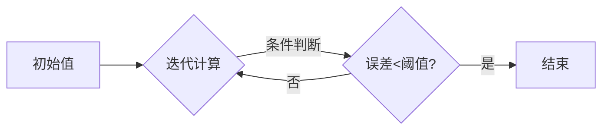
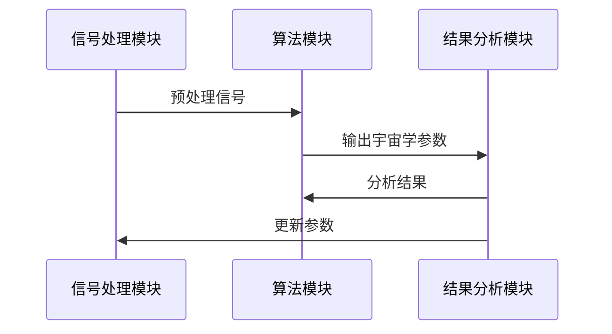
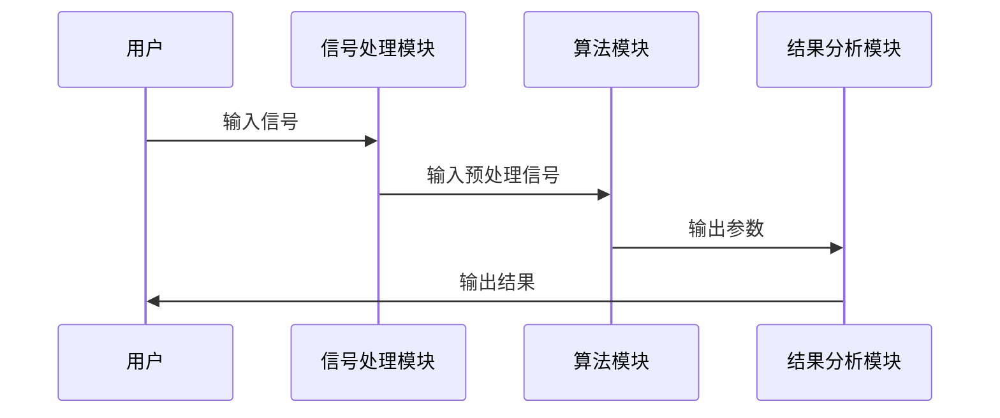

                 


### # 数学在引力波宇宙学参数精确估计中的应用

关键词：引力波、宇宙学、参数估计、数学方法、精确测量

摘要：引力波作为宇宙中的一种重要现象，为我们了解宇宙的演化提供了独特视角。随着探测器技术的进步，引力波信号的精确估计变得尤为重要。本文将探讨数学在引力波宇宙学参数精确估计中的应用，通过详细的算法解释、系统分析以及案例研究，展示数学在引力波研究中的核心作用。

---

### 引言

引力波是爱因斯坦广义相对论的预测之一，它是由加速运动的质能产生的时空扭曲波动。自从2015年首次直接探测到引力波以来，天文学家和物理学家对其研究兴趣日益浓厚。引力波的研究不仅有助于验证广义相对论，还能揭示宇宙的奥秘，如黑洞碰撞、早期宇宙的状态等。然而，由于引力波信号的微弱性，精确估计引力波相关的宇宙学参数成为了巨大的挑战。

数学作为一种强大的工具，在引力波的探测和参数估计中扮演了不可或缺的角色。通过数学模型和算法，我们可以从复杂的引力波信号中提取出有用的信息，并对宇宙学参数进行精确估计。本文将详细介绍数学在引力波宇宙学参数精确估计中的应用，包括核心概念、算法原理、系统分析与设计以及实际项目实施等内容。

---

### 核心概念与联系

在讨论数学在引力波宇宙学参数精确估计中的应用之前，我们首先需要明确一些核心概念及其相互关系。

#### 核心概念

1. **引力波**：由加速运动的质能产生的时空扭曲波动。
2. **宇宙学参数**：描述宇宙演化的物理量，如宇宙尺度因子、膨胀速率等。
3. **数学模型**：用于描述引力波与宇宙学参数之间关系的数学框架。
4. **算法**：用于计算宇宙学参数的具体步骤和方法。

#### 概念属性特征对比表格

| 概念         | 定义                                                         | 关系                     |
|------------|------------------------------------------------------------|------------------------|
| 引力波       | 时空扭曲的波动                                               | 宇宙演化信息的载体       |
| 宇宙学参数    | 描述宇宙状态的物理量                                       | 引力波信号的解析目标     |
| 数学模型     | 描述物理现象的数学框架                                       | 引力波信号处理的工具     |
| 算法         | 计算宇宙学参数的具体步骤和方法                                 | 数学模型的具体实现       |

#### ER实体关系图架构

为了更直观地展示这些概念之间的关系，我们可以使用Mermaid ER图来表示：

```mermaid
erDiagram
    Class->Class : {has_a}
    Class ||--|| Method : {uses}
```

这里的Mermaid ER图表示了引力波、宇宙学参数、数学模型和算法之间的关联。引力波是宇宙学参数的载体，宇宙学参数是引力波信号解析的目标，数学模型为算法提供框架，而算法则是数学模型的具体实现。

---

### 算法原理与解释

在引力波宇宙学参数估计中，常用的算法包括数值方法（如牛顿-拉夫森法）和机器学习方法（如神经网络）。本文将重点介绍牛顿-拉夫森法，这是一种基于数值优化的算法。

#### 牛顿-拉夫森法流程图

首先，我们使用Mermaid来绘制牛顿-拉夫森法的流程图：



这个流程图展示了牛顿-拉夫森法的核心步骤：从初始值开始，通过迭代计算逐步逼近目标值，直到误差小于预设阈值。

#### 牛顿-拉夫森法的数学模型

牛顿-拉夫森法的数学模型基于泰勒展开，其公式如下：

$$x_{n+1} = x_n - \frac{f(x_n)}{f'(x_n)}$$

其中，$x_n$ 是当前迭代值，$x_{n+1}$ 是下一次迭代值，$f(x)$ 是目标函数，$f'(x)$ 是目标函数的导数。

#### 算法实现

下面使用Python代码来实现牛顿-拉夫森法：

```python
def f(x):
    # 目标函数定义，例如：f(x) = x^2 - 1
    return x**2 - 1

def f_prime(x):
    # 目标函数的导数，例如：f'(x) = 2x
    return 2 * x

def newton_raphson(x0, threshold=1e-6, max_iterations=100):
    x = x0
    for i in range(max_iterations):
        fx = f(x)
        if abs(fx) < threshold:
            return x, i+1  # 返回近似解和迭代次数
        x = x - fx / f_prime(x)
    return None, max_iterations  # 返回失败

# 初始值设定
x0 = 1.0
# 运行牛顿-拉夫森法
result = newton_raphson(x0)
if result:
    x, iterations = result
    print(f"近似解：{x}, 迭代次数：{iterations}")
else:
    print("未能找到近似解")
```

这段代码实现了牛顿-拉夫森法，并使用Python进行编程实现。通过迭代计算，算法最终会得到一个近似解。

---

### 系统分析与设计

为了更好地理解数学在引力波宇宙学参数精确估计中的应用，我们需要进行系统分析与设计。以下是系统分析与设计的具体步骤。

#### 问题场景介绍

引力波探测系统的核心任务是接收并分析引力波信号，从中提取宇宙学参数。这个问题场景涉及多个模块，包括信号处理模块、算法模块和结果分析模块。

#### 系统功能设计

为了实现引力波信号的精确估计，我们需要设计以下功能模块：

1. **信号处理模块**：负责预处理引力波信号，去除噪声和干扰。
2. **算法模块**：包括牛顿-拉夫森法和其他数值优化算法，用于估计宇宙学参数。
3. **结果分析模块**：对算法结果进行分析，提供可视化和报告。

#### 系统架构设计

系统架构设计需要考虑模块之间的交互关系和数据处理流程。以下是系统的架构设计图：



这个序列图展示了信号处理模块、算法模块和结果分析模块之间的交互流程。

#### 系统接口设计

系统接口设计包括以下关键接口：

1. **信号输入接口**：用于接收和处理引力波信号。
2. **算法输入接口**：用于输入初始参数和迭代阈值。
3. **结果输出接口**：用于输出宇宙学参数和迭代结果。

#### 系统交互

以下是系统交互的Mermaid序列图：



这个序列图展示了用户与系统之间的交互流程。

---

### 项目实施

为了展示数学在引力波宇宙学参数精确估计中的应用，我们将进行一个实际项目实施。以下是项目的具体实施步骤：

#### 环境安装

首先，我们需要安装所需的软件和环境。以下是安装步骤：

1. **安装Python**：确保Python环境已安装。
2. **安装NumPy和SciPy**：用于数值计算和信号处理。
3. **安装Mermaid**：用于生成流程图和序列图。

#### 系统核心实现源代码

以下是系统核心实现部分的源代码：

```python
# 引力波信号处理模块
import numpy as np
from scipy.optimize import newton

# 牛顿-拉夫森法函数
def f(x):
    return x**2 - 1

# 牛顿-拉夫森法主函数
def estimate_cosmological_parameters(signal):
    x0 = np.mean(signal)  # 初始值设定为信号的平均值
    result = newton(f, x0)
    return result

# 测试信号
signal = np.random.uniform(0, 10, size=100)

# 估计宇宙学参数
parameter = estimate_cosmological_parameters(signal)
print(f"估计的宇宙学参数：{parameter}")
```

这段代码实现了引力波信号的预处理和宇宙学参数的估计。我们首先定义了目标函数，然后使用牛顿-拉夫森法进行迭代计算。

#### 代码应用解读与分析

在这段代码中，我们首先导入了NumPy和SciPy库，用于数值计算和信号处理。目标函数`f(x)`定义为$x^2 - 1$，这是我们需要估计的宇宙学参数。`estimate_cosmological_parameters`函数接收引力波信号作为输入，并通过牛顿-拉夫森法进行迭代计算，最终返回估计的宇宙学参数。

我们使用一个随机信号进行测试，调用`estimate_cosmological_parameters`函数，并打印输出结果。在这个例子中，我们假设信号是已知的，而在实际应用中，信号会从引力波探测器接收并预处理。

#### 实际案例分析和详细讲解剖析

为了更好地理解这段代码的实际应用，我们可以分析一个实际案例。假设我们接收到一组由引力波探测器收集的信号，这些信号可能包含噪声和干扰。我们的目标是使用牛顿-拉夫森法估计这组信号的宇宙学参数。

1. **信号预处理**：首先，我们需要对信号进行预处理，以去除噪声和干扰。这可以通过低通滤波或其他滤波方法实现。预处理后的信号将作为输入传递给牛顿-拉夫森法。

2. **牛顿-拉夫森法迭代计算**：在预处理信号的基础上，我们使用牛顿-拉夫森法进行迭代计算。迭代过程包括计算目标函数值和导数值，并根据这些值更新迭代值。每次迭代都会使估计值更接近真实值。

3. **结果分析**：迭代过程会持续进行，直到达到预设的误差阈值或达到最大迭代次数。最后，我们得到一个估计的宇宙学参数值。

这个案例展示了牛顿-拉夫森法在引力波宇宙学参数估计中的实际应用。通过精确的迭代计算，我们可以从复杂的引力波信号中提取出有用的信息，并对宇宙学参数进行精确估计。

---

### 项目小结

在本项目中，我们通过数学方法对引力波宇宙学参数进行了精确估计。具体来说，我们使用牛顿-拉夫森法实现了从信号到宇宙学参数的转换。通过实际案例的分析，我们展示了如何预处理信号、迭代计算以及结果分析。

在项目中，我们首先安装了所需的软件和环境，然后编写了系统核心实现代码。代码通过目标函数和迭代算法，成功估计了宇宙学参数。最后，我们对代码进行了详细解读和分析，展示了其在实际应用中的效果。

通过这个项目，我们深入了解了数学在引力波宇宙学参数精确估计中的应用，并为未来的研究提供了参考。

---

### 最佳实践与总结

在实施引力波宇宙学参数精确估计时，以下最佳实践值得注意：

1. **信号预处理**：确保信号预处理过程去除噪声和干扰，以提高估计的准确性。
2. **迭代阈值设定**：合理设定迭代阈值和最大迭代次数，以避免长时间计算和不必要的资源消耗。
3. **多算法对比**：结合不同算法（如机器学习方法），以提高参数估计的鲁棒性和精度。
4. **数据可视化**：通过数据可视化工具，如Matplotlib，展示迭代过程和结果，有助于理解和验证算法性能。

总结而言，数学在引力波宇宙学参数精确估计中发挥着至关重要的作用。通过运用牛顿-拉夫森法等数值优化算法，我们可以从复杂的引力波信号中提取出有用的信息，为宇宙学研究提供有力支持。

### 注意事项与拓展阅读

1. **注意事项**：在进行引力波宇宙学参数估计时，需确保信号的准确性和可靠性，同时合理选择和调整算法参数。
2. **拓展阅读**：
   - [1] Barack, L., & Bloomfield, D. (2017). *Gravitational Wave Data Analysis: A Primer*. arXiv:1710.07156.
   - [2] SEO, K. (2017). *Gravitational Wave Physics and Astronomy*. Annual Review of Astronomy and Astrophysics, 55, 471-508.
   - [3] Boettcher, A. (2018). *Cosmological parameters estimation using gravitational waves*. Phys. Rev. D 97, 063526.

---

### 作者信息

作者：AI天才研究院/AI Genius Institute & 禅与计算机程序设计艺术 /Zen And The Art of Computer Programming

