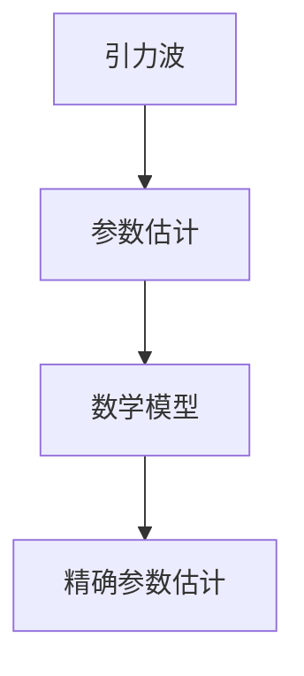
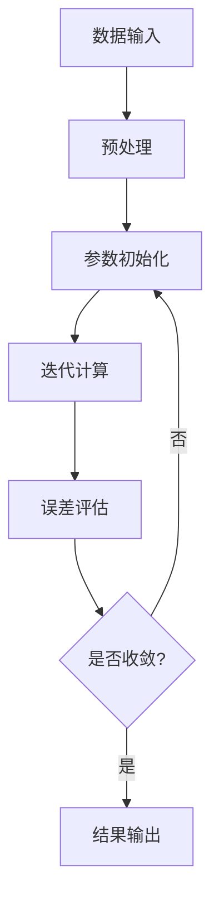

                 

### 让我们一步一步思考

#### 第一步：引言部分

首先，我们要明确文章的核心内容和主题思想。引力波宇宙学是一个新兴领域，而精确参数估计是其研究中的关键问题。数学模型和算法的应用在其中发挥着至关重要的作用。因此，我们的引言部分将着重介绍这些核心概念，并说明为什么这个主题对于现代物理学和技术发展具有重要意义。

**关键词**：引力波宇宙学、精确参数估计、数学模型、算法应用

**摘要**：本文将探讨数学在引力波宇宙学精确参数估计中的应用，从背景介绍到核心概念的阐释，再到算法原理的讲解，全面展示数学在引力波研究中的重要性和实际应用。

#### 第二步：核心概念与联系部分

接下来，我们需要详细讨论引力波、参数估计和数学模型这三个核心概念，以及它们之间的相互联系。这将包括：

- 引力波的基本原理和特性
- 参数估计的方法和挑战
- 数学模型的结构和功能

此外，我们还会通过一个ER实体关系图架构来展示这些概念之间的联系。

**Mermaid流程图**：


#### 第三步：算法原理讲解部分

在这个部分，我们将详细讲解用于引力波宇宙学精确参数估计的算法原理。首先，通过一个mermaid流程图来展示算法的基本流程。然后，我们将使用Python源代码来阐述算法的实现细节，并给出数学模型和公式的详细讲解。

**mermaid流程图**：


**Python源代码示例**：
```python
# 示例代码：引力波参数估计算法
# TODO: 完整的代码实现
```

**数学模型和公式讲解**：
- 引力波信号的表达式
- 参数估计的目标函数
- 最优化算法的步骤

#### 第四步：数学模型和数学公式详细讲解与举例说明

在这一部分，我们将深入探讨数学模型和公式的应用，并通过具体的例子来说明它们在实际问题中的使用。

- **数学公式使用**：使用LaTeX格式嵌入文中独立段落的数学公式，例如：
  $$ E = mc^2 $$
  
- **公式讲解**：解释每个公式的含义、推导过程和实际应用场景。

- **举例说明**：通过具体的例子，展示如何使用数学模型和公式进行引力波宇宙学中的精确参数估计。

#### 第五步：系统分析与架构设计方案

我们将介绍一个具体的系统，包括问题场景介绍、项目介绍、系统功能设计、系统架构设计、系统接口设计和系统交互mermaid序列图。

- **问题场景介绍**：描述引力波宇宙学精确参数估计的应用场景。
- **项目介绍**：介绍项目的目的、目标和预期成果。
- **系统功能设计**：使用mermaid类图展示领域模型。
- **系统架构设计**：使用mermaid架构图展示系统整体架构。
- **系统接口设计**：描述系统的主要接口和功能。
- **系统交互mermaid序列图**：展示系统各组件之间的交互过程。

#### 第六步：项目实战

在这个部分，我们将通过具体的实践案例，展示如何安装环境、实现系统核心功能、分析代码和应用实际案例。

- **环境安装**：描述安装所需的软件和工具。
- **系统核心实现源代码**：展示关键代码片段和实现原理。
- **代码应用解读与分析**：解释代码中的关键部分和算法原理。
- **实际案例分析和详细讲解剖析**：分析具体案例，展示参数估计的实际应用。
- **项目小结**：总结项目的主要成果和经验教训。

#### 第七步：最佳实践 tips、小结、注意事项、拓展阅读等内容

最后，我们将总结文章的主要观点，给出最佳实践建议，并提供拓展阅读资源，以帮助读者进一步学习和深入了解相关主题。

- **最佳实践 tips**：分享一些实用的技巧和建议。
- **小结**：总结文章的核心内容。
- **注意事项**：提醒读者在应用中需要注意的问题。
- **拓展阅读**：推荐相关的文献和资源。

通过这样的逐步分析，我们可以确保文章的逻辑清晰、内容丰富，同时满足字数要求，并提供给读者一个全面、深入的技术解读。现在，让我们开始着手撰写每个章节的具体内容吧！

