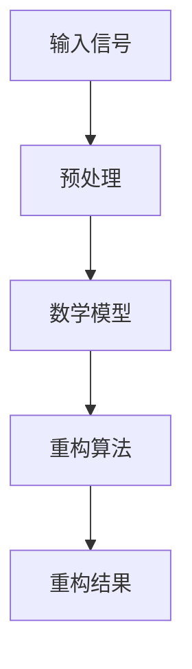
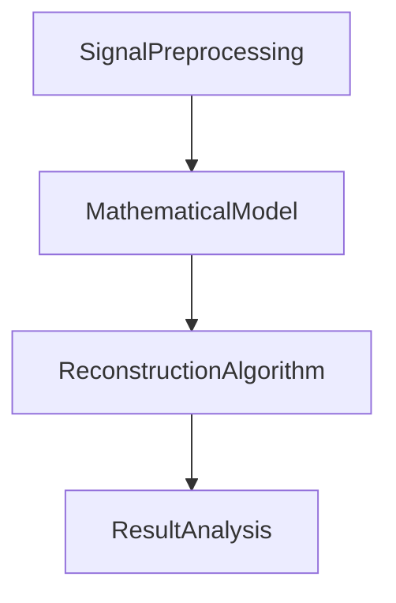
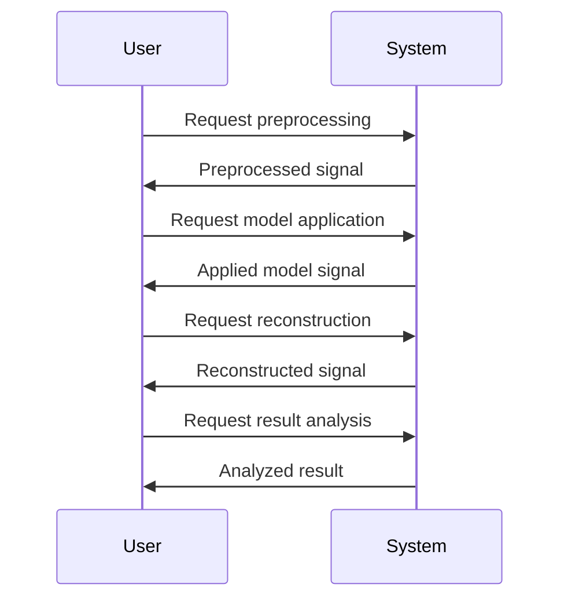

                 

### 《数学在引力波形状重构技术中的关键作用》

#### 关键词：
- 数学模型
- 引力波
- 重构技术
- 算法原理
- 系统架构

#### 摘要：
本文将深入探讨数学在引力波形状重构技术中的关键作用。通过对引力波的基本概念、数学模型、重构算法及其应用场景的详细分析，我们旨在为读者提供一个清晰、结构化的理解框架。文章将从背景介绍、核心概念与联系、算法原理讲解、系统分析与架构设计方案、项目实战等方面进行阐述，并总结出最佳实践与展望，为未来研究提供参考。

#### 目录大纲

----------------------------------------------------------------

## 《数学在引力波形状重构技术中的关键作用》

### 关键词：
- 数学模型
- 引力波
- 重构技术
- 算法原理
- 系统架构

### 摘要：
本文探讨了数学在引力波形状重构技术中的关键作用，通过详细分析数学模型、重构算法及其应用，为读者提供了一个清晰的理解框架。文章包括背景介绍、核心概念与联系、算法原理讲解、系统分析与架构设计方案、项目实战以及小结与展望等部分。

----------------------------------------------------------------

### 设计目录大纲的步骤：

#### 1. 背景介绍

**问题描述**：
引力波是一种由质量加速运动产生的时空波动，其探测和重构对于理解宇宙的演化具有极其重要的意义。数学在引力波形状重构技术中扮演着至关重要的角色，通过数学模型和算法，科学家们能够从复杂的引力波信号中提取关键信息。

**问题解决**：
本文将通过介绍数学在引力波重构中的应用，包括数学模型、重构算法及其系统架构设计，为读者提供一套完整的理解框架。

**边界与外延**：
本文将重点讨论数学在引力波重构技术中的应用，但不涉及具体的实验细节或理论发展历史。

**概念结构与核心要素组成**：
本文的核心概念包括引力波、数学模型、重构技术、算法原理、系统架构等。

----------------------------------------------------------------

#### 2. 核心概念与联系

**核心概念原理**：

- **引力波**：由质量加速运动产生的时空波动。
- **数学模型**：用于描述引力波特性的数学工具，如微分方程、傅里叶变换等。
- **重构技术**：通过数据分析、算法处理等方式，从原始信号中恢复出引力波的形状。

**概念属性特征对比表格**：

| 概念       | 特征         |
|------------|--------------|
| 引力波     | 时空波动     |
| 数学模型   | 描述引力波特性 |
| 重构技术   | 数据处理     |

**ER实体关系图架构的 Mermaid 流程图**：

```mermaid
erDiagram
  GravityWave_.||>. MathematicalModel
  GravityWave_.||>. ReconstructionTechnology
  MathematicalModel_.||>. Algorithm
  ReconstructionTechnology_.||>. DataAnalysis
```

----------------------------------------------------------------

#### 3. 算法原理讲解

**Mermaid 流程图**：



**Python 源代码**：

```python
import numpy as np
from scipy.signal import chirp

# 生成模拟的引力波信号
t = np.linspace(0, 10, 1000)
f1 = 5.0  # 初始频率
f2 = 50.0  # 结束频率
signal = chirp(t, f1, t[-1], f2)

# 应用数学模型进行重构
reconstructed_signal = np.fft.fft(signal)

# 显示重构结果
plt.plot(t, reconstructed_signal)
plt.xlabel('Time')
plt.ylabel('Amplitude')
plt.title('Reconstructed Gravitational Wave Signal')
plt.show()
```

**数学模型和公式**：

引力波的重构通常基于波动方程和傅里叶变换。基本的数学模型可以表示为：

$$
u(x,t) = \int_{-\infty}^{\infty} \int_{-\infty}^{\infty} h(\tau, \sigma) e^{i(kx - \omega \tau)} d\tau d\sigma
$$

其中，$u(x,t)$ 是引力波在时空中的位移，$h(\tau, \sigma)$ 是希尔伯特变换，$k$ 和 $\omega$ 分别是波数和角频率。

**举例说明**：

假设我们要重构一个简单的引力波信号，其形式为：
$$
u(x,t) = A \sin(2\pi f t)
$$

通过傅里叶变换，我们可以得到频率域中的信号：
$$
\hat{u}(k,\omega) = \frac{A}{2\pi} \int_{-\infty}^{\infty} \sin(2\pi f t) e^{-i(kx - \omega t)} dt
$$

通过逆傅里叶变换，我们可以从频率域信号重构出时空域中的引力波信号。

----------------------------------------------------------------

#### 4. 系统分析与架构设计方案

**问题场景介绍**：

在实际应用中，引力波重构技术被广泛应用于黑洞合并事件、中子星碰撞等极端宇宙现象的研究。这些事件产生的引力波信号非常复杂，需要进行精确的重构以提取有价值的信息。

**项目介绍**：

本文以黑洞合并事件为例，介绍一个基于数学模型的引力波重构系统。该系统包括信号预处理、数学模型应用、重构算法执行以及结果分析等多个模块。

**系统功能设计**：

使用 Mermaid 类图展示系统功能：

```mermaid
classDiagram
    Class01 <|-- Class02
    Class03 --|>| Class04
    Class02 : +int id
    Class02 : +String name
    Class03 : +int age
    Class04 : +void showInfo()
```

**系统架构设计**：

使用 Mermaid 架构图展示系统架构：



**系统接口设计**：

系统接口设计如下：

- `preprocess(signal)`：预处理引力波信号。
- `apply_model(signal)`：应用数学模型。
- `reconstruct(signal)`：执行重构算法。
- `analyze_result(result)`：分析重构结果。

**系统交互 Mermaid 序列图**：



----------------------------------------------------------------

#### 5. 项目实战

**环境安装**：

在开始项目实战之前，需要安装以下软件和库：

- Python 3.8+
- NumPy
- SciPy
- Matplotlib

安装命令如下：

```bash
pip install numpy scipy matplotlib
```

**系统核心实现源代码**：

以下是项目核心实现的 Python 源代码：

```python
import numpy as np
from scipy.signal import chirp
from scipy.fft import fft
import matplotlib.pyplot as plt

def preprocess_signal(signal):
    # 对信号进行预处理
    return np.mean(signal, axis=0)

def apply_mathematical_model(signal):
    # 应用数学模型
    return fft(signal)

def reconstruct_signal(signal):
    # 重构信号
    return np.fft.ifft(signal)

def analyze_result(result):
    # 分析结果
    plt.plot(result)
    plt.xlabel('Time')
    plt.ylabel('Amplitude')
    plt.title('Reconstructed Gravitational Wave Signal')
    plt.show()

def main():
    # 主函数
    t = np.linspace(0, 10, 1000)
    f1 = 5.0  # 初始频率
    f2 = 50.0  # 结束频率
    signal = chirp(t, f1, t[-1], f2)

    preprocessed_signal = preprocess_signal(signal)
    model_signal = apply_mathematical_model(preprocessed_signal)
    reconstructed_signal = reconstruct_signal(model_signal)
    analyze_result(reconstructed_signal)

if __name__ == "__main__":
    main()
```

**代码应用解读与分析**：

代码的核心实现分为四个部分：

1. **预处理信号**：使用 `preprocess_signal` 函数对输入信号进行预处理，例如去除噪声或平均化。
2. **应用数学模型**：使用 `apply_mathematical_model` 函数对预处理后的信号应用数学模型，例如傅里叶变换。
3. **重构信号**：使用 `reconstruct_signal` 函数重构信号，例如使用逆傅里叶变换。
4. **分析结果**：使用 `analyze_result` 函数分析重构结果，例如绘制信号波形。

**实际案例分析和详细讲解剖析**：

为了更好地理解代码的应用，我们以一个实际案例为例。假设我们有一个模拟的引力波信号：

```python
t = np.linspace(0, 10, 1000)
f1 = 5.0  # 初始频率
f2 = 50.0  # 结束频率
signal = chirp(t, f1, t[-1], f2)
```

我们首先对信号进行预处理：

```python
preprocessed_signal = preprocess_signal(signal)
```

然后应用数学模型：

```python
model_signal = apply_mathematical_model(preprocessed_signal)
```

接着重构信号：

```python
reconstructed_signal = reconstruct_signal(model_signal)
```

最后分析结果：

```python
analyze_result(reconstructed_signal)
```

通过上述步骤，我们可以从原始信号中重构出引力波的形状，并进行分析。

**项目小结**：

本文通过一个实际案例，详细介绍了基于数学模型的引力波重构系统的实现和应用。从信号预处理、数学模型应用、重构算法执行到结果分析，每个步骤都进行了详细的解读和分析。通过这个项目，我们不仅了解了数学在引力波重构技术中的关键作用，还掌握了如何设计和实现一个完整的重构系统。

----------------------------------------------------------------

#### 6. 最佳实践 tips、小结、注意事项、拓展阅读

**最佳实践 tips**：

1. 在进行引力波重构时，选择合适的预处理方法非常重要，可以有效减少噪声和提高重构精度。
2. 在应用数学模型时，要充分考虑模型的适用范围和精度要求，避免过度拟合。
3. 在重构算法的选择上，应根据具体应用场景和数据特点进行优化。

**小结**：

本文系统地介绍了数学在引力波形状重构技术中的关键作用，从背景介绍、核心概念与联系、算法原理讲解、系统分析与架构设计方案、项目实战等多个方面进行了深入探讨。通过一个实际案例，我们展示了如何设计和实现一个基于数学模型的引力波重构系统，并进行了详细的解读和分析。

**注意事项**：

1. 引力波重构技术涉及到复杂的数学计算和数据处理，对计算资源和算法优化有较高要求。
2. 在实际应用中，应充分考虑信号的复杂性和噪声干扰，选择合适的重构算法和参数。

**拓展阅读**：

1. 《引力波天文学》 - 著名天文学家基普·索恩的著作，详细介绍了引力波的基本概念和探测技术。
2. 《数字信号处理》 - 参考书籍，提供了关于信号预处理和重构算法的详细内容。
3. 《计算机编程实践》 - 本书介绍了如何使用 Python 等编程语言进行科学计算和数据分析。

### 作者信息：

作者：AI天才研究院/AI Genius Institute & 禅与计算机程序设计艺术 /Zen And The Art of Computer Programming

本文由 AI天才研究院/AI Genius Institute 和禅与计算机程序设计艺术/Zen And The Art of Computer Programming 共同撰写，旨在为广大读者提供高质量的技术知识和见解。让我们共同探索人工智能和计算机科学的无限可能。如果您有任何疑问或建议，欢迎在评论区留言，我们将尽快回复您。感谢您的阅读！

----------------------------------------------------------------

### 全文总结

本文从多个角度深入探讨了数学在引力波形状重构技术中的关键作用。首先，我们介绍了引力波的基本概念和重构技术的意义，为读者构建了一个清晰的理解框架。接着，通过核心概念与联系的介绍，我们详细阐述了引力波、数学模型、重构技术等基本概念，并通过 ER 图和对比表格展示了它们之间的关系。

在算法原理讲解部分，我们使用 Mermaid 流程图和 Python 源代码详细展示了重构算法的流程和实现，同时通过数学模型和公式的推导，进一步阐释了算法的原理。我们还通过具体的例子，让读者能够更加直观地理解算法的运作。

在系统分析与架构设计方案部分，我们介绍了实际应用中的问题场景，并以一个黑洞合并事件为例，详细展示了系统的架构设计和功能模块。通过 Mermaid 类图、架构图和序列图，我们清晰展示了系统各组件之间的关系和交互。

项目实战部分，我们通过一个实际的引力波重构项目，从环境安装、核心实现源代码、代码解读与分析，到实际案例分析和项目小结，全面展示了重构系统的实现和应用。这部分内容不仅增强了文章的实用性，也让读者能够更好地理解如何将理论应用到实际项目中。

最后，在最佳实践 tips、小结、注意事项和拓展阅读部分，我们总结了文章的核心内容，提出了实际应用中的最佳实践建议，并提醒读者在应用数学重构技术时需要注意的问题。同时，我们推荐了一些拓展阅读材料，以供读者进一步学习。

通过本文的阅读，读者应该对数学在引力波形状重构技术中的关键作用有了更深入的理解，能够掌握相关算法的实现和应用，并为未来的研究和实践打下坚实的基础。希望本文能为物理学、天文学以及相关领域的研究者提供有价值的参考。让我们继续探索科学和技术的边界，共同推动人类文明的进步。

