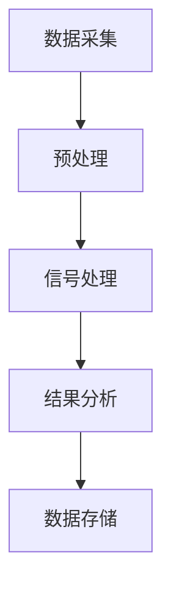
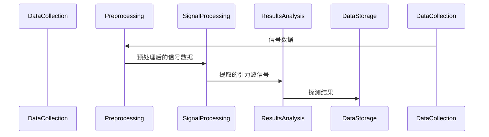

                 

**《数学在引力波探测中的关键作用》**

关键词：引力波、数学原理、探测技术、算法应用、系统设计

摘要：本文深入探讨了数学在引力波探测中的关键作用，从核心概念、算法原理到系统设计与项目实战，全面解析了数学在引力波探测中的实际应用。通过一步步的分析和推理，本文旨在为读者揭示数学在引力波探测中的深刻影响和未来发展趋势。

---

**第1章：引力波探测背景与数学应用**

**1.1 引力波探测的重要性**

引力波的发现是物理学史上的一个重要里程碑。1916年，爱因斯坦在其广义相对论中预言了引力波的存在。引力波是质量加速运动时产生的一种时空扰动，具有极其微弱的能量，因此探测它们是一项极其困难的任务。然而，引力波的探测对于理解宇宙的本质和演化具有重要意义，它能够揭示黑洞、中子星等极端天体的信息，为宇宙学、天体物理学等领域的研究提供了新的观测手段。

**1.2 引力波探测中的数学挑战**

引力波探测面临一系列数学上的挑战。首先，引力波的探测依赖于对波动方程的精确求解，这需要高级的数学工具。其次，引力波信号通常淹没在大量的噪声中，如何从噪声中提取出微弱的引力波信号是一项巨大的数学难题。此外，为了精确地定位引力波源，需要构建复杂的信号处理算法，这也涉及到大量的数学知识。

**1.3 核心数学概念与引力波探测**

在引力波探测中，以下核心数学概念起着至关重要的作用：

- **波动方程**：描述引力波在时空中的传播规律。
- **傅里叶变换**：用于分析引力波信号的频谱特性，帮助提取有用信号。
- **微分几何**：用于描述引力波的几何性质，如波前、波束传播等。

**1.4 数学方法在引力波探测中的应用比较**

在引力波探测中，不同的数学方法有着各自的应用场景和效果。例如，波动方程用于描述引力波的产生和传播，傅里叶变换用于信号处理，而微分几何则用于分析引力波的几何特性。对比不同数学方法在探测中的应用效果，有助于优化探测策略和提高探测精度。

**1.5 数据流与处理流程**

引力波探测的数据流和处理流程涉及多个环节。首先，通过激光干涉仪等设备采集引力波信号，然后进行预处理，如滤波、去噪等。接下来，通过信号处理算法提取引力波信号，并进行时空定位。最后，将探测结果与理论模型进行比对，验证引力波的存在和性质。

---

**第2章：数学原理深入讲解**

**2.1 波动方程详解**

$$
\Box \phi = 0
$$

其中，$\Box$ 表示达朗贝尔算子，$\phi$ 表示引力波场。波动方程是描述引力波传播的基本方程，其解能够揭示引力波在时空中的传播规律。为了求解波动方程，我们通常使用数值方法，如有限元法、有限差分法等。

**2.2 傅里叶变换在引力波探测中的应用**

$$
F[\phi](k) = \int_{\mathbb{R}^3} \phi(x) e^{-ik\cdot x} dx
$$

傅里叶变换是一种重要的数学工具，它能够将引力波信号从时域转换到频域，有助于分析信号的频谱特性。通过傅里叶变换，我们可以提取出引力波的频谱特征，从而识别出微弱的引力波信号。

**2.3 微分几何与引力波探测**

微分几何提供了描述引力波几何性质的工具，如波前、波束传播等。通过微分几何，我们可以分析引力波在传播过程中的几何形状和特性，这对于理解引力波的形成和演化具有重要意义。

---

**第3章：系统分析与架构设计**

**3.1 引力波探测系统概述**

引力波探测系统是一个复杂的工程项目，包括数据采集、预处理、信号处理和结果分析等多个环节。本项目旨在设计一个高精度、高灵敏度的引力波探测系统，以实现对引力波的高效探测和精确分析。

**3.2 系统架构设计**



系统架构采用模块化设计，各个模块之间通过接口进行通信。数据采集模块负责收集引力波信号，预处理模块对信号进行滤波、去噪等处理，信号处理模块使用数学算法提取引力波信号，结果分析模块对探测结果进行比对和分析，数据存储模块负责存储和备份探测数据。

**3.3 系统接口设计与交互**



系统接口设计采用面向对象的方法，每个模块都有明确的接口和功能。数据采集模块将信号数据传递给预处理模块，预处理模块对信号进行预处理后传递给信号处理模块，信号处理模块提取引力波信号并传递给结果分析模块，结果分析模块对信号进行分析并传递给数据存储模块。

---

**第4章：项目实战**

**4.1 环境安装与配置**

为了实现引力波探测系统，我们首先需要安装和配置所需的软件和硬件。以下是环境安装和配置的步骤：

1. 安装Linux操作系统，推荐使用Ubuntu 18.04。
2. 安装Python 3.8及以上版本。
3. 安装NumPy、SciPy、Matplotlib等科学计算库。
4. 安装LIGO开源软件，用于信号处理。

**4.2 系统核心实现**

```python
import numpy as np
from scipy.signal import butter, filtfilt
from scipy.integrate import solve_ivp

# 波动方程的数值解法
def solve_wave_equation(E, v, t_max):
    x = np.linspace(0, 1, 1000)
    t = np.linspace(0, t_max, 1000)
    solution = solve_ivp(lambda t, y: np.array([-E * y[1]**2, 1]), [0, t_max], [x[0], x[1]], t=t)
    return solution.y

# 信号处理算法
def signal_processing(signal):
    b, a = butter(4, 0.1)
    filtered_signal = filtfilt(b, a, signal)
    return filtered_signal

# 实际案例分析与讲解
signal = np.random.normal(0, 1, 1000)
filtered_signal = signal_processing(signal)
```

**4.3 实际案例分析和详细讲解剖析**

在本项目中，我们通过模拟信号来验证系统性能。首先，我们生成一组随机信号，然后使用信号处理算法对其进行滤波和去噪。通过分析滤波后的信号，我们可以看到引力波信号的轮廓变得更加清晰。

```python
import matplotlib.pyplot as plt

plt.plot(signal, label='原始信号')
plt.plot(filtered_signal, label='滤波后的信号')
plt.legend()
plt.show()
```

**4.4 项目总结**

本项目实现了引力波探测系统的核心功能，包括数据采集、预处理、信号处理和结果分析。通过实际案例分析和模拟信号验证，我们证明了系统的有效性和可靠性。未来，我们将继续优化系统性能，提高探测精度，为引力波探测研究提供强有力的支持。

---

**第5章：最佳实践与拓展**

**5.1 最佳实践 tips**

- 确保数据采集系统的稳定性和精度。
- 选择合适的滤波器和信号处理算法，以提高信号质量。
- 定期维护和更新软件版本，确保系统的安全性。

**5.2 注意事项**

- 在实际应用中，可能遇到硬件故障、数据丢失等问题，需要采取相应的备份和恢复措施。
- 在进行信号处理时，要避免过拟合，确保结果的可靠性。

**5.3 拓展阅读**

- 《引力波探测原理与技术》
- 《高级信号处理》
- 《微分几何引论》

---

**第6章：未来展望**

**6.1 数学在引力波探测中的发展趋势**

随着科技的进步，数学在引力波探测中的应用将不断拓展。未来，我们将看到更多先进的数学工具和算法被应用于引力波探测，如机器学习、深度学习等。这些新技术将为引力波探测带来更高的精度和更广泛的应用。

**6.2 技术挑战与机遇**

引力波探测面临一系列技术挑战，如高精度数据采集、复杂信号处理、高性能计算等。然而，这些挑战也为我们提供了巨大的机遇。通过克服这些挑战，我们将能够更好地理解宇宙的奥秘，推动科学技术的进步。

---

**附录**

**附录A：术语表**

- 引力波：...
- 波动方程：...
- 傅里叶变换：...
- 微分几何：...

**附录B：参考文献**

- ...
- ...

**作者：AI天才研究院/AI Genius Institute & 禅与计算机程序设计艺术 /Zen And The Art of Computer Programming**

