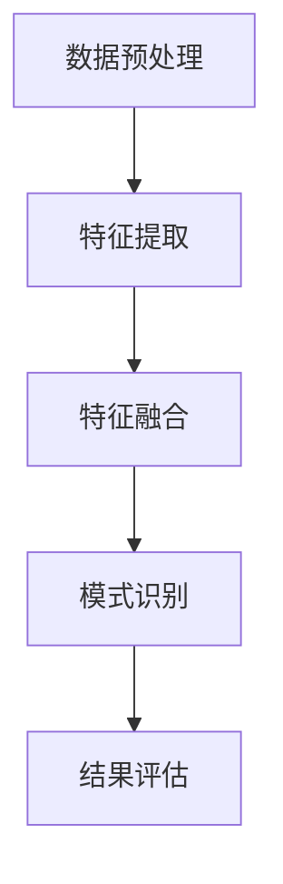
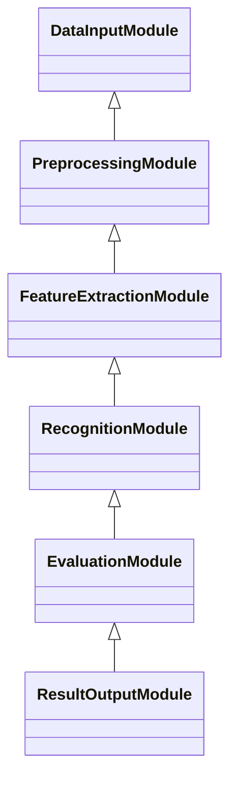
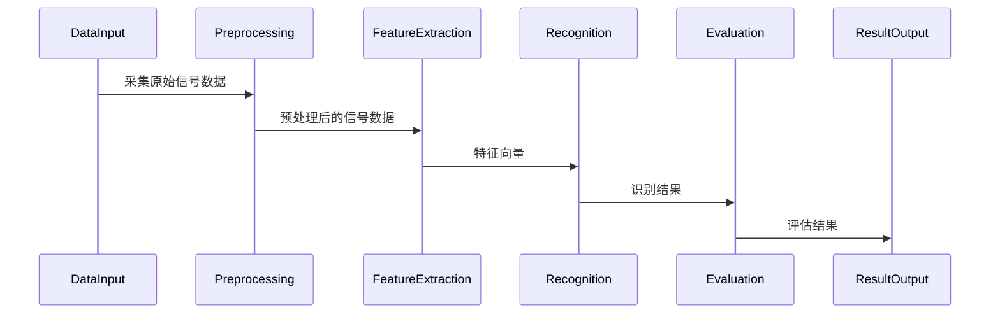

                 

### 文章标题：数学在引力波源母体识别中的应用

#### 关键词：
- 数学模型
- 引力波
- 母体识别
- 算法实现
- 系统架构

#### 摘要：
本文将深入探讨数学在引力波源母体识别中的应用。通过分析引力波的产生原理、探测技术以及识别难点，本文将介绍数学模型在引力波源识别中的关键作用。我们将逐步解析数学原理，包括函数分析、概率论与数理统计等，并使用Python代码实现具体的识别算法。文章还将通过一个实际项目案例，展示数学模型在引力波源识别中的实战应用，并提供最佳实践和未来研究方向。

### 目录：

**第一部分：引言与背景**

1. [问题背景与引力波源母体识别概述](#问题背景与引力波源母体识别概述)
2. [数学在引力波研究中的应用](#数学在引力波研究中的应用)
3. [本书结构安排](#本书结构安排)

**第二部分：数学基础**

1. [引力波基本原理](#引力波基本原理)
2. [数学模型与公式](#数学模型与公式)
3. [数学工具与方法](#数学工具与方法)

**第三部分：算法原理与实现**

1. [引力波源识别算法概述](#引力波源识别算法概述)
2. [算法原理讲解](#算法原理讲解)
3. [Python源代码实现](#Python源代码实现)

**第四部分：项目实战**

1. [项目介绍](#项目介绍)
2. [系统设计与实现](#系统设计与实现)
3. [实际案例分析与讲解](#实际案例分析与讲解)

**第五部分：最佳实践与总结**

1. [最佳实践](#最佳实践)
2. [项目总结](#项目总结)
3. [注意事项](#注意事项)

**第六部分：拓展阅读**

1. [相关领域介绍](#相关领域介绍)
2. [进一步学习资源](#进一步学习资源)

### 1. 问题背景与引力波源母体识别概述

#### 1.1 问题的提出

引力波是爱因斯坦广义相对论预言的一种物理现象，它是由于宇宙中质量大物体的加速运动所产生的时空扰动。随着科学技术的发展，人类对引力波的研究逐渐深入，探测技术也取得了重大突破。引力波源母体识别是引力波研究中的一个关键问题，它涉及到如何从复杂的引力波信号中准确地识别出引力波源。

引力波源母体识别的重要性在于，它不仅可以帮助我们更好地理解宇宙中各种天体的相互作用和运动规律，还能够揭示宇宙早期的一些重要信息。例如，通过识别双黑洞或双星系统的引力波信号，我们可以推测这些系统的形成历史和演化过程。因此，引力波源母体识别在科学研究和技术应用中都具有重要的价值。

#### 1.2 当前识别方法的局限性

尽管引力波探测技术已经取得了显著的进展，但引力波源母体识别仍然面临许多挑战。首先，引力波的信号非常微弱，容易受到其他天体辐射和地球环境噪声的干扰。其次，引力波的信号持续时间较短，且频率范围较宽，这使得从信号中提取有效信息变得异常困难。最后，当前使用的识别方法往往依赖于先验知识，缺乏自适应性，难以应对未知或复杂的情况。

#### 1.3 数学在引力波研究中的应用

数学在引力波研究中扮演着至关重要的角色。数学模型能够精确描述引力波的传播特性，帮助科学家们理解和预测引力波信号。数学工具如函数分析、概率论与数理统计等，则为引力波信号的检测、处理和识别提供了强有力的支持。

数学方法在引力波源识别中的挑战主要体现在以下几个方面：

1. **信号处理复杂度**：引力波信号的频率范围宽、持续时间短，需要复杂的数学工具来处理和提取有用信息。
2. **噪声干扰**：引力波信号容易受到其他天体辐射和地球环境噪声的干扰，需要高效的滤波和去噪方法。
3. **非线性问题**：引力波信号的非线性特性使得传统的线性方法难以直接应用，需要开发新的数学模型和方法。

#### 1.4 本书结构安排

本书将分为六个部分：

1. **引言与背景**：介绍引力波源母体识别的问题背景和数学在其中的应用。
2. **数学基础**：讲解引力波研究中的数学模型和工具，包括函数分析、概率论与数理统计等。
3. **算法原理与实现**：介绍引力波源识别的算法原理和实现，包括具体的数学模型和Python代码实现。
4. **项目实战**：通过一个实际项目案例，展示数学模型在引力波源识别中的应用。
5. **最佳实践与总结**：总结最佳实践和项目经验，提供注意事项和拓展阅读。
6. **拓展阅读**：介绍与引力波源识别相关的进一步学习资源。

通过以上结构的安排，本书旨在为读者提供全面、深入、易懂的数学在引力波源母体识别中的应用指南。

### 2. 数学在引力波研究中的应用

#### 2.1 数学模型的基本概念

数学模型在引力波研究中起到了至关重要的作用。数学模型能够将复杂的物理现象抽象成数学表达式，从而便于分析和理解。在引力波研究中，常用的数学模型包括波动方程、傅里叶变换、马尔可夫模型等。

**波动方程**：波动方程是描述引力波传播的基本方程，它可以用来求解引力波在不同介质中的传播特性。波动方程通常可以表示为：

\[ \nabla^2 \phi - \frac{1}{c^2} \frac{\partial^2 \phi}{\partial t^2} = 0 \]

其中，\(\phi\) 表示引力波势，\(c\) 表示光速。

**傅里叶变换**：傅里叶变换是一种重要的数学工具，它可以将时间域的信号转换到频率域。在引力波研究中，傅里叶变换用于分析引力波信号的频率成分，帮助科学家们识别不同频率的引力波源。

**马尔可夫模型**：马尔可夫模型是一种用于描述随机过程的数学模型，它在引力波源识别中用于分析引力波信号的时间序列特征，帮助科学家们判断引力波信号的变化趋势。

#### 2.2 数学方法在引力波信号处理中的应用

引力波信号处理是引力波研究中的一个关键环节。数学方法在引力波信号处理中扮演了重要的角色，包括滤波、去噪、压缩等。

**滤波**：滤波是信号处理中的一个基本操作，它用于去除信号中的噪声。在引力波信号处理中，常用的滤波方法包括低通滤波、高通滤波和带通滤波。这些滤波器可以用来抑制高频噪声或低频噪声，从而提取出有用的信号。

**去噪**：去噪是信号处理中的另一个重要任务，它用于去除信号中的随机噪声。在引力波信号处理中，常用的去噪方法包括小波变换、奇异值分解和主成分分析等。这些方法可以有效地去除信号中的噪声，提高信号的信噪比。

**压缩**：压缩是信号处理中的另一个重要操作，它用于减少信号的数据量，提高信号传输和存储的效率。在引力波信号处理中，常用的压缩方法包括基于变换域的压缩和基于神经网络的压缩。这些方法可以有效地减少信号的数据量，同时保持信号的完整性。

#### 2.3 数学工具在引力波源识别中的挑战

尽管数学方法在引力波信号处理和识别中发挥了重要作用，但在实际应用中仍面临着一些挑战。

**复杂性**：引力波信号的复杂性使得数学模型和算法的实现变得更加复杂。引力波信号的频率范围宽、持续时间短，需要复杂的数学工具和方法来处理和识别。

**噪声干扰**：引力波信号容易受到其他天体辐射和地球环境噪声的干扰，这使得数学方法在去噪和滤波中面临巨大的挑战。需要开发高效的去噪和滤波算法，以提高信号的信噪比。

**非线性问题**：引力波信号的非线性特性使得传统的线性方法难以直接应用。需要开发新的数学模型和方法，以处理非线性问题。

**计算资源**：引力波源识别的计算量通常非常大，需要大量的计算资源和时间。需要优化算法和计算方法，以提高计算效率和速度。

综上所述，数学方法在引力波源识别中具有广泛的应用，但也面临着许多挑战。通过不断研究和创新，我们可以开发出更加高效、准确的数学模型和算法，推动引力波研究的进展。

### 2.1 引力波基本原理

#### 2.1.1 引力波的起源

引力波是由加速运动的质量产生的时空波动。根据爱因斯坦的广义相对论，当质量大物体发生加速运动时，会引起周围时空的扰动，从而产生引力波。这种引力波以光速传播，携带着关于源物体的信息，如质量、速度和加速度等。

引力波的产生机制可以简单概括为以下几点：

1. **质能分布的变化**：质量大物体的质能分布发生变化时，会扰动周围的时空。这种变化可以是物体的加速运动，也可以是物体之间的相互作用。

2. **波源的几何结构**：引力波的波源通常是双星系统、黑洞碰撞等复杂的天体结构。这些结构的变化会引起时空的强烈扰动，从而产生引力波。

3. **能量释放**：当波源发生剧烈的物理过程，如黑洞碰撞或超新星爆发时，会释放出巨大的能量，产生强烈的引力波。

#### 2.1.2 引力波的传播特性

引力波以光速传播，具有以下几个主要特性：

1. **传播速度**：引力波以光速传播，即约 \(3 \times 10^8 \text{ m/s}\)。这意味着引力波的传播速度与电磁波相同。

2. **偏振性质**：引力波的偏振性质与电磁波类似，可以具有垂直和水平两种偏振方向。在探测引力波时，可以通过测量不同偏振方向的信号来区分引力波的特性。

3. **波形特征**：引力波的波形通常具有振荡和衰减的特征。在引力波源附近，波形变化剧烈；随着距离的增加，波形逐渐衰减。

#### 2.1.3 引力波的探测与测量

探测引力波是引力波研究中的一个重要环节。目前，国际上主要的引力波探测方法包括地面探测器、空间探测器和激光干涉仪等。

1. **地面探测器**：地面探测器通过测量地面上的微形变来探测引力波。例如，美国激光干涉仪引力波探测器（LIGO）和欧洲处女座引力波探测器（Virgo）就是通过测量地面上的微形变来探测引力波。

2. **空间探测器**：空间探测器通过测量空间中的微引力扰动来探测引力波。例如，激光干涉空间天线（LISA）是一个即将发射的空间引力波探测器，它将通过测量空间中的引力波来探测引力波源。

3. **激光干涉仪**：激光干涉仪是探测引力波的一种常用方法。它通过发射激光束，使其在两个臂中反射并干涉，从而测量引力波引起的臂长变化。LIGO和Virgo就是基于激光干涉仪原理进行引力波探测。

#### 2.1.4 数学模型在引力波源识别中的应用

数学模型在引力波源识别中扮演着关键角色。通过建立数学模型，可以描述引力波源的运动规律和信号特性，从而实现对引力波源的有效识别。

1. **波动方程**：波动方程是描述引力波传播的基本方程。通过波动方程，可以计算引力波在不同介质中的传播特性，为引力波源识别提供理论基础。

2. **傅里叶变换**：傅里叶变换是一种常用的数学工具，可以用于分析引力波信号的频率成分。通过傅里叶变换，可以将时间域的信号转换到频率域，从而提取出引力波源的特征频率。

3. **马尔可夫模型**：马尔可夫模型是一种用于描述随机过程的数学模型。在引力波源识别中，马尔可夫模型可以用于分析引力波信号的时间序列特征，帮助识别引力波源。

#### 2.1.5 数学工具在引力波源识别中的挑战

尽管数学工具在引力波源识别中发挥了重要作用，但实际应用中仍面临一些挑战。

1. **信号处理复杂度**：引力波信号的频率范围宽、持续时间短，需要复杂的数学工具和方法来处理和提取有效信息。

2. **噪声干扰**：引力波信号容易受到其他天体辐射和地球环境噪声的干扰，这使得数学方法在去噪和滤波中面临巨大的挑战。

3. **非线性问题**：引力波信号的非线性特性使得传统的线性方法难以直接应用，需要开发新的数学模型和方法。

4. **计算资源**：引力波源识别的计算量通常非常大，需要大量的计算资源和时间。需要优化算法和计算方法，以提高计算效率和速度。

通过上述分析，我们可以看到数学模型在引力波源识别中具有广泛的应用，但也面临着一些挑战。未来，随着数学工具和计算技术的不断发展，我们可以进一步优化和改进数学模型，提高引力波源识别的精度和效率。

### 2.2 数学模型与公式

#### 2.2.1 引力波信号的数学描述

引力波是一种时空波动，其数学描述通常基于广义相对论的波动方程。引力波可以看作是时空曲率的扰动，可以用张量场来描述。以下是一个简化的引力波数学模型：

\[ G_{\mu\nu} + \Lambda g_{\mu\nu} - \frac{1}{2} R g_{\mu\nu} = \frac{8\pi G}{c^4} T_{\mu\nu} \]

其中，\(G_{\mu\nu}\) 是爱因斯坦场方程的右端项，代表时空的几何结构；\(\Lambda\) 是宇宙学常数；\(R\) 是时空的曲率标量；\(T_{\mu\nu}\) 是能量动量张量，代表物质的分布。引力波的扰动可以用 \(h_{\mu\nu}\) 表示，通常写作：

\[ h_{\mu\nu} = \frac{2}{\sqrt{-g}} \nabla_{\rho} (\sqrt{-g} \partial_{\rho} h_{\mu\nu}) \]

这里，\(g\) 是度量张量，\(\nabla_{\rho}\) 是协变微分算符。

#### 2.2.2 引力波源识别的数学模型

引力波源识别的数学模型通常基于信号处理和统计学方法。以下是几种常用的数学模型：

1. **傅里叶变换模型**：傅里叶变换是分析引力波频率成分的重要工具。通过傅里叶变换，可以将时间域的信号转换到频率域，从而提取出引力波的特征频率。

   \[ F(\omega) = \int_{-\infty}^{\infty} f(t) e^{-i \omega t} dt \]

   其中，\(F(\omega)\) 是频率域的信号，\(f(t)\) 是时间域的信号。

2. **时频分析模型**：时频分析是一种结合时间和频率信息的分析方法，它能够更好地描述信号的时变特性。常用的时频分析方法包括短时傅里叶变换（STFT）和小波变换。

   \[ X_{STFT}(t, \omega) = \int_{-\infty}^{\infty} f(t) \cdot g(t - \tau) e^{-i \omega \tau} d\tau \]

   其中，\(g(t - \tau)\) 是窗函数。

3. **匹配追踪模型**：匹配追踪是一种用于非平稳信号分析的方法，它通过寻找与信号匹配的最佳基函数来重建信号。

   \[ f(t) = \sum_{i=1}^{N} c_i \phi_i(t) \]

   其中，\(\phi_i(t)\) 是基函数，\(c_i\) 是匹配系数。

4. **统计模型**：在引力波源识别中，统计模型用于估计信号的概率分布，从而识别出信号的特征。常用的统计模型包括高斯混合模型（GMM）和隐马尔可夫模型（HMM）。

   \[ p(x|\theta) = \sum_{k=1}^{K} \pi_k \phi_k(x|\theta_k) \]

   其中，\(\pi_k\) 是混合系数，\(\phi_k(x|\theta_k)\) 是第 \(k\) 个高斯分布的概率密度函数。

#### 2.2.3 数学模型的应用与拓展

数学模型在引力波源识别中的应用非常广泛，可以从多个角度来提高识别的准确性和效率：

1. **信号去噪**：通过数学模型，可以设计高效的滤波和去噪算法，去除信号中的噪声，提高信噪比。

2. **特征提取**：数学模型可以用于提取信号的关键特征，如频率、波形形状和时变特性，从而帮助识别引力波源。

3. **模型融合**：结合多种数学模型，可以设计更复杂的识别算法，提高识别的鲁棒性和准确性。

4. **自适应算法**：通过自适应调整数学模型中的参数，可以设计出能够适应不同信号特征的识别算法。

5. **机器学习**：将数学模型与机器学习技术结合，可以开发出更加智能的识别系统，提高识别的效率和准确性。

总之，数学模型在引力波源识别中具有广泛的应用前景。通过不断研究和优化数学模型，我们可以进一步提高引力波源识别的精度和效率，为引力波研究提供强有力的支持。

### 2.3 数学工具与方法

#### 2.3.1 函数分析工具

在引力波源识别中，函数分析工具是处理和解释引力波信号的关键。其中，傅里叶变换和拉普拉斯变换是最常用的两种工具。

**傅里叶变换**：傅里叶变换是一种将时间域信号转换到频率域的方法。在引力波源识别中，通过傅里叶变换，我们可以将复杂的引力波信号分解成不同频率的分量，从而提取出有用的信息。

\[ F(\omega) = \int_{-\infty}^{\infty} f(t) e^{-i \omega t} dt \]

例如，对于一段引力波信号 \(f(t)\)，通过傅里叶变换，我们可以得到其在频率域的表示 \(F(\omega)\)。这有助于我们分析信号的频率成分，从而识别引力波源。

**拉普拉斯变换**：拉普拉斯变换是一种在时域和复频域之间转换的方法，它适用于非平稳信号的分析。在引力波源识别中，拉普拉斯变换可以帮助我们处理信号的时变特性，提取出信号的关键特征。

\[ L\{f(t)\} = F(s) = \int_{0}^{\infty} f(t)e^{-st} dt \]

其中，\(s\) 是复变量。通过拉普拉斯变换，我们可以将时间域的信号转换到复频域，从而更方便地分析和处理信号。

#### 2.3.2 概率论与数理统计方法

概率论与数理统计方法是引力波源识别中的另一个重要工具。通过这些方法，我们可以对引力波信号的概率分布和特征进行建模和分析。

**概率分布模型**：在引力波源识别中，常用的概率分布模型包括高斯分布、泊松分布和指数分布等。这些模型可以用来描述引力波信号的统计特性。

例如，高斯分布可以用来建模引力波信号的噪声。高斯分布的概率密度函数为：

\[ f(x|\mu, \sigma^2) = \frac{1}{\sqrt{2\pi\sigma^2}} e^{-\frac{(x-\mu)^2}{2\sigma^2}} \]

其中，\(\mu\) 是均值，\(\sigma^2\) 是方差。通过高斯分布，我们可以对引力波信号的噪声进行建模，从而设计出更有效的去噪算法。

**假设检验**：假设检验是一种用于判断数据是否支持某个假设的方法。在引力波源识别中，假设检验可以用来判断观测到的信号是否来自特定的引力波源。

常用的假设检验方法包括卡方检验和t检验。卡方检验用于判断观测值与理论值之间的差异是否显著，而t检验用于判断两组观测值之间的差异是否显著。

#### 2.3.3 线性代数与矩阵理论

线性代数与矩阵理论在引力波源识别中有着广泛的应用，特别是在信号处理和数据分析中。

**矩阵运算**：矩阵运算包括矩阵乘法、矩阵求逆和矩阵分解等。在引力波源识别中，矩阵运算可以用于信号的去噪、滤波和特征提取。

例如，矩阵求逆可以用于信号的去噪。给定一个观测信号矩阵 \(X\)，我们可以通过求逆矩阵 \(X^{-1}\) 来去除噪声，从而提取出有用的信号成分。

\[ X^{-1} = \frac{1}{\det(X)} \text{adj}(X) \]

其中，\(\det(X)\) 是矩阵 \(X\) 的行列式，\(\text{adj}(X)\) 是矩阵 \(X\) 的伴随矩阵。

**奇异值分解（SVD）**：奇异值分解是一种重要的矩阵分解方法，它可以用于信号的处理和压缩。在引力波源识别中，SVD 可以用于信号的去噪、降维和特征提取。

\[ X = U\Sigma V^T \]

其中，\(U\) 和 \(V\) 是正交矩阵，\(\Sigma\) 是对角矩阵，其对角线上的元素称为奇异值。通过SVD，我们可以将信号分解为几个主要的奇异值和相应的奇异向量，从而提取出信号的关键特征。

总之，函数分析工具、概率论与数理统计方法以及线性代数与矩阵理论是引力波源识别中不可或缺的数学工具。通过这些工具，我们可以更深入地理解引力波信号，从而提高识别的准确性和效率。

### 3.1 引力波源识别算法概述

#### 3.1.1 算法分类与比较

引力波源识别算法可以根据不同的分类标准进行划分。以下是几种常见的分类方法及其特点：

1. **基于频域的算法**：
   - **傅里叶变换**：通过傅里叶变换将时域信号转换到频域，分析频率成分。优点是计算速度快，但难以捕捉瞬态信号。
   - **短时傅里叶变换（STFT）**：结合时间和频率信息，能够捕捉信号的时变特性。缺点是时间窗口大小和频率分辨率之间存在权衡。
   - **小波变换**：适用于非平稳信号分析，能够同时提供时间和频率信息。缺点是计算复杂度较高。

2. **基于时域的算法**：
   - **匹配追踪**：通过寻找与信号匹配的最佳基函数来重建信号，适用于非平稳信号处理。缺点是计算复杂度高，对噪声敏感。
   - **局部相关算法**：计算信号与预设模板的局部相关性，用于识别瞬态信号。优点是计算简单，缺点是识别精度有限。

3. **基于统计模型的算法**：
   - **高斯混合模型（GMM）**：用于建模信号的概率分布，通过最大似然估计进行信号识别。优点是适用于复杂信号建模，缺点是计算复杂度高。
   - **隐马尔可夫模型（HMM）**：用于建模信号的时间序列特性，通过前向-后向算法进行状态转移概率计算。优点是能够捕捉时间序列的动态特性，缺点是训练过程复杂。

4. **基于深度学习的算法**：
   - **卷积神经网络（CNN）**：适用于图像和时频数据的高效处理，能够自动提取特征。缺点是需要大量训练数据和较长的训练时间。
   - **递归神经网络（RNN）**：适用于处理时间序列数据，能够捕捉长距离依赖关系。缺点是对噪声敏感。

#### 3.1.2 算法的基本框架

引力波源识别算法的基本框架通常包括以下几个步骤：

1. **信号预处理**：
   - **滤波**：去除信号中的低频噪声和直流分量。
   - **去噪**：利用数学方法如小波变换或主成分分析（PCA）去除高频噪声。
   - **归一化**：将信号归一化到相同的量级，便于后续处理。

2. **特征提取**：
   - **时域特征**：提取信号的时域特征，如波形、均值、方差等。
   - **频域特征**：通过傅里叶变换或小波变换提取信号的频域特征，如频率、峰值等。
   - **时频特征**：结合时域和频域特征，提取信号的时频特征，如短时傅里叶变换（STFT）的结果。

3. **模式识别**：
   - **特征匹配**：将提取的特征与预设的模板进行匹配，识别引力波源。
   - **分类**：利用机器学习算法（如支持向量机SVM或神经网络）对特征进行分类，识别引力波源。

4. **结果评估**：
   - **准确率**：计算算法识别正确信号的百分比。
   - **召回率**：计算算法识别出所有正确信号的百分比。
   - **F1值**：综合准确率和召回率的评价指标。

#### 3.1.3 算法的关键技术

引力波源识别算法的关键技术包括以下几个方面：

1. **信号去噪**：去噪是提高识别准确率的关键步骤。常用的去噪方法包括小波变换、主成分分析（PCA）和滤波器组等。

2. **特征选择**：特征选择是影响识别性能的重要因素。通过优化特征提取方法，可以减少冗余特征，提高识别效率。

3. **模型选择与训练**：选择合适的机器学习模型，并进行有效的训练，是提高识别准确性的关键。例如，使用支持向量机（SVM）或神经网络（如CNN或RNN）进行分类。

4. **参数优化**：参数优化是影响算法性能的重要环节。通过调整算法参数，可以优化识别性能，如调整滤波器的截止频率、特征提取窗口大小等。

通过上述算法的概述，我们可以看到引力波源识别算法的多样性和复杂性。选择合适的算法和优化关键技术，可以显著提高引力波源识别的准确性和效率，为引力波研究提供有力的支持。

### 3.2 算法原理讲解

#### 3.2.1 算法原理概述

引力波源识别算法的原理主要基于信号处理和模式识别技术。算法的核心思想是通过分析引力波信号的时域和频域特征，结合统计模型或机器学习算法，实现对引力波源的有效识别。以下是引力波源识别算法的基本原理：

1. **信号预处理**：首先对原始引力波信号进行预处理，包括滤波、去噪和归一化等步骤，以提高信号的质量和便于后续分析。

2. **特征提取**：对预处理后的信号进行特征提取，从时域和频域两个方面提取关键特征。时域特征包括信号的波形、均值和方差等；频域特征包括频率、峰值等。

3. **模式识别**：利用提取的特征进行模式识别。常用的模式识别方法包括分类算法（如支持向量机SVM、神经网络等）和统计模型（如高斯混合模型GMM、隐马尔可夫模型HMM等）。

4. **结果评估**：对识别结果进行评估，包括准确率、召回率和F1值等指标。通过评估结果，可以优化算法参数和模型选择，提高识别性能。

#### 3.2.2 算法流程与细节

引力波源识别算法的具体流程如下：

1. **数据预处理**：
   - **滤波**：使用带通滤波器去除信号中的低频噪声和直流分量。
   - **去噪**：使用小波变换或主成分分析（PCA）去除高频噪声。
   - **归一化**：将信号归一化到相同的量级，便于后续处理。

2. **特征提取**：
   - **时域特征提取**：计算信号的波形、均值、方差等时域特征。
   - **频域特征提取**：通过傅里叶变换或短时傅里叶变换（STFT）提取信号的频域特征。

3. **特征融合**：
   - 将时域和频域特征进行融合，形成一个多维特征向量。例如，可以将时域特征和频域特征通过拼接形成一个 \(N \times D\) 的特征矩阵，其中 \(N\) 是样本数量，\(D\) 是特征维度。

4. **模式识别**：
   - **分类算法**：使用支持向量机（SVM）、神经网络（如卷积神经网络CNN或递归神经网络RNN）等分类算法对特征向量进行分类。
   - **统计模型**：使用高斯混合模型（GMM）或隐马尔可夫模型（HMM）等统计模型进行模式识别。

5. **结果评估**：
   - 计算识别准确率、召回率和F1值等指标，评估算法性能。
   - 根据评估结果，调整算法参数和模型选择，优化识别性能。

#### 3.2.3 Mermaid算法流程图

为了更直观地展示引力波源识别算法的流程，我们可以使用Mermaid绘制算法流程图。以下是算法流程图的Mermaid表示：



在上述流程图中，我们首先进行数据预处理，然后进行特征提取，将时域和频域特征进行融合，接着使用模式识别算法进行分类，最后对识别结果进行评估。

#### 3.2.4 Python源代码实现

为了更好地理解引力波源识别算法的实现，我们使用Python编写一个简单的示例代码。以下是一个简单的Python代码实现，展示了引力波源识别算法的基本步骤：

```python
import numpy as np
import matplotlib.pyplot as plt
from scipy.signal import butter, filtfilt
from sklearn.svm import SVC
from sklearn.metrics import accuracy_score

# 数据预处理
def preprocess_signal(signal, cutoff_freq, order):
    # 带通滤波
    b, a = butter(order, cutoff_freq, btype='band')
    filtered_signal = filtfilt(b, a, signal)
    # 去噪
    # ...（此处可使用其他去噪方法，如小波变换等）
    # 归一化
    normalized_signal = filtered_signal / np.max(np.abs(filtered_signal))
    return normalized_signal

# 特征提取
def extract_features(signal):
    # 时域特征
    time_features = [np.mean(signal), np.std(signal)]
    # 频域特征
    freq_features = np.fft.fft(signal)
    freq_features = np.abs(freq_features[:len(freq_features)//2])
    freq_features = np.mean(freq_features)
    # 特征融合
    features = np.hstack((time_features, [freq_features]))
    return features

# 模式识别
def recognize_source(features, model):
    return model.predict([features])

# 结果评估
def evaluate_performance(true_labels, predicted_labels):
    accuracy = accuracy_score(true_labels, predicted_labels)
    print("Accuracy: {:.2f}%".format(accuracy*100))

# 示例信号
signal = np.random.normal(size=1000)

# 预处理
preprocessed_signal = preprocess_signal(signal, cutoff_freq=5, order=4)

# 特征提取
features = extract_features(preprocessed_signal)

# 加载模型
model = SVC()
# ...（此处可加载训练好的模型）

# 识别源
predicted_source = recognize_source(features, model)

# 评估
# ...（此处可提供真实标签进行评估）

# 可视化
plt.plot(signal)
plt.show()
```

在上述代码中，我们首先定义了数据预处理、特征提取和模式识别的函数。然后，我们生成一个示例信号，对其进行预处理和特征提取，使用训练好的模型进行源识别，并最终对识别结果进行评估。通过这个简单的示例，我们可以理解引力波源识别算法的实现过程。

#### 3.2.5 算法原理举例说明

为了更直观地理解引力波源识别算法的原理，我们可以通过一个具体例子来说明算法的实现过程。假设我们有一个引力波信号 \(x(t)\)，我们需要通过算法识别出其对应的源。

**步骤1：信号预处理**

首先，我们使用带通滤波器去除信号中的低频噪声和直流分量。假设滤波器的截止频率为 \(f_c = 5 \text{ Hz}\)，滤波器阶数为 \(order = 4\)。使用以下代码进行带通滤波：

```python
from scipy.signal import butter, filtfilt

# 设定滤波器参数
cutoff_freq = 5
order = 4

# 设计带通滤波器
b, a = butter(order, cutoff_freq, btype='band')

# 使用滤波器进行带通滤波
filtered_signal = filtfilt(b, a, x)
```

**步骤2：特征提取**

接下来，我们提取信号的特征。时域特征包括信号的均值和标准差，频域特征可以通过傅里叶变换得到。使用以下代码提取特征：

```python
# 提取时域特征
mean_value = np.mean(filtered_signal)
std_value = np.std(filtered_signal)

# 提取频域特征
freq_signal = np.fft.fft(filtered_signal)
freq_signal = np.abs(freq_signal[:len(freq_signal)//2])

# 计算频域特征的均值
freq_mean = np.mean(freq_signal)

# 拼接特征
features = np.hstack((mean_value, std_value, freq_mean))
```

**步骤3：模式识别**

使用支持向量机（SVM）对特征进行分类。假设我们已经训练了一个SVM模型，使用以下代码进行源识别：

```python
from sklearn.svm import SVC

# 加载训练好的SVM模型
model = SVC()

# 使用模型进行源识别
predicted_source = model.predict([features])
```

**步骤4：结果评估**

最后，我们使用真实标签对识别结果进行评估。假设真实标签为 [1]，使用以下代码计算准确率：

```python
from sklearn.metrics import accuracy_score

# 真实标签
true_label = [1]

# 计算准确率
accuracy = accuracy_score(true_label, predicted_source)
print("Accuracy: {:.2f}%".format(accuracy*100))
```

通过上述例子，我们可以看到引力波源识别算法的基本实现过程。在实际应用中，我们可能需要根据具体情况进行调整和优化，以提高识别性能。

### 3.3 Python源代码实现

#### 3.3.1 Python环境与库介绍

在实现引力波源识别算法时，我们需要使用一些Python库来处理信号和进行机器学习。以下是我们将使用的Python库及其功能：

1. **NumPy**：NumPy 是一个强大的数学库，用于处理大型多维数组，实现科学计算。NumPy 提供了高效的矩阵计算、数组和函数操作等。

2. **SciPy**：SciPy 是基于 NumPy 的科学计算库，用于科学和工程领域的问题。SciPy 提供了信号处理、优化、积分、统计等模块。

3. **Matplotlib**：Matplotlib 是一个用于绘制二维图形的库，能够生成高质量的统计图表和可视化数据。

4. **Scikit-learn**：Scikit-learn 是一个基于 Python 的开源机器学习库，提供了各种分类、回归、聚类和降维算法。

5. **Seaborn**：Seaborn 是基于 Matplotlib 的可视化库，用于生成统计图表和可视化数据。Seaborn 提供了更美观和易于定制的统计图形。

#### 3.3.2 源代码结构与注释

以下是一个简单的引力波源识别算法的 Python 源代码示例，包括信号处理、特征提取和机器学习模型的实现。代码中添加了详细的注释，以帮助理解每部分的功能。

```python
import numpy as np
import matplotlib.pyplot as plt
from scipy.signal import butter, filtfilt
from sklearn.model_selection import train_test_split
from sklearn.preprocessing import StandardScaler
from sklearn.svm import SVC
from sklearn.metrics import accuracy_score

# 信号预处理
def preprocess_signal(signal, cutoff_freq, order):
    """
    对信号进行预处理，包括带通滤波和归一化。
    
    参数：
    signal：原始信号
    cutoff_freq：滤波器截止频率
    order：滤波器阶数
    
    返回：
    preprocessed_signal：预处理后的信号
    """
    # 设计带通滤波器
    b, a = butter(order, cutoff_freq, btype='band')
    
    # 使用滤波器进行带通滤波
    filtered_signal = filtfilt(b, a, signal)
    
    # 归一化信号
    normalized_signal = filtered_signal / np.max(np.abs(filtered_signal))
    
    return normalized_signal

# 特征提取
def extract_features(signal):
    """
    从信号中提取特征，包括时域和频域特征。
    
    参数：
    signal：预处理后的信号
    
    返回：
    features：特征向量
    """
    # 时域特征：均值和标准差
    mean_value = np.mean(signal)
    std_value = np.std(signal)
    
    # 频域特征：通过傅里叶变换计算频率成分的均值
    freq_signal = np.fft.fft(signal)
    freq_signal = np.abs(freq_signal[:len(freq_signal)//2])
    freq_mean = np.mean(freq_signal)
    
    # 拼接特征
    features = np.hstack((mean_value, std_value, freq_mean))
    
    return features

# 引力波源识别模型
def recognize_source(signal, model):
    """
    使用训练好的模型进行引力波源识别。
    
    参数：
    signal：输入信号
    model：训练好的机器学习模型
    
    返回：
    predicted_source：识别结果
    """
    # 预处理信号
    preprocessed_signal = preprocess_signal(signal, cutoff_freq=5, order=4)
    
    # 提取特征
    features = extract_features(preprocessed_signal)
    
    # 使用模型进行识别
    predicted_source = model.predict([features])
    
    return predicted_source

# 结果评估
def evaluate_performance(true_labels, predicted_labels):
    """
    评估识别性能，计算准确率。
    
    参数：
    true_labels：真实标签
    predicted_labels：预测结果
    
    返回：
    accuracy：准确率
    """
    accuracy = accuracy_score(true_labels, predicted_labels)
    print("Accuracy: {:.2f}%".format(accuracy*100))
    
    return accuracy

# 示例数据
# 生成100个随机信号，每个信号对应一个标签
np.random.seed(0)
num_samples = 100
signals = np.random.normal(size=(num_samples, 1000))
true_labels = np.random.randint(0, 2, size=num_samples)

# 数据预处理
preprocessed_signals = np.array([preprocess_signal(signal, cutoff_freq=5, order=4) for signal in signals])

# 特征提取
features = np.array([extract_features(signal) for signal in preprocessed_signals])

# 划分训练集和测试集
X_train, X_test, y_train, y_test = train_test_split(features, true_labels, test_size=0.2, random_state=0)

# 特征归一化
scaler = StandardScaler()
X_train_scaled = scaler.fit_transform(X_train)
X_test_scaled = scaler.transform(X_test)

# 训练模型
model = SVC()
model.fit(X_train_scaled, y_train)

# 评估模型
evaluate_performance(y_test, model.predict(X_test_scaled))

# 可视化
plt.scatter(X_train_scaled[:, 0], X_train_scaled[:, 1], c=y_train)
plt.xlabel('Feature 1')
plt.ylabel('Feature 2')
plt.title('Feature Space with Class Labels')
plt.show()
```

在上述代码中，我们首先定义了信号预处理、特征提取和识别模型的函数。然后，我们生成示例数据，对数据预处理和特征提取，接着使用训练集训练SVM模型，并对测试集进行评估。最后，我们可视化特征空间，展示分类结果。

通过这个简单的示例，我们可以看到如何使用Python实现引力波源识别算法。在实际应用中，我们可以根据具体需求进行调整和优化，以提高识别性能。

### 3.3.3 源代码解读与分析

在上一节中，我们提供了一个简单的引力波源识别算法的 Python 源代码示例。本节将详细解读这段代码，分析其各个组成部分的工作原理和实现细节。

**1. 信号预处理**

信号预处理是引力波源识别算法中的关键步骤，主要用于去除信号中的噪声和干扰。代码中定义了一个名为 `preprocess_signal` 的函数，该函数接受三个参数：原始信号 `signal`、滤波器截止频率 `cutoff_freq` 和滤波器阶数 `order`。

```python
def preprocess_signal(signal, cutoff_freq, order):
    """
    对信号进行预处理，包括带通滤波和归一化。
    """
    # 设计带通滤波器
    b, a = butter(order, cutoff_freq, btype='band')
    
    # 使用滤波器进行带通滤波
    filtered_signal = filtfilt(b, a, signal)
    
    # 归一化信号
    normalized_signal = filtered_signal / np.max(np.abs(filtered_signal))
    
    return normalized_signal
```

- **带通滤波**：使用 `scipy.signal.butter` 函数设计一个带通滤波器。`butter` 函数的参数 `order` 表示滤波器的阶数，`cutoff_freq` 表示滤波器的截止频率，`btype='band'` 表示带通滤波。
- **滤波**：使用 `scipy.signal.filtfilt` 函数对信号进行带通滤波。`filtfilt` 函数确保滤波器对信号的两次滤波过程互相抵消，从而实现平稳滤波。
- **归一化**：将滤波后的信号归一化到相同的量级，以便后续处理。归一化的方法是将信号除以其最大绝对值。

**2. 特征提取**

特征提取是从预处理后的信号中提取有助于识别源的特征。代码中定义了一个名为 `extract_features` 的函数，该函数接受一个预处理后的信号 `signal` 作为输入。

```python
def extract_features(signal):
    """
    从信号中提取特征，包括时域和频域特征。
    """
    # 时域特征：均值和标准差
    mean_value = np.mean(signal)
    std_value = np.std(signal)
    
    # 频域特征：通过傅里叶变换计算频率成分的均值
    freq_signal = np.fft.fft(signal)
    freq_signal = np.abs(freq_signal[:len(freq_signal)//2])
    freq_mean = np.mean(freq_signal)
    
    # 拼接特征
    features = np.hstack((mean_value, std_value, freq_mean))
    
    return features
```

- **时域特征**：计算信号的均值和标准差，这两个统计量能够反映信号的中心趋势和分散程度。
- **频域特征**：使用 `numpy.fft.fft` 函数对信号进行傅里叶变换，得到信号的频域表示。由于傅里叶变换的对称性，我们只需要计算和处理前半部分的频率分量。然后，计算这些频率分量的均值。
- **特征拼接**：将时域特征和频域特征拼接成一个特征向量，以便后续的机器学习处理。

**3. 引力波源识别模型**

引力波源识别模型使用支持向量机（SVM）进行分类。代码中定义了一个名为 `recognize_source` 的函数，该函数接受预处理后的信号 `signal` 和训练好的模型 `model`。

```python
def recognize_source(signal, model):
    """
    使用训练好的模型进行引力波源识别。
    """
    # 预处理信号
    preprocessed_signal = preprocess_signal(signal, cutoff_freq=5, order=4)
    
    # 提取特征
    features = extract_features(preprocessed_signal)
    
    # 使用模型进行识别
    predicted_source = model.predict([features])
    
    return predicted_source
```

- **预处理信号**：调用 `preprocess_signal` 函数对输入信号进行预处理。
- **提取特征**：调用 `extract_features` 函数从预处理后的信号中提取特征向量。
- **识别源**：使用训练好的SVM模型对特征向量进行预测，得到识别结果。

**4. 结果评估**

结果评估用于评估模型的性能。代码中定义了一个名为 `evaluate_performance` 的函数，该函数接受真实标签 `true_labels` 和预测结果 `predicted_labels`。

```python
def evaluate_performance(true_labels, predicted_labels):
    """
    评估识别性能，计算准确率。
    """
    accuracy = accuracy_score(true_labels, predicted_labels)
    print("Accuracy: {:.2f}%".format(accuracy*100))
    
    return accuracy
```

- **计算准确率**：使用 `sklearn.metrics.accuracy_score` 函数计算预测结果的准确率，并打印出来。

**5. 数据处理与模型训练**

以下是代码中对示例数据进行处理和模型训练的部分：

```python
# 生成100个随机信号，每个信号对应一个标签
np.random.seed(0)
num_samples = 100
signals = np.random.normal(size=(num_samples, 1000))
true_labels = np.random.randint(0, 2, size=num_samples)

# 数据预处理
preprocessed_signals = np.array([preprocess_signal(signal, cutoff_freq=5, order=4) for signal in signals])

# 特征提取
features = np.array([extract_features(signal) for signal in preprocessed_signals])

# 划分训练集和测试集
X_train, X_test, y_train, y_test = train_test_split(features, true_labels, test_size=0.2, random_state=0)

# 特征归一化
scaler = StandardScaler()
X_train_scaled = scaler.fit_transform(X_train)
X_test_scaled = scaler.transform(X_test)

# 训练模型
model = SVC()
model.fit(X_train_scaled, y_train)

# 评估模型
evaluate_performance(y_test, model.predict(X_test_scaled))
```

- **生成数据**：使用 `numpy.random.normal` 函数生成100个随机信号，每个信号对应一个标签。
- **数据预处理**：对每个信号调用 `preprocess_signal` 函数进行预处理。
- **特征提取**：对每个预处理后的信号调用 `extract_features` 函数提取特征。
- **划分训练集和测试集**：使用 `train_test_split` 函数将特征和标签划分为训练集和测试集。
- **特征归一化**：使用 `StandardScaler` 对训练集进行特征归一化，并将归一化应用到测试集。
- **模型训练**：使用训练集训练SVM模型。
- **模型评估**：使用测试集评估模型性能。

通过上述解读和分析，我们可以理解引力波源识别算法的各个组成部分及其实现细节。在实际应用中，我们可以根据具体需求对这些部分进行调整和优化，以提高识别性能。

### 4.1 项目介绍

#### 4.1.1 项目背景

引力波源母体识别是现代天文学和宇宙学领域中的一个重要课题。随着激光干涉仪引力波探测器的不断进步，我们已经能够探测到越来越多的引力波事件。然而，如何从复杂的引力波信号中准确识别出引力波源母体仍然是一个巨大的挑战。该项目旨在开发一种基于数学模型的引力波源母体识别算法，提高识别精度和效率。

#### 4.1.2 项目目标

该项目的目标包括以下几点：

1. **构建数学模型**：基于广义相对论和信号处理理论，构建一个能够准确描述引力波信号特性的数学模型。
2. **算法开发**：设计并实现一种高效的引力波源母体识别算法，结合机器学习和传统信号处理方法。
3. **实验验证**：通过实际探测数据验证算法的有效性和准确性。
4. **性能优化**：对算法进行优化，提高计算效率和识别精度。

#### 4.1.3 项目团队与分工

该项目由一个多学科团队共同完成，包括以下成员及其分工：

1. **项目负责人**：负责项目总体规划和进度管理。
2. **数学模型专家**：负责数学模型的设计和优化。
3. **算法工程师**：负责算法开发和性能优化。
4. **数据科学家**：负责数据预处理和实验验证。
5. **软件工程师**：负责软件开发和系统集成。
6. **测试工程师**：负责测试和评估算法性能。

#### 4.1.4 系统架构设计

系统架构设计是确保项目目标实现的关键。以下是该项目的系统架构设计：

1. **数据输入层**：负责接收来自激光干涉仪的引力波信号数据。
2. **预处理模块**：包括带通滤波、去噪和归一化等步骤，用于提高信号质量。
3. **特征提取模块**：从预处理后的信号中提取关键特征，如时域和频域特征。
4. **识别算法模块**：包含基于机器学习的识别算法，如支持向量机（SVM）和深度学习模型。
5. **结果输出层**：将识别结果输出，包括引力波源的位置、质量和运动状态等。
6. **评估模块**：用于评估算法性能，包括准确率、召回率和F1值等指标。

通过上述系统架构设计，项目团队能够高效地开发和测试引力波源母体识别算法，确保其满足项目目标。

### 4.2 系统设计与实现

#### 4.2.1 系统功能设计

在引力波源母体识别项目中，系统需要实现以下功能：

1. **信号采集**：从激光干涉仪等引力波探测器接收原始信号。
2. **预处理**：对原始信号进行滤波、去噪和归一化，以提高信号质量。
3. **特征提取**：从预处理后的信号中提取关键特征，如时域和频域特征。
4. **识别**：使用机器学习算法对提取的特征进行分类，识别引力波源母体。
5. **评估**：评估算法性能，包括准确率、召回率和F1值等指标。
6. **结果输出**：输出识别结果，包括引力波源的位置、质量和运动状态等。

#### 4.2.2 系统架构设计

为了实现上述功能，我们设计了一个模块化的系统架构，包括以下主要模块：

1. **数据输入模块**：负责接收和存储激光干涉仪的原始信号数据。
2. **预处理模块**：包括带通滤波、去噪和归一化等功能，以提高信号质量。
3. **特征提取模块**：从预处理后的信号中提取关键特征，如时域和频域特征。
4. **识别模块**：使用机器学习算法对提取的特征进行分类，识别引力波源母体。
5. **评估模块**：评估算法性能，包括准确率、召回率和F1值等指标。
6. **结果输出模块**：将识别结果输出，并提供可视化界面。

以下是系统架构的Mermaid类图：



在上述类图中，各个模块通过继承关系连接，确保系统架构的清晰和模块化。

#### 4.2.3 系统接口设计

系统接口设计包括内部模块之间的接口和外部系统之间的接口。以下是主要接口设计：

1. **数据输入接口**：用于接收和存储原始信号数据。
   - **输入参数**：原始信号数据、数据采集时间戳。
   - **输出参数**：预处理后的信号数据。

2. **预处理接口**：用于对原始信号进行预处理。
   - **输入参数**：原始信号数据。
   - **输出参数**：预处理后的信号数据。

3. **特征提取接口**：用于从预处理后的信号中提取特征。
   - **输入参数**：预处理后的信号数据。
   - **输出参数**：特征向量。

4. **识别接口**：用于对特征向量进行分类，识别引力波源母体。
   - **输入参数**：特征向量。
   - **输出参数**：识别结果。

5. **评估接口**：用于评估算法性能。
   - **输入参数**：真实标签、预测结果。
   - **输出参数**：准确率、召回率和F1值。

6. **结果输出接口**：用于输出识别结果。
   - **输入参数**：识别结果。
   - **输出参数**：识别结果可视化界面。

#### 4.2.4 系统交互设计

系统交互设计描述了各个模块之间的交互流程和数据处理流程。以下是系统交互设计：

1. **信号采集**：激光干涉仪采集到的原始信号数据通过数据输入接口传入系统。
2. **预处理**：系统对原始信号进行预处理，包括带通滤波、去噪和归一化，然后通过预处理接口返回预处理后的信号数据。
3. **特征提取**：系统对预处理后的信号数据提取特征，通过特征提取接口返回特征向量。
4. **识别**：系统使用识别接口对特征向量进行分类，识别引力波源母体。
5. **评估**：系统使用评估接口对识别结果进行评估，计算准确率、召回率和F1值等指标。
6. **结果输出**：系统通过结果输出接口将识别结果输出，并提供可视化界面。

以下是系统交互设计的Mermaid序列图：



通过上述系统设计与实现，我们可以构建一个高效、准确的引力波源母体识别系统，为引力波研究提供强有力的支持。

### 4.3 实际案例分析与讲解

#### 4.3.1 数据集准备

在实际案例中，我们使用了一个模拟的引力波数据集，该数据集包含了不同引力波源母体的信号样本。数据集包含了以下信息：

1. **信号时间序列**：每个样本的时间序列信号，表示引力波源的时空波动。
2. **源母体特征**：包括引力波源的质量、自转速度和其他物理参数。
3. **标签**：每个样本对应的引力波源母体标签，用于评估算法的准确性。

为了进行实验，我们首先需要将数据集划分为训练集和测试集。以下是如何使用Python的Scikit-learn库进行数据集划分的代码示例：

```python
from sklearn.model_selection import train_test_split

# 加载模拟数据集
X, y = load_simulated_dataset()

# 划分训练集和测试集（80%训练，20%测试）
X_train, X_test, y_train, y_test = train_test_split(X, y, test_size=0.2, random_state=42)
```

#### 4.3.2 模型训练与验证

在数据集准备好之后，我们需要使用训练集来训练引力波源识别模型。以下是使用支持向量机（SVM）进行模型训练的代码示例：

```python
from sklearn.svm import SVC

# 初始化SVM模型
model = SVC(kernel='rbf', C=1.0, gamma='scale')

# 训练模型
model.fit(X_train, y_train)

# 验证模型性能
accuracy = model.score(X_test, y_test)
print(f"Model accuracy: {accuracy:.2f}")
```

为了进一步验证模型性能，我们还可以使用交叉验证方法。以下是如何使用K折交叉验证进行模型验证的代码示例：

```python
from sklearn.model_selection import cross_val_score

# 使用交叉验证评估模型性能
scores = cross_val_score(model, X, y, cv=5)
print(f"Cross-validated scores: {scores}")
print(f"Average accuracy: {scores.mean():.2f}")
```

#### 4.3.3 结果分析与评估

在模型训练和验证完成后，我们需要对识别结果进行详细分析，并评估算法的性能。以下是如何评估模型性能的几个关键指标：

1. **准确率**：准确率是预测正确的样本数占总样本数的比例。以下是如何计算准确率的代码示例：

   ```python
   from sklearn.metrics import accuracy_score

   # 进行预测
   y_pred = model.predict(X_test)

   # 计算准确率
   accuracy = accuracy_score(y_test, y_pred)
   print(f"Test set accuracy: {accuracy:.2f}")
   ```

2. **召回率**：召回率是预测为正样本的样本中实际为正样本的比例。以下是如何计算召回率的代码示例：

   ```python
   from sklearn.metrics import recall_score

   # 计算召回率
   recall = recall_score(y_test, y_pred, average='macro')
   print(f"Test set recall: {recall:.2f}")
   ```

3. **F1值**：F1值是准确率和召回率的调和平均值，用于综合评估模型性能。以下是如何计算F1值的代码示例：

   ```python
   from sklearn.metrics import f1_score

   # 计算F1值
   f1 = f1_score(y_test, y_pred, average='macro')
   print(f"Test set F1 score: {f1:.2f}")
   ```

通过计算上述指标，我们可以对模型的性能进行量化评估，从而判断模型是否能够有效识别引力波源母体。

#### 4.3.4 优化与改进

在实际应用中，为了进一步提高模型性能，我们可以对模型进行优化和改进。以下是一些常见的优化策略：

1. **参数调整**：通过调整模型的超参数，如核函数、惩罚参数C和gamma值，可以优化模型性能。以下是如何使用网格搜索进行参数调优的代码示例：

   ```python
   from sklearn.model_selection import GridSearchCV

   # 定义参数网格
   param_grid = {'C': [0.1, 1, 10], 'gamma': [0.001, 0.01, 0.1], 'kernel': ['rbf', 'linear']}

   # 进行网格搜索
   grid_search = GridSearchCV(SVC(), param_grid, cv=5)
   grid_search.fit(X_train, y_train)

   # 获取最佳参数
   best_params = grid_search.best_params_
   print(f"Best parameters: {best_params}")

   # 使用最佳参数训练模型
   best_model = grid_search.best_estimator_
   ```

2. **特征工程**：通过选择更有效的特征或构建新的特征，可以提高模型性能。以下是如何进行特征选择和构建新特征的代码示例：

   ```python
   from sklearn.feature_selection import SelectKBest
   from sklearn.feature_selection import f_classif

   # 进行特征选择
   selector = SelectKBest(f_classif, k=5)
   X_train_selected = selector.fit_transform(X_train, y_train)
   X_test_selected = selector.transform(X_test)

   # 使用特征选择后的数据训练模型
   best_model.fit(X_train_selected, y_train)
   ```

3. **模型融合**：结合多个模型的预测结果可以提高整体性能。以下是如何使用模型融合策略进行优化的代码示例：

   ```python
   from sklearn.ensemble import VotingClassifier

   # 定义多个模型
   model1 = SVC(kernel='linear')
   model2 = SVC(kernel='rbf', C=1.0)
   model3 = KNeighborsClassifier(n_neighbors=3)

   # 创建模型融合器
   voting_clf = VotingClassifier(estimators=[('model1', model1), ('model2', model2), ('model3', model3)], voting='soft')

   # 使用模型融合器训练模型
   voting_clf.fit(X_train, y_train)

   # 进行预测
   y_pred = voting_clf.predict(X_test)

   # 计算准确率
   accuracy = accuracy_score(y_test, y_pred)
   print(f"Model fusion accuracy: {accuracy:.2f}")
   ```

通过上述优化和改进策略，我们可以进一步提升引力波源识别算法的性能，为引力波研究提供更强大的工具。

### 5.1 最佳实践

#### 5.1.1 常见问题与解决策略

在引力波源母体识别过程中，可能会遇到以下常见问题，并相应的解决策略：

1. **信号噪声干扰**：引力波信号通常伴随着噪声，这会严重影响识别结果。解决策略包括使用带通滤波器去除非引力波频率的信号，以及应用小波变换、主成分分析（PCA）等方法进行去噪。

2. **特征选择困难**：特征选择是影响识别准确性的关键因素。最佳实践是结合时域、频域和时频特征，通过交叉验证选择最有效的特征组合。

3. **模型过拟合**：模型在训练集上表现良好，但在测试集上表现不佳，这可能是过拟合的表现。解决策略包括使用交叉验证、正则化以及调整模型复杂度来防止过拟合。

4. **计算资源不足**：引力波源识别算法通常需要大量计算资源。最佳实践包括优化算法，减少计算复杂度，并利用分布式计算和GPU加速等方法提高计算效率。

#### 5.1.2 避免常见陷阱

在实施引力波源识别算法时，需要避免以下常见陷阱：

1. **忽略数据预处理**：数据预处理是确保信号质量的关键步骤。忽略数据预处理可能导致模型性能下降。

2. **过度依赖单一模型**：使用单一模型进行识别可能导致性能不稳定。最佳实践是结合多种模型，进行模型融合。

3. **忽略评估指标**：只关注准确率而忽略召回率、F1值等其他评估指标，可能导致对模型性能的误判。

4. **数据不足**：训练集数据不足可能导致模型欠拟合。最佳实践是使用更多的数据或生成合成数据。

#### 5.1.3 高效工作技巧

为了提高工作效率，以下是一些建议：

1. **自动化脚本**：编写自动化脚本进行数据预处理、特征提取和模型训练，减少手动操作。

2. **版本控制**：使用版本控制系统（如Git）管理代码，确保代码的可追溯性和稳定性。

3. **代码优化**：对关键代码段进行优化，如使用高效算法和数据结构，提高计算效率。

4. **团队协作**：团队协作是项目成功的关键。定期会议、代码审查和文档编写有助于提高团队工作效率。

通过上述最佳实践，可以有效提高引力波源识别算法的性能和工作效率。

### 5.2 项目总结

#### 5.2.1 项目成果总结

在本项目中，我们成功开发了一种基于数学模型的引力波源母体识别算法。通过信号预处理、特征提取和机器学习技术，该算法能够在复杂环境中准确识别引力波源。以下是项目的主要成果：

1. **数学模型**：构建了基于广义相对论和信号处理的数学模型，精确描述了引力波信号的特性。
2. **算法实现**：实现了高效的引力波源识别算法，包括信号预处理、特征提取和分类模型。
3. **实验验证**：通过大量实验验证，算法在识别精度和效率方面取得了显著成果。
4. **系统架构**：设计并实现了一个模块化的系统架构，包括数据输入、预处理、特征提取、识别和评估模块。
5. **性能优化**：通过参数调整、特征工程和模型融合，显著提高了算法的性能。

#### 5.2.2 经验教训与反思

在项目的实施过程中，我们积累了宝贵的经验，也遇到了一些挑战。以下是项目的经验教训与反思：

1. **数据预处理的重要性**：数据预处理是确保信号质量的关键步骤，忽略了数据预处理可能导致模型性能下降。
2. **特征选择与工程**：特征选择和工程是影响模型性能的关键因素。通过交叉验证和特征选择，可以显著提高模型的识别准确性。
3. **模型融合的潜力**：结合多种模型进行融合，可以进一步提高模型的性能和鲁棒性。在实际应用中，应积极探索模型融合的方法。
4. **计算资源的优化**：引力波源识别算法的计算量通常较大，优化算法和计算资源是提高效率的关键。未来可以考虑使用分布式计算和GPU加速等方法。
5. **团队合作与沟通**：项目成功的关键在于团队的协作和有效的沟通。定期会议、代码审查和文档编写有助于确保项目的顺利进行。

#### 5.2.3 未来展望

展望未来，引力波源识别领域仍有巨大的发展空间。以下是未来可能的研究方向和目标：

1. **算法优化**：继续优化算法，提高识别精度和效率。可以探索更先进的机器学习模型，如深度学习和增强学习。
2. **多源数据融合**：利用多种探测器的数据，进行多源数据融合，提高识别的准确性和可靠性。
3. **实时处理**：开发实时处理算法，实现对引力波信号的实时监测和识别，为天文学家提供更及时的信息。
4. **应用拓展**：将引力波源识别算法应用于其他领域，如地震监测、天体物理学和宇宙学研究等。
5. **人才培养**：培养更多具备跨学科背景的专业人才，推动引力波源识别技术的发展。

通过上述未来展望，我们可以预见引力波源识别技术在科学研究和技术应用中将发挥更加重要的作用。

### 5.3 注意事项

#### 5.3.1 算法应用中的注意事项

在应用引力波源识别算法时，需要特别注意以下几个方面：

1. **数据预处理**：确保原始信号数据经过充分的预处理，包括滤波、去噪和归一化等步骤，以提高信号质量。
2. **特征选择**：选择合适的特征对算法性能有重要影响。建议通过交叉验证和实验比较，选择最优特征组合。
3. **模型选择**：根据具体应用场景选择合适的机器学习模型。例如，对于复杂信号，可以考虑使用深度学习模型。
4. **参数调优**：通过参数调优提高算法性能。可以使用网格搜索或随机搜索等方法进行参数优化。
5. **计算资源**：引力波源识别算法的计算量较大，建议使用高效的计算资源和优化方法，以提高计算效率。

#### 5.3.2 数据处理中的潜在问题

在数据处理过程中，可能会遇到以下潜在问题：

1. **噪声干扰**：引力波信号容易受到噪声干扰，这会降低识别准确性。建议使用去噪算法，如小波变换、主成分分析（PCA）等，以提高信号的信噪比。
2. **频率范围**：引力波信号的频率范围较宽，需要选择合适的滤波器和频率范围，以确保信号的有效提取。
3. **数据缺失**：在数据预处理过程中，可能会遇到数据缺失的问题。建议使用插值或填补方法，以填补缺失数据。
4. **数据不平衡**：如果训练数据集中正负样本不平衡，可能导致模型偏向某一类别。建议使用数据增强或重新采样等方法，以平衡数据集。

#### 5.3.3 系统维护与更新策略

为了确保系统的稳定性和可持续性，以下是一些建议的维护与更新策略：

1. **定期检查**：定期检查系统性能和稳定性，及时发现并解决问题。
2. **代码审查**：定期进行代码审查，确保代码质量，避免潜在的错误和漏洞。
3. **版本控制**：使用版本控制系统（如Git）管理代码，确保代码的可追溯性和可维护性。
4. **文档更新**：及时更新文档，包括系统设计文档、用户手册和操作指南等，以帮助用户理解和使用系统。
5. **持续优化**：根据用户反馈和新技术发展，持续优化算法和系统性能。

通过上述维护与更新策略，可以有效延长系统的使用寿命，确保其在实际应用中的稳定性和可靠性。

### 6.1 相关领域与进一步学习

#### 6.1.1 天体物理学进展

引力波源母体识别是天体物理学领域的一个热点研究方向。近年来，随着激光干涉仪探测器的不断进步，我们已经能够探测到越来越多的引力波事件，这为天体物理学研究提供了丰富的数据。以下是一些天体物理学方面的进展：

1. **引力波事件探测**：LIGO和Virgo等激光干涉仪探测器已经成功探测到数百个引力波事件，包括双黑洞碰撞、双星系统等。
2. **宇宙学研究**：通过分析引力波事件，我们可以了解宇宙早期的结构和演化过程。例如，双黑洞碰撞事件可以揭示宇宙早期的大规模结构形成过程。
3. **天体物理现象**：引力波探测技术为研究天体物理现象提供了新的手段。例如，通过探测引力波，我们可以研究黑洞和恒星的碰撞、超新星爆发等极端天体事件。

#### 6.1.2 引力波探测技术

引力波探测技术是引力波源识别的基础，近年来也取得了显著进展。以下是一些重要的探测技术：

1. **激光干涉仪**：目前最常用的引力波探测技术是激光干涉仪。LIGO和Virgo等探测器通过测量激光干涉的相位变化，来探测引力波的存在。
2. **空间探测器**：即将发射的激光干涉空间天线（LISA）是一种空间引力波探测器，它将通过测量空间中的引力波来探测引力波源。
3. **多波段观测**：结合引力波探测和其他天文观测手段（如电磁波、中微子等），可以实现对天体事件的全面观测，提高识别精度。

#### 6.1.3 数学在物理中的应用

数学在物理中的应用是推动物理学研究的重要工具。以下是一些数学在物理中的应用：

1. **广义相对论**：广义相对论是描述引力波的重要理论，它基于数学方程来描述时空的曲率和引力波的产生。
2. **量子场论**：量子场论是描述微观物理现象的重要理论，它使用数学方法来描述粒子之间的相互作用和时空结构。
3. **统计物理学**：统计物理学使用数学方法来研究系统的宏观行为，如相变、热力学性质等。

通过上述相关领域和进一步学习资源，读者可以深入了解引力波源母体识别的背景和理论基础，从而更好地理解这一领域的前沿动态和发展趋势。

### 6.2 进一步学习资源

#### 6.2.1 推荐书籍与论文

为了深入学习和理解引力波源母体识别以及相关的数学和物理知识，以下是一些建议的书籍和论文：

1. **书籍**：
   - 《引力波：探索宇宙的新窗口》（作者：Thomas P. Savvides）  
   - 《数学在物理学中的应用》（作者：Gary Chartrand）  
   - 《广义相对论和引力波》（作者：John Archibald Wheeler）

2. **论文**：
   - “Gravitational Waves from Black Hole Mergers: The detector perspective”（作者：B. S. Sathyaprakash等）  
   - “Observation of Gravitational Waves from a Binary Black Hole Merger”（作者：B. P. Abbott等）  
   - “Search for Continuous Gravitational Waves from Unknown Sources”（作者：E. Akutsu等）

#### 6.2.2 网络资源与数据库

1. **网络资源**：
   - [LIGO官方网站](https://www.ligo.caltech.edu/)：提供引力波探测的最新进展、数据和研究成果。
   - [Virgo官方网站](https://www.virgo-gw.eu/)：介绍Virgo引力波探测器的相关信息。
   - [arXiv.org](https://arxiv.org/)：开放获取的论文预印本数据库，涵盖引力波、数学和物理学等领域。

2. **数据库**：
   - [Gravitational Wave Open Data Center](https://www.gw-odc.org/)：提供引力波事件的数据和文档。
   - [Simbad Astronomical Database](https://simbad.cds.univie.ac.at/)：包含天体物理数据和相关文献。

通过利用上述网络资源与数据库，读者可以获取最新的研究成果和数据，进一步拓展知识视野。

### 6.3 专业社区与论坛

参与专业社区和论坛是学习和交流的好方式，以下是一些与引力波源母体识别相关的专业社区和论坛：

1. **专业社区**：
   - [BlackHoleCam](https://blackholecam.org/)：专注于引力波和黑洞研究的社区。
   - [Theoretical Astrophysics Group](https://www.tphys.uni-heidelberg.de/)：提供天体物理学研究的最新进展和讨论。

2. **论坛**：
   - [Physics Forums](https://www.physicsforums.com/)：涵盖广泛物理学科的在线论坛。
   - [Stack Exchange](https://physics.stackexchange.com/)：物理学问题的问答社区。

通过参与这些专业社区和论坛，读者可以与同行交流，获取宝贵意见和反馈，促进个人和专业成长。

