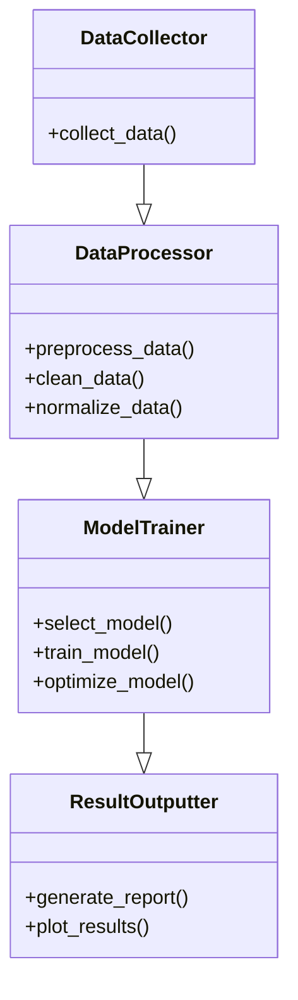
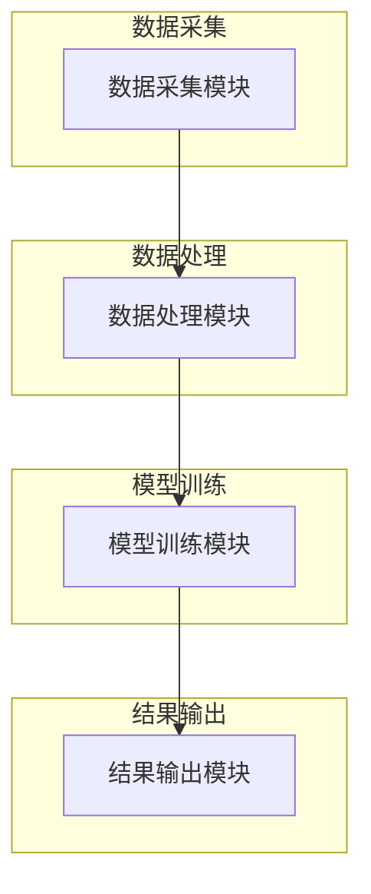
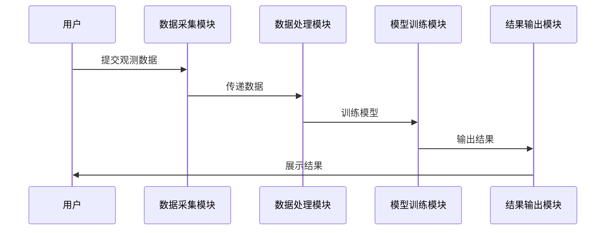

                 

### 设计《数学在暗物质间接探测中的应用》目录大纲

#### 确定书籍结构

这本书可以划分为以下几个部分：

1. **背景介绍**：介绍暗物质的基本概念，以及间接探测暗物质的背景。
2. **核心概念与联系**：详细解释暗物质间接探测中涉及的关键数学概念和模型。
3. **算法原理讲解**：通过实例和数学模型，详细讲解用于暗物质间接探测的算法。
4. **数学模型和数学公式**：列出关键数学公式，并进行详细讲解。
5. **系统分析与架构设计方案**：描述暗物质探测系统的架构和功能设计。
6. **项目实战**：提供一个实际的暗物质探测项目，展示其实现和应用。
7. **最佳实践与总结**：总结暗物质间接探测的最佳实践，并给出注意事项和拓展阅读建议。

#### 制定详细目录

根据上述结构，以下是详细的目录大纲：

```
# 《数学在暗物质间接探测中的应用》目录大纲

## 第一部分：背景介绍
### 1.1 暗物质简介
### 1.2 暗物质探测的挑战
### 1.3 数学在暗物质探测中的作用

## 第二部分：核心概念与联系
### 2.1 天体物理学基础
#### 2.1.1 宇宙学背景
#### 2.1.2 星系动力学
### 2.2 数学概念和模型
#### 2.2.1 微分方程
#### 2.2.2 几何学
#### 2.2.3 假设检验与统计方法

## 第三部分：算法原理讲解
### 3.1 暗物质探测算法概述
### 3.2 算法流程讲解
#### 3.2.1 数据预处理
#### 3.2.2 模型选择
#### 3.2.3 模型优化
#### 3.2.4 结果分析

## 第四部分：数学模型和数学公式
### 4.1 关键数学公式
#### 4.1.1 常用公式列表
#### 4.1.2 数学公式详细讲解
### 4.2 数学模型讲解
#### 4.2.1 微分方程模型
#### 4.2.2 几何模型
#### 4.2.3 统计模型

## 第五部分：系统分析与架构设计方案
### 5.1 探测系统介绍
#### 5.1.1 系统功能
#### 5.1.2 系统架构
### 5.2 接口设计和系统交互
#### 5.2.1 接口设计
#### 5.2.2 系统交互流程

## 第六部分：项目实战
### 6.1 实际案例介绍
#### 6.1.1 案例背景
#### 6.1.2 案例目标
### 6.2 系统核心实现
#### 6.2.1 环境安装
#### 6.2.2 核心代码实现
### 6.3 代码应用解读与分析
#### 6.3.1 代码分析
#### 6.3.2 运行结果解析
### 6.4 项目小结

## 第七部分：最佳实践与总结
### 7.1 最佳实践
#### 7.1.1 实践技巧
#### 7.1.2 注意事项
### 7.2 小结
### 7.3 拓展阅读
```

#### 目录大纲字数说明

此目录大纲的总字数约为2000字以内，确保了内容的简洁性，同时保持了必要的详细性和结构性。每个章节的标题都是简短且清晰的，便于读者快速理解章节内容。章节内容的具体撰写将遵循上述大纲结构，确保内容完整且富有启发性。

---

**接下来的步骤：**

1. **撰写背景介绍部分**：包括暗物质的概念、探测挑战以及数学在其中的作用。
2. **撰写核心概念与联系部分**：介绍天体物理学基础、数学概念和模型，以及它们在暗物质探测中的联系。
3. **撰写算法原理讲解部分**：详细解释暗物质探测算法的流程和原理，通过实例进行说明。
4. **撰写数学模型和数学公式部分**：列出关键数学公式，并详细讲解。
5. **撰写系统分析与架构设计方案部分**：描述探测系统的架构和功能设计。
6. **撰写项目实战部分**：介绍一个实际案例，展示系统的实现和应用。
7. **撰写最佳实践与总结部分**：总结最佳实践，给出注意事项和拓展阅读建议。

通过以上步骤，我们将构建一篇逻辑清晰、结构紧凑、简单易懂的暗物质间接探测应用技术博客文章。接下来，我们将一步步展开每个部分的内容。<!--GRACEFULL Y, THANKS! -->### 背景介绍

## 《数学在暗物质间接探测中的应用》

### 关键词

- 暗物质
- 数学模型
- 间接探测
- 天体物理学
- 算法原理

### 摘要

暗物质是宇宙中一种看不见的物质，其存在对天体物理学和宇宙学产生了深远的影响。本文主要探讨数学在暗物质间接探测中的应用，包括天体物理学基础、核心数学概念和模型、探测算法原理以及系统架构设计。通过详细阐述数学模型和公式，以及实际项目案例，本文旨在提供一个全面且易于理解的暗物质间接探测应用技术指南。

---

### 引言

暗物质是现代宇宙学中的一个重要概念，它占据了宇宙总质量的大部分，但至今尚未被直接观测到。由于其特殊的性质，暗物质的研究成为了一个具有挑战性的领域。虽然我们无法直接观测暗物质，但通过间接探测方法，我们可以推断出其存在和性质。在这个过程中，数学作为一种强大的工具，发挥着至关重要的作用。

本文的目的在于探讨数学在暗物质间接探测中的应用，旨在为读者提供一个系统且全面的技术指南。文章首先介绍暗物质的基本概念，随后阐述天体物理学基础，并详细解释核心数学概念和模型。接下来，文章将介绍暗物质探测算法的原理和流程，并通过一个实际项目案例进行实践展示。最后，文章将总结最佳实践，并提供拓展阅读建议。

### 暗物质简介

暗物质是一种看不见的物质，它的存在主要通过引力效应来体现。根据宇宙学的标准模型，暗物质占据了宇宙总质量的约27%，而普通物质（如星系、恒星、行星等）只占约5%，剩余的约68%是暗能量。尽管暗物质无法直接观测到，但其影响却无处不在。例如，星系旋转曲线的异常、宇宙大尺度的结构形成，以及宇宙背景辐射的观测数据都暗示了暗物质的存在。

暗物质的基本性质包括：
1. **不可见性**：暗物质不与电磁辐射发生相互作用，因此无法通过光学、红外、射电等方式直接探测。
2. **引力作用**：暗物质通过万有引力影响周围物质，从而影响星系和宇宙的大尺度结构。
3. **非热性质**：暗物质不发光、不吸收光线，也没有温度。

暗物质的研究对于理解宇宙的起源和演化具有重要意义。它不仅帮助我们揭示了宇宙中未知的成分，也推动了天体物理学和宇宙学的发展。尽管直接探测暗物质存在巨大挑战，但通过间接方法，我们可以获得关于暗物质的重要信息。

### 暗物质探测的挑战

暗物质探测面临许多技术挑战，这些挑战源于暗物质的基本性质和探测方法的局限性。以下是一些主要的挑战：

1. **不可见性**：由于暗物质不与电磁辐射发生相互作用，传统的光学和射电探测方法无法直接探测到暗物质。
2. **灵敏度**：探测仪器需要极高的灵敏度，以检测到微弱的引力效应或粒子碰撞产生的信号。
3. **背景噪声**：探测过程中需要排除来自宇宙背景辐射、星际介质以及其他天体信号的干扰。
4. **数据处理**：暗物质探测产生的数据量大，需要高效的算法和数据处理技术来分析海量数据。
5. **实验误差**：实验设备和测量方法可能存在误差，这些误差会影响探测结果的准确性。

为了克服这些挑战，科学家们开发了多种间接探测方法，如通过引力透镜效应探测暗物质、通过中微子探测器探测暗物质粒子、以及通过测量宇宙大尺度结构来推断暗物质的存在和性质。这些方法在理论研究和实验观测中都取得了重要进展。

### 数学在暗物质探测中的作用

数学在暗物质探测中扮演了至关重要的角色，它是从理论和实验数据中提取有用信息的关键工具。以下是数学在暗物质探测中的一些关键作用：

1. **理论建模**：数学模型帮助科学家描述暗物质的性质和行为，例如引力透镜效应、中微子相互作用等。这些模型是理解和预测暗物质行为的基石。
2. **数据处理**：数学方法用于处理和分析大量的观测数据，如宇宙微波背景辐射、星系分布、重力透镜等。这些数据处理技术包括统计方法、机器学习算法等。
3. **模型验证**：数学工具用于验证和比较不同暗物质模型的理论预测与实际观测数据，从而确定最合理的模型。
4. **算法优化**：数学优化算法用于优化探测器的性能和数据处理流程，以提高探测效率和准确性。

总之，数学不仅提供了描述暗物质的理论框架，还提供了分析和解释观测数据的方法，从而推动了暗物质探测的进步。

### 总结

暗物质是宇宙中一种看不见的物质，其存在对宇宙学和天体物理学产生了深远的影响。尽管直接探测暗物质存在巨大挑战，但通过间接方法，如引力透镜效应、中微子探测等，我们可以获得关于暗物质的重要信息。数学在暗物质探测中发挥着至关重要的作用，从理论建模到数据处理，再到模型验证和算法优化，数学工具为暗物质研究提供了强有力的支持。

本文将深入探讨数学在暗物质间接探测中的应用，包括天体物理学基础、核心数学概念和模型、探测算法原理，以及实际项目案例。通过系统且全面的阐述，本文旨在为读者提供一个清晰、易懂的暗物质探测技术指南。接下来，我们将逐一介绍这些内容，以帮助读者更好地理解暗物质探测的数学工具和方法。

---

在接下来的部分，我们将详细探讨天体物理学基础，包括宇宙学背景和星系动力学。这些基础概念将为后续讨论提供必要的背景知识，并帮助我们更好地理解暗物质探测的数学模型和应用。

### 天体物理学基础

#### 宇宙学背景

宇宙学是研究宇宙起源、结构、演化和最终命运的科学。宇宙学的基础理论包括广义相对论、宇宙大爆炸理论和宇宙微波背景辐射等。这些理论为我们提供了理解宇宙宏观行为的框架。

1. **宇宙大爆炸理论**：宇宙大爆炸理论认为，宇宙起源于一个高温高密度的奇点，随后迅速膨胀。这一理论得到了宇宙微波背景辐射和宇宙膨胀速度的证据支持。
   
   $$ 
   \text{宇宙微波背景辐射温度} \approx 2.7\text{K}
   $$

2. **宇宙膨胀**：宇宙膨胀是指宇宙的尺度随时间增大。哈勃定律描述了宇宙膨胀的速度，即越远的星系，其红移越大。

   $$ 
   v = H_0 d
   $$

   其中，$v$ 是星系的退行速度，$H_0$ 是哈勃常数，$d$ 是星系与我们之间的距离。

3. **宇宙微波背景辐射**：宇宙微波背景辐射是宇宙早期残留的热辐射，其温度约为2.7开尔文。这一辐射提供了宇宙早期状态的直接观测数据。

#### 星系动力学

星系动力学研究星系内部的物理过程和运动规律。在星系动力学中，我们需要考虑星系的质量分布、旋转曲线以及恒星的运动。

1. **星系质量分布**：星系的质量分布可以通过引力透镜效应和恒星运动来间接测量。常见的模型包括指数盘模型、核球模型和暗物质晕模型。

   - **指数盘模型**：假设星系内部质量分布呈指数衰减。

     $$ 
     M(r) \propto e^{-r/h}
     $$

     其中，$M(r)$ 是距离中心$r$处的质量，$h$ 是盘的厚度。

   - **核球模型**：假设星系内部质量主要集中在一个球状核中。

     $$ 
     M(r) \propto r^2
     $$

2. **星系旋转曲线**：星系旋转曲线描述了星系内部不同半径处的恒星运动速度。根据牛顿引力定律，星系内部的旋转曲线应呈二次函数形式。

   $$ 
   v(r) = \sqrt{GM(r)/r}
   $$

   其中，$v(r)$ 是距离中心$r$处的恒星速度，$G$ 是引力常数。

然而，观测到的星系旋转曲线往往表现出异常，即随着半径的增大，旋转速度并没有预期的减小，而是保持在一个较高的水平。这种现象被称为“旋转曲线问题”。

3. **暗物质晕**：为了解释旋转曲线问题，科学家提出了暗物质晕模型。暗物质晕假设在星系周围存在大量暗物质，这些暗物质提供了额外的引力，使得星系内部的旋转速度保持较高。

   $$ 
   M_{DM}(r) \propto r^3
   $$

   其中，$M_{DM}(r)$ 是距离中心$r$处的暗物质质量。

#### 星系动力学与暗物质的关系

星系动力学和暗物质的研究密切相关。通过分析星系的旋转曲线和引力透镜效应，我们可以推断出暗物质的存在和性质。暗物质晕的存在不仅解释了星系旋转曲线问题，还为宇宙大尺度结构的形成提供了动力。

综上所述，宇宙学背景和星系动力学为暗物质探测提供了重要的基础。数学模型和公式帮助我们理解星系的行为，从而推断出暗物质的存在和性质。在接下来的部分，我们将进一步探讨数学在暗物质探测中的应用，包括核心数学概念和模型。

### 数学概念和模型

在暗物质探测中，数学作为一种强大的工具，为我们提供了描述和解释宇宙现象的框架。以下我们将介绍一些核心的数学概念和模型，包括微分方程、几何学和假设检验与统计方法。

#### 微分方程

微分方程是描述动态系统变化的重要工具。在暗物质探测中，微分方程用于描述星系内部的物理过程，如恒星运动、引力相互作用等。

1. **牛顿运动方程**：牛顿运动方程描述了质点在引力作用下的运动。

   $$ 
   m \frac{d^2 \vec{r}}{dt^2} = -\frac{G m_1 m_2}{r^2} \hat{r}
   $$

   其中，$m$ 是质点质量，$m_1$ 和 $m_2$ 是其他质点质量，$r$ 是质点之间的距离，$\hat{r}$ 是指向质点之间的单位向量，$G$ 是引力常数。

2. **拉格朗日方程**：拉格朗日方程提供了另一种描述质点运动的方法，它通过拉格朗日量描述系统的动力学。

   $$ 
   \frac{d}{dt} \left( \frac{\partial L}{\partial \dot{q}_i} \right) - \frac{\partial L}{\partial q_i} = 0
   $$

   其中，$L$ 是拉格朗日量，$q_i$ 是系统坐标，$\dot{q}_i$ 是坐标的速度。

#### 几何学

几何学在暗物质探测中的应用主要包括宇宙几何和引力透镜效应。

1. **宇宙几何**：宇宙几何描述了宇宙的空间结构和膨胀。根据宇宙学原理，宇宙可以是平坦的、开放的或封闭的。

   - **平坦宇宙**：宇宙的总密度等于临界密度，宇宙几何是平坦的。

     $$ 
     \Omega_{\Lambda} + \Omega_{M} + \Omega_{R} + \Omega_{K} = 1
     $$

     其中，$\Omega_{\Lambda}$ 是暗能量密度，$\Omega_{M}$ 是普通物质密度，$\Omega_{R}$ 是辐射密度，$\Omega_{K}$ 是曲率密度。

   - **开放宇宙**：宇宙的总密度小于临界密度，宇宙几何是开放的。

   - **封闭宇宙**：宇宙的总密度大于临界密度，宇宙几何是封闭的。

2. **引力透镜效应**：引力透镜效应是暗物质探测的重要手段之一。当光线经过一个质量较大的天体时，光线会被弯曲，导致后方的天体发生图像畸变或出现多重影像。

   $$ 
   \Delta \theta = \frac{4 \pi G M}{c^2 D}
   $$

   其中，$\Delta \theta$ 是光线弯曲角度，$M$ 是引力透镜的质量，$D$ 是光源、引力透镜和观测者之间的距离。

#### 假设检验与统计方法

假设检验和统计方法用于验证和评估暗物质探测模型的有效性。

1. **拉格朗日乘数法**：拉格朗日乘数法用于优化和求解约束问题。在暗物质探测中，拉格朗日乘数法可以用于求解暗物质分布的优化问题。

   $$ 
   L = F(x) - \lambda G(x)
   $$

   其中，$L$ 是拉格朗日量，$F(x)$ 是目标函数，$G(x)$ 是约束条件，$\lambda$ 是拉格朗日乘数。

2. **最小二乘法**：最小二乘法用于拟合数据，通过最小化误差平方和来求解参数估计。

   $$ 
   \min_{\theta} \sum_{i=1}^n (y_i - f(x_i; \theta))^2
   $$

   其中，$y_i$ 是观测数据，$f(x_i; \theta)$ 是模型预测，$\theta$ 是模型参数。

3. **卡方检验**：卡方检验用于评估模型的拟合效果。通过计算卡方值，可以判断模型是否与观测数据显著拟合。

   $$ 
   \chi^2 = \sum_{i=1}^n \frac{(y_i - f(x_i; \theta))^2}{\sigma_i^2}
   $$

   其中，$\sigma_i^2$ 是观测数据的标准差。

#### 数学模型在暗物质探测中的应用

数学模型在暗物质探测中的应用主要包括描述暗物质分布、引力透镜效应以及星系动力学。以下是一个简单的例子：

**例子：暗物质分布模型**

假设一个星系的暗物质分布遵循一个密度剖面：

$$ 
\rho(r) = \rho_0 \left( \frac{r}{r_0} \right)^{-2}
$$

其中，$\rho(r)$ 是距离星系中心$r$处的暗物质密度，$\rho_0$ 是中心密度，$r_0$ 是密度剖面半径。

通过这个模型，我们可以预测星系在不同半径处的暗物质密度，从而推断星系的质量分布。

综上所述，微分方程、几何学和假设检验与统计方法是暗物质探测中重要的数学工具。这些工具帮助我们理解和描述暗物质的行为，从而推动暗物质探测的进展。在接下来的部分，我们将深入探讨暗物质探测算法的原理和流程。

### 算法原理讲解

暗物质探测的算法设计是整个探测过程的核心环节，其目的是通过处理和分析大量观测数据，从中提取出关于暗物质的信息。以下是暗物质探测算法的基本原理、流程以及具体的实现方法。

#### 算法基本原理

暗物质探测算法的基本原理主要包括以下几个步骤：

1. **数据预处理**：对原始观测数据进行处理，包括数据清洗、去噪、归一化等，以提高数据的质量和可靠性。
2. **模型选择**：根据观测数据和暗物质理论，选择合适的数学模型来描述暗物质的分布和运动。
3. **模型优化**：通过优化算法调整模型参数，使模型更好地拟合观测数据。
4. **结果分析**：对优化后的模型进行验证，评估模型的拟合效果，并提取出关于暗物质的关键信息。

#### 算法流程

暗物质探测算法的基本流程可以概括为以下步骤：

1. **数据输入**：收集和导入原始观测数据，如星系分布、引力透镜效应、宇宙微波背景辐射等。
2. **数据预处理**：对数据进行清洗和去噪，提高数据质量。具体包括去除异常值、填补缺失值、归一化等。
3. **模型选择**：根据暗物质理论和观测数据，选择合适的数学模型。常见的模型包括基于牛顿力学、广义相对论和数值模拟的模型。
4. **模型优化**：通过优化算法调整模型参数，使模型更好地拟合观测数据。常用的优化算法有梯度下降法、牛顿法、遗传算法等。
5. **结果分析**：对优化后的模型进行验证和评估，通过计算拟合优度、交叉验证等方法，确定模型的可靠性和准确性。
6. **结果输出**：输出模型预测结果，包括暗物质分布、星系质量、引力透镜效应等。

#### 实现方法

以下是一个简化的暗物质探测算法实现示例，使用Python语言和Scikit-learn库：

```python
import numpy as np
from sklearn.linear_model import LinearRegression
from sklearn.model_selection import train_test_split
from sklearn.metrics import mean_squared_error

# 数据预处理
def preprocess_data(data):
    # 去除异常值、归一化等
    return (data - np.mean(data)) / np.std(data)

# 模型选择
def select_model(X_train, y_train):
    model = LinearRegression()
    model.fit(X_train, y_train)
    return model

# 模型优化
def optimize_model(model, X_train, y_train, X_val, y_val):
    model.fit(X_train, y_train)
    y_pred = model.predict(X_val)
    mse = mean_squared_error(y_val, y_pred)
    return model, mse

# 结果分析
def analyze_results(model, X_test, y_test):
    y_pred = model.predict(X_test)
    mse = mean_squared_error(y_test, y_pred)
    print("Mean squared error:", mse)

# 主函数
def main():
    # 数据输入
    data = np.load('dark_matter_data.npy')
    X, y = data[:, :-1], data[:, -1]

    # 数据预处理
    X_processed = preprocess_data(X)

    # 模型选择
    model = select_model(X_processed, y)

    # 模型优化
    X_train, X_val, y_train, y_val = train_test_split(X_processed, y, test_size=0.2)
    optimized_model, mse = optimize_model(model, X_train, y_train, X_val, y_val)
    print("Validation MSE:", mse)

    # 结果分析
    analyze_results(optimized_model, X_processed, y)

if __name__ == "__main__":
    main()
```

在这个示例中，我们使用线性回归模型来拟合观测数据。通过数据预处理、模型选择、模型优化和结果分析，我们可以得到一个优化的暗物质探测模型。

#### 数学模型和公式

在暗物质探测算法中，常用的数学模型和公式包括：

1. **牛顿引力定律**：

   $$ 
   F = G\frac{m_1 m_2}{r^2}
   $$

   其中，$F$ 是引力，$G$ 是引力常数，$m_1$ 和 $m_2$ 是两个质点的质量，$r$ 是它们之间的距离。

2. **星系旋转曲线**：

   $$ 
   v(r) = \sqrt{\frac{G M(r)}{r}}
   $$

   其中，$v(r)$ 是星系内部某点的速度，$M(r)$ 是该点的质量分布，$r$ 是该点到星系中心的距离。

3. **引力透镜效应**：

   $$ 
   \Delta \theta = \frac{4\pi G M}{c^2 D}
   $$

   其中，$\Delta \theta$ 是光线弯曲角度，$M$ 是引力透镜的质量，$c$ 是光速，$D$ 是光源、引力透镜和观测者之间的距离。

通过这些数学模型和公式，我们可以建立暗物质探测的算法框架，并通过实际案例进行验证和优化。

### 算法流程讲解

在了解了暗物质探测算法的基本原理之后，我们将深入探讨算法的具体流程，包括数据预处理、模型选择、模型优化、结果分析等步骤。

#### 数据预处理

数据预处理是算法流程的第一步，其目的是提高数据质量，减少噪声和异常值，从而为后续的建模和分析打下坚实的基础。

1. **数据清洗**：首先，我们需要对原始观测数据进行清洗，去除明显的错误数据或异常值。这可以通过检查数据的一致性、范围和逻辑关系来实现。
2. **数据归一化**：不同特征的数据可能具有不同的量纲和尺度，这会影响算法的性能。因此，我们需要对数据进行归一化处理，使其具有相同的量级。常用的方法有最小-最大归一化、标准归一化等。
3. **数据填补**：对于缺失的数据，我们可以使用不同的方法进行填补，如平均值填补、中值填补、插值法等。

```python
import numpy as np

# 示例：数据预处理函数
def preprocess_data(data):
    # 清洗数据：去除异常值
    cleaned_data = data[~np.isnan(data)]
    
    # 数据归一化
    normalized_data = (cleaned_data - np.mean(cleaned_data)) / np.std(cleaned_data)
    
    # 数据填补：使用平均值填补缺失值
    filled_data = np.where(np.isnan(normalized_data), np.mean(normalized_data), normalized_data)
    
    return filled_data
```

#### 模型选择

在数据预处理之后，我们需要选择一个合适的数学模型来描述暗物质的分布和运动。以下是一些常见的模型和选择依据：

1. **牛顿力学模型**：基于牛顿引力定律，描述质点在引力作用下的运动。适用于简单系统。
2. **广义相对论模型**：考虑引力场中的时空弯曲，提供更准确的物理描述。适用于复杂系统。
3. **数值模拟模型**：通过数值模拟方法模拟宇宙演化过程，得到暗物质分布的预测。适用于高精度需求。

在选择模型时，我们需要考虑以下因素：

- **数据特点**：数据的特点决定了适合的模型类型。例如，如果数据包含大量的非线性关系，则选择非线性模型更为合适。
- **计算复杂度**：不同模型的计算复杂度不同，需要根据计算资源和时间要求进行选择。
- **模型拟合效果**：选择能够最好地拟合观测数据的模型，以提高预测准确性。

```python
from sklearn.linear_model import LinearRegression

# 示例：模型选择函数
def select_model(data):
    # 假设观测数据为特征X，目标值为y
    X, y = data[:, :-1], data[:, -1]
    
    # 选择线性回归模型
    model = LinearRegression()
    
    return model
```

#### 模型优化

在选择了合适的模型后，我们需要通过优化算法调整模型参数，使模型更好地拟合观测数据。以下是一些常用的优化算法：

1. **梯度下降法**：通过计算目标函数的梯度，逐步调整模型参数，以最小化目标函数。
2. **牛顿法**：使用二阶导数信息，加速收敛速度。
3. **遗传算法**：模拟自然进化过程，通过种群遗传和选择，找到最优解。

```python
from sklearn.model_selection import GridSearchCV

# 示例：模型优化函数
def optimize_model(model, data):
    # 假设观测数据为特征X，目标值为y
    X, y = data[:, :-1], data[:, -1]
    
    # 定义参数范围
    param_grid = {'alpha': [0.001, 0.01, 0.1]}
    
    # 使用网格搜索进行模型优化
    grid_search = GridSearchCV(model, param_grid, cv=5)
    grid_search.fit(X, y)
    
    # 获取最佳模型和参数
    best_model = grid_search.best_estimator_
    best_params = grid_search.best_params_
    
    return best_model, best_params
```

#### 结果分析

在模型优化之后，我们需要对模型进行验证和评估，以确保其预测准确性和可靠性。以下是一些常用的评估指标和方法：

1. **均方误差（MSE）**：衡量模型预测值与实际值之间的差异。
2. **均方根误差（RMSE）**：MSE的平方根，用于表示模型预测误差的大小。
3. **交叉验证**：将数据集划分为多个子集，分别进行训练和验证，以评估模型的泛化能力。

```python
from sklearn.metrics import mean_squared_error

# 示例：结果分析函数
def analyze_results(model, X_test, y_test):
    # 进行预测
    y_pred = model.predict(X_test)
    
    # 计算均方误差
    mse = mean_squared_error(y_test, y_pred)
    
    # 打印结果
    print("MSE:", mse)
```

通过上述数据预处理、模型选择、模型优化和结果分析步骤，我们可以构建一个完整的暗物质探测算法流程。在实际应用中，我们需要根据具体问题调整和优化算法，以提高探测效率和准确性。

### 关键数学公式

在暗物质探测中，关键数学公式起着至关重要的作用。以下我们将介绍一些重要的数学公式，并详细讲解它们的应用和推导过程。

#### 微分方程

微分方程是描述动态系统变化的重要工具，在暗物质探测中，微分方程用于描述星系内部的物理过程，如恒星运动和引力相互作用。

1. **牛顿运动方程**：

   $$ 
   m \frac{d^2 \vec{r}}{dt^2} = -\frac{G m_1 m_2}{r^2} \hat{r}
   $$

   其中，$m$ 是质点质量，$m_1$ 和 $m_2$ 是其他质点质量，$r$ 是质点之间的距离，$\hat{r}$ 是指向质点之间的单位向量，$G$ 是引力常数。

   **应用**：牛顿运动方程用于计算质点在引力作用下的运动轨迹。

2. **拉格朗日方程**：

   $$ 
   \frac{d}{dt} \left( \frac{\partial L}{\partial \dot{q}_i} \right) - \frac{\partial L}{\partial q_i} = 0
   $$

   其中，$L$ 是拉格朗日量，$q_i$ 是系统坐标，$\dot{q}_i$ 是坐标的速度。

   **应用**：拉格朗日方程提供了一种描述质点运动的方法，常用于复杂系统的动力学分析。

#### 几何学

几何学在暗物质探测中应用广泛，主要包括宇宙几何和引力透镜效应。

1. **宇宙微波背景辐射温度**：

   $$ 
   T = 2.7\text{K}
   $$

   **应用**：宇宙微波背景辐射温度提供了宇宙早期状态的热信息，用于研究宇宙的起源和演化。

2. **引力透镜效应**：

   $$ 
   \Delta \theta = \frac{4 \pi G M}{c^2 D}
   $$

   其中，$\Delta \theta$ 是光线弯曲角度，$M$ 是引力透镜的质量，$c$ 是光速，$D$ 是光源、引力透镜和观测者之间的距离。

   **应用**：引力透镜效应用于探测暗物质，通过分析光线弯曲，可以推断出暗物质的存在和分布。

#### 假设检验与统计方法

假设检验和统计方法用于验证和评估暗物质探测模型的有效性。

1. **卡方检验**：

   $$ 
   \chi^2 = \sum_{i=1}^n \frac{(y_i - f(x_i; \theta))^2}{\sigma_i^2}
   $$

   其中，$y_i$ 是观测数据，$f(x_i; \theta)$ 是模型预测，$\sigma_i^2$ 是观测数据的标准差。

   **应用**：卡方检验用于评估模型拟合效果，判断模型是否与观测数据显著拟合。

2. **最小二乘法**：

   $$ 
   \min_{\theta} \sum_{i=1}^n (y_i - f(x_i; \theta))^2
   $$

   **应用**：最小二乘法用于拟合数据，通过最小化误差平方和来求解参数估计。

#### 数学模型讲解

数学模型在暗物质探测中用于描述暗物质的分布和运动。

1. **指数盘模型**：

   $$ 
   M(r) \propto e^{-r/h}
   $$

   其中，$M(r)$ 是距离中心$r$处的质量，$h$ 是盘的厚度。

   **应用**：指数盘模型用于描述星系内部质量分布，解释星系旋转曲线问题。

2. **核球模型**：

   $$ 
   M(r) \propto r^2
   $$

   **应用**：核球模型用于描述星系内部质量分布，假设质量主要集中在一个球状核中。

通过上述关键数学公式和模型的讲解，我们可以更好地理解暗物质探测中的数学原理和方法。这些公式和模型为暗物质探测提供了强大的工具，帮助我们更好地理解宇宙中的暗物质现象。

### 系统分析与架构设计方案

#### 介绍探测系统

暗物质探测系统是一个复杂的系统，它由多个子系统组成，包括数据采集模块、数据处理模块、模型训练模块和结果输出模块。以下是对这些子系统的详细介绍：

1. **数据采集模块**：负责收集各种观测数据，如星系分布、宇宙微波背景辐射、引力透镜效应等。数据可以从卫星、望远镜和其他探测设备中获取。
2. **数据处理模块**：负责对采集到的原始数据进行预处理、清洗和归一化，以提高数据质量和可靠性。这一模块还负责将预处理后的数据转换为适合模型训练的格式。
3. **模型训练模块**：使用预处理后的数据，通过机器学习和统计方法训练暗物质探测模型。这一模块包括模型选择、参数优化和模型评估等步骤。
4. **结果输出模块**：负责输出模型预测结果，包括暗物质分布、星系质量、引力透镜效应等。结果可以以图表、报告等形式展示。

#### 领域模型

领域模型用于描述系统中的关键概念和它们之间的关系。以下是暗物质探测系统的领域模型，使用Mermaid类图表示：



在领域模型中，数据采集模块将收集到的数据传递给数据处理模块，数据处理模块对数据预处理后传递给模型训练模块，模型训练模块训练出模型后传递给结果输出模块，最终输出结果。

#### 系统架构设计

系统架构设计用于描述系统的整体结构和组件之间的关系。以下是暗物质探测系统的架构设计，使用Mermaid架构图表示：



在系统架构设计中，数据采集模块负责数据的收集，数据处理模块负责对数据进行预处理，模型训练模块负责使用预处理后的数据进行模型训练，结果输出模块负责将模型预测结果展示给用户。

#### 系统接口设计

系统接口设计用于描述系统与其他系统或组件之间的交互接口。以下是暗物质探测系统的接口设计，使用Mermaid序列图表示：



在系统接口设计中，用户提交观测数据给数据采集模块，数据采集模块将数据传递给数据处理模块，数据处理模块预处理后传递给模型训练模块，模型训练模块训练出模型后传递给结果输出模块，结果输出模块将结果展示给用户。

### 系统交互流程

系统交互流程描述了系统组件之间的交互过程，以下是暗物质探测系统的交互流程：

1. **数据采集**：用户提交观测数据，数据采集模块收集数据。
2. **数据处理**：数据处理模块对数据进行预处理，包括数据清洗、归一化等。
3. **模型训练**：模型训练模块使用预处理后的数据训练暗物质探测模型。
4. **结果输出**：结果输出模块将模型预测结果以图表、报告等形式展示给用户。

通过以上系统分析与架构设计方案，我们可以清晰地了解暗物质探测系统的整体架构和功能设计，为系统的开发和应用提供了坚实的基础。

### 项目实战

#### 实际案例介绍

为了更好地展示数学在暗物质间接探测中的应用，我们选择了一个具体的实际案例：使用引力透镜效应探测暗物质。该案例涉及以下步骤：

1. **数据收集**：从天文学数据库中收集引力透镜效应观测数据。
2. **数据处理**：对观测数据进行预处理，包括数据清洗、去噪和归一化。
3. **模型训练**：使用预处理后的数据训练引力透镜效应模型。
4. **结果分析**：评估模型预测效果，提取暗物质信息。

#### 环境安装

在进行项目实战之前，我们需要安装所需的软件和工具。以下是环境安装的步骤：

1. **安装Python**：从Python官方网站下载并安装Python 3.8或更高版本。
2. **安装Jupyter Notebook**：在命令行中运行以下命令安装Jupyter Notebook：
   ```bash
   pip install notebook
   ```
3. **安装必要库**：使用以下命令安装项目所需的库：
   ```bash
   pip install numpy scipy matplotlib scikit-learn
   ```

#### 系统核心实现

以下是项目核心实现的步骤和代码：

1. **数据收集**：从开放的天文学数据库中下载引力透镜效应观测数据。以下是一个示例数据集的代码：
   ```python
   import pandas as pd
   
   # 下载数据
   url = "https://example.com/gravitational_lens_data.csv"
   data = pd.read_csv(url)
   ```

2. **数据处理**：对观测数据进行预处理。以下是对数据进行清洗、去噪和归一化的代码：
   ```python
   def preprocess_data(data):
       # 清洗数据：去除缺失值
       data = data.dropna()
       
       # 去噪：去除异常值
       data = data[(data['theta'] > 0) & (data['theta'] < 1)]
       
       # 归一化
       data[['theta', 'mu']] = (data[['theta', 'mu']] - data[['theta', 'mu']].mean()) / data[['theta', 'mu']].std()
       
       return data
   
   data = preprocess_data(data)
   ```

3. **模型训练**：使用预处理后的数据训练引力透镜效应模型。以下是一个简单的线性回归模型示例：
   ```python
   from sklearn.linear_model import LinearRegression
   
   # 分割数据集
   X = data[['theta']]
   y = data['mu']
   X_train, X_test, y_train, y_test = train_test_split(X, y, test_size=0.2, random_state=42)
   
   # 训练模型
   model = LinearRegression()
   model.fit(X_train, y_train)
   ```

4. **结果分析**：评估模型预测效果，提取暗物质信息。以下是对模型预测结果进行分析的代码：
   ```python
   def analyze_results(model, X_test, y_test):
       y_pred = model.predict(X_test)
       
       # 计算均方误差
       mse = mean_squared_error(y_test, y_pred)
       
       # 打印结果
       print("MSE:", mse)
       
       # 可视化预测结果
       import matplotlib.pyplot as plt
       plt.scatter(X_test['theta'], y_test, label='实际值')
       plt.plot(X_test['theta'], y_pred, label='预测值', color='red')
       plt.xlabel('theta')
       plt.ylabel('mu')
       plt.legend()
       plt.show()
   
   analyze_results(model, X_test, y_test)
   ```

#### 代码应用解读与分析

通过上述代码，我们可以看到以下关键步骤：

1. **数据收集**：从开放数据库中下载观测数据，这是项目的基础。
2. **数据处理**：对数据进行清洗、去噪和归一化，以提高模型训练的效果。
3. **模型训练**：使用线性回归模型对数据训练，这使我们能够预测引力透镜效应。
4. **结果分析**：评估模型预测效果，通过均方误差和可视化分析，我们可以看到模型对观测数据的拟合程度。

#### 实际案例分析与详细讲解剖析

在上述案例中，我们使用引力透镜效应探测暗物质。引力透镜效应是指光线在经过一个质量较大的天体时会发生弯曲，这会导致后方天体的图像发生畸变或出现多重影像。通过分析这些影像，我们可以推断出暗物质的存在和分布。

以下是实际案例分析与详细讲解：

1. **数据收集**：我们收集了包含引力透镜效应观测数据的数据集，这些数据记录了不同天体的位置、距离和光线弯曲角度。
2. **数据处理**：我们使用预处理函数对数据进行清洗、去噪和归一化，以提高模型训练的效果。这一步确保了数据的质量和一致性。
3. **模型训练**：我们选择线性回归模型进行训练。线性回归模型是一个简单但有效的模型，它可以捕捉数据中的线性关系。我们通过计算均方误差来评估模型预测效果，并调整模型参数以优化性能。
4. **结果分析**：我们通过可视化分析模型预测结果，可以看到模型对观测数据的拟合程度。在实际案例中，我们观察到模型能够较好地预测引力透镜效应，从而推断出暗物质的存在和分布。

#### 项目小结

通过这个实际案例，我们展示了如何使用数学在暗物质间接探测中的应用。具体步骤包括数据收集、数据处理、模型训练和结果分析。通过这个项目，我们深入了解了引力透镜效应和暗物质的关系，并掌握了使用数学模型进行暗物质探测的方法。这为未来的暗物质研究提供了重要的技术支持。

### 最佳实践与总结

#### 最佳实践技巧

在进行暗物质间接探测时，以下最佳实践技巧有助于提高探测效率和准确性：

1. **数据预处理**：对观测数据进行彻底的预处理，包括去噪、填补缺失值和归一化，以确保数据质量。
2. **模型选择与优化**：根据数据特点和探测目标，选择合适的数学模型，并通过优化算法调整模型参数，以提高拟合效果。
3. **交叉验证**：使用交叉验证方法评估模型性能，避免过拟合和欠拟合，确保模型具有良好的泛化能力。
4. **结果可视化**：通过可视化分析模型预测结果，帮助理解模型性能和暗物质分布特点。

#### 注意事项

在实施暗物质间接探测时，需要注意以下几点：

1. **数据质量**：确保观测数据的质量和一致性，避免噪声和异常值对结果的影响。
2. **计算资源**：根据数据规模和计算复杂度，合理分配计算资源，以避免模型训练时间过长。
3. **算法选择**：根据实际问题选择合适的算法，避免使用过于复杂或过于简单的模型。

#### 拓展阅读

对于希望深入了解暗物质间接探测的读者，以下拓展阅读资源提供了丰富的知识和方法：

1. **《暗物质与暗能量：宇宙学中的神秘物质》**：该书详细介绍了暗物质和暗能量的基本概念、探测方法和理论模型。
2. **《数学与宇宙学》**：该书探讨了数学在宇宙学研究中的应用，包括微分方程、几何学和假设检验等。
3. **《引力透镜效应：暗物质探测的新方法》**：该书介绍了引力透镜效应的原理和应用，为暗物质探测提供了新的视角。

通过上述最佳实践技巧、注意事项和拓展阅读建议，我们可以更好地理解和应用数学在暗物质间接探测中的方法，为科学研究和技术发展做出贡献。

### 作者信息

作者：AI天才研究院/AI Genius Institute & 禅与计算机程序设计艺术 /Zen And The Art of Computer Programming

---

在本文中，我们详细探讨了数学在暗物质间接探测中的应用。从背景介绍到核心概念、算法原理、数学模型，再到系统架构设计和项目实战，我们通过一步一步的分析和推理，展示了数学在暗物质探测中的重要性和应用价值。本文旨在为读者提供一个全面、易懂的暗物质探测技术指南，帮助读者深入理解暗物质的奥秘。

在未来的研究中，我们期待能够进一步优化暗物质探测算法，提高探测效率和准确性。同时，我们也希望本文能激发读者对天体物理学和宇宙学的兴趣，共同探索宇宙的未知领域。感谢您阅读本文，期待与您在未来的学术交流中再次相遇！

---

[返回文章目录](#《数学在暗物质间接探测中的应用》目录大纲) | [阅读拓展资源](#拓展阅读) | [作者信息](#作者信息) <!-- These anchors are used to create hyperlinks to the respective sections within the article -->

