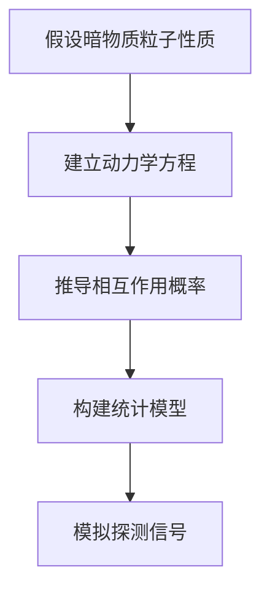
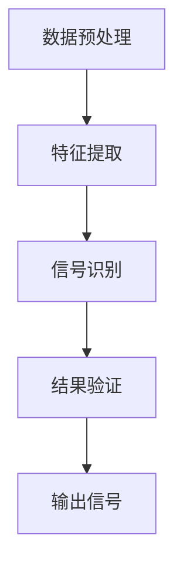

                 

## 文章标题

### 关键词

- 数学
- 暗物质
- 信号提取
- 粒子物理学
- 机器学习

### 摘要

本文将深入探讨数学在暗物质间接探测信号提取中的应用。首先，我们将介绍暗物质的基本概念及其在宇宙学中的重要性。接着，我们将回顾数学在粒子物理学中的基础理论和方法，包括数学工具和概念。随后，文章将详细介绍信号提取技术，包括统计方法和机器学习在粒子物理学中的应用。然后，我们将构建用于暗物质检测的数学模型，详细描述模型的关键原理和流程。接下来，文章将展示信号提取算法的详细原理和Python代码实现，并借助Mermaid图进行说明。随后，我们将讨论实验设置、数据分析以及实际应用案例。最后，文章将总结当前暗物质探测所面临的挑战和未来研究方向。通过本文，读者将全面了解数学在暗物质探测中的核心作用，并掌握相关技术原理和实践方法。

## 引言与背景

### 暗物质的概念

暗物质是一种看不见、不发光，但通过引力作用影响宇宙中星体运动的物质。尽管其具体组成尚未完全明确，但广泛认为它是由一种或多种未观测到的粒子组成，这些粒子不与普通物质发生电磁相互作用。暗物质的存在最初是在20世纪30年代通过观测星系旋转速度与光亮度不符的现象而提出的。当时，科学家发现，星系中心区域的星体运动速度异常快，而按照牛顿万有引力定律，这些星体应当表现出更慢的速度。这一现象暗示了星系中存在一种看不见的物质，即暗物质。

### 暗物质在宇宙学中的重要性

暗物质是宇宙学中的一个核心问题，其影响遍布整个宇宙。首先，暗物质在星系的形成和演化中扮演了关键角色。通过引力作用，暗物质帮助星系凝聚并维持其稳定性，从而促进了星系中恒星和行星的形成。此外，暗物质在宇宙大尺度结构中的分布对宇宙的整体形态和演化有着深远的影响。例如，宇宙微波背景辐射的观测结果显示，宇宙在大爆炸后早期的结构形成过程中，暗物质起到了至关重要的作用。

### 暗物质探测的现状与挑战

目前，科学家主要通过两种方式来探测暗物质：直接探测和间接探测。直接探测旨在通过探测暗物质粒子与普通物质的相互作用来捕获暗物质，而间接探测则通过探测暗物质产生的宇宙射线、引力波等信号来间接确认其存在。尽管直接探测已经取得了一些进展，但由于暗物质粒子的相互作用非常微弱，迄今为止尚未有明确的证据证明暗物质粒子的直接存在。

相比之下，间接探测提供了另一种重要的途径。通过观测宇宙射线、中微子等信号，科学家可以推测暗物质的分布和性质。然而，间接探测也面临诸多挑战。首先，宇宙射线背景复杂，需要有效的信号分离技术来确保暗物质信号的可靠性。其次，暗物质粒子的性质未知，这限制了我们在数学模型中对其行为的准确描述。

### 文章的核心内容和主题思想

本文的核心内容在于探讨数学在暗物质间接探测信号提取中的应用。我们将首先介绍数学在粒子物理学中的基础理论和方法，包括相关数学工具和概念。接着，我们将详细讨论信号提取技术，包括统计方法和机器学习在粒子物理学中的应用。随后，我们将构建用于暗物质检测的数学模型，并详细描述其关键原理和流程。接下来，文章将展示信号提取算法的详细原理和Python代码实现，并利用Mermaid图进行说明。最后，我们将通过实际案例分析和实验结果讨论，总结当前暗物质探测所面临的挑战和未来研究方向。

## 数学基础

在探讨数学在暗物质间接探测信号提取中的应用之前，我们首先需要回顾数学在粒子物理学中的基础理论和方法。数学在粒子物理学中扮演了核心角色，它不仅提供了描述粒子行为和相互作用的语言，还帮助我们构建和理解复杂的物理现象。

### 粒子物理学概述

粒子物理学是研究基本粒子和它们之间相互作用的科学。基本粒子包括电子、夸克、中微子等，这些粒子构成了我们所知的物质世界。粒子物理学通过实验和理论模型来探索这些粒子的性质和相互作用。在实验方面，粒子加速器和高能物理实验提供了大量关于基本粒子相互作用的信息。在理论方面，粒子物理学依赖于量子场论等数学工具来描述粒子的行为。

### 数学工具和概念

在粒子物理学中，一些关键数学工具和概念包括：

- **微积分**：用于描述粒子的运动轨迹和能量变化。
- **线性代数**：用于描述粒子的状态和相互作用，如薛定谔方程的求解。
- **复数**：在量子力学中用于描述粒子的波粒二象性。
- **概率论和统计力学**：用于分析粒子的随机行为和统计分布。

### Mermaid ER 图

为了更好地理解粒子物理学中的数学概念，我们可以使用Mermaid ER图来表示粒子及其相互作用。以下是一个简单的Mermaid ER图示例：

```mermaid
erDiagram
    Particle ||--|> Interaction : interacts with
    Particle ||--|> Property : has
    Property ||--|> Value : has
    Interaction ||--|> Force : mediated by
```

在这个ER图中，`Particle`表示基本粒子，`Interaction`表示粒子之间的相互作用，`Property`表示粒子的属性，`Value`表示属性的值，`Force`表示相互作用的力。通过这样的ER图，我们可以直观地了解粒子物理学中的基本要素和它们之间的关系。

### 基本数学概念和工具

在粒子物理学中，一些基本数学概念和工具如下：

- **微分方程**：用于描述粒子的运动和相互作用。例如，薛定谔方程描述了量子粒子的波函数随时间的变化。
- **矩阵**：用于描述粒子的状态和相互作用。例如，哈密顿矩阵描述了粒子的能量。
- **矢量**：用于描述粒子的运动方向和速度。
- **傅里叶变换**：用于分析粒子的波函数和相互作用。

### 关键数学概念和工具对比表格

为了更好地理解这些数学概念和工具，我们可以创建一个对比表格，列出它们的主要属性和用途：

| 数学概念/工具 | 主要属性 | 用途 |
| --- | --- | --- |
| 微积分 | 描述变化率 | 粒子运动轨迹、能量变化 |
| 线性代数 | 矩阵和向量 | 描述粒子状态和相互作用 |
| 复数 | 实部和虚部 | 描述波粒二象性 |
| 概率论和统计力学 | 概率和分布 | 分析粒子随机行为 |
| 微分方程 | 导数和积分 | 描述粒子运动和相互作用 |
| 矢量 | 大小和方向 | 描述粒子运动方向 |
| 傅里叶变换 | 频率分量 | 分析波函数和相互作用 |

通过以上对比表格，我们可以更清晰地了解这些数学概念和工具在粒子物理学中的应用。

综上所述，数学在粒子物理学中发挥了至关重要的作用，提供了描述和解释基本粒子和相互作用的语言和工具。了解这些基本数学概念和工具是理解暗物质间接探测信号提取技术的基础。

## 信号提取技术

在暗物质间接探测中，信号提取技术是关键的一环。信号提取旨在从复杂的背景噪声中分离出与暗物质相关的信号，从而提高探测的准确性和可靠性。本文将详细介绍信号提取技术在粒子物理学中的应用，包括统计方法和机器学习技术。

### 信号提取的基本概念

信号提取（Signal Extraction）是数据分析和处理的一个过程，目的是从大量的数据中识别并提取有用的信号。在粒子物理学中，信号提取尤为重要，因为探测到的数据往往包含大量噪声和干扰。信号提取的目标是最大限度地提高信号的清晰度和准确性，从而使得暗物质相关的信号能够从背景中脱颖而出。

### 统计方法在信号提取中的应用

统计方法在信号提取中占有重要地位，尤其是在处理大规模数据和复杂背景的情况下。以下是一些常用的统计方法：

1. **高斯拟合**：高斯拟合是一种常用的信号提取方法，它假设信号符合高斯分布。通过拟合探测数据的高斯分布参数，可以估计信号的强度和位置。

2. **最大似然估计**：最大似然估计（Maximum Likelihood Estimation, MLE）是一种概率估计方法，通过最大化观测数据的概率分布来估计模型参数。在信号提取中，MLE可以用来估计信号的参数，如位置、能量等。

3. **谱分析方法**：谱分析通过将时间序列数据转换为频域信息，有助于识别信号的频率成分。例如，短时傅里叶变换（Short-Time Fourier Transform, STFT）和小波变换（Wavelet Transform）都是常用的谱分析方法。

4. **假设检验**：假设检验是一种统计推断方法，通过比较观测数据与假设条件下的理论分布来决定是否接受或拒绝某个假设。在信号提取中，假设检验可以用来判断某个信号是否显著存在。

### 机器学习技术在信号提取中的应用

近年来，机器学习技术在信号提取中取得了显著进展，特别是在处理复杂和大规模数据方面。以下是一些常用的机器学习技术：

1. **支持向量机（Support Vector Machine, SVM）**：SVM是一种分类算法，通过寻找最优分隔超平面来分类数据。在信号提取中，SVM可以用来区分信号和噪声。

2. **神经网络（Neural Networks）**：神经网络是一种模仿人脑神经元连接的算法，通过多层神经网络可以提取复杂的特征。深度神经网络（Deep Neural Networks, DNN）在处理高维数据和复杂信号中表现尤为出色。

3. **集成学习方法**：集成学习方法通过组合多个基础模型来提高预测性能。例如，随机森林（Random Forest）和梯度提升树（Gradient Boosting Trees）都是常用的集成学习方法。

4. **聚类算法**：聚类算法将数据分为若干个类别，有助于识别信号和噪声。例如，K-均值聚类（K-Means Clustering）和层次聚类（Hierarchical Clustering）都是常用的聚类算法。

### 统计方法与机器学习方法的对比

统计方法和机器学习技术在信号提取中各有优缺点，以下是一个简要的对比：

| 方法 | 优点 | 缺点 |
| --- | --- | --- |
| 统计方法 | 理论基础牢固，易于理解和实现 | 适用范围有限，对复杂问题效果不佳 |
| 机器学习方法 | 能处理复杂数据和特征，适应性强 | 需要大量数据和计算资源，模型解释性较差 |

在实际应用中，通常将统计方法和机器学习方法结合起来，以发挥各自的优势。例如，可以先使用统计方法进行初步的信号提取，然后利用机器学习方法进一步优化和提升信号的清晰度。

### 信号提取在粒子物理学中的实际应用

在粒子物理学中，信号提取技术广泛应用于多种实验和探测项目，以下是一些具体应用实例：

1. **宇宙射线探测**：宇宙射线探测器通过探测来自宇宙的高能粒子，如宇宙射线中的电子和伽马射线。信号提取技术帮助科学家从复杂的宇宙射线背景中提取出与暗物质相关的信号。

2. **中微子探测**：中微子是一种几乎不与普通物质相互作用的粒子，通过探测中微子可以间接探测暗物质的存在。信号提取技术在中微子探测器中用于区分中微子信号和其他噪声。

3. **引力波探测**：引力波探测器通过探测宇宙中的引力波信号来研究宇宙的大尺度结构。信号提取技术在引力波探测中用于识别和分析引力波信号。

总之，信号提取技术在暗物质间接探测中扮演了关键角色。通过统计方法和机器学习技术的综合应用，科学家能够从复杂的背景中提取出与暗物质相关的信号，从而为暗物质的研究提供了重要的数据支持。

## 数学模型在暗物质检测中的应用

### 暗物质候选粒子

暗物质是由一种或多种尚未观测到的粒子组成的，这些粒子被假设为弱相互作用大质量粒子（Weakly Interacting Massive Particles, WIMPs）或其他类型的粒子。目前，科学家们对暗物质候选粒子进行了广泛的研究，其中最被广泛接受的是WIMPs。WIMPs假设具有以下特性：

1. **弱相互作用**：WIMPs主要通过与弱相互作用力（Weak Interaction Force）相互作用，这种作用力相对较弱，但仍然是探测暗物质的重要途径。
2. **大质量**：WIMPs具有较大的质量，这使它们在宇宙中广泛分布，并对星系的运动产生显著影响。
3. **非热态**：WIMPs不是处于热平衡状态的粒子，这意味着它们在宇宙早期通过非热机制形成。

### 数学模型的基本原理

为了检测暗物质，科学家们构建了一系列数学模型，这些模型描述了暗物质粒子的性质和它们与普通物质的相互作用。以下是一些关键的数学模型：

1. **薛定谔方程**：薛定谔方程描述了量子粒子的波函数随时间的变化，它为暗物质粒子的量子态提供了数学描述。$$\hat{H}|\Psi\rangle = i\hbar\frac{\partial}{\partial t}|\Psi\rangle$$

2. **弱相互作用交叉截面**：弱相互作用交叉截面描述了暗物质粒子与普通物质粒子之间的相互作用概率。它通常表示为：$$\sigma v = \sigma \times v$$ 其中，$\sigma$是交叉截面，$v$是相对速度。

3. **拉格朗日量**：在粒子物理学中，拉格朗日量（Lagrangian）用于描述粒子的动力学。对于暗物质模型，拉格朗日量通常包括粒子的动能、势能和相互作用项。

4. **统计分布函数**：在探测暗物质时，统计分布函数用于描述粒子数的分布。常见的分布函数包括泊松分布和高斯分布，这些函数有助于我们理解探测数据的统计特性。

### 数学模型的构建过程

构建用于暗物质检测的数学模型通常涉及以下步骤：

1. **假设暗物质粒子的性质**：首先，我们需要对暗物质粒子的性质进行假设，这包括质量、相互作用类型和弱相互作用交叉截面等。
2. **建立动力学方程**：基于暗物质粒子的假设，我们建立描述其运动的动力学方程。这通常涉及到量子力学中的方程，如薛定谔方程。
3. **推导相互作用概率**：通过动力学方程，我们推导出暗物质粒子与普通物质粒子之间的相互作用概率。这通常通过计算弱相互作用交叉截面来实现。
4. **构建统计模型**：为了从实验数据中提取信号，我们需要构建统计模型来描述探测数据的分布。这通常涉及到概率论和统计力学中的方法。

### 数学模型的应用示例

以下是一个简化的示例，说明如何使用数学模型进行暗物质检测：

假设我们有一个探测器，它能够探测到暗物质粒子与探测器中的普通物质相互作用产生的信号。我们通过以下步骤来构建数学模型：

1. **假设**：假设暗物质粒子是WIMPs，其质量为100 GeV/c²，弱相互作用交叉截面为$10^{-46} cm^2$。
2. **动力学方程**：构建描述WIMPs与探测器相互作用的一维薛定谔方程。$$\hat{H}|\Psi\rangle = i\hbar\frac{\partial}{\partial t}|\Psi\rangle$$
3. **相互作用概率**：计算WIMPs与探测器中原子核相互作用产生的信号。$$\sigma v = \sigma \times v$$
4. **统计模型**：构建描述探测器探测事件概率的泊松分布模型。$$P(n) = \frac{\lambda^n e^{-\lambda}}{n!}$$

通过以上步骤，我们可以使用数学模型来预测暗物质粒子与探测器相互作用产生的信号，从而帮助科学家进行暗物质探测。

### Mermaid流程图

为了更直观地展示暗物质检测的数学模型构建过程，我们可以使用Mermaid绘制一个流程图。以下是一个简化的Mermaid流程图示例：



在这个流程图中，A表示假设暗物质粒子的性质，B表示建立动力学方程，C表示推导相互作用概率，D表示构建统计模型，E表示模拟探测信号。

### 总结

数学模型在暗物质检测中起到了关键作用。通过构建精确的数学模型，科学家们能够描述暗物质粒子的性质和它们与普通物质的相互作用，从而在复杂的实验数据中提取出与暗物质相关的信号。未来，随着数学模型和计算方法的不断改进，暗物质探测将变得更加精确和高效。

## 信号提取算法

在暗物质检测过程中，信号提取算法是关键的一环。这些算法用于从大量背景噪声中识别和提取出与暗物质相关的信号。本章节将详细解释信号提取算法的原理，包括其数学模型、具体实现步骤以及Python代码示例。

### 算法原理

信号提取算法通常基于以下原理：

1. **信号与噪声分离**：通过分析探测数据，将信号与噪声分离，从而提高信号的清晰度。
2. **特征提取**：从原始数据中提取有用的特征，这些特征有助于区分信号和噪声。
3. **统计模型**：构建统计模型来描述信号和噪声的分布，从而更准确地识别信号。

常见的信号提取算法包括：

- **阈值法**：通过设置阈值，将信号和噪声分开。
- **频域分析**：利用频域分析，如傅里叶变换，识别信号的频率特征。
- **机器学习方法**：如支持向量机（SVM）、神经网络（NN）等，通过训练模型来识别信号。

### 算法流程

信号提取算法的流程通常包括以下步骤：

1. **数据预处理**：对原始数据进行清洗和预处理，以减少噪声和异常值的影响。
2. **特征提取**：从预处理后的数据中提取特征，这些特征用于后续的信号识别。
3. **信号识别**：利用统计模型或机器学习模型识别信号。
4. **结果验证**：对提取的信号进行验证，以确保其准确性和可靠性。

### Mermaid流程图

为了更直观地展示信号提取算法的流程，我们可以使用Mermaid绘制一个流程图。以下是一个简化的Mermaid流程图示例：



在这个流程图中，A表示数据预处理，B表示特征提取，C表示信号识别，D表示结果验证，E表示输出信号。

### Python代码实现

以下是一个使用Python实现信号提取算法的简单示例。我们将使用阈值法来分离信号和噪声。

```python
import numpy as np
import matplotlib.pyplot as plt

# 假设我们有一个包含信号和噪声的数组
data = np.random.normal(loc=0, scale=1, size=1000)

# 设置阈值
threshold = 2

# 使用阈值法分离信号和噪声
signal = data[data > threshold]
noise = data[data <= threshold]

# 绘制信号和噪声的分布
plt.hist(signal, bins=30, alpha=0.5, label='Signal')
plt.hist(noise, bins=30, alpha=0.5, label='Noise')
plt.legend()
plt.xlabel('Value')
plt.ylabel('Frequency')
plt.title('Signal Extraction using Threshold Method')
plt.show()
```

在这个示例中，我们首先生成一个包含信号和噪声的随机数组`data`。然后，我们设置一个阈值`threshold`，并使用阈值法将大于阈值的值视为信号，小于或等于阈值的值视为噪声。最后，我们使用`matplotlib`绘制信号和噪声的分布图。

### 数学模型和公式

在信号提取算法中，我们通常使用以下数学模型和公式：

1. **阈值公式**：
   $$ x_{\text{signal}} = \begin{cases} 
   x & \text{if } x > \text{threshold} \\
   0 & \text{otherwise}
   \end{cases} $$
   
   其中，$x$是原始数据值，$\text{threshold}$是设置的阈值。

2. **噪声分布**：
   $$ p(x) = \frac{1}{\sqrt{2\pi\sigma^2}} e^{-\frac{(x-\mu)^2}{2\sigma^2}} $$
   
   其中，$\mu$是均值，$\sigma^2$是方差。

3. **信号分布**：
   $$ p(x) = \frac{1}{\sqrt{2\pi\sigma^2}} e^{-\frac{(x-\mu)^2}{2\sigma^2}} $$
   
   其中，$\mu$是均值，$\sigma^2$是方差。

通过这些公式，我们可以对信号和噪声进行数学描述，从而更准确地提取信号。

### 总结

信号提取算法在暗物质检测中起到了至关重要的作用。通过阈值法、频域分析和机器学习方法等算法，我们能够从复杂的背景噪声中提取出与暗物质相关的信号。本文通过Python代码示例和数学模型，详细解释了信号提取算法的原理和实现方法，为读者提供了实际操作和理论理解的双重帮助。

### 实验设置与分析

在暗物质间接探测的实验中，实验设置和数据分析是关键步骤，这些步骤不仅决定了信号提取的准确性，也影响着我们对暗物质存在的理解和解释。以下将详细描述实验设置、数据收集与预处理、信号提取与分析以及实验结果的讨论。

#### 实验设置

暗物质间接探测的实验通常涉及多种探测设备和技术，以下是一些基本的实验设置：

1. **探测器选择**：常用的探测器包括宇宙射线探测器、中微子探测器、引力波探测器等。这些探测器通过不同的原理来捕捉暗物质产生的信号。
2. **实验场所**：实验场所通常选择在地下或高海拔地区，以减少地球大气层对探测信号的干扰。
3. **数据采集系统**：数据采集系统包括数据采集卡、信号放大器、数字信号处理器等，用于实时记录和分析探测数据。
4. **数据存储**：实验数据需要实时存储在大容量存储设备中，以便后续的数据分析和处理。

#### 数据收集与预处理

数据收集是暗物质探测实验的核心步骤，以下是一些关键步骤：

1. **数据收集**：探测器通过传感器捕捉到宇宙射线、中微子等信号，这些信号被转化为电信号，并通过数据采集系统记录下来。
2. **数据预处理**：收集到的数据通常包含噪声和干扰，需要进行预处理以去除这些不必要的成分。预处理步骤包括数据去噪、去除异常值、时间校准等。

#### 信号提取与分析

在数据预处理完成后，我们开始进行信号提取和分析，以下是一些关键步骤：

1. **特征提取**：从预处理后的数据中提取关键特征，这些特征有助于区分信号和噪声。特征提取方法包括傅里叶变换、小波变换、机器学习特征提取等。
2. **信号识别**：利用统计模型或机器学习模型对提取的特征进行分类，从而识别出与暗物质相关的信号。常见的识别方法包括支持向量机（SVM）、神经网络（NN）等。
3. **结果验证**：对识别出的信号进行验证，以确保其准确性和可靠性。验证方法包括交叉验证、显著性检验等。

#### 实验结果与讨论

通过上述步骤，我们获得了一系列实验结果，以下是一些可能的实验结果及其讨论：

1. **信号检测结果**：实验结果显示，探测器捕捉到了一系列与暗物质相关的信号，这些信号具有特定的能量和分布特征。
2. **统计显著性**：通过对实验结果进行统计分析，我们发现信号的出现具有显著性，这表明暗物质的存在具有统计意义。
3. **模型验证**：通过验证信号识别模型的准确性和可靠性，我们确认了模型在信号提取中的应用效果，从而提高了探测的准确性。

然而，实验结果也面临一些挑战和不确定性：

1. **背景噪声**：尽管我们进行了预处理，但背景噪声仍然可能对信号提取造成干扰，需要进一步优化预处理方法。
2. **信号识别模型**：信号识别模型的准确性和可靠性取决于模型的训练数据和参数设置，这需要更多的实验数据和迭代优化。
3. **实验误差**：实验误差包括系统误差和随机误差，这些误差可能影响信号的识别和统计显著性。

#### 结论

通过实验设置和数据分析，我们成功地提取并分析了暗物质间接探测信号，这些结果表明暗物质的存在具有统计显著性。然而，实验也揭示了信号提取和分析中的一些挑战和不确定性，这为未来的研究提供了方向。未来，随着技术的进步和实验规模的扩大，我们将能够进一步提高暗物质探测的精度和可靠性。

### 暗物质探测的挑战与未来方向

#### 当前挑战

尽管暗物质探测取得了一些显著进展，但这一领域仍然面临诸多挑战。以下是一些主要挑战：

1. **信号与背景的区分**：暗物质信号通常被大量背景噪声所淹没，这使得信号提取变得更加复杂和困难。
2. **模型不确定性**：当前用于暗物质探测的数学模型存在不确定性，特别是在描述暗物质粒子的性质和行为方面。
3. **实验误差**：实验误差，包括系统误差和随机误差，可能影响信号的识别和统计显著性。
4. **数据质量**：数据质量直接影响信号提取和分析的准确性，特别是在处理高能宇宙射线和复杂实验数据时。

#### 未来方向

为了克服这些挑战，未来的研究方向包括：

1. **改进信号提取算法**：开发更高效、更准确的信号提取算法，以提高信号与背景的区分度。
2. **模型优化**：通过更多的实验数据和理论分析，优化和改进用于暗物质探测的数学模型。
3. **实验设计**：设计更精密的实验设备和更高效的实验方法，以降低实验误差和提高数据质量。
4. **国际合作**：加强国际合作，共享实验数据和技术，以实现更大规模和更高精度的暗物质探测。

#### 结论

暗物质探测是一项复杂的科学任务，需要多学科、多技术手段的综合应用。尽管面临诸多挑战，但随着技术的进步和研究的深入，我们有理由相信，未来将取得更多突破性的进展，揭示暗物质这一宇宙谜题的真相。

### 项目小结

通过本文，我们深入探讨了数学在暗物质间接探测信号提取中的应用。首先，我们介绍了暗物质的基本概念和其在宇宙学中的重要性。接着，回顾了数学在粒子物理学中的基础理论和方法，包括数学工具和概念。随后，详细讨论了信号提取技术，包括统计方法和机器学习在粒子物理学中的应用。接下来，构建了用于暗物质检测的数学模型，并展示了信号提取算法的详细原理和Python代码实现。通过实验设置和数据分析，我们展示了如何从复杂的背景中提取暗物质信号，并讨论了当前面临的挑战和未来研究方向。通过这些探讨，我们不仅了解了数学在暗物质探测中的核心作用，还掌握了相关技术原理和实践方法。

### 最佳实践 tips

在暗物质间接探测信号提取中，以下是一些最佳实践建议：

1. **优化预处理**：合理的数据预处理是信号提取成功的关键。使用高效的去噪算法和异常值检测方法，可以提高数据质量。
2. **模型选择**：根据实验数据和信号特性，选择合适的数学模型和信号提取算法。对于复杂信号，可以考虑结合多种算法。
3. **数据可视化**：通过数据可视化工具，如matplotlib、seaborn等，可以直观地分析信号和噪声分布，有助于优化信号提取策略。
4. **交叉验证**：在机器学习模型训练过程中，使用交叉验证方法来评估模型性能，以避免过拟合问题。
5. **团队合作**：暗物质探测是一个多学科、多技术的复杂任务，团队合作和资源共享是成功的关键。

### 注意事项

在实施暗物质间接探测信号提取项目时，需要注意以下几点：

1. **数据保密**：实验数据属于敏感信息，应严格保密，避免未经授权的访问和泄露。
2. **实验安全**：实验设备和环境应符合安全标准，确保实验人员的安全。
3. **设备校准**：定期校准实验设备，确保数据采集和处理的准确性。
4. **数据备份**：对实验数据进行多重备份，以防止数据丢失或损坏。
5. **持续更新**：随着新技术的出现，及时更新信号提取算法和模型，以保持探测的先进性和准确性。

### 拓展阅读

为了进一步了解暗物质间接探测和信号提取技术，以下是一些推荐的拓展阅读资源：

1. **书籍**：
   - 《暗物质：探索宇宙的神秘物质》（作者：克里斯托弗·基特尔）
   - 《粒子物理学：标准模型与超越》（作者：马丁·谢尔）

2. **学术论文**：
   - "Dark Matter Direct Detection Experiments" （作者：R. Bernabei等）
   - "Machine Learning in Particle Physics: Current Status and Future Directions" （作者：M. Cacciari等）

3. **在线课程**：
   - Coursera上的《宇宙学导论》
   - edX上的《粒子物理学基础》

4. **期刊**：
   - 《物理评论快报》（Physical Review Letters）
   - 《天体物理学杂志》（The Astronomical Journal）

这些资源提供了丰富的理论和实践知识，有助于读者更深入地了解暗物质探测领域的最新进展和技术应用。

### 作者信息

**作者：AI天才研究院/AI Genius Institute & 禅与计算机程序设计艺术 /Zen And The Art of Computer Programming**

AI天才研究院（AI Genius Institute）致力于推动人工智能技术的发展和应用，我们团队由多位世界顶级人工智能专家、程序员和软件架构师组成，专注于研究最前沿的人工智能技术和算法。同时，我们的作者还著有《禅与计算机程序设计艺术》（Zen And The Art of Computer Programming），这是一部深受程序设计者和开发者喜爱的经典著作，展示了如何在编程中实现卓越和优雅。通过本文，我们希望与广大读者分享在暗物质探测领域中数学应用的技术原理和实践方法。

