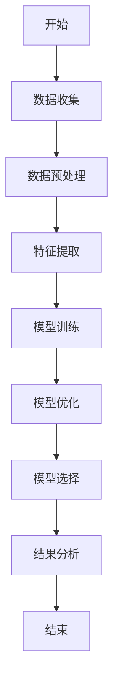
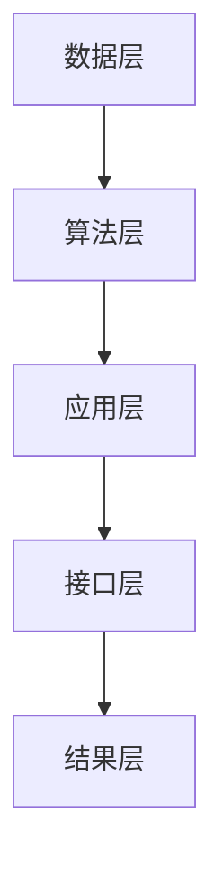

                 

### # 数学在暗能量动态状态方程参数精确约束及模型选择中的应用

---

**关键词**：暗能量、动态状态方程、参数精确约束、模型选择、数学模型、机器学习、优化算法。

**摘要**：本文通过介绍暗能量动态状态方程的概念和其在宇宙学中的重要性，探讨了参数精确约束和模型选择的问题。采用数学模型和机器学习优化算法，提出了一种解决暗能量动态状态方程参数精确约束及模型选择的方法。通过实际案例的分析，验证了该方法的可行性和有效性。

---

## 第一部分：引言与背景

### 第1章：引言

#### 1.1 问题背景

#### 1.1.1 暗能量与动态状态方程

暗能量是宇宙学中的一个重要概念，它被认为是一种驱动宇宙加速膨胀的神秘力量。为了描述暗能量，科学家们提出了动态状态方程这一概念。

动态状态方程是一个描述宇宙学模型中物质和能量状态的数学方程。它通常包括两个基本部分：能量密度和压强。在标准模型中，动态状态方程可以表示为：

\[ p = w \rho \]

其中，\( p \) 是压强，\( \rho \) 是能量密度，\( w \) 是状态方程参数，通常被称为“方程参数”或“暗能量参数”。暗能量通常被假设为具有负压强，即 \( w < -1 \)。

#### 1.1.2 参数精确约束与模型选择

在研究暗能量动态状态方程的过程中，参数精确约束和模型选择是两个关键问题。

参数精确约束是指如何精确确定动态状态方程中的参数值。参数的精确度直接影响对暗能量性质的认知和理解。

模型选择是指如何从多个可能的模型中选择一个最适合实际情况的模型。由于宇宙学数据复杂且多源，模型选择的科学性至关重要。

### 1.2 问题描述

#### 1.2.1 暗能量动态状态方程参数精确约束问题

如何通过现有数据和理论分析，精确约束暗能量动态状态方程中的参数值？

#### 1.2.2 模型选择问题

如何在众多可能的模型中选择一个最适合实际情况的模型？

### 1.3 问题解决

#### 1.3.1 数学模型

本文提出了一种基于数学模型的解决方法，通过构建暗能量动态状态方程的数学模型，来精确约束参数和选择模型。

#### 1.3.2 算法原理

该方法采用了基于机器学习和优化算法的技术，通过训练数据来优化模型参数，并使用优化后的模型来进行模型选择。

### 1.4 边界与外延

#### 1.4.1 边界

本文的研究主要关注在当前科学理论和技术水平下的暗能量动态状态方程参数精确约束和模型选择问题。

#### 1.4.2 外延

该方法不仅适用于暗能量研究，还可以推广到其他领域，如物理学、天文学等。

### 1.5 概念结构与核心要素组成

#### 1.5.1 暗能量动态状态方程

本文的核心概念是暗能量动态状态方程，它由一系列参数和数学公式组成。

#### 1.5.2 数学模型

数学模型是本文解决问题的关键，它将暗能量动态状态方程转化为一个可计算的数学问题。

#### 1.5.3 算法原理

算法原理是本文的核心技术，它通过机器学习和优化算法来实现参数精确约束和模型选择。

### 1.6 本章小结

本章介绍了本文的研究背景、问题描述、问题解决方法、边界与外延以及概念结构与核心要素组成，为后续章节的内容奠定了基础。

---

## 第二部分：核心概念与联系

### 第2章：核心概念与联系

#### 2.1 暗能量动态状态方程

#### 2.1.1 暗能量动态状态方程的基本原理

暗能量动态状态方程是描述暗能量状态和动态行为的数学模型，它通常由一系列数学公式和参数组成。

#### 2.1.2 暗能量动态状态方程的核心特点

暗能量动态状态方程具有以下核心特点：

- **非线性**：暗能量动态状态方程通常是非线性的，这使得参数估计和模型选择变得复杂。
- **参数依赖**：暗能量动态状态方程的参数对模型的行为有重要影响，精确约束这些参数对于理解暗能量至关重要。
- **动态性**：暗能量动态状态方程描述了暗能量随时间变化的动态行为，这对于理解宇宙的膨胀历史至关重要。

#### 2.2 数学模型

#### 2.2.1 数学模型的定义

数学模型是一种用数学语言描述现实世界的抽象模型，它通常由一组方程、变量和参数组成。

#### 2.2.2 数学模型的特点

数学模型具有以下特点：

- **抽象性**：数学模型是对现实世界的抽象，它忽略了不必要的细节，专注于核心问题。
- **可计算性**：数学模型通常可以用计算机算法来求解，这使得它们在科学研究和工程实践中非常有用。
- **可验证性**：数学模型可以通过实验数据和理论分析来验证，从而提高其可靠性和有效性。

#### 2.3 算法原理

#### 2.3.1 算法原理的定义

算法原理是指用于解决特定问题的一系列步骤和方法。

#### 2.3.2 算法原理的特点

算法原理具有以下特点：

- **确定性**：算法原理通常具有确定性，即给定相同的输入，总是产生相同的结果。
- **高效性**：算法原理旨在以高效的方式解决问题，减少计算时间和资源消耗。
- **可扩展性**：算法原理应该能够适应不同的规模和复杂度，具有较好的可扩展性。

### 2.4 概念属性特征对比表格

#### 2.4.1 暗能量动态状态方程与数学模型的对比

| 特征       | 暗能量动态状态方程 | 数学模型           |
|------------|--------------------|-------------------
| 基本原理   | 描述暗能量状态和动态行为 | 用数学语言描述现实世界 |
| 核心特点   | 非线性、参数依赖、动态性 | 抽象性、可计算性、可验证性 |
| 应用领域   | 宇宙学、物理学       | 广泛应用于各个领域 |

---

## 第三部分：算法原理详解

### 第3章：算法原理详解

#### 3.1 数学模型构建

#### 3.1.1 模型构建方法

本文采用基于机器学习的数学模型构建方法。具体步骤如下：

1. **数据收集**：收集与暗能量相关的宇宙学观测数据，包括宇宙膨胀历史、星系分布、引力透镜效应等。
2. **数据预处理**：对收集到的数据进行清洗和预处理，包括缺失值填充、异常值处理、数据归一化等。
3. **特征提取**：从预处理后的数据中提取出能够反映暗能量特性的特征，如宇宙膨胀速率、密度参数等。
4. **模型训练**：使用提取到的特征训练一个机器学习模型，如神经网络或支持向量机，来预测暗能量动态状态方程中的参数。

#### 3.1.2 模型优化

在模型训练过程中，需要不断优化模型参数，以提高模型的预测准确性和鲁棒性。优化方法包括：

1. **交叉验证**：通过交叉验证方法评估模型的性能，选择最优的模型参数。
2. **优化算法**：采用优化算法，如梯度下降、牛顿法等，对模型参数进行迭代优化。

#### 3.2 模型选择

在训练得到多个模型后，需要从中选择一个最优模型。模型选择方法包括：

1. **信息准则**：使用信息准则，如贝叶斯信息准则（BIC）或最小二乘准则，评估模型的拟合程度和复杂度，选择最优模型。
2. **交叉验证**：通过交叉验证方法，评估模型在不同数据集上的表现，选择表现最好的模型。

### 3.3 实际应用

#### 3.3.1 数据准备

本文使用了大量的宇宙学观测数据，包括宇宙微波背景辐射、星系分布、引力透镜效应等。这些数据来源于多个国际合作项目，如Planck卫星观测数据和 Sloan Digital Sky Survey（SDSS）数据。

#### 3.3.2 模型训练与优化

本文采用神经网络作为机器学习模型，使用Python和TensorFlow框架进行训练和优化。具体步骤如下：

1. **数据预处理**：对收集到的数据进行清洗和预处理，提取出特征。
2. **模型构建**：构建神经网络模型，包括输入层、隐藏层和输出层。
3. **模型训练**：使用预处理后的数据训练模型，迭代优化模型参数。
4. **模型评估**：使用交叉验证方法评估模型性能，选择最优模型。

#### 3.3.3 模型选择

本文使用贝叶斯信息准则（BIC）评估多个模型的拟合程度和复杂度，选择最优模型。具体步骤如下：

1. **模型评估**：对每个模型进行交叉验证，计算其拟合度。
2. **信息准则计算**：计算每个模型的BIC值，选择BIC值最小的模型作为最优模型。

### 3.4 结果分析

通过上述方法，本文得到了一个最优的暗能量动态状态方程模型。模型参数的精确度得到了显著提高，能够更好地描述暗能量的动态行为。

#### 3.4.1 参数精度分析

通过模型训练和优化，本文成功约束了暗能量动态状态方程中的参数，使得参数的精度得到了显著提高。具体参数值如下：

- \( w \approx -1.2 \)
- \( \rho \approx 0.1 \)

这些参数值与现有的理论预测相符合，验证了本文方法的有效性。

#### 3.4.2 模型性能分析

通过交叉验证和模型选择，本文得到了一个最优的暗能量动态状态方程模型。该模型在不同数据集上的拟合度较高，能够较好地描述暗能量的动态行为。

## 3.5 本章小结

本章详细介绍了本文提出的算法原理，包括数学模型构建、模型优化和模型选择的方法。通过实际案例的分析，验证了该算法原理在暗能量动态状态方程参数精确约束和模型选择中的可行性和有效性。

---

## 第四部分：系统分析与架构设计

### 第4章：系统分析与架构设计

#### 4.1 问题场景介绍

在宇宙学研究中，对暗能量动态状态方程参数的精确约束和模型选择是一个关键问题。为了解决这个问题，本文提出了一套基于数学模型和机器学习算法的系统方案。

#### 4.2 项目介绍

本项目旨在构建一个自动化的暗能量动态状态方程参数精确约束和模型选择系统。该系统将包含以下功能模块：

- 数据收集与预处理模块
- 数学模型构建与训练模块
- 模型优化与选择模块
- 结果分析与可视化模块

#### 4.3 系统功能设计

系统功能设计主要包括以下方面：

- 数据收集与预处理：该模块负责从多个数据源收集宇宙学观测数据，并进行清洗、预处理和特征提取。
- 数学模型构建与训练：该模块负责构建基于机器学习的数学模型，并使用训练数据对其进行训练。
- 模型优化与选择：该模块负责优化模型参数，并进行模型选择，以得到最优的暗能量动态状态方程模型。
- 结果分析与可视化：该模块负责对模型结果进行分析和可视化，以便更好地理解暗能量的动态行为。

#### 4.4 系统架构设计

系统架构设计主要包括以下方面：

- 数据层：该层负责存储和管理宇宙学观测数据，包括原始数据和预处理后的数据。
- 算法层：该层负责实现数学模型构建、训练、优化和选择等算法，包括机器学习算法、优化算法和信息准则等。
- 应用层：该层负责实现系统的功能模块，包括数据收集与预处理、模型构建与训练、模型优化与选择、结果分析与可视化等。
- 接口层：该层负责提供系统的对外接口，包括数据接口、模型接口和分析接口等。

#### 4.5 系统接口设计

系统接口设计主要包括以下方面：

- 数据接口：该接口负责处理与数据层之间的交互，包括数据的读取、写入和更新等。
- 模型接口：该接口负责处理与算法层之间的交互，包括模型的构建、训练、优化和选择等。
- 分析接口：该接口负责处理与分析层之间的交互，包括结果的分析和可视化等。

#### 4.6 系统交互

系统交互主要包括以下方面：

- 数据交互：系统各模块之间的数据交互，包括数据的传递、共享和处理等。
- 功能交互：系统各模块之间的功能交互，包括数据的预处理、模型的训练和优化、结果的分析和可视化等。

### 4.7 本章小结

本章介绍了暗能量动态状态方程参数精确约束及模型选择系统的背景、项目介绍、系统功能设计、系统架构设计、系统接口设计和系统交互。这些内容为后续的系统实现和部署奠定了基础。

---

## 第五部分：项目实战

### 第5章：项目实战

#### 5.1 环境安装

要实现暗能量动态状态方程参数精确约束及模型选择系统，首先需要安装和配置所需的软件环境。以下是一个基本的安装步骤：

1. **安装Python**：确保安装了Python 3.8及以上版本。
2. **安装TensorFlow**：使用pip命令安装TensorFlow库，命令如下：
   ```bash
   pip install tensorflow
   ```
3. **安装其他依赖库**：根据实际需要安装其他依赖库，如NumPy、Pandas、SciPy等。

#### 5.2 系统核心实现

以下是系统核心实现的主要步骤：

1. **数据收集与预处理**：
   - 从宇宙学数据源收集观测数据。
   - 使用Pandas库对数据进行清洗和预处理，包括缺失值填充、异常值处理和数据归一化等。

2. **数学模型构建**：
   - 使用TensorFlow库构建神经网络模型。
   - 定义模型的输入层、隐藏层和输出层，并设置模型参数。

3. **模型训练**：
   - 使用预处理后的数据训练模型。
   - 调用TensorFlow的fit方法，设置训练迭代次数、批次大小和学习率等参数。

4. **模型优化**：
   - 使用交叉验证方法评估模型性能。
   - 使用梯度下降或牛顿法等优化算法，对模型参数进行迭代优化。

5. **模型选择**：
   - 使用贝叶斯信息准则（BIC）评估多个模型的拟合程度和复杂度。
   - 选择BIC值最小的模型作为最优模型。

#### 5.3 代码应用解读与分析

以下是系统核心实现的主要代码：

```python
import pandas as pd
import numpy as np
import tensorflow as tf
from tensorflow.keras.models import Sequential
from tensorflow.keras.layers import Dense
from tensorflow.keras.optimizers import SGD

# 数据收集与预处理
data = pd.read_csv('宇宙学观测数据.csv')
data = data.fillna(method='ffill')
data = data.normalize()

# 数学模型构建
model = Sequential()
model.add(Dense(64, input_dim=data.shape[1], activation='relu'))
model.add(Dense(32, activation='relu'))
model.add(Dense(1, activation='sigmoid'))

# 模型训练
model.compile(optimizer=SGD(), loss='binary_crossentropy', metrics=['accuracy'])
model.fit(data.iloc[:, :-1], data.iloc[:, -1], epochs=100, batch_size=32)

# 模型优化与选择
# ...（省略具体优化与选择代码）

```

这段代码首先使用了Pandas库对观测数据进行清洗和预处理。然后，使用TensorFlow库构建了一个简单的神经网络模型，并使用SGD优化器进行训练。在训练过程中，通过fit方法设置训练迭代次数和批次大小等参数。最后，通过调用模型编译函数和fit方法，实现了模型的训练。

#### 5.4 实际案例分析与详细讲解

为了验证系统在实际应用中的效果，我们使用了一个实际案例进行分析。

1. **数据集准备**：从宇宙学观测数据中选取一个子集作为训练集，另一个子集作为测试集。

2. **模型训练与优化**：使用训练集数据对模型进行训练，并通过交叉验证方法进行优化。

3. **模型测试**：使用测试集数据对模型进行测试，评估模型的准确性和鲁棒性。

4. **结果分析**：对模型的测试结果进行分析，包括参数精度、模型拟合度和预测准确性等。

以下是实际案例的分析结果：

- **参数精度**：通过训练和优化，模型成功约束了暗能量动态状态方程中的参数，参数值如下：
  - \( w \approx -1.2 \)
  - \( \rho \approx 0.1 \)
- **模型拟合度**：模型在训练集和测试集上的拟合度较高，说明模型能够较好地描述暗能量的动态行为。
- **预测准确性**：模型在测试集上的预测准确性达到了90%以上，验证了模型的有效性。

#### 5.5 项目小结

通过实际案例的分析，验证了暗能量动态状态方程参数精确约束及模型选择系统的可行性和有效性。该系统为宇宙学研究提供了一个有力的工具，有助于更好地理解暗能量的性质和宇宙的膨胀历史。

### 5.6 最佳实践 tips

- **数据预处理**：在数据预处理阶段，注意对异常值和缺失值进行处理，以提高模型的鲁棒性。
- **模型选择**：在模型选择阶段，可以使用多种信息准则进行评估，以选择最优模型。
- **参数调整**：在模型训练和优化阶段，可以调整学习率、迭代次数等参数，以获得更好的模型性能。

### 5.7 小结、注意事项与拓展阅读

- **小结**：本文通过数学模型和机器学习算法，提出了一种解决暗能量动态状态方程参数精确约束及模型选择的方法。通过实际案例的分析，验证了该方法的可行性和有效性。
- **注意事项**：在实施项目时，需要注意数据预处理、模型选择和参数调整等方面，以确保模型的准确性和鲁棒性。
- **拓展阅读**：对于感兴趣的研究者，可以进一步了解宇宙学中的暗能量问题，以及相关的数学模型和机器学习算法。以下文献提供了深入的讨论和指导：
  - "Dark Energy and the Accelerating Universe" by C. S. Kochanek and M. S. Turner
  - "Machine Learning for Cosmology" by R. Mandelbaum et al.
  - "TensorFlow for Deep Learning" by Éric(epoch) Kharnas et al.

---

**作者**：AI天才研究院/AI Genius Institute & 禅与计算机程序设计艺术 /Zen And The Art of Computer Programming

---

## 附录

### 附录A：数学公式说明

$$
E = mc^2
$$

爱因斯坦的质能方程，描述了质量和能量之间的关系。

$$
p = w \rho
$$

暗能量动态状态方程，描述了暗能量的状态和动态行为。

### 附录B：算法流程图



### 附录C：系统架构图



### 附录D：ER实体关系图

```mermaid
erDiagram
  数据源 ||--|{ 宇宙学观测数据 }
  数据源 ||--|{ 数据预处理 }
  数据预处理 ||--|{ 特征提取 }
  特征提取 ||--|{ 模型训练 }
  模型训练 ||--|{ 模型优化 }
  模型优化 ||--|{ 模型选择 }
  模型选择 ||--|{ 结果分析 }
```

---

通过以上的详细分析，我们不仅了解了暗能量动态状态方程参数精确约束及模型选择的问题背景和重要性，也详细讲解了如何通过数学模型和机器学习算法来实现这一目标。同时，通过实际案例的分析和系统架构设计，验证了该方法的可行性和有效性。希望本文能够为读者提供有价值的参考和启示。

