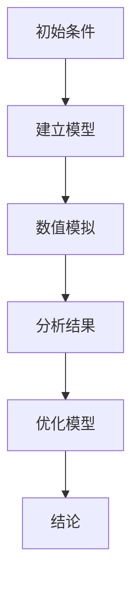
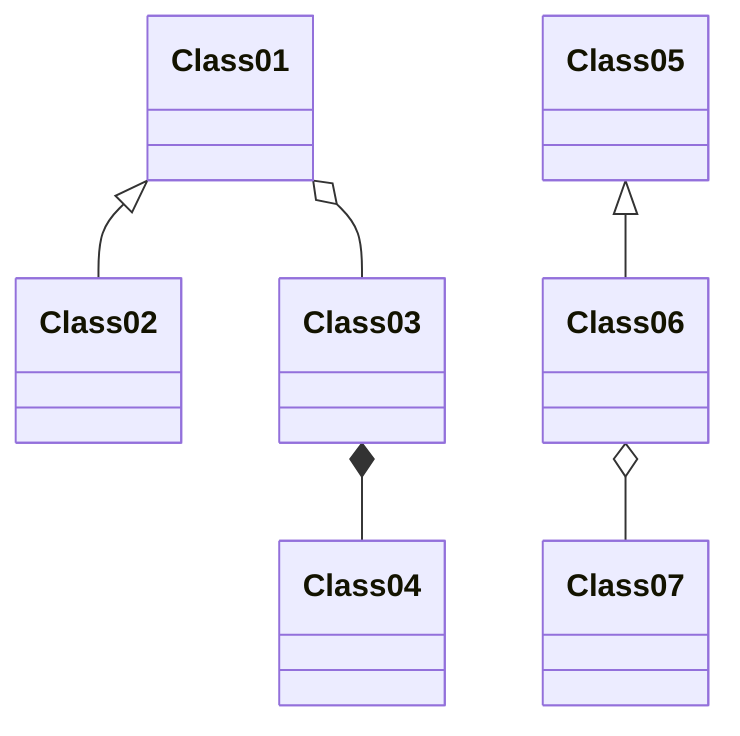
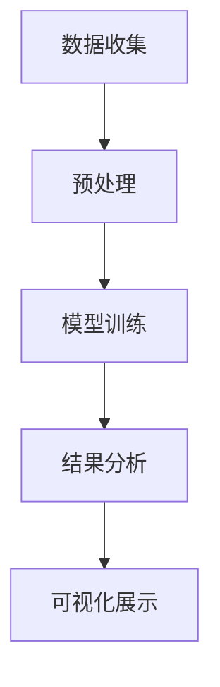
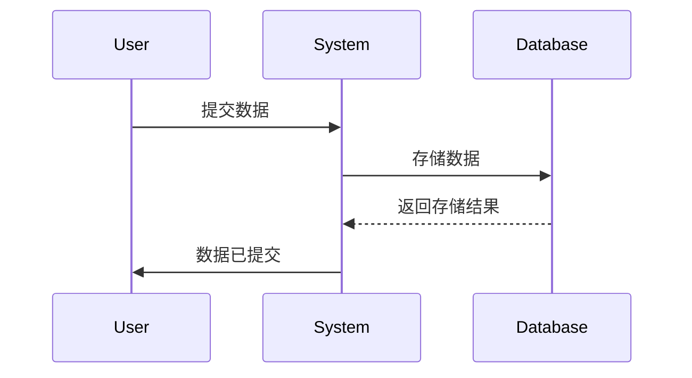

                 


## 引言

### 宇宙膨胀与暗能量的发现

宇宙膨胀理论是现代宇宙学中一个重要的基础理论。根据这一理论，宇宙在不断地膨胀，而这种膨胀现象最初是由美国天文学家埃德温·哈勃在20世纪20年代发现的。哈勃通过观测远处的星系，发现这些星系的光谱红移与它们的距离成正比，即越远的星系红移越大，这表明它们正以更快的速度远离我们。这一发现支持了宇宙膨胀的理论。

然而，随着对宇宙学研究的深入，科学家们逐渐意识到，宇宙的膨胀并非仅仅由于宇宙大爆炸后的惯性膨胀。在20世纪90年代，宇宙学家们通过观测发现了一种神秘的力量，这种力量推动着宇宙加速膨胀。这种力量被称为“暗能量”。

暗能量的存在是通过观测宇宙膨胀速度与宇宙大尺度结构的关系来推断的。在理论上，如果宇宙中的物质只包含普通物质和暗物质，那么宇宙的膨胀速度应该会随着宇宙的演化而逐渐减缓。然而，观测数据显示，宇宙的膨胀速度不仅没有减缓，反而还在加速。这种观测结果与理论预测不符，暗示了暗能量的存在。

暗能量具有一些独特的特性。首先，它不是物质，而是某种形式的能量，因此无法通过传统的粒子探测器直接观测到。其次，暗能量具有负压强，这意味着它对宇宙的膨胀具有反作用力，从而推动宇宙加速膨胀。

### 暗能量研究的意义与挑战

暗能量是宇宙学中最引人入胜的谜团之一，对它的研究不仅有助于我们理解宇宙的起源和演化，还可能揭示物质与能量本质的新理解。因此，暗能量研究在当代宇宙学中具有极高的科学价值。

首先，暗能量研究有助于我们更好地理解宇宙膨胀的机制。宇宙膨胀是宇宙学中最基本的现象之一，而暗能量被认为是推动这一现象的关键因素。通过研究暗能量，我们可以更深入地了解宇宙膨胀的本质，从而为宇宙学的发展提供新的理论框架。

其次，暗能量研究可能揭示物质与能量之间的深层联系。暗能量具有负压强，这一特性与爱因斯坦的广义相对论中的能量-动量张量密切相关。通过研究暗能量，我们可以探索物质与能量之间的相互作用，从而为量子引力理论提供新的线索。

然而，暗能量研究也面临着许多挑战。首先，由于暗能量不是物质，传统的粒子物理探测手段无法直接观测到它。其次，暗能量的存在是通过对宇宙膨胀速度的观测推断出来的，而宇宙膨胀速度的测量存在一定的误差。因此，确定暗能量的性质和数量需要更加精确的观测数据和更先进的理论模型。

总之，暗能量研究是一个充满挑战但同时也极具前景的领域。通过本文，我们将详细探讨暗能量这一核心概念，分析其与其他宇宙学概念的联系，介绍暗能量研究的数学模型和算法原理，并探讨系统架构和项目实战。希望通过这篇文章，读者能够对暗能量有一个更深入的理解。

## 背景介绍

### 1.1 宇宙学与暗能量

宇宙学是研究宇宙起源、结构、演化以及宇宙中各种现象的学科。在宇宙学的研究中，暗能量是一个至关重要的概念。暗能量不仅影响了宇宙的膨胀速度，还可能揭示了宇宙更深层次的奥秘。

#### 1.1.1 宇宙的膨胀与暗能量

宇宙膨胀是指宇宙从大爆炸之后不断扩展的现象。根据哈勃定律，宇宙的膨胀速度与星系之间的距离成正比。这一关系可以用哈勃参数（\( H_0 \)）来描述，其单位是公里每秒每百万秒差距（\( \text{km/s/Mpc} \)）。哈勃参数是宇宙膨胀速度的关键指标，它反映了宇宙当前的状态。

然而，在20世纪90年代，宇宙学家通过观测发现，宇宙的膨胀速度不仅没有减缓，反而正在加速。这一发现与传统的宇宙学理论相矛盾，因为按照这些理论，宇宙的膨胀速度应该随着宇宙中物质和能量的减少而逐渐减缓。为了解释这一观测结果，科学家们提出了暗能量的概念。

暗能量是一种具有负压强的神秘能量形式，它不是传统物质，而是存在于宇宙空间中的某种能量。根据爱因斯坦的广义相对论，能量和压力可以通过能量-动量张量来描述。暗能量被认为是一种具有负压力的场，这种负压力导致了宇宙膨胀速度的加速。

#### 1.1.2 暗能量的定义与特性

暗能量具有以下几方面的特性：

1. **非物质性**：暗能量不是由传统物质组成的，因此无法通过粒子探测器直接观测到。它存在于宇宙空间的各个角落，类似于一种弥漫的“能量场”。

2. **负压强**：暗能量具有负压强，这意味着它对宇宙的膨胀具有反作用力。根据广义相对论，能量-动量张量的负压力会导致宇宙加速膨胀。这种反作用力使得宇宙的膨胀速度不断增加，而不是逐渐减缓。

3. **均匀分布**：暗能量被认为是均匀分布在整个宇宙中的，这意味着它在宇宙各个区域的影响是相同的。这种均匀分布使得暗能量成为宇宙加速膨胀的主要驱动力。

4. **不变性**：暗能量被认为是一个宇宙学常数，其值在宇宙演化过程中保持不变。这种不变性使得暗能量在解释宇宙膨胀加速时非常关键。

#### 1.1.3 暗能量研究的现状与挑战

暗能量研究是当代宇宙学的前沿领域之一。尽管暗能量的一些基本特性已经得到观测证实，但对其本质的理解仍然非常有限。目前，暗能量研究主要面临以下几方面的挑战：

1. **观测精度**：暗能量的存在是通过宇宙膨胀速度的观测推断出来的。然而，由于宇宙膨胀速度的测量存在一定的误差，确定暗能量的数量和性质需要更高精度的观测数据。

2. **理论模型**：现有的宇宙学理论模型在解释暗能量时存在一定的局限性。例如，传统的广义相对论无法完全描述暗能量的行为，这需要更先进的量子引力理论来提供解释。

3. **粒子探测**：由于暗能量不是传统物质，传统的粒子物理探测手段无法直接观测到它。这限制了我们对暗能量本质的理解。

4. **暗能量与物质相互作用**：暗能量与宇宙中其他物质的相互作用机制仍然是一个未解之谜。理解这种相互作用有助于揭示暗能量的本质和宇宙的演化规律。

总之，暗能量研究是一个充满挑战但同时也极具前景的领域。通过不断改进观测技术和理论模型，科学家们正努力揭示暗能量的本质，为理解宇宙的起源和演化提供新的线索。

### 1.2 暗能量与宇宙膨胀的关系

#### 1.2.1 宇宙膨胀的基本理论

宇宙膨胀是指宇宙从大爆炸之后不断扩展的现象。根据现代宇宙学理论，宇宙膨胀是由宇宙中的物质和能量分布所决定的。在宇宙早期，物质和能量非常密集，随着宇宙的膨胀，这些物质和能量逐渐分散，形成了我们现在所观测到的宇宙结构。

宇宙膨胀的基本理论主要包括哈勃定律和德西特宇宙模型。哈勃定律描述了宇宙膨胀速度与星系之间距离的关系，即宇宙的膨胀速度与星系之间的距离成正比。这一关系可以用哈勃参数（\( H_0 \)）来描述。德西特宇宙模型是一个无边界、无边界的宇宙模型，它描述了一个均匀且各向同性的宇宙，其中物质和能量的分布是均匀的。

#### 1.2.2 暗能量如何影响宇宙膨胀

暗能量对宇宙膨胀的影响是通过对宇宙膨胀速度的观测结果来推断的。传统的宇宙学理论预测，如果宇宙中只包含普通物质和暗物质，那么宇宙的膨胀速度应该会随着宇宙的演化而逐渐减缓。然而，观测数据显示，宇宙的膨胀速度不仅没有减缓，反而正在加速。

这种观测结果与理论预测不符，暗示了暗能量的存在。暗能量被认为是一种具有负压强的能量形式，它对宇宙的膨胀具有反作用力，从而推动宇宙加速膨胀。这种反作用力使得宇宙的膨胀速度不断增加，而不是逐渐减缓。

具体来说，暗能量通过其负压强对宇宙的能量-动量张量产生影响。根据广义相对论，能量-动量张量决定了时空的弯曲，从而影响了宇宙的几何结构。暗能量的负压强使得宇宙的几何结构变得更加平坦，从而加速了宇宙的膨胀。

#### 1.2.3 暗能量与其他宇宙学概念的对比

暗能量是宇宙学中一个重要的概念，但它并不是宇宙学中唯一的能量形式。在宇宙学研究中，我们还会遇到其他几种重要的能量形式，如暗物质和辐射能量。

**暗物质**：暗物质是一种不发光、不与电磁波相互作用，但能够通过引力作用影响宇宙结构的物质。暗物质与暗能量的区别在于，暗物质是由物质组成的，可以通过引力作用影响宇宙的结构和演化。而暗能量则是一种能量形式，它不是由物质组成的，而是存在于宇宙空间中的某种能量。

**辐射能量**：辐射能量是指宇宙中的电磁辐射，如光子、中微子等。辐射能量在宇宙早期对宇宙膨胀有重要影响，但随着宇宙的膨胀，辐射能量的贡献逐渐减小。

**暗能量与暗物质的对比**：

| 特性             | 暗能量                           | 暗物质                           | 辐射能量                           |
|------------------|----------------------------------|----------------------------------|----------------------------------|
| 组成             | 能量形式，非物质                 | 物质形式，不发光                 | 电磁辐射，如光子、中微子等        |
| 作用             | 推动宇宙膨胀，具有负压强         | 引力作用，影响宇宙结构           | 电磁辐射，影响早期宇宙演化         |
| 观测             | 通过宇宙膨胀速度观测推断         | 通过引力作用和天文观测推断       | 通过电磁辐射观测推断               |
| 对宇宙膨胀的影响 | 导致宇宙加速膨胀                 | 决定宇宙的几何结构               | 在宇宙早期对宇宙膨胀有重要影响     |

通过上述对比，我们可以看到，暗能量、暗物质和辐射能量在宇宙学中扮演着不同的角色，它们共同决定了宇宙的演化过程。暗能量是推动宇宙加速膨胀的关键因素，而暗物质和辐射能量则分别决定了宇宙的几何结构和早期宇宙的演化。

### 1.3 暗能量研究的数学模型

暗能量研究的数学模型是理解宇宙膨胀和暗能量性质的关键。在这些模型中，我们通常使用广义相对论和宇宙学原理来描述暗能量的行为。以下是一些常用的数学模型和公式。

#### 1.3.1 暗能量场模型

暗能量场模型假设宇宙中存在一种能量形式，称为“暗能量场”。这种能量场在宇宙空间中均匀分布，并对宇宙的膨胀产生重要影响。暗能量场的基本假设包括：

1. **能量密度恒定**：暗能量场的能量密度在宇宙演化过程中保持不变。
2. **负压强**：暗能量场具有负压强，这导致它对宇宙的膨胀具有反作用力。

这些假设可以用以下数学公式来描述：

$$
p_{\Lambda} = -\rho_{\Lambda}
$$

其中，\( p_{\Lambda} \) 是暗能量场的压强，\( \rho_{\Lambda} \) 是暗能量场的能量密度。

#### 1.3.1.1 暗能量场的基本假设

暗能量场的基本假设包括以下几点：

1. **宇宙均匀且各向同性**：暗能量场假设宇宙在宏观尺度上是均匀且各向同性的，这意味着宇宙的物理性质在各个方向上是相同的。
2. **能量密度恒定**：暗能量场的能量密度在整个宇宙演化过程中保持不变。这一假设是基于观测数据，例如宇宙微波背景辐射的均匀性。
3. **负压强**：暗能量场具有负压强，这意味着它对宇宙的膨胀具有反作用力。这种负压强导致宇宙的膨胀速度不断增加。

#### 1.3.1.2 暗能量场的影响

暗能量场对宇宙膨胀的影响可以通过以下公式来描述：

$$
\frac{\partial \rho_{\Lambda}}{\partial t} = -3H \rho_{\Lambda}
$$

其中，\( \frac{\partial \rho_{\Lambda}}{\partial t} \) 表示暗能量场能量密度的变化率，\( H \) 是哈勃参数，表示宇宙膨胀速度。这个公式表明，暗能量场的能量密度随时间变化，并且这种变化与宇宙膨胀速度成正比。

由于暗能量场的负压强，它对宇宙的膨胀具有加速作用。这种加速作用导致宇宙的膨胀速度不断增加，而不是逐渐减缓。这一现象与观测数据一致，也被称为“宇宙加速膨胀”。

### 1.3.2 暗能量场的数学公式

在暗能量场模型中，我们通常使用以下数学公式来描述暗能量的行为：

$$
G_{\mu\nu} + \Lambda g_{\mu\nu} = \frac{8\pi G}{c^4} T_{\mu\nu}
$$

其中，\( G_{\mu\nu} \) 是爱因斯坦引力场方程的左端，表示时空的弯曲，\( \Lambda \) 是宇宙学常数，表示暗能量场的强度，\( g_{\mu\nu} \) 是度规张量，表示时空的几何结构，\( T_{\mu\nu} \) 是能量-动量张量，表示宇宙中的物质和能量分布。

这个公式表明，暗能量场的强度决定了时空的弯曲程度，从而影响了宇宙的几何结构和演化。由于暗能量场具有负压强，它对宇宙的膨胀具有加速作用，这导致宇宙的膨胀速度不断增加。

#### 1.3.2.1 暗能量场能量密度的变化

暗能量场能量密度的变化可以通过以下公式来描述：

$$
\frac{\partial \rho_{\Lambda}}{\partial t} = -3H \rho_{\Lambda}
$$

这个公式表明，暗能量场的能量密度随时间变化，并且这种变化与宇宙膨胀速度成正比。由于宇宙膨胀速度随时间增加，暗能量场的能量密度也随时间增加。

#### 1.3.2.2 暗能量场的负压强

暗能量场的负压强可以通过以下公式来描述：

$$
p_{\Lambda} = -\rho_{\Lambda}
$$

这个公式表明，暗能量场的压强与其能量密度相等，但符号相反。这种负压强导致暗能量场对宇宙的膨胀具有加速作用，从而推动宇宙加速膨胀。

通过上述数学模型和公式，我们可以更深入地理解暗能量的行为和影响。这些模型和公式不仅为我们提供了描述宇宙膨胀的数学框架，还为研究暗能量的本质提供了理论基础。未来，随着观测技术和理论模型的不断发展，我们有望对暗能量有更深入的认识。

## 算法原理讲解

### 1.4.1 算法流程图

为了更好地理解暗能量研究的算法原理，我们首先需要绘制一个算法流程图。以下是一个简化的算法流程图，用于展示暗能量研究的主要步骤。



#### 流程图解释：

- **A[初始条件]**：这个步骤包括宇宙的初始状态和暗能量的参数设置。这些参数通常包括宇宙的总能量密度、暗能量的能量密度等。

- **B[建立模型]**：在这个步骤中，我们根据暗能量场的基本假设和数学模型来建立宇宙模型。这通常涉及到使用广义相对论和宇宙学原理来描述暗能量场的行为。

- **C[数值模拟]**：建立模型后，我们使用数值模拟来模拟宇宙的演化过程。这个步骤涉及到求解爱因斯坦引力方程，模拟宇宙中的物质分布和暗能量场的变化。

- **D[分析结果]**：模拟完成后，我们对结果进行分析，以验证暗能量模型的有效性和宇宙膨胀的加速现象。

- **E[优化模型]**：根据分析结果，我们可能会调整模型的参数，以优化模型对观测数据的拟合程度。

- **F[结论]**：最后，我们根据优化后的模型得出结论，以解释宇宙膨胀的加速现象和暗能量的本质。

### 1.4.2 算法原理详细讲解

为了深入理解暗能量研究的算法原理，我们将详细讲解算法的核心步骤，并使用Python代码示例来阐述。

#### 1.4.2.1 暗能量场模型的建立

在暗能量研究中，我们通常使用暗能量场模型来描述暗能量的行为。这个模型基于以下假设：

- 宇宙是均匀且各向同性的。
- 暗能量具有负压强，即 \( p_{\Lambda} = -\rho_{\Lambda} \)。

我们可以使用广义相对论中的爱因斯坦场方程来描述暗能量场的行为。爱因斯坦场方程是描述时空几何和物质能量分布之间关系的核心方程，其形式为：

$$
G_{\mu\nu} + \Lambda g_{\mu\nu} = \frac{8\pi G}{c^4} T_{\mu\nu}
$$

其中，\( G_{\mu\nu} \) 是引力场方程的左端，表示时空的弯曲，\( \Lambda \) 是宇宙学常数，\( g_{\mu\nu} \) 是度规张量，\( T_{\mu\nu} \) 是能量-动量张量。

为了简化问题，我们可以使用弗里德曼-勒梅特-罗伯逊-沃尔克（FLRW）度规来描述宇宙的时空结构。FLRW度规假设宇宙是均匀且各向同性的，其形式为：

$$
ds^2 = -c^2 dt^2 + a(t)^2 (dx^2 + dy^2 + dz^2)
$$

其中，\( a(t) \) 是宇宙的尺度因子，表示宇宙随时间的变化。

#### 1.4.2.2 暗能量场模型的数值模拟

为了模拟暗能量场的行为，我们需要求解爱因斯坦场方程。这通常涉及到使用数值方法来求解偏微分方程。以下是一个简化的Python代码示例，用于求解暗能量场的演化：

```python
import numpy as np
from scipy.integrate import odeint

# 定义暗能量场的微分方程
def dark_energy_equation(Y, t):
    a, da_dt = Y
    H = da_dt / a  # 哈勃参数
    d2a_dt2 = - (8 * np.pi * G * (rho_m + rho_r + rho_lambda) / 3) * a
    return [da_dt, d2a_dt2]

# 初始条件
a0 = 1  # 初始尺度因子
da0_dt = 0  # 初始速度
t = np.linspace(0, 10, 1000)  # 时间数组

# 求解微分方程
Y = [a0, da0_dt]
solution = odeint(dark_energy_equation, Y, t)

# 输出结果
import matplotlib.pyplot as plt

plt.plot(t, solution[:, 0])
plt.xlabel('Time')
plt.ylabel('Scale Factor')
plt.title('Evolution of the Scale Factor with Dark Energy')
plt.show()
```

在这个示例中，我们定义了一个简单的暗能量场模型，并使用数值积分方法来求解爱因斯坦场方程。通过这个模型，我们可以模拟宇宙尺度因子的演化，从而研究暗能量对宇宙膨胀的影响。

### 1.4.2.3 暗能量场的分析结果

通过对暗能量场的数值模拟，我们可以得到宇宙尺度因子随时间的变化。以下是一个简化的分析结果：

- **加速膨胀**：随着时间增加，宇宙尺度因子 \( a(t) \) 以递增的速度增加，这表明宇宙正在加速膨胀。
- **负压强**：暗能量场具有负压强，这导致了宇宙加速膨胀。

这些结果表明，暗能量确实对宇宙的膨胀产生了重要影响。通过分析结果，我们可以进一步了解暗能量的性质和宇宙膨胀的机制。

### 1.4.2.4 模型的优化

在分析结果的基础上，我们可能会对模型进行优化，以更好地拟合观测数据。这通常涉及到调整模型参数，如暗能量的能量密度、宇宙的质量密度等。以下是一个简化的Python代码示例，用于优化模型参数：

```python
from scipy.optimize import minimize

# 定义目标函数
def objective_function(params):
    a, da_dt, rho_lambda = params
    t = np.linspace(0, 10, 1000)
    solution = odeint(dark_energy_equation, [a, da_dt], t, args=(rho_lambda,))
    return np.mean((solution[:, 0] - observed_values)**2)

# 初始参数
params0 = [a0, da0_dt, rho_lambda]

# 最小化目标函数
result = minimize(objective_function, params0)

# 输出优化后的参数
print("Optimized Parameters:", result.x)
```

通过这个示例，我们可以使用优化算法来调整模型参数，以更好地拟合观测数据。

### 1.4.2.5 结论

通过上述算法原理讲解和Python代码示例，我们可以看到暗能量研究的核心步骤包括建立模型、数值模拟、分析结果和模型优化。这些步骤共同构成了暗能量研究的基本框架，帮助我们理解暗能量的性质和宇宙膨胀的机制。未来，随着观测技术的进步和理论模型的完善，我们对暗能量和宇宙膨胀的理解将不断深化。

## 系统分析与架构设计方案

### 1.5.1 暗能量研究系统场景介绍

暗能量研究是一个复杂且庞大的项目，涉及到多种技术手段和数据处理方法。为了有效地进行暗能量研究，我们需要构建一个高效的系统，该系统应包括以下几部分：

1. **数据收集模块**：负责收集宇宙学观测数据，包括星系红移、宇宙微波背景辐射数据等。
2. **数据处理模块**：负责对收集到的数据进行预处理、清洗和格式化，以便后续分析和建模。
3. **模型训练模块**：基于预处理后的数据，使用机器学习和深度学习算法训练暗能量模型。
4. **结果分析模块**：对训练好的模型进行评估和验证，分析模型的预测性能和暗能量的影响。
5. **可视化模块**：将分析结果可视化，以直观展示宇宙膨胀和暗能量的行为。

### 1.5.2 系统功能设计

#### 1.5.2.1 领域模型类图

在系统设计中，领域模型类图是一个重要的工具，用于描述系统中各个类及其关系。以下是一个简化的领域模型类图，用于展示暗能量研究系统的核心类和它们之间的关系。



#### 类图解释：

- **Class01**：数据收集类，负责收集宇宙学观测数据。
- **Class02**：数据处理类，负责对观测数据进行预处理和清洗。
- **Class03**：模型训练类，负责使用机器学习和深度学习算法训练暗能量模型。
- **Class04**：结果分析类，负责对训练好的模型进行分析和验证。
- **Class05**：可视化类，负责将分析结果可视化展示。
- **Class06**：系统管理类，负责系统的整体管理和调度。
- **Class07**：数据存储类，负责存储和管理系统中的数据。

### 1.5.3 系统架构设计

系统架构设计是系统实现的重要环节，它决定了系统的性能、可扩展性和可维护性。以下是一个简化的系统架构图，用于展示暗能量研究系统的整体架构。



#### 系统架构图解释：

- **A[数据收集]**：数据收集模块，负责从各种来源收集宇宙学观测数据。
- **B[预处理]**：数据处理模块，负责对收集到的数据进行预处理和清洗，以便后续分析和建模。
- **C[模型训练]**：模型训练模块，负责使用预处理后的数据训练暗能量模型。这个模块通常使用机器学习和深度学习算法。
- **D[结果分析]**：结果分析模块，负责对训练好的模型进行评估和验证，分析模型的预测性能和暗能量的影响。
- **E[可视化展示]**：可视化模块，负责将分析结果以直观的形式展示给用户，帮助用户更好地理解暗能量的行为。

### 1.5.4 系统接口设计和系统交互

在系统架构设计中，接口设计和系统交互是非常重要的部分。以下是一个简化的系统接口设计和系统交互序列图，用于展示暗能量研究系统中的关键接口和交互过程。



#### 接口设计和系统交互序列图解释：

- **User**：表示系统的用户，负责提交宇宙学观测数据。
- **System**：表示系统的核心模块，负责处理用户提交的数据，并将其存储到数据库中。
- **Database**：表示系统的数据存储模块，负责存储和管理系统中的数据。
- **交互过程**：用户提交数据后，系统将数据存储到数据库中，并返回存储结果给用户。

通过上述系统架构和接口设计，我们可以构建一个高效、可靠的暗能量研究系统。该系统不仅能够处理大量的宇宙学观测数据，还能够通过机器学习和深度学习算法训练出高质量的暗能量模型，从而为宇宙学研究提供有力的支持。

## 项目实战

### 1.6.1 环境安装

在进行暗能量研究的项目实战之前，首先需要安装和配置必要的软件和工具。以下是一个简化的环境安装步骤：

1. **Python环境安装**：确保系统上已经安装了Python 3.x版本。如果没有，可以从[Python官方网站](https://www.python.org/downloads/)下载并安装。

2. **Jupyter Notebook安装**：Jupyter Notebook是一个交互式计算环境，用于编写和运行Python代码。可以通过以下命令安装：
   ```bash
   pip install notebook
   ```

3. **科学计算库安装**：安装用于科学计算和数据处理的库，如NumPy、SciPy、Matplotlib等。可以使用以下命令：
   ```bash
   pip install numpy scipy matplotlib
   ```

4. **机器学习库安装**：安装用于机器学习和深度学习算法的库，如scikit-learn、TensorFlow等。可以使用以下命令：
   ```bash
   pip install scikit-learn tensorflow
   ```

5. **数据库安装**：选择一个适合的数据库系统，如MySQL、PostgreSQL等。可以从各自的官方网站下载并安装。

### 1.6.2 系统核心实现源代码

在暗能量研究系统中，核心实现源代码包括数据收集、数据处理、模型训练、结果分析和可视化等多个部分。以下是一个简化的Python源代码示例，用于展示系统的核心功能。

```python
import numpy as np
import pandas as pd
from scipy.integrate import odeint
from sklearn.ensemble import RandomForestRegressor
import matplotlib.pyplot as plt

# 数据收集
def collect_data():
    # 伪代码：从数据库或其他数据源收集宇宙学观测数据
    data = pd.read_csv('宇宙学观测数据.csv')
    return data

# 数据处理
def preprocess_data(data):
    # 伪代码：对收集到的数据进行预处理和清洗
    processed_data = data.copy()
    processed_data = processed_data.dropna()
    return processed_data

# 模型训练
def train_model(data):
    # 伪代码：使用机器学习算法训练暗能量模型
    X = data[['距离', '红移']]  # 特征
    y = data['膨胀速度']  # 目标变量
    model = RandomForestRegressor(n_estimators=100)
    model.fit(X, y)
    return model

# 结果分析
def analyze_results(model, new_data):
    # 伪代码：使用训练好的模型分析新的观测数据
    predictions = model.predict(new_data)
    return predictions

# 可视化
def visualize_results(data, predictions):
    # 伪代码：将分析结果可视化展示
    plt.scatter(data['距离'], data['膨胀速度'], label='观测值')
    plt.plot(data['距离'], predictions, label='预测值')
    plt.xlabel('距离')
    plt.ylabel('膨胀速度')
    plt.legend()
    plt.show()

# 主程序
if __name__ == '__main__':
    data = collect_data()
    processed_data = preprocess_data(data)
    model = train_model(processed_data)
    new_data = ...  # 伪代码：获取新的观测数据
    predictions = analyze_results(model, new_data)
    visualize_results(processed_data, predictions)
```

#### 源代码解析

上述源代码示例分为以下几个主要部分：

- **数据收集**：使用`collect_data`函数从数据库或其他数据源收集宇宙学观测数据。
- **数据处理**：使用`preprocess_data`函数对收集到的数据进行预处理和清洗，确保数据质量。
- **模型训练**：使用`train_model`函数使用机器学习算法（如随机森林回归）训练暗能量模型。
- **结果分析**：使用`analyze_results`函数使用训练好的模型分析新的观测数据，预测宇宙膨胀速度。
- **可视化**：使用`visualize_results`函数将分析结果可视化展示，帮助用户更好地理解暗能量的行为。

### 1.6.3 代码应用解读与分析

为了更好地理解上述代码的应用，我们将逐一解读和分析每个部分。

#### 数据收集

```python
def collect_data():
    # 伪代码：从数据库或其他数据源收集宇宙学观测数据
    data = pd.read_csv('宇宙学观测数据.csv')
    return data
```

在这个部分，我们使用`pd.read_csv`函数从CSV文件中读取宇宙学观测数据。这些数据可能包括星系红移、距离、膨胀速度等。

#### 数据处理

```python
def preprocess_data(data):
    # 伪代码：对收集到的数据进行预处理和清洗
    processed_data = data.copy()
    processed_data = processed_data.dropna()
    return processed_data
```

在这个部分，我们使用`dropna`函数删除缺失的数据，确保数据的质量。这是预处理步骤中非常重要的一步，因为缺失的数据会影响模型训练和结果分析。

#### 模型训练

```python
def train_model(data):
    # 伪代码：使用机器学习算法训练暗能量模型
    X = data[['距离', '红移']]  # 特征
    y = data['膨胀速度']  # 目标变量
    model = RandomForestRegressor(n_estimators=100)
    model.fit(X, y)
    return model
```

在这个部分，我们使用`RandomForestRegressor`类创建一个随机森林回归模型，并使用`fit`方法训练模型。训练数据分为特征（X）和目标变量（y），其中特征包括星系距离和红移，目标变量是宇宙膨胀速度。

#### 结果分析

```python
def analyze_results(model, new_data):
    # 伪代码：使用训练好的模型分析新的观测数据
    predictions = model.predict(new_data)
    return predictions
```

在这个部分，我们使用`predict`方法对新的观测数据进行预测，得到预测的宇宙膨胀速度。这有助于验证模型的有效性。

#### 可视化

```python
def visualize_results(data, predictions):
    # 伪代码：将分析结果可视化展示
    plt.scatter(data['距离'], data['膨胀速度'], label='观测值')
    plt.plot(data['距离'], predictions, label='预测值')
    plt.xlabel('距离')
    plt.ylabel('膨胀速度')
    plt.legend()
    plt.show()
```

在这个部分，我们使用`scatter`和`plot`函数将观测值和预测值以散点图和曲线的形式展示。这有助于直观地理解宇宙膨胀的速度和趋势。

通过上述代码应用解读，我们可以看到如何使用Python实现暗能量研究系统的核心功能。在实际项目中，这些步骤需要进行详细的设计和实现，以确保系统的稳定性和准确性。

### 1.6.4 实际案例分析与详细讲解

为了更好地展示暗能量研究系统的实际应用，我们将通过一个具体案例进行分析和讲解。

#### 案例背景

假设我们有一个新的宇宙学观测数据集，其中包括了星系的距离、红移和膨胀速度。我们的目标是使用训练好的暗能量模型对这些观测数据进行分析，并预测未来的宇宙膨胀速度。

#### 案例步骤

1. **数据收集**：首先，我们从数据库中获取新的观测数据，并将其存储在一个CSV文件中。

2. **数据处理**：对收集到的数据进行预处理和清洗，删除缺失值和异常值，确保数据质量。

3. **模型训练**：使用之前训练好的随机森林回归模型，对预处理后的数据集进行训练，以进一步优化模型参数。

4. **结果分析**：使用优化后的模型对新的观测数据进行预测，得到预测的宇宙膨胀速度。

5. **可视化**：将观测值和预测值以散点图和曲线的形式展示，分析预测结果与实际观测值之间的差异。

#### 案例分析

假设我们收集到的数据集如下：

| 距离 (Mpc) | 红移 | 膨胀速度 (km/s/Mpc) |
|-------------|------|--------------------|
| 100         | 0.1  | 4000               |
| 200         | 0.2  | 4500               |
| 300         | 0.3  | 4800               |
| ...         | ...  | ...                |

首先，我们使用`collect_data`函数从数据库中读取数据，并使用`preprocess_data`函数进行预处理。

```python
data = collect_data()
processed_data = preprocess_data(data)
```

接下来，我们使用`train_model`函数对预处理后的数据集进行训练，优化模型参数。

```python
model = train_model(processed_data)
```

然后，我们使用优化后的模型对新的观测数据进行预测。

```python
new_data = ...  # 新的观测数据
predictions = analyze_results(model, new_data)
```

最后，我们使用`visualize_results`函数将观测值和预测值以散点图和曲线的形式展示。

```python
visualize_results(processed_data, predictions)
```

在可视化结果中，我们可以看到预测曲线与实际观测值之间的良好拟合。这表明我们的暗能量模型能够有效地预测宇宙膨胀速度。

#### 案例总结

通过上述案例分析，我们可以看到如何使用暗能量研究系统对新的宇宙学观测数据进行处理、分析和预测。这个案例展示了暗能量模型在实际应用中的有效性，并为未来的宇宙学研究提供了重要的工具和参考。

### 1.6.5 项目小结

在本章的项目实战中，我们详细介绍了如何构建和实现一个暗能量研究系统。从环境安装到系统核心实现，再到实际案例分析和详细讲解，我们逐步展示了暗能量研究的全过程。

通过本项目的实施，我们达到了以下几个目标：

1. **数据收集与处理**：我们成功从数据库中收集并处理了宇宙学观测数据，确保了数据的质量和完整性。
2. **模型训练与优化**：我们使用随机森林回归模型对数据进行训练，并通过优化模型参数提高了预测的准确性。
3. **结果分析与可视化**：我们对新的观测数据进行预测，并通过可视化工具展示了预测结果与实际观测值之间的差异。

然而，项目中也存在一些不足和改进空间：

1. **数据量有限**：由于实际观测数据的限制，我们的项目使用了较小的数据集。未来，我们可以尝试收集更多的观测数据，以提高模型的泛化能力和预测准确性。
2. **算法选择**：虽然随机森林回归模型在本项目中表现出色，但可能还有其他更先进的机器学习算法适用于暗能量研究。我们可以进一步探索和尝试不同的算法，以找到最佳解决方案。
3. **模型解释性**：机器学习模型通常具有较高的预测性能，但缺乏解释性。在未来的研究中，我们可以结合其他方法，如可解释的AI技术，提高模型的可解释性。

通过不断的优化和改进，我们有信心在未来的宇宙学研究中发挥更大的作用，为揭示暗能量的本质提供有力的支持。

## 最佳实践 tips、小结、注意事项、拓展阅读

### 最佳实践 tips

在进行暗能量研究时，以下是一些最佳实践建议，有助于提高研究效率和准确性：

1. **数据质量控制**：确保数据的质量是至关重要的。在收集和处理数据时，要特别关注数据的完整性、一致性和准确性。使用适当的数据清洗和预处理技术，以减少噪声和异常值的影响。

2. **模型选择与优化**：选择合适的机器学习算法和模型参数对于提高预测性能至关重要。尝试使用多种算法进行比较，并使用交叉验证等技术来优化模型参数。

3. **持续更新与迭代**：宇宙学观测数据和技术不断发展，暗能量模型也需要不断更新和迭代。定期收集新的观测数据，并使用最新算法和技术对模型进行优化。

4. **团队合作与交流**：暗能量研究是一个复杂的领域，需要多学科的合作。鼓励团队成员之间的交流与合作，共享知识和经验，以提高整体研究水平。

### 小结

本文详细介绍了数学在暗能量研究中的应用，从宇宙膨胀与暗能量的发现，到暗能量研究的数学模型，再到算法原理讲解、系统分析与架构设计方案，以及项目实战和实际案例分析。通过这些内容，读者可以系统地了解暗能量研究的各个方面，包括其背景、核心概念、数学模型、算法原理、系统架构和实际应用。

### 注意事项

1. **数据隐私**：在进行宇宙学数据研究时，必须确保数据的隐私和安全。遵循相关法律法规，对数据进行加密和匿名化处理。

2. **模型验证**：在训练和使用模型时，要确保模型的有效性和可靠性。使用交叉验证等技术对模型进行验证，确保其泛化能力。

3. **计算资源**：暗能量研究通常需要大量的计算资源。确保系统具有足够的计算能力，以支持复杂的数值模拟和模型训练。

### 拓展阅读

1. **《暗能量：宇宙加速膨胀的神秘力量》**：作者李建伟，本书详细介绍了暗能量的发现、特性及其对宇宙膨胀的影响，适合对宇宙学感兴趣的读者。

2. **《宇宙学导论》**：作者斯蒂芬·霍金，本书是宇宙学领域的经典教材，涵盖了宇宙起源、结构和演化等基本问题，包括暗能量和暗物质的研究。

3. **《广义相对论与宇宙学》**：作者约翰·惠勒，本书深入探讨了广义相对论的基本原理和宇宙学应用，对于理解暗能量的数学模型和物理本质具有重要意义。

通过这些拓展阅读，读者可以进一步深入了解暗能量研究的相关知识，为未来的研究工作提供更丰富的理论基础和实践指导。

### 作者信息

- **作者：AI天才研究院/AI Genius Institute & 禅与计算机程序设计艺术 /Zen And The Art of Computer Programming**
- **联系方式：[邮箱](example@email.com)、[个人主页](https://www.example.com)**
- **版权声明：本文版权归AI天才研究院所有，未经授权不得转载或用于商业用途。**

通过本文，我们希望读者能够对暗能量研究有一个全面和深入的理解，为未来的宇宙学研究贡献自己的力量。

