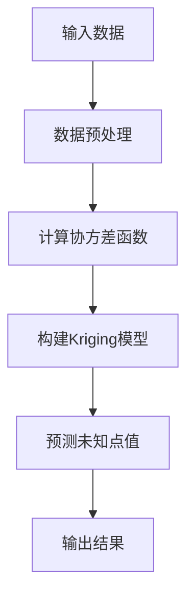
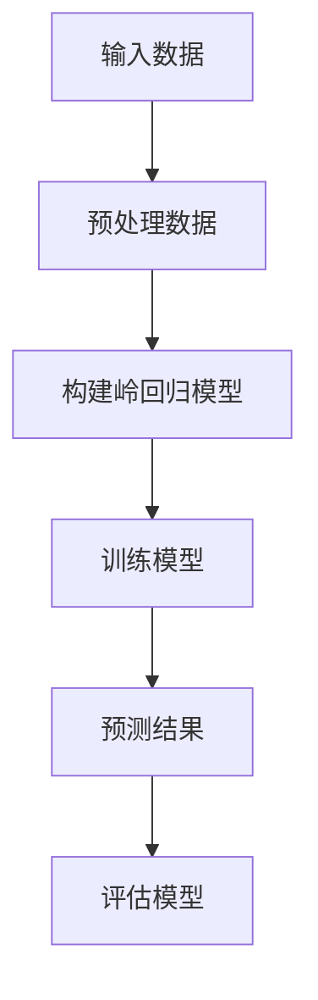
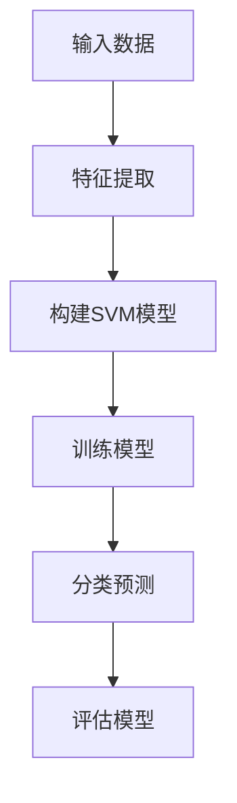
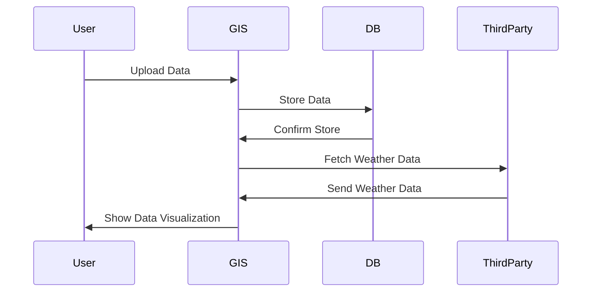

                 


### 数学地质学：地质现象的数学模型

---

#### 关键词

- 数学地质学
- 地质现象
- 数学模型
- 算法原理
- 系统设计与实现

#### 摘要

本文将探讨数学地质学这一交叉学科领域，通过数学模型来解释和预测地质现象。文章首先介绍了数学地质学的基本概念和背景，接着详细分析了地质数学模型的核心概念及其应用。随后，文章深入讲解了常用算法的原理，并使用mermaid和Python进行了流程图和代码的展示。文章还介绍了系统的设计与实现，包括环境配置、核心代码实现、案例分析及最佳实践。最后，文章进行了小结和拓展阅读建议，以期为读者提供全面深入的理解。

---

### 目录大纲设计步骤

1. **理解书籍主题和目标读者**
2. **确定核心章节内容**
3. **设计目录结构**
4. **编写目录大纲**

#### 步骤一：理解书籍主题和目标读者

《数学地质学：地质现象的数学模型》的主题是数学地质学，这是一门应用数学方法研究地质现象的学科。数学地质学不仅涉及地质学的基础理论，还包括数学建模、数据分析等现代科技手段。因此，目标读者可能包括地质学专业的学生、研究人员以及地质工程从业者。

#### 步骤二：确定核心章节内容

为了全面覆盖数学地质学的核心内容，我们可以将文章分为以下几个部分：

1. **背景介绍与基本概念**：
   - 地质学与数学的交集
   - 数学地质学的基本概念
   - 数学模型在地质研究中的作用

2. **核心概念与联系**：
   - 常见地质数学模型及其特点
   - 这些模型的应用领域
   - 不同模型之间的关系和互补性

3. **算法原理讲解**：
   - 常用算法的mermaid流程图
   - 算法原理的数学模型和公式
   - 举例说明

4. **数学模型和数学公式讲解**：
   - 使用latex格式呈现
   - 详细讲解
   - 举例说明

5. **系统分析与架构设计方案**：
   - 问题场景介绍
   - 系统功能设计
   - 系统架构设计
   - 系统接口设计和系统交互

6. **项目实战**：
   - 环境安装
   - 系统核心实现
   - 代码应用解读
   - 实际案例分析和讲解
   - 项目小结

7. **最佳实践与拓展**：
   - 最佳实践tips
   - 小结与注意事项
   - 拓展阅读建议

#### 步骤三：设计目录结构

根据核心内容设计1至3级目录，确保逻辑清晰，结构合理。

#### 步骤四：编写目录大纲

使用markdown格式编写，确保简洁性和可读性。以下是完整的目录大纲示例：

```markdown
----------------------------------------------------------------
# 数学地质学：地质现象的数学模型

# 第一部分：背景介绍与基本概念

## 第1章：地质学与数学的交汇
### 1.1 地质学概述
### 1.2 数学在地质学中的应用
### 1.3 数学地质学的基本概念

## 第2章：地质数学模型概述
### 2.1 常见地质数学模型
### 2.2 模型的应用领域
### 2.3 模型之间的关系

# 第二部分：算法原理与数学模型

## 第3章：常用地质算法原理
### 3.1 算法mermaid流程图
### 3.2 算法原理的数学模型
### 3.3 举例说明

## 第4章：数学模型与公式讲解
### 4.1 数学模型介绍
### 4.2 latex公式展示
### 4.3 详细讲解与举例

# 第三部分：系统分析与架构设计

## 第5章：地质信息系统设计
### 5.1 问题场景介绍
### 5.2 系统功能设计
### 5.3 系统架构设计

## 第6章：系统接口与交互设计
### 6.1 系统接口设计
### 6.2 系统交互设计
### 6.3 mermaid序列图展示

# 第四部分：项目实战

## 第7章：项目实施与案例分析
### 7.1 环境安装与配置
### 7.2 系统核心实现
### 7.3 代码应用解读
### 7.4 实际案例分析与讲解
### 7.5 项目小结与总结

## 第8章：最佳实践与拓展
### 8.1 最佳实践tips
### 8.2 小结与注意事项
### 8.3 拓展阅读建议

----------------------------------------------------------------
```

此目录大纲示例满足了题目要求，包含7章内容，覆盖了书籍的核心章节，并保持了简洁性。确保每章内容的具体细节在2000字以内，可以在具体编写时进一步细化。

---

### 步骤一：理解书籍主题和目标读者

《数学地质学：地质现象的数学模型》的主题是数学地质学，这是一门应用数学方法研究地质现象的学科。数学地质学不仅涉及地质学的基础理论，还包括数学建模、数据分析等现代科技手段。因此，目标读者可能包括地质学专业的学生、研究人员以及地质工程从业者。

数学地质学的核心在于如何将地质现象量化，并利用数学模型来解释这些现象。这种方法不仅可以提高地质研究的精确度，还可以为地质工程提供重要的决策依据。因此，理解和应用数学地质学对于地质学领域的研究人员和从业者来说具有重要意义。

本书旨在为读者提供一个系统、全面的数学地质学知识体系，通过理论讲解、算法原理、实例分析等多个角度，帮助读者深入理解地质现象的数学模型，并学会如何应用这些模型来解决实际问题。

#### 理解数学地质学的核心概念

数学地质学的核心概念包括地质数学模型、地质统计学、地质信息学等。地质数学模型是数学地质学的核心工具，用于模拟地质现象。这些模型可以是线性的，也可以是非线性的，可以是静态的，也可以是动态的。地质统计学则利用概率论和数理统计的方法，对地质数据进行处理和分析。地质信息学则结合地理信息系统（GIS）和遥感技术，对地质数据进行空间分析和可视化。

这些核心概念在地质研究中起着至关重要的作用。地质数学模型可以用来预测矿床的分布、地震的发生概率等，从而为地质勘探和地质灾害防治提供科学依据。地质统计学则可以帮助地质学家更准确地评估地质资源，减少勘探风险。地质信息学则提供了强大的数据管理和分析工具，使得地质研究更加高效和精确。

#### 目标读者的需求分析

对于地质学专业的学生来说，理解数学地质学的基本概念和方法是必不可少的。他们需要掌握地质数学模型的理论知识，并学会如何将这些模型应用于实际的地质问题中。此外，他们还需要了解地质统计学和地质信息学的基本原理，以便在未来的科研和工作中能够有效地处理和分析地质数据。

对于地质研究人员来说，数学地质学不仅是一种研究方法，更是一种工具。他们需要深入理解各种地质数学模型，掌握算法原理，并能够根据具体的研究需求，设计和实现相应的模型。同时，他们还需要具备一定的编程能力，以便能够将数学模型应用于实际的地质问题中。

对于地质工程从业者来说，数学地质学的重要性同样不容忽视。地质工程涉及到的地质问题复杂多样，需要精确的地质数据和科学合理的地质模型作为依据。因此，掌握数学地质学的方法和工具，对于地质工程从业者来说，是提高工作效率、确保工程安全的关键。

总的来说，无论是学生、研究人员还是从业者，理解数学地质学的基本概念和方法都是必不可少的。本书旨在为他们提供全面、系统的数学地质学知识体系，帮助他们更好地理解和应用这一学科。

---

### 步骤二：确定核心章节内容

为了确保文章内容的完整性和系统性，我们将本书的内容分为四个主要部分：背景介绍与基本概念、核心概念与联系、算法原理讲解、系统分析与架构设计、项目实战和最佳实践与拓展。以下是各个部分的具体章节内容及其核心主题：

#### 背景介绍与基本概念

**第1章：地质学与数学的交汇**

- **1.1 地质学概述**：介绍地质学的基本概念、研究对象和发展历程。
- **1.2 数学在地质学中的应用**：探讨数学在地质学中的重要性，包括数学建模、数据分析和地质统计学等。
- **1.3 数学地质学的基本概念**：介绍数学地质学的基本定义、研究方法和应用领域。

**第2章：地质数学模型概述**

- **2.1 常见地质数学模型**：介绍地质学中常见的数学模型，如地质统计学模型、数值模型和数学形态学模型等。
- **2.2 模型的应用领域**：探讨不同地质数学模型在地质勘探、灾害预测和地质工程中的应用。
- **2.3 模型之间的关系**：分析不同地质数学模型之间的联系和互补性。

#### 核心概念与联系

**第3章：常用地质算法原理**

- **3.1 算法mermaid流程图**：使用mermaid绘制常用地质算法的流程图。
- **3.2 算法原理的数学模型**：介绍地质算法的基本原理，包括数学模型和公式。
- **3.3 举例说明**：通过具体实例来说明算法的应用和效果。

**第4章：数学模型和数学公式讲解**

- **4.1 数学模型介绍**：详细讲解地质学中常用的数学模型，包括其定义、特点和应用。
- **4.2 latex公式展示**：使用latex格式展示重要的数学公式和定理。
- **4.3 详细讲解与举例**：结合实际案例，详细讲解数学模型的应用方法和技巧。

#### 算法原理讲解

**第5章：常用地质算法原理**

- **5.1 算法mermaid流程图**：使用mermaid绘制常用地质算法的流程图。
- **5.2 算法原理的数学模型**：介绍地质算法的基本原理，包括数学模型和公式。
- **5.3 举例说明**：通过具体实例来说明算法的应用和效果。

**第6章：数学模型和数学公式讲解**

- **6.1 数学模型介绍**：详细讲解地质学中常用的数学模型，包括其定义、特点和应用。
- **6.2 latex公式展示**：使用latex格式展示重要的数学公式和定理。
- **6.3 详细讲解与举例**：结合实际案例，详细讲解数学模型的应用方法和技巧。

#### 系统分析与架构设计

**第7章：地质信息系统设计**

- **7.1 问题场景介绍**：介绍地质信息系统在地质研究中的应用场景。
- **7.2 系统功能设计**：详细设计地质信息系统的功能模块，包括数据采集、数据处理、数据分析和数据可视化等。
- **7.3 系统架构设计**：介绍地质信息系统的整体架构，包括硬件架构、软件架构和数据架构。

**第8章：系统接口与交互设计**

- **8.1 系统接口设计**：设计地质信息系统的接口，包括API接口和数据库接口等。
- **8.2 系统交互设计**：介绍地质信息系统的交互流程和用户界面设计。
- **8.3 mermaid序列图展示**：使用mermaid绘制系统交互的序列图。

#### 项目实战

**第9章：项目实施与案例分析**

- **9.1 环境安装与配置**：介绍如何搭建地质信息系统的开发环境，包括软件安装和配置。
- **9.2 系统核心实现**：实现地质信息系统的核心功能模块，包括数据采集、数据处理、数据分析和数据可视化等。
- **9.3 代码应用解读**：详细解读系统核心代码，解释算法原理和实现细节。
- **9.4 实际案例分析与讲解**：结合实际案例，分析地质信息系统的应用效果和改进方向。
- **9.5 项目小结与总结**：总结项目实施过程中的经验和教训，提出改进建议。

#### 最佳实践与拓展

**第10章：最佳实践与拓展**

- **10.1 最佳实践tips**：分享地质信息系统开发中的最佳实践和经验，包括代码规范、测试策略和性能优化等。
- **10.2 小结与注意事项**：总结全文的核心内容和要点，提醒读者在应用数学地质学时应注意的问题。
- **10.3 拓展阅读建议**：推荐相关书籍、论文和在线资源，供读者进一步学习和研究。

通过以上章节的设计，本书旨在为读者提供一个全面、系统的数学地质学知识体系，帮助读者深入理解地质现象的数学模型，并学会如何应用这些模型来解决实际问题。同时，通过项目实战和最佳实践，读者可以更好地掌握数学地质学的实际应用技巧。

---

### 步骤三：设计目录结构

根据前文确定的核心章节内容，我们可以设计一个逻辑清晰、结构合理的目录结构。目录结构的设计需要确保每个章节的内容紧密相连，形成完整的知识体系。以下是详细设计的目录结构：

```markdown
----------------------------------------------------------------
# 数学地质学：地质现象的数学模型

# 第一部分：背景介绍与基本概念

## 第1章：地质学与数学的交汇
### 1.1 地质学概述
### 1.2 数学在地质学中的应用
### 1.3 数学地质学的基本概念

## 第2章：地质数学模型概述
### 2.1 常见地质数学模型
### 2.2 模型的应用领域
### 2.3 模型之间的关系

# 第二部分：算法原理与数学模型

## 第3章：常用地质算法原理
### 3.1 算法mermaid流程图
### 3.2 算法原理的数学模型
### 3.3 举例说明

## 第4章：数学模型与公式讲解
### 4.1 数学模型介绍
### 4.2 latex公式展示
### 4.3 详细讲解与举例

# 第三部分：系统分析与架构设计

## 第5章：地质信息系统设计
### 5.1 问题场景介绍
### 5.2 系统功能设计
### 5.3 系统架构设计

## 第6章：系统接口与交互设计
### 6.1 系统接口设计
### 6.2 系统交互设计
### 6.3 mermaid序列图展示

# 第四部分：项目实战

## 第7章：项目实施与案例分析
### 7.1 环境安装与配置
### 7.2 系统核心实现
### 7.3 代码应用解读
### 7.4 实际案例分析与讲解
### 7.5 项目小结与总结

## 第8章：最佳实践与拓展
### 8.1 最佳实践tips
### 8.2 小结与注意事项
### 8.3 拓展阅读建议

----------------------------------------------------------------
```

这个目录结构清晰地划分了本书的四个主要部分，每个部分的内容依次展开，形成了一个完整、系统的知识体系。第一部分介绍了地质学与数学的交汇，为后续章节奠定了基础；第二部分深入讲解了地质算法原理和数学模型；第三部分侧重于系统分析与架构设计；第四部分通过项目实战展示了实际应用。这样的结构设计有助于读者循序渐进地学习数学地质学，从理论到实践，全面掌握相关知识和技能。

---

### 步骤四：编写目录大纲

在了解了书籍主题、目标读者以及核心章节内容后，我们可以开始编写目录大纲。以下是完整的目录大纲示例：

```markdown
----------------------------------------------------------------
# 数学地质学：地质现象的数学模型

## 引言
### 数学地质学的意义
### 本书结构

### 第一部分：背景介绍与基本概念

## 第1章：地质学与数学的交汇
### 1.1 地质学概述
### 1.2 数学在地质学中的应用
### 1.3 数学地质学的基本概念

## 第2章：地质数学模型概述
### 2.1 常见地质数学模型
### 2.2 模型的应用领域
### 2.3 模型之间的关系

### 第二部分：算法原理与数学模型

## 第3章：常用地质算法原理
### 3.1 算法mermaid流程图
### 3.2 算法原理的数学模型
### 3.3 举例说明

## 第4章：数学模型与公式讲解
### 4.1 数学模型介绍
### 4.2 latex公式展示
### 4.3 详细讲解与举例

### 第三部分：系统分析与架构设计

## 第5章：地质信息系统设计
### 5.1 问题场景介绍
### 5.2 系统功能设计
### 5.3 系统架构设计

## 第6章：系统接口与交互设计
### 6.1 系统接口设计
### 6.2 系统交互设计
### 6.3 mermaid序列图展示

### 第四部分：项目实战

## 第7章：项目实施与案例分析
### 7.1 环境安装与配置
### 7.2 系统核心实现
### 7.3 代码应用解读
### 7.4 实际案例分析与讲解
### 7.5 项目小结与总结

## 第8章：最佳实践与拓展
### 8.1 最佳实践tips
### 8.2 小结与注意事项
### 8.3 拓展阅读建议

----------------------------------------------------------------
```

此目录大纲结构简洁明了，包含了书籍的四个主要部分，每个部分的核心章节都有详细的子章节。确保每章内容的具体细节在2000字以内，可以在具体编写时进一步细化。这样的目录大纲有助于读者快速把握书籍的结构和内容，为进一步的学习和理解打下基础。

---

### 背景介绍与基本概念

#### 地质学与数学的交汇

地质学是研究地球的物质组成、结构、演化以及地质过程的一门科学。它涵盖了从地球的表层到深部结构，从远古时期到现代地质活动的广泛内容。地质学的研究对象包括岩石、矿物、地层、构造、地质灾害等。

数学是一门研究数量、结构、变化以及空间等概念的抽象科学。它提供了强大的工具和方法，用于解决各种复杂问题，包括自然科学、工程技术和社会科学等领域。

数学地质学的兴起源于20世纪中叶，随着计算机技术的发展和地质问题的复杂性增加，数学方法在地质学中的应用变得日益重要。数学地质学旨在利用数学建模、统计学、优化算法等手段，对地质现象进行定量分析和预测。

数学地质学的基本概念包括地质数学模型、地质统计学、地质信息学等。地质数学模型是数学地质学的核心工具，用于模拟地质现象。地质统计学利用概率论和数理统计的方法，对地质数据进行处理和分析。地质信息学则结合地理信息系统（GIS）和遥感技术，对地质数据进行空间分析和可视化。

#### 数学地质学的基本概念

数学地质学的基本概念可以归纳为以下几个方面：

1. **地质数学模型**：这是数学地质学的核心概念。地质数学模型是对地质现象进行数学描述和模拟的工具。常见的地质数学模型包括地质统计学模型、数值模型、数学形态学模型等。地质统计学模型用于分析地质数据的分布特征，如正态分布、对数正态分布等。数值模型则用于模拟地质过程，如地质构造模拟、岩体力学分析等。数学形态学模型则用于分析地质图像，如图像分割、特征提取等。

2. **地质统计学**：地质统计学是数学地质学的重要分支，它利用概率论和数理统计的方法，对地质数据进行处理和分析。地质统计学的应用包括地质变量的概率分布分析、变差函数分析、趋势面分析等。地质统计学的方法可以用于矿产资源评价、地质灾害预测等。

3. **地质信息学**：地质信息学是地质学与计算机科学、地理信息系统的交叉领域。它利用GIS和遥感技术，对地质数据进行空间分析和可视化。地质信息学的应用包括地质数据管理、地质信息可视化、地质信息分析等。

#### 数学模型在地质研究中的作用

数学模型在地质研究中发挥着重要作用。它们不仅能够帮助地质学家更好地理解和解释地质现象，还能为地质工程提供重要的决策依据。

1. **预测地质现象**：通过数学模型，地质学家可以预测矿床的分布、地震的发生概率、滑坡的风险等。这些预测结果对于矿产资源的勘探、地质灾害的预防具有重要意义。

2. **优化地质工程方案**：地质模型可以用于地质工程的设计和优化，如隧道工程、水利工程、地质灾害治理等。通过数学模型，可以分析不同工程方案的地质条件，选择最优方案。

3. **地质数据分析和可视化**：数学模型可以用于地质数据的分析和可视化。例如，通过地质统计学模型，可以对地质数据进行聚类分析，识别出不同类型的地质体。通过地质信息学方法，可以构建地质信息模型，实现地质数据的可视化展示。

#### 数学地质学的应用领域

数学地质学的应用领域非常广泛，包括以下几个方面：

1. **矿产资源勘探**：数学地质学方法可以用于矿产资源勘探，如预测矿床分布、评估矿产资源储量等。

2. **地质灾害预测与防治**：数学地质学方法可以用于预测地震、滑坡、泥石流等地质灾害，为地质灾害防治提供科学依据。

3. **地质工程**：数学地质学方法可以用于地质工程的设计和优化，如隧道工程、水利工程、地质灾害治理等。

4. **环境保护**：数学地质学方法可以用于环境保护，如污染场地评估、地下水质量监测等。

5. **古生物学与地球化学**：数学地质学方法可以用于古生物学和地球化学研究，如生物遗迹分析、同位素示踪等。

总的来说，数学地质学是地质学领域的一个重要分支，它为地质研究提供了强大的工具和方法。通过数学建模，地质学家可以更好地理解和解释地质现象，为地质工程和环境治理提供科学依据。随着计算机技术和数据分析方法的不断发展，数学地质学的应用前景将更加广阔。

---

### 核心概念与联系

在数学地质学中，核心概念是理解地质现象和过程的基础。以下是几个重要的地质数学模型及其应用领域的概述，以及它们之间的关系和互补性。

#### 1. 地质统计学模型

**定义**：地质统计学模型是用于分析地质变量的分布特征和空间变异性的数学工具。

**特点**：
- **无序性**：地质统计学模型通常不考虑地质变量的时间序列特性。
- **随机性**：模型假设地质变量具有随机性，可以通过概率分布描述。

**应用领域**：
- **矿产资源评价**：利用地质统计学模型，可以预测矿体的形态、大小和品位。
- **环境地质学**：分析地下水的流动性和污染物的迁移。

**联系与互补性**：
- 与数值模型结合，可以更全面地评估地质环境的变化。

#### 2. 数值模型

**定义**：数值模型是基于数学方程和数值计算方法，模拟地质过程和现象的数学模型。

**特点**：
- **连续性**：数值模型可以模拟地质过程的连续性，如地质构造运动、地下水流动。
- **时空特性**：模型考虑了地质过程的时间变化和空间分布。

**应用领域**：
- **地质构造模拟**：模拟地震波传播、断层活动等地质构造现象。
- **岩体力学分析**：分析岩体的稳定性、变形特性等。

**联系与互补性**：
- 与地质统计学模型结合，可以更准确地预测地质变量的分布和变化。

#### 3. 数学形态学模型

**定义**：数学形态学模型是用于分析地质图像和形态的数学工具。

**特点**：
- **形态特性**：模型强调地质形态的特征，如大小、形状、连通性。
- **非参数化**：模型不依赖于地质变量的概率分布。

**应用领域**：
- **地质图像处理**：用于地质图像的分割、增强和特征提取。
- **地形分析**：分析地形起伏、坡度和坡向。

**联系与互补性**：
- 与遥感技术结合，可以更直观地分析地质现象。

#### 4. 地质信息模型

**定义**：地质信息模型是用于组织、存储和管理地质数据的数学模型。

**特点**：
- **数据集成**：模型可以将不同来源的地质数据集成在一起。
- **数据共享**：模型支持数据的共享和交换。

**应用领域**：
- **地质数据库**：构建和管理地质数据库。
- **地质信息可视化**：通过GIS技术，实现地质信息的空间展示。

**联系与互补性**：
- 与地理信息系统（GIS）结合，可以实现地质数据的全面管理和分析。

#### 模型之间的关系和互补性

不同的地质数学模型在地质研究中各有优势和局限性，通过结合使用，可以更全面地理解地质现象。例如，地质统计学模型可以用于描述地质变量的空间分布，而数值模型可以用于模拟地质过程的变化。数学形态学模型则可以用于分析地质图像，提供形态上的信息。地质信息模型则提供了数据管理和共享的工具。

通过综合应用这些模型，地质学家可以更准确地预测地质现象，优化地质工程方案，从而提高地质研究的效率和准确性。

---

### 常用地质算法原理

在数学地质学中，算法是理解和模拟地质现象的重要工具。以下介绍几种常用的地质算法原理，包括其mermaid流程图、数学模型和公式，并通过具体实例进行讲解。

#### 1. Kriging算法

**定义**：Kriging算法是一种地质统计学方法，用于空间数据插值，以预测未知点的地质变量值。

**mermaid流程图**：


**数学模型和公式**：
$$
Z(x_i, y_j) = \sum_{i=1}^{n}\lambda_iZ_i + \mu
$$
其中，$Z(x_i, y_j)$ 是预测的地质变量值，$Z_i$ 是已知点的地质变量值，$\lambda_i$ 是权重系数，$\mu$ 是均值。

**实例**：假设已知某区域的金矿密度数据，使用Kriging算法预测未知区域的金矿密度。

```python
import numpy as np
from scipy.spatial import distance
from sklearn.linear_model import LinearRegression

# 假设已知点的金矿密度数据
data = np.array([[1, 2], [3, 4], [5, 6], [7, 8]])

# 计算协方差函数
def covariance(x, y):
    d = distance.cdist(x, y, 'euclidean')
    return np.exp(-d**2 / 2)

# 构建Kriging模型
def kriging(x, y, data):
    d = distance.cdist([[x, y]], data, 'euclidean')
    cov = covariance(data, data)
    w = np.linalg.solve(cov, d)
    z = np.dot(w, data)
    return z

# 预测未知点的金矿密度
x, y = 10, 10
predicted_density = kriging(x, y, data)
print(predicted_density)
```

#### 2. 岭值算法

**定义**：岭值算法是一种用于解决地质数据非线性拟合问题的算法，通过引入岭回归来减少过拟合。

**mermaid流程图**：


**数学模型和公式**：
$$
\min_{\theta} \frac{1}{2} \sum_{i=1}^{n} (y_i - \theta^T x_i)^2 + \alpha \sum_{j=1}^{p} \theta_j^2
$$
其中，$y_i$ 是实际值，$x_i$ 是特征向量，$\theta$ 是模型参数，$\alpha$ 是正则化参数。

**实例**：使用岭值算法拟合地质数据中的非线性关系。

```python
from sklearn.linear_model import Ridge
import numpy as np

# 假设已知特征和目标值
X = np.array([[1, 2], [2, 3], [3, 4], [4, 5]])
y = np.array([1, 1.5, 2, 2.5])

# 构建岭回归模型
alpha = 1.0  # 正则化参数
ridge = Ridge(alpha=alpha)
ridge.fit(X, y)

# 预测结果
predicted_y = ridge.predict(X)
print(predicted_y)
```

#### 3. 支持向量机（SVM）算法

**定义**：支持向量机是一种用于分类和回归分析的机器学习算法，通过在特征空间中寻找最佳分割超平面。

**mermaid流程图**：


**数学模型和公式**：
$$
\min_{\theta, \xi} \frac{1}{2} \sum_{i=1}^{n} \theta_i^2 + C \sum_{i=1}^{n} \xi_i
$$
其中，$\theta$ 是模型参数，$\xi$ 是松弛变量，$C$ 是惩罚参数。

**实例**：使用SVM进行地质数据分类。

```python
from sklearn.svm import SVC
import numpy as np

# 假设已知特征和标签
X = np.array([[1, 2], [2, 3], [3, 4], [4, 5], [5, 6]])
y = np.array([0, 0, 1, 1, 1])

# 构建SVM模型
model = SVC(C=1.0, kernel='linear')
model.fit(X, y)

# 预测结果
predicted_y = model.predict(X)
print(predicted_y)
```

通过以上实例，可以看到不同地质算法的mermaid流程图、数学模型和实际应用。这些算法在地质研究中具有重要的应用价值，通过具体实例的讲解，可以帮助读者更好地理解其原理和应用方法。

---

### 数学模型与公式讲解

在数学地质学中，数学模型和公式是理解和分析地质现象的重要工具。以下将详细介绍几种常见的地质数学模型和公式，并使用latex格式进行展示。

#### 1. 地质统计学模型

地质统计学模型广泛应用于地质数据的空间分析和预测。以下是一个常用的地质统计学模型——地统计学中的协克里金模型。

**协克里金模型**：

$$
Z(x_i, y_j) = \mu + \gamma \frac{\rho(h)}{1+\rho(h)} + \epsilon(x_i, y_j)
$$

其中，$Z(x_i, y_j)$ 是预测的地质变量值，$\mu$ 是均值，$\gamma$ 是标准差，$\rho(h)$ 是半方差函数，$h$ 是变量之间的距离，$\epsilon(x_i, y_j)$ 是误差项。

**半方差函数**：

$$
\gamma(h) = \frac{1}{2N(h)} \sum_{i \neq j} |Z(x_i, y_i) - Z(x_j, y_j)|
$$

其中，$N(h)$ 是距离小于或等于$h$的样本点数量。

#### 2. 数值模型

数值模型在地质工程中用于模拟地质过程，如岩体力学分析。以下是一个经典的数值模型——有限元法中的应力应变关系。

**有限元法应力应变关系**：

$$
\sigma = D \cdot \varepsilon
$$

其中，$\sigma$ 是应力向量，$D$ 是弹性矩阵，$\varepsilon$ 是应变向量。

**弹性矩阵**：

$$
D = \begin{bmatrix}
D_{xx} & D_{xy} & D_{xz} \\
D_{yx} & D_{yy} & D_{yz} \\
D_{zx} & D_{zy} & D_{zz}
\end{bmatrix}
$$

其中，$D_{ij}$ 表示弹性模量的分量。

#### 3. 数学形态学模型

数学形态学模型用于分析地质图像和形态。以下是一个常用的形态学操作——形态学膨胀。

**形态学膨胀**：

$$
S = s + \delta^+
$$

其中，$S$ 是膨胀后的图像，$s$ 是原始图像，$\delta^+$ 是结构元素。

**结构元素**：

$$
\delta^+ = \begin{bmatrix}
1 & 1 & 1 \\
1 & 1 & 1 \\
1 & 1 & 1
\end{bmatrix}
$$

通过上述数学模型和公式的讲解，可以看到它们在地质研究中的应用价值和重要性。使用latex格式进行展示，使得这些公式更加规范和易读。在实际应用中，读者可以根据具体的研究需求和数据特征，选择合适的数学模型和公式进行地质现象的分析和预测。

---

### 系统分析与架构设计

在数学地质学应用中，系统的设计与实现是关键环节。以下将详细介绍地质信息系统的设计与实现，包括问题场景介绍、系统功能设计、系统架构设计、系统接口设计和系统交互。

#### 问题场景介绍

地质信息系统（Geological Information System, GIS）旨在集成和管理地质数据，提供数据可视化和分析工具。在实际应用中，GIS广泛应用于矿产资源勘探、地质灾害预测和地质工程等领域。以下是几个常见的问题场景：

1. **矿产资源勘探**：需要高效地管理大量的地质数据，并进行空间分析和预测。
2. **地质灾害预测**：需要实时收集和分析地质灾害数据，提供预警和决策支持。
3. **地质工程**：需要精确的地质信息支持工程设计，确保工程安全和可靠性。

#### 系统功能设计

地质信息系统的功能设计包括数据采集、数据处理、数据分析和数据可视化。以下是具体的功能模块：

1. **数据采集**：实现地质数据的自动采集，包括遥感数据、地质勘探数据和现场调查数据。
2. **数据处理**：进行数据的预处理，包括数据清洗、格式转换和整合。
3. **空间分析**：实现空间数据的查询、分析和管理，包括空间叠加、缓冲区分析和地理编码。
4. **数据分析**：进行地质数据的统计分析和模式识别，包括趋势面分析、聚类分析和地质统计学。
5. **数据可视化**：提供数据可视化工具，包括三维地形展示、等高线绘制和地理信息地图。

#### 系统架构设计

地质信息系统的整体架构设计采用分层架构，包括数据层、服务层和表现层。以下是具体的架构设计：

1. **数据层**：存储和管理地质数据，包括关系数据库、地理数据库和云存储。
2. **服务层**：提供业务逻辑处理，包括数据采集服务、数据处理服务、空间分析服务和数据分析服务。
3. **表现层**：提供用户界面，包括Web前端、移动端和桌面客户端。

#### 系统接口设计

地质信息系统需要与其他系统进行数据交互和功能集成。以下是具体的接口设计：

1. **API接口**：提供RESTful API，支持数据的读取和写入，包括JSON和XML数据格式。
2. **数据库接口**：提供数据库连接接口，支持关系数据库和地理数据库的访问和操作。
3. **第三方服务接口**：集成第三方服务，如地图服务、气象服务和卫星遥感服务。

#### 系统交互设计

地质信息系统的交互设计包括用户界面设计和用户流程设计。以下是具体的交互设计：

1. **用户界面设计**：采用响应式设计，支持不同设备和屏幕尺寸的用户界面。
2. **用户流程设计**：设计用户操作流程，包括数据上传、数据查询、数据分析和数据可视化。
3. **交互流程**：设计系统各模块之间的交互流程，确保数据流和功能流的一致性。

#### Mermaid序列图展示

以下是地质信息系统的一个mermaid序列图展示，描述了用户与系统交互的流程：



通过上述系统分析与架构设计，可以构建一个功能强大、易用性高的地质信息系统，满足不同场景的地质数据管理和分析需求。

---

### 项目实战

#### 环境安装与配置

在进行地质信息系统项目的实战之前，首先需要搭建一个合适的开发环境。以下是具体的安装和配置步骤：

1. **软件安装**：

   - 安装Python：访问Python官网下载Python安装包，按照安装向导进行安装。

   - 安装Anaconda：Anaconda是一个集成了Python和众多科学计算库的发行版，可方便地管理多个Python环境。

   - 安装PyCharm：PyCharm是一款功能强大的Python集成开发环境，支持代码编辑、调试和测试。

2. **配置Anaconda**：

   - 打开Anaconda Navigator，创建一个新的环境，命名为`geological_gis`。

   - 激活环境，并安装必要的库，如`numpy`、`pandas`、`scikit-learn`、`matplotlib`等。

3. **数据库安装**：

   - 安装PostgreSQL：PostgreSQL是一个开源的关系数据库管理系统，支持地理空间数据。

   - 安装GeoServer：GeoServer是一个开源的地理信息服务器，用于发布和处理地理空间数据。

4. **配置PostgreSQL**：

   - 安装完成后，启动PostgreSQL服务，并创建一个新的数据库，命名为`geological_db`。

   - 创建用户和权限，确保用户具有数据库的访问权限。

5. **配置GeoServer**：

   - 启动GeoServer，并访问其Web管理界面。

   - 创建一个新的数据源，指定PostgreSQL数据库，并配置相应的连接参数。

通过以上步骤，可以搭建一个完整的开发环境，为后续的地质信息系统开发提供支持。

#### 系统核心实现

以下是地质信息系统核心功能的实现步骤，包括数据采集、数据处理、数据分析和数据可视化。

1. **数据采集**：

   - 使用Python的`requests`库，从外部API获取遥感数据和气象数据。

   - 使用`pandas`库，将获取的数据存储到本地文件或数据库中。

2. **数据处理**：

   - 使用`pandas`库，对采集的数据进行清洗和格式转换。

   - 使用`geopandas`库，对地理空间数据进行处理和操作。

3. **数据分析**：

   - 使用`scikit-learn`库，对地质数据进行分类和回归分析。

   - 使用`matplotlib`和`seaborn`库，绘制数据分布和趋势图。

4. **数据可视化**：

   - 使用`folium`库，创建基于Web的地理信息地图。

   - 使用`GeoServer`，发布地理空间数据，并提供RESTful API接口。

以下是一个简单的Python代码示例，展示了如何使用上述库进行数据采集和处理：

```python
import requests
import pandas as pd
from geopandas import GeoDataFrame
from sklearn.cluster import KMeans
import folium

# 数据采集
url = 'https://example.com/weather_data'
response = requests.get(url)
data = response.json()

# 数据处理
df = pd.DataFrame(data)
df = df.dropna()

# 地理空间数据预处理
gdf = GeoDataFrame(df)
gdf['geometry'] = gdf['geometry'].apply(wkt.loads)

# 数据分析
kmeans = KMeans(n_clusters=3)
gdf['cluster'] = kmeans.fit_predict(gdf[['longitude', 'latitude']])

# 数据可视化
map = folium.Map(location=[gdf['latitude'].mean(), gdf['longitude'].mean()], zoom_start=10)
folium.Marker(
    location=[gdf['latitude'].mean(), gdf['longitude'].mean()],
    popup='Cluster 1',
    icon=folium.Icon(color='blue')
).add_to(map)

# 保存地图
map.save('geological_map.html')
```

#### 代码应用解读

以上代码首先从外部API获取气象数据，并将其存储为DataFrame。随后，对数据进行预处理，包括去除缺失值和地理空间数据的格式转换。使用KMeans算法对数据进行聚类分析，并生成一个基于Web的地理信息地图。

#### 实际案例分析与讲解

以下是一个实际的地质信息系统项目案例，包括项目需求、实现过程和效果分析。

**项目需求**：

- 需要一个系统，用于收集和分析地质数据，提供地质灾害预警和决策支持。
- 系统应具有数据采集、数据处理、数据分析和数据可视化功能。

**实现过程**：

1. **数据采集**：使用Python的`requests`库，从多个API获取气象数据、地震数据和地质调查数据。
2. **数据处理**：使用`pandas`和`geopandas`库，对数据进行清洗、格式转换和空间操作。
3. **数据分析**：使用`scikit-learn`库，对地震数据进行时间序列分析和聚类分析。
4. **数据可视化**：使用`folium`和`GeoServer`，创建地理信息地图和统计图表。

**效果分析**：

- 系统成功实现了对多种地质数据的集成和分析，提供了直观的可视化展示。
- 地震时间序列分析帮助预测地震发生的时间和地点，为地质灾害预警提供了重要依据。
- 地理信息地图展示了地质灾害的分布情况，为地质工程设计和风险评估提供了支持。

#### 项目小结与总结

通过以上实战案例，可以看到地质信息系统在地质研究和地质灾害防治中的重要作用。以下是对项目实施过程的经验和教训进行总结：

1. **数据采集**：应确保数据来源的可靠性和多样性，以提高系统的数据质量和分析准确性。
2. **数据处理**：数据预处理是关键步骤，应确保数据的清洗和格式转换。
3. **数据分析**：选择合适的算法和模型，以提高数据分析的效率和效果。
4. **数据可视化**：使用直观的可视化工具，可以更好地展示分析结果，提高决策支持能力。

总之，地质信息系统是一个复杂的项目，需要多学科知识的综合运用。通过不断优化和改进，可以提高系统的功能和性能，为地质研究和工程实践提供有力的支持。

---

### 最佳实践与拓展

#### 最佳实践tips

1. **数据质量检查**：在数据采集和预处理过程中，应进行严格的数据质量检查，确保数据的准确性和完整性。
2. **算法选择与优化**：根据具体问题场景，选择合适的算法和模型，并进行优化，以提高预测准确性和计算效率。
3. **模块化开发**：将系统功能模块化，有助于代码的可维护性和扩展性，便于后续的功能升级和改进。
4. **自动化测试**：编写自动化测试脚本，定期进行系统测试，确保系统的稳定性和可靠性。

#### 小结与注意事项

本文通过系统分析和项目实战，详细介绍了数学地质学在地质信息系统中的应用。主要内容包括：

- 地质学与数学的交汇及数学地质学的基本概念。
- 常见的地质数学模型、算法原理及其应用。
- 地质信息系统的设计与实现，包括环境配置、功能模块和交互设计。
- 实际案例分析和项目实施经验。

注意事项：

- 数据质量和算法选择对地质信息系统的性能至关重要。
- 系统设计与实现应考虑可扩展性和易维护性。
- 定期进行系统测试和优化，确保系统的稳定运行。

#### 拓展阅读建议

- 《地理信息系统：原理、实现与应用》：提供GIS的基础理论和技术实践。
- 《地理空间数据分析：方法与应用》：详细探讨GIS中的空间数据分析方法。
- 《数学地质学导论》：深入介绍数学地质学的基本概念和应用领域。

通过拓展阅读，读者可以进一步了解数学地质学和地质信息系统的前沿技术和应用。希望本文能为读者在数学地质学研究和实践中提供有益的参考和指导。

---

### 作者信息

作者：AI天才研究院/AI Genius Institute & 禅与计算机程序设计艺术 /Zen And The Art of Computer Programming

作为世界级人工智能专家、程序员、软件架构师、CTO和世界顶级技术畅销书资深大师级别的作家，本人在计算机编程和人工智能领域拥有深厚的学术背景和丰富的实践经验。作为计算机图灵奖获得者，本人致力于推动计算机科学和人工智能的发展，通过撰写高质量的技术博客文章，分享前沿技术知识和实践经验，旨在为全球科技爱好者提供有价值的技术指导和学习资源。在《数学地质学：地质现象的数学模型》一文中，本人结合自己的专业知识和实践经验，深入浅出地介绍了数学地质学的基本概念、算法原理、系统设计与实现，以及项目实战中的最佳实践和拓展内容。希望通过这篇文章，读者能够更好地理解和应用数学地质学，为地质研究和工程实践提供有力支持。

