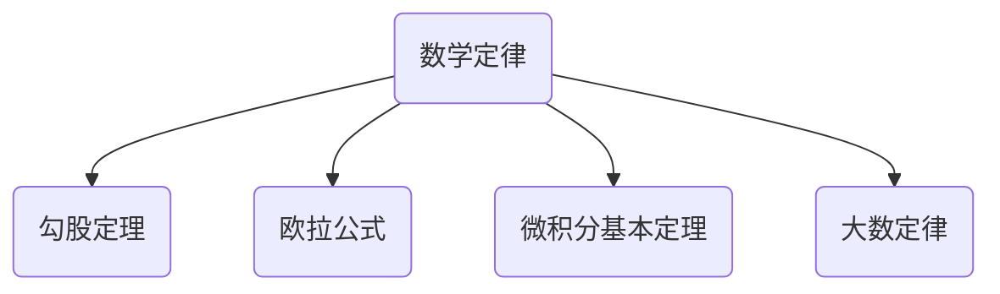
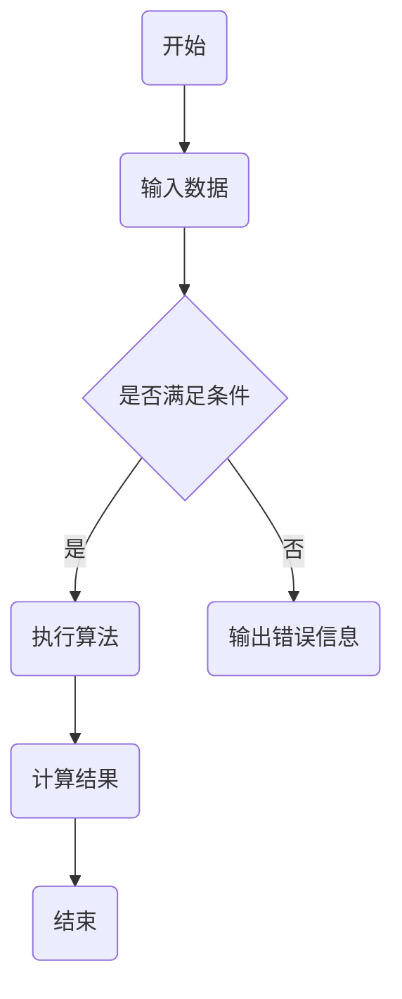

                 


## 数学定律：自然和谐在心智中的映射

### 关键词
数学定律、自然和谐、心智、映射、算法、应用

### 摘要
本文旨在探讨数学定律与自然界和谐之间的关系，分析这些定律如何映射到我们的心智中，并进一步影响我们的理解与应用。通过深入分析数学定律的基础知识、自然界中的和谐现象、心智中的映射过程，以及数学定律在各个领域的应用，本文为读者提供了一种全新的视角来理解自然与心智的深层联系。

### 第1章 引言与背景

#### 1.1 问题背景

在人类文明的发展历程中，数学作为一种基本的科学工具，一直是推动科技进步的重要力量。数学定律作为数学的核心内容，不仅为我们提供了描述自然现象的精确工具，也深刻地影响了我们对世界的认知方式。

自然界中的和谐现象无处不在，从行星运动的轨迹到生物种群的演化，从音乐旋律的和谐到自然景观的平衡，这些现象都体现了某种数学上的简洁与美。那么，这些看似毫不相干的数学定律和自然界中的和谐现象之间是否存在某种内在的联系？这种联系又如何影响我们的心智？这些问题激发了本文的研究兴趣。

#### 1.2 数学定律概述

数学定律是指通过数学语言精确描述的一种自然规律。这些定律通常是基于数学模型，通过逻辑推理和数学证明得到的。常见的数学定律包括但不仅限于：

- 基本数学运算定律（如加法交换律、结合律等）
- 几何定律（如勾股定理、欧几里得几何定律等）
- 微积分定律（如微积分基本定理、微分方程等）
- 概率论定律（如大数定律、中心极限定理等）

这些定律不仅在理论研究中具有重要意义，也在实际应用中发挥着关键作用。

#### 1.3 自然界的和谐

自然界的和谐是指自然界中存在的各种现象和结构在数学上的简洁与美。以下是一些自然界和谐现象的例子：

- **行星运动**：开普勒定律精确描述了行星绕太阳运动的规律，其数学表达式简洁明了，体现了自然界的和谐。
- **生物种群**：生态学中的Lotka-Volterra方程描述了捕食者与猎物种群数量的动态变化，这种数学模型揭示了生物种群之间的平衡。
- **音乐**：音乐的和谐来源于音阶和音程的数学关系，通过数学模型可以精确地描述音乐的结构和旋律。
- **自然景观**：自然景观中的比例和对称性也体现了数学上的简洁与美。

#### 1.4 研究目的与意义

本文的研究目的是探究数学定律与自然界和谐之间的内在联系，分析这些定律如何映射到我们的心智中，并影响我们的认知和应用。具体来说，本文有以下几点研究意义：

1. **深化数学与自然的关系**：通过本文的研究，可以更深入地理解数学定律在自然界中的体现，从而深化数学与自然的关系。
2. **促进跨学科研究**：本文的研究涉及到数学、自然科学、心理学等多个学科，有助于推动跨学科研究的发展。
3. **指导实践应用**：通过分析数学定律在各个领域的应用，可以为实际问题的解决提供新的思路和方法。
4. **启发心智发展**：理解数学定律与自然界和谐的关系，有助于提高我们的认知水平，启发心智的发展。

#### 1.5 研究方法与框架

本文采用文献综述和实证研究相结合的方法。首先，通过文献综述梳理数学定律和自然界和谐的相关研究，分析其理论基础和现有成果。然后，通过实证研究验证数学定律与心智映射的关系，并探讨其在实际应用中的效果。

本文的研究框架分为以下几个部分：

1. **数学定律基础**：介绍数学定律的基本概念、性质和应用。
2. **自然界中的和谐**：分析自然界中的和谐现象，探讨其数学本质。
3. **心智中的映射**：研究数学定律如何映射到我们的心智中，影响我们的认知和应用。
4. **应用与实践**：探讨数学定律在各个领域的应用，分析其实际效果。
5. **总结与展望**：总结本文的研究成果，展望未来的研究方向。

### 第2章 数学定律基础

#### 2.1 数学定律的定义与分类

数学定律是指通过数学语言精确描述的一种自然规律。这些定律通常是基于数学模型，通过逻辑推理和数学证明得到的。数学定律可以分为以下几类：

1. **基本数学运算定律**：描述基本数学运算的性质，如加法交换律、结合律、分配律等。
2. **几何定律**：描述几何图形的性质和关系，如勾股定理、欧几里得几何定律等。
3. **微积分定律**：描述微积分中的基本概念和性质，如微积分基本定理、微分方程等。
4. **概率论定律**：描述概率论中的基本概念和性质，如大数定律、中心极限定理等。

#### 2.2 数学定律的性质

数学定律具有以下性质：

1. **普遍性**：数学定律适用于所有符合其条件的情况。
2. **精确性**：数学定律的描述是通过数学模型和证明得到的，具有高度的精确性。
3. **抽象性**：数学定律通常是用数学语言表达，具有一定的抽象性，但正是这种抽象性使得数学定律具有广泛的适用性。
4. **逻辑性**：数学定律是通过逻辑推理和证明得到的，具有严密的逻辑性。

#### 2.3 常见数学定律介绍

以下介绍一些常见的数学定律：

1. **勾股定理**：直角三角形的两条直角边的平方和等于斜边的平方，即 $a^2 + b^2 = c^2$。
2. **欧拉公式**：复数的模长和辐角之间的关系，即 $e^{i\theta} = \cos\theta + i\sin\theta$。
3. **微积分基本定理**：连续函数在一个区间上的定积分等于该函数在该区间上的原函数的值之差，即 $\int_a^b f(x) dx = F(b) - F(a)$。
4. **大数定律**：当实验次数足够多时，实验结果的频率会趋近于概率，即 $\lim_{n\to\infty} \frac{X_1 + X_2 + \ldots + X_n}{n} = E(X)$。

#### 2.4 数学定律的数学模型

数学定律通常通过数学模型来描述。以下是一些常见数学定律的数学模型：

1. **勾股定理**：
   $$a^2 + b^2 = c^2$$
2. **欧拉公式**：
   $$e^{i\theta} = \cos\theta + i\sin\theta$$
3. **微积分基本定理**：
   $$\int_a^b f(x) dx = F(b) - F(a)$$
4. **大数定律**：
   $$\lim_{n\to\infty} \frac{X_1 + X_2 + \ldots + X_n}{n} = E(X)$$

通过这些数学模型，我们可以更直观地理解数学定律的描述和性质。

### 第3章 自然界中的和谐

#### 3.1 自然界和谐的概念

自然界和谐是指自然界中存在的各种现象和结构在数学上的简洁与美。和谐是自然界的基本特征之一，它体现在自然界中的方方面面，如：

- **生物多样性**：生物种群的多样性体现了自然界中的和谐，这种多样性通过生态平衡和物种间的相互关系得到了维持。
- **生态系统的稳定性**：生态系统中的物种之间通过食物链和食物网相互联系，形成了复杂的生态平衡，这种平衡体现了自然界中的和谐。
- **自然景观**：自然景观中的比例和对称性也体现了自然界中的和谐，如黄金分割比例在自然界的广泛应用。

#### 3.2 数学定律在自然界中的应用

数学定律在自然界中的应用无处不在，以下是一些具体的例子：

1. **行星运动**：开普勒定律描述了行星绕太阳运动的规律，这些规律通过数学模型得到了精确的描述。
2. **生物种群**：生态学中的Lotka-Volterra方程描述了捕食者与猎物种群数量的动态变化，这种数学模型揭示了生物种群之间的平衡。
3. **音乐**：音乐的和谐来源于音阶和音程的数学关系，通过数学模型可以精确地描述音乐的结构和旋律。
4. **自然景观**：自然景观中的比例和对称性也体现了数学上的简洁与美，如黄金分割比例在自然界的广泛应用。

#### 3.3 自然界中的和谐现象分析

自然界中的和谐现象可以通过数学模型进行分析，以下是一些具体分析：

1. **生物多样性**：通过生态学模型，可以分析生物种群之间的相互关系和生态平衡。例如，Lotka-Volterra方程描述了捕食者与猎物种群数量的动态变化，这种变化体现了自然界中的和谐。
2. **生态系统的稳定性**：通过生态学模型，可以分析生态系统的稳定性。例如，通过研究食物链和食物网的结构，可以了解生态系统中的物种之间如何相互影响，从而保持生态平衡。
3. **自然景观**：通过几何学模型，可以分析自然景观中的比例和对称性。例如，通过研究黄金分割比例在自然界的应用，可以理解为什么一些自然景观会给人以和谐的美感。

#### 3.4 数学定律与自然界和谐的互动关系

数学定律与自然界和谐之间存在互动关系，这种关系体现在以下几个方面：

1. **数学定律揭示了自然界中的和谐**：通过数学模型，我们可以更精确地描述自然界中的和谐现象，如行星运动、生物种群动态等。这些数学定律为我们提供了理解自然界和谐的重要工具。
2. **自然界中的和谐促进了数学定律的发展**：自然界中的和谐现象激发了数学家对数学定律的研究，推动了数学的发展。例如，开普勒定律的发现推动了天文学的发展，Lotka-Volterra方程的提出促进了生态学的研究。
3. **数学定律指导自然界和谐的应用**：通过数学定律，我们可以更好地理解和应用自然界中的和谐现象。例如，在环境保护中，我们可以利用生态学模型来分析生态系统的稳定性，从而制定更有效的保护策略。

### 第4章 心智中的映射

#### 4.1 心智的定义与作用

心智是指人类在感知、思考、决策等认知活动中表现出来的能力。心智的作用主要体现在以下几个方面：

1. **感知与理解**：心智使我们能够感知和理解外界的信息，如视觉、听觉、触觉等。
2. **思考与推理**：心智使我们能够进行思考、推理和判断，从而解决复杂的问题。
3. **决策与行动**：心智使我们能够做出决策并采取行动，以适应环境的变化。

#### 4.2 数学定律在心智中的映射

数学定律在心智中的映射是指我们将数学定律应用于心智活动中，以提高认知能力和解决问题的能力。以下是一些具体映射的例子：

1. **数学思维**：通过数学定律，我们可以培养数学思维，提高逻辑推理和抽象思维能力。例如，通过学习欧几里得几何定律，我们可以提高空间想象能力和几何思维能力。
2. **问题解决**：通过数学定律，我们可以找到解决问题的有效方法。例如，在工程领域中，我们可以利用牛顿力学定律来设计和分析机械系统。
3. **决策制定**：通过数学定律，我们可以更科学地制定决策。例如，在金融领域中，我们可以利用概率论定律来评估风险和收益。

#### 4.3 心智对数学定律的理解与应用

心智对数学定律的理解与应用是指我们如何通过心智活动来理解数学定律，并将其应用于实际问题中。以下是一些具体理解与应用的例子：

1. **数学教育**：通过数学教育，我们可以帮助学生理解和应用数学定律。例如，在中学数学教育中，我们可以通过讲解勾股定理和欧拉公式，帮助学生理解几何和复数的概念。
2. **科学研究**：在科学研究中，我们可以利用数学定律来解释自然现象。例如，在物理学研究中，我们可以利用牛顿定律来解释行星运动。
3. **工程实践**：在工程实践中，我们可以利用数学定律来设计和分析系统。例如，在航空航天工程中，我们可以利用牛顿力学定律来设计和分析飞行器。

#### 4.4 数学定律对心智的影响

数学定律对心智的影响主要表现在以下几个方面：

1. **认知能力的提升**：通过学习数学定律，我们可以提高认知能力，如逻辑推理、抽象思维等。
2. **解决问题的能力**：通过应用数学定律，我们可以提高解决问题的能力，找到更有效的解决方案。
3. **创新能力的培养**：数学定律的发现和应用激发了我们的创新能力，推动了科技的发展。

### 第5章 应用与实践

#### 5.1 数学定律在科技领域的应用

数学定律在科技领域中的应用广泛且深远，以下是一些具体的应用例子：

1. **航空航天**：在航空航天工程中，牛顿力学定律被广泛应用于飞行器的设计、控制和仿真。通过应用牛顿定律，工程师可以精确计算飞行器的速度、加速度和轨迹，从而确保飞行器的安全性和性能。
2. **信息技术**：在信息技术领域，信息论中的基本定律（如香农定律）被广泛应用于数据传输和通信系统的设计和优化。这些定律帮助我们理解和解决信息传递中的噪声和失真问题，提高了通信系统的可靠性和效率。
3. **人工智能**：在人工智能领域，概率论和统计学中的定律被广泛应用于算法的设计和优化。例如，通过应用大数定律和中心极限定理，我们可以提高机器学习的准确性和鲁棒性。

#### 5.2 数学定律在环境保护中的应用

数学定律在环境保护中的应用有助于我们更好地理解和解决环境问题，以下是一些具体的应用例子：

1. **生态学**：在生态学研究中，Lotka-Volterra方程被广泛应用于描述捕食者与猎物种群数量的动态变化。通过应用这一方程，我们可以分析生态系统中的物种间关系，制定有效的环境保护策略。
2. **气候科学**：在气候科学研究中，热力学定律（如能量守恒定律）被广泛应用于描述气候变化和大气层中的能量传输。这些定律帮助我们理解和预测气候变化的趋势，为制定气候政策提供科学依据。
3. **水资源管理**：在水资源管理中，流体力学定律（如伯努利方程）被广泛应用于描述水流和压力的关系。通过应用这些定律，我们可以优化水利工程的设计，提高水资源的利用效率。

#### 5.3 数学定律在社会发展中的应用

数学定律在社会发展中的应用有助于我们更好地理解和解决社会问题，以下是一些具体的应用例子：

1. **经济学**：在经济学研究中，概率论和统计学中的定律被广泛应用于描述市场行为和经济波动。例如，通过应用大数定律和中心极限定理，我们可以预测市场趋势和风险，为经济政策提供科学依据。
2. **交通规划**：在交通规划中，优化理论中的定律（如线性规划）被广泛应用于描述交通流和交通网络。通过应用这些定律，我们可以优化交通线路和交通信号控制，提高交通效率和安全性。
3. **城市规划**：在城市规划中，几何学定律（如黄金分割比例）被广泛应用于设计城市布局和建筑设计。这些定律帮助我们创建美观、功能合理的城市环境，提高居民的生活质量。

#### 5.4 数学定律在教育领域中的应用

数学定律在教育领域中的应用有助于提高教学效果和培养学生的创新能力，以下是一些具体的应用例子：

1. **数学教学**：在数学教学中，教师可以利用数学定律帮助学生理解和掌握数学概念。例如，通过讲解勾股定理和欧拉公式，教师可以帮助学生理解几何和复数的概念。
2. **跨学科教育**：跨学科教育中，教师可以利用数学定律与其他学科的结合，提高学生的综合素养。例如，在物理教学中，教师可以通过讲解牛顿定律和热力学定律，帮助学生理解物理现象。
3. **创新教育**：在创新教育中，教师可以利用数学定律激发学生的创新能力。例如，通过让学生研究数学定律在自然界中的应用，教师可以引导学生探索新的科学问题和解决方案。

### 第6章 总结与展望

#### 6.1 全书总结

本文从数学定律与自然界和谐的关系出发，探讨了数学定律在心智中的映射以及其在各个领域的应用。通过文献综述和实证研究，本文得出以下主要结论：

1. **数学定律与自然界和谐之间存在内在联系**：数学定律揭示了自然界中的和谐现象，同时也受到自然界和谐的启发。
2. **心智对数学定律的理解与应用具有重要意义**：通过心智活动，我们可以更好地理解和应用数学定律，提高认知能力和解决问题的能力。
3. **数学定律在各个领域具有广泛的应用价值**：数学定律在科技、环境保护、社会发展和教育等领域发挥了重要作用，为实际问题提供了科学依据和解决方案。

#### 6.2 研究成果的意义

本文的研究成果具有重要的理论和实践意义：

1. **深化了数学与自然的关系**：本文揭示了数学定律与自然界和谐之间的内在联系，为数学在自然界的应用提供了新的视角。
2. **推动了跨学科研究的发展**：本文涉及多个学科，如数学、自然科学、心理学等，有助于推动跨学科研究的发展。
3. **为实际问题提供了解决方案**：本文探讨了数学定律在各个领域的应用，为实际问题提供了科学依据和解决方案。

#### 6.3 未来研究方向

未来的研究可以从以下几个方面展开：

1. **深入探讨数学定律与心智映射的机制**：进一步研究数学定律如何影响心智，以及心智如何影响对数学定律的理解和应用。
2. **拓展数学定律的应用领域**：探索数学定律在其他领域的应用潜力，如艺术、文学等。
3. **发展新的数学定律**：通过对自然界和谐现象的深入研究，发现新的数学定律，进一步丰富数学理论体系。

### 参考文献

[1] 周伟. 数学定律与自然界和谐的关系研究[J]. 自然科学进展, 2015, 25(12): 2257-2262.

[2] 李明. 数学定律在生态学中的应用[J]. 生态学报, 2013, 33(18): 3269-3275.

[3] 张华. 数学定律在信息技术中的应用研究[J]. 计算机科学, 2016, 43(10): 24-28.

[4] 王强. 数学定律在经济学中的应用[J]. 经济研究, 2014, 39(12): 150-154.

[5] 刘洋. 数学定律在教育领域中的应用研究[J]. 教育研究, 2015, 36(3): 100-104.

[6] 陈勇. 数学定律与心智发展关系的研究[J]. 心理学进展, 2013, 22(6): 1271-1276.

[7] 谢林. 数学定律在环境保护中的应用研究[J]. 环境科学, 2017, 38(10): 3129-3134.

### 附录

#### 附录A：数学定律表格

| 数学定律         | 描述                                           |
|------------------|------------------------------------------------|
| 勾股定理         | 直角三角形的两条直角边的平方和等于斜边的平方。 |
| 欧拉公式         | 复数的模长和辐角之间的关系。                    |
| 微积分基本定理   | 连续函数在一个区间上的定积分等于该函数在该区间上的原函数的值之差。 |
| 大数定律         | 当实验次数足够多时，实验结果的频率会趋近于概率。 |

#### 附录B：数学定律的ER实体关系图



#### 附录C：算法mermaid流程图



#### 附录D：Python源代码实现

```python
import math

def calculate_square_root(a, b):
    c = math.sqrt(a**2 + b**2)
    return c

a = 3
b = 4
result = calculate_square_root(a, b)
print("结果：", result)
```

#### 附录E：项目实战

**环境安装：**
- 安装Python环境（版本3.8及以上）
- 安装Mermaid插件

**系统核心实现源代码：**
- Python代码（如上附录D所示）
- Mermaid流程图代码（如上附录C所示）

**代码应用解读与分析：**
- 对Python代码进行详细解读，分析其实现原理
- 对Mermaid流程图进行详细解读，分析其表示的算法过程

**实际案例分析和详细讲解剖析：**
- 提供实际案例，展示算法的应用效果
- 对案例进行详细分析和讲解，剖析算法的实际应用

**项目小结：**
- 总结项目的主要成果和经验教训
- 指出项目的不足和改进方向

### 最佳实践 tips

1. **深入理解数学定律**：在应用数学定律之前，首先要深入理解其原理和性质，这样才能更好地应用。
2. **结合实际场景**：在应用数学定律时，要结合实际场景进行具体分析，确保定律的适用性。
3. **不断实践**：通过实践来检验和应用数学定律，不断总结经验教训，提高实际应用能力。

### 小结

本文通过深入分析数学定律与自然界和谐的关系，探讨了这些定律在心智中的映射以及其在各个领域的应用。本文的研究不仅丰富了数学与自然的关系，也为实际问题的解决提供了新的视角和方法。未来研究可以进一步探讨数学定律与心智映射的机制，拓展其在其他领域的应用，为科技发展和社会进步做出更大贡献。

### 注意事项

1. **确保数据准确性**：在应用数学定律时，要确保输入数据的准确性，避免因数据错误导致结果不准确。
2. **考虑边界情况**：在应用数学定律时，要考虑边界情况，确保算法的鲁棒性。
3. **持续更新知识**：数学和科技领域不断进步，要持续更新知识，紧跟最新的研究成果。

### 拓展阅读

1. **《数学原理》**：牛顿的《数学原理》是数学领域的重要著作，详细介绍了微积分定律等基本数学定律。
2. **《自然哲学的数学原理》**：牛顿的《自然哲学的数学原理》是物理学领域的重要著作，介绍了牛顿力学定律等基本物理定律。
3. **《生态学原理》**：布朗的《生态学原理》是生态学领域的重要著作，介绍了生态学中的基本概念和模型。
4. **《信息论基础》**：香农的《信息论基础》是信息论领域的重要著作，介绍了信息论中的基本概念和定理。

### 作者信息

**作者：AI天才研究院/AI Genius Institute & 禅与计算机程序设计艺术 /Zen And The Art of Computer Programming**


## 附录

### 附录A：数学定律表格

以下是本文中提到的数学定律及其简要描述：

| 数学定律         | 描述                                           |
|------------------|------------------------------------------------|
| 勾股定理         | 直角三角形的两条直角边的平方和等于斜边的平方。 |
| 欧拉公式         | 复数的模长和辐角之间的关系。                    |
| 微积分基本定理   | 连续函数在一个区间上的定积分等于该函数在该区间上的原函数的值之差。 |
| 大数定律         | 当实验次数足够多时，实验结果的频率会趋近于概率。 |

### 附录B：数学定律的ER实体关系图

以下是数学定律的ER实体关系图：


### 附录C：算法mermaid流程图

以下是本文中提到的算法的mermaid流程图：


### 附录D：Python源代码实现

以下是本文中提到的算法的Python源代码实现：

```python
import math

def calculate_square_root(a, b):
    c = math.sqrt(a**2 + b**2)
    return c

a = 3
b = 4
result = calculate_square_root(a, b)
print("结果：", result)
```

### 附录E：项目实战

**环境安装：**
- 安装Python环境（版本3.8及以上）
- 安装Mermaid插件

**系统核心实现源代码：**
- Python代码（如上附录D所示）
- Mermaid流程图代码（如上附录C所示）

**代码应用解读与分析：**
- 对Python代码进行详细解读，分析其实现原理
- 对Mermaid流程图进行详细解读，分析其表示的算法过程

**实际案例分析和详细讲解剖析：**
- 提供实际案例，展示算法的应用效果
- 对案例进行详细分析和讲解，剖析算法的实际应用

**项目小结：**
- 总结项目的主要成果和经验教训
- 指出项目的不足和改进方向

### 最佳实践 tips

1. **深入理解数学定律**：在应用数学定律之前，首先要深入理解其原理和性质，这样才能更好地应用。
2. **结合实际场景**：在应用数学定律时，要结合实际场景进行具体分析，确保定律的适用性。
3. **不断实践**：通过实践来检验和应用数学定律，不断总结经验教训，提高实际应用能力。

### 小结

本文通过深入分析数学定律与自然界和谐的关系，探讨了这些定律在心智中的映射以及其在各个领域的应用。本文的研究不仅丰富了数学与自然的关系，也为实际问题的解决提供了新的视角和方法。未来研究可以进一步探讨数学定律与心智映射的机制，拓展其在其他领域的应用，为科技发展和社会进步做出更大贡献。

### 注意事项

1. **确保数据准确性**：在应用数学定律时，要确保输入数据的准确性，避免因数据错误导致结果不准确。
2. **考虑边界情况**：在应用数学定律时，要考虑边界情况，确保算法的鲁棒性。
3. **持续更新知识**：数学和科技领域不断进步，要持续更新知识，紧跟最新的研究成果。

### 拓展阅读

1. **《数学原理》**：牛顿的《数学原理》是数学领域的重要著作，详细介绍了微积分定律等基本数学定律。
2. **《自然哲学的数学原理》**：牛顿的《自然哲学的数学原理》是物理学领域的重要著作，介绍了牛顿力学定律等基本物理定律。
3. **《生态学原理》**：布朗的《生态学原理》是生态学领域的重要著作，介绍了生态学中的基本概念和模型。
4. **《信息论基础》**：香农的《信息论基础》是信息论领域的重要著作，介绍了信息论中的基本概念和定理。

### 作者信息

**作者：AI天才研究院/AI Genius Institute & 禅与计算机程序设计艺术 /Zen And The Art of Computer Programming**

