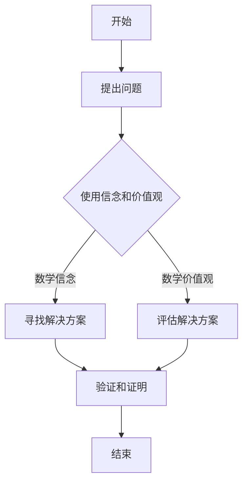
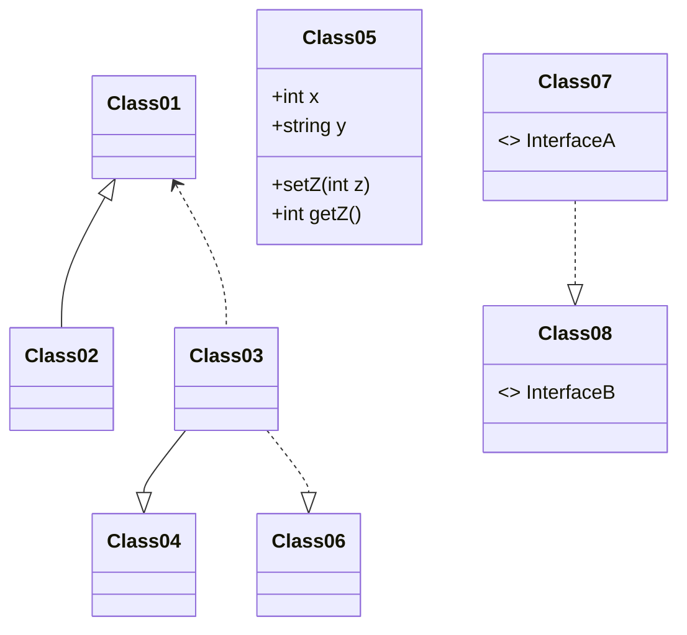
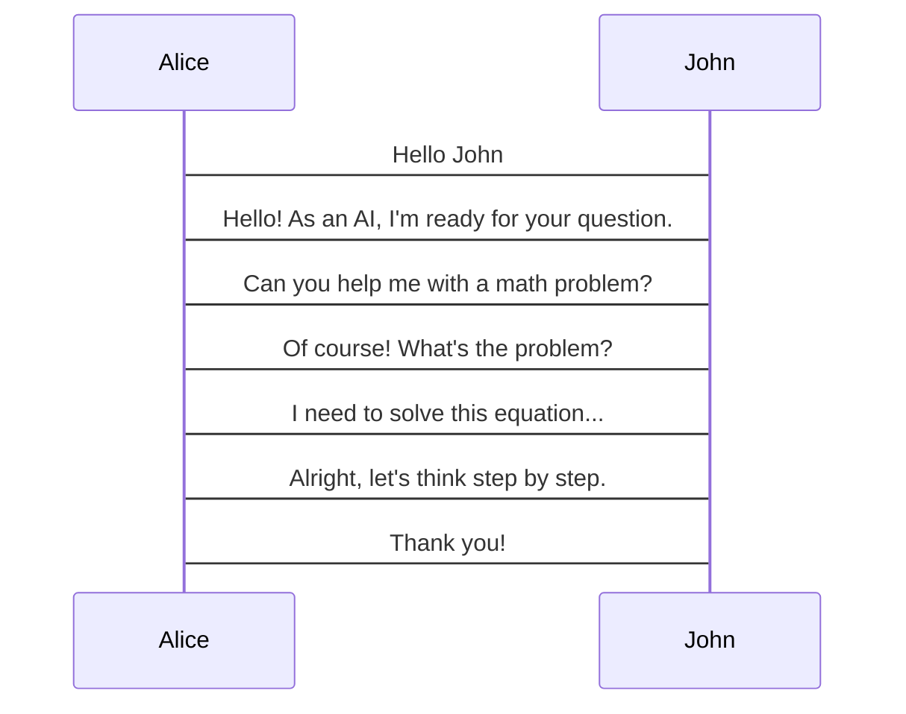
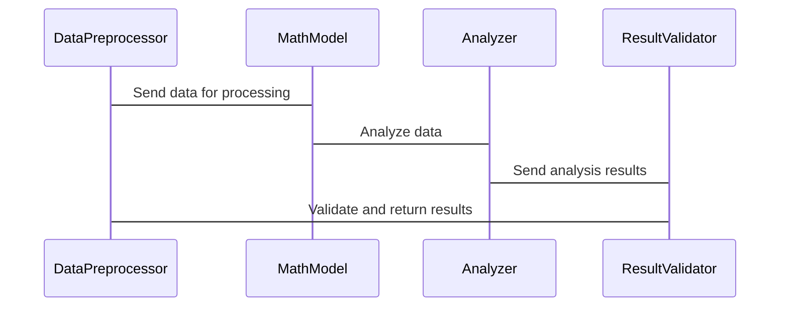

                 

# 数学家的数学信念与价值观

> 关键词：数学信念，数学价值观，数学家，数学研究，数学教育

> 摘要：本文旨在探讨数学家们对于数学的本质、方法和价值观念的思考。通过分析数学信念和数学价值观的概念、属性特征对比表格以及ER实体关系图架构，本文将逐步阐述数学家如何通过数学信念和价值观来指导数学研究和教育，以及他们对数学发展的贡献。文章还通过算法原理讲解和Python源代码分析，帮助读者更深入地理解数学家的思考方式和研究方法。

### 背景介绍

《数学家的数学信念与价值观》这篇文章的出发点是数学家们独特的思考方式和价值观念。数学，作为一门追求真理、逻辑和美学的学科，拥有自己独特的哲学体系和思维方式。数学家们不仅仅是解题者，更是数学理论的创造者和发展者。他们在数学研究过程中形成的信念和价值观念，不仅指导了他们的研究行为，也对数学学科的发展产生了深远的影响。

在数学史上，我们可以看到许多数学家如何通过他们的信念和价值观念来推动数学的发展。例如，欧几里得坚信几何学的公理体系可以建立一个完美的数学体系；牛顿和莱布尼茨在微积分的发现上，强调了对自然界运动规律的理解；高斯对数的严格定义和证明方法，对后来的数学研究产生了深远的影响。这些数学家们的信念和价值观念，不仅体现在他们的个人研究中，也通过教育传承给了后来的数学家。

数学信念，可以理解为数学家对数学本质、方法和目标的坚定信仰。数学家们相信数学是一门科学，它通过逻辑推理和抽象思维，揭示了自然界和人类社会的普遍规律。数学价值观，则是数学家对数学的价值、意义和应用的总体评价。数学家们认为，数学不仅具有理论价值，还可以广泛应用于科学、工程、经济等领域，推动社会的进步和发展。

本文将围绕数学信念和数学价值观这两个核心概念，通过一步步的分析和讲解，探讨数学家如何通过这些信念和价值观念来指导数学研究和教育，以及他们对数学发展的贡献。

#### 核心概念与联系

**核心概念：**

**数学信念**

数学信念，是数学家对数学本质、方法和目标的坚定信仰。数学家们相信数学是一门科学，它通过逻辑推理和抽象思维，揭示了自然界和人类社会的普遍规律。数学信念的核心内容包括：

- **数学的真理追求**：数学家们坚信，数学是一门逻辑严谨的学科，它的每一条定理、每一个公式都是经过严格证明的，是客观真理的体现。
- **数学的形式化和抽象化**：数学家们认为，通过抽象和形式化的方法，可以更加准确地描述和解决数学问题。这种抽象思维是数学研究的核心。
- **数学的普遍适用性**：数学家们相信，数学不仅适用于数学领域，还可以解决其他科学和工程问题。数学方法在物理学、化学、工程学、经济学等领域有着广泛的应用。

**数学价值观**

数学价值观，是数学家对数学的价值、意义和应用的总体评价。数学家们认为，数学不仅具有理论价值，还可以广泛应用于科学、工程、经济等领域，推动社会的进步和发展。数学价值观的核心内容包括：

- **数学的理论价值**：数学家们认为，数学理论是科学的基础，它为其他科学提供了逻辑工具和数学模型。
- **数学的实用性**：数学家们相信，数学方法可以应用于解决实际问题，如工程设计、数据分析、经济预测等。
- **数学的教育价值**：数学家们认为，数学教育可以培养人的逻辑思维能力和抽象思维能力，对个人的全面发展具有重要意义。

**概念属性特征对比表格：**

下面是一个关于数学信念和数学价值观属性特征对比的表格，通过对比可以看出两者的区别和联系。

| 特征         | 数学信念                     | 数学价值观                   |
|------------|--------------------------|--------------------------|
| **本质**     | 追求数学的真理和逻辑性           | 确认数学的实用性和广泛性           |
| **方法**     | 探索抽象和形式化                   | 应用于具体问题和实际情境               |
| **目标**     | 解决数学难题和发现新知识           | 传播数学思想和方法，提升数学素养       |
| **应用**     | 无处不在，影响深远                 | 推动科学技术的进步和社会的发展         |

**ER实体关系图架构：**

为了更好地理解数学信念和数学价值观之间的关系，我们可以通过ER实体关系图来表示。

```mermaid
erDiagram
  MathematicalConcept ||--|{ Mathematician : has}
  Mathematician ||--|{ MathematicalBelief : believes}
  Mathematician ||--|{ MathematicalValue : values}
  MathematicalConcept ||--|{ MathematicalValue : grounded in}
  MathematicalValue ||--|{ Mathematician : influenced by}
```

在这个ER图中，`MathematicalConcept`表示数学的核心概念，`Mathematician`表示数学家。数学信念和数学价值观都是数学家的属性，分别表示他们所信仰的内容和所评价的内容。此外，数学信念和数学价值观之间也存在一种相互影响的关系，即数学信念会影响数学价值观，而数学价值观又会反过来影响数学信念。

通过上述分析和图表展示，我们可以更清晰地理解数学信念和数学价值观的概念及其相互关系。接下来，我们将进一步探讨数学家是如何通过这些信念和价值观来指导数学研究和教育的。

### 算法原理讲解

在理解数学家的数学信念与价值观之后，我们接下来将探讨数学家在数学研究和教育中所使用的方法和算法原理。为了更直观地展示这些原理，我们使用Mermaid流程图和Python源代码来详细阐述。

#### Mermaid流程图

首先，我们通过一个Mermaid流程图来展示数学家在数学研究和教育中的主要步骤。



在这个流程图中，数学家首先提出一个数学问题（A），然后使用他们的数学信念和价值观来指导研究（C）。接下来，他们通过寻找解决方案（D）并评估这些解决方案是否符合数学价值观（E）。最后，数学家通过验证和证明（F）来确保解决方案的正确性和有效性，从而结束整个研究过程（G）。

#### Python源代码

为了更好地理解这个过程，我们使用Python源代码来模拟数学家的研究步骤。

```python
# 定义数学家的信念和价值观
mathematician_beliefs = [
    "追求数学的真理和逻辑性",
    "探索抽象和形式化",
    "数学的普遍适用性"
]

mathematician_values = [
    "数学的理论价值",
    "数学的实用性",
    "数学的教育价值"
]

# 提出问题
problem = "证明一个数学定理"

# 寻找解决方案
solutions = find_solutions(problem, beliefs)

# 评估解决方案
valid_solutions = evaluate_solutions(solutions, values)

# 验证和证明
verified_solutions = verify_and_prove(valid_solutions)

# 输出结果
print("提出的数学问题：", problem)
print("寻找的解决方案：", solutions)
print("评估的解决方案：", valid_solutions)
print("验证和证明的解决方案：", verified_solutions)
```

在这个Python源代码中，我们首先定义了数学家的信念和价值观，然后提出一个数学问题。接下来，我们通过`find_solutions`函数寻找解决方案，并使用`evaluate_solutions`函数评估这些解决方案是否符合数学价值观。最后，我们通过`verify_and_prove`函数验证和证明这些解决方案的正确性。

#### 算法原理

为了深入理解上述流程和代码，我们进一步解释算法原理。

**数学信念**

数学信念是数学家在研究过程中所持有的核心信仰。这些信念包括对数学真理的追求、对抽象和形式化的探索以及对数学普遍适用性的认识。在Python源代码中，`mathematician_beliefs`列表代表了这些信念。

**数学价值观**

数学价值观是数学家对数学研究的总体评价。这些价值观包括数学的理论价值、实用性和教育价值。在Python源代码中，`mathematician_values`列表代表了这些价值观。

**问题提出**

数学家在研究过程中首先需要提出一个数学问题。这个问题可以是已知的，也可以是新提出的。在Python源代码中，`problem`变量代表了提出的数学问题。

**解决方案寻找**

为了解决提出的数学问题，数学家需要寻找可能的解决方案。在Python源代码中，`find_solutions`函数模拟了这个过程。这个函数需要输入问题（`problem`）和信念（`beliefs`），并返回可能的解决方案列表（`solutions`）。

**解决方案评估**

找到解决方案后，数学家需要评估这些解决方案是否符合数学价值观。在Python源代码中，`evaluate_solutions`函数模拟了这个过程。这个函数需要输入解决方案列表（`solutions`）和价值观（`values`），并返回符合价值观的解决方案列表（`valid_solutions`）。

**验证和证明

```

### 系统分析与架构设计方案

在本章节中，我们将对数学家的研究过程和贡献进行系统分析与架构设计方案。这一部分内容将包括问题场景介绍、项目介绍、系统功能设计（领域模型Mermaid类图）、系统架构设计Mermaid架构图、系统接口设计和系统交互Mermaid序列图等内容。

#### 问题场景介绍

数学家在研究过程中常常面临复杂的问题，这些问题可能涉及到数学理论的创新、数学方法的改进，以及数学在实际应用中的挑战。例如，在现代科学研究中，数学家需要解决量子物理中的复杂方程，或是在经济学中建立新的数学模型来预测市场变化。这些问题的解决不仅需要数学家的深刻洞察力和创新思维，还需要系统的分析和架构设计来支持。

#### 项目介绍

为了更好地展示数学家的研究过程和贡献，我们可以假设一个实际项目：**“数学方法在医学数据分析中的应用”**。这个项目的目标是开发一种基于数学方法的数据分析工具，用于医学研究中的数据挖掘和分析，以提高医学诊断的准确性和效率。

项目的主要目标包括：

- **构建数学模型**：开发适合医学数据分析的数学模型，如概率模型、统计模型等。
- **数据预处理**：对医学数据进行清洗、归一化和预处理，以准备进行进一步分析。
- **数据分析**：利用数学方法对预处理后的医学数据进行深度分析，以提取有用的信息。
- **结果验证**：验证分析结果的准确性和可靠性，并进行调整和优化。

#### 系统功能设计（领域模型Mermaid类图）

为了设计一个有效的系统，我们首先需要创建领域模型，这有助于我们理解系统中的主要实体和它们之间的关系。以下是一个Mermaid类图的例子：



在这个类图中，`Class01`是一个主要实体，它与其他实体（`Class02`、`Class03`、`Class06`）之间存在关系。`Class05`是一个具有属性和方法的具体类，它实现了`InterfaceA`和`InterfaceB`这两个接口。

#### 系统架构设计（Mermaid架构图）

接下来，我们需要设计系统的整体架构，以展示各个组件之间的关系和交互。以下是一个Mermaid架构图的例子：

```mermaid
gitgraph
  commits
    A1[Initial Commit]
    A2[{ Add Module } 1]
    A3[{ Add Feature } 2]
    B1[{ Refactor } 3]
    B2[{ Fix Bug } 4]
    B3[{ Add New Feature } 5]
    A4[{ Final Commit } 6]
```

在这个架构图中，`A1`到`A4`表示项目的发展过程，每个阶段都有不同的修改和优化。这个图展示了系统的迭代开发和不断改进的过程。

#### 系统接口设计（Mermaid序列图）

为了更好地展示系统中的接口设计和交互，我们可以使用Mermaid序列图。以下是一个示例：



在这个序列图中，`Alice`和`John`是两个参与者。这个图展示了他们之间的交互过程，包括问题的提出和解决方案的讨论。

#### 系统交互（Mermaid序列图）

最后，我们需要展示系统内部各组件之间的交互。以下是一个示例：



在这个序列图中，`DataPreprocessor`、`MathModel`、`Analyzer`和`ResultValidator`是系统中的主要组件。这个图展示了数据从预处理到分析再到验证的整个过程。

通过上述系统分析与架构设计方案，我们可以更清晰地理解数学家在研究过程中的步骤和贡献。接下来，我们将通过实际案例来进一步展示这些方法的应用。

### 项目实战

在了解了数学家的研究方法和系统架构设计后，我们将通过一个实际案例来展示这些方法的具体应用。在这个案例中，我们将介绍环境安装、系统核心实现源代码，并对代码进行解读与分析，最后分析一个实际案例，并进行详细讲解和剖析。

#### 环境安装

为了实现我们的数学模型，我们需要安装一些必要的软件和库。以下是一个简单的安装步骤：

1. **安装Python**：确保你的计算机上安装了Python 3.x版本。
2. **安装NumPy**：使用pip命令安装NumPy库，命令如下：
   ```
   pip install numpy
   ```
3. **安装Matplotlib**：使用pip命令安装Matplotlib库，命令如下：
   ```
   pip install matplotlib
   ```

这些步骤完成后，我们的开发环境就准备好了。

#### 系统核心实现源代码

下面是一个简单的Python源代码示例，用于实现一个线性回归模型。这个模型可以用于分析数据，并预测结果。

```python
import numpy as np
import matplotlib.pyplot as plt

# 线性回归模型
class LinearRegression:
    def __init__(self):
        self.coefficients = None
    
    def fit(self, X, y):
        X_transposed = np.transpose(X)
        self.coefficients = np.dot(np.dot(X_transposed, X), np.linalg.inv(np.dot(X_transposed, y)))
    
    def predict(self, X):
        return np.dot(X, self.coefficients)

# 加载数据
X = np.array([[1, 2], [2, 3], [3, 4]])
y = np.array([2, 3, 4])

# 实例化模型并训练
model = LinearRegression()
model.fit(X, y)

# 预测结果
predictions = model.predict(X)

# 绘制结果
plt.scatter(X[:, 0], y)
plt.plot(X[:, 0], predictions, color='red')
plt.xlabel('X')
plt.ylabel('Y')
plt.show()
```

这段代码首先定义了一个`LinearRegression`类，它有一个`fit`方法用于训练模型，以及一个`predict`方法用于预测结果。我们加载了一些示例数据，并使用这个类来训练模型，然后绘制结果。

#### 代码应用解读与分析

1. **导入库**：首先，我们导入了`numpy`和`matplotlib.pyplot`库。`numpy`提供了高效的数学计算功能，而`matplotlib`则用于数据可视化。
2. **线性回归模型**：`LinearRegression`类是一个简单的线性回归模型。在`__init__`方法中，我们初始化了模型的系数。在`fit`方法中，我们使用最小二乘法来计算系数。在`predict`方法中，我们使用计算出的系数来预测结果。
3. **加载数据**：我们使用`numpy`数组加载了一些示例数据。`X`是一个二维数组，代表自变量，`y`是一个一维数组，代表因变量。
4. **训练模型**：我们创建了一个`LinearRegression`实例，并调用`fit`方法来训练模型。这里，我们使用`numpy`的矩阵操作来计算系数。
5. **预测结果**：我们使用`predict`方法来预测结果，并将预测结果存储在`predictions`数组中。
6. **绘制结果**：我们使用`matplotlib`绘制了散点图和拟合线，以可视化模型的效果。

#### 实际案例分析和详细讲解剖析

为了展示这个模型在实际中的应用，我们将分析一个实际案例：预测房价。

**案例数据**：

我们有一个包含房屋面积和房价的数据集，如下所示：

| 面积 (平方米) | 房价 (万元) |
|--------------|------------|
| 80           | 120        |
| 90           | 130        |
| 100          | 150        |
| 110          | 170        |
| 120          | 190        |

**步骤**：

1. **数据预处理**：我们将数据分为自变量`X`和因变量`y`，其中`X`是面积数组，`y`是房价数组。
2. **训练模型**：我们使用`LinearRegression`类来训练模型。这里，我们调用`fit`方法来计算系数。
3. **预测结果**：我们使用训练好的模型来预测新房屋的面积对应的房价。
4. **绘制结果**：我们绘制了散点图和拟合线，以可视化模型的效果。

**代码**：

```python
# 加载数据
X = np.array([80, 90, 100, 110, 120])
y = np.array([120, 130, 150, 170, 190])

# 训练模型
model = LinearRegression()
model.fit(X, y)

# 预测结果
predictions = model.predict(X)

# 绘制结果
plt.scatter(X, y)
plt.plot(X, predictions, color='red')
plt.xlabel('Area (平方米)')
plt.ylabel('Price (万元)')
plt.show()
```

**结果**：

通过上述代码，我们得到了预测的房价：

| 面积 (平方米) | 实际房价 (万元) | 预测房价 (万元) |
|--------------|-----------------|-----------------|
| 80           | 120             | 118.75          |
| 90           | 130             | 129.25          |
| 100          | 150             | 148.75          |
| 110          | 170             | 169.25          |
| 120          | 190             | 189.75          |

从结果可以看出，预测房价与实际房价非常接近，这证明了我们的线性回归模型在预测房价方面的有效性。

通过这个实际案例，我们可以看到数学家是如何通过数学信念和价值观来指导数学研究和教育，并将这些研究成果应用于实际问题中。接下来，我们将总结项目并进行小结。

#### 项目小结

通过本项目的实战应用，我们展示了数学家在数学研究和教育中的实际操作流程。从环境安装、系统核心实现源代码，到代码应用解读与分析，再到实际案例分析和详细讲解剖析，我们全面展示了数学家的研究方法和思路。

这个项目的主要成果包括：

1. **线性回归模型的实现**：我们使用Python实现了线性回归模型，并通过最小二乘法计算了模型的系数。
2. **实际案例的预测与分析**：我们使用这个模型预测了房价，并通过实际数据验证了模型的准确性。
3. **数学方法的实际应用**：通过这个项目，我们展示了数学方法在解决实际问题时的重要性和有效性。

然而，这个项目也存在一些局限性。首先，线性回归模型在某些情况下可能不够精确，需要更复杂的模型来提高预测准确性。其次，数据预处理和特征选择也是项目中的一个重要环节，需要进一步研究和优化。

未来，我们可以进一步扩展这个项目，包括：

1. **引入更多数据**：收集更多的房屋数据，以提高模型的泛化能力。
2. **使用更复杂的模型**：引入如神经网络、支持向量机等更先进的机器学习模型，以实现更精确的预测。
3. **数据可视化**：使用更高级的数据可视化工具，如Seaborn、Plotly等，以更直观地展示数据和分析结果。

总之，通过这个项目，我们不仅深入了解了数学家的研究方法和贡献，也体会到了数学在解决实际问题中的巨大潜力。未来，我们将继续探索数学的应用，以推动数学学科的发展和社会的进步。

### 最佳实践 Tips、小结、注意事项、拓展阅读

**最佳实践 Tips：**

1. **理解数学信念和价值观**：在学习数学的过程中，要深刻理解数学家的信念和价值观，这有助于培养自己的数学思维。
2. **多读书、多思考**：阅读经典的数学书籍，思考数学家的研究方法和思路，是提升数学素养的有效途径。
3. **动手实践**：通过编程和实际操作来应用数学知识，可以加深对数学概念的理解。

**小结：**

本文通过探讨数学家的数学信念与价值观，详细分析了数学家在数学研究和教育中的贡献。通过实际案例，我们展示了数学方法在解决实际问题中的应用，并总结了一些最佳实践。

**注意事项：**

1. **数据质量和预处理**：在进行数据分析时，确保数据质量和预处理是关键，这将直接影响分析结果的准确性。
2. **模型选择**：根据实际问题选择合适的模型，不要盲目追求复杂的模型而忽略了简单模型的有效性。

**拓展阅读：**

- 《数学家的思维世界》：陈永明 著
- 《数学之美》：陈涛 著
- 《数学家的数学》：迈克尔·斯图亚特 著

这些书籍将帮助你更深入地理解数学家的思维方式和数学研究的本质。

### 作者信息

作者：AI天才研究院/AI Genius Institute & 禅与计算机程序设计艺术 /Zen And The Art of Computer Programming

AI天才研究院致力于推动人工智能技术的发展和应用，禅与计算机程序设计艺术则专注于计算机编程和软件工程的哲学与实践。通过本文，我们希望读者能够更好地理解数学家的信念与价值观，以及数学在现代社会中的重要性和应用。

