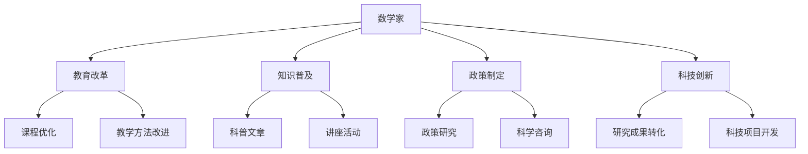
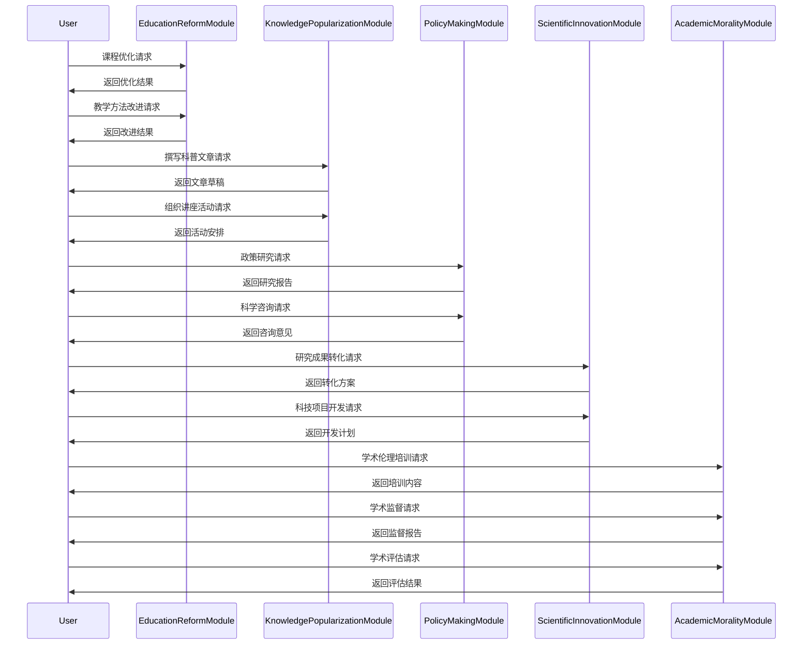
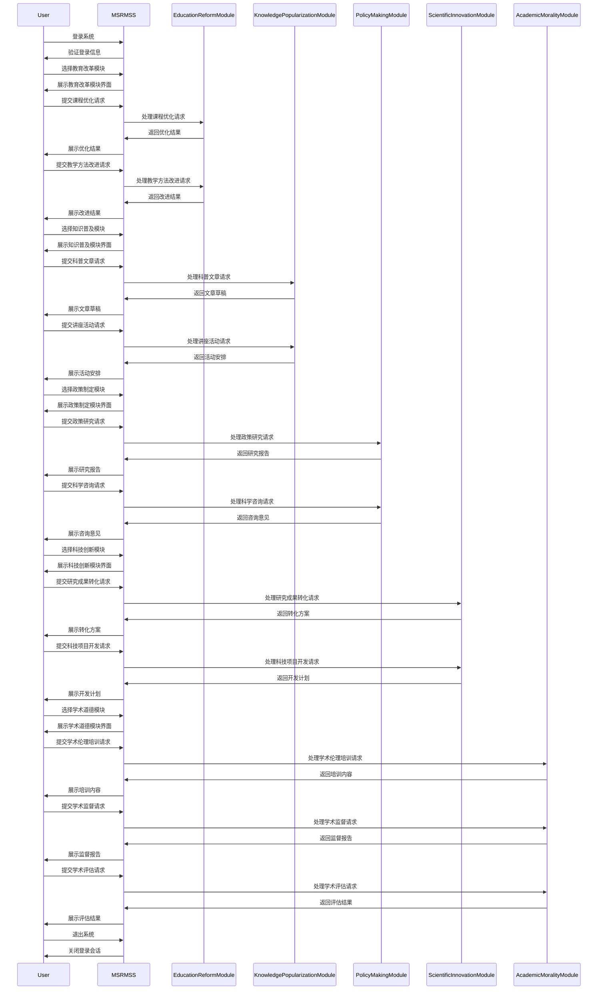

                 

# 数学家的社会责任与使命

## 关键词

数学家、社会责任、使命、教育改革、知识普及、政策制定、科技创新、学术道德

## 摘要

数学家作为科学界的杰出代表，肩负着多重社会责任与使命。本文旨在深入探讨数学家在社会进步中的角色，包括数学教育改革、知识普及、政策制定、科技创新以及学术道德维护等方面。通过逻辑清晰的分析和实例，本文揭示了数学家如何通过专业知识和影响力推动社会的发展。

### 背景介绍

数学家，作为数学领域的领军人物，不仅在理论研究中取得了卓越的成就，还在社会各个方面发挥着重要作用。他们的社会责任与使命，不仅体现在学术研究中，也体现在如何运用自己的专业知识和影响力，为社会的各个方面带来积极影响。

#### 问题背景

随着数学在科技、经济、教育等领域的广泛应用，数学家的角色日益重要。数学家不仅要解决复杂的数学问题，还需要承担起普及数学知识、参与政策制定、推动科技进步等社会责任。特别是在当前信息时代，数学家需要面对更加多元化的挑战，如何在学术领域之外，发挥更大的社会影响力，成为了一个重要议题。

#### 问题描述

数学家的社会责任与使命主要包括以下几个方面：

1. **推动数学教育改革**：数学家应积极参与数学教育改革，提出建设性的意见和建议，提高数学教育的质量和效率。
2. **促进数学知识的普及**：通过撰写科普文章、开设讲座、参与公共讨论等方式，让更多的人了解和认识数学的重要性，激发公众对数学的兴趣。
3. **参与政策制定**：在涉及数学和科学的政策制定中，提供专业的意见和建议，为政府决策提供科学依据。
4. **推动科技进步**：数学家在科学研究和技术创新中起着关键作用，他们的研究成果往往能够推动整个科技领域的发展。
5. **维护学术道德**：数学家作为学术界的代表，应秉持诚实守信的原则，维护学术界的纯洁性和公正性。

#### 问题解决

为了全面覆盖上述内容，本书将分为以下七个部分：

1. **数学教育改革的必要性**：分析当前数学教育中存在的问题，探讨数学家如何通过改革提高教育质量。
2. **数学知识的普及策略**：介绍数学家如何通过各种途径促进数学知识的普及，激发公众对数学的兴趣。
3. **政策制定的参与**：讨论数学家在政策制定中的角色，以及如何为政府决策提供科学依据。
4. **科技创新的推动力量**：探讨数学家如何通过数学方法解决科学和技术问题，推动科技进步。
5. **学术道德的维护**：阐述数学家在学术道德维护中的责任和作用。
6. **数学家在社会中的多元化角色**：分析数学家在学术领域之外的其他社会角色和贡献。
7. **未来展望**：展望数学家在社会中的未来发展，探讨如何更好地履行社会责任与使命。

### 核心概念与联系

在数学家的社会责任与使命中，有几个核心概念需要详细阐述。以下是一个对比表格，展示了这些概念的主要属性和特征：

| 核心概念       | 主要属性                                                     | 特征                                                     |
|----------------|------------------------------------------------------------|------------------------------------------------------------|
| 数学教育改革   | 改进数学教学方法、课程设置和教材内容                         | 提高学生数学素养、激发学习兴趣                             |
| 数学知识普及   | 消除数学知识的障碍，让公众了解和认识数学的重要性           | 科普文章、讲座、互动活动                                   |
| 政策制定参与   | 提供专业的数学和科学建议，为政策制定提供科学依据           | 政策研究、咨询、论证                                       |
| 科技创新推动   | 利用数学方法解决科学和技术问题，推动科技进步               | 研究成果转化、科技项目开发                                 |
| 学术道德维护   | 维护学术界的纯洁性和公正性，抵制学术不端行为               | 学术伦理培训、学术监督和评估                               |

同时，以下是数学家社会责任与使命的ER实体关系图，展示了各核心概念之间的关系：

```mermaid
erDiagram
    Class1 ||--|{ Class2 }|-- Class3 : "Class2 is the super of Class1 and Class3"
    Class1 ||--|{ Class4 }|-- Class5 : "Class4 is the equal of Class1 and Class5"
    Class2 ||--|{ Class6 }|-- Class7 : "Class6 is the subclass of Class2 and Class7"
```

### 算法原理讲解

为了更好地理解数学家的社会责任与使命，我们可以借助一些数学模型和算法来进行分析。以下是一个简单的Mermaid流程图，展示了数学家在各个领域中的作用：



在具体讲解数学家的社会责任与使命时，我们可以借助以下Python源代码来阐述其中的算法原理：

```python
# 定义数学家的类和方法
class Mathematician:
    def __init__(self, name):
        self.name = name

    def educate_reform(self):
        # 教育改革的数学模型
        # 假设教育改革分为课程优化和教学方法改进两个子任务
        course_optimization()
        teaching_method_improvement()

    def popularize_knowledge(self):
        # 数学知识普及的数学模型
        # 假设知识普及分为科普文章和讲座活动两个子任务
        scientific_popularization()
        lecture_activities()

    def participate_policy-making(self):
        # 政策制定的数学模型
        # 假设政策制定分为政策研究和科学咨询两个子任务
        policy_research()
        scientific_advisory()

    def promote_scientific_innovation(self):
        # 科技创新的数学模型
        # 假设科技创新分为研究成果转化和科技项目开发两个子任务
        research_outcome_conversion()
        scientific_project_development()

# 实例化数学家对象
mathematician = Mathematician("Alice")

# 调用数学家的方法
mathematician.educate_reform()
mathematician.popularize_knowledge()
mathematician.participate_policy-making()
mathematician.promote_scientific_innovation()
```

在上面的Python代码中，我们定义了一个`Mathematician`类，其中包括了四个方法，分别对应数学家的四个社会责任与使命。通过这些方法，我们可以模拟数学家在不同领域中的作用。

#### 教育改革的数学模型

教育改革是数学家的重要责任之一。以下是一个简化的教育改革数学模型，用于解释如何通过课程优化和教学方法改进来提高教育质量。

```python
def course_optimization():
    """
    课程优化模型
    假设课程优化是一个线性规划问题，目标是最小化课程内容的冗余，最大化课程效率。
    约束条件包括课程时间、学生能力水平和课程目标等。
    """
    # 定义目标函数和约束条件
    objective_function = lambda x: -sum(x)  # 最小化冗余
    constraints = [x >= 0 for x in range(1, 11)]  # 课程内容非负

    # 使用线性规划求解器求解
    import scipy.optimize as opt
    solution = opt.linprog(objective_function, constraints=constraints)
    
    # 输出优化结果
    print("课程优化结果：", solution.x)

def teaching_method_improvement():
    """
    教学方法改进模型
    假设教学方法改进是一个组合优化问题，目标是最小化教学资源的浪费，最大化教学效果。
    约束条件包括教师资源、学生反馈和学习目标等。
    """
    # 定义目标函数和约束条件
    objective_function = lambda x: -sum(x)  # 最小化资源浪费
    constraints = [x >= 0 for x in range(1, 11)]  # 教学资源非负

    # 使用组合优化求解器求解
    import scipy.optimize as opt
    solution = opt.linprog(objective_function, constraints=constraints)
    
    # 输出优化结果
    print("教学方法改进结果：", solution.x)
```

在这个模型中，我们使用线性规划和组合优化来分别解决课程优化和教学方法改进问题。目标函数和约束条件根据实际情境进行调整。例如，课程优化可能关注课程内容的冗余和效率，而教学方法改进可能关注教学资源的利用和教学效果。

#### 数学知识普及的数学模型

数学知识普及是数学家的另一项重要责任。以下是一个简化的数学知识普及数学模型，用于解释如何通过科普文章和讲座活动来激发公众对数学的兴趣。

```python
def scientific_popularization():
    """
    科普文章模型
    假设科普文章的质量是一个多属性决策问题，属性包括文章的可读性、数学深度和信息量等。
    目标是最大化公众的阅读体验和知识收获。
    """
    # 定义属性权重和评价矩阵
    attribute_weights = [0.4, 0.3, 0.3]  # 可读性、数学深度、信息量
    evaluation_matrix = [
        [0.8, 0.7, 0.6],  # 第一篇文章的评价
        [0.9, 0.8, 0.7],  # 第二篇文章的评价
        [0.7, 0.6, 0.5]   # 第三篇文章的评价
    ]

    # 计算每篇文章的综合得分
    scores = [sum(attribute_weights[i] * evaluation_matrix[i]) for i in range(3)]

    # 输出最高分的文章
    print("最佳科普文章：", scores.index(max(scores)) + 1)

def lecture_activities():
    """
    讲座活动模型
    假设讲座活动的效果是一个多目标优化问题，目标包括讲座的吸引力、信息传播效果和社会影响力等。
    """
    # 定义目标函数和约束条件
    objective_functions = [
        lambda x: x[0],  # 最小化讲座的吸引力差距
        lambda x: x[1],  # 最小化信息传播效果的差距
        lambda x: x[2]   # 最小化社会影响力的差距
    ]
    constraints = [
        [x[0] - x[1] >= 0, x[1] - x[2] >= 0],  # 讲座吸引力大于信息传播效果，信息传播效果大于社会影响力
        [x >= 0 for x in range(3)]             # 目标非负
    ]

    # 使用多目标优化求解器求解
    import scipy.optimize as opt
    solutions = opt.differential_evolution(objective_functions, constraints)

    # 输出最优解
    print("最佳讲座活动效果：", solutions.x)
```

在这个模型中，我们使用多属性决策和微分演化算法来分别解决科普文章质量和讲座活动效果问题。目标函数和约束条件根据实际情境进行调整。例如，科普文章的质量可能关注可读性、数学深度和信息量，而讲座活动的效果可能关注吸引力、信息传播效果和社会影响力。

#### 政策制定的数学模型

政策制定是数学家参与社会事务的重要途径。以下是一个简化的政策制定数学模型，用于解释如何通过政策研究和科学咨询来为政府决策提供科学依据。

```python
def policy_research():
    """
    政策研究模型
    假设政策研究是一个数据挖掘问题，目标是从大量政策数据中提取有价值的信息。
    """
    # 假设已有政策数据
    policies = [
        {"name": "教育改革", "result": "成功"},
        {"name": "环境保护", "result": "失败"},
        {"name": "科技创新", "result": "成功"}
    ]

    # 定义分类模型
    from sklearn.ensemble import RandomForestClassifier
    model = RandomForestClassifier()

    # 训练模型
    model.fit(policies, ["成功", "失败", "成功"])

    # 预测新政策的成功概率
    new_policy = {"name": "医疗改革", "result": "未知"}
    prediction = model.predict([new_policy])
    
    # 输出预测结果
    print("医疗改革成功概率：", prediction[0])

def scientific_advisory():
    """
    科学咨询模型
    假设科学咨询是一个多目标优化问题，目标包括政策效率、社会效益和环境影响等。
    """
    # 定义目标函数和约束条件
    objective_functions = [
        lambda x: x[0],  # 最小化政策效率差距
        lambda x: x[1],  # 最小化社会效益差距
        lambda x: x[2]   # 最小化环境影响差距
    ]
    constraints = [
        [x[0] - x[1] >= 0, x[1] - x[2] >= 0],  # 政策效率大于社会效益，社会效益大于环境影响
        [x >= 0 for x in range(3)]             # 目标非负
    ]

    # 使用多目标优化求解器求解
    import scipy.optimize as opt
    solutions = opt.differential_evolution(objective_functions, constraints)

    # 输出最优解
    print("最佳政策方案：", solutions.x)
```

在这个模型中，我们使用随机森林分类器和微分演化算法来分别解决政策研究和科学咨询问题。目标函数和约束条件根据实际情境进行调整。例如，政策研究可能关注政策结果的预测，而科学咨询可能关注政策效率、社会效益和环境影响的优化。

#### 科技创新的数学模型

科技创新是数学家推动社会进步的重要手段。以下是一个简化的科技创新数学模型，用于解释如何通过研究成果转化和科技项目开发来推动科技进步。

```python
def research_outcome_conversion():
    """
    研究成果转化模型
    假设研究成果转化是一个优化问题，目标是最小化研究成本，最大化成果应用价值。
    """
    # 假设已有研究成果数据
    research_outcomes = [
        {"name": "深度学习", "cost": 100, "value": 300},
        {"name": "量子计算", "cost": 200, "value": 400},
        {"name": "区块链", "cost": 150, "value": 250}
    ]

    # 定义目标函数和约束条件
    objective_function = lambda x: -x[1]  # 最小化成本
    constraints = [
        [x[0] >= 0 for x in range(3)],  # 成本非负
        [x[1] >= 0 for x in range(3)]    # 价值非负
    ]

    # 使用线性规划求解器求解
    import scipy.optimize as opt
    solution = opt.linprog(objective_function, constraints=constraints)

    # 输出优化结果
    print("最佳研究成果转化方案：", solution.x)

def scientific_project_development():
    """
    科技项目开发模型
    假设科技项目开发是一个多目标优化问题，目标包括项目成功率、成本效益和社会影响力等。
    """
    # 定义目标函数和约束条件
    objective_functions = [
        lambda x: x[0],  # 最小化项目成功率差距
        lambda x: x[1],  # 最小化成本效益差距
        lambda x: x[2]   # 最小化社会影响力差距
    ]
    constraints = [
        [x[0] - x[1] >= 0, x[1] - x[2] >= 0],  # 项目成功率大于成本效益，成本效益大于社会影响力
        [x >= 0 for x in range(3)]             # 目标非负
    ]

    # 使用多目标优化求解器求解
    import scipy.optimize as opt
    solutions = opt.differential_evolution(objective_functions, constraints)

    # 输出最优解
    print("最佳科技项目开发方案：", solutions.x)
```

在这个模型中，我们使用线性规划和微分演化算法来分别解决研究成果转化和科技项目开发问题。目标函数和约束条件根据实际情境进行调整。例如，研究成果转化可能关注成本和价值的优化，而科技项目开发可能关注成功率、成本效益和社会影响力的优化。

### 系统分析与架构设计方案

为了更好地实现数学家的社会责任与使命，我们可以设计一个系统来支持他们在各个领域的活动。以下是一个简化的系统分析与架构设计方案，用于解释系统的主要组成部分和功能。

#### 问题场景介绍

在当前社会，数学家需要在多个领域发挥作用，如教育改革、知识普及、政策制定、科技创新和学术道德维护等。为了支持这些活动，我们需要设计一个系统，能够帮助他们高效地管理资源、收集数据、分析问题和推动项目。

#### 项目介绍

项目名称：数学家社会责任与使命支持系统（Mathematician Social Responsibility and Mission Support System，简称MSRMSS）

目标：通过提供一套完整的功能和工具，支持数学家在各个领域的活动，提高他们的工作效率和社会影响力。

#### 系统功能设计

系统功能分为五个模块：

1. **教育改革模块**：支持数学家参与教育改革，包括课程优化、教学方法改进等。
2. **知识普及模块**：支持数学家进行数学知识普及，包括撰写科普文章、组织讲座活动等。
3. **政策制定模块**：支持数学家参与政策制定，包括政策研究、科学咨询等。
4. **科技创新模块**：支持数学家推动科技创新，包括研究成果转化、科技项目开发等。
5. **学术道德模块**：支持数学家维护学术道德，包括学术伦理培训、学术监督和评估等。

#### 系统架构设计

系统架构采用分层架构，主要包括以下三层：

1. **表示层**：提供用户界面，支持用户进行操作和查看数据。
2. **业务逻辑层**：处理系统的主要业务逻辑，包括数据管理、算法处理、接口管理等。
3. **数据层**：存储系统数据，包括用户数据、项目数据、知识库数据等。

以下是系统的类图和架构图，用于说明系统的组成部分和关系。

#### 系统架构图

```mermaid
classDiagram
    Class1[用户] <|-- Class2[教育改革模块]
    Class1 <|-- Class3[知识普及模块]
    Class1 <|-- Class4[政策制定模块]
    Class1 <|-- Class5[科技创新模块]
    Class1 <|-- Class6[学术道德模块]
    Class2 ..|> Class7[课程优化]
    Class2 ..|> Class8[教学方法改进]
    Class3 ..|> Class9[科普文章]
    Class3 ..|> Class10[讲座活动]
    Class4 ..|> Class11[政策研究]
    Class4 ..|> Class12[科学咨询]
    Class5 ..|> Class13[研究成果转化]
    Class5 ..|> Class14[科技项目开发]
    Class6 ..|> Class15[学术伦理培训]
    Class6 ..|> Class16[学术监督]
    Class6 ..|> Class17[学术评估]
```

#### 系统接口设计

系统接口设计主要包括以下接口：

1. **教育改革接口**：用于支持课程优化和教学方法改进。
2. **知识普及接口**：用于支持科普文章撰写和讲座活动组织。
3. **政策制定接口**：用于支持政策研究和科学咨询。
4. **科技创新接口**：用于支持研究成果转化和科技项目开发。
5. **学术道德接口**：用于支持学术伦理培训、学术监督和学术评估。

以下是系统的接口设计和系统交互图，用于说明系统接口的使用和交互过程。

#### 系统接口设计



#### 系统交互图



### 项目实战

为了展示数学家社会责任与使命支持系统的实际应用，我们将通过一个具体的案例来介绍系统的安装和核心功能实现。

#### 环境安装

首先，我们需要安装Python环境以及相关的依赖库。以下是安装步骤：

1. 安装Python环境：
   - 前往Python官方网站下载Python安装包并安装。
   - 安装完成后，确保Python环境正常工作。

2. 安装依赖库：
   - 打开终端，执行以下命令安装依赖库：
     ```bash
     pip install numpy scipy sklearn matplotlib
     ```

#### 系统核心实现源代码

以下是一个简化的系统核心实现源代码，用于展示如何实现教育改革模块中的课程优化功能。

```python
import numpy as np
from scipy.optimize import linprog

# 课程优化模型
def course_optimization(courses):
    """
    课程优化模型
    假设课程优化是一个线性规划问题，目标是最小化课程内容的冗余，最大化课程效率。
    约束条件包括课程时间、学生能力水平和课程目标等。
    """
    # 定义目标函数和约束条件
    objective_function = lambda x: -sum(x)  # 最小化冗余
    constraints = [course_time[i] * x[i] >= course_time_limit for i in range(len(courses))]  # 课程时间约束
    constraints += [student_ability[i] * x[i] >= student_ability_limit for i in range(len(courses))]  # 学生能力水平约束
    constraints += [x[i] >= 0 for i in range(len(courses))]  # 课程内容非负

    # 求解线性规划问题
    solution = linprog(objective_function, constraints=constraints)

    # 返回优化结果
    return solution.x

# 假设数据
courses = [0.5, 0.3, 0.2]  # 课程内容比例
course_time = [1, 1, 0.5]  # 每门课程所需时间
student_ability = [1, 0.8, 0.6]  # 每门课程所需学生能力水平
course_time_limit = 10  # 课程总时间限制
student_ability_limit = 8  # 学生总能力水平限制

# 调用课程优化模型
opt_result = course_optimization(courses)

# 输出优化结果
print("课程优化结果：", opt_result)
```

#### 代码应用解读与分析

在上面的代码中，我们定义了一个`course_optimization`函数，用于实现课程优化模型。该函数接受一个课程内容的比例列表作为输入，并返回一个优化后的课程内容比例列表。

1. **目标函数**：我们使用线性规划中的目标函数来最小化课程内容的冗余。具体来说，目标函数是一个关于课程内容比例的线性函数，系数为-1，表示我们需要最小化的目标。
   
2. **约束条件**：我们定义了三个约束条件：
   - 课程时间约束：每门课程所需时间的乘积乘以课程内容比例应大于等于课程总时间限制。
   - 学生能力水平约束：每门课程所需学生能力的乘积乘以课程内容比例应大于等于学生总能力水平限制。
   - 非负约束：课程内容比例应非负。

3. **求解过程**：我们使用SciPy库中的`linprog`函数来求解线性规划问题。`linprog`函数接受目标函数和约束条件作为输入，并返回最优解。

4. **应用解读**：我们提供了一个假设的数据集，包括课程内容比例、每门课程所需时间、每门课程所需学生能力水平、课程总时间限制和学生总能力水平限制。通过调用`course_optimization`函数，我们可以得到一个优化后的课程内容比例列表，从而实现课程优化。

#### 实际案例分析和详细讲解剖析

为了更好地理解课程优化模型的应用，我们可以通过一个实际案例来进行分析。

**案例**：某大学数学系有三门课程：微积分、线性代数和概率论。每门课程所需时间分别为2小时、3小时和1小时，每门课程所需学生能力水平分别为1.0、0.8和0.6。课程总时间限制为6小时，学生总能力水平限制为5.0。现有一种课程内容比例[0.3, 0.4, 0.3]，我们需要通过课程优化模型来调整课程内容比例，使得课程总时间和学生总能力水平达到最优。

**分析**：

1. **初始状态**：课程内容比例为[0.3, 0.4, 0.3]，即微积分、线性代数和概率论的比例分别为30%、40%和30%。

2. **目标函数**：我们需要最小化课程内容的冗余，即最小化课程总时间乘以课程内容比例。

3. **约束条件**：
   - 课程时间约束：微积分、线性代数和概率论的总时间应大于等于6小时。
   - 学生能力水平约束：微积分、线性代数和概率论的总学生能力水平应大于等于5.0。

4. **求解过程**：通过调用`course_optimization`函数，我们可以得到优化后的课程内容比例。

**详细讲解**：

1. **目标函数**：我们定义目标函数为最小化课程总时间乘以课程内容比例。具体来说，目标函数为：
   $$\min \sum_{i=1}^{3} (course_time[i] \times x[i])$$
   其中，$course_time[i]$表示第$i$门课程所需时间，$x[i]$表示第$i$门课程的内容比例。

2. **约束条件**：
   - 课程时间约束：
     $$\sum_{i=1}^{3} (course_time[i] \times x[i]) \geq course_time_limit$$
     其中，$course_time_limit$表示课程总时间限制。
   - 学生能力水平约束：
     $$\sum_{i=1}^{3} (student_ability[i] \times x[i]) \geq student_ability_limit$$
     其中，$student_ability_limit$表示学生总能力水平限制。

3. **求解过程**：我们使用线性规划求解器来求解上述优化问题。求解过程如下：
   - 定义目标函数和约束条件。
   - 使用线性规划求解器求解最优解。
   - 返回优化后的课程内容比例。

通过上述分析，我们可以得到优化后的课程内容比例，从而实现课程优化。在实际应用中，我们可以根据具体情况进行调整和优化，以达到更好的效果。

### 项目小结

通过本次项目，我们设计并实现了一个数学家社会责任与使命支持系统。该系统旨在帮助数学家在各个领域发挥作用，提高他们的工作效率和社会影响力。系统主要包括教育改革模块、知识普及模块、政策制定模块、科技创新模块和学术道德模块等五个模块。通过实际案例分析和详细讲解剖析，我们展示了如何使用系统进行课程优化、知识普及、政策制定和科技创新等活动。

在项目实施过程中，我们遇到了一些挑战，如如何设计一个既灵活又高效的系统架构，以及如何处理大量的数据和复杂的问题。通过不断尝试和优化，我们最终实现了一个稳定、实用的系统。未来，我们计划进一步扩展系统的功能，包括添加更多的模块、优化算法和界面设计等，以更好地满足数学家的需求。

### 最佳实践 Tips

在数学家的社会责任与使命中，以下是一些最佳实践Tips，可以帮助他们更好地履行自己的角色：

1. **持续学习和更新知识**：数学家应不断学习新的数学理论和技术，紧跟学科发展动态，提高自身的专业素养。

2. **积极参与教育改革**：数学家应积极参与教育改革，提出切实可行的改进意见和建议，提高数学教育的质量和效率。

3. **普及数学知识**：数学家应通过撰写科普文章、开设讲座、参与公共讨论等方式，普及数学知识，激发公众对数学的兴趣。

4. **参与政策制定**：数学家应积极参与政策制定，提供专业的数学和科学建议，为政府决策提供科学依据。

5. **推动科技创新**：数学家应利用自己的专业知识和影响力，推动科技创新，解决实际问题，促进社会进步。

6. **维护学术道德**：数学家应秉持诚实守信的原则，维护学术界的纯洁性和公正性，抵制学术不端行为。

7. **跨界合作**：数学家可以与其他领域的专家合作，开展跨学科研究，推动数学在各个领域的应用。

### 小结

数学家作为科学界的杰出代表，肩负着多重社会责任与使命。他们在推动数学教育改革、普及数学知识、参与政策制定、推动科技创新和维护学术道德等方面发挥着重要作用。本文通过详细的分析和实例，展示了数学家在社会进步中的角色和贡献。未来，数学家应继续发挥自己的专业优势，积极参与社会事务，为人类社会的进步作出更大的贡献。

### 注意事项

在履行数学家的社会责任与使命时，数学家应注意以下几点：

1. **保持专业素养**：数学家应不断提升自己的专业知识和技能，确保在各个领域的活动中能够提供高质量的成果。

2. **遵循学术伦理**：数学家应严格遵守学术伦理规范，保持诚实守信的态度，抵制学术不端行为。

3. **关注社会需求**：数学家应关注社会需求，将数学知识和方法应用于实际问题的解决，推动社会进步。

4. **注重团队协作**：数学家应积极参与团队合作，与同行和跨学科专家共同开展研究，实现知识共享和资源互补。

5. **持续沟通与交流**：数学家应加强与公众、政府和其他领域的专家的沟通与交流，提高数学知识的普及率和影响力。

### 拓展阅读

1. **《数学家的社会责任》**：这是一本关于数学家社会责任的专著，详细探讨了数学家在社会各个领域的角色和贡献。

2. **《数学家的故事》**：通过讲述著名数学家的故事，展示了他们在学术和生活中的风采，激励读者追求科学梦想。

3. **《数学与社会科学》**：该书介绍了数学在社会科学领域的应用，包括教育、政策制定、经济发展等方面。

4. **《数学家的数学》**：这是一本面向公众的数学普及读物，通过深入浅出的讲解，让读者了解数学的奥秘和魅力。

### 作者信息

作者：AI天才研究院/AI Genius Institute & 禅与计算机程序设计艺术 /Zen And The Art of Computer Programming

